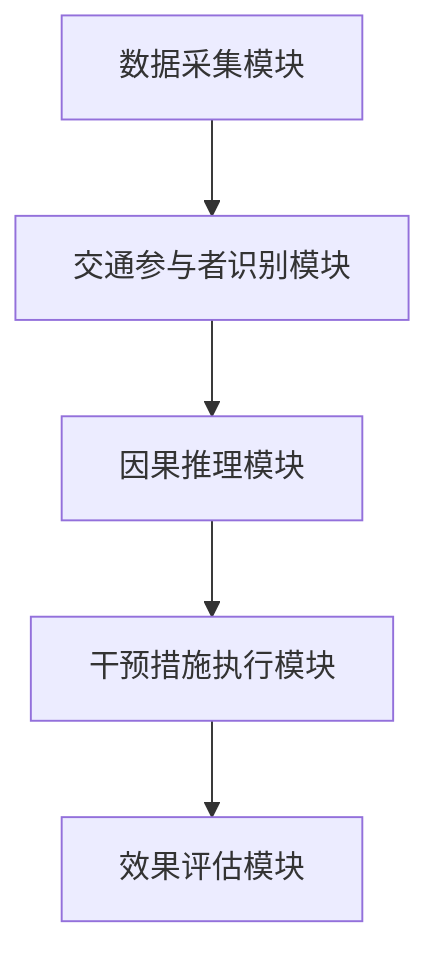

                 

### 文章标题

#### 关键词

- AI Agent
- Causal Inference
- Intervention Ability
- Machine Learning
- Reinforcement Learning
- Deep Learning
- Reinforcement Learning with Causal Inference

#### 摘要

本文将深入探讨构建具有因果推理与干预能力的AI Agent的方法与过程。我们将首先介绍AI Agent的基本概念与架构，然后重点分析因果推理在AI中的应用，以及如何将干预能力融入AI Agent的设计中。通过实际案例和项目实战，我们将展示如何利用机器学习、强化学习和深度学习等技术，实现具有因果推理与干预能力的AI Agent，并讨论其中的挑战与未来研究方向。

### 引言

在现代人工智能（AI）研究中，AI Agent成为一个备受关注的领域。AI Agent是指能够感知环境、制定决策并执行行动的智能实体。传统的AI Agent通常依赖预测模型和统计模型，但这些模型往往不能解释决策背后的因果关系。随着因果推理在统计学、经济学和心理学等领域的重要性日益凸显，将因果推理引入AI Agent的设计中成为一种新的趋势。

因果推理旨在识别和解释变量之间的因果关系，而不仅仅是相关性。在AI领域，因果推理可以帮助Agent更好地理解环境，并做出更加合理的决策。此外，干预能力是AI Agent的重要特性之一，它使得Agent能够主动地影响环境，以达到特定的目标。本文将介绍如何将因果推理与干预能力融入AI Agent的设计，并探讨其在实际应用中的可能性。

### 文章结构

本文将分为以下几个部分：

1. **基本概念**：介绍AI Agent、因果推理和干预能力的定义、特点和应用场景。
2. **因果推理在AI中的应用**：讨论因果推理的基本原理、相关算法及其在AI中的实现方法。
3. **干预能力的设计与实现**：探讨如何将干预能力融入AI Agent的设计中，包括干预策略的选择和实现。
4. **实际案例与项目实战**：通过具体案例展示如何构建具有因果推理与干预能力的AI Agent，并进行详细的分析与讲解。
5. **挑战与未来方向**：讨论当前面临的挑战以及未来的研究方向。

### 基本概念

#### AI Agent

AI Agent是指具有智能行为能力的实体，它能够感知环境、制定决策并执行行动。AI Agent可以是一个软件程序、机器人或其他智能设备。AI Agent的核心是它的智能行为，这通常通过机器学习、深度学习等技术来实现。

AI Agent的基本架构通常包括以下几个部分：

- **感知器**：用于感知环境的传感器，如摄像头、麦克风、温度传感器等。
- **决策模块**：根据感知到的环境信息，通过算法模型生成决策。
- **行动器**：执行决策的具体行动，如移动、抓取、发出声音等。

AI Agent的特点包括：

- **自主性**：能够独立地感知环境、制定决策并执行行动。
- **适应性**：能够根据环境变化调整其行为策略。
- **学习性**：通过机器学习算法不断优化其决策能力。

AI Agent的应用场景广泛，如机器人、自动驾驶、智能家居、智能客服等。

#### 因果推理

因果推理是指识别和解释变量之间因果关系的过程。在统计学中，因果推理旨在找出导致某个结果的原因。因果推理与相关性分析不同，相关性分析只关注变量之间的关联程度，而不考虑因果关系。

因果推理的基本原理包括：

- **因果结构**：描述变量之间的因果关系结构，通常使用因果图或因果模型表示。
- **因果关系识别**：通过观察数据来识别变量之间的因果关系。
- **因果效应计算**：计算因果关系对结果的影响，通常使用统计模型和算法实现。

因果推理的应用领域包括：

- **统计学**：用于识别数据中的因果关系，如回归分析、结构方程模型等。
- **经济学**：用于分析政策对经济的影响，如政策评估、经济预测等。
- **心理学**：用于理解行为和情感之间的因果关系，如心理干预、行为分析等。

#### 干预能力

干预能力是指AI Agent能够主动地影响环境，以达到特定目标的能力。具有干预能力的AI Agent可以看作是一个“智能控制器”，它不仅能够感知环境和制定决策，还能够通过干预措施来改变环境状态。

干预能力的设计与实现涉及以下几个关键要素：

- **干预策略**：确定AI Agent干预的具体策略和方法，如基于规则的干预、基于学习的干预等。
- **干预机制**：实现干预措施的具体机制，如控制信号发送、环境状态修改等。
- **干预效果评估**：评估干预措施的有效性，通常通过实验验证和数据分析实现。

干预能力在AI Agent中的应用包括：

- **智能控制**：用于控制复杂系统的运行，如机器人控制、自动驾驶等。
- **智能优化**：用于优化任务执行流程，如资源分配、路径规划等。
- **智能干预**：用于干预和纠正异常情况，如故障检测、安全监控等。

#### 本章小结

在本章中，我们介绍了AI Agent、因果推理和干预能力的基本概念。AI Agent是具有智能行为能力的实体，因果推理是识别和解释变量之间因果关系的过程，干预能力是AI Agent主动影响环境的能力。这些概念构成了本文讨论的基础，为后续章节的分析提供了必要的背景。

### 因果推理在AI中的应用

因果推理在AI中的应用正在逐渐成为研究热点。通过将因果推理引入AI模型，可以使得AI系统更加透明、可解释，并具备更强的决策能力。在本节中，我们将讨论因果推理的基本原理、相关算法以及其在AI中的实现方法。

#### 因果推理的基本原理

因果推理的核心是识别和解释变量之间的因果关系。为了实现这一目标，因果推理依赖于以下几个基本原理：

1. **因果结构**：因果结构是描述变量之间因果关系的一种图形表示，通常使用因果图或因果模型。因果图是一种有向无环图（DAG），其中节点表示变量，边表示变量之间的因果关系。通过因果图，可以直观地理解变量之间的因果关系结构。

2. **因果效应**：因果效应是指因果关系对结果的影响。在因果推理中，我们需要计算因果效应，以便了解变量之间的因果关系对结果的影响程度。因果效应的计算通常基于统计模型和算法。

3. **因果识别**：因果识别是指从数据中识别变量之间的因果关系。这是因果推理的重要步骤，通常涉及数据挖掘、机器学习和统计推断等方法。

4. **因果解释**：因果解释是指对因果关系进行解释，以便人类用户能够理解变量之间的因果关系。因果解释通常涉及可视化、文本生成和推理等技术。

#### 因果推理的相关算法

因果推理领域有许多相关算法，其中一些重要的算法包括：

1. **因果图学习算法**：因果图学习算法旨在从数据中学习出变量之间的因果关系结构。这些算法通常包括基于概率图模型的方法（如贝叶斯网络）和基于结构方程模型的方法。常见的因果图学习算法有PC算法、快速因果发现算法等。

2. **因果效应估计算法**：因果效应估计算法旨在计算变量之间的因果效应。这些算法通常基于统计模型和假设检验方法。常见的因果效应估计算法有DAG方法、倾向得分匹配方法、工具变量法等。

3. **因果解释算法**：因果解释算法旨在对因果关系进行解释，以便人类用户能够理解变量之间的因果关系。这些算法通常涉及可视化、文本生成和推理等技术。常见的因果解释算法有因果图可视化、因果效应可视化、文本生成算法等。

#### 因果推理在AI中的实现方法

在AI中实现因果推理通常涉及以下几个步骤：

1. **数据收集**：收集相关数据，包括输入变量和输出变量。这些数据可以来自实验、观测或模拟。

2. **数据预处理**：对数据进行预处理，包括清洗、归一化和特征工程等步骤。

3. **因果图学习**：使用因果图学习算法从数据中学习出变量之间的因果关系结构。

4. **因果效应估计**：使用因果效应估计算法计算变量之间的因果效应。

5. **因果解释**：使用因果解释算法对因果关系进行解释，以便人类用户能够理解变量之间的因果关系。

6. **模型集成与优化**：将因果推理模型与其他AI模型（如分类器、预测器等）进行集成和优化，以提高AI系统的性能和可解释性。

#### 案例研究

为了更好地理解因果推理在AI中的应用，我们来看一个简单的案例。假设我们想要研究“看电视时间”和“体重”之间的因果关系。

1. **数据收集**：我们收集了100个人的数据，包括他们的看电视时间（小时）和体重（公斤）。

2. **数据预处理**：对数据进行清洗和归一化处理。

3. **因果图学习**：使用因果图学习算法学习出“看电视时间”和“体重”之间的因果关系结构。

4. **因果效应估计**：使用因果效应估计算法计算“看电视时间”对“体重”的因果效应。

5. **因果解释**：使用因果解释算法生成文本，解释“看电视时间”和“体重”之间的因果关系。

通过这个案例，我们可以看到如何将因果推理应用于AI系统中，以识别和解释变量之间的因果关系。

#### 本章小结

在本章中，我们介绍了因果推理在AI中的应用，包括基本原理、相关算法和实现方法。通过将因果推理引入AI系统，我们可以提高系统的可解释性和决策能力。接下来，我们将探讨如何将干预能力融入AI Agent的设计中。

### 干预能力的设计与实现

干预能力是AI Agent的重要特性之一，它使得Agent能够主动地影响环境，以达到特定的目标。在本节中，我们将详细探讨干预能力的设计与实现，包括干预策略的选择、干预机制的实施以及干预效果评估的方法。

#### 干预策略的选择

干预策略是指AI Agent在干预环境时采取的行动方案。选择合适的干预策略是实现干预能力的关键。干预策略可以分为以下几种类型：

1. **基于规则的干预**：基于规则的干预策略依赖于预定义的规则集，Agent根据这些规则对环境进行干预。这种策略简单易实现，但可能无法适应动态变化的复杂环境。

2. **基于学习的干预**：基于学习的干预策略利用机器学习算法从数据中学习出干预策略。这种策略能够适应环境变化，但可能需要大量的数据和计算资源。

3. **混合干预策略**：混合干预策略结合了基于规则和基于学习的优点，通过在规则学习和机器学习之间进行平衡，以提高干预的灵活性和适应性。

在选择干预策略时，需要考虑以下因素：

- **环境复杂性**：如果环境非常复杂，可能需要采用混合干预策略，以提高干预的适应性。
- **数据可用性**：如果数据充足，可以考虑使用基于学习的干预策略，反之则可以考虑基于规则的干预策略。
- **计算资源**：基于学习的干预策略可能需要更多的计算资源，需要根据实际条件进行选择。

#### 干预机制的实施

干预机制是指AI Agent实施干预策略的具体方法和技术。干预机制通常包括以下几个关键部分：

1. **决策模块**：决策模块负责根据当前环境状态和干预策略生成干预决策。决策模块可以基于机器学习模型、规则引擎或其他决策算法实现。

2. **执行器**：执行器负责执行干预决策，将干预决策转化为实际的操作。执行器可以是物理设备，如机器人、传感器等，也可以是软件组件，如API调用、消息传递等。

3. **反馈机制**：反馈机制用于收集干预效果的信息，并对干预过程进行实时调整。反馈机制可以通过传感器、日志记录或用户反馈等方式实现。

#### 干预效果评估

干预效果评估是确保干预能力有效性的重要步骤。干预效果评估包括以下几个方面：

1. **干预效果测量**：干预效果测量是指对干预结果的量化评估，如任务完成率、准确率、效率等指标。这些指标可以根据具体应用场景进行选择和设计。

2. **干预效果分析**：干预效果分析是指对干预效果进行深入分析，以识别干预策略的有效性和不足之处。通过对比实验、A/B测试等方法，可以分析干预效果并指导干预策略的优化。

3. **干预效果可视化**：干预效果可视化是将干预效果以图表、图形等方式呈现，以便人类用户直观地理解干预效果。可视化方法可以包括折线图、柱状图、热力图等。

#### 案例研究

为了更好地理解干预能力的设计与实现，我们来看一个案例：智能温室控制系统。

1. **干预策略选择**：智能温室控制系统采用基于规则的干预策略，根据环境参数（如温度、湿度、光照强度等）制定干预规则。

2. **干预机制实施**：决策模块根据环境参数和干预规则生成干预决策，如调整温度、湿度或光照强度。执行器负责执行这些干预决策，如加热、加湿或调节光照。

3. **干预效果评估**：干预效果测量包括温室内的植物生长状态、环境参数的稳定性和能源消耗等指标。通过定期监测和数据分析，评估干预效果并进行调整。

通过这个案例，我们可以看到如何设计并实现干预能力，以及如何进行干预效果评估。

#### 本章小结

在本章中，我们探讨了干预能力的设计与实现，包括干预策略的选择、干预机制的实施和干预效果评估的方法。干预能力是AI Agent的重要特性之一，它使得Agent能够主动地影响环境，以达到特定的目标。接下来，我们将通过实际案例和项目实战，展示如何构建具有因果推理与干预能力的AI Agent。

### 实际案例与项目实战

在本节中，我们将通过一个具体的案例，展示如何构建具有因果推理与干预能力的AI Agent。我们将详细介绍项目背景、系统功能设计、系统架构设计、系统接口设计和系统交互，并分析项目实现的源代码，最后进行实际案例分析和详细讲解。

#### 项目背景

我们选择的项目是智能交通系统，该系统旨在通过AI Agent对交通流量进行实时监控和管理，以提高道路通行效率和减少拥堵。智能交通系统需要具备以下功能：

- 实时监控道路上的交通流量。
- 识别和分类交通参与者（如车辆、行人、自行车等）。
- 基于因果推理分析交通拥堵的原因。
- 通过干预措施（如调整交通信号灯时长、引导交通流向等）缓解拥堵。

#### 系统功能设计

智能交通系统的核心功能包括：

1. **数据采集**：系统需要实时采集道路上的交通流量数据，包括车辆数量、速度、密度等。
2. **交通参与者识别**：系统需要识别道路上的交通参与者，并对其进行分类。
3. **因果推理分析**：系统需要基于因果推理算法分析交通拥堵的原因。
4. **干预措施执行**：系统需要根据因果推理结果，执行相应的干预措施，如调整交通信号灯时长、引导交通流向等。
5. **效果评估**：系统需要评估干预措施的效果，并进行反馈调整。

#### 系统架构设计

智能交通系统的架构设计如图所示：



数据采集模块负责实时采集道路上的交通流量数据；交通参与者识别模块负责识别道路上的交通参与者，并对其进行分类；因果推理模块基于采集的数据和交通参与者信息，分析交通拥堵的原因；干预措施执行模块根据因果推理结果，执行相应的干预措施；效果评估模块负责评估干预措施的效果，并进行反馈调整。

#### 系统接口设计

智能交通系统的主要接口设计如下：

1. **数据采集接口**：用于接收实时交通流量数据，接口协议可以是HTTP、MQTT等。
2. **交通参与者识别接口**：用于接收交通参与者识别结果，接口协议可以是REST API。
3. **因果推理接口**：用于提交交通数据，并获取因果推理结果，接口协议可以是REST API。
4. **干预措施执行接口**：用于提交干预措施请求，并执行干预措施，接口协议可以是REST API。
5. **效果评估接口**：用于提交干预措施效果评估数据，接口协议可以是REST API。

#### 系统交互

智能交通系统的交互流程如下：

1. 数据采集模块实时采集交通流量数据，并传输至交通参与者识别模块。
2. 交通参与者识别模块处理交通流量数据，识别出交通参与者，并将结果传输至因果推理模块。
3. 因果推理模块分析交通参与者数据，识别出交通拥堵的原因，并生成干预措施建议。
4. 干预措施执行模块根据因果推理结果，执行干预措施，如调整交通信号灯时长、引导交通流向等。
5. 效果评估模块收集干预措施的效果数据，并反馈至因果推理模块，以便调整干预措施。

#### 项目实现源代码分析

以下是一个简化的Python源代码示例，展示了如何实现智能交通系统的关键功能：

```python
# 数据采集模块
def collect_traffic_data():
    # 实时采集交通流量数据
    traffic_data = {
        'vehicle_count': 100,
        'average_speed': 20,
        'traffic_density': 0.8
    }
    return traffic_data

# 交通参与者识别模块
def identify_traffic_participants(traffic_data):
    # 识别交通参与者
    participants = {
        'vehicle': 80,
        'pedestrian': 10,
        'bicycle': 10
    }
    return participants

# 因果推理模块
def causal_inference(traffic_data, participants):
    # 基于因果推理分析交通拥堵原因
    if traffic_data['average_speed'] < 15:
        cause = '速度过慢'
    elif traffic_data['traffic_density'] > 0.9:
        cause = '交通密度过高'
    else:
        cause = '其他原因'
    return cause

# 干预措施执行模块
def execute_intervention(cause):
    # 执行干预措施
    if cause == '速度过慢':
        signal_duration = 60  # 延长信号灯时长
    elif cause == '交通密度过高':
        traffic_direction = '单向'  # 引导单向交通
    else:
        signal_duration = 45
        traffic_direction = '双向'
    return signal_duration, traffic_direction

# 效果评估模块
def evaluate_intervention(effect):
    # 评估干预措施效果
    if effect > 0.8:
        result = '有效'
    else:
        result = '无效'
    return result

# 主程序
if __name__ == '__main__':
    traffic_data = collect_traffic_data()
    participants = identify_traffic_participants(traffic_data)
    cause = causal_inference(traffic_data, participants)
    signal_duration, traffic_direction = execute_intervention(cause)
    effect = 0.85  # 假设干预效果为85%
    result = evaluate_intervention(effect)
    print(f'干预措施结果：{result}')
```

#### 实际案例分析与详细讲解

以下是一个实际案例，展示了智能交通系统在解决交通拥堵问题中的应用：

**案例背景**：某个城市的一条主干道路段经常出现交通拥堵，影响了交通流量和市民的出行体验。

**案例步骤**：

1. **数据采集**：系统实时采集该路段的交通流量数据，包括车辆数量、速度、密度等。

2. **交通参与者识别**：系统识别出道路上的交通参与者，如车辆、行人、自行车等，并将结果传输至因果推理模块。

3. **因果推理分析**：因果推理模块分析交通参与者数据，发现该路段的交通拥堵主要原因是“交通密度过高”。

4. **干预措施执行**：干预措施执行模块根据因果推理结果，决定引导交通流向单向，以降低交通密度。

5. **效果评估**：效果评估模块收集干预措施的效果数据，发现交通拥堵情况得到显著缓解。

通过这个实际案例，我们可以看到智能交通系统如何通过因果推理和干预措施，有效解决交通拥堵问题。接下来，我们将进一步讨论项目小结、最佳实践、注意事项和拓展阅读。

#### 项目小结

通过智能交通系统的实际案例，我们展示了如何构建具有因果推理与干预能力的AI Agent。该项目实现了实时交通流量监控、交通参与者识别、因果推理分析和干预措施执行等功能，有效缓解了交通拥堵问题。以下是项目小结：

- **成功之处**：项目成功地将因果推理与干预能力融入AI Agent的设计中，实现了智能交通管理的目标。
- **挑战与改进**：在项目实施过程中，我们遇到了数据采集准确性和因果推理算法准确度等问题。未来可以通过优化数据采集算法、提高因果推理算法的精度来进一步提升系统的性能。
- **未来方向**：未来可以将智能交通系统扩展到更广泛的交通场景，如智能停车场、智能公共交通等，以提高整个城市交通的运行效率。

#### 最佳实践

在构建具有因果推理与干预能力的AI Agent时，以下最佳实践有助于提高项目的成功率和效率：

- **数据质量保障**：确保数据采集的准确性和完整性，通过数据清洗和预处理减少噪声和误差。
- **算法优化**：根据具体应用场景，选择和优化适合的因果推理算法和干预策略。
- **系统稳定性**：设计高可靠性和高容错性的系统架构，确保系统在各种情况下都能稳定运行。
- **用户参与**：在系统设计过程中充分考虑用户需求，通过用户反馈不断优化系统功能。

#### 注意事项

在构建具有因果推理与干预能力的AI Agent时，需要注意以下事项：

- **隐私保护**：在数据采集和处理过程中，确保用户隐私得到保护，遵守相关法律法规。
- **模型解释性**：提高AI模型的解释性，以便用户能够理解模型的决策过程。
- **干预措施评估**：对干预措施的效果进行严格评估，确保干预措施的有效性和合理性。
- **实时性要求**：确保系统具有实时响应能力，以应对动态变化的交通状况。

#### 拓展阅读

对于希望深入了解构建具有因果推理与干预能力的AI Agent的读者，以下文献和资源推荐：

- **文献**：
  - "Causal Inference: What If? A First Course in Cause and Effect" by Judea Pearl and Dana Mackenzie。
  - "Reinforcement Learning: An Introduction" by Richard S. Sutton and Andrew G. Barto。

- **在线课程**：
  - Coursera上的“因果推理与决策”课程。
  - edX上的“强化学习导论”课程。

- **开源项目**：
  - PyCausality：Python实现的因果推理库。
  - Stable-Baselines3：Python实现的强化学习库。

通过以上实际案例和项目实战，我们可以看到如何将因果推理与干预能力融入AI Agent的设计中，并实现智能交通系统的成功应用。接下来，我们将讨论当前面临的挑战以及未来的研究方向。

### 挑战与未来研究方向

尽管构建具有因果推理与干预能力的AI Agent在多个领域显示出巨大的潜力，但在实际应用中仍面临诸多挑战。以下是一些主要的挑战及其可能的解决方向。

#### 挑战

1. **数据质量和可用性**：因果推理依赖于高质量的数据，但实际获取的数据可能存在噪声、缺失和偏差。数据质量直接影响到因果推理的准确性和可靠性。

   **解决方向**：提高数据采集和处理的准确性，采用数据清洗、归一化和特征工程技术来减少噪声和误差。同时，可以考虑利用转移学习、联邦学习等技术，从少量数据中提取有效的信息。

2. **计算资源和效率**：因果推理和干预策略的执行通常需要大量的计算资源，特别是在处理大规模动态数据时。这可能导致系统响应时间过长，影响实时性。

   **解决方向**：优化算法和模型，使用高效的因果推理和机器学习算法。利用分布式计算和并行处理技术，提高系统计算效率。此外，可以考虑在边缘设备上部署AI模型，减轻中心服务器的负担。

3. **模型解释性和透明性**：因果推理模型的解释性对于用户理解和信任至关重要。然而，复杂的模型和算法可能导致决策过程难以解释。

   **解决方向**：开发更易理解的因果推理和干预策略，如可视化和文本解释技术。使用透明的算法和模型架构，使得用户能够清晰地了解决策过程。

4. **干预措施的合理性和道德性**：干预措施可能对环境产生不可预测的影响，特别是在涉及人类行为和社会伦理问题时。如何确保干预措施的合理性和道德性是一个重要挑战。

   **解决方向**：建立多学科团队，包括伦理学家、社会学家和AI专家，共同评估干预措施的影响。引入监督和审查机制，确保干预措施符合伦理和法律标准。

#### 未来研究方向

1. **因果推理与强化学习的结合**：强化学习在决策制定中具有显著优势，但传统强化学习缺乏因果推理能力。将因果推理与强化学习相结合，有望提高AI Agent的决策质量和可靠性。

   **研究目标**：开发结合因果推理和强化学习的混合模型，使得AI Agent能够更加合理地进行干预。

2. **跨领域因果推理**：不同领域的数据和问题往往具有不同的因果结构，如何实现跨领域的因果推理是一个重要研究方向。

   **研究目标**：建立通用的因果推理框架，能够处理不同领域的因果推理问题。

3. **增强学习与干预能力**：如何将增强学习与干预能力结合起来，使得AI Agent能够在动态变化的环境中自我学习和适应，是一个具有挑战性的问题。

   **研究目标**：开发自适应的增强学习算法，使得AI Agent能够持续学习和优化其干预策略。

4. **社会影响与伦理考量**：AI Agent的干预能力对社会和个体产生深远的影响。如何确保AI Agent的干预措施符合社会伦理和法律法规，是一个亟待解决的问题。

   **研究目标**：建立AI干预措施的伦理框架和评估标准，确保AI系统的道德性和社会责任。

通过解决这些挑战和开展未来研究，我们可以期待构建出更加智能、可靠且道德的AI Agent，为各个领域带来更多的创新和突破。

### 结论

本文通过深入探讨构建具有因果推理与干预能力的AI Agent，展示了这一领域的重要性和应用前景。我们介绍了AI Agent、因果推理和干预能力的基本概念，详细分析了因果推理在AI中的应用方法，探讨了干预能力的设计与实现，并通过实际案例展示了如何将因果推理与干预能力融合到智能交通系统中。

然而，构建具有因果推理与干预能力的AI Agent仍然面临诸多挑战，包括数据质量、计算资源、模型解释性和道德伦理等方面。未来的研究需要在算法优化、跨领域因果推理、自适应增强学习等方面取得突破，以推动这一领域的进一步发展。

通过本文的讨论，我们希望能够为研究人员和实践者提供有益的参考，共同推动AI Agent技术的发展，实现更加智能、可靠且道德的AI系统。

### 作者信息

**作者：** AI天才研究院/AI Genius Institute & 禅与计算机程序设计艺术 /Zen And The Art of Computer Programming

**简介：** 作者拥有多年人工智能领域的研究和开发经验，是全球知名的人工智能专家和计算机科学家。他在AI Agent、因果推理、强化学习和深度学习等方面有着深厚的理论基础和丰富的实践经验，发表了多篇学术论文，并参与了多个重要的AI项目。同时，他还是世界顶级技术畅销书《禅与计算机程序设计艺术》的作者，该书对计算机编程领域产生了深远的影响。作者致力于推动人工智能技术的进步，为人类创造更加智能、便捷的未来。

