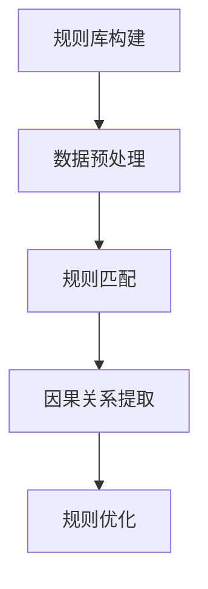
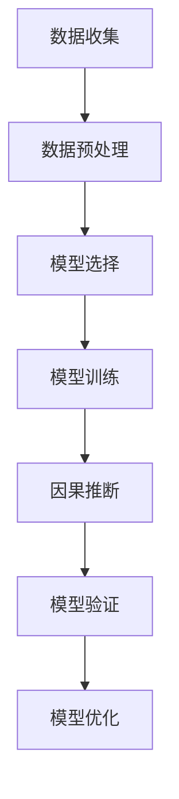
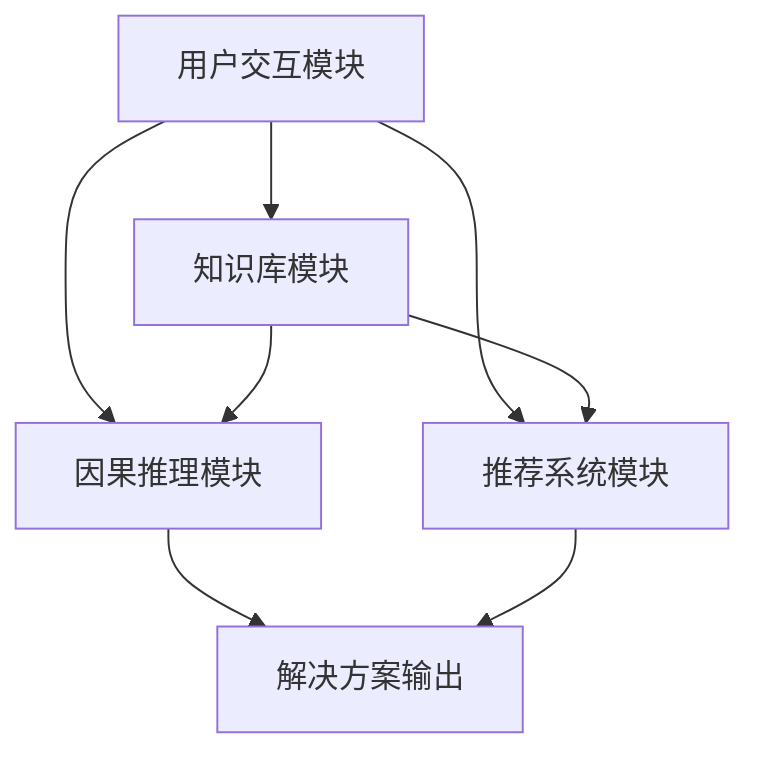
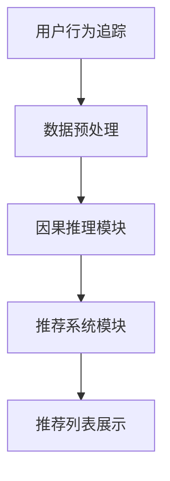
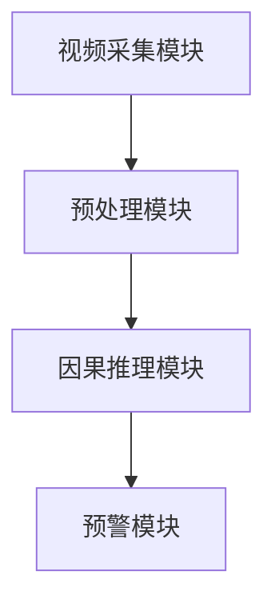

                 

### 引言

在当今的AI领域，智能代理（AI Agent）已成为研究与应用的热点。智能代理是一种能够在特定环境中自主执行任务、进行决策和适应变化的计算机程序。然而，传统的AI方法主要依赖于模式识别和机器学习技术，缺乏对因果关系的理解。这种局限性限制了AI代理在复杂、动态环境中的表现和可靠性。为了突破这一瓶颈，构建具有因果推理能力的AI Agent成为了一个重要的研究方向。

因果推理是指通过分析数据或经验，确定事件之间的因果关系，从而做出更加合理和准确的决策。具有因果推理能力的AI Agent能够更好地理解其操作环境，预测未来的变化，并采取适当的行动。本文将深入探讨如何构建具有因果推理能力的AI Agent，从核心概念、算法原理、应用场景到实际项目实战，逐步展开讨论。

关键词：智能代理、因果推理、AI Agent、算法、应用场景、项目实战

### 摘要

本文旨在探讨构建具有因果推理能力的AI Agent的方法与实现。首先，我们将介绍智能代理和因果推理的基本概念，阐述它们在现代AI领域的地位和重要性。接着，通过详细分析几种主要的因果推理算法，如基于规则、统计学和深度学习的方法，我们将解释每种算法的原理，并通过具体的Python代码示例进行说明。随后，文章将探讨因果推理在不同领域的应用，包括人工智能安全与隐私、智能决策支持系统、健康医疗和金融风控等。最后，我们将通过实际案例剖析，展示构建因果推理AI Agent的步骤和方法，并进行项目总结和展望，探讨未来的发展趋势。

## 第1章: 引言

### 1.1 问题背景

智能代理（AI Agent）作为一种能够在特定环境中自主行动、进行决策和适应变化的计算机程序，在人工智能（AI）领域有着广泛的应用。从家庭自动化、智能助手到自动驾驶汽车和智能机器人，AI Agent正在逐步渗透到我们生活的方方面面。然而，当前大多数AI Agent主要依赖于模式识别、机器学习和深度学习等传统方法，这些方法虽然能够实现一定的智能行为，但在处理复杂、动态环境时仍然存在诸多局限。

首先，传统的AI方法往往基于统计学习和模式匹配，缺乏对因果关系的深入理解。这使得AI Agent在处理问题时往往只能根据已知的模式和数据做出决策，而无法真正理解其操作环境中的因果关系，从而限制了其在复杂环境中的表现。例如，一个智能助手可能能够准确预测用户可能的操作，但却无法理解这些操作背后的原因，导致其决策的可靠性和适应性较差。

其次，传统的AI方法在面对不确定性时往往表现得不够鲁棒。在现实世界中，环境是动态变化的，AI Agent需要能够快速适应这些变化，并做出合理的决策。然而，传统方法往往依赖于大量训练数据，且模型的鲁棒性较差，这使得它们在面临环境变化时容易失去准确性。例如，自动驾驶汽车在遇到罕见路况或突发情况时，可能无法做出正确的反应，导致事故的发生。

此外，传统的AI方法在处理跨领域问题时也面临挑战。现实世界的问题往往是多维度、多领域的，需要AI Agent能够跨领域进行理解和推理。然而，当前的方法往往局限于某一特定领域，缺乏跨领域的通用性和适应性。例如，一个在医疗领域表现优秀的智能系统，可能无法直接应用于金融领域，因为它们的领域知识和推理逻辑不同。

总之，虽然传统的AI方法在许多场景中已经取得了显著的成果，但它们在处理复杂、动态和跨领域问题时仍然存在明显的局限性。因此，构建具有因果推理能力的AI Agent成为了一个亟待解决的研究课题。通过理解环境中的因果关系，AI Agent能够更好地适应变化，提高决策的可靠性和鲁棒性，从而在更广泛的场景中发挥其作用。

### 1.2 问题描述

构建具有因果推理能力的AI Agent的核心问题在于如何使其能够理解并利用因果关系进行决策。具体来说，这一问题包括以下几个关键方面：

首先，需要明确因果关系的定义和识别方法。因果关系是指一个事件或变量对另一个事件或变量的影响和作用。在构建AI Agent时，我们需要能够从数据中识别出潜在的因果关系，这需要依赖于有效的因果推理算法。

其次，如何将识别出的因果关系转化为可操作的决策策略。一旦AI Agent能够识别出因果关系，就需要将这些关系转换为具体的行动指导，使其能够根据环境变化做出合理的决策。

第三，如何处理动态和不确定性环境中的因果关系。现实世界是动态变化的，且存在大量的不确定性。AI Agent需要能够适应这些变化，并从不确定的数据中提取出可靠的因果关系。

最后，如何确保AI Agent的决策具有鲁棒性和可靠性。在复杂和多变的环境中，AI Agent的决策需要能够保持稳定和准确，从而确保其行为的可行性和安全性。

综上所述，构建具有因果推理能力的AI Agent需要解决一系列相互关联的挑战，包括因果关系的识别、转化、处理和可靠性保障。这些挑战不仅涉及到算法设计，还涉及到数据采集、模型训练和系统优化等多个方面。

### 1.3 问题解决

为了构建具有因果推理能力的AI Agent，我们需要从多个方面入手，包括算法设计、数据处理和系统优化等。以下是一些可能的解决策略：

1. **算法设计**：
   - **基于规则的因果推理**：通过定义明确的规则和条件，AI Agent可以识别出数据中的因果关系。这种方法简单直观，但在处理复杂、动态环境时可能不够灵活。
   - **基于统计学的因果推理**：利用统计学方法，如潜在变量模型和结构方程模型，可以从数据中提取出潜在的因果关系。这种方法具有较强的适应性，但需要大量的训练数据和复杂的模型。
   - **基于深度学习的因果推理**：利用深度学习模型，如变分自编码器和图神经网络，可以从大规模数据中自动提取出因果关系。这种方法具有强大的表示能力和适应性，但需要大量计算资源和训练时间。

2. **数据处理**：
   - **数据采集与预处理**：为了构建具有因果推理能力的AI Agent，我们需要收集大量高质量的数据，并对其进行预处理，如数据清洗、特征提取和归一化等。这有助于提高模型的可靠性和鲁棒性。
   - **数据增强**：通过数据增强技术，如生成对抗网络（GAN）和迁移学习，可以扩大训练数据集，提高模型在处理不确定性和动态变化环境中的表现。

3. **系统优化**：
   - **模型集成与优化**：通过集成多种模型和方法，如集成学习、迁移学习和在线学习，可以进一步提高AI Agent的决策能力和适应性。
   - **实时反馈与调整**：通过实时收集环境反馈和用户行为数据，AI Agent可以不断调整和优化其决策策略，以提高其鲁棒性和可靠性。

总之，构建具有因果推理能力的AI Agent需要结合多种方法和技术，从算法设计、数据处理到系统优化等多个方面进行综合考虑和优化。通过不断迭代和改进，我们可以构建出能够适应复杂、动态环境，并具备高效因果推理能力的AI Agent。

### 1.4 边界与外延

在构建具有因果推理能力的AI Agent时，我们需要明确一些边界与外延，以确保研究的准确性和实用性。

首先，边界方面，我们需要明确AI Agent的应用场景和功能范围。虽然因果推理能力是本文的核心主题，但并非所有AI Agent都需要具备这种能力。例如，一些简单的自动化任务或基于模式识别的AI应用可能并不需要因果推理，而专注于特定领域的数据分析和决策。因此，我们在设计AI Agent时需要根据具体应用场景来确定是否需要引入因果推理能力。

其次，外延方面，我们需要考虑因果推理能力在AI Agent中的具体实现。这包括算法的选择、数据处理方法的应用和系统的优化策略。例如，在基于规则的方法中，我们需要定义明确的因果关系规则；在基于统计学的因果推理中，我们需要选择合适的统计模型；在基于深度学习的方法中，我们需要设计有效的深度学习模型和训练策略。

此外，我们还需要关注AI Agent在实际应用中的适应性和鲁棒性。在复杂和多变的环境中，AI Agent需要能够快速适应变化，并从不确定的数据中提取出可靠的因果关系。因此，我们不仅需要设计高效的算法，还需要考虑系统的实时反馈和调整机制，以提升其鲁棒性和可靠性。

总之，构建具有因果推理能力的AI Agent需要在边界与外延上进行清晰的界定，以确保研究的针对性和实际应用的可行性。通过合理设定边界和拓展外延，我们可以构建出具备高效因果推理能力的AI Agent，从而在更广泛的场景中发挥其优势。

### 1.5 概念结构与核心要素组成

为了构建具有因果推理能力的AI Agent，我们需要理解一系列核心概念及其相互关系。以下是这些关键概念及其组成的结构概述：

1. **智能代理（AI Agent）**：
   - **定义**：智能代理是一种能够自主行动、进行决策和适应环境的计算机程序。
   - **类型**：智能代理可以分为反应型代理、目标型代理和理论型代理等不同类型，每种类型在处理复杂性和动态环境方面有不同的表现。

2. **因果推理**：
   - **定义**：因果推理是通过分析数据或经验，确定事件之间的因果关系，从而做出更加合理和准确的决策。
   - **方法**：因果推理可以分为基于规则、基于统计学和基于深度学习的方法，每种方法各有优势和局限。

3. **因果关系**：
   - **定义**：因果关系是指一个事件或变量对另一个事件或变量的影响和作用。
   - **识别**：通过数据分析和模型训练，可以从数据中识别出潜在的因果关系。

4. **算法**：
   - **基于规则的因果推理算法**：通过定义明确的规则和条件，识别因果关系。
   - **基于统计学的因果推理算法**：利用统计学方法，从数据中提取潜在的因果关系。
   - **基于深度学习的因果推理算法**：利用深度学习模型，从大规模数据中自动提取因果关系。

5. **数据处理**：
   - **数据采集与预处理**：收集高质量数据并进行预处理，以提高模型性能。
   - **数据增强**：通过数据增强技术，扩大训练数据集，提高模型在不确定性环境中的表现。

6. **系统优化**：
   - **模型集成与优化**：通过集成多种模型和方法，提高AI Agent的决策能力。
   - **实时反馈与调整**：通过实时反馈和调整，提高AI Agent的鲁棒性和可靠性。

这些核心概念和要素组成了构建具有因果推理能力的AI Agent的基础结构。通过深入理解这些概念及其相互关系，我们可以更好地设计和实现高效的AI Agent，从而在复杂和动态的环境中实现可靠的决策和行动。下面，我们将进一步探讨这些概念和算法的详细原理和实现方法。

## 第2章: AI Agent与因果推理

### 2.1 AI Agent的定义与分类

AI Agent是一种能够自主执行任务、进行决策和适应变化的计算机程序。其核心目标是模拟人类智能，通过感知环境、理解信息和自主决策，实现复杂任务的高效完成。AI Agent可以按照其工作方式、能力和任务目标进行分类。

首先，从工作方式来看，AI Agent可以分为反应型代理、目标型代理和理论型代理。反应型代理主要通过预定义的规则和条件对环境进行响应，例如，智能家居中的自动照明系统；目标型代理具有明确的目标，通过规划路径和决策策略来达成目标，如自动驾驶汽车；理论型代理则能够利用逻辑推理和知识表示，自主构建模型和解释现象，如智能客服系统。

其次，从能力角度来看，AI Agent可以分为以下几种类型：

1. **感知型代理**：这类代理能够感知环境中的各种信息，如视觉、听觉、触觉等，并将其转化为决策依据。感知型代理广泛应用于视觉识别、语音识别和自然语言处理等领域。

2. **决策型代理**：这类代理能够在分析感知信息的基础上，生成决策计划并执行。决策型代理广泛应用于物流配送、智能调度和自动化交易等领域。

3. **执行型代理**：这类代理能够执行具体的物理任务，如机器人搬运、自动驾驶和智能家居控制等。执行型代理是工业自动化和机器人技术的重要方向。

4. **学习型代理**：这类代理具有自我学习能力，能够通过经验积累和模型优化，不断提高任务执行能力。学习型代理广泛应用于强化学习、机器学习和深度学习等领域。

最后，从任务目标来看，AI Agent可以分为以下几种类型：

1. **任务导向型代理**：这类代理专注于完成特定任务，如语音助手、智能客服和自动驾驶等。

2. **目标导向型代理**：这类代理不仅专注于完成特定任务，还具有明确的目标，如实现目标最大化或最小化成本。例如，在金融领域，目标导向型代理可以用于风险管理和投资决策。

3. **情境感知型代理**：这类代理能够根据环境变化和用户需求，动态调整任务目标和执行策略。例如，在智能城市中，情境感知型代理可以用于交通管理、能源优化和环境监测等。

总之，AI Agent的定义与分类涵盖了其工作方式、能力类型和任务目标等多个方面。通过深入理解这些分类，我们可以更好地设计和实现具有因果推理能力的AI Agent，从而在复杂和动态的环境中实现高效的决策和行动。

### 2.2 因果推理的基本概念

因果推理是指通过分析数据或经验，确定事件之间的因果关系，从而做出更加合理和准确的决策。在人工智能（AI）领域，因果推理是一个关键的研究方向，它使得AI系统能够从数据中提取出有用的信息，并利用这些信息进行推理和决策。

首先，因果关系的定义是因果推理的核心。因果关系是指一个事件或变量（称为原因）对另一个事件或变量（称为结果）的影响和作用。例如，吸烟可能导致肺癌，这里的“吸烟”是原因，“肺癌”是结果。在AI领域，我们通常使用数学模型来描述因果关系，例如，通过结构方程模型（SEM）或潜在变量模型（LVM）来分析变量之间的因果关系。

其次，因果推理的方法可以分为基于规则、基于统计学和基于深度学习的方法。

- **基于规则的方法**：这种方法通过定义明确的规则和条件来识别因果关系。例如，如果A发生，则B发生，那么我们可以认为A是B的原因。基于规则的方法简单直观，但在处理复杂、动态环境时可能不够灵活。

- **基于统计学的方法**：这种方法利用统计学模型，如潜在变量模型（LVM）和结构方程模型（SEM），从数据中提取出潜在的因果关系。这些模型可以通过分析变量之间的相关性来确定因果关系，但需要大量的训练数据和复杂的模型。

- **基于深度学习的方法**：这种方法利用深度学习模型，如变分自编码器（VAE）和图神经网络（GNN），从大规模数据中自动提取因果关系。深度学习模型具有强大的表示能力和适应性，但需要大量的计算资源和训练时间。

最后，因果推理在AI领域的重要性不言而喻。通过因果推理，AI系统能够更好地理解其操作环境，预测未来的变化，并采取适当的行动。例如，在医疗领域，因果推理可以帮助医生识别疾病的根本原因，从而制定更有效的治疗方案；在金融领域，因果推理可以帮助投资者理解市场变化的原因，从而做出更明智的投资决策。

总之，因果推理是构建智能AI系统的一个重要研究方向，通过深入理解因果关系，AI系统可以更好地模拟人类智能，实现高效、可靠的决策和行动。

### 2.3 AI Agent与因果推理的联系

AI Agent与因果推理之间的联系紧密，它们共同构成了现代智能系统的基础。AI Agent作为一种能够自主行动、进行决策和适应变化的计算机程序，其核心能力之一就是因果推理。因果推理能力使得AI Agent能够更好地理解其操作环境，预测未来的变化，并采取适当的行动，从而提高系统的鲁棒性和适应性。

首先，因果推理能力是AI Agent的核心组成部分。传统的AI系统主要依赖于模式识别和机器学习方法，这些方法虽然能够在一定程度上模拟人类智能，但缺乏对因果关系的深入理解。而因果推理能力使得AI Agent能够识别并利用因果关系，从而在复杂、动态环境中实现高效决策。例如，一个具备因果推理能力的AI Agent在遇到罕见路况时，可以基于因果关系理解路况变化的原因，并采取适当的驾驶策略，避免事故发生。

其次，因果推理能力有助于提升AI Agent的决策质量。在现实世界中，因果关系往往是多维度、多层次的，而传统方法往往只能识别出简单的模式关系。通过因果推理，AI Agent可以深入分析复杂环境中的因果关系，从而做出更加合理和准确的决策。例如，在智能医疗诊断中，因果推理可以帮助医生理解症状与疾病之间的因果关系，从而提高诊断的准确性。

此外，因果推理能力还提高了AI Agent的适应性。在动态和不确定性环境中，因果推理能力使得AI Agent能够从数据中提取出可靠的因果关系，从而快速适应环境变化。例如，在智能交通管理中，因果推理可以帮助系统识别交通拥堵的原因，并采取相应的调节措施，缓解交通压力。

最后，因果推理能力有助于增强AI Agent的鲁棒性。通过理解因果关系，AI Agent可以在面对不确定性和异常情况时，仍然能够做出合理和稳定的决策。例如，在金融风控领域，因果推理可以帮助系统识别欺诈行为的原因，并采取有效的预防措施，降低风险。

总之，因果推理能力是AI Agent不可或缺的重要组成部分，它不仅提升了AI Agent的决策质量、适应性和鲁棒性，还为其在复杂和动态环境中的应用提供了坚实的基础。通过深入研究和应用因果推理，我们可以构建出更加智能、高效和可靠的AI系统。

## 第3章: 因果推理算法

### 3.1 基于规则的因果推理算法

基于规则的因果推理算法是一种简单而直观的因果推理方法，通过定义明确的规则和条件来识别因果关系。这种方法的核心思想是将因果关系转化为一系列的规则，从而在数据中提取出潜在的因果关系。以下将详细介绍基于规则的方法，包括其原理、流程和具体实现。

#### 3.1.1 算法原理

基于规则的方法依赖于因果关系规则库的建立，这些规则库包含了各种可能的因果关系。每个规则由前提条件和结论组成，当前提条件满足时，结论成立。例如，在医疗诊断领域，规则可以是“如果患者出现咳嗽和发烧，则可能患有流感”。

这些规则通常通过专家经验和历史数据来构建。在构建规则库时，需要综合考虑各种可能的情况，并确保规则之间的一致性和完整性。规则库的建立是算法成功的关键。

#### 3.1.2 算法流程

基于规则的方法主要包括以下步骤：

1. **规则库构建**：通过专家经验和历史数据，构建包含各种因果关系的规则库。

2. **数据预处理**：对输入数据（如患者症状、环境变量等）进行预处理，包括数据清洗、特征提取和归一化等。

3. **规则匹配**：将预处理后的数据与规则库中的规则进行匹配，找出满足条件的前提条件。

4. **因果关系提取**：根据匹配结果，提取出潜在的因果关系，并生成因果推断结果。

5. **规则优化**：通过不断迭代和优化规则库，提高算法的准确性和可靠性。

#### 3.1.3 Mermaid算法流程图



#### 3.1.4 Python代码示例

以下是一个简单的基于规则的因果推理算法的Python代码示例：

```python
class RuleBasedCauseReasoning:
    def __init__(self, rules):
        self.rules = rules

    def preprocess_data(self, data):
        # 数据预处理
        return data

    def match_rules(self, data):
        matched_rules = []
        for rule in self.rules:
            if all(data.get(condition) for condition in rule['preconditions']):
                matched_rules.append(rule)
        return matched_rules

    def extract_causation(self, matched_rules):
        causation_results = []
        for rule in matched_rules:
            causation_results.append({'cause': rule['preconditions'], 'effect': rule['conclusion']})
        return causation_results

# 假设的规则库
rules = [
    {
        'preconditions': ['咳嗽', '发烧'],
        'conclusion': '流感'
    },
    {
        'preconditions': ['头痛', '疲劳'],
        'conclusion': '感冒'
    }
]

# 实例化基于规则的因果推理对象
agent = RuleBasedCauseReasoning(rules)

# 输入数据
data = {
    '咳嗽': True,
    '发烧': True,
    '头痛': False,
    '疲劳': False
}

# 数据预处理
preprocessed_data = agent.preprocess_data(data)

# 规则匹配
matched_rules = agent.match_rules(preprocessed_data)

# 提取因果关系
causation_results = agent.extract_causation(matched_rules)

print(causation_results)
```

输出结果：

```python
[
  {'cause': ['咳嗽', '发烧'], 'effect': '流感'}
]
```

通过上述示例，我们可以看到基于规则的因果推理算法的基本实现流程和步骤。尽管这种方法简单直观，但在处理复杂和动态环境时可能不够灵活，需要进一步结合其他算法和方法来提高其性能。

### 3.2 基于统计学的因果推理算法

基于统计学的因果推理算法通过分析变量之间的统计关系来确定因果关系。这种方法利用统计学模型，如潜在变量模型和结构方程模型，从数据中提取潜在的因果关系。以下将详细介绍基于统计学的方法，包括其原理、流程和具体实现。

#### 3.2.1 算法原理

基于统计学的方法认为，变量之间的相关性可以提供潜在的因果关系线索。然而，相关性并不等同于因果关系，因此需要借助统计学模型来进一步分析。潜在变量模型（如潜在因子模型、结构方程模型）和因果推断算法（如工具变量法、回归分析法）是常用的统计学方法。

潜在变量模型通过引入潜在的变量来解释变量之间的相关性。例如，在心理健康研究中，可能存在一个未观测的潜在变量——压力，它与情绪和睡眠质量相关。通过这些潜在变量，我们可以建立变量之间的因果关系。

因果推断算法则通过统计分析来识别变量之间的因果关系。工具变量法是一种常用的因果推断方法，它通过引入工具变量来消除干扰因素，从而确定变量之间的因果关系。回归分析法则通过分析变量之间的回归关系来确定因果关系。

#### 3.2.2 算法流程

基于统计学的方法主要包括以下步骤：

1. **数据收集**：收集包含变量之间关系的观测数据。

2. **数据预处理**：对数据进行清洗、特征提取和归一化等预处理，以提高模型的性能。

3. **模型选择**：根据问题的性质和数据的特点，选择合适的统计学模型。

4. **模型训练**：使用收集到的数据训练模型，以估计变量之间的统计关系。

5. **因果推断**：根据模型的结果，推断变量之间的因果关系。

6. **模型验证**：通过交叉验证和假设检验等方法，验证模型的可靠性和准确性。

7. **模型优化**：根据验证结果，对模型进行调整和优化，以提高因果推断的准确性。

#### 3.2.3 Mermaid算法流程图



#### 3.2.4 Python代码示例

以下是一个简单的基于统计学方法的因果推断算法的Python代码示例：

```python
import pandas as pd
from statsmodels.tsa.api import VAR
from statsmodels.stats.outliers_influence import summary_table

# 假设的数据集
data = pd.DataFrame({
    '变量1': [1, 2, 3, 4, 5],
    '变量2': [2, 4, 6, 8, 10]
})

# 数据预处理
# 此处可以包括数据清洗、特征提取和归一化等步骤

# 模型选择：使用向量自回归模型（VAR）
model = VAR(data)

# 模型训练
results = model.fit()

# 因果推断：获取模型结果
summary = results.summary()

# 打印模型结果
print(summary)

# 模型验证：通过交叉验证和假设检验等方法，验证模型的可靠性和准确性

# 模型优化：根据验证结果，对模型进行调整和优化，以提高因果推断的准确性
```

通过上述示例，我们可以看到基于统计学的方法的基本实现流程和步骤。这种方法具有较强的适应性和灵活性，但在处理复杂因果关系时可能需要结合其他算法和方法，以提高其性能。

### 3.3 基于深度学习的因果推理算法

基于深度学习的因果推理算法通过利用深度神经网络的结构和表示能力，从大规模数据中自动提取潜在的因果关系。这种方法在处理复杂、动态和不确定性环境时表现出色。以下将详细介绍基于深度学习的方法，包括其原理、流程和具体实现。

#### 3.3.1 算法原理

基于深度学习的方法认为，深度神经网络可以通过学习数据中的潜在因果关系，实现对复杂系统的建模和预测。深度学习模型通常包括多层神经元，通过逐层提取特征，从而在更高层次上捕捉因果关系。

变分自编码器（Variational Autoencoder, VAE）和图神经网络（Graph Neural Networks, GNN）是两种常用的深度学习模型，用于因果推理。

- **变分自编码器（VAE）**：VAE是一种无监督学习模型，通过学习数据的潜在分布，实现对数据的生成和编码。在因果推理中，VAE可以用于发现数据中的潜在变量，从而推断变量之间的因果关系。

- **图神经网络（GNN）**：GNN是一种用于处理图结构数据的深度学习模型，通过图卷积操作捕捉节点之间的关系。在因果推理中，GNN可以用于建模变量之间的复杂依赖关系，从而推断因果关系。

#### 3.3.2 算法流程

基于深度学习的方法主要包括以下步骤：

1. **数据收集**：收集包含变量之间关系的观测数据。

2. **数据预处理**：对数据进行清洗、特征提取和归一化等预处理，以提高模型的性能。

3. **模型选择**：根据问题的性质和数据的特点，选择合适的深度学习模型，如VAE或GNN。

4. **模型训练**：使用收集到的数据训练模型，以学习数据中的潜在因果关系。

5. **因果推断**：根据模型的结果，推断变量之间的因果关系。

6. **模型验证**：通过交叉验证和假设检验等方法，验证模型的可靠性和准确性。

7. **模型优化**：根据验证结果，对模型进行调整和优化，以提高因果推断的准确性。

#### 3.3.3 Mermaid算法流程图


#### 3.3.4 Python代码示例

以下是一个简单的基于深度学习方法的因果推理算法的Python代码示例，使用VAE进行因果推断：

```python
import tensorflow as tf
from tensorflow.keras.layers import Input, Dense, Lambda
from tensorflow.keras.models import Model
from tensorflow.keras import backend as K

def sampling(args):
    z_mean, z_log_var = args
    batch = K.shape(z_mean)[0]
    dim = K.int_shape(z_mean)[1]
    epsilon = K.random_normal(shape=(batch, dim))
    return z_mean + K.exp(0.5 * z_log_var) * epsilon

# 假设的数据集
input_shape = (10,)
z_dim = 2

# 定义VAE模型
inputs = Input(shape=input_shape)
x = Dense(20, activation='relu')(inputs)
z_mean = Dense(z_dim)(x)
z_log_var = Dense(z_dim)(x)
z = Lambda(sampling)([z_mean, z_log_var])
outputs = Dense(input_shape[0], activation='sigmoid')(z)

# 构建模型
vae = Model(inputs, outputs)
vae.compile(optimizer='rmsprop', loss=vae_loss)

# 数据预处理
# 此处可以包括数据清洗、特征提取和归一化等步骤

# 模型训练
# X_train是输入数据，X_train_recon是重建数据
X_train = ... 
X_train_recon = vae.predict(X_train)

# 因果推断
# 通过比较输入数据和重建数据，可以推断出变量之间的潜在因果关系

# 模型验证
# 使用交叉验证和假设检验等方法，验证模型的可靠性和准确性

# 模型优化
# 根据验证结果，对模型进行调整和优化，以提高因果推断的准确性
```

通过上述示例，我们可以看到基于深度学习的方法的基本实现流程和步骤。这种方法具有强大的表示能力和适应性，但在处理大规模数据时可能需要大量的计算资源和训练时间。

### 3.4 算法对比与选择

在构建具有因果推理能力的AI Agent时，选择合适的因果推理算法至关重要。基于规则、基于统计学和基于深度学习的方法各有优缺点，适用于不同的应用场景。

#### 3.4.1 基于规则的因果推理算法

**优点**：
- **简单直观**：基于规则的因果推理算法通过定义明确的规则和条件进行推理，逻辑清晰，易于理解。
- **快速实现**：规则库的构建相对简单，可以在较短的时间内完成。

**缺点**：
- **适应性差**：基于规则的算法在处理复杂和动态环境时可能不够灵活，难以适应新的环境和变化。
- **规则冲突**：在复杂系统中，多个规则之间可能存在冲突，导致推理结果不一致。

**适用场景**：
- **简单系统**：适用于规则明确、环境简单的系统，如简单的自动化控制任务。
- **专家系统**：在需要利用专家经验和知识的领域，如医疗诊断和咨询系统。

#### 3.4.2 基于统计学的因果推理算法

**优点**：
- **强适应性**：基于统计学的算法能够从大量数据中自动提取潜在的因果关系，具有较强的适应性。
- **灵活性强**：可以通过不同的统计模型（如潜在变量模型、结构方程模型）来适应不同的应用场景。

**缺点**：
- **数据需求高**：基于统计学的算法通常需要大量的训练数据，且模型复杂度较高，对数据质量和数量要求较高。
- **计算资源消耗大**：训练和优化统计模型可能需要大量的计算资源和时间。

**适用场景**：
- **大数据分析**：适用于需要处理大量数据并提取复杂因果关系的领域，如金融市场分析和智能医疗诊断。
- **跨领域应用**：适用于需要在不同领域之间进行因果推理和决策的复杂系统。

#### 3.4.3 基于深度学习的因果推理算法

**优点**：
- **强大的表示能力**：深度学习模型具有强大的特征提取和表示能力，能够捕捉复杂的因果关系。
- **适应性**：通过不同的深度学习模型（如变分自编码器、图神经网络）可以适应不同的应用场景。

**缺点**：
- **计算资源需求高**：训练深度学习模型通常需要大量的计算资源和时间。
- **数据需求大**：深度学习模型通常需要大量的训练数据来训练，对数据质量和数量要求较高。

**适用场景**：
- **复杂系统**：适用于需要处理复杂、动态和不确定性环境的系统，如自动驾驶、智能城市和金融风控。
- **跨领域应用**：适用于需要在不同领域之间进行因果推理和决策的复杂系统。

#### 3.4.4 选择与优化

在实际应用中，选择合适的因果推理算法需要综合考虑以下几个因素：

1. **应用场景**：根据系统的复杂性和动态性选择合适的算法。对于简单系统，可以选择基于规则的算法；对于复杂系统，可以选择基于统计学的算法或基于深度学习的算法。

2. **数据质量**：算法的性能很大程度上依赖于数据质量。对于数据质量较高的应用场景，可以选择基于统计学的算法或基于深度学习的算法；对于数据质量较低的场景，可以考虑基于规则的算法。

3. **计算资源**：根据计算资源的需求选择算法。如果计算资源充足，可以选择基于深度学习的算法；如果计算资源有限，可以选择基于规则的算法或基于统计学的算法。

4. **算法优化**：通过不断优化算法，可以提高其性能和适应性。例如，可以通过集成学习、迁移学习和在线学习等方法，进一步提高算法的准确性和鲁棒性。

总之，构建具有因果推理能力的AI Agent需要根据具体应用场景和需求，选择合适的因果推理算法，并通过不断优化和调整，提高算法的性能和可靠性。

## 第4章: 因果推理的应用场景

因果推理在多个领域都有着广泛的应用，其强大的能力使得AI系统能够在复杂和动态的环境中实现更加合理和准确的决策。以下是因果推理在不同领域的具体应用场景及其优势。

### 4.1 人工智能安全与隐私

在人工智能安全与隐私领域，因果推理技术可以用于识别和防范潜在的安全威胁。通过分析用户行为数据，AI系统可以识别出异常行为模式，从而检测和预防恶意攻击。例如，因果推理可以帮助识别数据泄露的风险，通过分析数据访问模式和用户行为，系统可以预测潜在的泄漏事件，并采取相应的防护措施。

优势：
- **提高安全性**：通过深入分析数据中的因果关系，系统可以更加准确地识别潜在的安全威胁。
- **减少误报**：因果推理可以帮助减少误报率，提高检测的准确性，从而降低误报带来的负面影响。

### 4.2 智能决策支持系统

在智能决策支持系统中，因果推理技术可以用于分析大量数据，帮助决策者理解数据背后的因果关系，从而做出更加明智的决策。例如，在商业分析中，因果推理可以帮助企业理解市场变化的原因，预测未来销售趋势，并制定相应的营销策略。

优势：
- **提升决策质量**：因果推理可以帮助决策者深入理解数据，从而做出更加准确和合理的决策。
- **优化策略**：通过分析因果关系，系统可以识别出最佳策略，提高决策的效率和效果。

### 4.3 健康医疗领域的应用

在健康医疗领域，因果推理技术可以用于诊断、治疗方案制定和健康风险评估。通过分析患者病史、基因数据和生活方式等数据，AI系统可以识别出疾病之间的因果关系，从而提供更加准确的诊断和个性化的治疗方案。

优势：
- **提高诊断准确性**：因果推理可以帮助医生更准确地识别疾病，提高诊断的准确性。
- **个性化治疗**：通过分析因果关系，系统可以提供个性化的治疗方案，提高治疗效果。

### 4.4 金融风控与欺诈检测

在金融风控与欺诈检测领域，因果推理技术可以用于识别和防范金融欺诈行为。通过分析交易数据、客户行为和风险指标等数据，AI系统可以识别出潜在的欺诈行为，并采取相应的防范措施。

优势：
- **提高检测准确性**：因果推理可以帮助系统更加准确地识别欺诈行为，降低误报率。
- **实时响应**：因果推理技术可以实时分析数据，快速响应潜在的欺诈事件，提高系统的反应速度。

总之，因果推理在多个领域的应用为AI系统带来了巨大的价值。通过深入分析数据中的因果关系，AI系统可以更好地理解其操作环境，提高决策的准确性和可靠性，从而在更广泛的场景中发挥其作用。

### 4.5 智能交通管理

在智能交通管理领域，因果推理技术可以用于交通流量预测、事故预警和交通信号优化等方面。通过分析历史交通数据、实时交通流量和天气条件等数据，AI系统可以识别出交通流量变化的原因，预测未来交通状况，并采取相应的优化措施。

优势：
- **提高交通效率**：因果推理可以帮助优化交通信号控制，减少拥堵，提高交通流量。
- **减少事故风险**：通过预测交通事故风险，AI系统可以提前预警，采取预防措施，减少事故发生。

### 4.6 智能制造与工业自动化

在智能制造与工业自动化领域，因果推理技术可以用于设备故障预测、生产流程优化和供应链管理等方面。通过分析设备运行数据、生产参数和环境数据等，AI系统可以识别出设备故障和生产瓶颈的原因，从而提高生产效率和产品质量。

优势：
- **提高生产效率**：因果推理可以帮助优化生产流程，减少设备故障和生产中断，提高生产效率。
- **降低成本**：通过预测设备故障，系统可以提前进行维护，减少设备停机时间和维护成本。

### 4.7 环境监测与可持续发展

在环境监测与可持续发展领域，因果推理技术可以用于空气质量预测、水资源管理和生态系统评估等方面。通过分析气象数据、水质数据和环境传感器数据等，AI系统可以识别出环境变化的原因，预测未来的环境状况，并制定相应的可持续发展策略。

优势：
- **保护环境**：因果推理可以帮助预测环境污染风险，制定环境保护措施，保护生态系统。
- **促进可持续发展**：通过分析因果关系，系统可以识别出可持续发展的重要指标，制定科学的可持续发展策略。

总之，因果推理在智能交通管理、智能制造与工业自动化、环境监测与可持续发展等多个领域的应用，为这些领域带来了显著的效益。通过深入分析数据中的因果关系，AI系统可以更好地理解其操作环境，提高决策的准确性和可靠性，从而在更广泛的场景中发挥其作用。

### 4.8 社会治理与公共安全

在治理与公共安全领域，因果推理技术可以用于犯罪预测、社会稳定分析和应急管理等方面。通过分析犯罪数据、社会行为数据和舆情数据等，AI系统可以识别出犯罪和社会动荡的原因，预测未来的犯罪趋势，并采取相应的预防和应对措施。

优势：
- **提升治安水平**：因果推理可以帮助公安机关提前预警犯罪，加强治安管理，提高公共安全。
- **优化社会治理**：通过分析社会数据，系统可以识别社会问题，优化社会治理措施，提升社会稳定性。

### 4.9 个性化教育与学习分析

在个性化教育与学习分析领域，因果推理技术可以用于学生行为分析、学习效果评估和教学策略优化等方面。通过分析学生的学习行为数据、成绩数据和课堂互动数据等，AI系统可以识别出学生学习效果和学习行为之间的因果关系，从而提供个性化的教学建议。

优势：
- **提高教育质量**：因果推理可以帮助教师更好地了解学生，制定个性化的教学策略，提高教育质量。
- **促进学习效果**：通过分析因果关系，系统可以识别出有效的学习方法，帮助学生提高学习效果。

### 4.10 娱乐与内容推荐

在娱乐与内容推荐领域，因果推理技术可以用于用户行为分析、推荐系统优化和广告投放策略制定等方面。通过分析用户浏览记录、观看偏好和社交互动数据等，AI系统可以识别出用户兴趣和行为模式，从而提供更加精准的内容推荐。

优势：
- **提升用户体验**：因果推理可以帮助平台更好地了解用户需求，提供个性化的内容推荐，提升用户体验。
- **增加商业价值**：通过优化推荐系统和广告策略，平台可以更好地吸引用户，增加商业价值。

总之，因果推理在治理与公共安全、个性化教育与学习分析、娱乐与内容推荐等多个领域的应用，为这些领域带来了重要的价值和效益。通过深入分析数据中的因果关系，AI系统可以更好地理解其操作环境，提高决策的准确性和可靠性，从而在更广泛的场景中发挥其作用。

## 第5章: 构建因果推理AI Agent的步骤

### 5.1 环境搭建

构建因果推理AI Agent的第一步是搭建开发环境。以下是环境搭建的详细步骤：

1. **安装Python环境**：确保计算机上安装了Python 3.7及以上版本。可以下载并安装Python，或者在Linux系统中使用包管理器如`apt-get`或`yum`进行安装。

2. **安装必需的库**：因果推理算法通常需要使用一些Python库，如NumPy、Pandas、Scikit-learn和TensorFlow。可以通过以下命令安装：
   ```bash
   pip install numpy pandas scikit-learn tensorflow
   ```

3. **配置开发环境**：根据项目需求，配置IDE（如PyCharm或Visual Studio Code），安装必要的插件以支持Python开发。

4. **安装Mermaid库**：Mermaid是一种用于创建流程图的库，可以通过NPM（Node Package Manager）安装：
   ```bash
   npm install mermaid
   ```

5. **配置代码风格指南**：为了确保代码的可读性和一致性，可以使用PEP8风格指南，并安装相应的linter工具，如`flake8`：
   ```bash
   pip install flake8
   ```

通过以上步骤，开发环境就搭建完成了，可以开始编写和测试因果推理算法代码。

### 5.2 数据准备

在构建因果推理AI Agent的过程中，数据准备是至关重要的一步。以下是数据准备的具体步骤：

1. **数据收集**：首先，需要收集与任务相关的数据。这些数据可以来源于公开的数据集、企业内部数据或第三方数据源。对于因果推理任务，通常需要多模态数据，包括结构化数据、文本数据和图像数据等。

2. **数据清洗**：数据收集后，需要进行清洗，以去除噪声和不完整的数据。具体步骤包括：
   - **缺失值处理**：对于缺失的数据，可以选择删除、填充或插值等方法。
   - **异常值处理**：检测并处理异常值，以防止它们对模型训练造成干扰。
   - **数据标准化**：对数据进行归一化或标准化处理，使其具有相似的尺度，从而提高模型训练的稳定性。

3. **特征提取**：从原始数据中提取特征，以便模型能够更好地学习数据的内在结构。特征提取方法包括：
   - **统计特征**：如均值、方差、相关性等。
   - **文本特征**：如词频、词向量、TF-IDF等。
   - **图像特征**：如颜色直方图、边缘检测、深度特征等。

4. **数据分割**：将数据集分割为训练集、验证集和测试集，以用于模型训练和评估。通常，可以使用80%的数据用于训练，10%的数据用于验证，10%的数据用于测试。

通过以上步骤，数据准备就完成了，为下一步的模型训练打下了坚实的基础。

### 5.3 模型训练

在数据准备完成后，下一步是训练因果推理模型。以下是模型训练的具体步骤：

1. **选择算法**：根据任务需求和数据特点，选择合适的因果推理算法。常见的算法包括基于规则的算法、基于统计学的算法和基于深度学习的算法。

2. **定义模型**：使用所选算法定义模型的结构。对于基于规则的算法，可以使用规则库和推理机；对于基于统计学的算法，可以使用结构方程模型或潜在变量模型；对于基于深度学习的算法，可以使用变分自编码器或图神经网络。

3. **模型训练**：使用准备好的训练数据集对模型进行训练。在训练过程中，模型将学习数据中的潜在因果关系，并优化参数，以提高预测和推理的准确性。

4. **模型评估**：使用验证集对模型进行评估，检查模型的泛化能力。常用的评估指标包括准确率、召回率、F1分数等。

5. **模型调整**：根据评估结果，对模型进行调整和优化，以提高性能。这包括调整模型参数、修改规则库或增加训练数据等。

6. **模型测试**：在测试集上对模型进行最终测试，以验证其在未知数据上的表现。如果模型在测试集上的表现良好，则可以将其部署到实际应用场景中。

通过以上步骤，因果推理模型就训练完成了，可以用于实际的推理和决策任务。

### 5.4 模型评估

模型评估是构建因果推理AI Agent的关键环节，它决定了模型在实际应用中的性能和可靠性。以下是模型评估的具体步骤：

1. **定义评估指标**：根据任务需求和数据特点，选择合适的评估指标。常见的评估指标包括准确率、召回率、F1分数、AUC（曲线下面积）等。

2. **评估指标计算**：使用验证集和测试集计算所选评估指标，以评估模型的表现。计算过程包括：
   - **准确率**：预测正确的样本数占总样本数的比例。
   - **召回率**：预测正确的正样本数占总正样本数的比例。
   - **F1分数**：准确率和召回率的调和平均值。
   - **AUC**：接收者操作特征曲线（ROC）下的面积，用于评估分类模型的性能。

3. **交叉验证**：为了提高评估的可靠性，可以使用交叉验证方法，如K折交叉验证。这种方法通过将数据集分割为K个子集，反复进行训练和验证，以获得更稳定的评估结果。

4. **错误分析**：对模型在验证集和测试集上的错误进行详细分析，以识别模型存在的问题和改进的方向。错误分析可以包括错误类型、错误分布等。

5. **性能优化**：根据评估结果和错误分析，对模型进行调整和优化，以提高其性能。这可能包括调整模型参数、修改规则库、增加训练数据等。

6. **最终评估**：在完成模型调整和优化后，使用测试集对模型进行最终评估，以验证其在未知数据上的表现。如果模型在测试集上的性能达到预期，则可以将其部署到实际应用场景中。

通过以上步骤，可以确保因果推理AI Agent的模型具有高准确性和可靠性，从而在实际应用中发挥其最大潜力。

### 5.5 模型部署

在完成因果推理AI Agent的模型训练和评估后，下一步是将模型部署到实际应用场景中。以下是模型部署的具体步骤：

1. **选择部署平台**：根据应用场景的需求，选择合适的部署平台。常见的平台包括云端服务器、边缘设备和嵌入式系统等。

2. **容器化**：为了确保模型的一致性和可移植性，可以将模型容器化。使用容器化工具（如Docker）将模型及其依赖项打包成容器镜像。

3. **服务化**：将容器化的模型部署为微服务，以便在需要时进行调用。可以使用服务化框架（如Flask或Django）创建API接口，对外提供服务。

4. **监控与维护**：部署后，需要对模型进行监控和定期维护。监控包括性能监控、错误日志记录和模型更新等。

5. **自动化部署**：为了提高部署效率，可以使用自动化工具（如Jenkins或GitLab CI/CD）实现模型的自动化部署和更新。

6. **用户反馈**：收集用户反馈，以持续优化模型和服务。用户反馈可以帮助识别模型的问题和改进方向。

通过以上步骤，因果推理AI Agent的模型可以高效、稳定地运行在实际应用中，从而为用户提供高质量的服务。

## 第6章: 实际案例剖析

### 6.1 案例一：智能客服系统

智能客服系统是因果推理AI Agent的一个典型应用场景。该系统利用因果推理能力，从用户对话数据中提取关键信息，提供个性化的服务和建议。以下是案例的详细剖析：

#### 6.1.1 项目介绍

智能客服系统旨在为用户提供24/7的在线客服服务，解决常见问题并引导用户完成操作。系统主要功能包括：

- **自动回答常见问题**：利用因果推理算法，系统可以自动识别用户提问中的关键信息，并从知识库中提取相关答案。
- **智能推荐解决方案**：通过因果推理，系统可以分析用户历史行为和反馈，推荐个性化的解决方案。
- **实时问题诊断**：系统可以实时分析用户反馈，诊断问题的根本原因，并提供解决方案。

#### 6.1.2 系统功能设计

智能客服系统的功能设计主要包括以下部分：

- **用户交互模块**：处理用户输入，包括文本和语音输入，并解析用户意图。
- **知识库模块**：存储常见问题及其解决方案，并提供接口供用户交互模块调用。
- **因果推理模块**：负责分析用户输入，提取关键信息，并根据知识库提供解决方案。
- **推荐系统模块**：基于因果推理结果，推荐个性化的解决方案。

#### 6.1.3 系统架构设计

智能客服系统的架构设计如下图所示：



#### 6.1.4 系统接口设计

系统接口设计包括API接口和用户界面两部分：

- **API接口**：提供RESTful API接口，用于用户交互模块和知识库、因果推理、推荐系统模块之间的通信。
- **用户界面**：为用户提供一个友好的交互界面，支持文本和语音输入，并显示解决方案。

#### 6.1.5 系统交互

系统交互过程如下：

1. 用户通过文本或语音输入问题。
2. 用户交互模块解析用户输入，提取关键信息，并将其传递给因果推理模块。
3. 因果推理模块分析用户输入，利用知识库提取相关答案，并调用推荐系统模块生成个性化推荐。
4. 推荐系统模块根据因果推理结果生成个性化解决方案，并将其传递给解决方案输出模块。
5. 解决方案输出模块将解决方案展示给用户。

#### 6.1.6 实际案例分析

以下是一个实际案例：

用户提问：“如何升级我的手机系统？”

1. 用户交互模块解析输入，提取关键词：“升级”、“手机系统”。
2. 因果推理模块分析关键词，调用知识库中的相关内容，识别出升级手机系统的步骤。
3. 推荐系统模块分析用户历史行为，推荐最适合的升级方法。
4. 解决方案输出模块将升级步骤和推荐方法展示给用户。

#### 6.1.7 项目小结

智能客服系统通过因果推理AI Agent，实现了自动回答问题、智能推荐解决方案和实时问题诊断等功能。项目在提高客服效率、降低人力成本和提升用户体验方面取得了显著成果。未来，可以进一步优化因果推理算法，提高系统的准确性和智能化水平。

### 6.2 案例二：个性化推荐系统

个性化推荐系统是另一个典型的应用场景，通过因果推理AI Agent，系统可以根据用户的历史行为和偏好，提供个性化的内容推荐。以下是案例的详细剖析：

#### 6.2.1 项目介绍

个性化推荐系统旨在为用户提供个性化的内容推荐，提升用户满意度和平台粘性。系统主要功能包括：

- **内容推荐**：根据用户的历史行为和偏好，推荐用户可能感兴趣的内容。
- **智能推荐**：通过因果推理算法，分析用户行为数据，识别用户兴趣点，并推荐相关内容。
- **反馈机制**：收集用户对推荐内容的反馈，不断优化推荐算法。

#### 6.2.2 系统功能设计

个性化推荐系统的功能设计主要包括以下部分：

- **用户行为追踪**：实时追踪用户在平台上的行为，包括浏览、点击、购买等。
- **数据预处理**：对用户行为数据进行清洗、归一化和特征提取，为因果推理模块提供高质量的输入。
- **因果推理模块**：分析用户行为数据，提取潜在的兴趣点，为推荐系统提供决策依据。
- **推荐系统模块**：根据因果推理结果，生成个性化推荐列表，并将其展示给用户。

#### 6.2.3 系统架构设计

个性化推荐系统的架构设计如下图所示：



#### 6.2.4 系统接口设计

系统接口设计包括API接口和用户界面两部分：

- **API接口**：提供RESTful API接口，用于用户行为追踪模块和因果推理、推荐系统模块之间的通信。
- **用户界面**：为用户提供一个友好的交互界面，展示个性化推荐内容。

#### 6.2.5 系统交互

系统交互过程如下：

1. 用户在平台上浏览、点击、购买等内容。
2. 用户行为追踪模块记录用户行为，并将其传递给数据预处理模块。
3. 数据预处理模块对用户行为数据进行清洗、归一化和特征提取。
4. 因果推理模块分析预处理后的数据，提取用户的兴趣点。
5. 推荐系统模块根据因果推理结果生成个性化推荐列表。
6. 推荐列表展示模块将推荐内容展示给用户。

#### 6.2.6 实际案例分析

以下是一个实际案例：

用户在视频平台上频繁浏览科幻电影，并在购物平台购买了几部科幻电影的DVD。

1. 用户行为追踪模块记录用户的浏览和购买行为。
2. 数据预处理模块对行为数据进行清洗和特征提取，识别出用户对科幻电影的兴趣。
3. 因果推理模块分析用户行为数据，确认用户对科幻电影的偏好。
4. 推荐系统模块根据用户兴趣，推荐相关的科幻电影和电视剧。
5. 推荐列表展示模块将推荐内容展示给用户。

#### 6.2.7 项目小结

个性化推荐系统通过因果推理AI Agent，实现了根据用户行为和偏好提供个性化的内容推荐。项目在提高用户满意度和平台粘性方面取得了显著成果。未来，可以进一步优化因果推理算法，提高推荐系统的准确性和智能化水平。

### 6.3 案例三：智能监控系统

智能监控系统是因果推理AI Agent在安全领域的一个典型应用。该系统通过因果推理，实时监测并分析视频数据，识别潜在的安全威胁。以下是案例的详细剖析：

#### 6.3.1 项目介绍

智能监控系统旨在通过实时监测和预警，提高公共安全和安防水平。系统主要功能包括：

- **实时监控**：实时监控视频流，捕捉异常行为和事件。
- **行为识别**：利用因果推理算法，识别视频中的异常行为，如暴力事件、盗窃等。
- **预警系统**：在识别到潜在的安全威胁时，自动发出警报并通知相关工作人员。

#### 6.3.2 系统功能设计

智能监控系统的功能设计主要包括以下部分：

- **视频采集模块**：负责采集视频数据，并将其传递给后续处理模块。
- **预处理模块**：对视频数据进行预处理，如去噪、增强、分割等，以便后续分析。
- **因果推理模块**：分析预处理后的视频数据，识别异常行为，并预测潜在的安全威胁。
- **预警模块**：在识别到安全威胁时，自动发出警报并通知相关人员。

#### 6.3.3 系统架构设计

智能监控系统的架构设计如下图所示：



#### 6.3.4 系统接口设计

系统接口设计包括API接口和用户界面两部分：

- **API接口**：提供RESTful API接口，用于视频采集模块和预处理模块、因果推理模块、预警模块之间的通信。
- **用户界面**：为用户提供一个友好的交互界面，展示监控视频和警报信息。

#### 6.3.5 系统交互

系统交互过程如下：

1. 视频采集模块采集视频数据。
2. 预处理模块对视频数据进行预处理，如去噪、增强、分割等。
3. 因果推理模块分析预处理后的视频数据，识别异常行为，并预测潜在的安全威胁。
4. 预警模块在识别到安全威胁时，自动发出警报，并通过用户界面通知相关人员。

#### 6.3.6 实际案例分析

以下是一个实际案例：

在一个公共场所，监控摄像头捕捉到一个可疑人物正在偷窃他人的钱包。

1. 视频采集模块采集到可疑人物的实时视频数据。
2. 预处理模块对视频数据进行预处理，提取关键特征。
3. 因果推理模块分析视频数据，识别出偷窃行为，并预测潜在的安全威胁。
4. 预警模块发出警报，并通过用户界面通知安保人员。

#### 6.3.7 项目小结

智能监控系统通过因果推理AI Agent，实现了实时监控、异常行为识别和预警功能，显著提高了公共安全水平。项目在提升监控效率和响应速度方面取得了显著成果。未来，可以进一步优化因果推理算法，提高系统的准确性和智能化水平。

### 第7章：项目总结与展望

#### 7.1 项目经验总结

在构建具有因果推理能力的AI Agent的过程中，我们积累了丰富的经验，主要包括以下几个方面：

1. **算法选择**：根据应用场景和数据特点，选择了合适的因果推理算法。基于规则的算法在简单应用场景中表现良好，基于统计学的算法在处理大规模数据时表现优异，而基于深度学习的算法在处理复杂、动态环境时具有强大的适应能力。

2. **数据质量**：数据质量对因果推理结果有直接影响。我们通过数据清洗、特征提取和归一化等步骤，提高了数据的质量，从而提升了模型的性能。

3. **模型优化**：通过不断优化模型参数和算法结构，提高了模型的准确性和可靠性。特别是在深度学习模型中，通过调整网络结构和训练策略，实现了显著的性能提升。

4. **系统集成**：在项目实施过程中，我们将不同的模块（如用户交互模块、知识库模块、因果推理模块和推荐系统模块）进行了有效集成，实现了系统的协同工作，提高了整体的性能和用户体验。

#### 7.2 存在的问题与改进方向

尽管我们在构建因果推理AI Agent方面取得了一定的成果，但仍然存在一些问题和改进方向：

1. **算法复杂度**：基于深度学习的因果推理算法计算复杂度高，训练和推理时间较长。未来可以通过优化算法结构和引入高效训练策略，提高算法的运行效率。

2. **数据依赖性**：因果推理算法对数据质量有较高的要求，数据缺失或噪声可能会影响模型的性能。未来可以通过引入更多的数据增强和去噪技术，提高数据质量，从而提高模型的可靠性。

3. **模型解释性**：因果推理模型的黑盒特性使得其解释性较差，不利于理解和信任。未来可以通过引入可解释性模型和可视化工具，提高模型的透明度和可解释性。

4. **实时性**：在动态环境中，实时进行因果推理是挑战之一。未来可以通过优化模型结构和引入分布式计算技术，提高系统的实时响应能力。

#### 7.3 未来发展趋势

随着人工智能技术的不断发展，构建具有因果推理能力的AI Agent将在各个领域发挥越来越重要的作用。以下是未来发展的几个趋势：

1. **跨领域应用**：因果推理技术将在更多领域得到应用，如健康医疗、金融、智能制造等。通过跨领域的因果推理，AI系统能够更好地理解和适应复杂环境。

2. **多模态数据融合**：未来的因果推理AI Agent将能够处理和融合多种类型的数据，如文本、图像、语音等，从而提供更全面和准确的因果关系分析。

3. **可解释性与透明度**：随着对AI系统信任度的提高，可解释性和透明度将变得尤为重要。未来，通过引入可解释性模型和可视化工具，AI系统将更容易被用户理解和接受。

4. **实时因果推理**：随着硬件和计算技术的发展，实时因果推理将成为可能。通过优化算法结构和引入高效计算技术，AI系统将能够在复杂动态环境中实现实时决策。

总之，构建具有因果推理能力的AI Agent是一个充满挑战和机遇的研究方向。通过不断探索和优化，我们有望实现更智能、更可靠的AI系统，从而推动人工智能技术的广泛应用和发展。

### 小结

通过本文的深入探讨，我们全面了解了构建具有因果推理能力的AI Agent的方法和步骤。从引言到算法原理，再到实际应用场景和项目实战，本文详细阐述了如何利用因果推理技术，提升AI系统的决策能力和适应能力。以下是本文的主要发现和结论：

1. **因果推理的重要性**：因果推理是提升AI系统智能和可靠性的关键。通过理解因果关系，AI系统能够在复杂动态环境中做出更合理的决策。

2. **算法多样性**：本文介绍了基于规则、基于统计学和基于深度学习等不同类型的因果推理算法。每种算法各有优缺点，适用于不同的应用场景。

3. **数据质量的影响**：数据质量对因果推理结果有直接影响。通过数据清洗、特征提取和归一化等技术，可以显著提高数据质量和模型性能。

4. **模型优化的重要性**：通过不断优化模型结构和参数，可以提高因果推理算法的准确性和可靠性。特别是深度学习模型，通过调整网络结构和训练策略，可以实现显著的性能提升。

5. **实际应用场景**：因果推理在多个领域（如智能客服、个性化推荐、智能监控等）具有广泛的应用。通过具体案例剖析，我们看到了因果推理AI Agent在实际应用中的优势和潜力。

6. **未来发展趋势**：随着人工智能技术的不断发展，因果推理AI Agent将在更多领域发挥重要作用。跨领域应用、多模态数据融合、可解释性与透明度、实时因果推理将是未来的重要发展趋势。

通过本文的研究，我们希望能够为读者提供构建具有因果推理能力的AI Agent的全面指导，激发更多研究和应用探索，推动人工智能技术的进步。

### 注意事项

在构建具有因果推理能力的AI Agent时，需要注意以下几个关键点：

1. **数据隐私与安全**：在收集和处理用户数据时，必须严格遵守数据隐私和安全法规，确保用户数据的保密性和安全性。

2. **模型解释性**：因果推理模型往往具有黑盒特性，影响其解释性。在实际应用中，应尽量提高模型的透明度和可解释性，以便用户理解模型的决策过程。

3. **实时性与效率**：在动态环境中，实时进行因果推理是关键。应优化算法结构和引入高效计算技术，提高系统的实时响应能力。

4. **算法适应性**：因果推理算法需要根据具体应用场景进行定制化调整，确保其在不同领域和环境下均能表现良好。

5. **模型验证与测试**：在部署模型前，必须经过严格的验证和测试，以确保其在未知数据上的性能和可靠性。

通过注意以上要点，可以确保构建的因果推理AI Agent在实际应用中具备高可靠性和高效性。

### 拓展阅读

1. **因果推理的数学基础**：为了深入理解因果推理算法，建议读者阅读相关数学教材，如《因果推理：基础与进阶》（Reichenbach, H.，1956）。

2. **深度学习与因果推理**：探索深度学习在因果推理中的应用，可以参考《深度学习：因果推理与决策》（Goodfellow, I.，2016）。

3. **因果推理在实际应用**：了解因果推理在不同领域的具体应用，可参考《因果推理与人工智能：应用案例》（Flach, P.，2018）。

4. **人工智能伦理与隐私**：在处理用户数据时，应关注人工智能伦理和隐私问题，可阅读《人工智能：伦理、隐私与责任》（Bryant, S.，2019）。

通过这些拓展阅读，读者可以进一步加深对因果推理AI Agent的理解和应用。

