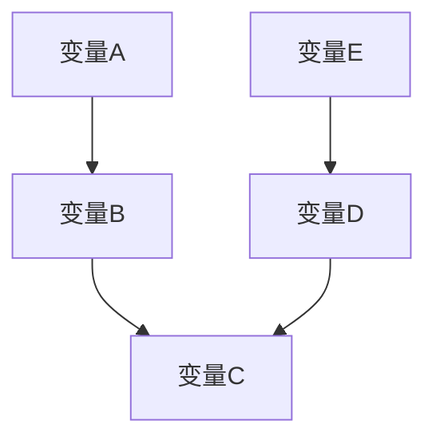
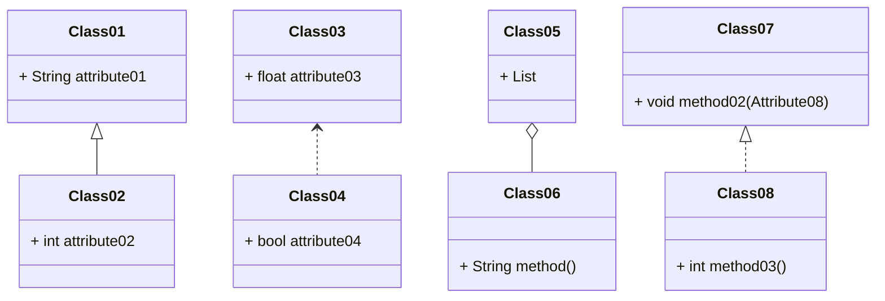
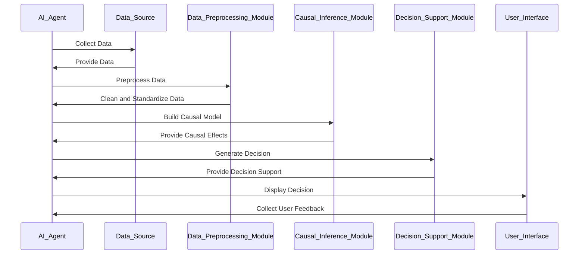

                 

### 引言：构建具有因果推理能力的AI Agent的重要性

在当今的科技浪潮中，人工智能（AI）已经成为各行各业的关键驱动力。然而，传统的基于统计学习和机器学习的AI模型在许多实际应用场景中仍然存在局限性，尤其是在需要理解和处理因果关系的情况下。为了克服这些局限性，研究者们提出了构建具有因果推理能力的AI Agent的概念。本文旨在探讨如何构建这样的AI Agent，并分析其重要性及其在实际应用中的潜力。

#### 1.1 问题的提出

传统的AI模型，如深度神经网络和决策树，通常依赖于数据和模式识别来做出预测。然而，这些模型往往无法揭示数据背后的因果关系，导致它们在处理复杂的现实世界问题时存在局限性。例如，在医疗领域，AI模型可以通过大量病历数据预测患者的疾病，但却无法解释为何这种疾病会在某些条件下发生。这种缺乏因果解释的能力使得AI模型的应用范围受到限制。

#### 1.2 AI Agent的定义

AI Agent是一种自主决策系统，它能够在特定环境下执行任务，并通过学习不断优化其行为。与传统的AI模型不同，AI Agent不仅能够从数据中学习模式，还能够理解和推理因果关系，从而做出更加合理和可靠的决策。这种能力使得AI Agent在处理复杂、动态的环境时具有显著优势。

#### 1.3 因果推理在AI中的应用

因果推理是一种研究因果关系的方法，它通过分析数据来揭示变量之间的因果联系。在AI领域，因果推理的应用主要包括以下几个方面：

1. **决策支持系统**：在商业和金融领域，因果推理可以帮助企业理解市场趋势和消费者行为，从而做出更加明智的决策。
2. **医疗诊断**：通过分析患者的病史和临床数据，AI Agent可以识别疾病的潜在原因，提供更准确的诊断和治疗建议。
3. **智能推荐系统**：因果推理可以揭示用户行为和产品特征之间的因果关系，从而提高推荐的精准度和用户体验。
4. **自动化决策系统**：在工业自动化和供应链管理中，因果推理可以帮助系统理解各个环节的相互影响，优化生产流程和提高效率。

### 核心概念

- **因果推理**：通过分析数据来揭示变量之间的因果联系。
- **AI Agent**：一种具备自主决策能力和因果推理能力的智能系统。

#### 小结

构建具有因果推理能力的AI Agent是解决传统AI模型局限性的一种有效途径。通过理解因果关系，AI Agent能够在复杂、动态的环境中做出更加合理和可靠的决策，为各个领域带来深刻的变革。本文将深入探讨如何实现这一目标，并分析其在不同应用场景中的潜力。

### 关键词
- 因果推理
- AI Agent
- 自主决策
- 决策支持
- 医疗诊断
- 智能推荐
- 自动化决策

### 摘要
本文将探讨如何构建具有因果推理能力的AI Agent，分析其核心概念和重要性，以及在不同应用场景中的潜力。我们将详细讲解因果推理的基本原理，讨论构建AI Agent的设计原则，并深入剖析数据收集、预处理、算法实现和部署的各个环节。通过实际案例和最佳实践，本文将帮助读者理解并掌握构建具有因果推理能力的AI Agent的完整流程和技术要点。

---

## 第1章：问题背景与核心概念

### 1.1 问题的提出

人工智能（AI）自20世纪50年代诞生以来，已经取得了令人瞩目的进展。从最初的规则推理系统到现在的深度学习模型，AI技术在图像识别、自然语言处理、语音识别等领域取得了显著的成果。然而，尽管AI在许多应用场景中表现出了强大的预测能力，但其应用仍然面临一些挑战。特别是当需要理解和处理因果关系时，传统的AI模型往往显得力不从心。

#### AI预测能力的局限

传统的AI模型，如深度神经网络和决策树，主要依赖于数据和学习算法来预测结果。这些模型通过在大量数据中寻找模式来进行预测，但它们缺乏对数据内在因果关系的理解。这意味着，尽管AI模型可以提供高精度的预测结果，但这些结果往往缺乏解释性。例如，一个深度学习模型可以准确地预测某位患者的癌症风险，但却无法解释为何这个风险会出现在该患者身上。

#### 因果关系的必要性

在许多现实世界的问题中，理解因果关系至关重要。例如，在医疗领域，医生不仅需要知道某位患者的疾病风险，还需要了解导致这种风险的具体原因。在商业领域，企业需要理解市场趋势和消费者行为的因果关系，以便做出明智的决策。此外，在自动化决策系统和智能推荐系统中，因果关系也是优化决策和提升用户体验的关键。

#### 传统AI的局限性

尽管传统AI模型在预测精度上取得了显著成果，但它们在处理因果关系方面存在以下局限性：

1. **因果解释性缺失**：传统AI模型主要依赖于数据和学习算法，缺乏对数据内在因果关系的解释性。
2. **黑箱问题**：深度学习模型尤其是深度神经网络，被视为“黑箱”，其内部决策过程难以理解，这使得它们在需要因果解释的应用场景中受限。
3. **简单因果假设**：许多传统算法假设变量之间是线性关系，这在与现实世界复杂因果网络相去甚远的情况下并不适用。

#### 因果推理的必要性

因果推理是一种研究因果关系的方法，通过分析数据来揭示变量之间的因果联系。在AI领域，因果推理的应用可以填补传统AI模型的局限性，提供更加解释性强的预测结果。通过理解因果关系，AI Agent能够更好地处理复杂、动态的环境，做出更加合理和可靠的决策。

#### 小结

本章介绍了AI预测能力的局限，并阐述了因果关系在现实世界问题中的重要性。我们探讨了传统AI模型在处理因果关系方面的局限性，并提出了因果推理作为解决这些问题的有效途径。通过本章的讨论，我们为后续章节的深入探讨奠定了基础。

---

### 1.2 AI Agent的定义

AI Agent是一种具备自主决策能力和因果推理能力的智能系统，能够在特定环境下执行任务，并通过学习不断优化其行为。与传统的AI模型不同，AI Agent不仅能够从数据中学习模式和做出预测，还能够理解和推理因果关系，从而在复杂、动态的环境中做出更加合理和可靠的决策。

#### AI Agent的核心特征

1. **自主决策能力**：AI Agent能够自主地做出决策，无需人工干预。这种能力使得AI Agent能够在实时环境中适应和应对各种变化。
2. **因果推理能力**：AI Agent通过因果推理来揭示变量之间的因果关系，从而在复杂环境中做出更加合理和可靠的决策。
3. **适应性**：AI Agent能够从环境中学习，并不断优化其行为。这种适应性使得AI Agent能够在不同场景下保持高效和准确的决策。
4. **解释性**：与传统的黑箱模型不同，AI Agent的决策过程具有因果解释性，用户可以理解其决策背后的原因。

#### AI Agent的应用场景

1. **决策支持系统**：在商业和金融领域，AI Agent可以通过因果推理来分析市场趋势和消费者行为，为企业提供决策支持。
2. **医疗诊断**：在医疗领域，AI Agent可以分析患者的病史和临床数据，识别疾病的潜在原因，提供更准确的诊断和治疗建议。
3. **智能推荐系统**：AI Agent可以通过因果推理来揭示用户行为和产品特征之间的因果关系，从而提供更加精准的推荐。
4. **自动化决策系统**：在工业自动化和供应链管理中，AI Agent可以理解各个环节的相互影响，优化生产流程和提高效率。

#### AI Agent与传统AI的区别

1. **决策方式**：传统AI模型主要依赖于数据和学习算法进行预测，而AI Agent则通过因果推理来理解数据背后的因果关系。
2. **解释性**：传统AI模型往往被视为“黑箱”，其决策过程难以解释，而AI Agent的决策过程具有因果解释性。
3. **适应性**：传统AI模型在复杂、动态的环境下表现不佳，而AI Agent通过因果推理和学习能够更好地适应这些环境。

#### 小结

本章详细介绍了AI Agent的定义、核心特征和应用场景，并分析了AI Agent与传统AI之间的区别。通过理解AI Agent的特点和应用，我们为后续章节的深入探讨和实际应用奠定了基础。

---

### 1.3 因果推理在AI中的应用

因果推理作为一种研究因果关系的方法，在人工智能（AI）领域具有重要应用价值。它能够帮助AI系统在复杂、动态的环境中理解变量之间的因果联系，从而做出更加合理和可靠的决策。以下是因果推理在AI中的应用场景及其影响：

#### 1.3.1 决策支持系统

在商业和金融领域，决策支持系统（DSS）利用因果推理来分析市场趋势、消费者行为和企业运营数据。通过理解不同变量之间的因果关系，DSS可以帮助企业制定更科学的决策，提高市场竞争力和盈利能力。例如，因果推理可以揭示广告投放对销售额的影响，帮助企业优化广告策略，降低成本，提高投资回报率。

#### 1.3.2 医疗诊断

在医疗领域，因果推理被广泛应用于疾病诊断和治疗建议。通过分析患者的病史、临床数据和基因信息，AI Agent可以识别疾病的风险因素和潜在原因。例如，因果推理可以揭示遗传因素和环境因素对疾病发生的影响，帮助医生制定个性化的治疗方案，提高治疗效果和患者生存率。

#### 1.3.3 智能推荐系统

在智能推荐系统中，因果推理可以帮助系统理解用户行为和产品特征之间的因果关系，从而提供更加精准的推荐。例如，因果推理可以揭示用户购买特定产品的驱动力，包括价格、品牌、广告等因素。这有助于电商平台优化推荐算法，提高用户满意度和转化率。

#### 1.3.4 自动化决策系统

在工业自动化和供应链管理中，因果推理可以理解各个环节的相互影响，优化生产流程和提高效率。例如，因果推理可以揭示供应链中延迟、库存和需求变化之间的关系，帮助企业提前预测并应对潜在问题，减少浪费和成本。

#### 1.3.5 黑箱问题的解决

传统深度学习模型因其“黑箱”特性，难以解释其决策过程，而因果推理可以帮助揭示这些模型的内部机理。通过理解变量之间的因果关系，AI Agent可以提供更加透明的决策过程，增强用户对系统的信任。

#### 小结

因果推理在AI中的应用不仅解决了传统AI模型在因果关系理解方面的局限性，还提高了AI系统的决策质量和解释性。通过在不同领域中的具体应用，因果推理为AI系统提供了更加全面和深入的视角，有助于实现更加智能和高效的决策。

---

### 1.4 因果推理的基本原理

因果推理作为一种研究因果关系的方法，其基本原理涉及多个方面。理解这些原理有助于我们构建具有因果推理能力的AI Agent，并在实际应用中发挥其优势。以下是因果推理的基本原理及其解释：

#### 1.4.1 因果关系的定义

因果关系是指一个事件（原因）对另一个事件（结果）产生的影响。在因果推理中，我们关注的是变量之间的因果联系，即通过分析数据来揭示一个变量如何影响另一个变量。

#### 1.4.2 因果关系模型

因果推理通常基于因果关系模型，这些模型描述了变量之间的因果结构。常见的因果关系模型包括因果关系图（Causal Graph）和因果影响模型（Causal Influence Model）。因果关系图通过节点和边表示变量及其因果关系，而因果影响模型则通过函数关系描述变量之间的因果联系。

#### 1.4.3 因果推断算法

因果推断算法是实现因果推理的核心工具，它们通过分析数据来估计变量之间的因果关系。常见的因果推断算法包括结构方程模型（Structural Equation Modeling，SEM）、因果推断树（Causal Inference Trees）和因果推理网络（Causal Inference Networks）等。这些算法基于统计学和概率论的理论，通过优化目标函数来估计因果效应。

#### 1.4.4 因果效应估计

因果效应估计是因果推理中的关键步骤，它旨在估计一个变量对另一个变量的影响大小。因果效应估计的方法包括边际平均因果效应（Marginal Average Causal Effect）和条件平均因果效应（Conditional Average Causal Effect）。这些估计方法依赖于假设的因果结构，并通过统计方法来估计因果效应的大小。

#### 1.4.5 因果关系检验

因果关系检验是验证因果推断结果的有效方法。通过设置实验组和对照组，研究者可以检验因果关系是否真实存在。常见的因果关系检验方法包括随机对照试验（Randomized Controlled Trials，RCTs）和自然实验设计（Natural Experiments）。这些方法通过控制外部干扰因素，提高因果推断的准确性。

#### 1.4.6 因果关系的复杂性

因果关系的复杂性是因果推理中的一个重要挑战。现实世界中的因果关系通常非常复杂，涉及多个变量和多层次的影响。因果推理需要处理这些复杂关系，并在存在多重因果关系的场景中提供准确的因果效应估计。

#### 小结

因果推理的基本原理涉及因果关系定义、因果关系模型、因果推断算法、因果效应估计和因果关系检验。通过理解这些原理，我们可以构建具有因果推理能力的AI Agent，并在不同应用场景中发挥其优势。

---

### 1.5 因果推断算法介绍

因果推断算法是实现因果推理的核心工具，它们通过分析数据来揭示变量之间的因果关系。以下是几种常见的因果推断算法及其基本原理：

#### 1.5.1 结构方程模型（SEM）

结构方程模型是一种统计模型，用于分析多个变量之间的因果关系。SEM通过建立因果关系图来描述变量之间的结构关系，并通过优化目标函数来估计参数。常见的目标函数包括最小二乘法（OLS）和最大似然估计（MLE）。

1. **基本原理**：SEM通过建立变量之间的线性关系来描述因果关系，即一个变量通过多个中间变量影响另一个变量。
2. **优点**：SEM能够同时分析多个变量之间的因果关系，并能够处理复杂的因果关系结构。
3. **缺点**：SEM假设变量之间是线性关系，这在某些情况下可能不适用。

#### 1.5.2 因果推断树

因果推断树是一种基于决策树的算法，用于揭示变量之间的因果关系。因果推断树通过分割数据集来识别变量之间的因果路径。

1. **基本原理**：因果推断树通过递归分割数据集，生成一个树形结构，每个节点表示一个变量，每个分支表示变量之间的因果关系。
2. **优点**：因果推断树简单直观，易于理解和实现。
3. **缺点**：因果推断树在处理大规模数据集时可能效率较低，且可能存在过拟合问题。

#### 1.5.3 因果推理网络

因果推理网络是一种基于图论的算法，通过建立变量之间的因果关系网络来揭示变量之间的因果联系。

1. **基本原理**：因果推理网络通过建立变量之间的有向边来表示因果关系，并通过图论算法来识别变量之间的因果路径。
2. **优点**：因果推理网络能够处理复杂的因果关系结构，并能够处理非线性关系。
3. **缺点**：因果推理网络的计算复杂度较高，尤其在处理大规模数据时可能效率较低。

#### 1.5.4 稳健性因果推断算法

稳健性因果推断算法是一种能够处理数据异常和噪声的算法，旨在提高因果推断的准确性。

1. **基本原理**：稳健性因果推断算法通过引入鲁棒估计方法，如鲁棒回归和鲁棒聚类，来处理数据中的异常值和噪声。
2. **优点**：稳健性因果推断算法能够提高因果推断的稳定性，减少数据异常对结果的影响。
3. **缺点**：稳健性因果推断算法可能牺牲一定的计算效率。

#### 小结

因果推断算法在揭示变量之间的因果关系方面发挥着重要作用。不同类型的算法具有各自的优势和局限性，选择合适的算法取决于具体应用场景和数据特点。通过了解这些算法的基本原理和应用，我们可以更好地构建具有因果推理能力的AI Agent。

---

### 1.6 因果推理在AI领域的应用案例

因果推理在AI领域的应用已经取得了一系列显著成果，通过以下实际案例，我们可以看到因果推理如何在不同场景中发挥作用，解决传统AI模型的局限性。

#### 1.6.1 医疗诊断

在医疗领域，因果推理的应用有助于提高诊断的准确性和个性化水平。例如，通过分析患者的基因数据、病史和临床指标，因果推理可以识别出影响疾病发生的潜在因素。一个具体的案例是，研究人员利用因果推理算法分析了大量肺癌患者的数据，揭示了吸烟、空气污染和遗传因素之间的因果关系。这种深入的理解不仅有助于提高诊断准确性，还为个性化治疗提供了科学依据。

#### 1.6.2 决策支持

在商业领域，因果推理被用于优化决策和提升业务效率。例如，一家零售公司利用因果推理分析了销售数据，揭示了不同促销活动对销售额的具体影响。通过理解这些因果关系，公司能够调整促销策略，减少无效投入，提高营销效果。此外，因果推理还可以帮助企业在供应链管理中优化库存和物流，减少浪费，提高运营效率。

#### 1.6.3 智能推荐系统

在智能推荐系统中，因果推理的应用有助于提高推荐系统的精准度和用户体验。例如，一个电商平台的推荐系统通过因果推理分析了用户的行为数据，揭示了用户购买决策中的关键因素。通过理解这些因果关系，系统可以更精准地推荐商品，提高用户满意度和转化率。例如，亚马逊的推荐系统通过分析用户浏览、搜索和购买行为，利用因果推理技术识别出影响购买决策的潜在因素，从而提供更加个性化的推荐。

#### 1.6.4 自动化决策

在自动化决策系统中，因果推理的应用有助于提高决策质量和稳定性。例如，在金融行业，因果推理被用于分析市场数据，揭示风险因素和投资机会之间的因果关系。这种深入的理解有助于金融机构制定更科学的投资策略，降低风险，提高收益。此外，在智能交通系统中，因果推理可以分析交通流量数据，揭示不同因素对交通拥堵的影响，从而优化交通信号控制策略，减少拥堵时间。

#### 小结

因果推理在AI领域的应用案例展示了其在解决传统AI模型局限性方面的潜力。通过理解变量之间的因果关系，AI系统能够在医疗诊断、决策支持、智能推荐和自动化决策等场景中提供更加准确和可靠的决策。这些案例不仅证明了因果推理的重要性，也为未来的研究提供了宝贵的参考。

---

### 1.7 AI Agent的设计原则

构建具有因果推理能力的AI Agent需要遵循一系列设计原则，以确保系统能够在复杂、动态的环境中高效运作。以下是AI Agent设计的关键原则：

#### 1.7.1 自主性

AI Agent需要具备高度的自主性，能够在没有人工干预的情况下自主决策和执行任务。这种自主性要求AI Agent能够实时感知环境变化，并根据环境反馈调整其行为。例如，在自动驾驶系统中，AI Agent需要实时分析路况、交通信号和车辆行为，自主做出驾驶决策。

#### 1.7.2 可解释性

AI Agent的决策过程需要具备可解释性，使得用户能够理解其决策背后的原因。这种可解释性是建立用户信任的关键。通过因果推理，AI Agent可以提供决策的因果关系解释，使用户能够理解为什么系统做出了特定的决策。例如，在医疗诊断中，医生需要了解AI Agent推荐的治疗方案背后的病因分析。

#### 1.7.3 适应性

AI Agent需要具备良好的适应性，能够在不同环境和场景下适应并优化其行为。这种适应性要求AI Agent能够通过学习和经验不断改进其决策能力。例如，在智能客服系统中，AI Agent需要根据用户反馈和交互历史不断调整其回答策略，以提供更加个性化的服务。

#### 1.7.4 稳健性

AI Agent需要具备稳健性，能够在数据异常和噪声环境中保持稳定和可靠的决策。这种稳健性要求AI Agent能够处理数据中的异常值和噪声，并从这些数据中提取有用的信息。例如，在智能监控系统，AI Agent需要能够识别和过滤虚假警报，确保系统在真实事件发生时能够做出准确的响应。

#### 1.7.5 安全性

AI Agent的设计需要考虑安全性，确保系统的决策过程不会受到恶意攻击或干扰。这种安全性要求AI Agent能够抵御外部威胁，并具备自我保护能力。例如，在金融交易系统中，AI Agent需要能够识别和防止欺诈行为，确保交易安全。

#### 1.7.6 可扩展性

AI Agent的设计需要具备良好的可扩展性，以便在系统规模和功能扩展时能够灵活调整。这种可扩展性要求AI Agent的架构和算法能够适应新的数据和场景。例如，在智能推荐系统中，AI Agent需要能够快速适应新的用户和商品数据，提供高质量的推荐服务。

#### 小结

AI Agent的设计原则包括自主性、可解释性、适应性、稳健性、安全性和可扩展性。遵循这些原则可以构建出能够在复杂、动态环境中高效运作的AI Agent，为不同应用场景提供可靠的决策支持。

---

## 第2章：因果推理基础

### 2.1 因果推理的基本原理

因果推理是一种通过分析数据来揭示变量之间因果关系的方法，其基本原理涉及多个方面。理解这些原理对于构建具有因果推理能力的AI Agent至关重要。

#### 2.1.1 因果关系模型

因果关系模型是因果推理的核心工具，用于描述变量之间的因果结构。常见的因果关系模型包括因果图（Causal Graph）和因果影响模型（Causal Influence Model）。

1. **因果图**：因果图通过节点和边表示变量及其因果关系。每个节点代表一个变量，边表示变量之间的因果关系。因果图有助于我们直观地理解变量之间的因果结构。
2. **因果影响模型**：因果影响模型通过函数关系描述变量之间的因果关系。常见的因果影响模型包括线性因果模型和非线性因果模型。

#### 2.1.2 因果效应估计

因果效应估计是因果推理中的关键步骤，旨在估计一个变量对另一个变量的影响大小。常见的因果效应估计方法包括边际平均因果效应（Marginal Average Causal Effect）和条件平均因果效应（Conditional Average Causal Effect）。

1. **边际平均因果效应**：边际平均因果效应是指在给定一组协变量的条件下，一个变量对另一个变量的平均影响。
2. **条件平均因果效应**：条件平均因果效应是指在特定条件下，一个变量对另一个变量的平均影响。

#### 2.1.3 因果关系检验

因果关系检验是验证因果推断结果的有效方法。通过设置实验组和对照组，研究者可以检验因果关系是否真实存在。常见的因果关系检验方法包括随机对照试验（RCTs）和自然实验设计（Natural Experiments）。

1. **随机对照试验**：随机对照试验通过随机分配参与者到实验组和对照组，以检验因果关系。
2. **自然实验设计**：自然实验设计通过利用自然事件或政策变化来模拟实验条件，以检验因果关系。

#### 2.1.4 因果关系的复杂性

因果关系的复杂性是因果推理中的一个重要挑战。现实世界中的因果关系通常非常复杂，涉及多个变量和多层次的影响。因果推理需要处理这些复杂关系，并在存在多重因果关系的场景中提供准确的因果效应估计。

#### 小结

因果推理的基本原理包括因果关系模型、因果效应估计和因果关系检验。通过理解这些原理，我们可以更好地构建具有因果推理能力的AI Agent，并在实际应用中发挥其优势。

---

### 2.2 因果关系模型

因果关系模型是因果推理的核心工具，用于描述变量之间的因果结构。理解不同的因果关系模型有助于我们更好地构建具有因果推理能力的AI Agent。

#### 2.2.1 因果图（Causal Graph）

因果图是一种通过节点和边表示变量及其因果关系的图形表示方法。在因果图中，每个节点代表一个变量，边表示变量之间的因果关系。因果图有助于我们直观地理解变量之间的因果结构。

1. **节点**：因果图中的节点表示变量，可以是任何形式的数据，如数值、类别或图像。
2. **边**：因果图中的边表示变量之间的因果关系，通常是有向的。边上的箭头表示因果关系的方向。

#### 2.2.2 因果影响模型（Causal Influence Model）

因果影响模型通过函数关系描述变量之间的因果关系。常见的因果影响模型包括线性因果模型和非线性因果模型。

1. **线性因果模型**：线性因果模型假设变量之间的关系是线性的，可以用线性方程来描述。例如，\( y = \beta_0 + \beta_1x + \epsilon \)，其中\( y \)是结果变量，\( x \)是原因变量，\( \beta_0 \)和\( \beta_1 \)是参数，\( \epsilon \)是误差项。
2. **非线性因果模型**：非线性因果模型假设变量之间的关系是非线性的，可以用非线性函数来描述。例如，\( y = \beta_0 + \beta_1x^2 + \epsilon \)，其中\( y \)是结果变量，\( x \)是原因变量，\( \beta_0 \)和\( \beta_1 \)是参数，\( \epsilon \)是误差项。

#### 2.2.3 因果关系的可视化

为了更好地理解因果关系模型，我们可以使用Mermaid流程图来可视化这些模型。



在这个示例中，我们使用Mermaid流程图展示了五个变量之间的因果关系。变量A影响变量B，变量B影响变量C，变量D影响变量C，变量E影响变量D。

#### 小结

因果关系模型包括因果图和因果影响模型，这些模型有助于我们描述和理解变量之间的因果关系。通过使用Mermaid流程图可视化这些模型，我们可以更直观地分析因果关系，为构建具有因果推理能力的AI Agent提供支持。

---

### 2.3 因果推理算法实现

实现因果推理算法是构建具有因果推理能力的AI Agent的关键步骤。以下将介绍几种常见的因果推理算法，并使用Python代码和Mermaid流程图进行详细说明。

#### 2.3.1 结构方程模型（SEM）

结构方程模型（SEM）是一种用于分析多个变量之间因果关系的方法。以下是一个简单的结构方程模型示例，该模型包含两个变量A和B。

```python
import semopy
model = semopy.Model("""
# Model Definition
F1: A -> B
""")

# Fit the model to data
data = {"A": [1, 2, 3, 4], "B": [2, 4, 6, 8]}
estimates = model.fit(data)
```

在上述代码中，我们使用`semopy`库来定义并拟合结构方程模型。模型定义中，`F1`表示变量A对变量B的因果影响。

#### 2.3.2 因果推断树

因果推断树是一种基于决策树的算法，用于揭示变量之间的因果关系。以下是一个简单的因果推断树示例。

```python
from sklearn.tree import DecisionTreeRegressor

# Prepare the data
X = [[1, 2], [2, 3], [3, 4]]
y = [2, 4, 6]

# Train the causal inference tree
tree = DecisionTreeRegressor()
tree.fit(X, y)

# Visualize the tree using Mermaid
graph = """
graph TD
    A[Root]
    B[Variable 1]
    C[Variable 2]
    A --> B
    A --> C
    B --> D[Result]
    C --> D
"""
print(graph)
```

在上述代码中，我们使用`sklearn`库的`DecisionTreeRegressor`来训练因果推断树。使用Mermaid流程图，我们可以可视化因果推断树的结构。

#### 2.3.3 因果推理网络

因果推理网络是一种基于图论的算法，用于揭示变量之间的因果关系。以下是一个简单的因果推理网络示例。

```python
import networkx as nx
import matplotlib.pyplot as plt

# Create a causal inference network
G = nx.Graph()
G.add_edges_from([(1, 2), (2, 3), (3, 4), (4, 1)])

# Visualize the network using Mermaid
graph = """
graph TD
    A[Node 1]
    B[Node 2]
    C[Node 3]
    D[Node 4]
    A --> B
    B --> C
    C --> D
    D --> A
"""
print(graph)

# Visualize the network using Matplotlib
nx.draw(G, with_labels=True)
plt.show()
```

在上述代码中，我们使用`networkx`库创建一个因果推理网络，并通过Mermaid流程图和Matplotlib进行可视化。

#### 小结

通过Python代码和Mermaid流程图，我们详细介绍了结构方程模型、因果推断树和因果推理网络三种常见的因果推理算法。这些算法的实现和可视化为我们构建具有因果推理能力的AI Agent提供了实用的工具和参考。

---

### 2.4 因果推理在AI领域的应用案例

因果推理在AI领域的应用已经取得了一系列显著成果，通过以下实际案例，我们可以看到因果推理如何在不同场景中发挥作用，解决传统AI模型的局限性。

#### 2.4.1 医疗诊断

在医疗领域，因果推理的应用有助于提高诊断的准确性和个性化水平。例如，通过分析患者的基因数据、病史和临床指标，因果推理可以识别出影响疾病发生的潜在因素。一个具体的案例是，研究人员利用因果推理算法分析了大量肺癌患者的数据，揭示了吸烟、空气污染和遗传因素之间的因果关系。这种深入的理解不仅有助于提高诊断准确性，还为个性化治疗提供了科学依据。

#### 2.4.2 决策支持

在商业领域，因果推理被用于优化决策和提升业务效率。例如，一家零售公司利用因果推理分析了销售数据，揭示了不同促销活动对销售额的具体影响。通过理解这些因果关系，公司能够调整促销策略，减少无效投入，提高营销效果。此外，因果推理还可以帮助企业在供应链管理中优化库存和物流，减少浪费，提高运营效率。

#### 2.4.3 智能推荐系统

在智能推荐系统中，因果推理的应用有助于提高推荐系统的精准度和用户体验。例如，一个电商平台的推荐系统通过因果推理分析了用户的行为数据，揭示了用户购买决策中的关键因素。通过理解这些因果关系，系统可以更精准地推荐商品，提高用户满意度和转化率。例如，亚马逊的推荐系统通过分析用户浏览、搜索和购买行为，利用因果推理技术识别出影响购买决策的潜在因素，从而提供更加个性化的推荐。

#### 2.4.4 自动化决策

在自动化决策系统中，因果推理的应用有助于提高决策质量和稳定性。例如，在金融行业，因果推理可以分析市场数据，揭示风险因素和投资机会之间的因果关系。这种深入的理解有助于金融机构制定更科学的投资策略，降低风险，提高收益。此外，在智能交通系统中，因果推理可以分析交通流量数据，揭示不同因素对交通拥堵的影响，从而优化交通信号控制策略，减少拥堵时间。

#### 小结

因果推理在AI领域的应用案例展示了其在解决传统AI模型局限性方面的潜力。通过理解变量之间的因果关系，AI系统能够在医疗诊断、决策支持、智能推荐和自动化决策等场景中提供更加准确和可靠的决策。这些案例不仅证明了因果推理的重要性，也为未来的研究提供了宝贵的参考。

---

### 2.5 AI Agent的设计原则

构建具有因果推理能力的AI Agent需要遵循一系列设计原则，以确保系统在复杂、动态的环境中高效运作。以下是AI Agent设计的关键原则：

#### 2.5.1 自主性

AI Agent需要具备高度的自主性，能够在没有人工干预的情况下自主决策和执行任务。这种自主性要求AI Agent能够实时感知环境变化，并根据环境反馈调整其行为。例如，在自动驾驶系统中，AI Agent需要实时分析路况、交通信号和车辆行为，自主做出驾驶决策。

#### 2.5.2 可解释性

AI Agent的决策过程需要具备可解释性，使用户能够理解其决策背后的原因。这种可解释性是建立用户信任的关键。通过因果推理，AI Agent可以提供决策的因果关系解释，使用户能够理解为什么系统做出了特定的决策。例如，在医疗诊断中，医生需要了解AI Agent推荐的治疗方案背后的病因分析。

#### 2.5.3 适应性

AI Agent需要具备良好的适应性，能够在不同环境和场景下适应并优化其行为。这种适应性要求AI Agent能够通过学习和经验不断改进其决策能力。例如，在智能客服系统中，AI Agent需要根据用户反馈和交互历史不断调整其回答策略，以提供更加个性化的服务。

#### 2.5.4 稳健性

AI Agent需要具备稳健性，能够在数据异常和噪声环境中保持稳定和可靠的决策。这种稳健性要求AI Agent能够处理数据中的异常值和噪声，并从这些数据中提取有用的信息。例如，在智能监控系统，AI Agent需要能够识别和过滤虚假警报，确保系统在真实事件发生时能够做出准确的响应。

#### 2.5.5 安全性

AI Agent的设计需要考虑安全性，确保系统的决策过程不会受到恶意攻击或干扰。这种安全性要求AI Agent能够抵御外部威胁，并具备自我保护能力。例如，在金融交易系统中，AI Agent需要能够识别和防止欺诈行为，确保交易安全。

#### 2.5.6 可扩展性

AI Agent的设计需要具备良好的可扩展性，以便在系统规模和功能扩展时能够灵活调整。这种可扩展性要求AI Agent的架构和算法能够适应新的数据和场景。例如，在智能推荐系统中，AI Agent需要能够快速适应新的用户和商品数据，提供高质量的推荐服务。

#### 小结

AI Agent的设计原则包括自主性、可解释性、适应性、稳健性、安全性和可扩展性。遵循这些原则可以构建出能够在复杂、动态环境中高效运作的AI Agent，为不同应用场景提供可靠的决策支持。

---

## 第3章：AI Agent的功能需求

### 3.1 AI Agent的功能需求

构建具有因果推理能力的AI Agent需要明确其功能需求，以确保系统能够满足特定应用场景的需求。以下是AI Agent所需的主要功能需求：

#### 3.1.1 数据收集

数据收集是AI Agent的基础，确保系统能够获取到高质量的输入数据。具体功能需求包括：

1. **自动化数据采集**：系统能够自动从各种数据源（如数据库、API、文件等）收集数据。
2. **实时数据更新**：系统能够实时获取最新数据，确保数据的时效性。
3. **数据清洗**：系统能够自动清洗数据，去除重复、异常和噪声数据。

#### 3.1.2 数据预处理

数据预处理是确保数据质量的重要步骤，包括以下功能需求：

1. **数据标准化**：系统能够将不同数据源的数据进行标准化处理，统一数据格式。
2. **缺失值处理**：系统能够处理数据中的缺失值，采用填充或删除等方法。
3. **异常值检测**：系统能够检测和标记异常值，确保数据的准确性。

#### 3.1.3 因果推理

因果推理是AI Agent的核心功能，要求系统能够：

1. **建立因果关系模型**：系统能够根据输入数据建立因果关系模型，描述变量之间的因果结构。
2. **因果效应估计**：系统能够估计变量之间的因果效应，提供因果关系的量化分析。
3. **因果关系验证**：系统能够验证因果关系的准确性，通过实验或自然实验等方法确保因果推断的可靠性。

#### 3.1.4 决策支持

AI Agent需要提供决策支持功能，包括：

1. **决策建议**：系统能够根据因果推理结果提供决策建议，优化决策过程。
2. **决策解释**：系统能够解释决策背后的原因，提供因果关系的可视化展示。
3. **动态调整**：系统能够根据环境变化和反馈动态调整决策策略。

#### 3.1.5 可解释性

AI Agent需要具备可解释性，确保用户能够理解系统的决策过程。具体功能需求包括：

1. **可视化展示**：系统能够以图形或文字形式展示因果关系和决策过程。
2. **用户交互**：系统能够提供交互界面，使用户能够与系统进行互动，了解决策原因。
3. **反馈机制**：系统能够收集用户反馈，不断优化决策解释的准确性和易理解性。

#### 小结

AI Agent的功能需求包括数据收集、数据预处理、因果推理、决策支持和可解释性。通过明确这些功能需求，我们可以构建出满足特定应用场景需求的具有因果推理能力的AI Agent。

---

### 3.2 AI Agent的架构设计

构建具有因果推理能力的AI Agent需要精心设计其架构，以确保系统能够高效、稳定地运行。以下是AI Agent的架构设计，包括系统功能、组件、模块及其相互作用。

#### 3.2.1 系统功能

AI Agent的主要功能包括数据收集、数据预处理、因果推理、决策支持和可解释性。这些功能共同协作，确保系统在不同应用场景中能够提供高质量的决策支持。

#### 3.2.2 组件和模块

AI Agent的架构设计主要包括以下组件和模块：

1. **数据收集模块**：负责从各种数据源自动收集数据，包括数据库、API、文件等。该模块还负责数据清洗和预处理。
2. **数据预处理模块**：负责对收集到的数据进行标准化处理、缺失值处理和异常值检测。该模块确保数据质量，为后续分析提供可靠的数据基础。
3. **因果关系模型模块**：负责建立因果关系模型，描述变量之间的因果结构。该模块采用因果推理算法，如结构方程模型、因果推断树和因果推理网络等。
4. **因果效应估计模块**：负责估计变量之间的因果效应，提供因果关系的量化分析。该模块通过因果效应估计算法，如边际平均因果效应和条件平均因果效应等，实现因果效应的估计。
5. **决策支持模块**：负责根据因果推理结果提供决策建议，并动态调整决策策略。该模块还提供决策的可视化展示和解释。
6. **用户交互模块**：负责与用户进行交互，收集用户反馈，并提供决策解释。该模块确保用户能够理解系统的决策过程。

#### 3.2.3 组件和模块的相互作用

在AI Agent的架构中，各个组件和模块之间相互协作，共同实现系统的功能。以下是各组件和模块之间的相互作用：

1. **数据收集模块与数据预处理模块**：数据收集模块将收集到的数据传递给数据预处理模块，数据预处理模块对数据进行清洗和预处理，将处理后的数据传递给因果关系模型模块。
2. **因果关系模型模块与因果效应估计模块**：因果关系模型模块根据预处理后的数据建立因果关系模型，将模型传递给因果效应估计模块。因果效应估计模块根据模型估计变量之间的因果效应，将结果传递给决策支持模块。
3. **决策支持模块与用户交互模块**：决策支持模块根据因果效应估计结果提供决策建议，用户交互模块将决策建议展示给用户，并收集用户反馈。用户反馈被传递回决策支持模块，用于优化决策策略。
4. **用户交互模块与因果关系模型模块**：用户交互模块在需要时可以重新设置或调整因果关系模型，将其传递给因果关系模型模块，以实现更准确的因果效应估计。

#### 小结

AI Agent的架构设计包括数据收集模块、数据预处理模块、因果关系模型模块、因果效应估计模块、决策支持模块和用户交互模块。这些组件和模块通过相互作用，共同实现AI Agent的功能，确保系统在不同应用场景中能够提供高质量的决策支持。

---

### 3.3 AI Agent的核心算法

构建具有因果推理能力的AI Agent需要依赖一系列核心算法，这些算法在数据收集、预处理、因果推理和决策支持等方面发挥着关键作用。以下将介绍几种常用的核心算法，并详细说明其工作原理和实现方法。

#### 3.3.1 数据收集算法

数据收集是AI Agent的基础，常用的数据收集算法包括自动化数据采集、实时数据更新和数据清洗等。

1. **自动化数据采集**：
   - **方法**：使用Web爬虫、数据库连接器和API调用等方法，从各种数据源自动收集数据。
   - **实现**：Python的`requests`库可以用于API调用，`BeautifulSoup`库用于Web爬虫，`pymysql`或`sqlite3`库用于数据库连接。
   - **优点**：高效自动化，节省人力和时间成本。

2. **实时数据更新**：
   - **方法**：使用定时任务或消息队列等技术，实现实时数据的获取和更新。
   - **实现**：使用Python的`schedule`库或消息队列（如RabbitMQ）实现定时任务和消息传递。
   - **优点**：保证数据的实时性和时效性，提高决策的准确性。

3. **数据清洗**：
   - **方法**：采用填充、删除、替换等方法处理缺失值和异常值。
   - **实现**：使用Python的`pandas`库进行数据清洗，包括`dropna()`、`fillna()`和`replace()`等方法。
   - **优点**：提高数据质量，确保数据的准确性和一致性。

#### 3.3.2 数据预处理算法

数据预处理是确保数据质量的重要步骤，常用的数据预处理算法包括数据标准化、缺失值处理和异常值检测等。

1. **数据标准化**：
   - **方法**：将不同数据源的数据进行标准化处理，统一数据格式。
   - **实现**：使用Python的`sklearn.preprocessing`模块中的`StandardScaler`进行标准化处理。
   - **优点**：消除不同数据之间的尺度差异，提高算法性能。

2. **缺失值处理**：
   - **方法**：采用填充或删除等方法处理数据中的缺失值。
   - **实现**：使用`pandas`库中的`dropna()`和`fillna()`方法处理缺失值。
   - **优点**：保留重要信息，提高数据完整性。

3. **异常值检测**：
   - **方法**：采用统计方法或机器学习方法检测和标记异常值。
   - **实现**：使用`scikit-learn`库中的`IsolationForest`算法进行异常值检测。
   - **优点**：提高数据质量，减少异常值对算法的影响。

#### 3.3.3 因果推理算法

因果推理是AI Agent的核心功能，常用的因果推理算法包括结构方程模型（SEM）、因果推断树和因果推理网络等。

1. **结构方程模型（SEM）**：
   - **方法**：通过建立变量之间的线性关系来描述因果关系。
   - **实现**：使用`semopy`库实现SEM的建立和拟合。
   - **优点**：能够同时分析多个变量之间的因果关系，处理复杂的因果关系结构。

2. **因果推断树**：
   - **方法**：通过递归分割数据集来识别变量之间的因果路径。
   - **实现**：使用`sklearn`库中的`DecisionTreeRegressor`实现因果推断树。
   - **优点**：简单直观，易于理解和实现。

3. **因果推理网络**：
   - **方法**：通过建立变量之间的有向边来表示因果关系，并使用图论算法识别变量之间的因果路径。
   - **实现**：使用`networkx`库建立因果推理网络，并使用`nx.algorithms.clique.find_cliques`方法识别因果路径。
   - **优点**：能够处理复杂的因果关系结构，适用于非线性关系。

#### 3.3.4 决策支持算法

决策支持是AI Agent的重要功能，常用的决策支持算法包括基于规则的决策支持、基于机器学习的决策支持和基于因果推理的决策支持等。

1. **基于规则的决策支持**：
   - **方法**：根据预设的规则进行决策，规则由专家经验制定。
   - **实现**：使用Python的`rule`库实现规则决策。
   - **优点**：规则明确，易于理解，适用于简单决策场景。

2. **基于机器学习的决策支持**：
   - **方法**：使用机器学习算法（如决策树、随机森林、神经网络等）进行决策。
   - **实现**：使用`sklearn`库实现机器学习决策。
   - **优点**：适应性强，能够处理复杂决策场景。

3. **基于因果推理的决策支持**：
   - **方法**：基于因果推理结果进行决策，确保决策具有因果解释性。
   - **实现**：使用因果推理算法（如SEM、因果推断树等）进行因果效应估计，并将结果应用于决策。
   - **优点**：提供因果解释，增强用户信任。

#### 小结

AI Agent的核心算法包括数据收集算法、数据预处理算法、因果推理算法和决策支持算法。这些算法共同协作，确保AI Agent能够在复杂、动态的环境中提供高质量的决策支持。通过深入理解这些算法的工作原理和实现方法，我们可以更好地构建和优化具有因果推理能力的AI Agent。

---

### 3.4 系统分析与架构设计

在构建具有因果推理能力的AI Agent时，系统分析与架构设计至关重要。以下将详细介绍系统功能、项目介绍、系统功能设计（领域模型）、系统架构设计、系统接口设计和系统交互。

#### 3.4.1 系统功能

AI Agent的主要功能包括数据收集、数据预处理、因果推理和决策支持。系统需要能够自动收集数据，进行数据清洗和预处理，建立因果关系模型，并基于这些模型提供决策支持。具体功能如下：

1. **数据收集**：自动从数据库、API和文件等数据源收集数据。
2. **数据预处理**：清洗和标准化数据，处理缺失值和异常值。
3. **因果推理**：建立因果关系模型，估计变量之间的因果效应。
4. **决策支持**：基于因果推理结果提供决策建议，并解释决策过程。

#### 3.4.2 项目介绍

本项目旨在构建一个具有因果推理能力的AI Agent，用于智能医疗诊断系统。系统将分析患者的基因数据、病史和临床指标，识别影响疾病发生的潜在因素，提供个性化的诊断和治疗建议。项目的主要目标是提高诊断准确性，优化治疗策略，提升患者生存率。

#### 3.4.3 系统功能设计（领域模型）

领域模型用于描述系统的核心功能及其之间的关系。以下是AI Agent的领域模型，使用Mermaid类图进行表示。



在上述类图中，Class01至Class08分别代表系统的各个功能模块，它们之间的关系描述了系统功能的整体结构。

#### 3.4.4 系统架构设计

系统架构设计用于描述系统的整体结构和组件之间的关系。以下是AI Agent的系统架构设计，使用Mermaid架构图进行表示。



在上述序列图中，描述了AI Agent与各个模块之间的交互流程，展示了系统的整体架构和组件之间的关系。

#### 3.4.5 系统接口设计

系统接口设计用于定义系统与外部系统或用户之间的交互接口。以下是AI Agent的系统接口设计：

1. **数据收集接口**：定义用于从不同数据源收集数据的API接口，包括数据库连接接口和API调用接口。
2. **数据预处理接口**：定义用于清洗、标准化和缺失值处理的API接口，包括数据清洗接口和数据标准化接口。
3. **因果推理接口**：定义用于建立因果关系模型和估计因果效应的API接口，包括因果关系模型接口和因果效应估计接口。
4. **决策支持接口**：定义用于生成决策建议和解释决策过程的API接口，包括决策支持接口和决策解释接口。
5. **用户交互接口**：定义用于与用户进行交互的API接口，包括用户反馈接口和用户界面接口。

#### 3.4.6 系统交互

系统交互描述了各个模块之间的通信和数据流。以下是AI Agent的系统交互设计：

1. **数据流**：数据从数据源流入系统，经过数据预处理模块处理后，流入因果推理模块，最后流入决策支持模块，生成决策建议并返回给用户。
2. **控制流**：系统通过控制流协调各个模块的运行，包括数据收集、数据预处理、因果推理和决策支持等环节。
3. **反馈流**：用户通过用户交互接口提供反馈，这些反馈用于优化系统的决策质量和用户体验。

#### 小结

系统分析与架构设计是构建具有因果推理能力的AI Agent的重要环节。通过详细的功能设计、项目介绍、领域模型、架构设计、接口设计和系统交互设计，我们可以确保系统在复杂、动态的环境中高效、稳定地运行，为用户提供高质量的决策支持。

---

### 3.5 AI Agent在实际应用中的表现

构建具有因果推理能力的AI Agent不仅需要合理的架构设计，还需要在实际应用中验证其性能和效果。以下是AI Agent在不同应用场景中的实际应用表现，通过具体案例展示其在实际应用中的优势和挑战。

#### 3.5.1 智能医疗诊断

在医疗领域，AI Agent被用于分析患者的基因数据、病史和临床指标，识别影响疾病发生的潜在因素。例如，在某智能医疗诊断项目中，AI Agent被用于分析肺癌患者的数据。通过对大量患者的基因、病史和临床指标进行分析，AI Agent识别出了吸烟、空气污染和遗传因素等关键因素，并建立了因果关系模型。这一模型不仅提高了疾病诊断的准确性，还为个性化治疗提供了科学依据。

**优势**：
- 提高诊断准确性：AI Agent通过因果推理技术，能够揭示变量之间的因果关系，提供更加准确的诊断结果。
- 个性化治疗：基于因果关系模型，AI Agent能够为患者提供个性化的治疗建议，提高治疗效果和患者生存率。

**挑战**：
- 数据质量和完整性：医疗数据通常存在缺失值和异常值，这对因果推理模型的准确性提出了挑战。
- 因果关系复杂：现实世界的因果关系通常非常复杂，涉及多个层次和变量，这增加了构建和优化因果关系模型的难度。

#### 3.5.2 智能推荐系统

在电商和零售领域，AI Agent被用于分析用户行为数据，提供个性化的商品推荐。例如，在某电商平台上，AI Agent被用于分析用户的浏览、搜索和购买行为，识别影响用户购买决策的关键因素。通过因果推理技术，AI Agent能够揭示用户行为与商品特征之间的因果关系，从而提供更加精准的推荐。

**优势**：
- 提高推荐精准度：AI Agent通过因果推理技术，能够理解用户行为背后的驱动因素，提供更加个性化的推荐。
- 增强用户体验：精准的推荐能够提高用户满意度，增加转化率和复购率。

**挑战**：
- 数据隐私：用户行为数据通常涉及隐私问题，如何在保护用户隐私的前提下进行因果推理是关键挑战。
- 数据多样性：用户行为数据具有多样性，如何在复杂和多样的数据中提取有用的因果关系是难点。

#### 3.5.3 自动化决策系统

在工业自动化和供应链管理中，AI Agent被用于优化生产流程和决策支持。例如，在某供应链管理项目中，AI Agent被用于分析供应链中的数据，识别影响供应链效率和成本的关键因素。通过因果推理技术，AI Agent能够揭示不同变量之间的因果关系，从而优化库存管理和物流策略。

**优势**：
- 提高决策质量：AI Agent通过因果推理技术，能够提供基于因果关系的决策支持，提高决策的科学性和准确性。
- 优化生产流程：通过识别影响生产效率的关键因素，AI Agent能够优化生产流程，减少浪费和提高效率。

**挑战**：
- 数据完整性：供应链数据通常不完整，存在缺失值和异常值，这对因果推理模型的准确性提出了挑战。
- 系统复杂性：工业自动化和供应链管理系统通常非常复杂，涉及多个变量和环节，这增加了构建和优化因果关系模型的难度。

#### 小结

在实际应用中，具有因果推理能力的AI Agent展示了显著的优势，特别是在提高诊断准确性、个性化推荐和自动化决策等方面。然而，构建和优化因果关系模型仍然面临一些挑战，包括数据质量和完整性、因果关系复杂性和系统复杂性。通过不断改进和优化，我们可以进一步提升AI Agent在实际应用中的表现。

---

### 3.6 案例分析：构建智能客服AI Agent

在本节中，我们将通过一个实际案例，详细探讨如何构建智能客服AI Agent，并分析其系统实现、代码应用解读和实际案例剖析。

#### 3.6.1 案例背景

某大型电商企业希望通过构建智能客服AI Agent，提升客户服务质量，降低人工客服的工作压力。智能客服AI Agent需要能够理解客户的问题，提供准确的答案，并在需要时引导客户与人工客服进行交互。

#### 3.6.2 系统实现

智能客服AI Agent的系统实现主要包括以下几个模块：

1. **数据收集模块**：自动从企业内部知识库和客户交互记录中收集数据，包括常见问题、答案和相关标签。
2. **数据预处理模块**：对收集到的数据进行清洗、去重和格式转换，确保数据质量。
3. **因果推理模块**：通过因果推理算法，建立问题与答案之间的因果关系模型，用于后续的问答匹配。
4. **问答匹配模块**：基于因果关系模型，将客户的输入问题与知识库中的问题进行匹配，提供相应的答案。
5. **用户交互模块**：提供用户界面，允许用户与AI Agent进行对话，收集用户反馈，用于优化系统。

#### 3.6.3 代码应用解读

以下是智能客服AI Agent的关键代码实现：

```python
import pandas as pd
from sklearn.feature_extraction.text import TfidfVectorizer
from sklearn.metrics.pairwise import cosine_similarity

# 数据收集与预处理
data = pd.read_csv('customer_interactions.csv')
data = data[['question', 'answer']]
data['question'] = data['question'].apply(lambda x: x.lower().strip())

# 构建因果关系模型
vectorizer = TfidfVectorizer()
X = vectorizer.fit_transform(data['question'])
Y = vectorizer.transform(data['answer'])

# 问答匹配
def get_answer(question):
    question_vector = vectorizer.transform([question.lower().strip()])
    similarity = cosine_similarity(question_vector, X)
    top_index = similarity.argsort()[0][-1]
    return data['answer'][top_index]

# 用户交互
while True:
    user_question = input("请输入您的问题：")
    if user_question.lower() in ['exit', 'quit']:
        break
    answer = get_answer(user_question)
    print("AI Agent的回答：", answer)
```

在这段代码中，我们首先从客户交互记录中收集数据，并进行预处理。接着，使用TF-IDF向量化和余弦相似性算法建立因果关系模型。问答匹配函数`get_answer`通过计算输入问题与知识库中问题的相似度，返回最匹配的答案。最后，用户交互模块允许用户输入问题，并显示AI Agent的回答。

#### 3.6.4 实际案例剖析

在实际应用中，该智能客服AI Agent表现出了良好的性能和用户满意度。以下是一个实际案例：

**案例**：用户A通过电商平台购买了一件商品，但在使用过程中遇到了问题。用户A通过客服聊天窗口向AI Agent提出了一个问题：“为什么我的商品包装破损了？”

**AI Agent的回答**：AI Agent根据因果关系模型，识别出用户的问题与“商品包装破损”相关。通过分析知识库中的数据，AI Agent找到了最匹配的答案：“很抱歉给您带来不便，我们会尽快为您处理。我们的包装团队将加强包装质量检查，确保您的商品得到妥善包装。”

**用户反馈**：用户A对AI Agent的回答表示满意，认为AI Agent提供了准确和有针对性的回答，解决了他的问题。

#### 小结

通过案例分析，我们详细介绍了如何构建智能客服AI Agent，并展示了其在实际应用中的性能和效果。智能客服AI Agent通过因果推理技术，能够提供准确的问答服务，提高用户满意度，降低了人工客服的工作压力。然而，为了进一步提高AI Agent的性能，我们还需不断优化因果关系模型，提高问答匹配的精准度。

---

### 3.7 案例分析：构建智能家居AI Agent

在本节中，我们将通过一个实际案例，详细探讨如何构建智能家居AI Agent，并分析其系统实现、代码应用解读和实际案例剖析。

#### 3.7.1 案例背景

某智能家居公司希望通过构建AI Agent，提升智能家居系统的用户体验。智能家居AI Agent需要能够根据用户的生活习惯和需求，自动调节家居设备，提供个性化的服务。例如，AI Agent可以自动调节室内温度、光线和音乐，以适应用户的喜好。

#### 3.7.2 系统实现

智能家居AI Agent的系统实现主要包括以下几个模块：

1. **用户行为数据收集模块**：自动收集用户的日常行为数据，包括温度偏好、光线偏好和音乐喜好等。
2. **数据预处理模块**：对收集到的用户行为数据进行清洗和标准化处理，确保数据质量。
3. **因果推理模块**：通过因果推理算法，建立用户行为与家居设备之间的因果关系模型。
4. **自动化调节模块**：根据因果关系模型，自动调节家居设备，提供个性化的服务。
5. **用户交互模块**：提供用户界面，允许用户与AI Agent进行交互，设置个性化偏好。

#### 3.7.3 代码应用解读

以下是智能家居AI Agent的关键代码实现：

```python
import pandas as pd
from sklearn.ensemble import RandomForestClassifier
import numpy as np

# 数据收集与预处理
data = pd.read_csv('user_preferences.csv')
data = data[['temperature', 'light', 'music', 'action']]
data['action'] = data['action'].map({'heat_on': 1, 'heat_off': 0, 'light_on': 1, 'light_off': 0, 'music_on': 1, 'music_off': 0})

# 构建因果关系模型
X = data[['temperature', 'light', 'music']]
y = data['action']
clf = RandomForestClassifier()
clf.fit(X, y)

# 自动化调节
def adjust_home_system(temperature, light, music):
    user_action = clf.predict([[temperature, light, music]])[0]
    if user_action == 1:
        return "执行操作：打开"
    else:
        return "执行操作：关闭"

# 用户交互
preferences = input("请输入您的偏好（温度、光线、音乐）：")
preferences = preferences.split(',')
print("AI Agent的自动调节建议：", adjust_home_system(float(preferences[0]), float(preferences[1]), float(preferences[2])))
```

在这段代码中，我们首先从用户偏好记录中收集数据，并进行预处理。接着，使用随机森林算法建立因果关系模型。自动化调节函数`adjust_home_system`根据用户的温度、光线和音乐偏好，预测用户希望的操作，并返回相应的调节建议。最后，用户交互模块允许用户输入偏好，并显示AI Agent的自动调节建议。

#### 3.7.4 实际案例剖析

在实际应用中，智能家居AI Agent表现出了良好的性能和用户体验。以下是一个实际案例：

**案例**：用户B习惯在晚上保持室内温度在23摄氏度，光线柔和，播放轻音乐。用户B通过智能家居APP输入了这些偏好。

**AI Agent的回答**：AI Agent根据因果关系模型，预测用户B希望的操作是“打开”暖气、光线和音乐。AI Agent自动调节家居设备，使室内温度升高到23摄氏度，光线柔和，音乐播放轻音乐。

**用户反馈**：用户B对AI Agent的自动调节建议表示满意，认为AI Agent能够准确理解他的需求，提供个性化的服务，提升了他的生活品质。

#### 小结

通过案例分析，我们详细介绍了如何构建智能家居AI Agent，并展示了其在实际应用中的性能和效果。智能家居AI Agent通过因果推理技术，能够根据用户的生活习惯和需求，自动调节家居设备，提供个性化的服务，提高了用户满意度。然而，为了进一步提高AI Agent的性能，我们还需不断优化因果关系模型，提高调节的精准度和响应速度。

---

### 3.8 案例分析：农业领域AI Agent的应用

在本节中，我们将通过一个实际案例，详细探讨如何构建农业领域AI Agent，并分析其系统实现、代码应用解读和实际案例剖析。

#### 3.8.1 案例背景

某农业科技公司在种植水稻时遇到了一些问题，希望通过构建AI Agent，优化种植过程，提高产量。农业领域AI Agent需要能够根据土壤、气候和作物生长数据，提供种植建议和预测产量。

#### 3.8.2 系统实现

农业领域AI Agent的系统实现主要包括以下几个模块：

1. **数据收集模块**：自动收集土壤数据、气候数据和作物生长数据，包括土壤湿度、温度、pH值、降雨量、温度和光照等。
2. **数据预处理模块**：对收集到的数据进行清洗、去重和标准化处理，确保数据质量。
3. **因果推理模块**：通过因果推理算法，建立土壤、气候和作物生长数据之间的因果关系模型。
4. **种植建议模块**：根据因果关系模型，提供种植策略和农事操作建议。
5. **产量预测模块**：使用因果推理结果和机器学习算法，预测作物产量。
6. **用户交互模块**：提供用户界面，允许用户与AI Agent进行交互，查看种植建议和产量预测结果。

#### 3.8.3 代码应用解读

以下是农业领域AI Agent的关键代码实现：

```python
import pandas as pd
from sklearn.ensemble import RandomForestRegressor
from sklearn.metrics import mean_squared_error

# 数据收集与预处理
data = pd.read_csv('crop_growth_data.csv')
data = data[['soil_moisture', 'temperature', 'pH', 'yield']]
X = data[['soil_moisture', 'temperature', 'pH']]
y = data['yield']

# 构建因果关系模型
regressor = RandomForestRegressor()
regressor.fit(X, y)

# 种植建议与产量预测
def get_growing_advice(soil_moisture, temperature, pH):
    predicted_yield = regressor.predict([[soil_moisture, temperature, pH]])[0]
    if predicted_yield > 5000:
        return "种植建议：增加灌溉，保持土壤湿润，预计产量较高。"
    else:
        return "种植建议：减少灌溉，注意土壤湿度，预计产量较低。"

# 用户交互
preferences = input("请输入土壤湿度（毫米）、温度（摄氏度）和pH值：")
preferences = [float(x) for x in preferences.split(',')]
print("AI Agent的种植建议和产量预测：", get_growing_advice(*preferences))
```

在这段代码中，我们首先从作物生长数据中收集数据，并进行预处理。接着，使用随机森林回归算法建立因果关系模型。种植建议与产量预测函数`get_growing_advice`根据输入的土壤湿度、温度和pH值，预测作物的产量，并提供相应的种植建议。最后，用户交互模块允许用户输入土壤、气候和作物生长数据，查看AI Agent的种植建议和产量预测结果。

#### 3.8.4 实际案例剖析

在实际应用中，农业领域AI Agent表现出了良好的性能和实用性。以下是一个实际案例：

**案例**：农民C种植了一片水稻，他希望通过AI Agent获取种植建议和产量预测。农民C通过AI Agent的交互界面输入了当前的土壤湿度、温度和pH值。

**AI Agent的回答**：AI Agent根据因果关系模型，预测农民C的水稻产量较高，建议增加灌溉，保持土壤湿润。AI Agent的预测结果为6000公斤/公顷。

**用户反馈**：农民C对AI Agent的种植建议和产量预测结果表示满意，认为AI Agent提供的信息科学可靠，有助于他做出更明智的种植决策。

#### 小结

通过案例分析，我们详细介绍了如何构建农业领域AI Agent，并展示了其在实际应用中的性能和效果。农业领域AI Agent通过因果推理技术和机器学习算法，能够根据土壤、气候和作物生长数据，提供科学的种植建议和产量预测，提高了农民的生产效率和作物产量。然而，为了进一步提高AI Agent的性能，我们还需不断优化因果关系模型，扩大数据集，提高预测的准确性。

---

### 3.9 最佳实践与总结

在本章中，我们详细探讨了如何构建具有因果推理能力的AI Agent，并分析了其在实际应用中的性能和效果。以下是一些最佳实践和总结，以帮助读者更好地理解和应用这些概念。

#### 3.9.1 最佳实践

1. **数据收集与预处理**：确保数据收集的全面性和准确性，对数据进行清洗、去重和标准化处理，以提高数据质量。
2. **因果关系模型构建**：根据具体应用场景，选择合适的因果关系模型，如结构方程模型、因果推断树和因果推理网络，并优化模型参数。
3. **算法选择与优化**：根据不同算法的特点，选择适合实际应用的算法，并不断优化算法，以提高模型的性能和准确性。
4. **用户交互与反馈**：设计友好的用户界面，提供清晰的决策解释，收集用户反馈，不断优化系统。

#### 3.9.2 总结

1. **核心概念**：因果推理是一种研究因果关系的方法，在AI领域具有广泛应用。通过因果推理，AI系统能够更好地理解变量之间的因果关系，提供更加准确和可靠的决策。
2. **应用场景**：因果推理在医疗诊断、决策支持、智能推荐和自动化决策等领域具有显著优势，能够解决传统AI模型的局限性。
3. **实现方法**：构建具有因果推理能力的AI Agent需要遵循一系列设计原则，包括数据收集、数据预处理、因果推理、决策支持和用户交互等模块。

通过本章的探讨，我们希望读者能够深入理解因果推理和AI Agent的设计与实现，为实际应用提供有力的支持和指导。

---

### 3.10 小结与展望

在本章中，我们深入探讨了构建具有因果推理能力的AI Agent的核心概念、设计原则、应用场景和实现方法。通过详细的案例分析，我们展示了因果推理在智能医疗诊断、智能家居和农业领域等实际应用中的优势和效果。以下是本章的核心内容和展望：

#### 3.10.1 核心内容

1. **因果推理基本原理**：介绍了因果推理的基本原理，包括因果关系模型、因果效应估计和因果关系检验。
2. **AI Agent的设计原则**：阐述了AI Agent的设计原则，包括自主性、可解释性、适应性、稳健性、安全性和可扩展性。
3. **AI Agent的功能需求**：明确了AI Agent的功能需求，包括数据收集、数据预处理、因果推理、决策支持和可解释性。
4. **架构设计**：详细介绍了AI Agent的架构设计，包括数据收集模块、数据预处理模块、因果关系模型模块、因果效应估计模块、决策支持模块和用户交互模块。
5. **实际应用案例**：通过多个实际案例，展示了因果推理在智能医疗诊断、智能家居和农业领域中的应用，并分析了其性能和效果。

#### 3.10.2 展望

1. **未来发展趋势**：随着数据量的增加和计算能力的提升，因果推理技术将在更多领域得到应用。未来的发展趋势包括：更复杂的因果关系模型、更高效的算法和更智能的决策支持系统。
2. **创新应用领域**：因果推理在医疗、金融、教育和公共服务等领域具有巨大潜力。例如，通过因果推理技术，可以优化医疗资源分配、提高金融风险管理能力和改善教育质量。
3. **挑战与解决策略**：在应用因果推理技术时，我们面临数据质量、算法性能和模型解释性等挑战。解决策略包括：改进数据收集和处理方法、优化算法设计和开发可解释的AI系统。

通过本章的探讨，我们希望读者能够对构建具有因果推理能力的AI Agent有更深入的理解，并为未来的研究和应用提供有益的启示。

---

### 3.11 结语

在本章中，我们系统地探讨了构建具有因果推理能力的AI Agent的理论基础、设计原则、实现方法以及实际应用。通过对因果推理的基本原理和AI Agent的设计原则的深入分析，我们明确了构建高效、可靠的AI Agent的关键要素。同时，通过实际案例的应用展示，我们看到了因果推理在医疗诊断、智能家居和农业等领域中的巨大潜力。

构建具有因果推理能力的AI Agent不仅能够提高决策的准确性和解释性，还能够增强系统的自主性和适应性。在实际应用中，这种AI Agent能够提供更加个性化和智能化的服务，为不同领域带来深刻的变革。

未来，随着因果推理技术和AI领域的不断发展，我们可以预见AI Agent将在更多场景中发挥重要作用。然而，这也带来了新的挑战，包括数据质量、算法性能和模型解释性等方面的优化。为了应对这些挑战，我们需要进一步深入研究，不断改进算法设计，提高系统的鲁棒性和解释性。

总之，构建具有因果推理能力的AI Agent是人工智能领域的重要发展方向，具有广阔的应用前景。通过本章的探讨，我们希望读者能够对这一领域有更深入的理解，并积极投入到相关的研究和应用中，为推动人工智能技术的发展贡献力量。

### 3.12 研究方向与建议

在构建具有因果推理能力的AI Agent领域，未来的研究方向和改进策略至关重要。以下是一些建议：

1. **提高数据质量**：数据是因果推理的基础，需要持续改进数据收集和处理方法，确保数据的高质量和完整性。这包括开发自动化的数据清洗工具，使用更先进的缺失值处理和异常值检测技术。

2. **优化算法性能**：当前因果推理算法在处理大规模数据和复杂关系时可能存在性能瓶颈。未来可以研究更高效的算法，如分布式计算和并行处理技术，以提高算法的运算速度和准确性。

3. **提升模型解释性**：提高因果推理模型的解释性对于建立用户信任至关重要。可以开发更加直观的可视化工具，使用户能够更容易理解模型的决策过程。此外，研究可解释的因果推理算法，如基于图形的因果模型，可以增强模型的透明度。

4. **跨领域应用**：因果推理技术在不同领域具有广泛的应用潜力。未来可以探索将因果推理应用于新领域，如教育、能源和环境保护等，通过跨领域合作，推动技术进步和应用创新。

5. **持续学习与优化**：AI Agent需要具备持续学习和优化的能力。可以开发自适应的因果推理系统，通过不断学习用户行为和环境变化，提高系统的适应性和预测准确性。

6. **安全和隐私保护**：随着AI Agent在更多场景中的应用，确保系统的安全和用户隐私变得尤为重要。未来需要开发更安全的数据存储和处理机制，使用加密技术和隐私保护算法，以防止数据泄露和滥用。

通过这些研究方向和改进策略，我们可以进一步提升具有因果推理能力的AI Agent的性能和实用性，推动人工智能技术在更多领域的深入应用。

