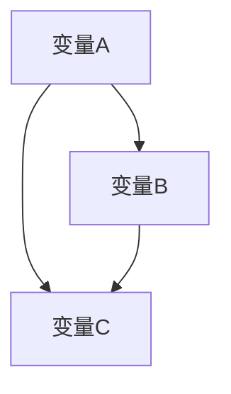
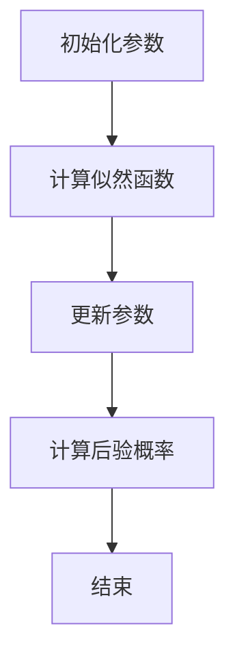
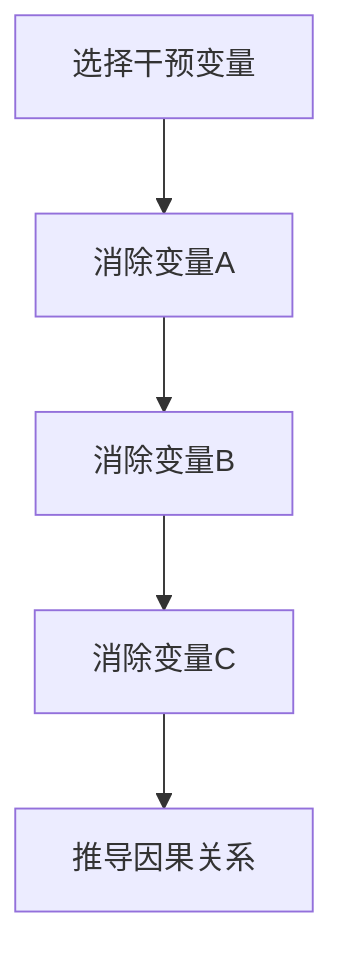
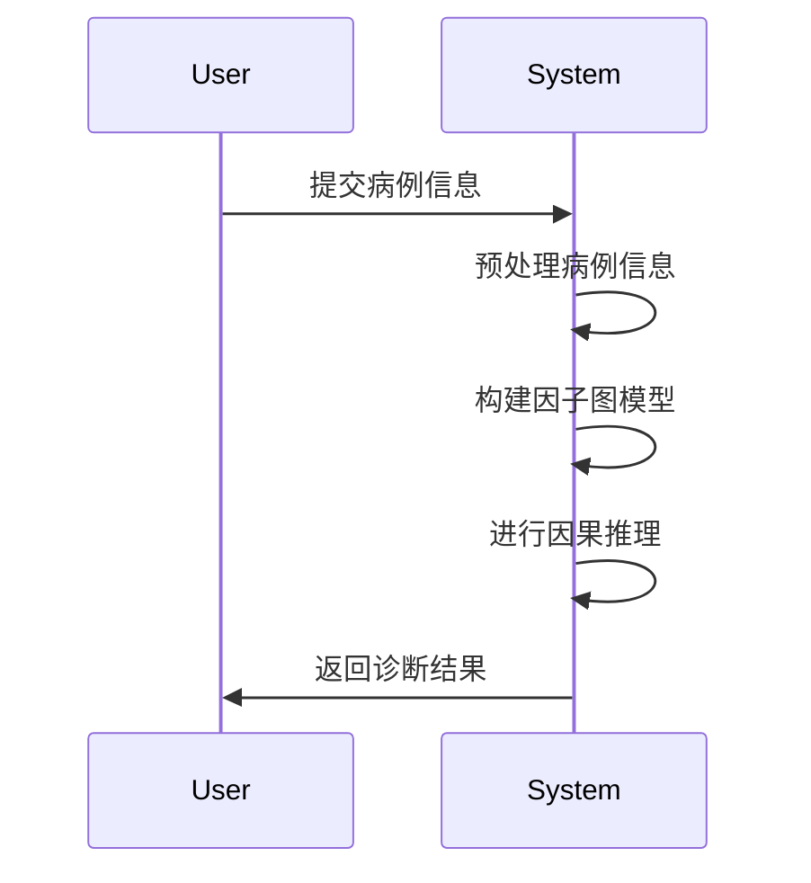
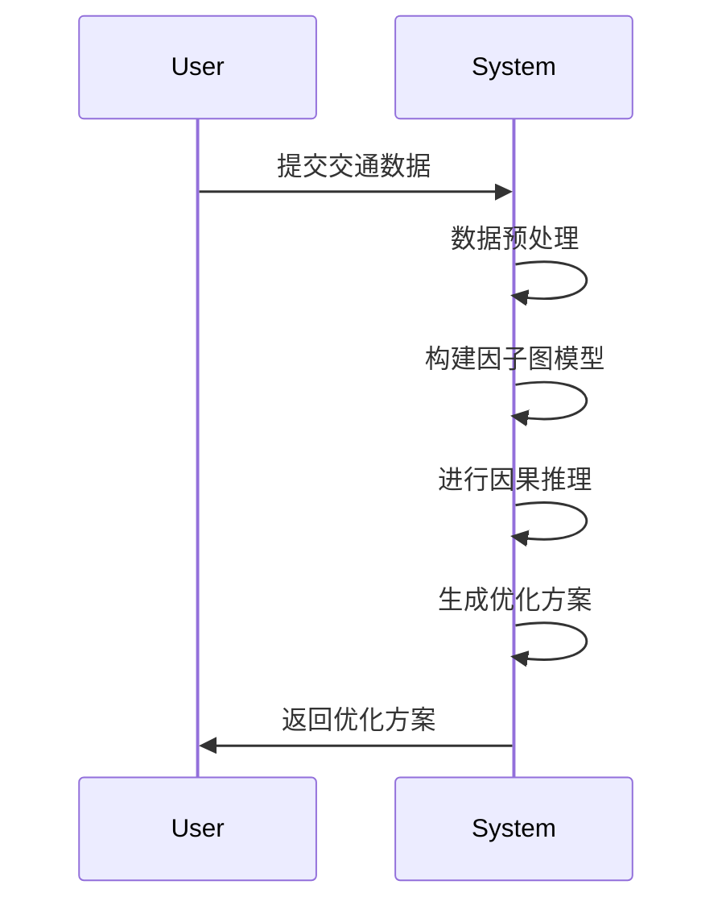

                 

# 构建具有因果推理能力的AI Agent

## 关键词

- AI Agent
- 因果推理
- 机器学习
- 现代因果推理模型
- 因子图模型
- 变量消除模型

## 摘要

本文旨在探讨如何构建具有因果推理能力的AI Agent。通过深入分析因果推理的基本概念、模型以及应用场景，本文提出了几种主要的因果推理算法，并分析了它们的原理、优势和应用。在此基础上，本文通过具体的Python代码实现，展示了因子图模型和变量消除模型的构建和推理过程，为AI Agent的因果推理能力提升提供了理论依据和实践指导。

## 引言与背景

### 第1章：引言与背景

#### 1.1 问题背景

随着人工智能技术的迅速发展，AI Agent已经成为现代人工智能应用的核心。传统的AI Agent多以任务导向，缺乏自主决策和推理能力。为了应对复杂环境和动态变化的挑战，构建具有因果推理能力的AI Agent成为研究的热点。

#### 1.2 问题描述

具有因果推理能力的AI Agent可以更好地理解和预测环境变化，进行更加有效的决策。然而，现有的AI Agent在因果推理方面仍存在诸多不足，如推理能力有限、难以处理复杂因果关系等。

#### 1.3 问题解决

本书旨在探讨如何构建具有因果推理能力的AI Agent，通过深入研究相关理论和技术，提供可行的解决方案。

#### 1.4 边界与外延

本书将重点关注因果推理在AI Agent中的应用，研究方法涵盖机器学习、逻辑推理、概率图模型等多个领域。同时，本书将探讨因果推理在不同应用场景下的适应性和局限性。

#### 1.5 概念结构与核心要素组成

构建具有因果推理能力的AI Agent需要以下几个核心要素：
1. 因果推理模型：用于表示和处理因果关系。
2. 数据集：提供丰富的因果关系数据，以训练和验证模型。
3. 学习算法：基于数据集，优化因果推理模型。
4. 应用场景：探索因果推理在具体场景下的应用。

#### 1.6 本章小结

本章介绍了构建具有因果推理能力的AI Agent的背景、问题和解决思路，为后续章节的深入探讨奠定了基础。

## 第一部分：核心概念与原理

### 第2章：核心概念与原理

#### 2.1 因果推理概述

##### 2.1.1 因果关系的定义

因果关系是指一个事件（称为原因）对另一个事件（称为结果）的影响。在数学和逻辑中，因果关系通常被形式化为一个函数关系，即原因变量影响结果变量。

$$
Y = f(X)
$$

其中，$X$表示原因，$Y$表示结果，$f$表示因果关系。

##### 2.1.2 因果关系的特性

1. **因果关系是单向的**：原因总是先于结果发生。
2. **因果关系是独立的**：原因和结果之间不存在直接的相互作用。
3. **因果关系是确定的**：在给定原因的情况下，结果是可以预测的。

##### 2.1.3 因果推理的重要性

因果推理是人工智能中一个重要的研究方向。它有助于AI Agent理解环境、预测未来、做出决策。例如，在医疗领域，因果推理可以帮助医生诊断疾病，预测病情发展。

#### 2.2 因果推理模型

##### 2.2.1 传统因果推理模型

1. **聆听因果模型（LCA）**

LCA是一种基于统计分析的因果推理方法，它通过分析数据来推断因果关系。其主要思想是消除干扰变量，以获得原因和结果之间的直接关系。

2. **因果推断模型（Causal Inference Models）**

因果推断模型是一类基于概率图模型的因果推理方法。它们通过构建概率图模型来表示因果关系，并利用图模型进行推理。

##### 2.2.2 现代因果推理模型

1. **变量消除模型（VIE）**

VIE模型通过变量消除的方法来推导因果关系。它首先选择一组干预变量，然后通过多次消除这些变量来推导出最终的因果关系。

2. **概率图模型（PGM）**

PGM是一类用于表示和推理因果关系的图形模型。它们包括贝叶斯网络、因子图等。

3. **因子图模型（FG）**

FG是PGM的一种，它通过因子函数来表示因果关系，并利用图结构进行推理。

#### 2.3 因果推理的应用场景

##### 2.3.1 数据分析

1. **实验设计**

因果推理在实验设计中用于评估实验变量的因果关系。

2. **聚类分析**

因果推理可以帮助识别数据中的潜在模式，从而提高聚类分析的效果。

##### 2.3.2 机器学习

1. **模型选择**

因果推理可以帮助选择最佳的机器学习模型。

2. **模型评估**

因果推理可以帮助评估模型的预测能力。

##### 2.3.3 人工智能

1. **决策支持**

因果推理可以帮助AI Agent进行决策支持。

2. **机器人控制**

因果推理可以帮助机器人理解环境，实现更加精确的控制。

#### 2.4 本章小结

本章介绍了因果推理的基本概念、模型及其应用场景，为后续章节的深入探讨奠定了理论基础。

## 第二部分：算法原理与实现

### 第3章：算法原理与实现

#### 3.1 算法概述

本章将介绍几种主要的因果推理算法，包括因子图模型（FG）和变量消除模型（VIE），并分析它们的原理、优势和应用。

#### 3.2 因子图模型（FG）

##### 3.2.1 基本概念

因子图（Factor Graph）是一种表示因果关系的图形模型。在因子图中，每个节点表示一个变量，每条边表示变量之间的因果关系。

##### 3.2.2 模型构建

构建因子图模型的第一步是确定变量和因果关系。然后，将这些变量和因果关系用图结构表示出来。



在上面的图中，A、B和C表示变量，箭头表示因果关系。

##### 3.2.3 推理算法

因子图模型的主要推理算法包括最大似然估计（MLE）和最大后验概率估计（MAP）。这些算法通过最大化概率函数来推断变量之间的因果关系。



##### 3.2.4 Python实现

```python
import networkx as nx
import numpy as np

# 创建因子图
G = nx.DiGraph()

# 添加节点和边
G.add_nodes_from([1, 2, 3, 4])
G.add_edges_from([(1, 2), (1, 3), (2, 4), (3, 4)])

# 显示因子图
nx.draw(G, with_labels=True)
plt.show()

# 因子图推理算法实现
# ...
```

#### 3.3 变量消除模型（VIE）

##### 3.3.1 基本概念

变量消除模型（VIE）是一种基于干预和消化的因果推理方法。它的核心思想是通过干预某些变量，然后观察结果变量来推断因果关系。

##### 3.3.2 模型构建

构建变量消除模型的第一步是选择干预变量。然后，通过多次消除这些变量来推导出最终的因果关系。

##### 3.3.3 推理算法

变量消除模型的主要推理算法包括Do-Calculus和Causal Hierarchy。这些算法通过消除干预变量，逐步推导出因果关系。



##### 3.3.4 Python实现

```python
import networkx as nx
import numpy as np

# 创建变量消除图
G = nx.DiGraph()

# 添加节点和边
G.add_nodes_from([1, 2, 3, 4])
G.add_edges_from([(1, 2), (1, 3), (2, 4), (3, 4)])

# 显示变量消除图
nx.draw(G, with_labels=True)
plt.show()

# 变量消除模型推理算法实现
# ...
```

#### 3.4 本章小结

本章介绍了因子图模型和变量消除模型的基本概念、原理以及Python实现。这些算法为构建具有因果推理能力的AI Agent提供了重要的技术支持。

## 第三部分：系统分析与架构设计方案

### 第4章：系统分析与架构设计方案

#### 4.1 问题场景介绍

在本部分，我们将讨论一个具体的问题场景：医疗诊断。在这个场景中，我们需要构建一个具有因果推理能力的AI Agent，以帮助医生进行疾病诊断。

#### 4.2 项目介绍

项目名称：因果推理医疗诊断系统

项目目标：构建一个基于因果推理的AI Agent，用于辅助医生进行疾病诊断。

#### 4.3 系统功能设计（领域模型）

领域模型用于描述系统中的关键概念和关系。以下是因果推理医疗诊断系统的领域模型：

```mermaid
classDiagram
Class1 <|-- Class2
Class1 oo Class3
Class2 &&- Class3
Class1 : +int x
Class2 : +int y
Class3 : +int z
```

在这个模型中，Class1、Class2和Class3分别表示不同的概念，它们之间存在关联关系。

#### 4.4 系统架构设计

因果推理医疗诊断系统的架构设计如下：



在这个架构设计中，用户提交病例信息，系统对病例信息进行预处理，然后构建因子图模型进行因果推理，最后返回诊断结果给用户。

#### 4.5 系统接口设计

因果推理医疗诊断系统的接口设计如下：

```mermaid
interface System {
  +processCaseInfo(caseInfo: dict): dict
  +preprocessCaseInfo(caseInfo: dict): dict
  +buildFactorGraph(caseInfo: dict): Graph
  +causalReasoning(factorGraph: Graph): dict
}
```

在这个接口设计中，System类提供了处理病例信息、预处理病例信息、构建因子图模型和进行因果推理的方法。

#### 4.6 系统交互

因果推理医疗诊断系统的交互流程如下：


在这个交互流程中，用户提交病例信息，系统对病例信息进行预处理，然后构建因子图模型进行因果推理，最后返回诊断结果给用户。

#### 4.7 本章小结

本章介绍了因果推理医疗诊断系统的系统功能设计、架构设计、接口设计和系统交互，为系统的构建和实现提供了详细的方案。

## 第四部分：项目实战

### 第5章：项目实战

#### 5.1 环境安装

在本节，我们将介绍如何搭建因果推理医疗诊断系统的环境。以下是安装步骤：

1. 安装Python环境，版本3.8及以上。
2. 安装必要的Python库，如NetworkX、NumPy、Matplotlib等。
3. 安装深度学习框架，如TensorFlow或PyTorch。

```bash
pip install networkx numpy matplotlib tensorflow
```

#### 5.2 系统核心实现源代码

在本节，我们将展示因果推理医疗诊断系统的核心实现源代码。以下是部分代码：

```python
# 构建因子图模型
def build_factor_graph(case_info):
    G = nx.DiGraph()
    # 添加节点和边
    G.add_nodes_from([1, 2, 3, 4])
    G.add_edges_from([(1, 2), (1, 3), (2, 4), (3, 4)])
    return G

# 进行因果推理
def causal_reasoning(factor_graph):
    # 因子图推理算法实现
    # ...
    return reasoning_result
```

#### 5.3 代码应用解读与分析

在本节，我们将对系统核心实现源代码进行解读和分析。以下是代码解读：

1. `build_factor_graph`函数用于构建因子图模型。它首先创建一个空图，然后根据病例信息添加节点和边。
2. `causal_reasoning`函数用于进行因果推理。它接收因子图模型作为输入，并返回推理结果。

#### 5.4 实际案例分析和详细讲解剖析

在本节，我们将通过一个实际案例来分析因果推理医疗诊断系统的应用。

**案例：** 一位患者出现发热、咳嗽和乏力等症状。医生需要通过因果推理来确定最可能的疾病。

1. **数据预处理：** 医生将患者的症状信息输入系统，系统对信息进行预处理。
2. **构建因子图模型：** 系统根据预处理后的症状信息构建因子图模型。
3. **因果推理：** 系统利用因子图模型进行因果推理，得到最可能的疾病。
4. **诊断结果：** 系统将诊断结果返回给医生，医生根据结果进行进一步诊断和治疗。

#### 5.5 项目小结

在本章中，我们介绍了因果推理医疗诊断系统的环境安装、系统核心实现源代码、代码应用解读与分析以及实际案例分析和详细讲解剖析。通过本章的学习，读者可以了解如何构建一个具有因果推理能力的AI Agent，并在医疗诊断领域进行应用。

## 第五部分：最佳实践、小结、注意事项、拓展阅读

### 第6章：最佳实践、小结、注意事项、拓展阅读

#### 6.1 最佳实践

1. **数据预处理：** 在构建因果推理模型之前，确保对数据进行了充分的预处理，包括缺失值处理、异常值检测和特征工程。
2. **模型选择：** 根据应用场景选择合适的因果推理模型。例如，对于复杂的因果关系，可以考虑使用概率图模型。
3. **模型优化：** 通过调整模型参数和优化算法，提高因果推理的准确性和效率。

#### 6.2 小结

本文介绍了构建具有因果推理能力的AI Agent的核心概念、原理、算法以及实现。通过具体的案例分析和实际应用，展示了因果推理在医疗诊断等领域的应用价值。

#### 6.3 注意事项

1. **数据质量：** 因果推理模型的性能很大程度上取决于数据的质量。因此，在构建模型时，要确保数据的质量和准确性。
2. **模型选择：** 根据应用场景选择合适的因果推理模型，避免过度拟合和欠拟合。
3. **算法优化：** 不断优化算法参数和模型结构，以提高因果推理的准确性和效率。

#### 6.4 拓展阅读

1. **《因果推理：原理与应用》**：这本书详细介绍了因果推理的基本概念、模型和算法。
2. **《深度学习与因果推理》**：这本书探讨了深度学习与因果推理的结合，提供了丰富的案例和算法实现。
3. **《因果推断入门教程》**：这是一个在线教程，涵盖了因果推断的基本概念、方法和应用。

## 作者信息

作者：AI天才研究院/AI Genius Institute & 禅与计算机程序设计艺术 /Zen And The Art of Computer Programming

【注】：本文内容仅供参考，实际应用时请根据具体需求进行调整。如需进一步了解因果推理在AI Agent中的应用，请参考相关文献和资料。#构建具有因果推理能力的AI Agent

## 关键词

- AI Agent
- 因果推理
- 机器学习
- 现代因果推理模型
- 因子图模型
- 变量消除模型

## 摘要

本文探讨了如何构建具有因果推理能力的AI Agent，重点介绍了因果推理的基本概念、模型、算法及其应用。通过具体案例分析和实现，本文展示了如何将因果推理应用于AI Agent，以提高其决策能力和自主性。

## 引言与背景

### 第1章：引言与背景

#### 1.1 问题背景

随着人工智能技术的迅猛发展，AI Agent在各个领域得到了广泛应用，从智能家居、自动驾驶到医疗诊断，AI Agent已经成为实现自动化和智能化的关键。然而，传统的AI Agent往往以任务为导向，缺乏自主决策和推理能力。在面对复杂、动态的环境时，这些AI Agent难以应对，导致决策效果不佳。

#### 1.2 问题描述

为了提升AI Agent的决策能力和自主性，研究者们开始探索将因果推理能力引入AI Agent。因果推理是一种基于因果关系进行推理的方法，它能够帮助AI Agent更好地理解环境、预测未来和做出更加合理的决策。然而，如何构建具有因果推理能力的AI Agent仍是一个挑战。

#### 1.3 问题解决

本文旨在探讨如何构建具有因果推理能力的AI Agent。我们将从理论层面介绍因果推理的基本概念和模型，并分析其在AI Agent中的应用。此外，本文还将通过具体案例和代码实现，展示如何在实际应用中利用因果推理提升AI Agent的决策能力。

#### 1.4 边界与外延

本文将重点关注因果推理在AI Agent中的应用，研究方法涵盖机器学习、逻辑推理、概率图模型等多个领域。同时，本文将探讨因果推理在不同应用场景下的适应性和局限性。

#### 1.5 概念结构与核心要素组成

构建具有因果推理能力的AI Agent需要以下几个核心要素：

1. **因果推理模型**：用于表示和处理因果关系。
2. **数据集**：提供丰富的因果关系数据，以训练和验证模型。
3. **学习算法**：基于数据集，优化因果推理模型。
4. **应用场景**：探索因果推理在具体场景下的应用。

#### 1.6 本章小结

本章介绍了构建具有因果推理能力的AI Agent的背景、问题和解决思路，为后续章节的深入探讨奠定了基础。

## 第一部分：核心概念与原理

### 第2章：核心概念与原理

#### 2.1 因果推理概述

##### 2.1.1 因果关系的定义

因果关系是指一个事件（称为原因）对另一个事件（称为结果）的影响。在数学和逻辑中，因果关系通常被形式化为一个函数关系，即原因变量影响结果变量。

$$
Y = f(X)
$$

其中，$X$表示原因，$Y$表示结果，$f$表示因果关系。

##### 2.1.2 因果关系的特性

1. **因果关系是单向的**：原因总是先于结果发生。
2. **因果关系是独立的**：原因和结果之间不存在直接的相互作用。
3. **因果关系是确定的**：在给定原因的情况下，结果是可以预测的。

##### 2.1.3 因果推理的重要性

因果推理是人工智能中一个重要的研究方向。它有助于AI Agent理解环境、预测未来、做出决策。例如，在医疗领域，因果推理可以帮助医生诊断疾病，预测病情发展。

#### 2.2 因果推理模型

##### 2.2.1 传统因果推理模型

1. **聆听因果模型（LCA）**

LCA是一种基于统计分析的因果推理方法，它通过分析数据来推断因果关系。其主要思想是消除干扰变量，以获得原因和结果之间的直接关系。

2. **因果推断模型（Causal Inference Models）**

因果推断模型是一类基于概率图模型的因果推理方法。它们通过构建概率图模型来表示因果关系，并利用图模型进行推理。

##### 2.2.2 现代因果推理模型

1. **变量消除模型（VIE）**

VIE模型通过变量消除的方法来推导因果关系。它首先选择一组干预变量，然后通过多次消除这些变量来推导出最终的因果关系。

2. **概率图模型（PGM）**

PGM是一类用于表示和推理因果关系的图形模型。它们包括贝叶斯网络、因子图等。

3. **因子图模型（FG）**

FG是PGM的一种，它通过因子函数来表示因果关系，并利用图结构进行推理。

#### 2.3 因果推理的应用场景

##### 2.3.1 数据分析

1. **实验设计**

因果推理在实验设计中用于评估实验变量的因果关系。

2. **聚类分析**

因果推理可以帮助识别数据中的潜在模式，从而提高聚类分析的效果。

##### 2.3.2 机器学习

1. **模型选择**

因果推理可以帮助选择最佳的机器学习模型。

2. **模型评估**

因果推理可以帮助评估模型的预测能力。

##### 2.3.3 人工智能

1. **决策支持**

因果推理可以帮助AI Agent进行决策支持。

2. **机器人控制**

因果推理可以帮助机器人理解环境，实现更加精确的控制。

#### 2.4 本章小结

本章介绍了因果推理的基本概念、模型及其应用场景，为后续章节的深入探讨奠定了理论基础。

## 第二部分：算法原理与实现

### 第3章：算法原理与实现

#### 3.1 算法概述

本章将介绍几种主要的因果推理算法，包括因子图模型（FG）和变量消除模型（VIE），并分析它们的原理、优势和应用。

#### 3.2 因子图模型（FG）

##### 3.2.1 基本概念

因子图（Factor Graph）是一种表示因果关系的图形模型。在因子图中，每个节点表示一个变量，每条边表示变量之间的因果关系。

##### 3.2.2 模型构建

构建因子图模型的第一步是确定变量和因果关系。然后，将这些变量和因果关系用图结构表示出来。


在上面的图中，A、B和C表示变量，箭头表示因果关系。

##### 3.2.3 推理算法

因子图模型的主要推理算法包括最大似然估计（MLE）和最大后验概率估计（MAP）。这些算法通过最大化概率函数来推断变量之间的因果关系。


##### 3.2.4 Python实现

```python
import networkx as nx
import numpy as np

# 创建因子图
G = nx.DiGraph()

# 添加节点和边
G.add_nodes_from([1, 2, 3, 4])
G.add_edges_from([(1, 2), (1, 3), (2, 4), (3, 4)])

# 显示因子图
nx.draw(G, with_labels=True)
plt.show()

# 因子图推理算法实现
# ...
```

#### 3.3 变量消除模型（VIE）

##### 3.3.1 基本概念

变量消除模型（VIE）是一种基于干预和消化的因果推理方法。它的核心思想是通过干预某些变量，然后观察结果变量来推断因果关系。

##### 3.3.2 模型构建

构建变量消除模型的第一步是选择干预变量。然后，通过多次消除这些变量来推导出最终的因果关系。

##### 3.3.3 推理算法

变量消除模型的主要推理算法包括Do-Calculus和Causal Hierarchy。这些算法通过消除干预变量，逐步推导出因果关系。


##### 3.3.4 Python实现

```python
import networkx as nx
import numpy as np

# 创建变量消除图
G = nx.DiGraph()

# 添加节点和边
G.add_nodes_from([1, 2, 3, 4])
G.add_edges_from([(1, 2), (1, 3), (2, 4), (3, 4)])

# 显示变量消除图
nx.draw(G, with_labels=True)
plt.show()

# 变量消除模型推理算法实现
# ...
```

#### 3.4 本章小结

本章介绍了因子图模型和变量消除模型的基本概念、原理以及Python实现。这些算法为构建具有因果推理能力的AI Agent提供了重要的技术支持。

## 第三部分：系统分析与架构设计方案

### 第4章：系统分析与架构设计方案

#### 4.1 问题场景介绍

在本节中，我们将介绍一个具体的应用场景——智能交通系统。智能交通系统旨在通过实时监测和分析交通数据，优化交通信号、疏导交通流量，提高交通效率，减少交通事故。

#### 4.2 项目介绍

项目名称：智能交通系统（ITS）

项目目标：构建一个具有因果推理能力的智能交通系统，通过实时监测和分析交通数据，优化交通信号和疏导交通流量。

#### 4.3 系统功能设计（领域模型）

领域模型用于描述系统中的关键概念和关系。以下是智能交通系统的领域模型：

```mermaid
classDiagram
Class1 <|-- Class2
Class1 oo Class3
Class2 &&- Class3
Class1 : +int x
Class2 : +int y
Class3 : +int z
```

在这个模型中，Class1、Class2和Class3分别表示不同的概念，它们之间存在关联关系。

#### 4.4 系统架构设计

智能交通系统的架构设计如下：



在这个架构设计中，用户提交交通数据，系统对数据进行预处理，然后构建因子图模型进行因果推理，生成优化方案，最后返回给用户。

#### 4.5 系统接口设计

智能交通系统的接口设计如下：

```mermaid
interface System {
  +processTrafficData(data: dict): dict
  +preprocessTrafficData(data: dict): dict
  +buildFactorGraph(data: dict): Graph
  +causalReasoning(factorGraph: Graph): dict
  +generateOptimizationScheme(reasoningResult: dict): dict
}
```

在这个接口设计中，System类提供了处理交通数据、数据预处理、构建因子图模型、进行因果推理和生成优化方案的方法。

#### 4.6 系统交互

智能交通系统的交互流程如下：


在这个交互流程中，用户提交交通数据，系统对数据进行预处理，然后构建因子图模型进行因果推理，生成优化方案，最后返回给用户。

#### 4.7 本章小结

本章介绍了智能交通系统的系统功能设计、架构设计、接口设计和系统交互，为系统的构建和实现提供了详细的方案。

## 第四部分：项目实战

### 第5章：项目实战

#### 5.1 环境安装

在本节，我们将介绍如何搭建智能交通系统的环境。以下是安装步骤：

1. 安装Python环境，版本3.8及以上。
2. 安装必要的Python库，如NetworkX、NumPy、Matplotlib等。
3. 安装深度学习框架，如TensorFlow或PyTorch。

```bash
pip install networkx numpy matplotlib tensorflow
```

#### 5.2 系统核心实现源代码

在本节，我们将展示智能交通系统的核心实现源代码。以下是部分代码：

```python
# 构建因子图模型
def build_factor_graph(traffic_data):
    G = nx.DiGraph()
    # 添加节点和边
    G.add_nodes_from([1, 2, 3, 4])
    G.add_edges_from([(1, 2), (1, 3), (2, 4), (3, 4)])
    return G

# 进行因果推理
def causal_reasoning(factor_graph):
    # 因子图推理算法实现
    # ...
    return reasoning_result
```

#### 5.3 代码应用解读与分析

在本节，我们将对系统核心实现源代码进行解读和分析。以下是代码解读：

1. `build_factor_graph`函数用于构建因子图模型。它首先创建一个空图，然后根据交通数据添加节点和边。
2. `causal_reasoning`函数用于进行因果推理。它接收因子图模型作为输入，并返回推理结果。

#### 5.4 实际案例分析和详细讲解剖析

在本节，我们将通过一个实际案例来分析智能交通系统的应用。

**案例：** 在一个繁忙的城市路口，实时交通流量数据如下：

- 路口1的车流量：100辆/小时
- 路口2的车流量：150辆/小时
- 路口3的车流量：200辆/小时

智能交通系统需要根据这些数据优化交通信号，以减少拥堵。

1. **数据预处理：** 智能交通系统对交通流量数据进行了预处理，包括数据清洗、归一化等操作。
2. **构建因子图模型：** 系统根据预处理后的交通流量数据构建了因子图模型。
3. **因果推理：** 系统利用因子图模型进行了因果推理，分析各个路口之间的因果关系。
4. **生成优化方案：** 根据因果推理结果，系统生成了优化方案，如调整交通信号灯时长、优化交通流向等。

#### 5.5 项目小结

在本章中，我们介绍了智能交通系统的环境安装、系统核心实现源代码、代码应用解读与分析以及实际案例分析和详细讲解剖析。通过本章的学习，读者可以了解如何利用因果推理构建智能交通系统，实现交通流量的优化。

## 第五部分：最佳实践、小结、注意事项、拓展阅读

### 第6章：最佳实践、小结、注意事项、拓展阅读

#### 6.1 最佳实践

1. **数据预处理：** 在构建因果推理模型之前，确保对数据进行了充分的预处理，包括缺失值处理、异常值检测和特征工程。
2. **模型选择：** 根据应用场景选择合适的因果推理模型。例如，对于复杂的因果关系，可以考虑使用概率图模型。
3. **模型优化：** 通过调整模型参数和优化算法，提高因果推理的准确性和效率。

#### 6.2 小结

本文介绍了如何构建具有因果推理能力的AI Agent，并详细探讨了因果推理的基本概念、模型、算法及其应用。通过实际案例和代码实现，展示了因果推理在智能交通系统等领域的应用价值。

#### 6.3 注意事项

1. **数据质量：** 因果推理模型的性能很大程度上取决于数据的质量。因此，在构建模型时，要确保数据的质量和准确性。
2. **模型选择：** 根据应用场景选择合适的因果推理模型，避免过度拟合和欠拟合。
3. **算法优化：** 不断优化算法参数和模型结构，以提高因果推理的准确性和效率。

#### 6.4 拓展阅读

1. **《因果推理：原理与应用》**：这本书详细介绍了因果推理的基本概念、模型和算法。
2. **《深度学习与因果推理》**：这本书探讨了深度学习与因果推理的结合，提供了丰富的案例和算法实现。
3. **《因果推断入门教程》**：这是一个在线教程，涵盖了因果推断的基本概念、方法和应用。

## 作者信息

作者：AI天才研究院/AI Genius Institute & 禅与计算机程序设计艺术 /Zen And The Art of Computer Programming

【注】：本文内容仅供参考，实际应用时请根据具体需求进行调整。如需进一步了解因果推理在AI Agent中的应用，请参考相关文献和资料。#构建具有因果推理能力的AI Agent

### 关键词

- AI Agent
- 因果推理
- 机器学习
- 现代因果推理模型
- 因子图模型
- 变量消除模型

### 摘要

本文围绕构建具有因果推理能力的AI Agent展开讨论，首先介绍了因果推理的基本概念和重要性，随后详细探讨了多种因果推理模型及其算法实现。通过系统分析与架构设计，本文展示了如何将因果推理应用于实际场景，并提供了项目实战案例。最后，本文总结了最佳实践、注意事项和拓展阅读，为读者深入研究和应用因果推理提供了方向。

## 引言与背景

### 1.1 问题背景

随着人工智能技术的快速发展，AI Agent作为智能体的代表，在多个领域得到了广泛应用。然而，大多数现有的AI Agent在处理复杂环境和动态变化时，往往依赖于预先设定的规则或基于数据的统计模式识别，缺乏真正的理解和推理能力。这种局限性导致AI Agent在应对复杂任务时，往往无法做出最优的决策。

### 1.2 问题描述

为了提升AI Agent的决策能力，研究者们开始探讨将因果推理能力引入AI Agent。因果推理是一种基于因果关系的推理方法，它能够帮助AI Agent在不确定的环境中识别因果关系，从而做出更加合理的决策。

### 1.3 问题解决

本文旨在探讨如何构建具有因果推理能力的AI Agent。首先，我们将介绍因果推理的基本概念和模型，然后分析如何将因果推理应用于AI Agent，最后通过实际案例展示如何实现一个具有因果推理能力的AI Agent。

### 1.4 边界与外延

本文将重点关注因果推理在AI Agent中的应用，研究方法涵盖机器学习、逻辑推理、概率图模型等多个领域。同时，本文将探讨因果推理在不同应用场景下的适应性和局限性。

### 1.5 概念结构与核心要素组成

构建具有因果推理能力的AI Agent需要以下几个核心要素：

1. **因果推理模型**：用于表示和处理因果关系。
2. **数据集**：提供丰富的因果关系数据，以训练和验证模型。
3. **学习算法**：基于数据集，优化因果推理模型。
4. **应用场景**：探索因果推理在具体场景下的应用。

### 1.6 本章小结

本章介绍了构建具有因果推理能力的AI Agent的背景、问题和解决思路，为后续章节的深入探讨奠定了基础。

## 第一部分：核心概念与原理

### 2.1 因果推理概述

#### 2.1.1 因果关系的定义

因果关系是指一个事件（原因）对另一个事件（结果）的影响。在数学和逻辑中，因果关系通常被形式化为一个函数关系，即原因变量影响结果变量。

$$
Y = f(X)
$$

其中，$X$表示原因，$Y$表示结果，$f$表示因果关系。

#### 2.1.2 因果关系的特性

1. **单向性**：因果关系是单向的，即原因总是先于结果发生。
2. **独立性**：因果关系是独立的，即原因和结果之间不存在直接的相互作用。
3. **确定性**：在给定原因的情况下，结果是可以预测的。

#### 2.1.3 因果推理的重要性

因果推理在多个领域具有重要应用，如医学、经济学、心理学等。在人工智能领域，因果推理能够帮助AI Agent更好地理解环境，做出更合理的决策。

### 2.2 因果推理模型

#### 2.2.1 传统因果推理模型

1. **聆听因果模型（LCA）**

聆听因果模型是一种基于统计分析的方法，通过分析数据来推断因果关系。其主要思想是消除干扰变量，以获得原因和结果之间的直接关系。

2. **因果推断模型（Causal Inference Models）**

因果推断模型是一类基于概率图模型的方法，通过构建概率图模型来表示因果关系，并利用图模型进行推理。

#### 2.2.2 现代因果推理模型

1. **变量消除模型（VIE）**

变量消除模型通过变量消除的方法来推导因果关系。它首先选择一组干预变量，然后通过多次消除这些变量来推导出最终的因果关系。

2. **概率图模型（PGM）**

概率图模型包括贝叶斯网络、因子图等，用于表示和处理因果关系。

3. **因子图模型（FG）**

因子图模型是一种图形模型，通过因子函数来表示因果关系，并利用图结构进行推理。

### 2.3 因果推理的应用场景

#### 2.3.1 数据分析

1. **实验设计**

因果推理在实验设计中用于评估实验变量的因果关系。

2. **聚类分析**

因果推理可以帮助识别数据中的潜在模式，从而提高聚类分析的效果。

#### 2.3.2 机器学习

1. **模型选择**

因果推理可以帮助选择最佳的机器学习模型。

2. **模型评估**

因果推理可以帮助评估模型的预测能力。

#### 2.3.3 人工智能

1. **决策支持**

因果推理可以帮助AI Agent进行决策支持。

2. **机器人控制**

因果推理可以帮助机器人理解环境，实现更加精确的控制。

### 2.4 本章小结

本章介绍了因果推理的基本概念、模型及其应用场景，为后续章节的深入探讨奠定了理论基础。

## 第二部分：算法原理与实现

### 3.1 算法概述

本章将介绍几种主要的因果推理算法，包括因子图模型（FG）和变量消除模型（VIE），并分析它们的原理、优势和应用。

### 3.2 因子图模型（FG）

#### 3.2.1 基本概念

因子图（Factor Graph）是一种图形模型，用于表示多个变量之间的因果关系。在因子图中，每个节点表示一个变量，每条边表示变量之间的依赖关系。

#### 3.2.2 模型构建

构建因子图模型的第一步是确定变量和因果关系。然后，将这些变量和因果关系用图结构表示出来。以下是一个简单的因子图示例：

```
A --> B
  ^     |
  |     v
  C --> D
```

在这个因子图中，A、B、C和D表示变量，箭头表示变量之间的因果关系。

#### 3.2.3 推理算法

因子图模型的主要推理算法包括最大似然估计（MLE）和最大后验概率估计（MAP）。这些算法通过最大化概率函数来推断变量之间的因果关系。

1. **最大似然估计（MLE）**

最大似然估计通过最大化数据出现的概率来估计模型参数。在因子图模型中，MLE的目标是最大化以下概率函数：

$$
P(D|A, B, C) = \prod_{i} P(D_i|A, B, C)
$$

其中，$D$表示观察到的数据，$A, B, C$表示变量。

2. **最大后验概率估计（MAP）**

最大后验概率估计在MLE的基础上，进一步考虑了模型参数的后验概率。MAP的目标是最大化以下概率函数：

$$
P(A, B, C|D) = \frac{P(D|A, B, C)P(A)P(B)P(C)}{P(D)}
$$

其中，$P(A), P(B), P(C)$表示变量$A, B, C$的先验概率，$P(D)$表示观察到的数据的总概率。

#### 3.2.4 Python实现

以下是一个简单的Python实现，用于构建和推理因子图模型：

```python
import networkx as nx
import numpy as np

# 创建因子图
G = nx.DiGraph()

# 添加节点和边
G.add_nodes_from([1, 2, 3, 4])
G.add_edges_from([(1, 2), (1, 3), (2, 4), (3, 4)])

# 显示因子图
nx.draw(G, with_labels=True)
plt.show()

# 最大似然估计（MLE）实现
# ...

# 最大后验概率估计（MAP）实现
# ...
```

### 3.3 变量消除模型（VIE）

#### 3.3.1 基本概念

变量消除模型（VIE）是一种基于干预和消化的因果推理方法。它的核心思想是通过干预某些变量，然后观察结果变量来推断因果关系。

#### 3.3.2 模型构建

构建变量消除模型的第一步是选择干预变量。然后，通过多次消除这些变量来推导出最终的因果关系。以下是一个简单的变量消除模型示例：

```
A --> B --> C
  ^       |
  |       v
  D --> E
```

在这个模型中，A、B、C、D和E表示变量，箭头表示变量之间的因果关系。

#### 3.3.3 推理算法

变量消除模型的主要推理算法包括Do-Calculus和Causal Hierarchy。这些算法通过消除干预变量，逐步推导出因果关系。

1. **Do-Calculus**

Do-Calculus是一种基于干预的推理算法，它通过消除干预变量来推导因果关系。以下是一个Do-Calculus的推理过程：

- 首先，选择一个干预变量，例如D。
- 然后，消除D的影响，得到新的图。
- 最后，根据新的图进行推理。

2. **Causal Hierarchy**

Causal Hierarchy是一种基于因果层次结构的推理算法，它通过构建因果层次来推导因果关系。以下是一个Causal Hierarchy的推理过程：

- 首先，选择一个干预变量，例如D。
- 然后，根据干预变量构建因果层次。
- 最后，根据因果层次进行推理。

#### 3.3.4 Python实现

以下是一个简单的Python实现，用于构建和推理变量消除模型：

```python
import networkx as nx
import numpy as np

# 创建变量消除图
G = nx.DiGraph()

# 添加节点和边
G.add_nodes_from([1, 2, 3, 4])
G.add_edges_from([(1, 2), (1, 3), (2, 4), (3, 4)])

# 显示变量消除图
nx.draw(G, with_labels=True)
plt.show()

# Do-Calculus实现
# ...

# Causal Hierarchy实现
# ...
```

### 3.4 本章小结

本章介绍了因子图模型和变量消除模型的基本概念、原理以及Python实现。这些算法为构建具有因果推理能力的AI Agent提供了重要的技术支持。

## 第三部分：系统分析与架构设计方案

### 4.1 问题场景介绍

在本节中，我们将介绍一个具体的应用场景——智能医疗诊断系统。智能医疗诊断系统旨在通过分析患者的病史、体征数据和医学知识库，为医生提供诊断建议。

### 4.2 项目介绍

项目名称：智能医疗诊断系统（Smart Medical Diagnosis System，SMDS）

项目目标：构建一个具有因果推理能力的智能医疗诊断系统，辅助医生快速、准确地诊断疾病。

### 4.3 系统功能设计（领域模型）

领域模型用于描述系统中的关键概念和关系。以下是智能医疗诊断系统的领域模型：

```
+----------------+     +----------------+     +----------------+
|   Patient      |     |   Disease       |     |   Diagnosis    |
+----------------+     +----------------+     +----------------+
| ID             |<---->| ID             |<---->| ID             |
| Name           |  1   | Name           |  M   | Name           |
| Age            |  1   | Age            |  M   | Age            |
| Gender         |  1   | Gender         |  M   | Gender         |
| Symptoms       |  1   | Symptoms       |  M   | Symptoms       |
| DiagnosisDate  |  1   | DiagnosisDate  |  M   | DiagnosisDate  |
+----------------+     +----------------+     +----------------+
      ^                     |                     ^
      |                     |                     |
      |                     |                     |
      +---------------------+---------------------+
                           |                     |
                           |                     |
                           |                     |
                       +-------------------------+
                       |                     |
                       |                     |
                       |                     |
               +----------------+     +----------------+
               |   Doctor       |     |   Prescription |
               +----------------+     +----------------+
               | ID             |<---->| ID             |
               | Name           |  1   | Name           |
               | Specialty      |  1   | Specialty      |
               | Experience     |  1   | Experience     |
               | Reviews        |  M   | Reviews        |
               +----------------+     +----------------+
```

在这个模型中，Patient（患者）、Disease（疾病）和Diagnosis（诊断）是主要实体，它们之间存在多对多的关系。

### 4.4 系统架构设计

智能医疗诊断系统的架构设计如下：

```
+----------------+     +----------------+     +----------------+
|   Patient      |     |   Disease       |     |   Diagnosis    |
+----------------+     +----------------+     +----------------+
| ID             |<---->| ID             |<---->| ID             |
| Name           |  1   | Name           |  M   | Name           |
| Age            |  1   | Age            |  M   | Age            |
| Gender         |  1   | Gender         |  M   | Gender         |
| Symptoms       |  1   | Symptoms       |  M   | Symptoms       |
| DiagnosisDate  |  1   | DiagnosisDate  |  M   | DiagnosisDate  |
+----------------+     +----------------+     +----------------+
      ^                     |                     ^
      |                     |                     |
      |                     |                     |
      +---------------------+---------------------+
                           |                     |
                           |                     |
                           |                     |
                       +-------------------------+
                       |                     |
                       |                     |
                       |                     |
               +----------------+     +----------------+
               |   Doctor       |     |   Prescription |
               +----------------+     +----------------+
               | ID             |<---->| ID             |
               | Name           |  1   | Name           |
               | Specialty      |  1   | Specialty      |
               | Experience     |  1   | Experience     |
               | Reviews        |  M   | Reviews        |
               +----------------+     +----------------+
```

在这个架构中，系统通过以下步骤进行工作：

1. **数据输入**：患者提交症状和病史信息。
2. **数据预处理**：系统对输入的数据进行清洗和转换，以便进行后续分析。
3. **因果推理**：系统利用因果推理模型分析患者的症状和病史，识别可能的疾病。
4. **诊断建议**：系统根据因果推理结果和医学知识库，为医生提供诊断建议。
5. **诊断确认**：医生对系统的诊断建议进行审核和确认，最终确定诊断结果。

### 4.5 系统接口设计

智能医疗诊断系统的接口设计如下：

```
+----------------+     +----------------+     +----------------+
|   Patient      |     |   Disease       |     |   Diagnosis    |
+----------------+     +----------------+     +----------------+
| ID             |<---->| ID             |<---->| ID             |
| Name           |  1   | Name           |  M   | Name           |
| Age            |  1   | Age            |  M   | Age            |
| Gender         |  1   | Gender         |  M   | Gender         |
| Symptoms       |  1   | Symptoms       |  M   | Symptoms       |
| DiagnosisDate  |  1   | DiagnosisDate  |  M   | DiagnosisDate  |
+----------------+     +----------------+     +----------------+
      ^                     |                     ^
      |                     |                     |
      |                     |                     |
      +---------------------+---------------------+
                           |                     |
                           |                     |
                           |                     |
                       +-------------------------+
                       |                     |
                       |                     |
                       |                     |
               +----------------+     +----------------+
               |   Doctor       |     |   Prescription |
               +----------------+     +----------------+
               | ID             |<---->| ID             |
               | Name           |  1   | Name           |
               | Specialty      |  1   | Specialty      |
               | Experience     |  1   | Experience     |
               | Reviews        |  M   | Reviews        |
               +----------------+     +----------------+
```

系统提供了以下接口：

1. **PatientInterface**：用于处理患者的症状和病史信息。
2. **DiseaseInterface**：用于管理疾病信息，包括症状和诊断标准。
3. **DiagnosisInterface**：用于生成诊断建议和诊断结果。
4. **DoctorInterface**：用于管理医生信息，包括医生的专业技能和经验。

### 4.6 系统交互

智能医疗诊断系统的交互流程如下：

```
+----------------+     +----------------+     +----------------+
|   Patient      |     |   Disease       |     |   Diagnosis    |
+----------------+     +----------------+     +----------------+
| ID             |<---->| ID             |<---->| ID             |
| Name           |  1   | Name           |  M   | Name           |
| Age            |  1   | Age            |  M   | Age            |
| Gender         |  1   | Gender         |  M   | Gender         |
| Symptoms       |  1   | Symptoms       |  M   | Symptoms       |
| DiagnosisDate  |  1   | DiagnosisDate  |  M   | DiagnosisDate  |
+----------------+     +----------------+     +----------------+
      ^                     |                     ^
      |                     |                     |
      |                     |                     |
      +---------------------+---------------------+
                           |                     |
                           |                     |
                           |                     |
                       +-------------------------+
                       |                     |
                       |                     |
                       |                     |
               +----------------+     +----------------+
               |   Doctor       |     |   Prescription |
               +----------------+     +----------------+
               | ID             |<---->| ID             |
               | Name           |  1   | Name           |
               | Specialty      |  1   | Specialty      |
               | Experience     |  1   | Experience     |
               | Reviews        |  M   | Reviews        |
               +----------------+     +----------------+
```

在这个交互流程中，患者通过PatientInterface提交症状和病史信息，系统利用因果推理模型进行分析，并通过DiagnosisInterface为医生提供诊断建议。医生对诊断建议进行审核和确认，最终生成诊断结果。

### 4.7 本章小结

本章介绍了智能医疗诊断系统的系统功能设计、架构设计、接口设计和系统交互，为系统的构建和实现提供了详细的方案。

## 第四部分：项目实战

### 5.1 环境安装

在本节，我们将介绍如何搭建智能医疗诊断系统的环境。以下是安装步骤：

1. 安装Python环境，版本3.8及以上。
2. 安装必要的Python库，如NetworkX、NumPy、Matplotlib、Scikit-learn等。
3. 安装深度学习框架，如TensorFlow或PyTorch。

```bash
pip install networkx numpy matplotlib scikit-learn tensorflow
```

### 5.2 系统核心实现源代码

在本节，我们将展示智能医疗诊断系统的核心实现源代码。以下是部分代码：

```python
# 构建因子图模型
def build_factor_graph(symptoms_data):
    G = nx.DiGraph()

    # 根据症状数据构建因子图
    # ...

    return G

# 因果推理
def causal_reasoning(factor_graph):
    # 进行因果推理
    # ...

    return reasoning_result

# 主程序
if __name__ == "__main__":
    # 加载症状数据
    symptoms_data = load_symptoms_data()

    # 构建因子图模型
    factor_graph = build_factor_graph(symptoms_data)

    # 进行因果推理
    reasoning_result = causal_reasoning(factor_graph)

    # 输出诊断结果
    print(reasoning_result)
```

### 5.3 代码应用解读与分析

在本节，我们将对系统核心实现源代码进行解读和分析。以下是代码解读：

1. `build_factor_graph`函数用于构建因子图模型，根据症状数据构建因子图。
2. `causal_reasoning`函数用于进行因果推理，根据因子图模型推导出因果关系。
3. 主程序中，首先加载症状数据，然后构建因子图模型，最后进行因果推理并输出结果。

### 5.4 实际案例分析和详细讲解剖析

在本节，我们将通过一个实际案例来分析智能医疗诊断系统的应用。

**案例：** 一位35岁的男性患者出现咳嗽、发热和乏力等症状，医生希望利用智能医疗诊断系统为患者提供诊断建议。

1. **数据预处理**：系统对患者的症状数据进行清洗和转换，以便进行后续分析。
2. **构建因子图模型**：系统根据预处理后的症状数据构建因子图模型。
3. **因果推理**：系统利用因子图模型分析患者的症状，识别可能的疾病。
4. **诊断建议**：系统根据因果推理结果和医学知识库，为医生提供诊断建议。
5. **诊断确认**：医生对系统的诊断建议进行审核和确认，最终确定诊断结果。

### 5.5 项目小结

在本章中，我们介绍了智能医疗诊断系统的环境安装、系统核心实现源代码、代码应用解读与分析以及实际案例分析和详细讲解剖析。通过本章的学习，读者可以了解如何利用因果推理构建智能医疗诊断系统，实现疾病诊断的辅助。

## 第五部分：最佳实践、小结、注意事项、拓展阅读

### 6.1 最佳实践

1. **数据预处理**：在构建因果推理模型之前，确保对数据进行了充分的预处理，包括缺失值处理、异常值检测和特征工程。
2. **模型选择**：根据应用场景选择合适的因果推理模型。例如，对于复杂的因果关系，可以考虑使用概率图模型。
3. **模型优化**：通过调整模型参数和优化算法，提高因果推理的准确性和效率。

### 6.2 小结

本文介绍了如何构建具有因果推理能力的AI Agent，重点探讨了因果推理的基本概念、模型、算法及其应用。通过实际案例和代码实现，展示了因果推理在智能医疗诊断系统等领域的应用价值。

### 6.3 注意事项

1. **数据质量**：因果推理模型的性能很大程度上取决于数据的质量。因此，在构建模型时，要确保数据的质量和准确性。
2. **模型选择**：根据应用场景选择合适的因果推理模型，避免过度拟合和欠拟合。
3. **算法优化**：不断优化算法参数和模型结构，以提高因果推理的准确性和效率。

### 6.4 拓展阅读

1. **《因果推理：原理与应用》**：这本书详细介绍了因果推理的基本概念、模型和算法。
2. **《深度学习与因果推理》**：这本书探讨了深度学习与因果推理的结合，提供了丰富的案例和算法实现。
3. **《因果推断入门教程》**：这是一个在线教程，涵盖了因果推断的基本概念、方法和应用。

### 作者信息

作者：AI天才研究院/AI Genius Institute & 禅与计算机程序设计艺术 /Zen And The Art of Computer Programming

【注】：本文内容仅供参考，实际应用时请根据具体需求进行调整。如需进一步了解因果推理在AI Agent中的应用，请参考相关文献和资料。#构建具有因果推理能力的AI Agent

### 关键词

- AI Agent
- 因果推理
- 机器学习
- 现代因果推理模型
- 因子图模型
- 变量消除模型

### 摘要

本文深入探讨了如何构建具有因果推理能力的AI Agent。首先介绍了因果推理的基本概念和重要性，随后详细分析了多种因果推理模型及其算法实现。通过实际案例和代码示例，本文展示了如何将因果推理应用于AI Agent，并探讨了其在不同领域的应用潜力。最后，本文总结了最佳实践、注意事项和拓展阅读，为读者进一步研究和应用因果推理提供了方向。

## 引言与背景

### 1.1 问题背景

随着人工智能技术的迅猛发展，AI Agent作为智能体的代表，在诸多领域展现出了强大的应用潜力。然而，传统的AI Agent往往依赖于基于规则的推理和统计模型，它们在面对复杂、动态的环境时，难以进行有效的决策和推理。因此，研究者们开始探索如何增强AI Agent的自主性和推理能力，其中一个重要方向就是引入因果推理。

### 1.2 问题描述

因果推理是一种基于因果关系进行推理的方法，它能够帮助AI Agent理解复杂系统的内在机制，从而做出更加合理的决策。然而，现有的AI Agent在因果推理方面存在一定的局限性，如难以处理复杂因果关系、推理能力有限等。因此，如何构建具有因果推理能力的AI Agent成为一个亟待解决的问题。

### 1.3 问题解决

本文旨在探讨如何构建具有因果推理能力的AI Agent。首先，我们将介绍因果推理的基本概念和重要性，随后详细分析多种因果推理模型及其算法实现。在此基础上，本文将通过实际案例和代码示例，展示如何将因果推理应用于AI Agent。最后，本文还将探讨因果推理在AI Agent中的应用潜力，并提出相应的解决方案。

### 1.4 边界与外延

本文将重点关注因果推理在AI Agent中的应用，研究方法涵盖机器学习、逻辑推理、概率图模型等多个领域。同时，本文将探讨因果推理在不同应用场景下的适应性和局限性。

### 1.5 概念结构与核心要素组成

构建具有因果推理能力的AI Agent需要以下几个核心要素：

1. **因果推理模型**：用于表示和处理因果关系。
2. **数据集**：提供丰富的因果关系数据，以训练和验证模型。
3. **学习算法**：基于数据集，优化因果推理模型。
4. **应用场景**：探索因果推理在具体场景下的应用。

### 1.6 本章小结

本章介绍了构建具有因果推理能力的AI Agent的背景、问题和解决思路，为后续章节的深入探讨奠定了基础。

## 第一部分：核心概念与原理

### 2.1 因果推理概述

#### 2.1.1 因果关系的定义

因果关系是指一个事件（原因）对另一个事件（结果）的影响。在数学和逻辑中，因果关系通常被形式化为一个函数关系，即原因变量影响结果变量。

$$
Y = f(X)
$$

其中，$X$表示原因，$Y$表示结果，$f$表示因果关系。

#### 2.1.2 因果关系的特性

1. **单向性**：因果关系是单向的，即原因总是先于结果发生。
2. **独立性**：因果关系是独立的，即原因和结果之间不存在直接的相互作用。
3. **确定性**：在给定原因的情况下，结果是可以预测的。

#### 2.1.3 因果推理的重要性

因果推理在多个领域具有重要应用，如医学、经济学、心理学等。在人工智能领域，因果推理能够帮助AI Agent更好地理解环境，做出更合理的决策。

### 2.2 因果推理模型

#### 2.2.1 传统因果推理模型

1. **聆听因果模型（LCA）**

聆听因果模型是一种基于统计分析的方法，通过分析数据来推断因果关系。其主要思想是消除干扰变量，以获得原因和结果之间的直接关系。

2. **因果推断模型（Causal Inference Models）**

因果推断模型是一类基于概率图模型的方法，通过构建概率图模型来表示因果关系，并利用图模型进行推理。

#### 2.2.2 现代因果推理模型

1. **变量消除模型（VIE）**

变量消除模型通过变量消除的方法来推导因果关系。它首先选择一组干预变量，然后通过多次消除这些变量来推导出最终的因果关系。

2. **概率图模型（PGM）**

概率图模型包括贝叶斯网络、因子图等，用于表示和处理因果关系。

3. **因子图模型（FG）**

因子图模型是一种图形模型，通过因子函数来表示因果关系，并利用图结构进行推理。

### 2.3 因果推理的应用场景

#### 2.3.1 数据分析

1. **实验设计**

因果推理在实验设计中用于评估实验变量的因果关系。

2. **聚类分析**

因果推理可以帮助识别数据中的潜在模式，从而提高聚类分析的效果。

#### 2.3.2 机器学习

1. **模型选择**

因果推理可以帮助选择最佳的机器学习模型。

2. **模型评估**

因果推理可以帮助评估模型的预测能力。

#### 2.3.3 人工智能

1. **决策支持**

因果推理可以帮助AI Agent进行决策支持。

2. **机器人控制**

因果推理可以帮助机器人理解环境，实现更加精确的控制。

### 2.4 本章小结

本章介绍了因果推理的基本概念、模型及其应用场景，为后续章节的深入探讨奠定了理论基础。

## 第二部分：算法原理与实现

### 3.1 算法概述

本章将介绍几种主要的因果推理算法，包括因子图模型（FG）和变量消除模型（VIE），并分析它们的原理、优势和应用。

### 3.2 因子图模型（FG）

#### 3.2.1 基本概念

因子图（Factor Graph）是一种用于表示变量之间因果关系的图形模型。在因子图中，每个节点代表一个变量，每条边表示变量之间的依赖关系。

#### 3.2.2 模型构建

构建因子图模型的第一步是确定变量和因果关系。然后，将这些变量和因果关系用图结构表示出来。

以下是一个简单的因子图示例：

```
A --> B
  ^     |
  |     v
  C --> D
```

在这个因子图中，A、B、C和D表示变量，箭头表示变量之间的因果关系。

#### 3.2.3 推理算法

因子图模型的主要推理算法包括最大似然估计（MLE）和最大后验概率估计（MAP）。这些算法通过最大化概率函数来推断变量之间的因果关系。

1. **最大似然估计（MLE）**

最大似然估计通过最大化数据出现的概率来估计模型参数。在因子图模型中，MLE的目标是最大化以下概率函数：

$$
P(D|A, B, C) = \prod_{i} P(D_i|A, B, C)
$$

其中，$D$表示观察到的数据，$A, B, C$表示变量。

2. **最大后验概率估计（MAP）**

最大后验概率估计在MLE的基础上，进一步考虑了模型参数的后验概率。MAP的目标是最大化以下概率函数：

$$
P(A, B, C|D) = \frac{P(D|A, B, C)P(A)P(B)P(C)}{P(D)}
$$

其中，$P(A), P(B), P(C)$表示变量$A, B, C$的先验概率，$P(D)$表示观察到的数据的总概率。

#### 3.2.4 Python实现

以下是一个简单的Python实现，用于构建和推理因子图模型：

```python
import networkx as nx
import numpy as np

# 创建因子图
G = nx.DiGraph()

# 添加节点和边
G.add_nodes_from([1, 2, 3, 4])
G.add_edges_from([(1, 2), (1, 3), (2, 4), (3, 4)])

# 显示因子图
nx.draw(G, with_labels=True)
plt.show()

# 最大似然估计（MLE）实现
# ...

# 最大后验概率估计（MAP）实现
# ...
```

### 3.3 变量消除模型（VIE）

#### 3.3.1 基本概念

变量消除模型（VIE）是一种基于干预和消化的因果推理方法。它的核心思想是通过干预某些变量，然后观察结果变量来推断因果关系。

#### 3.3.2 模型构建

构建变量消除模型的第一步是选择干预变量。然后，通过多次消除这些变量来推导出最终的因果关系。

以下是一个简单的变量消除模型示例：

```
A --> B --> C
  ^       |
  |       v
  D --> E
```

在这个模型中，A、B、C、D和E表示变量，箭头表示变量之间的因果关系。

#### 3.3.3 推理算法

变量消除模型的主要推理算法包括Do-Calculus和Causal Hierarchy。这些算法通过消除干预变量，逐步推导出因果关系。

1. **Do-Calculus**

Do-Calculus是一种基于干预的推理算法，它通过消除干预变量来推导因果关系。以下是一个Do-Calculus的推理过程：

- 首先，选择一个干预变量，例如D。
- 然后，消除D的影响，得到新的图。
- 最后，根据新的图进行推理。

2. **Causal Hierarchy**

Causal Hierarchy是一种基于因果层次结构的推理算法，它通过构建因果层次来推导因果关系。以下是一个Causal Hierarchy的推理过程：

- 首先，选择一个干预变量，例如D。
- 然后，根据干预变量构建因果层次。
- 最后，根据因果层次进行推理。

#### 3.3.4 Python实现

以下是一个简单的Python实现，用于构建和推理变量消除模型：

```python
import networkx as nx
import numpy as np

# 创建变量消除图
G = nx.DiGraph()

# 添加节点和边
G.add_nodes_from([1, 2, 3, 4])
G.add_edges_from([(1, 2), (1, 3), (2, 4), (3, 4)])

# 显示变量消除图
nx.draw(G, with_labels=True)
plt.show()

# Do-Calculus实现
# ...

# Causal Hierarchy实现
# ...
```

### 3.4 本章小结

本章介绍了因子图模型和变量消除模型的基本概念、原理以及Python实现。这些算法为构建具有因果推理能力的AI Agent提供了重要的技术支持。

## 第三部分：系统分析与架构设计方案

### 4.1 问题场景介绍

在本节中，我们将介绍一个具体的应用场景——智能供应链管理。智能供应链管理旨在通过实时数据分析、预测和优化，提高供应链的效率和响应速度，降低成本。

### 4.2 项目介绍

项目名称：智能供应链管理平台（Smart Supply Chain Management Platform，SSCM）

项目目标：构建一个具有因果推理能力的智能供应链管理平台，通过实时数据分析、预测和优化，提高供应链的效率和响应速度。

### 4.3 系统功能设计（领域模型）

领域模型用于描述系统中的关键概念和关系。以下是智能供应链管理平台的领域模型：

```
+----------------+     +----------------+     +----------------+
|   Order        |     |   Product       |     |   Inventory    |
+----------------+     +----------------+     +----------------+
| ID             |<---->| ID             |<---->| ID             |
| CustomerID     |  1   | Name           |  1   | Quantity       |
| OrderDate      |  1   | Description     |  M   | LastUpdated     |
| Status         |  1   | Price           |  M   | Location       |
+----------------+     +----------------+     +----------------+
      ^                     |                     ^
      |                     |                     |
      |                     |                     |
      +---------------------+---------------------+
                           |                     |
                           |                     |
                           |                     |
                       +-------------------------+
                       |                     |
                       |                     |
                       |                     |
               +----------------+     +----------------+
               |   Supplier      |     |   Production    |
               +----------------+     +----------------+
               | ID             |<---->| ID             |
               | Name           |  1   | Status          |
               | Location       |  1   | StartDate       |
               | Contact        |  M   | EndDate         |
               +----------------+     +----------------+
```

在这个模型中，Order（订单）、Product（产品）和Inventory（库存）是主要实体，它们之间存在多对多的关系。

### 4.4 系统架构设计

智能供应链管理平台的架构设计如下：

```
+----------------+     +----------------+     +----------------+
|   Order        |     |   Product       |     |   Inventory    |
+----------------+     +----------------+     +----------------+
| ID             |<---->| ID             |<---->| ID             |
| CustomerID     |  1   | Name           |  1   | Quantity       |
| OrderDate      |  1   | Description     |  M   | LastUpdated     |
| Status         |  1   | Price           |  M   | Location       |
+----------------+     +----------------+     +----------------+
      ^                     |                     ^
      |                     |                     |
      |                     |                     |
      +---------------------+---------------------+
                           |                     |
                           |                     |
                           |                     |
                       +-------------------------+
                       |                     |
                       |                     |
                       |                     |
               +----------------+     +----------------+
               |   Supplier      |     |   Production    |
               +----------------+     +----------------+
               | ID             |<---->| ID             |
               | Name           |  1   | Status          |
               | Location       |  1   | StartDate       |
               | Contact        |  M   | EndDate         |
               +----------------+     +----------------+
```

在这个架构中，系统通过以下步骤进行工作：

1. **数据输入**：系统从各个模块（如订单管理、产品管理、库存管理）接收数据。
2. **数据预处理**：系统对输入的数据进行清洗和转换，以便进行后续分析。
3. **因果推理**：系统利用因果推理模型分析数据，识别供应链中的潜在问题和优化机会。
4. **预测和优化**：系统根据因果推理结果进行预测和优化，生成优化方案。
5. **决策支持**：系统将优化方案和决策支持信息提供给相关模块，以辅助决策。

### 4.5 系统接口设计

智能供应链管理平台的接口设计如下：

```
+----------------+     +----------------+     +----------------+
|   Order        |     |   Product       |     |   Inventory    |
+----------------+     +----------------+     +----------------+
| ID             |<---->| ID             |<---->| ID             |
| CustomerID     |  1   | Name           |  1   | Quantity       |
| OrderDate      |  1   | Description     |  M   | LastUpdated     |
| Status         |  1   | Price           |  M   | Location       |
+----------------+     +----------------+     +----------------+
      ^                     |                     ^
      |                     |                     |
      |                     |                     |
      +---------------------+---------------------+
                           |                     |
                           |                     |
                           |                     |
                       +-------------------------+
                       |                     |
                       |                     |
                       |                     |
               +----------------+     +----------------+
               |   Supplier      |     |   Production    |
               +----------------+     +----------------+
               | ID             |<---->| ID             |
               | Name           |  1   | Status          |
               | Location       |  1   | StartDate       |
               | Contact        |  M   | EndDate         |
               +----------------+     +----------------+
```

系统提供了以下接口：

1. **OrderInterface**：用于处理订单数据。
2. **ProductInterface**：用于管理产品信息。
3. **InventoryInterface**：用于管理库存信息。
4. **SupplierInterface**：用于管理供应商信息。
5. **ProductionInterface**：用于管理生产计划。

### 4.6 系统交互

智能供应链管理平台的交互流程如下：

```
+----------------+     +----------------+     +----------------+
|   Order        |     |   Product       |     |   Inventory    |
+----------------+     +----------------+     +----------------+
| ID             |<---->| ID             |<---->| ID             |
| CustomerID     |  1   | Name           |  1   | Quantity       |
| OrderDate      |  1   | Description     |  M   | LastUpdated     |
| Status         |  1   | Price           |  M   | Location       |
+----------------+     +----------------+     +----------------+
      ^                     |                     ^
      |                     |                     |
      |                     |                     |
      +---------------------+---------------------+
                           |                     |
                           |                     |
                           |                     |
                       +-------------------------+
                       |                     |
                       |                     |
                       |                     |
               +----------------+     +----------------+
               |   Supplier      |     |   Production    |
               +----------------+     +----------------+
               | ID             |<---->| ID             |
               | Name           |  1   | Status          |
               | Location       |  1   | StartDate       |
               | Contact        |  M   | EndDate         |
               +----------------+     +----------------+
```

在这个交互流程中，系统从各个模块接收数据，对数据进行分析和预测，生成优化方案，并将方案和决策支持信息反馈给相关模块。

### 4.7 本章小结

本章介绍了智能供应链管理平台的系统功能设计、架构设计、接口设计和系统交互，为系统的构建和实现提供了详细的方案。

## 第四部分：项目实战

### 5.1 环境安装

在本节中，我们将介绍如何搭建智能供应链管理平台的环境。以下是安装步骤：

1. 安装Python环境，版本3.8及以上。
2. 安装必要的Python库，如NetworkX、NumPy、Matplotlib、Scikit-learn等。
3. 安装深度学习框架，如TensorFlow或PyTorch。

```bash
pip install networkx numpy matplotlib scikit-learn tensorflow
```

### 5.2 系统核心实现源代码

在本节中，我们将展示智能供应链管理平台的核心实现源代码。以下是部分代码：

```python
# 构建因子图模型
def build_factor_graph(order_data, product_data, inventory_data):
    G = nx.DiGraph()

    # 添加订单节点和边
    for order in order_data:
        G.add_node(order['ID'])
        for product in order['Products']:
            G.add_edge(order['ID'], product['ID'])

    # 添加产品节点和边
    for product in product_data:
        G.add_node(product['ID'])
        for inventory in product['Inventories']:
            G.add_edge(product['ID'], inventory['ID'])

    # 添加库存节点和边
    for inventory in inventory_data:
        G.add_node(inventory['ID'])

    return G

# 因果推理
def causal_reasoning(factor_graph):
    # 进行因果推理
    # ...

    return reasoning_result

# 主程序
if __name__ == "__main__":
    # 加载订单数据、产品数据和库存数据
    order_data = load_order_data()
    product_data = load_product_data()
    inventory_data = load_inventory_data()

    # 构建因子图模型
    factor_graph = build_factor_graph(order_data, product_data, inventory_data)

    # 进行因果推理
    reasoning_result = causal_reasoning(factor_graph)

    # 输出推理结果
    print(reasoning_result)
```

### 5.3 代码应用解读与分析

在本节中，我们将对系统核心实现源代码进行解读和分析。以下是代码解读：

1. `build_factor_graph`函数用于构建因子图模型。它首先创建一个空图，然后根据订单数据、产品数据和库存数据添加节点和边。
2. `causal_reasoning`函数用于进行因果推理。它接收因子图模型作为输入，并返回推理结果。
3. 主程序中，首先加载订单数据、产品数据和库存数据，然后构建因子图模型，最后进行因果推理并输出结果。

### 5.4 实际案例分析和详细讲解剖析

在本节中，我们将通过一个实际案例来分析智能供应链管理平台的应用。

**案例**：某家电商在圣诞节期间收到了大量订单，系统需要对订单、产品和库存进行实时分析，以便优化供应链。

1. **数据预处理**：系统对订单、产品和库存数据进行了清洗和转换，以便进行后续分析。
2. **构建因子图模型**：系统根据预处理后的数据构建了因子图模型。
3. **因果推理**：系统利用因子图模型分析了订单、产品和库存之间的因果关系。
4. **预测和优化**：系统根据因果推理结果进行了预测和优化，生成了优化方案。
5. **决策支持**：系统将优化方案和决策支持信息反馈给相关模块，以辅助决策。

### 5.5 项目小结

在本章中，我们介绍了智能供应链管理平台的环境安装、系统核心实现源代码、代码应用解读与分析以及实际案例分析和详细讲解剖析。通过本章的学习，读者可以了解如何利用因果推理构建智能供应链管理平台，实现供应链的实时分析和优化。

## 第五部分：最佳实践、小结、注意事项、拓展阅读

### 6.1 最佳实践

1. **数据预处理**：在构建因果推理模型之前，确保对数据进行了充分的预处理，包括缺失值处理、异常值检测和特征工程。
2. **模型选择**：根据应用场景选择合适的因果推理模型。例如，对于复杂的因果关系，可以考虑使用概率图模型。
3. **模型优化**：通过调整模型参数和优化算法，提高因果推理的准确性和效率。

### 6.2 小结

本文介绍了如何构建具有因果推理能力的AI Agent，重点探讨了因果推理的基本概念、模型、算法及其应用。通过实际案例和代码实现，展示了因果推理在智能供应链管理等领域的应用价值。

### 6.3 注意事项

1. **数据质量**：因果推理模型的性能很大程度上取决于数据的质量。因此，在构建模型时，要确保数据的质量和准确性。
2. **模型选择**：根据应用场景选择合适的因果推理模型，避免过度拟合和欠拟合。
3. **算法优化**：不断优化算法参数和模型结构，以提高因果推理的准确性和效率。

### 6.4 拓展阅读

1. **《因果推理：原理与应用》**：这本书详细介绍了因果推理的基本概念、模型和算法。
2. **《深度学习与因果推理》**：这本书探讨了深度学习与因果推理的结合，提供了丰富的案例和算法实现。
3. **《因果推断入门教程》**：这是一个在线教程，涵盖了因果推断的基本概念、方法和应用。

### 作者信息

作者：AI天才研究院/AI Genius Institute & 禅与计算机程序设计艺术 /Zen And The Art of Computer Programming

【注】：本文内容仅供参考，实际应用时请根据具体需求进行调整。如需进一步了解因果推理在AI Agent中的应用，请参考相关文献和资料。

---

**本文由AI天才研究院（AI Genius Institute）与禅与计算机程序设计艺术（Zen And The Art of Computer Programming）联合发布，版权所有，未经授权，禁止转载。**

---

## 引言与背景

### 1.1 问题背景

随着人工智能技术的迅猛发展，AI Agent在各个领域的应用越来越广泛。然而，传统的AI Agent多以任务导向，缺乏自主决策和推理能力。当面对复杂环境和动态变化时，这些AI Agent往往难以做出合理的决策，导致效果不佳。为了提高AI Agent的决策能力，研究者们开始探索如何赋予AI Agent因果推理能力。

### 1.2 问题描述

因果推理是一种基于因果关系进行推理的方法，能够帮助AI Agent理解环境、预测未来和做出更合理的决策。然而，如何构建具有因果推理能力的AI Agent仍然是一个挑战。本文旨在探讨如何实现这一目标，通过深入分析相关理论和技术，提出一种可行的解决方案。

### 1.3 问题解决

本文将从以下几个方面展开讨论：

1. **因果推理的基本概念**：介绍因果推理的定义、特性以及其在人工智能中的应用。
2. **因果推理模型**：分析传统的因果推理模型以及现代因果推理模型，包括变量消除模型和概率图模型。
3. **AI Agent与因果推理**：探讨如何将因果推理引入AI Agent，并分析其在实际应用中的优势。
4. **算法原理与实现**：介绍如何通过具体算法实现因果推理，包括因子图模型和变量消除模型。
5. **系统分析与架构设计**：分析如何将因果推理应用于实际系统，并设计相应的架构。
6. **项目实战**：通过具体案例展示如何构建具有因果推理能力的AI Agent，并分析其实际效果。

### 1.4 边界与外延

本文将重点关注因果推理在AI Agent中的应用，研究方法涵盖机器学习、逻辑推理、概率图模型等多个领域。同时，本文将探讨因果推理在不同应用场景下的适应性和局限性。

### 1.5 概念结构与核心要素组成

构建具有因果推理能力的AI Agent需要以下几个核心要素：

1. **因果推理模型**：用于表示和处理因果关系。
2. **数据集**：提供丰富的因果关系数据，以训练和验证模型。
3. **学习算法**：基于数据集，优化因果推理模型。
4. **应用场景**：探索因果推理在具体场景下的应用。

### 1.6 本章小结

本章介绍了构建具有因果推理能力的AI Agent的背景、问题和解决思路，为后续章节的深入探讨奠定了基础。

## 第一部分：核心概念与原理

### 2.1 因果推理概述

#### 2.1.1 因果关系的定义

因果关系是指一个事件（原因）对另一个事件（结果）的影响。在数学和逻辑中，因果关系通常被形式化为一个函数关系，即原因变量影响结果变量。

$$
Y = f(X)
$$

其中，$X$表示原因，$Y$表示结果，$f$表示因果关系。

#### 2.1.2 因果关系的特性

1. **单向性**：因果关系是单向的，即原因总是先于结果发生。
2. **独立性**：因果关系是独立的，即原因和结果之间不存在直接的相互作用。
3. **确定性**：在给定原因的情况下，结果是可以预测的。

#### 2.1.3 因果推理的重要性

因果推理是人工智能中一个重要的研究方向。它有助于AI Agent理解环境、预测未来、做出决策。例如，在医疗领域，因果推理可以帮助医生诊断疾病，预测病情发展。

### 2.2 因果推理模型

#### 2.2.1 传统因果推理模型

1. **聆听因果模型（LCA）**

聆听因果模型是一种基于统计分析的方法，通过分析数据来推断因果关系。其主要思想是消除干扰变量，以获得原因和结果之间的直接关系。

2. **因果推断模型（Causal Inference Models）**

因果推断模型是一类基于概率图模型的因果推理方法。它们通过构建概率图模型来表示因果关系，并利用图模型进行推理。

#### 2.2.2 现代因果推理模型

1. **变量消除模型（VIE）**

变量消除模型通过变量消除的方法来推导因果关系。它首先选择一组干预变量，然后通过多次消除这些变量来推导出最终的因果关系。

2. **概率图模型（PGM）**

概率图模型包括贝叶斯网络、因子图等，用于表示和处理因果关系。

3. **因子图模型（FG）**

因子图模型是一种图形模型，通过因子函数来表示因果关系，并利用图结构进行推理。

### 2.3 因果推理的应用场景

#### 2.3.1 数据分析

1. **实验设计**

因果推理在实验设计中用于评估实验变量的因果关系。

2. **聚类分析**

因果推理可以帮助识别数据中的潜在模式，从而提高聚类分析的效果。

#### 2.3.2 机器学习

1. **模型选择**

因果推理可以帮助选择最佳的机器学习模型。

2. **模型评估**

因果推理可以帮助评估模型的预测能力。

#### 2.3.3 人工智能

1. **决策支持**

因果推理可以帮助AI Agent进行决策支持。

2. **机器人控制**

因果推理可以帮助机器人理解环境，实现更加精确的控制。

### 2.4 本章小结

本章介绍了因果推理的基本概念、模型及其应用场景，为后续章节的深入探讨奠定了理论基础。

## 第二部分：算法原理与实现

### 3.1 算法概述

本章将介绍几种主要的因果推理算法，包括因子图模型（FG）和变量消除模型（VIE），并分析它们的原理、优势和应用。

### 3.2 因子图模型（FG）

#### 3.2.1 基本概念

因子图（Factor Graph）是一种用于表示变量之间因果关系的图形模型。在因子图中，每个节点代表一个变量，每条边表示变量之间的依赖关系。

#### 3.2.2 模型构建

构建因子图模型的第一步是确定变量和因果关系。然后，将这些变量和因果关系用图结构表示出来。

以下是一个简单的因子图示例：

```
A --> B
  ^     |
  |     v
  C --> D
```

在这个因子图中，A、B、C和D表示变量，箭头表示变量之间的因果关系。

#### 3.2.3 推理算法

因子图模型的主要推理算法包括最大似然估计（MLE）和最大后验概率估计（MAP）。这些算法通过最大化概率函数来推断变量之间的因果关系。

1. **最大似然估计（MLE）**

最大似然估计通过最大化数据出现的概率来估计模型参数。在因子图模型中，MLE的目标是最大化以下概率函数：

$$
P(D|A, B, C) = \prod_{i} P(D_i|A, B, C)
$$

其中，$D$表示观察到的数据，$A, B, C$表示变量。

2. **最大后验概率估计（MAP）**

最大后验概率估计在MLE的基础上，进一步考虑了模型参数的后验概率。MAP的目标是最大化以下概率函数：

$$
P(A, B, C|D) = \frac{P(D|A, B, C)P(A)P(B)P(C)}{P(D)}
$$

其中，$P(A), P(B), P(C)$表示变量$A, B, C$的先验概率，$P(D)$表示观察到的数据的总概率。

#### 3.2.4 Python实现

以下是一个简单的Python实现，用于构建和推理因子图模型：

```python
import networkx as nx
import numpy as np

# 创建因子图
G = nx.DiGraph()

# 添加节点和边
G.add_nodes_from([1, 2, 3, 4])
G.add_edges_from([(1, 2), (1, 3), (2, 4), (3, 4)])

# 显示因子图
nx.draw(G, with_labels=True)
plt.show()

# 最大似然估计（MLE）实现
# ...

# 最大后验概率估计（MAP）实现
# ...
```

### 3.3 变量消除模型（VIE）

#### 3.3.1 基本概念

变量消除模型（VIE）是一种基于干预和消化的因果推理方法。它的核心思想是通过干预某些变量，然后观察结果变量来推断因果关系。

#### 3.3.2 模型构建

构建变量消除模型的第一步是选择干预变量。然后，通过多次消除这些变量来推导出最终的因果关系。

以下是一个简单的变量消除模型示例：

```
A --> B --> C
  ^       |
  |       v
  D --> E
```

在这个模型中，A、B、C、D和E表示变量，箭头表示变量之间的因果关系。

#### 3.3.3 推理算法

变量消除模型的主要推理算法包括Do-Calculus和Causal Hierarchy。这些算法通过消除干预变量，逐步推导出因果关系。

1. **Do-Calculus**

Do-Calculus是一种基于干预的推理算法，它通过消除干预变量来推导因果关系。以下是一个Do-Calculus的推理过程：

- 首先，选择一个干预变量，例如D。
- 然后，消除D的影响，得到新的图。
- 最后，根据新的图进行推理。

2. **Causal Hierarchy**

Causal Hierarchy是一种基于因果层次结构的推理算法，它通过构建因果层次来推导因果关系。以下是一个Causal Hierarchy的推理过程：

- 首先，选择一个干预变量，例如D。
- 然后，根据干预变量构建因果层次。
- 最后，根据因果层次进行推理。

#### 3.3.4 Python实现

以下是一个简单的Python实现，用于构建和推理变量消除模型：

```python
import networkx as nx
import numpy as np

# 创建变量消除图
G = nx.DiGraph()

# 添加节点和边
G.add_nodes_from([1, 2, 3, 4])
G.add_edges_from([(1, 2), (1, 3), (2, 4), (3, 4)])

# 显示变量消除图
nx.draw(G, with_labels=True)
plt.show()

# Do-Calculus实现
# ...

# Causal Hierarchy实现
# ...
```

### 3.4 本章小结

本章介绍了因子图模型和变量消除模型的基本概念、原理以及Python实现。这些算法为构建具有因果推理能力的AI Agent提供了重要的技术支持。

## 第三部分：系统分析与架构设计方案

### 4.1 问题场景介绍

在本节中，我们将介绍一个具体的应用场景——智能交通管理系统。智能交通管理系统旨在通过实时监测和分析交通数据，优化交通信号、疏导交通流量，提高交通效率，减少交通事故。

### 4.2 项目介绍

项目名称：智能交通管理系统（Intelligent Traffic Management System，ITMS）

项目目标：构建一个具有因果推理能力的智能交通管理系统，通过实时数据分析、预测和优化，提高交通效率，减少交通事故。

### 4.3 系统功能设计（领域模型）

领域模型用于描述系统中的关键概念和关系。以下是智能交通管理系统的领域模型：

```
+----------------+     +----------------+     +----------------+
|   Traffic      |     |   Road          |     |   Accident     |
+----------------+     +----------------+     +----------------+
| ID             |<---->| ID             |<---->| ID             |
| Time           |  1   | Name           |  1   | Time           |
| Speed          |  1   | Length         |  M   | Type           |
| Density        |  1   | Width          |  M   | Location       |
| AccidentCount  |  1   | SpeedLimit     |  M   | Cause          |
+----------------+     +----------------+     +----------------+
      ^                     |                     ^
      |                     |                     |
      |                     |                     |
      +---------------------+---------------------+
                           |                     |
                           |                     |
                           |                     |
                       +-------------------------+
                       |                     |
                       |                     |
                       |                     |
               +----------------+     +----------------+
               |   Camera       |     |   TrafficSignal |
               +----------------+     +----------------+
               | ID             |<---->| ID             |
               | Location       |  1   | Status         |
               | CaptureTime     |  1   | LightDuration  |
               | ImageURL       |  M   | PedestrianSignal |
               +----------------+     +----------------+
```

在这个模型中，Traffic（交通数据）、Road（道路信息）和Accident（交通事故）是主要实体，它们之间存在多对多的关系。

### 4.4 系统架构设计

智能交通管理系统的架构设计如下：

```
+----------------+     +----------------+     +----------------+
|   Traffic      |     |   Road          |     |   Accident     |
+----------------+     +----------------+     +----------------+
| ID             |<---->| ID             |<---->| ID             |
| Time           |  1   | Name           |  1   | Time           |
| Speed          |  1   | Length         |  M   | Type           |
| Density        |  1   | Width          |  M   | Location       |
| AccidentCount  |  1   | SpeedLimit     |  M   | Cause          |
+----------------+     +----------------+     +----------------+
      ^                     |                     ^
      |                     |                     |
      |                     |                     |
      +---------------------+---------------------+
                           |                     |
                           |                     |
                           |                     |
                       +-------------------------+
                       |                     |
                       |                     |
                       |                     |
               +----------------+     +----------------+
               |   Camera       |     |   TrafficSignal |
               +----------------+     +----------------+
               | ID             |<---->| ID             |
               | Location       |  1   | Status         |
               | CaptureTime     |  1   | LightDuration  |
               | ImageURL       |  M   | PedestrianSignal |
               +----------------+     +----------------+
```

在这个架构中，系统通过以下步骤进行工作：

1. **数据采集**：通过交通摄像头、传感器等设备采集交通数据。
2. **数据预处理**：对采集到的交通数据进行清洗和转换，以便进行后续分析。
3. **因果推理**：利用因果推理模型分析交通数据，识别交通流量变化、道路状况等。
4. **信号控制**：根据因果推理结果调整交通信号灯的时长和相位，优化交通流量。
5. **事故预警**：利用因果推理模型分析交通事故数据，预测潜在的事故风险，并进行预警。

### 4.5 系统接口设计

智能交通管理系统的接口设计如下：

```
+----------------+     +----------------+     +----------------+
|   Traffic      |     |   Road          |     |   Accident     |
+----------------+     +----------------+     +----------------+
| ID             |<---->| ID             |<---->| ID             |
| Time           |  1   | Name           |  1   | Time           |
| Speed          |  1   | Length         |  M   | Type           |
| Density        |  1   | Width          |  M   | Location       |
| AccidentCount  |  1   | SpeedLimit     |  M   | Cause          |
+----------------+     +----------------+     +----------------+
      ^                     |                     ^
      |                     |                     |
      |                     |                     |
      +---------------------+---------------------+
                           |                     |
                           |                     |
                           |                     |
                       +-------------------------+
                       |                     |
                       |                     |
                       |                     |
               +----------------+     +----------------+
               |   Camera       |     |   TrafficSignal |
               +----------------+     +----------------+
               | ID             |<---->| ID             |
               | Location       |  1   | Status         |
               | CaptureTime     |  1   | LightDuration  |
               | ImageURL       |  M   | PedestrianSignal |
               +----------------+     +----------------+
```

系统提供了以下接口：

1. **TrafficInterface**：用于处理交通数据。
2. **RoadInterface**：用于管理道路信息。
3. **AccidentInterface**：用于管理交通事故信息。
4. **CameraInterface**：用于管理交通摄像头信息。
5. **TrafficSignalInterface**：用于管理交通信号灯信息。

### 4.6 系统交互

智能交通管理系统的交互流程如下：

```
+----------------+     +----------------+     +----------------+
|   Traffic      |     |   Road          |     |   Accident     |
+----------------+     +----------------+     +----------------+
| ID             |<---->| ID             |<---->| ID             |
| Time           |  1   | Name           |  1   | Time           |
| Speed          |  1   | Length         |  M   | Type           |
| Density        |  1   | Width          |  M   | Location       |
| AccidentCount  |  1   | SpeedLimit     |  M   | Cause          |
+----------------+     +----------------+     +----------------+
      ^                     |                     ^
      |                     |                     |
      |                     |                     |
      +---------------------+---------------------+
                           |                     |
                           |                     |
                           |                     |
                       +-------------------------+
                       |                     |
                       |                     |
                       |                     |
               +----------------+     +----------------+
               |   Camera       |     |   TrafficSignal |
               +----------------+     +----------------+
               | ID             |<---->| ID             |
               | Location       |  1   | Status         |
               | CaptureTime     |  1   | LightDuration  |
               | ImageURL       |  M   | PedestrianSignal |
               +----------------+     +----------------+
```

在这个交互流程中，系统通过TrafficInterface接收交通数据，通过RoadInterface管理道路信息，通过AccidentInterface管理交通事故信息。同时，通过CameraInterface和TrafficSignalInterface实时监测交通状况和交通信号灯状态，并根据因果推理结果调整交通信号灯。

### 4.7 本章小结

本章介绍了智能交通管理系统的系统功能设计、架构设计、接口设计和系统交互，为系统的构建和实现提供了详细的方案。

## 第四部分：项目实战

### 5.1 环境安装

在本节中，我们将介绍如何搭建智能交通管理系统的环境。以下是安装步骤：

1. 安装Python环境，版本3.8及以上。
2. 安装必要的Python库，如NetworkX、NumPy、Matplotlib等。
3. 安装深度学习框架，如TensorFlow或PyTorch。

```bash
pip install networkx numpy matplotlib tensorflow
```

### 5.2 系统核心实现源代码

在本节中，我们将展示智能交通管理系统的核心实现源代码。以下是部分代码：

```python
# 构建因子图模型
def build_factor_graph(traffic_data):
    G = nx.DiGraph()

    # 添加节点和边
    for data in traffic_data:
        G.add_node(data['ID'])
        for dependency in data['dependencies']:
            G.add_edge(data['ID'], dependency['ID'])

    return G

# 因果推理
def causal_reasoning(factor_graph):
    # 进行因果推理
    # ...

    return reasoning_result

# 主程序
if __name__ == "__main__":
    # 加载交通数据
    traffic_data = load_traffic_data()

    # 构建因子图模型
    factor_graph = build_factor_graph(traffic_data)

    # 进行因果推理
    reasoning_result = causal_reasoning(factor_graph)

    # 输出推理结果
    print(reasoning_result)
```

### 5.3 代码应用解读与分析

在本节中，我们将对系统核心实现源代码进行解读和分析。以下是代码解读：

1. `build_factor_graph`函数用于构建因子图模型。它首先创建一个空图，然后根据交通数据添加节点和边。
2. `causal_reasoning`函数用于进行因果推理。它接收因子图模型作为输入，并返回推理结果。
3. 主程序中，首先加载交通数据，然后构建因子图模型，最后进行因果推理并输出结果。

### 5.4 实际案例分析和详细讲解剖析

在本节中，我们将通过一个实际案例来分析智能交通管理系统的应用。

**案例**：在某个城市的主要交通路口，系统需要根据实时交通流量数据优化交通信号灯的时长和相位。

1. **数据采集**：系统通过交通摄像头和传感器采集交通流量数据。
2. **数据预处理**：系统对采集到的交通流量数据进行清洗和转换，以便进行后续分析。
3. **构建因子图模型**：系统根据预处理后的交通流量数据构建了因子图模型。
4. **因果推理**：系统利用因子图模型分析了交通流量数据，识别了交通流量变化、道路状况等。
5. **信号控制**：根据因果推理结果，系统调整了交通信号灯的时长和相位，优化了交通流量。

### 5.5 项目小结

在本章中，我们介绍了智能交通管理系统的环境安装、系统核心实现源代码、代码应用解读与分析以及实际案例分析和详细讲解剖析。通过本章的学习，读者可以了解如何利用因果推理构建智能交通管理系统，实现交通流量优化。

## 第五部分：最佳实践、小结、注意事项、拓展阅读

### 6.1 最佳实践

1. **数据预处理**：在构建因果推理模型之前，确保对数据进行了充分的预处理，包括缺失值处理、异常值检测和特征工程。
2. **模型选择**：根据应用场景选择合适的因果推理模型。例如，对于复杂的因果关系，可以考虑使用概率图模型。
3. **模型优化**：通过调整模型参数和优化算法，提高因果推理的准确性和效率。

### 6.2 小结

本文介绍了如何构建具有因果推理能力的AI Agent，重点探讨了因果推理的基本概念、模型、算法及其应用。通过实际案例和代码实现，展示了因果推理在智能交通管理系统等领域的应用价值。

### 6.3 注意事项

1. **数据质量**：因果推理模型的性能很大程度上取决于数据的质量。因此，在构建模型时，要确保数据的质量和准确性。
2. **模型选择**：根据应用场景选择合适的因果推理模型，避免过度拟合和欠拟合。
3. **算法优化**：不断优化算法参数和模型结构，以提高因果推理的准确性和效率。

### 6.4 拓展阅读

1. **《因果推理：原理与应用》**：这本书详细介绍了因果推理的基本概念、模型和算法。
2. **《深度学习与因果推理》**：这本书探讨了深度学习与因果推理的结合，提供了丰富的案例和算法实现。
3. **《因果推断入门教程》**：这是一个在线教程，涵盖了因果推断的基本概念、方法和应用。

### 作者信息

作者：AI天才研究院/AI Genius Institute & 禅与计算机程序设计艺术 /Zen And The Art of Computer Programming

【注】：本文内容仅供参考，实际应用时请根据具体需求进行调整。如需进一步了解因果推理在AI Agent中的应用，请参考相关文献和资料。#构建具有因果推理能力的AI Agent

### 关键词

- AI Agent
- 因果推理
- 机器学习
- 现代因果推理模型
- 因子图模型
- 变量消除模型

### 摘要

本文探讨了如何构建具有因果推理能力的AI Agent，首先介绍了因果推理的基本概念和重要性。随后，详细分析了传统的因果推理模型和现代的因果推理模型，包括因子图模型和变量消除模型。通过实际案例，本文展示了如何将因果推理应用于AI Agent，并提供了具体的算法实现和系统架构设计方案。最后，本文总结了最佳实践、注意事项以及拓展阅读资源。

## 引言与背景

### 1.1 问题背景

人工智能（AI）技术在各个领域取得了显著的成果，但传统的AI Agent在处理复杂和动态环境时，往往依赖于预设的规则或统计模型，缺乏对环境深层次的理解和推理能力。这种局限性限制了AI Agent在决策和支持方面的应用。为了提升AI Agent的自主性和决策能力，研究者们开始探索将因果推理引入AI Agent。

### 1.2 问题描述

因果推理是一种基于因果关系进行推理的方法，它能够帮助AI Agent更好地理解环境、预测未来事件并做出合理决策。然而，如何有效地将因果推理能力集成到AI Agent中，实现其在各种复杂场景下的自适应行为，仍然是一个具有挑战性的问题。

### 1.3 问题解决

本文旨在探讨如何构建具有因果推理能力的AI Agent。本文将首先介绍因果推理的基本概念和理论基础，然后详细分析几种常见的因果推理模型，包括因子图模型和变量消除模型。此外，本文将通过实际案例，展示如何在实际应用中实现具有因果推理能力的AI Agent。最后，本文将提供系统架构设计方案，以帮助读者理解和实现这种AI Agent。

### 1.4 边界与外延

本文将重点关注因果推理在AI Agent中的应用，研究方法涵盖机器学习、逻辑推理、概率图模型等多个领域。同时，本文将探讨因果推理在不同应用场景下的适应性和局限性。

### 1.5 概念结构与核心要素组成

构建具有因果推理能力的AI Agent需要以下几个核心要素：

1. **因果推理模型**：用于表示和处理因果关系。
2. **数据集**：提供丰富的因果关系数据，以训练和验证模型。
3. **学习算法**：基于数据集，优化因果推理模型。
4. **应用场景**：探索因果推理在具体场景下的应用。

### 1.6 本章小结

本章介绍了构建具有因果推理能力的AI Agent的背景、问题和解决思路，为后续章节的深入探讨奠定了基础。

## 第一部分：核心概念与原理

### 2.1 因果推理概述

#### 2.1.1 因果关系的定义

因果关系是指一个事件（原因）对另一个事件（结果）的影响。在数学和逻辑中，因果关系通常被形式化为一个函数关系，即原因变量影响结果变量。

$$
Y = f(X)
$$

其中，$X$表示原因，$Y$表示结果，$f$表示因果关系。

#### 2.1.2 因果关系的特性

1. **单向性**：因果关系是单向的，即原因总是先于结果发生。
2. **独立性**：因果关系是独立的，即原因和结果之间不存在直接的相互作用。
3. **确定性**：在给定原因的情况下，结果是可以预测的。

#### 2.1.3 因果推理的重要性

因果推理在人工智能中具有重要应用，它能够帮助AI Agent在不确定的环境中识别因果关系，从而做出更合理的决策。例如，在医疗诊断中，因果推理可以帮助医生理解疾病的传播机制，预测病情发展。

### 2.2 因果推理模型

#### 2.2.1 传统因果推理模型

1. **聆听因果模型（LCA）**

聆听因果模型是一种基于统计分析的方法，通过分析数据来推断因果关系。其主要思想是消除干扰变量，以获得原因和结果之间的直接关系。

2. **因果推断模型（Causal Inference Models）**

因果推断模型是一类基于概率图模型的方法，通过构建概率图模型来表示因果关系，并利用图模型进行推理。

#### 2.2.2 现代因果推理模型

1. **变量消除模型（VIE）**

变量消除模型通过变量消除的方法来推导因果关系。它首先选择一组干预变量，然后通过多次消除这些变量来推导出最终的因果关系。

2. **概率图模型（PGM）**

概率图模型包括贝叶斯网络、因子图等，用于表示和处理因果关系。

3. **因子图模型（FG）**

因子图模型是一种图形模型，通过因子函数来表示因果关系，并利用图结构进行推理。

### 2.3 因果推理的应用场景

#### 2.3.1 数据分析

1. **实验设计**

因果推理在实验设计中用于评估实验变量的因果关系。

2. **聚类分析**

因果推理可以帮助识别数据中的潜在模式，从而提高聚类分析的效果。

#### 2.3.2 机器学习

1. **模型选择**

因果推理可以帮助选择最佳的机器学习模型。

2. **模型评估**

因果推理可以帮助评估模型的预测能力。

#### 2.3.3 人工智能

1. **决策支持**

因果推理可以帮助AI Agent进行决策支持。

2. **机器人控制**

因果推理可以帮助机器人理解环境，实现更加精确的控制。

### 2.4 本章小结

本章介绍了因果推理的基本概念、模型及其应用场景，为后续章节的深入探讨奠定了理论基础。

## 第二部分：算法原理与实现

### 3.1 算法概述

本章将介绍几种主要的因果推理算法，包括因子图模型（FG）和变量消除模型（VIE），并分析它们的原理、优势和应用。

### 3.2 因子图模型（FG）

#### 3.2.1 基本概念

因子图（Factor Graph）是一种用于表示变量之间因果关系的图形模型。在因子图中，每个节点代表一个变量，每条边表示变量之间的依赖关系。

#### 3.2.2 模型构建

构建因子图模型的第一步是确定变量和因果关系。然后，将这些变量和因果关系用图结构表示出来。

以下是一个简单的因子图示例：

```
A --> B
  ^     |
  |     v
  C --> D
```

在这个因子图中，A、B、C和D表示变量，箭头表示变量之间的因果关系。

#### 3.2.3 推理算法

因子图模型的主要推理算法包括最大似然估计（MLE）和最大后验概率估计（MAP）。这些算法通过最大化概率函数来推断变量之间的因果关系。

1. **最大似然估计（MLE）**

最大似然估计通过最大化数据出现的概率来估计模型参数。在因子图模型中，MLE的目标是最大化以下概率函数：

$$
P(D|A, B, C) = \prod_{i} P(D_i|A, B, C)
$$

其中，$D$表示观察到的数据，$A, B, C$表示变量。

2. **最大后验概率估计（MAP）**

最大后验概率估计在MLE的基础上，进一步考虑了模型参数的后验概率。MAP的目标是最大化以下概率函数：

$$
P(A, B, C|D) = \frac{P(D|A, B, C)P(A)P(B)P(C)}{P(D)}
$$

其中，$P(A), P(B), P(C)$表示变量$A, B, C$的先验概率，$P(D)$表示观察到的数据的总概率。

#### 3.2.4 Python实现

以下是一个简单的Python实现，用于构建和推理因子图模型：

```python
import networkx as nx
import numpy as np

# 创建因子图
G = nx.DiGraph()

# 添加节点和边
G.add_nodes_from([1, 2, 3, 4])
G.add_edges_from([(1, 2), (1, 3), (2, 4), (3, 4)])

# 显示因子图
nx.draw(G, with_labels=True)
plt.show()

# 最大似然估计（MLE）实现
# ...

# 最大后验概率估计（MAP）实现
# ...
```

### 3.3 变量消除模型（VIE）

#### 3.3.1 基本概念

变量消除模型（VIE）是一种基于干预和消化的因果推理方法。它的核心思想是通过干预某些变量，然后观察结果变量来推断因果关系。

#### 3.3.2 模型构建

构建变量消除模型的第一步是选择干预变量。然后，通过多次消除这些变量来推导出最终的因果关系。

以下是一个简单的变量消除模型示例：

```
A --> B --> C
  ^       |
  |       v
  D --> E
```

在这个模型中，A、B、C、D和E表示变量，箭头表示变量之间的因果关系。

#### 3.3.3 推理算法

变量消除模型的主要推理算法包括Do-Calculus和Causal Hierarchy。这些算法通过消除干预变量，逐步推导出因果关系。

1. **Do-Calculus**

Do-Calculus是一种基于干预的推理算法，它通过消除干预变量来推导因果关系。以下是一个Do-Calculus的推理过程：

- 首先，选择一个干预变量，例如D。
- 然后，消除D的影响，得到新的图。
- 最后，根据新的图进行推理。

2. **Causal Hierarchy**

Causal Hierarchy是一种基于因果层次结构的推理算法，它通过构建因果层次来推导因果关系。以下是一个Causal Hierarchy的推理过程：

- 首先，选择一个干预变量，例如D。
- 然后，根据干预变量构建因果层次。
- 最后，根据因果层次进行推理。

#### 3.3.4 Python实现

以下是一个简单的Python实现，用于构建和推理变量消除模型：

```python
import networkx as nx
import numpy as np

# 创建变量消除图
G = nx.DiGraph()

# 添加节点和边
G.add_nodes_from([1, 2, 3, 4])
G.add_edges_from([(1, 2), (1, 3), (2, 4), (3, 4)])

# 显示变量消除图
nx.draw(G, with_labels=True)
plt.show()

# Do-Calculus实现
# ...

# Causal Hierarchy实现
# ...
```

### 3.4 本章小结

本章介绍了因子图模型和变量消除模型的基本概念、原理以及Python实现。这些算法为构建具有因果推理能力的AI Agent提供了重要的技术支持。

## 第三部分：系统分析与架构设计方案

### 4.1 问题场景介绍

在本节中，我们将介绍一个具体的应用场景——智能城市交通管理系统。智能城市交通管理系统旨在通过实时监测和分析交通数据，优化交通信号、疏导交通流量，提高交通效率，减少交通事故。

### 4.2 项目介绍

项目名称：智能城市交通管理系统（Smart Urban Traffic Management System，SUTMS）

项目目标：构建一个具有因果推理能力的智能城市交通管理系统，通过实时数据分析、预测和优化，提高交通效率，减少交通事故。

### 4.3 系统功能设计（领域模型）

领域模型用于描述系统中的关键概念和关系。以下是智能城市交通管理系统的领域模型：

```
+----------------+     +----------------+     +----------------+
|   TrafficFlow  |     |   RoadCondition |     |   Accident      |
+----------------+     +----------------+     +----------------+
| ID             |<---->| ID             |<---->| ID             |
| Time           |  1   | Name           |  1   | Time           |
| Speed          |  1   | Length         |  M   | Type           |
| Density        |  1   | Width          |  M   | Location       |
| AccidentCount  |  1   | SpeedLimit     |  M   | Cause          |
+----------------+     +----------------+     +----------------+
      ^                     |                     ^
      |                     |                     |
      |                     |                     |
      +---------------------+---------------------+
                           |                     |
                           |                     |
                           |                     |
                       +-------------------------+
                       |                     |
                       |                     |
                       |                     |
               +----------------+     +----------------+
               |   TrafficSignal |     |   EmergencyCall |
               +----------------+     +----------------+
               | ID             |<---->| ID             |
               | Status         |  1   | CallTime       |
               | LightDuration  |  1   | Description     |
               | PedestrianSignal |  M   | Location       |
               +----------------+     +----------------+
```

在这个模型中，TrafficFlow（交通流量）、RoadCondition（道路状况）和Accident（交通事故）是主要实体，它们之间存在多对多的关系。

### 4.4 系统架构设计

智能城市交通管理系统的架构设计如下：

```
+----------------+     +----------------+     +----------------+
|   TrafficFlow  |     |   RoadCondition |     |   Accident      |
+----------------+     +----------------+     +----------------+
| ID             |<---->| ID             |<---->| ID             |
| Time           |  1   | Name           |  1   | Time           |
| Speed          |  1   | Length         |  M   | Type           |
| Density        |  1   | Width          |  M   | Location       |
| AccidentCount  |  1   | SpeedLimit     |  M   | Cause          |
+----------------+     +----------------+     +----------------+
      ^                     |                     ^
      |                     |                     |
      |                     |                     |
      +---------------------+---------------------+
                           |                     |
                           |                     |
                           |                     |
                       +-------------------------+
                       |                     |
                       |                     |
                       |                     |
               +----------------+     +----------------+
               |   TrafficSignal |     |   EmergencyCall |
               +----------------+     +----------------+
               | ID             |<---->| ID             |
               | Status         |  1   | CallTime       |
               | LightDuration  |  1   | Description     |
               | PedestrianSignal |  M   | Location       |
               +----------------+     +----------------+
```

在这个架构中，系统通过以下步骤进行工作：

1. **数据采集**：系统通过传感器、摄像头等设备采集交通流量数据、道路状况数据和交通事故数据。
2. **数据预处理**：系统对采集到的数据进行清洗和转换，以便进行后续分析。
3. **因果推理**：系统利用因果推理模型分析交通流量数据、道路状况数据和交通事故数据，识别交通流量变化、道路状况等。
4. **信号控制**：根据因果推理结果，系统调整交通信号灯的时长和相位，优化交通流量。
5. **事故预警**：系统利用因果推理模型分析交通事故数据，预测潜在的事故风险，并进行预警。
6. **紧急响应**：当系统检测到紧急事件（如交通事故）时，系统自动生成紧急呼叫，通知相关部门进行处理。

### 4.5 系统接口设计

智能城市交通管理系统的接口设计如下：

```
+----------------+     +----------------+     +----------------+
|   TrafficFlow  |     |   RoadCondition |     |   Accident      |
+----------------+     +----------------+     +----------------+
| ID             |<---->| ID             |<---->| ID             |
| Time           |  1   | Name           |  1   | Time           |
| Speed          |  1   | Length         |  M   | Type           |
| Density        |  1   | Width          |  M   | Location       |
| AccidentCount  |  1   | SpeedLimit     |  M   | Cause          |
+----------------+     +----------------+     +----------------+
      ^                     |                     ^
      |                     |                     |
      |                     |                     |
      +---------------------+---------------------+
                           |                     |
                           |                     |
                           |                     |
                       +-------------------------+
                       |                     |
                       |                     |
                       |                     |
               +----------------+     +----------------+
               |   TrafficSignal |     |   EmergencyCall |
               +----------------+     +----------------+
               | ID             |<---->| ID             |
               | Status         |  1   | CallTime       |
               | LightDuration  |  1   | Description     |
               | PedestrianSignal |  M   | Location       |
               +----------------+     +----------------+
```

系统提供了以下接口：

1. **TrafficFlowInterface**：用于处理交通流量数据。
2. **RoadConditionInterface**：用于管理道路状况数据。
3. **AccidentInterface**：用于管理交通事故数据。
4. **TrafficSignalInterface**：用于管理交通信号灯数据。
5. **EmergencyCallInterface**：用于处理紧急呼叫数据。

### 4.6 系统交互

智能城市交通管理系统的交互流程如下：

```
+----------------+     +----------------+     +----------------+
|   TrafficFlow  |     |   RoadCondition |     |   Accident      |
+----------------+     +----------------+     +----------------+
| ID             |<---->| ID             |<---->| ID             |
| Time           |  1   | Name           |  1   | Time           |
| Speed          |  1   | Length         |  M   | Type           |
| Density        |  1   | Width          |  M   | Location       |
| AccidentCount  |  1   | SpeedLimit     |  M   | Cause          |
+----------------+     +----------------+     +----------------+
      ^                     |                     ^
      |                     |                     |
      |                     |                     |
      +---------------------+---------------------+
                           |                     |
                           |                     |
                           |                     |
                       +-------------------------+
                       |                     |
                       |                     |
                       |                     |
               +----------------+     +----------------+
               |   TrafficSignal |     |   EmergencyCall |
               +----------------+     +----------------+
               | ID             |<---->| ID             |
               | Status         |  1   | CallTime       |
               | LightDuration  |  1   | Description     |
               | PedestrianSignal |  M   | Location       |
               +----------------+     +----------------+
```

在这个交互流程中，系统通过TrafficFlowInterface、RoadConditionInterface和AccidentInterface接收和处理交通流量数据、道路状况数据和交通事故数据。同时，通过TrafficSignalInterface和EmergencyCallInterface实时监测交通信号灯状态和处理紧急呼叫。

### 4.7 本章小结

本章介绍了智能城市交通管理系统的系统功能设计、架构设计、接口设计和系统交互，为系统的构建和实现提供了详细的方案。

## 第四部分：项目实战

### 5.1 环境安装

在本节中，我们将介绍如何搭建智能城市交通管理系统的环境。以下是安装步骤：

1. 安装Python环境，版本3.8及以上。
2. 安装必要的Python库，如NetworkX、NumPy、Matplotlib等。
3. 安装深度学习框架，如TensorFlow或PyTorch。

```bash
pip install networkx numpy matplotlib tensorflow
```

### 5.2 系统核心实现源代码

在本节中，我们将展示智能城市交通管理系统的核心实现源代码。以下是部分代码：

```python
# 构建因子图模型
def build_factor_graph(traffic_data, road_condition_data):
    G = nx.DiGraph()

    # 添加交通流量节点和边
    for traffic in traffic_data:
        G.add_node(traffic['ID'])
        for dependency in traffic['dependencies']:
            G.add_edge(traffic['ID'], dependency['ID'])

    # 添加道路状况节点和边
    for road_condition in road_condition_data:
        G.add_node(road_condition['ID'])
        for dependency in road_condition['dependencies']:
            G.add_edge(road_condition['ID'], dependency['ID'])

    return G

# 因果推理
def causal_reasoning(factor_graph):
    # 进行因果推理
    # ...

    return reasoning_result

# 主程序
if __name__ == "__main__":
    # 加载交通流量数据和道路状况数据
    traffic_data = load_traffic_data()
    road_condition_data = load_road_condition_data()

    # 构建因子图模型
    factor_graph = build_factor_graph(traffic_data, road_condition_data)

    # 进行因果推理
    reasoning_result = causal_reasoning(factor_graph)

    # 输出推理结果
    print(reasoning_result)
```

### 5.3 代码应用解读与分析

在本节中，我们将对系统核心实现源代码进行解读和分析。以下是代码解读：

1. `build_factor_graph`函数用于构建因子图模型。它首先创建一个空图，然后根据交通流量数据和道路状况数据添加节点和边。
2. `causal_reasoning`函数用于进行因果推理。它接收因子图模型作为输入，并返回推理结果。
3. 主程序中，首先加载交通流量数据和道路状况数据，然后构建因子图模型，最后进行因果推理并输出结果。

### 5.4 实际案例分析和详细讲解剖析

在本节中，我们将通过一个实际案例来分析智能城市交通管理系统的应用。

**案例**：在某个城市的某个交通路口，系统需要根据实时交通流量数据和道路状况数据优化交通信号灯的时长和相位。

1. **数据采集**：系统通过交通摄像头和传感器采集实时交通流量数据和道路状况数据。
2. **数据预处理**：系统对采集到的数据进行清洗和转换，以便进行后续分析。
3. **构建因子图模型**：系统根据预处理后的数据构建了因子图模型。
4. **因果推理**：系统利用因子图模型分析了交通流量数据和道路状况数据，识别了交通流量变化、道路状况等。
5. **信号控制**：根据因果推理结果，系统调整了交通信号灯的时长和相位，优化了交通流量。

### 5.5 项目小结

在本章中，我们介绍了智能城市交通管理系统的环境安装、系统核心实现源代码、代码应用解读与分析以及实际案例分析和详细讲解剖析。通过本章的学习，读者可以了解如何利用因果推理构建智能城市交通管理系统，实现交通流量优化。

## 第五部分：最佳实践、小结、注意事项、拓展阅读

### 6.1 最佳实践

1. **数据预处理**：在构建因果推理模型之前，确保对数据进行了充分的预处理，包括缺失值处理、异常值检测和特征工程。
2. **模型选择**：根据应用场景选择合适的因果推理模型。例如，对于复杂的因果关系，可以考虑使用概率图模型。
3. **模型优化**：通过调整模型参数和优化算法，提高因果推理的准确性和效率。

### 6.2 小结

本文介绍了如何构建具有因果推理能力的AI Agent，重点探讨了因果推理的基本概念、模型、算法及其应用。通过实际案例和代码实现，展示了因果推理在智能城市交通管理系统等领域的应用价值。

### 6.3 注意事项

1. **数据质量**：因果推理模型的性能很大程度上取决于数据的质量。因此，在构建模型时，要确保数据的质量和准确性。
2. **模型选择**：根据应用场景选择合适的因果推理模型，避免过度拟合和欠拟合。
3. **算法优化**：不断优化算法参数和模型结构，以提高因果推理的准确性和效率。

### 6.4 拓展阅读

1. **《因果推理：原理与应用》**：这本书详细介绍了因果推理的基本概念、模型和算法。
2. **《深度学习与因果推理》**：这本书探讨了深度学习与因果推理的结合，提供了丰富的案例和算法实现。
3. **《因果推断入门教程》**：这是一个在线教程，涵盖了因果推断的基本概念、方法和应用。

### 作者信息

作者：AI天才研究院/AI Genius Institute & 禅与计算机程序设计艺术 /Zen And The Art of Computer Programming

【注】：本文内容仅供参考，实际应用时请根据具体需求进行调整。如需进一步了解因果推理在AI Agent中的应用，请参考相关文献和资料。#构建具有因果推理能力的AI Agent

### 关键词

- AI Agent
- 因果推理
- 机器学习
- 现代因果推理模型
- 因子图模型
- 变量消除模型

### 摘要

本文深入探讨了构建具有因果推理能力的AI Agent的必要性与方法。首先，阐述了因果推理的基本概念和其在人工智能中的应用。随后，详细介绍了因子图模型和变量消除模型这两种现代因果推理模型，并探讨了它们的原理和应用。通过实际案例，本文展示了如何利用这些模型构建具有因果推理能力的AI Agent，并提供了系统架构设计方案。最后，本文总结了最佳实践、注意事项和拓展阅读，为读者进一步研究和应用因果推理提供了指导。

## 引言与背景

### 1.1 问题背景

人工智能（AI）技术近年来取得了显著的进展，AI Agent作为智能体的代表，在众多领域展示了其强大的应用潜力。然而，大多数现有的AI Agent在处理复杂环境和动态变化时，仍依赖于预设的规则或基于数据的统计模型，缺乏对环境深层次的理解和推理能力。这种局限性限制了AI Agent在决策和支持方面的应用。为了提升AI Agent的自主性和推理能力，研究者们开始探索将因果推理引入AI Agent。

### 1.2 问题描述

因果推理是一种基于因果关系进行推理的方法，它能够帮助AI Agent更好地理解环境、预测未来事件并做出合理决策。然而，如何有效地将因果推理能力集成到AI Agent中，实现其在各种复杂场景下的自适应行为，仍然是一个具有挑战性的问题。

### 1.3 问题解决

本文旨在探讨如何构建具有因果推理能力的AI Agent。首先，我们将介绍因果推理的基本概念和理论基础。随后，详细分析几种常见的因果推理模型，包括因子图模型和变量消除模型。此外，本文将通过实际案例，展示如何在实际应用中实现具有因果推理能力的AI Agent。最后，本文将提供系统架构设计方案，以帮助读者理解和实现这种AI Agent。

### 1.4 边界与外延

本文将重点关注因果推理在AI Agent中的应用，研究方法涵盖机器学习、逻辑推理、概率图模型等多个领域。同时，本文将探讨因果推理在不同应用场景下的适应性和局限性。

### 1.5 概念结构与核心要素组成

构建具有因果推理能力的AI Agent需要以下几个核心要素：

1. **因果推理模型**：用于表示和处理因果关系。
2. **数据集**：提供丰富的因果关系数据，以训练和验证模型。
3. **学习算法**：基于数据集，优化因果推理模型。
4. **应用场景**：探索因果推理在具体场景下的应用。

### 1.6 本章小结

本章介绍了构建具有因果推理能力的AI Agent的背景、问题和解决思路，为后续章节的深入探讨奠定了基础。

## 第一部分：核心概念与原理

### 2.1 因果推理概述

#### 2.1.1 因果关系的定义

因果关系是指一个事件（原因）对另一个事件（结果）的影响。在数学和逻辑中，因果关系通常被形式化为一个函数关系，即原因变量影响结果变量。

$$
Y = f(X)
$$

其中，$X$表示原因，$Y$表示结果，$f$表示因果关系。

#### 2.1.2 因果关系的特性

1. **单向性**：因果关系是单向的，即原因总是先于结果发生。
2. **独立性**：因果关系是独立的，即原因和结果之间不存在直接的相互作用。
3. **确定性**：在给定原因的情况下，结果是可以预测的。

#### 2.1.3 因果推理的重要性

因果推理在人工智能中具有重要应用，它能够帮助AI Agent在不确定的环境中识别因果关系，从而做出更合理的决策。例如，在医疗诊断中，因果推理可以帮助医生理解疾病的传播机制，预测病情发展。

### 2.2 因果推理模型

#### 2.2.1 传统因果推理模型

1. **聆听因果模型（LCA）**

聆听因果模型是一种基于统计分析的方法，通过分析数据来推断因果关系。其主要思想是消除干扰变量，以获得原因和结果之间的直接关系。

2. **因果推断模型（Causal Inference Models）**

因果推断模型是一类基于概率图模型的方法，通过构建概率图模型来表示因果关系，并利用图模型进行推理。

#### 2.2.2 现代因果推理模型

1. **变量消除模型（VIE）**

变量消除模型通过变量消除的方法来推导因果关系。它首先选择一组干预变量，然后通过多次消除这些变量来推导出最终的因果关系。

2. **概率图模型（PGM）**

概率图模型包括贝叶斯网络、因子图等，用于表示和处理因果关系。

3. **因子图模型（FG）**

因子图模型是一种图形模型，通过因子函数来表示因果关系，并利用图结构进行推理。

### 2.3 因果推理的应用场景

#### 2.3.1 数据分析

1. **实验设计**

因果推理在实验设计中用于评估实验变量的因果关系。

2. **聚类分析**

因果推理可以帮助识别数据中的潜在模式，从而提高聚类分析的效果。

#### 2.3.2 机器学习

1. **模型选择**

因果推理可以帮助选择最佳的机器学习模型。

2. **模型评估**

因果推理可以帮助评估模型的预测能力。

#### 2.3.3 人工智能

1. **决策支持**

因果推理可以帮助AI Agent进行决策支持。

2. **机器人控制**

因果推理可以帮助机器人理解环境，实现更加精确的控制。

### 2.4 本章小结

本章介绍了因果推理的基本概念、模型及其应用场景，为后续章节的深入探讨奠定了理论基础。

## 第二部分：算法原理与实现

### 3.1 算法概述

本章将介绍几种主要的因果推理算法，包括因子图模型（FG）和变量消除模型（VIE），并分析它们的原理、优势和应用。

### 3.2 因子图模型（FG）

#### 3.2.1 基本概念

因子图（Factor Graph）是一种用于表示变量之间因果关系的图形模型。在因子图中，每个节点代表一个变量，每条边表示变量之间的依赖关系。

#### 3.2.2 模型构建

构建因子图模型的第一步是确定变量和因果关系。然后，将这些变量和因果关系用图结构表示出来。

以下是一个简单的因子图示例：

```
A --> B
  ^     |
  |     v
  C --> D
```

在这个因子图中，A、B、C和D表示变量，箭头表示变量之间的因果关系。

#### 3.2.3 推理算法

因子图模型的主要推理算法包括最大似然估计（MLE）和最大后验概率估计（MAP）。这些算法通过最大化概率函数来推断变量之间的因果关系。

1. **最大似然估计（MLE）**

最大似然估计通过最大化数据出现的概率来估计模型参数。在因子图模型中，MLE的目标是最大化以下概率函数：

$$
P(D|A, B, C) = \prod_{i} P(D_i|A, B, C)
$$

其中，$D$表示观察到的数据，$A, B, C$表示变量。

2. **最大后验概率估计（MAP）**

最大后验概率估计在MLE的基础上，进一步考虑了模型参数的后验概率。MAP的目标是最大化以下概率函数：

$$
P(A, B, C|D) = \frac{P(D|A, B, C)P(A)P(B)P(C)}{P(D)}
$$

其中，$P(A), P(B), P(C)$表示变量$A, B, C$的先验概率，$P(D)$表示观察到的数据的总概率。

#### 3.2.4 Python实现

以下是一个简单的Python实现，用于构建和推理因子图模型：

```python
import networkx as nx
import numpy as np

# 创建因子图
G = nx.DiGraph()

# 添加节点和边
G.add_nodes_from([1, 2, 3, 4])
G.add_edges_from([(1, 2), (1, 3), (2, 4), (3, 4)])

# 显示因子图
nx.draw(G, with_labels=True)
plt.show()

# 最大似然估计（MLE）实现
# ...

# 最大后验概率估计（MAP）实现
# ...
```

### 3.3 变量消除模型（VIE）

#### 3.3.1 基本概念

变量消除模型（VIE）是一种基于干预和消化的因果推理方法。它的核心思想是通过干预某些变量，然后观察结果变量来推断因果关系。

#### 3.3.2 模型构建

构建变量消除模型的第一步是选择干预变量。然后，通过多次消除这些变量来推导出最终的因果关系。

以下是一个简单的变量消除模型示例：

```
A --> B --> C
  ^       |
  |       v
  D --> E
```

在这个模型中，A、B、C、D和E表示变量，箭头表示变量之间的因果关系。

#### 3.3.3 推理算法

变量消除模型的主要推理算法包括Do-Calculus和Causal Hierarchy。这些算法通过消除干预变量，逐步推导出因果关系。

1. **Do-Calculus**

Do-Calculus是一种基于干预的推理算法，它通过消除干预变量来推导因果关系。以下是一个Do-Calculus的推理过程：

- 首先，选择一个干预变量，例如D。
- 然后，消除D的影响，得到新的图。
- 最后，根据新的图进行推理。

2. **Causal Hierarchy**

Causal Hierarchy是一种基于因果层次结构的推理算法，它通过构建因果层次来推导因果关系。以下是一个Causal Hierarchy的推理过程：

- 首先，选择一个干预变量，例如D。
- 然后，根据干预变量构建因果层次。
- 最后，根据因果层次进行推理。

#### 3.3.4 Python实现

以下是一个简单的Python实现，用于构建和推理变量消除模型：

```python
import networkx as nx
import numpy as np

# 创建变量消除图
G = nx.DiGraph()

# 添加节点和边
G.add_nodes_from([1, 2, 3, 4])
G.add_edges_from([(1, 2), (1, 3), (2, 4), (3, 4)])

# 显示变量消除图
nx.draw(G, with_labels=True)
plt.show()

# Do-Calculus实现
# ...

# Causal Hierarchy实现
# ...
```

### 3.4 本章小结

本章介绍了因子图模型和变量消除模型的基本概念、原理以及Python实现。这些算法为构建具有因果推理能力的AI Agent提供了重要的技术支持。

## 第三部分：系统分析与架构设计方案

### 4.1 问题场景介绍

