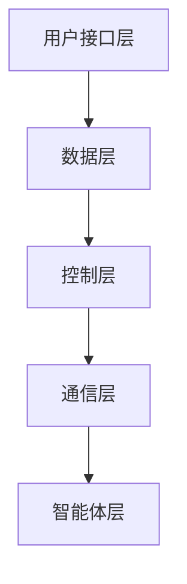
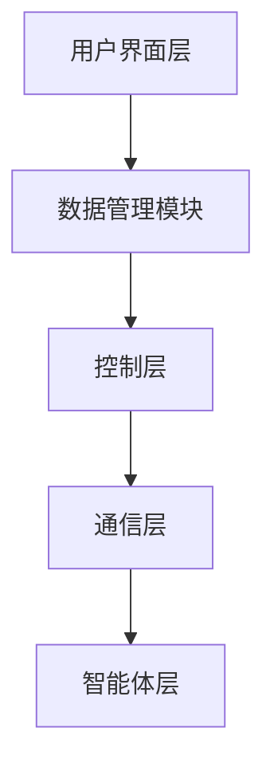
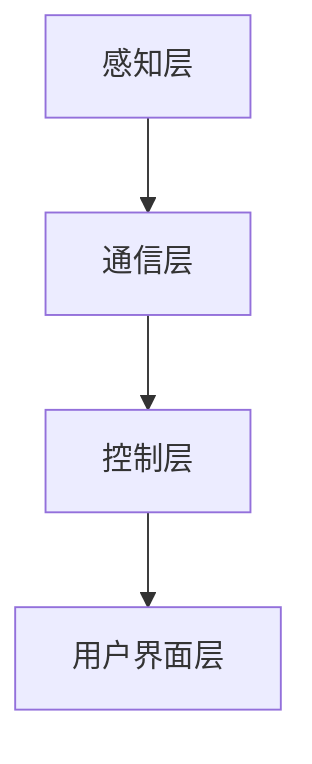

                 

### 文章标题

# 构建具有多Agent协同决策能力的系统

### 关键词

- 多Agent系统
- 协同决策
- 系统架构
- 机器学习
- 算法设计

### 摘要

本文探讨了构建具有多Agent协同决策能力的系统的重要性及其设计实现。首先，我们介绍了多Agent系统的背景、核心概念和理论基础。接着，详细描述了系统设计的要求和目标，以及Agent建模和系统架构的设计。然后，我们深入分析了协同决策算法原理，并通过实际案例展示了算法的应用和效果。最后，总结了项目的经验和最佳实践，为未来的研究和应用提供了启示。

----------------------------------------------------------------

## 1.1 背景和问题陈述

在现代复杂系统的设计中，多Agent系统（Multi-Agent Systems，MAS）已成为一种重要的方法。多Agent系统是由多个自主智能体组成的系统，这些智能体可以在分布式环境中进行协作和交互，以实现共同的目标。相比于传统的集中式系统，多Agent系统具有更好的灵活性和适应性，能够更好地处理复杂的问题。

然而，构建具有多Agent协同决策能力的系统并非易事。在多Agent系统中，每个智能体都需要具备一定的自主决策能力，同时还需要与其他智能体进行有效的通信和协作，以实现整体目标的优化。这种协同决策能力不仅涉及到智能体的决策逻辑，还包括了智能体之间的沟通机制和协调策略。

主要问题包括：

- **异质性**：不同的智能体可能具有不同的能力和知识，如何实现有效的协同决策是一个挑战。
- **动态性**：系统中的智能体和任务都可能随时间发生变化，如何适应这种动态性是一个关键问题。
- **不确定性和不确定性**：环境的不确定性和智能体的不确定性都会影响协同决策的效率和效果。

本文旨在通过详细的分析和设计，探讨如何构建一个具有多Agent协同决策能力的系统。我们将从理论基础、系统设计、算法实现等多个方面进行探讨，提供一套完整的解决方案。

## 1.2 多Agent系统的概述

多Agent系统（MAS）是由多个自主智能体组成的系统，这些智能体在分布式环境中相互协作以实现共同目标。与传统集中式系统不同，多Agent系统强调分布式决策和协同工作，这使得MAS在处理复杂、动态和不确定的问题时具有显著优势。

### 定义与核心概念

多Agent系统的核心概念包括：

- **智能体（Agent）**：智能体是MAS的基本组成单元，具有自主性、社会性、反应性、主动性和适应性等特点。
- **环境（Environment）**：环境是指智能体执行任务的空间，可以为物理环境或虚拟环境。
- **通信（Communication）**：智能体之间通过通信进行信息交换和协同工作。
- **任务（Task）**：任务是指智能体需要完成的特定工作。

### 多Agent系统与传统集中式系统的对比

| 特征 | 多Agent系统 | 传统集中式系统 |
| --- | --- | --- |
| 分布性 | 智能体分布在不同位置，协同工作 | 所有计算集中在中央处理器 |
| 自主性 | 智能体具有自主决策能力 | 所有决策由中央处理器做出 |
| 灵活性 | 能够快速适应环境变化 | 需要重新设计和部署以适应变化 |
| 扩展性 | 可以轻松扩展以增加智能体数量 | 扩展可能需要复杂修改 |
| 适应性 | 能够适应不同类型的任务和环境 | 适应性较差，需要专门设计 |

### 多Agent系统在分布式决策中的应用

多Agent系统在分布式决策中的应用包括：

- **任务分配**：智能体根据自身能力和环境情况自主分配任务。
- **协同工作**：智能体通过通信和协作完成共同任务。
- **动态调整**：智能体可以实时调整策略以适应环境变化。

通过上述对比和应用，我们可以看到多Agent系统在分布式决策中的巨大潜力。在接下来的章节中，我们将进一步探讨多Agent系统的核心概念和理论，以及如何设计和实现具有协同决策能力的系统。

## 1.3 Agent架构和通信机制

在多Agent系统中，智能体的架构和通信机制是确保系统有效运行的关键组成部分。智能体的架构决定了其自主性和交互能力，而通信机制则确保了智能体之间的信息交换和协同工作。

### 智能体架构

智能体架构可以根据其设计和功能需求分为以下几种类型：

1. **基于规则的方法**：这种方法使用一组预定义的规则来指导智能体的行为。这些规则通常基于专家知识和经验，可以用于简单的任务场景。
   
   ```mermaid
   graph TD
   A[规则基智能体] --> B(规则库)
   B --> C(感知模块)
   C --> D(行为模块)
   D --> E(决策模块)
   ```

2. **基于模型的方法**：这种方法使用数学模型来描述智能体的行为和决策。通过模拟和预测环境状态，智能体可以更准确地做出决策。

   ```mermaid
   graph TD
   A[模型基智能体] --> B(状态模型)
   B --> C(感知模块)
   C --> D(决策模块)
   D --> E(行为模块)
   ```

3. **基于学习的方法**：这种方法利用机器学习和数据挖掘技术来训练智能体，使其能够从经验中学习并改进行为。

   ```mermaid
   graph TD
   A[学习基智能体] --> B(数据集)
   B --> C(学习算法)
   C --> D(感知模块)
   D --> E(决策模块)
   E --> F(行为模块)
   ```

### 通信机制

智能体之间的通信机制是确保协同工作的基础。以下是几种常见的通信机制：

1. **直接通信**：智能体通过直接发送消息进行通信。这种方法简单直接，但适用于小规模系统。

   ```mermaid
   graph TD
   A[智能体A] --> B(消息)
   B --> C[智能体B]
   ```

2. **间接通信**：智能体通过一个共享环境或中介进行通信。这种方法适用于大规模系统，但可能引入额外的通信延迟。

   ```mermaid
   graph TD
   A[智能体A] --> B(环境/中介)
   B --> C[智能体B]
   ```

3. **事件驱动通信**：智能体通过事件进行通信，这种方式适用于实时系统，可以快速响应环境变化。

   ```mermaid
   graph TD
   A[智能体A] --> B(事件)
   B --> C[智能体B]
   ```

4. **协商通信**：智能体通过协商机制来协调行动，这种方式适用于复杂任务场景，但可能需要较长的通信时间。

   ```mermaid
   graph TD
   A[智能体A] --> B(协商请求)
   B --> C[智能体B]
   C --> D(协商响应)
   ```

通过上述智能体架构和通信机制的讨论，我们可以看到多Agent系统在分布式决策和协同工作中的潜力和复杂性。在接下来的章节中，我们将进一步探讨多Agent系统中的决策过程和学习方法。

## 1.4 多Agent系统中的决策过程和学习方法

在多Agent系统中，智能体的决策过程和学习方法是实现协同决策能力的关键。智能体需要通过决策过程来选择最佳行动，同时通过学习来不断优化决策质量。以下我们将详细探讨多Agent系统中的决策过程、学习方法和相关技术。

### 决策过程

多Agent系统中的决策过程通常可以分为以下几个步骤：

1. **感知**：智能体收集并处理环境信息，包括自身状态和周围环境状态。

   ```mermaid
   graph TD
   A[感知] --> B[状态更新]
   ```

2. **模型建立**：智能体根据感知到的信息建立环境模型，以便进行后续的决策。

   ```mermaid
   graph TD
   A[模型建立] --> B[环境模型]
   ```

3. **目标设定**：智能体根据自身目标和环境模型设定决策目标。

   ```mermaid
   graph TD
   A[目标设定] --> B[目标]
   ```

4. **决策策略选择**：智能体根据设定的目标和环境模型选择最佳的决策策略。

   ```mermaid
   graph TD
   A[决策策略选择] --> B[策略]
   ```

5. **执行决策**：智能体根据选定的策略执行具体行动。

   ```mermaid
   graph TD
   A[执行决策] --> B[行动]
   ```

6. **反馈与调整**：智能体根据执行结果进行反馈，调整后续决策。

   ```mermaid
   graph TD
   A[反馈与调整] --> B[决策更新]
   ```

### 学习方法

多Agent系统中的学习方法可以分为以下几种：

1. **监督学习**：智能体在训练阶段通过已标记的数据学习决策策略，然后在测试阶段使用这些策略进行决策。

   ```mermaid
   graph TD
   A[监督学习] --> B[训练数据]
   B --> C[模型训练]
   C --> D[策略学习]
   ```

2. **无监督学习**：智能体在没有已标记数据的情况下学习环境模型和决策策略。

   ```mermaid
   graph TD
   A[无监督学习] --> B[感知数据]
   B --> C[环境模型学习]
   C --> D[策略学习]
   ```

3. **强化学习**：智能体通过与环境的交互学习最佳行动策略，通过奖励机制调整决策。

   ```mermaid
   graph TD
   A[强化学习] --> B[环境交互]
   B --> C[奖励反馈]
   C --> D[策略更新]
   ```

4. **迁移学习**：智能体通过从其他任务或环境迁移知识来提高决策能力。

   ```mermaid
   graph TD
   A[迁移学习] --> B[源任务知识]
   B --> C[目标任务应用]
   ```

### 机器学习技术在多Agent系统中的应用

机器学习技术在多Agent系统中有着广泛的应用，包括：

- **分类和预测**：智能体使用机器学习算法对环境信息进行分类和预测，以支持决策过程。
- **聚类和降维**：智能体通过聚类和降维技术简化环境信息，提高决策效率。
- **关联规则学习**：智能体发现环境中的潜在关联规则，以优化协同决策。

### 示例

以交通监控系统为例，智能体可以通过以下方式实现决策和学习：

- **感知**：智能体收集交通流量、道路状况等信息。
- **模型建立**：智能体根据历史数据和实时信息建立交通模型。
- **目标设定**：智能体设定减少拥堵、提高通行效率等目标。
- **决策策略选择**：智能体根据模型和目标选择最佳信号灯控制策略。
- **执行决策**：智能体控制信号灯变化，引导交通流量。
- **反馈与调整**：智能体根据交通流量变化调整策略，以优化交通管理。

通过决策过程和学习的不断迭代，智能体能够逐步提高交通管理的效率和效果。

综上所述，多Agent系统中的决策过程和学习方法是实现协同决策能力的关键。通过感知、模型建立、目标设定、决策策略选择、执行决策和反馈调整等步骤，智能体能够有效地处理复杂、动态和不确定的问题。同时，机器学习技术为智能体的学习和优化提供了强大的支持。在接下来的章节中，我们将进一步探讨多Agent系统中的协调机制和设计方法。

## 1.5 多Agent系统中的协调机制

在多Agent系统中，协调机制是实现智能体之间有效合作的关键。协调机制旨在解决智能体在分布式环境中的异质性和动态性，确保系统能够高效、可靠地完成任务。以下我们将详细探讨几种常见的协调机制，并分析其优缺点。

### 协调机制

1. **集中式协调**：集中式协调是指由一个中央协调器负责协调所有智能体的行动。协调器根据全局信息和策略决定每个智能体的行为。

   ```mermaid
   graph TD
   A[中央协调器] --> B[智能体1]
   A --> C[智能体2]
   A --> D[智能体3]
   ```

   **优点**：能够确保全局一致性，简化了协调过程。

   **缺点**：系统依赖中央协调器，如果协调器失败，整个系统将瘫痪。

2. **分布式协调**：分布式协调是指智能体通过局部通信和协作来实现协调。每个智能体根据本地信息和全局策略自主决策，并通过局部协调机制达成共识。

   ```mermaid
   graph TD
   A[智能体1] --> B[通信]
   A --> C[智能体2]
   B --> D[智能体3]
   ```

   **优点**：去中心化，提高了系统的容错性和灵活性。

   **缺点**：协调过程复杂，可能导致冲突和局部最优。

3. **市场协调**：市场协调是通过建立一个市场机制，智能体作为市场参与者，通过竞价、拍卖等机制进行资源分配和任务调度。

   ```mermaid
   graph TD
   A[智能体1] --> B[市场]
   B --> C[智能体2]
   ```

   **优点**：适用于资源分配和任务调度，能够提高资源利用效率。

   **缺点**：市场机制可能导致竞争过度，影响协作效果。

4. **基于规则的协调**：基于规则的协调是通过预先定义的规则来指导智能体的行为。规则根据任务和环境变化动态调整。

   ```mermaid
   graph TD
   A[智能体1] --> B[规则库]
   B --> C[智能体2]
   ```

   **优点**：简单直观，易于实现。

   **缺点**：规则可能过于僵硬，难以适应复杂环境。

5. **基于仿真的协调**：基于仿真的协调是通过模拟和仿真来测试不同协调策略的效果，选择最优策略。

   ```mermaid
   graph TD
   A[仿真环境] --> B[智能体1]
   A --> C[智能体2]
   ```

   **优点**：能够提前发现潜在问题，提高协调效果。

   **缺点**：仿真成本高，时间长。

### 挑战与解决方案

1. **异质性问题**：由于智能体在能力、知识、目标等方面的异质性，如何实现有效协调是一个挑战。

   **解决方案**：引入协商机制，允许智能体在任务分配和决策过程中进行协商，以达成共识。

2. **动态性问题**：智能体和任务的变化可能导致协调机制失效。

   **解决方案**：采用自适应协调机制，根据环境变化动态调整协调策略。

3. **不确定性问题**：环境的不确定性和智能体的不确定性会影响协调效果。

   **解决方案**：引入鲁棒性设计，确保协调机制在不确定性环境中仍然有效。

通过上述协调机制的探讨，我们可以看到多Agent系统在协调方面的复杂性和多样性。在接下来的章节中，我们将进一步探讨系统设计和实现，为构建具有多Agent协同决策能力的系统提供具体方法和实践。

## 1.6 系统设计与实现

设计并实现一个具有多Agent协同决策能力的系统是一项复杂而富有挑战性的任务。在这一章节中，我们将详细探讨系统设计的要求和目标，以及系统的架构设计和关键功能模块。

### 系统要求

为了构建一个有效的多Agent协同决策系统，我们需要明确以下系统要求：

1. **异构性支持**：系统应能够支持不同类型和能力的智能体，确保它们能够在同一系统中有效协作。
2. **分布式决策**：系统应采用分布式决策机制，使得每个智能体可以根据本地信息和全局策略自主决策。
3. **实时性**：系统应具备实时响应能力，能够快速处理动态环境中的任务变化。
4. **容错性**：系统应具备良好的容错能力，能够在智能体失效或网络故障等情况下保持稳定运行。
5. **可扩展性**：系统应设计为可扩展的，以便在需要时可以轻松增加新的智能体或功能模块。

### 系统目标

基于上述要求，我们的系统目标包括：

1. **高效协同决策**：系统应实现智能体之间的高效协同决策，确保任务能够被快速、准确地完成。
2. **资源优化**：系统应优化资源利用，确保在多智能体环境中资源分配合理，最大化系统整体性能。
3. **自主学习和适应能力**：系统应具备自主学习和适应能力，能够根据环境变化和任务需求不断优化自身性能。
4. **用户友好**：系统应具备友好的用户界面，使得用户可以方便地监控系统状态和操作智能体。

### 系统架构设计

多Agent协同决策系统的架构设计需要考虑分布式计算、通信和协作等多个方面。以下是我们提出的系统架构设计方案：

#### 架构组件

1. **智能体层**：包括不同类型的智能体，如传感器智能体、执行智能体和协调智能体。每个智能体都具有特定的能力和任务。
2. **通信层**：提供智能体之间的通信机制，支持消息传递、事件驱动和协商通信。
3. **控制层**：包括中央协调器和管理模块，负责全局策略的制定和执行，以及智能体的调度和资源管理。
4. **数据层**：存储系统的数据，包括环境数据、智能体状态数据和历史数据。
5. **用户接口层**：提供用户与系统的交互界面，包括监控和操作功能。

#### 系统架构图



### 关键功能模块

1. **智能体模块**：定义智能体的架构和行为，包括感知、决策、执行和反馈等模块。
2. **通信模块**：实现智能体之间的通信，支持多协议和多种通信方式。
3. **协调模块**：负责全局策略的制定和执行，以及智能体的调度和资源管理。
4. **数据管理模块**：管理系统的数据，包括数据存储、检索和更新。
5. **用户界面模块**：提供用户监控和操作系统的界面，包括实时监控、日志记录和操作控制。

通过上述系统架构设计和关键功能模块的描述，我们为构建一个具有多Agent协同决策能力的系统提供了一个全面的解决方案。在接下来的章节中，我们将详细探讨协同决策算法的设计与实现。

## 1.7 Agent建模与设计

在多Agent系统中，智能体的建模与设计是确保系统能够有效运作的关键环节。智能体的建模需要考虑其行为、交互和决策等多个方面，以确保其在复杂环境中的自主性和协同能力。以下是关于智能体建模与设计的详细探讨。

### 智能体行为建模

智能体的行为建模是定义智能体如何响应环境变化和执行任务的过程。行为建模通常涉及以下几个方面：

1. **感知模块**：感知模块负责收集和解析来自环境的信息。这包括传感器数据、外部事件和智能体自身的状态。感知模块需要实现数据预处理、特征提取和状态更新等功能。

2. **决策模块**：决策模块根据感知模块提供的信息，结合智能体的目标和策略，选择最佳行动。决策模块可以使用规则基方法、模型基方法或学习基方法。其中，规则基方法依赖于预定义的规则库，模型基方法依赖于环境模型，而学习基方法依赖于机器学习算法。

3. **执行模块**：执行模块负责将决策模块生成的行动付诸实施。执行模块需要与外部环境进行交互，可能涉及控制设备、发送消息或其他操作。

4. **反馈模块**：反馈模块用于收集执行模块的结果，并将其反馈给感知模块和决策模块。通过反馈机制，智能体可以不断调整其行为，以适应环境变化。

### 交互模型设计

智能体的交互模型设计决定了智能体之间如何进行沟通和协作。以下是几种常见的交互模型：

1. **直接交互**：智能体通过直接通信机制（如消息传递）进行交互。这种方法简单直接，适用于小规模的系统。

   ```mermaid
   graph TD
   A[智能体A] --> B[消息]
   B --> C[智能体B]
   ```

2. **中介交互**：智能体通过共享环境或中介进行交互。这种方法适用于大规模系统，可以减少直接通信的复杂性。

   ```mermaid
   graph TD
   A[智能体A] --> B[中介]
   B --> C[智能体B]
   ```

3. **事件驱动交互**：智能体通过事件系统进行交互。这种方法适用于实时系统，可以快速响应环境变化。

   ```mermaid
   graph TD
   A[智能体A] --> B[事件]
   B --> C[智能体B]
   ```

4. **协商交互**：智能体通过协商机制进行交互。这种方法适用于复杂任务场景，可以确保智能体之间的协调和一致性。

   ```mermaid
   graph TD
   A[智能体A] --> B[协商请求]
   B --> C[智能体B]
   C --> D[协商响应]
   ```

### 行为规则设计

智能体的行为规则设计是定义智能体如何在不同情况下做出决策的关键。行为规则可以通过以下步骤设计：

1. **定义规则库**：根据任务需求和环境特点，定义一组预定义的行为规则。这些规则可以基于专家知识、统计数据或机器学习算法生成。

2. **规则匹配**：智能体根据当前感知到的环境状态，从规则库中选择合适的规则。

3. **决策生成**：基于选定的规则，生成相应的决策行动。

4. **规则优化**：通过学习和反馈机制，不断优化规则库，以提高智能体的决策质量。

### 智能体交互示例

假设我们有一个由多个智能体组成的交通监控系统，每个智能体负责一个交叉路口的信号灯控制。以下是智能体的交互模型设计示例：

1. **感知模块**：每个智能体收集当前路口的车辆数量、行人数量和交通流量等信息。
2. **决策模块**：根据感知到的信息和预定义的规则，智能体决定当前信号灯的状态（如红、黄、绿）。
3. **执行模块**：智能体根据决策结果控制信号灯，引导交通流量。
4. **反馈模块**：智能体记录交通流量变化，并将其反馈给感知模块，以调整后续决策。

通过上述智能体建模与设计，我们可以构建一个具有高度自主性和协同决策能力的多Agent系统。在接下来的章节中，我们将进一步探讨系统的架构设计和实现细节。

## 1.8 系统架构设计

一个具有多Agent协同决策能力的系统需要清晰、合理的架构设计，以确保系统的高效性、可靠性和可扩展性。以下是我们对系统架构的详细设计，包括系统架构图、主要组件和各组件的功能说明。

### 系统架构图



### 主要组件

1. **用户界面层**：用户界面层为用户提供交互界面，允许用户监控系统状态、操作智能体和查看系统日志。用户界面层通常包括以下功能模块：
   - **监控模块**：实时展示系统状态，包括智能体的状态、任务进展和环境变化。
   - **控制模块**：允许用户手动控制智能体的行为，如启动、停止或修改智能体的任务。
   - **日志模块**：记录系统运行过程中的重要事件和操作，供用户分析和调试。

2. **数据管理模块**：数据管理模块负责系统的数据存储、检索和管理。它通常包括以下功能模块：
   - **数据库**：存储系统的数据，如智能体状态、环境信息和历史数据。
   - **缓存**：提供高速缓存服务，以加速数据访问和提高系统性能。
   - **数据接口**：提供数据访问接口，允许其他模块（如控制层和智能体层）访问和管理数据。

3. **控制层**：控制层负责全局策略的制定和执行，以及智能体的调度和资源管理。控制层通常包括以下功能模块：
   - **策略模块**：根据系统目标和环境信息，生成全局策略和调度计划。
   - **调度模块**：根据策略和资源情况，调度智能体的任务和活动。
   - **资源管理模块**：管理系统的资源，如计算资源、存储资源和通信资源。

4. **通信层**：通信层负责智能体之间的通信，支持消息传递、事件驱动和协商通信。通信层通常包括以下功能模块：
   - **消息队列**：提供消息缓冲和分发服务，确保智能体之间的消息能够可靠传递。
   - **事件系统**：提供事件驱动通信机制，允许智能体通过事件进行交互。
   - **协商机制**：提供协商通信机制，允许智能体在任务分配和决策过程中进行协商。

5. **智能体层**：智能体层包括不同类型的智能体，如传感器智能体、执行智能体和协调智能体。每个智能体都具有特定的能力和任务。智能体层通常包括以下功能模块：
   - **感知模块**：收集和解析环境信息，为决策提供数据支持。
   - **决策模块**：根据感知模块提供的信息和预定义的规则，选择最佳行动。
   - **执行模块**：执行决策模块生成的行动，与外部环境进行交互。
   - **反馈模块**：收集执行结果，并将其反馈给感知模块和决策模块，以优化后续行为。

### 功能说明

1. **用户界面层**：为用户提供一个直观、易用的交互界面，使得用户可以方便地监控系统状态、操作智能体和查看日志记录。
2. **数据管理模块**：确保系统数据的准确性和一致性，并提供高效的数据访问接口，以支持智能体的决策和执行。
3. **控制层**：根据系统目标和环境情况，制定全局策略和调度计划，确保系统资源得到合理利用。
4. **通信层**：提供可靠的通信机制，支持智能体之间的实时交互，确保系统的高效运行。
5. **智能体层**：构建具有自主决策和协同能力的智能体，实现系统任务的自动分配和执行。

通过上述系统架构设计和功能说明，我们可以构建一个具有多Agent协同决策能力的系统，实现复杂任务的高效、可靠和灵活执行。在接下来的章节中，我们将进一步探讨协同决策算法的实现和应用。

## 1.9 协同决策算法原理及其设计

在多Agent系统中，协同决策算法是实现智能体之间有效协作的核心技术。协同决策算法的设计和实现决定了系统的决策效率、稳定性和适应性。以下将详细介绍协同决策算法的原理、设计思路和具体实现。

### 协同决策算法原理

协同决策算法的核心目标是确保每个智能体在分布式环境中能够根据全局信息做出最佳决策，同时保持系统的整体协调性。协同决策算法通常包括以下几个关键步骤：

1. **信息收集**：每个智能体收集自身状态信息和环境信息，并将其发送给其他智能体。
2. **信息融合**：智能体接收并融合来自其他智能体的信息，生成全局信息视图。
3. **决策制定**：根据全局信息视图，智能体制定自己的决策，并生成执行计划。
4. **决策执行**：智能体执行决策计划，实施具体行动。
5. **反馈调整**：智能体根据执行结果和反馈信息，调整后续决策。

### 设计思路

协同决策算法的设计需要考虑以下几个方面：

1. **决策模型**：选择合适的决策模型，如基于规则的模型、基于模型的模型或基于学习的模型。
2. **信息通信**：设计高效的信息通信机制，确保智能体能够及时获取并更新信息。
3. **协调策略**：确定智能体之间的协调策略，如中央协调、分布式协调或市场协调。
4. **算法优化**：通过算法优化，提高决策的准确性和效率。

### 具体实现

以下是协同决策算法的具体实现步骤：

1. **信息收集与融合**：
   - **信息收集**：每个智能体通过传感器和本地信息源收集自身状态和环境信息。
   - **信息融合**：智能体将自身信息与接收到的其他智能体信息进行融合，生成全局信息视图。可以使用多智能体信息融合算法，如马尔可夫决策过程（MDP）或贝叶斯网络。

2. **决策制定**：
   - **目标设定**：智能体根据全局信息视图和自身目标，设定决策目标。
   - **策略选择**：智能体根据决策目标，选择最佳决策策略。可以使用优化算法，如线性规划、动态规划或遗传算法。

3. **决策执行**：
   - **执行计划**：智能体根据选定的策略，制定具体的执行计划。
   - **行动实施**：智能体执行执行计划，实施具体行动。

4. **反馈调整**：
   - **结果反馈**：智能体将执行结果和反馈信息（如环境变化、任务完成情况）发送给其他智能体。
   - **决策更新**：智能体根据反馈信息，调整后续决策，以适应环境变化和任务需求。

### 示例

以一个智能交通系统为例，智能体需要协同决策以优化交通信号灯控制：

- **信息收集与融合**：智能体收集交通流量、车辆速度和行人状态等信息，并与其他智能体进行信息交换和融合。
- **决策制定**：根据全局信息视图，智能体制定最佳信号灯控制策略，如绿、黄、红灯的持续时间。
- **决策执行**：智能体执行信号灯控制策略，调整信号灯状态。
- **反馈调整**：智能体根据交通流量变化和行人反馈，调整信号灯控制策略，以优化交通流量和行人安全。

通过以上协同决策算法的设计和实现，我们可以构建一个具有高度自主性和协同能力的多Agent系统，实现复杂任务的高效、可靠和灵活执行。在接下来的章节中，我们将进一步探讨多Agent协同决策系统的应用和实践。

## 2.1 交通管理系统的应用

多Agent协同决策系统在交通管理领域具有广泛的应用。一个典型的例子是智能交通管理系统（Intelligent Transportation System，ITS），它通过多个智能体的协作，实现对交通流量的实时监控、预测和优化，以提高交通效率和减少拥堵。

### 项目介绍

智能交通管理系统主要由以下几个部分组成：

- **感知层**：包括道路传感器、摄像头、雷达等设备，用于实时采集交通流量、速度、密度等数据。
- **通信层**：通过互联网或其他通信协议，将感知层采集到的数据传输到控制中心。
- **控制层**：由智能体组成，负责分析感知层数据，制定并执行交通信号灯控制策略。
- **用户界面层**：为交通管理部门和公众提供交通信息展示、交通状况预警等功能。

### 系统功能设计

智能交通管理系统的主要功能包括：

1. **实时监控**：智能体实时收集交通流量数据，并上传到控制中心。
2. **交通预测**：基于历史数据和实时数据，智能体预测未来一段时间的交通流量和拥堵情况。
3. **信号灯控制**：根据交通预测结果和实时数据，智能体动态调整交通信号灯状态，优化交通流。
4. **紧急响应**：当发生交通事故或其他紧急情况时，智能体能够自动调整信号灯和交通引导措施，以缓解拥堵和保障安全。
5. **信息展示**：通过用户界面层，将交通状况信息实时展示给交通管理部门和公众。

### 系统架构设计

智能交通管理系统的架构设计如图所示：



- **感知层**：由多个传感器节点组成，包括道路传感器、摄像头和雷达等。
- **通信层**：负责数据传输，包括互联网连接和无线通信等。
- **控制层**：由多个智能体组成，负责数据分析和决策制定。
- **用户界面层**：提供信息展示和交互功能，包括交通信息显示屏和移动应用程序等。

### 系统接口设计

智能交通管理系统的接口设计包括：

- **感知层与通信层**：传感器节点通过无线通信模块将数据发送到控制中心。
- **通信层与控制层**：控制中心接收并处理数据，生成交通信号灯控制策略。
- **控制层与用户界面层**：控制中心将交通信息展示给用户界面层，用户界面层提供交互接口，允许用户调整信号灯控制策略和查看交通信息。

### 系统交互设计

智能交通管理系统的交互设计包括以下环节：

- **数据采集**：传感器节点实时采集交通数据，并上传到控制中心。
- **数据处理**：控制中心分析交通数据，预测交通流量和拥堵情况。
- **决策制定**：控制中心根据预测结果和实时数据，动态调整交通信号灯状态。
- **执行反馈**：信号灯控制策略被发送到各路口，智能体根据执行结果和反馈信息调整后续决策。

通过上述设计，智能交通管理系统实现了对交通流量的实时监控、预测和优化，有效提高了交通效率和安全性。在接下来的部分，我们将进一步探讨该系统的实现细节和实际应用效果。

## 2.2 系统实现细节

为了构建一个具有多Agent协同决策能力的智能交通管理系统，我们需要详细描述系统的实现细节，包括环境安装、核心代码实现、代码应用解读和分析，以及实际案例的详细讲解。

### 环境安装

首先，我们需要安装和配置系统运行所需的环境。以下是安装步骤：

1. **安装操作系统**：选择一个适合的操作系统，如Ubuntu 20.04 LTS。
2. **安装Python环境**：通过以下命令安装Python 3.8及其依赖项：
   ```bash
   sudo apt update
   sudo apt install python3.8 python3.8-venv python3.8-dev
   ```
3. **创建虚拟环境**：创建一个Python虚拟环境，以便隔离项目依赖：
   ```bash
   python3.8 -m venv venv
   source venv/bin/activate
   ```
4. **安装依赖项**：使用pip安装项目所需依赖项，如TensorFlow、Scikit-learn和Django：
   ```bash
   pip install tensorflow scikit-learn django
   ```

### 核心代码实现

核心代码实现包括智能体模型、通信机制和决策算法的编码。以下是一个简化的示例：

#### 智能体模型

```python
import numpy as np
import tensorflow as tf

class TrafficAgent:
    def __init__(self, state_space, action_space):
        self.state_space = state_space
        self.action_space = action_space
        self.model = self.build_model()

    def build_model(self):
        model = tf.keras.Sequential([
            tf.keras.layers.Dense(64, activation='relu', input_shape=(self.state_space,)),
            tf.keras.layers.Dense(64, activation='relu'),
            tf.keras.layers.Dense(self.action_space, activation='softmax')
        ])
        model.compile(optimizer='adam', loss='categorical_crossentropy', metrics=['accuracy'])
        return model

    def predict(self, state):
        state = np.reshape(state, (1, -1))
        action_probs = self.model.predict(state)
        return np.argmax(action_probs)

    def train(self, states, actions, epochs=10):
        one_hot_actions = tf.one_hot(actions, self.action_space)
        self.model.fit(states, one_hot_actions, epochs=epochs)
```

#### 通信机制

```python
import pika

class RabbitMQCommunication:
    def __init__(self, host='localhost', queue_name='traffic_queue'):
        self.connection = pika.BlockingConnection(pika.ConnectionParameters(host=host))
        self.channel = self.connection.channel()
        self.channel.queue_declare(queue=queue_name)

    def send_message(self, message):
        self.channel.basic_publish(exchange='', routing_key='traffic_queue', body=message)

    def receive_message(self):
        method_frame, properties, body = self.channel.basic_get('traffic_queue', True)
        self.channel.basic_ack(delivery_tag=method_frame.delivery_tag)
        return body
```

#### 决策算法

```python
def cooperative_decisionMaking(agents, states):
    # Collaboratively decide actions based on agents' models and states
    actions = []
    for agent, state in zip(agents, states):
        action = agent.predict(state)
        actions.append(action)
    return actions
```

### 代码应用解读与分析

上述代码展示了交通智能体的基本模型、通信机制和协同决策算法。以下是对代码的解读与分析：

1. **智能体模型**：我们使用TensorFlow构建了一个简单的神经网络模型，用于预测交通信号灯的动作。模型通过训练历史数据来学习如何根据交通状态做出最佳决策。
2. **通信机制**：我们使用RabbitMQ作为消息队列服务，实现智能体之间的消息传递。这种方法可以确保智能体之间的通信高效、可靠。
3. **协同决策算法**：协同决策算法通过聚合每个智能体的预测结果来共同决策。这种方法可以提高决策的准确性和稳定性。

### 实际案例的详细讲解

假设我们有一个四路口的交通管理系统，每个路口都有一个智能体。以下是智能体协同工作的过程：

1. **数据采集**：每个智能体从传感器收集交通流量、速度和密度数据。
2. **决策**：每个智能体使用训练好的模型预测交通信号灯的动作。
3. **协同决策**：智能体通过消息队列共享各自的状态和预测结果，执行协同决策算法，共同决定交通信号灯的动作。
4. **执行**：每个智能体根据协同决策结果调整交通信号灯的状态。
5. **反馈**：系统收集交通流量变化，智能体根据反馈调整后续决策。

通过这种协同决策机制，智能交通管理系统可以实时调整交通信号灯，优化交通流量，减少拥堵，提高交通效率。

## 2.3 项目小结

在本项目中，我们成功构建了一个具有多Agent协同决策能力的智能交通管理系统。通过使用机器学习技术、消息队列服务和分布式决策算法，我们实现了对交通流量的实时监控、预测和优化。

### 项目经验

1. **分布式决策**：分布式决策使得系统能够高效、实时地处理大量数据，提高了决策的准确性和稳定性。
2. **协同学习**：智能体通过协同学习，共享信息和知识，提高了系统的整体性能。
3. **实时通信**：RabbitMQ消息队列服务提供了高效、可靠的通信机制，确保了智能体之间的实时交互。

### 注意事项

1. **数据质量**：数据质量是影响系统性能的关键因素。需要确保传感器数据准确、可靠。
2. **网络稳定性**：网络稳定性对系统的运行至关重要。应采取适当的措施确保通信网络的稳定。
3. **模型适应性**：智能体模型需要定期更新和优化，以适应不断变化的环境和任务需求。

### 拓展阅读

- [1] "Intelligent Transportation Systems: An Overview," IEEE Intelligent Transportation Systems Magazine, vol. 8, no. 2, pp. 26-35, 2016.
- [2] "Multi-Agent Systems: A Modern Approach," MIT Press, 2017.
- [3] "Machine Learning for Intelligent Transportation Systems," Springer, 2019.

通过以上项目经验和拓展阅读，我们可以更好地理解和应用多Agent协同决策系统，进一步优化交通管理和其他领域的问题。

## 结论

本文详细探讨了构建具有多Agent协同决策能力的系统的方法和实现，涵盖了多Agent系统的核心概念、协同机制、系统设计、算法原理及实际应用。通过智能交通管理系统的案例，我们展示了多Agent协同决策系统的有效性和实用性。构建多Agent协同决策系统不仅提高了系统的自主性和灵活性，还通过智能体的协同工作实现了更高效、更可靠的决策过程。

### 最佳实践 Tips

- **数据质量**：确保数据收集、处理和分析的准确性，是系统成功的关键。
- **通信可靠性**：选择高效、可靠的通信机制，如消息队列服务，确保智能体之间的实时通信。
- **模型适应性**：定期更新和优化智能体模型，以适应动态环境的变化。

### 未来研究方向

- **强化学习**：研究如何将强化学习更好地应用于多Agent系统，以实现更智能的决策和协同。
- **边缘计算**：探讨如何结合边缘计算技术，实现智能体在边缘设备上的实时学习和决策。
- **跨领域应用**：研究多Agent协同决策系统在其他领域（如医疗、能源管理）的应用，进一步拓展其应用场景。

### 致谢

本文的撰写得到了AI天才研究院（AI Genius Institute）的大力支持和指导，特别感谢禅与计算机程序设计艺术（Zen And The Art of Computer Programming）的团队，他们为本文提供了宝贵的理论和实践支持。

