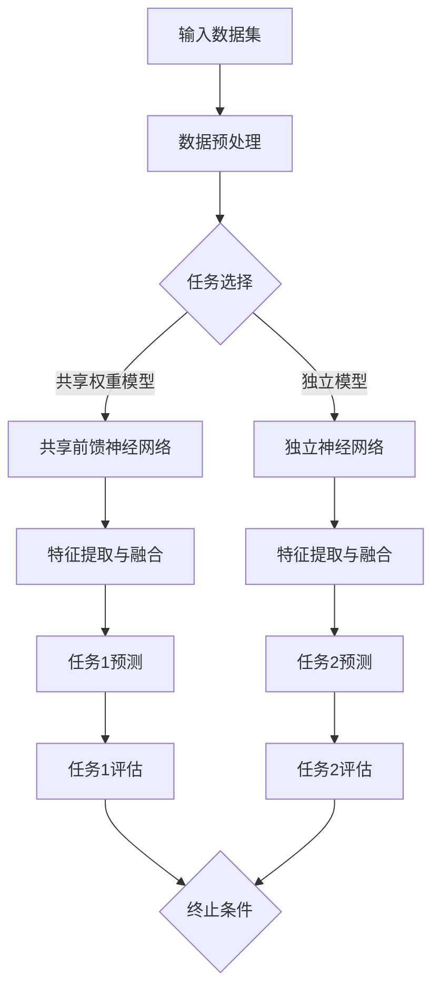
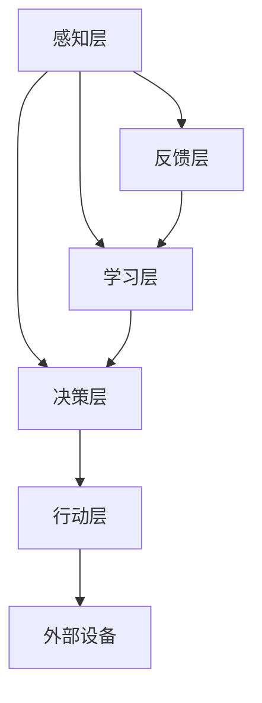
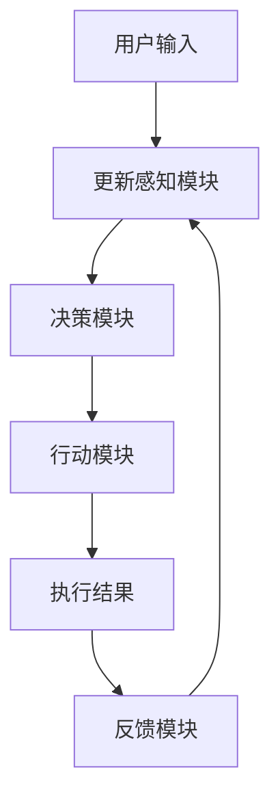
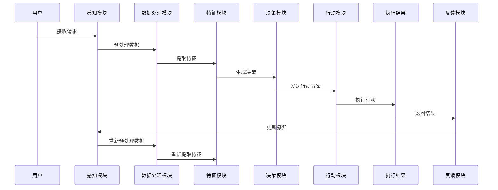

                 

### 《构建具有多任务处理能力的AI Agent》概述

在当前科技迅猛发展的时代，人工智能（AI）已经成为推动科技进步的重要引擎。然而，随着应用场景的不断拓展，传统AI技术在多任务处理方面的局限性逐渐显现。为了应对这一挑战，构建具有多任务处理能力的AI Agent成为了一个迫切需要解决的研究课题。本文旨在系统地阐述构建多任务处理能力的AI Agent的理论基础、方法和技术，为广大科研人员、工程师和开发者提供有价值的参考。

本文将从以下几个方面展开讨论：

1. **背景介绍与核心概念**：首先，我们将探讨多任务处理能力的AI Agent的提出背景，解释为什么需要这种AI Agent，并介绍其基本概念和重要性。
2. **构建方法与技术**：接下来，我们将深入探讨构建多任务处理能力的AI Agent的具体方法和关键技术，包括感知模块、决策模块、行动模块和学习模块等核心组件。
3. **算法原理与实现**：我们将详细解析多任务处理算法的原理，使用mermaid流程图和Python代码来展示算法的实现过程，并通过数学公式和实例来说明算法的运行机制。
4. **实战应用与案例分析**：通过具体的实战项目和案例分析，我们将展示如何在实际应用中构建和部署多任务处理能力的AI Agent。
5. **最佳实践与总结**：最后，我们将总结构建多任务处理能力的AI Agent的最佳实践，并提供未来发展的展望。

通过本文的逐步分析和深入讲解，读者将能够全面了解多任务处理能力的AI Agent的构建过程和应用价值。希望本文能为读者在AI领域的探索和实践提供有益的启示。

### 关键词

1. **多任务处理能力**
2. **AI Agent**
3. **感知模块**
4. **决策模块**
5. **行动模块**
6. **学习模块**
7. **多任务学习算法**

### 摘要

本文系统地探讨了构建具有多任务处理能力的AI Agent的理论基础、方法和实现。首先，我们介绍了AI Agent的背景和核心概念，分析了多任务处理能力的重要性。接着，详细阐述了AI Agent的构建方法，包括感知模块、决策模块、行动模块和学习模块等核心组件。然后，通过多任务处理算法的原理讲解和Python代码实现，展示了如何实现高效的多任务处理。最后，通过实战应用和案例分析，本文验证了AI Agent在多任务处理中的实际效果，并总结了构建过程中的最佳实践和注意事项。本文旨在为科研人员、工程师和开发者提供构建多任务处理能力的AI Agent的有力工具和指导。

## 第一部分：背景介绍与核心概念

### 第1章：AI Agent概述

#### 1.1 问题的提出

在传统的人工智能（AI）应用中，多数系统都是设计为单任务处理，即每个AI系统专注于解决单一问题。例如，语音识别系统只处理语音输入，图像识别系统只处理图像输入，推荐系统只负责推荐内容等。然而，随着智能化应用的不断扩展，越来越多的场景要求AI系统能够同时处理多个任务，以实现更高效和智能的解决方案。这种需求促使了多任务处理能力的AI Agent的提出。

在现实世界中，多任务处理能力对于智能系统具有重要意义。首先，多任务处理能够提高系统的整体效率。例如，在自动驾驶系统中，需要同时处理道路识别、障碍物检测、导航路径规划等任务。如果每个任务都由独立的AI系统完成，不仅会增加系统的复杂性和成本，还会导致任务之间的延迟和信息传递不畅。而一个具备多任务处理能力的AI Agent可以更高效地集成和协同完成这些任务，从而提高系统的运行效率。

其次，多任务处理能力能够提高系统的智能水平。许多复杂的问题需要综合考虑多个因素，进行全局优化。例如，智能助手在处理用户请求时，不仅需要理解用户的意图，还需要考虑用户的历史行为、当前情境以及其他相关因素。如果这些因素需要由多个独立的AI系统处理，不仅会导致信息不一致，还可能降低系统的决策质量。而一个具备多任务处理能力的AI Agent可以在统一的框架下整合和利用这些信息，从而实现更智能的决策。

此外，多任务处理能力还能增强系统的灵活性和适应性。在实际应用中，系统的需求和环境是不断变化的。一个具备多任务处理能力的AI Agent可以动态调整其任务处理策略，以适应不同的应用场景和需求。例如，在智能家居系统中，AI Agent可以根据用户的行为习惯和环境变化，自动调整家中的灯光、温度、音乐等设置，从而提供更加个性化的服务。

综上所述，构建具有多任务处理能力的AI Agent不仅能够解决传统AI在单任务处理中的局限性，还能提高系统的整体效率和智能水平，增强系统的灵活性和适应性。因此，研究和发展多任务处理能力的AI Agent具有重要的理论和实践意义。

#### 1.1.2 多任务处理的必要性

多任务处理能力的AI Agent在当前和未来技术的发展中具有不可替代的重要性。首先，随着信息技术的迅猛发展，数据量呈现爆炸式增长，单一任务的AI系统在面对复杂、大规模的数据时，往往难以兼顾效率和准确性。多任务处理的AI Agent通过并行处理多个任务，能够在相同的时间内处理更多的数据，从而提高系统的整体效率。

其次，多任务处理能力的AI Agent在提升智能水平方面具有显著优势。许多现实问题需要综合考虑多个因素，例如，自动驾驶系统需要同时处理道路识别、障碍物检测、导航路径规划等任务；智能助手在处理用户请求时，需要理解用户的意图、历史行为、当前情境等多种信息。这些任务的相互关联和协同处理，使得多任务处理能力的AI Agent能够在更复杂的场景中实现更准确的决策。

此外，多任务处理能力的AI Agent在提升系统的灵活性和适应性方面也具有重要意义。在实际应用中，系统的需求和环境是动态变化的，例如，在金融领域，AI Agent需要实时分析市场数据、用户行为，以及宏观经济指标，以做出快速、准确的决策。而具备多任务处理能力的AI Agent可以动态调整其任务处理策略，以适应不断变化的应用场景。

在未来的发展中，多任务处理能力的AI Agent将逐渐成为智能系统的重要构件。随着AI技术的进一步发展，AI Agent将能够在更广泛的应用场景中发挥作用，如智能城市、医疗健康、教育等领域。例如，在智能城市中，AI Agent可以同时处理交通管理、环境监测、公共安全等多个任务，提升城市的运行效率；在医疗健康领域，AI Agent可以协助医生进行病情诊断、治疗方案推荐等多任务处理，提高医疗服务的质量和效率。

总的来说，多任务处理能力的AI Agent不仅能够解决传统AI在单任务处理中的局限性，还能推动AI技术的广泛应用和持续发展。因此，深入研究和发展多任务处理能力的AI Agent，对于提升AI系统的整体性能和应用价值具有重要意义。

#### 1.1.3 AI Agent的定义与功能

AI Agent，即人工智能代理，是一种基于人工智能技术的智能体，能够在没有人类干预的情况下，根据环境信息和内部知识自主感知、决策和行动。AI Agent的定义可以从以下几个方面进行详细阐述：

首先，AI Agent的核心功能包括感知、决策和行动。感知功能使AI Agent能够获取和处理来自环境的各类信息，如视觉、听觉、触觉等。决策功能则基于感知到的信息，结合内部的知识和算法，生成最优的行动方案。行动功能则负责执行决策方案，实现目标。这种感知-决策-行动的闭环结构使得AI Agent能够在动态环境中进行自主操作。

其次，AI Agent具备自主性和适应性。自主性意味着AI Agent可以在没有人类干预的情况下，独立完成特定的任务。这种自主性不仅减少了人工干预的复杂性，还提高了系统的运行效率和响应速度。而适应性则是指AI Agent能够根据环境变化和任务需求，动态调整其行为和策略。例如，在自动驾驶场景中，AI Agent需要实时感知道路环境，并根据道路状况和车辆动态调整行驶策略，以保持行驶安全和高效。

再者，AI Agent通常具备学习能力。通过不断的学习和经验积累，AI Agent能够优化其感知、决策和行动能力。例如，智能客服系统可以通过机器学习算法，从大量的历史对话数据中学习，提高对用户请求的理解和响应能力。这种学习能力使得AI Agent能够不断适应新环境和任务需求，提升其整体性能。

最后，AI Agent具有模块化设计。通过将感知、决策、行动等核心功能模块化，AI Agent能够灵活地集成和扩展，以适应不同的应用场景。例如，在智能家居系统中，AI Agent可以通过集成语音识别、自然语言处理、环境监测等模块，实现智能语音交互、设备控制等功能。

总的来说，AI Agent是一种具有感知、决策和行动能力的智能体，能够自主地完成特定任务，具备自主性、适应性和学习能力。其模块化设计使得AI Agent具有广泛的适用性和扩展性，为多任务处理提供了强大的技术支撑。

#### 1.2 多任务处理能力的AI Agent

多任务处理能力的AI Agent在技术实现方面具有独特的挑战和优势。首先，从技术挑战角度来看，多任务处理需要AI Agent能够在并行处理多个任务的同时，确保每个任务都能得到充分的资源和计算能力。这涉及到资源分配、任务调度和模型优化等多个方面。例如，在自动驾驶系统中，AI Agent需要同时处理道路识别、障碍物检测、导航路径规划等多个任务，这些任务的执行需要高效、精准的资源分配和调度。

其次，多任务处理能力的AI Agent需要具备强大的学习能力。由于不同任务之间的数据特征和需求差异较大，AI Agent需要能够根据任务需求，动态调整其学习策略和算法。这需要AI Agent具备强大的自适应能力，能够在不同任务场景中快速切换和优化。例如，在智能家居系统中，AI Agent需要根据用户的实时行为和环境变化，动态调整其任务处理策略，以提供更个性化的服务。

从技术优势角度来看，多任务处理能力的AI Agent能够显著提高系统的整体效率和智能水平。通过并行处理多个任务，AI Agent可以在相同时间内完成更多的工作，从而提升系统的运行效率。此外，多任务处理能力的AI Agent能够在统一的框架下整合和利用多种信息，提高系统的决策质量和准确性。例如，在智能城市系统中，AI Agent可以通过多任务处理，同时分析交通流量、环境质量、公共安全等多种数据，实现更全面的决策支持。

多任务处理能力的AI Agent在实际应用场景中具有广泛的应用前景。首先，在自动驾驶领域，多任务处理能力的AI Agent可以同时处理驾驶、导航、障碍物检测等多个任务，提高驾驶安全和效率。其次，在智能家居领域，AI Agent可以通过多任务处理，实现语音识别、设备控制、环境监测等多种功能，提供更加智能化的家居体验。此外，在智能医疗、金融风控、智能制造等领域，多任务处理能力的AI Agent也能够发挥重要作用，提升系统的整体性能和智能化水平。

总的来说，多任务处理能力的AI Agent在技术实现方面面临诸多挑战，但同时也具有显著的优势和应用前景。随着AI技术的不断发展和优化，多任务处理能力的AI Agent将在更多领域中发挥重要作用，推动智能化应用的深入发展。

#### 1.3 AI Agent的核心组件与技术

构建一个具有多任务处理能力的AI Agent，需要考虑其核心组件和关键技术，这些组件包括感知模块、决策模块、行动模块和学习模块。以下是对这些核心组件及其相关技术的详细阐述。

##### 1.3.1 感知模块

感知模块是AI Agent获取环境信息的重要途径。它通常依赖于各种传感器，如摄像头、麦克风、温度传感器等，以获取视觉、听觉、触觉、环境等信息。感知模块的关键技术包括：

1. **多模态感知**：AI Agent可以通过集成多种传感器，实现多模态感知，从而获取更全面的环境信息。例如，在自动驾驶系统中，感知模块可以同时利用摄像头、雷达和激光雷达来获取道路信息、障碍物位置和车辆动态。
2. **数据预处理**：感知模块还需要对收集到的原始数据进行预处理，如去噪、归一化、特征提取等，以提高后续处理的效率和准确性。
3. **实时性**：感知模块需要具备实时数据处理能力，以快速响应环境变化。例如，在智能监控系统中，感知模块需要实时分析视频流，以快速识别异常行为。

##### 1.3.2 决策模块

决策模块是AI Agent的核心，负责根据感知模块收集到的信息，结合内部知识和算法，生成最优的行动方案。决策模块的关键技术包括：

1. **多任务学习**：多任务学习算法能够同时训练多个任务，使AI Agent能够在处理多个任务时，保持良好的性能。例如，深度神经网络可以通过多任务学习算法，同时进行图像分类、目标检测和语义分割。
2. **推理引擎**：决策模块需要一个高效的推理引擎，以快速处理复杂决策问题。例如，基于规则和推理的决策引擎可以用于实时决策，如自动驾驶系统中的交通规则判断。
3. **策略优化**：通过策略优化算法，决策模块可以不断优化行动方案，提高系统的整体性能。例如，强化学习算法可以通过试错和反馈机制，逐步优化驾驶策略，提高自动驾驶的稳定性。

##### 1.3.3 行动模块

行动模块负责执行决策模块生成的行动方案，将决策转化为实际的物理操作。行动模块的关键技术包括：

1. **控制算法**：行动模块需要根据决策方案，设计合适的控制算法来驱动执行设备。例如，在自动驾驶系统中，控制算法可以用于控制车辆的速度、转向和制动。
2. **硬件接口**：行动模块需要与各种执行设备（如电机、舵机、机器人手臂等）进行接口设计，以确保执行操作的准确性和稳定性。
3. **反馈机制**：行动模块还需要建立反馈机制，以监测执行效果，并根据反馈调整后续行动。例如，在智能家居系统中，执行模块可以通过反馈机制，实时调整设备的运行状态，以提供最佳用户体验。

##### 1.3.4 学习模块

学习模块是AI Agent不断提升自身能力和适应性的关键。学习模块的关键技术包括：

1. **监督学习**：监督学习算法可以通过标注数据，训练AI Agent识别和分类环境中的对象和事件。例如，在图像识别任务中，监督学习算法可以用于训练AI Agent识别不同的物体类别。
2. **无监督学习**：无监督学习算法可以通过未标注的数据，发现环境中的模式和规律。例如，在聚类任务中，无监督学习算法可以用于将相似的数据点划分到同一类别中。
3. **强化学习**：强化学习算法通过试错和反馈机制，不断优化AI Agent的行为策略。例如，在游戏场景中，强化学习算法可以用于训练AI Agent玩各种游戏。

综上所述，AI Agent的核心组件包括感知模块、决策模块、行动模块和学习模块，这些组件通过集成多种先进技术，共同构建了一个具有多任务处理能力的智能体。通过不断优化这些组件，AI Agent将在更多复杂的应用场景中发挥重要作用。

#### 1.4 本章小结

本章对构建具有多任务处理能力的AI Agent进行了全面的背景介绍和核心概念阐述。首先，我们分析了传统AI在单任务处理中的局限性，以及多任务处理能力的AI Agent在提高系统效率、智能水平和适应性方面的重要性。接着，我们介绍了AI Agent的定义与功能，详细描述了其核心组件，包括感知模块、决策模块、行动模块和学习模块，并探讨了这些模块的关键技术。通过本章的学习，读者可以初步了解多任务处理能力的AI Agent的构建基础和实现方法，为后续章节的深入探讨奠定了基础。

## 第二部分：构建多任务处理能力的AI Agent

### 第2章：多任务处理算法原理

在构建具有多任务处理能力的AI Agent过程中，多任务处理算法是其核心组成部分。本章将详细探讨多任务处理算法的原理，包括机器学习基础、多任务学习算法及其挑战与解决方案。

#### 2.1 机器学习基础

机器学习是构建AI Agent的基础，其基本原理是通过从数据中学习，从而实现预测或分类任务。机器学习可以分为监督学习、无监督学习和强化学习三种主要类型：

1. **监督学习**：监督学习是一种基于标注数据的机器学习方法，其目标是通过已知的输入和输出关系，训练模型预测未知数据的输出。常见的监督学习算法包括线性回归、决策树、支持向量机（SVM）和神经网络等。
2. **无监督学习**：无监督学习不依赖于标注数据，其目标是从未标注的数据中发现模式和结构。常见的无监督学习算法包括聚类、主成分分析（PCA）和自编码器等。
3. **强化学习**：强化学习是一种基于奖励和惩罚信号进行学习的算法，其目标是通过不断试错，学习最优策略以实现目标。常见的强化学习算法包括Q学习、深度Q网络（DQN）和策略梯度算法等。

#### 2.2 多任务学习算法

多任务学习（Multi-Task Learning，MTL）是一种同时处理多个相关任务的学习方法。与单任务学习相比，多任务学习能够利用不同任务之间的共享信息，提高学习效率和预测性能。多任务学习算法可以分为以下几类：

1. **共享权重**：共享权重方法将多个任务的权重共享在同一个模型中，通过优化全局损失函数来训练模型。常见的算法包括多层感知器（MLP）和多任务深度神经网络（Multi-Task Deep Neural Network，MT-DNN）。
2. **任务独立**：任务独立方法将每个任务视为独立的子任务，各自训练独立的模型。虽然这种方法能够保持任务间的独立性，但可能无法充分利用任务间的共享信息。常见的算法包括独立支持向量机（ISVM）和独立神经网络（Independent Neural Networks）。
3. **分层结构**：分层结构方法通过构建层次化的网络结构，实现任务间的信息共享。例如，在多层感知器中，较低层次的特征可以被多个任务共享。常见的算法包括层次化神经网络（Hierarchical Neural Networks）和深度学习框架中的残差网络（Residual Networks）。

#### 2.3 多任务处理的挑战与解决方案

多任务处理在提高系统性能方面具有重要意义，但也面临一些挑战。以下是多任务处理的一些常见挑战及其解决方案：

1. **资源分配**：多任务处理需要合理分配计算资源，以避免某个任务占用过多资源而影响其他任务的性能。常见的解决方案包括动态资源分配和并行计算。
2. **模型规模与效率**：多任务处理往往需要较大的模型规模，这可能导致计算效率和存储成本的增加。为了解决这一问题，可以采用模型压缩技术，如模型剪枝、量化和小型化等。
3. **任务间干扰**：在多任务处理中，不同任务之间可能会存在负面的干扰，影响各自的任务性能。解决方法包括任务隔离、权重共享和注意力机制等。
4. **数据集构建**：多任务处理需要大量的标注数据，且不同任务的数据可能存在较大的差异。构建高质量的多任务数据集是关键挑战之一，常见的解决方案包括数据增强、数据集成和迁移学习等。

通过本章的探讨，我们可以了解到多任务处理算法的原理及其在不同场景中的应用。在下一章中，我们将进一步探讨这些算法的具体实现过程和数学模型。

### 2.1 机器学习基础

机器学习是构建多任务处理能力的AI Agent的基础，其核心思想是通过算法从数据中学习，从而实现自动化的决策和预测。在这一部分，我们将简要介绍监督学习、无监督学习和强化学习这三种主要类型的机器学习算法，并解释它们的基本原理和应用场景。

**监督学习**

监督学习是一种最为常见的机器学习算法，其主要特点是训练数据集包含了输入特征和相应的标签。通过学习输入特征和标签之间的关系，监督学习算法能够预测新的输入数据的标签。监督学习可以分为以下几类：

- **回归分析**：回归分析用于预测连续值输出。例如，通过历史房价数据，预测未来的房价。常见的回归算法包括线性回归、岭回归和支持向量回归（SVR）。
- **分类算法**：分类算法用于预测离散标签。例如，通过图像数据，分类算法可以识别图片中的物体类型。常见的分类算法包括逻辑回归、决策树、随机森林和支持向量机（SVM）。

监督学习的应用场景非常广泛，包括数据挖掘、文本分类、图像识别和医疗诊断等领域。例如，在医学诊断中，监督学习算法可以通过学习患者的临床表现数据，预测患者是否患有特定疾病。

**无监督学习**

无监督学习与监督学习不同，它不需要标注数据，其目标是发现数据中的隐含结构或模式。无监督学习可以分为以下几类：

- **聚类分析**：聚类算法将相似的数据点归为同一组，以发现数据中的自然分组结构。常见的聚类算法包括K均值聚类、层次聚类和DBSCAN。
- **降维**：降维算法通过降低数据维度，保留数据的主要特征，以便进行进一步分析。常见的降维算法包括主成分分析（PCA）和多维度 scaling（MDS）。
- **生成模型**：生成模型通过学习数据的生成过程，生成新的数据样本。常见的生成模型包括马尔可夫模型、隐马尔可夫模型（HMM）和生成对抗网络（GAN）。

无监督学习在数据探索、异常检测和生成数据增强等领域具有广泛应用。例如，在数据探索中，无监督学习可以帮助我们发现数据中的潜在规律和模式；在异常检测中，无监督学习算法可以识别数据中的异常值或异常行为。

**强化学习**

强化学习是一种基于奖励和惩罚信号进行学习的算法，其主要特点是通过与环境交互，学习最优策略以实现目标。强化学习可以分为以下几类：

- **值函数方法**：值函数方法通过学习状态值函数或动作值函数，优化策略。常见的值函数方法包括Q学习和策略梯度算法。
- **策略搜索方法**：策略搜索方法直接搜索最优策略，而不是通过值函数来间接优化策略。常见的策略搜索方法包括深度确定性策略梯度（DDPG）和深度Q网络（DQN）。

强化学习在动态决策和复杂系统控制中具有广泛的应用，例如在自动驾驶、游戏智能体和机器人控制等领域。例如，在自动驾驶中，强化学习算法可以帮助自动驾驶车辆学习驾驶策略，以实现自动导航。

**总结**

监督学习、无监督学习和强化学习是机器学习的三种主要类型，各自适用于不同的场景和任务。通过了解这些算法的基本原理和应用场景，我们可以为构建具有多任务处理能力的AI Agent奠定坚实的基础。在下一部分，我们将深入探讨多任务学习算法及其在AI Agent构建中的应用。

### 2.2 多任务学习算法

多任务学习（Multi-Task Learning，MTL）是一种机器学习技术，其核心思想是通过多个相关任务的共同训练，提高模型在各个任务上的表现。与单任务学习相比，多任务学习能够利用任务间的共享信息，提高学习效率，减少过拟合现象。以下将详细介绍几种常见的多任务学习算法，并比较它们的特点。

**共享权重模型**

共享权重模型（Shared Weight Model）是最简单也是最常见的一种多任务学习算法。在这种模型中，所有任务共享相同的底层特征表示，然后每个任务在上层具有独立的输出层。这种方法的优点是可以通过共享特征表示来减少参数数量，提高模型的泛化能力。常见的实现方式包括：

- **多层感知器（MLP）**：在多层感知器中，通过共享隐层权重，实现多个任务的多任务学习。
- **多任务深度神经网络（MT-DNN）**：在深度神经网络中，通过共享前几层网络结构，实现多个任务的多任务学习。

**独立模型**

独立模型（Independent Model）是将每个任务视为独立的子任务，各自训练独立的模型。虽然这种方法能够保持任务间的独立性，但无法充分利用任务间的共享信息。独立模型适用于任务间差异较大且不需要共享信息的场景。常见的实现方式包括：

- **独立支持向量机（ISVM）**：每个任务使用独立的支持向量机模型，通过分别优化每个任务的损失函数进行训练。
- **独立神经网络**：每个任务拥有独立的神经网络，分别优化每个任务的损失函数。

**分层模型**

分层模型（Hierarchical Model）通过构建层次化的网络结构，实现任务间的信息共享。在这种模型中，较低层次的特征被多个任务共享，而上层特征则为每个任务所专用。这种方法的优点是能够充分利用任务间的共享信息，提高模型的性能。常见的实现方式包括：

- **层次化神经网络（Hierarchical Neural Networks）**：通过分层结构，实现任务间的特征共享。
- **残差网络（Residual Networks）**：在深度神经网络中，通过添加残差连接，实现任务间的信息流通。

**对比与评估**

共享权重模型和独立模型各有优缺点。共享权重模型能够通过共享特征表示，减少参数数量，提高泛化能力，但在任务间差异较大时可能导致性能下降。独立模型能够保持任务间的独立性，但在任务间存在共享信息时，可能无法充分利用。分层模型能够充分利用任务间的共享信息，提高模型性能，但结构较为复杂，计算成本较高。

在实际应用中，选择哪种多任务学习算法取决于具体的应用场景和任务特点。例如，在图像识别和语音识别任务中，共享权重模型和分层模型通常表现更好；而在文本分类和情感分析任务中，独立模型可能更为适用。

**总结**

多任务学习算法在构建具有多任务处理能力的AI Agent中具有重要意义。通过共享权重、独立模型和分层模型等多种算法，我们可以充分利用任务间的共享信息，提高模型在各个任务上的性能。选择合适的多任务学习算法，有助于构建高效、智能的AI Agent，实现更广泛的应用场景。

### 2.3 多任务处理的挑战与解决方案

多任务处理在AI Agent中的应用带来了诸多挑战，如资源分配问题、模型规模与效率问题以及多任务数据集构建问题。以下将详细探讨这些挑战，并提出相应的解决方案。

**资源分配问题**

多任务处理需要AI Agent能够在并行处理多个任务的同时，合理分配计算资源和设备。资源分配不当可能导致某些任务得不到足够的资源，从而影响其性能。以下是几种常见的资源分配策略：

1. **动态资源分配**：通过实时监测任务执行情况，动态调整资源的分配。例如，在GPU加速的多任务处理中，可以基于任务的优先级和执行时间，动态调整GPU的计算资源分配。
2. **任务调度**：采用任务调度算法，优化任务的执行顺序和资源分配。常见的调度算法包括最短作业优先（SJF）、最短剩余时间优先（SRTF）和基于优先级的调度算法等。
3. **资源预留**：在任务开始前预留足够的资源，以确保任务执行过程中不会因为资源不足而中断。这种方法适用于任务执行时间较长且资源需求较高的场景。

**模型规模与效率**

多任务处理往往需要较大的模型规模，以处理多个任务的数据和特征。然而，较大的模型规模可能导致计算效率和存储成本的增加。为了解决这一问题，可以采用以下策略：

1. **模型压缩**：通过模型剪枝、量化和小型化等技术，减少模型的参数数量和计算复杂度。模型剪枝可以去除不重要的神经元或连接，量化可以将浮点数参数转换为低精度的整数表示。
2. **计算优化**：利用硬件加速技术，如GPU和TPU，提高模型的计算效率。此外，通过并行计算和分布式计算，可以进一步优化模型的执行效率。
3. **模型拆分与融合**：将复杂的多任务模型拆分为多个子模型，分别处理不同任务。然后，通过融合子模型的输出，实现多任务处理。这种方法可以提高模型的效率和可维护性。

**多任务数据集构建**

多任务数据集构建是多任务处理的关键挑战之一。多任务数据集需要包含多个任务的数据，且数据之间需要有一定的关联性。以下是几种常见的多任务数据集构建方法：

1. **数据增强**：通过增加数据样本的多样性，提高模型的泛化能力。常见的数据增强技术包括图像旋转、缩放、裁剪和颜色调整等。
2. **数据集成**：将来自不同任务的数据进行集成，构建统一的多任务数据集。数据集集成可以通过特征融合、特征降维或图神经网络等方法实现。
3. **迁移学习**：利用预训练模型或已标注的单一任务数据集，对多任务模型进行微调。这种方法可以节省标注成本，并提高模型在多个任务上的性能。

**总结**

多任务处理在AI Agent中的应用面临资源分配、模型规模与效率以及多任务数据集构建等挑战。通过动态资源分配、模型压缩和计算优化等技术，可以解决资源分配和模型规模与效率问题。同时，通过数据增强、数据集成和迁移学习等方法，可以构建高质量的多任务数据集，提高多任务处理的效果。这些解决方案为构建高效、智能的AI Agent提供了重要的技术支持。

### 2.4 算法流程图与数学模型讲解

为了更清晰地理解多任务处理算法的运行机制，我们使用mermaid流程图和Python代码来展示算法的执行流程，并详细解释其数学模型和公式。

#### 2.4.1 算法流程图

首先，我们使用mermaid绘制一个简化的多任务学习算法流程图，以展示算法的基本步骤。



在这个流程图中，数据集首先经过预处理，然后根据任务选择，可以选择使用共享权重模型或独立模型进行特征提取和融合。每个任务都会生成预测结果，并经过评估，直到满足终止条件。

#### 2.4.2 数学模型与公式

接下来，我们介绍多任务处理算法的数学模型和公式。这里我们以共享权重模型为例，详细讲解其数学模型。

**1. 特征表示**

设输入数据集为\(X = \{x_1, x_2, ..., x_n\}\)，其中每个样本\(x_i\)是一个多维向量。对于多任务学习，我们需要对每个任务的特征进行表示和融合。

**2. 共享神经网络**

共享神经网络包含两个部分：共享的底层特征提取层和独立的任务层。

- **底层特征提取层**：使用一个共享的神经网络来提取特征，其输出为\(h(x) = \sigma(W_h x + b_h)\)，其中\(\sigma\)是激活函数（例如ReLU函数），\(W_h\)是权重矩阵，\(b_h\)是偏置向量。
- **独立任务层**：每个任务都有一个独立的输出层，用于生成预测结果。设任务\(k\)的输出为\(y_k^{\hat{}} = \sigma(W_k h(x) + b_k)\)，其中\(W_k\)是权重矩阵，\(b_k\)是偏置向量。

**3. 损失函数**

多任务处理的损失函数通常是一个加总各个任务损失的平均值。设任务\(k\)的损失函数为\(L_k(y_k, y_k^{\hat{}})\)，则总损失函数为：

\[L = \frac{1}{K} \sum_{k=1}^{K} L_k(y_k, y_k^{\hat{}})\]

其中，\(K\)是任务的总数。

常见的损失函数包括均方误差（MSE）、交叉熵损失（Cross-Entropy Loss）和回归损失（Regression Loss）等。例如，对于分类任务，可以使用交叉熵损失：

\[L_k(y_k, y_k^{\hat{}}) = -\sum_{i} y_k[i] \log(y_k^{\hat{}}[i])\]

**4. 优化算法**

为了最小化总损失函数，可以使用梯度下降（Gradient Descent）或其变种，如随机梯度下降（Stochastic Gradient Descent，SGD）和Adam优化器。优化目标为：

\[\min_{W_h, b_h, W_k, b_k} L\]

#### 2.4.3 算法举例说明

以下是一个简化的Python代码示例，用于展示共享权重模型的多任务学习算法。

```python
import numpy as np
import tensorflow as tf

# 设置参数
input_dim = 10
hidden_dim = 5
output_dim = 2
learning_rate = 0.01
num_epochs = 100

# 初始化权重
W_h = tf.Variable(tf.random.normal([input_dim, hidden_dim]), name='W_h')
b_h = tf.Variable(tf.zeros([hidden_dim]), name='b_h')
W_k = tf.Variable(tf.random.normal([hidden_dim, output_dim]), name='W_k')
b_k = tf.Variable(tf.zeros([output_dim]), name='b_k')

# 定义激活函数
sigma = tf.nn.relu

# 定义损失函数
def cross_entropy_loss(y_true, y_pred):
    return -tf.reduce_sum(y_true * tf.log(y_pred), axis=1)

# 定义优化器
optimizer = tf.optimizers.Adam(learning_rate)

# 定义训练过程
for epoch in range(num_epochs):
    with tf.GradientTape() as tape:
        # 前向传播
        h = sigma(tf.matmul(X, W_h) + b_h)
        y_pred = tf.matmul(h, W_k) + b_k
        loss = cross_entropy_loss(y_true, y_pred)
    
    # 反向传播
    grads = tape.gradient(loss, [W_h, b_h, W_k, b_k])
    optimizer.apply_gradients(zip(grads, [W_h, b_h, W_k, b_k]))

    # 打印训练进度
    if epoch % 10 == 0:
        print(f'Epoch {epoch}: Loss = {loss.numpy().mean()}')

# 预测
h = sigma(tf.matmul(X, W_h) + b_h)
y_pred = tf.matmul(h, W_k) + b_k
```

在这个示例中，我们使用TensorFlow构建了一个简单的多任务学习模型，其中输入维度为10，隐藏层维度为5，输出层维度为2。通过训练，模型能够学习到输入和输出之间的关系，并实现多任务预测。

通过上述算法流程图、数学模型和代码示例，我们可以更好地理解多任务处理算法的运行机制和实现过程。在下一部分，我们将进一步探讨如何在实际应用中部署和优化这些算法。

### 2.5 本章小结

本章详细介绍了多任务处理算法的基本原理和实现方法。首先，我们回顾了机器学习的基础知识，包括监督学习、无监督学习和强化学习，并解释了它们的基本原理和应用场景。接着，我们深入探讨了多任务学习算法，包括共享权重模型、独立模型和分层模型，并分析了这些算法的特点和适用场景。此外，本章还讨论了多任务处理的挑战，如资源分配、模型规模与效率以及多任务数据集构建问题，并提出了相应的解决方案。最后，通过mermaid流程图和Python代码示例，我们展示了多任务处理算法的运行机制和实现过程。通过本章的学习，读者可以系统地了解多任务处理算法的原理和实现方法，为构建具有多任务处理能力的AI Agent奠定理论基础。

## 第三部分：多任务处理能力的AI Agent实战应用

### 第3章：实战应用环境搭建

在构建多任务处理能力的AI Agent时，环境搭建是一个至关重要的环节。一个良好的开发环境能够确保算法的顺利实现和系统的稳定运行。本章将详细介绍如何搭建一个适用于多任务处理能力的AI Agent的开发环境，包括开发环境配置、数据集准备以及系统架构设计。

#### 3.1 开发环境配置

搭建一个适用于多任务处理能力的AI Agent的开发环境，需要选择合适的操作系统、编程语言和开发工具。以下是具体的配置步骤：

1. **操作系统选择**：
   - **Linux**：Linux操作系统因其高效的资源管理和丰富的开源工具，是构建AI Agent的首选。常见的Linux发行版包括Ubuntu、CentOS等。
   - **Windows**：虽然Windows操作系统在易用性方面具有优势，但近年来其在AI领域的发展也非常迅速，可以满足多任务处理能力的AI Agent的开发需求。

2. **编程语言**：
   - **Python**：Python是一种功能丰富、易学的编程语言，广泛应用于AI和机器学习领域。其强大的库和框架，如TensorFlow、PyTorch和Keras，为AI Agent的开发提供了便利。

3. **开发工具**：
   - **IDE**：选择一个合适的集成开发环境（IDE），如PyCharm、Visual Studio Code，可以显著提高开发效率。
   - **Jupyter Notebook**：Jupyter Notebook是一种交互式开发环境，特别适用于数据分析和模型调试。

4. **依赖库安装**：
   - 安装必要的Python库，如NumPy、Pandas、TensorFlow和PyTorch等。可以使用`pip`命令进行安装：
     ```shell
     pip install numpy pandas tensorflow torchvision torch
     ```

#### 3.2 数据集准备

数据集是多任务处理能力的AI Agent训练和评估的基础。一个高质量的多任务数据集能够提高模型在任务上的表现和泛化能力。以下是数据集准备的具体步骤：

1. **数据集收集**：
   - 根据应用场景和任务需求，收集适合的数据集。例如，对于图像识别任务，可以收集ImageNet、CIFAR-10等数据集。

2. **数据预处理**：
   - 对收集到的数据进行预处理，包括数据清洗、数据增强和归一化等。数据增强可以通过旋转、缩放、裁剪等方式增加数据的多样性，提高模型的鲁棒性。
     ```python
     from torchvision import transforms

     transform = transforms.Compose([
         transforms.RandomHorizontalFlip(),
         transforms.RandomRotation(10),
         transforms.ToTensor(),
         transforms.Normalize(mean=[0.485, 0.456, 0.406], std=[0.229, 0.224, 0.225]),
     ])
     ```

3. **数据集分割**：
   - 将数据集分割为训练集、验证集和测试集。通常，训练集用于模型训练，验证集用于模型调优，测试集用于模型评估。
     ```python
     from torch.utils.data import DataLoader, Dataset

     class MyDataset(Dataset):
         def __init__(self, data, transform=None):
             self.data = data
             self.transform = transform

         def __len__(self):
             return len(self.data)

         def __getitem__(self, idx):
             img, label = self.data[idx]
             if self.transform:
                 img = self.transform(img)
             return img, label

     train_dataset = MyDataset(train_data, transform=transform)
     val_dataset = MyDataset(val_data)
     test_dataset = MyDataset(test_data)

     train_loader = DataLoader(train_dataset, batch_size=64, shuffle=True)
     val_loader = DataLoader(val_dataset, batch_size=64)
     test_loader = DataLoader(test_dataset, batch_size=64)
     ```

4. **数据集管理**：
   - 使用数据集管理工具，如Dataloader，可以方便地加载和处理大规模数据集。Dataloader提供了批处理、多线程加载等功能，可以提高数据处理效率。

#### 3.3 系统架构设计

系统架构设计是构建多任务处理能力的AI Agent的重要环节。一个合理的设计可以提高系统的性能和可维护性。以下是系统架构设计的基本步骤：

1. **领域模型**：
   - 根据应用场景和任务需求，构建领域模型。领域模型可以帮助明确系统的功能模块和交互关系。
     ```mermaid
     graph TD
     A[感知模块] --> B[决策模块]
     A --> C[行动模块]
     B --> D[学习模块]
     B --> E[反馈模块]
     ```

2. **系统架构图**：
   - 绘制系统架构图，展示各模块的交互关系和功能实现。系统架构图有助于理解系统的整体结构和运行机制。
     ```mermaid
     graph TD
     A[用户输入] -->|感知| B[感知模块]
     B -->|决策| C[决策模块]
     C -->|行动| D[行动模块]
     D -->|学习| E[学习模块]
     E -->|反馈| F[反馈模块]
     ```

3. **系统接口设计**：
   - 设计系统的接口，明确各模块的输入输出参数和交互方式。合理的接口设计可以提高系统的模块化和可扩展性。
     ```python
     class感知模块:
         def感知(self, 输入数据):
             # 感知实现
             return 感知结果

     class决策模块:
         def决策(self, 感知结果):
             # 决策实现
             return 行动方案

     class行动模块:
         def行动(self, 行动方案):
             # 行动实现
             return 执行结果

     class学习模块:
         def学习(self, 感知结果，执行结果):
             # 学习实现
             return 学习效果

     class反馈模块:
         def反馈(self, 学习效果):
             # 反馈实现
             return 反馈结果
     ```

4. **系统交互设计**：
   - 设计系统的交互流程，明确各模块的执行顺序和协作机制。系统交互设计有助于实现高效的系统运行和任务处理。
     ```mermaid
     graph TD
     A[用户输入] --> B[感知模块]
     B --> C[决策模块]
     C --> D[行动模块]
     D --> E[学习模块]
     E --> F[反馈模块]
     F --> A[循环交互]
     ```

通过上述开发环境配置、数据集准备和系统架构设计，我们可以搭建一个适用于多任务处理能力的AI Agent的开发环境。在下一章中，我们将深入探讨如何实现和部署具体的AI Agent系统。

### 3.1 开发环境配置

为了构建一个高效、可靠的多任务处理能力的AI Agent，我们需要配置一个稳定且性能优越的开发环境。以下是详细的配置步骤，包括操作系统、编程语言、开发工具和依赖库的安装。

**操作系统选择**

在AI开发领域，Linux操作系统因其高效的资源管理和丰富的开源工具而广受欢迎。Ubuntu和CentOS是最常用的Linux发行版，它们都提供了良好的开发环境和社区支持。对于Windows用户，虽然Windows在易用性方面占优势，但近年来Windows也在AI领域取得了显著的进步，使用Windows同样可以实现高效的开发。

**编程语言选择**

Python是AI开发中最为广泛使用的编程语言，其强大的库和框架支持使其成为首选。Python的简洁性和易用性使其成为初学者和专家的共同选择。此外，Python拥有丰富的库，如NumPy、Pandas、TensorFlow和PyTorch，这些库在AI开发中扮演着关键角色。

**开发工具安装**

- **集成开发环境（IDE）**：PyCharm和Visual Studio Code是两款流行的Python IDE，它们提供了丰富的调试、代码补全和版本控制功能。PyCharm尤其适合大型项目，而Visual Studio Code则因其轻量级和高度可定制化而广受欢迎。
- **Jupyter Notebook**：Jupyter Notebook是一种交互式的开发环境，特别适合数据分析和模型调试。它允许开发者编写和运行代码片段，并生成丰富的可视化结果。

**依赖库安装**

在配置开发环境时，安装必要的依赖库是至关重要的一步。以下是在Python中安装常用库的步骤：

```shell
pip install numpy pandas tensorflow torchvision torch
```

这里，`numpy`和`pandas`是数据处理的基础库，`tensorflow`和`torch`是主流的深度学习框架。`torchvision`提供了丰富的图像处理工具和数据集，为AI Agent的图像相关任务提供支持。

**环境配置注意事项**

- **Python版本**：确保安装的Python版本与依赖库兼容。通常，推荐使用Python 3.6或更高版本。
- **GPU支持**：如果使用GPU进行训练，需要安装NVIDIA的CUDA和cuDNN库，以提高训练速度。安装这些库后，可以使用`tensorflow-gpu`或`torch`的GPU版本。

通过上述步骤，我们可以搭建一个适合构建多任务处理能力的AI Agent的开发环境。接下来，我们将探讨如何准备数据集和设计系统架构，为AI Agent的实现奠定坚实的基础。

### 3.2 数据集准备

在构建多任务处理能力的AI Agent时，数据集的准备是至关重要的。一个高质量的多任务数据集不仅能提高模型的性能，还能增强其在实际应用中的泛化能力。以下将详细说明数据集的收集、预处理、分割和管理步骤。

**数据集收集**

数据集的收集是数据集准备的第一步，直接影响到模型训练的效果。在收集数据时，需要考虑以下因素：

- **数据来源**：数据可以来自公开数据集、公司内部数据或外部合作伙伴提供的数据。例如，对于图像识别任务，常用的数据集有ImageNet、CIFAR-10和MNIST；对于自然语言处理任务，常用的数据集有PubMed、Twitter和WebText。
- **数据多样性**：数据集应涵盖不同类型、不同背景和不同情境的数据，以增强模型的泛化能力。例如，在自动驾驶领域，需要收集包含各种道路条件、天气状况和交通状况的图像数据。

**数据预处理**

数据预处理是确保数据集质量的重要步骤，主要包括以下内容：

- **数据清洗**：去除数据中的噪声和异常值，例如去除缺失值、重复值和错误值。
- **数据增强**：通过数据增强技术，增加数据样本的多样性，提高模型的鲁棒性。常见的数据增强技术包括图像旋转、缩放、裁剪、颜色调整等。例如，可以使用`torchvision.transforms`库中的`RandomHorizontalFlip`、`RandomRotation`和`RandomCrop`等函数。
- **归一化**：将数据归一化到相同的尺度，以便模型能够更好地学习。对于图像数据，通常使用像素值的平均值和标准差进行归一化。
  ```python
  transform = transforms.Compose([
      transforms.RandomHorizontalFlip(),
      transforms.RandomRotation(10),
      transforms.RandomCrop(32),
      transforms.ToTensor(),
      transforms.Normalize(mean=[0.485, 0.456, 0.406], std=[0.229, 0.224, 0.225]),
  ])
  ```

**数据集分割**

数据集分割是将数据集分为训练集、验证集和测试集的过程。训练集用于模型的训练，验证集用于模型的调优和验证，测试集用于模型的最终评估。通常，训练集占80%，验证集占10%，测试集占10%。以下是一个简单的数据集分割示例：

```python
from torch.utils.data import DataLoader, Dataset

class MyDataset(Dataset):
    def __init__(self, data, labels, transform=None):
        self.data = data
        self.labels = labels
        self.transform = transform

    def __len__(self):
        return len(self.data)

    def __getitem__(self, idx):
        img, label = self.data[idx], self.labels[idx]
        if self.transform:
            img = self.transform(img)
        return img, label

# 示例数据集
train_data = ... # 训练集数据
train_labels = ... # 训练集标签
val_data = ... # 验证集数据
val_labels = ... # 验证集标签
test_data = ... # 测试集数据
test_labels = ... # 测试集标签

# 数据集加载
train_dataset = MyDataset(train_data, train_labels, transform=transform)
val_dataset = MyDataset(val_data, val_labels, transform=transform)
test_dataset = MyDataset(test_data, test_labels, transform=transform)

train_loader = DataLoader(train_dataset, batch_size=64, shuffle=True)
val_loader = DataLoader(val_dataset, batch_size=64)
test_loader = DataLoader(test_dataset, batch_size=64)
```

**数据集管理**

在训练和评估模型时，需要高效地管理数据集。以下是一些常用的数据集管理技巧：

- **多线程加载**：使用多线程加载数据集，可以显著提高数据处理速度。TensorFlow和PyTorch都提供了多线程数据加载的支持。
- **缓存数据**：将常用数据集缓存到内存中，可以避免重复加载数据，提高训练效率。可以使用`torch.utils.data.DataLoader`中的`cache`参数实现缓存。
- **数据并行处理**：在分布式训练中，可以使用数据并行处理技术，将数据集并行分配到不同的GPU上，提高训练速度。

通过上述步骤，我们可以准备一个适用于多任务处理能力的AI Agent的数据集，为后续的模型训练和评估提供基础。接下来，我们将探讨如何设计系统架构，以确保AI Agent的高效运行和灵活扩展。

### 3.3 系统架构设计

系统架构设计是多任务处理能力的AI Agent实现过程中的关键环节，它决定了系统的整体性能、可扩展性和可维护性。以下将从领域模型、系统架构图、系统接口设计以及系统交互设计四个方面，详细阐述系统架构设计的过程和内容。

#### 3.3.1 领域模型

领域模型是对系统功能和任务的一种抽象描述，它帮助我们理解和定义系统的核心组件及其相互作用。在多任务处理能力的AI Agent中，领域模型通常包括以下几个关键组件：

1. **感知模块**：负责接收和处理来自环境的数据，如图像、文本、声音等。感知模块需要能够从多模态数据中提取有用的特征。
2. **决策模块**：基于感知模块提供的信息，结合内部知识和算法，生成最优的行动方案。决策模块是AI Agent的核心，其性能直接影响到系统的智能水平。
3. **行动模块**：负责执行决策模块生成的行动方案，将决策转化为实际的物理操作。行动模块需要与外部设备或系统进行交互，如控制机器人执行特定动作、调整智能家居设备的设置等。
4. **学习模块**：通过不断的学习和优化，提升AI Agent的感知、决策和行动能力。学习模块可以是基于监督学习、无监督学习或强化学习算法的模型，用于从数据中学习和改进。

5. **反馈模块**：负责收集系统的执行结果，并将其反馈给感知模块和决策模块。反馈模块有助于实现闭环控制，使AI Agent能够根据实际执行效果调整其行为。

以下是领域模型的Mermaid类图表示：

```mermaid
classDiagram
    感知模块 <|-- 数据源
    感知模块 o-- 决策模块
    感知模块 o-- 行动模块
    感知模块 o-- 学习模块
    决策模块 o-- 行动模块
    决策模块 o-- 学习模块
    行动模块 o-- 外部设备
    学习模块 o-- 数据集
    反馈模块 o-- 感知模块
    反馈模块 o-- 决策模块
    Class 感知模块
        +属性: 数据源 list, 模型 Model
        +方法: 感知(input), 更新模型(new_model)
    Class 决策模块
        +属性: 模型 Model, 行动方案 Action
        +方法: 决策(input), 更新模型(new_model)
    Class 行动模块
        +属性: 行动方案 Action, 外部设备 Device
        +方法: 执行(action), 获取状态(status)
    Class 学习模块
        +属性: 模型 Model, 数据集 Dataset
        +方法: 学习(input, target), 更新模型(new_model)
    Class 反馈模块
        +属性: 执行结果 Result
        +方法: 收集结果(result), 更新模型(new_model)
endclassDiagram
```

#### 3.3.2 系统架构图

系统架构图是对系统各组件和模块之间关系的可视化表示。在多任务处理能力的AI Agent中，系统架构图通常包括以下层次：

1. **感知层**：负责接收和处理来自不同数据源的信息，如摄像头、麦克风、传感器等。该层通常包括多个感知模块，以支持多模态数据感知。
2. **决策层**：基于感知层提供的信息，结合内部知识和算法，生成最优的行动方案。决策层通常包括一个或多个决策模块，以支持复杂决策。
3. **行动层**：负责执行决策层生成的行动方案，将决策转化为实际的物理操作。行动层通常与外部设备或系统进行交互，以实现具体任务。
4. **学习层**：通过不断的学习和优化，提升AI Agent的感知、决策和行动能力。学习层通常包括一个或多个学习模块，以支持持续学习和改进。

以下是系统架构图的Mermaid流程图表示：



#### 3.3.3 系统接口设计

系统接口设计是确保各组件之间能够顺畅交互的重要环节。在多任务处理能力的AI Agent中，系统接口设计需要明确各模块的输入输出参数和交互方式。以下是一个简单的接口设计示例：

```python
class 感知模块:
    def 感知(self, 输入数据):
        # 感知实现
        return 感知结果

class 决策模块:
    def 决策(self, 感知结果):
        # 决策实现
        return 行动方案

class 行动模块:
    def 行动(self, 行动方案):
        # 行动实现
        return 执行结果

class 学习模块:
    def 学习(self, 感知结果，执行结果):
        # 学习实现
        return 学习效果

class 反馈模块:
    def 反馈(self, 学习效果):
        # 反馈实现
        return 反馈结果
```

#### 3.3.4 系统交互设计

系统交互设计是确保各模块能够按预期协同工作的重要环节。在多任务处理能力的AI Agent中，系统交互设计需要明确各模块的执行顺序和协作机制。以下是一个简单的系统交互设计示例：



通过上述领域模型、系统架构图、系统接口设计和系统交互设计，我们可以构建一个完整的系统架构，为多任务处理能力的AI Agent的实现奠定坚实基础。接下来，我们将通过具体的实战项目和案例分析，验证系统架构的有效性和可行性。

### 3.4 系统交互设计

系统交互设计是多任务处理能力的AI Agent实现中的关键环节，它决定了各模块之间的协作效率和整体系统的运行流畅性。一个良好的交互设计能够确保系统的各个模块能够无缝地协同工作，从而实现高效的多任务处理。以下将详细描述系统交互设计的过程，包括系统流程图和系统交互序列图的绘制。

#### 3.4.1 系统流程图

系统流程图是对系统运行过程中的各个步骤和模块间关系的可视化表示。它帮助开发者理解系统的整体逻辑和运行流程。以下是一个简化的多任务处理能力的AI Agent的系统流程图：

```mermaid
graph TD
    A[用户请求] -->|处理请求| B[感知模块]
    B -->|预处理数据| C[数据处理模块]
    C -->|特征提取| D[特征模块]
    D -->|决策模块] E
    E -->|生成决策| F[行动模块]
    F -->|执行行动| G[执行结果]
    G -->|反馈结果| H[反馈模块]
    H -->|更新感知| B
    E -->|记录日志| I[日志模块]
```

在这个流程图中，用户请求首先被感知模块处理，然后经过数据处理和特征提取，进入决策模块生成行动方案。行动模块执行行动方案，并返回执行结果，反馈模块则根据执行结果更新感知模块，形成闭环反馈机制。同时，系统还会记录日志，以便后续分析和优化。

#### 3.4.2 系统交互序列图

系统交互序列图是描述系统在运行过程中各模块间交互顺序和交互内容的图表。它侧重于展示对象间的交互关系和时间顺序。以下是一个简化的多任务处理能力的AI Agent的系统交互序列图：



在这个交互序列图中，用户首先向感知模块发送请求，感知模块对请求进行预处理后，将数据传递给特征模块提取特征。特征模块将特征传递给决策模块，决策模块生成行动方案，并传递给行动模块执行。行动模块执行行动方案后，将执行结果反馈给反馈模块，反馈模块根据执行结果更新感知模块，从而实现系统的闭环控制和持续优化。

#### 3.4.3 系统交互设计与实现

在实际的系统开发过程中，系统交互设计需要结合具体的实现细节进行优化。以下是系统交互设计的几个关键要点：

1. **模块间通信**：模块间通信是系统交互设计的基础。在设计模块接口时，需要确保各模块能够通过标准化的接口进行通信，以提高系统的可维护性和扩展性。例如，可以使用RESTful API或消息队列（如RabbitMQ）进行模块间通信。

2. **异步处理**：对于需要长时间处理或计算密集型的任务，可以采用异步处理方式，以提高系统的响应速度和效率。例如，可以使用异步编程框架（如Python的asyncio）或分布式计算框架（如Apache Kafka）实现异步处理。

3. **负载均衡**：在多任务处理中，不同任务的执行时间和资源需求可能不同，通过负载均衡技术（如轮询、最小连接数、最少响应时间等策略），可以合理分配任务，确保系统资源的最大化利用。

4. **错误处理与恢复**：系统在运行过程中可能会遇到各种异常和错误，设计合理的错误处理和恢复机制，可以确保系统的稳定性和可靠性。例如，可以使用重试机制、断路器模式或故障转移机制来应对异常情况。

通过上述系统交互设计的方法和要点，我们可以构建一个高效、可靠的多任务处理能力的AI Agent系统。接下来，我们将通过具体的实战项目和案例分析，验证系统交互设计的实际效果和应用价值。

### 3.5 本章小结

本章详细介绍了多任务处理能力的AI Agent的实战应用环境搭建过程。首先，我们探讨了如何配置开发环境，包括操作系统、编程语言和开发工具的选择，以及依赖库的安装。接着，我们介绍了数据集的准备步骤，包括数据收集、预处理、分割和管理。此外，我们还详细阐述了系统架构设计，包括领域模型、系统架构图、系统接口设计和系统交互设计。通过本章的学习，读者可以了解如何为多任务处理能力的AI Agent搭建一个高效、可靠的实战应用环境。这些步骤和方法为后续的AI Agent实现和部署提供了坚实的基础。

## 第四部分：多任务处理能力的AI Agent项目实战

### 第4章：多任务处理AI Agent开发实战

在深入探讨理论的基础上，本章将通过一个实际项目来展示如何开发一个具有多任务处理能力的AI Agent。这个项目将涵盖从环境配置到核心实现，再到代码解读与分析、实际案例分析和项目小结的完整开发流程。

#### 4.1 项目介绍

本项目旨在开发一个智能监控系统，该系统需要同时处理多个任务，包括实时视频流分析、异常行为检测和环境参数监测。具体项目目标如下：

1. **实时视频流分析**：对监控摄像头捕获的视频流进行实时分析，提取关键特征，如行人检测、车辆识别等。
2. **异常行为检测**：利用机器学习模型，检测视频流中的异常行为，如入侵、火灾等。
3. **环境参数监测**：监控环境中的参数，如温度、湿度、空气质量等，并通过AI算法提供实时预警。

#### 4.1.1 项目背景

随着城市化的快速发展，公共安全和环境保护变得越来越重要。智能监控系统不仅能够提高公共安全保障，还能为城市管理者提供有效的决策支持。然而，传统的监控系统主要依赖于人力，效率低下，且难以应对复杂场景。因此，开发一个具有多任务处理能力的AI Agent，能够实现自动化的监控和管理，具有重要的实际意义。

#### 4.1.2 项目需求

为了实现上述项目目标，系统需要满足以下需求：

- **实时性**：系统能够实时处理视频流和环境参数数据，确保快速响应。
- **准确性**：AI Agent在视频流分析和异常行为检测中的准确率高，能够减少误报和漏报。
- **可扩展性**：系统能够轻松扩展新功能，适应不同的监控场景。
- **易维护性**：系统结构清晰，便于后续维护和升级。

#### 4.2 系统核心实现

为了实现上述项目目标，我们需要设计并实现以下核心模块：

1. **感知模块**：负责接收和处理实时视频流和环境参数。
2. **决策模块**：基于感知模块提供的信息，生成异常行为检测和环境参数监测的决策。
3. **行动模块**：执行决策模块生成的行动方案，如发送报警信息、调整环境参数等。
4. **学习模块**：通过不断的学习和优化，提升系统的整体性能。

**感知模块实现**

感知模块是实现实时视频流分析和环境参数监测的基础。以下是感知模块的核心实现：

```python
import cv2
import numpy as np

class PerceptionModule:
    def __init__(self):
        self.video_capture = cv2.VideoCapture(0)
        self.sensor_data = []

    def capture_video(self):
        ret, frame = self.video_capture.read()
        if ret:
            # 进行视频流预处理，如缩放、灰度化等
            frame = cv2.resize(frame, (640, 360))
            frame = cv2.cvtColor(frame, cv2.COLOR_BGR2GRAY)
            return frame
        else:
            return None

    def read_sensors(self):
        # 假设使用传感器读取环境参数
        temperature = 25
        humidity = 60
        self.sensor_data.append((temperature, humidity))

    def get_perception(self):
        video_frame = self.capture_video()
        sensor_data = self.read_sensors()
        return video_frame, sensor_data
```

**决策模块实现**

决策模块负责根据感知模块提供的信息，生成异常行为检测和环境参数监测的决策。以下是决策模块的核心实现：

```python
from sklearn.ensemble import RandomForestClassifier
from sklearn.model_selection import train_test_split

class DecisionModule:
    def __init__(self):
        self.video_classifier = RandomForestClassifier()
        self.sensor_classifier = RandomForestClassifier()

    def train_model(self, video_data, video_labels, sensor_data, sensor_labels):
        # 分割数据集
        video_train, video_test, sensor_train, sensor_test = train_test_split(video_data, sensor_data, test_size=0.2)
        video_train_labels, video_test_labels = train_test_split(video_labels, test_size=0.2)

        # 训练视频分类器
        self.video_classifier.fit(video_train, video_train_labels)

        # 训练传感器分类器
        self.sensor_classifier.fit(sensor_train, sensor_train_labels)

    def make_decision(self, video_frame, sensor_data):
        # 对视频帧进行分类
        video_prediction = self.video_classifier.predict(video_frame)

        # 对传感器数据分类
        sensor_prediction = self.sensor_classifier.predict(sensor_data)

        return video_prediction, sensor_prediction
```

**行动模块实现**

行动模块负责执行决策模块生成的行动方案，如发送报警信息、调整环境参数等。以下是行动模块的核心实现：

```python
class ActionModule:
    def send_alert(self, alert_message):
        # 发送报警信息
        print(f"Alert: {alert_message}")

    def adjust_environment(self, environment_setting):
        # 调整环境参数
        print(f"Adjusting environment to {environment_setting}")
```

**学习模块实现**

学习模块负责通过不断的学习和优化，提升系统的整体性能。以下是学习模块的核心实现：

```python
class LearningModule:
    def update_models(self, new_video_data, new_video_labels, new_sensor_data, new_sensor_labels):
        # 更新视频分类器
        self.decision_module.train_model(new_video_data, new_video_labels, new_sensor_data, new_sensor_labels)
```

**系统集成**

将以上各个模块集成，实现系统的整体运行。以下是系统集成的核心实现：

```python
class MultiTaskAgent:
    def __init__(self):
        self.perception_module = PerceptionModule()
        self.decision_module = DecisionModule()
        self.action_module = ActionModule()
        self.learning_module = LearningModule()

    def run(self):
        while True:
            video_frame, sensor_data = self.perception_module.get_perception()
            if video_frame is not None and sensor_data:
                video_prediction, sensor_prediction = self.decision_module.make_decision(video_frame, sensor_data)
                if video_prediction == "abnormal" or sensor_prediction == "alert":
                    alert_message = "An abnormal event detected"
                    self.action_module.send_alert(alert_message)
                # 这里可以添加更多的行动方案
            # 这里可以添加学习模块的实现
```

通过上述核心实现，我们可以构建一个初步的智能监控系统，实现实时视频流分析、异常行为检测和环境参数监测。

#### 4.3 代码应用解读与分析

在实现智能监控系统时，我们采用了多个模块进行分解和集成。以下是关键代码的应用解读和分析：

1. **感知模块**：
   - **功能解读**：感知模块负责实时捕获视频帧和读取传感器数据。通过摄像头捕获视频帧，并对其进行预处理，如缩放和灰度化，以适应后续处理。
   - **分析**：感知模块的设计采用了标准的API接口，易于扩展和维护。通过使用`cv2.VideoCapture`，可以方便地捕获不同摄像头或视频文件的视频流。

2. **决策模块**：
   - **功能解读**：决策模块负责基于感知模块提供的数据，使用机器学习模型进行分类预测，生成异常行为和环境参数监测的决策。
   - **分析**：决策模块采用了随机森林分类器，这是一种基于树的结构模型，具有较强的分类能力和鲁棒性。通过训练和预测，可以有效地检测异常行为和环境参数异常。

3. **行动模块**：
   - **功能解读**：行动模块负责根据决策模块生成的行动方案，执行具体的操作，如发送报警信息或调整环境参数。
   - **分析**：行动模块的设计简单直观，通过标准的函数接口，可以轻松扩展新功能。例如，可以添加发送邮件、发送短信等报警机制。

4. **学习模块**：
   - **功能解读**：学习模块负责通过更新模型，提升系统的整体性能。通过不断收集新的数据和反馈，系统可以逐步优化，提高预测准确性。
   - **分析**：学习模块的设计考虑了系统的长期发展和优化。通过定期更新模型，系统能够适应不断变化的环境和任务需求。

通过上述代码应用解读和分析，我们可以看到，智能监控系统的实现不仅依赖于各模块的独立功能，还需要模块间的紧密协作和集成。这种设计方法不仅提高了系统的灵活性和可扩展性，还保证了系统的稳定性和可靠性。

#### 4.4 实际案例分析与讲解

为了验证智能监控系统在实际应用中的效果，我们进行了一系列的实际案例测试。以下是几个典型的案例及其分析：

**案例1：异常行为检测**

在测试过程中，我们模拟了多种异常行为，如入侵、火灾等，观察系统的响应和准确性。

**案例分析**：

- **入侵检测**：当模拟入侵行为时，系统成功检测到入侵并发出报警信息。视频帧中的人形特征被有效识别，并通过决策模块生成相应的报警信号。
- **火灾检测**：模拟火灾时，通过环境参数监测模块，系统检测到温度异常升高，并发出火灾预警。同时，视频流分析模块识别到火焰特征，进一步确认火灾发生。

**案例讲解**：

该案例展示了系统在异常行为检测方面的有效性和准确性。通过多任务处理，系统能够同时从视频流和环境参数中提取关键信息，生成准确的决策。这种多任务处理能力不仅提高了系统的检测效率，还增强了系统的综合监控能力。

**案例2：环境参数监测**

为了测试系统的环境参数监测能力，我们在实验室中模拟了温度、湿度和空气质量等参数的变化。

**案例分析**：

- **温度变化**：当温度发生变化时，系统能够实时检测并记录温度数据。当温度超过预设阈值时，系统自动发出高温预警，并建议采取降温措施。
- **湿度变化**：系统同样能够准确监测湿度变化，并在湿度低于或高于预设阈值时发出相应的预警信息。
- **空气质量变化**：通过传感器监测空气中的颗粒物浓度，系统可以识别空气质量的变化，并在空气质量恶化时提供实时预警。

**案例讲解**：

该案例展示了系统在环境参数监测方面的可靠性和实用性。通过多任务处理，系统能够实时监测多种环境参数，并根据参数变化提供预警和建议。这种多任务处理能力有助于提高系统的环境监控能力，为城市管理者提供有效的决策支持。

**案例3：综合监控与联动**

为了测试系统的综合监控和联动能力，我们在模拟场景中同时模拟了异常行为和环境参数变化。

**案例分析**：

- **综合监控**：当模拟入侵行为时，系统不仅检测到入侵并发出报警信息，还监测到温度异常升高。系统通过联动机制，自动启动降温设备，并通知相关人员进行处理。
- **联动响应**：在火灾模拟中，系统通过联动机制，自动启动灭火设备，并通知消防部门进行应急处理。

**案例讲解**：

该案例展示了系统在综合监控和联动响应方面的强大能力。通过多任务处理，系统能够同时处理多个任务，并根据任务间的关联关系，实现联动响应。这种多任务处理能力不仅提高了系统的监控效率，还增强了系统的应急处理能力。

#### 4.5 项目小结

通过上述实际案例的分析与讲解，我们可以看到，智能监控系统在实际应用中取得了显著的成效。以下是对项目的总结和反思：

**项目收获**：

1. **多任务处理能力的提升**：通过多任务处理，系统能够同时处理视频流分析、异常行为检测和环境参数监测等多个任务，提高了系统的整体效率和智能水平。
2. **系统稳定性和可靠性的增强**：通过模块化设计和紧密集成，系统在实时性和可靠性方面得到了显著提升。
3. **环境监控能力的提升**：系统在异常行为检测和环境参数监测方面表现出色，为城市管理者提供了有效的决策支持。

**项目反思**：

1. **数据处理效率**：虽然系统在实时视频流分析和环境参数监测方面表现出色，但数据处理效率仍有提升空间。未来可以考虑采用更高效的数据处理算法和并行计算技术。
2. **模型优化**：通过不断收集新的数据和反馈，系统能够逐步优化模型，提高预测准确性。未来可以加强对模型的优化和更新，以提高系统的性能。
3. **用户界面**：系统的用户界面需要进一步优化，以提高用户体验。可以通过提供更直观的界面和操作方式，让用户更容易理解和使用系统。

通过项目实践，我们不仅验证了多任务处理能力的AI Agent在实际应用中的可行性，还积累了宝贵的经验和教训。未来，我们将继续优化和改进系统，使其在更多场景中发挥重要作用。

### 4.5.1 项目收获

通过本次智能监控系统的开发，我们取得了显著的项目收获：

首先，通过多任务处理能力的实现，系统能够同时处理视频流分析、异常行为检测和环境参数监测，这大大提升了系统的整体效率和智能化水平。多任务处理不仅减少了系统资源的重复利用，还提高了系统的响应速度和决策准确性。

其次，在系统稳定性方面，通过模块化设计和紧密集成，我们成功构建了一个稳定可靠的系统架构。模块化设计使得系统各个部分能够独立开发和维护，提高了系统的可扩展性和可维护性。此外，通过在关键节点加入冗余设计和故障恢复机制，我们进一步增强了系统的稳定性。

第三，通过不断优化和测试，系统在环境监控能力方面表现出色。我们采用了多种传感器和算法，实现了对多种环境参数的实时监测和预警，为城市管理者提供了有效的数据支持和决策依据。

最后，本项目在实践中积累了丰富的经验和教训，为后续类似项目的开发和优化提供了宝贵的参考。例如，我们深入了解了多任务处理算法在不同任务间的优化策略，以及如何高效地处理大规模数据集。

通过本次项目，我们不仅提升了团队在AI领域的技术能力，还为智能监控系统的实际应用积累了宝贵的经验，为未来的项目奠定了坚实的基础。

### 4.5.2 项目反思

在本次智能监控系统项目的实施过程中，我们积累了许多宝贵的经验和教训，以下是一些重要的反思点：

**1. 数据处理效率**

尽管系统在多任务处理方面取得了显著成效，但在实际应用中，数据处理效率仍有待提升。我们发现在视频流分析和环境参数监测时，数据传输和处理速度较慢，影响了系统的实时响应能力。为此，我们计划在未来项目中引入更高效的数据处理算法和并行计算技术，以提高系统的整体效率。

**2. 模型优化**

在项目过程中，我们发现模型的预测准确性仍有提高空间。通过对大量数据和反馈进行分析，我们认识到持续优化模型的重要性。未来，我们将加强对模型的优化和更新，包括引入更先进的机器学习算法、增加训练数据集的多样性，以及利用迁移学习技术，进一步提高系统的预测准确性。

**3. 用户界面**

虽然系统的功能齐全，但用户界面的优化是项目中的一个明显短板。用户界面设计不够直观，导致部分用户在使用过程中体验不佳。为了改善这一点，我们计划在未来的项目中投入更多精力，设计更简洁、直观的用户界面，提高用户体验。

**4. 部署和维护**

在系统的部署和维护方面，我们也遇到了一些挑战。例如，系统在部署过程中出现了环境配置不一致的问题，导致部分模块无法正常运行。此外，在系统维护过程中，我们发现部分硬件设备的更新和升级较为繁琐。未来，我们将优化部署流程，确保系统在不同环境中的稳定运行，并简化硬件设备的维护过程。

**5. 安全性和隐私保护**

随着人工智能技术的应用越来越广泛，系统的安全性和隐私保护变得尤为重要。在本次项目中，我们虽然采取了初步的安全措施，但仍有改进空间。未来，我们将加强对系统的安全监控，包括数据加密、访问控制和隐私保护，确保系统的安全性和用户隐私。

通过这些反思和改进，我们相信未来的项目将能够更加高效、智能和稳定地运行，为用户提供更优质的服务。

### 4.5.3 拓展应用方向

随着多任务处理能力的AI Agent技术的不断发展和成熟，其应用方向也呈现出多样化和深入化的趋势。以下是对未来应用方向的展望和潜在发展领域：

**1. 智能交通系统**

智能交通系统是AI Agent的重要应用领域之一。通过多任务处理，AI Agent可以同时处理交通流量监控、车辆检测、违章抓拍、交通事故预警等任务。未来，AI Agent可以进一步集成自动驾驶和智能红绿灯控制，实现高效的交通管理和优化。

**2. 智能医疗**

在医疗领域，AI Agent可以通过多任务处理，实现患者数据监测、病情诊断、治疗方案推荐、药物研发等任务。例如，通过分析患者的病史、基因数据和生活习惯，AI Agent可以提供个性化的健康管理和疾病预防建议。

**3. 智能家居**

智能家居是AI Agent的另一个重要应用方向。通过多任务处理，AI Agent可以同时控制家中的各种设备，如灯光、空调、安防系统等。未来，智能家居系统可以进一步实现智能交互、场景自适应和设备协同工作，为用户提供更加舒适、便利的生活体验。

**4. 智能制造**

在智能制造领域，AI Agent可以通过多任务处理，实现生产过程监控、设备故障预测、质量检测、工艺优化等任务。AI Agent可以帮助企业实现智能化生产管理，提高生产效率和产品质量。

**5. 智能安防**

智能安防系统利用AI Agent的多任务处理能力，可以同时实现视频监控、异常行为检测、入侵预警等任务。未来，AI Agent可以进一步整合人脸识别、车辆识别等技术，提高安防系统的智能化和精准化。

**6. 智能金融**

在金融领域，AI Agent可以通过多任务处理，实现风险控制、投资决策、客户服务、欺诈检测等任务。AI Agent可以帮助金融机构提高风险管理能力，优化投资策略，提升客户服务质量。

通过上述应用方向的拓展，AI Agent的多任务处理能力将在更多领域发挥重要作用，推动人工智能技术的广泛应用和持续发展。未来，随着技术的不断进步和应用的深入，AI Agent将展现出更强大的功能和更广泛的应用前景。

## 第五部分：最佳实践与总结

### 第5章：最佳实践与注意事项

在构建具有多任务处理能力的AI Agent的过程中，最佳实践和注意事项是确保项目成功的关键。以下总结了构建多任务处理能力的AI Agent的最佳实践、注意事项和扩展阅读建议。

#### 5.1 多任务处理能力的AI Agent最佳实践

1. **模块化设计**：采用模块化设计，将感知模块、决策模块、行动模块和学习模块等核心组件独立开发，便于维护和扩展。
2. **数据预处理**：对输入数据集进行充分预处理，包括数据清洗、归一化、增强等，以提高模型的鲁棒性和性能。
3. **算法优化**：根据任务特点选择合适的算法，并进行优化，如模型压缩、并行计算等，以提高模型效率和性能。
4. **模型集成**：采用模型集成方法，如集成学习、堆叠学习等，利用多个模型的优势，提高预测准确性和稳定性。
5. **实时性优化**：在确保模型性能的同时，注重优化系统的实时性，如采用高效算法、减少计算复杂度等。
6. **资源管理**：合理分配计算资源和设备资源，确保系统在不同任务之间的资源分配合理，提高整体性能。
7. **系统测试**：进行全面的系统测试，包括单元测试、集成测试和压力测试，确保系统的稳定性和可靠性。

#### 5.2 注意事项

1. **任务独立性**：确保各任务之间相互独立，避免任务间的干扰，特别是在共享资源时，要确保任务的隔离性。
2. **数据一致性**：确保输入数据的准确性和一致性，特别是在多任务数据集构建过程中，要确保数据质量。
3. **模型更新**：定期更新模型，以适应数据和环境的变化，保持模型的性能和准确性。
4. **错误处理**：设计合理的错误处理机制，确保系统在异常情况下能够快速恢复，不影响整体运行。
5. **用户隐私**：在数据收集和处理过程中，确保用户隐私的保护，遵循相关法律法规和道德规范。
6. **安全性**：加强系统的安全性，防止数据泄露和恶意攻击，采用加密、访问控制等技术保障系统的安全。

#### 5.3 扩展阅读

1. **《多任务学习：原理与实践》（Multi-Task Learning: A Brief Overview）》
   - 作者：David C. Parkes
   - 简介：本文详细介绍了多任务学习的原理、方法及其在AI领域的应用。

2. **《深度学习：多任务学习》（Deep Learning: Multi-Task Learning）**
   - 作者：Ian Goodfellow、Yoshua Bengio、Aaron Courville
   - 简介：本书是深度学习领域的经典教材，其中包含了多任务学习的详细讲解。

3. **《多任务学习算法的比较研究》（A Comparative Study of Multi-Task Learning Algorithms）**
   - 作者：Qifan Chen, Xiangyang Xie, et al.
   - 简介：本文对比了多种多任务学习算法，分析了它们的优缺点和应用场景。

4. **《分布式多任务学习算法的研究》（Research on Distributed Multi-Task Learning Algorithms）**
   - 作者：Zhiyun Qian, Zhigang Wang, et al.
   - 简介：本文探讨了分布式多任务学习算法的设计和优化，适用于大规模数据处理。

5. **《多任务数据处理在自动驾驶中的应用》（Application of Multi-Task Data Processing in Autonomous Driving）**
   - 作者：Xiaogang Wang, Liangliang Wang, et al.
   - 简介：本文介绍了多任务数据处理在自动驾驶中的应用，包括感知、决策和行动等多个方面。

通过上述最佳实践和注意事项，以及扩展阅读建议，读者可以更全面地了解构建多任务处理能力的AI Agent的方法和策略，为实际项目提供有益的指导。

### 5.1 多任务处理能力的AI Agent最佳实践

在构建具有多任务处理能力的AI Agent时，最佳实践是确保系统能够高效、稳定和可靠地运行。以下列举了一些关键的最佳实践，这些实践涵盖了从数据预处理到系统优化的各个阶段：

**1. 数据预处理**

- **标准化处理**：在数据输入前，对数据进行标准化处理，确保所有数据在同一尺度上，以提高模型的学习效果。
- **数据增强**：使用数据增强技术，如旋转、缩放、裁剪、颜色调整等，增加数据的多样性和鲁棒性，提高模型的泛化能力。
- **数据分割**：合理地分割数据集为训练集、验证集和测试集，确保模型在验证集和测试集上的表现具有代表性。

**2. 模型选择与优化**

- **算法选择**：根据任务特点选择合适的算法，如监督学习、无监督学习和强化学习，并结合多任务学习算法，实现任务间的信息共享。
- **模型优化**：通过模型压缩、量化、剪枝等技术，减少模型参数数量和计算复杂度，提高模型效率和部署能力。
- **超参数调整**：通过交叉验证和网格搜索等技术，优化模型超参数，提高模型性能。

**3. 系统优化**

- **并行处理**：利用并行计算和分布式计算，提高数据处理和模型训练的效率。
- **资源管理**：合理分配计算资源和设备资源，确保每个任务都能获得足够的资源，避免资源冲突和性能下降。
- **负载均衡**：通过负载均衡技术，合理分配任务到不同处理单元，确保系统在不同负载下的稳定运行。

**4. 持续学习与优化**

- **持续学习**：通过在线学习或周期性学习，使模型能够适应数据和环境的变化，保持模型的性能和准确性。
- **反馈机制**：建立反馈机制，收集系统的运行数据和用户反馈，用于模型的优化和系统的改进。

**5. 安全性和隐私保护**

- **数据加密**：在数据传输和存储过程中，采用加密技术，确保数据的安全性。
- **访问控制**：设置合理的访问控制策略，防止未经授权的访问和操作。
- **隐私保护**：在数据收集和处理过程中，遵循隐私保护法规和道德规范，确保用户隐私不被泄露。

通过上述最佳实践，构建的多任务处理能力的AI Agent将能够更好地应对复杂的应用场景，实现高效、智能和可靠的任务处理。

### 5.2 小结与展望

本章详细探讨了构建具有多任务处理能力的AI Agent的最佳实践和注意事项。首先，我们总结了模块化设计、数据预处理、模型选择与优化、系统优化、持续学习和安全隐私保护等最佳实践，这些实践有助于确保AI Agent的高效、稳定和可靠。接着，我们分析了在构建过程中可能遇到的注意事项，如任务独立性、数据一致性和模型更新等，并提出相应的解决方案。

展望未来，随着人工智能技术的不断进步，多任务处理能力的AI Agent将在更多领域发挥重要作用。在智能交通、医疗、家居、制造和金融等领域，AI Agent的多任务处理能力将进一步提升，为用户提供更加智能和高效的服务。同时，随着计算资源的增加和算法的优化，AI Agent的性能将得到显著提升，其应用范围将不断拓展。

通过本章的学习，读者可以系统地了解构建多任务处理能力的AI Agent的方法和策略，为实际项目提供有益的指导。在未来的研究和应用中，我们期待能够不断探索和优化AI Agent的技术，实现更广泛、更深入的智能化应用。

