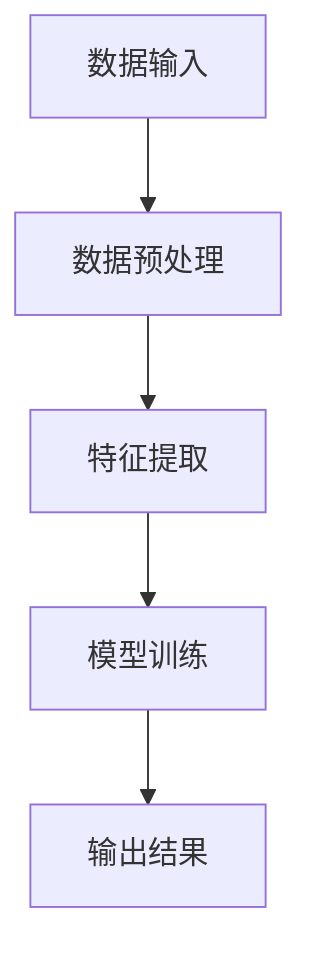
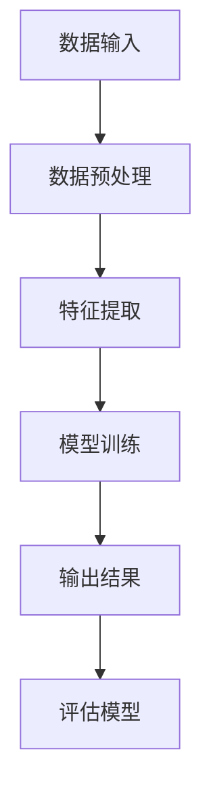
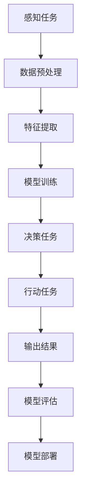

                 

# 引言

## 第1章: 背景介绍

### 1.1 问题背景

随着人工智能技术的飞速发展，人工智能（AI）在各个领域的应用越来越广泛。AI Agent，作为一种能够自主完成特定任务的智能体，正在成为现代人工智能研究与应用的关键方向。AI Agent 的核心能力在于其能够处理多种类型的任务，并且在复杂的动态环境中进行决策和行动。然而，传统的 AI Agent 在处理单一任务时表现出色，但在面对多任务环境时，常常表现出明显的局限性。这一现象引发了学术界和工业界对于如何构建具有多任务学习能力的 AI Agent 的深入研究。

#### 1.1.1 人工智能的兴起与多任务学习的重要性

人工智能（AI）的兴起可以追溯到上世纪50年代，随着计算机技术的发展，AI逐渐成为计算机科学的重要分支。从早期的规则系统、专家系统，到近年来的深度学习和强化学习，人工智能在图像识别、自然语言处理、智能推荐等领域取得了显著的进展。多任务学习作为机器学习的一个重要分支，旨在通过共享模型参数来提升模型在不同任务上的性能。多任务学习不仅能够提高模型的泛化能力，还能够减少模型对数据的需求，从而在实际应用中具有广泛的应用前景。

#### 1.1.2 人工智能 Agent 的定义与需求

人工智能 Agent（AI Agent）是指能够在特定环境中执行任务、感知环境并采取行动的智能实体。AI Agent 可以是软件程序、机器人，甚至是无人驾驶汽车等。在复杂的多任务环境中，AI Agent 需要具备以下能力：

1. **任务理解**：能够理解不同任务的性质和要求。
2. **决策能力**：在执行任务时，能够根据当前状态和环境信息做出最优决策。
3. **资源管理**：在有限资源条件下，合理分配计算资源以完成任务。
4. **自主学习**：通过与环境交互，不断优化自身的任务执行能力。

随着人工智能应用的不断扩大，AI Agent 在许多领域（如智能客服、自动驾驶、智能家居等）中发挥着重要作用。然而，单一任务的 AI Agent 在处理多任务时常常会遇到瓶颈，例如：

- **资源冲突**：在执行多个任务时，可能会出现资源竞争，导致任务执行效率下降。
- **任务优先级**：在多任务环境中，如何动态调整任务优先级，是一个亟待解决的问题。
- **数据依赖**：多个任务之间的数据共享和交互复杂，数据一致性和实时性难以保障。

#### 1.1.3 多任务学习在 AI Agent 中的应用潜力

多任务学习（Multi-Task Learning, MTL）作为一种重要的机器学习技术，能够通过共享模型参数，提高模型在不同任务上的表现。将多任务学习应用于 AI Agent，可以显著提升其任务执行能力，具体体现在以下几个方面：

1. **资源共享**：多任务学习能够减少模型的参数数量，降低计算复杂度，提高模型在多任务环境中的效率和鲁棒性。
2. **任务协同**：在多任务环境中，不同任务之间可能会存在一定的关联性。通过多任务学习，可以更好地利用任务间的关联性，提高任务执行的效率和准确性。
3. **动态适应**：多任务学习算法能够根据任务环境的变化，动态调整模型的参数，从而实现模型的自适应能力。

多任务学习在 AI Agent 中的应用潜力巨大，能够为人工智能的发展带来新的突破。例如：

- **智能客服系统**：通过多任务学习，AI Agent 可以同时处理用户咨询、故障诊断和售后服务等多个任务，提高客服效率和用户满意度。
- **自动驾驶系统**：自动驾驶车辆需要处理感知、决策、控制等多个任务，通过多任务学习，可以提高自动驾驶的稳定性和安全性。
- **智能家居控制系统**：智能家居系统中的多个设备需要协同工作，通过多任务学习，可以更好地实现设备间的智能化交互和管理。

### 1.2 问题描述

在传统的 AI Agent 中，虽然已经实现了较好的单一任务处理能力，但在面对复杂的多任务环境时，仍然存在以下问题：

1. **任务切换效率低**：在执行多个任务时，AI Agent 需要频繁切换任务，这会导致任务切换时间增加，降低系统的整体效率。
2. **资源利用率低**：在多任务环境中，各个任务之间可能会出现资源竞争，导致资源利用率下降，影响系统的稳定性。
3. **任务优先级不明确**：在多个任务同时进行时，如何动态调整任务优先级，以确保关键任务的优先处理，是一个亟待解决的问题。
4. **数据一致性和实时性**：在多任务环境中，不同任务之间的数据共享和交互复杂，数据一致性和实时性难以保障，可能导致任务执行出错。

为了解决这些问题，我们需要构建具有多任务学习能力的 AI Agent，使其能够高效地处理多个任务，提高系统的稳定性和效率。具体来说，我们需要解决以下关键问题：

- **任务理解与识别**：如何准确地识别和理解多个任务，为后续的任务分配和执行提供基础。
- **任务优先级管理**：如何动态调整任务优先级，确保关键任务的优先处理。
- **资源共享与调度**：如何高效地分配和调度系统资源，最大化地利用系统资源。
- **数据一致性保障**：如何保障多任务环境中的数据一致性和实时性，确保任务执行的正确性。

### 1.2.1 现有 AI Agent 的局限

现有的 AI Agent 在处理单一任务时表现出色，但在面对多任务环境时，存在以下局限：

1. **任务切换效率低**：现有的 AI Agent 通常采用顺序执行或并发执行的方式处理多个任务，这会导致任务切换时间增加，降低系统的整体效率。
2. **资源利用率低**：在多任务环境中，各个任务之间可能会出现资源竞争，导致资源利用率下降，影响系统的稳定性。
3. **任务优先级不明确**：在多个任务同时进行时，现有 AI Agent 缺乏动态调整任务优先级的机制，可能导致关键任务的优先处理不及时。
4. **数据一致性和实时性**：在多任务环境中，不同任务之间的数据共享和交互复杂，数据一致性和实时性难以保障，可能导致任务执行出错。

### 1.2.2 多任务学习在 AI Agent 中的挑战

将多任务学习应用于 AI Agent，需要解决以下挑战：

1. **数据不均衡**：在多任务环境中，不同任务的数据量可能存在显著差异，导致模型训练不均衡。如何平衡不同任务的数据量，是一个重要的挑战。
2. **模型复杂性管理**：多任务学习通常涉及多个任务，模型的参数数量显著增加，如何管理模型的复杂性，防止过拟合，是一个关键问题。
3. **模型泛化能力**：多任务学习需要模型具有良好的泛化能力，能够适应不同的任务和环境。如何提升模型的泛化能力，是一个重要的研究方向。
4. **任务依赖关系**：在多任务环境中，不同任务之间可能存在依赖关系。如何准确地建模和利用这些依赖关系，是一个复杂的挑战。

### 1.2.3 问题解决路径

为了构建具有多任务学习能力的 AI Agent，我们可以采取以下问题解决路径：

1. **任务理解与识别**：采用深度学习等技术，对多个任务进行理解和识别，为后续的任务分配和执行提供基础。
2. **任务优先级管理**：引入动态优先级调度算法，根据任务的重要性和紧急程度，动态调整任务优先级，确保关键任务的优先处理。
3. **资源共享与调度**：采用资源管理算法，对系统资源进行高效分配和调度，最大化地利用系统资源。
4. **数据一致性保障**：采用分布式数据一致性协议，保障多任务环境中的数据一致性和实时性，确保任务执行的正确性。
5. **多任务学习算法优化**：对多任务学习算法进行优化，提高模型的泛化能力和训练效率，解决数据不均衡和模型复杂性管理等问题。

### 1.3 边界与外延

#### 1.3.1 多任务学习的基本概念与分类

多任务学习（Multi-Task Learning, MTL）是指在一个共同的学习框架下，同时训练多个相关任务的学习方法。多任务学习的基本概念包括：

- **任务**：指需要完成的特定任务，例如图像分类、语音识别、文本分类等。
- **共享模型**：指用于多个任务的共同模型，通过共享模型参数来提高学习效率。
- **任务依赖**：指不同任务之间的依赖关系，例如某个任务的输出是另一个任务的输入。

多任务学习可以按照不同的分类方式进行分类：

- **基于参数共享**：通过共享模型参数来提高学习效率，包括硬参数共享和软参数共享两种方式。
- **基于任务分解**：将复杂任务分解为多个子任务，分别进行训练，然后再进行整合。
- **基于协同学习**：通过协同学习机制，将多个任务的学习过程相互关联，提高学习性能。

#### 1.3.2 AI Agent 的功能与任务划分

AI Agent 的功能主要包括任务理解、决策、行动和自我优化等。在多任务环境中，AI Agent 的任务划分如下：

- **感知任务**：负责感知环境信息，包括图像、声音、文本等。
- **决策任务**：根据感知信息，进行决策和规划。
- **行动任务**：执行具体的操作，例如控制机器人行动、发送指令等。
- **优化任务**：根据任务执行效果，不断优化模型参数和策略。

#### 1.3.3 多任务学习在 AI Agent 中的关键技术与挑战

多任务学习在 AI Agent 中的应用涉及到多个关键技术：

1. **任务理解与识别**：采用深度学习等技术，对多个任务进行理解和识别，为后续的任务分配和执行提供基础。
2. **任务优先级管理**：引入动态优先级调度算法，根据任务的重要性和紧急程度，动态调整任务优先级，确保关键任务的优先处理。
3. **资源共享与调度**：采用资源管理算法，对系统资源进行高效分配和调度，最大化地利用系统资源。
4. **数据一致性保障**：采用分布式数据一致性协议，保障多任务环境中的数据一致性和实时性，确保任务执行的正确性。
5. **多任务学习算法优化**：对多任务学习算法进行优化，提高模型的泛化能力和训练效率，解决数据不均衡和模型复杂性管理等问题。

多任务学习在 AI Agent 中的应用面临着以下挑战：

1. **数据不均衡**：在多任务环境中，不同任务的数据量可能存在显著差异，导致模型训练不均衡。如何平衡不同任务的数据量，是一个重要的挑战。
2. **模型复杂性管理**：多任务学习通常涉及多个任务，模型的参数数量显著增加，如何管理模型的复杂性，防止过拟合，是一个关键问题。
3. **模型泛化能力**：多任务学习需要模型具有良好的泛化能力，能够适应不同的任务和环境。如何提升模型的泛化能力，是一个重要的研究方向。
4. **任务依赖关系**：在多任务环境中，不同任务之间可能存在依赖关系。如何准确地建模和利用这些依赖关系，是一个复杂的挑战。

### 1.4 核心概念与联系

#### 1.4.1 多任务学习的核心概念

多任务学习（Multi-Task Learning, MTL）是指在一个共同的学习框架下，同时训练多个相关任务的学习方法。多任务学习的核心概念包括：

- **共享模型**：指用于多个任务的共同模型，通过共享模型参数来提高学习效率。
- **任务依赖**：指不同任务之间的依赖关系，例如某个任务的输出是另一个任务的输入。
- **任务并行性**：指在训练过程中，同时处理多个任务的能力。

多任务学习的核心优势在于：

1. **资源共享**：通过共享模型参数，减少模型的参数数量，降低计算复杂度，提高模型在多任务环境中的效率和鲁棒性。
2. **任务协同**：通过任务依赖关系，提高任务执行的效率和准确性。

多任务学习的主要类型包括：

1. **硬参数共享**：所有任务共享相同的模型参数，适用于任务之间存在明显依赖关系的情况。
2. **软参数共享**：部分任务共享模型参数，其他任务具有独立的模型参数，适用于任务之间依赖关系较复杂的情况。
3. **多任务学习网络**：通过构建复杂的神经网络结构，实现任务间的相互关联，适用于多任务并行处理。

多任务学习的重要指标包括：

1. **任务性能**：评估模型在各个任务上的表现，常用指标包括准确率、召回率、F1分数等。
2. **模型复杂度**：评估模型的参数数量和计算复杂度，以防止过拟合和计算资源浪费。
3. **训练时间**：评估模型训练的时间成本，以实现快速训练和部署。

#### 1.4.2 AI Agent 的核心概念

AI Agent（Artificial Intelligence Agent）是指能够自主完成特定任务的智能实体。AI Agent 的核心概念包括：

- **感知**：通过传感器获取环境信息。
- **决策**：根据感知信息，制定行动策略。
- **行动**：执行具体操作，实现任务目标。

AI Agent 的特点包括：

1. **自主性**：AI Agent 能够独立完成任务，无需人工干预。
2. **适应性**：AI Agent 能够根据环境变化，调整自身行为策略。
3. **协同性**：AI Agent 能够与其他 AI Agent 协同工作，实现复杂任务。

AI Agent 的功能与分类如下：

1. **感知功能**：包括图像识别、语音识别、文本处理等。
2. **决策功能**：包括路径规划、资源分配、策略学习等。
3. **行动功能**：包括控制机器人行动、发送指令等。

AI Agent 的分类包括：

1. **基于规则的 AI Agent**：通过规则库实现任务执行。
2. **基于模型预测的 AI Agent**：通过机器学习算法实现任务执行。
3. **基于强化学习的 AI Agent**：通过与环境交互，不断优化策略。

#### 1.4.2.1 AI Agent 的定义与特点

AI Agent 是一种能够自主完成特定任务的智能实体，其核心特点包括自主性、适应性和协同性。AI Agent 通过感知环境信息、制定行动策略和执行操作，实现任务目标。与传统的计算机程序不同，AI Agent 具有自我学习和优化的能力，能够根据环境变化调整自身行为策略。

AI Agent 的自主性体现在其能够独立完成任务，无需人工干预。这种自主性使得 AI Agent 可以在复杂多变的实际环境中高效地完成任务，提高系统的自动化水平。AI Agent 的适应性体现在其能够根据环境变化，动态调整自身行为策略。这种适应性使得 AI Agent 可以应对不同的环境和任务，具有广泛的适用性。AI Agent 的协同性体现在其能够与其他 AI Agent 协同工作，实现复杂任务。这种协同性使得 AI Agent 可以在复杂任务中发挥更好的性能。

#### 1.4.2.2 AI Agent 的功能与分类

AI Agent 的功能主要包括感知、决策和行动。感知功能负责获取环境信息，包括图像、声音、文本等。决策功能负责根据感知信息制定行动策略，包括路径规划、资源分配、策略学习等。行动功能负责执行具体操作，实现任务目标，包括控制机器人行动、发送指令等。

根据实现技术，AI Agent 可以分为以下几类：

1. **基于规则的 AI Agent**：通过规则库实现任务执行。这类 AI Agent 的优点是易于理解和实现，缺点是适应性和灵活性较差。

2. **基于模型预测的 AI Agent**：通过机器学习算法实现任务执行。这类 AI Agent 的优点是能够自动学习环境特征，提高任务执行效果，缺点是实现复杂度高，对数据质量要求较高。

3. **基于强化学习的 AI Agent**：通过与环境交互，不断优化策略。这类 AI Agent 的优点是能够自适应复杂环境，实现高效的决策和行动，缺点是训练时间较长，对环境建模要求较高。

#### 1.4.2.3 AI Agent 在多任务学习中的角色

在多任务学习中，AI Agent 充当执行者、学习和优化者的角色。AI Agent 的任务是在多任务环境中，根据任务需求，高效地完成多个任务。

1. **执行者**：AI Agent 需要根据任务的优先级和执行策略，高效地完成感知、决策和行动等任务。在多任务环境中，AI Agent 需要处理任务切换、资源共享等问题，提高系统的整体性能。

2. **学习者**：AI Agent 需要通过多任务学习，不断优化自身的行为策略。在多任务学习中，AI Agent 可以通过共享模型参数、任务依赖关系等方式，提高学习效率，实现任务协同。

3. **优化者**：AI Agent 需要根据任务执行效果，动态调整任务的优先级和资源分配策略，提高系统的整体效率。通过优化者角色，AI Agent 可以实现任务的自适应调整，提高系统在多任务环境中的适应能力。

### 1.5 本章小结

本章介绍了构建具有多任务学习能力的 AI Agent 的背景和问题，分析了现有 AI Agent 的局限性和多任务学习在 AI Agent 中的应用潜力。通过明确多任务学习的核心概念和 AI Agent 的功能与分类，为后续的算法原理和实现策略奠定了基础。本章还讨论了多任务学习在 AI Agent 中的应用挑战，并提出了解决路径。通过本章的学习，读者可以初步了解多任务学习在 AI Agent 中的应用前景和关键技术。

----------------------------------------------------------------

## 第2章: 多任务学习算法概述

多任务学习算法是构建具有多任务学习能力的 AI Agent 的核心组成部分。本章将介绍多任务学习算法的基本概念、框架、挑战与解决方案，以及主流的多任务学习算法。通过这一章节，读者可以全面了解多任务学习算法的基本原理和实现方法。

### 2.1 多任务学习的算法框架

多任务学习算法的框架可以分为三个主要部分：数据输入、模型训练和输出结果。以下是多任务学习算法的基本流程：

1. **数据输入**：多任务学习算法需要处理多个任务的数据集。这些数据集可以是不同的，也可以是部分重叠的。为了提高模型的泛化能力，通常需要对数据集进行预处理，如数据清洗、归一化等。

2. **模型训练**：在数据输入后，模型将进行训练。多任务学习算法的核心是共享模型参数，通过优化这些参数，使模型能够在不同的任务上表现良好。模型训练通常采用梯度下降等方法，通过迭代更新模型参数，直到模型收敛。

3. **输出结果**：模型训练完成后，将得到一组模型参数。这些参数可以用于预测新数据，从而完成任务的执行。在多任务学习中，每个任务都有自己的输出，这些输出可能相互关联。

#### 2.1.1 多任务学习的基本算法结构

多任务学习算法的基本结构包括以下几个关键模块：

1. **数据预处理模块**：负责对输入数据进行预处理，如数据清洗、归一化、降维等，以提高模型的训练效率和泛化能力。

2. **特征提取模块**：负责从原始数据中提取特征，这些特征将用于模型的训练和预测。特征提取可以采用深度学习模型或其他特征提取算法。

3. **共享模型模块**：这是多任务学习算法的核心，多个任务共享同一个模型，通过共享模型参数来提高学习效率。共享模型可以是完全共享的，也可以是部分共享的。

4. **损失函数模块**：损失函数用于衡量模型预测结果与真实结果之间的差距。在多任务学习中，通常需要定义多个损失函数，分别对应不同的任务。

5. **优化器模块**：优化器用于更新模型参数，以最小化损失函数。常用的优化器包括梯度下降、Adam等。

#### 2.1.2 多任务学习的关键模块

多任务学习的关键模块包括：

1. **数据预处理模块**：数据预处理模块负责对输入数据进行预处理，以提高模型训练效率和泛化能力。预处理步骤可能包括数据清洗、数据归一化、数据降维等。

2. **特征提取模块**：特征提取模块从原始数据中提取有用的特征，这些特征将用于模型的训练和预测。特征提取是模型性能的关键，选择合适的特征提取方法对模型性能有很大影响。

3. **共享模型模块**：共享模型模块是多任务学习的核心。通过共享模型参数，多个任务可以共享计算资源，提高学习效率。共享模型可以是完全共享的，也可以是部分共享的。

4. **损失函数模块**：损失函数模块用于衡量模型预测结果与真实结果之间的差距。在多任务学习中，每个任务都有自己的损失函数，这些损失函数可以单独优化，也可以联合优化。

5. **优化器模块**：优化器模块用于更新模型参数，以最小化损失函数。优化器的选择对模型的收敛速度和最终性能有很大影响。

#### 2.1.3 多任务学习算法的演进路径

多任务学习算法经历了多个发展阶段，从早期的简单共享参数方法，到目前复杂的神经网络结构。以下是多任务学习算法的演进路径：

1. **早期方法**：早期的多任务学习算法主要基于共享参数或特征的方法，如线性回归、逻辑回归等。这些方法简单易实现，但在处理复杂任务时效果有限。

2. **基于神经网络的算法**：随着深度学习的发展，基于神经网络的算法逐渐成为多任务学习的主流。这些算法通过共享神经网络层来提高学习效率，如深度神经网络（DNN）、卷积神经网络（CNN）等。

3. **基于注意力机制的算法**：注意力机制是一种重要的神经网络结构，它能够自动关注重要信息，提高模型的性能。基于注意力机制的多任务学习算法在处理复杂任务时表现出色。

4. **基于强化学习的算法**：强化学习是一种通过试错学习的方法，能够实现自主决策和优化。基于强化学习的多任务学习算法通过不断与环境交互，优化任务执行策略。

5. **基于混合方法的算法**：近年来，越来越多的多任务学习算法结合了深度学习、强化学习和其他方法，以提高模型性能。例如，深度强化学习（Deep Reinforcement Learning, DRL）通过结合深度学习和强化学习的方法，实现了在复杂任务中的高效学习。

### 2.2 多任务学习的挑战与解决方案

多任务学习虽然在提升模型泛化能力和减少数据需求方面具有显著优势，但在实际应用中仍然面临多个挑战。以下将介绍这些挑战以及相应的解决方案。

#### 2.2.1 数据不均衡问题

在多任务学习中，不同任务的数据量可能存在显著差异。这可能导致某些任务在训练过程中受到数据不均衡的影响，从而影响模型的性能。解决方案包括：

1. **重采样**：通过增加少数类数据的样本数量或减少多数类数据的样本数量，使数据分布更加均衡。

2. **数据增强**：通过旋转、缩放、裁剪等方法，增加训练数据的多样性，提高模型对数据分布变化的适应能力。

3. **加权损失函数**：在训练过程中，对不同任务赋予不同的权重，使模型能够关注数据量较少的任务。

#### 2.2.2 模型复杂性管理

多任务学习通常涉及多个任务，这可能导致模型复杂性增加，从而出现过拟合现象。解决方案包括：

1. **正则化**：通过添加正则化项，如L1和L2正则化，降低模型的复杂度，防止过拟合。

2. **模型剪枝**：通过剪枝方法，删除不重要的网络层或神经元，简化模型结构，提高模型效率。

3. **早期停止**：在训练过程中，当模型性能不再提高时，提前停止训练，以防止过拟合。

#### 2.2.3 模型泛化能力

多任务学习需要模型具有良好的泛化能力，能够适应不同的任务和环境。然而，在多任务学习中，模型可能会因为任务之间的依赖关系而难以泛化。解决方案包括：

1. **任务解耦**：通过解耦任务之间的依赖关系，使模型能够独立地学习每个任务的特性。

2. **多任务学习网络**：设计具有特殊结构的神经网络，如基于注意力机制的网络，提高模型对任务间依赖关系的建模能力。

3. **元学习**：通过元学习方法，使模型能够在多个任务中快速适应新任务，提高泛化能力。

### 2.3 主流多任务学习算法介绍

在多任务学习领域，有许多主流的算法被广泛应用。以下将介绍几种典型的多任务学习算法，包括硬参数共享、软参数共享和多任务学习网络。

#### 2.3.1 硬参数共享

硬参数共享（Hard Parameter Sharing）是指多个任务共享相同的模型参数。这种方法的优点是计算效率高，缺点是任务之间的依赖关系较难建模。

1. **基本原理**：硬参数共享通过将多个任务的输入映射到同一个特征空间，使不同任务共享相同的模型参数。

2. **实现方法**：常用的实现方法包括线性层共享、卷积层共享和全连接层共享等。

3. **优缺点**：优点是计算效率高，训练速度快；缺点是任务之间的依赖关系较难建模，可能导致模型性能下降。

#### 2.3.2 软参数共享

软参数共享（Soft Parameter Sharing）是指多个任务部分共享模型参数。与硬参数共享不同，软参数共享允许不同任务拥有独立的模型参数，但仍然具有一定的共享机制。

1. **基本原理**：软参数共享通过将任务划分为子任务，子任务之间共享部分模型参数，但每个子任务也有独立的模型参数。

2. **实现方法**：常用的实现方法包括子网络共享、模块共享和子任务共享等。

3. **优缺点**：优点是能够更好地建模任务之间的依赖关系，提高模型性能；缺点是计算复杂度较高，训练速度较慢。

#### 2.3.3 多任务学习网络

多任务学习网络（Multi-Task Learning Networks）是指通过设计复杂的神经网络结构，实现任务间的相互关联和共享。

1. **基本原理**：多任务学习网络通过引入注意力机制、图神经网络等方法，使模型能够更好地建模任务间的依赖关系。

2. **实现方法**：常用的实现方法包括基于注意力机制的网络、基于图神经网络的网络和基于元学习的网络等。

3. **优缺点**：优点是能够实现任务间的强关联和共享，提高模型性能；缺点是设计复杂，实现难度较高。

### 2.4 多任务学习算法的 Mermaid 流程图

为了更好地理解多任务学习算法的基本流程，以下是一个简化的 Mermaid 流程图：



在这个流程图中，A表示数据输入，B表示数据预处理，C表示特征提取，D表示模型训练，E表示输出结果。通过这个流程图，可以直观地了解多任务学习算法的基本步骤和关键模块。

----------------------------------------------------------------

## 第3章: 多任务学习算法原理详解

在了解多任务学习算法的基本概念和框架后，本章将进一步深入探讨多任务学习算法的原理，包括其数学模型、主要算法和优化方法。通过具体的算法示例和代码实现，我们将对这些原理进行详细讲解。

### 3.1 算法原理

多任务学习算法的核心思想是在一个共同的学习框架下，同时训练多个相关任务。这涉及到多个任务的输入、输出以及模型参数的共享和优化。以下是多任务学习算法的一些基本原理：

#### 3.1.1 多任务学习的数学模型

多任务学习的数学模型通常可以表示为一个多输出函数，该函数将输入数据映射到多个输出任务的结果。设 $X$ 为输入数据集，$Y$ 为输出数据集，其中 $Y$ 包含多个任务的结果 $Y_1, Y_2, ..., Y_n$，多任务学习的目标是学习一个共享参数的函数 $f$，使其能够同时预测多个任务的结果：

$$
f(X) = [f_1(X), f_2(X), ..., f_n(X)]
$$

其中，$f_i(X)$ 为第 $i$ 个任务的输出。为了实现这一目标，我们可以定义一个共享的模型参数 $\theta$，使得每个任务都依赖于这些共享参数。在训练过程中，通过优化损失函数来更新参数 $\theta$，以最小化多个任务的总损失。

#### 3.1.2 多任务学习的主要算法

多任务学习算法可以分为几种类型，每种类型有不同的实现方法和适用场景。以下是几种主要的多任务学习算法：

1. **硬参数共享（Hard Parameter Sharing）**：
   这种方法将多个任务的参数完全共享，适用于任务之间存在明显依赖关系的情况。常用的算法包括线性回归、多层感知机等。

2. **软参数共享（Soft Parameter Sharing）**：
   这种方法允许每个任务拥有独立的参数，但仍然有一定的共享机制。常用的算法包括基于子网络的共享、基于模块的共享等。

3. **多任务学习网络（Multi-Task Learning Networks）**：
   这种方法通过设计复杂的神经网络结构，实现任务间的相互关联和共享。常用的算法包括基于注意力机制的神经网络、图神经网络等。

4. **基于元学习的多任务学习**：
   这种方法通过元学习算法，使模型能够快速适应新任务，提高泛化能力。常用的算法包括基于模型更新的元学习和基于梯度更新的元学习。

#### 3.1.3 多任务学习的优化方法

在多任务学习过程中，优化目标是同时最小化多个任务的总损失。这可以通过以下几种方法实现：

1. **联合优化**：
   将多个任务的损失函数组合成一个总的损失函数，并通过优化这个总损失函数来更新模型参数。常用的优化方法包括梯度下降、随机梯度下降、Adam等。

2. **任务加权优化**：
   对每个任务的损失函数赋予不同的权重，通过加权的方式组合成总的损失函数。这种方法可以强调某些任务的优先级，适用于任务之间重要性不同的情况。

3. **自适应优化**：
   通过自适应优化算法，动态调整每个任务的权重和优化策略，以适应任务的变化和模型性能的需求。常用的算法包括自适应权重调整、动态学习率调整等。

### 3.2 举例说明

为了更好地理解多任务学习算法的原理，我们通过一个简单的例子进行说明。假设有两个任务：图像分类和文本分类。我们将使用一个共享的神经网络模型来同时训练这两个任务。

#### 3.2.1 算法原理示例

首先，我们定义输入数据和输出数据：

```python
# 假设输入数据为图像和文本
images = ...  # 图像数据
texts = ...   # 文本数据

# 假设输出数据为图像分类标签和文本分类标签
image_labels = ...  # 图像分类标签
text_labels = ...   # 文本分类标签
```

然后，我们定义共享的神经网络模型：

```python
import tensorflow as tf

# 定义共享的神经网络模型
model = tf.keras.Sequential([
    tf.keras.layers.Flatten(input_shape=(28, 28)),  # 图像输入层
    tf.keras.layers.Dense(128, activation='relu'),   # 共享层
    tf.keras.layers.Dense(10, activation='softmax'), # 图像分类层
    tf.keras.layers.Dense(128, activation='relu'),   # 共享层
    tf.keras.layers.Dense(10, activation='softmax')  # 文本分类层
])

# 编译模型
model.compile(optimizer='adam',
              loss={'image_output': 'categorical_crossentropy',
                    'text_output': 'categorical_crossentropy'},
              metrics=['accuracy'])
```

在这个模型中，第一层和第三层是图像分类层，第四层和第五层是文本分类层。第二层和第四层是共享层，用于提取共同的特征。

接下来，我们使用图像和文本数据训练模型：

```python
# 训练模型
history = model.fit({'image_input': images, 'text_input': texts},
                    {'image_output': image_labels, 'text_output': text_labels},
                    epochs=10,
                    batch_size=32)
```

通过这个示例，我们可以看到如何使用共享的神经网络模型来同时训练图像分类和文本分类任务。在训练过程中，模型会优化共享的参数，以最小化两个任务的损失函数。

#### 3.2.2 代码实现示例

为了更具体地展示多任务学习的实现，我们使用 Python 编写一个简单的多任务学习代码示例。在这个示例中，我们使用 TensorFlow 和 Keras 库来构建和训练一个多任务学习模型。

```python
import tensorflow as tf
from tensorflow.keras.layers import Input, Dense, Flatten
from tensorflow.keras.models import Model

# 定义输入层
image_input = Input(shape=(28, 28))
text_input = Input(shape=(100,))

# 定义共享层
shared_dense = Dense(128, activation='relu')(Flatten()(image_input))
shared_dense = Dense(128, activation='relu')(shared_dense)

# 定义输出层
image_output = Dense(10, activation='softmax')(shared_dense)
text_output = Dense(10, activation='softmax')(shared_dense)

# 创建模型
model = Model(inputs=[image_input, text_input], outputs=[image_output, text_output])

# 编译模型
model.compile(optimizer='adam',
              loss={'image_output': 'categorical_crossentropy',
                    'text_output': 'categorical_crossentropy'},
              metrics=['accuracy'])

# 训练模型
model.fit([images, texts], {'image_output': image_labels, 'text_output': text_labels},
          epochs=10,
          batch_size=32)
```

在这个示例中，我们首先定义了两个输入层：`image_input` 和 `text_input`。然后，我们定义了一个共享的神经网络层，用于提取共同的特征。最后，我们定义了两个输出层：`image_output` 和 `text_output`。在编译模型时，我们指定了每个输出层的损失函数，并设置了优化器和评估指标。在训练模型时，我们使用图像和文本数据以及它们的标签来训练模型。

#### 3.2.3 结果分析

在完成模型训练后，我们可以分析模型的性能。以下是一个简单的分析过程：

```python
# 评估模型
test_loss, test_accuracy = model.evaluate([test_images, test_texts], {'image_output': test_image_labels, 'text_output': test_text_labels})

print(f"Test loss: {test_loss}")
print(f"Test accuracy: {test_accuracy}")
```

通过评估模型在测试数据上的性能，我们可以得到模型的总损失和准确率。在这个示例中，我们使用了两个任务的准确率来评估模型的整体性能。通过分析结果，我们可以判断模型是否能够有效地同时完成图像分类和文本分类任务。

### 3.3 多任务学习算法的 Mermaid 流程图

为了直观地展示多任务学习算法的流程，我们使用 Mermaid 画出算法的流程图。以下是一个简化的 Mermaid 流程图示例：



在这个流程图中，A 表示数据输入，B 表示数据预处理，C 表示特征提取，D 表示模型训练，E 表示输出结果，F 表示评估模型。通过这个流程图，我们可以清晰地看到多任务学习算法的基本步骤和关键流程。

----------------------------------------------------------------

## 第4章: 多任务学习在 AI Agent 中的应用

在了解了多任务学习算法的原理和实现方法后，本章将探讨多任务学习在 AI Agent 中的应用。通过分析 AI Agent 的任务需求、应用场景和实现策略，我们将展示多任务学习如何提升 AI Agent 的性能和效率。

### 4.1 多任务学习在 AI Agent 中的需求分析

AI Agent 在执行任务时，往往需要处理多种类型的信息和操作。这种多任务环境对 AI Agent 提出了以下需求：

1. **任务并行处理能力**：AI Agent 需要能够在同一时间或并行处理多个任务，以提高系统的整体效率。

2. **动态任务切换能力**：AI Agent 需要能够根据任务的紧急程度和重要性，动态切换任务的优先级，确保关键任务的优先处理。

3. **资源共享和调度**：AI Agent 需要能够高效地管理和调度系统资源，避免资源冲突，最大化地利用系统资源。

4. **自主学习与优化能力**：AI Agent 需要能够根据任务执行效果，自适应地调整自身的行为策略，持续优化任务执行能力。

#### 4.1.1 AI Agent 的任务需求

AI Agent 的任务需求可以分为感知、决策和行动三个主要方面：

1. **感知任务**：感知任务是 AI Agent 从环境中获取信息的手段。这包括图像识别、语音识别、自然语言处理等。AI Agent 需要能够同时处理多种类型的感知任务，以便全面了解环境状态。

2. **决策任务**：决策任务是 AI Agent 根据感知信息，制定行动策略。这包括路径规划、资源分配、策略学习等。AI Agent 需要能够综合考虑多个决策任务，并动态调整决策策略，以应对复杂多变的环境。

3. **行动任务**：行动任务是 AI Agent 根据决策结果，执行具体操作。这包括控制机器人行动、发送指令、执行任务等。AI Agent 需要能够高效地执行多个行动任务，并确保任务的协调和一致性。

#### 4.1.2 多任务学习在 AI Agent 中的应用场景

多任务学习在 AI Agent 中的应用场景非常广泛，以下是一些典型的应用场景：

1. **智能客服系统**：智能客服系统需要同时处理用户咨询、故障诊断和售后服务等多个任务。通过多任务学习，AI Agent 可以更好地理解用户需求，提高客服效率和用户满意度。

2. **自动驾驶系统**：自动驾驶系统需要同时处理感知、决策、控制等多个任务。通过多任务学习，AI Agent 可以提高自动驾驶的稳定性和安全性，应对复杂的道路环境。

3. **智能家居控制系统**：智能家居控制系统需要同时管理多个设备，如灯光、温度、安全等。通过多任务学习，AI Agent 可以实现设备间的智能化交互和管理，提供更加便捷和舒适的生活环境。

4. **智能医疗系统**：智能医疗系统需要同时处理病历分析、诊断建议、治疗方案制定等多个任务。通过多任务学习，AI Agent 可以提供更加精准和个性化的医疗服务。

#### 4.1.3 多任务学习在 AI Agent 中的挑战

将多任务学习应用于 AI Agent，面临以下挑战：

1. **数据不均衡**：在多任务环境中，不同任务的数据量可能存在显著差异，导致模型训练不均衡。

2. **模型复杂性管理**：多任务学习通常涉及多个任务，模型的参数数量显著增加，如何管理模型的复杂性，防止过拟合，是一个关键问题。

3. **模型泛化能力**：多任务学习需要模型具有良好的泛化能力，能够适应不同的任务和环境。

4. **任务依赖关系**：在多任务环境中，不同任务之间可能存在依赖关系。如何准确地建模和利用这些依赖关系，是一个复杂的挑战。

### 4.2 多任务学习在 AI Agent 中的实现策略

为了实现具有多任务学习能力的 AI Agent，我们需要采取以下实现策略：

#### 4.2.1 数据预处理与模型设计

1. **数据预处理**：首先，对多任务数据进行预处理，包括数据清洗、归一化、降维等，以提高模型的训练效率和泛化能力。

2. **模型设计**：设计一个具有多输入层、共享层和多个输出层的神经网络模型。输入层负责接收不同任务的数据，共享层用于提取共同的特征，输出层分别对应不同的任务。

#### 4.2.2 模型训练与优化

1. **模型训练**：使用预处理后的数据集对模型进行训练。在训练过程中，利用多任务损失函数，同时优化多个任务的性能。

2. **模型优化**：通过调整模型参数，优化模型的泛化能力和训练效率。可以采用自适应优化算法，如 Adam，以提高模型的性能。

#### 4.2.3 模型评估与部署

1. **模型评估**：在测试数据集上评估模型的性能，包括准确率、召回率、F1 分数等指标，以评估模型在多任务环境中的表现。

2. **模型部署**：将训练好的模型部署到实际的 AI Agent 中，实现任务自动化和智能化。

### 4.3 多任务学习在 AI Agent 中的应用案例

为了更好地理解多任务学习在 AI Agent 中的应用，我们以下展示几个具体的案例。

#### 4.3.1 案例一：智能客服系统

智能客服系统是一个典型的多任务应用场景。以下是一个简化的智能客服系统的架构：

1. **感知任务**：智能客服系统通过自然语言处理技术，接收用户咨询的问题。

2. **决策任务**：根据用户的问题，智能客服系统需要判断问题的类型，并确定最佳解决方案。

3. **行动任务**：智能客服系统根据决策结果，生成回复文本，并发送给用户。

通过多任务学习，智能客服系统可以同时处理多个用户咨询，提高客服效率和用户体验。

#### 4.3.2 案例二：自动驾驶系统

自动驾驶系统是一个高度复杂的系统，涉及多个任务，包括感知、决策、控制等。以下是一个简化的自动驾驶系统架构：

1. **感知任务**：自动驾驶系统通过摄像头、雷达等传感器，获取道路和周围环境的信息。

2. **决策任务**：根据感知信息，自动驾驶系统需要判断当前行驶状态，并规划行驶路径。

3. **控制任务**：自动驾驶系统根据决策结果，控制车辆的速度和方向，确保行驶安全。

通过多任务学习，自动驾驶系统可以提高在复杂道路环境中的适应能力和决策速度，提高行驶的稳定性和安全性。

#### 4.3.3 案例三：智能家居控制系统

智能家居控制系统是一个典型的多任务应用场景。以下是一个简化的智能家居控制系统架构：

1. **感知任务**：智能家居控制系统通过传感器，获取家庭环境的信息，如温度、湿度、光照等。

2. **决策任务**：根据感知信息，智能家居控制系统需要调整家庭设备的状态，如打开空调、关闭灯光等。

3. **行动任务**：智能家居控制系统根据决策结果，控制家庭设备的开关和调节。

通过多任务学习，智能家居控制系统可以更好地协调家庭设备的运行，提供更加智能化和舒适的家庭环境。

### 4.4 多任务学习算法的 Mermaid 流程图

为了更好地理解多任务学习在 AI Agent 中的应用，我们以下使用 Mermaid 画出多任务学习算法的流程图。



在这个流程图中，A 表示感知任务，B 表示数据预处理，C 表示特征提取，D 表示模型训练，E 表示决策任务，F 表示行动任务，G 表示输出结果，H 表示模型评估，I 表示模型部署。通过这个流程图，我们可以清晰地看到多任务学习在 AI Agent 中的应用过程。

----------------------------------------------------------------

## 第5章: 多任务学习算法的数学模型与公式

多任务学习算法的核心在于如何在多个任务之间共享参数，同时优化每个任务的表现。为了实现这一目标，我们需要对多任务学习算法的数学模型和公式进行深入探讨。以下是多任务学习算法的数学模型、目标函数、损失函数和优化算法的详细说明。

### 5.1 数学模型概述

多任务学习的数学模型基于一个共享的模型架构，通过共享参数来提高学习效率。设 $X$ 为输入数据集，$Y$ 为输出数据集，其中 $Y$ 包含多个任务的结果 $Y_1, Y_2, ..., Y_n$。多任务学习的目标是最小化以下总损失函数：

$$
L(\theta) = \frac{1}{N} \sum_{i=1}^{N} \sum_{j=1}^{n} L_j(y_{ij}, \hat{y}_{ij}(\theta))
$$

其中，$N$ 是样本数量，$L_j$ 是第 $j$ 个任务的损失函数，$\hat{y}_{ij}(\theta)$ 是第 $i$ 个样本在第 $j$ 个任务上的预测结果。

#### 5.1.1 多任务学习的目标函数

多任务学习的目标函数旨在优化模型参数 $\theta$，使得模型在多个任务上同时达到较好的性能。目标函数通常是一个复合损失函数，结合了多个任务的损失：

$$
\min_{\theta} L(\theta) = \frac{1}{N} \sum_{i=1}^{N} \sum_{j=1}^{n} L_j(y_{ij}, \hat{y}_{ij}(\theta))
$$

其中，$L_j(y_{ij}, \hat{y}_{ij}(\theta))$ 是第 $j$ 个任务的损失函数，通常使用交叉熵损失、均方误差损失等常见损失函数。

#### 5.1.2 多任务学习的损失函数

多任务学习的损失函数用于衡量模型预测结果与真实结果之间的差距。常见的损失函数包括：

1. **交叉熵损失（Cross-Entropy Loss）**：
   用于分类任务，定义如下：
   $$
   L_j(y_{ij}, \hat{y}_{ij}(\theta)) = -\sum_{k=1}^{K} y_{ijk} \log(\hat{y}_{ijk}(\theta))
   $$
   其中，$y_{ijk}$ 是第 $i$ 个样本在第 $j$ 个任务的第 $k$ 个类别的真实标签，$\hat{y}_{ijk}(\theta)$ 是模型预测的第 $i$ 个样本在第 $j$ 个任务的第 $k$ 个类别的概率。

2. **均方误差损失（Mean Squared Error Loss）**：
   用于回归任务，定义如下：
   $$
   L_j(y_{ij}, \hat{y}_{ij}(\theta)) = \frac{1}{2} \sum_{k=1}^{K} (y_{ijk} - \hat{y}_{ijk}(\theta))^2
   $$
   其中，$y_{ijk}$ 是第 $i$ 个样本在第 $j$ 个任务的第 $k$ 个真实值，$\hat{y}_{ijk}(\theta)$ 是模型预测的第 $i$ 个样本在第 $j$ 个任务的第 $k$ 个值的预测。

3. **对数损失（Log Loss）**：
   用于概率预测任务，定义如下：
   $$
   L_j(y_{ij}, \hat{y}_{ij}(\theta)) = -y_{ij} \log(\hat{y}_{ij}(\theta)) - (1 - y_{ij}) \log(1 - \hat{y}_{ij}(\theta))
   $$
   其中，$y_{ij}$ 是第 $i$ 个样本在第 $j$ 个任务上的真实标签，$\hat{y}_{ij}(\theta)$ 是模型预测的第 $i$ 个样本在第 $j$ 个任务上的概率。

#### 5.1.3 多任务学习的优化算法

多任务学习的优化算法用于更新模型参数，以最小化总损失函数。常用的优化算法包括：

1. **梯度下降（Gradient Descent）**：
   梯度下降是一种最简单的优化算法，通过计算损失函数关于模型参数的梯度，并沿着梯度的反方向更新参数：
   $$
   \theta = \theta - \alpha \nabla_\theta L(\theta)
   $$
   其中，$\alpha$ 是学习率，$\nabla_\theta L(\theta)$ 是损失函数关于模型参数的梯度。

2. **随机梯度下降（Stochastic Gradient Descent, SGD）**：
   随机梯度下降是梯度下降的一个变体，每次更新参数时只随机选择一个样本的梯度：
   $$
   \theta = \theta - \alpha \nabla_{\theta} L(\theta; x_i, y_i)
   $$
   这种方法可以加快收敛速度，但可能引入噪声。

3. **Adam优化器（Adam Optimizer）**：
   Adam优化器是一种结合了SGD和动量法的优化算法，它利用一阶矩估计（均值）和二阶矩估计（方差）来更新参数，具有较好的收敛性能：
   $$
   \theta = \theta - \alpha \beta_1 \nabla_\theta L(\theta) + (1 - \beta_1) \theta_{t-1} - \alpha \beta_2 \nabla^2_\theta L(\theta) + (1 - \beta_2) \theta_{t-2}
   $$
   其中，$\beta_1$ 和 $\beta_2$ 分别是动量参数，通常取值为0.9。

### 5.2 多任务学习的数学公式

多任务学习算法的数学公式描述了模型参数的更新过程和优化目标。以下是几个关键的多任务学习数学公式：

1. **参数更新公式**：
   $$
   \theta = \theta - \alpha \nabla_\theta L(\theta)
   $$
   其中，$\alpha$ 是学习率，$\nabla_\theta L(\theta)$ 是损失函数关于模型参数的梯度。

2. **交叉熵损失公式**：
   $$
   L_j(y_{ij}, \hat{y}_{ij}(\theta)) = -\sum_{k=1}^{K} y_{ijk} \log(\hat{y}_{ijk}(\theta))
   $$
   其中，$y_{ijk}$ 是第 $i$ 个样本在第 $j$ 个任务的第 $k$ 个类别的真实标签，$\hat{y}_{ijk}(\theta)$ 是模型预测的第 $i$ 个样本在第 $j$ 个任务的第 $k$ 个类别的概率。

3. **均方误差损失公式**：
   $$
   L_j(y_{ij}, \hat{y}_{ij}(\theta)) = \frac{1}{2} \sum_{k=1}^{K} (y_{ijk} - \hat{y}_{ijk}(\theta))^2
   $$
   其中，$y_{ijk}$ 是第 $i$ 个样本在第 $j$ 个任务的第 $k$ 个真实值，$\hat{y}_{ijk}(\theta)$ 是模型预测的第 $i$ 个样本在第 $j$ 个任务的第 $k$ 个值的预测。

4. **对数损失公式**：
   $$
   L_j(y_{ij}, \hat{y}_{ij}(\theta)) = -y_{ij} \log(\hat{y}_{ij}(\theta)) - (1 - y_{ij}) \log(1 - \hat{y}_{ij}(\theta))
   $$
   其中，$y_{ij}$ 是第 $i$ 个样本在第 $j$ 个任务上的真实标签，$\hat{y}_{ij}(\theta)$ 是模型预测的第 $i$ 个样本在第 $j$ 个任务上的概率。

通过这些数学公式，我们可以理解和实现多任务学习算法，使其在多个任务上达到最优的性能。在实际应用中，根据任务特点和数据集特性，可以选择合适的损失函数和优化算法，以实现高效的多任务学习。

