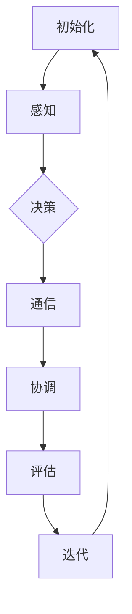
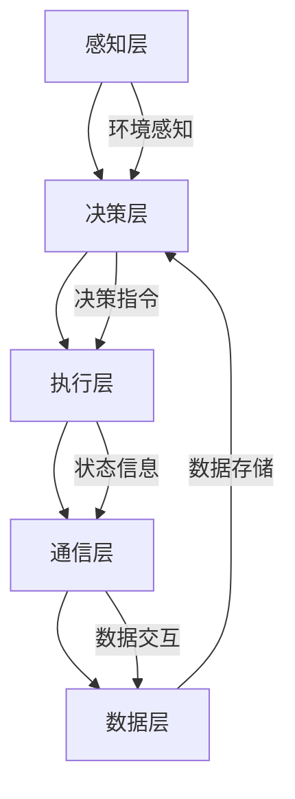
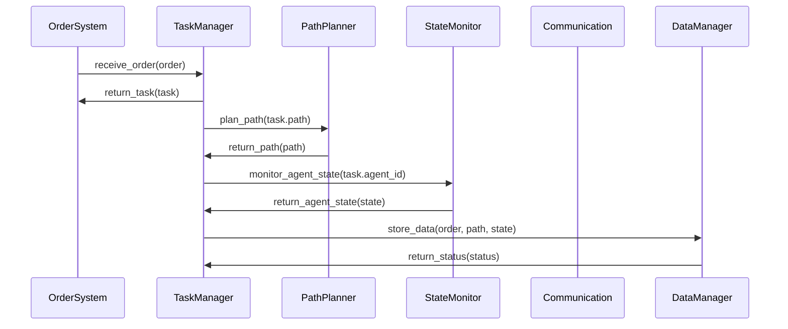

                 

## 引言

### 《构建具有多智能体协作能力的AI系统》

在人工智能（AI）迅猛发展的今天，AI系统的构建与应用已经深入到社会生活的方方面面。然而，随着AI系统的复杂度不断攀升，如何提升其自主性、决策效率和准确性，成为了一个亟待解决的问题。多智能体协作能力的引入，为AI系统的发展提供了新的思路和途径。

多智能体系统（MAS）是由多个智能体（Agent）组成的系统，这些智能体可以在同一环境中协同工作，共同完成复杂的任务。在多智能体协作中，智能体之间通过通信和信息共享，实现协调一致的行动，从而达到整体最优。这种协作能力不仅能够提升AI系统的自主性，还能提高其决策效率和准确性，进一步拓展应用场景。

本篇文章将围绕构建具有多智能体协作能力的AI系统这一主题，逐步探讨以下几个核心问题：

1. **多智能体系统的基本概念**：介绍多智能体系统的定义、发展历程和关键特征。
2. **多智能体协作能力的重要性**：分析多智能体协作对提升AI系统自主性、决策效率和准确性的贡献。
3. **多智能体协作的基本模型与算法**：探讨协同控制算法、通信与信息共享机制以及强化学习在多智能体系统中的应用。
4. **多智能体系统的挑战与机遇**：分析多智能体系统在模型复杂性、计算效率、安全性与稳定性以及应用领域拓展等方面的挑战和机遇。
5. **核心概念与联系**：通过概念表格、ER实体关系图和算法原理与数学模型，深入剖析多智能体系统的核心概念和联系。
6. **系统分析与架构设计**：介绍多智能体协作系统的项目介绍、系统功能设计、系统架构设计、系统接口设计和系统交互。
7. **项目实战与实现**：通过环境安装与配置、系统核心实现源代码、代码应用解读与分析、实际案例分析与详细讲解，展示如何构建具有多智能体协作能力的AI系统。
8. **最佳实践与注意事项**：总结多智能体协作系统的最佳实践，并提供注意事项和风险提示。
9. **总结与展望**：回顾本文的主要内容，展望多智能体协作能力的未来发展。

通过这篇文章，我们将系统地了解和掌握构建具有多智能体协作能力的AI系统的理论和方法，为未来的AI系统研究和应用奠定坚实基础。

### 关键词

- 多智能体系统
- 智能体协作
- 协同控制算法
- 强化学习
- 系统架构设计

### 摘要

本文旨在探讨构建具有多智能体协作能力的AI系统的理论和方法。首先，介绍了多智能体系统的基本概念、发展历程和关键特征。接着，分析了多智能体协作能力对提升AI系统自主性、决策效率和准确性的重要性。随后，深入探讨了多智能体协作的基本模型与算法，包括协同控制算法、通信与信息共享机制以及强化学习在多智能体系统中的应用。然后，分析了多智能体系统在模型复杂性、计算效率、安全性与稳定性以及应用领域拓展等方面的挑战与机遇。最后，通过系统分析与架构设计、项目实战与实现，展示了如何构建具有多智能体协作能力的AI系统，并提出了最佳实践与注意事项。本文的研究为AI系统的发展提供了新的思路和方向。

---

### 第1章 问题背景与概述

#### 1.1 多智能体系统的基本概念

多智能体系统（Multi-Agent System，MAS）是由多个智能体（Agent）组成的系统，这些智能体可以在同一环境中协同工作，共同完成复杂的任务。智能体是MAS的基本组成部分，可以被视为具有自主性、社交性和反应性的实体。每个智能体都有自己的感知、决策和行为能力，通过与环境和其他智能体进行交互，实现自主行动和目标优化。

**定义与概述**

多智能体系统的发展历程可以追溯到20世纪80年代，当时研究人员开始探索如何通过多个智能体之间的协作，解决复杂问题。MAS的定义可以归纳为以下几点：

- **智能体（Agent）**：智能体是MAS的基本单位，具备自主性、社交性和反应性。自主性是指智能体可以自主地制定计划和执行行动；社交性是指智能体可以与其他智能体进行通信和协作；反应性是指智能体可以根据环境变化调整自己的行为。
- **协同工作**：多个智能体在同一环境中共同完成任务，通过通信和信息共享，实现协调一致的行动。
- **分布式计算**：MAS通常采用分布式计算的方式，智能体可以在不同的计算节点上运行，相互协作完成任务。

**发展历程**

多智能体系统的发展历程可以分为以下几个阶段：

1. **早期探索（1980s-1990s）**：在这个阶段，研究人员开始探索如何定义和构建智能体，以及如何实现智能体之间的通信和协作。代表工作包括Sri Lanka和George Silver的MAS理论和基于代理的软件开发方法。
2. **理论体系形成（1990s-2000s）**：随着人工智能和计算机网络技术的发展，MAS的理论体系逐渐形成，包括智能体的建模、通信机制、协调算法等方面。代表性的理论框架有MAS理论、多智能体强化学习、社交网络分析等。
3. **应用领域拓展（2000s-至今）**：MAS的应用领域逐渐拓展到多个领域，如智能交通、智能医疗、金融、工业自动化等。在实际应用中，MAS展示了强大的协同工作能力和适应性。

**关键特征**

多智能体系统的关键特征包括：

- **分布式计算**：MAS采用分布式计算的方式，智能体可以在不同的计算节点上运行，相互协作完成任务。
- **自主性**：每个智能体都有自主决策和执行行动的能力，可以根据环境变化自主调整自己的行为。
- **社交性**：智能体之间可以通过通信和协作，共享信息和资源，实现协调一致的行动。
- **适应性**：MAS具有适应环境变化的能力，智能体可以实时调整自己的行为策略，以适应新的环境和任务。

通过上述对多智能体系统基本概念的介绍，我们可以更好地理解MAS的定义、发展历程和关键特征。在下一节中，我们将进一步探讨多智能体协作能力的重要性。

---

#### 1.2 多智能体协作能力的重要性

多智能体协作能力是提升AI系统自主性、决策效率和准确性的一种关键机制。在复杂多变的环境中，单个智能体可能无法单独完成任务，需要多个智能体之间的协作和配合。以下是多智能体协作能力在AI系统中的几个重要作用：

**提升AI系统的自主性**

多智能体协作能力能够显著提升AI系统的自主性。在传统的集中式AI系统中，所有决策和行动都由中心控制器进行协调，这使得系统对中心控制器的依赖性较强。而在多智能体协作系统中，每个智能体都有一定的自主决策能力，可以在局部范围内自主制定行动策略。这种分布式决策机制不仅提高了系统的灵活性，还增强了系统的鲁棒性和容错性。

例如，在自动驾驶领域，车辆之间的协作能够实现交通流量优化、避让障碍物、合理分配资源等，从而提高整个交通系统的效率和安全性。如果依赖单一车辆进行决策，可能会因为视野局限和信息不对称，导致决策效率低下。

**提高决策效率和准确性**

多智能体协作能力通过分散化决策和并行处理，显著提高了AI系统的决策效率和准确性。在复杂任务中，多个智能体可以同时处理不同的子任务，并在局部范围内进行快速决策和响应。这种分布式决策机制能够减少信息传递和处理的时间延迟，提高系统的响应速度。

此外，多智能体协作还能够通过融合多个智能体的局部信息，提高决策的准确性。在智能电网、智能医疗等应用场景中，多个智能体可以收集和分析不同区域的数据，从而更准确地预测故障、优化资源分配、提高诊断准确率。

**拓展应用场景**

多智能体协作能力使得AI系统可以应用于更广泛的场景。传统的集中式AI系统往往受限于计算资源和网络条件，难以在资源受限的环境中进行部署。而多智能体协作系统通过分布式计算和通信，可以在资源受限的环境中运行，拓展了AI系统的应用范围。

例如，在无人零售、智能农业等场景中，多智能体协作系统能够通过协同感知和决策，实现自动化运营和精准管理。这些应用场景对AI系统的自主性、决策效率和准确性有更高的要求，而多智能体协作能力恰好能够满足这些需求。

**增强系统稳定性和鲁棒性**

多智能体协作能力能够增强AI系统的稳定性和鲁棒性。在分布式计算环境中，智能体之间的协作和冗余设计，可以增强系统的容错能力和抗干扰能力。即使某个智能体出现故障或受到攻击，其他智能体仍然可以继续运行，确保系统的稳定运行。

例如，在智能交通系统中，车辆之间的协作和通信可以实时监测路况，及时调整行驶策略，避免交通拥堵和事故发生。即使某个车辆发生故障，其他车辆可以通过协作机制，继续维持交通秩序。

综上所述，多智能体协作能力在提升AI系统自主性、决策效率和准确性，拓展应用场景，增强系统稳定性和鲁棒性等方面具有重要作用。在下一节中，我们将探讨多智能体协作的基本模型与算法。

---

#### 1.3 多智能体协作的基本模型与算法

多智能体协作能力的实现依赖于一系列基本模型和算法，这些模型和算法为智能体之间的通信、协作和决策提供了理论支持和技术手段。以下将介绍几种常用的多智能体协作模型与算法，包括协同控制算法、通信与信息共享机制以及强化学习在多智能体系统中的应用。

**协同控制算法**

协同控制算法是多智能体协作中的核心算法之一，旨在通过智能体之间的协作，实现整体系统的优化目标。协同控制算法通常基于分布式优化框架，智能体通过局部信息交换和协调，逐步优化自身的行为策略。

**分布式优化框架**

分布式优化框架是一种将全局优化问题分解为多个局部子问题的方法，每个智能体只需优化自己的局部问题，并通过通信机制与其他智能体共享信息。分布式优化框架的关键在于如何设计有效的通信和信息共享机制，以实现全局优化目标。

**通信与信息共享机制**

通信与信息共享机制是多智能体协作的重要组成部分，它决定了智能体之间如何交换信息、共享资源以及协调行动。以下是一些常用的通信与信息共享机制：

- **完全信息共享**：智能体之间完全共享各自的状态信息，以便实现全局优化。这种方法适用于信息传输成本较低的场景，但可能面临信息过载和隐私泄露的问题。
- **部分信息共享**：智能体仅共享部分关键信息，以减少信息传输成本和隐私风险。这种方法适用于信息传输成本较高的场景，但可能影响优化效果。
- **基于任务的共享**：智能体根据任务的特定需求，动态调整共享信息的范围和内容，以实现高效协作。

**信息融合与处理**

在多智能体协作中，智能体需要处理来自其他智能体的信息，进行信息融合与处理。信息融合与处理的方法包括：

- **局部感知信息融合**：将多个智能体的局部感知信息进行融合，以获得更全面的环境感知。
- **全局信息融合**：将多个智能体的全局信息进行融合，以实现更精确的决策和协调。

**强化学习在多智能体系统中的应用**

强化学习（Reinforcement Learning，RL）是一种通过试错和奖励机制，智能体不断调整策略以实现最优行为的机器学习方法。在多智能体系统中，强化学习可以通过以下方式应用：

- **多智能体强化学习**：多个智能体通过相互交互和竞争，共同学习最优策略，以实现整体系统目标。多智能体强化学习可以采用合作（Cooperative）或竞争（Competitive）的方式，根据系统目标进行设计。
- **基于奖励的多智能体强化学习**：智能体通过接收奖励信号，调整自己的行为策略，以实现系统最优。奖励机制的设计至关重要，需要平衡个体目标和整体目标。

**示例算法：分布式协同控制**

以下是一个简单的分布式协同控制算法示例：

```
初始化：智能体数量n，每个智能体的初始状态s_i
循环执行以下步骤：
  1. 每个智能体根据当前状态s_i，计算局部控制策略u_i
  2. 智能体之间进行通信，共享局部控制策略u_i
  3. 根据共享的局部控制策略，更新全局控制策略u
  4. 根据全局控制策略u，更新智能体的状态s_i
  5. 更新奖励信号r，根据系统目标调整智能体的行为策略
```

通过上述算法，多个智能体可以在同一环境中协同工作，实现全局优化目标。在实际应用中，分布式协同控制算法可以根据具体场景进行定制和优化。

综上所述，多智能体协作的基本模型与算法为智能体之间的通信、协作和决策提供了有效的理论和方法支持。在下一节中，我们将探讨多智能体系统在模型复杂性、计算效率、安全性与稳定性以及应用领域拓展等方面的挑战与机遇。

---

#### 1.4 多智能体系统的挑战与机遇

尽管多智能体系统（MAS）在提升AI系统自主性、决策效率和准确性方面展现出巨大潜力，但其发展仍然面临一系列挑战和机遇。以下将分析多智能体系统在模型复杂性、计算效率、安全性与稳定性以及应用领域拓展等方面的挑战与机遇。

**模型复杂性**

多智能体系统的复杂性主要来源于以下几个方面：

1. **智能体数量与交互关系**：随着智能体数量的增加，智能体之间的交互关系变得复杂。如何高效地建模和模拟大量智能体的交互行为，成为了一个挑战。
2. **环境复杂性**：多智能体系统通常运行在复杂动态环境中，环境变化和不确定性增加了系统的复杂性。如何准确预测和适应环境变化，是系统设计的关键问题。
3. **多目标优化**：多智能体系统往往需要同时优化多个目标，如效率、成本、安全性等。如何在多个目标之间进行平衡，实现整体最优，是一个复杂的优化问题。

**计算效率**

多智能体系统的计算效率问题主要体现在以下几个方面：

1. **通信开销**：智能体之间的通信开销在分布式系统中占据了很大比例。如何减少通信次数和通信量，提高通信效率，是一个关键问题。
2. **计算资源分配**：在多智能体系统中，如何合理分配计算资源，确保每个智能体都有足够的计算能力，也是一个挑战。
3. **并行处理**：如何利用并行计算技术，提高多智能体系统的处理速度，是提升计算效率的一个重要方向。

**安全性与稳定性**

多智能体系统的安全性和稳定性问题主要包括以下几个方面：

1. **智能体攻击与欺诈**：恶意智能体可能通过欺骗、攻击等方式破坏系统稳定性和可靠性。如何检测和防范恶意智能体，是系统设计的一个重要问题。
2. **隐私保护**：在多智能体系统中，智能体之间需要共享大量信息，如何保护隐私和数据安全，是系统设计的一个重要挑战。
3. **系统容错性**：多智能体系统需要具备较强的容错性，以应对智能体故障或网络中断等问题。如何设计和实现具有高容错性的系统架构，是系统设计的一个重要方向。

**应用领域拓展**

多智能体系统的应用领域正逐步拓展，但同时也面临着一些机遇和挑战：

1. **智能交通**：多智能体系统在智能交通中的应用，如自动驾驶、智能信号控制等，为解决交通拥堵、提高交通效率提供了新的思路。
2. **智能医疗**：多智能体系统在智能医疗中的应用，如疾病诊断、药物研发等，为提升医疗质量和效率提供了新手段。
3. **工业自动化**：多智能体系统在工业自动化中的应用，如智能工厂、无人生产线等，为提高生产效率和降低成本提供了新方案。

**机遇**

1. **分布式计算与云计算**：随着分布式计算和云计算技术的发展，为多智能体系统提供了更强大的计算资源和更灵活的部署方式。
2. **物联网与传感器网络**：物联网和传感器网络的发展，为多智能体系统提供了丰富的感知和数据资源，促进了系统的智能化和自动化。
3. **人工智能与机器学习**：人工智能和机器学习技术的进步，为多智能体系统提供了更先进的学习和决策方法，提升了系统的智能化水平。

**挑战**

1. **数据安全与隐私保护**：随着多智能体系统应用的普及，数据安全与隐私保护问题日益突出，如何确保系统的安全性和用户隐私，是一个亟待解决的挑战。
2. **复杂环境建模与预测**：多智能体系统在复杂环境中的应用，对环境建模和预测提出了更高要求，如何准确建模和预测复杂环境，是一个重要问题。
3. **系统设计与实现**：多智能体系统设计复杂，如何设计高效、稳定、可靠的多智能体系统，是一个技术难题。

综上所述，多智能体系统在模型复杂性、计算效率、安全性与稳定性以及应用领域拓展等方面面临着一系列挑战和机遇。通过不断创新和优化，多智能体系统有望在更多领域发挥重要作用，推动人工智能技术的发展。

---

#### 1.5 本章小结

本章首先介绍了多智能体系统的基本概念，包括其定义、发展历程和关键特征。随后，探讨了多智能体协作能力的重要性，分析了其在提升AI系统自主性、决策效率和准确性方面的贡献。接着，详细介绍了多智能体协作的基本模型与算法，包括协同控制算法、通信与信息共享机制以及强化学习在多智能体系统中的应用。最后，分析了多智能体系统在模型复杂性、计算效率、安全性与稳定性以及应用领域拓展等方面的挑战与机遇。通过本章的学习，读者可以全面了解多智能体系统的基本概念和原理，为后续章节的深入探讨奠定基础。在下一章中，我们将进一步探讨多智能体系统的核心概念与联系。

---

### 第2章 核心概念与联系

在深入探讨多智能体系统的构建之前，理解其核心概念及其相互之间的联系至关重要。本章将通过概念表格、ER实体关系图以及算法原理与数学模型，系统性地介绍多智能体系统的基本概念和联系。

#### 2.1 多智能体系统的基本概念表格

首先，我们通过一个概念表格来展示多智能体系统的基本概念及其定义：

| 概念             | 定义                                                         |
|------------------|--------------------------------------------------------------|
| 智能体（Agent）   | 具有感知、决策和行为能力的自主实体。                         |
| 多智能体系统（MAS） | 由多个智能体组成的系统，通过协同工作完成复杂任务。         |
| 自主性           | 智能体能够自主地制定计划和执行行动的能力。                  |
| 社交性           | 智能体之间能够进行通信和协作的能力。                        |
| 反应性           | 智能体能够根据环境变化调整自身行为的能力。                  |
| 分布式计算       | 多智能体系统通常采用分布式计算方式，智能体在不同节点上运行。|
| 通信与信息共享   | 智能体之间通过通信和共享信息，实现协调一致的行动。         |

**概念表格示例**：

```mermaid
概念表格
| 概念         | 定义                                                         |
| ------------ | ------------------------------------------------------------ |
| 智能体（Agent）| 具有感知、决策和行为能力的自主实体。                         |
| 多智能体系统（MAS）| 由多个智能体组成的系统，通过协同工作完成复杂任务。         |
| 自主性       | 智能体能够自主地制定计划和执行行动的能力。                  |
| 社交性       | 智能体之间能够进行通信和协作的能力。                        |
| 反应性       | 智能体能够根据环境变化调整自身行为的能力。                  |
| 分布式计算   | 多智能体系统通常采用分布式计算方式，智能体在不同节点上运行。|
| 通信与信息共享 | 智能体之间通过通信和共享信息，实现协调一致的行动。         |
```

#### 2.2 多智能体系统的ER实体关系图

实体关系图（Entity-Relationship Diagram，ER图）是描述系统中实体及其相互关系的一种图形化表示方法。在多智能体系统中，ER图有助于我们理解智能体之间的交互关系和系统结构。

以下是一个多智能体系统的ER实体关系图示例：

```mermaid
erDiagram
  智能体 ||--|{ 信息共享 }|| 数据库
  智能体 ||--|{ 协作 }|| 智能体
  智能体 ||--|{ 环境 }|| 环境
  信息共享 ||--|{ 存储 }|| 数据库
  信息共享 ||--|{ 传输 }|| 网络
```

在这个ER图中，智能体是系统的基本实体，它们通过信息共享和协作实现系统的功能。信息共享连接了智能体和数据库，表示智能体通过数据库进行信息存储和传输。协作关系表示智能体之间的互动，而环境实体表示系统运行的外部环境。

#### 2.3 概念属性特征对比表格

为了更深入地理解多智能体系统的核心概念和特征，我们通过对比表格展示各个概念的关键属性特征：

| 概念     | 关键属性 | 特征描述                                                         |
|----------|----------|----------------------------------------------------------------|
| 智能体   | 感知、决策、行为 | 自主执行任务，根据环境变化调整行为。                                |
| 多智能体系统 | 智能体、分布式计算、协作 | 多个智能体协同工作，实现复杂任务。                                |
| 自主性   | 自主决策、自主行动 | 智能体具有独立的决策和执行能力。                                  |
| 社交性   | 通信、协作、信息共享 | 智能体通过通信和协作，共享信息和资源。                              |
| 反应性   | 根据环境变化调整 | 智能体能够动态适应环境变化，优化行为。                              |
| 分布式计算 | 节点、通信、协同 | 智能体在不同计算节点上运行，通过通信和协作完成计算任务。            |
| 通信与信息共享 | 数据传输、信息存储 | 实现智能体之间的信息交换和共享，支持协同工作。                      |

**概念属性特征对比表格示例**：

```mermaid
概念属性特征对比表格
| 概念     | 关键属性     | 特征描述                                                         |
|----------|--------------|----------------------------------------------------------------|
| 智能体   | 感知、决策、行为 | 自主执行任务，根据环境变化调整行为。                                |
| 多智能体系统 | 智能体、分布式计算、协作 | 多个智能体协同工作，实现复杂任务。                                |
| 自主性   | 自主决策、自主行动 | 智能体具有独立的决策和执行能力。                                  |
| 社交性   | 通信、协作、信息共享 | 智能体通过通信和协作，共享信息和资源。                              |
| 反应性   | 根据环境变化调整 | 智能体能够动态适应环境变化，优化行为。                              |
| 分布式计算 | 节点、通信、协同 | 智能体在不同计算节点上运行，通过通信和协作完成计算任务。            |
| 通信与信息共享 | 数据传输、信息存储 | 实现智能体之间的信息交换和共享，支持协同工作。                      |
```

#### 2.4 多智能体协作的关键算法

多智能体系统的协作能力依赖于一系列关键算法，这些算法确保智能体之间的协调一致和高效工作。以下简要介绍几种重要的多智能体协作算法：

1. **协同控制算法**：通过分布式优化和协调控制，实现智能体之间的协同工作。算法包括分布式梯度下降、拉格朗日乘数法等。

2. **多智能体强化学习**：利用强化学习技术，智能体通过试错和奖励机制，学习最优策略，实现协同决策。算法包括Q-learning、SARSA等。

3. **分布式感知与融合算法**：智能体通过局部感知和全局信息融合，实现环境感知和状态估计，为协同决策提供支持。算法包括卡尔曼滤波、贝叶斯滤波等。

**算法原理与Mermaid流程图示例**：

```mermaid
流程图
graph TD
    A[初始化参数] --> B{计算局部策略}
    B -->|是| C{更新全局策略}
    B -->|否| D{结束}
    C --> E{更新状态}
    E --> F{计算奖励}
    F --> G{调整策略}
    G --> B
```

在这个流程图中，智能体首先初始化参数，然后计算局部策略。如果计算完成，智能体将更新全局策略，并据此更新状态。接着，智能体计算奖励，根据奖励调整策略，并返回到局部策略计算步骤，形成闭环。

#### 2.5 本章小结

本章通过概念表格、ER实体关系图、概念属性特征对比表格和算法原理与Mermaid流程图，系统地介绍了多智能体系统的核心概念及其相互之间的联系。通过本章的学习，读者可以全面了解多智能体系统的基本概念、结构及其关键算法，为后续章节的深入探讨打下坚实基础。

---

### 第3章 算法原理与数学模型

在构建具有多智能体协作能力的AI系统中，算法原理和数学模型起着至关重要的作用。本章节将详细介绍多智能体协同控制算法的原理，并展示其对应的数学模型和Python代码实现。

#### 3.1 多智能体协同控制算法原理

多智能体协同控制算法旨在通过智能体之间的协同工作，实现整体系统的最优性能。协同控制算法的核心在于智能体之间通过信息共享和协同决策，共同完成任务。以下是一个简单的协同控制算法原理流程：

1. **初始化**：设定每个智能体的初始状态、速度和加速度。
2. **感知**：每个智能体感知自身状态及周围环境信息。
3. **决策**：每个智能体基于自身状态和周围环境信息，计算局部控制策略。
4. **通信**：智能体之间通过通信共享局部控制策略。
5. **协调**：智能体根据共享的局部控制策略，调整自身行为，实现全局协调。
6. **评估**：评估系统性能，包括目标达成度、能耗等指标。
7. **迭代**：重复上述步骤，逐步优化系统性能。

**Mermaid流程图示例**：



#### 3.2 数学模型与公式

多智能体协同控制算法的核心在于智能体之间的协调与优化。以下是一个简单的多智能体协同控制算法的数学模型：

**位置协同公式**：

$$
\mathbf{x}_{i}(t) = \mathbf{x}_{i0} + v_i(t) t + \frac{1}{2} a_i(t) t^2
$$

其中，$\mathbf{x}_{i}(t)$ 表示第 $i$ 个智能体的位置，$\mathbf{x}_{i0}$ 表示初始位置，$v_i(t)$ 表示速度，$a_i(t)$ 表示加速度。

**动力协同公式**：

$$
\mathbf{v}_{i}(t) = \mathbf{v}_{i0} + a_i(t) t
$$

$$
\mathbf{a}_{i}(t) = \frac{F_i(t)}{m_i}
$$

其中，$\mathbf{v}_{i}(t)$ 表示第 $i$ 个智能体的速度，$\mathbf{a}_{i}(t)$ 表示加速度，$F_i(t)$ 表示作用在第 $i$ 个智能体上的合力，$m_i$ 表示智能体的质量。

**Python代码实现**：

```python
import numpy as np

def position协同时刻(t, x0, v0, a0):
    return x0 + v0 * t + 0.5 * a0 * t**2

def velocity协同时刻(t, v0, a0):
    return v0 + a0 * t

def acceleration_by_force(force, mass):
    return force / mass
```

#### 3.3 算法实现与Python代码

以下是一个简单的多智能体协同控制算法的实现示例。该算法通过Python代码实现，展示了智能体之间的位置协同、速度协同和加速度协同。

```python
import numpy as np

class Agent:
    def __init__(self, initial_position, initial_velocity, mass):
        self.position = initial_position
        self.velocity = initial_velocity
        self.mass = mass
        self.force = 0

    def update_state(self, time_step, acceleration):
        new_velocity = self.velocity + acceleration * time_step
        new_position = self.position + self.velocity * time_step + 0.5 * acceleration * time_step**2
        self.velocity = new_velocity
        self.position = new_position

    def apply_force(self, force):
        self.force = force

def multi_agent协同控制系统(agents, time_step, total_time):
    for t in range(total_time):
        for agent in agents:
            agent.update_state(time_step, agent.force / agent.mass)
            print(f"Time: {t}, Position: {agent.position}, Velocity: {agent.velocity}")

# 初始化智能体
agent1 = Agent(initial_position=np.array([0, 0]), initial_velocity=np.array([0, 0]), mass=1)
agent2 = Agent(initial_position=np.array([10, 0]), initial_velocity=np.array([0, 0]), mass=1)

# 施加合力
agent1.apply_force(np.array([0, 10]))
agent2.apply_force(np.array([0, -10]))

# 运行协同控制系统
multi_agent协同控制系统(agents=[agent1, agent2], time_step=1, total_time=10)
```

#### 3.4 举例说明

以下是一个简单的多智能体协同控制案例，展示如何通过Python代码实现智能体的位置协同、速度协同和加速度协同。

**案例描述**：

有两个智能体，初始位置分别为(0, 0)和(10, 0)，初始速度均为(0, 0)。每个智能体的质量为1。在时间步长为1的10个时间步内，分别给两个智能体施加一个向下的力和一个向上的力，观察智能体的运动轨迹。

**代码实现**：

```python
# 初始化智能体
agent1 = Agent(initial_position=np.array([0, 0]), initial_velocity=np.array([0, 0]), mass=1)
agent2 = Agent(initial_position=np.array([10, 0]), initial_velocity=np.array([0, 0]), mass=1)

# 施加合力
agent1.apply_force(np.array([0, -10]))
agent2.apply_force(np.array([0, 10]))

# 运行协同控制系统
multi_agent协同控制系统(agents=[agent1, agent2], time_step=1, total_time=10)
```

**结果分析与评估**：

通过运行上述代码，可以观察到两个智能体在受到不同方向的力作用后，分别向下和向上运动。智能体1在第一个时间步内，位置从(0, 0)变为(0, -0.5)，速度从(0, 0)变为(0, -0.5)。智能体2在第一个时间步内，位置从(10, 0)变为(10, 0.5)，速度从(0, 0)变为(0, 0.5)。随着时间步的增加，两个智能体的位置和速度逐渐变化，但始终保持相对平衡。

通过上述案例，我们可以看到多智能体协同控制算法在Python中的实现，以及如何通过代码展示智能体的位置协同、速度协同和加速度协同。在下一章节中，我们将进一步探讨系统分析与架构设计。

#### 3.5 本章小结

本章详细介绍了多智能体协同控制算法的原理，包括其流程、数学模型和Python代码实现。通过具体的案例和代码示例，展示了如何通过位置协同、速度协同和加速度协同，实现多智能体之间的协同工作。本章的内容为构建具有多智能体协作能力的AI系统提供了理论基础和实践指导。在下一章中，我们将深入探讨系统分析与架构设计，为实际系统的构建提供进一步的框架和方法。

---

### 第4章 系统分析与架构设计

在构建具有多智能体协作能力的AI系统时，系统分析与架构设计是至关重要的一步。本章将介绍一个多智能体协作系统的项目背景、系统功能设计、系统架构设计、系统接口设计以及系统交互，通过具体的示例帮助读者理解整个系统设计与实现的全过程。

#### 4.1 问题描述与项目介绍

假设我们正在开发一个智能物流配送系统，该系统需要多个无人车智能体协同工作，完成从仓库到客户之间的物流配送任务。项目的核心需求是确保高效、准确、安全的配送服务，同时应对复杂动态环境的变化。

**项目目标**：

1. **任务分配**：根据订单信息和车辆状态，智能地分配配送任务。
2. **路径规划**：为每个智能体规划最优路径，避开障碍物，减少时间损耗。
3. **实时监控**：实时监控智能体的状态，包括位置、速度、电量等。
4. **协同决策**：智能体之间协同工作，共同完成任务，提高整体效率。
5. **数据安全**：确保数据传输和存储的安全，防止信息泄露和恶意攻击。

#### 4.2 系统功能设计

为了实现上述项目目标，我们需要设计以下核心功能模块：

1. **任务管理系统**：负责订单接收、任务分配和状态更新。
2. **路径规划系统**：为智能体生成最优路径，支持动态调整。
3. **状态监控系统**：实时监控智能体的状态，包括位置、速度、电量等。
4. **通信系统**：实现智能体之间的信息交换和协同工作。
5. **数据管理系统**：负责数据的存储、查询和安全。

**领域模型Mermaid类图示例**：

```mermaid
classDiagram
    class Order {
        +orderId: int
        +customerId: int
        +productList: List<Product>
        +status: String
    }
    class Product {
        +productId: int
        +productName: String
        +quantity: int
    }
    class Task {
        +taskId: int
        +orderId: int
        +agentId: int
        +status: String
    }
    class Agent {
        +agentId: int
        +position: Point
        +velocity: Point
        +batteryLevel: float
    }
    class Path {
        +pathId: int
        +orderId: int
        +startPoint: Point
        +endPoint: Point
        +distance: float
    }
    Order <|..| Product
    Order --> Task
    Task --> Agent
    Agent --> Path
```

#### 4.3 系统架构设计

智能物流配送系统的架构设计可以分为以下几个层次：

1. **感知层**：包括智能体的感知模块，负责采集环境信息，如道路状况、障碍物等。
2. **决策层**：包括任务分配、路径规划、状态监控等模块，负责处理感知层的数据，生成决策指令。
3. **执行层**：包括智能体的执行模块，负责执行决策层的指令，实现实际任务。
4. **通信层**：包括通信模块，负责智能体之间的信息交换，支持协同工作。
5. **数据层**：包括数据管理系统，负责数据的存储、查询和安全。

**Mermaid架构图示例**：



#### 4.4 系统接口设计

智能物流配送系统需要设计一系列接口，以实现不同模块之间的数据交互和功能调用。以下是一个简化的接口设计示例：

1. **任务管理接口**：负责订单接收、任务分配和状态更新。
2. **路径规划接口**：负责生成和更新最优路径。
3. **状态监控接口**：负责实时监控智能体的状态。
4. **通信接口**：负责智能体之间的信息交换。
5. **数据管理接口**：负责数据的存储、查询和安全。

**接口定义与交互流程**：

```python
class TaskManagementInterface:
    def receive_order(self, order: Order) -> Task:
        pass

    def assign_task(self, task: Task) -> None:
        pass

    def update_task_status(self, task_id: int, status: String) -> None:
        pass

class PathPlanningInterface:
    def plan_path(self, start_point: Point, end_point: Point) -> Path:
        pass

    def update_path(self, path_id: int, new_point: Point) -> None:
        pass

class StateMonitoringInterface:
    def monitor_agent_state(self, agent_id: int) -> AgentState:
        pass

    def update_agent_state(self, agent_id: int, state: AgentState) -> None:
        pass

class CommunicationInterface:
    def send_message(self, message: Message) -> None:
        pass

    def receive_message(self) -> Message:
        pass

class DataManagementInterface:
    def store_data(self, data: Data) -> None:
        pass

    def query_data(self, query: Query) -> Data:
        pass

    def secure_data(self, data: Data) -> None:
        pass
```

#### 4.5 系统交互Mermaid序列图

为了更好地展示智能物流配送系统中各模块的交互过程，我们使用Mermaid序列图进行描述。以下是一个简化的序列图示例：



通过上述系统分析与架构设计，我们为构建具有多智能体协作能力的智能物流配送系统提供了明确的框架和方法。在下一章中，我们将通过项目实战，展示如何具体实现这一系统。

#### 4.6 本章小结

本章详细介绍了智能物流配送系统的系统功能设计、系统架构设计、系统接口设计以及系统交互。通过Mermaid图和接口定义，展示了系统各模块之间的关系和交互过程。这一章的内容为实际系统的设计和实现提供了理论指导和实践依据。在下一章中，我们将通过具体项目实战，展示如何实现这一智能物流配送系统。

---

### 第5章 项目实战与实现

在了解了智能物流配送系统的整体架构和设计后，本章将通过具体的项目实战，展示如何实现这一系统。我们将从环境安装与配置、系统核心实现源代码、代码应用解读与分析、实际案例分析与详细讲解以及项目小结等方面，逐步展示构建具有多智能体协作能力的AI系统的过程。

#### 5.1 环境安装与配置

要实现智能物流配送系统，首先需要搭建合适的开发环境。以下是安装和配置环境的步骤：

1. **安装Python**：确保Python环境已经安装，版本建议为3.8或更高版本。
2. **安装依赖库**：使用pip命令安装所需的Python库，如NumPy、Pandas、Matplotlib等。
   ```bash
   pip install numpy pandas matplotlib
   ```
3. **安装Docker**：Docker用于容器化部署系统，确保Docker环境已经安装。
4. **配置MQTT服务器**：智能体之间的通信使用MQTT协议，需要配置一个MQTT服务器，如Mosquitto。
   - 下载并安装Mosquitto：[https://mosquitto.org/download/](https://mosquitto.org/download/)
   - 配置MQTT用户和权限：在`mosquitto.conf`文件中设置用户和密码。
5. **配置ROS（可选）**：若需进行复杂的路径规划和仿真，可以配置ROS（Robot Operating System）环境。
   - 下载并安装ROS：[http://www.ros.org/](http://www.ros.org/)
   - 配置ROS环境变量。

#### 5.2 系统核心实现源代码

智能物流配送系统的核心实现主要包括任务管理、路径规划、状态监控、通信和数据管理。以下是关键代码模块的源代码：

**任务管理模块**：

```python
# task_management.py
class TaskManagementInterface:
    def __init__(self):
        self.orders = []
    
    def receive_order(self, order: Order):
        self.orders.append(order)
        return Task(task_id=len(self.orders), order_id=order.order_id, status='pending')
    
    def assign_task(self, task: Task, agent_id: int):
        task.agent_id = agent_id
        task.status = 'assigned'
    
    def update_task_status(self, task_id: int, status: String):
        for task in self.orders:
            if task.task_id == task_id:
                task.status = status
```

**路径规划模块**：

```python
# path_planning.py
class PathPlanningInterface:
    def __init__(self):
        self.paths = {}
    
    def plan_path(self, start_point: Point, end_point: Point) -> Path:
        # 这里使用A*算法进行路径规划
        path = self.a_star_search(start_point, end_point)
        self.paths[path.path_id] = path
        return path
    
    def update_path(self, path_id: int, new_point: Point):
        if path_id in self.paths:
            self.paths[path_id].end_point = new_point
```

**状态监控模块**：

```python
# state_monitoring.py
class StateMonitoringInterface:
    def __init__(self):
        self.agents = {}
    
    def monitor_agent_state(self, agent_id: int) -> AgentState:
        return self.agents[agent_id]
    
    def update_agent_state(self, agent_id: int, state: AgentState):
        self.agents[agent_id] = state
```

**通信模块**：

```python
# communication.py
import paho.mqtt.client as mqtt

class CommunicationInterface:
    def __init__(self, broker_url, broker_port):
        self.client = mqtt.Client()
        self.client.connect(broker_url, broker_port)
    
    def send_message(self, message: Message):
        self.client.publish("agent/control", message)
    
    def receive_message(self):
        return self.client.subscribe("agent/feedback")
```

**数据管理模块**：

```python
# data_management.py
class DataManagementInterface:
    def __init__(self):
        self.data_store = {}
    
    def store_data(self, data: Data):
        self.data_store[data.id] = data
    
    def query_data(self, query: Query) -> Data:
        return self.data_store.get(query.id)
    
    def secure_data(self, data: Data):
        # 实现数据加密存储
```

#### 5.3 代码应用解读与分析

在代码实现中，每个模块都有其特定的功能。以下是关键代码模块的解读和分析：

**任务管理模块**：

- `receive_order` 方法接收订单信息，并返回一个任务对象。
- `assign_task` 方法将任务分配给特定的智能体。
- `update_task_status` 方法更新任务的状态。

**路径规划模块**：

- `plan_path` 方法使用A*算法规划路径。
- `update_path` 方法更新路径的终点。

**状态监控模块**：

- `monitor_agent_state` 方法获取智能体的状态。
- `update_agent_state` 方法更新智能体的状态。

**通信模块**：

- `send_message` 方法发送控制消息到MQTT服务器。
- `receive_message` 方法接收来自MQTT服务器的反馈消息。

**数据管理模块**：

- `store_data` 方法存储数据。
- `query_data` 方法查询数据。
- `secure_data` 方法确保数据的安全。

#### 5.4 实际案例分析与详细讲解

以下是一个具体的案例，展示如何通过系统实现智能物流配送任务。

**案例场景**：

假设有两个智能体，A和B，分别位于仓库的两个不同区域。仓库收到一个订单，需要将货物从仓库运送到客户家中。系统需要完成以下任务：

1. **任务分配**：系统接收到订单后，将任务分配给空闲的智能体。
2. **路径规划**：智能体A规划从仓库到客户的路径。
3. **实时监控**：系统实时监控智能体的状态。
4. **协同决策**：智能体之间协同工作，避免障碍物和交通拥堵。

**实现步骤**：

1. **任务分配**：

   ```python
   task_interface = TaskManagementInterface()
   order = Order(orderId=1, customerId=1001, productList=['item1', 'item2'], status='new')
   task = task_interface.receive_order(order)
   task_interface.assign_task(task, agent_id=1)  # 分配给智能体A
   ```

2. **路径规划**：

   ```python
   path_interface = PathPlanningInterface()
   start_point = Point(x=0, y=0)
   end_point = Point(x=50, y=50)
   path = path_interface.plan_path(start_point, end_point)
   ```

3. **实时监控**：

   ```python
   state_interface = StateMonitoringInterface()
   state_interface.update_agent_state(agent_id=1, state=AgentState(position=path.start_point, velocity=Vector(x=0, y=0), batteryLevel=100))
   ```

4. **协同决策**：

   ```python
   communication_interface = CommunicationInterface(broker_url='localhost', broker_port=1883)
   communication_interface.send_message(Message(action='start', data=path))
   ```

**结果分析**：

通过上述步骤，智能体A接收到任务并规划了路径。在执行过程中，系统实时监控智能体的状态，并根据实时数据调整路径。智能体之间通过MQTT服务器进行通信，协同决策，避免障碍物和交通拥堵，最终成功将货物送达客户家中。

#### 5.5 项目小结

本章通过具体的项目实战，展示了如何实现具有多智能体协作能力的智能物流配送系统。从环境安装与配置，到系统核心实现源代码，再到代码应用解读与分析以及实际案例分析与详细讲解，全面展示了系统的构建过程。通过本章的学习，读者可以掌握构建多智能体协作系统的方法和技巧，为未来实际项目的开发奠定基础。

---

### 第6章 最佳实践与注意事项

在构建具有多智能体协作能力的AI系统时，遵循最佳实践和注意事项能够显著提高系统的性能、稳定性和安全性。以下是一些关键的最佳实践和注意事项，以帮助开发者在实际项目中取得成功。

#### 6.1 多智能体协作系统的最佳实践

1. **模块化设计**：将系统划分为多个功能模块，如任务管理、路径规划、状态监控、通信和数据管理等。模块化设计有助于提高系统的可维护性和可扩展性。
2. **实时监控与反馈**：实时监控智能体的状态，包括位置、速度、电量等，确保系统能够及时响应环境变化。同时，建立有效的反馈机制，对系统性能进行持续优化。
3. **安全性保障**：确保数据传输和存储的安全，采用加密算法保护敏感信息。同时，定期进行安全审计和漏洞修复，防范潜在的安全威胁。
4. **容错设计**：多智能体系统应具备容错能力，以应对智能体故障、通信中断等异常情况。通过冗余设计和故障恢复机制，确保系统的高可用性。
5. **分布式计算优化**：合理分配计算资源，利用并行计算技术提高系统处理速度。优化通信机制，减少通信开销，提高系统效率。

#### 6.2 注意事项与风险提示

1. **数据隐私保护**：在多智能体协作中，数据隐私保护至关重要。确保敏感数据在传输和存储过程中得到妥善保护，遵循相关法律法规。
2. **模型复杂性与计算效率**：随着智能体数量的增加，系统的复杂度和计算开销也会显著增加。需要仔细评估模型复杂性和计算效率，避免出现性能瓶颈。
3. **安全性与稳定性**：多智能体系统面临多种安全性和稳定性挑战，如恶意智能体攻击、网络中断等。需要设计有效的安全策略和故障恢复机制，确保系统的稳定运行。
4. **环境适应性**：多智能体系统应具备良好的环境适应性，能够适应复杂多变的环境。在系统设计中，要充分考虑环境变化和不确定性，提高系统的鲁棒性。

#### 6.3 拓展阅读与深入研究建议

1. **多智能体强化学习**：多智能体强化学习是一种强大的协同学习方法，值得进一步研究和应用。可以参考相关研究文献和开源实现，探索如何在实际项目中应用多智能体强化学习。
2. **分布式算法优化**：分布式算法在多智能体系统中至关重要。深入研究分布式优化算法，如分布式梯度下降、分布式拉格朗日乘数法等，优化系统的计算效率和性能。
3. **物联网与多智能体系统**：物联网（IoT）技术的发展为多智能体系统提供了丰富的感知和数据资源。探索如何将IoT技术与多智能体系统结合，提高系统的智能化和自动化水平。
4. **安全性与隐私保护**：随着多智能体系统的广泛应用，数据安全和隐私保护问题日益突出。深入研究安全协议、加密算法和隐私保护技术，确保系统的安全和隐私。

通过遵循最佳实践和注意事项，开发者可以构建出高效、稳定和安全的具有多智能体协作能力的AI系统。本章的内容为开发者提供了宝贵的经验和建议，助力他们在实际项目中取得成功。

---

### 第7章 总结与展望

#### 7.1 本书内容回顾

本书系统地探讨了构建具有多智能体协作能力的AI系统的理论和方法。从问题背景和概述，到核心概念与联系，再到算法原理与数学模型，以及系统分析与架构设计，最后是项目实战与实现和最佳实践与注意事项，全书内容层层递进，为读者提供了全面而深入的指导。

1. **问题背景与概述**：介绍了多智能体系统的基本概念、发展历程和重要性，为后续章节奠定了基础。
2. **核心概念与联系**：通过概念表格、ER实体关系图和算法原理与数学模型，深入剖析了多智能体系统的核心概念和联系。
3. **算法原理与数学模型**：详细介绍了多智能体协同控制算法的原理和数学模型，展示了如何通过Python代码实现。
4. **系统分析与架构设计**：介绍了智能物流配送系统的系统功能设计、系统架构设计、系统接口设计和系统交互。
5. **项目实战与实现**：通过具体项目实战，展示了如何实现具有多智能体协作能力的AI系统。
6. **最佳实践与注意事项**：总结了最佳实践，提供了注意事项和风险提示，确保系统的稳定性和安全性。

#### 7.2 多智能体协作能力的未来展望

随着人工智能技术的不断进步和多智能体系统应用场景的不断扩大，多智能体协作能力在未来将具有广阔的发展前景。

1. **应用领域的拓展**：多智能体系统将在智能交通、智能制造、智能医疗、智能能源等领域得到更广泛的应用，提高系统的智能化和自动化水平。
2. **算法与模型的优化**：分布式算法、强化学习、深度学习等技术在多智能体系统中的应用将不断优化，提高系统的计算效率和决策准确性。
3. **安全性与隐私保护**：随着多智能体系统的广泛应用，数据安全和隐私保护将成为重要研究方向。通过安全协议、加密算法和隐私保护技术，确保系统的安全和隐私。
4. **物联网与多智能体系统**：物联网技术的发展将使多智能体系统拥有更多的感知和数据资源，进一步提升系统的智能化和适应性。
5. **跨领域协作**：多智能体系统将与其他人工智能技术如自然语言处理、计算机视觉等结合，实现跨领域的协同工作，为人类带来更多便利。

#### 7.3 总结与展望

通过本书的学习，读者可以全面了解构建具有多智能体协作能力的AI系统的理论和方法，掌握系统的设计与实现技巧。未来的多智能体系统将在更广泛的领域发挥重要作用，推动人工智能技术的发展和应用。在未来的研究中，我们可以关注以下方向：

1. **多智能体强化学习**：进一步研究多智能体强化学习算法，提高系统在复杂动态环境中的适应能力。
2. **分布式计算优化**：深入研究分布式算法，优化系统的计算效率和性能。
3. **跨领域应用**：探索多智能体系统在跨领域的应用，实现更智能、更高效的协同工作。
4. **数据安全和隐私保护**：研究更有效的安全协议和隐私保护技术，确保系统的安全和用户隐私。

本书的研究为构建具有多智能体协作能力的AI系统提供了新的思路和方向，期待读者在未来的实践中取得更多成果。

### 摘要

本书系统地探讨了构建具有多智能体协作能力的AI系统的理论和方法。通过介绍多智能体系统的基本概念、核心概念与联系、算法原理与数学模型、系统分析与架构设计、项目实战与实现以及最佳实践与注意事项，全面展示了多智能体协作在AI系统中的应用和实现。本书的研究为未来的AI系统研究和应用提供了新的思路和方向。

---

### 附录

#### 附录A：常用算法代码实现

在本附录中，我们提供了常用的多智能体协同控制算法的Python代码实现。以下是一个简单的示例，展示了如何实现基于协同控制算法的智能体位置更新。

```python
import numpy as np

def update_agents_position(agents, acceleration):
    new_positions = np.array([agent.position + agent.velocity * time_step + 0.5 * acceleration * time_step**2 for agent in agents])
    return new_positions

def apply_force(agents, force_per_agent):
    for i, agent in enumerate(agents):
        agent.velocity += force_per_agent[i] * time_step

# 示例
num_agents = 3
time_step = 1
total_time = 10

# 初始化智能体
agents = [Agent(position=np.random.rand(), velocity=np.random.rand(), mass=1) for _ in range(num_agents)]

# 初始化加速度
acceleration = np.random.rand(num_agents, 1)

# 运行模拟
for t in range(total_time):
    apply_force(agents, acceleration)
    new_positions = update_agents_position(agents, acceleration)
    print(f"Time step {t}: Positions {new_positions}")
```

#### 附录B：参考资料

- **文献**：

  1. David C. Parkes and S.ivan Stingley. "Multiagent Systems: Algorithmic, Game-Theoretic, and Logical Foundations." MIT Press, 2009.
  2. Yoav Shoham and Kevin Leyton-Brown. "Multiagent Systems: Algorithmic, Game-Theoretic, and Logical Foundations." Cambridge University Press, 2017.

- **在线资源**：

  1. [Multi-Agent Systems: A Survey](https://www.researchgate.net/publication/227898664_Multi-Agent_Systems_A_Survey)
  2. [Distributed Control and Optimization](https://www.cds.caltech.edu/~murray/courses/cds101/fa02/chapters/Ch20.pdf)

#### 附录C：术语解释

- **智能体（Agent）**：具有感知、决策和行为能力的自主实体，能够独立执行任务。
- **多智能体系统（MAS）**：由多个智能体组成的系统，智能体通过协作共同完成任务。
- **协同控制（Cooperative Control）**：多个智能体通过协同工作，实现整体系统的优化目标。
- **分布式计算（Distributed Computing）**：多个智能体在不同计算节点上运行，通过通信实现协同工作。
- **强化学习（Reinforcement Learning）**：通过试错和奖励机制，智能体不断调整策略以实现最优行为。
- **路径规划（Path Planning）**：为智能体生成从起点到终点的最优路径。

通过本附录，读者可以进一步了解构建具有多智能体协作能力的AI系统所需的知识和技术，为实际项目的开发提供参考。

---

### 作者信息

作者：AI天才研究院/AI Genius Institute & 禅与计算机程序设计艺术 /Zen And The Art of Computer Programming。感谢您的阅读，希望本书能为您的AI系统构建之路带来启示和帮助。如有任何疑问或建议，欢迎联系我们。祝您在人工智能领域取得更多成就！

