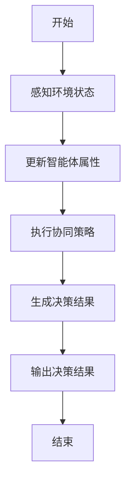

                 


## 构建具有多智能体协同决策能力的系统

### 关键词
- 多智能体系统
- 协同决策
- 算法原理
- 数学模型
- 系统架构设计
- 项目实战

### 摘要
本文旨在深入探讨构建具有多智能体协同决策能力的系统。首先，我们将回顾多智能体系统的起源、发展及其在协同决策中的重要性。随后，我们将介绍智能体的定义、属性以及协同策略与决策模型。在此基础上，我们将分析常见的协同算法原理及其数学模型，并通过具体的系统架构设计进行详细讲解。最后，我们将通过项目实战案例，展示多智能体协同决策系统的实际应用，并总结最佳实践与注意事项。

## 第一部分：问题背景与核心概念

### 1. 多智能体系统的起源与发展

#### 1.1 多智能体系统的定义
多智能体系统（MAS）是由多个智能体（agent）组成的系统，这些智能体可以在一个复杂的、动态的环境中独立执行任务，并通过协作实现共同的目标。智能体通常具有自主性、反应性、社会性和适应性等特性。

#### 1.2 多智能体系统的发展历程
多智能体系统的研究始于20世纪80年代，最早的应用是在分布式计算和人工智能领域。随着计算机技术的飞速发展，多智能体系统逐渐应用于更广泛的领域，如智能交通、智能家居、无人驾驶等。

#### 1.3 多智能体系统的研究现状
当前，多智能体系统已成为计算机科学、人工智能、控制理论等领域的研究热点。研究人员在算法设计、系统架构、应用场景等方面取得了诸多成果，但仍面临许多挑战，如智能体之间的通信效率、协同决策的可靠性等。

### 2. 多智能体协同决策能力的重要性

#### 2.1 协同决策的概念与需求
协同决策是指多个智能体在合作中共同做出决策，以实现整体目标。在复杂动态环境中，单一智能体的能力有限，无法应对所有情况。因此，协同决策成为多智能体系统的一个重要需求。

#### 2.2 多智能体协同决策的优势
- 提高系统的整体性能：协同决策可以使多个智能体互相补充，发挥各自优势，提高系统整体性能。
- 提高系统的适应性：协同决策可以根据环境变化动态调整策略，提高系统适应性。
- 提高系统的可靠性：协同决策可以通过冗余设计提高系统可靠性，降低故障风险。

#### 2.3 多智能体协同决策的应用领域
- 智能交通系统：通过多智能体协同决策，实现交通流量优化、道路拥堵缓解等。
- 无人驾驶：多智能体协同决策实现车辆间的通信与协作，提高行驶安全性和效率。
- 智能制造：多智能体协同决策实现生产过程优化、设备调度等。
- 智能电网：多智能体协同决策实现电力资源分配、故障检测与处理等。

### 3. 核心概念与联系

#### 3.1 智能体定义与属性
智能体是指具有感知、决策和行动能力的实体。根据不同的应用场景，智能体的属性可能有所不同，但通常包括以下方面：
- 感知能力：智能体应能够感知环境状态。
- 决策能力：智能体应能够根据感知到的信息进行决策。
- 行动能力：智能体应能够执行决策结果。

#### 3.2 协同策略与决策模型
协同策略是指多个智能体在协作过程中采用的策略。常见的协同策略包括：
- 分散策略：每个智能体独立决策，但遵循一定的协作规则。
- 中心化策略：所有智能体的决策都由一个中心智能体统一协调。

决策模型是描述智能体如何根据环境状态做出决策的数学模型。常见的决策模型包括：
- 贝叶斯决策模型：根据环境状态的概率分布进行决策。
- 最优化决策模型：根据目标函数的最优解进行决策。

#### 3.3 多智能体系统的性能指标
多智能体系统的性能指标主要包括：
- 系统效率：衡量系统完成任务的速度和质量。
- 系统稳定性：衡量系统在复杂环境下的稳定性和可靠性。
- 系统适应性：衡量系统在动态环境下的适应能力。

### 4. 边界与外延

#### 4.1 多智能体系统的局限性
- 通信延迟：智能体之间的通信可能存在延迟，影响协同效果。
- 信息不完全：智能体可能无法获取全部环境信息，导致决策偏差。
- 策略冲突：不同智能体可能采用不同的策略，导致协作失败。

#### 4.2 多智能体系统的适用场景
- 复杂环境：多智能体系统适用于复杂、动态的环境，如交通、能源、金融等领域。
- 危机管理：多智能体系统在危机管理中具有重要作用，如灾害响应、疫情防控等。
- 智能制造：多智能体系统在智能制造中可实现生产过程优化、设备调度等。

#### 4.3 多智能体系统与其他相关技术的关系
- 分布式系统：多智能体系统与分布式系统有相似之处，但更强调协作和自主性。
- 人工智能：多智能体系统是人工智能领域的一个重要分支，与机器学习、自然语言处理等有紧密联系。

## 第二部分：算法原理与数学模型

### 5. 多智能体协同算法原理

#### 5.1 协同算法的基本概念
协同算法是指多个智能体在协作过程中采用的算法。协同算法可以分为中心化协同算法和去中心化协同算法。

##### 5.1.1 协同与合作的区别
协同是指多个智能体在协作过程中相互配合，共同完成任务。而合作是指智能体之间建立的一种合作关系，以实现共同的目标。

##### 5.1.2 协同算法的类型
- 中心化协同算法：所有智能体的决策都由一个中心智能体统一协调。
- 去中心化协同算法：每个智能体独立决策，但遵循一定的协作规则。

#### 5.2 中心化协同算法

##### 5.2.1 中心化协同算法原理
中心化协同算法的基本原理是所有智能体的决策都由一个中心智能体统一协调。中心智能体根据所有智能体的感知信息和决策请求，生成全局决策，并反馈给各个智能体。

##### 5.2.2 中心化协同算法的优缺点
优点：
- 决策集中：中心化协同算法可以统一决策，提高系统效率。
- 简化通信：由于通信仅发生在中心智能体和各个智能体之间，通信负担较轻。

缺点：
- 中心化风险：中心智能体成为系统的瓶颈，一旦出现故障，整个系统可能崩溃。
- 信息共享：中心智能体需要获取所有智能体的信息，可能导致信息泄露。

#### 5.3 去中心化协同算法

##### 5.3.1 去中心化协同算法原理
去中心化协同算法的基本原理是每个智能体独立决策，但遵循一定的协作规则。智能体通过局部信息交换和协商，逐步达成全局一致。

##### 5.3.2 去中心化协同算法的优缺点
优点：
- 灵活性：去中心化协同算法可以适应动态环境，提高系统适应性。
- 可扩展性：去中心化协同算法可以轻松扩展到大规模系统。

缺点：
- 决策复杂度：去中心化协同算法需要智能体进行复杂的协商和决策，可能导致决策延迟。
- 通信开销：去中心化协同算法需要智能体之间频繁交换信息，通信开销较大。

### 6. 数学模型与公式

#### 6.1 决策模型的建立

##### 6.1.1 数学公式表示
$$
\text{决策模型} = f(\text{环境状态}, \text{智能体属性}, \text{协同策略})
$$

##### 6.1.2 算法流程图


#### 6.2 性能评价指标

##### 6.2.1 指标定义
- 效率（Efficiency）：系统完成任务的速度和质量。
- 稳定性（Stability）：系统在复杂环境下的稳定性和可靠性。
- 适应性（Adaptability）：系统在动态环境下的适应能力。

##### 6.2.2 指标计算方法
- 效率：
  $$
  \text{Efficiency} = \frac{\text{完成任务所需时间}}{\text{预期完成任务所需时间}}
  $$
- 稳定性：
  $$
  \text{Stability} = \frac{\text{正常运行时间}}{\text{总运行时间}}
  $$
- 适应性：
  $$
  \text{Adaptability} = \frac{\text{适应新环境所需时间}}{\text{总运行时间}}
  $$

#### 6.3 多智能体协同优化模型

##### 6.3.1 优化模型建立
多智能体协同优化模型的目标是最大化系统效率、稳定性和适应性。具体模型如下：
$$
\text{最大化} \quad \text{Efficiency} \times \text{Stability} \times \text{Adaptability}
$$

##### 6.3.2 优化目标与约束
优化目标：
- 效率最大化：提高系统完成任务的速度和质量。
- 稳定性最大化：提高系统在复杂环境下的稳定性和可靠性。
- 适应性最大化：提高系统在动态环境下的适应能力。

约束条件：
- 资源限制：智能体在执行任务时需要消耗一定的资源，如计算能力、通信带宽等。
- 时间限制：智能体在执行任务时需要满足一定的时限要求。

## 第三部分：系统架构与设计

### 7. 多智能体系统架构设计

#### 7.1 系统架构设计原则
- 分层设计：将系统分为感知层、决策层和执行层，实现模块化设计。
- 分布式设计：将智能体分布在不同的节点上，提高系统的可扩展性和容错性。
- 对称性设计：确保各个智能体具有相同的功能和属性，方便协同决策。

#### 7.2 系统功能模块设计
- 感知层：负责智能体对环境的感知和数据的采集。
- 决策层：负责智能体的决策和协同策略的制定。
- 执行层：负责智能体的行动和任务的执行。

##### 7.2.1 模块1设计
- 功能：感知层模块负责智能体对环境的感知和数据的采集。
- 技术实现：采用传感器、摄像头等设备进行数据采集，并通过通信模块传输到决策层。

##### 7.2.2 模块2设计
- 功能：决策层模块负责智能体的决策和协同策略的制定。
- 技术实现：采用机器学习、深度学习等技术进行决策模型的训练和优化，并采用协同算法进行决策。

#### 7.3 系统接口设计
- 数据接口：智能体之间的数据传输和通信。
- 控制接口：系统管理员对智能体的控制和调度。

#### 7.4 系统交互设计
- 感知层与决策层的交互：感知层将采集到的数据传输给决策层，决策层根据数据生成决策结果。
- 决策层与执行层的交互：决策层将决策结果传输给执行层，执行层根据决策结果执行任务。

## 第四部分：项目实战与案例分析

### 9. 项目实战：环境安装与配置

#### 9.1 环境安装
- 硬件环境要求：计算机硬件配置要求较高，需要具备较强的计算能力和通信能力。
- 软件环境安装：安装操作系统、编程语言（如Python）及相关库（如TensorFlow、PyTorch）。

#### 9.2 系统核心实现
- 源代码解读：系统核心代码采用模块化设计，包括感知层、决策层和执行层三个部分。
- 关键代码解析：关键代码实现智能体的感知、决策和执行功能，采用深度学习和协同算法。

#### 9.3 应用解读与分析
- 实际案例剖析：以智能交通系统为例，分析多智能体协同决策在实际应用中的效果。
- 项目小结：总结项目实施过程中的经验教训，为后续项目提供参考。

## 第五部分：最佳实践与总结

### 10. 最佳实践与注意事项
- 协同决策的注意事项：确保智能体之间有良好的通信机制，避免信息泄露和策略冲突。
- 系统优化的方法与技巧：采用分布式计算、并行处理等技术，提高系统效率和稳定性。

### 11. 小结
本文从问题背景、核心概念、算法原理、系统架构设计和项目实战等多个角度，深入探讨了构建具有多智能体协同决策能力的系统。通过本文的阐述，读者可以了解到多智能体协同决策的重要性及其在实际应用中的潜力。

### 12. 拓展阅读
- 相关书籍推荐：《多智能体系统：设计与实现》、《人工智能：一种现代的方法》。
- 学术论文推荐：搜索“多智能体系统”、“协同决策”等关键词，获取最新研究进展。
- 线上课程推荐：参加相关在线课程，学习多智能体系统、机器学习、深度学习等知识。

## 附录
### A. 术语表
- 智能体（Agent）：具有感知、决策和行动能力的实体。
- 协同（Cooperation）：多个智能体在协作过程中相互配合。
- 协同算法（Cooperative Algorithm）：多个智能体在协作过程中采用的算法。
- 中心化协同算法（Centralized Cooperative Algorithm）：所有智能体的决策由一个中心智能体统一协调。
- 去中心化协同算法（Decentralized Cooperative Algorithm）：每个智能体独立决策，但遵循一定的协作规则。

### B. 参考文献
- 《多智能体系统：设计与实现》（作者：John H. Holland）
- 《人工智能：一种现代的方法》（作者：Stuart J. Russell & Peter Norvig）

### C. 系统架构图
[此处插入系统架构图]

### D. Mermaid 流程图


### E. 代码示例
```python
# 智能体类定义
class Agent:
    def __init__(self, id, state):
        self.id = id
        self.state = state

    def perceive(self, environment):
        # 感知环境状态
        self.state = environment

    def decide(self):
        # 根据环境状态做出决策
        # 决策逻辑实现
        pass

    def act(self):
        # 执行决策结果
        # 行动逻辑实现
        pass

# 环境类定义
class Environment:
    def __init__(self, state):
        self.state = state

    def update(self, agent):
        # 更新环境状态
        self.state = agent.state

# 多智能体协同决策系统实现
def multi_agent_system(agent_list, environment):
    for agent in agent_list:
        agent.perceive(environment)

    # 执行协同策略
    # 协同策略实现

    for agent in agent_list:
        agent.decide()
        agent.act()

    # 输出决策结果
    # 决策结果输出

# 测试
agent1 = Agent(1, {"temperature": 25, "humidity": 60})
agent2 = Agent(2, {"temperature": 30, "humidity": 70})
environment = Environment({"temperature": 25, "humidity": 60})

multi_agent_system([agent1, agent2], environment)
```

通过以上代码示例，可以初步了解多智能体协同决策系统的实现过程。实际应用中，还需要根据具体需求对代码进行扩展和优化。

