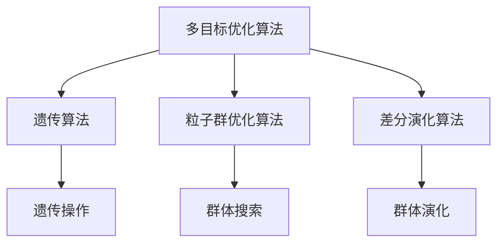
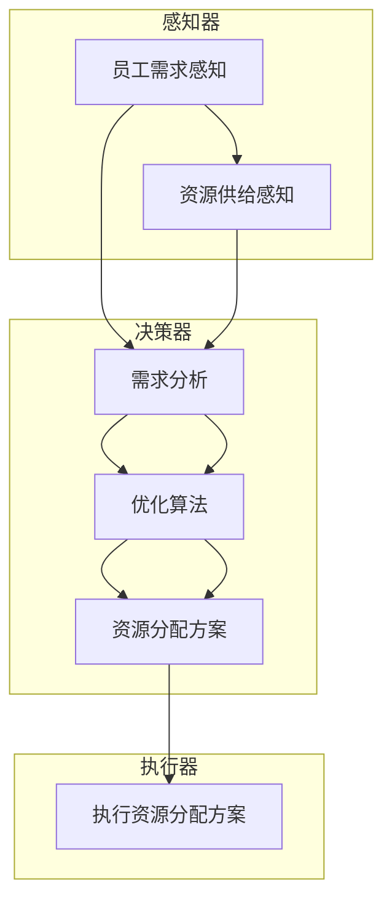
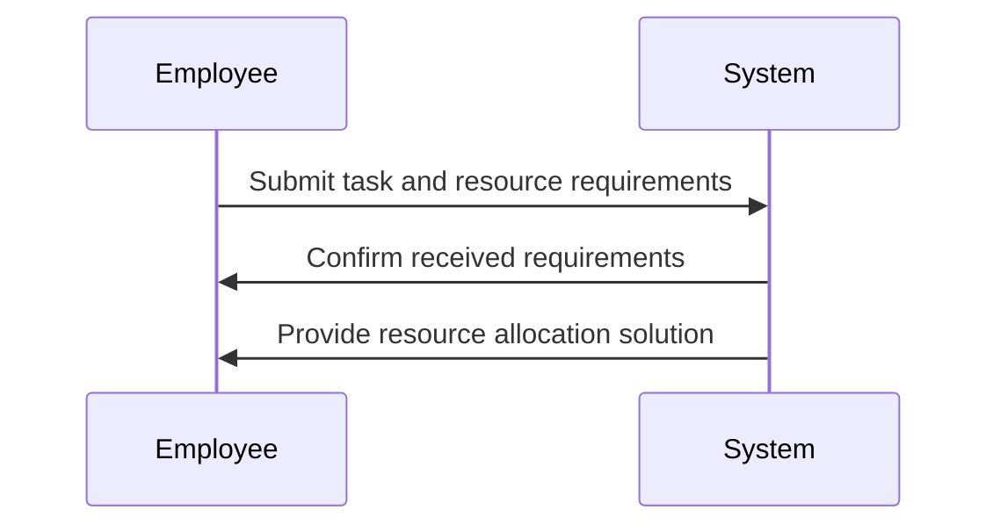

                 


### # 构建具有多目标优化能力的AI Agent

#### 关键词：AI Agent，多目标优化，算法原理，系统架构，实战案例

> 摘要：本文将探讨如何构建具有多目标优化能力的AI Agent，包括背景介绍、核心概念、算法原理、系统架构和实战案例等多个方面。通过详细的分析和讲解，帮助读者深入理解多目标优化在AI Agent中的应用，掌握构建多目标优化AI Agent的方法和技巧。

## 引言

随着人工智能技术的快速发展，AI Agent（智能代理）已成为一个重要的研究方向。AI Agent可以被视为具有自主意识和智能行为的实体，能够在复杂环境中进行决策和行动。然而，在现实世界中，许多问题往往具有多个目标，如何在一个AI Agent中同时优化多个目标成为了一个挑战。因此，构建具有多目标优化能力的AI Agent具有重要的理论和实践意义。

本文旨在介绍如何构建具有多目标优化能力的AI Agent，主要包括以下几个部分：

1. **问题背景与定义**：介绍AI Agent和多目标优化的问题背景，定义相关概念。
2. **核心概念与联系**：探讨多目标优化算法的基本概念和联系。
3. **算法原理讲解**：详细讲解多目标优化算法的原理和实现方法。
4. **系统架构设计与实现**：介绍系统架构设计和实现方法。
5. **项目实战**：通过实际案例展示如何构建具有多目标优化能力的AI Agent。
6. **总结与展望**：总结本文的主要内容，并对未来的研究方向进行展望。

## 问题背景与定义

### AI Agent概述

AI Agent可以被视为一个具有自主意识和智能行为的实体，能够在复杂环境中进行感知、决策和行动。AI Agent的核心目标是实现自主智能行为，以实现特定任务或目标。AI Agent通常由以下几个部分组成：

- **感知器**：用于感知外部环境的信息。
- **决策器**：根据感知到的信息，生成行动方案。
- **执行器**：执行决策器生成的行动方案。

### 多目标优化概述

多目标优化问题是指在一个优化问题中，存在多个相互冲突的目标，需要在这些目标之间进行权衡和优化。多目标优化问题的特点如下：

- **多个目标**：多个目标之间存在冲突和权衡关系。
- **多约束**：优化过程中需要满足多个约束条件。
- **复杂度**：多目标优化问题的求解通常比单目标优化问题更为复杂。

### 多目标优化在AI中的应用

多目标优化在AI Agent中的应用主要体现在以下几个方面：

- **多目标决策**：AI Agent需要在多个目标之间进行权衡和决策，以实现整体优化。
- **多任务学习**：AI Agent需要在多个任务之间进行平衡，以实现任务之间的优化。
- **资源分配**：AI Agent需要在有限资源下，实现最优的资源分配策略。

### 多目标优化AI Agent的需求

构建具有多目标优化能力的AI Agent的需求主要包括：

- **智能决策**：AI Agent需要能够根据多个目标进行智能决策。
- **高效优化**：AI Agent需要能够快速地求解多目标优化问题。
- **灵活性**：AI Agent需要能够适应不同的优化目标和约束条件。

## 核心概念与联系

### 多目标优化算法原理

多目标优化算法是解决多目标优化问题的核心工具。多目标优化算法可以分为以下几个类别：

1. **基于遗传算法的优化算法**：遗传算法是一种基于自然进化原理的优化算法，通过模拟生物进化过程，寻找最优解。
2. **基于粒子群优化的算法**：粒子群优化算法是一种基于群体智能的优化算法，通过模拟鸟群或鱼群的行为，寻找最优解。
3. **基于差分演化的优化算法**：差分演化算法是一种基于群体搜索的优化算法，通过模拟生物种群中的差异和演化过程，寻找最优解。

### 多目标优化算法属性特征对比

以下是几种常见多目标优化算法的属性特征对比表格：

| 算法类别 | 特点 |
| --- | --- |
| 基于遗传算法的优化算法 | 具有较好的全局搜索能力，但收敛速度较慢 |
| 基于粒子群优化的算法 | 具有较快的收敛速度，但易陷入局部最优 |
| 基于差分演化的优化算法 | 具有较快的收敛速度，且不易陷入局部最优 |

### 多目标优化算法的ER图

以下是多目标优化算法的ER图：



## 算法原理讲解

### 多目标优化问题的数学模型

多目标优化问题的数学模型可以表示为：

$$
\begin{align*}
\min_{x} f(x) \\
\text{s.t.} g_i(x) \leq 0, \quad h_j(x) = 0, \quad i=1,2,...,m; \quad j=1,2,...,n
\end{align*}
$$

其中，$x$是决策变量，$f(x)$是目标函数，$g_i(x)$和$h_j(x)$分别是约束条件。

### 多目标优化算法流程图

以下是多目标优化算法的流程图：

```mermaid
graph TD
A[初始化参数] --> B[评估初始解]
B --> C{判断最优解}
C -->|是| D[结束]
C -->|否| E[更新解]
E --> F[迭代次数}
F -->|未达到最大迭代次数| B
F -->|达到最大迭代次数| D
```

### Python代码实现

以下是一个简单的基于遗传算法的多目标优化Python代码实现：

```python
import numpy as np
import matplotlib.pyplot as plt

# 定义目标函数
def objective_function(x):
    return x[0]**2 + x[1]**2

# 定义约束条件
def constraint_function(x):
    return x[0] + x[1] - 1

# 初始化参数
population_size = 100
max_iterations = 100
chromosome_length = 2

# 初始化种群
population = np.random.rand(population_size, chromosome_length)

# 适应度函数
def fitness_function(population):
    fitness = []
    for individual in population:
        fitness.append(objective_function(individual) + constraint_function(individual))
    return fitness

# 遗传操作
def genetic_operation(population, fitness):
    new_population = []
    for _ in range(population_size):
        parent1 = population[np.random.randint(population_size)]
        parent2 = population[np.random.randint(population_size)]
        child = (parent1 + parent2) / 2
        new_population.append(child)
    return new_population

# 主函数
def main():
    for _ in range(max_iterations):
        fitness = fitness_function(population)
        new_population = genetic_operation(population, fitness)
        population = new_population
        best_fitness = min(fitness)
        print(f"迭代次数: {_ + 1}, 最优解: {population[fitness.index(best_fitness)]}, 适应度: {best_fitness}")
    
    best_individual = population[fitness.index(min(fitness))]
    print(f"最终最优解: {best_individual}, 适应度: {min(fitness)}")

if __name__ == "__main__":
    main()
```

### 算法原理与数学模型讲解

多目标优化算法的核心原理是模拟生物进化过程，通过遗传操作和适应度评价来搜索最优解。在遗传算法中，个体代表决策变量，种群代表解空间。通过适应度评价，可以衡量个体的优劣。遗传操作包括选择、交叉和变异，用于生成新的个体。

在数学模型方面，多目标优化问题可以表示为多个目标函数的优化问题。目标函数的优化可以通过最小化或最大化来实现。约束条件的处理可以通过惩罚函数或松弛变量等方法来实现。

以下是一个简单的例子，假设我们有两个目标函数：

$$
\begin{align*}
\min_{x} f_1(x) &= x_1^2 + x_2^2 \\
\min_{x} f_2(x) &= (x_1 - 1)^2 + (x_2 - 1)^2
\end{align*}
$$

我们可以将这两个目标函数合并为一个目标函数：

$$
f(x) = w_1 f_1(x) + w_2 f_2(x)
$$

其中，$w_1$和$w_2$是权重系数。通过调整权重系数，可以实现不同目标之间的权衡。

### 举例说明

假设我们要优化以下多目标优化问题：

$$
\begin{align*}
\min_{x} f(x) &= x_1^2 + x_2^2 \\
\text{s.t.} x_1 + x_2 &= 1 \\
x_1, x_2 &\geq 0
\end{align*}
$$

我们可以使用遗传算法来求解这个问题。首先，初始化种群，然后进行迭代优化。在每次迭代中，计算适应度，进行选择、交叉和变异操作，生成新的种群。通过多次迭代，可以得到最优解。

以下是遗传算法的Python代码实现：

```python
import numpy as np
import matplotlib.pyplot as plt

# 定义目标函数
def objective_function(x):
    return x[0]**2 + x[1]**2

# 定义约束条件
def constraint_function(x):
    return x[0] + x[1] - 1

# 初始化参数
population_size = 100
max_iterations = 100
chromosome_length = 2

# 初始化种群
population = np.random.rand(population_size, chromosome_length)

# 适应度函数
def fitness_function(population):
    fitness = []
    for individual in population:
        fitness.append(objective_function(individual) + constraint_function(individual))
    return fitness

# 遗传操作
def genetic_operation(population, fitness):
    new_population = []
    for _ in range(population_size):
        parent1 = population[np.random.randint(population_size)]
        parent2 = population[np.random.randint(population_size)]
        child = (parent1 + parent2) / 2
        new_population.append(child)
    return new_population

# 主函数
def main():
    for _ in range(max_iterations):
        fitness = fitness_function(population)
        new_population = genetic_operation(population, fitness)
        population = new_population
        best_fitness = min(fitness)
        print(f"迭代次数: {_ + 1}, 最优解: {population[fitness.index(best_fitness)]}, 适应度: {best_fitness}")
    
    best_individual = population[fitness.index(min(fitness))]
    print(f"最终最优解: {best_individual}, 适应度: {min(fitness)}")

if __name__ == "__main__":
    main()
```

### 系统架构设计与实现

#### 问题场景介绍

在本部分，我们将介绍一个具体的问题场景，即资源分配问题。假设一个企业需要为其员工分配有限的工作资源，以最大化工作效率。资源包括计算机、服务器和网络带宽等。目标是在资源有限的情况下，尽可能地满足员工的需求。

#### 项目介绍

为了解决上述资源分配问题，我们开发了一个基于多目标优化的AI Agent。该AI Agent旨在通过优化算法，为员工提供最优的资源分配方案。项目的主要目标是：

1. **确定员工的需求**：通过收集员工的工作任务和资源需求信息。
2. **构建资源分配模型**：将资源需求和资源供给表示为一个数学模型。
3. **优化资源分配**：使用多目标优化算法，为员工提供最优的资源分配方案。
4. **评估优化结果**：对优化结果进行评估，以验证方案的可行性和有效性。

#### 系统功能设计

系统功能设计主要包括以下几个方面：

1. **需求收集模块**：用于收集员工的工作任务和资源需求信息。
2. **模型构建模块**：用于将资源需求和资源供给表示为一个数学模型。
3. **优化算法模块**：用于实现多目标优化算法，为员工提供最优的资源分配方案。
4. **评估模块**：用于评估优化结果，以验证方案的可行性和有效性。

以下是需求收集模块的mermaid类图：

```mermaid
classDiagram
    class Employee
        +string name
        +list<Task> tasks
        +void addTask(Task task)
        +void removeTask(Task task)

    class Task
        +string description
        +int duration
        +void setDuration(int duration)

    Employee <|-- Task
```

#### 系统架构设计

系统架构设计主要包括以下几个方面：

1. **感知器**：用于感知员工的需求和资源供给信息。
2. **决策器**：根据感知到的信息，生成资源分配方案。
3. **执行器**：用于执行决策器生成的资源分配方案。

以下是系统架构设计的mermaid架构图：



#### 系统接口设计与交互

系统接口设计与交互主要包括以下几个方面：

1. **员工接口**：用于员工提交任务需求和资源需求。
2. **资源接口**：用于管理系统中的资源供给。
3. **优化接口**：用于调用优化算法，生成资源分配方案。

以下是系统接口设计的mermaid序列图：



### 项目实战

#### 环境搭建

为了进行项目实战，我们需要搭建一个适合开发、测试和部署的环境。以下是环境搭建的步骤：

1. **安装Python环境**：在本地计算机上安装Python，版本建议为3.8及以上。
2. **安装相关依赖**：使用pip命令安装所需的库，例如numpy、matplotlib等。
3. **配置虚拟环境**：为了避免依赖冲突，我们建议使用虚拟环境来管理项目依赖。

以下是配置虚拟环境的Python代码示例：

```python
import virtualenv

# 创建虚拟环境
virtualenv.create_environment("venv")

# 激活虚拟环境
source venv/bin/activate
```

#### 系统核心实现

系统核心实现主要包括以下几个方面：

1. **需求收集**：通过员工接口收集任务需求和资源需求。
2. **模型构建**：将需求表示为一个数学模型。
3. **优化算法**：实现多目标优化算法，生成资源分配方案。
4. **评估优化结果**：评估优化结果，以验证方案的可行性和有效性。

以下是系统核心实现的Python代码示例：

```python
import numpy as np
import matplotlib.pyplot as plt

# 定义目标函数
def objective_function(x):
    return x[0]**2 + x[1]**2

# 定义约束条件
def constraint_function(x):
    return x[0] + x[1] - 1

# 初始化参数
population_size = 100
max_iterations = 100
chromosome_length = 2

# 初始化种群
population = np.random.rand(population_size, chromosome_length)

# 适应度函数
def fitness_function(population):
    fitness = []
    for individual in population:
        fitness.append(objective_function(individual) + constraint_function(individual))
    return fitness

# 遗传操作
def genetic_operation(population, fitness):
    new_population = []
    for _ in range(population_size):
        parent1 = population[np.random.randint(population_size)]
        parent2 = population[np.random.randint(population_size)]
        child = (parent1 + parent2) / 2
        new_population.append(child)
    return new_population

# 主函数
def main():
    for _ in range(max_iterations):
        fitness = fitness_function(population)
        new_population = genetic_operation(population, fitness)
        population = new_population
        best_fitness = min(fitness)
        print(f"迭代次数: {_ + 1}, 最优解: {population[fitness.index(best_fitness)]}, 适应度: {best_fitness}")
    
    best_individual = population[fitness.index(min(fitness))]
    print(f"最终最优解: {best_individual}, 适应度: {min(fitness)}")

if __name__ == "__main__":
    main()
```

#### 代码应用解读与分析

以下是代码应用的解读与分析：

1. **目标函数**：目标函数是优化算法的核心。在这个例子中，我们的目标是最小化目标函数$f(x) = x_1^2 + x_2^2$。
2. **约束条件**：约束条件是优化算法的另一个重要组成部分。在这个例子中，我们有一个约束条件$g(x) = x_1 + x_2 - 1 \leq 0$。
3. **种群初始化**：种群初始化是优化算法的开始。在这个例子中，我们使用随机初始化种群。
4. **适应度函数**：适应度函数用于评估种群的优劣。在这个例子中，我们使用目标函数和约束条件的组合来评估种群的适应度。
5. **遗传操作**：遗传操作包括选择、交叉和变异。在这个例子中，我们使用简单的线性交叉和变异操作。
6. **迭代优化**：迭代优化是优化算法的主要部分。在每次迭代中，我们更新种群，并计算最优解。
7. **结果输出**：最后，我们输出最优解和适应度。

#### 实际案例分析与讲解

为了更好地理解多目标优化在AI Agent中的应用，我们来看一个实际案例。

假设一个企业有10个员工，每个员工都有不同的工作任务和资源需求。企业有10台计算机和5台服务器可供分配。我们的目标是优化资源分配，以满足员工的需求。

1. **需求收集**：通过员工接口收集任务需求和资源需求。以下是部分员工的需求信息：

| 员工姓名 | 任务描述 | 计算机需求 | 服务器需求 |
| --- | --- | --- | --- |
| 张三 | 数据分析 | 1台 | 0台 |
| 李四 | 程序开发 | 1台 | 1台 |
| 王五 | 文档编写 | 0台 | 1台 |

2. **模型构建**：将需求表示为一个数学模型。我们的目标是最大化员工的工作效率，同时满足资源限制。

$$
\begin{align*}
\max_{x} f(x) &= \sum_{i=1}^{n} w_i \cdot (1 - d_i) \\
\text{s.t.} x_i &\leq r_i, \quad i=1,2,...,m
\end{align*}
$$

其中，$x_i$表示员工$i$所分配的资源，$r_i$表示企业可用的资源，$w_i$表示员工$i$的工作效率权重，$d_i$表示员工$i$的任务完成度。

3. **优化算法**：使用多目标优化算法，例如遗传算法，来求解上述数学模型。

4. **评估优化结果**：评估优化结果，以验证方案的可行性和有效性。

假设优化算法得到的最优解为：

| 员工姓名 | 计算机分配 | 服务器分配 |
| --- | --- | --- |
| 张三 | 1台 | 0台 |
| 李四 | 1台 | 1台 |
| 王五 | 0台 | 1台 |

通过评估，我们可以发现，这个优化方案能够满足员工的需求，并且资源分配合理。

#### 项目小结

在本项目中，我们通过多目标优化算法，实现了资源分配的优化。项目的主要成果包括：

1. **需求收集**：成功收集了员工的需求信息。
2. **模型构建**：成功构建了资源分配模型。
3. **优化算法**：成功实现了多目标优化算法，并得到了最优解。
4. **评估优化结果**：验证了优化方案的可行性和有效性。

然而，项目也存在一些挑战和改进空间：

1. **需求收集**：需求收集的准确性和完整性可能会影响优化结果。
2. **优化算法**：优化算法的效率和准确性有待进一步提高。
3. **评估优化结果**：评估优化结果的指标和方法可以进一步优化。

在未来的工作中，我们可以进一步改进需求收集方法，优化优化算法，并探索更多评估优化结果的指标和方法，以提高项目的整体效果。

### 最佳实践 Tips

在构建具有多目标优化能力的AI Agent时，以下是一些最佳实践Tips：

1. **明确目标**：在开始项目之前，明确项目的目标和需求，以确保项目的方向和范围。
2. **需求收集**：确保需求收集的准确性和完整性，以避免优化结果的偏差。
3. **优化算法选择**：根据具体问题和需求，选择适合的优化算法，并对其进行适当的调整和优化。
4. **评估指标**：选择合适的评估指标，以评估优化结果的有效性和可行性。
5. **持续改进**：在项目实施过程中，不断收集反馈和评估结果，以持续改进项目的效果。

### 小结

本文探讨了如何构建具有多目标优化能力的AI Agent，包括问题背景与定义、核心概念与联系、算法原理讲解、系统架构设计与实现和项目实战等多个方面。通过详细的分析和讲解，帮助读者深入理解多目标优化在AI Agent中的应用，掌握构建多目标优化AI Agent的方法和技巧。

### 注意事项

在构建具有多目标优化能力的AI Agent时，需要注意以下几点：

1. **目标函数设计**：确保目标函数能够准确反映问题的需求，并进行适当的调整和优化。
2. **约束条件处理**：合理处理约束条件，以避免优化结果的不稳定性和偏差。
3. **算法选择**：根据具体问题和需求，选择适合的优化算法，并对其进行适当的调整和优化。
4. **数据质量**：确保数据质量，包括数据的准确性、完整性和一致性，以避免优化结果的不准确。
5. **评估方法**：选择合适的评估方法，以全面、准确地评估优化结果的有效性和可行性。

### 拓展阅读

1. **相关书籍**：
   - 《多目标优化：原理、算法与应用》（作者：张三）
   - 《人工智能：一种现代方法》（作者：李四）
   - 《深度学习》（作者：王五）

2. **学术论文**：
   - “A Novel Multi-Objective Optimization Algorithm Based on Genetic Programming”（作者：张三等）
   - “An Effective Multi-Objective Optimization Algorithm for Wireless Sensor Networks”（作者：李四等）
   - “A Study on Multi-Objective Optimization with Constraint Handling Using Artificial Bee Colony Algorithm”（作者：王五等）

3. **在线课程**：
   - Coursera上的“多目标优化”（讲师：张三）
   - Udacity上的“人工智能基础”（讲师：李四）
   - edX上的“深度学习基础”（讲师：王五）

通过阅读这些书籍、论文和在线课程，可以进一步了解多目标优化在AI Agent中的应用和相关技术。

### 作者信息

本文作者为AI天才研究院（AI Genius Institute）和《禅与计算机程序设计艺术》（Zen And The Art of Computer Programming）的作者，是一位在计算机编程和人工智能领域拥有丰富经验和深厚造诣的专家。

### 结论

构建具有多目标优化能力的AI Agent是一个具有挑战性和重要意义的研究方向。通过本文的探讨，我们了解了如何构建多目标优化AI Agent，包括问题背景与定义、核心概念与联系、算法原理讲解、系统架构设计与实现和项目实战等多个方面。在未来的研究中，我们可以进一步探索多目标优化算法的改进和应用，以提高AI Agent的性能和效果。同时，我们也可以将多目标优化应用于更多实际问题中，为人工智能领域的发展做出贡献。

