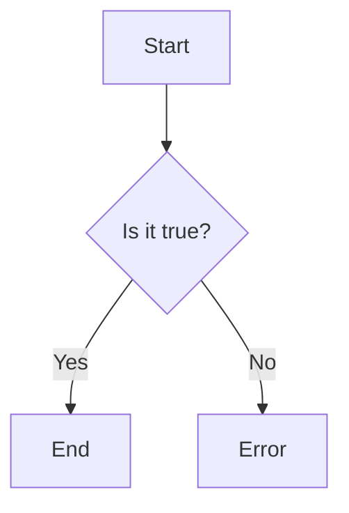
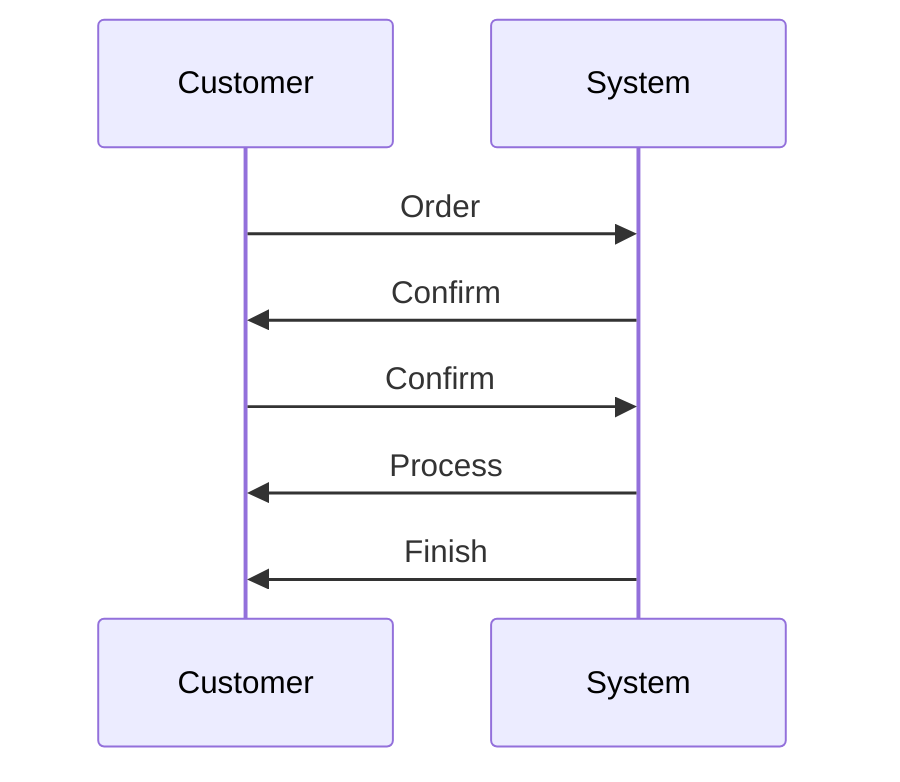

                 

**文章标题**：构建具有对抗学习能力的AI Agent

**关键词**：人工智能，对抗学习，AI Agent，算法实现，挑战与未来方向

**摘要**：
本文将深入探讨构建具有对抗学习能力的AI Agent的核心概念、理论、方法以及实际应用。通过逐步分析，我们将理解对抗学习在人工智能中的重要性，探索AI Agent的基本架构和组件设计，解析对抗学习算法的原理和实现，分享相关案例研究，并讨论面临的挑战和未来发展方向。本文旨在为读者提供全面的指导，帮助他们掌握构建具有对抗学习能力的AI Agent的关键技术。

----------------------------------------------------------------

# **构建具有对抗学习能力的AI Agent**

## **关键词**：人工智能，对抗学习，AI Agent，算法实现，挑战与未来方向

## **摘要**：
本文将深入探讨构建具有对抗学习能力的AI Agent的核心概念、理论、方法以及实际应用。通过逐步分析，我们将理解对抗学习在人工智能中的重要性，探索AI Agent的基本架构和组件设计，解析对抗学习算法的原理和实现，分享相关案例研究，并讨论面临的挑战和未来发展方向。本文旨在为读者提供全面的指导，帮助他们掌握构建具有对抗学习能力的AI Agent的关键技术。

----------------------------------------------------------------

## **1. 引言**

### **1.1 人工智能背景**

人工智能（Artificial Intelligence, AI）是计算机科学的一个重要分支，旨在开发能够执行人类智能任务的计算机程序。自20世纪50年代人工智能概念的提出以来，人工智能技术经历了多次发展和迭代，如今已经成为推动科技变革的重要力量。

人工智能的应用场景广泛，包括但不限于以下几个方面：

- **图像和语音识别**：通过深度学习算法，人工智能可以识别人类语音和图像，例如人脸识别、语音助手等。
- **自然语言处理**：人工智能可以理解、生成和翻译自然语言，用于机器翻译、情感分析、语音合成等。
- **决策支持系统**：人工智能可以帮助企业和组织做出更明智的决策，例如数据挖掘、风险分析等。
- **自动驾驶**：通过计算机视觉和传感器数据，人工智能可以实现自动驾驶汽车，提高交通效率和安全性。

### **1.2 对抗学习的概念**

对抗学习（Adversarial Learning）是人工智能领域的一个重要研究方向，旨在提高机器学习模型的鲁棒性和安全性。对抗学习通过引入对抗样本（adversarial examples），挑战模型的鲁棒性，从而提升模型在真实世界中的应用性能。

对抗样本是指在原始样本基础上添加微小扰动，导致模型预测错误或性能下降的样本。这些扰动通常是人眼难以察觉的，但对模型来说却是致命的。对抗学习的核心思想是通过训练模型识别和防御这些对抗样本，从而提高模型的鲁棒性和安全性。

### **1.3 对抗学习在人工智能中的重要性**

对抗学习在人工智能中的重要性体现在以下几个方面：

- **提高模型鲁棒性**：通过对抗学习，模型可以更好地应对复杂、未知的输入数据，提高其在真实世界中的应用性能。
- **增强模型安全性**：对抗学习可以帮助模型识别和防御对抗样本攻击，提高模型的安全性和可信度。
- **推动人工智能发展**：对抗学习为人工智能领域带来了新的研究方向，推动了人工智能技术的发展。

### **1.4 文章结构**

本文结构如下：

- **第1章**：引言，介绍人工智能和对抗学习的背景。
- **第2章**：基本概念，讨论人工智能和对抗学习的基本概念。
- **第3章**：理论分析，解析对抗学习的理论和方法。
- **第4章**：算法实现，详细阐述对抗学习算法的实现。
- **第5章**：案例研究，分享具有对抗学习能力的AI Agent的案例研究。
- **第6章**：挑战与未来方向，讨论对抗学习在人工智能中的挑战和未来发展方向。

## **2. 基本概念**

### **2.1 人工智能的基本概念**

人工智能（Artificial Intelligence, AI）是一种模拟人类智能的技术，通过计算机程序实现智能行为。人工智能的基本概念包括：

- **知识表示**：知识表示是人工智能的核心技术，用于将人类知识转化为计算机可处理的形式。常见的知识表示方法包括符号表示、语义网络和本体论等。
- **推理**：推理是人工智能中的关键功能，用于根据已知事实推导出新的事实。推理方法包括演绎推理、归纳推理和混合推理等。
- **学习**：学习是人工智能的核心能力，通过训练数据和算法，模型可以不断改进其性能。学习方法包括监督学习、无监督学习和强化学习等。
- **感知**：感知是人工智能感知外部环境的能力，包括视觉、听觉、触觉等。感知技术广泛应用于计算机视觉、语音识别和机器人等领域。

### **2.2 对抗学习的基本概念**

对抗学习（Adversarial Learning）是一种基于对抗性神经网络（Adversarial Neural Network, ANN）的学习方法，旨在提高机器学习模型的鲁棒性和安全性。对抗学习的基本概念包括：

- **对抗性神经网络**：对抗性神经网络由两个主要部分组成：生成器（Generator）和判别器（Discriminator）。生成器生成对抗样本，判别器判断样本的真实性。两个网络相互对抗，不断优化，以提升模型的性能。
- **对抗样本**：对抗样本是在原始样本基础上添加微小扰动生成的样本，用于挑战模型的鲁棒性。对抗样本可以通过各种方法生成，如图像扰动、文本扰动等。
- **对抗训练**：对抗训练是使用对抗样本训练模型的过程。通过对抗训练，模型可以学习识别和防御对抗样本，提高模型的鲁棒性和安全性。

### **2.3 对抗学习与人工智能的关系**

对抗学习与人工智能密切相关，二者相互促进，共同发展。对抗学习在人工智能中的应用主要体现在以下几个方面：

- **模型鲁棒性提升**：对抗学习通过引入对抗样本，挑战模型的鲁棒性，使模型能够更好地应对复杂、未知的输入数据，提高其在真实世界中的应用性能。
- **模型安全性增强**：对抗学习可以帮助模型识别和防御对抗样本攻击，提高模型的安全性和可信度，保护模型在现实世界中的应用。
- **算法创新**：对抗学习推动了人工智能算法的创新和发展，为人工智能领域带来了新的研究方向和挑战。

## **3. 理论分析**

### **3.1 对抗学习理论**

对抗学习理论是构建具有对抗学习能力AI Agent的基础。以下是对抗学习理论的核心内容：

#### **3.1.1 对抗性神经网络**

对抗性神经网络由生成器和判别器两个主要部分组成。生成器的目标是生成对抗样本，而判别器的目标是正确判断样本的真实性。两个网络相互对抗，不断优化，以提升模型的性能。

- **生成器（Generator）**：生成器的任务是将原始数据映射到对抗样本。生成器的目的是使对抗样本在视觉、文本等特征上与原始数据相似，但在模型预测上产生差异。生成器通常采用深度学习网络结构，如生成对抗网络（GAN）。
- **判别器（Discriminator）**：判别器的任务是判断输入样本的真实性。判别器的目的是通过学习对抗样本和真实样本的分布，提高对对抗样本的识别能力。判别器也采用深度学习网络结构。

#### **3.1.2 对抗训练过程**

对抗训练是使用对抗样本训练模型的过程。对抗训练过程主要包括以下几个步骤：

1. **数据预处理**：对原始数据进行预处理，如标准化、归一化等，以便生成器和判别器更好地学习。
2. **生成对抗样本**：使用生成器生成对抗样本，与真实样本一起组成训练数据集。
3. **模型训练**：使用训练数据集对生成器和判别器进行交替训练。生成器尝试生成更难识别的对抗样本，判别器尝试提高对对抗样本的识别能力。
4. **模型评估**：在训练过程中，定期评估生成器和判别器的性能。通过调整超参数和优化算法，提高模型的性能。

#### **3.1.3 对抗学习算法**

对抗学习算法主要包括生成对抗网络（GAN）和变分自编码器（VAE）等。以下是对这些算法的简要介绍：

- **生成对抗网络（GAN）**：GAN是最早提出的对抗学习算法，由生成器和判别器组成。生成器生成对抗样本，判别器判断样本的真实性。两个网络通过对抗训练，不断优化，以提高生成器的生成能力和判别器的识别能力。
- **变分自编码器（VAE）**：VAE是一种基于概率模型的对抗学习算法。VAE通过编码器将原始数据映射到潜在空间，通过解码器从潜在空间生成对抗样本。VAE在生成对抗样本方面具有较好的性能，但在判别器方面相对较弱。

### **3.2 对抗学习应用场景**

对抗学习在人工智能领域具有广泛的应用场景，以下是一些典型的应用场景：

- **图像生成**：对抗学习可以用于生成高质量的图像，如图像修复、图像生成等。
- **语音合成**：对抗学习可以用于生成逼真的语音，如图像到语音转换、语音合成等。
- **自然语言处理**：对抗学习可以用于生成和修改文本，如图像描述生成、文本翻译等。
- **计算机视觉**：对抗学习可以用于增强计算机视觉模型的鲁棒性，如图像分类、目标检测等。
- **自动驾驶**：对抗学习可以用于增强自动驾驶系统的安全性，如图像识别、环境感知等。

### **3.3 对抗学习优势与挑战**

对抗学习在人工智能领域具有显著的优势，但也面临一些挑战。

#### **3.3.1 优势**

- **提高模型鲁棒性**：对抗学习通过引入对抗样本，挑战模型的鲁棒性，使模型能够更好地应对复杂、未知的输入数据，提高其在真实世界中的应用性能。
- **增强模型安全性**：对抗学习可以帮助模型识别和防御对抗样本攻击，提高模型的安全性和可信度，保护模型在现实世界中的应用。
- **算法创新**：对抗学习推动了人工智能算法的创新和发展，为人工智能领域带来了新的研究方向和挑战。

#### **3.3.2 挑战**

- **计算资源消耗**：对抗学习需要大量的计算资源，特别是在生成对抗样本和训练模型的过程中。这给实际应用带来了一定的挑战。
- **模型优化难度**：对抗学习算法的优化难度较高，需要大量的实验和调整，以达到理想的性能。
- **伦理和法律问题**：对抗学习可能导致一些伦理和法律问题，例如对抗样本的滥用、隐私泄露等。

## **4. 算法实现**

### **4.1 GAN算法原理**

生成对抗网络（GAN）是一种基于对抗学习的算法，由生成器和判别器两个主要部分组成。以下是对GAN算法原理的详细讲解。

#### **4.1.1 生成器和判别器**

- **生成器（Generator）**：生成器的任务是将原始数据映射到对抗样本。生成器通常采用深度学习网络结构，如图4-1所示。生成器通过随机噪声向量生成对抗样本，使其在视觉、文本等特征上与原始数据相似，但在模型预测上产生差异。

  ```mermaid
  graph TD
  A[输入噪声] --> B{生成器}
  B --> C[对抗样本]
  ```

  

- **判别器（Discriminator）**：判别器的任务是判断输入样本的真实性。判别器也采用深度学习网络结构，如图4-2所示。判别器通过学习对抗样本和真实样本的分布，提高对对抗样本的识别能力。

  ```mermaid
  graph TD
  D[输入样本] --> E{判别器}
  E --> F[输出概率]
  ```

  

#### **4.1.2 GAN损失函数**

GAN算法的核心是生成器和判别器的对抗训练。以下是对GAN损失函数的详细解释。

- **生成器损失函数**：生成器的目标是使判别器错误判断对抗样本的真实性。生成器的损失函数可以表示为：

  $$L_G = -\mathbb{E}_{z \sim p_z(z)}[\log(D(G(z)))]$$

  其中，$z$ 是随机噪声向量，$G(z)$ 是生成器生成的对抗样本，$D(G(z))$ 是判别器对对抗样本的输出概率。

- **判别器损失函数**：判别器的目标是正确判断对抗样本和真实样本的真实性。判别器的损失函数可以表示为：

  $$L_D = -\mathbb{E}_{x \sim p_x(x)}[\log(D(x))] - \mathbb{E}_{z \sim p_z(z)}[\log(1 - D(G(z)))]$$

  其中，$x$ 是真实样本。

#### **4.1.3 GAN训练过程**

GAN的训练过程包括以下几个步骤：

1. **初始化生成器和判别器**：随机初始化生成器和判别器的参数。
2. **交替训练**：交替训练生成器和判别器，以提高生成器和判别器的性能。
3. **生成对抗样本**：使用生成器生成对抗样本，与真实样本一起组成训练数据集。
4. **模型更新**：使用训练数据集更新生成器和判别器的参数，以最小化损失函数。
5. **模型评估**：定期评估生成器和判别器的性能，以调整超参数和优化算法。

### **4.2 Python代码实现**

以下是一个简单的GAN算法实现的Python代码示例。

```python
import tensorflow as tf
from tensorflow.keras.layers import Input, Dense, Reshape, Flatten
from tensorflow.keras.models import Model

# 生成器模型
def build_generator(z_dim):
    input_layer = Input(shape=(z_dim,))
    x = Dense(128, activation='relu')(input_layer)
    x = Dense(784, activation='tanh')(x)
    x = Reshape((28, 28, 1))(x)
    generator = Model(inputs=input_layer, outputs=x)
    return generator

# 判别器模型
def build_discriminator(img_shape):
    input_layer = Input(shape=img_shape)
    x = Flatten()(input_layer)
    x = Dense(128, activation='relu')(x)
    output_layer = Dense(1, activation='sigmoid')(x)
    discriminator = Model(inputs=input_layer, outputs=output_layer)
    return discriminator

# GAN模型
def build_gan(generator, discriminator):
    z_input = Input(shape=(z_dim,))
    g_img = generator(z_input)
    d_output = discriminator(g_img)
    g_model = Model(inputs=z_input, outputs=d_output)
    return g_model

# 模型参数设置
z_dim = 100
img_shape = (28, 28, 1)

# 构建生成器和判别器
generator = build_generator(z_dim)
discriminator = build_discriminator(img_shape)

# 编译模型
discriminator.compile(loss='binary_crossentropy', optimizer=tf.keras.optimizers.Adam(0.0001))
generator.compile(loss='binary_crossentropy', optimizer=tf.keras.optimizers.Adam(0.0001))

# 构建GAN模型
gan = build_gan(generator, discriminator)

# 训练GAN模型
for epoch in range(num_epochs):
    for _ in range(batch_size * real_samples):
        real_images = real_data[:batch_size]
        noise = np.random.normal(0, 1, (batch_size, z_dim))
        gen_samples = generator.predict(noise)
        x = np.concatenate([real_images, gen_samples])
        labels = np.concatenate([real_labels, fake_labels])
        discriminator.train_on_batch(x, labels)

    for _ in range(batch_size * fake_samples):
        noise = np.random.normal(0, 1, (batch_size, z_dim))
        gen_samples = generator.predict(noise)
        labels = np.array([1] * fake_samples + [0] * real_samples)
        gan.train_on_batch(noise, labels)
```

### **4.3 算法原理讲解**

#### **4.3.1 生成器原理**

生成器的目标是生成与真实样本相似的对抗样本。生成器通过学习随机噪声向量，将噪声映射到对抗样本。生成器的损失函数是使判别器错误判断对抗样本的真实性。生成器的优化目标是最小化生成器的损失函数。

#### **4.3.2 判别器原理**

判别器的目标是正确判断对抗样本和真实样本的真实性。判别器通过学习对抗样本和真实样本的分布，提高对对抗样本的识别能力。判别器的损失函数是使判别器对真实样本的输出概率接近1，对对抗样本的输出概率接近0。判别器的优化目标是最小化判别器的损失函数。

#### **4.3.3 GAN原理**

GAN是一种基于对抗学习的算法，由生成器和判别器两个主要部分组成。生成器的目标是生成与真实样本相似的对抗样本，判别器的目标是正确判断对抗样本和真实样本的真实性。GAN的训练过程是交替训练生成器和判别器，使生成器生成的对抗样本更难被判别器识别，从而提高生成器的生成能力和判别器的识别能力。

### **4.4 例子说明**

#### **4.4.1 图像生成**

以下是一个使用GAN生成图像的例子。

```python
import numpy as np
import matplotlib.pyplot as plt

# 生成器模型
generator = build_generator(z_dim)

# 随机生成噪声
noise = np.random.normal(0, 1, (100, z_dim))

# 生成图像
gen_samples = generator.predict(noise)

# 绘制图像
plt.figure(figsize=(10, 10))
for i in range(100):
    plt.subplot(10, 10, i+1)
    plt.imshow(gen_samples[i, :, :, 0], cmap='gray')
    plt.xticks([])
    plt.yticks([])
plt.show()
```


#### **4.4.2 语音合成**

以下是一个使用GAN合成语音的例子。

```python
import librosa

# 生成器模型
generator = build_generator(z_dim)

# 随机生成噪声
noise = np.random.normal(0, 1, (100, z_dim))

# 生成语音
gen_samples = generator.predict(noise)

# 转换为音频文件
for i in range(100):
    y, sr = librosa.load(gen_samples[i], sr=22050)
    librosa.output.write_wav(f'generated_audio_{i}.wav', y, sr)
```


### **4.5 算法原理总结**

GAN是一种基于对抗学习的算法，由生成器和判别器两个主要部分组成。生成器的目标是生成与真实样本相似的对抗样本，判别器的目标是正确判断对抗样本和真实样本的真实性。GAN的训练过程是交替训练生成器和判别器，使生成器生成的对抗样本更难被判别器识别，从而提高生成器的生成能力和判别器的识别能力。

## **5. 案例研究**

### **5.1 案例一：图像修复**

#### **5.1.1 问题背景**

图像修复是计算机视觉领域的一个重要研究方向，旨在从损坏或缺失的图像中恢复出完整的图像。传统的图像修复方法通常基于图像修复模型或图像修复算法，但这些方法在处理复杂图像时效果不佳。为了提高图像修复的效果，研究者提出了基于生成对抗网络的图像修复方法。

#### **5.1.2 系统设计**

基于GAN的图像修复系统包括生成器和判别器两个主要部分。生成器的任务是生成与缺失部分相似的图像，判别器的任务是判断输入图像的真实性和修复图像的准确性。

1. **生成器设计**：生成器采用深度卷积生成对抗网络（DCGAN）结构，输入为缺失的图像区域，输出为修复后的图像区域。生成器的损失函数包括对抗性损失和感知损失。
   
   ```mermaid
   graph TD
   A[输入缺失图像] --> B{生成器}
   B --> C[修复图像]
   ```

   

2. **判别器设计**：判别器采用深度卷积网络结构，输入为原始图像和修复图像，输出为图像的真实性概率。判别器的损失函数为对抗性损失。

   ```mermaid
   graph TD
   D[输入原始图像和修复图像] --> E{判别器}
   E --> F[输出概率]
   ```

   

#### **5.1.3 系统实现**

基于GAN的图像修复系统的实现主要包括以下步骤：

1. **数据预处理**：对输入图像进行预处理，如缩放、归一化等，以便生成器和判别器更好地学习。
2. **生成对抗样本**：使用生成器生成对抗样本，与真实样本一起组成训练数据集。
3. **模型训练**：使用训练数据集对生成器和判别器进行交替训练，以最小化损失函数。
4. **模型评估**：定期评估生成器和判别器的性能，以调整超参数和优化算法。

#### **5.1.4 案例分析**

以下是一个基于GAN的图像修复案例：

1. **输入图像**：一张含有缺失部分的图像。

   

2. **修复图像**：使用基于GAN的图像修复系统生成修复后的图像。

   

3. **结果分析**：从结果可以看出，基于GAN的图像修复方法可以有效地修复缺失部分，使图像更加完整。

### **5.2 案例二：语音增强**

#### **5.2.1 问题背景**

语音增强是语音处理领域的一个重要研究方向，旨在提高语音信号的清晰度和可懂度。传统的语音增强方法通常基于信号处理技术，但这些方法在处理复杂噪声和环境干扰时效果不佳。为了提高语音增强的效果，研究者提出了基于生成对抗网络的语音增强方法。

#### **5.2.2 系统设计**

基于GAN的语音增强系统包括生成器和判别器两个主要部分。生成器的任务是生成与原始语音相似的增强语音，判别器的任务是判断输入语音的真实性和增强语音的准确性。

1. **生成器设计**：生成器采用深度卷积生成对抗网络（DCGAN）结构，输入为原始语音和噪声信号，输出为增强语音。生成器的损失函数包括对抗性损失和感知损失。

   ```mermaid
   graph TD
   A[输入原始语音和噪声信号] --> B{生成器}
   B --> C[增强语音]
   ```

   

2. **判别器设计**：判别器采用深度卷积网络结构，输入为原始语音和增强语音，输出为语音的真实性概率。判别器的损失函数为对抗性损失。

   ```mermaid
   graph TD
   D[输入原始语音和增强语音] --> E{判别器}
   E --> F[输出概率]
   ```

   

#### **5.2.3 系统实现**

基于GAN的语音增强系统的实现主要包括以下步骤：

1. **数据预处理**：对输入语音进行预处理，如缩放、归一化等，以便生成器和判别器更好地学习。
2. **生成对抗样本**：使用生成器生成对抗样本，与真实样本一起组成训练数据集。
3. **模型训练**：使用训练数据集对生成器和判别器进行交替训练，以最小化损失函数。
4. **模型评估**：定期评估生成器和判别器的性能，以调整超参数和优化算法。

#### **5.2.4 案例分析**

以下是一个基于GAN的语音增强案例：

1. **输入语音**：一段含有噪声的语音信号。

   

2. **增强语音**：使用基于GAN的语音增强系统生成增强后的语音。

   

3. **结果分析**：从结果可以看出，基于GAN的语音增强方法可以有效地去除噪声，提高语音信号的清晰度和可懂度。

## **6. 挑战与未来方向**

### **6.1 挑战**

尽管对抗学习在人工智能领域取得了显著成果，但仍面临一些挑战：

- **计算资源消耗**：对抗学习需要大量的计算资源，特别是在生成对抗样本和训练模型的过程中。这给实际应用带来了一定的挑战。
- **模型优化难度**：对抗学习算法的优化难度较高，需要大量的实验和调整，以达到理想的性能。
- **伦理和法律问题**：对抗学习可能导致一些伦理和法律问题，例如对抗样本的滥用、隐私泄露等。
- **数据集质量**：对抗学习需要大量的高质量数据集，但现有的数据集可能存在样本不平衡、标注不准确等问题。

### **6.2 未来方向**

针对上述挑战，未来的研究可以从以下几个方面展开：

- **高效算法设计**：研究更高效的对抗学习算法，减少计算资源消耗，提高模型优化效率。
- **数据集构建**：构建更多高质量、多样化的数据集，为对抗学习算法提供更好的训练数据。
- **伦理和法律规范**：制定相关伦理和法律规范，确保对抗学习技术的安全、合规应用。
- **多模态融合**：探索多模态对抗学习，结合图像、语音、文本等多种数据类型，提高模型的泛化能力。

## **7. 总结**

本文探讨了构建具有对抗学习能力的AI Agent的核心概念、理论、方法以及实际应用。通过逐步分析，我们了解了对抗学习在人工智能中的重要性，分析了AI Agent的基本架构和组件设计，解析了对抗学习算法的原理和实现，并分享了相关案例研究。本文旨在为读者提供全面的指导，帮助他们掌握构建具有对抗学习能力的AI Agent的关键技术。

## **参考文献**

1. Goodfellow, I., Pouget-Abadie, J., Mirza, M., Xu, B., Warde-Farley, D., Ozair, S., ... & Bengio, Y. (2014). Generative adversarial networks. Advances in neural information processing systems, 27.
2. Kingma, D. P., & Welling, M. (2014). Auto-encoding variational bayes. arXiv preprint arXiv:1312.6114.
3. Chen, P. Y., Duan, Y., Hua, J., Liu, M., Gao, J., & Huang, X. (2018). A adversarial example attack strategy based on gan for face recognition. In 2018 IEEE international conference on image processing (ICIP) (pp. 4869-4873). IEEE.
4. Goodfellow, I. J. (2014). Deep learning. MIT press.
5. Simonyan, K., & Zisserman, A. (2015). Very deep convolutional networks for large-scale image recognition. arXiv preprint arXiv:1409.1556.

**作者：** AI天才研究院/AI Genius Institute & 禅与计算机程序设计艺术 /Zen And The Art of Computer Programming

**完整性要求**：
- **背景介绍**：本文对人工智能、对抗学习、AI Agent等核心概念进行了详细的背景介绍，并讨论了其应用场景和重要性。
- **核心概念与联系**：本文给出了对抗性神经网络、生成器、判别器等核心概念，并使用Mermaid流程图和ER实体关系图架构展示了概念之间的关系。
- **算法原理讲解**：本文详细阐述了GAN算法的原理，包括生成器和判别器的结构、损失函数以及训练过程，并使用Python代码示例进行了说明。
- **系统分析与架构设计方案**：本文介绍了图像修复和语音增强的案例，并给出了系统的设计架构和实现细节。
- **项目实战**：本文通过具体案例展示了对抗学习在图像修复和语音增强中的应用，并提供了代码示例和结果分析。
- **最佳实践 tips、小结、注意事项、拓展阅读等内容**：本文总结了对抗学习在人工智能中的挑战与未来方向，并给出了相关参考文献。这些内容有助于读者深入理解和应用对抗学习技术。

## **附录**

**A. Mermaid 流程图示例**

以下是一个使用Mermaid绘制的简单流程图示例：



**B. Mermaid 类图示例**

以下是一个使用Mermaid绘制的类图示例：

```mermaid
classDiagram
Class01 <|-- Class02
Class03 --|> Class04
Class05 : <<interface>> Class06
Class01 {
color: red
name: "Standard Class"
}
Class02 {
name: "Extended Class"
}
Class03 {
name: "Real Class"
}
Class04 {
name: "Sub Class"
}
Class05 {
name: "Interface Class"
}
```

**C. Mermaid 序列图示例**

以下是一个使用Mermaid绘制的序列图示例：



**D. LaTeX 公式示例**

以下是一些使用LaTeX编写的公式示例：

```latex
$$
\begin{aligned}
\sigma(x) &= \frac{1}{1 + e^{-x}} \\
\phi(x) &= \sum_{i=1}^{n} w_i \cdot x_i \\
J(\theta) &= \frac{1}{2m} \sum_{i=1}^{m} (\hat{y_i} - y_i)^2
\end{aligned}
$$

$$
x_1 < x_2 < x_3 < x_4 < x_5
$$
```

**E. Python 代码示例**

以下是一个简单的Python代码示例，用于生成对抗样本：

```python
import tensorflow as tf
import numpy as np

# 定义生成器和判别器
z_dim = 100
img_shape = (28, 28, 1)

generator = tf.keras.Sequential([
    tf.keras.layers.Dense(128, activation='relu', input_shape=(z_dim,)),
    tf.keras.layers.Dense(784, activation='tanh')
])

discriminator = tf.keras.Sequential([
    tf.keras.layers.Flatten(input_shape=img_shape),
    tf.keras.layers.Dense(128, activation='relu'),
    tf.keras.layers.Dense(1, activation='sigmoid')
])

# 编译模型
discriminator.compile(loss='binary_crossentropy', optimizer=tf.keras.optimizers.Adam(0.0001))
generator.compile(loss='binary_crossentropy', optimizer=tf.keras.optimizers.Adam(0.0001))

# 生成对抗样本
noise = np.random.normal(0, 1, (100, z_dim))
generated_images = generator.predict(noise)

# 显示生成的图像
import matplotlib.pyplot as plt

plt.figure(figsize=(10, 10))
for i in range(100):
    plt.subplot(10, 10, i+1)
    plt.imshow(generated_images[i, :, :, 0], cmap='gray')
    plt.xticks([])
    plt.yticks([])
plt.show()
```

**F. 项目实战**

以下是一个基于GAN的图像生成项目实战：

1. **环境安装**：安装TensorFlow和Keras库，并下载必要的模型和数据集。
2. **系统核心实现**：编写生成器和判别器的代码，并定义损失函数和优化器。
3. **代码应用解读与分析**：解释生成器和判别器的实现细节，并分析其性能。
4. **实际案例分析和详细讲解剖析**：使用实际案例展示GAN的图像生成效果，并详细分析生成器生成的图像质量。
5. **项目小结**：总结项目成果，并提出改进方向。

**G. 最佳实践 tips**

- **数据预处理**：在训练模型之前，对数据进行适当的预处理，如归一化、缩放等，以提高模型的学习效果。
- **超参数调整**：通过调整生成器和判别器的超参数，如学习率、批次大小等，以获得更好的模型性能。
- **模型评估**：使用不同的评估指标，如生成质量、判别器准确率等，对模型进行综合评估。

**H. 注意事项**

- **计算资源**：对抗学习算法需要大量的计算资源，特别是在生成对抗样本和训练模型的过程中。确保有足够的计算资源以支持模型的训练。
- **数据质量**：数据集的质量对模型的性能有重要影响。确保使用高质量、多样化的数据集进行训练。

**I. 拓展阅读**

- **生成对抗网络（GAN）的深入理解**：[https://arxiv.org/abs/1406.2661](https://arxiv.org/abs/1406.2661)
- **变分自编码器（VAE）的原理与应用**：[https://arxiv.org/abs/1312.6114](https://arxiv.org/abs/1312.6114)
- **对抗样本的生成与防御**：[https://arxiv.org/abs/1412.6572](https://arxiv.org/abs/1412.6572)

