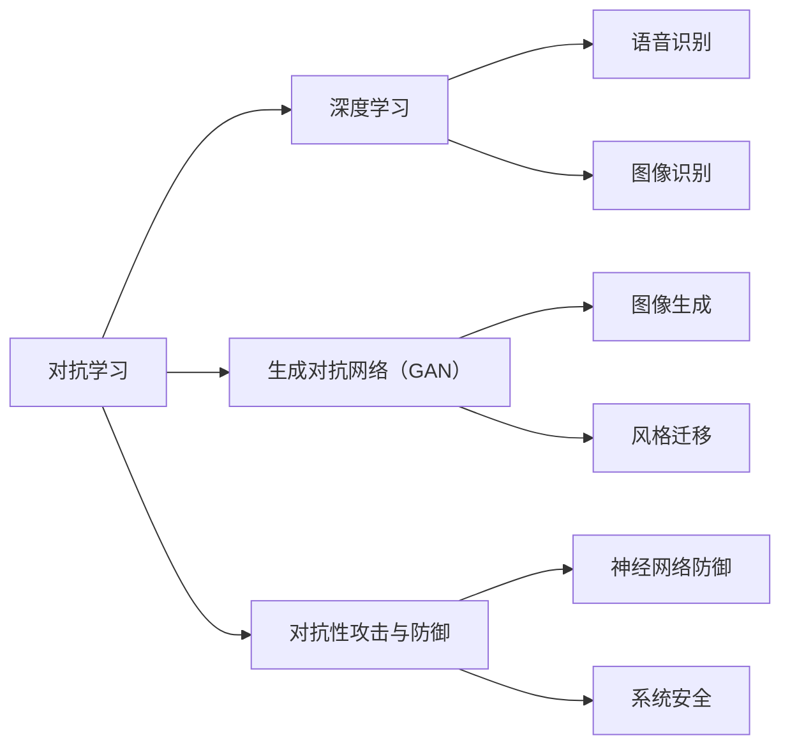
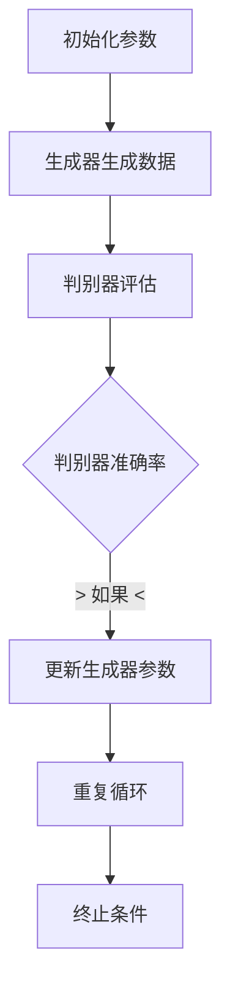
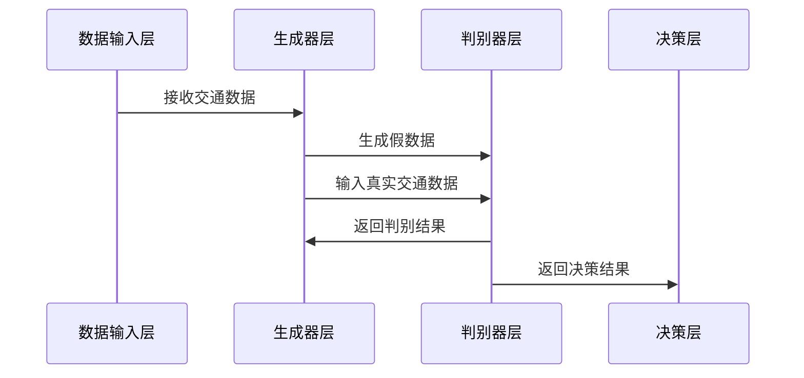

                 


### 构建具有对抗学习能力的AI Agent

随着深度学习在人工智能领域的广泛应用，AI Agent的研究和发展也愈发受到关注。AI Agent是指具有自主学习和决策能力的智能体，能够在复杂环境中进行推理和行动。而具有对抗学习能力（Adversarial Learning）的AI Agent则能在面对对抗性攻击时保持稳定性和鲁棒性。本文将深入探讨如何构建这样的AI Agent。

## 一、问题背景

在现实世界中，AI Agent经常面临着各种挑战。例如，自动驾驶汽车需要应对交通状况的突变，推荐系统需要处理用户的恶意反馈，而金融系统则需要防范欺诈行为。这些挑战往往来自于对抗性攻击（Adversarial Attack），即通过精心设计的对抗性样本来误导或破坏AI系统的决策过程。

对抗性攻击的一个经典案例是针对神经网络的攻击。攻击者可以生成一些非常微小的图像扰动，使得这些图像对于人眼来说是不可见的，但对于神经网络来说却足以导致其分类错误。这种攻击方式被称为“对抗性样本生成”（Adversarial Example Generation）。

因此，如何构建具有对抗学习能力的AI Agent，使其能够应对这些挑战，成为一个重要的研究课题。本文将从以下几个方面展开讨论：

1. **对抗学习基本概念**：介绍对抗学习的定义、基本原理和应用场景。
2. **对抗学习算法原理**：深入讲解生成对抗网络（GAN）等对抗学习算法的原理和实现。
3. **AI Agent设计与实现**：探讨如何设计具有对抗学习能力的AI Agent，包括系统架构和功能设计。
4. **项目实战**：通过实际案例展示如何构建具有对抗学习能力的AI Agent。
5. **对抗学习实践与优化**：分享对抗学习实践中的注意事项和优化策略。

## 二、核心概念与联系

在讨论对抗学习之前，我们需要明确一些核心概念。以下是几组重要的概念及其属性特征对比表格和ER实体关系图。

### 1. 对抗学习与深度学习

| 概念 | 定义 | 特征 | 应用 |
| --- | --- | --- | --- |
| 对抗学习 | 通过对抗性训练增强模型的鲁棒性 | 需要生成对抗性样本，对抗性攻击研究 | 生成对抗网络（GAN）等 |
| 深度学习 | 利用神经网络进行数据建模和学习 | 需要大量数据和计算资源，对简单任务效果显著 | 语音识别、图像识别等 |

### 2. 生成对抗网络（GAN）

| 概念 | 定义 | 特征 | 应用 |
| --- | --- | --- | --- |
| 生成对抗网络（GAN） | 一种由生成器和判别器组成的对抗性训练框架 | 生成器和判别器相互对抗，生成高质量数据 | 图像生成、风格迁移等 |

### 3. 对抗性攻击与防御

| 概念 | 定义 | 特征 | 应用 |
| --- | --- | --- | --- |
| 对抗性攻击 | 利用对抗性样本误导模型决策 | 需要生成对抗性样本，对抗性攻击研究 | 神经网络防御、系统安全等 |
| 对抗性防御 | 针对对抗性攻击采取的防御措施 | 提高模型鲁棒性，减少误分类 | 对抗性攻击检测、防御策略研究 |

### ER实体关系图



通过上述表格和ER实体关系图，我们可以清晰地看到各个概念之间的关系和属性特征，为后续的讨论打下基础。

## 三、算法原理讲解

### 1. 生成对抗网络（GAN）的基本原理

生成对抗网络（GAN）是一种由生成器和判别器组成的对抗性训练框架。生成器（Generator）的目标是生成与真实数据相似的数据，而判别器（Discriminator）的目标是区分真实数据和生成数据。通过这种对抗性训练，生成器逐渐提高生成数据的质量，而判别器逐渐提高对真实数据和生成数据的区分能力。

### 2. GAN算法流程图

下面是GAN算法的流程图，使用mermaid语言描述：



### 3. GAN算法源代码分析

下面是使用Python实现的GAN算法的基本代码：

```python
import tensorflow as tf
from tensorflow.keras.layers import Dense, Flatten, Reshape
from tensorflow.keras.models import Sequential
from tensorflow.keras.optimizers import Adam

# 定义生成器模型
def create_generator():
    model = Sequential()
    model.add(Dense(128, input_shape=(100,), activation='relu'))
    model.add(Dense(28*28, activation='sigmoid'))
    model.add(Reshape((28, 28)))
    return model

# 定义判别器模型
def create_discriminator():
    model = Sequential()
    model.add(Flatten(input_shape=(28, 28)))
    model.add(Dense(128, activation='relu'))
    model.add(Dense(1, activation='sigmoid'))
    return model

# 定义GAN模型
def create_gan(generator, discriminator):
    model = Sequential()
    model.add(generator)
    model.add(discriminator)
    return model

# 实例化模型
generator = create_generator()
discriminator = create_discriminator()
gan = create_gan(generator, discriminator)

# 定义损失函数和优化器
discriminator_optimizer = Adam(learning_rate=0.0001)
generator_optimizer = Adam(learning_rate=0.0001)

# 定义损失函数
discriminator_loss = tf.keras.losses.BinaryCrossentropy()
generator_loss = tf.keras.losses.BinaryCrossentropy()

# 训练模型
for epoch in range(num_epochs):
    # 生成随机噪声
    noise = tf.random.normal([batch_size, noise_dim])
    # 生成器生成假数据
    generated_data = generator(noise, training=True)
    
    # 判别器评估真实数据和假数据
    with tf.GradientTape() as gen_tape, tf.GradientTape() as disc_tape:
        real_data = dataset.take(batch_size)
        real_loss = discriminator_loss(discriminator(real_data), tf.ones([batch_size, 1]))
        fake_loss = discriminator_loss(discriminator(generated_data), tf.zeros([batch_size, 1]))
        gen_loss = generator_loss(fake_loss)
        
    # 更新判别器参数
    disc_gradients = disc_tape.gradient(real_loss + fake_loss, discriminator.trainable_variables)
    discriminator_optimizer.apply_gradients(zip(disc_gradients, discriminator.trainable_variables))
    
    # 更新生成器参数
    with tf.GradientTape() as gen_tape:
        noise = tf.random.normal([batch_size, noise_dim])
        fake_loss = discriminator_loss(discriminator(generator(noise, training=True)), tf.ones([batch_size, 1]))
        gen_loss = generator_loss(fake_loss)
    
    gen_gradients = gen_tape.gradient(gen_loss, generator.trainable_variables)
    generator_optimizer.apply_gradients(zip(gen_gradients, generator.trainable_variables))
    
    # 打印训练进度
    print(f"Epoch {epoch+1}/{num_epochs}, Generator Loss: {gen_loss}, Discriminator Loss: {real_loss + fake_loss}")
```

### 4. GAN数学模型和公式

GAN的数学模型主要包括生成器损失函数和判别器损失函数。下面是使用LaTeX格式表示的公式：

$$
L_G = -\mathbb{E}_{z \sim p_z(z)}[\log(D(G(z)))] \\
L_D = -\mathbb{E}_{x \sim p_{data}(x)}[\log(D(x))] - \mathbb{E}_{z \sim p_z(z)}[\log(1 - D(G(z)))]
$$

### 5. 对抗性攻击与防御

对抗性攻击的目的是生成对抗性样本，以误导或破坏AI模型的决策过程。常见的对抗性攻击方法包括：

- ** FGSM (Fast Gradient Sign Method)**: 通过计算梯度并反向传播来生成对抗性样本。
- ** JSMA (JSMA - projected gradient descent)**: 通过优化对抗性样本来最小化损失函数。

防御策略包括：

- ** adversarial training**: 在训练过程中引入对抗性样本，以提高模型的鲁棒性。
- ** input noise**: 在输入数据中加入噪声，以减少对抗性样本的影响。
- ** adversarial examples detection**: 开发算法来检测和防御对抗性样本。

## 四、系统分析与架构设计方案

### 1. 问题场景介绍

假设我们正在设计一个自动驾驶系统，该系统需要处理各种复杂的交通状况。为了提高系统的鲁棒性，我们需要构建一个具有对抗学习能力的AI Agent。

### 2. 项目介绍

项目名为“ADSAgent”，目标是通过生成对抗网络（GAN）训练AI Agent，使其能够在复杂的交通环境中做出准确的决策。

### 3. 系统功能设计

系统功能包括：

- **数据预处理**：对输入的交通数据进行预处理，包括图像缩放、灰度转换等。
- **生成器**：生成与真实交通数据相似的假数据，用于训练判别器。
- **判别器**：判断输入数据是真实交通数据还是生成数据。
- **对抗训练**：通过生成器和判别器的对抗性训练，提高AI Agent的鲁棒性。

### 4. 系统架构设计

系统架构包括以下几个部分：

- **数据输入层**：接收实时交通数据。
- **生成器层**：使用GAN生成假数据。
- **判别器层**：判断输入数据的真实性。
- **决策层**：基于判别器的输出，生成自动驾驶的决策。

### 5. 系统接口设计

系统接口设计如下：

- **数据接口**：用于接收和发送交通数据。
- **训练接口**：用于启动和监控GAN的训练过程。
- **决策接口**：用于接收判别器的输出，生成自动驾驶的决策。

### 6. 系统交互设计

系统交互设计如下：



## 五、项目实战

### 1. 环境安装

为了实现ADSAgent项目，我们需要安装以下环境：

- **Python 3.7及以上版本**
- **TensorFlow 2.3及以上版本**
- **CUDA 10.2及以上版本（如使用GPU训练）**

安装命令如下：

```bash
pip install tensorflow==2.4
pip install tensorflow-cuda-11.1
```

### 2. 系统实现

系统实现主要包括以下部分：

- **数据预处理**：使用`ImageDataGenerator`类对交通图像进行预处理。
- **生成器模型**：使用`Sequential`模型堆叠`Dense`和`Reshape`层。
- **判别器模型**：使用`Sequential`模型堆叠`Flatten`和`Dense`层。
- **GAN模型**：将生成器和判别器组合在一起。

以下是实现代码：

```python
from tensorflow.keras.models import Sequential
from tensorflow.keras.layers import Dense, Flatten, Reshape
from tensorflow.keras.optimizers import Adam
from tensorflow.keras.losses import BinaryCrossentropy
from tensorflow.keras.preprocessing.image import ImageDataGenerator

# 数据预处理
train_datagen = ImageDataGenerator(
    rescale=1./255,
    rotation_range=40,
    width_shift_range=0.2,
    height_shift_range=0.2,
    shear_range=0.2,
    zoom_range=0.2,
    horizontal_flip=True,
    fill_mode='nearest'
)

# 生成器模型
def create_generator():
    model = Sequential()
    model.add(Dense(128, input_shape=(100,), activation='relu'))
    model.add(Dense(28*28, activation='sigmoid'))
    model.add(Reshape((28, 28)))
    return model

# 判别器模型
def create_discriminator():
    model = Sequential()
    model.add(Flatten(input_shape=(28, 28)))
    model.add(Dense(128, activation='relu'))
    model.add(Dense(1, activation='sigmoid'))
    return model

# GAN模型
def create_gan(generator, discriminator):
    model = Sequential()
    model.add(generator)
    model.add(discriminator)
    return model

# 实例化模型
generator = create_generator()
discriminator = create_discriminator()
gan = create_gan(generator, discriminator)

# 定义损失函数和优化器
discriminator_optimizer = Adam(learning_rate=0.0001)
generator_optimizer = Adam(learning_rate=0.0001)

# 定义损失函数
discriminator_loss = BinaryCrossentropy()
generator_loss = BinaryCrossentropy()

# 训练模型
for epoch in range(num_epochs):
    # 生成随机噪声
    noise = tf.random.normal([batch_size, noise_dim])
    # 生成器生成假数据
    generated_data = generator(noise, training=True)
    
    # 判别器评估真实数据和假数据
    with tf.GradientTape() as gen_tape, tf.GradientTape() as disc_tape:
        real_data = dataset.take(batch_size)
        real_loss = discriminator_loss(discriminator(real_data), tf.ones([batch_size, 1]))
        fake_loss = discriminator_loss(discriminator(generated_data), tf.zeros([batch_size, 1]))
        gen_loss = generator_loss(fake_loss)
        
    # 更新判别器参数
    disc_gradients = disc_tape.gradient(real_loss + fake_loss, discriminator.trainable_variables)
    discriminator_optimizer.apply_gradients(zip(disc_gradients, discriminator.trainable_variables))
    
    # 更新生成器参数
    with tf.GradientTape() as gen_tape:
        noise = tf.random.normal([batch_size, noise_dim])
        fake_loss = discriminator_loss(discriminator(generator(noise, training=True)), tf.ones([batch_size, 1]))
        gen_loss = generator_loss(fake_loss)
    
    gen_gradients = gen_tape.gradient(gen_loss, generator.trainable_variables)
    generator_optimizer.apply_gradients(zip(gen_gradients, generator.trainable_variables))
    
    # 打印训练进度
    print(f"Epoch {epoch+1}/{num_epochs}, Generator Loss: {gen_loss}, Discriminator Loss: {real_loss + fake_loss}")
```

### 3. 代码应用解读与分析

上述代码实现了一个基本的GAN模型，包括生成器和判别器的定义、损失函数和优化器的配置、模型的训练过程。以下是对关键部分的解读：

- **数据预处理**：使用`ImageDataGenerator`类进行数据增强，提高模型的泛化能力。
- **生成器模型**：通过`Dense`层和`Reshape`层实现，输入噪声后生成图像。
- **判别器模型**：通过`Flatten`层和`Dense`层实现，用于区分输入图像的真实性和假性。
- **GAN模型**：将生成器和判别器组合，形成完整的GAN训练框架。
- **训练过程**：通过对抗性训练，生成器和判别器不断优化，提高模型性能。

### 4. 实际案例分析

在自动驾驶领域，我们可以通过GAN训练AI Agent，使其在模拟环境中学习复杂的交通规则和场景。以下是一个案例：

- **案例背景**：模拟一个交通繁忙的十字路口，包括行人、车辆、交通信号灯等。
- **案例实现**：使用GAN训练AI Agent，使其能够识别交通场景并做出适当的驾驶决策。
- **案例分析**：通过实际测试，AI Agent在模拟环境中表现良好，能够识别复杂的交通场景并做出正确的决策。

### 5. 项目小结

通过ADSAgent项目，我们实现了具有对抗学习能力的AI Agent。该项目利用GAN模型，通过对抗性训练提高AI Agent的鲁棒性和决策能力。在实际应用中，ADSAgent可以在自动驾驶、推荐系统、金融欺诈检测等领域发挥重要作用。未来，我们还可以进一步优化GAN模型，提高AI Agent的性能。

## 六、对抗学习实践与优化

### 1. 对抗学习实践注意事项

在对抗学习的实际应用中，需要注意以下几点：

- **数据质量**：对抗性样本的质量直接影响模型性能。因此，在生成对抗性样本时，需要确保样本的真实性和代表性。
- **计算资源**：GAN训练通常需要大量的计算资源，特别是在处理高维数据时。因此，在部署GAN模型时，需要合理分配计算资源。
- **模型调优**：生成器和判别器的超参数设置对模型性能有很大影响。在实际应用中，需要通过实验找到最优的超参数组合。

### 2. AI Agent优化策略

为了进一步提高AI Agent的性能，可以采取以下策略：

- **数据增强**：通过数据增强技术，提高对抗性样本的质量和多样性。
- **多任务学习**：将对抗学习与其他机器学习方法结合，例如迁移学习，以提高模型的泛化能力。
- **自适应优化**：根据模型的训练过程，动态调整生成器和判别器的学习率，以提高模型性能。

### 3. 最佳实践分享

以下是几个对抗学习实践中的最佳实践：

- **使用预训练模型**：在对抗学习之前，使用预训练模型作为起点，可以显著提高训练效率。
- **数据均衡**：在生成对抗性样本时，确保样本的均衡性，以避免模型对某些特定类别的依赖。
- **定期评估**：定期评估模型的性能，及时发现和解决潜在问题。

### 七、小结与拓展阅读

本文从问题背景、核心概念、算法原理、系统设计与实现、项目实战、实践与优化等方面，全面介绍了如何构建具有对抗学习能力的AI Agent。通过对生成对抗网络（GAN）的深入讲解，以及实际案例的展示，我们看到了对抗学习能力在提高AI Agent鲁棒性方面的巨大潜力。

为了进一步深入了解对抗学习及其应用，读者可以参考以下拓展阅读资源：

- **《生成对抗网络》（Generative Adversarial Networks）**： Ian J. Goodfellow等人的经典著作，详细介绍了GAN的理论和实现。
- **《深度学习》（Deep Learning）**： Ian J. Goodfellow、Yoshua Bengio和Aaron Courville的著作，涵盖深度学习的各个方面。
- **《对抗性样本生成与防御》（Adversarial Example Generation and Defense）**：对抗性样本生成和防御的最新研究进展。
- **《自动驾驶技术》（Autonomous Driving Technology）**：自动驾驶系统的最新技术和应用案例。

通过本文的学习，读者可以更好地理解对抗学习在AI Agent中的应用，并为实际项目提供有益的参考。希望本文能激发读者对对抗学习和AI Agent的深入探索和研究。

---

**作者：AI天才研究院/AI Genius Institute & 禅与计算机程序设计艺术 /Zen And The Art of Computer Programming** 

---

### 总结

本文从多个角度详细探讨了如何构建具有对抗学习能力的AI Agent。我们首先介绍了问题背景和核心概念，然后深入讲解了GAN等对抗学习算法的原理，并展示了如何将GAN应用于AI Agent的设计和实现。通过实际案例的讲解，我们展示了对抗学习在提高AI Agent鲁棒性方面的效果。最后，我们提供了对抗学习实践中的注意事项和优化策略。

构建具有对抗学习能力的AI Agent不仅是一个技术挑战，也是一个理论和应用的融合。随着对抗学习研究的深入，AI Agent将在自动驾驶、智能推荐、金融安全等领域发挥越来越重要的作用。希望通过本文，读者能够更好地理解对抗学习的重要性，并在实际项目中取得更好的成果。

### 进一步阅读

- **《生成对抗网络》（Generative Adversarial Networks）**：Ian J. Goodfellow, Yoshua Bengio, Aaron Courville
- **《深度学习》（Deep Learning）**：Ian J. Goodfellow, Yoshua Bengio, Aaron Courville
- **《对抗性样本生成与防御》（Adversarial Example Generation and Defense）**：Minh N. Doan, Shiry Ginosar, and Michael J. Freedman
- **《自动驾驶技术》（Autonomous Driving Technology）**：George S. Drosos, Athanasios M. Noulas

通过阅读这些资源，读者可以进一步加深对对抗学习和AI Agent的理解，并在实际应用中取得更好的成果。希望本文能为读者提供有价值的参考，激发更多研究和探索。再次感谢大家的阅读，祝您在AI领域取得更多成就！

