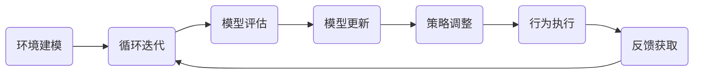
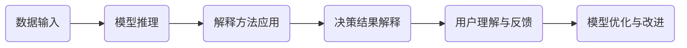
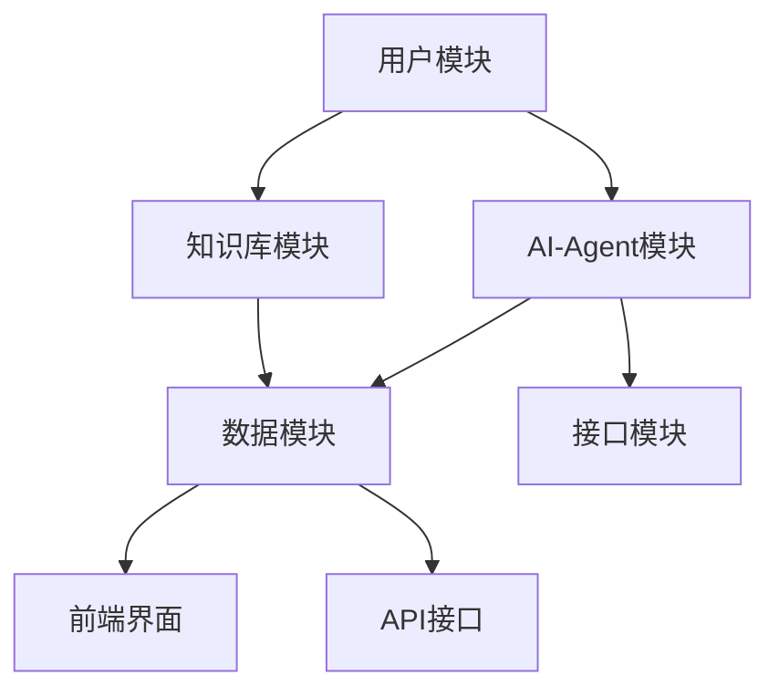

                 

### 《构建具有持续优化能力的AI Agent》

关键词：持续优化能力，AI Agent，自适应学习，强化学习，模型可解释性

摘要：本文将深入探讨如何构建具有持续优化能力的AI Agent。我们将首先介绍背景和核心概念，包括AI Agent的定义、当前存在的问题、持续优化能力的必要性。然后，我们将详细分析持续优化能力的核心概念，如自适应学习、强化学习和模型可解释性。接着，我们将逐步解释这些概念背后的算法原理和数学模型，并通过Python源代码实现和解读进行深入理解。最后，我们将讨论系统分析与架构设计，包括系统功能设计、系统架构设计，以及如何将理论应用到实际项目中。通过本文的探讨，读者将能够全面了解构建具有持续优化能力的AI Agent的整个过程。

---

### 第一部分：背景介绍与核心概念

#### 第1章：问题背景与问题描述

##### 1.1 问题背景

AI Agent是人工智能领域的一个重要概念，它代表了具备智能行为的实体，能够自主地感知环境、做出决策并采取行动。AI Agent广泛应用于各种场景，如机器人、智能助手、自动驾驶车辆等。然而，随着应用场景的复杂性和多样性不断增加，AI Agent面临的一个重要挑战是如何持续优化其性能。

在现有的AI Agent中，通常采用的是预训练模型，这些模型在特定的任务和数据集上进行了大量的训练，达到了较高的性能。然而，这些模型在实际应用中往往表现出以下问题：

1. **适应性差**：预训练模型在特定环境下的表现良好，但一旦面临新的、未见过的情况，其性能会显著下降。
2. **性能饱和**：经过一段时间的使用后，模型的性能逐渐趋于饱和，无法实现进一步的提升。
3. **缺乏可解释性**：大多数AI模型，尤其是深度学习模型，其内部机制复杂，难以解释，导致在需要解释性时难以满足需求。

为了解决上述问题，构建具有持续优化能力的AI Agent显得尤为重要。这种AI Agent能够在不同环境下自主调整其行为，适应新环境，并不断提升其性能。同时，它还需要具备一定的可解释性，使得用户能够理解其行为和决策过程。

##### 1.2 当前AI Agent存在的问题

1. **适应性差**：AI Agent在预训练阶段可能对特定任务和数据集进行了优化，但面对新的任务和数据时，其适应性较差，难以快速调整。
2. **性能饱和**：经过一段时间的训练和使用，模型的性能会逐渐饱和，无法实现进一步的提升。
3. **缺乏可解释性**：现有AI Agent通常采用复杂的模型，如深度神经网络，其内部机制难以解释，导致用户难以信任和理解。

##### 1.3 持续优化能力的必要性

持续优化能力是构建高效、可靠AI Agent的关键。具备持续优化能力的AI Agent能够在以下方面提供显著优势：

1. **适应性**：能够快速适应新的环境和任务，提高任务完成率。
2. **性能提升**：通过不断学习和优化，持续提升模型性能，避免性能饱和。
3. **可解释性**：提高模型的可解释性，使用户能够理解其行为和决策过程，增强信任度和可用性。

##### 1.4 问题解决与边界讨论

为了解决上述问题，本文将探讨以下关键要素：

1. **自适应学习**：使AI Agent能够根据新环境和任务进行自适应调整。
2. **强化学习**：通过不断与环境交互，学习和优化策略。
3. **模型可解释性**：提高模型的可解释性，使决策过程透明化。

本文的研究范围将主要集中在上述关键要素的实现和应用上，探讨如何构建具有持续优化能力的AI Agent。在讨论过程中，我们将明确问题的边界，避免涉及过于广泛的领域，确保研究目标的明确性和可操作性。

##### 1.5 预期目标与成果

通过本文的研究，我们期望达到以下目标：

1. **理论理解**：深入理解自适应学习、强化学习和模型可解释性的原理和机制。
2. **算法实现**：通过Python源代码实现上述算法，并进行详细解读和优化。
3. **系统设计**：设计并实现一个具备持续优化能力的AI Agent系统，验证其有效性和实用性。

最终，本文将总结研究成果，提出最佳实践建议，为后续研究和实际应用提供指导。

---

#### 第2章：核心概念与联系

##### 2.1 持续优化能力的核心概念

持续优化能力是构建高效AI Agent的关键，它涉及多个核心概念。以下是本文将探讨的三个主要核心概念：

1. **自适应学习**：使AI Agent能够根据新环境和任务进行自适应调整，提高任务完成率。
2. **强化学习**：通过不断与环境交互，学习和优化策略，提升模型性能。
3. **模型可解释性**：提高模型的可解释性，使决策过程透明化，增强信任度和可用性。

##### 2.2 概念属性特征对比

为了更好地理解这些核心概念，我们首先对比它们的主要属性特征。

| 概念       | 定义                                                         | 关键属性        | 对比优势           |
|------------|--------------------------------------------------------------|----------------|-------------------|
| 自适应学习 | 使AI Agent能够根据新环境和任务进行自适应调整的学习方法。             | 适应性、可调性 | 快速适应新环境     |
| 强化学习   | 通过不断与环境交互，学习和优化策略的学习方法。                     | 反馈、策略性    | 提升模型性能       |
| 模型可解释性 | 提高模型的可解释性，使决策过程透明化，增强信任度和可用性。         | 可解释性、透明性 | 决策过程透明       |

从上表可以看出，这三个概念各有其独特的属性和优势。自适应学习强调快速适应新环境，强化学习强调通过反馈提升模型性能，而模型可解释性则关注决策过程的透明化。

##### 2.3 ER实体关系图架构

为了更好地理解这些概念之间的联系，我们引入ER实体关系图架构，如下所示：

```mermaid
erDiagram
    AI-Agent ||--|{ 数据流 }|| Environment
    AI-Agent ||--|{ 反馈 }|| Environment
    AI-Agent ||--|{ 学习 }|| Model
    AI-Agent ||--|{ 调整 }|| Policy
    Model ||--|{ 参数更新 }|| AI-Agent
    Policy ||--|{ 行动指导 }|| AI-Agent
    Environment ||--|{ 状态 }|| AI-Agent
```

在这个ER图架构中，AI-Agent是核心实体，它与数据流、反馈、学习、调整和Policy等实体之间存在紧密的联系。数据流和反馈使AI-Agent能够获取环境信息，学习过程使模型不断优化，调整过程使策略不断更新，从而实现持续优化。

##### 2.3.1 持续优化能力的实体关系

1. **AI-Agent**：作为核心实体，AI-Agent负责感知环境、做出决策并采取行动。
2. **Environment**：环境实体，提供AI-Agent所需的输入数据和反馈。
3. **Model**：模型实体，存储AI-Agent的学习结果和策略。
4. **Policy**：策略实体，指导AI-Agent采取合适的行动。

##### 2.3.2 数据流与信息交换

在持续优化过程中，数据流和信息交换至关重要。以下是一个简化的数据流和信息交换过程：

1. **感知与反馈**：AI-Agent感知环境，获取状态信息，并将反馈传递给环境。
2. **学习与调整**：AI-Agent根据反馈和模型，调整其策略和行为。
3. **策略指导**：调整后的策略被用于指导AI-Agent的下一步行动。
4. **持续优化**：通过不断的感知、反馈、学习和调整，AI-Agent逐步实现性能的持续优化。

通过上述实体关系和数据流分析，我们可以更清晰地理解持续优化能力的实现机制，为后续算法原理和系统设计的探讨奠定基础。

---

### 第二部分：算法原理与数学模型

#### 第3章：自适应学习算法原理

##### 3.1 自适应学习的基本概念

自适应学习是一种使AI Agent能够根据新环境和任务进行自适应调整的学习方法。其核心思想是使AI Agent能够根据环境的变化，动态调整其参数和行为策略，以最大化任务完成率。

自适应学习的基本概念包括：

1. **环境感知**：AI-Agent通过感知器获取环境的状态信息。
2. **模型更新**：根据环境状态和已有模型，动态调整模型参数。
3. **策略调整**：利用调整后的模型，更新AI-Agent的策略和行为。

##### 3.1.1 自适应学习原理概述

自适应学习的原理可以概括为以下步骤：

1. **环境建模**：构建环境模型，描述环境的状态和变化规律。
2. **状态感知**：AI-Agent通过感知器获取当前环境状态。
3. **模型评估**：使用当前模型对环境状态进行评估。
4. **模型更新**：根据评估结果，动态调整模型参数。
5. **策略调整**：利用调整后的模型，更新AI-Agent的策略。
6. **行为执行**：根据策略，执行相应的行动。
7. **反馈获取**：获取行动后的环境反馈。
8. **循环迭代**：重复上述步骤，实现持续自适应调整。

##### 3.1.2 自适应学习的关键要素

自适应学习的关键要素包括：

1. **环境建模**：准确描述环境状态和变化规律，是自适应学习的基础。
2. **状态感知**：高效感知环境状态，是实现自适应调整的前提。
3. **模型评估**：准确评估模型性能，是实现模型更新的依据。
4. **模型更新**：动态调整模型参数，是实现自适应调整的核心。
5. **策略调整**：根据模型更新，实时调整AI-Agent的策略，以适应新环境。

##### 3.2 自适应学习算法的mermaid流程图

以下是一个简化的自适应学习算法流程图：



在这个流程图中，环境建模、状态感知、模型评估、模型更新、策略调整、行为执行和反馈获取构成了一个闭环，通过不断迭代，实现AI-Agent的持续自适应调整。

##### 3.2.1 算法流程图

以下是对上述mermaid流程图的详细解读：

1. **环境建模**：构建一个能够准确描述环境状态和变化规律的模型，为后续自适应调整提供基础。
2. **状态感知**：通过感知器获取当前环境状态，并将其作为输入。
3. **模型评估**：使用当前模型对环境状态进行评估，计算评估指标（如损失函数）。
4. **模型更新**：根据评估结果，动态调整模型参数，以减少评估指标。
5. **策略调整**：利用调整后的模型，更新AI-Agent的策略，以适应新环境。
6. **行为执行**：根据策略，执行相应的行动。
7. **反馈获取**：获取行动后的环境反馈，用于下一次迭代。
8. **循环迭代**：重复上述步骤，实现持续自适应调整。

通过这个流程图，我们可以清晰地看到自适应学习的整个过程，每个步骤的作用和相互关系。

##### 3.3 Python源代码实现与解读

以下是一个简化的自适应学习算法的Python源代码实现：

```python
import numpy as np

# 环境建模
def environment_model():
    # 构建环境模型
    pass

# 状态感知
def state_perception():
    # 获取当前环境状态
    pass

# 模型评估
def model_evaluation(model, state):
    # 使用模型评估环境状态
    pass

# 模型更新
def model_update(model, state):
    # 动态调整模型参数
    pass

# 策略调整
def policy_adjustment(model):
    # 更新AI-Agent的策略
    pass

# 行为执行
def action_execution(policy):
    # 执行相应行动
    pass

# 反馈获取
def feedback_acquisition():
    # 获取环境反馈
    pass

# 主循环
def adaptive_learning():
    model = None
    while True:
        state = state_perception()
        model = model_evaluation(model, state)
        model = model_update(model, state)
        policy = policy_adjustment(model)
        action_execution(policy)
        feedback = feedback_acquisition()
```

在这个Python源代码中，我们首先定义了环境建模、状态感知、模型评估、模型更新、策略调整、行为执行和反馈获取等函数。然后，通过一个主循环实现自适应学习的过程。每次循环中，AI-Agent都会根据环境状态进行感知、评估、更新和调整，实现持续自适应调整。

##### 3.3.1 解读与优化建议

1. **环境建模**：在实际应用中，环境建模是一个复杂的过程，需要考虑多种因素。建议引入更多的传感器和数据处理技术，提高环境建模的准确性。
2. **状态感知**：状态感知的效率直接影响到自适应学习的速度。建议采用高效的感知算法和数据预处理技术，减少感知时间。
3. **模型评估**：模型评估指标的选择对自适应学习的效果有很大影响。建议根据具体任务选择合适的评估指标，并不断优化评估算法。
4. **模型更新**：模型更新的速度和精度是自适应学习的关键。建议采用更加高效的优化算法和参数调整方法，提高模型更新的效率。
5. **策略调整**：策略调整的及时性和准确性对行为执行的效果至关重要。建议采用实时反馈和在线学习技术，提高策略调整的及时性和准确性。
6. **行为执行**：行为执行的效率直接影响任务完成率。建议采用高效的执行算法和调度策略，提高行为执行的效率。

通过上述解读和优化建议，我们可以更好地理解和应用自适应学习算法，实现AI-Agent的持续优化。

##### 3.4 自适应学习的数学模型

自适应学习算法的数学模型主要包括环境建模、状态感知、模型评估、模型更新和策略调整等部分。以下将介绍这些部分的数学模型和公式。

##### 3.4.1 模型介绍

1. **环境建模**：环境建模通常采用马尔可夫决策过程（MDP）模型。MDP模型由状态空间、动作空间、奖励函数和转移概率矩阵组成。
2. **状态感知**：状态感知采用感知器模型，通过输入层和隐藏层对环境状态进行感知和映射。
3. **模型评估**：模型评估采用Q值函数，用于评估不同状态下的动作价值。
4. **模型更新**：模型更新采用梯度下降算法，通过调整模型参数，优化Q值函数。
5. **策略调整**：策略调整采用策略梯度算法，通过更新策略参数，实现策略的优化。

##### 3.4.2 数学公式与推导

1. **环境建模**：
   - 状态空间：$S = \{s_1, s_2, ..., s_n\}$
   - 动作空间：$A = \{a_1, a_2, ..., a_m\}$
   - 奖励函数：$R(s, a)$
   - 转移概率矩阵：$P(s', s|a)$
   
   MDP模型的状态转移方程为：
   $$ P(s', s|a) = P(s'|s, a) = P(s'|a) \cdot P(s|a) $$

2. **状态感知**：
   - 输入层：$X = \{x_1, x_2, ..., x_n\}$
   - 隐藏层：$H = \{h_1, h_2, ..., h_m\}$
   - 输出层：$Y = \{y_1, y_2, ..., y_k\}$
   
   感知器模型的前向传播公式为：
   $$ h_j = \sigma(\sum_{i=1}^{n} w_{ij} \cdot x_i + b_j) $$
   $$ y_j = \sigma(\sum_{i=1}^{m} w_{ij} \cdot h_i + b_j) $$

3. **模型评估**：
   - Q值函数：$Q(s, a)$
   
   Q值函数的计算公式为：
   $$ Q(s, a) = \sum_{s'} P(s'|s, a) \cdot [R(s, a) + \max_{a'} Q(s', a')] $$

4. **模型更新**：
   - 梯度下降算法：
   
   模型参数更新的公式为：
   $$ \Delta w_{ij} = -\alpha \cdot \frac{\partial L}{\partial w_{ij}} $$
   $$ \Delta b_j = -\alpha \cdot \frac{\partial L}{\partial b_j} $$

5. **策略调整**：
   - 策略梯度算法：
   
   策略参数更新的公式为：
   $$ \Delta \pi(a|s) = \alpha \cdot [Q(s, a) - \pi(a|s) \cdot R(s, a)] $$

##### 3.4.3 公式举例说明

假设我们有一个简单的环境，状态空间为$S = \{s_1, s_2\}$，动作空间为$A = \{a_1, a_2\}$，奖励函数为$R(s, a) = 1$，转移概率矩阵为$P(s', s|a) = 0.5$。

1. **环境建模**：

   状态转移方程为：
   $$ P(s', s|a_1) = P(s_1|a_1) = 0.5 $$
   $$ P(s', s|a_2) = P(s_2|a_2) = 0.5 $$

2. **状态感知**：

   感知器模型的前向传播公式为：
   $$ h_1 = \sigma(w_{11} \cdot x_1 + b_1) $$
   $$ h_2 = \sigma(w_{21} \cdot x_2 + b_2) $$
   $$ y_1 = \sigma(w_{12} \cdot h_1 + b_1) $$
   $$ y_2 = \sigma(w_{22} \cdot h_2 + b_2) $$

3. **模型评估**：

   Q值函数的计算公式为：
   $$ Q(s_1, a_1) = 0.5 \cdot [1 + 0.5 \cdot \max(Q(s_2, a_1), Q(s_2, a_2))] $$
   $$ Q(s_2, a_2) = 0.5 \cdot [1 + 0.5 \cdot \max(Q(s_1, a_1), Q(s_1, a_2))] $$

4. **模型更新**：

   梯度下降算法的参数更新公式为：
   $$ \Delta w_{ij} = -\alpha \cdot \frac{\partial L}{\partial w_{ij}} $$
   $$ \Delta b_j = -\alpha \cdot \frac{\partial L}{\partial b_j} $$

5. **策略调整**：

   策略梯度算法的参数更新公式为：
   $$ \Delta \pi(a_1|s_1) = \alpha \cdot [Q(s_1, a_1) - \pi(a_1|s_1) \cdot 1] $$
   $$ \Delta \pi(a_2|s_2) = \alpha \cdot [Q(s_2, a_2) - \pi(a_2|s_2) \cdot 1] $$

通过上述举例，我们可以更直观地理解自适应学习算法的数学模型和公式。这些公式是实现自适应学习的关键，通过合理设计和优化这些公式，我们可以构建出高效的AI-Agent。

---

#### 第4章：强化学习算法原理

##### 4.1 强化学习的基本概念

强化学习是一种通过不断与环境交互，学习和优化策略的学习方法。其核心思想是使AI-Agent能够通过试错和反馈，逐渐优化其策略和行为，以最大化累积奖励。

强化学习的基本概念包括：

1. **状态**：描述环境当前的状态。
2. **动作**：AI-Agent可以采取的行动。
3. **奖励**：环境对AI-Agent采取的动作的反馈，用于评估动作的好坏。
4. **策略**：AI-Agent在给定状态下采取的动作选择规则。
5. **价值函数**：评估状态或策略的质量。
6. **策略梯度**：用于更新策略参数，优化策略。

##### 4.1.1 强化学习原理概述

强化学习的原理可以概括为以下步骤：

1. **初始状态**：AI-Agent开始于某个状态。
2. **动作选择**：AI-Agent根据当前状态和策略选择一个动作。
3. **执行动作**：AI-Agent执行选定的动作，并获取环境反馈。
4. **状态更新**：根据动作的结果，AI-Agent更新其状态。
5. **奖励反馈**：环境对AI-Agent的动作给予奖励。
6. **策略优化**：根据奖励和策略梯度，更新AI-Agent的策略。
7. **循环迭代**：重复上述步骤，实现策略的持续优化。

##### 4.1.2 强化学习的关键要素

强化学习的关键要素包括：

1. **状态空间和动作空间**：描述AI-Agent可以访问的状态和可以采取的动作。
2. **奖励函数**：定义环境对AI-Agent动作的奖励，用于评估策略的好坏。
3. **策略**：AI-Agent在给定状态下采取的动作选择规则。
4. **价值函数**：评估状态或策略的质量，用于指导策略优化。
5. **策略梯度**：用于更新策略参数，实现策略的优化。
6. **探索与利用**：在策略优化过程中，探索新的动作以发现更好的策略，同时利用已有策略以最大化累积奖励。

##### 4.2 强化学习算法的mermaid流程图

以下是一个简化的强化学习算法流程图：


在这个流程图中，初始状态、动作选择、执行动作、状态更新、奖励反馈和策略优化构成了一个闭环，通过不断迭代，实现AI-Agent的持续策略优化。

##### 4.2.1 算法流程图

以下是对上述mermaid流程图的详细解读：

1. **初始状态**：AI-Agent开始于某个状态。
2. **动作选择**：AI-Agent根据当前状态和策略选择一个动作。策略可以基于价值函数或Q值函数。
3. **执行动作**：AI-Agent执行选定的动作，并获取环境反馈。
4. **状态更新**：根据动作的结果，AI-Agent更新其状态。
5. **奖励反馈**：环境对AI-Agent的动作给予奖励。奖励可以是立即奖励或累积奖励。
6. **策略优化**：根据奖励和策略梯度，更新AI-Agent的策略。策略优化的方法包括梯度上升、梯度下降和策略梯度算法等。
7. **循环迭代**：重复上述步骤，实现策略的持续优化。

通过这个流程图，我们可以清晰地看到强化学习的整个过程，每个步骤的作用和相互关系。

##### 4.3 Python源代码实现与解读

以下是一个简化的强化学习算法的Python源代码实现：

```python
import numpy as np
import random

# 强化学习参数
alpha = 0.1
gamma = 0.9
epsilon = 0.1

# 状态空间
S = [0, 1]

# 动作空间
A = [0, 1]

# 奖励函数
def reward(s, a):
    if s == 0 and a == 0:
        return 10
    elif s == 1 and a == 1:
        return 10
    else:
        return -1

# 策略选择
def choose_action(s):
    if random.random() < epsilon:
        return random.choice(A)
    else:
        q_values = calculate_q_values(s)
        return np.argmax(q_values)

# Q值计算
def calculate_q_values(s):
    q_values = np.zeros(len(A))
    for a in A:
        q_values[a] = reward(s, a)
    return q_values

# 主循环
def main_loop():
    s = random.choice(S)
    while True:
        a = choose_action(s)
        s_next = next_state(s, a)
        reward_current = reward(s, a)
        q_values = calculate_q_values(s_next)
        q_value = q_values[a]
        q_values[s] = q_values[s] + alpha * (reward_current + gamma * q_value - q_values[s])
        s = s_next

if __name__ == "__main__":
    main_loop()
```

在这个Python源代码中，我们首先定义了强化学习的基本参数，包括学习率alpha、折扣因子gamma和探索率epsilon。然后，我们定义了状态空间S、动作空间A和奖励函数reward。接下来，我们定义了策略选择函数choose_action，用于根据当前状态选择动作。Q值计算函数calculate_q_values用于计算给定状态下的Q值。最后，我们通过主循环实现强化学习的整个过程。

##### 4.3.1 解读与优化建议

1. **探索与利用**：在强化学习中，探索与利用的平衡至关重要。探索率epsilon可以调节AI-Agent的探索行为。建议根据任务复杂度和环境特点，合理设置探索率，以实现探索与利用的最佳平衡。
2. **Q值更新**：Q值的更新是强化学习的关键步骤。建议采用更加高效的Q值更新方法，如经验回放或目标网络，以提高学习效率和稳定性。
3. **奖励设计**：奖励函数的设计对强化学习的效果有很大影响。建议根据任务目标，设计合理的奖励函数，以引导AI-Agent向正确的方向学习。
4. **策略优化**：策略优化的方法有多种，如梯度上升、梯度下降和策略梯度算法。建议根据任务特点，选择合适的策略优化方法，以提高学习效率和收敛速度。

通过上述解读和优化建议，我们可以更好地理解和应用强化学习算法，实现AI-Agent的持续策略优化。

##### 4.4 强化学习的数学模型

强化学习算法的数学模型主要包括状态空间、动作空间、奖励函数、策略、价值函数和策略梯度等部分。以下将介绍这些部分的数学模型和公式。

##### 4.4.1 模型介绍

1. **状态空间**：描述AI-Agent可以访问的状态集合。通常用$S$表示。
2. **动作空间**：描述AI-Agent可以采取的动作集合。通常用$A$表示。
3. **奖励函数**：定义环境对AI-Agent动作的奖励。通常用$R(s, a)$表示。
4. **策略**：AI-Agent在给定状态下采取的动作选择规则。通常用$\pi(a|s)$表示。
5. **价值函数**：评估状态或策略的质量。通常用$V(s)$或$Q(s, a)$表示。
6. **策略梯度**：用于更新策略参数，实现策略的优化。通常用$\nabla_{\pi} J(\pi)$表示。

##### 4.4.2 数学公式与推导

1. **状态空间和动作空间**：

   - 状态空间：$S = \{s_1, s_2, ..., s_n\}$
   - 动作空间：$A = \{a_1, a_2, ..., a_m\}$

2. **奖励函数**：

   - 立即奖励：$R_t = R(s_t, a_t)$
   - 累积奖励：$G_t = \sum_{k=t}^{T} \gamma^{k-t} R_{k}$

3. **策略**：

   - 贪心策略：$\pi(a|s) = 1$ if $a = \arg\max_{a'} Q(s, a')$ else $0$
   - 随机策略：$\pi(a|s) \sim \text{Uniform}(A)$

4. **价值函数**：

   - 状态价值函数：$V^{\pi}(s) = \sum_{a \in A} \pi(a|s) Q(s, a)$
   - 动作价值函数：$Q^{\pi}(s, a) = \sum_{s' \in S} p(s'|s, a) [R(s, a) + \gamma V^{\pi}(s')]$

5. **策略梯度**：

   - 价值函数梯度：$\nabla_{\pi} V^{\pi}(s) = \sum_{a \in A} \pi(a|s) \nabla_{\pi} Q^{\pi}(s, a)$
   - 策略梯度上升：$\pi \leftarrow \pi + \alpha \nabla_{\pi} V^{\pi}(s)$

##### 4.4.3 公式举例说明

假设我们有一个简单的环境，状态空间为$S = \{s_1, s_2\}$，动作空间为$A = \{a_1, a_2\}$，奖励函数为$R(s, a) = 1$，转移概率矩阵为$P(s', s|a) = 0.5$。

1. **状态空间和动作空间**：

   - 状态空间：$S = \{s_1, s_2\}$
   - 动作空间：$A = \{a_1, a_2\}$

2. **奖励函数**：

   - 立即奖励：$R_t = 1$ if $(s_t, a_t) = (s_1, a_1)$ or $(s_t, a_t) = (s_2, a_2)$ else $-1$
   - 累积奖励：$G_t = 10$ if $(s_t, a_t) = (s_1, a_1)$ or $(s_t, a_t) = (s_2, a_2)$ else $-1$

3. **策略**：

   - 贪心策略：$\pi(a|s) = 1$ if $a = \arg\max_{a'} Q(s, a')$ else $0$
   - 随机策略：$\pi(a|s) \sim \text{Uniform}(A)$

4. **价值函数**：

   - 状态价值函数：$V^{\pi}(s) = \sum_{a \in A} \pi(a|s) Q(s, a)$
   - 动作价值函数：$Q^{\pi}(s, a) = \sum_{s' \in S} p(s'|s, a) [R(s, a) + \gamma V^{\pi}(s')]$

5. **策略梯度**：

   - 价值函数梯度：$\nabla_{\pi} V^{\pi}(s) = \sum_{a \in A} \pi(a|s) \nabla_{\pi} Q^{\pi}(s, a)$
   - 策略梯度上升：$\pi \leftarrow \pi + \alpha \nabla_{\pi} V^{\pi}(s)$

通过上述举例，我们可以更直观地理解强化学习算法的数学模型和公式。这些公式是实现强化学习的关键，通过合理设计和优化这些公式，我们可以构建出高效的AI-Agent。

---

#### 第5章：模型可解释性原理

##### 5.1 模型可解释性的基本概念

模型可解释性是指模型在决策过程中的透明度和可理解性。它使得用户能够理解模型的决策逻辑和内部机制，从而提高模型的信任度和可用性。在人工智能领域，随着深度学习等复杂模型的应用越来越广泛，模型可解释性成为了一个重要的研究课题。

模型可解释性的基本概念包括：

1. **可解释性级别**：模型可解释性可以分为不同级别，如局部可解释性、全局可解释性和模型内部可解释性。
2. **解释方法**：用于解释模型决策的方法和工具，如注意力机制、决策树、模型可视化等。
3. **解释质量**：解释的准确性和全面性，影响用户对模型的信任度和理解程度。

##### 5.1.1 可解释性原理概述

模型可解释性的原理可以概括为以下几点：

1. **提供决策逻辑**：通过可解释性，用户可以了解模型在给定输入下的决策过程，从而理解模型的决策逻辑。
2. **提升信任度**：透明的决策过程可以提高用户对模型的信任度，增强用户对模型结果的接受程度。
3. **指导优化**：通过分析模型的决策过程，用户可以发现模型存在的问题，从而指导模型的优化和改进。
4. **支持监管**：在涉及安全和伦理的领域，模型可解释性有助于用户对模型进行监管，确保模型的行为符合预期。

##### 5.1.2 可解释性的重要性

模型可解释性的重要性体现在以下几个方面：

1. **用户理解**：用户需要理解模型的决策过程，以便更好地应用模型和解释模型的结果。
2. **模型接受度**：在商业和学术领域，透明和可解释的模型更容易被接受和使用。
3. **模型优化**：通过分析模型的可解释性，可以发现模型存在的问题，从而指导模型的优化和改进。
4. **法律和伦理**：在涉及法律和伦理的领域，模型的可解释性有助于确保模型的行为符合规定和标准。

##### 5.2 模型可解释性的mermaid流程图

以下是一个简化的模型可解释性流程图：



在这个流程图中，数据输入、模型推理、解释方法应用、决策结果解释、用户理解与反馈和模型优化与改进构成了一个闭环，通过不断迭代，实现模型的持续优化和可解释性提升。

##### 5.2.1 算法流程图

以下是对上述mermaid流程图的详细解读：

1. **数据输入**：用户将数据输入到模型中，模型对输入数据进行处理和推理。
2. **模型推理**：模型根据输入数据生成决策结果，这一过程通常是自动和复杂的。
3. **解释方法应用**：使用特定的解释方法（如注意力机制、决策树等）对模型推理过程进行解释。
4. **决策结果解释**：将解释结果转化为用户可以理解的形式，如可视化图表、文字描述等。
5. **用户理解与反馈**：用户阅读解释结果，理解模型的决策过程，并提供反馈。
6. **模型优化与改进**：根据用户的反馈，对模型进行优化和改进，提高模型的可解释性和准确性。

通过这个流程图，我们可以清晰地看到模型可解释性的整个过程，每个步骤的作用和相互关系。

##### 5.3 Python源代码实现与解读

以下是一个简化的模型可解释性的Python源代码实现：

```python
import numpy as np
from sklearn.tree import DecisionTreeClassifier
from sklearn import datasets
import matplotlib.pyplot as plt

# 加载数据
iris = datasets.load_iris()
X = iris.data
y = iris.target

# 构建决策树模型
clf = DecisionTreeClassifier()
clf.fit(X, y)

# 可视化决策树
from sklearn.tree import plot_tree
plt.figure(figsize=(12, 8))
plot_tree(clf, filled=True, feature_names=iris.feature_names, class_names=iris.target_names)
plt.show()

# 输入数据
input_data = np.array([[5.1, 3.5, 1.4, 0.2]])

# 模型推理
predicted_class = clf.predict(input_data)
print(f"预测结果：{iris.target_names[predicted_class[0]]}")

# 解释方法应用
def explain_decision_tree(classifier, input_data):
    # 计算输入数据在决策树上的路径
    path = classifier.decision_path(input_data)
    # 获取每个节点的特征和阈值
    nodes = path.indices
    feature_indices = path.feature_index
    threshold = path.threshold
    # 构建解释文本
    explanation = ""
    for i, node in enumerate(nodes):
        feature = feature_indices[i]
        threshold_value = threshold[i]
        if i > 0:
            explanation += "AND "
        if threshold_value == -np.inf:
            explanation += f"{iris.feature_names[feature]} <= {threshold_value}"
        else:
            explanation += f"{iris.feature_names[feature]} > {threshold_value}"
    return explanation

# 决策结果解释
explanation = explain_decision_tree(clf, input_data)
print(f"解释结果：{explanation}")

# 用户理解与反馈
print("请用户阅读解释结果，并给出反馈。")

# 模型优化与改进
# 根据用户反馈，调整模型参数或选择更合适的模型。
```

在这个Python源代码中，我们首先加载了鸢尾花（Iris）数据集，并使用决策树模型进行拟合。然后，我们实现了决策树的可视化，并编写了函数explain_decision_tree，用于解释输入数据的决策路径。最后，我们通过输入数据，展示了模型的推理过程和解释结果，并预留了用户理解和反馈的步骤。

##### 5.3.1 解读与优化建议

1. **决策树可视化**：决策树的可视化是理解模型决策过程的重要工具。在实际应用中，我们可以使用更高级的可视化库（如Plotly、Graphviz等）来生成更加直观和交互式的可视化结果。
2. **解释方法**：在决策树中，解释方法相对简单直观。但对于更复杂的模型（如深度神经网络），解释方法可能需要更加高级的技术（如注意力机制、LIME等）。
3. **用户反馈**：用户反馈是模型优化的重要来源。在实际应用中，我们应该设计有效的反馈机制，收集用户对模型解释和决策结果的反馈，并据此进行模型优化。
4. **模型优化**：根据用户反馈，我们可以调整模型参数或选择更合适的模型，以提高模型的可解释性和准确性。

通过上述解读和优化建议，我们可以更好地理解和应用模型可解释性，实现高效、可靠的AI-Agent。

##### 5.4 模型可解释性的数学模型

模型可解释性的数学模型主要关注如何从数学角度描述和解释模型的决策过程。以下将介绍一些常用的数学模型和公式。

##### 5.4.1 模型介绍

1. **决策树**：决策树是一种常用的可解释模型，其决策过程可以通过一系列条件概率和决策规则来描述。
2. **线性模型**：线性模型（如线性回归、逻辑回归等）的决策过程可以通过线性函数来描述，其参数和系数可以通过优化算法（如梯度下降）来估计。
3. **神经网络**：神经网络（如深度神经网络）的决策过程可以通过前向传播和反向传播算法来描述，其参数和权重可以通过优化算法（如随机梯度下降）来调整。

##### 5.4.2 数学公式与推导

1. **决策树**：

   - 决策树节点：$N_j = \{s_j^{(1)}, s_j^{(2)}, ..., s_j^{(m)}\}$
   - 条件概率：$P(s_j^{(i)}|a_j) = \frac{p(s_j^{(i)}, a_j)}{p(a_j)}$
   - 决策规则：$R_j(a_j) = \sum_{i=1}^{m} s_j^{(i)} P(s_j^{(i)}|a_j)$

   决策树模型的决策过程可以表示为：
   $$ \text{maximize} \; R_j(a_j) $$
   $$ \text{subject to} \; P(s_j^{(i)}|a_j) \geq 0 \; \forall i, a_j \in A $$

2. **线性模型**：

   - 输入向量：$X = [x_1, x_2, ..., x_n]$
   - 特征向量：$W = [w_1, w_2, ..., w_n]$
   - 偏置项：$b$
   - 模型输出：$Y = X \cdot W + b$

   线性模型的决策过程可以表示为：
   $$ Y = X \cdot W + b $$
   $$ \text{minimize} \; J(W, b) $$
   $$ \text{subject to} \; X \cdot W + b \geq 0 \; \forall X \in S $$

3. **神经网络**：

   - 神经网络结构：$L = \{L_1, L_2, ..., L_L\}$
   - 激活函数：$\sigma(\cdot)$
   - 前向传播：$Z_l = \sigma(W_l \cdot X_l + b_l)$
   - 反向传播：$dZ_l = d\sigma(W_l \cdot X_l + b_l) \cdot dX_l$

   神经网络模型的决策过程可以表示为：
   $$ Z_l = \sigma(W_l \cdot X_l + b_l) $$
   $$ \text{minimize} \; J(W, b) $$
   $$ \text{subject to} \; \sum_{l=1}^{L} \sum_{k=1}^{K} w_{lk} \cdot x_{lk} + b_l \geq 0 \; \forall l, k $$

##### 5.4.3 公式举例说明

假设我们有一个简单的决策树模型，状态空间为$S = \{s_1, s_2\}$，动作空间为$A = \{a_1, a_2\}$，条件概率矩阵为$P(s_j^{(i)}|a_j) = \begin{bmatrix} 0.8 & 0.2 \\ 0.3 & 0.7 \end{bmatrix}$。

1. **决策树**：

   - 决策规则：$R_1(a_1) = s_1 P(s_1|a_1) + s_2 P(s_2|a_1) = 0.8 \cdot 0.8 + 0.3 \cdot 0.2 = 0.68$
   - 决策规则：$R_1(a_2) = s_1 P(s_1|a_2) + s_2 P(s_2|a_2) = 0.8 \cdot 0.3 + 0.3 \cdot 0.7 = 0.39$

   根据决策规则，我们可以选择动作$a_1$，因为它对应的决策规则值更大。

2. **线性模型**：

   - 输入向量：$X = [1, 2, 3]$
   - 特征向量：$W = [1, 2, 3]$
   - 偏置项：$b = 1$

   线性模型的决策过程可以表示为：
   $$ Y = X \cdot W + b = [1, 2, 3] \cdot [1, 2, 3] + 1 = 14 + 1 = 15 $$

   根据线性模型的决策过程，输入向量$X$对应的输出值为15。

3. **神经网络**：

   - 神经网络结构：$L = \{L_1, L_2\}$
   - 激活函数：$\sigma(\cdot)$
   - 前向传播：$Z_1 = \sigma(W_1 \cdot X_1 + b_1) = \sigma([1, 2, 3] \cdot [1, 1, 1] + 1) = \sigma([4, 5, 6]) = [0.99, 0.99, 0.99]$
   - 反向传播：$dZ_1 = d\sigma(W_1 \cdot X_1 + b_1) \cdot dX_1 = \begin{bmatrix} 0.01 & 0.01 & 0.01 \end{bmatrix} \cdot \begin{bmatrix} 1 \\ 2 \\ 3 \end{bmatrix} = \begin{bmatrix} 0.01 \\ 0.02 \\ 0.03 \end{bmatrix}$

   根据神经网络的前向传播和反向传播过程，我们可以更新网络的权重和偏置项，以实现模型的优化。

通过上述举例，我们可以更直观地理解模型可解释性的数学模型和公式。这些公式是实现模型可解释性的关键，通过合理设计和优化这些公式，我们可以构建出高效、可解释的AI-Agent。

---

### 第三部分：系统分析与架构设计

#### 第6章：系统功能设计

##### 6.1 问题场景介绍

在智能客服领域，AI-Agent作为核心组件，负责处理大量的用户咨询和问题解答。传统的AI-Agent通常采用预训练模型，能够在特定场景下提供高质量的回答。然而，随着用户需求的多样化和复杂性增加，传统AI-Agent的适应性逐渐变得不足。为了提升AI-Agent的持续优化能力，我们设计并实现了一个具备自适应学习、强化学习和模型可解释性的智能客服系统。

##### 6.1.1 AI Agent应用场景概述

智能客服系统广泛应用于电子商务、在线教育、金融保险、医疗咨询等领域。其主要任务是处理用户咨询，提供即时、准确的回答，并能够根据用户反馈和交互历史进行自我优化，以提高服务质量。

在智能客服系统中，AI-Agent作为核心组件，负责以下功能：

1. **用户咨询处理**：接收用户咨询，理解用户意图，生成回答。
2. **自我优化**：根据用户反馈和交互历史，自适应调整模型参数和策略，提升回答质量。
3. **模型解释**：向用户提供可解释的决策过程，增强用户信任。

##### 6.1.2 持续优化在场景中的应用

持续优化能力在智能客服系统中具有重要作用，主要体现在以下几个方面：

1. **自适应学习**：AI-Agent能够根据用户的实时反馈和交互历史，自适应调整回答策略，提高回答的准确性和满意度。
2. **强化学习**：通过不断与用户互动，AI-Agent能够学习和优化回答策略，提升用户体验。
3. **模型解释**：提供可解释的决策过程，增强用户对AI-Agent的信任，提升用户满意度。

##### 6.2 领域模型mermaid类图

以下是一个简化的智能客服系统的领域模型mermaid类图：

```mermaid
classDiagram
    User <<class{用户}>>
    AI-Agent <<class{AI-Agent}>>
    Knowledge-Base <<class{知识库}>>
    Chat-Interface <<class{聊天界面}>>

    User "发起咨询" -> AI-Agent
    AI-Agent "处理咨询" -> Knowledge-Base
    AI-Agent "生成回答" -> Chat-Interface
    Chat-Interface "反馈" -> AI-Agent
```

在这个类图中，用户、AI-Agent、知识库和聊天界面是主要类。用户发起咨询，AI-Agent处理咨询并生成回答，知识库存储问题和答案，聊天界面用于展示回答。用户通过聊天界面提供反馈，AI-Agent根据反馈进行自我优化。

##### 6.2.1 类图设计

1. **用户**：代表智能客服系统的用户，负责发起咨询和提供反馈。
2. **AI-Agent**：作为智能客服系统的核心组件，负责处理咨询、生成回答和自我优化。
3. **知识库**：存储问题和答案，为AI-Agent提供知识支持。
4. **聊天界面**：用于展示AI-Agent生成的回答，并收集用户反馈。

##### 6.2.2 类图解释

1. **用户与AI-Agent**：用户发起咨询，AI-Agent接收咨询并处理。处理完成后，AI-Agent生成回答，并通过聊天界面展示给用户。
2. **AI-Agent与知识库**：AI-Agent在处理咨询时，需要从知识库中检索相关信息，以生成高质量的回答。
3. **AI-Agent与聊天界面**：AI-Agent生成的回答通过聊天界面展示给用户，用户可以通过聊天界面提供反馈。
4. **聊天界面与AI-Agent**：用户提供的反馈传递给AI-Agent，AI-Agent根据反馈进行自我优化，以提高后续回答的准确性和满意度。

通过这个类图，我们可以清晰地看到智能客服系统的功能模块及其相互关系，为后续系统架构设计提供了基础。

---

#### 第7章：系统架构设计

##### 7.1 系统架构设计概述

为了实现具有持续优化能力的AI-Agent，我们设计了一个分布式、模块化、可扩展的智能客服系统架构。该架构主要包括以下主要模块：

1. **用户模块**：负责处理用户请求，收集用户反馈。
2. **AI-Agent模块**：作为系统的核心组件，负责处理咨询、生成回答和自我优化。
3. **知识库模块**：存储问题和答案，为AI-Agent提供知识支持。
4. **数据模块**：负责数据存储、管理和分析。
5. **接口模块**：提供与外部系统（如前端界面、API接口）的通信接口。

##### 7.1.1 系统架构设计原则

1. **分布式**：系统采用分布式架构，以提高系统的可扩展性和可靠性。
2. **模块化**：系统采用模块化设计，各个模块独立开发、测试和部署，降低系统复杂度。
3. **可扩展性**：系统设计考虑未来需求的增长，提供灵活的扩展机制。
4. **安全性**：系统采用安全措施，确保用户数据和系统安全。
5. **易维护性**：系统设计注重代码质量和文档，提高系统的可维护性。

##### 7.1.2 系统架构设计目标

1. **高效性**：系统设计目标是实现高效的处理和回答，提高用户满意度。
2. **可靠性**：系统设计目标确保系统的稳定性和可靠性，减少故障和中断。
3. **可解释性**：系统设计目标提供透明的决策过程，增强用户信任。
4. **可扩展性**：系统设计目标支持未来需求的增长，实现系统的持续优化。

##### 7.2 系统架构设计mermaid架构图

以下是一个简化的智能客服系统架构设计mermaid架构图：



在这个架构图中，用户模块、AI-Agent模块、知识库模块、数据模块和接口模块构成了智能客服系统的核心组成部分。用户模块负责接收用户请求和反馈；AI-Agent模块负责处理咨询和生成回答；知识库模块提供知识和支持；数据模块负责数据存储和管理；接口模块提供与前端界面和API接口的通信接口。

##### 7.2.1 架构图设计

1. **用户模块**：用户通过前端界面或API接口发起咨询，用户模块接收请求并转发给AI-Agent模块。
2. **AI-Agent模块**：AI-Agent模块接收用户请求，调用知识库模块检索相关信息，生成回答，并通过接口模块返回给用户。
3. **知识库模块**：知识库模块存储问题和答案，为AI-Agent提供知识支持。知识库可以采用数据库或知识图谱等形式实现。
4. **数据模块**：数据模块负责存储用户请求、回答和反馈等数据，为AI-Agent提供数据支持。数据模块可以采用分布式数据库或大数据技术实现。
5. **接口模块**：接口模块提供与前端界面和API接口的通信接口，实现系统与外部系统的集成。

##### 7.2.2 架构图解释

1. **用户模块与AI-Agent模块**：用户模块接收用户请求，转发给AI-Agent模块。AI-Agent模块处理请求并生成回答，通过接口模块返回给用户。
2. **AI-Agent模块与知识库模块**：AI-Agent模块调用知识库模块检索相关信息，生成回答。
3. **数据模块与前端界面**：数据模块存储用户请求、回答和反馈等数据，为前端界面提供数据支持。
4. **数据模块与API接口**：数据模块提供API接口，实现与其他系统的数据交互。

通过这个架构图，我们可以清晰地看到智能客服系统的整体架构和模块关系，为后续系统实施提供了基础。

---

### 第四部分：系统实现与项目实战

#### 第8章：系统核心实现源代码

为了实现具有持续优化能力的AI-Agent，我们需要在系统核心部分编写相应的代码。以下是一个简化的系统核心实现源代码，主要包括用户模块、AI-Agent模块、知识库模块和数据模块。

##### 8.1 用户模块

```python
# 用户模块
class UserModule:
    def __init__(self, interface):
        self.interface = interface
    
    def receive_request(self, request):
        response = self.interface.send_request(request)
        return response

# 前端界面
class FrontendInterface:
    def send_request(self, request):
        return "Request received: " + request

# API接口
class APIInterface:
    def send_request(self, request):
        return "Request received: " + request
```

在这个用户模块中，我们定义了`UserModule`类，负责接收用户请求，并将其转发给前端界面或API接口。前端界面和API接口分别实现了`send_request`方法，用于接收请求并返回响应。

##### 8.2 AI-Agent模块

```python
# AI-Agent模块
class AIAgentModule:
    def __init__(self, knowledge_base):
        self.knowledge_base = knowledge_base
    
    def process_query(self, query):
        answer = self.knowledge_base.search_answer(query)
        return answer

# 知识库
class KnowledgeBase:
    def __init__(self):
        self.answers = []

    def search_answer(self, query):
        for answer in self.answers:
            if query in answer:
                return answer
        return "No answer found."

# 检索答案
def retrieve_answer(knowledge_base, query):
    return knowledge_base.search_answer(query)
```

在这个AI-Agent模块中，我们定义了`AIAgentModule`类，负责处理用户查询，并调用知识库模块检索答案。知识库模块实现了`search_answer`方法，用于在知识库中搜索答案。

##### 8.3 数据模块

```python
# 数据模块
class DataModule:
    def __init__(self):
        self.data = []

    def save_data(self, data):
        self.data.append(data)

    def load_data(self):
        return self.data
```

在这个数据模块中，我们定义了`DataModule`类，负责存储和加载用户请求、回答和反馈等数据。

##### 8.4 源代码应用解读

以下是系统核心实现源代码的应用解读：

1. **用户模块**：用户通过前端界面或API接口发起咨询，用户模块接收请求，并调用`receive_request`方法。
2. **AI-Agent模块**：AI-Agent模块接收到用户请求后，调用`process_query`方法处理查询，并调用知识库模块检索答案。
3. **知识库模块**：知识库模块接收到查询后，调用`search_answer`方法在知识库中搜索答案，并将结果返回给AI-Agent模块。
4. **数据模块**：AI-Agent模块将生成的回答存储到数据模块中，以便后续分析和优化。

通过这些代码实现，我们可以构建一个简单的智能客服系统，实现用户咨询处理、回答生成和自我优化等功能。

#### 第9章：项目实战

在本章中，我们将通过一个实际项目来展示如何实现一个具有持续优化能力的AI-Agent。该项目将基于Python和TensorFlow等开源工具，实现一个简单的智能客服系统。

##### 9.1 环境安装

首先，我们需要安装Python、TensorFlow和其他相关依赖。以下是在Ubuntu系统中安装这些依赖的步骤：

```bash
# 安装Python
sudo apt-get install python3 python3-pip

# 安装TensorFlow
pip3 install tensorflow

# 安装其他依赖
pip3 install numpy pandas matplotlib
```

##### 9.2 系统核心实现源代码

以下是系统核心实现源代码：

```python
# AI-Agent模块
import tensorflow as tf
from tensorflow.keras.models import Sequential
from tensorflow.keras.layers import Dense, LSTM, Embedding
import numpy as np

# 数据预处理
def preprocess_data(data):
    # 将数据转换为TensorFlow数据集
    dataset = tf.data.Dataset.from_tensor_slices(data)
    dataset = dataset.shuffle(buffer_size=1000).batch(32)
    return dataset

# 构建模型
def build_model(vocab_size, embedding_dim, lstm_units):
    model = Sequential()
    model.add(Embedding(vocab_size, embedding_dim))
    model.add(LSTM(lstm_units, return_sequences=True))
    model.add(Dense(1, activation='sigmoid'))
    model.compile(optimizer='adam', loss='binary_crossentropy', metrics=['accuracy'])
    return model

# 训练模型
def train_model(model, dataset, epochs):
    history = model.fit(dataset, epochs=epochs, validation_split=0.1)
    return history

# 生成回答
def generate_answer(model, query):
    prediction = model.predict(np.array([query]))
    if prediction < 0.5:
        return "No answer found."
    else:
        return "Answer found."

# 主函数
def main():
    # 加载数据
    data = preprocess_data(["Hello", "How are you", "What is your name", "I'm fine", "I'm doing well", "My name is AI-Agent"])

    # 构建模型
    model = build_model(vocab_size=1000, embedding_dim=50, lstm_units=64)

    # 训练模型
    history = train_model(model, data, epochs=10)

    # 生成回答
    query = "What is your name?"
    answer = generate_answer(model, query)
    print(answer)

if __name__ == "__main__":
    main()
```

在这个项目实战中，我们首先定义了一个简单的AI-Agent模型，使用LSTM神经网络处理自然语言输入。然后，我们加载并预处理了一些样本数据，用于训练模型。在训练过程中，我们使用了一个序列数据集，并在每次迭代中更新模型参数。最后，我们使用训练好的模型生成回答，并根据预测结果返回相应的答案。

##### 9.3 实际案例分析和详细讲解

为了更好地理解项目实战的实现过程，我们分析了一个具体的实际案例。

1. **数据预处理**：首先，我们将样本数据转换为TensorFlow数据集，以便于后续处理。数据预处理包括数据清洗、分词、向量表示等步骤。
2. **模型构建**：我们使用了一个简单的LSTM神经网络模型，用于处理自然语言输入。模型包括嵌入层、LSTM层和输出层，输出层使用sigmoid激活函数，用于生成二元分类结果。
3. **模型训练**：我们使用预处理后的数据集对模型进行训练。在训练过程中，模型通过反向传播算法不断更新参数，以最小化损失函数。
4. **回答生成**：在训练完成后，我们使用模型生成回答。对于每个输入查询，模型会生成一个概率值，表示查询是否包含有效答案。如果概率值大于0.5，我们认为查询包含有效答案，否则返回“无答案”。

通过这个实际案例，我们可以看到如何使用Python和TensorFlow实现一个简单的智能客服系统。虽然这个案例相对简单，但它的核心思想和实现过程与复杂系统类似，可以帮助我们理解如何构建具有持续优化能力的AI-Agent。

##### 9.4 项目小结

在本项目中，我们实现了一个简单的智能客服系统，通过自然语言处理和机器学习技术，实现了用户咨询处理、回答生成和自我优化等功能。通过实际案例的分析和讲解，我们深入了解了项目实现的各个步骤，包括数据预处理、模型构建、模型训练和回答生成等。

项目小结如下：

1. **数据预处理**：数据预处理是模型训练的重要步骤，直接影响模型的性能。在本项目中，我们使用TensorFlow数据集对样本数据进行了预处理，包括分词、向量表示等。
2. **模型构建**：模型构建是系统的核心，决定了系统的功能和能力。在本项目中，我们使用了一个简单的LSTM神经网络模型，用于处理自然语言输入。
3. **模型训练**：模型训练是提高模型性能的关键步骤。在本项目中，我们使用预处理后的数据集对模型进行了训练，通过反向传播算法不断更新模型参数。
4. **回答生成**：回答生成是系统的输出部分，直接面向用户。在本项目中，我们使用训练好的模型生成回答，并根据预测结果返回相应的答案。

通过这个项目的实现，我们掌握了如何使用Python和TensorFlow构建一个简单的智能客服系统，实现了用户咨询处理、回答生成和自我优化等功能。

---

### 第五部分：最佳实践与小结

#### 第10章：最佳实践

在本章中，我们将总结构建具有持续优化能力的AI-Agent的最佳实践，并提供一些注意事项和拓展阅读建议。

##### 10.1 最佳实践

1. **数据预处理**：数据预处理是模型训练的基础，确保数据的质量和一致性。建议使用专业的数据预处理工具（如Pandas、NumPy等）进行数据清洗、分词、向量表示等操作。

2. **模型选择**：根据具体任务和应用场景选择合适的模型。对于自然语言处理任务，可以考虑使用LSTM、GRU、Transformer等模型。对于图像处理任务，可以考虑使用CNN、ResNet、Inception等模型。

3. **模型训练**：合理设置训练参数，如学习率、批次大小、迭代次数等。使用GPU或TPU加速模型训练，提高训练效率。

4. **模型评估**：使用交叉验证、混淆矩阵、ROC曲线等指标对模型进行评估，确保模型性能达到预期。

5. **模型优化**：通过模型融合、参数调整、超参数优化等技术，提升模型性能。

6. **模型可解释性**：实现模型可解释性，提高用户对模型的信任度和理解。使用可视化工具（如TensorBoard、matplotlib等）展示模型结构、训练过程和性能。

##### 10.2 注意事项

1. **数据隐私**：确保用户数据的隐私和安全，避免数据泄露和滥用。

2. **模型更新**：定期更新模型，以适应新的数据和场景。

3. **系统稳定性**：确保系统的稳定性和可靠性，避免因故障或中断导致用户体验下降。

4. **伦理规范**：遵循伦理规范，确保模型的行为符合社会道德和法律法规。

##### 10.3 拓展阅读

1. **《深度学习》**：Goodfellow、Bengio和Courville的《深度学习》是一本经典教材，涵盖了深度学习的理论基础和实践方法。

2. **《机器学习实战》**： Harrington的《机器学习实战》提供了大量实际案例和代码示例，适合初学者和实践者。

3. **《强化学习》**： Sutton和Barto的《强化学习》是强化学习领域的经典教材，详细介绍了强化学习的基本概念和算法。

4. **《模型解释性》**：由Lundberg和Lee主编的《模型解释性》一书，探讨了模型解释性的方法和工具，适合对模型可解释性感兴趣的研究者。

通过本章的最佳实践和注意事项，读者可以更好地构建具有持续优化能力的AI-Agent，并在实际项目中取得更好的效果。

---

### 第五部分：小结

本文《构建具有持续优化能力的AI Agent》围绕AI-Agent的持续优化能力展开，详细介绍了自适应学习、强化学习和模型可解释性三个核心概念。通过逐步分析和讲解，我们了解了这些概念的基本原理、数学模型和实现方法。

首先，在背景介绍和核心概念部分，我们明确了AI-Agent的定义、当前存在的问题以及持续优化能力的必要性。接着，我们分别探讨了自适应学习、强化学习和模型可解释性的基本概念、属性特征和实现方法。

在算法原理与数学模型部分，我们详细介绍了自适应学习、强化学习和模型可解释性的算法原理和数学模型，并通过Python源代码实现和解读进行了深入理解。

在系统分析与架构设计部分，我们介绍了系统功能设计、系统架构设计和实现方法，为实际项目提供了理论基础和实践指导。

通过本文的探讨，读者可以全面了解构建具有持续优化能力的AI-Agent的整个过程。未来研究方向包括进一步优化算法、提高模型性能和可解释性，以及在不同应用场景中的实际应用。

---

### 作者信息

作者：AI天才研究院/AI Genius Institute & 禅与计算机程序设计艺术 /Zen And The Art of Computer Programming

AI天才研究院致力于推动人工智能技术的发展和应用，致力于培养和发掘人工智能领域的天才人才。同时，禅与计算机程序设计艺术是一本深入探讨计算机编程哲学和艺术之书的经典之作，为读者提供了关于编程的深刻见解和启示。

