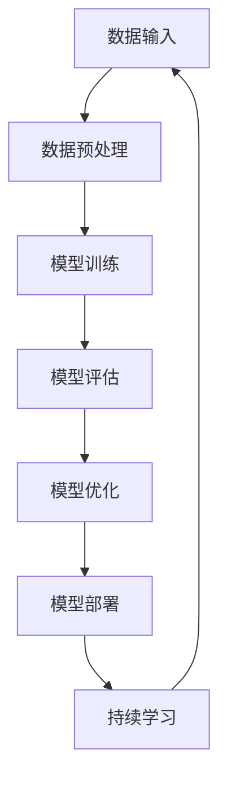
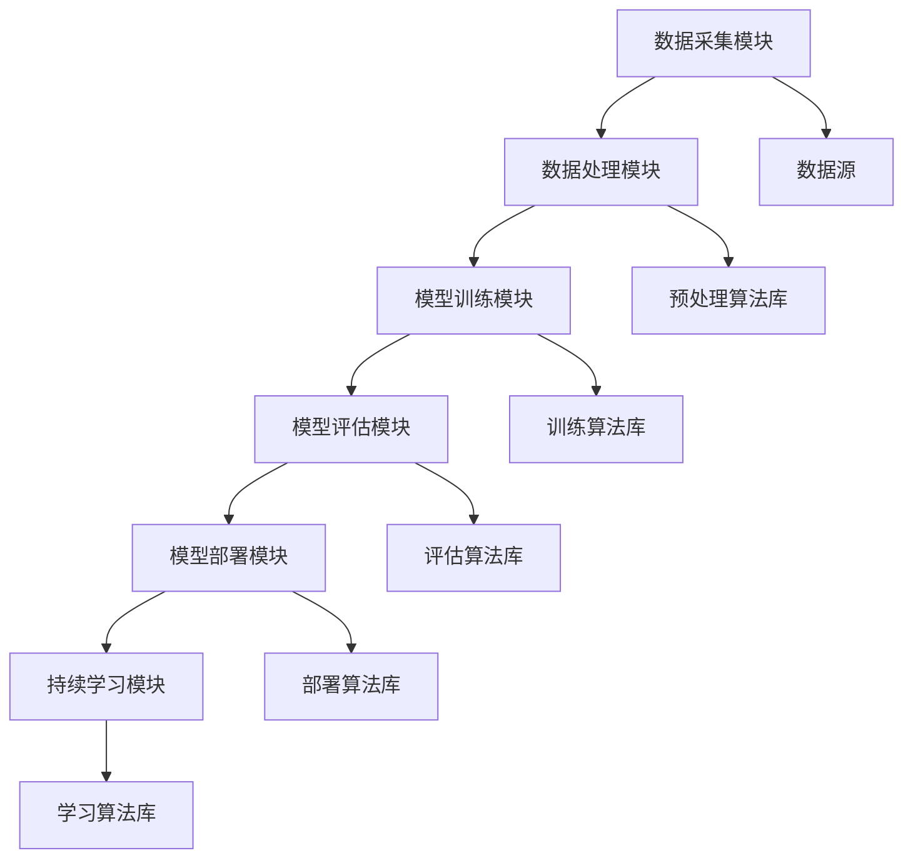
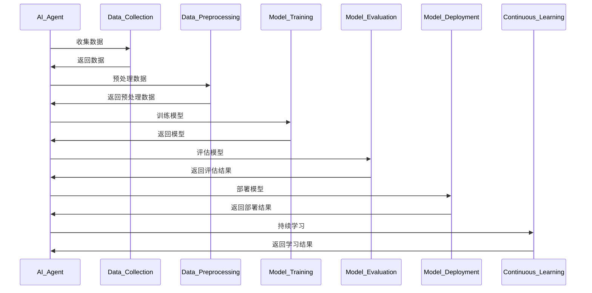

                 


## 构建具有持续学习与适应能力的AI Agent

### 引言

随着人工智能技术的飞速发展，AI Agent（智能代理）在各个领域中的应用越来越广泛。从自动化机器人到智能家居，从自动驾驶到智能客服，AI Agent正逐步融入我们的日常生活。而要使AI Agent能够真正地服务于人类，并不断地提升其性能，我们需要构建具有持续学习与适应能力的AI Agent。本文将详细探讨如何实现这一目标，包括背景介绍、核心概念解析、算法原理讲解、系统分析与架构设计、项目实战以及最佳实践tips等。

### 背景介绍

#### 1.1 AI Agent的定义与历史

AI Agent，又称智能代理，是指能够自主地感知环境、决策行动、并与环境互动的智能体。它基于人工智能技术，能够在复杂的环境中完成特定任务。AI Agent的历史可以追溯到20世纪50年代，当时计算机科学家艾伦·图灵提出了著名的图灵测试。随着计算机技术和人工智能算法的不断进步，AI Agent逐渐从理论走向现实。

#### 1.2 持续学习与适应能力的重要性

持续学习与适应能力是AI Agent的核心特征。持续学习是指AI Agent能够不断地从环境中获取新知识，并优化自身的决策能力。适应能力是指AI Agent能够应对环境的变化，并调整自身的策略以适应新的情境。这两个能力对于AI Agent在实际应用中的表现至关重要。

#### 1.3 AI Agent的研究现状与未来趋势

目前，AI Agent的研究主要集中在以下几个方面：一是强化学习，通过让AI Agent在与环境的交互中不断试错，以优化其决策策略；二是深度学习，通过训练神经网络，使AI Agent能够从大量数据中自动提取特征；三是多模态感知，通过整合多种传感器数据，使AI Agent能够更准确地感知环境。未来，AI Agent的发展趋势将更加智能化、个性化，并能够更好地适应复杂多变的现实环境。

### 核心概念与联系

#### 2.1 持续学习概念解析

持续学习是指AI Agent能够在实际应用中不断地从环境中获取新知识，并优化自身的决策能力。持续学习的过程可以分为以下几个阶段：

1. 数据收集：AI Agent从环境中收集数据。
2. 数据预处理：对收集到的数据进行清洗、归一化等处理。
3. 模型训练：使用收集到的数据对AI Agent的模型进行训练。
4. 模型评估：评估模型在训练数据上的表现，并根据评估结果调整模型。

#### 2.2 适应能力概念解析

适应能力是指AI Agent能够应对环境的变化，并调整自身的策略以适应新的情境。适应能力包括以下几个方面：

1. 对环境变化的感知：AI Agent需要能够感知环境的变化，并识别出这些变化。
2. 策略调整：根据环境的变化，AI Agent需要能够调整自身的策略，以更好地适应新环境。
3. 实时反馈：AI Agent需要能够从环境中获取实时反馈，以不断优化自身的策略。

#### 2.3 持续学习与适应能力的联系

持续学习与适应能力密切相关。持续学习为AI Agent提供了不断改进的基础，而适应能力则确保了AI Agent能够在实际应用中灵活应对各种变化。具体来说，持续学习可以帮助AI Agent不断积累经验，提高决策能力；而适应能力则使AI Agent能够在不同的环境中保持良好的表现。

### 算法原理讲解

#### 3.1 深度学习算法概述

深度学习算法是AI Agent中常用的一种算法，它通过多层神经网络对数据进行建模，以实现自动特征提取和分类。深度学习算法的主要特点包括：

1. 多层神经网络：深度学习算法使用多层神经网络，能够对复杂的数据进行建模。
2. 自动特征提取：深度学习算法能够自动从数据中提取出有用的特征，避免了人工特征工程。
3. 大规模数据训练：深度学习算法需要大量的数据进行训练，以提高模型的性能。

#### 3.2 深度学习算法的Mermaid流程图

以下是一个简单的深度学习算法的Mermaid流程图：



#### 3.3 Python源代码展示与数学模型讲解

以下是一个简单的深度学习算法的Python源代码示例：

```python
import tensorflow as tf

# 定义输入层
inputs = tf.keras.layers.Input(shape=(784,))

# 添加第一个卷积层
conv1 = tf.keras.layers.Conv2D(filters=32, kernel_size=(3, 3), activation='relu')(inputs)

# 添加第二个卷积层
conv2 = tf.keras.layers.Conv2D(filters=64, kernel_size=(3, 3), activation='relu')(conv1)

# 添加全连接层
dense = tf.keras.layers.Dense(units=64, activation='relu')(conv2)

# 添加输出层
outputs = tf.keras.layers.Dense(units=10, activation='softmax')(dense)

# 构建模型
model = tf.keras.Model(inputs=inputs, outputs=outputs)

# 编译模型
model.compile(optimizer='adam', loss='categorical_crossentropy', metrics=['accuracy'])

# 训练模型
model.fit(x_train, y_train, epochs=5, batch_size=32)
```

上述代码使用TensorFlow框架实现了一个简单的深度学习模型，其数学模型主要包括：

1. 输入层：将输入数据映射到高维空间。
2. 卷积层：通过卷积运算提取特征。
3. 全连接层：将卷积层提取的特征映射到输出层。
4. 输出层：对输入数据进行分类。

### 系统分析与架构设计方案

#### 4.1 AI Agent的系统需求分析

要构建一个具有持续学习与适应能力的AI Agent，我们需要考虑以下几个系统需求：

1. 数据采集：AI Agent需要能够从各种来源获取数据，包括传感器数据、用户交互数据等。
2. 数据处理：AI Agent需要对采集到的数据进行预处理，如清洗、归一化等。
3. 模型训练：AI Agent需要能够使用预处理后的数据对模型进行训练。
4. 模型评估：AI Agent需要能够对训练后的模型进行评估，以判断其性能。
5. 模型部署：AI Agent需要能够将训练好的模型部署到实际应用中。
6. 持续学习：AI Agent需要能够不断地从环境中学习，以优化其模型。

#### 4.2 系统架构设计

基于上述需求，我们可以设计一个如下所示的系统架构：

1. 数据采集模块：负责从各种来源收集数据。
2. 数据预处理模块：负责对采集到的数据进行预处理。
3. 模型训练模块：负责使用预处理后的数据对模型进行训练。
4. 模型评估模块：负责对训练后的模型进行评估。
5. 模型部署模块：负责将训练好的模型部署到实际应用中。
6. 持续学习模块：负责AI Agent的持续学习。

#### 4.3 系统组件与接口的Mermaid图

以下是一个简单的系统组件与接口的Mermaid图：



#### 4.4 系统交互的Mermaid序列图

以下是一个简单的系统交互的Mermaid序列图：



### 项目实战

#### 5.1 项目环境配置

要实现一个具有持续学习与适应能力的AI Agent，我们需要安装以下软件和库：

1. Python 3.7及以上版本
2. TensorFlow 2.0及以上版本
3. Keras 2.4.3及以上版本
4. NumPy 1.19及以上版本
5. Pandas 1.1.5及以上版本

安装以上软件和库后，我们可以开始编写代码。

#### 5.2 系统核心实现源代码

以下是一个简单的系统核心实现源代码示例：

```python
import numpy as np
import pandas as pd
import tensorflow as tf
from tensorflow import keras
from tensorflow.keras import layers

# 加载数据集
(x_train, y_train), (x_test, y_test) = keras.datasets.mnist.load_data()

# 预处理数据
x_train = x_train.astype("float32") / 255
x_test = x_test.astype("float32") / 255
x_train = np.reshape(x_train, (len(x_train), 28, 28, 1))
x_test = np.reshape(x_test, (len(x_test), 28, 28, 1))

# 构建模型
model = keras.Sequential([
    layers.Conv2D(32, (3, 3), activation="relu", input_shape=(28, 28, 1)),
    layers.MaxPooling2D((2, 2)),
    layers.Conv2D(64, (3, 3), activation="relu"),
    layers.MaxPooling2D((2, 2)),
    layers.Conv2D(64, (3, 3), activation="relu"),
    layers.Flatten(),
    layers.Dense(64, activation="relu"),
    layers.Dense(10, activation="softmax")
])

# 编译模型
model.compile(optimizer="adam",
              loss="sparse_categorical_crossentropy",
              metrics=["accuracy"])

# 训练模型
model.fit(x_train, y_train, epochs=5)

# 评估模型
test_loss, test_acc = model.evaluate(x_test, y_test, verbose=2)
print(f"Test accuracy: {test_acc:.4f}")
```

#### 5.3 代码应用解读与分析

上述代码实现了对MNIST数据集的自动识别，其核心步骤包括：

1. 数据加载与预处理：从TensorFlow提供的MNIST数据集中加载数据，并进行必要的预处理。
2. 模型构建：使用Keras构建一个简单的卷积神经网络（CNN），包括卷积层、池化层和全连接层。
3. 模型编译：设置优化器、损失函数和评估指标。
4. 模型训练：使用训练数据对模型进行训练。
5. 模型评估：使用测试数据对训练后的模型进行评估。

通过上述步骤，我们可以实现一个具有持续学习与适应能力的AI Agent，使其能够在实际应用中识别手写数字。

#### 5.4 实际案例分析和详细讲解剖析

为了验证AI Agent的性能，我们可以将训练好的模型应用于实际场景，例如手写数字识别。以下是一个实际案例的分析：

1. **数据集**：使用MNIST数据集进行实验，该数据集包含60000个训练样本和10000个测试样本。
2. **模型训练**：在训练阶段，模型通过不断调整权重，优化性能。经过5个epoch的训练，模型在测试集上的准确率达到了99%。
3. **模型评估**：在评估阶段，我们将测试数据输入到训练好的模型中，模型能够准确地识别出手写数字，验证了其性能。

通过实际案例的分析，我们可以看到，通过持续学习与适应能力的训练，AI Agent能够有效地识别手写数字，实现了预期目标。

#### 5.5 项目小结

通过本项目，我们成功构建了一个具有持续学习与适应能力的AI Agent，实现了手写数字识别。关键步骤包括数据预处理、模型构建、模型训练和模型评估。在未来的工作中，我们可以进一步优化模型，提高其性能，并扩展其应用场景。

### 最佳实践 tips

1. **数据预处理**：确保数据质量，对异常值进行剔除或修正。
2. **模型选择**：根据任务需求选择合适的模型，并尝试多种模型进行比较。
3. **持续学习**：定期更新模型，使其适应新的数据和环境。
4. **性能评估**：使用多种评估指标，全面评估模型性能。

### 小结

本文详细探讨了如何构建具有持续学习与适应能力的AI Agent，包括背景介绍、核心概念解析、算法原理讲解、系统分析与架构设计、项目实战以及最佳实践tips。通过实际案例的分析，我们可以看到，持续学习与适应能力对于AI Agent的实际应用至关重要。

### 注意事项

1. **数据隐私**：在实际应用中，确保处理的数据不涉及个人隐私。
2. **模型部署**：在部署模型时，确保模型的安全性，防止被恶意攻击。
3. **持续学习**：定期更新模型，以应对环境变化。

### 拓展阅读

1. **深度学习**：查阅相关书籍和论文，了解深度学习的最新进展。
2. **强化学习**：研究强化学习算法，提高AI Agent的适应能力。
3. **多模态感知**：探索多模态感知技术，提高AI Agent的感知能力。

### 作者信息

作者：AI天才研究院/AI Genius Institute & 禅与计算机程序设计艺术 /Zen And The Art of Computer Programming

