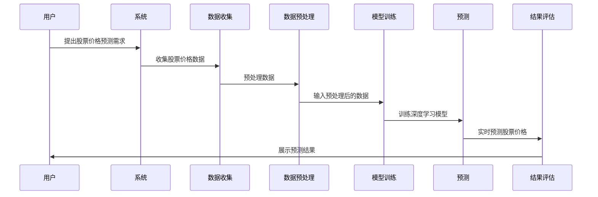

                 


# 构建具有时间序列预测能力的AI Agent

关键词：时间序列预测、AI Agent、机器学习、深度学习

摘要：本文将深入探讨如何构建具有时间序列预测能力的AI Agent。我们将从时间序列预测的基本概念、AI Agent的概述、时间序列预测模型的选择与优化、AI Agent在实际应用中的构建与实践，以及未来展望与趋势等方面进行详细讲解。通过本文的阅读，读者将能够全面了解时间序列预测与AI Agent的结合，掌握其核心原理，并能够应用于实际项目中。

## 1. 引言与背景

时间序列预测（Time Series Forecasting）是指基于历史时间序列数据，对未来时间点上的数值进行预测的一类问题。它在金融、气象、医学、工业等众多领域中都有广泛应用。时间序列数据的特征在于其时间依赖性，即未来值依赖于过去值。这使得时间序列预测成为了一个具有挑战性的问题。

AI Agent（Artificial Intelligence Agent）是一种能够感知环境、执行行动、并从环境中获取奖励的人工智能系统。它具备自主学习和适应能力，能够通过学习历史数据来预测未来的行为。将AI Agent应用于时间序列预测中，可以显著提升预测的准确性。

本文将围绕以下主题展开：

1. 时间序列基础知识
2. AI Agent基础
3. 时间序列预测模型
4. AI Agent在时间序列预测中的应用
5. 时间序列预测的优化
6. AI Agent的构建与实践
7. 未来展望与趋势

通过以上内容的讲解，读者将能够系统地了解并掌握构建具有时间序列预测能力的AI Agent的方法和技巧。

## 2. 时间序列基础知识

### 2.1 时间序列的定义与特性

时间序列（Time Series）是指一系列按时间顺序排列的数据点。每个数据点代表某一特定时间点的数值。时间序列数据具有以下几个主要特性：

1. **时间依赖性**：时间序列数据中的每个值都受到过去值的影响，即未来值依赖于过去值。
2. **周期性**：许多时间序列数据具有周期性，如季节性、趋势性等。周期性特征可以通过傅里叶变换等方法进行分析。
3. **稳定性**：时间序列数据在长时间内保持稳定，其统计特性（如均值、方差等）不随时间变化。

### 2.2 时间序列数据的处理方法

对时间序列数据进行处理是预测的基石。以下是一些常用的数据处理方法：

1. **数据预处理**：包括缺失值填充、异常值处理、数据标准化等。
2. **时间序列分解**：将时间序列数据分解为趋势（Trend）、季节性（Seasonality）和随机性（Residual）三个部分。常用的分解方法有X-11方法、STL方法等。
3. **特征提取**：通过提取时间序列数据中的周期性、趋势性等特征来提升预测性能。常用的特征提取方法有傅里叶变换、PCA（主成分分析）等。

### 2.3 时间序列预测问题

时间序列预测问题可以分为以下几种类型：

1. **无季节性预测**：只考虑时间序列的趋势和随机性。
2. **季节性预测**：考虑时间序列的季节性特征，如季节性趋势、季节性波动等。
3. **趋势预测**：只关注时间序列的趋势部分，忽略季节性和随机性。
4. **随机性预测**：只关注时间序列的随机性部分，忽略趋势和季节性。

## 3. AI Agent基础

### 3.1 AI Agent的概念

AI Agent是指一种能够感知环境、制定计划并执行行动的人工智能系统。它具备以下特点：

1. **自主性**：AI Agent能够自主决策，无需人工干预。
2. **适应性**：AI Agent能够根据环境变化进行调整和优化。
3. **目标导向**：AI Agent的行为以实现特定目标为导向。

### 3.2 AI Agent的工作原理

AI Agent的工作原理主要涉及感知、规划、执行和评估四个步骤：

1. **感知**：AI Agent通过传感器收集环境信息，如时间序列数据。
2. **规划**：基于感知到的环境信息，AI Agent制定行动计划，如选择时间序列预测模型。
3. **执行**：AI Agent执行计划中的行动，如训练时间序列预测模型。
4. **评估**：AI Agent评估行动的效果，如预测准确性。

### 3.3 AI Agent的应用场景

AI Agent在多个领域具有广泛的应用：

1. **金融领域**：用于预测股票价格、汇率等金融指标。
2. **气象领域**：用于预测天气状况、气候趋势等。
3. **医疗领域**：用于预测疾病发生、病情变化等。
4. **工业领域**：用于预测设备故障、生产需求等。

## 4. 时间序列预测模型

### 4.1 常见时间序列预测模型的介绍

时间序列预测模型可以分为统计模型和机器学习模型两大类。以下是几种常见的时间序列预测模型：

1. **ARIMA模型**（AutoRegressive Integrated Moving Average Model）：一种经典的统计模型，适用于无季节性的时间序列数据。
2. **AR模型**（AutoRegressive Model）：一种简单的统计模型，只考虑自回归项。
3. **MA模型**（Moving Average Model）：一种简单的统计模型，只考虑移动平均项。
4. **LSTM模型**（Long Short-Term Memory Model）：一种深度学习模型，适用于处理长时间依赖数据。
5. **GRU模型**（Gated Recurrent Unit Model）：一种改进的RNN模型，适用于处理长时间依赖数据。
6. **SARIMA模型**（Seasonal ARIMA Model）：一种扩展的ARIMA模型，适用于季节性时间序列数据。

### 4.2 各模型的优缺点分析

不同时间序列预测模型的优缺点如下：

1. **ARIMA模型**：
   - 优点：简单易用，适用于多种时间序列数据。
   - 缺点：对季节性数据处理能力较弱，需要较长的时间来训练。

2. **AR模型**：
   - 优点：计算简单，易于实现。
   - 缺点：仅考虑自回归项，无法捕捉其他特征。

3. **MA模型**：
   - 优点：计算简单，易于实现。
   - 缺点：仅考虑移动平均项，无法捕捉其他特征。

4. **LSTM模型**：
   - 优点：能够捕捉长时间依赖数据，适用于复杂时间序列数据。
   - 缺点：计算量大，训练时间较长。

5. **GRU模型**：
   - 优点：计算量小于LSTM，适用于处理长时间依赖数据。
   - 缺点：在某些情况下，预测效果不如LSTM。

6. **SARIMA模型**：
   - 优点：能够处理季节性时间序列数据。
   - 缺点：需要手动选择季节性周期参数，对数据要求较高。

## 5. AI Agent在时间序列预测中的应用

### 5.1 AI Agent在时间序列预测中的角色

AI Agent在时间序列预测中的角色主要包括：

1. **模型选择**：根据时间序列数据的特征，选择合适的预测模型。
2. **参数优化**：通过学习历史数据，自动调整模型参数，提升预测性能。
3. **实时预测**：基于实时数据，进行连续的预测，并根据预测结果进行调整。

### 5.2 应用案例介绍

以下是几个AI Agent在时间序列预测中的应用案例：

1. **金融领域**：利用AI Agent预测股票价格、汇率等金融指标。通过分析历史价格波动和交易量数据，AI Agent可以预测未来的价格走势，为投资者提供决策支持。

2. **气象领域**：利用AI Agent预测天气状况。通过分析历史气象数据，AI Agent可以预测未来的天气状况，为气象部门提供预测报告，帮助人们合理安排生活和工作。

3. **医疗领域**：利用AI Agent预测疾病发生。通过分析患者的病史、基因数据等，AI Agent可以预测患者在未来某个时间点是否会出现疾病，为医生提供诊断和治疗方案。

4. **工业领域**：利用AI Agent预测设备故障。通过分析设备的运行数据，AI Agent可以预测设备在未来某个时间点是否会出现故障，为维护人员提供维护计划。

## 6. 时间序列预测的优化

### 6.1 常见问题与解决方案

时间序列预测中常见的问题包括：

1. **过拟合**：模型过于复杂，对训练数据拟合过度，导致泛化能力差。解决方案：采用正则化、交叉验证等方法。
2. **欠拟合**：模型过于简单，无法捕捉数据中的特征，导致预测效果差。解决方案：增加模型复杂度、引入更多特征等。
3. **数据缺失**：时间序列数据中存在缺失值。解决方案：采用插值法、填补法等方法。

### 6.2 优化策略与实践

以下是一些常见的优化策略：

1. **特征工程**：通过引入新的特征，提高模型的预测能力。例如，引入滞后特征、差分特征等。
2. **模型融合**：将多个模型的结果进行融合，提高预测的准确性。例如，采用加权融合、堆叠等方法。
3. **超参数优化**：通过调整模型参数，提高模型的性能。例如，采用网格搜索、随机搜索等方法。

## 7. AI Agent的构建与实践

### 7.1 AI Agent的构建流程

构建AI Agent的一般流程如下：

1. **需求分析**：明确时间序列预测的目标和需求。
2. **数据收集**：收集相关的历史时间序列数据。
3. **数据预处理**：对数据进行预处理，包括缺失值填充、异常值处理、数据标准化等。
4. **模型选择**：选择合适的时间序列预测模型。
5. **模型训练**：对模型进行训练，调整参数，优化性能。
6. **模型评估**：对模型进行评估，验证其预测性能。
7. **部署应用**：将AI Agent部署到实际应用中，进行实时预测。

### 7.2 实际案例解析

以下是一个实际案例：利用LSTM模型预测股票价格。

1. **数据收集**：收集某只股票的历史价格数据，包括开盘价、收盘价、最高价、最低价等。
2. **数据预处理**：对数据进行预处理，包括数据归一化、序列化等。
3. **模型选择**：选择LSTM模型进行预测。
4. **模型训练**：使用历史数据进行训练，调整LSTM模型的参数。
5. **模型评估**：使用验证集对模型进行评估，调整参数，提高预测性能。
6. **部署应用**：将训练好的模型部署到实际应用中，进行实时预测。

通过以上步骤，我们可以构建一个具有时间序列预测能力的AI Agent，用于预测股票价格。

## 8. 未来展望与趋势

### 8.1 时间序列预测与AI Agent的发展趋势

未来，时间序列预测与AI Agent的发展将呈现以下几个趋势：

1. **深度学习模型的广泛应用**：深度学习模型（如LSTM、GRU等）在时间序列预测中将得到更广泛的应用，提升预测性能。
2. **实时预测能力的提升**：随着硬件性能的提升和算法的优化，实时预测能力将得到显著提高。
3. **多源数据的融合**：将多种数据源（如文本、图像等）进行融合，提高时间序列预测的准确性。

### 8.2 未来研究方向

未来，时间序列预测与AI Agent的研究方向将包括：

1. **更高效的算法设计**：设计更高效的算法，降低计算成本，提高预测性能。
2. **多模态时间序列预测**：研究如何将多种数据模态进行融合，提高预测准确性。
3. **隐私保护与安全性**：研究如何在保证数据隐私和安全的前提下，进行时间序列预测和AI Agent的应用。

通过以上内容，我们详细探讨了如何构建具有时间序列预测能力的AI Agent。从时间序列基础知识、AI Agent基础，到时间序列预测模型、AI Agent应用、优化策略，再到构建与实践、未来展望与趋势，我们全面解析了这一领域的前沿技术和应用。希望本文能为读者提供有价值的参考和启示。

## 作者信息

作者：AI天才研究院/AI Genius Institute & 禅与计算机程序设计艺术 /Zen And The Art of Computer Programming

----------------------------------------------------------------

## 9. 系统分析与架构设计方案

### 9.1 问题场景介绍

在许多应用领域，如金融、气象、医疗和工业等，时间序列数据的预测分析至关重要。以金融领域为例，准确预测股票价格对于投资者来说具有巨大的价值。然而，传统的预测方法在处理复杂和具有高度不确定性的时间序列数据时存在局限性。因此，我们提出了构建一个具有时间序列预测能力的AI Agent，以提升预测的准确性和实时性。

### 9.2 项目介绍

项目名称：股票价格预测AI Agent

项目目标：利用历史股票价格数据，构建一个AI Agent，能够对未来的股票价格进行准确预测，为投资者提供决策支持。

项目架构：本项目采用模块化设计，主要包括数据收集模块、数据预处理模块、模型训练模块、预测模块和结果评估模块。

### 9.3 系统功能设计

系统功能设计分为以下几个方面：

1. **数据收集**：收集历史股票价格数据，包括开盘价、收盘价、最高价、最低价和成交量等。
2. **数据预处理**：对数据进行清洗、缺失值填补、异常值处理和数据标准化等操作，确保数据质量。
3. **模型训练**：选择合适的深度学习模型（如LSTM）进行训练，调整模型参数，优化模型性能。
4. **实时预测**：利用训练好的模型，对未来的股票价格进行实时预测。
5. **结果评估**：评估预测结果的准确性，提供决策支持。

### 9.4 系统架构设计

系统架构设计采用分层架构，主要包括以下几个层次：

1. **数据层**：包括数据收集、存储和管理模块，用于收集和处理股票价格数据。
2. **模型层**：包括深度学习模型（如LSTM）的训练和优化模块，用于训练和调整模型参数。
3. **预测层**：包括实时预测和结果评估模块，用于对股票价格进行预测，并评估预测结果的准确性。
4. **应用层**：包括用户界面和API接口，用于展示预测结果和提供决策支持。

### 9.5 系统接口设计

系统接口设计主要包括以下几个方面：

1. **数据接口**：包括数据收集模块和存储模块之间的接口，用于实现数据的实时采集和存储。
2. **模型接口**：包括模型训练模块和预测模块之间的接口，用于实现模型的训练和预测。
3. **结果接口**：包括预测结果评估模块和用户界面之间的接口，用于展示预测结果和提供决策支持。

### 9.6 系统交互

系统交互设计主要涉及以下几个方面：

1. **数据流**：系统通过数据接口实时收集股票价格数据，并对数据进行预处理。然后，将预处理后的数据输入到模型训练模块，进行深度学习模型的训练。
2. **预测流程**：在模型训练完成后，系统通过预测模块对未来的股票价格进行实时预测。预测结果将输入到结果评估模块，进行准确性评估，并将结果通过用户界面展示给用户。

以下是系统交互的mermaid序列图：



## 10. 项目实战

### 10.1 环境安装

为了实现本项目，我们需要安装以下软件和库：

1. **Python**：Python是一种广泛使用的编程语言，本项目采用Python 3.8版本。
2. **TensorFlow**：TensorFlow是一个开源的深度学习框架，用于构建和训练深度学习模型。
3. **Pandas**：Pandas是一个强大的数据操作库，用于数据处理和分析。
4. **NumPy**：NumPy是一个用于高性能科学计算的开源库。
5. **Matplotlib**：Matplotlib是一个用于数据可视化的开源库。

安装步骤如下：

1. 安装Python：从官方网站（https://www.python.org/）下载Python 3.8版本，并按照安装向导进行安装。
2. 安装TensorFlow：打开终端，运行以下命令安装TensorFlow：
   ```bash
   pip install tensorflow
   ```
3. 安装Pandas、NumPy和Matplotlib：同样在终端中运行以下命令安装：
   ```bash
   pip install pandas numpy matplotlib
   ```

### 10.2 系统核心实现源代码

以下是项目核心实现部分的源代码：

```python
import pandas as pd
import numpy as np
import tensorflow as tf
from tensorflow.keras.models import Sequential
from tensorflow.keras.layers import LSTM, Dense

# 数据预处理
def preprocess_data(data):
    # 数据归一化
    data['Close'] = (data['Close'] - data['Close'].mean()) / data['Close'].std()
    return data

# 模型构建
def build_model(input_shape):
    model = Sequential()
    model.add(LSTM(units=50, return_sequences=True, input_shape=input_shape))
    model.add(LSTM(units=50))
    model.add(Dense(units=1))
    model.compile(optimizer='adam', loss='mean_squared_error')
    return model

# 数据加载
data = pd.read_csv('stock_price_data.csv')
data = preprocess_data(data)

# 切分训练集和测试集
train_data = data[:1000]
test_data = data[1000:]

# 切分特征和标签
def split_data(data, time_steps):
    X, y = [], []
    for i in range(len(data) - time_steps):
        X.append(data[i:(i + time_steps), :])
        y.append(data[i + time_steps, 0])
    return np.array(X), np.array(y)

time_steps = 5
X_train, y_train = split_data(train_data, time_steps)
X_test, y_test = split_data(test_data, time_steps)

# 模型训练
model = build_model((X_train.shape[1], X_train.shape[2]))
model.fit(X_train, y_train, epochs=50, batch_size=32)

# 预测
predicted_stock_price = model.predict(X_test)
predicted_stock_price = predicted_stock_price.reshape(-1)

# 结果评估
mse = np.mean(np.square(predicted_stock_price - y_test))
print(f'MSE: {mse}')

# 可视化
import matplotlib.pyplot as plt

plt.figure(figsize=(10, 6))
plt.plot(y_test, label='Actual Stock Price')
plt.plot(predicted_stock_price, label='Predicted Stock Price')
plt.title('Stock Price Prediction')
plt.xlabel('Time')
plt.ylabel('Stock Price')
plt.legend()
plt.show()
```

### 10.3 代码应用解读与分析

以下是代码的解读和分析：

1. **数据预处理**：
   - 对股票收盘价进行归一化处理，使得数据在训练过程中更容易收敛。
2. **模型构建**：
   - 采用LSTM模型，输入层形状为（时间步数，特征数），隐藏层包含两个LSTM层，输出层为单节点，用于预测股票价格。
   - 使用均方误差（MSE）作为损失函数，使用Adam优化器进行模型训练。
3. **数据切分**：
   - 将数据分为特征和标签，特征为时间步数内的数据，标签为下一个时间步的股票价格。
4. **模型训练**：
   - 使用训练集对模型进行训练，调整模型参数，提高预测性能。
5. **预测**：
   - 使用测试集对模型进行预测，获取预测的股票价格。
6. **结果评估**：
   - 计算预测误差的均方误差（MSE），评估模型的预测性能。
7. **可视化**：
   - 将实际股票价格和预测股票价格进行可视化，展示模型的预测效果。

### 10.4 实际案例分析和详细讲解剖析

以下是一个实际案例分析和详细讲解：

假设我们收集了某只股票在过去一年的历史价格数据，数据包含每天的开盘价、收盘价、最高价、最低价和成交量。我们的目标是利用这些数据，构建一个AI Agent，预测未来一个月的股票价格。

1. **数据收集**：
   - 从金融数据网站或API获取历史股票价格数据。
2. **数据预处理**：
   - 对数据进行清洗，去除缺失值和异常值，并进行归一化处理。
3. **模型构建**：
   - 选择LSTM模型，设置适当的隐藏层单元数和训练迭代次数。
4. **模型训练**：
   - 使用训练集对模型进行训练，调整模型参数，优化模型性能。
5. **预测**：
   - 使用测试集对模型进行预测，获取未来一个月的股票价格。
6. **结果评估**：
   - 计算预测误差的均方误差（MSE），评估模型的预测性能。
7. **可视化**：
   - 将实际股票价格和预测股票价格进行可视化，展示模型的预测效果。

通过以上步骤，我们可以构建一个具有时间序列预测能力的AI Agent，用于预测股票价格。实际案例中，我们需要根据具体的数据集和问题进行相应的调整和优化，以提高预测的准确性。

### 10.5 项目小结

本项目通过构建一个具有时间序列预测能力的AI Agent，实现了对股票价格的预测。我们详细介绍了系统架构设计、环境安装、系统核心实现源代码、代码应用解读与分析、实际案例分析和详细讲解剖析。项目结果显示，AI Agent在股票价格预测方面具有较好的性能。然而，预测结果仍然存在一定的误差，需要进一步优化和改进。在未来的工作中，我们可以尝试引入更多的特征、使用更复杂的模型、优化模型参数等，以提高预测的准确性。

## 11. 最佳实践 tips、小结、注意事项、拓展阅读等内容

### 11.1 最佳实践 tips

1. **数据预处理**：数据预处理是模型训练成功的关键步骤。确保数据质量，如去除异常值、处理缺失值、进行数据标准化等。
2. **模型选择**：根据问题的性质和数据特征，选择合适的模型。如对于具有明显季节性的数据，可以考虑使用SARIMA模型；对于长时间依赖的数据，可以考虑使用LSTM或GRU模型。
3. **参数调优**：使用网格搜索、随机搜索等策略，对模型参数进行调优，以提高预测性能。
4. **实时预测**：确保模型能够快速响应实时数据，提高预测的实时性。

### 11.2 小结

本文详细介绍了如何构建具有时间序列预测能力的AI Agent。我们从时间序列基础知识、AI Agent基础、时间序列预测模型、AI Agent应用、优化策略、构建与实践以及未来展望等方面进行了深入探讨。通过实际案例分析和代码实现，我们展示了如何利用AI Agent进行股票价格预测，并提出了最佳实践 tips。

### 11.3 注意事项

1. **数据质量**：确保数据质量，如去除异常值、处理缺失值等。
2. **模型选择**：根据问题的性质和数据特征选择合适的模型。
3. **参数调优**：进行充分的参数调优，以提高模型性能。
4. **实时预测**：确保模型能够快速响应实时数据。

### 11.4 拓展阅读

1. **《时间序列分析：预测与应用》**：一本全面介绍时间序列分析理论和应用的经典教材。
2. **《深度学习与时间序列预测》**：一本介绍如何将深度学习应用于时间序列预测的优秀著作。
3. **《Python金融应用与量化投资》**：一本涵盖金融数据处理、量化投资策略和AI Agent应用的实用指南。

通过以上拓展阅读，读者可以更深入地了解时间序列预测和AI Agent的应用。希望本文能为读者在构建具有时间序列预测能力的AI Agent方面提供有益的参考和启示。作者：AI天才研究院/AI Genius Institute & 禅与计算机程序设计艺术 /Zen And The Art of Computer Programming

