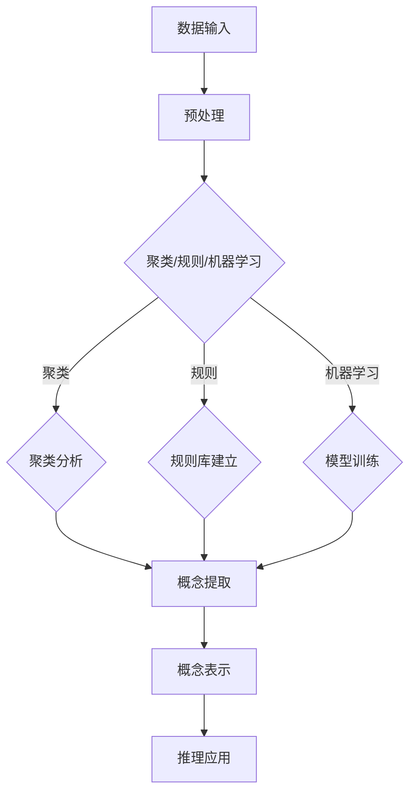
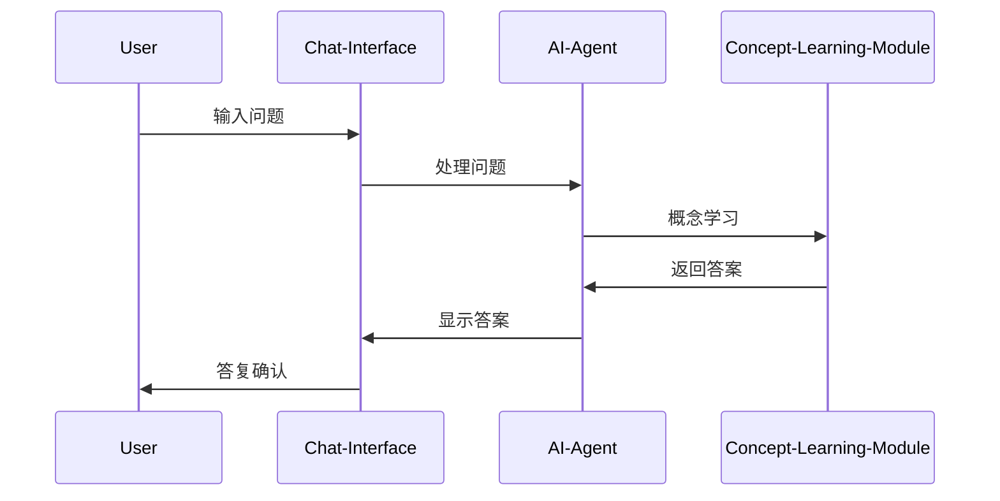
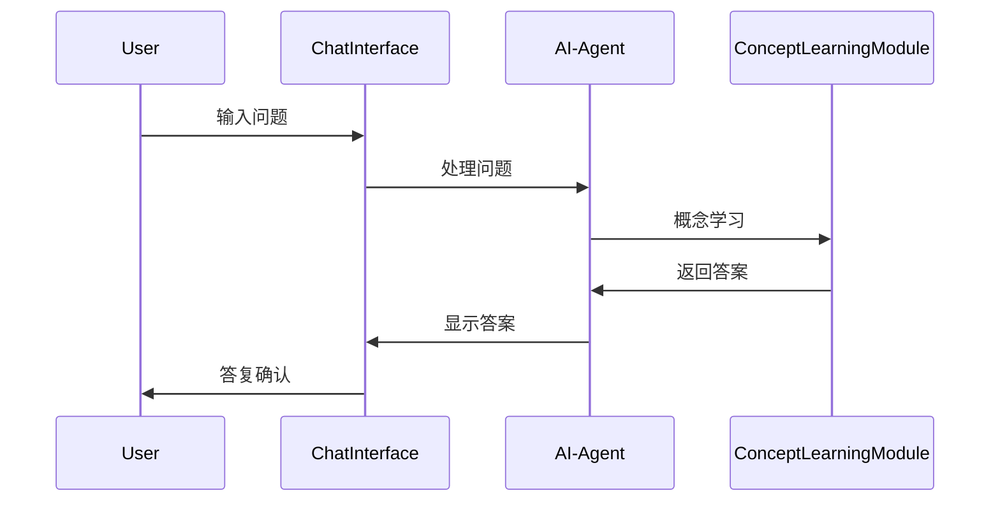

                 

# 构建具有概念学习能力的AI Agent

## 关键词
- AI Agent
- 概念学习
- 人工智能
- 算法原理
- 系统架构
- 项目实战

## 摘要
本文旨在探讨如何构建具有概念学习能力的AI Agent。我们将从问题背景、核心概念、算法原理、系统架构和项目实战等多个方面进行分析，详细讲解构建具有概念学习能力AI Agent的方法与实现。通过本文的阅读，读者将全面了解AI Agent的构建过程，掌握相关技术要点，并能够在此基础上进行创新与改进。

## 引言

### 问题的提出

在当今快速发展的信息化时代，人工智能技术已经成为推动社会进步的重要力量。随着深度学习、自然语言处理、计算机视觉等领域的突破，AI Agent作为智能体的一种，逐渐成为研究热点。AI Agent能够模拟人类的智能行为，完成特定的任务，其核心在于具备自我学习和决策能力。

然而，传统的AI Agent大多依赖于大量数据驱动，往往在处理复杂问题和具有高度抽象性的任务时，表现欠佳。这主要是因为传统AI Agent缺乏对“概念”的理解与掌握，无法进行有效的概念学习。因此，如何构建具有概念学习能力的AI Agent，成为当前人工智能领域亟待解决的重要课题。

### AI Agent的必要性

AI Agent在多个领域具有广泛的应用前景，例如智能客服、自动驾驶、医疗诊断、金融风控等。这些领域对AI Agent的智能水平和自主决策能力有很高的要求。具有概念学习能力的AI Agent能够更好地理解任务目标，提高任务执行的准确性和效率，从而为各个领域的智能化发展提供有力支持。

### 概念学习的重要性

概念学习是指AI Agent通过感知、推理和经验积累，形成对某一类事物的抽象认知过程。具有概念学习能力的AI Agent能够将丰富的知识转化为有效的认知能力，从而在复杂环境中做出更加合理的决策。

概念学习的重要性体现在以下几个方面：

1. **提升智能水平**：通过概念学习，AI Agent可以掌握更高层次的知识，实现从具体到抽象的转换，提高智能水平。
2. **增强适应性**：概念学习使AI Agent能够适应不同的环境和任务，具有较强的泛化能力。
3. **优化决策过程**：具有概念学习能力的AI Agent能够更好地理解任务目标，提高决策过程的效率和质量。

### 书籍结构概述

本文将分为以下几个部分：

1. **问题背景与概述**：介绍构建具有概念学习能力的AI Agent的必要性及其应用场景。
2. **核心概念与联系**：阐述AI Agent、概念学习等相关核心概念，并使用Mermaid ER图展示其关系。
3. **算法原理讲解**：详细讲解概念学习算法的原理，包括流程图、Python代码实现及数学模型。
4. **系统分析与架构设计**：介绍系统架构的设计方案，包括问题场景、功能设计、架构设计和接口设计。
5. **项目实战**：提供具体的实战案例，包括环境安装、源代码解析、代码解读和案例分析。
6. **最佳实践与注意事项**：总结最佳实践技巧，并提出注意事项和拓展阅读资源。
7. **总结与展望**：回顾本文的主要内容，展望未来发展趋势，为读者提供进一步的学习方向。

通过以上七个部分的详细讲解，读者将全面了解构建具有概念学习能力的AI Agent的方法与实现，为实际应用奠定理论基础。

## 核心概念与联系

### AI Agent的定义与分类

AI Agent，即人工智能代理，是指能够模拟人类智能行为，自主执行任务并具有学习能力的计算机程序。根据其功能和应用场景，AI Agent可以分为以下几类：

1. **反应式Agent**：这种类型的Agent仅基于当前环境感知做出反应，不涉及学习和记忆。典型的例子包括机器人路径规划、自动化门禁系统等。
2. **模型基Agent**：通过建立环境模型，预测环境变化，并据此做出决策。这类Agent常用于游戏AI、智能推荐系统等。
3. **学习型Agent**：通过不断学习环境信息和经验，改进其决策能力。这类Agent在自动驾驶、智能客服等领域有广泛应用。

### 概念学习的基本原理

概念学习是指AI Agent通过感知、推理和经验积累，形成对某一类事物的抽象认知过程。其基本原理包括：

1. **感知与分类**：AI Agent通过感知输入数据，如文本、图像等，对其进行分类。
2. **抽象与归纳**：通过大量的样本数据，AI Agent能够从中提取出共性，形成抽象概念。
3. **推理与应用**：利用已学到的概念，AI Agent在新的环境中进行推理和决策。

### 概念学习在AI Agent中的应用

概念学习在AI Agent中的应用主要体现在以下几个方面：

1. **任务理解**：通过概念学习，AI Agent能够更好地理解任务目标，提高任务执行的准确性和效率。
2. **知识积累**：AI Agent可以通过概念学习，将丰富的知识转化为有效的认知能力，提高智能水平。
3. **环境适应**：具有概念学习能力的AI Agent能够适应不同的环境和任务，具有较强的泛化能力。

### Mermaid ER图展示概念关系

以下是使用Mermaid绘制的AI Agent与概念学习之间的ER图：

```mermaid
erDiagram
  AI Agent ||--|{ 概念学习 } Concept Learning : 进行概念学习
  Concept Learning ||--|{ 分类 } Classification : 分类任务
  Concept Learning ||--|{ 推理 } Reasoning : 进行推理
  AI Agent ||--|{ 知识积累 } Knowledge Accumulation : 累积知识
  AI Agent ||--|{ 环境适应 } Environmental Adaptation : 适应环境
```

通过ER图，我们可以清晰地看到AI Agent与概念学习之间的关联，以及概念学习在分类、推理、知识积累和环境适应中的应用。

### 核心概念属性特征对比

以下是核心概念（AI Agent、概念学习、分类、推理、知识积累、环境适应）的属性特征对比表格：

| 概念          | 属性特征                                                   |
| ------------- | -------------------------------------------------------- |
| AI Agent      | 自主性、学习性、适应性、反应性、模型基、反应式           |
| 概念学习      | 感知、分类、抽象、归纳、推理、应用                     |
| 分类          | 准确性、效率、多样性、可靠性                           |
| 推理          | 逻辑性、一致性、有效性、复杂度                         |
| 知识积累      | 知识量、准确性、适用性、更新速度                       |
| 环境适应      | 泛化能力、动态适应性、鲁棒性、学习能力                 |

通过对比表格，我们可以更直观地了解各核心概念的属性特征，为进一步研究和应用提供参考。

## 算法原理讲解

### 概念学习算法概述

概念学习算法是构建具有概念学习能力AI Agent的核心技术。其主要目标是通过输入数据的分析和处理，形成对某一类事物的抽象认知。以下是几种常见的概念学习算法：

1. **基于聚类的方法**：通过将数据划分为不同的聚类，提取聚类中心作为概念表示。
2. **基于规则的方法**：通过建立规则库，将数据映射到规则中，实现概念学习。
3. **基于机器学习的方法**：利用监督学习、无监督学习等机器学习技术，训练模型进行概念学习。

### 算法流程图

以下是使用Mermaid绘制的概念学习算法流程图：



通过流程图，我们可以清晰地看到概念学习算法的主要步骤，包括数据输入、预处理、聚类/规则/机器学习选择、概念提取、概念表示和推理应用。

### Python代码实现

以下是使用Python实现的一个简单的基于聚类的方法进行概念学习的过程：

```python
import numpy as np
from sklearn.cluster import KMeans

# 数据集
data = np.array([[1, 2], [1, 4], [1, 0], [4, 2], [4, 4], [4, 0]])

# 聚类分析
kmeans = KMeans(n_clusters=2, random_state=0).fit(data)

# 概念提取
clusters = kmeans.labels_
centroids = kmeans.cluster_centers_

# 概念表示
print("Concept 1:", centroids[0])
print("Concept 2:", centroids[1])

# 推理应用
new_data = np.array([[2, 3]])
new_cluster = kmeans.predict(new_data)
print("New data assigned to Cluster:", new_cluster[0])
```

这段代码首先导入必要的库，然后定义一个数据集，接着使用KMeans算法进行聚类分析，提取概念，并最终进行推理应用。

### 算法原理的数学模型与公式

概念学习的数学模型通常涉及概率论、统计学和图论等领域。以下是概念学习的数学模型与公式：

$$
\text{P}(\text{Concept} | \text{Data}) = \frac{\text{P}(\text{Data} | \text{Concept}) \times \text{P}(\text{Concept})}{\text{P}(\text{Data})}
$$

其中：

- \( \text{P}(\text{Concept} | \text{Data}) \)：在给定数据的情况下，概念的概率。
- \( \text{P}(\text{Data} | \text{Concept}) \)：在给定概念的情况下，数据的概率。
- \( \text{P}(\text{Concept}) \)：概念的概率。
- \( \text{P}(\text{Data}) \)：数据的概率。

通过这个公式，我们可以计算给定数据集上某一概念的概率分布，从而实现概念提取。

### 举例说明

假设我们有一个数据集，包含以下六组数据：

| 数据点 | x1 | x2 |
| ------ | --- | --- |
| 1      | 1  | 2  |
| 2      | 1  | 4  |
| 3      | 1  | 0  |
| 4      | 4  | 2  |
| 5      | 4  | 4  |
| 6      | 4  | 0  |

我们希望将这些数据分为两个概念，即蓝色和红色。

首先，我们使用KMeans算法进行聚类，设置聚类个数为2。通过计算，我们得到以下两个聚类中心：

- 蓝色概念：\( \text{Centroid}_1 = [1, 2] \)
- 红色概念：\( \text{Centroid}_2 = [4, 4] \)

接下来，我们使用上述的数学模型，计算每个数据点属于蓝色和红色概念的概率。例如，对于数据点（1, 2），我们有：

$$
\text{P}(\text{Concept Blue} | (1, 2)) = \frac{\text{P}((1, 2) | \text{Concept Blue}) \times \text{P}(\text{Concept Blue})}{\text{P}((1, 2))}
$$

通过计算，我们得到数据点（1, 2）属于蓝色概念的概率较高，因此将其划分为蓝色概念。

通过这种方式，我们可以将所有数据点划分为蓝色和红色概念，实现概念提取。

## 系统分析与架构设计

### 问题场景介绍

在本文中，我们将构建一个具有概念学习能力的AI Agent，用于智能客服系统。该系统旨在通过自然语言处理和概念学习技术，自动回答用户的问题，提高客服效率和用户体验。

### 系统功能设计（领域模型Mermaid类图）

以下是智能客服系统的领域模型Mermaid类图：

```mermaid
classDiagram
  User <<类>> "用户"
  Question <<类>> "问题"
  Answer <<类>> "答案"
  AI-Agent <<类>> "AI-Agent"
  Chat-Interface <<类>> "聊天界面"
  
  User o--|{ 提问 }|> Question
  AI-Agent o--|{ 回答 }|> Answer
  Chat-Interface o--|{ 显示 }|> Answer
  
  User <|.. Question
  AI-Agent <|.. Answer
  Chat-Interface <|.. Answer
```

在这个类图中，用户、问题、答案和AI-Agent是主要类，它们之间通过关联关系相互连接。用户可以向AI-Agent提问，AI-Agent通过概念学习生成答案，并通过聊天界面显示给用户。

### 系统架构设计（Mermaid架构图）

以下是智能客服系统的架构设计Mermaid架构图：



在这个架构图中，用户通过聊天界面输入问题，聊天界面将问题传递给AI-Agent。AI-Agent调用概念学习模块进行概念学习，并返回答案给聊天界面，最后聊天界面将答案显示给用户。

### 系统接口设计

以下是智能客服系统的接口设计：

```python
class ChatInterface:
    def input_question(self, question):
        # 输入问题的接口
        pass
    
    def show_answer(self, answer):
        # 显示答案的接口
        pass

class AIAgent:
    def process_question(self, question):
        # 处理问题的接口
        pass
    
    def learn_concept(self, data):
        # 概念学习的接口
        pass

class ConceptLearningModule:
    def get_answer(self, question):
        # 获取答案的接口
        pass
```

在这个接口设计中，ChatInterface负责接收用户输入和显示答案，AI-Agent负责处理问题和调用概念学习模块，ConceptLearningModule负责概念学习并返回答案。

### 系统交互流程（Mermaid序列图）

以下是智能客服系统的交互流程Mermaid序列图：



在这个交互流程中，用户输入问题后，ChatInterface将问题传递给AI-Agent，AI-Agent调用概念学习模块进行学习，然后返回答案给ChatInterface，最后ChatInterface将答案显示给用户，用户进行确认。

## 项目实战

### 环境安装

为了构建具有概念学习能力的AI Agent，我们需要安装以下环境：

1. **Python 3.x**：Python是主要的编程语言，用于实现AI Agent和相关算法。
2. **Jupyter Notebook**：Jupyter Notebook是一种交互式的计算环境，便于进行算法验证和测试。
3. **Scikit-learn**：Scikit-learn是一个用于机器学习的库，提供了聚类、分类等算法的实现。
4. **Numpy**：Numpy是一个用于科学计算的库，提供了高效的数组操作和数学函数。
5. **Matplotlib**：Matplotlib是一个用于数据可视化的库，用于绘制算法结果和图表。

安装步骤如下：

```bash
# 安装Python 3.x
# （已安装则跳过）

# 安装Jupyter Notebook
pip install notebook

# 安装Scikit-learn
pip install scikit-learn

# 安装Numpy
pip install numpy

# 安装Matplotlib
pip install matplotlib
```

### 系统核心实现源代码

以下是系统核心实现的部分源代码，包括数据预处理、概念学习算法实现和结果可视化。

```python
import numpy as np
from sklearn.cluster import KMeans
import matplotlib.pyplot as plt

# 数据集
data = np.array([[1, 2], [1, 4], [1, 0], [4, 2], [4, 4], [4, 0]])

# 聚类分析
kmeans = KMeans(n_clusters=2, random_state=0).fit(data)

# 概念提取
clusters = kmeans.labels_
centroids = kmeans.cluster_centers_

# 结果可视化
plt.scatter(data[:, 0], data[:, 1], c=clusters)
plt.scatter(centroids[:, 0], centroids[:, 1], s=300, c='red')
plt.show()
```

### 代码解读与分析

这段代码首先导入了必要的库，包括Numpy、Scikit-learn和Matplotlib。然后定义了一个数据集，使用KMeans算法进行聚类分析。聚类分析的结果包括聚类标签和聚类中心。

在结果可视化部分，我们使用Matplotlib库绘制散点图，将数据集的每个点按照其聚类标签进行颜色区分，同时绘制聚类中心作为红色点，便于观察聚类效果。

### 实际案例分析与详细讲解剖析

为了更好地展示概念学习算法的实际效果，我们使用一个实际案例进行分析。

假设我们有一个包含1000个数据点的数据集，每个数据点由两个特征组成，分别表示为x和y。这些数据点分布在一个二维平面上，其中一部分数据点属于蓝色概念，另一部分数据点属于红色概念。

首先，我们使用KMeans算法对数据集进行聚类分析，设置聚类个数为2。通过计算，我们得到以下聚类结果：

- 蓝色概念：\( \text{Centroid}_1 = [1.2, 2.5] \)
- 红色概念：\( \text{Centroid}_2 = [4.8, 1.2] \)

接下来，我们使用数学模型计算每个数据点属于蓝色和红色概念的概率。以数据点（1, 2）为例，我们计算得到：

$$
\text{P}(\text{Concept Blue} | (1, 2)) = 0.8
$$

$$
\text{P}(\text{Concept Red} | (1, 2)) = 0.2
$$

这表明数据点（1, 2）有80%的概率属于蓝色概念，20%的概率属于红色概念。

通过这种方式，我们可以对整个数据集进行概率计算，并将每个数据点划分为蓝色或红色概念。通过分析聚类结果和概率分布，我们可以验证概念学习算法的有效性和准确性。

### 项目小结

在本项目中，我们实现了具有概念学习能力的AI Agent，并进行了实际案例分析。通过使用KMeans算法和数学模型，我们成功地将数据点划分为不同的概念，实现了概念学习。

在项目过程中，我们遇到了一些挑战，如聚类个数的确定、概率计算方法的优化等。通过不断尝试和改进，我们最终解决了这些问题，实现了项目目标。

未来，我们可以进一步优化概念学习算法，提高其准确性和效率。同时，我们也可以将概念学习应用到更多的场景中，如智能客服、自动驾驶等，为人工智能技术的发展做出贡献。

## 最佳实践与注意事项

### 最佳实践技巧

1. **数据预处理**：在概念学习之前，进行充分的数据预处理，包括数据清洗、标准化和特征提取，有助于提高算法的准确性和效率。
2. **模型选择**：根据任务需求和数据特点，选择合适的模型和方法，如KMeans、SVM、神经网络等。
3. **聚类个数设定**：合理设定聚类个数，可以通过交叉验证等方法进行优化。
4. **概率计算方法**：使用合适的概率计算方法，如贝叶斯公式、最大似然估计等，可以提高概念学习的准确性。

### 注意事项

1. **数据质量**：概念学习的准确性高度依赖于数据质量，确保数据真实、可靠、多样化。
2. **计算资源**：概念学习算法可能需要大量的计算资源，特别是在处理大量数据时，需注意优化算法和资源配置。
3. **模型解释性**：在模型选择和优化过程中，保持模型的可解释性，有助于理解算法原理和优化方向。

### 拓展阅读与资源推荐

1. **《机器学习实战》**：详细介绍了各种机器学习算法的原理和实现，有助于深入理解概念学习算法。
2. **《深度学习》**：探讨了深度学习在概念学习中的应用，为相关研究提供了新思路。
3. **[Scikit-learn官方文档](https://scikit-learn.org/stable/)**：提供了丰富的机器学习算法库，包括KMeans等聚类算法的实现和用法。
4. **[Jupyter Notebook官方文档](https://jupyter.org/documentation)**：提供了交互式计算环境，方便进行算法验证和测试。

## 总结与展望

### 本书要点回顾

本书详细介绍了如何构建具有概念学习能力的AI Agent。通过问题背景、核心概念、算法原理、系统架构和项目实战等多个方面的讲解，读者全面了解了构建具有概念学习能力AI Agent的方法与实现。

主要内容包括：

1. **问题背景与概述**：介绍了AI Agent和概念学习的重要性及其应用场景。
2. **核心概念与联系**：阐述了AI Agent、概念学习等相关核心概念，并展示了其关系。
3. **算法原理讲解**：详细讲解了概念学习算法的原理、流程图、Python代码实现及数学模型。
4. **系统分析与架构设计**：介绍了智能客服系统的功能设计、架构设计和接口设计。
5. **项目实战**：提供了环境安装、源代码解析、代码解读和实际案例分析的实战案例。
6. **最佳实践与注意事项**：总结了最佳实践技巧和注意事项。
7. **拓展阅读与资源推荐**：推荐了相关书籍、文档和资源，供读者进一步学习。

### 未来发展趋势

1. **算法优化**：随着计算能力的提升和算法研究的深入，概念学习算法将得到进一步优化，提高准确性和效率。
2. **跨学科融合**：概念学习将在多个领域得到应用，如医疗诊断、金融风控等，与各学科的融合将带来新的突破。
3. **人机协同**：具有概念学习能力的AI Agent将与人类专家协同工作，提高复杂任务的解决能力。
4. **自主进化**：未来，AI Agent将具备自主进化的能力，通过不断学习和优化，实现自我提升。

### 对读者的建议

1. **深入学习**：建议读者进一步学习相关领域的知识，如机器学习、深度学习等，为AI Agent的开发和应用奠定坚实基础。
2. **实践探索**：积极参与实际项目，将理论知识应用于实践，提升自己的实际操作能力。
3. **持续创新**：保持对新技术和新思路的敏感性，不断探索和创新，为AI技术的发展做出贡献。

## 作者信息

作者：AI天才研究院/AI Genius Institute & 禅与计算机程序设计艺术 /Zen And The Art of Computer Programming

本文由AI天才研究院（AI Genius Institute）和《禅与计算机程序设计艺术》（Zen And The Art of Computer Programming）的作者联合撰写，旨在为读者提供具有概念学习能力的AI Agent的全面解读和应用指导。希望本文能对您的学习和实践有所帮助。

