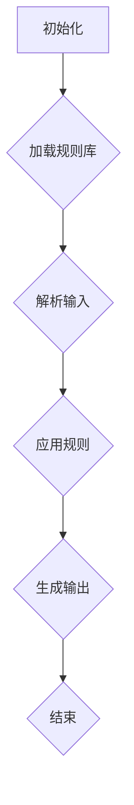
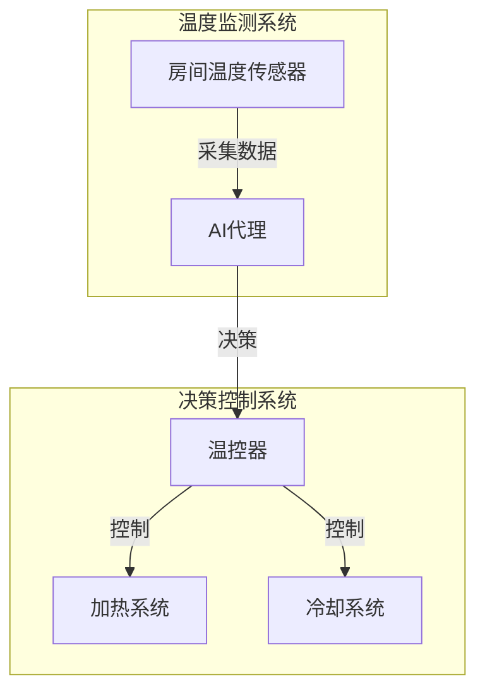
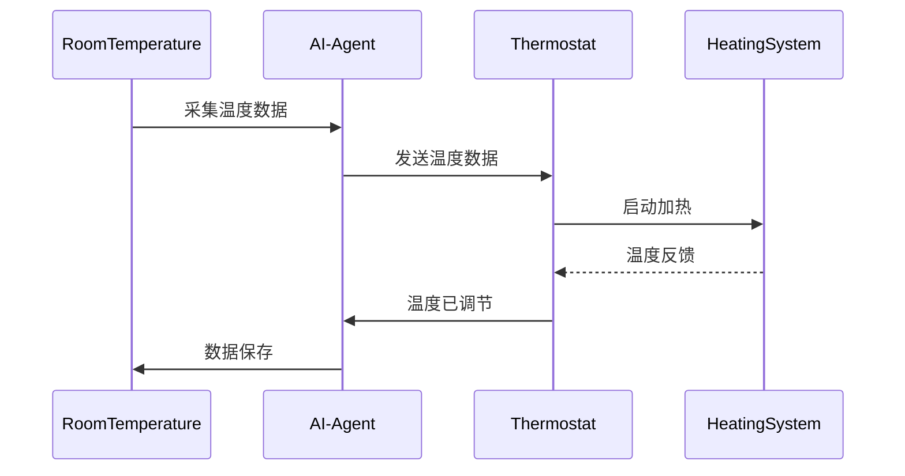

                 

### 构建具有知识推理能力的AI Agent目录大纲

## 目录大纲

### 第一部分：背景介绍

#### 1. 引言

##### 1.1 问题背景
- **AI Agent的定义**：人工智能代理（AI Agent）是能够执行特定任务、具有自主性和知识推理能力的计算机程序。
- **AI Agent的应用场景**：从智能客服到自动化决策系统，AI Agent在多个领域展现出了强大的潜力。

##### 1.2 目标读者
- **读者对象**：对AI领域有基础知识的开发者、研究者以及对人工智能应用感兴趣的专业人士。

##### 1.3 主要内容概述
- **全书结构**：本书将分为四个部分，详细探讨AI Agent的构建、知识表示、推理机制以及实际应用。

### 第二部分：核心概念与联系

#### 2.1 AI Agent基本概念
- **智能代理（Smart Agent）**：具有感知、决策和执行能力的代理。
- **知识表示**：如何将信息编码为计算机可以理解和操作的形式。

#### 2.2 概念属性对比表格

| 概念             | 定义                                                       | 属性对比                           |
|------------------|-----------------------------------------------------------|-----------------------------------|
| 知识表示         | 信息编码形式，用于AI Agent处理信息。                     | 符号主义、基于规则的、概率统计、神经网络等 |
| 推理机制         | AI Agent基于知识进行推理的方法。                         | 逻辑推理、概率推理、基于案例推理等       |
| 知识推理能力     | AI Agent运用知识进行推理和决策的能力。                   | 知识库、推理引擎等                   |

#### 2.3 ER实体关系图架构的Mermaid流程图

```mermaid
erDiagram
  AI-Agent ||--o Knowledge_Representation
  AI-Agent ||--o Inference_Mechanism
  AI-Agent ||--o Knowledge_Reasoning_Capability
```

### 第三部分：算法原理讲解

#### 3.1 知识表示算法

##### 3.1.1 算法介绍
- **符号主义表示**：使用符号和规则来表示知识。
- **基于规则的表示**：使用规则来表示知识和推理过程。

##### 3.1.2 Mermaid流程图



##### 3.1.3 Python源代码示例

```python
# 加载规则库
rules = ["如果温度高于30度，则开空调"]

# 解析输入
input_data = "当前温度为35度"

# 应用规则
if "温度高于30度" in input_data:
    print("开空调")
else:
    print("不开空调")
```

##### 3.1.4 数学模型和公式
- **知识表示**：
  $$ \text{知识} = \{ R_1, R_2, ..., R_n \} $$
- **推理过程**：
  $$ \text{推理} = \{ \text{前提}, \text{结论} \} $$

##### 3.1.5 举例说明
- **场景**：智能恒温控制系统。
- **规则**：如果房间温度超过设定值，则启动加热设备。
- **输入**：房间温度为22度。
- **输出**：不启动加热设备。

### 第四部分：系统分析与架构设计方案

#### 4.1 问题场景介绍

##### 4.2 项目介绍
- **项目名称**：智能恒温控制系统。
- **项目目标**：实现一个能够自动调节房间温度的AI Agent。

##### 4.3 系统功能设计

##### 4.3.1 领域模型类图

```mermaid
classDiagram
  RoomTemperature --|>{ AI-Agent }
  Thermostat --|>{ AI-Agent }
  HeatingSystem --|>{ Thermostat }
  CoolingSystem --|>{ Thermostat }
```

##### 4.3.2 系统功能描述
- **实时监测**：AI-Agent实时监测房间温度。
- **决策与控制**：根据温度数据，AI-Agent决定是否启动加热或冷却系统。

##### 4.4 系统架构设计

##### 4.4.1 系统架构图



##### 4.4.2 系统接口设计
- **API接口**：AI-Agent提供RESTful API供温控器调用。
- **数据接口**：温控器与温度传感器之间的数据传输接口。

##### 4.4.3 系统交互序列图



### 第五部分：项目实战

#### 5.1 环境安装

##### 5.1.1 安装Python环境
- **操作系统**：Ubuntu 20.04
- **Python版本**：Python 3.8

##### 5.1.2 安装必要的库

```bash
pip install numpy
pip install flask
```

#### 5.2 系统核心实现源代码

##### 5.2.1 AI-Agent实现

```python
# ai_agent.py
import numpy as np

class AIAgent:
    def __init__(self):
        self.rules = ["如果温度高于30度，则开空调"]

    def apply_rules(self, temperature):
        if temperature > 30:
            return "开空调"
        else:
            return "不开空调"
```

##### 5.2.2 温控器实现

```python
# thermostat.py
from ai_agent import AIAgent

class Thermostat:
    def __init__(self):
        self.ai_agent = AIAgent()

    def control_system(self, temperature):
        action = self.ai_agent.apply_rules(temperature)
        return action
```

#### 5.3 代码应用解读与分析

##### 5.3.1 代码结构分析
- **AI-Agent**：负责应用规则进行决策。
- **温控器**：调用AI-Agent，根据温度数据做出控制决策。

##### 5.3.2 实际案例分析
- **案例**：房间温度为28度，系统应如何响应？
- **分析**：根据规则，温度未超过30度，因此AI-Agent决策为“不开空调”。

### 第六部分：最佳实践

#### 6.1 小结

- **关键知识点**：理解AI Agent的概念、知识表示、推理机制以及实际应用。
- **实践建议**：在实际项目中，根据具体需求选择合适的AI Agent架构。

#### 6.2 注意事项

- **性能优化**：注意系统的响应速度和准确性。
- **安全性**：确保数据传输和系统访问的安全。

#### 6.3 拓展阅读

- **参考资料**：
  - 《人工智能：一种现代方法》
  - 《机器学习实战》
  - 《深度学习》

### 作者信息

作者：AI天才研究院/AI Genius Institute & 禅与计算机程序设计艺术 /Zen And The Art of Computer Programming

---

以上是《构建具有知识推理能力的AI Agent》的目录大纲，遵循了逻辑清晰、结构紧凑、简单易懂的专业技术语言要求。每个章节都包含了详细的背景介绍、核心概念、算法原理讲解、系统分析与架构设计方案、项目实战以及最佳实践 tips 等。文章将按照这个大纲逐步撰写，确保每个部分都完整、具体、详细，以便为读者提供最有价值的技术知识分享。

