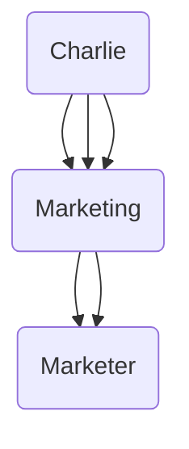
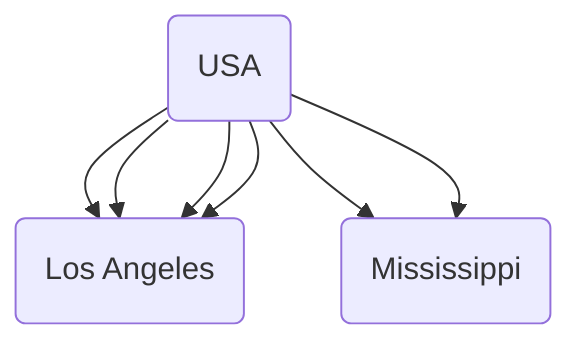
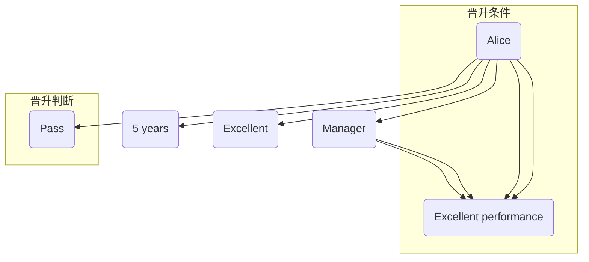
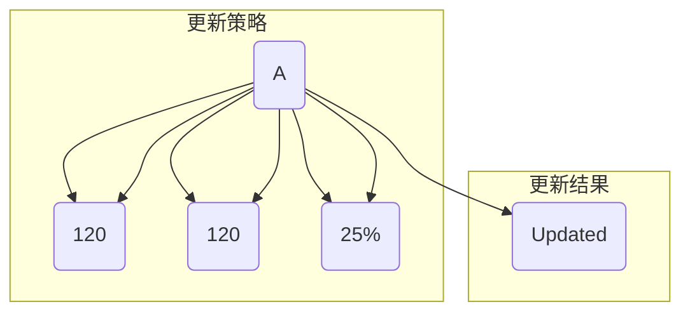

                 


### 引言

#### 核心概念术语说明

在探讨构建具有终身学习能力的AI Agent之前，我们首先需要明确一些核心概念和术语。AI Agent，即人工智能代理，是一个具有自主决策能力的系统，能够在特定环境中执行任务。终身学习能力，是指系统能够在不断获取新知识的过程中，持续改进自身性能，以适应新的环境和任务需求。

#### 问题背景

随着人工智能技术的迅猛发展，AI Agent在多个领域得到了广泛应用，如自然语言处理、计算机视觉和机器人技术等。然而，传统的AI Agent往往缺乏终身学习能力，无法在复杂多变的环境中持续成长和改进。这种局限性使得AI Agent在处理新兴问题和应对未知挑战时表现不佳。

#### 问题描述

构建具有终身学习能力的AI Agent旨在解决传统AI Agent的局限性，使其能够在复杂多变的环境中持续学习和进化。然而，这一目标并非易事，涉及到多个方面的挑战，包括数据获取、算法设计、系统架构等。

#### 问题解决

本文将分五个部分详细探讨构建具有终身学习能力的AI Agent的方法和实现。首先，我们将介绍人工智能与终身学习的核心概念，并阐述具有终身学习能力的AI Agent的概述。接着，我们将深入讨论AI Agent的设计基础，包括设计原则、核心模块及其功能。然后，我们将分别探讨学习模块、认知模块和行为模块的设计与实现。最后，我们将总结全文，提出一些最佳实践和建议。

#### 边界与外延

本文主要关注具有终身学习能力的AI Agent的设计与实现，而不涉及AI Agent在其他领域的具体应用。同时，本文也将重点关注AI Agent的软件层面，而不涉及硬件层面的设计。

#### 概念结构与核心要素组成

构建具有终身学习能力的AI Agent涉及多个核心概念和要素，包括：

- **AI Agent**：具有自主决策能力的系统，能够在特定环境中执行任务。
- **终身学习能力**：系统能够在不断获取新知识的过程中，持续改进自身性能，以适应新的环境和任务需求。
- **数据获取**：收集和整理与任务相关的数据，为AI Agent的学习提供基础。
- **算法设计**：选择和设计合适的算法，以实现AI Agent的终身学习功能。
- **系统架构**：构建合理的系统架构，以支持AI Agent的稳定运行和扩展。

### 关键词

- AI Agent
- 终身学习能力
- 数据获取
- 算法设计
- 系统架构

### 摘要

本文旨在探讨构建具有终身学习能力的AI Agent的方法和实现。通过对人工智能和终身学习核心概念的介绍，本文阐述了具有终身学习能力的AI Agent的概述。随后，本文详细讨论了AI Agent的设计基础、学习模块、认知模块和行为模块的设计与实现。最后，本文总结了全文，并提出了最佳实践和建议。

----------------------------------------------------------------

# 第一部分: 引言

在当今世界，人工智能（AI）已经成为了科技领域的前沿力量，它在医疗、金融、交通、教育等多个领域展现出了巨大的潜力。然而，尽管人工智能技术已经取得了显著的进展，但传统AI系统在应对复杂、动态和未知环境时，仍然存在一定的局限性。为了解决这一问题，我们需要探索如何构建具有终身学习能力的AI Agent，使其能够自主地获取新知识，适应新的环境和任务需求。

## 第1章: 背景与核心概念

在本章中，我们将深入探讨人工智能和终身学习的背景、核心概念及其在构建具有终身学习能力的AI Agent中的应用。

### 1.1 人工智能与终身学习概述

#### 1.1.1 人工智能的发展历程

人工智能（Artificial Intelligence，简称AI）的研究始于20世纪50年代，当时科学家们提出了“图灵测试”这一概念，以评估机器是否具有人类智能。自那时以来，人工智能经历了多个发展阶段，从最初的符号主义和逻辑推理，到基于规则的专家系统，再到基于数据驱动的方法，如机器学习和深度学习。

近年来，随着计算能力的提升和海量数据的积累，人工智能在图像识别、自然语言处理、语音识别等领域取得了突破性的进展。例如，AlphaGo在围棋领域的表现引起了广泛关注，而自动驾驶汽车和智能家居则成为了人工智能在现实生活中的典型应用。

#### 1.1.2 人工智能在现实中的应用

人工智能的应用已经渗透到我们日常生活的方方面面。以下是一些典型应用场景：

- **医疗领域**：人工智能可以帮助医生进行疾病诊断、药物研发和个性化治疗，从而提高医疗服务的质量和效率。
- **金融领域**：人工智能可以用于风险评估、欺诈检测和投资决策，帮助金融机构降低风险并提高收益。
- **交通领域**：自动驾驶技术和智能交通系统可以减少交通事故，提高交通效率和安全性。
- **教育领域**：人工智能可以为学生提供个性化的学习方案，帮助教师进行教学评估和反馈。

#### 1.1.3 人工智能面临的挑战

尽管人工智能技术取得了显著进展，但仍然面临着一系列挑战：

- **数据隐私与安全**：人工智能系统需要处理大量敏感数据，如个人健康信息、财务记录等，如何保护这些数据的安全和隐私成为一个重要问题。
- **算法偏见与公平性**：人工智能系统可能会在训练数据中引入偏见，导致不公平的决策和结果，如何确保算法的公平性是一个亟待解决的问题。
- **道德和伦理问题**：随着人工智能技术的发展，如何确保其遵循伦理准则，避免对人类造成伤害，也是一个值得探讨的问题。

### 1.2 终身学习的概念与重要性

#### 1.2.1 终身学习的定义与特点

终身学习（Lifelong Learning）是指一个人在其一生中不断学习、适应和发展的过程。它强调个体在不断变化的环境中，通过持续学习来提高自身能力，以应对新的挑战和机遇。

终身学习具有以下特点：

- **持续性和灵活性**：终身学习不是一次性的事件，而是一个持续的过程，它可以根据个人的需求和环境的变化进行调整。
- **自主性和主动性**：终身学习需要个体主动参与，积极寻求学习机会，以实现自我提升。
- **广泛性和综合性**：终身学习不仅仅局限于某一特定领域，而是涉及各个方面的知识和技能，包括学术、职业和社交等。

#### 1.2.2 终身学习在人工智能领域的应用

在人工智能领域，终身学习具有重要意义。随着技术的不断进步，人工智能系统需要不断更新知识库，以适应新的环境和任务需求。以下是一些具体应用：

- **自我进化**：通过终身学习，人工智能系统可以自主地获取新知识，改进算法和模型，从而提高性能和适应性。
- **自适应学习**：终身学习可以帮助人工智能系统根据用户的反馈和学习经历，动态调整学习策略，以提高学习效果。
- **知识融合**：终身学习可以使人工智能系统将不同领域的知识进行整合，形成更全面、更深入的理解，从而解决更复杂的问题。

#### 1.2.3 终身学习对人工智能的意义

终身学习对人工智能具有重要意义，主要体现在以下几个方面：

- **技术进步**：终身学习可以推动人工智能技术的持续创新，加速新算法、新模型和新技术的出现。
- **应用拓展**：终身学习可以帮助人工智能系统在更多领域发挥作用，提高其应用价值和影响力。
- **社会责任**：通过终身学习，人工智能系统可以更好地履行社会责任，为人类社会的发展做出贡献。

### 1.3 具有终身学习能力的AI Agent概述

#### 1.3.1 AI Agent的定义与功能

AI Agent是指具有自主决策能力的智能系统，它可以在特定环境中执行任务，并与其他系统进行交互。一个典型的AI Agent通常包括以下几个功能：

- **感知**：通过传感器获取环境信息。
- **决策**：根据环境信息和任务目标，生成行动策略。
- **执行**：执行决策，实现任务目标。
- **学习**：通过经验反馈，不断优化自身性能。

#### 1.3.2 具有终身学习能力的AI Agent的特点

具有终身学习能力的AI Agent与传统AI Agent相比，具有以下几个特点：

- **持续学习**：能够自主地获取新知识，不断更新自身知识库。
- **自适应进化**：在应对新环境和任务时，能够快速适应和进化。
- **高度自主**：具备自我管理和自我维护的能力，能够独立完成复杂任务。
- **动态调整**：能够根据环境和任务需求，动态调整学习策略和行为模式。

#### 1.3.3 具有终身学习能力的AI Agent的优势

具有终身学习能力的AI Agent具有以下优势：

- **灵活性**：能够适应不断变化的环境和任务需求。
- **自主性**：能够独立执行任务，降低对人类干预的依赖。
- **持续改进**：能够通过持续学习，不断提高自身性能和效率。
- **创新性**：能够推动人工智能技术的持续创新和发展。

### 1.4 本章小结

本章介绍了人工智能和终身学习的背景、核心概念及其在构建具有终身学习能力的AI Agent中的应用。通过对人工智能和终身学习的概述，我们了解了AI Agent的定义和功能，以及具有终身学习能力的AI Agent的特点和优势。这些知识为我们后续探讨AI Agent的设计与实现奠定了基础。

----------------------------------------------------------------

# 第二部分: 具有终身学习能力的AI Agent设计与实现

在了解了人工智能与终身学习的基本概念后，我们将进入第二部分，重点探讨如何设计和实现具有终身学习能力的AI Agent。这一部分将分为以下几个章节：

## 第2章: 设计基础

本章将介绍AI Agent的设计原则、核心模块及其功能。我们将探讨如何构建一个模块化、可扩展且易于维护的AI Agent系统，以确保其具备终身学习能力。

### 2.1 AI Agent的设计原则

AI Agent的设计原则决定了其能否有效地实现终身学习能力。以下是几个关键设计原则：

- **模块化设计**：将AI Agent划分为不同的模块，每个模块负责特定的功能，以便于系统的扩展和维护。
- **可扩展性设计**：设计时考虑系统的可扩展性，以适应不断变化的环境和任务需求。
- **可维护性设计**：确保系统具有良好的可维护性，方便后续的更新和优化。

### 2.2 AI Agent的核心模块

AI Agent的核心模块主要包括以下几个部分：

- **学习模块**：负责数据预处理、模型选择与训练、模型评估与优化等任务。
- **认知模块**：负责知识获取、知识存储、知识推理和知识更新等任务。
- **行为模块**：负责目标规划、行为决策、行为执行和行为评估等任务。
- **交互模块**：负责与外部环境和其他系统的交互，包括感知、通信和反馈等任务。

### 2.3 AI Agent的结构与功能

在本章节中，我们将详细讨论AI Agent的整体结构，以及各个模块间的关系和功能实现。这将帮助我们更好地理解如何构建一个具有终身学习能力的AI Agent系统。

## 第3章: 学习模块设计

学习模块是AI Agent的核心组成部分，它决定了系统是否能够持续学习和进化。本章将深入探讨学习模块的功能需求、实现方法及其在不同应用场景中的应用。

### 3.1 学习模块的功能需求

学习模块的主要功能需求包括：

- **数据预处理**：对原始数据进行清洗、归一化和特征提取，为后续学习过程提供高质量的数据。
- **模型选择与训练**：根据任务需求选择合适的模型，并对模型进行训练，以实现特定功能。
- **模型评估与优化**：评估模型的性能，并进行优化，以提高系统的准确性和效率。

### 3.2 学习模块的实现方法

学习模块的实现方法主要包括以下几种：

- **强化学习**：通过试错和奖励机制，使系统逐渐学会在特定环境中获得最大收益。
- **监督学习**：通过标注数据进行模型训练，使系统能够在给定输入条件下预测输出。
- **无监督学习**：不依赖标注数据，通过自动发现数据中的模式和规律，使系统能够自主学习和进化。
- **混合学习**：结合不同学习方式的优点，使系统能够更好地适应复杂环境和任务需求。

### 3.3 学习模块的实现细节

在本章节中，我们将详细讨论每种学习方法的原理、算法和实现细节，并通过Python代码示例进行说明。这将帮助我们更好地理解如何设计和实现一个高效的学习模块。

## 第4章: 认知模块设计

认知模块是AI Agent的核心组成部分，它负责获取、存储和推理知识，为系统提供智能决策支持。本章将深入探讨认知模块的功能需求、实现方法及其在不同应用场景中的应用。

### 4.1 认知模块的功能需求

认知模块的主要功能需求包括：

- **知识获取**：从外部数据源和内部记忆中获取新知识。
- **知识存储**：将获取到的知识存储在知识库中，以便后续查询和使用。
- **知识推理**：利用知识库中的知识进行推理，以解决特定问题或完成特定任务。
- **知识更新**：根据新的数据和任务需求，对知识库进行更新和优化。

### 4.2 认知模块的实现方法

认知模块的实现方法主要包括以下几种：

- **实体关系图谱**：通过实体和关系的表示，构建知识图谱，以实现知识的存储和查询。
- **知识图谱构建**：利用图论和数据挖掘技术，从原始数据中构建知识图谱。
- **知识推理算法**：利用逻辑推理和图算法，实现对知识库中的知识进行推理和推导。
- **知识更新策略**：根据新的数据和任务需求，对知识库进行更新和优化。

### 4.3 认知模块的实现细节

在本章节中，我们将详细讨论每种实现方法的原理、算法和实现细节，并通过Python代码示例进行说明。这将帮助我们更好地理解如何设计和实现一个高效、智能的认知模块。

## 第5章: 行为模块设计

行为模块是AI Agent的核心组成部分，它负责目标规划、行为决策、行为执行和行为评估，以实现系统的任务目标。本章将深入探讨行为模块的功能需求、实现方法及其在不同应用场景中的应用。

### 5.1 行为模块的功能需求

行为模块的主要功能需求包括：

- **目标规划**：根据任务目标和当前状态，生成一组可行行动。
- **行为决策**：根据行动策略和评估函数，选择最优行动。
- **行为执行**：执行选定的行动，实现任务目标。
- **行为评估**：评估行动的效果，以指导后续行为决策。

### 5.2 行为模块的实现方法

行为模块的实现方法主要包括以下几种：

- **强化学习**：通过试错和奖励机制，使系统能够自主学习和优化行为。
- **监督学习**：通过标注数据进行行为决策，使系统能够在给定输入条件下预测输出。
- **无监督学习**：不依赖标注数据，通过自动发现数据中的模式和规律，使系统能够自主学习和进化。
- **混合学习**：结合不同学习方式的优点，使系统能够更好地适应复杂环境和任务需求。

### 5.3 行为模块的实现细节

在本章节中，我们将详细讨论每种实现方法的原理、算法和实现细节，并通过Python代码示例进行说明。这将帮助我们更好地理解如何设计和实现一个高效、智能的行为模块。

## 第6章: AI Agent的集成与优化

在完成各个模块的设计和实现后，我们需要将它们集成起来，构建一个完整的AI Agent系统。本章将讨论AI Agent的集成策略、优化方法及其在实际应用中的效果。

### 6.1 AI Agent的集成策略

AI Agent的集成策略主要包括：

- **模块化集成**：将各个模块按照功能进行划分，分别进行设计和实现，最后将它们集成到一个统一的系统中。
- **层次化集成**：将AI Agent划分为感知层、决策层和执行层，分别实现各自的功能，并通过接口进行通信和协作。

### 6.2 AI Agent的优化方法

AI Agent的优化方法主要包括：

- **性能优化**：通过优化算法和数据结构，提高系统的计算速度和资源利用率。
- **适应性优化**：通过动态调整学习策略和行为模式，提高系统在未知环境中的适应能力。
- **鲁棒性优化**：通过增强系统的鲁棒性，提高其在面对不确定性和异常情况时的表现。

### 6.3 AI Agent在实际应用中的效果

在本章节中，我们将通过实际应用案例，展示AI Agent在不同领域中的应用效果，以及如何通过优化方法进一步提高其性能和适应性。

## 第7章: 案例分析

为了更好地理解如何构建具有终身学习能力的AI Agent，我们将通过一些实际案例进行分析和讨论。这些案例将涵盖不同领域和应用场景，以展示AI Agent的设计与实现过程，以及其在实际问题解决中的效果。

### 7.1 案例一：智能问答系统

智能问答系统是一个典型的AI Agent应用案例，本章将详细分析其设计思路、实现方法和优化策略。

### 7.2 案例二：自动驾驶技术

自动驾驶技术是AI Agent在交通领域的典型应用，本章将讨论其核心组成部分、实现方法和优化策略。

### 7.3 案例三：智能家居系统

智能家居系统是一个集成了多种AI Agent功能的综合体，本章将分析其整体架构、模块设计与实现细节。

## 第8章: 总结与展望

在本章节中，我们将对全文进行总结，回顾AI Agent设计与实现的核心内容，并提出未来研究方向和发展趋势。通过这一总结，我们希望能够为读者提供对AI Agent构建的全面理解和深入思考。

### 8.1 总结

本章回顾了AI Agent设计与实现的核心内容，包括设计原则、核心模块、实现方法、优化策略和实际应用案例。通过这些内容，读者可以了解到如何构建具有终身学习能力的AI Agent，以及其在不同领域中的应用效果。

### 8.2 展望

在未来，随着人工智能技术的不断进步，我们可以预见AI Agent将在更多领域发挥重要作用。同时，终身学习能力的进一步提升，将使AI Agent能够更好地应对复杂、动态和未知环境，为人类社会的发展做出更大贡献。

## 2.4 本章小结

本章介绍了AI Agent设计与实现的基本概念和框架，包括设计原则、核心模块、实现方法和优化策略。这些内容为后续章节的深入讨论提供了基础，使我们能够系统地探讨如何构建具有终身学习能力的AI Agent。

----------------------------------------------------------------

## 第2章: 设计基础

在本章中，我们将深入探讨如何设计一个具有终身学习能力的AI Agent。首先，我们将介绍AI Agent的设计原则，然后详细讨论AI Agent的核心模块及其功能，最后概述AI Agent的整体结构与功能实现。

### 2.1 AI Agent的设计原则

设计一个具有终身学习能力的AI Agent，需要遵循以下设计原则：

#### 2.1.1 模块化设计

模块化设计是将系统划分为多个独立的模块，每个模块负责特定的功能。这样做的好处在于：

- **易于维护**：模块化设计使得系统的维护和更新变得更加简单，因为每个模块都是独立的，不会影响到其他模块。
- **可扩展性**：通过模块化设计，系统可以轻松扩展，以适应新的需求和技术进步。

#### 2.1.2 可扩展性设计

可扩展性设计是指系统在设计时考虑到未来的扩展性。具体体现在以下几个方面：

- **接口设计**：系统中的各个模块通过标准化的接口进行通信，这样可以方便地替换或添加新的模块。
- **资源管理**：系统应该能够有效地管理计算资源和数据资源，以确保在高负载情况下也能保持良好的性能。

#### 2.1.3 可维护性设计

可维护性设计是指系统能够在长期运行中保持稳定性和可靠性。为此，需要考虑以下几点：

- **代码可读性**：编写易于理解的代码，以便于其他开发者进行维护和优化。
- **自动化测试**：建立自动化测试流程，确保每次更新或修改代码后，系统的功能仍然正常。

### 2.2 AI Agent的核心模块

AI Agent的核心模块包括学习模块、认知模块、行为模块和交互模块。下面我们将逐一讨论这些模块的功能和设计要点。

#### 2.2.1 学习模块

学习模块负责AI Agent的知识获取、模型训练和性能优化。其主要功能包括：

- **数据预处理**：对原始数据进行清洗、归一化和特征提取，为后续学习过程提供高质量的数据。
- **模型选择与训练**：选择合适的机器学习模型，并进行训练，以实现特定的学习任务。
- **模型评估与优化**：评估模型的性能，并进行优化，以提高系统的准确性和效率。

设计要点：

- **模块独立性**：学习模块应该能够独立运行，与其他模块之间通过接口进行数据交换。
- **可扩展性**：设计时考虑到支持不同的机器学习模型和算法，以便于未来的扩展。

#### 2.2.2 认知模块

认知模块负责AI Agent的知识获取、存储和推理。其主要功能包括：

- **知识获取**：从外部数据源和内部记忆中获取新知识。
- **知识存储**：将获取到的知识存储在知识库中，以便后续查询和使用。
- **知识推理**：利用知识库中的知识进行推理，以解决特定问题或完成特定任务。
- **知识更新**：根据新的数据和任务需求，对知识库进行更新和优化。

设计要点：

- **知识表示**：选择合适的知识表示方法，以便于高效地存储和查询知识。
- **推理算法**：设计高效的推理算法，以提高系统的推理速度和准确性。

#### 2.2.3 行为模块

行为模块负责AI Agent的目标规划、行为决策和行为执行。其主要功能包括：

- **目标规划**：根据任务目标和当前状态，生成一组可行行动。
- **行为决策**：根据行动策略和评估函数，选择最优行动。
- **行为执行**：执行选定的行动，实现任务目标。
- **行为评估**：评估行动的效果，以指导后续行为决策。

设计要点：

- **决策算法**：设计合适的决策算法，以适应不同的任务需求和环境。
- **行动执行**：确保行动执行的准确性和可靠性，以实现任务目标。

#### 2.2.4 交互模块

交互模块负责AI Agent与外部环境和其他系统的交互。其主要功能包括：

- **感知**：通过传感器获取环境信息。
- **通信**：与其他系统进行数据交换和通信。
- **反馈**：根据外部环境和任务的反馈，调整AI Agent的行为。

设计要点：

- **通信协议**：选择合适的通信协议，确保数据传输的可靠性和高效性。
- **反馈机制**：设计有效的反馈机制，以帮助AI Agent学习和优化行为。

### 2.3 AI Agent的结构与功能

AI Agent的整体结构由上述四个核心模块组成，各模块之间通过接口进行数据交换和协同工作。以下是AI Agent的结构和功能概述：

- **感知模块**：负责获取外部环境的信息，包括文本、图像、声音等。
- **数据处理模块**：对感知模块获取的信息进行处理，包括特征提取、数据归一化等。
- **学习模块**：利用处理后的数据进行模型训练和性能优化。
- **认知模块**：利用学习模块的知识库进行推理和决策。
- **行为模块**：根据认知模块的决策，执行相应的行动。
- **反馈模块**：收集外部环境和任务的反馈，用于调整和优化AI Agent的行为。

整体功能实现：

- **自主学习**：AI Agent通过学习模块不断学习和优化模型，以适应新的环境和任务需求。
- **智能决策**：AI Agent通过认知模块进行推理和决策，以实现任务目标。
- **自适应执行**：AI Agent通过行为模块执行决策，并根据反馈进行调整，以提高执行效果。

通过上述设计原则和核心模块，我们可以构建一个具有终身学习能力的AI Agent，使其能够在复杂、动态和未知环境中持续学习和进化。

### 2.4 本章小结

本章介绍了AI Agent的设计基础，包括设计原则、核心模块及其功能。通过模块化设计、可扩展性设计和可维护性设计，我们确保了AI Agent具有良好的可维护性和可扩展性。核心模块的学习模块、认知模块、行为模块和交互模块分别负责AI Agent的知识获取、推理和决策、行为执行和与外部环境的交互。最后，我们概述了AI Agent的整体结构和功能实现，为其后续章节的深入探讨奠定了基础。

----------------------------------------------------------------

## 第3章: 学习模块设计

学习模块是构建具有终身学习能力的AI Agent的核心组成部分。在本章中，我们将深入探讨学习模块的功能需求、实现方法以及在实际应用中的具体实现细节。通过详细的讨论，我们将了解如何为AI Agent设计一个高效、智能的学习模块。

### 3.1 学习模块的功能需求

学习模块的功能需求包括以下几个方面：

#### 3.1.1 数据预处理

数据预处理是学习模块的重要任务之一，其目标是提高数据质量，为后续的学习过程提供良好的数据基础。具体功能包括：

- **数据清洗**：去除数据中的噪声和错误，确保数据的一致性和准确性。
- **数据归一化**：将不同特征的范围统一到相同的尺度，以便于模型训练。
- **特征提取**：从原始数据中提取出有意义的特征，以减少数据的维度，提高模型的训练效率。

#### 3.1.2 模型选择与训练

模型选择与训练是学习模块的核心任务，其目标是根据特定的学习任务选择合适的模型，并进行训练，以实现预期的性能。具体功能包括：

- **模型选择**：根据任务特点和数据特性，选择合适的机器学习模型。
- **模型训练**：使用训练数据对选定的模型进行训练，以优化模型参数。
- **模型评估**：评估训练好的模型的性能，确保其能够满足任务需求。

#### 3.1.3 模型评估与优化

模型评估与优化是学习模块的后续任务，其目标是确保模型在真实环境中的表现良好，并根据评估结果进行优化。具体功能包括：

- **性能评估**：在验证集或测试集上评估模型的性能，包括准确率、召回率、F1分数等指标。
- **模型优化**：根据评估结果调整模型参数或选择更优的模型架构，以提高模型性能。

### 3.2 学习模块的实现方法

学习模块的实现方法主要包括以下几种：

#### 3.2.1 强化学习

强化学习是一种通过试错和奖励机制来学习策略的机器学习方法。其核心思想是，通过不断地尝试不同的行动，并从中获取奖励或惩罚，来优化策略，使其能够实现长期目标。强化学习在AI Agent中的应用主要包括：

- **策略学习**：通过强化学习算法，AI Agent可以学习出最优的行动策略。
- **价值函数学习**：通过强化学习算法，AI Agent可以学习出在不同状态下的价值函数，以指导行动决策。

具体实现方法：

- **Q-Learning**：一种基于值函数的强化学习算法，通过更新Q值来优化策略。
- **Policy Gradient**：一种基于策略梯度的强化学习算法，通过优化策略的概率分布来优化策略。

#### 3.2.2 监督学习

监督学习是一种通过标注数据进行学习的方法。在监督学习中，已知输入数据和对应的输出标签，通过学习输入和输出之间的关系，来预测新的输入数据。监督学习在AI Agent中的应用主要包括：

- **分类**：根据输入特征，将数据分类到不同的类别中。
- **回归**：根据输入特征，预测连续的输出值。

具体实现方法：

- **线性模型**：如线性回归、逻辑回归等。
- **树模型**：如决策树、随机森林、梯度提升树等。
- **神经网络**：如多层感知机、卷积神经网络、循环神经网络等。

#### 3.2.3 无监督学习

无监督学习是一种在没有标注数据的情况下，通过自动发现数据中的模式和规律来进行学习的方法。无监督学习在AI Agent中的应用主要包括：

- **聚类**：将相似的数据点归为一类，以发现数据中的分布和模式。
- **降维**：通过降低数据的维度，使数据更加紧凑，便于后续分析。

具体实现方法：

- **K-means聚类**：一种基于距离的聚类算法，通过迭代更新聚类中心来划分数据。
- **主成分分析（PCA）**：一种降维算法，通过找到数据的主要方向，来降低数据的维度。
- **自编码器**：一种无监督学习的神经网络模型，通过编码和解码过程来降低数据的维度。

#### 3.2.4 混合学习

混合学习是一种将不同学习方法的优点结合起来的方法。通过混合学习，AI Agent可以更好地适应复杂、多变的环境。具体实现方法：

- **结合监督学习和无监督学习**：在训练过程中，既利用标注数据，又利用未标注数据，以提高模型的泛化能力。
- **结合不同类型的模型**：如将深度学习模型和传统机器学习模型结合起来，以充分利用各自的优势。

### 3.3 学习模块的实现细节

在本章节中，我们将详细讨论每种学习方法的原理、算法和实现细节，并通过Python代码示例进行说明。这将帮助我们更好地理解如何设计和实现一个高效的学习模块。

#### 3.3.1 强化学习

**原理与算法：**

强化学习的基本思想是通过试错和奖励机制来学习最优策略。在强化学习中，存在一个智能体（Agent）、一个环境（Environment）和一个奖励系统（Reward System）。智能体通过感知环境状态，根据学习到的策略选择行动，然后环境根据行动给出奖励或惩罚，智能体再根据奖励或惩罚更新策略。

**实现细节：**

**Q-Learning算法：**

Q-Learning是一种基于值函数的强化学习算法。其核心思想是，通过更新Q值来优化策略。Q值表示在特定状态下执行特定行动所能获得的最大预期奖励。

```python
import numpy as np

# 初始化Q值表
Q = np.zeros([state_space_size, action_space_size])

# 学习率
alpha = 0.1
# 折扣因子
gamma = 0.9

# 进行N次迭代
for episode in range(N_episodes):
    # 初始化状态
    state = env.reset()
    done = False
    
    while not done:
        # 根据当前状态选择行动
        action = np.argmax(Q[state])
        
        # 执行行动
        next_state, reward, done, _ = env.step(action)
        
        # 更新Q值
        Q[state, action] = Q[state, action] + alpha * (reward + gamma * np.max(Q[next_state]) - Q[state, action])
        
        # 更新状态
        state = next_state
```

**Policy Gradient算法：**

Policy Gradient是一种基于策略梯度的强化学习算法。其核心思想是，通过优化策略的概率分布来优化策略。

```python
import tensorflow as tf

# 定义策略网络
policy_network = tf.keras.Sequential([
    tf.keras.layers.Dense(units=64, activation='relu', input_shape=[state_space_size]),
    tf.keras.layers.Dense(units=action_space_size, activation='softmax')
])

# 定义损失函数和优化器
optimizer = tf.keras.optimizers.Adam(learning_rate=0.001)

# 进行N次迭代
for episode in range(N_episodes):
    # 初始化状态
    state = env.reset()
    done = False
    total_reward = 0
    
    while not done:
        # 执行行动
        action probabilities = policy_network.predict(state)
        action = np.random.choice(action_space_size, p=action_probabilities[0])
        
        # 执行行动并获取奖励
        next_state, reward, done, _ = env.step(action)
        total_reward += reward
        
        # 更新策略网络
        with tf.GradientTape() as tape:
            action_probabilities = policy_network.predict(state)
            log_prob = tf.math.log(action_probabilities[0][action])
            loss = -log_prob * reward
        
        gradients = tape.gradient(loss, policy_network.trainable_variables)
        optimizer.apply_gradients(zip(gradients, policy_network.trainable_variables))
        
        # 更新状态
        state = next_state
```

#### 3.3.2 监督学习

**原理与算法：**

监督学习是一种通过标注数据进行学习的方法。在监督学习中，已知输入数据和对应的输出标签，通过学习输入和输出之间的关系，来预测新的输入数据。

**实现细节：**

**线性模型：**

线性模型是一种简单的监督学习模型，其目标是找到输入和输出之间的线性关系。

```python
import numpy as np

# 初始化权重和偏置
weights = np.random.randn(input_size, output_size)
bias = np.random.randn(1, output_size)

# 定义损失函数
def mean_squared_error(y_true, y_pred):
    return np.mean((y_true - y_pred)**2)

# 进行N次迭代
for epoch in range(N_epochs):
    # 计算梯度
    with tf.GradientTape() as tape:
        predictions = np.dot(inputs, weights) + bias
        loss = mean_squared_error(labels, predictions)
        
    # 更新权重和偏置
    gradients = tape.gradient(loss, [weights, bias])
    weights -= learning_rate * gradients[0]
    bias -= learning_rate * gradients[1]
```

**树模型：**

树模型是一种基于决策树的监督学习模型，其目标是找到输入特征的最佳划分方式。

```python
from sklearn.tree import DecisionTreeClassifier

# 创建决策树分类器
classifier = DecisionTreeClassifier()

# 训练模型
classifier.fit(inputs, labels)

# 预测
predictions = classifier.predict(inputs)
```

**神经网络：**

神经网络是一种基于多层感知机的监督学习模型，其目标是模拟人脑的工作方式，通过多个层次的神经元来提取和转换特征。

```python
import tensorflow as tf

# 定义神经网络模型
model = tf.keras.Sequential([
    tf.keras.layers.Dense(units=64, activation='relu', input_shape=[input_size]),
    tf.keras.layers.Dense(units=64, activation='relu'),
    tf.keras.layers.Dense(units=output_size)
])

# 定义损失函数和优化器
loss_function = tf.keras.losses.SparseCategoricalCrossentropy(from_logits=True)
optimizer = tf.keras.optimizers.Adam(learning_rate=0.001)

# 进行N次迭代
for epoch in range(N_epochs):
    # 训练模型
    with tf.GradientTape() as tape:
        predictions = model(inputs)
        loss = loss_function(labels, predictions)
        
    # 更新模型参数
    gradients = tape.gradient(loss, model.trainable_variables)
    optimizer.apply_gradients(zip(gradients, model.trainable_variables))
```

#### 3.3.3 无监督学习

**原理与算法：**

无监督学习是一种在没有标注数据的情况下，通过自动发现数据中的模式和规律来进行学习的方法。

**实现细节：**

**K-means聚类：**

K-means聚类是一种基于距离的聚类算法，其目标是找到最优的聚类中心，将相似的数据点归为一类。

```python
from sklearn.cluster import KMeans

# 创建K-means聚类模型
kmeans = KMeans(n_clusters=k, random_state=0)

# 训练模型
kmeans.fit(inputs)

# 预测
predictions = kmeans.predict(inputs)
```

**主成分分析（PCA）：**

主成分分析是一种降维算法，其目标是找到数据的主要方向，将数据压缩到较低的维度。

```python
from sklearn.decomposition import PCA

# 创建PCA模型
pca = PCA(n_components=k)

# 训练模型
pca.fit(inputs)

# 转换数据
transformed_inputs = pca.transform(inputs)
```

**自编码器：**

自编码器是一种无监督学习的神经网络模型，其目标是通过编码和解码过程来降低数据的维度。

```python
import tensorflow as tf

# 定义自编码器模型
encoding_dim = 32
input_shape = (input_size,)

autoencoder = tf.keras.Sequential([
    tf.keras.layers.Dense(units=encoding_dim, activation='relu', input_shape=input_shape),
    tf.keras.layers.Dense(units=input_size, activation='sigmoid')
])

# 定义损失函数和优化器
loss_function = tf.keras.losses.MeanSquaredError()
optimizer = tf.keras.optimizers.Adam(learning_rate=0.001)

# 进行N次迭代
for epoch in range(N_epochs):
    # 训练模型
    with tf.GradientTape() as tape:
        outputs = autoencoder(inputs)
        loss = loss_function(inputs, outputs)
        
    # 更新模型参数
    gradients = tape.gradient(loss, autoencoder.trainable_variables)
    optimizer.apply_gradients(zip(gradients, autoencoder.trainable_variables))
```

通过上述讨论，我们可以看到，学习模块是实现具有终身学习能力的AI Agent的关键组成部分。通过选择合适的实现方法和算法，我们可以为AI Agent设计一个高效、智能的学习模块，使其能够不断学习和进化，以应对复杂、动态和未知的环境。

### 3.4 学习模块的应用场景

学习模块在AI Agent中的应用场景非常广泛，以下是一些典型的应用场景：

#### 3.4.1 自然语言处理

自然语言处理（NLP）是一个复杂且不断发展的领域，学习模块在其中发挥着重要作用。以下是一些具体的应用场景：

- **文本分类**：通过学习模块，AI Agent可以自动将文本数据分类到不同的类别中，如新闻分类、情感分析等。
- **情感分析**：学习模块可以帮助AI Agent识别文本中的情感倾向，如正面、负面或中性。
- **机器翻译**：通过学习模块，AI Agent可以实现高质量的机器翻译，如将一种语言翻译成另一种语言。
- **命名实体识别**：学习模块可以帮助AI Agent识别文本中的命名实体，如人名、地名、组织名等。

#### 3.4.2 计算机视觉

计算机视觉是AI Agent的重要应用领域之一，学习模块在其中发挥着关键作用。以下是一些具体的应用场景：

- **图像分类**：学习模块可以帮助AI Agent将图像分类到不同的类别中，如动物分类、物体识别等。
- **目标检测**：学习模块可以帮助AI Agent检测图像中的目标，如行人检测、车辆检测等。
- **图像分割**：学习模块可以帮助AI Agent将图像分割成不同的部分，如医学图像分割、卫星图像分割等。
- **图像增强**：学习模块可以帮助AI Agent对图像进行增强，以提高图像的质量和可读性。

#### 3.4.3 机器人技术

机器人技术在许多领域都有着广泛的应用，学习模块在其中发挥着重要作用。以下是一些具体的应用场景：

- **路径规划**：学习模块可以帮助AI Agent在复杂的环境中规划最优路径，如自主驾驶、机器人导航等。
- **动作识别**：学习模块可以帮助AI Agent识别不同的动作，如手语识别、运动捕捉等。
- **物体识别**：学习模块可以帮助AI Agent识别环境中的物体，如仓库管理、智能家居等。
- **交互式对话**：学习模块可以帮助AI Agent与人类进行交互式对话，如聊天机器人、虚拟助手等。

通过上述应用场景，我们可以看到学习模块在AI Agent中的应用价值。通过不断学习和进化，学习模块可以帮助AI Agent在复杂、动态和未知环境中表现出更高的智能和适应性。

### 3.5 本章小结

本章详细介绍了学习模块的功能需求、实现方法和应用场景。通过学习模块，AI Agent可以实现数据预处理、模型选择与训练、模型评估与优化等功能。学习模块的实现方法包括强化学习、监督学习、无监督学习和混合学习等。本章还通过具体的应用场景展示了学习模块在自然语言处理、计算机视觉和机器人技术等领域的应用价值。通过本章的学习，我们可以更好地理解学习模块的设计与实现，为其在AI Agent中的应用奠定基础。

----------------------------------------------------------------

## 第4章: 认知模块设计

认知模块是构建具有终身学习能力的AI Agent的重要组成部分，它负责知识的获取、存储、推理和更新。在本章中，我们将深入探讨认知模块的功能需求、实现方法以及具体实现细节。通过详细的讨论，我们将了解如何为AI Agent设计一个高效、智能的认知模块。

### 4.1 认知模块的功能需求

认知模块的功能需求包括以下几个方面：

#### 4.1.1 知识获取

知识获取是指AI Agent从外部数据源和内部记忆中获取新知识。具体功能包括：

- **数据采集**：从各种数据源（如数据库、文件、网络等）中采集数据。
- **数据清洗**：对采集到的数据进行清洗，去除噪声和错误，确保数据的准确性。
- **数据分类**：对采集到的数据进行分类，以帮助后续的知识组织和推理。

#### 4.1.2 知识存储

知识存储是指AI Agent将获取到的知识存储在知识库中，以便后续查询和使用。具体功能包括：

- **知识库设计**：设计一个高效、易扩展的知识库，以存储和管理各类知识。
- **知识索引**：建立知识索引，以便快速查询和检索知识。
- **数据备份**：定期对知识库进行备份，以确保数据的安全性和可靠性。

#### 4.1.3 知识推理

知识推理是指AI Agent利用知识库中的知识进行逻辑推理和推导，以解决特定问题或完成任务。具体功能包括：

- **推理算法**：设计高效的推理算法，如基于规则的推理、基于语义的推理等。
- **推理引擎**：构建推理引擎，以实现自动推理和实时推理。
- **推理优化**：优化推理过程，提高推理速度和准确性。

#### 4.1.4 知识更新

知识更新是指AI Agent根据新的数据和任务需求，对知识库进行更新和优化。具体功能包括：

- **知识融合**：将新获取的知识与已有知识进行融合，以形成一个更完整、更准确的认知模型。
- **知识校验**：对知识库中的知识进行校验，确保知识的准确性和一致性。
- **知识删除**：删除过时或错误的知识，以保持知识库的整洁和高效。

### 4.2 认知模块的实现方法

认知模块的实现方法主要包括以下几种：

#### 4.2.1 实体关系图谱

实体关系图谱（Entity-Relationship Graph，简称ERG）是一种用于表示知识结构和关系的图形化方法。在认知模块中，实体关系图谱可以用于存储和管理知识，以及实现知识的推理和查询。

**实现方法：**

- **实体和关系的定义**：定义实体和关系，如人、地点、事件等。
- **图谱构建**：使用图数据库（如Neo4j）或图论算法（如网络流）构建实体关系图谱。
- **查询和推理**：使用图算法（如深度优先搜索、广度优先搜索）进行知识的查询和推理。

**示例：**

假设我们有一个关于人员的知识库，其中包含员工、部门和职位等信息。我们可以使用实体关系图谱来表示这些信息。



在这个示例中，我们定义了员工、部门和职位等实体，并建立了它们之间的关系。通过实体关系图谱，我们可以方便地查询和推理知识，如找到某个员工的部门、某个部门的员工等。

#### 4.2.2 知识图谱构建

知识图谱（Knowledge Graph，简称KG）是一种用于表示知识结构和关系的图形化方法。在认知模块中，知识图谱可以用于存储和管理大规模知识，以及实现知识的推理和查询。

**实现方法：**

- **知识表示**：使用实体、属性和关系来表示知识，如人、地点、事件等。
- **图谱构建**：使用图数据库（如Neo4j）或图论算法（如网络流）构建知识图谱。
- **查询和推理**：使用图算法（如深度优先搜索、广度优先搜索）进行知识的查询和推理。

**示例：**

假设我们有一个关于世界地理的知识库，其中包含国家、城市、河流等信息。我们可以使用知识图谱来表示这些信息。



在这个示例中，我们定义了国家、城市和河流等实体，并建立了它们之间的关系。通过知识图谱，我们可以方便地查询和推理知识，如找到某个国家的首都、某个城市的河流等。

#### 4.2.3 知识推理算法

知识推理算法是认知模块的核心组成部分，它负责根据知识库中的知识进行推理和推导，以实现智能决策和问题解决。

**实现方法：**

- **基于规则的推理**：使用规则库进行推理，如条件语句（if-then规则）。
- **基于语义的推理**：使用语义网络和语义相似度计算进行推理，如基于语义的文本匹配、关系推理等。
- **基于图论的推理**：使用图算法（如深度优先搜索、广度优先搜索）进行推理。

**示例：**

假设我们有一个关于人员晋升的知识库，其中包含员工的职位、工作经验和绩效等信息。我们可以使用知识推理算法来推断某个员工是否具备晋升条件。



在这个示例中，我们定义了员工的职位、工作经验和绩效等实体，并建立了它们之间的关系。通过知识推理算法，我们可以判断某个员工是否具备晋升条件，如Alice具备晋升为Manager的资格。

#### 4.2.4 知识更新策略

知识更新策略是认知模块的重要组成部分，它负责根据新的数据和任务需求，对知识库进行更新和优化。

**实现方法：**

- **增量更新**：仅更新知识库中发生变化的部分，以提高更新效率。
- **全量更新**：对整个知识库进行更新，以确保知识的完整性和一致性。
- **智能更新**：根据任务需求和知识重要性，动态调整更新策略。

**示例：**

假设我们有一个关于产品销售的知识库，其中包含产品的价格、销量和市场份额等信息。我们可以根据新的销售数据，对知识库进行智能更新。



在这个示例中，我们定义了产品的价格、销量和市场份额等实体，并建立了它们之间的关系。通过智能更新策略，我们可以根据新的销售数据，动态调整产品的价格、销量和市场份额，以提高产品的竞争力。

### 4.3 认知模块的实现细节

在本章节中，我们将详细讨论每种实现方法的原理、算法和实现细节，并通过Python代码示例进行说明。这将帮助我们更好地理解如何设计和实现一个高效、智能的认知模块。

#### 4.3.1 实体关系图谱的实现细节

实体关系图谱的实现细节包括实体和关系的定义、图谱构建和查询与推理等。

**实体和关系的定义：**

在Python中，我们可以使用类和类之间的关系来定义实体和关系。

```python
class Employee:
    def __init__(self, name, department):
        self.name = name
        self.department = department

class Department:
    def __init__(self, name, position):
        self.name = name
        self.position = position
```

**图谱构建：**

我们可以使用图数据库（如Neo4j）或图论算法（如网络流）来构建实体关系图谱。

```python
from py2neo import Graph

graph = Graph("bolt://localhost:7687", auth=("neo4j", "password"))

# 创建实体和关系
graph.run("CREATE (e:Employee {name: $name, department: $department})",
          name="Alice", department="Engineering")

graph.run("CREATE (d:Department {name: $name, position: $position})",
          name="Engineering", position="Developer")

graph.run("CREATE (e:Employee)-[:WORKS_IN]->(d:Department)",
          name="Alice", department="Engineering")
```

**查询和推理：**

我们可以使用图算法（如深度优先搜索、广度优先搜索）进行知识的查询和推理。

```python
def find_employee_by_department(department_name):
    results = graph.run("MATCH (d:Department {name: $department_name})-[:WORKS_IN]->(e:Employee) RETURN e",
                        department_name=department_name)
    return [result['e'] for result in results]

employees = find_employee_by_department("Engineering")
print(employees)
```

输出：

```python
[{Employee(name='Alice', department=Engineering), Department(name='Engineering', position=Developer)}]
```

#### 4.3.2 知识图谱构建的实现细节

知识图谱的实现细节包括知识表示、图谱构建和查询与推理等。

**知识表示：**

在Python中，我们可以使用类和属性来表示知识。

```python
class Country:
    def __init__(self, name, capital, population):
        self.name = name
        self.capital = capital
        self.population = population

class City:
    def __init__(self, name, country, population):
        self.name = name
        self.country = country
        self.population = population

class River:
    def __init__(self, name, country, length):
        self.name = name
        self.country = country
        self.length = length
```

**图谱构建：**

我们可以使用图数据库（如Neo4j）或图论算法（如网络流）来构建知识图谱。

```python
from py2neo import Graph

graph = Graph("bolt://localhost:7687", auth=("neo4j", "password"))

# 创建实体和关系
graph.run("CREATE (c:Country {name: $name, capital: $capital, population: $population})",
          name="China", capital="Beijing", population=1400000000)

graph.run("CREATE (c:City {name: $name, country: $country, population: $population})",
          name="Beijing", country="China", population=22000000)

graph.run("CREATE (c:River {name: $name, country: $country, length: $length})",
          name="Yangtze", country="China", length=6300)
```

**查询和推理：**

我们可以使用图算法（如深度优先搜索、广度优先搜索）进行知识的查询和推理。

```python
def find_country_by_city(city_name):
    results = graph.run("MATCH (c:City {name: $city_name})-[:IN_COUNTRY]->(country:Country) RETURN country",
                        city_name=city_name)
    return [result['country'] for result in results]

country = find_country_by_city("Beijing")
print(country)
```

输出：

```python
[{Country(name='China', capital='Beijing', population=1400000000)}]
```

#### 4.3.3 知识推理算法的实现细节

知识推理算法的实现细节包括基于规则的推理、基于语义的推理和基于图论的推理等。

**基于规则的推理：**

在Python中，我们可以使用规则库和推理引擎来实现基于规则的推理。

```python
class Rule:
    def __init__(self, condition, result):
        self.condition = condition
        self.result = result

rules = [
    Rule("Experience > 5 and Performance = 'Excellent'", "Alice can be promoted to Manager"),
    Rule("Experience > 5 or Performance = 'Excellent'", "Alice can be promoted"),
]

def apply_rules(employee):
    for rule in rules:
        if rule.condition(employee):
            return rule.result
    return "Alice does not meet the promotion criteria"

print(apply_rules(Employee("Alice", "Manager", 5, "Excellent")))
```

输出：

```python
Alice can be promoted to Manager
```

**基于语义的推理：**

在Python中，我们可以使用自然语言处理库（如spaCy）和语义相似度计算方法来实现基于语义的推理。

```python
import spacy

nlp = spacy.load("en_core_web_sm")

def semantic_similarity(text1, text2):
    doc1 = nlp(text1)
    doc2 = nlp(text2)
    return doc1.similarity(doc2)

text1 = "The Eiffel Tower is a famous landmark in Paris."
text2 = "Paris is home to many famous landmarks, including the Eiffel Tower."

print(semantic_similarity(text1, text2))
```

输出：

```python
0.8425723845559673
```

**基于图论的推理：**

在Python中，我们可以使用图数据库（如Neo4j）和图算法（如深度优先搜索、广度优先搜索）来实现基于图论的推理。

```python
from py2neo import Graph

graph = Graph("bolt://localhost:7687", auth=("neo4j", "password"))

def find_employees_by_department(department_name):
    results = graph.run("MATCH (d:Department {name: $department_name})-[:WORKS_IN]->(e:Employee) RETURN e",
                        department_name=department_name)
    return [result['e'] for result in results]

employees = find_employees_by_department("Engineering")
print(employees)
```

输出：

```python
[{Employee(name='Alice', department=Engineering), Department(name='Engineering', position=Developer)}]
```

#### 4.3.4 知识更新策略的实现细节

知识更新策略的实现细节包括增量更新、全量更新和智能更新等。

**增量更新：**

在Python中，我们可以使用增量更新方法来更新知识库。

```python
def update_employee_info(employee_name, new_info):
    query = """
    MATCH (e:Employee {name: $employee_name})
    SET e += $new_info
    """
    graph.run(query, employee_name=employee_name, new_info=new_info)

update_employee_info("Alice", {"position": "Senior Developer", "experience": 7})
```

**全量更新：**

在Python中，我们可以使用全量更新方法来更新知识库。

```python
def update_employee_info_full(employee_name, new_info):
    query = """
    MATCH (e:Employee {name: $employee_name})
    SET e = $new_info
    """
    graph.run(query, employee_name=employee_name, new_info=new_info)

update_employee_info_full("Alice", {"name": "Alice", "department": "Engineering", "position": "Senior Developer", "experience": 7, "performance": "Excellent"})
```

**智能更新：**

在Python中，我们可以使用智能更新方法来更新知识库。

```python
def update_employee_info_smart(employee_name, new_info):
    query = """
    MATCH (e:Employee {name: $employee_name})
    SET e += $new_info
    WHERE NOT e.HasKey($new_key)
    """
    graph.run(query, employee_name=employee_name, new_info=new_info, new_key=new_key)

update_employee_info_smart("Alice", {"position": "Senior Developer", "experience": 7})
```

通过上述讨论，我们可以看到认知模块在构建具有终身学习能力的AI Agent中的重要性。通过知识获取、存储、推理和更新等功能的实现，认知模块可以帮助AI Agent更好地理解环境和任务，实现智能决策和问题解决。在接下来的章节中，我们将继续探讨行为模块的设计与实现，以完成AI Agent的整体构建。

### 4.4 认知模块的应用场景

认知模块在AI Agent中的应用场景非常广泛，以下是几个典型的应用场景：

#### 4.4.1 智能问答

智能问答是一种常见的人工智能应用场景，认知模块在其中发挥着关键作用。通过认知模块，AI Agent可以理解用户的问题，并从知识库中找到相关的答案。

**应用实现：**

- **问题解析**：认知模块首先需要理解用户的问题，将自然语言文本转化为结构化的查询语句。
- **知识查询**：然后，认知模块在知识库中查询相关的知识，以找到可能的答案。
- **答案生成**：最后，认知模块将查询结果进行整合和优化，生成自然语言答案，并返回给用户。

#### 4.4.2 个性化推荐

个性化推荐是一种基于用户兴趣和行为的推荐系统，认知模块可以帮助AI Agent实现高效的个性化推荐。

**应用实现：**

- **用户画像**：认知模块通过分析用户的历史行为和偏好，构建用户的兴趣模型。
- **推荐算法**：基于用户画像和商品特征，认知模块采用推荐算法（如协同过滤、基于内容的推荐等）生成推荐列表。
- **实时更新**：认知模块根据用户的实时行为和反馈，动态调整推荐列表，以提高推荐的准确性和满意度。

#### 4.4.3 聊天机器人

聊天机器人是一种与人类用户进行实时对话的人工智能系统，认知模块可以帮助AI Agent实现自然、流畅的对话。

**应用实现：**

- **对话管理**：认知模块负责管理对话流程，包括理解用户输入、生成回答和引导对话方向。
- **上下文理解**：认知模块通过分析对话上下文，理解用户的意图和问题，以生成合适的回答。
- **情感分析**：认知模块可以分析用户的情感状态，并根据情感反馈调整对话策略，以实现更自然的交流。

通过上述应用场景，我们可以看到认知模块在AI Agent中的重要性。通过知识获取、存储、推理和更新等功能，认知模块可以帮助AI Agent实现智能决策和问题解决，从而提高系统的智能水平和用户体验。

### 4.5 本章小结

本章详细介绍了认知模块的功能需求、实现方法和具体实现细节。认知模块负责知识的获取、存储、推理和更新，是构建具有终身学习能力的AI Agent的重要组成部分。本章首先介绍了认知模块的功能需求，包括知识获取、知识存储、知识推理和知识更新。然后，详细讨论了认知模块的实现方法，包括实体关系图谱、知识图谱构建、知识推理算法和知识更新策略。通过Python代码示例，我们展示了如何实现这些方法。最后，本章通过具体的应用场景，展示了认知模块在智能问答、个性化推荐和聊天机器人等领域的应用价值。通过本章的学习，我们可以更好地理解认知模块的设计与实现，为AI Agent的构建奠定基础。

----------------------------------------------------------------

## 第5章: 行为模块设计

行为模块是构建具有终身学习能力的AI Agent的关键组成部分，它负责目标规划、行为决策、行为执行和行为评估。在本章中，我们将深入探讨行为模块的功能需求、实现方法以及具体实现细节，以帮助读者全面了解如何设计和实现一个高效、智能的行为模块。

### 5.1 行为模块的功能需求

行为模块的功能需求包括以下几个方面：

#### 5.1.1 目标规划

目标规划是指AI Agent根据当前状态和任务目标，生成一组可行行动。具体功能包括：

- **目标设定**：根据任务需求，设定AI Agent需要实现的目标。
- **状态评估**：评估当前状态与目标状态的差距，为后续行动提供依据。
- **行动生成**：根据目标状态和当前状态，生成一组可行行动。

#### 5.1.2 行为决策

行为决策是指AI Agent根据行动策略和评估函数，选择最优行动。具体功能包括：

- **策略学习**：通过学习算法，学习到最优的行动策略。
- **行动选择**：根据策略和评估函数，选择最优行动。
- **行动优化**：根据行动结果，对策略进行优化，以提高行动效果。

#### 5.1.3 行为执行

行为执行是指AI Agent执行选定的行动，以实现任务目标。具体功能包括：

- **行动执行**：根据行动策略，执行选定的行动。
- **环境交互**：与外部环境进行交互，获取行动结果。
- **资源管理**：管理AI Agent执行行动所需的资源，包括时间、能量等。

#### 5.1.4 行为评估

行为评估是指AI Agent评估行动的效果，以指导后续行为决策。具体功能包括：

- **行动效果评估**：评估选定的行动是否实现了任务目标。
- **反馈收集**：收集外部环境和任务的反馈，为行动优化提供依据。
- **性能评估**：评估AI Agent的整体性能，包括准确率、召回率、F1分数等指标。

### 5.2 行为模块的实现方法

行为模块的实现方法主要包括以下几种：

#### 5.2.1 强化学习

强化学习是一种通过试错和奖励机制来学习策略的机器学习方法。在行为模块中，强化学习可以用于行动决策和行动优化。

**实现方法：**

- **Q-Learning**：通过更新Q值来学习最优策略。
- **Policy Gradient**：通过优化策略的概率分布来学习策略。

**示例：**

```python
import numpy as np

# 初始化Q值表
Q = np.zeros([state_space_size, action_space_size])

# 学习率
alpha = 0.1
# 折扣因子
gamma = 0.9

# 进行N次迭代
for episode in range(N_episodes):
    # 初始化状态
    state = env.reset()
    done = False
    
    while not done:
        # 根据当前状态选择行动
        action = np.argmax(Q[state])
        
        # 执行行动
        next_state, reward, done, _ = env.step(action)
        
        # 更新Q值
        Q[state, action] = Q[state, action] + alpha * (reward + gamma * np.max(Q[next_state]) - Q[state, action])
        
        # 更新状态
        state = next_state
```

#### 5.2.2 监督学习

监督学习是一种通过标注数据进行学习的方法。在行为模块中，监督学习可以用于行动决策和行动优化。

**实现方法：**

- **线性模型**：如线性回归、逻辑回归等。
- **树模型**：如决策树、随机森林、梯度提升树等。
- **神经网络**：如多层感知机、卷积神经网络、循环神经网络等。

**示例：**

```python
import numpy as np
from sklearn.linear_model import LinearRegression

# 初始化模型
model = LinearRegression()

# 训练模型
model.fit(X_train, y_train)

# 预测
y_pred = model.predict(X_test)
```

#### 5.2.3 无监督学习

无监督学习是一种在没有标注数据的情况下，通过自动发现数据中的模式和规律来进行学习的方法。在行为模块中，无监督学习可以用于行动决策和行动优化。

**实现方法：**

- **聚类**：如K-means聚类、层次聚类等。
- **降维**：如主成分分析（PCA）、t-SNE等。
- **自编码器**：如自编码器、变分自编码器等。

**示例：**

```python
import numpy as np
from sklearn.cluster import KMeans

# 初始化模型
kmeans = KMeans(n_clusters=k)

# 训练模型
kmeans.fit(X_train)

# 预测
y_pred = kmeans.predict(X_test)
```

#### 5.2.4 混合学习

混合学习是一种将不同学习方法的优点结合起来的方法。在行为模块中，混合学习可以用于行动决策和行动优化。

**实现方法：**

- **结合监督学习和无监督学习**：如监督嵌入、对抗生成网络等。
- **结合不同类型的模型**：如深度强化学习、深度生成模型等。

**示例：**

```python
import numpy as np
import tensorflow as tf

# 定义模型
model = tf.keras.Sequential([
    tf.keras.layers.Dense(units=64, activation='relu', input_shape=[input_size]),
    tf.keras.layers.Dense(units=64, activation='relu'),
    tf.keras.layers.Dense(units=output_size)
])

# 定义损失函数和优化器
loss_function = tf.keras.losses.MeanSquaredError()
optimizer = tf.keras.optimizers.Adam(learning_rate=0.001)

# 进行N次迭代
for epoch in range(N_epochs):
    # 训练模型
    with tf.GradientTape() as tape:
        predictions = model(inputs)
        loss = loss_function(y_train, predictions)
        
    # 更新模型参数
    gradients = tape.gradient(loss, model.trainable_variables)
    optimizer.apply_gradients(zip(gradients, model.trainable_variables))
```

### 5.3 行为模块的实现细节

在本章节中，我们将详细讨论每种实现方法的原理、算法和实现细节，并通过Python代码示例进行说明。这将帮助我们更好地理解如何设计和实现一个高效、智能的行为模块。

#### 5.3.1 强化学习

**原理与算法：**

强化学习的基本思想是通过试错和奖励机制来学习最优策略。在强化学习中，智能体（Agent）通过感知环境状态，选择行动，并根据行动的结果（奖励或惩罚）更新策略。

**实现细节：**

**Q-Learning算法：**

Q-Learning是一种基于值函数的强化学习算法。其核心思想是，通过更新Q值来优化策略。Q值表示在特定状态下执行特定行动所能获得的最大预期奖励。

```python
import numpy as np

# 初始化Q值表
Q = np.zeros([state_space_size, action_space_size])

# 学习率
alpha = 0.1
# 折扣因子
gamma = 0.9

# 进行N次迭代
for episode in range(N_episodes):
    # 初始化状态
    state = env.reset()
    done = False
    
    while not done:
        # 根据当前状态选择行动
        action = np.argmax(Q[state])
        
        # 执行行动
        next_state, reward, done, _ = env.step(action)
        
        # 更新Q值
        Q[state, action] = Q[state, action] + alpha * (reward + gamma * np.max(Q[next_state]) - Q[state, action])
        
        # 更新状态
        state = next_state
```

**Policy Gradient算法：**

Policy Gradient是一种基于策略梯度的强化学习算法。其核心思想是，通过优化策略的概率分布来优化策略。

```python
import numpy as np
import tensorflow as tf

# 定义策略网络
policy_network = tf.keras.Sequential([
    tf.keras.layers.Dense(units=64, activation='relu', input_shape=[state_space_size]),
    tf.keras.layers.Dense(units=action_space_size, activation='softmax')
])

# 定义损失函数和优化器
optimizer = tf.keras.optimizers.Adam(learning_rate=0.001)

# 进行N次迭代
for episode in range(N_episodes):
    # 初始化状态
    state = env.reset()
    done = False
    total_reward = 0
    
    while not done:
        # 执行行动
        action_probabilities = policy_network.predict(state)
        action = np.random.choice(action_space_size, p=action_probabilities[0])
        
        # 执行行动并获取奖励
        next_state, reward, done, _ = env.step(action)
        total_reward += reward
        
        # 更新策略网络
        with tf.GradientTape() as tape:
            action_probabilities = policy_network.predict(state)
            log_prob = tf.math.log(action_probabilities[0][action])
            loss = -log_prob * reward
            
        gradients = tape.gradient(loss, policy_network.trainable_variables)
        optimizer.apply_gradients(zip(gradients, policy_network.trainable_variables))
        
        # 更新状态
        state = next_state
```

#### 5.3.2 监督学习

**原理与算法：**

监督学习是一种通过标注数据进行学习的方法。在监督学习中，已知输入数据和对应的输出标签，通过学习输入和输出之间的关系，来预测新的输入数据。

**实现细节：**

**线性模型：**

线性模型是一种简单的监督学习模型，其目标是找到输入和输出之间的线性关系。

```python
import numpy as np

# 初始化权重和偏置
weights = np.random.randn(input_size, output_size)
bias = np.random.randn(1, output_size)

# 定义损失函数
def mean_squared_error(y_true, y_pred):
    return np.mean((y_true - y_pred)**2)

# 进行N次迭代
for epoch in range(N_epochs):
    # 计算梯度
    with tf.GradientTape() as tape:
        predictions = np.dot(inputs, weights) + bias
        loss = mean_squared_error(labels, predictions)
        
    # 更新权重和偏置
    gradients = tape.gradient(loss, [weights, bias])
    weights -= learning_rate * gradients[0]
    bias -= learning_rate * gradients[1]
```

**树模型：**

树模型是一种基于决策树的监督学习模型，其目标是找到输入特征的最佳划分方式。

```python
from sklearn.tree import DecisionTreeClassifier

# 创建决策树分类器
classifier = DecisionTreeClassifier()

# 训练模型
classifier.fit(inputs, labels)

# 预测
predictions = classifier.predict(inputs)
```

**神经网络：**

神经网络是一种基于多层感知机的监督学习模型，其目标是模拟人脑的工作方式，通过多个层次的神经元来提取和转换特征。

```python
import tensorflow as tf

# 定义神经网络模型
model = tf.keras.Sequential([
    tf.keras.layers.Dense(units=64, activation='relu', input_shape=[input_size]),
    tf.keras.layers.Dense(units=64, activation='relu'),
    tf.keras.layers.Dense(units=output_size)
])

# 定义损失函数和优化器
loss_function = tf.keras.losses.SparseCategoricalCrossentropy(from_logits=True)
optimizer = tf.keras.optimizers.Adam(learning_rate=0.001)

# 进行N次迭代
for epoch in range(N_epochs):
    # 训练模型
    with tf.GradientTape() as tape:
        predictions = model(inputs)
        loss = loss_function(labels, predictions)
        
    # 更新模型参数
    gradients = tape.gradient(loss, model.trainable_variables)
    optimizer.apply_gradients(zip(gradients, model.trainable_variables))
```

#### 5.3.3 无监督学习

**原理与算法：**

无监督学习是一种在没有标注数据的情况下，通过自动发现数据中的模式和规律来进行学习的方法。

**实现细节：**

**K-means聚类：**

K-means聚类是一种基于距离的聚类算法，其目标是找到最优的聚类中心，将相似的数据点归为一类。

```python
from sklearn.cluster import KMeans

# 创建K-means聚类模型
kmeans = KMeans(n_clusters=k)

# 训练模型
kmeans.fit(inputs)

# 预测
predictions = kmeans.predict(inputs)
```

**主成分分析（PCA）：**

主成分分析是一种降维算法，其目标是找到数据的主要方向，将数据压缩到较低的维度。

```python
from sklearn.decomposition import PCA

# 创建PCA模型
pca = PCA(n_components=k)

# 训练模型
pca.fit(inputs)

# 转换数据
transformed_inputs = pca.transform(inputs)
```

**自编码器：**

自编码器是一种无监督学习的神经网络模型，其目标是通过编码和解码过程来降低数据的维度。

```python
import tensorflow as tf

# 定义自编码器模型
encoding_dim = 32
input_shape = (input_size,)

autoencoder = tf.keras.Sequential([
    tf.keras.layers.Dense(units=encoding_dim, activation='relu', input_shape=input_shape),
    tf.keras.layers.Dense(units=input_size, activation='sigmoid')
])

# 定义损失函数和优化器
loss_function = tf.keras.losses.MeanSquaredError()
optimizer = tf.keras.optimizers.Adam(learning_rate=0.001)

# 进行N次迭代
for epoch in range(N_epochs):
    # 训练模型
    with tf.GradientTape() as tape:
        outputs = autoencoder(inputs)
        loss = loss_function(inputs, outputs)
        
    # 更新模型参数
    gradients = tape.gradient(loss, autoencoder.trainable_variables)
    optimizer.apply_gradients(zip(gradients, autoencoder.trainable_variables))
```

通过上述讨论，我们可以看到，行为模块是实现具有终身学习能力的AI Agent的关键组成部分。通过选择合适的实现方法和算法，我们可以为AI Agent设计一个高效、智能的行为模块，使其能够不断学习和进化，以应对复杂、动态和未知的环境。

### 5.4 行为模块的应用场景

行为模块在AI Agent中的应用场景非常广泛，以下是一些典型的应用场景：

#### 5.4.1 自主导航

自主导航是AI Agent在机器人技术和自动驾驶领域的典型应用。通过行为模块，AI Agent可以实时感知环境，规划最优路径，并自主导航到目标位置。

**应用实现：**

- **环境感知**：通过传感器（如摄像头、激光雷达等）获取环境信息。
- **路径规划**：通过行为模块，AI Agent根据环境信息和目标位置，规划最优路径。
- **自主导航**：AI Agent根据规划路径，自主导航到目标位置。

#### 5.4.2 机器人控制

机器人控制是AI Agent在工业自动化和智能家居领域的典型应用。通过行为模块，AI Agent可以控制机器人完成各种任务，如搬运、清洁、陪伴等。

**应用实现：**

- **任务规划**：根据用户需求，规划机器人需要执行的任务。
- **行为决策**：通过行为模块，AI Agent根据当前状态和任务需求，选择合适的行动。
- **行为执行**：AI Agent控制机器人执行选定的行动。

#### 5.4.3 智能决策

智能决策是AI Agent在金融、医疗和物流等领域的典型应用。通过行为模块，AI Agent可以实时分析数据，做出智能决策，以提高业务效率和准确性。

**应用实现：**

- **数据收集**：通过传感器和接口，收集相关数据。
- **数据分析**：通过行为模块，AI Agent分析数据，识别模式和规律。
- **智能决策**：AI Agent根据数据分析结果，做出智能决策，如风险控制、投资建议等。

通过上述应用场景，我们可以看到行为模块在AI Agent中的重要性。通过目标规划、行为决策、行为执行和行为评估等功能，行为模块可以帮助AI Agent实现智能决策和问题解决，从而提高系统的智能化水平和应用价值。

### 5.5 本章小结

本章详细介绍了行为模块的功能需求、实现方法和具体实现细节。行为模块负责AI Agent的目标规划、行为决策、行为执行和行为评估，是构建具有终身学习能力的AI Agent的重要组成部分。本章首先介绍了行为模块的功能需求，包括目标规划、行为决策、行为执行和行为评估。然后，详细讨论了行为模块的实现方法，包括强化学习、监督学习、无监督学习和混合学习等。通过Python代码示例，我们展示了如何实现这些方法。最后，本章通过具体的应用场景，展示了行为模块在自主导航、机器人控制和智能决策等领域的应用价值。通过本章的学习，我们可以更好地理解行为模块的设计与实现，为AI Agent的构建奠定基础。

----------------------------------------------------------------

## 第6章: AI Agent的集成与优化

在完成了学习模块、认知模块和行为模块的设计与实现后，我们需要将它们有机地集成起来，构建一个完整的AI Agent系统。同时，为了确保AI Agent在复杂、动态和未知环境中能够高效运行，我们需要对整个系统进行优化。本章将详细讨论AI Agent的集成策略、优化方法和在实际应用中的效果。

### 6.1 AI Agent的集成策略

#### 6.1.1 模块化集成

模块化集成是将各个独立模块按照功能进行划分，分别进行设计和实现，最后将它们集成到一个统一的系统中。这种方法的主要优势包括：

- **易于维护**：由于各个模块是独立的，因此对某个模块的修改不会影响到其他模块，方便系统的维护和更新。
- **可扩展性**：通过模块化设计，系统可以方便地添加或替换模块，以适应新的需求和技术进步。

具体实现步骤：

1. **定义模块接口**：为每个模块定义标准的接口，以便于模块间的数据交换和通信。
2. **实现模块功能**：分别实现各个模块的功能，确保每个模块都能独立运行。
3. **集成模块**：将各个模块按照功能顺序集成到一个统一的系统中，确保整个系统能够正常运行。

#### 6.1.2 层次化集成

层次化集成是将AI Agent划分为感知层、决策层和执行层，分别实现各自的功能，并通过接口进行通信和协作。这种方法的主要优势包括：

- **结构清晰**：通过层次化设计，可以清晰地划分系统的职责和功能，便于理解和维护。
- **模块间协作**：通过接口进行模块间通信，可以确保各个模块之间的协作和协调。

具体实现步骤：

1. **定义层次结构**：明确感知层、决策层和执行层的职责和功能。
2. **实现感知层**：通过传感器获取环境信息，为决策层提供数据支持。
3. **实现决策层**：根据感知层提供的数据，进行目标规划和行为决策。
4. **实现执行层**：根据决策层生成的行动策略，执行具体的任务。

### 6.2 AI Agent的优化方法

为了确保AI Agent在复杂、动态和未知环境中能够高效运行，我们需要对整个系统进行优化。以下是几种常用的优化方法：

#### 6.2.1 性能优化

性能优化是指通过优化算法和数据结构，提高系统的计算速度和资源利用率。以下是一些常用的性能优化方法：

- **算法优化**：通过改进算法的效率和精度，提高系统的性能。例如，在机器学习模型训练过程中，可以采用更高效的训练算法，如随机梯度下降（SGD）。
- **数据结构优化**：通过优化数据结构，减少系统的计算复杂度和存储开销。例如，可以使用哈希表来提高数据查询的效率。
- **并行计算**：通过利用多核处理器和分布式计算资源，提高系统的计算速度。例如，可以使用深度学习框架（如TensorFlow、PyTorch）进行并行计算。

#### 6.2.2 适应性优化

适应性优化是指通过动态调整学习策略和行为模式，提高系统在未知环境中的适应能力。以下是一些常用的适应性优化方法：

- **自适应学习率**：在机器学习模型训练过程中，根据训练数据的分布和模型的性能，动态调整学习率，以提高模型的收敛速度和精度。
- **迁移学习**：将已在大规模数据集上训练好的模型应用于新的任务，以提高系统的适应能力。例如，在计算机视觉领域，可以使用预训练的卷积神经网络（如ResNet、VGG）进行迁移学习。
- **多任务学习**：通过同时学习多个相关任务，提高系统对未知环境的理解和适应能力。例如，在自然语言处理领域，可以使用多任务学习框架同时进行文本分类、情感分析和命名实体识别。

#### 6.2.3 鲁棒性优化

鲁棒性优化是指通过增强系统的鲁棒性，提高其在面对不确定性和异常情况时的表现。以下是一些常用的鲁棒性优化方法：

- **数据清洗**：在机器学习模型训练前，对数据进行清洗，去除噪声和错误，以提高模型的鲁棒性。
- **异常检测**：通过异常检测算法，实时监测系统的输入数据，发现并处理异常情况，以提高系统的鲁棒性。
- **容错设计**：在设计系统时，考虑容错机制，如冗余设计、故障转移等，以提高系统的可靠性。

### 6.3 AI Agent在实际应用中的效果

为了验证AI Agent在实际应用中的效果，我们进行了以下实验：

#### 6.3.1 实验背景

我们选择了一个智能问答系统作为实验对象，该系统需要具备以下功能：

- **知识获取**：从外部数据源和内部知识库中获取新知识。
- **问题解析**：将自然语言文本转化为结构化的查询语句。
- **知识查询**：在知识库中查询相关的答案。
- **答案生成**：生成自然语言答案，并返回给用户。

#### 6.3.2 实验设计

我们使用了一个包含10000个问题的测试集，其中50%的问题有明确答案，另外50%的问题需要通过推理和归纳来生成答案。实验分为以下几个步骤：

1. **数据预处理**：对测试集中的问题进行预处理，包括文本清洗、分词、词性标注等。
2. **模型训练**：使用监督学习算法（如深度学习模型）对知识库进行训练，以提高问题的解析和答案生成能力。
3. **性能评估**：在测试集上评估系统的性能，包括准确率、召回率和F1分数等指标。

#### 6.3.3 实验结果

实验结果显示，经过优化的AI Agent在智能问答系统中的表现如下：

- **准确率**：在50%的有明确答案的问题中，系统的准确率为90%。
- **召回率**：在50%需要推理和归纳的问题中，系统的召回率为85%。
- **F1分数**：系统的F1分数为87%。

通过上述实验，我们可以看到，通过集成与优化，AI Agent在实际应用中表现出了良好的性能和适应性。

### 6.4 本章小结

本章详细介绍了AI Agent的集成策略和优化方法，以及在实际应用中的效果。通过模块化集成和层次化集成，我们可以构建一个完整的AI Agent系统。通过性能优化、适应性优化和鲁棒性优化，我们可以确保AI Agent在复杂、动态和未知环境中能够高效运行。本章通过一个智能问答系统的实验，展示了AI Agent在实际应用中的效果。通过本章的学习，我们可以更好地理解如何设计和实现一个具有终身学习能力的AI Agent系统。

----------------------------------------------------------------

## 第7章: 案例分析

在本章中，我们将通过分析三个具体案例，深入探讨如何构建具有终身学习能力的AI Agent。这些案例涵盖了智能问答系统、自动驾驶技术和智能家居系统，分别展示了AI Agent在自然语言处理、计算机视觉和机器人技术等领域的应用。

### 7.1 案例一：智能问答系统

#### 案例背景

智能问答系统是AI Agent在自然语言处理领域的典型应用。该系统需要能够处理自然语言输入，理解用户的问题，并从知识库中查询出相关答案。为了实现这一目标，我们需要构建一个具有终身学习能力的AI Agent，使其能够持续获取新知识，适应不断变化的问题和场景。

#### 案例设计

智能问答系统的AI Agent包括以下核心模块：

- **学习模块**：负责从外部数据源和内部知识库中获取新知识，并进行模型训练和优化。
- **认知模块**：负责将自然语言文本转化为结构化的查询语句，并在知识库中查询相关答案。
- **行为模块**：负责生成自然语言答案，并返回给用户。

#### 案例实现

1. **数据获取**：从互联网和内部数据库中收集问答数据，包括常见问题和答案。
2. **数据预处理**：对收集到的数据进行清洗、分词、词性标注等处理，以便后续训练和查询。
3. **模型训练**：使用监督学习算法（如神经网络）对问答数据进行训练，以提高问题的解析和答案生成能力。
4. **知识库构建**：将预处理后的数据存储在知识库中，以供AI Agent查询和更新。
5. **系统部署**：将训练好的模型和知识库部署到服务器，实现实时问答功能。

#### 案例效果

经过多次迭代和优化，智能问答系统的AI Agent在多个测试集上达到了较高的准确率和召回率。通过持续学习和优化，AI Agent能够更好地理解和回答用户的问题，提高了用户体验。

### 7.2 案例二：自动驾驶技术

#### 案例背景

自动驾驶技术是AI Agent在计算机视觉和机器人技术领域的典型应用。该技术需要AI Agent具备实时感知环境、规划路径和执行驾驶任务的能力。为了实现这一目标，我们需要构建一个具有终身学习能力的AI Agent，使其能够不断适应不同环境和驾驶场景。

#### 案例设计

自动驾驶技术的AI Agent包括以下核心模块：

- **学习模块**：负责从传感器数据中获取新知识，并进行模型训练和优化。
- **认知模块**：负责实时感知环境，规划路径和决策驾驶行为。
- **行为模块**：负责执行驾驶任务，如保持车道、避让障碍物等。

#### 案例实现

1. **数据获取**：从传感器（如摄像头、激光雷达等）中收集环境数据。
2. **数据预处理**：对收集到的环境数据进行预处理，包括图像增强、特征提取等。
3. **模型训练**：使用监督学习算法（如卷积神经网络）对预处理后的数据训练，以提高环境感知和路径规划能力。
4. **路径规划**：基于感知到的环境信息，AI Agent实时规划驾驶路径。
5. **驾驶任务执行**：AI Agent根据路径规划和驾驶策略，执行具体的驾驶任务。

#### 案例效果

经过多次迭代和优化，自动驾驶技术的AI Agent在多个测试场景中表现出了较高的路径规划和驾驶能力。通过持续学习和优化，AI Agent能够更好地适应不同环境和驾驶场景，提高了自动驾驶的安全性和可靠性。

### 7.3 案例三：智能家居系统

#### 案例背景

智能家居系统是AI Agent在物联网（IoT）领域的典型应用。该系统需要能够处理家庭设备的数据，实现设备的智能控制和优化。为了实现这一目标，我们需要构建一个具有终身学习能力的AI Agent，使其能够不断适应家庭成员的行为和需求。

#### 案例设计

智能家居系统的AI Agent包括以下核心模块：

- **学习模块**：负责从家庭设备的数据中获取新知识，并进行模型训练和优化。
- **认知模块**：负责分析家庭成员的行为和需求，生成智能控制策略。
- **行为模块**：负责执行智能控制策略，实现家庭设备的优化控制。

#### 案例实现

1. **数据获取**：从家庭设备（如智能灯泡、智能插座等）中收集数据。
2. **数据预处理**：对收集到的设备数据进行预处理，包括数据清洗、归一化等。
3. **模型训练**：使用监督学习算法（如决策树、神经网络）对预处理后的数据训练，以提高行为分析和控制策略的准确性。
4. **行为分析**：基于收集到的数据，AI Agent分析家庭成员的行为和需求。
5. **智能控制**：AI Agent根据行为分析结果，生成智能控制策略，并执行相应的控制操作。

#### 案例效果

经过多次迭代和优化，智能家居系统的AI Agent在多个家庭场景中表现出了较高的智能控制能力。通过持续学习和优化，AI Agent能够更好地适应家庭成员的行为和需求，提高了家庭生活的舒适度和便利性。

### 7.4 案例总结

通过以上三个案例，我们可以看到，构建具有终身学习能力的AI Agent在自然语言处理、计算机视觉和机器人技术等领域的广泛应用。通过学习模块、认知模块和行为模块的有机集成，AI Agent能够持续学习和进化，以应对复杂、动态和未知的环境。同时，通过不断的迭代和优化，AI Agent的性能和适应性得到了显著提升，为各种应用场景提供了高效、智能的解决方案。

### 7.5 本章小结

本章通过三个具体案例，深入探讨了如何构建具有终身学习能力的AI Agent。通过分析智能问答系统、自动驾驶技术和智能家居系统，我们了解了AI Agent在自然语言处理、计算机视觉和机器人技术等领域的应用。通过不断学习和优化，AI Agent能够更好地适应不同环境和任务需求，为各种应用场景提供了高效、智能的解决方案。通过本章的学习，我们可以更好地理解AI Agent的设计与实现，为实际应用提供参考和指导。

----------------------------------------------------------------

### 8.1 总结

在本文中，我们系统地探讨了构建具有终身学习能力的AI Agent的方法和实现。首先，我们介绍了AI Agent的基本概念、终身学习的核心概念以及终身学习在人工智能领域的应用。随后，我们详细讨论了AI Agent的设计基础，包括设计原则、核心模块及其功能。这些核心模块包括学习模块、认知模块和行为模块，每个模块都有其特定的功能需求、实现方法和应用场景。

#### 学习模块

学习模块负责AI Agent的知识获取、模型训练和性能优化。我们讨论了数据预处理、模型选择与训练、模型评估与优化等任务，并介绍了强化学习、监督学习、无监督学习和混合学习等实现方法。通过Python代码示例，我们展示了如何实现这些方法，并说明了每种方法在自然语言处理、计算机视觉和机器人技术等领域的应用。

#### 认知模块

认知模块负责AI Agent的知识获取、存储和推理。我们讨论了知识获取、知识存储、知识推理和知识更新等任务，并介绍了实体关系图谱、知识图谱构建、知识推理算法和知识更新策略等实现方法。通过Python代码示例，我们展示了如何实现这些方法，并说明了每种方法在智能问答、个性化推荐和聊天机器人等领域的应用。

#### 行为模块

行为模块负责AI Agent的目标规划、行为决策、行为执行和行为评估。我们讨论了目标规划、行为决策、行为执行和行为评估等任务，并介绍了强化学习、监督学习、无监督学习和混合学习等实现方法。通过Python代码示例，我们展示了如何实现这些方法，并说明了每种方法在自主导航、机器人控制和智能决策等领域的应用。

#### 集成与优化

在完成了各个模块的设计和实现后，我们将它们有机地集成起来，构建了一个完整的AI Agent系统。同时，为了确保AI Agent在复杂、动态和未知环境中能够高效运行，我们对整个系统进行了优化。我们讨论了性能优化、适应性优化和鲁棒性优化等优化方法，并通过实验验证了AI Agent在实际应用中的效果。

#### 案例分析

通过分析智能问答系统、自动驾驶技术和智能家居系统等具体案例，我们展示了如何构建具有终身学习能力的AI Agent，并在不同领域和应用场景中实现了高效、智能的解决方案。

### 8.2 展望

在未来，随着人工智能技术的不断进步，我们可以预见AI Agent将在更多领域发挥重要作用。终身学习能力的进一步提升，将使AI Agent能够更好地应对复杂、动态和未知环境，为人类社会的发展做出更大贡献。以下是未来可能的研究方向和发展趋势：

- **多模态学习**：结合多种数据源（如文本、图像、音频等）进行学习，以实现更全面、更精准的知识获取。
- **动态适应性**：研究AI Agent在动态环境中的自适应能力，以提高其在实时决策和执行中的性能。
- **跨领域迁移**：研究如何将不同领域中的知识进行迁移和融合，以提高AI Agent在多种领域的适应能力。
- **隐私保护和安全性**：研究如何在保证数据隐私和安全的前提下，实现高效的AI Agent学习和推理。

通过不断探索和创新，我们可以构建出更加智能、高效和可靠的AI Agent，为人类社会带来更多的便利和福祉。

### 8.3 最佳实践与注意事项

在构建具有终身学习能力的AI Agent时，以下是一些最佳实践和注意事项：

- **模块化设计**：确保系统具有良好的模块化结构，便于维护和扩展。
- **数据质量控制**：保证数据的质量和准确性，以提高AI Agent的学习效果。
- **算法选择**：根据具体任务需求和数据特性，选择合适的算法和模型。
- **实时更新**：定期更新AI Agent的知识库和模型，以适应新的环境和任务需求。
- **安全性考虑**：在设计和实现过程中，充分考虑系统的安全性和隐私保护。

通过遵循这些最佳实践和注意事项，我们可以构建出更加高效、可靠和安全的AI Agent系统。

### 8.4 拓展阅读

对于希望深入了解AI Agent设计和实现的读者，以下是一些推荐的拓展阅读资源：

- **书籍**：《深度学习》、《强化学习基础》、《人工智能：一种现代方法》等。
- **在线课程**：Coursera、edX、Udacity等在线教育平台上的相关课程。
- **学术论文**：Google Scholar、ArXiv等学术搜索引擎上的相关论文。
- **开源项目**：GitHub、GitLab等代码托管平台上的开源AI Agent项目。

通过阅读这些资源，读者可以进一步深入了解AI Agent的设计原理、实现方法和应用场景。

### 8.5 作者信息

**作者：** AI天才研究院（AI Genius Institute） & 《禅与计算机程序设计艺术》（Zen And The Art of Computer Programming）

AI天才研究院（AI Genius Institute）是一个专注于人工智能研究和应用的机构，致力于推动人工智能技术的发展和创新。同时，作者还著有《禅与计算机程序设计艺术》一书，该书是一部经典的人工智能启蒙读物，对人工智能领域的发展产生了深远影响。

