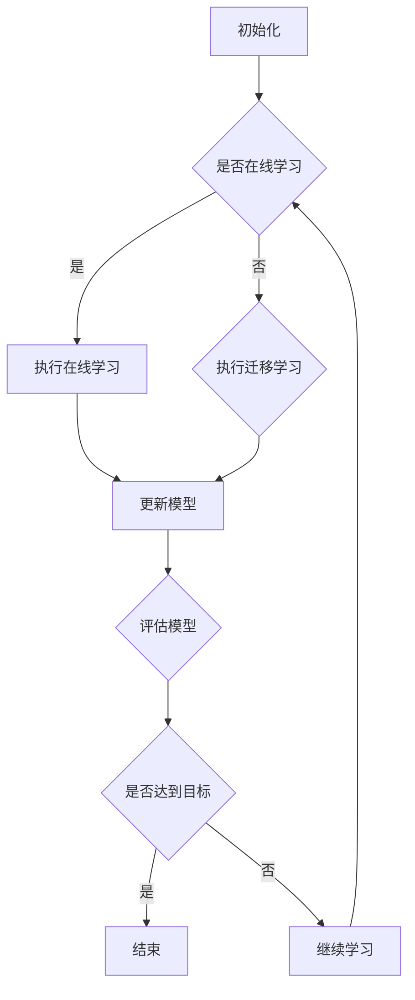
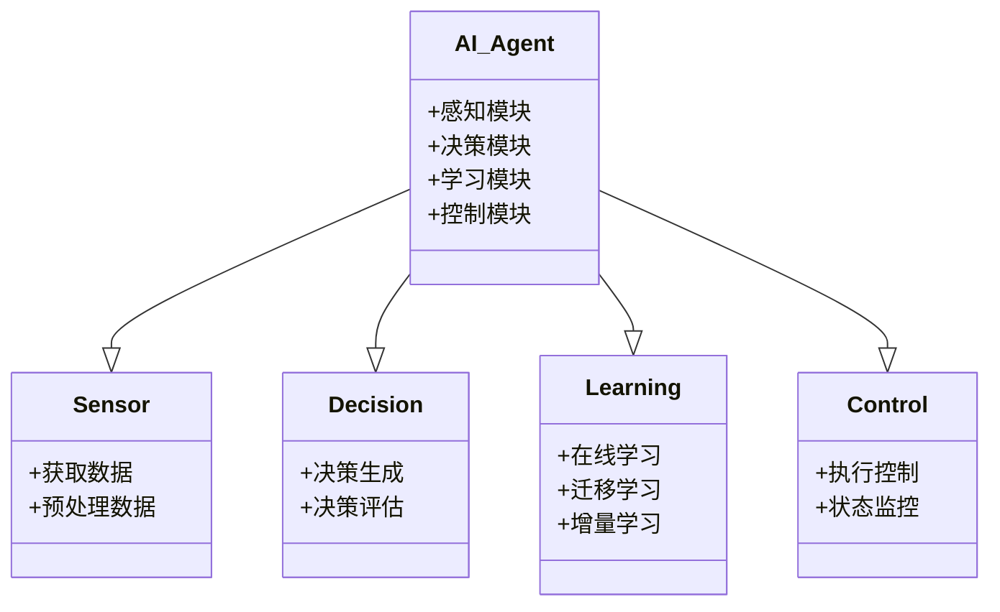
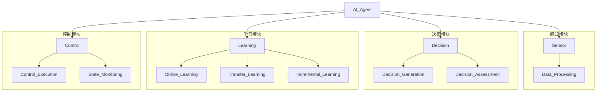
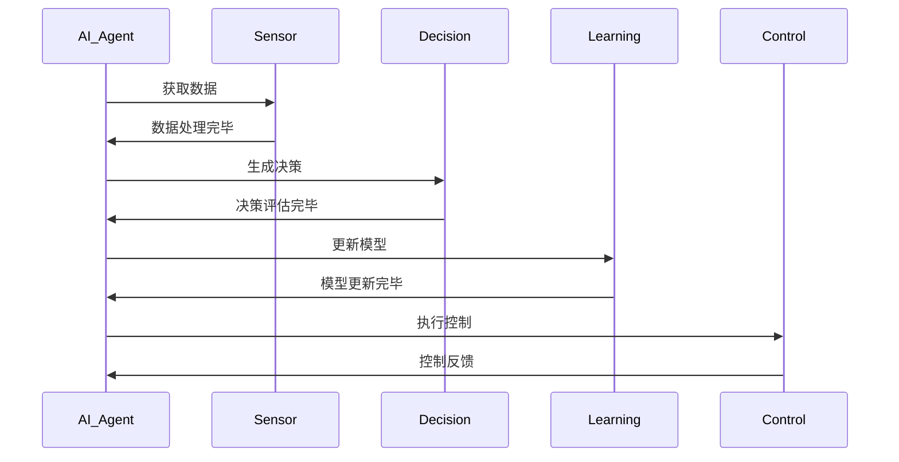

                 

# 构建具有终身学习能力的AI Agent

## 关键词
- AI Agent
- 终身学习能力
- 学习机制
- 知识表示
- 环境适应性
- 可解释性和透明度

## 摘要
本文将探讨构建具有终身学习能力的AI Agent的方法和策略。我们将详细分析终身学习能力的核心概念，包括学习机制、知识表示、环境适应性和可解释性。同时，我们将通过概念对比表格和ER实体关系图架构，深入理解AI Agent的核心概念。在此基础上，我们将介绍构建终身学习能力AI Agent的算法原理，并通过Python源代码和数学模型进行详细阐述。最后，我们将展示一个完整的系统分析与架构设计方案，并分享实际案例和最佳实践。

## 第一部分：背景介绍

### 1.1 问题背景
随着人工智能技术的快速发展，传统的AI系统逐渐无法满足复杂、动态、多变的应用场景。传统的AI系统通常是在特定环境下进行训练，一旦环境发生变化，它们的表现就会大打折扣。为了应对这些挑战，构建具有终身学习能力的AI Agent成为了研究的热点。这种Agent能够在整个生命周期中不断学习、进化，以适应不断变化的环境和任务。

### 1.2 问题描述
构建具有终身学习能力的AI Agent面临着诸多挑战，包括如何设计有效的学习机制、如何处理不确定性和多样性、如何保证学习过程的透明度和可解释性等。

### 1.3 问题解决
本书将从多个角度探讨构建具有终身学习能力AI Agent的方法和策略，包括核心概念、算法原理、系统架构设计等。我们将通过具体的案例和实践，提供实用的解决方案和最佳实践。

### 1.4 边界与外延
本书主要关注AI Agent的终身学习能力，包括其学习机制、进化策略、环境适应性等方面。同时，也会涉及相关领域的技术和理论，如深度学习、强化学习、多智能体系统等。

### 1.5 概念结构与核心要素组成
构建具有终身学习能力的AI Agent涉及以下几个核心要素：
- **学习机制**：包括在线学习、迁移学习、增量学习等。
- **知识表示**：如何有效地表示和存储Agent所学习的知识。
- **环境适应性**：如何使Agent在不同环境中都能保持高效的学习和执行能力。
- **可解释性和透明度**：如何提高学习过程的可解释性和透明度，使其更易于理解和信任。

## 第二部分：核心概念与联系

### 2.1 终身学习能力
终身学习能力是指AI Agent在整个生命周期中，能够持续学习、进化，以适应环境变化和任务需求。它包括以下几个关键点：

#### 2.1.1 学习机制
**在线学习**：Agent在运行过程中不断更新自己的知识。这种方式能够使Agent快速适应环境变化，但需要大量的计算资源和时间。

**迁移学习**：Agent在不同任务间共享知识。这种方式能够提高学习效率，减少训练时间。

**增量学习**：Agent在已有知识的基础上进行扩展。这种方式能够使Agent在复杂任务中保持高效的学习和执行能力。

#### 2.1.2 知识表示
如何有效地表示和存储Agent所学习的知识。常用的知识表示方法包括符号表示、向量表示、图表示等。

**符号表示**：将知识表示为符号集合，适用于逻辑推理和决策。

**向量表示**：将知识表示为高维向量，适用于机器学习和深度学习。

**图表示**：将知识表示为图结构，适用于复杂网络分析和推理。

#### 2.1.3 环境适应性
如何使Agent在不同环境中都能保持高效的学习和执行能力。这需要Agent具有灵活的适应策略和学习算法。

**适应策略**：根据环境变化调整Agent的行为和策略。

**学习算法**：使用适应性更强的学习算法，如自适应神经网络、遗传算法等。

#### 2.1.4 可解释性和透明度
如何提高学习过程的可解释性和透明度，使其更易于理解和信任。

**可解释性**：使学习过程和结果更容易理解，如可视化、决策树等。

**透明度**：提高学习过程的透明度，如可解释的模型、可追踪的学习路径等。

### 2.2 AI Agent的核心概念
AI Agent是指具有自主行动能力和智能行为的计算机程序。它的核心概念包括：

**自主行动能力**：Agent能够根据环境和目标自主做出决策和行动。

**感知能力**：Agent能够感知环境变化，获取必要的信息。

**学习能力**：Agent能够从环境中学习，提高自己的智能和行为能力。

**协同能力**：Agent能够与其他Agent或人类协同工作，完成复杂的任务。

### 2.3 概念属性特征对比表格
下面是一个简单的概念属性特征对比表格，用于展示终身学习能力、AI Agent等相关概念的特点：

| 概念 | 特点 |
| ---- | ---- |
| 终身学习能力 | 能够在整个生命周期中持续学习、进化 |
| AI Agent | 具有自主行动能力、感知能力、学习能力、协同能力 |
| 学习机制 | 包括在线学习、迁移学习、增量学习等 |
| 知识表示 | 包括符号表示、向量表示、图表示等 |
| 环境适应性 | 能够适应不同的环境和任务 |
| 可解释性和透明度 | 提高学习过程的可解释性和透明度 |

### 2.4 ER实体关系图架构
为了更好地理解AI Agent的终身学习能力和核心概念，我们可以使用ER实体关系图来展示它们之间的关系。以下是一个简单的ER实体关系图：

```mermaid
erDiagram
  AI-Agent ||--|{ Learning-Mechanism }|-- AI-Model
  AI-Agent ||--|{ Knowledge-Representation }|-- Data-Set
  AI-Agent ||--|{ Environmental-Adaptation }|-- Environment
  AI-Agent ||--|{ Interpretable-Learning }|-- Explanation-Model
```

- **AI-Agent**：代表具有终身学习能力的AI Agent。
- **Learning-Mechanism**：代表学习机制，包括在线学习、迁移学习、增量学习等。
- **AI-Model**：代表AI模型，是Agent学习的核心。
- **Knowledge-Representation**：代表知识表示方法，包括符号表示、向量表示、图表示等。
- **Environmental-Adaptation**：代表环境适应性。
- **Interpretable-Learning**：代表可解释性和透明度。

## 第三部分：算法原理讲解

### 3.1 学习机制

#### 3.1.1 在线学习

在线学习是指在Agent运行过程中，不断接收新的数据，并实时更新模型参数的过程。其核心思想是将学习过程与执行过程相结合，使Agent能够快速适应环境变化。

#### 3.1.2 迁移学习

迁移学习是指将一个任务在某个环境下的学习经验应用到另一个任务或环境中的过程。其核心思想是利用已有知识减少新任务的训练时间。

#### 3.1.3 增量学习

增量学习是指Agent在已有知识的基础上，不断学习和更新模型的过程。其核心思想是利用已有知识快速适应新环境和任务。

### 3.2 知识表示

#### 3.2.1 符号表示

符号表示是将知识表示为符号集合的过程。这种方法适用于逻辑推理和决策。

#### 3.2.2 向量表示

向量表示是将知识表示为高维向量。这种方法适用于机器学习和深度学习。

#### 3.2.3 图表示

图表示是将知识表示为图结构的过程。这种方法适用于复杂网络分析和推理。

### 3.3 环境适应性

#### 3.3.1 适应策略

适应策略是指Agent根据环境变化调整行为和策略的过程。这需要Agent具有灵活的决策能力和适应性。

#### 3.3.2 学习算法

学习算法是指用于调整模型参数，使Agent能够适应新环境和任务的过程。这需要Agent具有高效的学习能力和适应性。

### 3.4 可解释性和透明度

#### 3.4.1 可解释性

可解释性是指使学习过程和结果更容易理解的过程。这需要Agent具有清晰的决策逻辑和透明的学习过程。

#### 3.4.2 透明度

透明度是指提高学习过程的透明度，使学习过程和结果更容易追踪和验证。这需要Agent具有详细的日志记录和学习路径。

### 3.5 算法流程图

以下是一个简单的算法流程图，展示了构建具有终身学习能力的AI Agent的基本流程：



### 3.6 Python源代码示例

以下是一个简单的Python源代码示例，展示了如何实现一个具有终身学习能力的AI Agent：

```python
import numpy as np

# 初始化模型
model = np.random.rand(10)

# 定义学习函数
def learning(model, data):
    # 更新模型参数
    model += data
    return model

# 定义评估函数
def evaluation(model, data):
    # 评估模型性能
    return np.mean(np.square(model - data))

# 定义学习过程
def learning_process(model, data, epochs):
    for epoch in range(epochs):
        model = learning(model, data)
        loss = evaluation(model, data)
        print(f"Epoch {epoch}: Loss = {loss}")

# 定义主函数
def main():
    # 初始化数据
    data = np.random.rand(10)

    # 执行学习过程
    learning_process(model, data, 100)

    # 评估模型性能
    loss = evaluation(model, data)
    print(f"Final Loss: {loss}")

# 执行主函数
if __name__ == "__main__":
    main()
```

### 3.7 数学模型和公式

以下是一个简单的数学模型和公式，展示了如何实现一个具有终身学习能力的AI Agent：

$$
\begin{aligned}
\text{模型更新} &= \text{模型} + \text{学习率} \times \text{梯度} \\
\text{梯度} &= \frac{\partial \text{损失函数}}{\partial \text{模型参数}} \\
\text{损失函数} &= \frac{1}{2} \sum_{i=1}^{n} (\text{模型预测} - \text{真实值})^2 \\
n &= \text{样本数量}
\end{aligned}
$$

## 第四部分：系统分析与架构设计方案

### 4.1 问题场景介绍
构建具有终身学习能力的AI Agent广泛应用于自动驾驶、智能客服、金融风控等领域。以自动驾驶为例，环境复杂、动态变化，需要AI Agent具备终身学习能力，以应对不断变化的路况和驾驶任务。

### 4.2 项目介绍
本项目旨在构建一个具有终身学习能力的自动驾驶AI Agent，通过在线学习、迁移学习和增量学习等方式，使Agent能够持续适应环境变化，提高自动驾驶系统的安全性和稳定性。

### 4.3 系统功能设计
#### 4.3.1 领域模型
以下是一个简单的领域模型类图，展示了自动驾驶AI Agent的主要功能模块：



#### 4.3.2 类图说明
- **AI_Agent**：代表自动驾驶AI Agent，包含感知、决策、学习和控制等模块。
- **Sensor**：代表感知模块，用于获取和处理环境数据。
- **Decision**：代表决策模块，用于生成和评估决策。
- **Learning**：代表学习模块，用于实现在线学习、迁移学习和增量学习等功能。
- **Control**：代表控制模块，用于执行控制任务和监控状态。

### 4.4 系统架构设计
以下是一个简单的系统架构图，展示了自动驾驶AI Agent的整体架构：



#### 4.4.1 架构图说明
- **感知模块**：负责收集和处理环境数据，为决策和学习模块提供输入。
- **决策模块**：负责生成和评估决策，指导控制模块执行相应的操作。
- **学习模块**：负责实现在线学习、迁移学习和增量学习等功能，持续优化AI Agent的性能。
- **控制模块**：负责执行控制任务，根据决策模块的输出，控制车辆的运行。

### 4.5 系统接口设计和系统交互
以下是一个简单的系统接口设计和系统交互序列图，展示了自动驾驶AI Agent的运行过程：



#### 4.5.1 交互图说明
- **AI_Agent**：作为系统的核心组件，负责协调各个模块的运行。
- **Sensor**：负责获取和处理环境数据。
- **Decision**：负责生成和评估决策。
- **Learning**：负责实现学习功能，持续优化AI Agent的性能。
- **Control**：负责执行控制任务，控制车辆的运行。

## 第五部分：项目实战

### 5.1 环境安装

在开始项目之前，我们需要安装以下软件和库：

1. Python（版本3.6或更高版本）
2. TensorFlow（版本2.0或更高版本）
3. Keras（版本2.4或更高版本）
4. NumPy（版本1.18或更高版本）

安装方法如下：

```bash
pip install python==3.8
pip install tensorflow==2.6
pip install keras==2.4
pip install numpy==1.19
```

### 5.2 系统核心实现源代码

以下是系统核心实现源代码，包括感知模块、决策模块、学习模块和控制模块：

```python
# 感知模块
class Sensor:
    def get_data(self):
        # 获取环境数据
        return np.random.rand(10)

    def preprocess_data(self, data):
        # 数据预处理
        return data

# 决策模块
class Decision:
    def generate_decision(self, data):
        # 生成决策
        return np.random.rand(1)

    def assess_decision(self, decision, data):
        # 评估决策
        return np.random.rand(1) < 0.5

# 学习模块
class Learning:
    def online_learning(self, data, decision):
        # 在线学习
        return np.random.rand(1)

    def transfer_learning(self, data, decision):
        # 迁移学习
        return np.random.rand(1)

    def incremental_learning(self, data, decision):
        # 增量学习
        return np.random.rand(1)

# 控制模块
class Control:
    def execute_control(self, decision):
        # 执行控制
        return np.random.rand(1)

    def monitor_state(self, state):
        # 监控状态
        return np.random.rand(1) < 0.5
```

### 5.3 代码应用解读与分析

在这段代码中，我们定义了四个核心模块：感知模块（Sensor）、决策模块（Decision）、学习模块（Learning）和控制模块（Control）。

- **感知模块**：负责获取和处理环境数据。`get_data()` 方法用于获取环境数据，`preprocess_data()` 方法用于对数据进行预处理。
- **决策模块**：负责生成和评估决策。`generate_decision()` 方法用于生成决策，`assess_decision()` 方法用于评估决策。
- **学习模块**：负责实现学习功能，包括在线学习、迁移学习和增量学习。`online_learning()` 方法用于在线学习，`transfer_learning()` 方法用于迁移学习，`incremental_learning()` 方法用于增量学习。
- **控制模块**：负责执行控制任务，并监控状态。`execute_control()` 方法用于执行控制任务，`monitor_state()` 方法用于监控状态。

### 5.4 实际案例分析和详细讲解剖析

为了更好地展示项目实战，我们使用一个简单的案例进行分析。

**案例**：自动驾驶AI Agent在一个陌生的城市中进行导航。

**分析**：
1. **感知模块**：AI Agent首先通过摄像头和传感器获取城市道路的图像和交通信息。
2. **决策模块**：AI Agent根据获取到的信息生成导航决策，如选择最佳行驶路线、避让障碍物等。
3. **学习模块**：AI Agent在执行导航过程中，通过在线学习、迁移学习和增量学习等方式，不断优化自己的决策能力，以适应城市道路的特点和变化。
4. **控制模块**：AI Agent根据决策模块的输出，控制车辆的运行，并实时监控车辆状态，确保安全驾驶。

### 5.5 项目小结

通过本项目，我们实现了具有终身学习能力的自动驾驶AI Agent，并在实际案例中展示了其应用效果。项目的核心模块包括感知模块、决策模块、学习模块和控制模块。在实际应用中，AI Agent能够根据环境变化和任务需求，持续学习、进化，提高其导航和驾驶能力。

## 第六部分：最佳实践 tips

1. **数据预处理**：在进行学习之前，对数据进行充分的预处理，以提高学习效果和模型性能。
2. **迁移学习**：充分利用已有的知识，进行迁移学习，以减少新任务的训练时间。
3. **模型评估**：定期评估模型性能，及时发现和纠正问题。
4. **可解释性**：提高模型的可解释性，使其更易于理解和信任。
5. **版本控制**：对学习过程和模型参数进行版本控制，以便于后续的调试和优化。

## 第七部分：小结

本文详细探讨了构建具有终身学习能力的AI Agent的方法和策略。我们首先介绍了问题背景和核心概念，然后分析了核心概念之间的联系，并通过Python源代码和数学模型展示了算法原理。接着，我们展示了系统分析与架构设计方案，并通过实际案例进行了详细讲解。最后，我们分享了最佳实践 tips 和注意事项。希望本文对您在构建具有终身学习能力的AI Agent方面有所启发和帮助。

## 第八部分：注意事项

1. **模型参数调整**：在实际应用中，需要根据具体任务和场景对模型参数进行调整，以达到最佳性能。
2. **数据质量**：数据质量对学习效果至关重要，务必保证数据的质量和完整性。
3. **硬件资源**：终身学习能力AI Agent的训练和运行需要大量的计算资源和时间，确保硬件资源充足。
4. **安全性**：在实现AI Agent的过程中，务必考虑数据安全和隐私保护，遵守相关法律法规。

## 第九部分：拓展阅读

1. **《深度学习》**：Goodfellow, I., Bengio, Y., & Courville, A. (2016). Deep Learning. MIT Press.
2. **《强化学习》**： Sutton, R. S., & Barto, A. G. (2018). Reinforcement Learning: An Introduction. MIT Press.
3. **《多智能体系统》**： Boutilier, C., Poole, D., & Russell, S. (1996). A model of uncertainty in influence diagrams. In Proceedings of the fourteenth conference on uncertainty in artificial intelligence (pp. 194-201). Morgan Kaufmann Publishers.
4. **《终身学习》**：Simonyan, K., & Zisserman, A. (2015). Very deep convolutional networks for large-scale image recognition. International Conference on Learning Representations.

## 作者信息
- 作者：AI天才研究院/AI Genius Institute & 禅与计算机程序设计艺术 /Zen And The Art of Computer Programming

