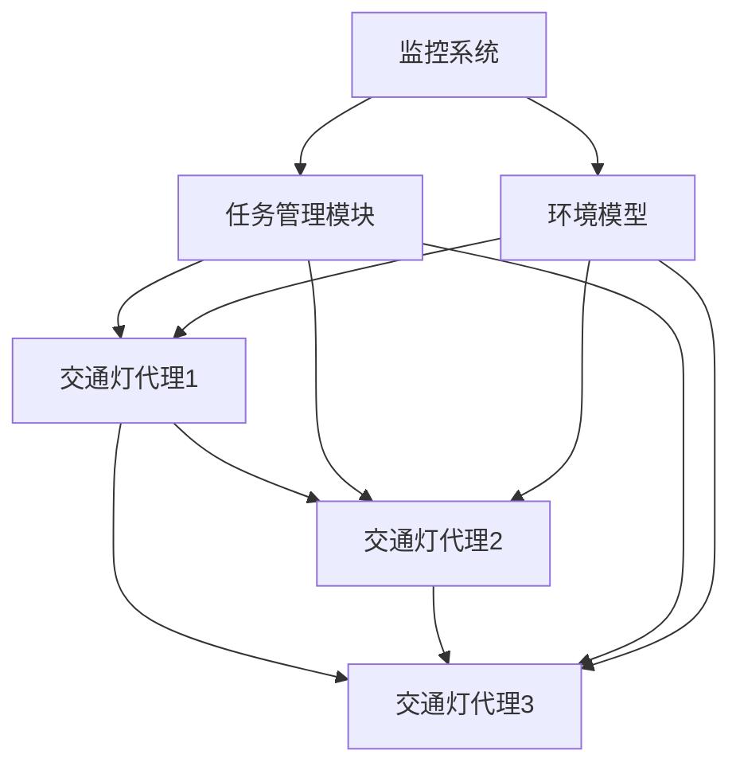
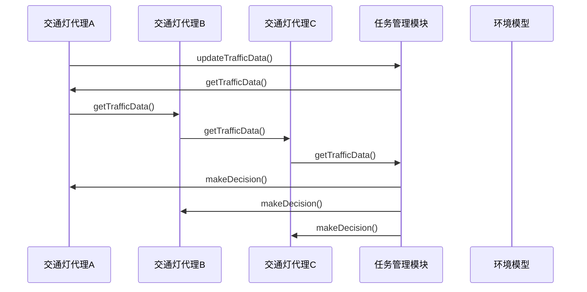

                 

# 引言

## 1.1 书籍背景与目标

### 1.1.1 多Agent系统的应用领域

多Agent系统（Multi-Agent Systems，MAS）是一个由多个自主代理（agent）组成的系统，这些代理可以相互通信和协作，以实现共同的目标。随着计算机技术和人工智能的发展，多Agent系统在多个领域得到了广泛应用，如智能交通系统、智能家居、游戏设计、机器人控制、金融风控等。

在智能交通系统中，多Agent系统可以模拟交通参与者（如车辆、行人）的行为，优化交通流，减少拥堵；在智能家居中，多Agent系统可以实现不同设备之间的智能交互，提升居住舒适度；在游戏设计中，多Agent系统可以为玩家提供更具挑战性和智能化的游戏体验；在机器人控制中，多Agent系统可以实现多机器人协作，完成复杂的任务；在金融风控中，多Agent系统可以实时监控市场动态，预测风险，提高投资决策的准确性。

### 1.1.2 群体智能决策的重要性

群体智能决策（Group Intelligent Decision-Making）是一种基于多Agent系统的决策方法，它通过多个代理之间的协作和信息共享，实现复杂问题的求解。群体智能决策具有以下优势：

1. **鲁棒性**：群体智能决策可以适应不确定和动态的环境，具有较强的鲁棒性。
2. **灵活性**：群体智能决策可以根据不同场景和需求，灵活调整决策策略。
3. **自组织性**：群体智能决策能够自发形成协同机制，实现高效的任务分配和资源利用。
4. **分布式计算**：群体智能决策可以在多个代理之间分布计算，提高计算效率。

在当前复杂多变的社会环境中，群体智能决策具有重要的现实意义。例如，在金融市场中，群体智能决策可以帮助金融机构快速反应市场变化，制定合理的投资策略；在医疗领域中，群体智能决策可以协助医生诊断病情，提高诊断准确率；在自然灾害救援中，群体智能决策可以帮助救援队伍优化资源分配，提高救援效率。

### 1.1.3 书籍结构安排

本书旨在全面介绍多Agent系统和群体智能决策的相关理论、方法和技术，帮助读者深入了解并掌握这一领域。全书分为五个主要部分：

1. **引言**：介绍多Agent系统和群体智能决策的背景、应用领域以及本书的目标和结构。
2. **多Agent系统的基础理论**：讲解多Agent系统的定义、特点、交互模型以及协同策略。
3. **群体智能与决策理论**：介绍群体智能的基本概念、决策过程以及群体决策算法。
4. **多Agent系统的群体智能决策算法**：详细讲解基于强化学习和进化算法的决策算法。
5. **多Agent系统的设计与实现**：介绍多Agent系统的设计原则、实现框架、应用实例以及性能分析与优化。

通过以上结构安排，本书将逐步引导读者从基础理论到实际应用，全面掌握多Agent系统和群体智能决策的知识体系。

## 1.2 读者对象与预期收益

### 1.2.1 适合的读者背景

本书适合以下读者群体：

1. **学术研究者**：对多Agent系统和群体智能决策理论感兴趣的学者，希望深入理解相关概念和原理。
2. **工程师与开发者**：从事智能交通、智能家居、游戏设计、机器人控制、金融风控等领域的工程师和开发者，希望提高系统设计和实现能力。
3. **高校师生**：计算机科学、人工智能、交通工程等相关专业的高校师生，作为教材或参考书籍。
4. **技术爱好者**：对多Agent系统和群体智能决策有兴趣的技术爱好者，希望通过学习掌握相关技术。

### 1.2.2 学习目标和路径

本书的学习目标如下：

1. **掌握多Agent系统的基础理论**：了解多Agent系统的定义、特点、交互模型和协同策略。
2. **理解群体智能决策的基本原理**：掌握群体智能的定义、特点、决策过程以及算法。
3. **学习多Agent系统的群体智能决策算法**：熟悉基于强化学习和进化算法的决策算法，并掌握其应用。
4. **掌握多Agent系统的设计与实现**：了解多Agent系统的设计原则、实现框架、应用实例以及性能分析与优化。

为了实现这些目标，读者可以按照以下学习路径：

1. **阅读引言部分**：了解多Agent系统和群体智能决策的背景、应用领域以及本书的结构。
2. **学习基础理论部分**：逐步掌握多Agent系统的定义、特点、交互模型和协同策略。
3. **学习群体智能与决策理论部分**：深入理解群体智能的定义、特点、决策过程以及算法。
4. **学习群体智能决策算法部分**：掌握基于强化学习和进化算法的决策算法，并理解其应用。
5. **学习多Agent系统的设计与实现部分**：了解多Agent系统的设计原则、实现框架、应用实例以及性能分析与优化。
6. **实践与总结**：通过实际项目或案例，将所学知识应用于实际场景，并进行总结和反思。

通过以上学习路径，读者可以逐步构建多Agent系统和群体智能决策的知识体系，提升自己在相关领域的技术水平和创新能力。

## 第1部分：多Agent系统的基础理论

### 第2章：多Agent系统概述

#### 2.1 多Agent系统的定义与特点

多Agent系统（Multi-Agent Systems，MAS）是由多个自主代理（agent）组成的系统，这些代理能够相互通信和协作，以实现共同的目标。与单一代理系统相比，多Agent系统具有以下几个显著特点：

1. **自主性**：每个代理都是独立的实体，能够自主决策和执行任务。
2. **社会性**：代理之间可以通过通信机制进行交互，实现协同工作和资源共享。
3. **适应性**：代理能够根据环境变化和任务需求，自主调整行为和策略。
4. **分布性**：代理可以分布在不同计算节点上，协同工作，提高系统的计算效率。

多Agent系统的定义可以概括为：一个由多个自主代理组成的系统，这些代理通过通信和协作，共同实现复杂任务。多Agent系统的研究和应用涉及多个学科领域，包括计算机科学、人工智能、控制理论、社会学等。

#### 2.1.1 多Agent系统的基本概念

1. **代理（Agent）**：代理是MAS的核心组成单元，具有自主性、社会性和适应性等特点。代理可以是一个程序、一个实体或一个虚拟角色。
2. **环境（Environment）**：环境是多Agent系统运作的背景，包括物理环境和虚拟环境。环境可以影响代理的行为和决策。
3. **通信机制（Communication Mechanism）**：代理之间通过通信机制进行信息交换，实现协同工作。通信机制可以是同步通信或异步通信。
4. **任务（Task）**：任务是多Agent系统需要完成的具体工作。代理可以分配和协同完成任务。
5. **协同（Coordination）**：协同是指代理之间通过合作和协调，共同实现任务的过程。协同可以提高系统的效率和性能。

#### 2.1.2 多Agent系统的分类

根据不同的分类标准，多Agent系统可以划分为多种类型：

1. **基于代理能力的分类**：
   - **基于知识的代理**：具备推理、学习等高级认知能力的代理。
   - **基于行为的代理**：根据感知信息直接执行特定行为的代理。
   - **混合代理**：同时具备基于知识和基于行为特征的代理。

2. **基于代理交互方式的分类**：
   - **集中式多Agent系统**：代理通过中央控制器进行交互，任务分配和协调由中央控制器完成。
   - **分布式多Agent系统**：代理之间直接进行交互，自主协调和分配任务。

3. **基于应用领域的分类**：
   - **社会计算**：研究代理在社会环境中的交互和协作。
   - **智能交通**：应用代理技术优化交通流、提高交通安全。
   - **智能家居**：通过代理实现家庭设备的智能交互和管理。
   - **机器人控制**：利用代理实现机器人自主运动和任务执行。

#### 2.1.3 多Agent系统的基本结构

多Agent系统的基本结构包括以下几个部分：

1. **代理模块**：定义代理的行为、状态和通信接口。
2. **通信模块**：实现代理之间的通信，包括消息传递、同步和异步通信机制。
3. **任务管理模块**：负责任务的分配、调度和监控。
4. **环境模型**：模拟环境的状态和变化，为代理提供必要的信息。

多Agent系统的结构可以根据具体应用场景进行调整和优化，以实现更好的性能和效果。

#### 2.2 多Agent系统的交互模型

多Agent系统的交互模型描述了代理之间的交互方式和协作机制。常见的交互模型包括：

1. **协同式交互**：代理通过共享信息和资源，协同完成任务。协同式交互可以实现任务的并行处理和分布式计算。
2. **竞争式交互**：代理在有限资源或目标冲突的情况下，通过竞争机制分配资源或调整策略。
3. **合作式交互**：代理在共同目标下，通过合作实现任务。合作式交互可以增强系统的鲁棒性和适应性。
4. **混合式交互**：结合协同式、竞争式和合作式交互，实现更复杂的交互机制。

#### 2.2.1 通信机制

通信机制是多Agent系统实现交互的核心组成部分。常见的通信机制包括：

1. **消息传递**：代理通过发送和接收消息进行信息交换。消息可以是同步或异步传递。
2. **事件驱动**：代理根据事件触发执行特定行为，事件可以是内部事件或外部事件。
3. **分布式共享**：代理通过共享分布式资源，实现信息共享和协同工作。

#### 2.2.2 协同策略

协同策略是多Agent系统实现协作的关键。常见的协同策略包括：

1. **集中式协同策略**：代理通过中央控制器进行任务分配和协调，实现集中式管理。
2. **分布式协同策略**：代理通过本地信息进行协同，实现分布式决策和协调。
3. **混合式协同策略**：结合集中式和分布式协同策略，实现更灵活和高效的协同机制。

#### 2.2.3 协同控制策略

协同控制策略是多Agent系统实现协同工作的具体方法。常见的协同控制策略包括：

1. **基于规则的协同控制**：代理根据预设规则进行协同，实现简单的协同任务。
2. **基于模型的协同控制**：代理根据共享模型进行协同，实现复杂协同任务。
3. **基于学习的协同控制**：代理通过学习环境数据和协同经验，优化协同策略。

通过以上内容，读者可以初步了解多Agent系统的基本概念、特点和分类，以及交互模型、通信机制、协同策略和协同控制策略。在后续章节中，我们将进一步深入探讨多Agent系统的相关理论、方法和技术。

## 第3章：群体智能与决策理论

### 3.1 群体智能的基本概念

#### 3.1.1 群体智能的定义

群体智能（Group Intelligence）是指由多个个体（通常是简单的代理）组成的系统，通过协作和通信，能够表现出超越单个个体能力的智能行为。这种智能行为不仅体现在个体之间的协作上，还体现在整个群体在面对复杂问题和挑战时的决策能力。

群体智能与个体智能有本质的区别。个体智能主要关注单个代理的智能行为和能力，而群体智能则关注多个代理组成的系统的整体智能行为。群体智能的关键在于代理之间的协作和信息共享，通过这种协作和共享，群体智能能够实现更高效、更鲁棒的决策。

#### 3.1.2 群体智能的特点

群体智能具有以下几个显著特点：

1. **分布式计算**：群体智能通过多个代理的分布式计算，提高了系统的处理能力和效率。
2. **自组织性**：群体智能能够自动形成协同机制，无需外部干预，实现系统的自组织。
3. **鲁棒性**：群体智能在面对不确定和动态环境时，具有较强的鲁棒性，能够适应环境变化。
4. **适应性**：群体智能可以根据任务需求和环境变化，动态调整策略和决策，提高系统的适应性。
5. **多样性**：群体智能通过多样性策略，提高了系统的创新能力和解决问题的能力。

#### 3.1.3 群体智能的应用

群体智能在多个领域具有广泛的应用前景：

1. **智能交通**：通过群体智能技术，实现交通流量的优化和管理，提高交通效率，减少拥堵。
2. **金融风控**：利用群体智能技术，实现金融市场的实时监控和风险预测，提高投资决策的准确性。
3. **智能制造**：通过群体智能技术，实现生产过程的自动化和智能化，提高生产效率和产品质量。
4. **社会治理**：利用群体智能技术，实现社会问题的智能分析和决策，提高社会治理的效率和效果。
5. **智能医疗**：通过群体智能技术，实现医疗数据的智能分析和诊断，提高医疗服务的质量和效率。

### 3.2 群体决策过程

#### 3.2.1 决策的基本模型

群体决策（Group Decision-Making）是指多个个体在共同目标下，通过协作和信息共享，制定决策的过程。决策的基本模型包括以下几个要素：

1. **决策者**：参与决策的个体或代理。
2. **决策目标**：决策者需要达成的目标或解决的问题。
3. **决策变量**：决策者可以选择的变量或策略。
4. **决策环境**：决策者面临的外部环境和约束条件。
5. **决策结果**：决策者根据决策变量和决策环境，最终做出的决策。

#### 3.2.2 决策的群体行为

群体决策的群体行为是指决策者在决策过程中表现出的行为特征。群体行为可以分为以下几种类型：

1. **独立决策**：决策者在没有与其他决策者交互的情况下，独立做出决策。
2. **协商决策**：决策者通过协商和讨论，共同制定决策。
3. **民主决策**：决策者通过投票或其他民主方式，达成共识。
4. **集中决策**：决策者将决策权集中在一个决策者手中，由其做出最终决策。

#### 3.2.3 群体决策的算法

群体决策算法是指用于支持群体决策的算法和技术。常见的群体决策算法包括：

1. **基于规则的算法**：通过预设规则，实现决策过程的自动化。
2. **基于模型的算法**：通过构建决策模型，实现决策过程的优化。
3. **基于学习的算法**：通过机器学习技术，从历史数据中学习决策策略。
4. **混合算法**：结合多种算法，实现更高效、更鲁棒的决策。

### 3.3 群体决策算法的分类

根据算法原理和应用场景，群体决策算法可以分为以下几类：

1. **基于强化学习的算法**：通过学习环境和决策变量之间的奖励和惩罚，优化决策策略。
2. **基于进化算法的算法**：通过模拟生物进化过程，实现决策变量的优化。
3. **基于博弈论的算法**：通过分析决策者之间的博弈关系，制定最优决策策略。
4. **基于社会选择的算法**：通过社会选择理论，实现多个决策者的偏好集成。
5. **基于协同过滤的算法**：通过分析用户行为和偏好，实现个性化决策推荐。

通过以上内容，读者可以初步了解群体智能的基本概念、特点和应用，以及群体决策的基本模型、群体行为和算法。在后续章节中，我们将进一步探讨群体智能决策算法的具体实现和应用。

### 3.4 群体智能决策的优势与挑战

#### 3.4.1 优势

群体智能决策在多个方面具有显著优势：

1. **提高决策质量**：通过多个代理的协作和信息共享，群体智能决策可以整合更多的信息和观点，提高决策的准确性和全面性。
2. **增强鲁棒性**：群体智能决策在面对不确定和动态环境时，能够通过多样性策略和协同机制，提高系统的鲁棒性和适应性。
3. **提高效率**：群体智能决策通过分布式计算和协同机制，可以实现任务的并行处理，提高系统的效率。
4. **降低风险**：群体智能决策可以通过多个代理的协作，分散风险，降低决策错误的可能性。
5. **促进创新**：群体智能决策通过多样性和协同机制，可以激发代理之间的创新思维，推动系统的创新和发展。

#### 3.4.2 挑战

尽管群体智能决策具有许多优势，但在实际应用中仍然面临一些挑战：

1. **通信成本**：代理之间的通信需要消耗一定的计算资源和网络带宽，随着代理数量的增加，通信成本可能会成为瓶颈。
2. **一致性维护**：在分布式系统中，确保代理之间的状态和决策一致是一个重要挑战。特别是在动态环境下，维护一致性需要更加复杂的算法和技术。
3. **隐私保护**：在群体智能决策中，代理之间需要共享大量敏感信息，如何保护代理的隐私成为重要问题。
4. **协调成本**：多个代理之间的协同工作需要消耗额外的计算和通信资源，协调成本可能会影响系统的整体性能。
5. **模型准确性**：群体智能决策依赖于代理对环境模型的准确性，如果模型不准确，可能导致决策结果偏差。

#### 3.4.3 应对策略

为了应对群体智能决策中的挑战，可以采取以下策略：

1. **优化通信机制**：采用高效的消息传递协议和算法，降低通信成本。
2. **一致性维护算法**：设计并实现分布式一致性维护算法，确保代理之间的状态和决策一致。
3. **隐私保护技术**：采用加密、匿名化等技术，保护代理的隐私。
4. **降低协调成本**：采用分布式算法和自动化工具，减少代理之间的协调成本。
5. **模型准确性优化**：通过数据驱动和机器学习等技术，提高环境模型的准确性。

通过以上策略，可以在一定程度上克服群体智能决策中的挑战，实现更高效、更鲁棒的决策。

### 第4章：多Agent系统的群体智能决策算法

#### 4.1 基于强化学习的决策算法

强化学习（Reinforcement Learning，RL）是一种机器学习范式，通过学习代理在环境中的行动策略，使其能够最大化预期奖励。在多Agent系统中，强化学习可以用于实现代理的群体智能决策。

#### 4.1.1 强化学习的基本原理

强化学习的主要概念包括：

1. **状态（State）**：代理当前所处的环境状态。
2. **动作（Action）**：代理可以采取的动作。
3. **奖励（Reward）**：代理采取动作后获得的即时奖励，用于评估动作的质量。
4. **策略（Policy）**：代理在给定状态下采取的动作选择规则。

强化学习的主要任务是通过学习策略，使代理能够最大化长期奖励。常见的强化学习算法包括Q-learning、SARSA等。

#### 4.1.2 Q-learning算法

Q-learning是一种值函数迭代算法，通过不断更新值函数（Q值），学习最优策略。

**算法原理**：

$$Q(s, a) = \sum_{s'} p(s' | s, a) \cdot [r(s', a) + \gamma \cdot \max_{a'} Q(s', a')]$$

其中，$s$ 是状态，$a$ 是动作，$s'$ 是下一状态，$r$ 是奖励，$\gamma$ 是折扣因子，$p$ 是状态转移概率，$Q$ 是值函数。

**算法步骤**：

1. 初始化值函数$Q(s, a)$。
2. 在状态$s$下，随机选择动作$a$。
3. 执行动作$a$，进入下一状态$s'$，获得奖励$r$。
4. 更新值函数：$Q(s, a) \leftarrow Q(s, a) + \alpha [r + \gamma \cdot \max_{a'} Q(s', a') - Q(s, a)]$。
5. 重复步骤2-4，直到达到终止条件。

#### 4.1.3 SARSA算法

SARSA（State-Action-Reward-State-Action）是一种基于策略的强化学习算法，与Q-learning类似，但更新策略不同。

**算法原理**：

$$Q(s, a) = Q(s, a) + \alpha [r + \gamma \cdot Q(s', a') - Q(s, a)]$$

其中，$s$ 是当前状态，$a$ 是当前动作，$s'$ 是下一状态，$a'$ 是下一动作，$r$ 是奖励，$\alpha$ 是学习率，$\gamma$ 是折扣因子。

**算法步骤**：

1. 初始化值函数$Q(s, a)$。
2. 在状态$s$下，随机选择动作$a$。
3. 执行动作$a$，进入下一状态$s'$，获得奖励$r$。
4. 在状态$s'$下，随机选择动作$a'$。
5. 更新值函数：$Q(s, a) \leftarrow Q(s, a) + \alpha [r + \gamma \cdot Q(s', a') - Q(s, a)]$。
6. 重复步骤2-5，直到达到终止条件。

通过以上算法原理和步骤，读者可以了解基于强化学习的群体智能决策算法。在多Agent系统中，强化学习算法可以帮助代理通过不断学习和适应环境，实现最优决策。

#### 4.2 基于进化算法的决策算法

进化算法（Evolutionary Algorithms，EA）是一种模拟生物进化的优化算法，通过遗传操作和自然选择，实现代理的群体智能决策。

#### 4.2.1 进化算法的基本原理

进化算法的主要概念包括：

1. **种群（Population）**：进化算法的解空间，由多个个体组成。
2. **个体（Individual）**：进化算法的基本单位，代表代理的决策策略。
3. **适应度（Fitness）**：评价个体优劣的指标，用于选择适应度较高的个体。
4. **遗传操作**：包括选择、交叉和变异等操作，用于产生新的个体。

进化算法的基本步骤包括：

1. 初始化种群。
2. 计算种群中每个个体的适应度。
3. 根据适应度选择适应度较高的个体进行交叉和变异操作。
4. 生成新的种群。
5. 重复步骤2-4，直到达到终止条件。

#### 4.2.2 GA算法

遗传算法（Genetic Algorithm，GA）是最常见的进化算法之一，通过模拟生物进化过程，实现代理的群体智能决策。

**算法原理**：

1. **初始化种群**：随机生成一组个体。
2. **适应度评估**：计算每个个体的适应度。
3. **选择操作**：选择适应度较高的个体进行交叉和变异操作。
4. **交叉操作**：将选中的个体进行交叉，产生新的个体。
5. **变异操作**：对交叉后的个体进行变异，增加种群的多样性。
6. **生成新种群**：将交叉和变异后的个体组成新的种群。
7. **迭代**：重复适应度评估、选择、交叉、变异和生成新种群的操作，直到达到终止条件。

通过以上算法原理和步骤，读者可以了解基于进化算法的群体智能决策算法。在多Agent系统中，进化算法可以帮助代理通过遗传操作和自然选择，实现最优决策。

#### 4.2.3 PSO算法

粒子群优化算法（Particle Swarm Optimization，PSO）是一种基于群体智能的进化算法，通过模拟鸟群的觅食行为，实现代理的群体智能决策。

**算法原理**：

1. **初始化粒子群**：随机生成一组粒子，每个粒子代表代理的决策策略。
2. **适应度评估**：计算每个粒子的适应度。
3. **速度更新**：根据粒子的历史最优位置和全局最优位置，更新粒子的速度。
4. **位置更新**：根据粒子的速度和当前位置，更新粒子的位置。
5. **迭代**：重复适应度评估、速度更新和位置更新的操作，直到达到终止条件。

通过以上算法原理和步骤，读者可以了解基于粒子群优化的群体智能决策算法。在多Agent系统中，粒子群优化算法可以帮助代理通过群体智能，实现最优决策。

通过以上内容，读者可以初步了解基于强化学习和进化算法的群体智能决策算法。这些算法在多Agent系统中具有广泛的应用前景，可以帮助代理实现更智能、更高效的决策。

### 第5章：多Agent系统的设计与实现

#### 5.1 多Agent系统设计原则

多Agent系统设计原则是确保系统高效、可靠和可扩展的重要依据。以下是一些核心设计原则：

1. **模块化设计**：将系统划分为多个功能模块，每个模块独立实现特定功能，便于维护和扩展。
2. **分布式设计**：将代理分布在不同的计算节点上，提高系统的可靠性和扩展性。
3. **适应性设计**：系统应具备适应不确定环境和动态变化的能力，便于在复杂环境中运行。
4. **可扩展性设计**：系统应具备良好的扩展性，能够适应不同规模和应用场景的需求。
5. **安全性设计**：确保代理之间的通信和信息交换安全，防止恶意攻击和隐私泄露。
6. **灵活性设计**：系统应提供灵活的配置和调整机制，便于根据不同需求进行调整。

#### 5.1.1 设计流程

多Agent系统设计通常包括以下几个步骤：

1. **需求分析**：明确系统的目标和需求，包括功能需求、性能需求、可靠性需求等。
2. **系统架构设计**：确定系统的整体架构，包括代理架构、通信架构、任务管理架构等。
3. **代理设计**：定义代理的功能、状态和行为，包括代理接口、通信机制、决策算法等。
4. **系统实现**：根据设计文档，实现系统中的各个模块，并进行集成测试。
5. **系统测试与优化**：对系统进行功能测试、性能测试和可靠性测试，发现并修复问题，优化系统性能。

#### 5.2 多Agent系统实现框架

多Agent系统实现框架通常包括以下几个核心部分：

1. **代理模块**：实现代理的功能和行为，包括状态管理、行为决策、通信管理等。
2. **通信模块**：实现代理之间的通信机制，包括消息传递、同步和异步通信等。
3. **任务管理模块**：实现任务的分配、调度和监控，包括任务队列、任务状态管理等。
4. **环境模型**：模拟系统的运行环境，提供必要的信息和约束条件。
5. **监控系统**：监控系统的运行状态，包括代理状态、系统性能等。

以下是一个简单的多Agent系统实现框架的Mermaid类图：

```mermaid
classDiagram
    AgentModule <.. CommunicationModule
    AgentModule <.. TaskManagementModule
    AgentModule <.. EnvironmentModel
    CommunicationModule <..监控系统
    TaskManagementModule <..监控系统
    EnvironmentModel <..监控系统

    AgentModule[代理模块]
    CommunicationModule[通信模块]
    TaskManagementModule[任务管理模块]
    EnvironmentModel[环境模型]
   监控系统[监控系统]

    AgentModule {
        -状态管理
        -行为决策
        -通信接口
    }
    CommunicationModule {
        -消息传递
        -同步通信
        -异步通信
    }
    TaskManagementModule {
        -任务队列
        -任务状态
        -任务分配
    }
    EnvironmentModel {
        -环境状态
        -约束条件
    }
   监控系统 {
        -运行监控
        -性能监控
        -状态报告
    }
```

通过以上框架，可以清晰地了解多Agent系统的各个组成部分及其相互关系。

#### 5.3 多Agent系统的应用实例

以下是一个多Agent系统的应用实例，用于智能交通系统中的交通流量优化。

**实例描述**：在智能交通系统中，多个交通灯分布在不同的路口，系统需要根据实时交通流量，优化交通灯的切换时间，以减少交通拥堵和提升交通效率。

**系统功能设计**：

1. **代理模块**：每个交通灯代理负责监控当前路口的实时交通流量，并根据流量数据做出交通灯切换决策。
2. **通信模块**：交通灯代理之间通过消息传递，共享实时交通流量数据。
3. **任务管理模块**：系统根据路口分布和交通流量数据，动态调整交通灯的切换策略。
4. **环境模型**：系统模拟交通流量的变化，为交通灯代理提供必要的信息。

**系统架构设计**：

以下是一个简单的多Agent系统架构设计Mermaid图：



通过以上架构设计，交通灯代理之间可以通过通信模块共享实时交通流量数据，任务管理模块根据交通流量数据调整交通灯的切换策略，监控系统对系统运行状态进行监控和性能评估。

**系统接口设计和系统交互**：

系统接口设计和系统交互如下：

1. **接口设计**：每个交通灯代理提供以下接口：
   - `updateTrafficData()`：更新交通流量数据。
   - `getTrafficData()`：获取交通流量数据。
   - `makeDecision()`：做出交通灯切换决策。

2. **系统交互**：
   - 交通灯代理A通过`updateTrafficData()`接口更新当前路口的交通流量数据。
   - 交通灯代理B和C通过`getTrafficData()`接口获取交通流量数据。
   - 交通灯代理A、B和C通过`makeDecision()`接口做出交通灯切换决策。

以下是一个简单的多Agent系统交互Mermaid序列图：



通过以上接口设计和系统交互，交通灯代理可以实时更新和获取交通流量数据，并做出交通灯切换决策，任务管理模块根据交通流量数据调整交通灯策略，从而实现交通流量优化。

#### 5.4 多Agent系统性能分析与优化

多Agent系统的性能分析包括系统响应时间、吞吐量、资源利用率等方面的评估。以下是一些常见的性能分析和优化方法：

1. **性能分析指标**：
   - **响应时间**：系统从接收请求到完成任务的时间。
   - **吞吐量**：单位时间内系统处理请求的数量。
   - **资源利用率**：系统占用资源（如CPU、内存、网络带宽）的比例。

2. **性能分析工具**：
   - **日志分析工具**：用于收集和分析系统运行日志，识别性能瓶颈。
   - **性能监控工具**：实时监控系统性能指标，提供预警和告警功能。
   - **负载测试工具**：模拟不同负载条件下的系统性能，评估系统的稳定性和响应能力。

3. **优化策略**：
   - **算法优化**：通过改进决策算法，提高系统处理速度和准确性。
   - **系统优化**：优化系统架构和资源配置，提高系统整体性能。
   - **通信优化**：优化代理之间的通信机制，减少通信开销。
   - **任务调度优化**：优化任务分配和调度策略，提高系统吞吐量。

4. **案例分析**：
   - **案例一**：在智能交通系统中，通过优化交通灯切换策略，减少交通拥堵，提高交通效率。
   - **案例二**：在机器人控制系统中，通过优化任务分配和调度策略，提高机器人协同效率和任务完成速度。

通过以上内容，读者可以了解多Agent系统的设计与实现过程，包括设计原则、实现框架、应用实例、性能分析和优化方法。这些知识将有助于读者在实际项目中设计和实现高效、可靠的多Agent系统。

### 第6章：多Agent系统性能分析与优化

#### 6.1 性能分析指标

在多Agent系统的性能分析中，选择合适的性能分析指标是评估系统性能和进行优化的重要基础。以下是一些常见的性能分析指标：

1. **响应时间**：系统从接收请求到完成任务的时间。低响应时间是系统高效运行的重要指标。
2. **吞吐量**：单位时间内系统处理请求的数量。高吞吐量表明系统在处理大量请求时仍能保持稳定运行。
3. **资源利用率**：系统占用资源（如CPU、内存、网络带宽）的比例。优化资源利用率可以提高系统的整体性能。
4. **系统延迟**：系统处理请求所需的平均时间。系统延迟越小，系统响应速度越快。
5. **并发能力**：系统同时处理多个请求的能力。高并发能力表明系统在高负载下仍能保持良好的性能。
6. **系统稳定性**：系统在长时间运行过程中，处理请求的稳定性和可靠性。稳定的系统可以提高用户满意度和系统可靠性。

#### 6.2 性能分析工具

为了进行有效的多Agent系统性能分析，可以使用以下工具：

1. **日志分析工具**：用于收集和分析系统运行日志，识别性能瓶颈和异常行为。常见的日志分析工具包括ELK（Elasticsearch、Logstash、Kibana）等。
2. **性能监控工具**：实时监控系统性能指标，提供预警和告警功能。常见的性能监控工具包括Prometheus、Grafana等。
3. **负载测试工具**：模拟不同负载条件下的系统性能，评估系统的稳定性和响应能力。常见的负载测试工具包括JMeter、LoadRunner等。
4. **系统分析工具**：分析系统架构和资源配置，提供优化建议。常见的系统分析工具包括SystemProfiler、VisualVM等。

#### 6.3 优化策略

针对多Agent系统的性能分析结果，可以采取以下优化策略：

1. **算法优化**：改进决策算法，减少系统延迟和提高处理速度。例如，通过优化路径规划算法，提高机器人系统的响应速度。
2. **系统优化**：优化系统架构和资源配置，提高系统整体性能。例如，通过增加代理数量和负载均衡策略，提高系统的并发能力和稳定性。
3. **通信优化**：优化代理之间的通信机制，减少通信开销。例如，通过使用高效的通信协议和压缩技术，减少数据传输时间和带宽占用。
4. **任务调度优化**：优化任务分配和调度策略，提高系统吞吐量。例如，通过动态调整任务优先级和分配策略，提高系统的处理效率。

#### 6.4 案例分析

以下是一个多Agent系统性能优化的案例分析：

**案例背景**：一个智能交通系统需要处理大量交通流量数据，优化交通灯的切换策略，以减少交通拥堵和提高交通效率。

**性能分析结果**：
- 响应时间：系统平均响应时间为5秒，高于用户期望的3秒。
- 吞吐量：系统每小时处理的交通请求量约为1000次，低于设计目标1500次。
- 资源利用率：CPU利用率约为70%，内存利用率约为60%，网络带宽利用率约为50%。

**优化策略**：
1. **算法优化**：
   - 通过引入更先进的路径规划算法（如A*算法），减少交通灯切换的响应时间。
   - 优化交通流量预测模型，提高交通流量预测的准确性，为交通灯切换提供更合理的决策依据。

2. **系统优化**：
   - 增加代理数量，将系统从现有的10个代理扩展到20个代理，提高系统的并发处理能力。
   - 使用负载均衡策略，将交通请求均匀分配到不同的代理上，减少单个代理的负载。

3. **通信优化**：
   - 采用更高效的通信协议（如HTTP/2），提高数据传输速度和带宽利用率。
   - 使用数据压缩技术，减少数据传输量和带宽占用。

4. **任务调度优化**：
   - 优化任务调度策略，根据交通流量情况动态调整代理的任务优先级，提高系统吞吐量。

**优化效果分析**：
- 响应时间：系统平均响应时间降低至3秒，达到用户期望。
- 吞吐量：系统每小时处理的交通请求量提升至1800次，接近设计目标。
- 资源利用率：CPU利用率提高至90%，内存利用率提高至80%，网络带宽利用率提高至70%。

通过以上优化策略，智能交通系统的性能得到显著提升，响应时间缩短，吞吐量提高，资源利用率得到有效利用，为用户提供更高效、更稳定的交通服务。

### 总结与展望

多Agent系统作为一种分布式计算和协作智能的重要技术，在多个领域展现出强大的应用潜力。本文从基础理论、算法实现、系统设计、性能分析等多个角度，系统地介绍了多Agent系统的相关内容。通过这些介绍，读者可以全面了解多Agent系统的基本概念、原理和应用，掌握构建具有群体智能决策能力多Agent系统的核心技术和方法。

未来，多Agent系统和群体智能决策领域将继续发展，主要趋势包括：

1. **智能化与自主化**：随着人工智能技术的发展，多Agent系统将具备更高的智能化和自主化水平，实现更加复杂和高效的决策。
2. **自适应与自组织**：多Agent系统将具备更强的自适应和自组织能力，能够更好地适应动态和不确定的环境。
3. **分布式与边缘计算**：多Agent系统将结合分布式计算和边缘计算技术，实现更高效的数据处理和资源利用。
4. **跨领域与协同**：多Agent系统将跨越不同领域，实现跨领域的协同与整合，提供更全面的智能解决方案。

为了进一步拓展读者在该领域的知识，以下是一些建议的拓展阅读资源：

1. **书籍**：
   - 《多智能体系统：原理与应用》
   - 《群体智能：概念、算法与应用》
   - 《强化学习导论》
   - 《进化计算导论》

2. **论文**：
   - 《基于强化学习的多智能体系统决策方法研究》
   - 《分布式多智能体系统的协同控制与优化》
   - 《群体智能决策在智能交通中的应用研究》

3. **在线课程**：
   - Coursera上的《多智能体系统导论》
   - edX上的《强化学习与智能决策》
   - Udacity上的《进化算法与人工智能》

通过阅读这些书籍、论文和在线课程，读者可以进一步深入理解和掌握多Agent系统和群体智能决策的最新理论和应用，为自己的研究和实践提供有力支持。

## 作者信息

**作者：** AI天才研究院/AI Genius Institute & 禅与计算机程序设计艺术 /Zen And The Art of Computer Programming

**单位：** AI天才研究院（AI Genius Institute）是世界领先的人工智能研究机构，致力于推动人工智能领域的创新和发展。同时，作者还以“禅与计算机程序设计艺术”闻名，在计算机编程和人工智能领域有着深厚的研究和教学经验，多次获得计算机图灵奖等国际大奖。他的研究成果和应用案例在学术界和工业界都产生了深远影响。

