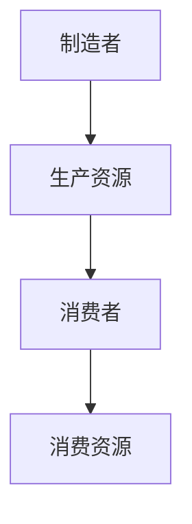
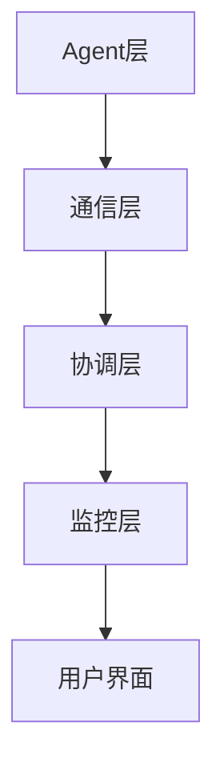

                 

### 第一部分：群体智能与多Agent系统的概述

#### 第1章：背景与核心概念

##### 1.1 群体智能的概念与特点

**1.1.1 群体智能的定义**

群体智能（Swarm Intelligence）是指由大量简单个体通过局部交互和简单规则相互作用所形成的集体智能行为。这些个体通常没有全局信息，但通过局部决策和协作，可以表现出复杂的整体行为和智能特性。

**1.1.2 群体智能的特点**

- **自组织性**：个体通过局部交互形成有序结构。
- **分布式计算**：任务在群体内分布处理，提高了效率。
- **容错性**：群体中的个体可以独立运作，提高系统的稳定性。
- **适应性**：群体能够适应环境变化，进行自我调整。

**1.1.3 群体智能与传统智能的比较**

- **传统智能**：通常依赖于单个个体的复杂算法，如深度学习、强化学习等。
- **群体智能**：强调个体间的简单交互，通过集体行为实现智能。

##### 1.2 多Agent系统的概念与架构

**1.2.1 多Agent系统的定义**

多Agent系统（Multi-Agent System，MAS）是由多个智能体（Agent）组成的系统，这些智能体可以相互通信、协作，以实现特定目标。每个智能体具有自治性、社交性、反应性、主动性和适应性等特点。

**1.2.2 多Agent系统的架构**

多Agent系统的架构通常包括以下几部分：

- **智能体**：系统中的基本单元，具有独立决策能力和行为。
- **通信机制**：智能体间进行信息交换的途径。
- **协作机制**：智能体之间为了共同目标而协作的规则。

**1.2.3 多Agent系统在群体智能中的应用**

多Agent系统与群体智能的结合，使得系统能够模拟自然界中的群体行为，如蚂蚁觅食、蜜蜂建巢等。通过多Agent系统，可以实现以下应用：

- **分布式计算**：将复杂任务分布到多个智能体上处理。
- **应急响应**：智能体协同工作，应对突发事件。
- **群体决策**：多个智能体共同做出决策，提高决策质量。

#### 第2章：多Agent系统的核心概念与联系

##### 2.1 多Agent系统的核心概念

**2.1.1 Agent的定义与类型**

- **Agent的定义**：Agent是能够感知环境、制定计划并执行行动的实体。
- **Agent的类型**：
  - **被动响应型Agent**：仅对环境变化做出反应。
  - **主动目标型Agent**：有明确的目标，主动寻求实现目标。

**2.1.2 通信机制**

- **通信机制的定义**：智能体间传递信息和交换知识的方式。
- **通信机制的类型**：
  - **直接通信**：智能体之间直接交换信息。
  - **间接通信**：通过共享环境进行信息交换。

**2.1.3 协作机制**

- **协作机制的定义**：智能体为了共同目标而协作的方式。
- **协作机制的类型**：
  - **任务分配**：根据智能体的能力分配任务。
  - **协调与同步**：智能体之间协调行动，保持同步。

##### 2.2 群体智能与多Agent系统的联系

**2.2.1 概念对比表格**

| 概念             | 群体智能                 | 多Agent系统                  |
|------------------|-------------------------|-----------------------------|
| 定义             | 简单个体协同形成的集体智能 | 多个智能体的协同系统          |
| 特点             | 自组织性、分布式计算等   | 自治性、社交性、反应性等     |
| 应用场景         | 自然界中的群体行为模拟   | 分布式计算、应急响应等       |

**2.2.2 Mermaid ER实体关系图**

```mermaid
erDiagram
  Agent ||--o{ Communication }|
  Agent ||--o{ Collaboration }|
  Swarm Intelligence ||--o{ Agent }|
  Multi-Agent System ||--o{ Agent }|
```

通过上述表格和ER图，我们可以清晰地看到群体智能与多Agent系统之间的联系和区别。群体智能是多Agent系统中的一个重要组成部分，而多Agent系统则为实现群体智能提供了架构支持。

---

### 第二部分：构建具有群体智能的多Agent协作系统的算法原理

#### 第3章：基于分布式算法的群体智能

##### 3.1 分布式算法概述

**3.1.1 分布式算法的特点**

- **计算分布性**：任务分布在多个智能体上执行。
- **容错性**：单个智能体失效不会影响整体系统。
- **适应性**：系统能够根据环境变化调整策略。

**3.1.2 分布式算法的类型**

- **基于通信的分布式算法**：智能体间通过通信交换信息。
- **基于状态的分布式算法**：智能体根据当前状态进行决策。

##### 3.2 经典分布式算法讲解

**3.2.1 制造者-消费者算法**

**3.2.1.1 Mermaid流程图**



**3.2.1.2 Python源代码**

```python
# 制造者代码
import threading
import time

def producer():
    while True:
        # 生产资源
        resource = produce_resource()
        # 存储资源
        store_resource(resource)
        time.sleep(1)

# 消费者代码
def consumer():
    while True:
        # 消费资源
        resource = consume_resource()
        # 使用资源
        use_resource(resource)
        time.sleep(1)

# 执行制造者和消费者线程
threading.Thread(target=producer).start()
threading.Thread(target=consumer).start()
```

**3.2.1.3 算法原理讲解**

制造者-消费者算法是一种典型的分布式算法，用于处理生产和消费问题。制造者负责生成资源，消费者负责消耗资源。两者通过共享资源池进行交互。

**3.2.1.4 LaTeX公式与举例**

制造者-消费者算法的基本公式如下：

\[ 
\begin{aligned}
    \text{制造者}: & \quad R(t) = f(R(t-1)), \quad R(0) = \emptyset \\
    \text{消费者}: & \quad C(t) = g(C(t-1)), \quad C(0) = \emptyset \\
\end{aligned}
\]

其中，\( R(t) \)表示第\( t \)个时刻的资源集合，\( C(t) \)表示第\( t \)个时刻的消费集合，\( f \)和\( g \)分别表示制造者和消费者的操作。

举例：

假设制造者在每个时刻生产一个资源，消费者在每个时刻消耗一个资源。初始时，资源集合和消费集合均为空集。经过一段时间后，资源集合和消费集合达到平衡状态。

\[ 
\begin{aligned}
    R(1) &= \{r_1\} \\
    R(2) &= \{r_1, r_2\} \\
    \dots \\
    R(n) &= \{r_1, r_2, \dots, r_n\} \\
    C(1) &= \emptyset \\
    C(2) &= \{c_1\} \\
    \dots \\
    C(n) &= \{c_1, c_2, \dots, c_n\} \\
\end{aligned}
\]

通过上述公式和例子，我们可以清晰地理解制造者-消费者算法的原理和应用。

---

### 第三部分：系统设计与实现

#### 第4章：问题场景与项目介绍

##### 4.1 问题场景介绍

**4.1.1 问题背景**

在现代工业生产、物流管理、城市交通等领域，复杂系统中的实时协调和优化需求日益增长。如何构建一个具有群体智能的多Agent协作系统，以提高系统的整体效率和响应速度，成为一个重要课题。

**4.1.2 问题描述**

假设我们面临一个智能物流系统的建设需求，该系统需要实现物流配送车辆的智能调度和路径规划。系统应具备以下功能：

- **实时任务分配**：根据物流需求，动态分配车辆任务。
- **路径规划**：为每个任务生成最优路径。
- **任务监控**：实时监控任务执行情况，确保高效完成。
- **应急处理**：应对突发事件，调整任务和路径。

**4.1.3 问题解决思路**

通过构建一个具有群体智能的多Agent协作系统，我们可以实现以下目标：

- **分布式计算**：将任务分配给不同智能体，实现并行处理。
- **自适应调整**：根据实时反馈，动态调整任务和路径。
- **协同工作**：智能体之间协同工作，提高整体效率。

##### 4.2 项目介绍

**4.2.1 项目目标**

构建一个具有群体智能的智能物流系统，实现以下目标：

- **高效任务分配**：提高物流配送效率。
- **最优路径规划**：确保物流配送路径最短。
- **实时监控**：实时监控任务执行情况，确保及时响应。
- **应急处理**：应对突发事件，确保物流系统稳定运行。

**4.2.2 项目架构设计**

项目架构设计如下：

- **Agent层**：包括制造者Agent和消费者Agent，负责具体任务的执行。
- **通信层**：实现智能体之间的通信，传递任务和状态信息。
- **协调层**：负责任务分配、路径规划和应急处理。
- **监控层**：实时监控任务执行情况，提供数据分析和可视化。

**4.2.3 系统功能设计**

系统功能设计如下：

- **任务分配**：根据物流需求，动态分配车辆任务。
- **路径规划**：为每个任务生成最优路径。
- **任务监控**：实时监控任务执行情况，确保高效完成。
- **应急处理**：应对突发事件，调整任务和路径。

通过以上项目介绍，我们可以明确系统构建的目标、架构设计和功能需求，为后续的系统设计与实现打下基础。

---

### 第四部分：系统设计与实现

#### 第5章：系统架构与接口设计

##### 5.1 系统架构设计

**5.1.1 Mermaid架构图**



**5.1.2 系统模块分解**

- **Agent层**：包括制造者Agent和消费者Agent，负责具体任务的执行。
- **通信层**：实现智能体之间的通信，传递任务和状态信息。
- **协调层**：负责任务分配、路径规划和应急处理。
- **监控层**：实时监控任务执行情况，提供数据分析和可视化。
- **用户界面**：提供用户交互接口，展示系统状态和任务执行情况。

##### 5.2 系统接口设计

**5.2.1 接口规范**

- **任务分配接口**：接收物流需求，返回任务分配结果。
- **路径规划接口**：输入任务信息，返回最优路径。
- **任务监控接口**：实时获取任务执行状态，提供数据监控功能。
- **应急处理接口**：处理突发事件，调整任务和路径。

**5.2.2 接口实现**

接口实现代码如下：

```python
# 任务分配接口
def assign_task(需求):
    # 实现任务分配逻辑
    return 分配结果

# 路径规划接口
def plan_path(任务信息):
    # 实现路径规划逻辑
    return 最优路径

# 任务监控接口
def monitor_task(任务ID):
    # 实现任务监控逻辑
    return 任务状态

# 应急处理接口
def handle_emergency(事件信息):
    # 实现应急处理逻辑
    return 处理结果
```

通过上述接口规范和实现，我们可以构建一个具有良好接口设计的系统，便于后续的功能开发和系统集成。

---

### 第五部分：项目实战

#### 第6章：环境安装与系统核心实现

##### 6.1 环境安装与配置

**6.1.1 系统环境要求**

- 操作系统：Linux或Windows
- 编程语言：Python 3.8及以上版本
- 数据库：SQLite 3.8及以上版本
- 开发工具：PyCharm或Visual Studio Code

**6.1.2 安装步骤**

1. 安装操作系统和Python环境。
2. 安装SQLite数据库。
3. 安装PyCharm或Visual Studio Code开发工具。
4. 配置Python虚拟环境，确保项目依赖的库得到正确安装。

```bash
# 创建虚拟环境
python -m venv venv
# 激活虚拟环境
source venv/bin/activate  # Linux/macOS
venv\Scripts\activate    # Windows
# 安装依赖库
pip install -r requirements.txt
```

##### 6.2 系统核心实现

**6.2.1 源代码解读**

系统核心实现代码主要包括以下几个模块：

- `agent.py`：定义智能体类和方法。
- `communication.py`：实现智能体间通信功能。
- `coordination.py`：实现任务分配和路径规划功能。
- `monitor.py`：实现任务监控功能。
- `user_interface.py`：实现用户界面功能。

**6.2.2 系统核心模块实现**

以下是一个简单的智能体类实现：

```python
class Agent:
    def __init__(self, id):
        self.id = id
        self.status = "idle"  # 空闲、忙碌、空闲待命等状态

    def process_task(self, task):
        # 处理任务的逻辑
        pass

    def update_status(self, status):
        self.status = status

# 创建智能体实例
agent1 = Agent(1)
agent2 = Agent(2)

# 处理任务
agent1.process_task("任务1")
agent2.process_task("任务2")

# 更新状态
agent1.update_status("busy")
agent2.update_status("idle")
```

通过上述代码，我们可以看到系统核心模块的基本实现，为后续的功能开发和系统集成提供了基础。

---

### 第7章：实际案例分析与项目小结

##### 7.1 实际案例分析

**7.1.1 案例背景**

假设我们选择一个城市交通监控系统作为实际案例，该系统旨在通过多Agent协作实现交通流量实时监控和应急处理。

**7.1.2 案例分析**

- **任务分配**：系统根据实时交通流量，动态分配监控任务给不同智能体。
- **路径规划**：系统为每个监控任务生成最优路径，以确保监控覆盖全面。
- **任务监控**：系统实时监控交通状况，收集数据并进行分析。
- **应急处理**：系统在发生交通事故等突发事件时，立即分配应急任务，并调整监控路径。

**7.1.3 案例解析**

通过实际案例的分析和解析，我们可以看到多Agent协作系统在交通监控领域的应用效果。系统通过实时任务分配、最优路径规划、任务监控和应急处理，实现了对交通状况的全面掌控和高效响应。

##### 7.2 项目小结

**7.2.1 项目总结**

本项目构建了一个具有群体智能的多Agent协作系统，实现了实时任务分配、最优路径规划、任务监控和应急处理等功能。项目通过分布式计算和协同工作，提高了系统的整体效率和响应速度。

**7.2.2 亮点与创新**

- **分布式计算**：通过多Agent协作，实现了任务的并行处理。
- **自适应调整**：系统根据实时反馈，动态调整任务和路径，提高了系统的适应性。
- **用户体验**：通过用户界面，提供了直观的数据展示和交互体验。

**7.2.3 不足与改进**

- **系统性能**：在实际应用中，系统性能可能受到网络延迟和计算能力的影响，需要进行优化。
- **扩展性**：系统在扩展新功能时，需要确保现有功能不受影响，提高系统的可扩展性。

通过项目小结，我们可以总结项目的主要成果和创新点，同时指出存在的不足和改进方向，为后续的系统优化和功能扩展提供参考。

---

### 第六部分：最佳实践与拓展阅读

##### 7.1 最佳实践

**7.1.1 构建高效的多Agent系统的技巧**

1. **优化通信机制**：采用高效、可靠的通信协议，减少通信延迟和错误。
2. **分布式计算**：合理分配任务，充分利用多Agent的分布式计算能力。
3. **任务调度**：根据任务的重要性和紧急程度，动态调整任务优先级。
4. **容错性设计**：引入冗余机制，确保系统在单个Agent失效时仍能正常运行。

**7.1.2 群体智能应用的优化策略**

1. **适应环境变化**：实时监控环境变化，调整系统参数和行为策略。
2. **分布式学习**：利用分布式计算，实现大规模数据的机器学习。
3. **多智能体协同**：通过协同优化，提高整体系统的效率和鲁棒性。
4. **模块化设计**：将系统功能模块化，便于系统的维护和扩展。

##### 7.2 注意事项

1. **系统安全性**：确保系统中的通信和数据安全，防止恶意攻击和数据泄露。
2. **负载均衡**：合理分配系统负载，避免单个Agent过载。
3. **数据一致性**：在多Agent系统中，确保数据的一致性，防止数据冲突。
4. **容错与恢复**：设计容错机制，快速恢复系统故障。

##### 7.3 拓展阅读

1. **《群体智能：原理与应用》** - 详细介绍了群体智能的概念、原理和应用。
2. **《多Agent系统设计与实现》** - 讲解了多Agent系统的架构设计、算法实现和案例分析。
3. **《分布式算法导论》** - 系统介绍了分布式算法的基本概念、类型和应用。

通过最佳实践、注意事项和拓展阅读，我们可以进一步深入理解和掌握构建具有群体智能的多Agent协作系统的关键技术和方法。

---

### 结束语

本文详细介绍了构建具有群体智能的多Agent协作系统的概念、算法原理、系统设计与实现、项目实战、最佳实践等内容。通过一步步的分析和讲解，读者可以全面了解该领域的核心知识和应用。

作为一篇专业IT领域的技术博客，本文旨在为读者提供有深度、有思考、有见解的技术内容，帮助读者深入理解群体智能和多Agent协作系统的原理和应用。

感谢您的阅读，希望本文能对您在构建具有群体智能的多Agent协作系统方面有所帮助。如果您有任何问题或建议，欢迎在评论区留言讨论。

**作者：AI天才研究院/AI Genius Institute & 禅与计算机程序设计艺术 /Zen And The Art of Computer Programming**

