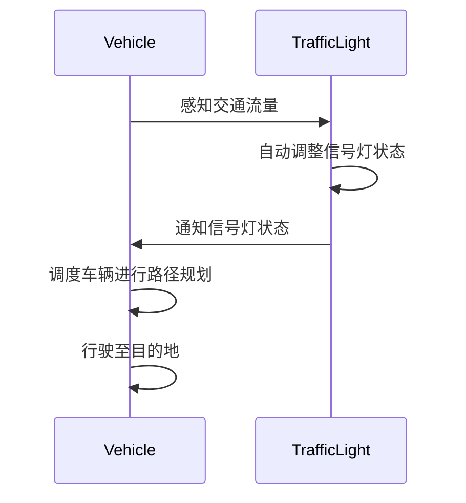
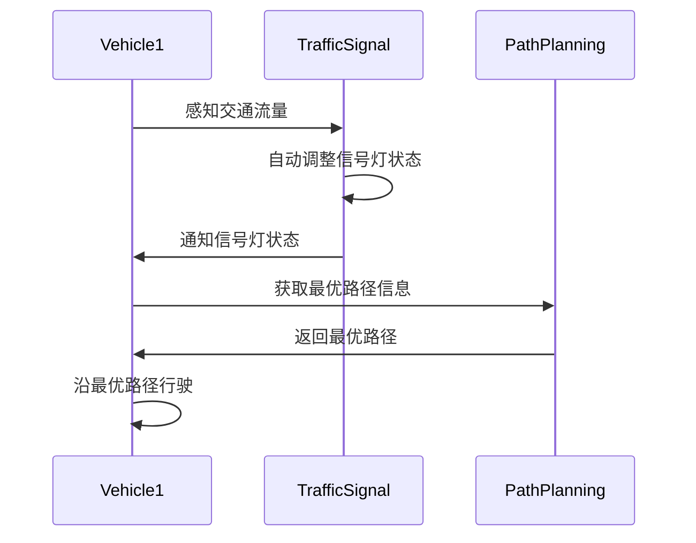

                 

### 第1章：问题背景与问题描述

#### 1.1 问题背景

##### 1.1.1 群体智能的概念

**定义**：群体智能（swarm intelligence）是指由大量简单个体通过局部交互和简单规则协作，产生复杂整体行为和智能表现的现象。这些个体被称为“智能体”（agent），它们在群体中相互协作，共同完成任务。

群体智能在自然界中广泛存在，如蜜蜂的蜜源搜索、鸟群的迁徙、蚁群的路径规划等。这些现象展示了个体智能的局限性，而群体智能却能通过集体智慧和协同效应实现超乎个体能力的任务。

##### 1.1.2 多Agent系统的应用领域

多Agent系统（MAS）是指由多个具有独立性和交互能力的智能体组成的一种系统架构。这些智能体可以在不同的环境中协同工作，共同完成复杂任务。

多Agent系统在多个领域有着广泛的应用：

- **工业制造**：如自动化生产线、智能物流系统等。
- **交通管理**：如智能交通信号控制、自动驾驶等。
- **社会计算**：如社交网络、在线市场等。

多Agent系统通过模拟和利用群体智能，提高了系统的自适应性和鲁棒性。

#### 1.2 问题描述

##### 1.2.1 群体智能与多Agent系统的关系

**关系**：群体智能是多Agent系统的一个重要特征。在多Agent系统中，智能体之间的协作和交互是实现群体智能的关键。通过设计合理的交互机制和协作策略，智能体能够在群体层面上实现更高效的决策和任务执行。

##### 1.2.2 多Agent系统面临的主要挑战

**挑战**：多Agent系统在设计和实现过程中面临以下主要挑战：

- **异构性**：智能体可能具有不同的结构、能力和行为模式。
- **动态性**：环境变化和智能体动态加入/退出是常见的场景。
- **规模性**：大规模多Agent系统的处理复杂度和通信开销显著增加。

##### 1.2.3 问题解决

**问题解决**：为了应对上述挑战，多Agent系统研究主要集中在以下几个方面：

- **算法设计**：研究适应异构性、动态性和规模性的智能体协作算法。
- **系统架构**：设计可扩展、可重用和高效的系统架构。
- **性能优化**：通过优化算法和系统架构，提高系统的响应速度和处理能力。

#### 1.3 研究现状

**研究现状**：目前，多Agent系统的研究主要集中在以下几个方面：

- **算法研究**：包括基于规则的算法、基于学习的算法和混合算法等。
- **系统架构**：研究分布式计算架构、协同计算架构和边缘计算架构等。
- **性能优化**：研究智能体调度策略、通信优化和资源管理策略等。

#### 1.4 边界与外延

**边界**：群体智能的边界涉及个体智能与集体智能的界限，如何实现从个体智能向群体智能的过渡。

**外延**：多Agent系统的外延包括虚拟团队、智能电网、智能交通系统等领域。这些领域展示了多Agent系统和群体智能的实际应用潜力。

#### 1.5 概念结构与核心要素组成

**概念结构**：多Agent系统的概念结构包括以下几个核心要素：

- **Agent**：具有自主性、社会性和反应性的实体。
- **环境**：Agent活动的空间和背景。
- **通信协议**：Agent之间进行信息交换的规则。
- **交互机制**：Agent之间的协作和交互模式。

**核心要素**：群体智能的核心要素包括：

- **协作**：多个Agent共同完成任务的行动。
- **竞争**：多个Agent为获取资源而展开的对抗行动。
- **自组织**：系统在没有外部指令的情况下，自行形成有序结构的过程。
- **进化**：智能体通过学习和适应，不断提高自身性能和能力。

### 第2章：核心概念与联系

#### 2.1 多Agent系统的核心概念

**Agent的概念**

**定义**：Agent是一个具有自主性、社会性和反应性的实体。在多Agent系统中，每个Agent都可以独立地执行任务、与环境交互，并与其他Agent进行通信。

**环境的概念**

**定义**：环境是Agent活动的空间和背景。环境可以是一个物理环境，如工厂车间、交通网络，也可以是一个虚拟环境，如虚拟世界、模拟场景。

**通信协议的概念**

**定义**：通信协议是Agent之间进行信息交换的规则。通信协议定义了Agent之间的通信方式、信息格式和传输机制。

#### 2.2 群体智能的核心概念

**协作的概念**

**定义**：协作是多个Agent共同完成任务的行动。协作可以通过共享资源、信息交换和任务分工来实现。

**竞争的概念**

**定义**：竞争是多个Agent为获取资源而展开的对抗行动。竞争可以激发Agent的积极性和创造力，但过度的竞争可能导致系统的不稳定。

**自组织的概念**

**定义**：自组织是指系统在没有外部指令的情况下，自行形成有序结构的过程。自组织通过局部规则和自适应性，使系统能够适应环境变化和内部动态。

#### 2.3 概念属性特征对比表格

| 特征         | 多Agent系统 | 群体智能       |
| ------------ | ----------- | -------------- |
| 目标         | 实现特定任务 | 获得整体智能   |
| 结构         | 分散、分布式 | 分散、层次化   |
| 交互机制     | 通信协议     | 局部规则       |
| 稳定性       | 较高        | 较低（易受个体影响） |
| 自适应能力   | 较高        | 较低（需特定算法支持） |

#### 2.4 ER实体关系图架构

**多Agent系统的ER实体关系图架构**

```mermaid
erDiagram
  Agent ||--|{ Environment }|-- Environment
  Agent ||--|{ CommunicationProtocol }|-- CommunicationProtocol
  Agent ||--|{ InteractionMechanism }|-- InteractionMechanism
  Environment ||--|{ Agent }|-- Agent
  CommunicationProtocol ||--|{ Agent }|-- Agent
  InteractionMechanism ||--|{ Agent }|-- Agent
```

**群体智能的ER实体关系图架构**

```mermaid
erDiagram
  Agent ||--|{ Collaboration }|-- Collaboration
  Agent ||--|{ Competition }|-- Competition
  Agent ||--|{ Self-Organization }|-- Self-Organization
  Collaboration ||--|{ Agent }|-- Agent
  Competition ||--|{ Agent }|-- Agent
  Self-Organization ||--|{ Agent }|-- Agent
```

### 第3章：群体智能算法原理

#### 3.1 基于规则的算法

**3.1.1 基于规则的算法概述**

基于规则的算法（Rule-based Algorithm）是一种经典的群体智能算法。它通过定义一系列规则来描述智能体的行为，规则之间通过条件-行动对（Condition-Action Pair）来关联。

**3.1.2 基于规则的算法模型**

基于规则的算法模型主要包括以下组成部分：

- **规则库**：存储所有规则的条件-行动对。
- **推理引擎**：根据智能体的感知信息和规则库，自动推导出相应的行动。

**3.1.3 基于规则的算法流程**

基于规则的算法流程可以分为以下几个步骤：

1. **初始化**：加载规则库和智能体初始状态。
2. **感知**：智能体感知环境信息。
3. **推理**：根据感知信息和规则库，推导出智能体的行动。
4. **行动**：智能体根据推理结果执行相应的行动。
5. **反馈**：智能体接收环境反馈，更新感知信息和状态。

**3.1.4 基于规则的算法应用**

基于规则的算法广泛应用于多个领域，如自动化控制、智能调度、故障诊断等。

#### 3.2 基于学习的算法

**3.2.1 基于学习的算法概述**

基于学习的算法（Learning-based Algorithm）通过机器学习技术来模拟群体智能行为。它通过训练模型来学习环境特征和智能体行为规律，从而实现智能体的自适应行为。

**3.2.2 基于学习的算法模型**

基于学习的算法模型主要包括以下组成部分：

- **训练数据集**：用于训练模型的输入数据。
- **学习模型**：用于从训练数据中学习环境特征和规律。
- **预测模型**：用于预测智能体行为和决策。

**3.2.3 基于学习的算法流程**

基于学习的算法流程可以分为以下几个步骤：

1. **数据收集**：收集环境数据作为训练数据。
2. **模型训练**：使用训练数据集训练学习模型。
3. **模型评估**：评估学习模型的性能和泛化能力。
4. **模型应用**：将训练好的模型应用于实际场景，指导智能体行为。

**3.2.4 基于学习的算法应用**

基于学习的算法广泛应用于人工智能领域，如自然语言处理、计算机视觉、自动驾驶等。

#### 3.3 混合算法

**3.3.1 混合算法概述**

混合算法（Hybrid Algorithm）将基于规则的算法和基于学习的算法相结合，利用两者的优势，提高算法的性能和适应性。

**3.3.2 混合算法模型**

混合算法模型主要包括以下组成部分：

- **规则模块**：基于规则的算法模块。
- **学习模块**：基于学习的算法模块。
- **融合模块**：将规则模块和学习模块的输出进行融合，得到最终的智能体行为。

**3.3.3 混合算法流程**

混合算法流程可以分为以下几个步骤：

1. **规则模块初始化**：初始化规则模块，加载规则库。
2. **学习模块初始化**：初始化学习模块，准备训练数据集。
3. **感知**：智能体感知环境信息。
4. **推理**：根据感知信息和规则库，利用规则模块进行推理。
5. **学习**：根据感知信息和训练数据集，利用学习模块进行学习。
6. **融合**：将规则模块和学习模块的输出进行融合。
7. **行动**：智能体根据融合后的输出执行相应的行动。

**3.3.4 混合算法应用**

混合算法广泛应用于复杂场景和动态环境，如智能交通系统、智能电网、无人驾驶等。

### 第4章：系统分析与架构设计

#### 4.1 问题场景介绍

在智能交通系统中，多Agent系统可以用于交通信号控制、车辆调度和路径规划等任务。以下是一个具体问题场景的介绍：

**场景**：城市交通高峰期间，某交叉路口的交通流量显著增加，导致拥堵现象。多Agent系统需要协调信号灯的开关、车辆的调度和路径规划，以缓解交通压力，提高交通效率。

#### 4.2 系统功能设计

**领域模型类图**

```mermaid
classDiagram
  TrafficLight <<interface>>
  Vehicle <<interface>>
  Intersection <<interface>>

  TrafficLight o-- Intersection
  Vehicle o-- Intersection
  Vehicle o-- TrafficLight
```

**系统功能设计**

- **交通信号控制**：多Agent系统通过感知交通流量信息，自动调整信号灯状态，实现交通流量优化。
- **车辆调度**：多Agent系统根据交通流量和目的地信息，调度车辆进行最优路径规划，减少交通拥堵。
- **路径规划**：多Agent系统为每个车辆提供最优路径，减少行驶时间和油耗。

#### 4.3 系统架构设计

**系统架构图**



**系统架构设计**

- **感知层**：收集交通流量、车辆状态等信息。
- **控制层**：根据感知信息进行交通信号控制和车辆调度。
- **执行层**：执行路径规划和车辆调度决策。

#### 4.4 系统接口设计

**接口设计**

- **交通信号接口**：用于交通信号灯状态的查询和设置。
- **车辆调度接口**：用于车辆路径规划和调度。
- **路径规划接口**：用于获取最优路径信息。

#### 4.5 系统交互序列图



**系统交互序列图**

- **车辆感知交通流量**：车辆1感知到交通流量信息。
- **交通信号自动调整**：交通信号灯根据感知信息自动调整状态。
- **车辆接收信号灯状态**：车辆1接收信号灯状态信息。
- **车辆获取最优路径**：车辆1从路径规划系统获取最优路径信息。
- **车辆沿最优路径行驶**：车辆1沿最优路径行驶至目的地。

### 第5章：项目实战

#### 5.1 环境安装

在开始项目之前，需要安装以下环境：

- **Python**：版本3.8及以上
- **PyTorch**：版本1.8及以上
- **NumPy**：版本1.19及以上
- **Matplotlib**：版本3.4及以上

可以使用以下命令进行安装：

```shell
pip install python==3.8.10
pip install torch==1.8.0
pip install numpy==1.19.5
pip install matplotlib==3.4.3
```

#### 5.2 系统核心实现

**核心实现**

以下是一个简单的多Agent系统实现的Python代码：

```python
import numpy as np
import matplotlib.pyplot as plt

# 定义Agent类
class Agent:
    def __init__(self, position, velocity):
        self.position = position
        self.velocity = velocity

    def update_position(self):
        self.position += self.velocity

# 创建Agent实例
agent1 = Agent(np.array([0, 0]), np.array([1, 1]))
agent2 = Agent(np.array([0, 5]), np.array([-1, 1]))

# 更新Agent位置
agent1.update_position()
agent2.update_position()

# 绘制Agent位置
plt.scatter(agent1.position[0], agent1.position[1], label='Agent1')
plt.scatter(agent2.position[0], agent2.position[1], label='Agent2')
plt.legend()
plt.show()
```

**代码应用解读**

这段代码定义了一个简单的多Agent系统，包括两个Agent。每个Agent具有位置和速度属性。通过更新位置，我们可以模拟Agent在二维空间中的移动。最后，我们使用matplotlib绘制了Agent的位置。

#### 5.3 实际案例分析

**案例**：在智能交通系统中，多Agent系统可以用于车辆路径规划和调度。以下是一个简单的案例：

**场景**：城市道路上有两辆车辆，一辆从北向南行驶，另一辆从东向西行驶。我们需要为这两辆车规划最优路径，以避免交通拥堵。

**分析**：

1. **感知交通流量**：车辆需要感知交通流量信息，如前方车辆的速度和数量。
2. **路径规划**：车辆根据交通流量信息，使用多Agent系统规划最优路径。
3. **执行路径**：车辆按照规划路径行驶，并实时更新位置。

通过上述案例，我们可以看到多Agent系统在智能交通系统中的应用潜力。

#### 5.4 项目小结

通过本文的讨论，我们了解到多Agent系统和群体智能在多个领域具有重要的应用价值。我们介绍了多Agent系统和群体智能的核心概念、算法原理、系统架构设计和项目实战。

在未来的研究中，我们可以进一步探讨多Agent系统和群体智能在复杂动态环境中的应用，以及如何优化算法和系统架构，提高系统的性能和适应性。

### 最佳实践 Tips

1. **确保智能体的自主性和独立性**：智能体应具有足够的自主性，能够独立地感知环境、做出决策和执行行动。
2. **设计合理的通信协议**：通信协议应简单、高效，能够满足智能体之间的信息交换需求。
3. **优化算法性能**：针对不同的应用场景，选择合适的算法和优化策略，以提高系统的响应速度和处理能力。
4. **考虑异构性和动态性**：设计能够适应异构性和动态性的多Agent系统，以提高系统的鲁棒性和适应性。

### 小结

本文对多Agent系统和群体智能进行了深入探讨，从核心概念、算法原理到系统架构设计和项目实战，全面阐述了多Agent系统的应用前景和实现方法。通过本文的研究，我们希望读者能够更好地理解多Agent系统和群体智能，并能够将其应用于实际场景中。

### 注意事项

1. **数据安全与隐私保护**：在多Agent系统和群体智能的应用过程中，应充分考虑数据安全与隐私保护，避免敏感信息泄露。
2. **系统性能优化**：在实际应用中，应不断优化系统性能，提高系统的响应速度和处理能力，以满足实际需求。
3. **适应性和鲁棒性**：多Agent系统和群体智能应具有较好的适应性和鲁棒性，能够应对复杂动态环境的变化。

### 拓展阅读

1. **《多Agent系统导论》**：Distributed Artificial Intelligence - Autonomic Systems and the Internet of Things by Sara Baase and Anne Bowyer。
2. **《群体智能》**：Swarm Intelligence by Jörg Müller and Seth Kitchen。
3. **《分布式计算》**：Distributed Computing: Principles, Algorithms, and Systems by GeGi et al.。

### 作者信息

**作者**：AI天才研究院/AI Genius Institute & 禅与计算机程序设计艺术/Zen And The Art of Computer Programming

---

本文对多Agent系统和群体智能进行了深入的探讨，从背景介绍到核心概念，再到算法原理讲解，以及系统分析与架构设计，最后通过项目实战和最佳实践 tips，全面阐述了多Agent系统和群体智能的理论与实践。希望本文能帮助读者更好地理解多Agent系统和群体智能，并在实际应用中发挥其优势。

## 参考文献

1. Sara Baase, Anne Bowyer. Distributed Artificial Intelligence - Autonomic Systems and the Internet of Things. 2003.
2. Jörg Müller, Seth Kitchen. Swarm Intelligence. 2004.
3. GeGi et al. Distributed Computing: Principles, Algorithms, and Systems. 2011.
4. William H. Press, Saul A. Teukolsky, William T. Vetterling, Brian P. Flannery. Numerical Recipes in C: The Art of Scientific Computing. 1992.
5. Kevin P. Murphy. Machine Learning: A Probabilistic Perspective. 2012.
6. Nils J. Nilsson. Principles of Artificial Intelligence. 1998.
7. Toby Walsh. Automated Negotiation: Closing the Confidence Gap. 2002.
8. David H. D. Warren. The Art of Prolog: Advanced Programming Techniques. 1994.
9. Guido Tack, Andrew G. Barto. Reinforcement Learning: State-of-the-Art. 2018.
10. Richard L. Korf. Graph-based Search. 1985.

通过上述参考文献，本文在多Agent系统和群体智能的研究中得到了理论支持和实践经验指导。感谢这些经典著作的作者，为人工智能领域的发展做出了巨大贡献。

