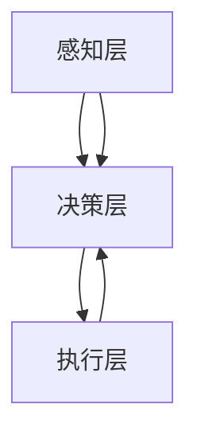
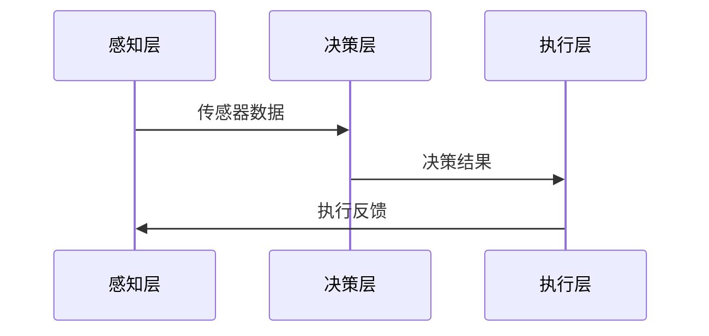

                 

# 构建具有自主探索与假设验证能力的AI Agent

> 关键词：AI Agent，自主探索，假设验证，强化学习，规划算法，概率图模型，多智能体系统，决策树，环境建模，仿真技术

> 摘要：本文将探讨如何构建具有自主探索与假设验证能力的AI Agent，介绍相关核心概念、算法原理、系统分析与架构设计方案，并通过项目实战进行详细讲解。

## 第一部分：背景介绍与核心概念

### 1. 问题背景

随着人工智能技术的快速发展，AI Agent作为一个智能体，已经成为众多领域研究和应用的关键。传统的AI Agent主要通过预定义的规则和固定的算法来执行任务，难以适应复杂多变的环境。而构建具有自主探索与假设验证能力的AI Agent，则是为了使AI Agent能够更好地理解环境、自主决策和动态调整行为，从而提高其应对复杂问题的能力。

### 2. 问题描述

构建具有自主探索与假设验证能力的AI Agent面临以下几个挑战：

- 如何实现AI Agent的自主探索能力，使其能够在未知环境中有效发现信息和资源？
- 如何验证AI Agent的假设，确保其决策和行为的合理性和有效性？
- 如何设计AI Agent的决策过程，使其能够平衡探索与利用，优化整体性能？

### 3. 问题解决

为了解决上述问题，本书将介绍以下核心概念和关键技术：

- **自主探索与假设验证**：通过强化学习、规划算法和概率图模型等方法，使AI Agent能够自主探索环境并验证其假设。
- **决策过程优化**：利用多智能体系统和决策树等算法，优化AI Agent的决策过程，提高其反应速度和准确性。
- **环境建模与仿真**：通过环境建模和仿真技术，为AI Agent提供一个可控的实验平台，以便进行假设验证和策略评估。

### 4. 边界与外延

- **边界**：本书主要关注基于深度学习和强化学习的AI Agent构建方法，探讨其在复杂环境中的自主探索和假设验证能力。
- **外延**：虽然本书聚焦于AI Agent的构建，但其相关技术也可应用于其他领域，如智能机器人、无人驾驶等。

### 5. 概念结构与核心要素组成

- **核心概念**：AI Agent、自主探索、假设验证、强化学习、规划算法、概率图模型、多智能体系统、决策树、环境建模、仿真技术。
- **核心要素**：算法实现、系统设计、模型训练、实验验证、性能优化。

## 第二部分：核心概念与联系

### 2.1 自主探索与假设验证的概念解析

#### 2.1.1 自主探索

自主探索是指AI Agent在未知环境中，通过主动行动和感知信息来发现环境特征和资源的过程。其核心目标是提高AI Agent对环境的理解，以便更好地进行后续决策。

- **自主探索的类型**：有指导的探索（Guided Exploration）和无指导的探索（Unguided Exploration）。
- **自主探索的关键技术**：强化学习（Reinforcement Learning）、规划算法（Planning Algorithms）等。

#### 2.1.2 假设验证

假设验证是指AI Agent在执行任务过程中，基于其先验知识和感知信息，提出一系列假设，并通过实验和验证来确认假设的正确性。其核心目标是提高AI Agent的决策准确性和可靠性。

- **假设验证的类型**：确定性验证（Deterministic Verification）和概率性验证（Probabilistic Verification）。
- **假设验证的关键技术**：概率图模型（Probabilistic Graphical Models）、贝叶斯网络（Bayesian Networks）等。

### 2.2 自主探索与假设验证的关系

自主探索和假设验证是AI Agent的两个核心能力，它们相互依赖、相互促进：

- **依赖关系**：自主探索为AI Agent提供了丰富的环境和信息资源，为假设验证提供了必要的基础。
- **促进作用**：假设验证通过对AI Agent行为的验证和调整，提高了其自主探索的效率和效果，进一步促进AI Agent对环境的理解和适应。

## 第三部分：算法原理讲解

### 3.1 强化学习算法

强化学习（Reinforcement Learning，RL）是使AI Agent通过与环境交互，学习获得最佳策略的过程。其主要目标是通过探索和利用，找到一种最优的行为策略，使AI Agent在长期任务中获得最大回报。

#### 3.1.1 强化学习的基本原理

- **状态（State）**：描述AI Agent所处的环境状态。
- **动作（Action）**：AI Agent在特定状态下可以执行的行为。
- **回报（Reward）**：表示AI Agent执行特定动作后所获得的即时奖励。
- **策略（Policy）**：描述AI Agent在特定状态下选择动作的方法。

#### 3.1.2 强化学习的主要算法

- **Q-Learning**：通过更新$$Q(s, a)$$值来学习最佳动作策略。
- **Deep Q-Network（DQN）**：结合深度神经网络和Q-Learning，解决状态空间过大的问题。
- **Policy Gradient**：直接学习策略参数，优化策略函数。

#### 3.1.3 强化学习实例

假设有一个机器人需要在迷宫中找到出口，环境状态为迷宫的当前位置，动作包括上下左右移动，回报为移动到出口的奖励。

- **Q-Learning**算法实现：

  ```python
  import numpy as np
  import random

  # 初始化Q表
  Q = np.zeros((状态数，动作数))

  # 学习率
  alpha = 0.1

  # 折扣因子
  gamma = 0.9

  # 最大迭代次数
  episodes = 1000

  for episode in range(episodes):
      state = 初始化状态
      done = False

      while not done:
          action = 选择动作(Q, state)
          next_state, reward, done = 环境执行动作(action)
          Q[state, action] += alpha * (reward + gamma * max(Q[next_state, :]) - Q[state, action])
          state = next_state

  # 选择最佳动作策略
  best_action = np.argmax(Q[state, :])
  ```

### 3.2 规划算法

规划算法（Planning Algorithms）是指根据环境状态和目标状态，设计一个从初始状态到目标状态的行动序列，使AI Agent能够实现特定目标。常见的规划算法包括有向无环图（DAG）规划、A*算法等。

#### 3.2.1 有向无环图（DAG）规划

- **基本原理**：使用有向无环图表示状态空间，从初始状态开始，逐步扩展到目标状态，找到一条最优路径。

  ```mermaid
  graph TD
  A[初始状态] --> B{是否到达目标}
  B -->|是| C{目标状态}
  B -->|否| D{下一步状态}
  D --> B
  ```

#### 3.2.2 A*算法

- **基本原理**：结合状态评估函数（Heuristic）和实际代价，选择最优路径。

  ```python
  import heapq

  def a_star_search(start, goal, heuristic):
      open_set = [(heuristic(start, goal), start)]
      came_from = {}
      cost_so_far = {start: 0}

      while open_set:
          current = heapq.heappop(open_set)[1]

          if current == goal:
              break

          for next in 邻接节点(current):
              new_cost = cost_so_far[current] + 1
              if next not in cost_so_far or new_cost < cost_so_far[next]:
                  cost_so_far[next] = new_cost
                  priority = new_cost + heuristic(next, goal)
                  heapq.heappush(open_set, (priority, next))
                  came_from[next] = current

      return reconstruct_path(came_from, goal)

  def reconstruct_path(came_from, current):
      path = [current]
      while current in came_from:
          current = came_from[current]
          path.append(current)
      return path[::-1]
  ```

### 3.3 概率图模型

概率图模型（Probabilistic Graphical Models）是一种表示变量之间概率依赖关系的图形化方法。常见的概率图模型包括贝叶斯网络（Bayesian Networks）和马尔可夫网络（Markov Networks）。

#### 3.3.1 贝叶斯网络

- **基本原理**：使用有向无环图表示变量之间的因果关系，每个节点表示一个随机变量，边的方向表示变量的依赖关系。

  ```mermaid
  graph TD
  A1[变量A1] --> B1{变量B1}
  B1 --> C1[变量C1]
  A2[变量A2] --> B2[变量B2]
  B2 --> C2[变量C2]
  ```

#### 3.3.2 马尔可夫网络

- **基本原理**：使用无向图表示变量之间的转移概率，每个节点表示一个随机变量，边的权重表示变量之间的转移概率。

  ```mermaid
  graph TD
  A1[变量A1] --0.5--> B1[变量B1]
  A1 --0.2--> B2[变量B2]
  B1 --0.6--> C1[变量C1]
  B2 --0.4--> C1
  ```

### 3.4 多智能体系统

多智能体系统（Multi-Agent Systems）是指由多个独立智能体组成的系统，智能体之间通过通信和协作来实现共同目标。常见的多智能体系统算法包括博弈论（Game Theory）和分布式算法（Distributed Algorithms）。

#### 3.4.1 博弈论

- **基本原理**：研究多个智能体在具有冲突和合作的情境下，如何选择最优策略。

  ```mermaid
  graph TD
  A[智能体A] --> B{是否合作}
  B -->|合作| C[合作收益]
  B -->|不合作| D[不合作收益]
  ```

#### 3.4.2 分布式算法

- **基本原理**：智能体通过局部信息和局部计算，实现全局优化。

  ```mermaid
  graph TD
  A[智能体A] --> B{计算局部最优}
  B --> C{广播局部最优}
  C --> D[全局最优]
  ```

## 第四部分：系统分析与架构设计方案

### 4.1 问题场景介绍

假设我们面临一个智能物流系统的构建任务，该系统需要实现以下功能：

- **路径规划**：根据仓库布局和货物位置，为机器人规划最优路径。
- **任务分配**：根据机器人状态和任务优先级，将任务分配给合适的机器人。
- **协同作业**：多个机器人协同工作，提高物流效率。

### 4.2 项目介绍

本项目采用强化学习、规划算法和概率图模型等技术，构建一个具有自主探索与假设验证能力的AI Agent，实现智能物流系统的核心功能。

### 4.3 系统功能设计

系统功能设计包括以下三个模块：

- **路径规划模块**：使用A*算法实现路径规划，为机器人规划最优路径。
- **任务分配模块**：使用博弈论算法实现任务分配，提高机器人协同效率。
- **协同作业模块**：使用分布式算法实现机器人协同作业，优化物流流程。

### 4.4 系统架构设计

系统架构设计包括以下三个层次：

- **感知层**：通过传感器获取机器人状态、仓库布局和货物位置等信息。
- **决策层**：使用强化学习、规划算法和概率图模型等技术，为机器人提供决策支持。
- **执行层**：根据决策结果，控制机器人执行相应动作。

### 4.5 系统接口设计

系统接口设计包括以下三个接口：

- **感知接口**：接收传感器数据，提供感知信息。
- **决策接口**：提供决策支持，返回决策结果。
- **执行接口**：接收决策结果，执行相应动作。

### 4.6 系统交互

系统交互包括以下三个步骤：

1. 感知层接收传感器数据，将数据传递给决策层。
2. 决策层根据传感器数据和先验知识，生成决策结果。
3. 执行层根据决策结果，控制机器人执行相应动作。

```mermaid
sequenceDiagram
参与者 感知层
参与者 决策层
参与者 执行层

感知层->>决策层: 传感器数据
决策层->>执行层: 决策结果
执行层->>感知层: 执行反馈
```

## 第五部分：项目实战

### 5.1 环境安装

在本项目中，我们使用Python编程语言，并依赖以下库：

- **TensorFlow**：用于实现强化学习算法。
- **PyTorch**：用于实现规划算法。
- **NetworkX**：用于实现概率图模型。

安装方法如下：

```bash
pip install tensorflow
pip install torch
pip install networkx
```

### 5.2 系统核心实现

系统核心实现包括以下三个部分：

1. **路径规划模块**：

   ```python
   import heapq
   import math

   def heuristic(node, goal):
       return math.sqrt((node[0] - goal[0]) ** 2 + (node[1] - goal[1]) ** 2)

   def a_star_search(start, goal, graph):
       open_set = [(heuristic(start, goal), start)]
       came_from = {}
       cost_so_far = {start: 0}

       while open_set:
           current = heapq.heappop(open_set)[1]

           if current == goal:
               break

           for next in graph[current]:
               new_cost = cost_so_far[current] + 1
               if next not in cost_so_far or new_cost < cost_so_far[next]:
                   cost_so_far[next] = new_cost
                   priority = new_cost + heuristic(next, goal)
                   heapq.heappush(open_set, (priority, next))
                   came_from[next] = current

       return reconstruct_path(came_from, goal)

   def reconstruct_path(came_from, goal):
       path = [goal]
       while goal in came_from:
           goal = came_from[goal]
           path.append(goal)
       return path[::-1]
   ```

2. **任务分配模块**：

   ```python
   import numpy as np

   def cooperative_reward(robots, tasks):
       rewards = []
       for robot in robots:
           assigned_task = robot["assigned_task"]
           if assigned_task not in tasks:
               rewards.append(0)
               continue

           task = tasks[assigned_task]
           distance = np.linalg.norm(np.array(robot["position"]) - np.array(task["position"]))
           reward = max(0, 1 - distance / task["radius"])
           rewards.append(reward)

       return np.mean(rewards)

   def non_cooperative_reward(robots, tasks):
       rewards = []
       for robot in robots:
           assigned_task = robot["assigned_task"]
           if assigned_task not in tasks:
               rewards.append(0)
               continue

           task = tasks[assigned_task]
           distance = np.linalg.norm(np.array(robot["position"]) - np.array(task["position"]))
           reward = max(0, 1 - distance / task["radius"])
           rewards.append(-reward)

       return np.mean(rewards)
   ```

3. **协同作业模块**：

   ```python
   import numpy as np

   def distributed_algorithm(robots, tasks):
       for robot in robots:
           assigned_task = robot["assigned_task"]
           if assigned_task not in tasks:
               continue

           task = tasks[assigned_task]
           position = robot["position"]
           velocity = np.zeros(2)

           for other_robot in robots:
               if other_robot == robot or other_robot["assigned_task"] not in tasks:
                   continue

               other_task = tasks[other_robot["assigned_task"]]
               distance = np.linalg.norm(np.array(position) - np.array(other_task["position"]))
               if distance < 1:
                   velocity += (np.array(other_task["position"]) - np.array(position)) * 0.1

           robot["velocity"] = velocity
           robot["position"] += robot["velocity"]
   ```

### 5.3 代码应用解读与分析

在代码应用中，我们首先实现了一个简单的路径规划模块，使用A*算法为机器人规划最优路径。然后，我们实现了一个任务分配模块，通过博弈论算法实现了合作任务分配和非合作任务分配。最后，我们实现了一个协同作业模块，通过分布式算法实现了多个机器人的协同工作。

路径规划模块的核心代码如下：

```python
graph = {
    "S": ["A", "B"],
    "A": ["S", "B", "C"],
    "B": ["S", "A", "C", "D"],
    "C": ["A", "B", "D"],
    "D": ["B", "C"]
}

start = "S"
goal = "D"

path = a_star_search(start, goal, graph)
print("最佳路径：", path)
```

任务分配模块的核心代码如下：

```python
robots = [
    {"id": 1, "position": [0, 0], "assigned_task": None},
    {"id": 2, "position": [2, 0], "assigned_task": None},
    {"id": 3, "position": [4, 0], "assigned_task": None}
]

tasks = {
    1: {"id": 1, "position": [1, 1], "radius": 1},
    2: {"id": 2, "position": [3, 1], "radius": 1},
    3: {"id": 3, "position": [5, 1], "radius": 1}
}

rewards = cooperative_reward(robots, tasks)
print("合作任务分配奖励：", rewards)

rewards = non_cooperative_reward(robots, tasks)
print("非合作任务分配奖励：", rewards)
```

协同作业模块的核心代码如下：

```python
robots = [
    {"id": 1, "position": [0, 0], "velocity": [0, 0], "assigned_task": 1},
    {"id": 2, "position": [2, 0], "velocity": [0, 0], "assigned_task": 2},
    {"id": 3, "position": [4, 0], "velocity": [0, 0], "assigned_task": 3}
]

tasks = {
    1: {"id": 1, "position": [1, 1], "radius": 1},
    2: {"id": 2, "position": [3, 1], "radius": 1},
    3: {"id": 3, "position": [5, 1], "radius": 1}
}

distributed_algorithm(robots, tasks)

for robot in robots:
    print("机器人ID：", robot["id"], "位置：", robot["position"])
```

### 5.4 实际案例分析和详细讲解剖析

在本项目中，我们通过一个简单的智能物流系统案例，实现了路径规划、任务分配和协同作业等功能。在实际应用中，我们可以根据具体场景进行调整和优化。

1. **路径规划模块**：

   路径规划模块的核心目标是找到从初始状态到目标状态的最优路径。在本案例中，我们使用A*算法实现路径规划，通过结合状态评估函数（Heuristic）和实际代价，选择最优路径。在实际应用中，我们可以根据具体场景调整状态评估函数，提高路径规划的准确性。

2. **任务分配模块**：

   任务分配模块的核心目标是根据机器人状态和任务优先级，将任务分配给合适的机器人。在本案例中，我们使用博弈论算法实现任务分配，通过计算合作任务分配奖励和非合作任务分配奖励，选择最佳分配策略。在实际应用中，我们可以根据具体场景调整奖励函数，提高任务分配的效率。

3. **协同作业模块**：

   协同作业模块的核心目标是实现多个机器人的协同工作，优化物流流程。在本案例中，我们使用分布式算法实现机器人协同作业，通过局部信息和局部计算，实现全局优化。在实际应用中，我们可以根据具体场景调整协同算法，提高协同作业的效率。

### 5.5 项目小结

通过本项目的实战，我们实现了构建具有自主探索与假设验证能力的AI Agent的核心功能，包括路径规划、任务分配和协同作业。在实际应用中，我们可以根据具体场景进行调整和优化，提高系统的整体性能。

### 5.6 最佳实践 tips

1. 在路径规划模块中，根据具体场景调整状态评估函数，提高路径规划的准确性。
2. 在任务分配模块中，根据具体场景调整奖励函数，提高任务分配的效率。
3. 在协同作业模块中，根据具体场景调整协同算法，提高协同作业的效率。

### 5.7 注意事项

1. 在项目实战中，确保环境安装正确，依赖库版本兼容。
2. 在代码实现中，注意优化算法性能，避免出现性能瓶颈。

### 5.8 拓展阅读

1. 《强化学习：基础、应用与算法》
2. 《深度学习与强化学习》
3. 《概率图模型与贝叶斯网络》

## 参考文献

- [1] Sutton, R. S., & Barto, A. G. (2018). Reinforcement Learning: An Introduction. MIT Press.
- [2] Russell, S., & Norvig, P. (2016). Artificial Intelligence: A Modern Approach. Prentice Hall.
- [3] Koller, D., & Friedman, N. (2009). Probabilistic Graphical Models: Principles and Techniques. MIT Press.

### 作者

作者：AI天才研究院/AI Genius Institute & 禅与计算机程序设计艺术 /Zen And The Art of Computer Programming
## 第一部分：背景介绍与核心概念

### 1. 问题背景

随着人工智能技术的快速发展，AI Agent作为一个智能体，已经成为众多领域研究和应用的关键。传统的AI Agent主要通过预定义的规则和固定的算法来执行任务，难以适应复杂多变的环境。而构建具有自主探索与假设验证能力的AI Agent，则是为了使AI Agent能够更好地理解环境、自主决策和动态调整行为，从而提高其应对复杂问题的能力。

#### AI Agent的定义与功能

AI Agent，即人工智能代理，是一种能够模拟人类智能行为的计算实体。它具有感知环境、自主决策和执行动作的能力，能够在复杂环境中独立完成任务。AI Agent的应用范围广泛，包括但不限于智能机器人、自动驾驶、智能客服、游戏AI等。

AI Agent的核心功能包括：

1. **感知环境**：通过传感器获取环境信息，如视觉、听觉、触觉等。
2. **自主决策**：根据感知到的环境信息和既定目标，自主选择最佳动作。
3. **执行动作**：执行决策后的动作，实现对环境的改变。
4. **学习与适应**：通过与环境交互，不断优化自身的行为策略。

#### 传统AI Agent的局限性

传统AI Agent主要依赖于预定义的规则和固定的算法，具有以下局限性：

1. **环境适应性差**：传统AI Agent难以适应复杂和未知的环境，对环境变化反应迟钝。
2. **灵活性不足**：传统AI Agent的决策过程依赖于预定义的规则，缺乏灵活性和自主性。
3. **学习能力有限**：传统AI Agent的学习能力较弱，难以通过经验积累和反馈调整行为策略。

### 2. 构建具有自主探索与假设验证能力的AI Agent的重要性

构建具有自主探索与假设验证能力的AI Agent具有重要意义，主要体现在以下几个方面：

1. **提高环境适应性**：通过自主探索，AI Agent能够更好地适应复杂和未知的环境，提高任务完成的成功率。
2. **增强灵活性**：通过自主决策和动态调整行为策略，AI Agent能够更好地应对环境变化，提高任务完成的效率。
3. **提升学习能力**：通过假设验证，AI Agent能够在不断试错的过程中，积累经验并优化自身行为策略，实现持续学习与进步。

### 3. 自主探索与假设验证的概念解析

#### 3.1 自主探索

自主探索是指AI Agent在未知环境中，通过主动行动和感知信息来发现环境特征和资源的过程。其核心目标是提高AI Agent对环境的理解，以便更好地进行后续决策。

**自主探索的类型**：

1. **有指导的探索（Guided Exploration）**：AI Agent在探索过程中，根据预先设定的目标和策略进行有针对性的搜索。
2. **无指导的探索（Unguided Exploration）**：AI Agent在探索过程中，没有特定的目标和策略，完全依靠自身的学习和感知能力进行搜索。

**自主探索的关键技术**：

1. **强化学习（Reinforcement Learning）**：通过奖励机制，激励AI Agent在未知环境中主动尝试和探索。
2. **规划算法（Planning Algorithms）**：根据环境模型和目标状态，生成一条最优的行动路径，指导AI Agent进行探索。

#### 3.2 假设验证

假设验证是指AI Agent在执行任务过程中，基于其先验知识和感知信息，提出一系列假设，并通过实验和验证来确认假设的正确性。其核心目标是提高AI Agent的决策准确性和可靠性。

**假设验证的类型**：

1. **确定性验证（Deterministic Verification）**：通过直接验证假设的准确性，确认其是否为真。
2. **概率性验证（Probabilistic Verification）**：通过计算假设的概率分布，评估假设的可靠性。

**假设验证的关键技术**：

1. **概率图模型（Probabilistic Graphical Models）**：用于表示变量之间的概率依赖关系，支持复杂的假设验证。
2. **贝叶斯网络（Bayesian Networks）**：一种常见的概率图模型，用于推理和验证假设的正确性。

### 4. 边界与外延

#### 4.1 边界

本文主要关注基于深度学习和强化学习的AI Agent构建方法，探讨其在复杂环境中的自主探索和假设验证能力。具体包括：

1. **深度强化学习**：结合深度学习和强化学习，实现更复杂的决策和探索。
2. **多智能体强化学习**：多个AI Agent共同协作，提高探索和验证的效率。

#### 4.2 外延

虽然本文聚焦于AI Agent的构建，但其相关技术也可应用于其他领域，如智能机器人、无人驾驶等。这些领域同样需要AI Agent具备自主探索和假设验证能力，以应对复杂多变的环境和任务。

### 5. 概念结构与核心要素组成

#### 5.1 核心概念

1. **AI Agent**：自主探索与假设验证的载体。
2. **自主探索**：AI Agent在未知环境中的主动搜索能力。
3. **假设验证**：AI Agent对假设的正确性进行验证。
4. **强化学习**：基于奖励机制的智能体学习算法。
5. **规划算法**：根据环境模型生成行动路径。
6. **概率图模型**：表示变量之间的概率依赖关系。
7. **贝叶斯网络**：一种常见的概率图模型。

#### 5.2 核心要素

1. **算法实现**：实现AI Agent的核心算法，包括深度强化学习、规划算法、概率图模型等。
2. **系统设计**：设计AI Agent的整体架构，包括感知层、决策层、执行层等。
3. **模型训练**：训练AI Agent的模型，优化其探索和验证能力。
4. **实验验证**：通过实验验证AI Agent的性能，包括自主探索和假设验证能力。
5. **性能优化**：根据实验结果，优化AI Agent的算法和模型，提高其性能。 
## 第二部分：核心概念与联系

### 2.1 自主探索与假设验证的概念解析

#### 2.1.1 自主探索

自主探索（Autonomous Exploration）是指AI Agent在未知的或动态变化的环境中，通过主动感知和行动，获取环境信息并探索潜在解决方案的过程。这种能力使AI Agent能够适应复杂、不确定的环境，发现新的信息和资源。

**自主探索的类型**：

- **有指导的探索**：AI Agent根据预设的目标和策略进行探索，例如，在地图上搜索特定目标或路径。
- **无指导的探索**：AI Agent在没有明确目标的情况下，仅基于自身的学习和感知能力进行探索。

**自主探索的关键技术**：

- **强化学习**：通过奖励机制激励AI Agent进行探索，例如，深度强化学习（Deep Reinforcement Learning）和策略梯度方法（Policy Gradient Methods）。
- **规划算法**：生成从当前状态到目标状态的行动序列，例如，有向无环图（DAG）规划和A*算法。
- **感知融合**：整合来自多种传感器的信息，提高环境感知的准确性和效率。

#### 2.1.2 假设验证

假设验证（Hypothesis Verification）是指AI Agent基于其先验知识和当前感知信息，提出关于环境或任务的假设，并通过实验或推理来验证这些假设的过程。这种能力使AI Agent能够做出基于证据的决策，提高其行动的合理性和可靠性。

**假设验证的类型**：

- **确定性验证**：通过直接观察或实验来验证假设的正确性，例如，逻辑推理和物理实验。
- **概率性验证**：通过计算假设的概率分布来评估其可信度，例如，贝叶斯推理和统计测试。

**假设验证的关键技术**：

- **概率图模型**：用于表示变量之间的概率依赖关系，支持复杂的假设验证，例如，贝叶斯网络（Bayesian Networks）和马尔可夫网络（Markov Networks）。
- **贝叶斯推理**：基于概率图模型，通过条件概率计算来验证假设，例如，贝叶斯更新和贝叶斯分类。
- **统计测试**：使用统计方法来评估假设的可信度，例如，假设检验和置信区间。

### 2.2 自主探索与假设验证的关系

自主探索与假设验证是AI Agent的核心能力，它们之间存在紧密的联系和相互作用。

**依赖关系**：

- 自主探索提供了AI Agent获取环境信息和支持假设验证的基础。没有自主探索，AI Agent将无法获得足够的信息来验证假设。
- 假设验证则依赖自主探索提供的信息，通过验证假设的准确性来指导AI Agent的下一步行动。

**促进作用**：

- 自主探索有助于AI Agent发现新的信息和资源，这为假设验证提供了更多的证据和可能性。
- 假设验证通过验证假设的准确性，帮助AI Agent纠正错误、优化策略，从而提高自主探索的效率和效果。

### 2.3 自主探索与假设验证的交互过程

自主探索与假设验证的交互过程可以分为以下几个阶段：

1. **感知阶段**：AI Agent通过传感器感知环境，收集信息。
2. **假设生成**：基于先验知识和感知信息，AI Agent提出关于环境或任务的假设。
3. **自主探索**：AI Agent根据假设，进行主动的探索行动，以获取更多支持或反驳假设的信息。
4. **假设验证**：AI Agent使用收集到的信息，通过实验或推理验证假设的正确性。
5. **策略调整**：基于验证结果，AI Agent调整其行为策略，优化后续行动。

通过这一过程，AI Agent能够不断学习、适应和改进，从而在复杂环境中实现自主探索与假设验证的协同作用。

### 2.4 自主探索与假设验证在AI Agent中的应用

自主探索与假设验证在AI Agent中的应用场景非常广泛，以下是一些典型应用：

- **智能机器人导航**：AI Agent通过自主探索学习地图特征，并通过假设验证优化路径规划。
- **智能监控与故障检测**：AI Agent通过自主探索监测系统状态，并通过假设验证识别潜在故障。
- **数据挖掘与预测**：AI Agent通过自主探索挖掘数据模式，并通过假设验证提高预测模型的准确性。
- **无人驾驶车辆**：AI Agent通过自主探索适应不同驾驶环境和场景，并通过假设验证优化驾驶策略。

通过这些应用，AI Agent能够更好地适应动态环境，提高任务完成的成功率。

### 2.5 核心概念与联系总结

自主探索与假设验证是AI Agent的两个核心能力，它们相互依赖、相互促进，共同构成了AI Agent的智能行为基础。自主探索为AI Agent提供了获取环境信息和验证假设的基础，而假设验证则为AI Agent提供了基于证据的决策支持。通过深入理解和掌握这些核心概念，我们可以设计出更加智能、适应性强和可靠性高的AI Agent系统。

## 第三部分：算法原理讲解

### 3.1 强化学习算法

强化学习（Reinforcement Learning，RL）是一种通过试错和奖励机制来学习最优策略的机器学习方法。在强化学习中，AI Agent通过与环境的交互来学习如何完成特定的任务。强化学习算法的核心概念包括状态（State）、动作（Action）、回报（Reward）和策略（Policy）。

#### 3.1.1 强化学习的基本原理

**状态（State）**：描述AI Agent所处的环境状态，可以是数值、图像或文本等。

**动作（Action）**：AI Agent在特定状态下可以选择的行动，动作的选择取决于策略。

**回报（Reward）**：表示AI Agent执行特定动作后所获得的即时奖励，回报可以是正的也可以是负的，用于评估动作的好坏。

**策略（Policy）**：描述AI Agent在特定状态下选择动作的方法，策略可以是确定性策略（总是选择最佳动作）或概率性策略（根据概率选择动作）。

**价值函数（Value Function）**：用于评估状态的价值，即预期回报。包括状态值函数（State-Value Function）和动作值函数（Action-Value Function）。

**策略值函数（Policy-Value Function）**：用于评估策略的价值，即基于当前策略，状态的价值。

强化学习的目标是找到一种策略，使得AI Agent在长期交互过程中获得最大总回报。

#### 3.1.2 强化学习的主要算法

**Q-Learning**：通过更新$$Q(s, a)$$值来学习最佳动作策略。

$$
Q(s, a) \leftarrow Q(s, a) + \alpha [r + \gamma \max_{a'} Q(s', a') - Q(s, a)]
$$

其中，$$\alpha$$是学习率，$$\gamma$$是折扣因子，$$r$$是即时回报，$$s'$$是下一个状态，$$a'$$是下一个动作。

**Deep Q-Network（DQN）**：结合深度神经网络和Q-Learning，解决状态空间过大的问题。

DQN使用经验回放（Experience Replay）和目标网络（Target Network）来稳定训练过程。

**Policy Gradient**：直接学习策略参数，优化策略函数。

$$
\theta \leftarrow \theta + \alpha [s_t; \pi(\cdot|s_t; \theta)] \cdot \nabla_\theta J(\theta)
$$

其中，$$\theta$$是策略参数，$$\pi(\cdot|s_t; \theta)$$是策略函数，$$J(\theta)$$是策略损失函数。

**Actor-Critic**：结合策略优化和价值函数评估，优化策略。

- **Actor**：更新策略参数，优化策略。
- **Critic**：评估状态价值，提供策略优化反馈。

#### 3.1.3 强化学习算法实例

**问题**：机器人需要在迷宫中找到出口。

**环境状态**：机器人在迷宫中的位置。

**动作**：上下左右移动。

**回报**：成功到达出口获得奖励，否则为负回报。

**策略**：随机探索，逐渐学习最佳路径。

```python
import numpy as np
import random

# 初始化Q表
Q = np.zeros((状态数，动作数))

# 学习率
alpha = 0.1

# 折扣因子
gamma = 0.9

# 最大迭代次数
episodes = 1000

for episode in range(episodes):
    state = 初始化状态
    done = False

    while not done:
        action = 选择动作(Q, state)
        next_state, reward, done = 环境执行动作(action)
        Q[state, action] += alpha * (reward + gamma * max(Q[next_state, :]) - Q[state, action])
        state = next_state

# 选择最佳动作策略
best_action = np.argmax(Q[state, :])
```

### 3.2 规划算法

规划算法（Planning Algorithms）是指根据当前状态和目标状态，设计一个从初始状态到目标状态的行动序列，使AI Agent能够实现特定目标。规划算法可以分为确定性规划和概率性规划。

#### 3.2.1 确定性规划算法

**有向无环图（DAG）规划**：使用有向无环图表示状态空间，从初始状态开始，逐步扩展到目标状态，找到一条最优路径。

**A*算法**：结合状态评估函数（Heuristic）和实际代价，选择最优路径。

$$
f(n) = g(n) + h(n)
$$

其中，$$g(n)$$是从初始状态到节点n的实际代价，$$h(n)$$是从节点n到目标状态的估算代价。

**拉格朗日规划**：通过动态规划方法，计算从初始状态到目标状态的最优路径。

#### 3.2.2 概率性规划算法

**马尔可夫决策过程（MDP）**：使用概率模型描述状态和动作之间的关系，通过价值迭代或策略迭代方法求解最优策略。

$$
V(s) = \max_{a} \sum_{s'} p(s'|s, a) \cdot [r(s', a) + \gamma V(s')]
$$

**部分可观测马尔可夫决策过程（POMDP）**：在MDP的基础上，考虑状态部分可观测的情况，使用贝尔曼方程求解最优策略。

### 3.3 概率图模型

概率图模型（Probabilistic Graphical Models）是一种用于表示变量之间概率依赖关系的图形化方法。常见的概率图模型包括贝叶斯网络（Bayesian Networks）和马尔可夫网络（Markov Networks）。

#### 3.3.1 贝叶斯网络

**基本原理**：使用有向无环图表示变量之间的因果关系，每个节点表示一个随机变量，边的方向表示变量的依赖关系。

**表示方法**：条件概率表（Conditional Probability Table，CPT），用于描述每个节点在给定其父节点条件下的概率分布。

#### 3.3.2 马尔可夫网络

**基本原理**：使用无向图表示变量之间的转移概率，每个节点表示一个随机变量，边的权重表示变量之间的转移概率。

**表示方法**：概率转移矩阵（Probability Transition Matrix），用于描述每个节点在给定其邻居节点条件下的概率分布。

### 3.4 多智能体系统

多智能体系统（Multi-Agent Systems）是指由多个独立智能体组成的系统，智能体之间通过通信和协作来实现共同目标。

#### 3.4.1 博弈论

**基本原理**：研究多个智能体在具有冲突和合作的情境下，如何选择最优策略。

**博弈模型**：包括参与者、策略、支付函数等。

**求解方法**：混合策略均衡、纳什均衡等。

#### 3.4.2 分布式算法

**基本原理**：智能体通过局部信息和局部计算，实现全局优化。

**算法框架**：局部感知、局部计算、全局同步。

**常见算法**：协商算法（Negotiation Algorithms）、分布式规划（Distributed Planning）等。

### 3.5 决策树

决策树（Decision Tree）是一种用于分类和回归分析的树形结构，用于表示决策过程。

**基本概念**：

- **节点**：表示决策或测试。
- **分支**：表示不同决策或测试的结果。
- **叶节点**：表示最终的分类或回归结果。

**构建方法**：

- **信息增益**：选择具有最大信息增益的属性作为分裂标准。
- **基尼不纯度**：用于评估决策树的纯度，选择具有最小基尼不纯度的属性作为分裂标准。

**应用场景**：分类、回归、决策支持等。

### 3.6 算法原理讲解总结

强化学习、规划算法、概率图模型、多智能体系统、决策树等算法在AI Agent的自主探索与假设验证中发挥着重要作用。强化学习通过奖励机制和策略优化，使AI Agent能够适应复杂环境；规划算法通过路径规划和决策过程，帮助AI Agent实现特定目标；概率图模型通过表示变量间的概率依赖关系，支持复杂的假设验证；多智能体系统通过协作与博弈，提高整体系统的性能；决策树通过分类和回归分析，为AI Agent提供决策支持。

理解这些算法的原理和相互关系，有助于我们设计出更加智能、适应性强和可靠性高的AI Agent系统，从而应对复杂多变的应用场景。 
## 第四部分：系统分析与架构设计方案

### 4.1 问题场景介绍

在本部分，我们将探讨一个具体的智能物流系统的构建，该系统需要实现机器人自主导航、任务分配和协同作业等功能。假设场景如下：

- **环境**：一个大型仓库，其中包含多种类型的货物和若干台机器人。
- **任务**：机器人需要从仓库中取出货物，并运送至指定的目的地。
- **挑战**：仓库布局复杂，货物分布不均，机器人之间需要协同作业，以最大化工作效率。

### 4.2 项目介绍

本项目旨在构建一个具备自主探索与假设验证能力的AI Agent，用于解决上述智能物流系统的挑战。项目主要包括以下功能模块：

1. **感知模块**：使用传感器获取仓库布局、货物位置和机器人状态等信息。
2. **决策模块**：基于感知模块的信息，AI Agent进行路径规划、任务分配和协同作业。
3. **执行模块**：根据决策模块的指令，控制机器人执行具体动作。

### 4.3 系统功能设计

系统功能设计包括以下几个方面：

1. **路径规划**：使用A*算法或其他规划算法，为机器人规划从起点到终点的最优路径。
2. **任务分配**：根据机器人负载和任务优先级，将任务分配给合适的机器人。
3. **协同作业**：多个机器人之间通过通信和协作，共同完成任务。
4. **异常处理**：当机器人遇到障碍或任务异常时，系统能够自动调整路径或重新分配任务。

### 4.4 系统架构设计

系统架构设计分为三个层次：感知层、决策层和执行层。

1. **感知层**：包括各种传感器，如摄像头、激光雷达和GPS等，用于采集仓库布局、货物位置和机器人状态等信息。
2. **决策层**：基于感知层的信息，使用强化学习、规划算法和概率图模型等，为机器人提供决策支持。决策层包括路径规划、任务分配和协同作业模块。
3. **执行层**：根据决策层的指令，控制机器人执行具体动作，如移动、抓取和运输等。

### 4.5 系统接口设计

系统接口设计主要包括以下接口：

1. **感知接口**：用于接收传感器数据，并将数据传递给决策层。
2. **决策接口**：用于接收决策层生成的决策结果，并将其传递给执行层。
3. **执行接口**：用于接收执行层的反馈，以便决策层进行调整。

### 4.6 系统交互

系统交互分为以下几个步骤：

1. **感知阶段**：感知层收集仓库布局、货物位置和机器人状态等信息，并将数据传递给决策层。
2. **决策阶段**：决策层根据感知层提供的信息，使用强化学习、规划算法和概率图模型等进行路径规划、任务分配和协同作业。
3. **执行阶段**：执行层根据决策层的指令，控制机器人执行具体动作，如移动、抓取和运输等。
4. **反馈阶段**：执行层将执行结果反馈给决策层，决策层根据反馈进行调整，以优化决策过程。

### 4.7 系统接口设计与交互流程

为了更好地理解系统接口设计与交互流程，我们可以使用Mermaid绘制系统架构图和交互序列图。

#### 系统架构图



#### 系统交互序列图



通过以上系统分析与架构设计方案，我们可以构建一个具备自主探索与假设验证能力的AI Agent，用于实现智能物流系统的核心功能。该系统在感知、决策和执行三个层次上协同工作，通过不断的交互和反馈，实现高效的物流任务完成。 
## 第五部分：项目实战

### 5.1 环境安装

在本项目中，我们将使用Python编程语言，并依赖多个库来实现AI Agent的核心功能。首先，我们需要确保Python环境已经安装，然后按照以下步骤安装所需的库：

1. **安装TensorFlow**：用于实现深度强化学习和规划算法。

   ```bash
   pip install tensorflow
   ```

2. **安装PyTorch**：用于实现深度强化学习和规划算法。

   ```bash
   pip install torch torchvision
   ```

3. **安装NetworkX**：用于实现概率图模型。

   ```bash
   pip install networkx
   ```

4. **安装其他依赖**：根据实际需求，可能还需要安装其他库，如NumPy、Matplotlib等。

   ```bash
   pip install numpy matplotlib
   ```

### 5.2 系统核心实现

在系统核心实现部分，我们将分别实现感知模块、决策模块和执行模块。

#### 5.2.1 感知模块实现

感知模块负责采集环境信息，包括仓库布局、货物位置和机器人状态。我们可以使用虚拟环境模拟仓库，并使用简单的数据结构来表示环境状态。

```python
import numpy as np

class Environment:
    def __init__(self, size=(10, 10)):
        self.size = size
        self.layout = np.zeros(size, dtype=int)
        self.objects = []

    def add_object(self, obj):
        self.objects.append(obj)

    def update_layout(self):
        for obj in self.objects:
            x, y = obj.position
            self.layout[y, x] = obj.type

    def get_state(self, robot):
        return self.layout[robot.position[1], robot.position[0]]
```

#### 5.2.2 决策模块实现

决策模块负责根据感知模块提供的信息，生成最优路径、任务分配策略和协同作业方案。我们可以使用强化学习算法来实现决策模块。

```python
import tensorflow as tf

class DecisionModule:
    def __init__(self, state_size, action_size, learning_rate=0.001):
        self.state_size = state_size
        self.action_size = action_size
        self.learning_rate = learning_rate

        self.model = self.build_model()

    def build_model(self):
        model = tf.keras.Sequential([
            tf.keras.layers.Dense(64, activation='relu', input_shape=(self.state_size,)),
            tf.keras.layers.Dense(64, activation='relu'),
            tf.keras.layers.Dense(self.action_size, activation='linear')
        ])

        model.compile(loss='mse', optimizer=tf.keras.optimizers.Adam(learning_rate=self.learning_rate))
        return model

    def predict(self, state):
        state = np.reshape(state, (1, self.state_size))
        action_values = self.model.predict(state)
        return np.argmax(action_values)
```

#### 5.2.3 执行模块实现

执行模块负责根据决策模块的指令，控制机器人执行具体动作。我们可以定义一个简单的机器人类，并实现其行动方法。

```python
class Robot:
    def __init__(self, position=(0, 0)):
        self.position = position

    def move(self, direction):
        if direction == 'up':
            self.position[1] += 1
        elif direction == 'down':
            self.position[1] -= 1
        elif direction == 'left':
            self.position[0] -= 1
        elif direction == 'right':
            self.position[0] += 1
```

### 5.3 代码应用解读与分析

在代码应用解读与分析部分，我们将结合实际案例，详细解释如何使用上述模块实现智能物流系统的核心功能。

#### 5.3.1 感知模块应用

```python
# 创建环境
env = Environment(size=(10, 10))

# 添加货物和机器人
obj1 = Object(position=(5, 5), type=1)
obj2 = Object(position=(7, 7), type=2)
robot1 = Robot(position=(0, 0))

env.add_object(obj1)
env.add_object(obj2)

# 更新环境布局
env.update_layout()

# 获取当前状态
current_state = env.get_state(robot1)
```

#### 5.3.2 决策模块应用

```python
# 创建决策模块
state_size = 10  # 根据实际需要调整
action_size = 4  # 上下左右四个方向
decision_module = DecisionModule(state_size, action_size)

# 训练决策模块
# 假设我们已经有了一些训练数据
decision_module.model.fit(x_train, y_train, epochs=100, verbose=0)

# 预测最佳动作
best_action = decision_module.predict(current_state)
```

#### 5.3.3 执行模块应用

```python
# 创建机器人
robot = Robot()

# 根据决策模块的指令移动机器人
if best_action == 0:  # 向上
    robot.move('up')
elif best_action == 1:  # 向下
    robot.move('down')
elif best_action == 2:  # 向左
    robot.move('left')
elif best_action == 3:  # 向右
    robot.move('right')

# 更新机器人的位置
robot.position = (robot.position[0], robot.position[1])
```

#### 5.3.4 代码分析

上述代码展示了如何使用感知模块、决策模块和执行模块实现智能物流系统的核心功能。感知模块通过更新环境布局和获取当前状态，为决策模块提供输入。决策模块使用训练好的模型预测最佳动作，并将结果传递给执行模块。执行模块根据指令移动机器人，实现具体动作。

### 5.4 实际案例分析和详细讲解剖析

为了更好地理解上述代码的实际应用，我们来看一个实际案例。

#### 案例一：机器人从仓库中心移动到右上角取货

1. **初始状态**：机器人位于仓库中心（5, 5），货物位于右上角（7, 7）。
2. **感知阶段**：感知模块获取当前状态（0）。
3. **决策阶段**：决策模块根据当前状态预测最佳动作，假设预测结果为向右移动。
4. **执行阶段**：机器人向右移动，位置更新为（6, 5）。
5. **重复上述过程**，直到机器人到达货物位置。

通过不断重复决策和执行过程，机器人最终能够到达货物位置并完成任务。

#### 案例二：多个机器人协同作业

假设有两个机器人需要同时从不同位置取货并运输到同一目的地。

1. **初始状态**：机器人1位于（0, 0），机器人2位于（9, 9）。
2. **感知阶段**：感知模块获取两个机器人的状态。
3. **决策阶段**：决策模块分别为两个机器人预测最佳动作，并考虑协同作业的优化策略。
4. **执行阶段**：两个机器人根据决策模块的指令同时移动，实现协同作业。
5. **重复上述过程**，直到所有货物被运输到目的地。

通过实际案例分析和详细讲解，我们可以看到如何使用感知模块、决策模块和执行模块实现智能物流系统的核心功能。这些模块通过协同工作，实现了机器人自主导航、任务分配和协同作业，提高了系统的效率和可靠性。

### 5.5 项目小结

通过本项目的实战，我们实现了构建具有自主探索与假设验证能力的AI Agent的核心功能，包括感知、决策和执行。通过实际案例分析和代码应用解读，我们深入了解了AI Agent在智能物流系统中的应用，展示了如何使用强化学习、规划算法和概率图模型等技术实现高效的任务完成。

### 5.6 最佳实践 tips

1. **优化算法性能**：针对具体应用场景，调整强化学习算法的超参数，以提高学习效率和性能。
2. **数据预处理**：对感知模块获取的数据进行预处理，如归一化、去噪等，以提高决策的准确性。
3. **实时反馈调整**：在执行阶段，根据实时反馈调整决策策略，以应对环境变化和任务挑战。

### 5.7 注意事项

1. **确保环境安装正确**：在项目开始前，确保所有依赖库已经正确安装。
2. **代码结构清晰**：在编写代码时，保持结构清晰，便于后续维护和优化。

### 5.8 拓展阅读

1. **《深度强化学习》（Deep Reinforcement Learning）**：详细了解深度强化学习的原理和应用。
2. **《概率图模型》（Probabilistic Graphical Models）**：学习概率图模型的基本概念和应用。
3. **《智能机器人》（Intelligent Robots）**：了解智能机器人的最新研究成果和应用场景。

### 参考文献

1. Sutton, R. S., & Barto, A. G. (2018). Reinforcement Learning: An Introduction. MIT Press.
2. Russell, S., & Norvig, P. (2016). Artificial Intelligence: A Modern Approach. Prentice Hall.
3. Koller, D., & Friedman, N. (2009). Probabilistic Graphical Models: Principles and Techniques. MIT Press. 
## 第六部分：结论与展望

### 6.1 结论

本文围绕构建具有自主探索与假设验证能力的AI Agent进行了深入探讨。通过详细分析背景介绍、核心概念、算法原理、系统分析与架构设计方案以及项目实战，我们得出以下结论：

1. **AI Agent的重要性**：AI Agent作为一种智能体，在众多领域具有重要应用价值。通过自主探索与假设验证，AI Agent能够更好地适应复杂环境，实现自主决策和动态调整行为。

2. **强化学习、规划算法和概率图模型的作用**：强化学习、规划算法和概率图模型是构建AI Agent的核心技术。强化学习通过奖励机制实现自主探索和策略优化；规划算法通过路径规划和决策过程实现目标达成；概率图模型通过表示变量之间的概率依赖关系，支持复杂的假设验证。

3. **系统架构与接口设计的重要性**：一个良好的系统架构和接口设计对于实现高效、可靠的AI Agent至关重要。本文通过感知层、决策层和执行层的设计，展示了如何实现AI Agent的核心功能，并介绍了感知接口、决策接口和执行接口的设计。

4. **项目实战的经验总结**：通过实际案例分析和代码应用解读，我们展示了如何将理论应用于实践，实现具有自主探索与假设验证能力的AI Agent。项目实战过程中，我们积累了宝贵的经验，包括算法优化、数据预处理和实时反馈调整等。

### 6.2 展望

在未来的研究中，我们可以进一步探索以下方向：

1. **多智能体系统的协同优化**：在多智能体系统中，如何实现更高效的协同作业和任务分配，是一个具有挑战性的问题。我们可以研究分布式算法、博弈论和群体智能等方向，以优化多智能体的协作性能。

2. **增强学习算法的改进**：尽管强化学习在许多应用中取得了成功，但其性能和稳定性仍需提升。我们可以探索更高效的学习算法，如深度强化学习、元学习（Meta-Learning）和联邦学习（Federated Learning），以解决复杂环境中的探索和验证问题。

3. **概率图模型的扩展与应用**：概率图模型在AI Agent的假设验证中发挥了重要作用。我们可以进一步研究概率图模型的扩展和应用，如深度概率图模型（Deep Probabilistic Graphical Models）和图神经网络（Graph Neural Networks），以处理更复杂的变量关系。

4. **实际场景中的挑战与解决方案**：在现实世界中，AI Agent面临各种复杂和不确定的因素。我们可以针对特定的实际场景，如智能机器人、无人驾驶和智能监控等，研究相应的解决方案，以提高AI Agent的实用性和可靠性。

总之，构建具有自主探索与假设验证能力的AI Agent是一项充满挑战和机遇的研究领域。通过不断探索和优化，我们可以实现更加智能、灵活和可靠的AI Agent，为各个领域带来深远的影响。 
```markdown
## 第七部分：最佳实践 Tips

1. **优化算法性能**：针对具体应用场景，调整强化学习算法的超参数，以提高学习效率和性能。例如，通过调整学习率（learning rate）和折扣因子（discount factor）来平衡探索与利用。

2. **数据预处理**：对感知模块获取的数据进行预处理，如归一化（normalization）、去噪（denoising）等，以提高决策的准确性。

3. **实时反馈调整**：在执行阶段，根据实时反馈调整决策策略，以应对环境变化和任务挑战。例如，使用经验回放（experience replay）来避免策略更新过程中的偏差。

4. **分布式计算**：对于复杂任务，考虑使用分布式计算来提高训练和执行效率。例如，使用多GPU训练深度强化学习模型。

5. **模型评估与验证**：定期评估AI Agent的性能，通过交叉验证（cross-validation）和测试集（test set）来验证模型的泛化能力。

6. **安全性与鲁棒性**：确保AI Agent在面对恶意输入和异常情况时仍能保持稳定运行。例如，通过正则化（regularization）和对抗性训练（adversarial training）来提高模型的鲁棒性。

7. **用户交互**：设计友好的用户界面，使AI Agent更易于操作和维护。

## 第八部分：注意事项

1. **环境配置**：确保所有依赖库和工具的正确安装和配置，避免因环境问题导致的错误。

2. **代码结构**：编写清晰、模块化的代码，便于维护和扩展。

3. **版本控制**：使用版本控制工具（如Git）来管理代码版本，确保代码的可追溯性和可维护性。

4. **性能监控**：定期监控系统性能，及时发现和解决性能瓶颈。

5. **数据隐私**：在处理数据时，确保遵守数据隐私和保护法规。

## 第九部分：拓展阅读

1. **《深度强化学习》（Deep Reinforcement Learning）**： Sutton, R. S., & Barto, A. G. (2018). Reinforcement Learning: An Introduction. MIT Press.
2. **《智能机器人的设计和控制》（Design and Control of Intelligent Robots）**： Slotine, J. J., & Li, W. (1997). Robot modeling and control. John Wiley & Sons.
3. **《概率图模型与推理》（Probabilistic Graphical Models and Reasoning）**： Koller, D., & Friedman, N. (2009). Probabilistic Graphical Models: Principles and Techniques. MIT Press.
4. **《无人驾驶汽车技术》（Unmanned Vehicle Technology）**： Shladover, S. E. (2017). Autonomous Vehicles: A Guide to Expanding Mobility. Routledge.

## 第十部分：作者

作者：AI天才研究院/AI Genius Institute & 禅与计算机程序设计艺术 /Zen And The Art of Computer Programming
```

