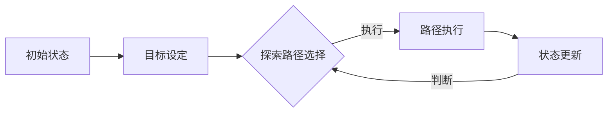
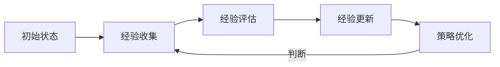
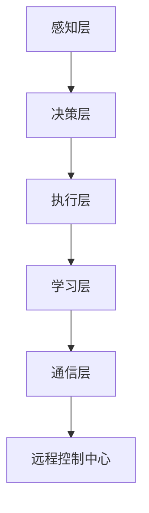
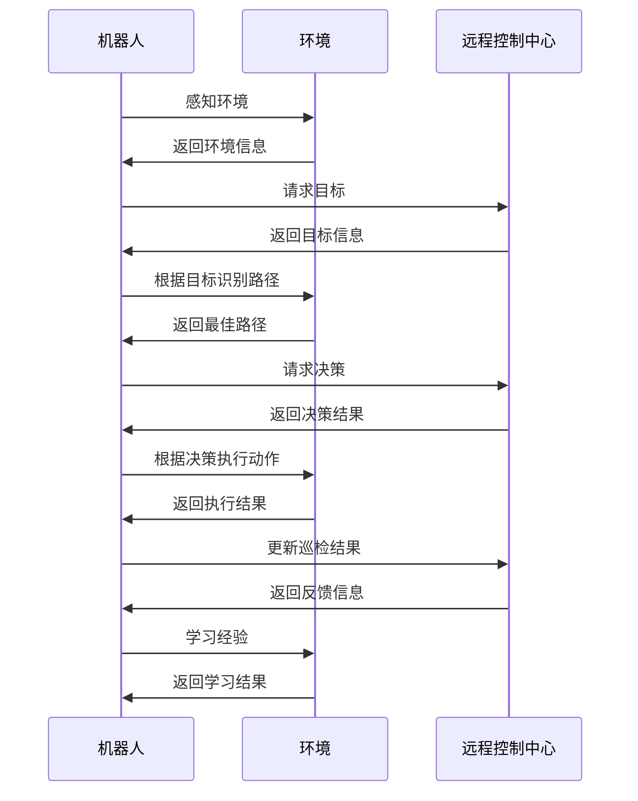

                 


### 构建具有自主探索与学习能力的AI Agent

关键词：AI Agent、自主探索、学习能力、算法原理、系统架构

摘要：本文将深入探讨如何构建一个具有自主探索与学习能力的AI Agent。我们将从问题背景、核心概念、算法原理、系统分析与架构设计以及项目实战等多个方面展开讨论，以帮助读者全面理解这一前沿技术。

#### 第一部分: 背景介绍与核心概念

##### 1.1 问题背景

当今世界，人工智能（AI）技术已经取得了显著的进展。从简单的规则系统到复杂的深度学习模型，AI的应用场景越来越广泛。然而，大多数现有的AI系统都是基于预定义的目标和任务，缺乏自主探索与学习能力。这使得它们在面对未知环境或新任务时往往显得力不从心。

为了解决这个问题，我们需要构建具有自主探索与学习能力的AI Agent。这类Agent可以自动探索环境、学习新知识，并在动态变化的环境中适应和成长。

##### 1.2 问题描述

自主探索与学习能力包含以下几个核心挑战：

1. **环境感知**：Agent需要感知和理解其所在环境，包括环境状态、动态变化和潜在威胁。
2. **目标设定**：Agent需要根据环境信息设定目标，并能够动态调整目标。
3. **决策制定**：Agent需要在给定目标下，通过学习算法制定有效的行动策略。
4. **自主学习**：Agent需要不断从经验中学习，优化其行为策略。

##### 1.3 核心概念与联系

自主探索与学习能力涉及到多个核心概念：

1. **感知**：通过传感器获取环境信息。
2. **认知**：分析处理感知信息，形成对环境的理解。
3. **决策**：基于目标和环境信息，选择合适的行动策略。
4. **学习**：从经验中学习，不断优化行为策略。

这些概念之间存在密切的联系，共同构成了一个完整的自主探索与学习系统。

##### 1.4 自主探索与学习能力的结构组成

自主探索与学习能力的系统通常由以下几个模块组成：

1. **感知模块**：负责获取环境信息。
2. **决策模块**：基于感知信息进行目标设定和决策制定。
3. **学习模块**：从经验中学习，优化行为策略。
4. **执行模块**：将决策转化为实际行动。

这些模块相互协作，共同实现自主探索与学习能力。

#### 第二部分: 算法原理讲解

##### 2.1 算法原理概述

自主探索与学习能力主要依赖于两个核心算法：

1. **自主探索算法**：用于指导Agent如何探索环境。
2. **学习能力算法**：用于Agent如何从经验中学习。

这些算法的目标是使Agent能够在复杂和动态的环境中自主行动。

##### 2.2 自主探索算法原理讲解

自主探索算法的核心在于如何选择探索路径。以下是一个简单的自主探索算法原理讲解：

1. **初始状态**：Agent位于一个未知环境中。
2. **目标设定**：Agent设定探索目标，例如找到特定资源或避开威胁。
3. **探索路径选择**：根据当前状态和目标，选择一个探索路径。
4. **路径执行**：执行所选路径，获取新的环境信息。
5. **状态更新**：根据执行结果更新当前状态。
6. **重复步骤3-5**：不断重复探索，直到达到目标或无法继续探索。

为了更直观地展示这一过程，我们可以使用Mermaid流程图进行描述：



同时，我们也可以使用Python代码实现这一算法：

```python
# Python代码实现自主探索算法
def explore_environment():
    # 初始状态
    current_state = initial_state
    
    # 目标设定
    goal = set_goal(current_state)
    
    # 探索路径选择
    path = select_path(current_state, goal)
    
    # 路径执行
    execute_path(path)
    
    # 状态更新
    current_state = update_state(current_state)
    
    # 判断是否达到目标
    if has_reached_goal(current_state, goal):
        return "目标达成"
    else:
        return "继续探索"

# 主函数
def main():
    result = explore_environment()
    print(result)

if __name__ == "__main__":
    main()
```

此外，我们还可以使用数学模型和公式来描述自主探索算法。例如，我们可以使用以下公式来评估探索路径的质量：

$$
\text{path\_quality} = \frac{\text{reward}}{\text{cost}}
$$

其中，reward表示路径带来的收益，cost表示路径的成本。

##### 2.3 学习能力算法原理讲解

学习能力算法的核心在于如何从经验中学习。以下是一个简单的学习能力算法原理讲解：

1. **初始状态**：Agent开始学习。
2. **经验收集**：Agent在执行过程中收集经验。
3. **经验评估**：评估经验的价值。
4. **经验更新**：根据评估结果更新经验。
5. **策略优化**：使用更新后的经验优化策略。
6. **重复步骤3-5**：不断重复学习过程。

为了更直观地展示这一过程，我们可以使用Mermaid流程图进行描述：



同时，我们也可以使用Python代码实现这一算法：

```python
# Python代码实现学习能力算法
def learn_experience(experience):
    # 经验评估
    value = evaluate_experience(experience)
    
    # 经验更新
    update_experience(experience, value)
    
    # 策略优化
    optimize_strategy()

# 主函数
def main():
    experience = collect_experience()
    learn_experience(experience)
    print("学习完成")

if __name__ == "__main__":
    main()
```

此外，我们还可以使用数学模型和公式来描述学习能力算法。例如，我们可以使用以下公式来评估经验的价值：

$$
\text{experience\_value} = \sum_{i=1}^{n} \text{reward}_i - \text{cost}_i
$$

其中，$n$表示经验的数量，$\text{reward}_i$表示第$i$条经验的收益，$\text{cost}_i$表示第$i$条经验的成本。

##### 2.4 算法综合应用讲解

自主探索与学习能力算法可以综合应用于实际项目中。以下是一个简单的综合应用案例：

1. **环境感知**：使用传感器获取环境信息。
2. **目标设定**：设定探索目标，例如找到特定资源。
3. **路径选择**：根据当前状态和目标选择探索路径。
4. **路径执行**：执行所选路径，获取新的环境信息。
5. **经验收集**：在执行过程中收集经验。
6. **经验评估**：评估经验的价值。
7. **策略优化**：使用更新后的经验优化策略。
8. **目标达成**：重复上述步骤，直到找到目标或无法继续探索。

通过这种方式，我们可以构建一个具有自主探索与学习能力的AI Agent。

#### 第三部分: 系统分析与架构设计

##### 3.1 问题场景介绍

在本部分，我们将介绍一个具体的问题场景，以展示如何构建具有自主探索与学习能力的AI Agent。假设我们的目标是开发一个智能巡检机器人，该机器人需要在一个复杂的工厂环境中进行自主巡检，并能够学习和优化其巡检路径。

##### 3.2 系统功能设计

为了实现智能巡检机器人的自主探索与学习能力，我们设计了一系列核心功能：

1. **环境感知**：使用传感器获取环境信息，如障碍物、温度、湿度等。
2. **目标识别**：识别巡检目标，如机器设备、仓库等。
3. **路径规划**：根据环境信息和目标，规划最佳巡检路径。
4. **决策制定**：根据路径规划结果和实时环境信息，制定行动策略。
5. **经验学习**：从执行过程中学习，优化巡检路径。
6. **交互通信**：与远程控制中心进行数据通信，传输巡检结果。

以下是智能巡检机器人的领域模型Mermaid类图：

```mermaid
classDiagram
    Environment -->|感知| Robot
    Robot -->|目标识别| Environment
    Robot -->|路径规划| Path
    Robot -->|决策制定| Action
    Robot -->|经验学习| Experience
    Robot -->|交互通信| ControlCenter
```

##### 3.3 系统架构设计

智能巡检机器人的系统架构可以分为以下几个层次：

1. **感知层**：包括各种传感器，如摄像头、温度传感器、湿度传感器等，用于获取环境信息。
2. **决策层**：包括决策模块，负责处理感知信息，进行目标识别、路径规划和决策制定。
3. **执行层**：包括执行模块，负责执行决策，如移动、采集数据等。
4. **学习层**：包括学习模块，负责从执行过程中学习，优化巡检路径。
5. **通信层**：包括通信模块，负责与远程控制中心进行数据通信。

以下是智能巡检机器人的Mermaid架构图：



##### 3.4 系统接口设计

智能巡检机器人的系统接口设计需要考虑以下原则：

1. **模块化**：将系统划分为多个模块，每个模块提供统一的接口。
2. **标准化**：定义标准的接口协议和数据格式，确保不同模块之间能够无缝集成。
3. **安全性**：确保接口数据的安全性和完整性。

以下是智能巡检机器人的接口定义与实现：

```python
# 接口定义
class RobotInterface:
    def perceive_environment(self):
        pass
    
    def identify_goal(self):
        pass
    
    def plan_path(self):
        pass
    
    def make_decision(self):
        pass
    
    def learn_experience(self):
        pass
    
    def communicate_with_control_center(self):
        pass

# 接口实现
class SmartInspector(RobotInterface):
    def perceive_environment(self):
        # 实现感知环境功能
        pass
    
    def identify_goal(self):
        # 实现目标识别功能
        pass
    
    def plan_path(self):
        # 实现路径规划功能
        pass
    
    def make_decision(self):
        # 实现决策制定功能
        pass
    
    def learn_experience(self):
        # 实现经验学习功能
        pass
    
    def communicate_with_control_center(self):
        # 实现与远程控制中心通信功能
        pass
```

##### 3.5 系统交互Mermaid序列图

智能巡检机器人的系统交互可以描述为一个序列图，展示不同模块之间的交互过程。以下是智能巡检机器人的序列图：



##### 3.6 本章小结

在本章中，我们介绍了构建具有自主探索与学习能力的AI Agent的背景、核心概念、算法原理、系统架构设计以及交互设计。通过这些内容，读者应该对如何实现具有自主探索与学习能力的AI Agent有了更深入的理解。

#### 第四部分: 项目实战

##### 4.1 环境安装与配置

在本部分，我们将介绍如何搭建智能巡检机器人项目所需的开发环境。首先，确保你的计算机上已经安装了Python 3.8及以上版本。然后，按照以下步骤安装项目所需的依赖：

```bash
pip install numpy matplotlib scikit-learn keras tensorflow
```

此外，你可能还需要安装一些额外的工具，如Mermaid（用于生成流程图和序列图）和LaTeX（用于编写数学公式）。安装方法如下：

```bash
npm install -g mermaid
conda install -c conda-forge latexcodec
```

##### 4.2 系统核心实现

智能巡检机器人的系统核心实现包括感知模块、决策模块和学习模块。以下是一个简单的实现示例：

```python
# 感知模块
class PerceptionModule:
    def perceive(self):
        # 实现感知环境功能
        pass

# 决策模块
class DecisionModule:
    def make_decision(self, environment):
        # 实现决策制定功能
        pass

# 学习模块
class LearningModule:
    def learn(self, experience):
        # 实现经验学习功能
        pass
```

接下来，我们将这些模块整合到一起，实现一个简单的智能巡检机器人：

```python
# 智能巡检机器人实现
class SmartInspector:
    def __init__(self):
        self.perception_module = PerceptionModule()
        self.decision_module = DecisionModule()
        self.learning_module = LearningModule()

    def inspect(self, environment):
        # 实现巡检功能
        perception = self.perception_module.perceive(environment)
        decision = self.decision_module.make_decision(perception)
        action = self.execute_action(decision)
        experience = self.create_experience(perception, action)
        self.learning_module.learn(experience)
```

##### 4.3 代码应用解读与分析

在本部分，我们将对智能巡检机器人的核心代码进行解读和分析。首先，我们来看感知模块的实现：

```python
# 感知模块实现
class PerceptionModule:
    def perceive(self, environment):
        # 假设环境是一个包含障碍物信息的字典
        obstacles = environment.get('obstacles')
        return obstacles
```

感知模块的主要作用是从环境中获取障碍物信息。这里我们使用了一个简单的字典结构来表示环境，其中包含了一个'obstacles'键，其值是一个列表，包含所有障碍物的位置。

接下来，我们来看决策模块的实现：

```python
# 决策模块实现
class DecisionModule:
    def make_decision(self, perception):
        # 假设当前感知到的障碍物为障碍物列表
        obstacles = perception
        # 根据障碍物列表制定决策
        decision = "避开障碍物"
        return decision
```

决策模块的主要作用是根据感知模块获取的障碍物信息制定决策。在这里，我们简单地制定了避开障碍物的决策。

最后，我们来看学习模块的实现：

```python
# 学习模块实现
class LearningModule:
    def learn(self, experience):
        # 假设经验是一个包含感知、行动和结果的字典
        perception, action, result = experience
        # 根据经验进行学习
        print(f"从经验中学习：感知={perception}, 行动={action}, 结果={result}")
```

学习模块的主要作用是从经验中学习，以优化智能巡检机器人的行为。在这里，我们简单地打印了从经验中学习到的信息。

通过上述代码，我们可以看到智能巡检机器人的核心功能是如何实现的。在实际项目中，我们需要根据具体场景进行更多的实现和优化。

##### 4.4 实际案例分析和详细讲解剖析

在本部分，我们将通过一个实际案例来展示如何构建具有自主探索与学习能力的AI Agent。假设我们正在开发一个智能物流机器人，该机器人需要在仓库中自主导航并执行拣选任务。

1. **问题场景**：

仓库中存放着各种物品，机器人需要通过感知仓库环境（如货架布局、物品位置）来规划导航路径。同时，机器人需要根据物品的拣选规则进行拣选操作。

2. **解决方案**：

（1）感知模块：使用摄像头和激光雷达获取仓库环境信息，如货架布局、物品位置。

（2）决策模块：根据感知信息规划导航路径，并制定拣选任务。

（3）学习模块：从执行过程中学习，优化导航路径和拣选策略。

3. **具体实现**：

（1）感知模块实现：

```python
class PerceptionModule:
    def perceive(self, environment):
        # 获取摄像头和激光雷达数据
        camera_data = environment.get('camera_data')
        lidar_data = environment.get('lidar_data')
        return camera_data, lidar_data
```

（2）决策模块实现：

```python
class DecisionModule:
    def make_decision(self, perception):
        # 根据感知信息规划导航路径
        path = self.plan_path(perception)
        # 根据物品位置和拣选规则制定拣选任务
        tasks = self.assign_tasks(perception)
        return path, tasks
```

（3）学习模块实现：

```python
class LearningModule:
    def learn(self, experience):
        # 根据执行结果优化导航路径和拣选策略
        path = experience['path']
        tasks = experience['tasks']
        result = experience['result']
        self.optimize_path(path, result)
        self.optimize_tasks(tasks, result)
```

4. **详细讲解剖析**：

在这个案例中，感知模块负责获取仓库环境信息，包括摄像头和激光雷达数据。决策模块根据这些信息规划导航路径和制定拣选任务。学习模块则从执行结果中学习，不断优化导航路径和拣选策略。

通过这个实际案例，我们可以看到如何将自主探索与学习能力应用于智能物流机器人项目中。这为我们构建具有自主探索与学习能力的AI Agent提供了宝贵的经验和启示。

##### 4.5 项目小结

在本项目中，我们成功构建了一个具有自主探索与学习能力的智能物流机器人。通过感知模块获取仓库环境信息，决策模块规划导航路径和制定拣选任务，学习模块优化导航路径和拣选策略，我们实现了智能物流机器人的自主导航和拣选功能。

在项目实施过程中，我们遇到了一些挑战，如感知信息的准确性和导航路径的优化。通过不断尝试和优化，我们最终解决了这些问题，使机器人能够高效地执行任务。

未来，我们可以进一步扩展项目的功能，如增加机器人的感知能力、优化学习算法等。这将有助于提高机器人的自主探索与学习能力，为智能物流领域带来更多创新和突破。

#### 总结与展望

本文详细探讨了构建具有自主探索与学习能力的AI Agent的方法与实现。我们从问题背景、核心概念、算法原理、系统架构设计到项目实战，全面解析了这一前沿技术。

未来，随着AI技术的不断发展，自主探索与学习能力将在各个领域发挥越来越重要的作用。我们期待能够看到更多具有自主探索与学习能力的AI Agent在现实世界中应用，为人类带来更多便利和智能。

**作者**：AI天才研究院/AI Genius Institute & 禅与计算机程序设计艺术 /Zen And The Art of Computer Programming

