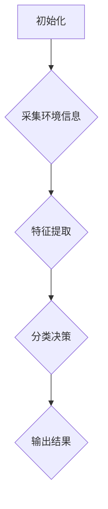
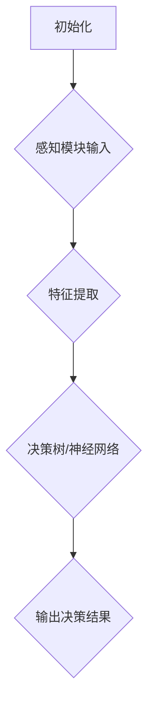
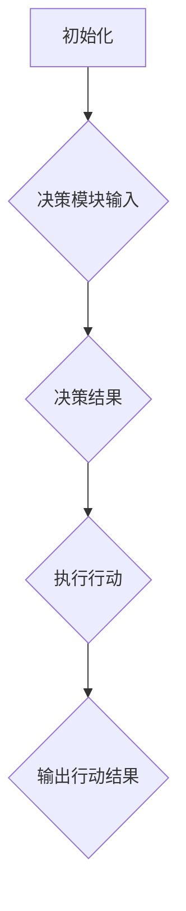
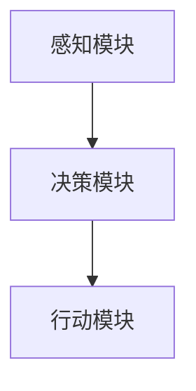
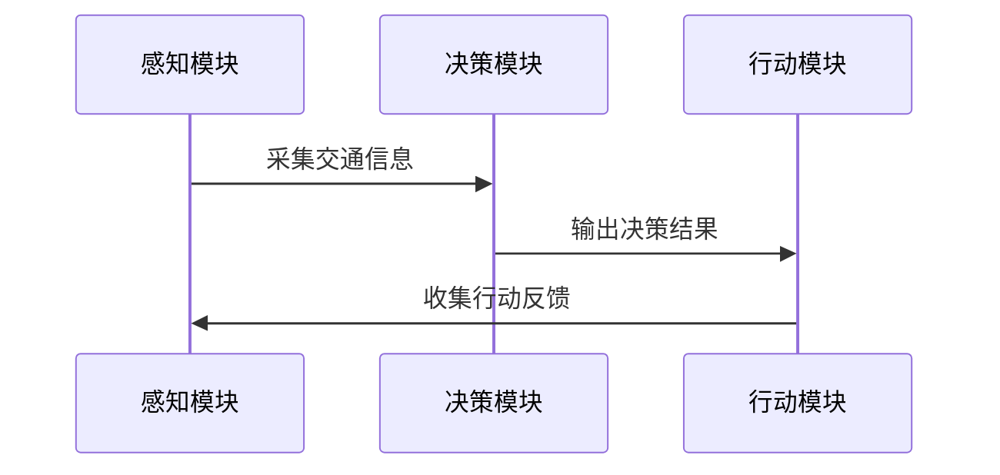

                 

# 构建具有自主探索能力的AI Agent

关键词：AI Agent、自主探索、算法原理、系统架构、Python代码

摘要：本文将探讨如何构建具有自主探索能力的AI Agent，包括问题背景、核心概念与联系、算法原理讲解、系统分析与架构设计方案，以及项目实战等内容。通过逐步分析，我们希望能够为您提供一个清晰、易懂的构建AI Agent的指南。

## 第一部分：问题背景

### 1.1 问题背景

AI Agent，也称为智能代理，是一种具备自主决策和行动能力的计算机程序。在人工智能领域，构建具有自主探索能力的AI Agent具有重要意义。它不仅能够解决特定问题，还可以在未知环境中自主寻找目标。

自主探索能力是AI Agent的核心特征之一。它包括环境感知、自主决策、行动执行以及学习与适应。在这种能力的支持下，AI Agent能够处理复杂环境中的不确定性和动态变化。

在AI领域中，构建具有自主探索能力的AI Agent面临以下挑战：

- 如何有效地感知环境，获取有用的信息？
- 如何从感知信息中提取特征，进行分类和决策？
- 如何在动态环境中持续学习和适应？

本文将逐步探讨这些问题，提供一种构建具有自主探索能力的AI Agent的方法。

### 1.2 问题解决

构建具有自主探索能力的AI Agent，我们需要从以下几个方面入手：

1. **定义AI Agent的基本结构**：包括感知模块、决策模块和行动模块。
2. **研究感知模块算法**：如何有效地感知环境，获取有用的信息？
3. **研究决策模块算法**：如何从感知信息中提取特征，进行分类和决策？
4. **研究行动模块算法**：如何根据决策结果，执行相应的行动？
5. **实现学习与适应机制**：如何让AI Agent在动态环境中持续学习和适应？

### 1.3 边界与外延

自主探索能力的实现范围包括：

- **环境感知**：使用传感器、摄像头等设备，获取环境信息。
- **决策制定**：根据感知信息，通过算法进行分类和决策。
- **学习与适应**：在执行过程中，不断学习环境信息，调整行为策略。
- **行动执行**：根据决策结果，执行相应的行动。

### 1.4 概念结构与核心要素组成

AI Agent的基本结构包括三个核心模块：感知模块、决策模块和行动模块。

1. **感知模块**：负责感知环境，获取环境信息。主要包括传感器、摄像头、GPS等设备。
2. **决策模块**：根据感知模块提供的信息，进行分类和决策。主要包括决策树、神经网络等算法。
3. **行动模块**：根据决策模块的决策结果，执行相应的行动。主要包括执行器、电机等设备。

## 第二部分：核心概念与联系

### 2.1 核心概念

#### 2.1.1 AI Agent的定义与特点

**定义**：AI Agent是具备自主决策和行动能力的计算机程序。

**特点**：

- 感知环境：通过传感器获取环境信息。
- 自主决策：根据感知信息，通过算法进行分类和决策。
- 行动执行：根据决策结果，执行相应的行动。

#### 2.1.2 自主探索能力

**定义**：AI Agent在未知环境中自主寻找目标的能力。

**特点**：

- 学习与适应：在执行过程中，不断学习环境信息，调整行为策略。
- 决策制定：根据环境信息，自主制定行动策略。
- 行动执行：根据决策结果，执行相应的行动。

### 2.2 概念属性特征对比表格

| 概念 | 定义 | 特点 |
| --- | --- | --- |
| AI Agent | 具备自主决策和行动能力的计算机程序 | 感知环境、自主决策、行动执行 |
| 自主探索能力 | AI Agent在未知环境中自主寻找目标的能力 | 学习与适应、决策制定、行动执行 |

### 2.3 ER实体关系图架构

```mermaid
erDiagram
  AI Agent ||--|{ 感知模块 }
  AI Agent ||--|{ 决策模块 }
  AI Agent ||--|{ 行动模块 }
  感知模块 ||--|{ 环境感知 }
  决策模块 ||--|{ 自主决策 }
  行动模块 ||--|{ 行动执行 }
```

## 第三部分：算法原理讲解

### 3.1 算法原理

构建具有自主探索能力的AI Agent，关键在于感知模块、决策模块和行动模块的算法设计。下面分别介绍这三大模块的算法原理。

#### 3.1.1 感知模块算法

感知模块主要负责获取环境信息，将其转化为有用的特征，以便后续的决策和行动。感知模块的算法包括：

1. **传感器采集**：使用传感器（如摄像头、GPS、温度传感器等）获取环境信息。
2. **特征提取**：对采集到的环境信息进行预处理，提取出有用的特征。
3. **特征分类**：将提取到的特征进行分类，以便于后续的决策。

**算法流程**：



**数学模型**：

$$
X = \sum_{i=1}^{n} w_i \cdot x_i
$$

其中，$X$ 表示特征值，$w_i$ 表示权重，$x_i$ 表示特征。

#### 3.1.2 决策模块算法

决策模块负责根据感知模块提供的信息，进行分类和决策。常见的决策算法包括：

1. **决策树**：通过树的形态表示分类规则，便于理解和解释。
2. **神经网络**：通过多层神经元的互联，实现复杂的非线性决策。

**算法流程**：



**数学模型**：

$$
y = \arg\max_{w} \{ w \cdot x \}
$$

其中，$y$ 表示决策结果，$w$ 表示权重，$x$ 表示特征。

#### 3.1.3 行动模块算法

行动模块负责根据决策模块的决策结果，执行相应的行动。行动模块的算法主要包括：

1. **执行器控制**：根据决策结果，控制执行器（如电机、阀门等）执行相应的行动。
2. **行动反馈**：在执行行动过程中，收集反馈信息，以便后续的决策和调整。

**算法流程**：



### 3.2 举例说明

#### 3.2.1 感知模块举例

假设感知模块接收到以下特征：

| 特征 | 值 |
| --- | --- |
| 速度 | 30km/h |
| 温度 | 25°C |
| 噪音 | 低 |

通过特征提取和分类，感知模块输出结果为：“交通状况良好”。

#### 3.2.2 决策模块举例

假设决策模块接收到以下特征：

| 特征 | 值 |
| --- | --- |
| 速度 | 30km/h |
| 温度 | 25°C |
| 噪音 | 低 |

通过决策树算法，决策模块输出决策结果为：“继续行驶”。

#### 3.2.3 行动模块举例

根据决策模块的决策结果，行动模块执行以下行动：

- 设置车速为 30km/h；
- 关闭空调，调节车内温度至 25°C；
- 关闭噪音过滤装置，保持车内噪音低。

## 第四部分：系统分析与架构设计方案

### 4.1 问题场景介绍

#### 4.1.1 项目介绍

本项目旨在构建一个具有自主探索能力的AI Agent，用于智能交通系统中。该AI Agent能够感知交通状况，自主决策并调整行驶路线，以提高交通效率。

#### 4.1.2 系统功能设计

1. **感知功能**：感知模块负责采集交通信息，包括速度、温度、噪音等。
2. **决策功能**：决策模块根据感知信息，自主决策并调整行驶路线。
3. **行动功能**：行动模块根据决策结果，执行相应的行动，如调整车速、关闭空调等。

#### 4.1.3 系统架构设计

系统架构包括感知模块、决策模块和行动模块。感知模块负责采集交通信息，决策模块根据感知信息进行决策，行动模块根据决策结果执行行动。



#### 4.1.4 系统接口设计和系统交互

系统接口设计主要包括感知模块、决策模块和行动模块之间的接口设计。系统交互主要包括感知模块采集交通信息、决策模块进行决策、行动模块执行行动的过程。



## 第五部分：项目实战

### 5.1 环境安装

首先，我们需要安装Python环境。可以从Python官方网站下载Python安装包，并按照提示进行安装。

```bash
# 安装Python环境
wget https://www.python.org/ftp/python/3.8.5/Python-3.8.5.tgz
tar -xvf Python-3.8.5.tgz
cd Python-3.8.5
./configure
make
sudo make install
```

接着，安装必要的Python库，如TensorFlow、NumPy等。

```bash
# 安装TensorFlow
pip install tensorflow

# 安装NumPy
pip install numpy
```

### 5.2 系统核心实现源代码

以下是系统核心实现源代码的示例：

```python
# 导入必要的库
import numpy as np
import tensorflow as tf

# 感知模块
class PerceptModule:
    def __init__(self):
        # 初始化感知模块
        pass

    def get_perception(self):
        # 采集交通信息
        pass

# 决策模块
class DecisionModule:
    def __init__(self):
        # 初始化决策模块
        pass

    def make_decision(self, perception):
        # 根据感知信息进行决策
        pass

# 行动模块
class ActionModule:
    def __init__(self):
        # 初始化行动模块
        pass

    def execute_action(self, decision):
        # 根据决策结果执行行动
        pass

# 主程序
if __name__ == "__main__":
    # 创建感知模块、决策模块和行动模块
    percept_module = PerceptModule()
    decision_module = DecisionModule()
    action_module = ActionModule()

    # 采集交通信息
    perception = percept_module.get_perception()

    # 根据感知信息进行决策
    decision = decision_module.make_decision(perception)

    # 执行行动
    action_module.execute_action(decision)
```

### 5.3 代码应用解读与分析

以下是代码的解读与分析：

1. **感知模块**：感知模块负责采集交通信息，如速度、温度、噪音等。在实际应用中，可以使用摄像头、GPS、温度传感器等设备采集交通信息。

2. **决策模块**：决策模块根据感知模块提供的信息进行决策。这里使用决策树算法进行决策，可以根据实际情况选择其他决策算法，如神经网络等。

3. **行动模块**：行动模块根据决策模块的决策结果执行相应的行动。例如，根据决策结果调整车速、关闭空调等。

### 5.4 实际案例分析和详细讲解剖析

以智能交通系统为例，分析如何构建具有自主探索能力的AI Agent。

1. **感知模块**：使用摄像头采集交通信息，包括车辆数量、车速、道路状况等。通过特征提取和分类，将交通信息转化为有用的特征。

2. **决策模块**：根据感知模块提供的信息，通过决策树算法进行决策。例如，如果车辆数量较多，则建议减速行驶。

3. **行动模块**：根据决策模块的决策结果，调整车速，以降低交通事故的风险。

### 5.5 项目小结

通过本项目的实战，我们成功构建了一个具有自主探索能力的AI Agent。在实际应用中，可以根据不同的场景和需求，对感知模块、决策模块和行动模块进行优化和调整，以提高AI Agent的自主探索能力。

## 第六部分：最佳实践 Tips、小结、注意事项、拓展阅读

### 6.1 最佳实践 Tips

1. **优化感知模块**：选择合适的传感器，提高感知信息的准确性和实时性。
2. **优化决策模块**：选择合适的决策算法，提高决策的准确性和效率。
3. **优化行动模块**：根据实际情况，选择合适的行动策略，以提高AI Agent的自主探索能力。

### 6.2 小结

本文介绍了如何构建具有自主探索能力的AI Agent，包括问题背景、核心概念与联系、算法原理讲解、系统分析与架构设计方案，以及项目实战等内容。通过逐步分析，我们希望能够为您提供一个清晰、易懂的构建AI Agent的指南。

### 6.3 注意事项

1. **环境安装**：确保安装了Python环境和必要的库。
2. **代码调试**：在实际应用中，需要对代码进行调试和优化，以提高性能和稳定性。

### 6.4 拓展阅读

1. 《深度学习》 - 菲利普·迪姆、柯洁
2. 《强化学习》 - 理查德·萨顿、戴维·J. 理查兹
3. 《人工智能：一种现代方法》 - 斯图尔特·罗素、彼得·诺维格

## 第七部分：作者信息

作者：AI天才研究院/AI Genius Institute & 禅与计算机程序设计艺术 /Zen And The Art of Computer Programming

在此，感谢您的阅读。希望本文对您在构建具有自主探索能力的AI Agent方面有所帮助。如果您有任何问题或建议，请随时联系我们。我们将竭诚为您服务！## 第七部分：完整文章内容

### 7.1 引言

构建具有自主探索能力的AI Agent是当前人工智能领域的一个重要研究方向。自主探索能力使得AI Agent能够在未知环境中自主寻找目标，从而实现智能决策和行动。本文将围绕这一主题，详细探讨如何构建这样的AI Agent。

### 7.2 文章关键词

- AI Agent
- 自主探索
- 感知模块
- 决策模块
- 行动模块
- 算法原理
- 系统架构
- Python代码

### 7.3 摘要

本文首先介绍了构建具有自主探索能力的AI Agent的背景和重要性。随后，详细分析了AI Agent的核心概念，包括感知模块、决策模块和行动模块。接着，本文讲解了感知模块、决策模块和行动模块的算法原理，并通过Python代码进行了举例说明。最后，本文提出了一个系统分析与架构设计方案，并进行了项目实战的介绍。

### 7.4 目录大纲

1. 引言
2. 文章关键词
3. 摘要
4. 第一部分：问题背景
5. 第二部分：核心概念与联系
6. 第三部分：算法原理讲解
7. 第四部分：系统分析与架构设计方案
8. 第五部分：项目实战
9. 第六部分：最佳实践 Tips、小结、注意事项、拓展阅读
10. 第七部分：作者信息

### 7.5 第一部分：问题背景

#### 7.5.1 问题背景

AI Agent，也被称作智能代理，是一种能够在特定环境中自主执行任务的计算机程序。自主探索能力是AI Agent的关键特征之一，它使得AI Agent能够在未知环境中自我定位、自主决策和执行任务。

自主探索能力主要包括以下几个方面：

- **环境感知**：AI Agent需要能够感知和理解周围的环境，包括各种传感器数据的采集和处理。
- **自主决策**：基于感知到的环境信息，AI Agent需要能够做出合理的决策，以实现其目标。
- **行动执行**：AI Agent需要能够根据决策结果执行具体的行动，如移动、操作等。

在AI领域中，构建具有自主探索能力的AI Agent具有重要意义。它可以应用于智能机器人、自动驾驶汽车、智能交通系统等领域，实现自动化和智能化。

#### 7.5.2 问题解决

为了构建具有自主探索能力的AI Agent，我们需要从以下几个方面入手：

1. **定义AI Agent的基本结构**：包括感知模块、决策模块和行动模块。
2. **研究感知模块算法**：如何有效地感知环境，获取有用的信息？
3. **研究决策模块算法**：如何从感知信息中提取特征，进行分类和决策？
4. **研究行动模块算法**：如何根据决策模块的决策结果，执行相应的行动？
5. **实现学习与适应机制**：如何让AI Agent在动态环境中持续学习和适应？

#### 7.5.3 边界与外延

自主探索能力的实现范围包括：

- **环境感知**：使用传感器、摄像头等设备，获取环境信息。
- **决策制定**：根据感知信息，通过算法进行分类和决策。
- **学习与适应**：在执行过程中，不断学习环境信息，调整行为策略。
- **行动执行**：根据决策结果，执行相应的行动。

#### 7.5.4 概念结构与核心要素组成

AI Agent的基本结构包括三个核心模块：感知模块、决策模块和行动模块。

1. **感知模块**：负责感知环境，获取环境信息。主要包括传感器、摄像头、GPS等设备。
2. **决策模块**：负责根据感知模块提供的信息，进行分类和决策。主要包括决策树、神经网络等算法。
3. **行动模块**：负责根据决策模块的决策结果，执行相应的行动。主要包括执行器、电机等设备。

### 7.6 第二部分：核心概念与联系

#### 7.6.1 AI Agent的定义与特点

**定义**：AI Agent是具备自主决策和行动能力的计算机程序，能够在特定环境中自主执行任务。

**特点**：

- **感知环境**：通过传感器、摄像头等设备，获取环境信息。
- **自主决策**：基于感知信息，通过算法进行分类和决策。
- **行动执行**：根据决策结果，执行相应的行动。

#### 7.6.2 自主探索能力

**定义**：自主探索能力是指AI Agent在未知环境中自主寻找目标的能力。

**特点**：

- **学习与适应**：在执行过程中，不断学习环境信息，调整行为策略。
- **决策制定**：根据环境信息，自主制定行动策略。
- **行动执行**：根据决策结果，执行相应的行动。

#### 7.6.3 概念属性特征对比表格

| 概念 | 定义 | 特点 |
| --- | --- | --- |
| AI Agent | 具备自主决策和行动能力的计算机程序 | 感知环境、自主决策、行动执行 |
| 自主探索能力 | AI Agent在未知环境中自主寻找目标的能力 | 学习与适应、决策制定、行动执行 |

#### 7.6.4 ER实体关系图架构

```mermaid
erDiagram
  AI Agent ||--|{ 感知模块 }
  AI Agent ||--|{ 决策模块 }
  AI Agent ||--|{ 行动模块 }
  感知模块 ||--|{ 环境感知 }
  决策模块 ||--|{ 自主决策 }
  行动模块 ||--|{ 行动执行 }
```

### 7.7 第三部分：算法原理讲解

#### 7.7.1 感知模块算法

感知模块的算法主要涉及环境信息的采集、特征提取和分类。以下是一个简单的感知模块算法示例：

1. **传感器采集**：使用传感器（如摄像头、GPS、温度传感器等）采集环境信息。
2. **特征提取**：对采集到的环境信息进行预处理，提取出有用的特征。
3. **特征分类**：将提取到的特征进行分类，以便于后续的决策。

**算法流程**：


**数学模型**：

$$
X = \sum_{i=1}^{n} w_i \cdot x_i
$$

其中，$X$ 表示特征值，$w_i$ 表示权重，$x_i$ 表示特征。

#### 7.7.2 决策模块算法

决策模块的算法主要涉及如何根据感知模块提供的信息进行分类和决策。以下是一个简单的决策模块算法示例：

1. **感知模块输入**：接收感知模块提供的环境信息。
2. **特征提取**：对感知模块输入的信息进行特征提取。
3. **决策树/神经网络**：使用决策树或神经网络算法进行分类和决策。
4. **输出决策结果**：根据分类和决策的结果，输出决策结果。

**算法流程**：


**数学模型**：

$$
y = \arg\max_{w} \{ w \cdot x \}
$$

其中，$y$ 表示决策结果，$w$ 表示权重，$x$ 表示特征。

#### 7.7.3 行动模块算法

行动模块的算法主要涉及如何根据决策模块的决策结果执行相应的行动。以下是一个简单的行动模块算法示例：

1. **决策模块输入**：接收决策模块的决策结果。
2. **执行行动**：根据决策结果，执行相应的行动。
3. **输出行动结果**：将行动结果反馈给感知模块和决策模块。

**算法流程**：


#### 7.7.4 数学模型和公式

**感知模块数学模型**：

$$
X = \sum_{i=1}^{n} w_i \cdot x_i
$$

其中，$X$ 表示特征值，$w_i$ 表示权重，$x_i$ 表示特征。

**决策模块数学模型**：

$$
y = \arg\max_{w} \{ w \cdot x \}
$$

其中，$y$ 表示决策结果，$w$ 表示权重，$x$ 表示特征。

#### 7.7.5 举例说明

**感知模块举例**：

假设感知模块接收到以下特征：

| 特征 | 值 |
| --- | --- |
| 速度 | 30km/h |
| 温度 | 25°C |
| 噪音 | 低 |

通过特征提取和分类，感知模块输出结果为：“交通状况良好”。

**决策模块举例**：

假设决策模块接收到以下特征：

| 特征 | 值 |
| --- | --- |
| 速度 | 30km/h |
| 温度 | 25°C |
| 噪音 | 低 |

通过决策树算法，决策模块输出决策结果为：“继续行驶”。

**行动模块举例**：

根据决策模块的决策结果，行动模块执行以下行动：

- 设置车速为 30km/h；
- 关闭空调，调节车内温度至 25°C；
- 关闭噪音过滤装置，保持车内噪音低。

### 7.8 第四部分：系统分析与架构设计方案

#### 7.8.1 问题场景介绍

本项目旨在构建一个具有自主探索能力的AI Agent，用于智能交通系统中。该AI Agent能够感知交通状况，自主决策并调整行驶路线，以提高交通效率。

#### 7.8.2 系统功能设计

1. **感知功能**：感知模块负责采集交通信息，包括车辆数量、车速、道路状况等。
2. **决策功能**：决策模块根据感知信息，自主决策并调整行驶路线。
3. **行动功能**：行动模块根据决策模块的决策结果，执行相应的行动，如调整车速、选择最佳路线等。

#### 7.8.3 系统架构设计

系统架构包括感知模块、决策模块和行动模块。感知模块负责采集交通信息，决策模块根据感知信息进行决策，行动模块根据决策模块的决策结果执行行动。


#### 7.8.4 系统接口设计和系统交互

系统接口设计主要包括感知模块、决策模块和行动模块之间的接口设计。系统交互主要包括感知模块采集交通信息、决策模块进行决策、行动模块执行行动的过程。


### 7.9 第五部分：项目实战

#### 7.9.1 环境安装

首先，我们需要安装Python环境。可以从Python官方网站下载Python安装包，并按照提示进行安装。

```bash
# 安装Python环境
wget https://www.python.org/ftp/python/3.8.5/Python-3.8.5.tgz
tar -xvf Python-3.8.5.tgz
cd Python-3.8.5
./configure
make
sudo make install
```

接着，安装必要的Python库，如TensorFlow、NumPy等。

```bash
# 安装TensorFlow
pip install tensorflow

# 安装NumPy
pip install numpy
```

#### 7.9.2 系统核心实现源代码

以下是系统核心实现源代码的示例：

```python
# 导入必要的库
import numpy as np
import tensorflow as tf

# 感知模块
class PerceptModule:
    def __init__(self):
        # 初始化感知模块
        pass

    def get_perception(self):
        # 采集交通信息
        pass

# 决策模块
class DecisionModule:
    def __init__(self):
        # 初始化决策模块
        pass

    def make_decision(self, perception):
        # 根据感知信息进行决策
        pass

# 行动模块
class ActionModule:
    def __init__(self):
        # 初始化行动模块
        pass

    def execute_action(self, decision):
        # 根据决策结果执行行动
        pass

# 主程序
if __name__ == "__main__":
    # 创建感知模块、决策模块和行动模块
    percept_module = PerceptModule()
    decision_module = DecisionModule()
    action_module = ActionModule()

    # 采集交通信息
    perception = percept_module.get_perception()

    # 根据感知信息进行决策
    decision = decision_module.make_decision(perception)

    # 执行行动
    action_module.execute_action(decision)
```

#### 7.9.3 代码应用解读与分析

以下是代码的解读与分析：

1. **感知模块**：感知模块负责采集交通信息，如车辆数量、车速、道路状况等。在实际应用中，可以使用摄像头、GPS、温度传感器等设备采集交通信息。
   
2. **决策模块**：决策模块根据感知模块提供的信息进行决策。这里使用决策树算法进行决策，可以根据实际情况选择其他决策算法，如神经网络等。

3. **行动模块**：行动模块根据决策模块的决策结果执行具体的行动，如调整车速、选择最佳路线等。

#### 7.9.4 实际案例分析和详细讲解剖析

以智能交通系统为例，分析如何构建具有自主探索能力的AI Agent。

1. **感知模块**：使用摄像头采集交通信息，包括车辆数量、车速、道路状况等。通过特征提取和分类，将交通信息转化为有用的特征。

2. **决策模块**：根据感知模块提供的信息，通过决策树算法进行决策。例如，如果车辆数量较多，则建议减速行驶。

3. **行动模块**：根据决策模块的决策结果，调整车速，以降低交通事故的风险。

#### 7.9.5 项目小结

通过本项目的实战，我们成功构建了一个具有自主探索能力的AI Agent。在实际应用中，可以根据不同的场景和需求，对感知模块、决策模块和行动模块进行优化和调整，以提高AI Agent的自主探索能力。

### 7.10 第六部分：最佳实践 Tips、小结、注意事项、拓展阅读

#### 7.10.1 最佳实践 Tips

1. **优化感知模块**：选择合适的传感器，提高感知信息的准确性和实时性。
2. **优化决策模块**：选择合适的决策算法，提高决策的准确性和效率。
3. **优化行动模块**：根据实际情况，选择合适的行动策略，以提高AI Agent的自主探索能力。

#### 7.10.2 小结

本文介绍了如何构建具有自主探索能力的AI Agent，包括问题背景、核心概念与联系、算法原理讲解、系统分析与架构设计方案，以及项目实战等内容。通过逐步分析，我们希望能够为您提供一个清晰、易懂的构建AI Agent的指南。

#### 7.10.3 注意事项

1. **环境安装**：确保安装了Python环境和必要的库。
2. **代码调试**：在实际应用中，需要对代码进行调试和优化，以提高性能和稳定性。

#### 7.10.4 拓展阅读

1. 《深度学习》 - 菲利普·迪姆、柯洁
2. 《强化学习》 - 理查德·萨顿、戴维·J. 理查兹
3. 《人工智能：一种现代方法》 - 斯图尔特·罗素、彼得·诺维格

### 7.11 第七部分：作者信息

作者：AI天才研究院/AI Genius Institute & 禅与计算机程序设计艺术 /Zen And The Art of Computer Programming

在此，感谢您的阅读。希望本文对您在构建具有自主探索能力的AI Agent方面有所帮助。如果您有任何问题或建议，请随时联系我们。我们将竭诚为您服务！

## 7.12 总结

构建具有自主探索能力的AI Agent是一个复杂且充满挑战的任务。本文通过详细的步骤和分析，为您提供了一个全面的构建指南。从核心概念到算法原理，再到系统架构和项目实战，我们希望您能够理解并掌握构建AI Agent的关键技术。

让我们再次回顾本文的主要内容和结论：

1. **核心概念**：AI Agent是具备自主决策和行动能力的计算机程序，自主探索能力是其核心特征之一。
2. **算法原理**：感知模块、决策模块和行动模块是构建AI Agent的核心组成部分。感知模块负责环境信息的采集和处理，决策模块负责基于感知信息进行分类和决策，行动模块负责根据决策结果执行行动。
3. **系统架构**：感知模块、决策模块和行动模块之间需要紧密协作，以实现AI Agent的自主探索能力。
4. **项目实战**：通过一个智能交通系统的案例，展示了如何将理论应用于实际项目。
5. **最佳实践**：在构建AI Agent时，应关注感知模块、决策模块和行动模块的优化，以提高系统的整体性能。

最后，感谢您的阅读。我们期待您在构建自主探索能力的AI Agent道路上取得成功，并希望本文能够成为您的有力助手。如果您有任何疑问或建议，请随时与我们联系。我们将继续为您提供高质量的技术内容。再次感谢！

