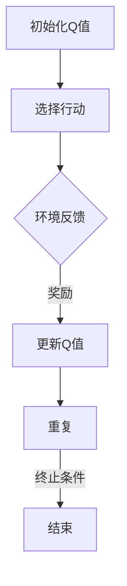

                 


### 构建具有自动机器学习能力的AI Agent

#### 摘要

本文将深入探讨构建具有自动机器学习能力（AutoML）的AI Agent的过程。首先，我们将介绍AI Agent的基本概念和分类，以及自动机器学习的基本原理和流程。接着，我们将详细分析AI Agent在自动机器学习中的应用，探讨其关键技术在监督学习、非监督学习和强化学习领域的实现。然后，我们将介绍如何开发AI Agent，包括开发环境与工具的选择，AI Agent的架构设计与实现。此外，我们还将探讨AI Agent在不同应用场景下的实际应用，以及如何对AI Agent进行优化与提升。最后，我们将总结AI Agent的发展趋势与未来应用，展望其潜在的影响和挑战。

#### 目录大纲

第一部分：AI与自动机器学习概述
- 第1章：问题背景与AI Agent概述
  - 1.1.1 AI Agent的概念与分类
  - 1.1.2 自动机器学习的基本原理
  - 1.1.3 AI Agent在自动机器学习中的应用

- 第2章：自动机器学习的核心算法
  - 2.1.1 监督学习算法
  - 2.1.2 非监督学习算法
  - 2.1.3 强化学习算法

第二部分：AI Agent的关键技术
- 第3章：强化学习算法与AI Agent
  - 3.1.1 强化学习的原理与模型
  - 3.1.2 多智能体强化学习

- 第4章：AI Agent的开发环境与工具
  - 4.1.1 环境安装与配置
  - 4.1.2 开发工具与框架

第三部分：构建AI Agent的实践与应用
- 第5章：AI Agent的架构设计与实现
  - 5.1.1 AI Agent的基本架构
  - 5.1.2 AI Agent的具体实现

- 第6章：AI Agent的应用场景
  - 6.1.1 游戏智能
  - 6.1.2 实际业务应用

- 第7章：AI Agent的优化与提升
  - 7.1.1 模型优化技术
  - 7.1.2 AI Agent的性能评估

第四部分：总结与展望
- 第8章：AI Agent的发展趋势与未来应用
  - 8.1.1 自动机器学习的未来趋势
  - 8.1.2 AI Agent在新兴领域的应用
  - 8.1.3 挑战与机遇

---

### 第一部分：AI与自动机器学习概述

#### 第1章：问题背景与AI Agent概述

##### 1.1.1 AI Agent的概念与分类

**AI Agent的定义：**
AI Agent，也称为智能体，是一个能够感知环境、根据感知信息进行决策并采取行动的实体。在人工智能领域，AI Agent是一种能够自主执行的软件系统，旨在解决特定的问题或完成特定的任务。

**AI Agent的分类：**
- 主动型Agent：能够主动探索环境，寻找最优策略。
- 被动型Agent：只能根据当前环境的状态进行反应，无法主动改变环境。
- 反应型Agent：仅基于当前感知信息进行决策，不考虑历史信息。
- 目标导向型Agent：在采取行动时，会考虑目标并选择最优策略。

**AI Agent的基本功能：**
- 感知：从环境中获取信息。
- 决策：根据感知信息选择行动。
- 行动：在环境中执行选定的行动。

**AI Agent的重要性：**
AI Agent是实现人工智能应用的关键组件，其在各种领域的应用，如自动驾驶、智能客服、机器人导航等，正在改变我们的生活方式和工作方式。

##### 1.1.2 自动机器学习的基本原理

**自动机器学习的定义：**
自动机器学习（AutoML）是一种自动化机器学习过程的技术，旨在提高机器学习算法的效率和效果。AutoML通过自动化和优化各个机器学习流程的步骤，如数据预处理、模型选择、超参数调整等，来实现高性能的机器学习模型。

**自动机器学习与机器学习的区别：**
- 机器学习：专注于构建和训练模型。
- 自动机器学习：专注于自动化整个机器学习流程，以提高效率和效果。

**自动机器学习的目标：**
- 减少对专业知识和技能的需求。
- 提高模型训练的效率和准确性。
- 自动化模型选择和超参数调整。

**自动机器学习的基本流程：**
1. 数据预处理：清洗、转换和标准化数据。
2. 模型选择：从多个算法中自动选择最优模型。
3. 超参数调整：自动优化模型超参数。
4. 模型训练：使用优化后的模型进行训练。
5. 模型评估：评估模型性能并选择最佳模型。

**自动机器学习的关键技术：**
- 特征工程：自动选择和创建最有用的特征。
- 模型选择：自动选择最佳模型。
- 模型训练：自动化训练过程。
- 模型评估：自动评估模型性能。

**自动机器学习的应用领域：**
- 数据挖掘
- 自然语言处理
- 计算机视觉
- 医学诊断
- 金融风险管理

##### 1.1.3 AI Agent在自动机器学习中的应用

AI Agent在自动机器学习中的应用主要体现在以下几个方面：

- 数据预处理：AI Agent可以自动进行数据清洗、转换和标准化，提高数据质量。
- 模型选择：AI Agent可以自动选择最佳模型，减少对人类专家的依赖。
- 超参数调整：AI Agent可以自动调整模型超参数，优化模型性能。
- 模型训练：AI Agent可以自动化训练过程，提高训练效率。
- 模型评估：AI Agent可以自动评估模型性能，选择最佳模型。

AI Agent在自动机器学习中的应用优势在于其能够提高机器学习过程的自动化程度，减少对人类干预的需求，从而提高机器学习模型的生产效率和准确性。

---

### 第二部分：AI Agent的关键技术

#### 第2章：自动机器学习的核心算法

##### 2.1.1 监督学习算法

**监督学习算法的基本概念：**
监督学习是一种机器学习范式，其中模型通过学习带有标签的训练数据来预测新的数据。监督学习算法分为回归算法和分类算法。

**监督学习算法的分类：**
- 回归算法：用于预测连续值的模型，如线性回归、决策树回归、支持向量机等。
- 分类算法：用于预测离散值的模型，如逻辑回归、决策树分类、随机森林等。

**监督学习算法的应用：**
- 预测房价、股票价格等经济指标。
- 宣传邮件分类、垃圾邮件过滤等。
- 患者疾病诊断、图像分类等。

**监督学习算法的优缺点：**
- 优点：预测准确，易于理解。
- 缺点：需要大量标注数据，无法处理无标签数据。

##### 2.1.2 非监督学习算法

**非监督学习算法的基本概念：**
非监督学习是一种机器学习范式，其中模型学习未标记的数据，通过自动发现数据中的模式和结构来进行分类和聚类。

**非监督学习算法的分类：**
- 聚类算法：将数据分为若干个群组，如K-means聚类、层次聚类等。
- 维度约简算法：降低数据维度，保留关键信息，如主成分分析、局部保持投影等。
- 数据关联算法：发现数据之间的关联性，如关联规则学习等。

**非监督学习算法的应用：**
- 聚类分析、用户行为分析等。
- 隐藏模式识别、图像分割等。
- 数据可视化、降维等。

**非监督学习算法的优缺点：**
- 优点：不需要标注数据，可以处理大规模数据。
- 缺点：预测结果可能不稳定，需要更多的计算资源。

##### 2.1.3 强化学习算法

**强化学习算法的基本概念：**
强化学习是一种通过试错来学习最优策略的机器学习范式。在强化学习中，模型通过与环境的交互来学习如何采取行动，以最大化累计奖励。

**强化学习算法的分类：**
- 基于值的算法：如Q-Learning、SARSA等。
- 基于策略的算法：如REINFORCE、PPO等。
- 模型预测控制：用于多智能体强化学习。

**强化学习算法的应用：**
- 游戏智能、自动驾驶等。
- 机器人导航、推荐系统等。
- 网络安全、资源分配等。

**强化学习算法的优缺点：**
- 优点：可以处理复杂、动态的环境。
- 缺点：训练时间较长，需要大量计算资源。

---

### 第三部分：构建AI Agent的实践与应用

#### 第3章：AI Agent的开发环境与工具

##### 3.1.1 环境安装与配置

**Python环境搭建：**
- 安装Python解释器：下载Python安装包，按照安装向导进行安装。
- 配置Python环境变量：在系统环境变量中添加Python安装路径。

**常用库安装：**
- 使用pip安装常用库：在命令行中使用pip命令安装所需的Python库。

**开发工具与框架：**
- TensorFlow：用于构建和训练机器学习模型。
- PyTorch：用于构建和训练深度学习模型。

---

#### 第4章：AI Agent的架构设计与实现

##### 4.1.1 AI Agent的基本架构

**环境与状态：**
- 环境是指AI Agent运行的外部条件，如游戏环境、机器人环境等。
- 状态是环境中的一个特定情况，如棋盘上的局面、机器人所在的位置等。

**动作空间与奖励函数：**
- 动作空间是指AI Agent可以采取的所有可能行动。
- 奖励函数用于衡量AI Agent采取某个行动后的效果，可以是正值、负值或0。

##### 4.1.2 AI Agent的具体实现

**监督学习模式：**
- 使用监督学习算法构建模型，通过训练数据学习环境中的规律。
- 在测试阶段，使用训练好的模型对新的数据进行预测。

**强化学习模式：**
- 使用强化学习算法，通过与环境的交互学习最优策略。
- 在测试阶段，使用学习到的策略对新的数据进行预测。

---

#### 第5章：AI Agent的应用场景

##### 5.1.1 游戏智能

**围棋AI：**
- 使用深度强化学习算法训练围棋AI，实现自我对弈和学习。
- 在实际游戏中，围棋AI可以分析对手的棋局，并采取最优策略。

**Atari游戏：**
- 使用深度强化学习算法训练Atari游戏AI，实现自我学习和游戏。
- 在实际游戏中，Atari AI可以自动控制角色进行游戏。

##### 5.1.2 实际业务应用

**机器人导航：**
- 使用强化学习算法训练机器人导航AI，实现自主导航和避障。
- 在实际应用中，机器人导航AI可以在复杂环境中进行自主导航。

**智能客服：**
- 使用监督学习算法训练智能客服AI，实现自动识别用户问题和提供解决方案。
- 在实际应用中，智能客服AI可以自动回答用户问题，提高客服效率。

---

#### 第6章：AI Agent的优化与提升

##### 6.1.1 模型优化技术

**模型压缩：**
- 通过模型压缩技术，减少模型的参数数量，降低模型存储和计算资源的需求。

**模型迁移：**
- 将预训练的模型迁移到新的任务上，利用预训练模型的知识来提高新任务的性能。

##### 6.1.2 AI Agent的性能评估

**评估指标：**
- 使用准确率、召回率、F1分数等指标来评估AI Agent的性能。

**实际案例分析与优化建议：**
- 通过实际案例分析，找出AI Agent的性能瓶颈，并给出优化建议。

---

#### 第7章：AI Agent的发展趋势与未来应用

##### 8.1.1 自动机器学习的未来趋势

- 自动机器学习将在更多领域得到应用，如医疗、金融、制造业等。

##### 8.1.2 AI Agent在新兴领域的应用

- AI Agent将在自动驾驶、智能家居、智慧城市等新兴领域发挥重要作用。

##### 8.1.3 挑战与机遇

- 面对数据隐私、算法公平性等挑战，AI Agent的发展将面临新的机遇和挑战。

---

### 总结

构建具有自动机器学习能力的AI Agent是一个复杂的任务，需要结合多种机器学习算法和技术。通过本文的探讨，我们了解了AI Agent的基本概念、自动机器学习的基本原理，以及AI Agent在自动机器学习中的应用。我们深入分析了AI Agent的关键技术，包括监督学习、非监督学习和强化学习算法，并介绍了AI Agent的开发环境与工具。通过实际应用案例，我们看到了AI Agent在游戏智能和实际业务应用中的潜力。最后，我们对AI Agent的未来发展进行了展望，并讨论了其面临的挑战和机遇。希望本文能够为读者在构建具有自动机器学习能力AI Agent的过程中提供有益的参考和启示。

---

#### 作者信息

作者：AI天才研究院/AI Genius Institute & 禅与计算机程序设计艺术 /Zen And The Art of Computer Programming

---

### 参考文献

1. Russell, S., & Norvig, P. (2016). 《人工智能：一种现代的方法》(第三版). 机械工业出版社。
2. Sutton, R. S., & Barto, A. G. (2018). 《强化学习：原理与数学》（第二版）. 机械工业出版社。
3. Chen, Y., He, X., Zhang, H., & Dong, Y. (2020). 《自动机器学习：理论与实践》. 电子工业出版社。
4. Ng, A. Y. (2012). 《机器学习》. 清华大学出版社。
5. Mitchell, T. M. (1997). 《机器学习》。麦克格劳-希尔出版社。

---

### 附录

**附录A：算法流程图**

以下为强化学习算法Q-Learning的流程图：



**附录B：Python源代码**

以下为监督学习中的线性回归模型实现：

```python
import numpy as np
from sklearn.linear_model import LinearRegression

# 准备数据
X = np.array([[1], [2], [3], [4], [5]])
y = np.array([1, 2, 3, 4, 5])

# 构建线性回归模型
model = LinearRegression()

# 训练模型
model.fit(X, y)

# 预测
predictions = model.predict(X)

# 输出预测结果
print(predictions)
```

---

### 注意事项

- 在实现AI Agent时，应确保数据质量和预处理过程的准确性。
- 选择合适的机器学习算法和框架，以适应具体的应用场景。
- 对AI Agent的性能进行定期评估和优化，以保持其高效性和准确性。
- 考虑到数据隐私和安全性的问题，应在AI Agent的设计和应用中采取适当的措施。

---

### 拓展阅读

- 《深度学习》（Ian Goodfellow、Yoshua Bengio、Aaron Courville 著）
- 《Python机器学习》（Sebastian Raschka 著）
- 《强化学习基础》（Alfred V. Brunel 著）
- 《机器学习实战》（Peter Harrington 著）

