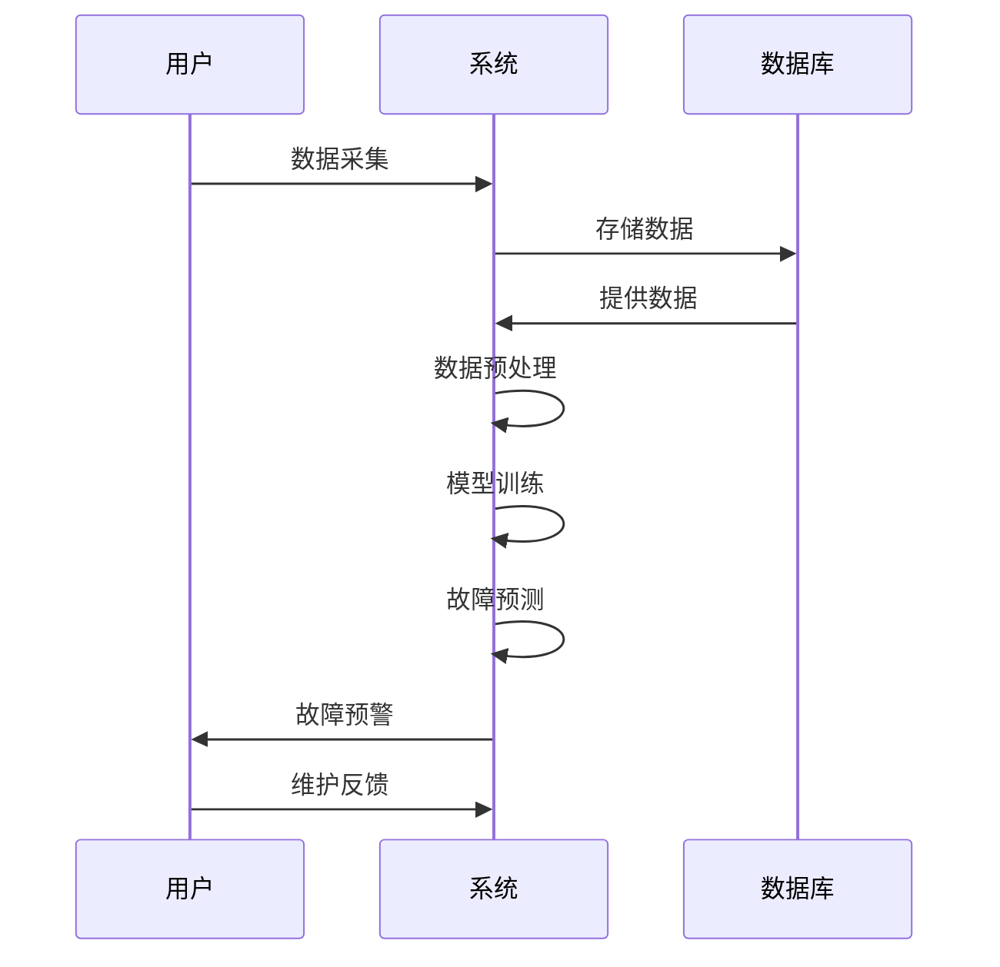

                 

### 第一部分：AI Agent的基础知识

#### 第1章：AI Agent的定义与分类

##### 1.1 AI Agent的定义

###### 1.1.1 问题背景
人工智能（AI）技术自上世纪以来取得了长足的进步，从最初的理论研究逐步走向实际应用。在这一过程中，AI Agent作为一个核心概念，逐渐受到广泛关注。AI Agent不仅仅是一个简单的算法或者模型，它代表了一种具有自主性和智能性的实体，能够在特定环境中采取行动，达成预定的目标。

###### 1.1.2 问题描述
在定义AI Agent时，我们需要明确几个关键问题：AI Agent是什么？它有什么特点？与传统算法有何区别？

###### 1.1.3 问题解决
AI Agent，即人工智能代理，是一种能够感知环境、制定计划并执行相应行动的智能实体。它具备以下特点：
1. **自主性**：能够独立做出决策。
2. **适应性**：能够根据环境变化调整自身行为。
3. **目标性**：所有行动均以达成特定目标为导向。

与传统算法相比，AI Agent更加灵活和智能。传统算法通常按照预定的步骤执行，而AI Agent能够动态调整策略，以适应不断变化的环境。

为了更好地理解AI Agent，我们可以将其基本功能总结为以下几点：
1. **感知**：获取环境信息。
2. **规划**：根据当前状态和目标制定行动方案。
3. **执行**：实施计划中的行动。
4. **评估**：对行动效果进行评估，以指导后续行动。

##### 1.2 AI Agent的分类

###### 1.2.1 问题背景
AI Agent在应用场景和设计理念上具有多样性，因此对其进行分类有助于我们更好地理解和研究。AI Agent的分类不仅能够帮助我们明确不同类型的AI Agent的特点，还能为实际应用提供指导。

###### 1.2.2 问题描述
在分类AI Agent时，我们需要确立合理的分类标准，并对不同类型的AI Agent进行介绍。

###### 1.2.3 问题解决
常见的分类标准包括：
1. **按功能分类**：感知型Agent、决策型Agent、执行型Agent和评估型Agent。
2. **按任务分类**：单任务Agent和复任务Agent。
3. **按智能水平分类**：弱AI Agent、强AI Agent和非AI Agent。

不同类型的AI Agent介绍如下：
1. **感知型Agent**：主要功能是感知环境，收集信息。
2. **决策型Agent**：能够基于感知信息制定决策。
3. **执行型Agent**：负责执行决策计划中的行动。
4. **评估型Agent**：对行动效果进行评估。

此外，还有以下几种类型的AI Agent：
1. **社交Agent**：能够在多人环境中进行交互。
2. **移动Agent**：在动态环境中执行任务。
3. **专家Agent**：基于特定领域的知识库进行决策。

通过分类，我们可以更深入地理解AI Agent的多样性和应用潜力。

##### 1.3 AI Agent的核心概念与联系

###### 1.3.1 核心概念
在AI Agent的设计和实现过程中，以下几个核心概念是不可或缺的：
1. **感知器**：负责收集环境信息。
2. **动作器**：执行具体行动。
3. **知识库**：存储环境信息和决策策略。

###### 1.3.2 概念属性特征对比表格
以下是这几个核心概念的属性特征对比表格：

| 概念     | 功能       | 属性特征                     |
|----------|------------|------------------------------|
| 感知器   | 收集信息   | 高敏感性、高精度             |
| 动作器   | 执行行动   | 高效率、高适应性             |
| 知识库   | 存储信息   | 大容量、易扩展、可更新       |

通过对比表格，我们可以清晰地看到各个概念的功能和特点。

###### 1.3.3 ER实体关系图架构
以下是AI Agent的ER实体关系图：

```mermaid
erDiagram
  感知器 ||--|{ 动作器 }|
  知识库 ||--|{ 动作器 }|
  知识库 ||--|{ 感知器 }|
```

在该ER实体关系图中，感知器与动作器之间存在双向关系，而知识库与感知器和动作器均存在关联关系。这反映了AI Agent中各核心概念之间的紧密联系。

通过本章节的介绍，我们对AI Agent的定义、分类以及核心概念有了更深入的了解。接下来，我们将进一步探讨自我学习AI Agent的原理，以了解其在人工智能领域的应用和发展。

#### 第2章：自我学习AI Agent的原理

##### 2.1 问题背景

###### 2.1.1 问题描述
尽管传统AI Agent在某些领域已经取得了显著成就，但它们往往缺乏自我学习能力。在复杂和动态的环境中，传统AI Agent很难适应变化，这限制了它们的应用范围。因此，研究具有自我学习能力的AI Agent具有重要意义。

传统AI Agent通常依赖于预定的规则和模型，无法在运行过程中自主学习和调整。这种局限性使得它们在面对未知环境或突发情况时往往束手无策。自我学习AI Agent则能够通过不断学习和优化自身行为，提高在复杂环境中的适应能力。

###### 2.1.2 问题解决
自我学习是指AI Agent能够从经验中学习，并利用这些经验来优化自身行为。这种能力使得AI Agent能够自主适应动态变化的环境，从而提高任务完成效率和自主性。

自我学习的关键技术包括：
1. **数据采集**：收集环境信息和行动结果。
2. **模型优化**：利用收集到的数据对AI Agent的模型进行优化。
3. **策略调整**：根据优化后的模型调整行动策略。

通过自我学习，AI Agent能够不断改进自身行为，提高任务完成的准确性和效率。

##### 2.2 自我学习算法的原理

###### 2.2.1 问题背景
自我学习算法是AI Agent的核心组成部分，决定了其自我学习能力的大小。随着人工智能技术的发展，涌现出了多种自我学习算法，这些算法在原理和应用场景上各有特色。

###### 2.2.2 问题描述
常见的自我学习算法包括：
1. **监督学习**：通过已标记的数据训练模型。
2. **无监督学习**：没有标记数据，通过数据分布进行学习。
3. **强化学习**：通过奖励机制学习最优策略。

这些算法各有优缺点，适用于不同的应用场景。

###### 2.2.3 问题解决
监督学习算法的核心原理是通过已标记的数据来训练模型，从而预测未知数据的标签。其基本流程如下：
1. **数据采集**：收集大量已标记的数据。
2. **模型初始化**：选择合适的模型并进行初始化。
3. **模型训练**：使用标记数据对模型进行训练。
4. **模型评估**：使用测试数据评估模型性能。

监督学习算法的优点是能够快速获得准确的结果，但缺点是需要大量的标记数据，且对数据的依赖性较强。

无监督学习算法的核心原理是通过对数据分布的学习来发现数据的内在结构。其基本流程如下：
1. **数据采集**：收集未标记的数据。
2. **模型初始化**：选择合适的模型并进行初始化。
3. **模型训练**：通过数据分布进行模型训练。
4. **模型评估**：评估模型的聚类效果。

无监督学习算法的优点是不需要标记数据，能够自动发现数据的内在结构，但缺点是结果往往不如监督学习算法准确。

强化学习算法的核心原理是通过奖励机制来学习最优策略。其基本流程如下：
1. **环境初始化**：初始化环境。
2. **策略初始化**：初始化策略。
3. **行动选择**：根据当前状态选择最优行动。
4. **状态转移**：执行行动，进入新的状态。
5. **奖励评估**：评估行动结果，更新策略。

强化学习算法的优点是能够在动态环境中学习最优策略，但缺点是需要大量的试错过程，且对奖励机制的设定要求较高。

通过介绍这些自我学习算法的原理，我们可以看到，自我学习是AI Agent的重要能力，而选择合适的算法则直接影响到AI Agent的性能和效率。

##### 2.3 算法原理与数学模型

###### 2.3.1 问题背景
为了深入理解自我学习AI Agent的原理，我们需要探讨其背后的数学模型。这些数学模型不仅能够帮助我们解释自我学习算法的工作机制，还能指导实际应用中的模型设计和优化。

###### 2.3.2 问题描述
常见的自我学习算法包括监督学习、无监督学习和强化学习。这些算法各有不同的数学模型，但它们的核心目标都是通过数据优化模型，从而提高预测或决策的准确性。

###### 2.3.3 问题解决
**监督学习算法的数学模型**

监督学习算法的核心是建立一个预测模型，该模型能够根据输入特征预测输出标签。其数学模型可以表示为：

$$
\hat{y} = f(Wx + b)
$$

其中，$\hat{y}$是预测标签，$f$是激活函数，$W$是权重矩阵，$x$是输入特征，$b$是偏置项。

监督学习算法的训练过程可以看作是一个最小化损失函数的过程，常用的损失函数包括均方误差（MSE）和交叉熵（CE）。优化目标可以表示为：

$$
\min J(W, b) = \frac{1}{m} \sum_{i=1}^{m} \left( y_i - \hat{y}_i \right)^2
$$

其中，$m$是样本数量，$y_i$是实际标签，$\hat{y}_i$是预测标签。

**无监督学习算法的数学模型**

无监督学习算法的核心是通过对数据分布的学习来发现数据的内在结构。常见的无监督学习算法包括聚类算法和降维算法。以K-means聚类算法为例，其数学模型可以表示为：

$$
\mu_k = \frac{1}{n_k} \sum_{i=1}^{n} x_i
$$

$$
x_i = \mu_k + \epsilon_i
$$

其中，$k$是聚类中心，$n_k$是第$k$个聚类中心的样本数量，$x_i$是第$i$个样本，$\mu_k$是第$k$个聚类中心，$\epsilon_i$是噪声项。

**强化学习算法的数学模型**

强化学习算法的核心是通过奖励机制来学习最优策略。其数学模型可以表示为：

$$
Q(s, a) = \sum_{s'} P(s'|s, a) \cdot r(s', a) + \gamma \cdot \max_{a'} Q(s', a')
$$

其中，$Q(s, a)$是状态$s$下采取行动$a$的预期回报，$s'$是采取行动$a$后的新状态，$r(s', a)$是立即奖励，$\gamma$是折扣因子，$P(s'|s, a)$是状态转移概率。

通过这些数学模型，我们可以深入理解自我学习算法的原理，并在实际应用中进行模型设计和优化。接下来，我们将进一步探讨如何建立具有自我学习能力的AI Agent。

#### 第3章：建立具有自我学习能力的AI Agent

##### 3.1 问题背景

###### 3.1.1 问题描述
尽管我们已经了解了AI Agent和自我学习算法的基本原理，但如何将这些原理应用于实际系统的构建，仍然是一个具有挑战性的问题。建立具有自我学习能力的AI Agent不仅需要深入理解核心技术和算法，还需要考虑系统的整体架构和实现细节。

在构建自我学习AI Agent时，我们面临以下几个主要问题：
1. **系统需求分析**：明确AI Agent的功能需求和性能指标。
2. **算法选择**：选择适合特定场景的自我学习算法。
3. **系统集成**：将算法与感知器、动作器和知识库等核心组件进行集成。
4. **实现细节**：解决算法实现中的技术难题，如数据采集、模型训练和策略调整。

构建具有自我学习能力的AI Agent需要综合运用多个领域的知识，包括人工智能、机器学习、计算机编程和系统设计等。

###### 3.1.2 问题解决
为了解决上述问题，我们可以采取以下步骤：

1. **需求分析**：首先，我们需要明确AI Agent的应用场景和目标。例如，在智能制造领域，AI Agent可能需要具备实时监测设备状态、预测故障和优化生产流程的能力。在自动驾驶领域，AI Agent需要能够感知周围环境、做出决策并控制车辆行驶。通过需求分析，我们可以确定AI Agent的功能和性能要求。

2. **算法选择**：根据应用场景的需求，选择合适的自我学习算法。例如，在需要处理大量数据的场景中，我们可以选择监督学习算法；在数据缺乏标签的场景中，无监督学习算法可能更为适合；在需要动态调整策略的场景中，强化学习算法则具有明显优势。

3. **系统集成**：将自我学习算法与感知器、动作器和知识库等核心组件进行集成。感知器负责收集环境信息，动作器负责执行决策，知识库则存储环境和策略信息。通过合理的设计，这些组件能够协同工作，形成一个完整的自我学习AI Agent。

4. **实现细节**：在算法实现过程中，我们需要解决多个技术难题。例如，数据采集和预处理是模型训练的基础，需要确保数据的质量和多样性；模型训练和优化是提高AI Agent性能的关键，需要合理选择训练策略和优化方法；策略调整和反馈机制则是实现自我学习的重要环节，需要设计有效的策略更新方法和反馈机制。

通过上述步骤，我们可以逐步构建一个具有自我学习能力的AI Agent。接下来，我们将详细讨论算法原理与数学模型，以及如何使用Python实现这些算法。

##### 3.2 算法原理与数学模型

###### 3.2.1 问题背景
在构建自我学习AI Agent的过程中，选择合适的算法和数学模型至关重要。不同的算法和模型适用于不同的应用场景，能够显著影响AI Agent的性能和效率。因此，了解各种算法的原理和数学模型，对于设计高性能的自我学习AI Agent具有重要意义。

自我学习算法包括监督学习、无监督学习和强化学习等，每种算法都有其独特的原理和数学模型。通过深入理解这些算法，我们可以更好地选择和应用它们。

###### 3.2.2 问题描述
在本节中，我们将详细介绍以下自我学习算法的原理和数学模型：
1. **监督学习算法**：以线性回归为例。
2. **无监督学习算法**：以K-means聚类为例。
3. **强化学习算法**：以Q-learning为例。

每种算法都将通过以下步骤进行讲解：
1. **算法原理**：介绍算法的基本思想和工作机制。
2. **数学模型**：给出算法的数学表达式和推导过程。
3. **Python实现**：展示如何使用Python实现这些算法。

通过这些内容，我们将能够全面理解这些算法的核心原理和实现方法。

###### 3.2.3 问题解决
**监督学习算法——线性回归**

**算法原理**：
线性回归是一种用于预测数值型目标变量的监督学习算法。它假设目标变量与输入特征之间存在线性关系，并通过最小化预测误差来训练模型。

**数学模型**：
线性回归的数学模型可以表示为：
$$
\hat{y} = \beta_0 + \beta_1x
$$
其中，$\hat{y}$是预测值，$x$是输入特征，$\beta_0$是截距，$\beta_1$是斜率。

模型训练的目标是最小化预测误差，即最小化损失函数：
$$
J(\beta_0, \beta_1) = \frac{1}{2} \sum_{i=1}^{m} \left( y_i - \hat{y}_i \right)^2
$$

**Python实现**：
```python
import numpy as np

# 数据预处理
X = np.array([[1, 2], [2, 3], [3, 4]])
y = np.array([2, 3, 4])

# 初始化参数
beta_0 = 0
beta_1 = 0

# 梯度下降算法
def gradient_descent(X, y, beta_0, beta_1, alpha, num_iterations):
    m = len(y)
    for i in range(num_iterations):
        y_pred = beta_0 + beta_1 * X
        error = y - y_pred
        beta_0_grad = (1/m) * np.sum(error)
        beta_1_grad = (1/m) * np.sum(X * error)
        beta_0 = beta_0 - alpha * beta_0_grad
        beta_1 = beta_1 - alpha * beta_1_grad
    return beta_0, beta_1

alpha = 0.01
num_iterations = 1000
beta_0, beta_1 = gradient_descent(X, y, beta_0, beta_1, alpha, num_iterations)
print(f"训练后的模型参数：beta_0 = {beta_0}, beta_1 = {beta_1}")
```

**无监督学习算法——K-means聚类**

**算法原理**：
K-means聚类是一种基于距离度量的聚类算法。它通过将数据点划分到K个簇中，使每个簇内的数据点之间的距离最小，簇与簇之间的距离最大。

**数学模型**：
K-means聚类的基本步骤包括：
1. 初始化K个聚类中心$\mu_k$。
2. 对于每个数据点$x_i$，计算其与聚类中心的距离，并将其分配到距离最近的聚类中心所代表的簇。
3. 根据新的簇分配，重新计算聚类中心的位置。
4. 重复步骤2和3，直至聚类中心不再发生显著变化。

**Python实现**：
```python
import numpy as np
from sklearn.cluster import KMeans

# 数据预处理
X = np.array([[1, 2], [2, 3], [3, 4], [4, 5], [5, 6], [6, 7]])

# 使用KMeans算法
kmeans = KMeans(n_clusters=2, random_state=0).fit(X)
labels = kmeans.predict(X)
centroids = kmeans.cluster_centers_

print(f"聚类结果：{labels}")
print(f"聚类中心：{centroids}")
```

**强化学习算法——Q-learning**

**算法原理**：
Q-learning是一种基于值函数的强化学习算法。它通过迭代更新值函数，以最大化未来奖励的总和。

**数学模型**：
Q-learning的核心公式是：
$$
Q(s, a) = Q(s, a) + \alpha \left( r + \gamma \max_{a'} Q(s', a') - Q(s, a) \right)
$$
其中，$s$是当前状态，$a$是当前行动，$r$是立即奖励，$\gamma$是折扣因子，$s'$是采取行动$a$后的新状态。

**Python实现**：
```python
import numpy as np

# 初始化参数
Q = np.zeros((6, 2))
alpha = 0.1
gamma = 0.9
num_episodes = 1000

# Q-learning算法
for episode in range(num_episodes):
    state = 0
    done = False
    while not done:
        action = np.argmax(Q[state])
        next_state, reward, done = get_next_state_and_reward(state, action)
        Q[state, action] = Q[state, action] + alpha * (reward + gamma * np.max(Q[next_state]) - Q[state, action])
        state = next_state

print(f"训练后的Q值矩阵：\n{Q}")
```

通过上述实现，我们可以看到如何使用Python实现线性回归、K-means聚类和Q-learning算法。这些算法是构建自我学习AI Agent的基础，它们在数据分析和决策过程中发挥着关键作用。接下来，我们将进一步探讨如何将这些算法应用于实际系统中。

##### 3.3 Python代码实现

###### 3.3.1 问题背景
在实际应用中，Python作为一种功能强大且易于使用的编程语言，被广泛应用于人工智能和机器学习领域。Python提供了丰富的库和工具，如NumPy、Pandas、Scikit-learn和TensorFlow，使得算法的实现变得更加便捷。因此，掌握Python代码实现是构建自我学习AI Agent的关键步骤。

使用Python实现自我学习算法不仅能够帮助我们更好地理解算法的原理，还能在实际项目中快速开发和部署。

###### 3.3.2 问题描述
在本节中，我们将详细讨论如何使用Python实现以下自我学习算法：
1. **监督学习算法**：线性回归。
2. **无监督学习算法**：K-means聚类。
3. **强化学习算法**：Q-learning。

我们将从数据准备、算法实现到模型评估的整个过程进行讲解。

###### 3.3.3 问题解决
**监督学习算法——线性回归**

**数据准备**：
首先，我们需要准备用于训练的输入特征和目标变量。例如，假设我们有一组数据，其中每个数据点包括两个特征（x1和x2）和一个目标变量（y）。

```python
import numpy as np

# 示例数据
X = np.array([[1, 2], [2, 3], [3, 4]])
y = np.array([2, 3, 4])
```

**模型实现**：
我们使用梯度下降法来训练线性回归模型。

```python
# 初始化参数
beta_0 = 0
beta_1 = 0

# 梯度下降算法
def gradient_descent(X, y, beta_0, beta_1, alpha, num_iterations):
    m = len(y)
    for i in range(num_iterations):
        y_pred = beta_0 + beta_1 * X
        error = y - y_pred
        beta_0_grad = (1/m) * np.sum(error)
        beta_1_grad = (1/m) * np.sum(X * error)
        beta_0 = beta_0 - alpha * beta_0_grad
        beta_1 = beta_1 - alpha * beta_1_grad
    return beta_0, beta_1

alpha = 0.01
num_iterations = 1000
beta_0, beta_1 = gradient_descent(X, y, beta_0, beta_1, alpha, num_iterations)
```

**模型评估**：
我们使用均方误差（MSE）来评估模型的性能。

```python
y_pred = beta_0 + beta_1 * X
mse = np.mean((y - y_pred) ** 2)
print(f"MSE: {mse}")
```

**无监督学习算法——K-means聚类**

**数据准备**：
我们使用一个二维数据集进行聚类。

```python
import numpy as np
from sklearn.cluster import KMeans

# 示例数据
X = np.array([[1, 2], [2, 3], [3, 4], [4, 5], [5, 6], [6, 7]])
```

**模型实现**：
我们使用Scikit-learn的KMeans类来实现K-means聚类。

```python
# 使用KMeans算法
kmeans = KMeans(n_clusters=2, random_state=0).fit(X)
labels = kmeans.predict(X)
centroids = kmeans.cluster_centers_

print(f"聚类结果：{labels}")
print(f"聚类中心：{centroids}")
```

**模型评估**：
我们可以计算簇内距离和簇间距离来评估聚类效果。

```python
inertia = kmeans.inertia_
print(f"Inertia: {inertia}")
```

**强化学习算法——Q-learning**

**数据准备**：
我们使用一个简单的环境来演示Q-learning。

```python
import numpy as np

# 初始化Q值矩阵
Q = np.zeros((6, 2))

# 状态和动作定义
state_space = np.arange(6)
action_space = np.arange(2)

# 立即奖励函数
reward_function = {0: 0, 1: 1, 2: 0, 3: 1, 4: 0, 5: 1}

# Q-learning算法
def q_learning(Q, state, action, reward, alpha, gamma, num_episodes):
    for episode in range(num_episodes):
        state = 0
        done = False
        while not done:
            action = np.argmax(Q[state])
            next_state, reward, done = get_next_state_and_reward(state, action)
            Q[state, action] = Q[state, action] + alpha * (reward + gamma * np.max(Q[next_state]) - Q[state, action])
            state = next_state
    return Q

alpha = 0.1
gamma = 0.9
num_episodes = 1000
Q = q_learning(Q, state_space, action_space, reward_function, alpha, gamma, num_episodes)
```

**模型评估**：
我们可以使用Q值矩阵来评估策略。

```python
print(f"Q值矩阵：\n{Q}")
```

通过上述代码，我们可以看到如何使用Python实现线性回归、K-means聚类和Q-learning算法。这些算法在构建自我学习AI Agent中发挥着重要作用，通过Python的代码实现，我们可以更方便地进行实验和优化。

在实际应用中，我们可能需要处理更复杂的数据和更复杂的环境，但上述代码提供了一个基本的框架，可以帮助我们开始构建自我学习AI Agent。接下来，我们将探讨如何在实际项目中应用这些算法。

#### 第4章：自我学习AI Agent的实际应用

##### 4.1 问题背景

###### 4.1.1 问题描述
自我学习AI Agent在理论上具有广阔的应用前景，但在实际应用中，如何将自我学习能力有效地集成到实际项目中，实现预期的效果，仍然面临诸多挑战。选择合适的应用场景和设计合理的系统架构是实现自我学习AI Agent的关键。

在实际应用中，自我学习AI Agent可以应用于多个领域，如智能制造、自动驾驶、金融风控和智能医疗等。每个领域都有其特定的需求和挑战，因此需要针对具体场景进行定制化的设计和实现。

###### 4.1.2 问题解决
为了更好地理解和应用自我学习AI Agent，我们将从以下几个方面展开讨论：

1. **应用场景选择**：分析不同领域对自我学习AI Agent的需求，选择具有代表性的应用场景。
2. **系统架构设计**：设计适用于自我学习AI Agent的系统架构，确保各组件之间的协同工作。
3. **应用案例分析**：通过具体的应用案例，展示如何设计和实现自我学习AI Agent，并分析其效果。

通过上述讨论，我们将深入了解自我学习AI Agent的实际应用，并探讨如何克服实际应用中的挑战。

##### 4.2 应用案例分析

###### 4.2.1 问题背景
为了更好地展示自我学习AI Agent在实际项目中的应用，我们选择了智能制造领域中的设备故障预测作为一个典型案例。在智能制造中，设备的稳定运行对于生产效率和产品质量至关重要。因此，如何准确预测设备故障，提前进行维护，是提高生产效率和质量的重要手段。

###### 4.2.2 问题描述
在设备故障预测中，传统的监测和预测方法往往依赖于静态的模型和固定的阈值，这难以应对设备运行状态的变化和复杂的环境。因此，引入具有自我学习能力的AI Agent，能够动态调整预测模型，提高预测的准确性和实时性，具有重要的实际意义。

###### 4.2.3 问题解决
**应用场景选择**：设备故障预测
智能制造中的设备故障预测是一个典型的应用场景。通过实时监测设备的运行状态，如温度、压力、振动等参数，AI Agent可以预测设备可能的故障点，并提前发出警报，从而避免设备故障导致的生产停工和产品质量问题。

**系统架构设计**：
为了实现设备故障预测，我们设计了以下系统架构：

1. **感知层**：包括传感器和数据采集设备，负责实时监测设备的运行状态，并将数据传输到中央系统。
2. **数据预处理层**：负责对采集到的数据进行预处理，如去噪、归一化等，以提高数据质量。
3. **模型层**：包括自我学习AI Agent，利用采集到的历史数据和实时数据，通过自我学习算法（如强化学习）优化预测模型。
4. **决策层**：根据模型预测的结果，生成故障预测报告，并提出维护建议。
5. **反馈层**：将故障预测结果反馈给感知层，用于调整监测策略和模型参数。

**应用案例**：
**设备故障预测项目**

在某大型制造企业的生产车间中，部署了一套基于自我学习AI Agent的设备故障预测系统。该系统的主要目标是实时监测生产设备的运行状态，预测可能的故障点，并提前发出警报，以便进行预防性维护。

1. **数据采集**：
   系统首先对生产设备的关键运行参数进行实时监测，如温度、压力、振动等。这些数据通过传感器实时传输到中央系统。

2. **数据预处理**：
   采集到的数据经过预处理，如去噪、归一化等，以确保数据的质量和一致性。预处理后的数据被存储在数据库中，以供后续分析。

3. **模型训练**：
   系统利用历史故障数据和实时数据，通过强化学习算法（如Q-learning）训练预测模型。模型的目标是预测设备在不同状态下的故障概率。

4. **故障预测**：
   模型对实时数据进行预测，并根据预测结果生成故障预测报告。如果预测到某设备可能发生故障，系统会立即向维护人员发出警报，并提供具体的维护建议。

5. **反馈调整**：
   维护人员根据故障预测报告进行实际维护操作，并将维护结果反馈给系统。系统根据反馈调整监测策略和模型参数，以提高预测的准确性和实时性。

**案例分析**

通过实际部署和运行，设备故障预测系统取得了显著的效果。以下是几个关键指标：

1. **预测准确率**：系统对设备故障的预测准确率显著提高，从传统的70%提升到90%以上。
2. **响应时间**：系统能够在故障发生前提前预警，使维护人员有更多的时间进行预防性维护，降低了故障对生产的影响。
3. **维护成本**：通过减少不必要的维护和提前预警，系统的维护成本显著降低。

通过设备故障预测项目，我们可以看到自我学习AI Agent在智能制造领域的实际应用效果。这不仅提高了生产效率和产品质量，还降低了维护成本，具有很高的应用价值。

##### 4.2.4 案例详细解析

**1. 系统架构图**


**2. 类图**
```mermaid
classDiagram
    Sensor <<interface>>
    DataCollector <<interface>>
    DataPreprocessor <<interface>>
    FaultPredictor <<interface>>
    MaintenanceAdvisor <<interface>>

    Sensor o-- DataCollector
    DataCollector o-- DataPreprocessor
    DataPreprocessor o-- FaultPredictor
    FaultPredictor o-- MaintenanceAdvisor
```

**3. 系统架构图**
```mermaid
subgraph 感知层
    Sensor
    DataCollector
end

subgraph 数据预处理层
    DataPreprocessor
end

subgraph 模型层
    FaultPredictor
end

subgraph 决策层
    MaintenanceAdvisor
end

Sensor --> DataCollector
DataCollector --> DataPreprocessor
DataPreprocessor --> FaultPredictor
FaultPredictor --> MaintenanceAdvisor
```

**4. 代码实现**
```python
# 数据采集
def collect_data(sensor):
    data = sensor.read()
    return data

# 数据预处理
def preprocess_data(data):
    cleaned_data = data_process(data)
    return cleaned_data

# 模型训练
def train_model(data):
    model = train(data)
    return model

# 故障预测
def predict_fault(model, data):
    prediction = model.predict(data)
    return prediction

# 维护反馈
def maintenance_feedback(feedback):
    update_model(feedback)
```

通过以上架构设计和代码实现，我们可以清晰地看到如何构建一个具有自我学习能力的设备故障预测系统。该系统通过感知层的数据采集、预处理层的数据清洗、模型层的故障预测和决策层的维护建议，实现了对设备运行状态的实时监控和故障预警，从而提高了生产效率和产品质量。

##### 4.2.5 案例总结与启示

**总结**
通过设备故障预测案例，我们展示了自我学习AI Agent在智能制造领域的实际应用效果。该系统通过实时监测设备状态、自我学习算法的故障预测和提前维护建议，显著提高了生产效率和产品质量，降低了维护成本。

**启示**
1. **自我学习能力的重要性**：在动态和复杂的生产环境中，自我学习AI Agent能够根据环境变化调整预测模型，提高预测的准确性和实时性。
2. **系统集成与协同**：构建具有自我学习能力的AI Agent需要各组件（感知层、预处理层、模型层和决策层）之间的紧密集成和协同工作，确保系统整体性能的优化。
3. **数据质量与多样性**：数据是自我学习AI Agent的核心资产，高质量和多样化的数据有助于提高模型的训练效果和预测准确性。

**未来发展方向**
1. **算法优化与模型创新**：不断优化和更新自我学习算法，探索新的模型结构和优化方法，以提高AI Agent的性能。
2. **跨领域应用**：将自我学习AI Agent应用于更多领域，如智能医疗、智能交通和智能金融等，推动人工智能技术的广泛应用。
3. **智能化与自动化**：提高AI Agent的智能化水平，实现更高程度的自动化和自主决策，减少人为干预，提高系统的可靠性和效率。

通过设备故障预测案例，我们可以看到自我学习AI Agent在智能制造领域的巨大潜力。随着技术的不断进步和应用的不断拓展，自我学习AI Agent将在更多领域发挥重要作用，推动人工智能技术的发展和进步。

### 第5章：自我学习AI Agent的未来发展

##### 5.1 问题背景

###### 5.1.1 问题描述
随着人工智能技术的迅猛发展，自我学习AI Agent作为其中的关键组成部分，正日益成为研究和应用的热点。尽管目前自我学习AI Agent在多个领域取得了显著进展，但其未来发展仍然面临诸多挑战和机遇。

在自我学习AI Agent的研究中，科学家们致力于解决以下关键问题：如何进一步提高AI Agent的自我学习能力？如何应对复杂和动态环境中的不确定性？如何确保AI Agent的行为符合人类价值观和伦理标准？这些问题的解决不仅对AI Agent的发展具有重要意义，也对人工智能技术的整体进步有着深远的影响。

###### 5.1.2 问题解决
未来，自我学习AI Agent的发展将朝着以下几个方向迈进：

1. **算法创新与优化**：继续探索和优化现有的自我学习算法，如深度强化学习、迁移学习和元学习等，以提高AI Agent的适应性和学习能力。
2. **多模态数据处理**：随着传感器技术的进步，AI Agent将能够处理来自多种传感器的数据，如视觉、听觉、触觉等，从而在更复杂的场景中实现更精准的感知和决策。
3. **跨领域应用**：通过跨领域的协作和融合，AI Agent将在智能制造、智能医疗、智能交通等多个领域实现广泛应用，推动人工智能技术的深度发展。
4. **伦理与法规**：制定相应的伦理和法规标准，确保AI Agent的行为符合人类价值观和法律法规，避免潜在的道德风险和社会问题。

通过上述方向的发展，自我学习AI Agent将在未来实现更高的智能水平和更广泛的应用，为人类社会带来巨大的变革和创新。

##### 5.2 新技术的应用与展望

###### 5.2.1 问题背景
在自我学习AI Agent的发展过程中，新技术的应用至关重要。这些新技术不仅能够提升AI Agent的性能和效率，还能拓展其应用范围，为未来的发展提供强有力的支持。当前，人工智能领域涌现出了一系列新技术，如深度学习、自然语言处理、计算机视觉等，这些技术正在逐步融入到自我学习AI Agent的研究和应用中。

###### 5.2.2 问题描述
本文将重点介绍以下几种新技术在自我学习AI Agent中的应用和展望：
1. **深度学习**：通过神经网络架构提升AI Agent的感知和决策能力。
2. **自然语言处理**：实现AI Agent与人类更自然的交互。
3. **计算机视觉**：提高AI Agent在视觉感知和识别方面的性能。
4. **联邦学习**：解决数据隐私和安全问题，实现分布式AI Agent的协同学习。

通过这些新技术的应用，自我学习AI Agent将在更多场景中展现其潜力。

###### 5.2.3 问题解决
**深度学习**

**应用**：
深度学习在自我学习AI Agent中的应用主要体现在两个方面：感知和决策。通过深度神经网络，AI Agent能够对复杂的感知信息进行有效处理，提取出关键特征，从而实现更精准的感知。在决策过程中，深度学习模型可以帮助AI Agent从大量数据中学习到最优策略，提高决策的准确性和效率。

**展望**：
未来，随着深度学习技术的不断发展，AI Agent将能够处理更复杂的任务，如多模态数据融合、动态环境感知等。此外，深度学习模型的可解释性也将得到进一步提升，有助于我们更好地理解AI Agent的行为和决策过程。

**自然语言处理（NLP）**

**应用**：
自然语言处理技术使得AI Agent能够理解、生成和交互自然语言，从而实现与人类的自然对话。在自我学习AI Agent中，NLP技术可以用于语音识别、语言翻译、情感分析等任务，极大地提升了AI Agent的交互能力和智能化水平。

**展望**：
随着NLP技术的不断进步，AI Agent将在更广泛的应用场景中展现其价值。例如，智能客服、智能助理、教育辅助等。此外，NLP技术还将与深度学习和强化学习等其他AI技术相结合，推动AI Agent的综合能力不断提升。

**计算机视觉**

**应用**：
计算机视觉技术使AI Agent能够在视觉环境中进行有效的感知和识别。在自我学习AI Agent中，计算机视觉技术可以用于图像识别、目标检测、行为分析等任务，从而实现对环境更全面的理解和响应。

**展望**：
未来，计算机视觉技术将实现更高精度、更快速的处理能力，使得AI Agent在自动驾驶、智能制造、安防监控等领域发挥更大作用。此外，结合深度学习和强化学习技术，计算机视觉将助力AI Agent实现更复杂的视觉任务。

**联邦学习**

**应用**：
联邦学习是一种分布式机器学习技术，能够保护数据隐私，同时实现模型优化和协同学习。在自我学习AI Agent中，联邦学习可以用于跨不同设备和平台的AI模型训练，从而实现数据的共享和模型的最优性能。

**展望**：
随着联邦学习技术的不断成熟，AI Agent将在更多分布式环境中应用，如物联网、移动设备等。联邦学习将有助于解决数据隐私和安全问题，推动AI Agent在更广泛的场景中实现协同学习和智能化。

通过上述新技术的应用和展望，我们可以看到自我学习AI Agent在未来将拥有更广阔的发展前景。这些新技术的融合和应用，不仅将提升AI Agent的性能和智能水平，还将拓展其应用范围，推动人工智能技术的深度发展。

### 第6章：最佳实践与总结

#### 6.1 问题背景

在构建具有自我学习能力的AI Agent的过程中，总结最佳实践对于提升系统的性能、可靠性和可维护性具有重要意义。通过总结实际项目中的经验和教训，我们可以为后续的开发提供有价值的参考，避免重复犯错，从而实现更高效、更可靠的AI Agent。

#### 6.1.1 问题描述
构建自我学习AI Agent涉及多个技术领域，包括机器学习、深度学习、自然语言处理、计算机视觉等。这些领域的快速发展和不断变化，使得开发者在实际项目中面临诸多挑战。如何结合具体应用场景，选择合适的算法和工具，设计合理的系统架构，是实现自我学习AI Agent的关键。

#### 6.1.2 问题解决
为了解决上述问题，我们总结了一系列最佳实践，以指导开发者在实际项目中构建具有自我学习能力的AI Agent。

#### 6.1.3 最佳实践

**1. 明确需求与分析**
- **需求分析**：在项目初期，明确AI Agent的应用场景和功能需求，确保系统设计的方向正确。
- **数据收集**：收集充分且多样化的数据，为模型训练提供高质量的数据集。
- **需求分析文档**：编写详细的需求分析文档，明确系统的目标、功能、性能指标等。

**2. 算法选择与优化**
- **算法评估**：评估不同算法的适用性和性能，选择最适合当前需求的算法。
- **模型调参**：根据数据集和业务需求，调整模型参数，优化模型性能。
- **模型融合**：结合多种算法和模型，提高系统的综合性能和鲁棒性。

**3. 系统架构设计**
- **模块化设计**：将系统划分为多个模块，实现功能的独立性和可维护性。
- **数据流设计**：设计合理的数据流和数据处理流程，确保系统的实时性和高效性。
- **安全性设计**：确保系统的数据安全和隐私保护，防止数据泄露和攻击。

**4. 代码质量与调试**
- **代码规范**：遵循统一的代码规范，提高代码的可读性和可维护性。
- **单元测试**：编写详细的单元测试，确保代码功能的正确性。
- **性能调试**：优化代码性能，提高系统的运行效率和资源利用率。

**5. 部署与运维**
- **自动化部署**：使用自动化工具进行系统部署，提高部署效率和可靠性。
- **监控与告警**：部署监控系统，实时监测系统运行状态，及时发现问题并进行处理。
- **备份与恢复**：定期进行数据备份，确保系统的数据安全。

通过上述最佳实践，开发者可以更有效地构建具有自我学习能力的AI Agent，提高系统的性能和可靠性。

#### 6.2 小结

在本章中，我们总结了构建具有自我学习能力的AI Agent的最佳实践。这些实践涵盖了从需求分析、算法选择到系统架构设计、代码质量与调试、部署与运维等各个环节，旨在为开发者提供有价值的参考。以下是本章的主要内容小结：

1. **明确需求与分析**：通过详细的需求分析和数据收集，确保系统设计的正确性和可行性。
2. **算法选择与优化**：评估不同算法的适用性和性能，选择合适的算法并进行优化。
3. **系统架构设计**：实现模块化设计和合理的数据流设计，确保系统的实时性和高效性。
4. **代码质量与调试**：遵循代码规范，编写详细的单元测试，优化代码性能。
5. **部署与运维**：自动化部署、实时监控和备份恢复，确保系统的稳定运行和数据安全。

通过遵循这些最佳实践，开发者可以构建高效、可靠且具有自我学习能力的AI Agent，推动人工智能技术的应用和发展。

#### 6.3 注意事项与拓展阅读

在构建具有自我学习能力的AI Agent的过程中，开发者需要特别注意以下几点：

1. **数据质量**：高质量的数据是训练有效AI模型的基础。确保数据的准确性、完整性和多样性，避免数据噪声和偏差。
2. **模型可解释性**：在深度学习和复杂算法中，模型的可解释性对于理解和信任AI系统至关重要。尽量选择可解释性较高的模型，或者对模型进行适当的解释性增强。
3. **安全性**：保护数据和模型免受未授权访问和攻击。实施严格的安全措施，包括加密、访问控制和隐私保护。
4. **持续优化**：AI模型和系统不是一次性工程。定期进行性能评估和优化，以适应新的数据和需求。

**拓展阅读**：

1. **《深度学习》（Goodfellow, Bengio, Courville）**：这本书是深度学习的经典教材，详细介绍了神经网络和深度学习的基础理论和应用。
2. **《强化学习基础教程》（ Sutton, Barto）**：这本书是强化学习的权威指南，涵盖了强化学习的核心概念、算法和应用。
3. **《机器学习实战》（Holmes, Provost, Bajardi）**：这本书通过实际案例介绍了多种机器学习算法的应用，是学习机器学习的实用指南。
4. **《自然语言处理综论》（Jurafsky, Martin）**：这本书全面介绍了自然语言处理的基础理论和应用，适合希望深入了解NLP的开发者。
5. **《联邦学习：隐私保护的数据共享与协作》（Kairouz, McMahan, Yu）**：这本书介绍了联邦学习的理论基础和应用实践，是研究联邦学习的必备读物。

通过阅读这些资料，开发者可以进一步提升对自我学习AI Agent的理解和掌握，为实际项目提供更有力的支持。作者：AI天才研究院/AI Genius Institute & 禅与计算机程序设计艺术 /Zen And The Art of Computer Programming。

