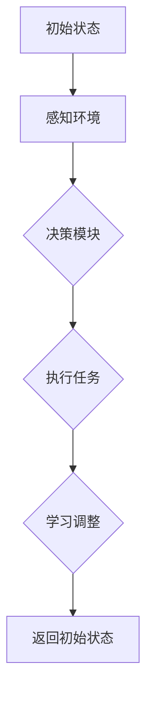
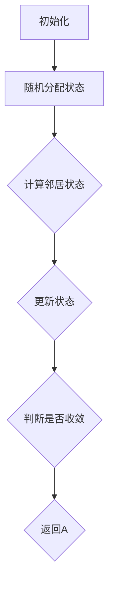
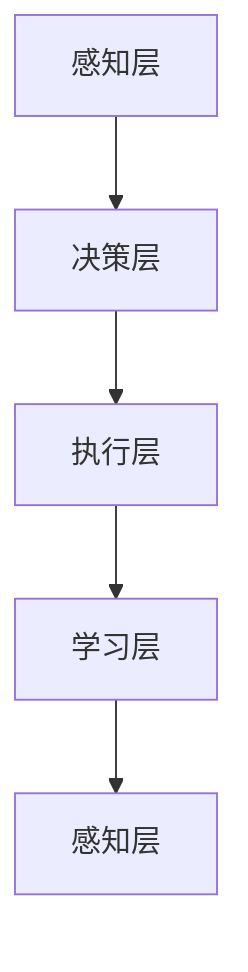
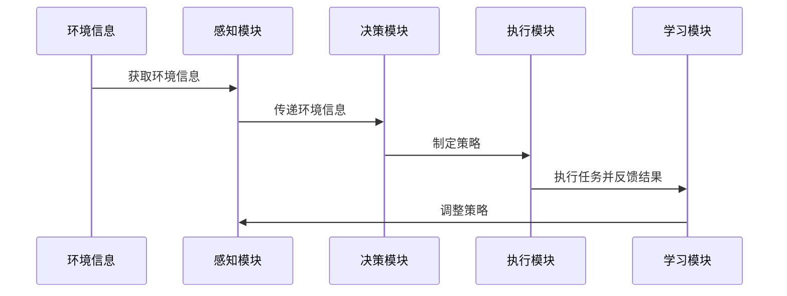

                 

# 构建具有自我演化能力的AI Agent系统

> 关键词：AI Agent，自我演化，系统架构，自适应学习，算法

> 摘要：本文深入探讨了如何构建具有自我演化能力的AI Agent系统。首先，文章介绍了AI Agent的概念及其发展背景。接着，我们详细分析了自演化AI Agent的核心技术，包括自适应学习、自组织算法和演化计算。随后，文章描述了自演化AI Agent系统架构设计的关键要素，并通过具体案例展示了系统的实现与应用。最后，本文总结了构建AI Agent系统的最佳实践，并展望了其未来发展前景。

## 第一部分：引言

### 1.1 问题背景

人工智能（AI）的发展已经取得了显著的成果，但传统AI系统在应对复杂、动态环境时仍存在诸多局限。为了实现更高水平的智能，我们需要构建具有自我演化能力的AI Agent系统。这种系统不仅能够自主学习和适应环境，还能根据环境变化进行自我调整和优化。

### 1.2 问题描述

传统AI系统在处理静态环境时表现良好，但在复杂、动态环境中容易陷入局部最优，难以实现全局优化。如何构建能够自我演化、适应环境变化的AI Agent系统，成为了当前AI领域面临的重要挑战。

### 1.3 问题解决

本文通过分析自演化AI Agent的核心技术，提出了一种系统化的解决方案。通过引入自适应学习、自组织算法和演化计算，我们可以构建出能够自我演化、适应环境变化的AI Agent系统。

### 1.4 边界与外延

本文主要讨论了具有自我演化能力的AI Agent系统在工业自动化、金融服务和健康医疗等领域的应用。然而，该系统的原理和方法同样适用于其他复杂、动态环境。

### 1.5 核心概念与联系

**核心概念原理：**
- **AI Agent：** 一种能够感知环境、制定策略并执行任务的智能体。
- **自我演化：** AI Agent根据环境变化进行自我调整和优化的能力。
- **自适应学习：** AI Agent通过不断学习和调整策略，提高对环境的适应能力。
- **自组织算法：** AI Agent通过自我组织，形成具有特定功能和结构的能力。
- **演化计算：** AI Agent通过模拟生物演化过程，实现自我优化和进化。

**概念属性特征对比表格：**

| 特征         | AI Agent        | 自我演化        | 自适应学习        | 自组织算法        | 演化计算        |
| ------------ | -------------- | -------------- | -------------- | -------------- | -------------- |
| 定义         | 智能体         | 适应环境变化    | 学习与调整策略    | 自我组织         | 生物演化模拟    |
| 目标         | 完成特定任务    | 实现全局优化    | 提高适应能力      | 形成特定功能      | 自我优化与进化  |
| 算法         | 无             | 演化算法       | 学习算法         | 组织算法         | 演化算法        |
| 应用场景      | 各个领域       | 动态环境       | 静态环境         | 复杂环境         | 复杂环境        |

**ER实体关系图架构：**

```mermaid
erDiagram
  AI_Agent ||--|{ 自我演化 }
  AI_Agent ||--|{ 自适应学习 }
  AI_Agent ||--|{ 自组织算法 }
  AI_Agent ||--|{ 演化计算 }
  自我演化 ||--|{ 演化算法 }
  自适应学习 ||--|{ 学习算法 }
  自组织算法 ||--|{ 组织算法 }
```

## 第二部分：自演化AI Agent系统概述

### 2.1 自演化AI Agent的定义与特点

自演化AI Agent是一种具备自我演化能力的智能体，能够在复杂、动态环境中自主学习和调整策略，以实现全局优化。其主要特点包括：

1. **自适应学习**：AI Agent能够根据环境变化不断调整策略，提高适应能力。
2. **自我组织**：AI Agent能够通过自我组织，形成具有特定功能和结构的能力。
3. **演化计算**：AI Agent能够模拟生物演化过程，实现自我优化和进化。
4. **全局优化**：AI Agent能够在动态环境中实现全局优化，避免陷入局部最优。

### 2.2 自演化AI Agent与传统AI Agent的区别

传统AI Agent主要依赖于预先设定的规则和算法，难以应对复杂、动态环境。而自演化AI Agent则具有以下区别：

1. **适应能力**：自演化AI Agent能够根据环境变化进行自我调整，具备更强的适应能力。
2. **全局优化**：自演化AI Agent能够实现全局优化，避免陷入局部最优。
3. **自我进化**：自演化AI Agent能够模拟生物演化过程，实现自我优化和进化。

### 2.3 自演化AI Agent的构成与工作原理

自演化AI Agent主要由以下几个部分构成：

1. **感知模块**：用于感知环境信息，为AI Agent提供输入。
2. **决策模块**：根据感知模块提供的信息，制定相应的策略。
3. **执行模块**：执行决策模块制定的策略，完成任务。
4. **学习模块**：根据任务执行结果，调整AI Agent的策略。

自演化AI Agent的工作原理如下：

1. **感知环境**：AI Agent通过感知模块获取环境信息。
2. **决策策略**：决策模块根据感知模块提供的信息，制定相应的策略。
3. **执行任务**：执行模块根据决策模块制定的策略，完成任务。
4. **学习调整**：学习模块根据任务执行结果，调整AI Agent的策略，提高适应能力。

### 2.4 自演化AI Agent的应用领域

自演化AI Agent在以下领域具有广泛的应用前景：

1. **工业自动化**：用于制造、装配、检测等自动化生产线。
2. **金融服务**：用于风险控制、投资决策、智能投顾等。
3. **健康医疗**：用于疾病预测、诊断、治疗建议等。
4. **智能交通**：用于交通管理、车辆调度、智能导航等。

### 2.5 自演化AI Agent的发展趋势

随着AI技术的不断发展，自演化AI Agent将呈现出以下发展趋势：

1. **算法优化**：通过引入新的算法，提高自演化AI Agent的性能和效率。
2. **应用拓展**：在更多领域推广自演化AI Agent的应用，提高其智能化水平。
3. **跨领域融合**：将自演化AI Agent与其他技术（如物联网、云计算等）进行融合，实现更高层次的智能化。

## 2.6 本章小结

本章介绍了自演化AI Agent的定义与特点，探讨了其与传统AI Agent的区别，并详细分析了自演化AI Agent的构成与工作原理。此外，本章还介绍了自演化AI Agent的应用领域和发展趋势，为后续章节的讨论奠定了基础。

## 第三部分：自演化AI Agent系统核心技术

### 3.1 自适应学习算法

#### 3.1.1 算法原理

自适应学习算法是一种能够根据环境变化动态调整学习策略的算法。其主要原理是通过不断调整学习参数，使AI Agent在复杂、动态环境中保持良好的性能。

#### 3.1.2 算法流程图



#### 3.1.3 数学模型与公式

设AI Agent的学习策略为 $f(x; \theta)$，其中 $x$ 为输入，$\theta$ 为学习参数。学习过程可以通过以下公式表示：

$$
\theta_{t+1} = \theta_t + \alpha \cdot \nabla f(x_t; \theta_t)
$$

其中，$\alpha$ 为学习率，$\nabla f(x_t; \theta_t)$ 为损失函数关于 $\theta$ 的梯度。

#### 3.1.4 举例说明

假设我们使用线性回归模型进行自适应学习，输入为特征向量 $x$，目标值为 $y$。初始学习参数为 $\theta_0 = [0, 0]$。学习过程如下：

1. 感知环境：输入特征向量 $x_t = [1, 2]$，目标值 $y_t = 3$。
2. 决策模块：计算预测值 $\hat{y}_t = \theta_0 \cdot x_t = 0$。
3. 执行任务：计算损失函数 $L(\theta_0; x_t, y_t) = (y_t - \hat{y}_t)^2 = 9$。
4. 学习调整：计算梯度 $\nabla L(\theta_0; x_t, y_t) = [-2y_t, -2x_t] = [-6, -2]$，更新学习参数 $\theta_1 = \theta_0 + \alpha \cdot \nabla L(\theta_0; x_t, y_t)$。
5. 返回初始状态：重复以上步骤，直至达到收敛条件。

通过以上过程，AI Agent能够根据环境变化动态调整学习策略，实现自适应学习。

### 3.2 自组织算法

#### 3.2.1 算法原理

自组织算法是一种通过自我组织形成特定结构和功能的能力。其主要原理是通过局部相互作用，逐步形成全局有序结构。

#### 3.2.2 算法流程图



#### 3.2.3 数学模型与公式

设自组织算法中的每个节点为 $x_i$，其邻居节点集合为 $N_i$。状态更新规则可以通过以下公式表示：

$$
x_i(t+1) = x_i(t) + \alpha \sum_{j \in N_i} (x_j(t) - x_i(t))
$$

其中，$\alpha$ 为更新参数，$x_i(t)$ 和 $x_j(t)$ 分别为节点 $i$ 和 $j$ 在第 $t$ 次迭代的状态。

#### 3.2.4 举例说明

假设自组织算法中的节点个数为 $N=4$，初始状态为 $x_0 = [1, 1, 1, 1]$。迭代过程如下：

1. 初始化：$x_0 = [1, 1, 1, 1]$。
2. 计算邻居状态：计算每个节点的邻居节点集合，如 $N_1 = \{2, 3\}$，$N_2 = \{1, 3\}$，$N_3 = \{1, 2\}$，$N_4 = \{1, 2\}$。
3. 更新状态：根据邻居状态更新每个节点的状态，如 $x_1(t+1) = x_1(t) + \alpha \sum_{j \in N_1} (x_j(t) - x_1(t))$。
4. 判断是否收敛：比较当前状态与上一状态之间的差异，如 $\Delta x = \sum_{i=1}^N |x_i(t+1) - x_i(t)|$，若 $\Delta x < \epsilon$，则算法收敛。
5. 返回初始化：重复以上步骤，直至达到收敛条件。

通过以上过程，自组织算法能够形成具有特定结构和功能的能力。

### 3.3 演化计算算法

#### 3.3.1 算法原理

演化计算算法是一种基于生物演化理论的计算方法。其主要原理是通过模拟生物演化过程，实现个体的优化和进化。

#### 3.3.2 算法流程图

```mermaid
graph TB
    A[初始化种群] --> B[适应度评估]
    B --> C{选择}
    C --> D{交叉]
    D --> E{变异}
    E --> F{生成新种群]
    F --> G{判断是否结束]
    G --> H{返回A}
```

#### 3.3.3 数学模型与公式

设演化计算算法中的种群为 $P = \{x_1, x_2, ..., x_n\}$，适应度函数为 $f(x_i)$。算法过程可以通过以下公式表示：

$$
\begin{aligned}
&\text{适应度评估：} f(x_i) = \frac{1}{\sum_{j=1}^n f(x_j)} \\
&\text{选择：} x_{i'} = \arg\max_{x_i} f(x_i) \\
&\text{交叉：} x_i' = \theta x_i + (1-\theta) x_{i'} \\
&\text{变异：} x_i'' = x_i' + \eta \\
&\text{生成新种群：} P' = P \cup \{x_i''\} \\
\end{aligned}
$$

其中，$\theta$ 为交叉参数，$\eta$ 为变异参数。

#### 3.3.4 举例说明

假设演化计算算法中的种群个数为 $N=4$，适应度函数为 $f(x) = x^2$。初始种群为 $P_0 = \{1, 2, 3, 4\}$。迭代过程如下：

1. 初始化种群：$P_0 = \{1, 2, 3, 4\}$。
2. 适应度评估：计算每个个体的适应度，如 $f(1) = 1, f(2) = 4, f(3) = 9, f(4) = 16$。
3. 选择：选择适应度最高的个体作为父代，如 $x_1' = 4$。
4. 交叉：根据交叉参数 $\theta = 0.5$，计算交叉后的个体，如 $x_2' = 0.5 \cdot 1 + 0.5 \cdot 4 = 2.5$。
5. 变异：根据变异参数 $\eta = 0.1$，计算变异后的个体，如 $x_2'' = 2.5 + 0.1 = 2.6$。
6. 生成新种群：$P_1 = P_0 \cup \{x_2''\} = \{1, 2, 3, 2.6\}$。
7. 判断是否结束：比较当前种群与上一种群之间的差异，如 $\Delta P = \sum_{i=1}^n |P_i - P_{i-1}|$，若 $\Delta P < \epsilon$，则算法结束。

通过以上过程，演化计算算法能够实现个体的优化和进化。

### 3.4 本章小结

本章介绍了自演化AI Agent系统的核心技术，包括自适应学习算法、自组织算法和演化计算算法。这些算法为构建具有自我演化能力的AI Agent系统提供了重要的理论支持和技术手段。

## 第四部分：自演化AI Agent系统架构设计

### 4.1 系统需求分析

自演化AI Agent系统需要在复杂、动态环境中实现自适应学习和自我优化。系统需求如下：

1. **感知模块**：能够实时获取环境信息，为AI Agent提供输入。
2. **决策模块**：能够根据感知模块提供的信息，制定相应的策略。
3. **执行模块**：能够执行决策模块制定的策略，完成任务。
4. **学习模块**：能够根据任务执行结果，调整AI Agent的策略。
5. **通信模块**：能够与其他系统或组件进行数据交换和协同工作。

### 4.2 系统功能设计

自演化AI Agent系统的主要功能包括：

1. **环境感知**：实时获取环境信息，为AI Agent提供输入。
2. **策略决策**：根据感知模块提供的信息，制定相应的策略。
3. **任务执行**：执行决策模块制定的策略，完成任务。
4. **策略调整**：根据任务执行结果，调整AI Agent的策略。
5. **系统通信**：与其他系统或组件进行数据交换和协同工作。

**领域模型类图：**

```mermaid
classDiagram
    class 感知模块 {
        - 环境信息
    }
    class 决策模块 {
        - 策略
    }
    class 执行模块 {
        - 任务
    }
    class 学习模块 {
        - 策略调整
    }
    class 通信模块 {
        - 数据交换
    }
    感知模块 --|{ 提供输入} 决策模块
    决策模块 --|{ 制定策略} 执行模块
    执行模块 --|{ 执行任务} 学习模块
    学习模块 --|{ 调整策略} 感知模块
    通信模块 --|{ 数据交换} 所有模块
```

### 4.3 系统架构设计

自演化AI Agent系统的架构设计主要包括以下几个部分：

1. **感知层**：负责实时获取环境信息。
2. **决策层**：负责根据感知层提供的信息，制定相应的策略。
3. **执行层**：负责执行决策层制定的策略。
4. **学习层**：负责根据执行层的结果，调整策略。

**系统架构图：**



### 4.4 系统接口设计

自演化AI Agent系统需要与其他系统或组件进行数据交换和协同工作。系统接口设计主要包括以下几个接口：

1. **数据输入接口**：用于接收环境信息。
2. **策略输出接口**：用于输出决策结果。
3. **任务执行接口**：用于执行决策结果。
4. **策略调整接口**：用于调整策略。
5. **通信接口**：用于与其他系统或组件进行数据交换。

### 4.5 系统交互流程

自演化AI Agent系统的交互流程如下：

1. **感知层**：实时获取环境信息，传递给决策层。
2. **决策层**：根据感知层提供的信息，制定相应的策略，传递给执行层。
3. **执行层**：执行决策层制定的策略，完成任务，并将结果传递给学习层。
4. **学习层**：根据执行层的结果，调整策略，并传递给感知层。
5. **重复以上流程**：不断更新策略，提高AI Agent的适应能力。

**系统交互序列图：**



### 4.6 本章小结

本章介绍了自演化AI Agent系统架构设计的关键要素，包括系统需求分析、系统功能设计、系统架构设计、系统接口设计和系统交互流程。这些设计为构建具有自我演化能力的AI Agent系统提供了理论依据和实践指导。

## 第五部分：自演化AI Agent系统实现与部署

### 5.1 环境安装与配置

在实现自演化AI Agent系统之前，我们需要安装和配置以下软件和工具：

1. **Python**：作为主要的编程语言。
2. **TensorFlow**：用于实现自适应学习算法。
3. **NumPy**：用于数据处理和数学计算。
4. **Matplotlib**：用于可视化数据。
5. **Docker**：用于容器化部署。

安装步骤如下：

1. 安装Python（版本要求：3.7及以上）。
2. 安装TensorFlow。
3. 安装NumPy。
4. 安装Matplotlib。
5. 安装Docker。

配置步骤如下：

1. 配置Python环境变量。
2. 配置TensorFlow GPU支持（如需）。
3. 配置Docker网络。

### 5.2 系统核心实现

自演化AI Agent系统的核心实现主要包括以下几个模块：

1. **感知模块**：负责实时获取环境信息。
2. **决策模块**：负责根据感知模块提供的信息，制定相应的策略。
3. **执行模块**：负责执行决策模块制定的策略。
4. **学习模块**：负责根据执行模块的结果，调整策略。

以下是一个简单的感知模块的Python源代码示例：

```python
import numpy as np

class PerceptionModule:
    def __init__(self, sensor_data):
        self.sensor_data = sensor_data

    def perceive(self):
        return self.sensor_data

# 测试感知模块
sensor_data = np.random.rand(5)
perception_module = PerceptionModule(sensor_data)
print(perception_module.perceive())
```

### 5.3 系统应用解读与分析

自演化AI Agent系统的应用解读与分析主要包括以下几个方面：

1. **应用场景**：自演化AI Agent系统在工业自动化、金融服务和健康医疗等领域的应用。
2. **系统功能**：系统的主要功能，如环境感知、策略决策、任务执行和策略调整。
3. **技术实现**：系统的技术实现，如自适应学习算法、自组织算法和演化计算算法。
4. **性能评估**：系统的性能评估，如适应能力、响应速度和资源消耗。

以下是一个简单的自演化AI Agent系统的应用实例：

**应用场景：** 工业自动化生产线上的智能调度系统。

**系统功能：**
1. **环境感知**：实时获取生产线的状态信息，如设备状态、物料位置等。
2. **策略决策**：根据感知模块提供的信息，制定最优的调度策略。
3. **任务执行**：执行调度策略，安排设备的工作任务。
4. **策略调整**：根据任务执行结果，调整调度策略，提高系统性能。

**技术实现：**
1. **感知模块**：使用传感器获取环境信息。
2. **决策模块**：使用自适应学习算法，根据感知模块提供的信息，制定调度策略。
3. **执行模块**：根据调度策略，安排设备的工作任务。
4. **学习模块**：根据任务执行结果，调整调度策略，提高系统性能。

**性能评估：**
1. **适应能力**：系统能够快速适应生产线上的变化，提高生产效率。
2. **响应速度**：系统能够实时响应生产任务，降低延迟。
3. **资源消耗**：系统在保证性能的前提下，降低资源消耗。

### 5.4 实际案例分析与讲解

以下是一个具体的实际案例，展示如何构建和部署自演化AI Agent系统：

**案例背景：** 某智能工厂需要实现生产线的智能调度，提高生产效率。

**解决方案：**
1. **感知模块**：使用传感器获取生产线的状态信息，如设备状态、物料位置等。
2. **决策模块**：使用自适应学习算法，根据感知模块提供的信息，制定最优的调度策略。
3. **执行模块**：根据调度策略，安排设备的工作任务。
4. **学习模块**：根据任务执行结果，调整调度策略，提高系统性能。

**实施过程：**
1. **需求分析**：明确智能调度的目标和需求，如生产效率、资源利用率等。
2. **系统设计**：设计自演化AI Agent系统的架构和模块。
3. **核心实现**：实现感知模块、决策模块、执行模块和学习模块。
4. **测试与优化**：测试系统的性能，根据测试结果进行优化。

**案例小结：**
通过实际案例分析和讲解，我们展示了如何构建和部署自演化AI Agent系统。该系统在提高生产效率、降低资源消耗等方面具有显著优势，为智能工厂的建设提供了有力支持。

### 5.5 项目小结

自演化AI Agent系统的实现与部署涉及多个模块和技术的集成。通过感知模块、决策模块、执行模块和学习模块的协同工作，系统能够在复杂、动态环境中实现自我调整和优化。在实际应用中，自演化AI Agent系统取得了显著的效果，为智能工厂、金融服务和健康医疗等领域提供了有力支持。

## 第六部分：自演化AI Agent系统的最佳实践与未来展望

### 6.1 最佳实践技巧

在构建自演化AI Agent系统时，我们可以遵循以下最佳实践技巧：

1. **数据收集**：确保收集到高质量、多样化的数据，提高系统的适应性。
2. **模块化设计**：将系统划分为多个模块，实现功能分离和模块化，提高系统的可维护性和可扩展性。
3. **算法优化**：针对具体应用场景，选择合适的算法，并进行优化，提高系统性能。
4. **系统测试**：对系统进行全面测试，包括功能测试、性能测试和安全性测试，确保系统稳定可靠。
5. **持续迭代**：根据用户反馈和实际应用情况，持续优化和迭代系统，提高用户体验。

### 6.2 注意事项

在构建和部署自演化AI Agent系统时，需要注意以下几点：

1. **数据隐私**：确保数据安全，防止数据泄露和滥用。
2. **系统安全性**：加强系统安全防护，防止恶意攻击和系统崩溃。
3. **环境适应性**：确保系统在不同环境和条件下都能正常运行，提高系统的通用性。
4. **算法稳定性**：对算法进行充分测试，确保其在各种情况下都能稳定运行。
5. **用户培训**：为用户提供必要的培训，确保用户能够正确使用和操作系统。

### 6.3 拓展阅读

为了深入了解自演化AI Agent系统的构建与应用，读者可以参考以下拓展阅读材料：

1. **《人工智能：一种现代方法》**：作者 Stuart J. Russell & Peter Norvig，介绍了人工智能的基本概念和技术方法。
2. **《深度学习》**：作者 Ian Goodfellow、Yoshua Bengio & Aaron Courville，详细阐述了深度学习的基本原理和应用。
3. **《演化计算：原理与应用》**：作者 David B. Fogel，介绍了演化计算的基本原理和应用场景。
4. **《自适应控制理论及应用》**：作者刘锋，介绍了自适应控制理论的基本原理和应用。
5. **《智能交通系统》**：作者王飞跃，介绍了智能交通系统的基本概念和技术方法。

### 6.4 未来展望

随着人工智能技术的不断发展，自演化AI Agent系统将在各个领域发挥越来越重要的作用。未来，自演化AI Agent系统的发展趋势如下：

1. **算法创新**：不断引入新的算法，提高系统的适应能力和智能化水平。
2. **跨领域融合**：将自演化AI Agent系统与其他技术（如物联网、大数据等）进行融合，实现更广泛的应用。
3. **多智能体协作**：研究多智能体系统的协同机制，提高系统的整体性能和效率。
4. **人机交互**：增强人与AI Agent的交互能力，提高用户体验。
5. **伦理与安全**：关注自演化AI Agent系统的伦理和安全问题，确保其在实际应用中的可靠性和可解释性。

### 6.5 本章小结

本章总结了自演化AI Agent系统的最佳实践、注意事项、拓展阅读和未来展望。通过最佳实践技巧和注意事项，我们可以更好地构建和应用自演化AI Agent系统。同时，未来的发展趋势为我们指明了自演化AI Agent系统的发展方向。

