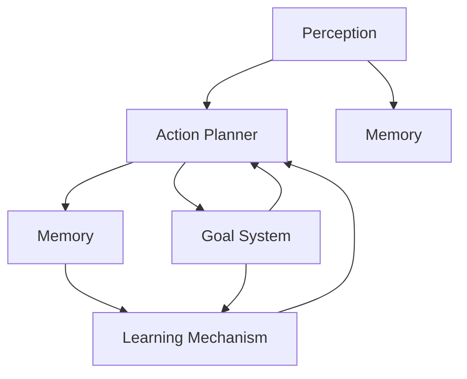
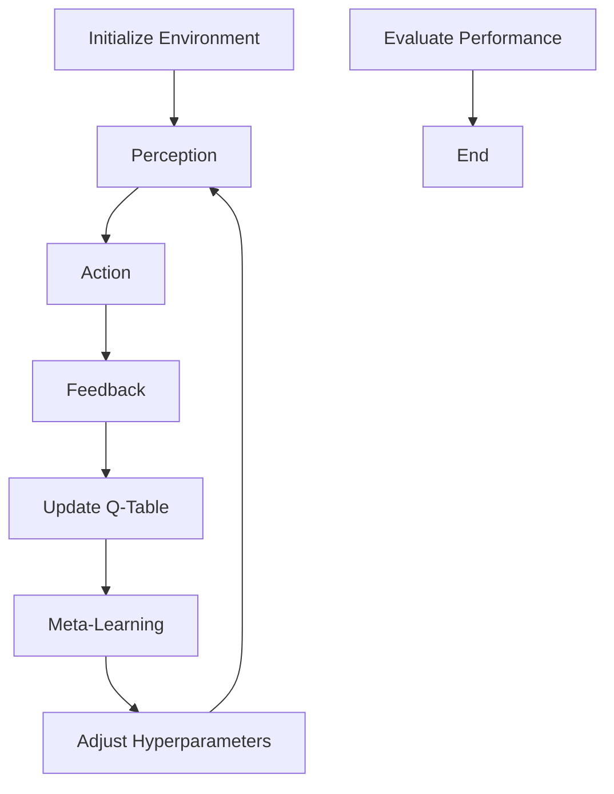
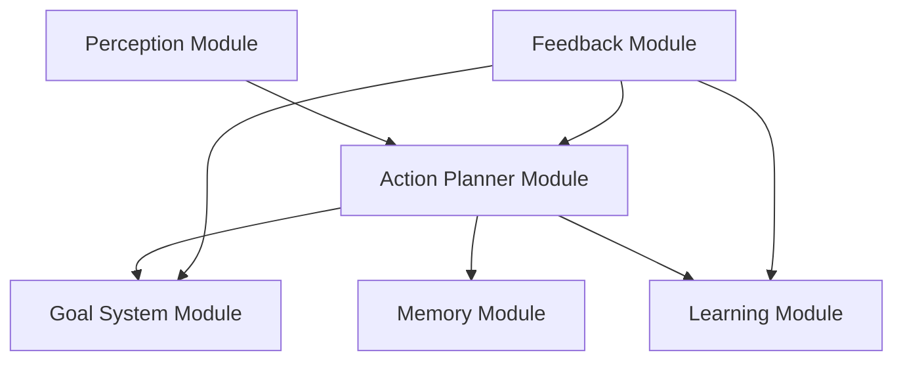
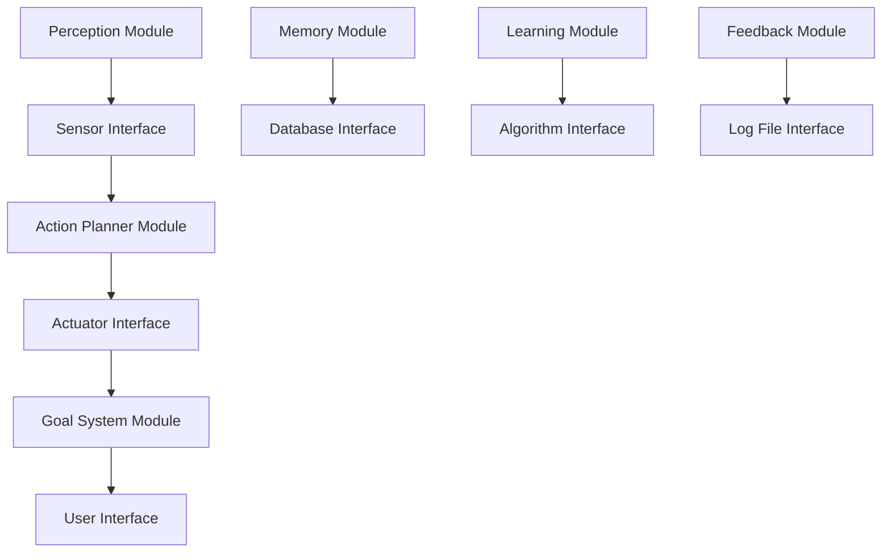
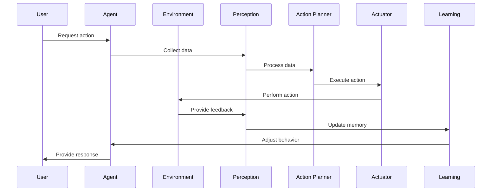

                 

### 1. Introduction to AI Agents

Artificial Intelligence (AI) has rapidly evolved over the past few decades, transforming various industries and revolutionizing the way we interact with technology. One of the most intriguing developments within the field of AI is the concept of **AI agents**. An AI agent is a self-contained program or entity that can perceive its environment, take actions based on its understanding of that environment, and improve its performance over time through learning and adaptation.

#### 1.1 Definition and Importance

An AI agent is essentially an autonomous entity capable of performing tasks, making decisions, and interacting with its environment without human intervention. These agents can be found in various forms, from simple chatbots to complex robotic systems. The importance of AI agents lies in their ability to perform tasks that are too complex or time-consuming for humans to handle efficiently.

For instance, in the healthcare industry, AI agents can be used to analyze medical data, diagnose diseases, and even provide personalized treatment plans. In finance, they can help with stock trading, risk management, and customer service. In manufacturing, AI agents can optimize production processes, predict equipment failures, and improve overall efficiency.

#### 1.2 Evolution of AI Agents

The concept of AI agents can be traced back to the early days of AI research in the 1950s and 1960s. Initially, AI was primarily focused on rule-based systems and symbolic reasoning. However, as the field evolved, researchers began to explore more sophisticated approaches, such as machine learning and natural language processing.

The development of AI agents has been fueled by advances in computing power, data availability, and algorithmic innovation. Early AI agents were often limited in their capabilities and could only perform specific tasks within a narrow domain. Today, thanks to deep learning and reinforcement learning, AI agents have become more versatile and capable of handling a wider range of tasks.

#### 1.3 AI Agent Components

An AI agent typically consists of several key components:

1. **Perception System**: This component allows the agent to gather information from its environment. In the case of a robotic agent, this might involve sensors such as cameras, LIDAR, or tactile sensors. For a software agent, this could involve natural language processing to understand text or speech inputs.

2. **Action Planner**: Once the agent has gathered information, it needs to decide on the best course of action. This component is responsible for planning and executing actions based on the current state of the environment and the agent's goals.

3. **Memory**: AI agents need to remember past experiences and use this information to inform future decisions. Memory can be used for storing data, learning patterns, and adapting to new situations.

4. **Learning Mechanism**: To improve over time, AI agents must be able to learn from their experiences. This can involve machine learning algorithms that adjust the agent's behavior based on feedback from the environment.

5. **Goal System**: Every AI agent has a set of goals it aims to achieve. The goal system is responsible for defining these goals and ensuring that the agent's actions are aligned with them.

#### 1.4 Applications of AI Agents

The applications of AI agents are vast and continue to expand as the technology advances. Here are a few notable examples:

1. **Robotics**: AI agents are extensively used in robotics for tasks such as navigation, manipulation, and assembly. They can work in environments that are too dangerous or difficult for humans, such as nuclear power plants or outer space.

2. **Natural Language Processing (NLP)**: AI agents equipped with NLP capabilities are used in chatbots, virtual assistants, and language translation services. They can understand and respond to human language, making human-computer interaction more seamless.

3. **Autonomous Vehicles**: Self-driving cars are a prime example of AI agents. These vehicles use AI to perceive their environment, make decisions, and navigate roads autonomously.

4. **Customer Service**: Many companies use AI agents to handle customer inquiries and provide support. These agents can handle a large volume of requests simultaneously, reducing the need for human intervention.

5. **Healthcare**: AI agents are used for tasks such as medical imaging analysis, disease diagnosis, and drug discovery. They can process large amounts of data quickly and accurately, leading to better patient outcomes.

In conclusion, AI agents are a fundamental component of modern AI systems, offering the promise of increased efficiency, automation, and intelligence. As we continue to advance our understanding of AI, the capabilities and applications of AI agents will only continue to grow.

---

### 2. Self-Assessment and Improvement in AI Agents

As AI agents become more complex and sophisticated, the ability to self-assess and improve their own performance becomes increasingly crucial. Self-assessment mechanisms allow agents to evaluate their current performance, identify areas for improvement, and implement changes to enhance their effectiveness. Improvement strategies, on the other hand, are the methods and techniques that agents use to make these enhancements. In this section, we will explore the various aspects of self-assessment and improvement in AI agents, highlighting the challenges and opportunities that arise in the process.

#### 2.1 Self-Assessment Mechanisms

Self-assessment mechanisms are the tools and methods that AI agents use to evaluate their own performance. These mechanisms can take various forms, depending on the specific context and goals of the agent. Some common self-assessment methods include:

1. **Performance Metrics**: AI agents often have predefined performance metrics that are used to evaluate their effectiveness. These metrics can be quantitative, such as accuracy rates, response times, or resource usage, or qualitative, such as user satisfaction or task completion rates.

2. **Error Detection and Analysis**: Self-assessment mechanisms can include tools for detecting and analyzing errors in the agent's behavior. By identifying the source of errors, agents can gain insights into their weaknesses and areas where they need improvement.

3. **Feedback Loops**: Feedback loops are an essential component of self-assessment. These loops involve collecting feedback from the environment or users, using it to evaluate the agent's performance, and making adjustments based on this feedback.

4. **Self-Reflection**: Some advanced AI agents are capable of self-reflection, where they analyze their own thought processes and decision-making methods. This can provide valuable insights into their strengths and weaknesses.

#### 2.2 Improvement Strategies

Once an AI agent has identified areas for improvement through self-assessment, it needs to implement strategies to enhance its performance. Here are some common improvement strategies:

1. **Reinforcement Learning**: Reinforcement learning is a type of machine learning where an agent learns by receiving feedback in the form of rewards or penalties. By adjusting its behavior based on this feedback, the agent can improve its performance over time.

2. **Transfer Learning**: Transfer learning involves taking knowledge gained from one task and applying it to another related task. This can be an effective way for AI agents to improve their performance in new or unfamiliar environments.

3. **Meta-Learning**: Meta-learning, or learning to learn, involves developing algorithms that can adapt and improve their learning processes. By optimizing the learning process itself, agents can enhance their ability to learn and improve over time.

4. **Hyperparameter Tuning**: Hyperparameters are the parameters that are set before training begins, such as learning rates or batch sizes. Hyperparameter tuning involves finding the optimal values for these parameters to improve the agent's performance.

5. **Ensemble Methods**: Ensemble methods involve combining multiple models to create a single, more robust model. By combining the strengths of different models, ensemble methods can improve the overall performance of the agent.

#### 2.3 Challenges and Opportunities

Despite the promise of self-assessment and improvement in AI agents, there are several challenges and opportunities to consider:

1. **Data Quality**: Self-assessment and improvement depend heavily on the quality of the data used by the agent. Inaccurate or biased data can lead to misleading conclusions and poor performance improvements.

2. **Complexity**: Developing self-assessment and improvement mechanisms for AI agents can be complex, requiring a deep understanding of the agent's environment, goals, and capabilities.

3. **Resource Constraints**: Implementing self-assessment and improvement mechanisms may require additional computational resources, which can be a challenge in resource-constrained environments.

4. **Interpretability**: Understanding the reasons behind an agent's self-assessments and improvements can be difficult, particularly for complex machine learning models. This lack of interpretability can make it challenging to trust and validate the agent's decisions.

5. **Ethical Considerations**: As AI agents become more autonomous and capable of self-improvement, ethical considerations become increasingly important. Ensuring that agents make ethical decisions and do not inadvertently harm individuals or society is a significant challenge.

6. **Scalability**: As the number of AI agents and their applications grows, scaling self-assessment and improvement mechanisms to handle large-scale environments becomes a critical challenge.

7. **Opportunities**: The ability to self-assess and improve offers significant opportunities for AI agents. By continuously learning and adapting, agents can become more effective and efficient over time, unlocking new possibilities for automation and innovation.

In conclusion, self-assessment and improvement are essential components of AI agents, enabling them to adapt to changing environments and enhance their performance. However, achieving effective self-assessment and improvement requires addressing a range of technical, ethical, and practical challenges. By leveraging advances in machine learning, data analytics, and computational resources, we can overcome these challenges and unlock the full potential of self-improving AI agents.

---

### 3. Key Concepts and Their Interrelationships

In the realm of building self-assessing and self-improving AI agents, several core concepts play a pivotal role. Understanding the interrelationships among these concepts is crucial for developing effective AI systems. This section will provide an overview of the key concepts, their attributes, and how they interact with each other. We will also illustrate these relationships using Mermaid flowcharts to enhance clarity and understanding.

#### 3.1 Core Concept Overview

The core concepts involved in building self-assessing and self-improving AI agents include:

1. **Perception System**
2. **Action Planner**
3. **Memory**
4. **Learning Mechanism**
5. **Goal System**

Each of these components plays a vital role in the functioning of an AI agent, and they interact in a complex but coordinated manner to achieve the agent's objectives.

#### 3.2 Concept Attributes and Comparison Tables

Below is a comparison table that outlines the attributes of each core concept:

| Concept                | Attribute                  | Role in AI Agent |
|------------------------|----------------------------|-----------------|
| Perception System      | Sensor data acquisition    | Environmental awareness |
| Action Planner         | Decision-making algorithms | Action execution |
| Memory                 | Data storage and retrieval | Experience learning |
| Learning Mechanism     | Adaptive algorithms        | Continuous improvement |
| Goal System            | Goal definition and pursuit | Directive alignment |

#### 3.3 ER Diagrams and Relationships

To visualize the relationships between these core concepts, we can use Entity-Relationship (ER) diagrams. Below is a Mermaid ER diagram that illustrates the connections between the key concepts:

```mermaid
erDiagram
  Perception -->|Collects| Action
  Action -->|Driven by| Goal
  Memory -->|Stores| Perception
  Memory -->|Stores| Action
  Learning -->|Learns from| Memory
  Goal -->|Guides| Action
  Goal -->|Guides| Learning
```

In this diagram, the perception system collects data from the environment, which is then used by the action planner to make decisions. The actions taken by the agent are stored in memory along with the perception data. The learning mechanism analyzes this stored data to improve the agent's behavior over time. The goal system defines the objectives the agent is striving to achieve, guiding both the action planner and the learning mechanism.

#### 3.4 Mermaid Flowchart

To further elucidate the interaction between these concepts, we can use a Mermaid flowchart that outlines the workflow of an AI agent:



In this flowchart:

- **Perception** (A) is the starting point where the agent collects data from its environment.
- **Action Planner** (B) uses this data to decide on the next action.
- **Goal System** (C) ensures that the agent's actions align with its objectives.
- **Memory** (D and E) stores both perception data and the outcomes of actions.
- **Learning Mechanism** (F) processes the stored data to improve the agent's performance.

### Summary

Understanding the key concepts and their interrelationships is foundational to building effective AI agents. By leveraging Mermaid ER diagrams and flowcharts, we can visualize and communicate these complex relationships more clearly. This foundation will guide us as we delve deeper into the algorithmic and system design aspects of self-assessing and self-improving AI agents in the subsequent sections.

---

### 4. Algorithm Design and Implementation

In the context of building self-assessing and self-improving AI agents, designing an effective algorithm is crucial. This section will delve into the design and implementation of an algorithm that can enhance the agent's capabilities. We will use Mermaid to illustrate the algorithm's workflow, provide Python code for its implementation, and explain the mathematical models and formulas that underpin the algorithm.

#### 4.1 Algorithm Introduction

The algorithm we will discuss is a combination of reinforcement learning and meta-learning. Reinforcement learning is used for the initial training of the agent, where it learns to take actions that maximize rewards. Meta-learning is then applied to improve the agent's learning process, making it more efficient over time.

#### 4.2 Mermaid Flowchart

To understand the workflow of the algorithm, let's first create a Mermaid flowchart:



In this flowchart:

- **A**: Initialize the environment with the necessary parameters.
- **B**: Collect perception data from the environment.
- **C**: Use the action planner to decide on the next action.
- **D**: Receive feedback (reward or penalty) based on the action taken.
- **E**: Update the Q-table (a representation of state-action values) based on the feedback.
- **F**: Apply meta-learning to optimize the learning process.
- **G**: Adjust the hyperparameters based on the meta-learning results.
- **H**: Evaluate the agent's performance.
- **I**: End the algorithm if the performance criteria are met.

#### 4.3 Python Code Explanation

Below is a Python code snippet that implements the described algorithm. We will explain each part of the code in detail.

```python
import numpy as np
import pandas as pd
import matplotlib.pyplot as plt
from IPython.display import clear_output

# Hyperparameters
alpha = 0.1  # Learning rate
gamma = 0.6  # Discount factor
epsilon = 0.1  # Exploration rate
n_epochs = 1000  # Number of epochs

# Initialize environment
n_actions = 3
n_states = 5
Q = np.zeros((n_states, n_actions))

# Meta-parameters for meta-learning
meta_lr = 0.01

# Initialize performance metrics
episode_lengths = []
episode_rewards = []

# Meta-learning function
def meta_learn(Q, episode_rewards):
    # Here, we can implement a meta-learning algorithm to optimize the learning process
    # For simplicity, we will use a basic gradient descent approach
    for i in range(len(episode_rewards)):
        reward = episode_rewards[i]
        gradient = reward - Q[i, np.argmax(Q[i])]
        Q[i] -= meta_lr * gradient

# Reinforcement learning function
def reinforcement_learning(n_epochs, alpha, gamma, epsilon):
    for i in range(n_epochs):
        state = env.reset()
        done = False
        total_reward = 0
        
        while not done:
            action = env.choose_action(state, Q[state], epsilon)
            next_state, reward, done = env.step(action)
            Q[state, action] = Q[state, action] + alpha * (reward + gamma * np.max(Q[next_state]) - Q[state, action])
            state = next_state
            total_reward += reward
            
        episode_lengths.append(i+1)
        episode_rewards.append(total_reward)
        
        # Meta-learning step
        meta_learn(Q, episode_rewards)
        
        # Adjust epsilon for exploration-exploitation balance
        epsilon = 1 / (i+1)
        
        # Print progress
        clear_output(wait=True)
        print(f"Epoch: {i+1}, Total Reward: {total_reward}, Epsilon: {epsilon}")
        
    return Q, episode_lengths, episode_rewards

# Run the reinforcement learning algorithm
Q, episode_lengths, episode_rewards = reinforcement_learning(n_epochs, alpha, gamma, epsilon)

# Plot performance metrics
plt.figure(figsize=(12, 6))
plt.subplot(1, 2, 1)
plt.plot(episode_lengths)
plt.title('Episode Lengths')
plt.xlabel('Epoch')
plt.ylabel('Length')

plt.subplot(1, 2, 2)
plt.plot(episode_rewards)
plt.title('Episode Rewards')
plt.xlabel('Epoch')
plt.ylabel('Reward')
plt.show()
```

In this code:

- **Hyperparameters**: We set the learning rate (`alpha`), discount factor (`gamma`), and exploration rate (`epsilon`).
- **Initialize environment**: We define the number of actions and states and initialize the Q-table.
- **Meta-learning function**: This function uses a gradient descent approach to optimize the Q-table based on the episode rewards.
- **Reinforcement learning function**: This function implements the reinforcement learning algorithm. It uses an epsilon-greedy strategy to balance exploration and exploitation.
- **Run the reinforcement learning algorithm**: We run the algorithm for a specified number of epochs, updating the Q-table and adjusting epsilon for exploration.
- **Plot performance metrics**: We plot the episode lengths and rewards to visualize the performance over time.

#### 4.4 Mathematical Model and Formulas

The reinforcement learning algorithm is based on the Q-learning model, which can be described by the following mathematical formula:

$$
Q(s, a)_{\text{new}} = Q(s, a)_{\text{old}} + \alpha [r + \gamma \max_{a'} Q(s', a') - Q(s, a)]
$$

Where:
- \( Q(s, a) \) is the Q-value for state \( s \) and action \( a \).
- \( r \) is the immediate reward received after taking action \( a \) in state \( s \).
- \( \gamma \) is the discount factor, which balances the importance of immediate rewards and future rewards.
- \( \alpha \) is the learning rate, which controls the step size of the Q-value update.

The meta-learning step aims to optimize the Q-learning process. One simple approach is to use gradient descent to adjust the Q-table based on the episode rewards:

$$
\Delta Q = \eta \cdot \nabla Q
$$

Where:
- \( \eta \) is the meta-learning rate (similar to `meta_lr` in the code).
- \( \nabla Q \) is the gradient of the Q-value function with respect to the parameters.

#### 4.5 Example Explanation

Consider an environment where an agent must navigate a grid world, with each cell representing a state and each direction (up, down, left, right) representing an action. The agent receives a reward of +1 for moving to a goal state and a penalty of -1 for moving to a wall or falling into a pit.

In the first epoch, the agent starts in a random state and takes a random action. It receives feedback (reward or penalty) based on the action taken and updates its Q-table accordingly. As the agent continues to explore the environment, the Q-values for each state-action pair improve, leading to better decision-making.

After each epoch, the meta-learning step is applied to refine the Q-learning process. This can lead to faster convergence and improved performance over time.

In conclusion, the algorithm combines reinforcement learning with meta-learning to create a self-improving AI agent. By using Mermaid flowcharts, Python code, and mathematical models, we have provided a comprehensive explanation of the algorithm's design and implementation. This foundation will guide us as we move on to the next section, where we will delve into the system architecture and design of the AI agent.

---

### 5. System Analysis and Design

To build a robust and scalable self-assessing and self-improving AI agent, a thorough system analysis and design are essential. This section will outline the process of analyzing the problem scenario, introducing the project, and designing the system's functional requirements, architecture, interfaces, and interaction sequences. We will use Mermaid diagrams to visually represent these elements.

#### 5.1 Problem Scenario

The problem scenario revolves around creating an AI agent that can autonomously navigate and complete tasks in a dynamic and complex environment. The agent must be capable of assessing its own performance, identifying areas for improvement, and continuously adapting to enhance its efficiency and accuracy.

Key challenges in the problem scenario include:

1. **Dynamic Environments**: The environment in which the agent operates is not static; it changes over time, presenting new challenges and requiring the agent to adapt quickly.
2. **Performance Assessment**: The agent needs to accurately assess its performance to determine which areas need improvement.
3. **Continuous Improvement**: The agent must implement effective strategies for continuous learning and adaptation to maintain high performance.
4. **Scalability**: The system should be designed to handle a large number of agents and environments, ensuring efficient resource utilization.

#### 5.2 Project Introduction

The project aims to develop an AI agent capable of autonomous navigation and task completion in a variety of environments. The agent will be equipped with self-assessment and self-improvement capabilities to enhance its performance over time. The primary objectives of the project are:

1. **Develop a Modular Agent Architecture**: Design a flexible and modular architecture that can be adapted to different environments and tasks.
2. **Implement Self-Assessment and Improvement Mechanisms**: Integrate self-assessment algorithms and reinforcement learning techniques to enable the agent to evaluate its performance and continuously improve.
3. **Ensure Scalability and Performance**: Design the system to be scalable, ensuring that it can handle large-scale deployments and maintain high performance.

#### 5.3 System Functional Design

The system's functional design involves defining the key components and their interactions. Below is a high-level overview of the system's functional architecture:

1. **Perception Module**: This module collects sensory data from the environment and processes it to extract relevant information.
2. **Action Planner Module**: This module uses the processed perception data to decide on the next action the agent should take.
3. **Memory Module**: This module stores the agent's past experiences, including perceptions and actions, to support learning and decision-making.
4. **Learning Module**: This module implements self-assessment and self-improvement algorithms, such as reinforcement learning, to refine the agent's behavior over time.
5. **Goal System Module**: This module defines the agent's objectives and ensures that the agent's actions align with these goals.
6. **Feedback Module**: This module collects feedback from the environment and users, providing insights for continuous improvement.

#### 5.4 System Architecture Design

The system architecture design provides a detailed view of how the functional components interact and integrate within the overall system. Below is a Mermaid diagram that illustrates the system architecture:



In this diagram:

- **Perception Module** (A) receives sensory data from the environment and passes it to the Action Planner Module (B).
- **Action Planner Module** (B) processes the perception data, decides on the next action, and communicates with the Goal System Module (C), Memory Module (D), and Learning Module (E).
- **Goal System Module** (C) defines the agent's objectives and ensures that the actions taken align with these goals.
- **Memory Module** (D) stores the agent's past experiences to support learning and decision-making.
- **Learning Module** (E) implements self-assessment and self-improvement algorithms.
- **Feedback Module** (F) collects feedback from the environment and users, providing insights for continuous improvement.

#### 5.5 System Interface Design

The system interface design involves defining the interfaces between the various components and external systems. Below is a Mermaid diagram that illustrates the system interfaces:



In this diagram:

- **Sensor Interface** (B) allows the Perception Module to collect data from sensors.
- **Actuator Interface** (D) enables the Action Planner Module to control actuators.
- **User Interface** (F) provides a means for users to interact with the system and provide feedback.
- **Database Interface** (H) allows the Memory Module to store and retrieve data from a database.
- **Algorithm Interface** (J) enables the Learning Module to access and apply specific algorithms.
- **Log File Interface** (L) allows the Feedback Module to store system logs for analysis.

#### 5.6 System Interaction Sequence Diagram

To further understand the interactions between the system components, we can create a sequence diagram that shows the flow of actions and data through the system. Below is a Mermaid sequence diagram illustrating the interaction sequence:



In this sequence diagram:

- The user requests an action from the agent.
- The agent collects data from the environment through the perception module.
- The action planner processes the data and decides on the next action.
- The actuator executes the action in the environment.
- The environment provides feedback to the perception module.
- The learning module updates the agent's memory based on the feedback.
- The agent adjusts its behavior and provides a response to the user.

### Conclusion

The system analysis and design provide a comprehensive blueprint for developing a self-assessing and self-improving AI agent. By leveraging Mermaid diagrams, we have visually represented the problem scenario, project objectives, system functional architecture, interface design, and interaction sequences. This detailed design will guide the implementation phase, ensuring that the system meets the specified requirements and is scalable and robust enough to handle dynamic and complex environments.

---

### 6. Project Implementation

With the system architecture and design in place, the next step is to implement the project. This section will guide you through the process of setting up the development environment, implementing the core components, and analyzing the code and results.

#### 6.1 Environment Setup

To implement the self-assessing and self-improving AI agent, we need to set up a suitable development environment. The following steps outline the process:

1. **Install Python and Required Libraries**: Ensure that Python is installed on your system. Next, install the required libraries using `pip`. The essential libraries for this project include NumPy, Pandas, Matplotlib, and TensorFlow.
   ```bash
   pip install numpy pandas matplotlib tensorflow
   ```

2. **Create a Virtual Environment**: It is a good practice to create a virtual environment to manage dependencies and isolate the project from the global Python environment.
   ```bash
   python -m venv venv
   source venv/bin/activate  # On Windows: venv\Scripts\activate
   ```

3. **Install Additional Dependencies**: Depending on the specific requirements of your project, you may need additional libraries. For instance, if you are working with robotics, you might need to install `rospy` and related packages.

4. **Configure Sensor and Actuator Interfaces**: Set up the interfaces for sensor data collection and actuator control. This may involve configuring hardware or setting up simulated environments.

#### 6.2 Core Implementation

The core implementation involves coding the perception, action planner, memory, learning, and goal system modules. Below is a high-level overview of the implementation steps:

1. **Perception Module**: This module is responsible for collecting and processing sensory data from the environment. The implementation involves setting up sensors and defining methods to read and interpret sensor data.
   ```python
   class PerceptionModule:
       def collect_data(self):
           # Code to read sensor data
           pass
   ```

2. **Action Planner Module**: The action planner uses the processed perception data to decide on the next action. It employs a decision-making algorithm, such as Q-learning or SARSA, to determine the best action based on the current state.
   ```python
   class ActionPlannerModule:
       def choose_action(self, state, Q, epsilon):
           # Code for epsilon-greedy action selection
           pass
   ```

3. **Memory Module**: This module stores the agent's past experiences, including perceptions and actions, to support learning and decision-making. It typically uses a data structure like a list or a database to store the experience tuples.
   ```python
   class MemoryModule:
       def store_experience(self, state, action, reward, next_state, done):
           # Code to store experience
           pass
   ```

4. **Learning Module**: The learning module implements the self-assessment and self-improvement mechanisms. It uses reinforcement learning algorithms to update the agent's Q-values or policy based on feedback from the environment.
   ```python
   class LearningModule:
       def update_Q_values(self, state, action, reward, next_state, done):
           # Code to update Q-values
           pass
   ```

5. **Goal System Module**: This module defines the agent's objectives and ensures that the agent's actions align with these goals. It can be as simple as defining a set of goals or as complex as incorporating reward functions.
   ```python
   class GoalSystemModule:
       def set_goals(self):
           # Code to define goals
           pass
   ```

#### 6.3 Code Analysis and Interpretation

Analyzing the code involves understanding how each module interacts with others and how the algorithms work under the hood. Here are some key aspects to consider:

- **Modularity**: Ensure that the code is modular, making it easy to maintain and extend. Each module should have a clear responsibility.
- **Data Flow**: Examine how data flows through the system, from perception to action planning, learning, and feedback.
- **Algorithm Efficiency**: Evaluate the efficiency of the reinforcement learning algorithms used, considering factors like convergence speed and computational complexity.
- **Error Handling**: Ensure that the code has proper error handling mechanisms to deal with unexpected situations, such as sensor failures or actuator malfunctions.

#### 6.4 Case Study Analysis

To validate the effectiveness of the implemented system, a case study is conducted. The case study involves deploying the AI agent in a simulated environment, where it must navigate through a maze to reach a target goal.

1. **Setup Simulation Environment**: Create a simulated environment using tools like MATLAB, Python's SimPy, or Unity. The environment should be designed to mimic the real-world scenario as closely as possible.

2. **Run Experiments**: Deploy the AI agent in the simulation environment and run multiple experiments to collect data on its performance. Monitor metrics such as the number of steps taken to reach the goal, total reward received, and time taken to complete the task.

3. **Analyze Results**: Analyze the experimental results to evaluate the agent's performance. Compare the results across different scenarios and with different hyperparameters to identify the optimal configuration.

4. **Visualization**: Use visualization tools to present the results in a clear and intuitive manner. Generate plots showing the agent's progress over time, the reward received at each step, and the overall success rate.

#### 6.5 Detailed Explanation and Discussion

After conducting the case study, it is important to provide a detailed explanation and discussion of the results. Here are some key points to address:

- **Performance Metrics**: Discuss the performance metrics collected during the case study, such as the average number of steps to reach the goal, the maximum and minimum number of steps, and the standard deviation.
- **Improvement Over Time**: Explain how the agent's performance improved over time, highlighting any noticeable trends or patterns.
- **Impact of Hyperparameters**: Discuss the impact of different hyperparameters on the agent's performance, such as the learning rate, discount factor, and exploration rate.
- **Limitations and Future Work**: Identify any limitations of the current implementation and propose potential improvements or extensions for future work.

By following these steps and conducting a thorough analysis, you can effectively implement and validate a self-assessing and self-improving AI agent. This comprehensive approach ensures that the agent is robust, efficient, and capable of adapting to new and changing environments.

---

### 7. Conclusion and Future Directions

In this comprehensive guide, we have explored the intricate process of building self-assessing and self-improving AI agents. We began with an introduction to AI agents, discussing their definition, importance, and evolution. We then delved into the concepts of self-assessment and improvement, examining the mechanisms and strategies that enable AI agents to evaluate their performance and enhance their capabilities over time. The core concepts of AI agents, including perception, action planning, memory, learning mechanisms, and goal systems, were discussed in detail, along with their interrelationships and how they contribute to the overall functionality of the agent.

The subsequent sections provided a deep dive into the algorithmic design and implementation of these agents, using Mermaid flowcharts and Python code to illustrate the concepts. We also presented a systematic approach to system analysis and design, including the functional requirements, architecture, interface design, and interaction sequences. The project implementation section guided readers through the steps of setting up the development environment, coding the core components, and analyzing the code and results through a case study.

#### Summary of Key Points

1. **AI Agents Definition and Importance**: AI agents are autonomous entities capable of performing tasks, making decisions, and improving over time. They are crucial for automating complex tasks and enhancing efficiency in various industries.

2. **Self-Assessment and Improvement**: Self-assessment mechanisms allow AI agents to evaluate their performance, while improvement strategies help them adapt and enhance their capabilities. These mechanisms are vital for continuous learning and optimization.

3. **Core Concepts and Interrelationships**: Understanding the core concepts of AI agents and their interconnections is essential for building effective and efficient systems. The perception system, action planner, memory, learning mechanism, and goal system work together to create a cohesive agent.

4. **Algorithm Design and Implementation**: Reinforcement learning and meta-learning are key components of self-improving AI agents. Algorithms such as Q-learning and SARSA were discussed, along with their mathematical models and Python implementations.

5. **System Analysis and Design**: A thorough system analysis and design process ensures that the AI agent is robust, scalable, and capable of functioning in dynamic environments. This includes defining functional requirements, architecture, interfaces, and interaction sequences.

6. **Project Implementation and Case Study**: Practical implementation and case studies validate the effectiveness of the AI agent in real-world scenarios. This involves setting up development environments, coding core components, and analyzing performance metrics.

#### Best Practices

To ensure the success of building self-assessing and self-improving AI agents, consider the following best practices:

1. **Modular Design**: Keep the system modular to enhance maintainability and scalability.
2. **Data Quality**: Ensure the quality of the data used for training and self-assessment to avoid biases and inaccuracies.
3. **Performance Metrics**: Define clear and measurable performance metrics to evaluate the agent's effectiveness.
4. **Continuous Learning**: Implement continuous learning mechanisms to allow the agent to adapt to new situations and improve over time.
5. **Security and Ethical Considerations**: Address security and ethical concerns, particularly when deploying AI agents in sensitive environments or with human interaction.

#### Notes and Considerations

1. **Resource Constraints**: Be mindful of the computational and resource constraints when designing and implementing AI agents, especially in real-time applications.
2. **Interpretability**: Aim for a balance between performance and interpretability to ensure that the agent's decisions are understandable and trustworthy.
3. **Scalability**: Design the system to handle large-scale environments and a high number of agents.

#### Recommendations for Further Reading

For those looking to delve deeper into the topics covered in this guide, here are some recommended resources:

1. **Reinforcement Learning Books**: "Reinforcement Learning: An Introduction" by Richard S. Sutton and Andrew G. Barto is a comprehensive resource on the subject.
2. **System Design Resources**: "Designing Data-Intensive Applications" by Martin Kleppmann provides insights into building scalable and robust systems.
3. **Ethical AI**: "AI Ethics: The Quest for Values in Mindless Systems" by Joanna Bryson discusses the ethical considerations of AI development.
4. **Advanced AI Research**: Explore recent research papers and articles from conferences such as NeurIPS, ICML, and AAAI to stay updated with the latest advancements in AI.

By following these guidelines and leveraging the insights provided in this guide, you can build powerful and effective self-assessing and self-improving AI agents that drive innovation and efficiency across various domains.

