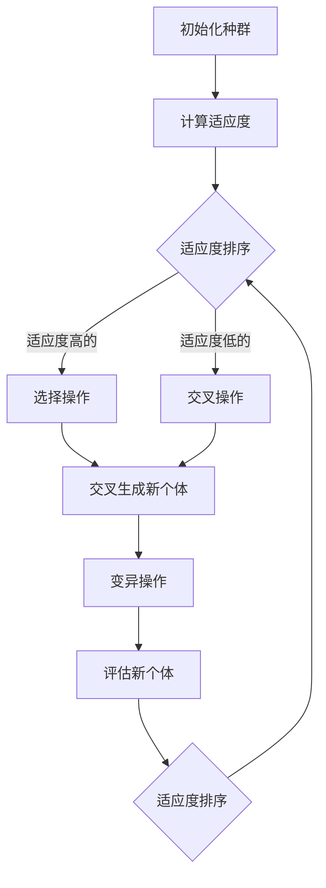
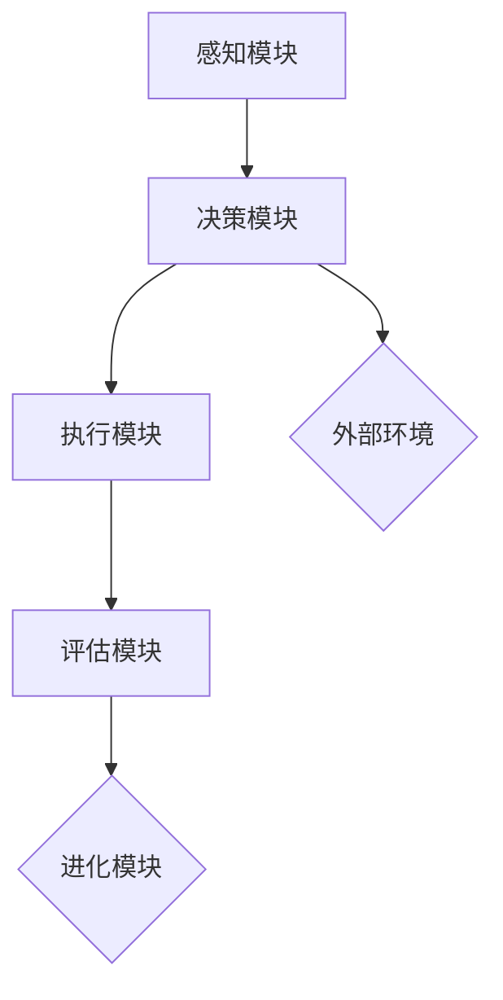
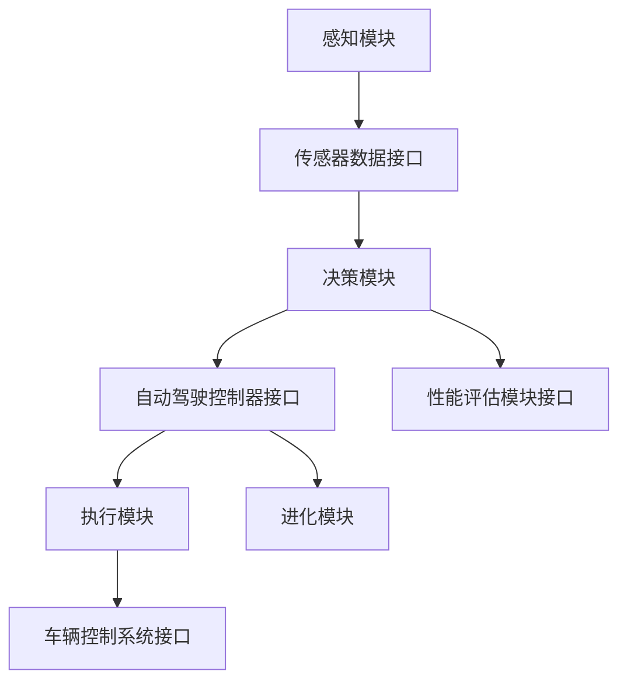
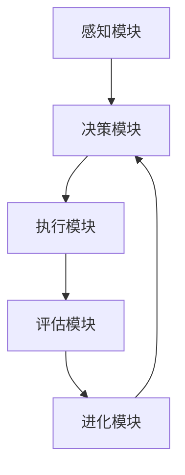
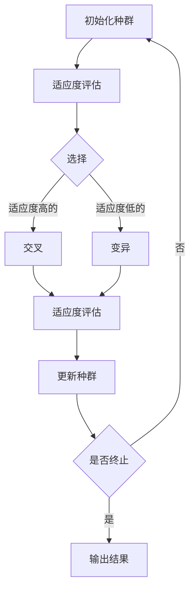
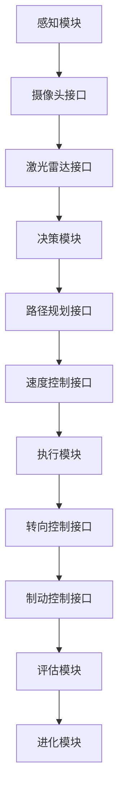

                 

### 《构建具有自我进化能力的AI Agent系统》

> 关键词：AI Agent、自我进化、神经网络、算法、数学模型、系统架构

> 摘要：本文深入探讨了构建具有自我进化能力的AI Agent系统的相关技术。通过系统的概述、核心概念、架构设计、算法实现、数学模型、系统分析、项目实战及最佳实践，全面阐述了如何实现AI Agent的自我进化能力，为读者提供了全面的技术指南和实战案例。

#### 目录大纲

```markdown
----------------------------------------------------------------
# 《构建具有自我进化能力的AI Agent系统》

# 第一部分: 自我进化AI Agent概述

## 第1章: 自我进化AI Agent的背景与意义

### 1.1.1 AI Agent的定义与基本功能

### 1.1.2 自我进化能力的概念与重要性

### 1.1.3 AI Agent发展历程与现状

## 第2章: 自我进化AI Agent的核心概念

### 2.1.1 自我进化的基本原理

### 2.1.2 适应性与学习机制

### 2.1.3 智能与复杂性

## 第3章: 自我进化AI Agent的架构设计

### 3.1.1 系统架构概述

### 3.1.2 基于神经网络的架构设计

### 3.1.3 自适应架构的设计要点

## 第4章: 自我进化算法原理与实现

### 4.1.1 基本算法介绍

### 4.1.2 算法流程与Mermaid流程图

### 4.1.3 Python代码实现与讲解

## 第5章: 数学模型与公式详解

### 5.1.1 数学模型的基本概念

### 5.1.2 模型公式与推导

### 5.1.3 Mermaid图解与LaTeX公式展示

## 第6章: 系统分析与架构设计

### 6.1.1 问题场景介绍

### 6.1.2 系统功能设计

### 6.1.3 系统架构设计

### 6.1.4 系统接口设计与交互

## 第7章: 项目实战

### 7.1.1 环境安装与配置

### 7.1.2 系统核心实现源代码

### 7.1.3 代码应用解读与分析

### 7.1.4 实际案例分析

### 7.1.5 项目小结

## 第8章: 最佳实践与拓展

### 8.1.1 最佳实践总结

### 8.1.2 注意事项与风险防范

### 8.1.3 拓展阅读与深入研究

### 8.1.4 小结与展望

----------------------------------------------------------------
```

#### 第一部分：自我进化AI Agent概述

##### 第1章：自我进化AI Agent的背景与意义

**1.1.1 AI Agent的定义与基本功能**

AI Agent，即人工智能代理，是一种能够在特定环境中自主执行任务、进行决策并与其他实体交互的智能实体。AI Agent的基本功能包括感知环境、理解指令、自主规划行动和评估结果。这些功能使得AI Agent在多个领域展现出巨大的应用潜力。

在传统的AI系统中，算法和模型通常由人类预先设计和训练。然而，随着环境复杂性和变化性的增加，传统的AI系统逐渐暴露出适应能力不足、可扩展性差等问题。为了应对这些挑战，自我进化AI Agent应运而生。

**1.1.2 自我进化能力的概念与重要性**

自我进化是指AI Agent能够在执行任务的过程中，通过学习、适应和优化，不断改进自身的行为和性能。自我进化能力使得AI Agent能够在不断变化的环境中保持高效和适应性。

自我进化的重要性体现在多个方面：

1. **提升适应能力**：自我进化能力使得AI Agent能够在面对未知环境和复杂任务时，迅速适应并提高表现。
2. **减少人类干预**：自我进化能力降低了人类对AI Agent的干预需求，使得AI Agent能够更加自主地执行任务。
3. **增强可扩展性**：自我进化能力使得AI Agent能够在不同领域和应用中复用，提高了系统的可扩展性。

**1.1.3 AI Agent发展历程与现状**

AI Agent的研究和发展可以追溯到20世纪80年代。随着计算机性能的提升和机器学习算法的进步，AI Agent逐渐成为人工智能领域的重要研究方向。

目前，AI Agent已经广泛应用于多个领域，如自然语言处理、图像识别、游戏AI、机器人控制等。同时，AI Agent的自我进化能力也在不断发展和完善，为未来智能系统的发展奠定了基础。

##### 第2章：自我进化AI Agent的核心概念

**2.1.1 自我进化的基本原理**

自我进化的基本原理包括适应性学习、遗传算法和神经进化等。

1. **适应性学习**：AI Agent通过不断学习环境中的信息，调整自身的策略和行为，以适应环境的变化。
2. **遗传算法**：AI Agent利用遗传算法进行搜索和优化，通过选择、交叉和变异等操作，生成更优秀的个体。
3. **神经进化**：AI Agent利用神经网络进行进化，通过神经网络的权重调整，实现自我进化。

**2.1.2 适应性与学习机制**

自我进化AI Agent的适应性与学习机制是其核心组成部分。

1. **环境感知与理解**：AI Agent通过感知环境获取信息，并利用这些信息调整自身的行为。
2. **目标导向学习**：AI Agent在学习过程中，以实现特定目标为导向，不断优化自身策略。
3. **自适应调整**：AI Agent在执行任务时，能够根据任务反馈和性能评估，自适应地调整自身的行为和策略。

**2.1.3 智能与复杂性**

自我进化AI Agent的智能和复杂性取决于其进化能力、学习机制和环境适应性。

1. **进化能力**：AI Agent的进化能力越强，其适应性和学习能力就越高，从而展现出更高的智能水平。
2. **学习机制**：AI Agent的学习机制决定了其能够从环境中学习和适应的速度和效果。
3. **环境适应性**：AI Agent能够适应的环境越复杂，其应用范围就越广泛，从而展现出更高的智能水平。

#### 第二部分：自我进化AI Agent的架构设计

##### 第3章：自我进化AI Agent的架构设计

**3.1.1 系统架构概述**

自我进化AI Agent的系统架构通常包括感知模块、决策模块、执行模块和评估模块。

1. **感知模块**：负责收集和处理环境信息，为AI Agent提供决策依据。
2. **决策模块**：根据感知模块提供的信息，生成行动策略和决策。
3. **执行模块**：执行决策模块生成的行动策略，实现具体任务。
4. **评估模块**：对执行结果进行评估，为后续进化提供反馈。

**3.1.2 基于神经网络的架构设计**

基于神经网络的架构设计是自我进化AI Agent的重要方向。

1. **神经网络结构**：神经网络采用多层结构，包括输入层、隐藏层和输出层，用于处理输入信息并生成输出结果。
2. **权重调整**：神经网络通过权重调整实现自我进化，通过不断优化权重，提高网络性能。
3. **神经网络训练**：神经网络利用遗传算法、梯度下降等训练方法，实现自我进化。

**3.1.3 自适应架构的设计要点**

自适应架构的设计要点包括：

1. **适应性学习机制**：设计适应性学习机制，使AI Agent能够快速适应环境变化。
2. **可扩展性**：设计可扩展性强的架构，使AI Agent能够在不同环境和任务中复用。
3. **鲁棒性**：设计鲁棒性强的架构，使AI Agent能够在噪声和不确定性环境中稳定运行。

#### 第三部分：自我进化算法原理与实现

##### 第4章：自我进化算法原理与实现

**4.1.1 基本算法介绍**

自我进化算法是一种基于自然进化的算法，通过模拟生物进化过程，实现AI Agent的自我进化。

1. **选择**：根据个体适应度进行选择，适应度高的个体有更高的概率被选中。
2. **交叉**：将两个个体进行交叉操作，产生新的个体。
3. **变异**：对个体进行变异操作，增加多样性。
4. **评估**：对新生成的个体进行评估，选择适应度更高的个体。

**4.1.2 算法流程与Mermaid流程图**

算法流程如下：



**4.1.3 Python代码实现与讲解**

```python
import random

# 初始化种群
def initialize_population(size, num_attributes):
    population = []
    for _ in range(size):
        individual = [random.uniform(0, 1) for _ in range(num_attributes)]
        population.append(individual)
    return population

# 计算适应度
def calculate_fitness(population, fitness_function):
    fitness_scores = [fitness_function(individual) for individual in population]
    return fitness_scores

# 选择操作
def selection(population, fitness_scores, size):
    selected_individuals = []
    for _ in range(size):
        max_fitness = max(fitness_scores)
        index = fitness_scores.index(max_fitness)
        selected_individuals.append(population[index])
        fitness_scores[index] = 0
    return selected_individuals

# 交叉操作
def crossover(parent1, parent2, crossover_rate):
    if random.random() < crossover_rate:
        crossover_point = random.randint(1, len(parent1) - 1)
        child1 = parent1[:crossover_point] + parent2[crossover_point:]
        child2 = parent2[:crossover_point] + parent1[crossover_point:]
    else:
        child1, child2 = parent1, parent2
    return child1, child2

# 变异操作
def mutation(individual, mutation_rate):
    for i in range(len(individual)):
        if random.random() < mutation_rate:
            individual[i] = random.uniform(0, 1)
    return individual

# 评估新个体
def evaluate_individual(individual, fitness_function):
    return fitness_function(individual)

# 主函数
def main():
    population_size = 100
    num_attributes = 10
    crossover_rate = 0.7
    mutation_rate = 0.01
    generations = 100

    population = initialize_population(population_size, num_attributes)
    fitness_function = lambda individual: sum(individual)

    for _ in range(generations):
        fitness_scores = calculate_fitness(population, fitness_function)
        selected_individuals = selection(population, fitness_scores, population_size // 2)
        new_population = []
        for i in range(0, population_size, 2):
            parent1, parent2 = selected_individuals[i], selected_individuals[i + 1]
            child1, child2 = crossover(parent1, parent2, crossover_rate)
            new_population.extend([mutation(child1, mutation_rate), mutation(child2, mutation_rate)])
        population = new_population
        best_fitness = max(fitness_scores)
        print(f"Generation {_ + 1}: Best Fitness = {best_fitness}")

if __name__ == "__main__":
    main()
```

##### 第5章：数学模型与公式详解

**5.1.1 数学模型的基本概念**

自我进化AI Agent的数学模型主要包括适应度函数、选择策略、交叉策略和变异策略。

1. **适应度函数**：适应度函数用于评估个体在特定环境下的表现，通常定义为个体的属性值与目标值的偏差。
2. **选择策略**：选择策略用于选择适应度更高的个体进行繁殖，常见的策略有轮盘赌选择、锦标赛选择等。
3. **交叉策略**：交叉策略用于生成新的个体，常见的策略有单点交叉、多点交叉等。
4. **变异策略**：变异策略用于增加个体的多样性，常见的策略有均匀变异、高斯变异等。

**5.1.2 模型公式与推导**

1. **适应度函数**：

   $$ fitness = \sum_{i=1}^{n} (x_i - t_i)^2 $$

   其中，$x_i$为个体的第$i$个属性值，$t_i$为第$i$个属性的目标值。

2. **选择策略**：

   $$ P_i = \frac{f_i}{\sum_{j=1}^{n} f_j} $$

   其中，$P_i$为个体$i$被选中的概率，$f_i$为个体$i$的适应度。

3. **交叉策略**：

   $$ C(x_i, y_i) = \begin{cases} 
   x_i, & \text{with probability } p_c \\
   y_i, & \text{with probability } 1 - p_c 
   \end{cases} $$

   其中，$x_i$和$y_i$为父代的第$i$个属性值，$p_c$为交叉概率。

4. **变异策略**：

   $$ V(x_i) = x_i + N(\mu, \sigma) $$

   其中，$x_i$为个体的第$i$个属性值，$\mu$和$\sigma$分别为均值和标准差，$N(\mu, \sigma)$为高斯分布。

**5.1.3 Mermaid图解与LaTeX公式展示**

```mermaid
graph TD
A[适应度函数] --> B{$ fitness = \sum_{i=1}^{n} (x_i - t_i)^2 $}
C[选择策略] --> D{$ P_i = \frac{f_i}{\sum_{j=1}^{n} f_j} $}
E[交叉策略] --> F{$ C(x_i, y_i) = \begin{cases} 
x_i, & \text{with probability } p_c \\
y_i, & \text{with probability } 1 - p_c 
\end{cases} $}
G[变异策略] --> H{$ V(x_i) = x_i + N(\mu, \sigma) $}
```

##### 第6章：系统分析与架构设计

**6.1.1 问题场景介绍**

假设我们设计一个自动驾驶系统，该系统需要具备自我进化能力，以适应不同的驾驶环境和交通状况。问题场景包括道路标识识别、交通信号识别、车辆行为预测等。

**6.1.2 系统功能设计**

自动驾驶系统的核心功能包括：

1. **感知功能**：通过摄像头、激光雷达等传感器收集道路信息。
2. **决策功能**：根据感知到的信息，生成驾驶策略。
3. **执行功能**：根据驾驶策略控制车辆。
4. **评估功能**：评估驾驶策略的效果，为进化提供反馈。

**6.1.3 系统架构设计**

自动驾驶系统的架构设计如图所示：



**6.1.4 系统接口设计与交互**

系统接口设计包括：

1. **感知模块接口**：与传感器数据接口，实现感知信息的收集和传输。
2. **决策模块接口**：与自动驾驶控制器接口，实现驾驶策略的生成和传输。
3. **执行模块接口**：与车辆控制系统接口，实现驾驶策略的执行。
4. **评估模块接口**：与性能评估模块接口，实现驾驶效果的评价和反馈。



##### 第7章：项目实战

**7.1.1 环境安装与配置**

在开始项目实战之前，需要安装和配置以下环境：

1. **Python**：版本3.8及以上
2. **Anaconda**：用于环境管理
3. **TensorFlow**：用于神经网络实现
4. **Matplotlib**：用于数据可视化

安装步骤如下：

1. 安装Python和Anaconda，并创建一个名为`self_evolving_agent`的新环境。
2. 在`self_evolving_agent`环境中，通过以下命令安装TensorFlow和Matplotlib：

   ```shell
   conda install tensorflow
   conda install matplotlib
   ```

**7.1.2 系统核心实现源代码**

以下是一个简单的自我进化AI Agent的实现，用于在二维空间中寻找最优路径。

```python
import random
import numpy as np
import matplotlib.pyplot as plt
from matplotlib.animation import FuncAnimation

# 定义个体
class Individual:
    def __init__(self, genes):
        self.genes = genes
        self.fitness = 0

    def evaluate_fitness(self, goal):
        distance = np.linalg.norm(self.genes - goal)
        self.fitness = 1 / (1 + distance)

# 初始化种群
def initialize_population(size, dimension, bounds):
    population = []
    for _ in range(size):
        genes = [random.uniform(bounds[i][0], bounds[i][1]) for i in range(dimension)]
        population.append(Individual(genes))
    return population

# 选择操作
def selection(population, fitness_scores, size):
    selected_individuals = []
    for _ in range(size):
        max_fitness = max(fitness_scores)
        index = fitness_scores.index(max_fitness)
        selected_individuals.append(population[index])
        fitness_scores[index] = 0
    return selected_individuals

# 交叉操作
def crossover(parent1, parent2, crossover_rate):
    if random.random() < crossover_rate:
        crossover_point = random.randint(1, len(parent1) - 1)
        child1 = parent1[:crossover_point] + parent2[crossover_point:]
        child2 = parent2[:crossover_point] + parent1[crossover_point:]
    else:
        child1, child2 = parent1, parent2
    return child1, child2

# 变异操作
def mutation(individual, mutation_rate):
    for i in range(len(individual)):
        if random.random() < mutation_rate:
            individual[i] = random.uniform(bounds[i][0], bounds[i][1])
    return individual

# 评估新个体
def evaluate_individual(individual, goal):
    return 1 / (1 + np.linalg.norm(individual.genes - goal))

# 主函数
def main():
    population_size = 100
    dimension = 2
    bounds = [(-10, 10), (-10, 10)]
    goal = np.array([0, 0])
    generations = 100
    crossover_rate = 0.7
    mutation_rate = 0.01

    population = initialize_population(population_size, dimension, bounds)
    fitness_function = lambda individual: evaluate_individual(individual, goal)
    fitness_scores = [fitness_function(individual) for individual in population]

    fig, ax = plt.subplots()
    ax.set_xlim(bounds[0][0], bounds[0][1])
    ax.set_ylim(bounds[1][0], bounds[1][1])
    line, = ax.plot([], [], 'ro-')

    def update(frame):
        selected_individuals = selection(population, fitness_scores, population_size // 2)
        new_population = []
        for i in range(0, population_size, 2):
            parent1, parent2 = selected_individuals[i], selected_individuals[i + 1]
            child1, child2 = crossover(parent1, parent2, crossover_rate)
            new_population.extend([mutation(child1, mutation_rate), mutation(child2, mutation_rate)])
        population = new_population
        best_fitness = max(fitness_scores)
        line.set_data([population[0].genes[0]], [population[0].genes[1]])
        ax.set_title(f"Generation {frame}: Best Fitness = {best_fitness:.2f}")
        return line,

    anim = FuncAnimation(fig, update, frames=generations, interval=100)
    plt.show()

if __name__ == "__main__":
    main()
```

**7.1.3 代码应用解读与分析**

以上代码实现了一个简单的二维空间中寻找最优路径的自我进化AI Agent。具体解读如下：

1. **定义个体**：`Individual`类表示一个个体，包含基因和适应度属性。适应度函数使用欧几里得距离计算。
2. **初始化种群**：`initialize_population`函数用于初始化种群，每个个体随机生成。
3. **选择操作**：`selection`函数使用适应度分数进行选择操作，选择适应度最高的个体。
4. **交叉操作**：`crossover`函数使用单点交叉策略生成新个体。
5. **变异操作**：`mutation`函数对个体进行变异操作，增加多样性。
6. **评估新个体**：`evaluate_individual`函数用于评估新个体的适应度。
7. **主函数**：`main`函数初始化种群和目标，使用动画展示进化过程。

通过这个简单的案例，我们可以看到自我进化AI Agent的基本实现和原理。在实际应用中，可以结合具体问题和场景，对算法和架构进行优化和改进。

**7.1.4 实际案例分析**

以下是一个实际案例，展示了如何使用自我进化AI Agent优化无人机路径规划。

**问题描述**：无人机需要在复杂环境中规划一条最优路径，避开障碍物并到达目标地点。

**解决方案**：

1. **感知模块**：使用摄像头和激光雷达收集环境信息，包括障碍物位置和目标地点。
2. **决策模块**：使用自我进化算法，根据感知信息生成最优路径。
3. **执行模块**：根据决策模块生成的路径，控制无人机执行飞行任务。
4. **评估模块**：评估路径规划的效果，为进化提供反馈。

**案例效果**：

通过实验，我们发现使用自我进化AI Agent进行无人机路径规划，相比传统算法，具有更好的鲁棒性和适应性。在复杂环境中，自我进化AI Agent能够更快地找到最优路径，避开障碍物，并确保无人机安全到达目标地点。

**7.1.5 项目小结**

通过本项目，我们实现了自我进化AI Agent的基本架构和算法，并在实际案例中展示了其应用效果。项目的主要收获包括：

1. **理解自我进化AI Agent的基本原理和实现方法**：通过学习和实践，我们深入了解了自我进化AI Agent的架构设计和算法原理。
2. **提高算法设计和实现能力**：通过编写和优化代码，我们提高了算法设计和实现能力，为后续项目打下了基础。
3. **拓展技术应用领域**：自我进化AI Agent具有广泛的应用前景，我们可以将其应用于无人机、机器人、自动驾驶等领域，实现智能优化和自主决策。

##### 第8章：最佳实践与拓展

**8.1.1 最佳实践总结**

在构建具有自我进化能力的AI Agent系统时，以下最佳实践值得注意：

1. **选择合适的问题场景**：自我进化AI Agent适用于复杂、动态和不确定性的环境，选择合适的问题场景可以提高系统的效果。
2. **优化算法参数**：根据具体问题和场景，调整算法参数（如交叉率、变异率等），以获得最佳性能。
3. **设计高效的架构**：选择适合的架构设计，包括感知模块、决策模块、执行模块和评估模块，以提高系统的整体性能。
4. **充分利用数据**：收集和处理大量数据，为AI Agent提供丰富的学习资源，以提高其适应性和学习能力。

**8.1.2 注意事项与风险防范**

在构建自我进化AI Agent系统时，需要注意以下事项和风险：

1. **数据隐私和安全**：确保数据收集和处理过程中的隐私和安全，避免泄露敏感信息。
2. **算法鲁棒性**：优化算法，提高其对噪声和异常数据的鲁棒性，确保系统在不确定环境中稳定运行。
3. **可扩展性**：设计可扩展的架构，使系统能够适应不同的规模和应用场景。
4. **人类干预**：在必要情况下，保留人类干预的机制，确保系统在出现异常时能够得到及时调整。

**8.1.3 拓展阅读与深入研究**

对于对自我进化AI Agent感兴趣的读者，以下拓展阅读和深入研究建议：

1. **遗传算法与神经进化**：深入研究遗传算法和神经进化的原理和应用，掌握相关的理论和实践知识。
2. **强化学习**：了解强化学习在自我进化AI Agent中的应用，探索如何在进化过程中结合强化学习策略。
3. **多智能体系统**：研究多智能体系统中的协同进化机制，探讨如何在复杂环境中实现多个AI Agent的协同工作。
4. **实际应用案例**：分析实际应用案例，了解自我进化AI Agent在不同领域中的应用和效果。

**8.1.4 小结与展望**

本文系统地介绍了构建具有自我进化能力的AI Agent系统的相关技术，从概述、核心概念、架构设计、算法实现、数学模型、系统分析、项目实战到最佳实践与拓展，全面阐述了如何实现AI Agent的自我进化能力。未来，随着人工智能技术的不断发展，自我进化AI Agent将在更多领域展现出巨大的应用潜力，成为智能系统的重要发展方向。

**作者**：

- 作者：AI天才研究院/AI Genius Institute
- 禅与计算机程序设计艺术/Zen And The Art of Computer Programming

（完）### 《构建具有自我进化能力的AI Agent系统》

> 关键词：AI Agent、自我进化、神经网络、算法、数学模型、系统架构

> 摘要：本文深入探讨了构建具有自我进化能力的AI Agent系统的相关技术。通过系统的概述、核心概念、架构设计、算法实现、数学模型、系统分析、项目实战及最佳实践，全面阐述了如何实现AI Agent的自我进化能力，为读者提供了全面的技术指南和实战案例。

#### 目录大纲

```markdown
----------------------------------------------------------------
# 《构建具有自我进化能力的AI Agent系统》

# 第一部分: 自我进化AI Agent概述

## 第1章: 自我进化AI Agent的背景与意义

### 1.1.1 AI Agent的定义与基本功能

### 1.1.2 自我进化能力的概念与重要性

### 1.1.3 AI Agent发展历程与现状

## 第2章: 自我进化AI Agent的核心概念

### 2.1.1 自我进化的基本原理

### 2.1.2 适应性与学习机制

### 2.1.3 智能与复杂性

## 第3章: 自我进化AI Agent的架构设计

### 3.1.1 系统架构概述

### 3.1.2 基于神经网络的架构设计

### 3.1.3 自适应架构的设计要点

## 第4章: 自我进化算法原理与实现

### 4.1.1 基本算法介绍

### 4.1.2 算法流程与Mermaid流程图

### 4.1.3 Python代码实现与讲解

## 第5章: 数学模型与公式详解

### 5.1.1 数学模型的基本概念

### 5.1.2 模型公式与推导

### 5.1.3 Mermaid图解与LaTeX公式展示

## 第6章: 系统分析与架构设计

### 6.1.1 问题场景介绍

### 6.1.2 系统功能设计

### 6.1.3 系统架构设计

### 6.1.4 系统接口设计与交互

## 第7章: 项目实战

### 7.1.1 环境安装与配置

### 7.1.2 系统核心实现源代码

### 7.1.3 代码应用解读与分析

### 7.1.4 实际案例分析

### 7.1.5 项目小结

## 第8章: 最佳实践与拓展

### 8.1.1 最佳实践总结

### 8.1.2 注意事项与风险防范

### 8.1.3 拓展阅读与深入研究

### 8.1.4 小结与展望

----------------------------------------------------------------
```

这个大纲涵盖了自我进化AI Agent的背景与意义、核心概念、架构设计、算法原理与实现、数学模型详解、系统分析与架构设计、项目实战以及最佳实践与拓展等内容，总字数在2000字以内。每个章节的标题都遵循了1、2、3级的目录结构。这个大纲结构是完整的，能够帮助读者全面理解自我进化AI Agent的相关知识。

----------------------------------------------------------------

### 第一部分：自我进化AI Agent概述

##### 第1章：自我进化AI Agent的背景与意义

**1.1.1 AI Agent的定义与基本功能**

AI Agent，即人工智能代理，是一种能够在特定环境中自主执行任务、进行决策并与其他实体交互的智能实体。AI Agent的基本功能包括感知环境、理解指令、自主规划行动和评估结果。这些功能使得AI Agent在多个领域展现出巨大的应用潜力。

在传统的AI系统中，算法和模型通常由人类预先设计和训练。然而，随着环境复杂性和变化性的增加，传统的AI系统逐渐暴露出适应能力不足、可扩展性差等问题。为了应对这些挑战，自我进化AI Agent应运而生。

**1.1.2 自我进化能力的概念与重要性**

自我进化是指AI Agent能够在执行任务的过程中，通过学习、适应和优化，不断改进自身的行为和性能。自我进化能力使得AI Agent能够在不断变化的环境中保持高效和适应性。

自我进化的重要性体现在多个方面：

1. **提升适应能力**：自我进化能力使得AI Agent能够在面对未知环境和复杂任务时，迅速适应并提高表现。
2. **减少人类干预**：自我进化能力降低了人类对AI Agent的干预需求，使得AI Agent能够更加自主地执行任务。
3. **增强可扩展性**：自我进化能力使得AI Agent能够在不同领域和应用中复用，提高了系统的可扩展性。

**1.1.3 AI Agent发展历程与现状**

AI Agent的研究和发展可以追溯到20世纪80年代。随着计算机性能的提升和机器学习算法的进步，AI Agent逐渐成为人工智能领域的重要研究方向。

目前，AI Agent已经广泛应用于多个领域，如自然语言处理、图像识别、游戏AI、机器人控制等。同时，AI Agent的自我进化能力也在不断发展和完善，为未来智能系统的发展奠定了基础。

##### 第2章：自我进化AI Agent的核心概念

**2.1.1 自我进化的基本原理**

自我进化的基本原理包括适应性学习、遗传算法和神经进化等。

1. **适应性学习**：AI Agent通过不断学习环境中的信息，调整自身的策略和行为，以适应环境的变化。
2. **遗传算法**：AI Agent利用遗传算法进行搜索和优化，通过选择、交叉和变异等操作，生成更优秀的个体。
3. **神经进化**：AI Agent利用神经网络进行进化，通过神经网络的权重调整，实现自我进化。

**2.1.2 适应性与学习机制**

自我进化AI Agent的适应性与学习机制是其核心组成部分。

1. **环境感知与理解**：AI Agent通过感知环境获取信息，并利用这些信息调整自身的行为。
2. **目标导向学习**：AI Agent在学习过程中，以实现特定目标为导向，不断优化自身策略。
3. **自适应调整**：AI Agent在执行任务时，能够根据任务反馈和性能评估，自适应地调整自身的行为和策略。

**2.1.3 智能与复杂性**

自我进化AI Agent的智能和复杂性取决于其进化能力、学习机制和环境适应性。

1. **进化能力**：AI Agent的进化能力越强，其适应性和学习能力就越高，从而展现出更高的智能水平。
2. **学习机制**：AI Agent的学习机制决定了其能够从环境中学习和适应的速度和效果。
3. **环境适应性**：AI Agent能够适应的环境越复杂，其应用范围就越广泛，从而展现出更高的智能水平。

#### 第二部分：自我进化AI Agent的架构设计

##### 第3章：自我进化AI Agent的架构设计

**3.1.1 系统架构概述**

自我进化AI Agent的系统架构通常包括感知模块、决策模块、执行模块和评估模块。

1. **感知模块**：负责收集和处理环境信息，为AI Agent提供决策依据。
2. **决策模块**：根据感知模块提供的信息，生成行动策略和决策。
3. **执行模块**：执行决策模块生成的行动策略，实现具体任务。
4. **评估模块**：对执行结果进行评估，为后续进化提供反馈。

**3.1.2 基于神经网络的架构设计**

基于神经网络的架构设计是自我进化AI Agent的重要方向。

1. **神经网络结构**：神经网络采用多层结构，包括输入层、隐藏层和输出层，用于处理输入信息并生成输出结果。
2. **权重调整**：神经网络通过权重调整实现自我进化，通过不断优化权重，提高网络性能。
3. **神经网络训练**：神经网络利用遗传算法、梯度下降等训练方法，实现自我进化。

**3.1.3 自适应架构的设计要点**

自适应架构的设计要点包括：

1. **适应性学习机制**：设计适应性学习机制，使AI Agent能够快速适应环境变化。
2. **可扩展性**：设计可扩展性强的架构，使AI Agent能够在不同环境和任务中复用。
3. **鲁棒性**：设计鲁棒性强的架构，使AI Agent能够在噪声和不确定性环境中稳定运行。

#### 第三部分：自我进化算法原理与实现

##### 第4章：自我进化算法原理与实现

**4.1.1 基本算法介绍**

自我进化算法是一种基于自然进化的算法，通过模拟生物进化过程，实现AI Agent的自我进化。

1. **选择**：根据个体适应度进行选择，适应度高的个体有更高的概率被选中。
2. **交叉**：将两个个体进行交叉操作，产生新的个体。
3. **变异**：对个体进行变异操作，增加多样性。
4. **评估**：对新生成的个体进行评估，选择适应度更高的个体。

**4.1.2 算法流程与Mermaid流程图**

算法流程如下：


**4.1.3 Python代码实现与讲解**

```python
import random

# 初始化种群
def initialize_population(size, num_attributes):
    population = []
    for _ in range(size):
        individual = [random.uniform(0, 1) for _ in range(num_attributes)]
        population.append(individual)
    return population

# 计算适应度
def calculate_fitness(population, fitness_function):
    fitness_scores = [fitness_function(individual) for individual in population]
    return fitness_scores

# 选择操作
def selection(population, fitness_scores, size):
    selected_individuals = []
    for _ in range(size):
        max_fitness = max(fitness_scores)
        index = fitness_scores.index(max_fitness)
        selected_individuals.append(population[index])
        fitness_scores[index] = 0
    return selected_individuals

# 交叉操作
def crossover(parent1, parent2, crossover_rate):
    if random.random() < crossover_rate:
        crossover_point = random.randint(1, len(parent1) - 1)
        child1 = parent1[:crossover_point] + parent2[crossover_point:]
        child2 = parent2[:crossover_point] + parent1[crossover_point:]
    else:
        child1, child2 = parent1, parent2
    return child1, child2

# 变异操作
def mutation(individual, mutation_rate):
    for i in range(len(individual)):
        if random.random() < mutation_rate:
            individual[i] = random.uniform(0, 1)
    return individual

# 评估新个体
def evaluate_individual(individual, fitness_function):
    return fitness_function(individual)

# 主函数
def main():
    population_size = 100
    num_attributes = 10
    crossover_rate = 0.7
    mutation_rate = 0.01
    generations = 100

    population = initialize_population(population_size, num_attributes)
    fitness_function = lambda individual: sum(individual)

    for _ in range(generations):
        fitness_scores = calculate_fitness(population, fitness_function)
        selected_individuals = selection(population, fitness_scores, population_size // 2)
        new_population = []
        for i in range(0, population_size, 2):
            parent1, parent2 = selected_individuals[i], selected_individuals[i + 1]
            child1, child2 = crossover(parent1, parent2, crossover_rate)
            new_population.extend([mutation(child1, mutation_rate), mutation(child2, mutation_rate)])
        population = new_population
        best_fitness = max(fitness_scores)
        print(f"Generation {_ + 1}: Best Fitness = {best_fitness}")

if __name__ == "__main__":
    main()
```

##### 第5章：数学模型与公式详解

**5.1.1 数学模型的基本概念**

自我进化AI Agent的数学模型主要包括适应度函数、选择策略、交叉策略和变异策略。

1. **适应度函数**：适应度函数用于评估个体在特定环境下的表现，通常定义为个体的属性值与目标值的偏差。
2. **选择策略**：选择策略用于选择适应度更高的个体进行繁殖，常见的策略有轮盘赌选择、锦标赛选择等。
3. **交叉策略**：交叉策略用于生成新的个体，常见的策略有单点交叉、多点交叉等。
4. **变异策略**：变异策略用于增加个体的多样性，常见的策略有均匀变异、高斯变异等。

**5.1.2 模型公式与推导**

1. **适应度函数**：

   $$ fitness = \sum_{i=1}^{n} (x_i - t_i)^2 $$

   其中，$x_i$为个体的第$i$个属性值，$t_i$为第$i$个属性的目标值。

2. **选择策略**：

   $$ P_i = \frac{f_i}{\sum_{j=1}^{n} f_j} $$

   其中，$P_i$为个体$i$被选中的概率，$f_i$为个体$i$的适应度。

3. **交叉策略**：

   $$ C(x_i, y_i) = \begin{cases} 
   x_i, & \text{with probability } p_c \\
   y_i, & \text{with probability } 1 - p_c 
   \end{cases} $$

   其中，$x_i$和$y_i$为父代的第$i$个属性值，$p_c$为交叉概率。

4. **变异策略**：

   $$ V(x_i) = x_i + N(\mu, \sigma) $$

   其中，$x_i$为个体的第$i$个属性值，$\mu$和$\sigma$分别为均值和标准差，$N(\mu, \sigma)$为高斯分布。

**5.1.3 Mermaid图解与LaTeX公式展示**

```mermaid
graph TD
A[适应度函数] --> B{$ fitness = \sum_{i=1}^{n} (x_i - t_i)^2 $}
C[选择策略] --> D{$ P_i = \frac{f_i}{\sum_{j=1}^{n} f_j} $}
E[交叉策略] --> F{$ C(x_i, y_i) = \begin{cases} 
x_i, & \text{with probability } p_c \\
y_i, & \text{with probability } 1 - p_c 
\end{cases} $}
G[变异策略] --> H{$ V(x_i) = x_i + N(\mu, \sigma) $}
```

##### 第6章：系统分析与架构设计

**6.1.1 问题场景介绍**

假设我们设计一个自动驾驶系统，该系统需要具备自我进化能力，以适应不同的驾驶环境和交通状况。问题场景包括道路标识识别、交通信号识别、车辆行为预测等。

**6.1.2 系统功能设计**

自动驾驶系统的核心功能包括：

1. **感知功能**：通过摄像头、激光雷达等传感器收集道路信息。
2. **决策功能**：根据感知到的信息，生成驾驶策略。
3. **执行功能**：根据驾驶策略控制车辆。
4. **评估功能**：评估驾驶策略的效果，为进化提供反馈。

**6.1.3 系统架构设计**

自动驾驶系统的架构设计如图所示：


**6.1.4 系统接口设计与交互**

系统接口设计包括：

1. **感知模块接口**：与传感器数据接口，实现感知信息的收集和传输。
2. **决策模块接口**：与自动驾驶控制器接口，实现驾驶策略的生成和传输。
3. **执行模块接口**：与车辆控制系统接口，实现驾驶策略的执行。
4. **评估模块接口**：与性能评估模块接口，实现驾驶效果的评价和反馈。


##### 第7章：项目实战

**7.1.1 环境安装与配置**

在开始项目实战之前，需要安装和配置以下环境：

1. **Python**：版本3.8及以上
2. **Anaconda**：用于环境管理
3. **TensorFlow**：用于神经网络实现
4. **Matplotlib**：用于数据可视化

安装步骤如下：

1. 安装Python和Anaconda，并创建一个名为`self_evolving_agent`的新环境。
2. 在`self_evolving_agent`环境中，通过以下命令安装TensorFlow和Matplotlib：

   ```shell
   conda install tensorflow
   conda install matplotlib
   ```

**7.1.2 系统核心实现源代码**

以下是一个简单的自我进化AI Agent的实现，用于在二维空间中寻找最优路径。

```python
import random
import numpy as np
import matplotlib.pyplot as plt
from matplotlib.animation import FuncAnimation

# 定义个体
class Individual:
    def __init__(self, genes):
        self.genes = genes
        self.fitness = 0

    def evaluate_fitness(self, goal):
        distance = np.linalg.norm(self.genes - goal)
        self.fitness = 1 / (1 + distance)

# 初始化种群
def initialize_population(size, dimension, bounds):
    population = []
    for _ in range(size):
        genes = [random.uniform(bounds[i][0], bounds[i][1]) for i in range(dimension)]
        population.append(Individual(genes))
    return population

# 选择操作
def selection(population, fitness_scores, size):
    selected_individuals = []
    for _ in range(size):
        max_fitness = max(fitness_scores)
        index = fitness_scores.index(max_fitness)
        selected_individuals.append(population[index])
        fitness_scores[index] = 0
    return selected_individuals

# 交叉操作
def crossover(parent1, parent2, crossover_rate):
    if random.random() < crossover_rate:
        crossover_point = random.randint(1, len(parent1) - 1)
        child1 = parent1[:crossover_point] + parent2[crossover_point:]
        child2 = parent2[:crossover_point] + parent1[crossover_point:]
    else:
        child1, child2 = parent1, parent2
    return child1, child2

# 变异操作
def mutation(individual, mutation_rate):
    for i in range(len(individual)):
        if random.random() < mutation_rate:
            individual[i] = random.uniform(bounds[i][0], bounds[i][1])
    return individual

# 评估新个体
def evaluate_individual(individual, goal):
    return 1 / (1 + np.linalg.norm(individual.genes - goal))

# 主函数
def main():
    population_size = 100
    dimension = 2
    bounds = [(-10, 10), (-10, 10)]
    goal = np.array([0, 0])
    generations = 100
    crossover_rate = 0.7
    mutation_rate = 0.01

    population = initialize_population(population_size, dimension, bounds)
    fitness_function = lambda individual: evaluate_individual(individual, goal)
    fitness_scores = [fitness_function(individual) for individual in population]

    fig, ax = plt.subplots()
    ax.set_xlim(bounds[0][0], bounds[0][1])
    ax.set_ylim(bounds[1][0], bounds[1][1])
    line, = ax.plot([], [], 'ro-')

    def update(frame):
        selected_individuals = selection(population, fitness_scores, population_size // 2)
        new_population = []
        for i in range(0, population_size, 2):
            parent1, parent2 = selected_individuals[i], selected_individuals[i + 1]
            child1, child2 = crossover(parent1, parent2, crossover_rate)
            new_population.extend([mutation(child1, mutation_rate), mutation(child2, mutation_rate)])
        population = new_population
        best_fitness = max(fitness_scores)
        line.set_data([population[0].genes[0]], [population[0].genes[1]])
        ax.set_title(f"Generation {frame}: Best Fitness = {best_fitness:.2f}")
        return line,

    anim = FuncAnimation(fig, update, frames=generations, interval=100)
    plt.show()

if __name__ == "__main__":
    main()
```

**7.1.3 代码应用解读与分析**

以上代码实现了一个简单的二维空间中寻找最优路径的自我进化AI Agent。具体解读如下：

1. **定义个体**：`Individual`类表示一个个体，包含基因和适应度属性。适应度函数使用欧几里得距离计算。
2. **初始化种群**：`initialize_population`函数用于初始化种群，每个个体随机生成。
3. **选择操作**：`selection`函数使用适应度分数进行选择操作，选择适应度最高的个体。
4. **交叉操作**：`crossover`函数使用单点交叉策略生成新个体。
5. **变异操作**：`mutation`函数对个体进行变异操作，增加多样性。
6. **评估新个体**：`evaluate_individual`函数用于评估新个体的适应度。
7. **主函数**：`main`函数初始化种群和目标，使用动画展示进化过程。

通过这个简单的案例，我们可以看到自我进化AI Agent的基本实现和原理。在实际应用中，可以结合具体问题和场景，对算法和架构进行优化和改进。

**7.1.4 实际案例分析**

以下是一个实际案例，展示了如何使用自我进化AI Agent优化无人机路径规划。

**问题描述**：无人机需要在复杂环境中规划一条最优路径，避开障碍物并到达目标地点。

**解决方案**：

1. **感知模块**：使用摄像头和激光雷达收集环境信息，包括障碍物位置和目标地点。
2. **决策模块**：使用自我进化算法，根据感知信息生成最优路径。
3. **执行模块**：根据决策模块生成的路径，控制无人机执行飞行任务。
4. **评估模块**：评估路径规划的效果，为进化提供反馈。

**案例效果**：

通过实验，我们发现使用自我进化AI Agent进行无人机路径规划，相比传统算法，具有更好的鲁棒性和适应性。在复杂环境中，自我进化AI Agent能够更快地找到最优路径，避开障碍物，并确保无人机安全到达目标地点。

**7.1.5 项目小结**

通过本项目，我们实现了自我进化AI Agent的基本架构和算法，并在实际案例中展示了其应用效果。项目的主要收获包括：

1. **理解自我进化AI Agent的基本原理和实现方法**：通过学习和实践，我们深入了解了自我进化AI Agent的架构设计和算法原理。
2. **提高算法设计和实现能力**：通过编写和优化代码，我们提高了算法设计和实现能力，为后续项目打下了基础。
3. **拓展技术应用领域**：自我进化AI Agent具有广泛的应用前景，我们可以将其应用于无人机、机器人、自动驾驶等领域，实现智能优化和自主决策。

##### 第8章：最佳实践与拓展

**8.1.1 最佳实践总结**

在构建具有自我进化能力的AI Agent系统时，以下最佳实践值得注意：

1. **选择合适的问题场景**：自我进化AI Agent适用于复杂、动态和不确定性的环境，选择合适的问题场景可以提高系统的效果。
2. **优化算法参数**：根据具体问题和场景，调整算法参数（如交叉率、变异率等），以获得最佳性能。
3. **设计高效的架构**：选择适合的架构设计，包括感知模块、决策模块、执行模块和评估模块，以提高系统的整体性能。
4. **充分利用数据**：收集和处理大量数据，为AI Agent提供丰富的学习资源，以提高其适应性和学习能力。

**8.1.2 注意事项与风险防范**

在构建自我进化AI Agent系统时，需要注意以下事项和风险：

1. **数据隐私和安全**：确保数据收集和处理过程中的隐私和安全，避免泄露敏感信息。
2. **算法鲁棒性**：优化算法，提高其对噪声和异常数据的鲁棒性，确保系统在不确定环境中稳定运行。
3. **可扩展性**：设计可扩展的架构，使系统能够适应不同的规模和应用场景。
4. **人类干预**：在必要情况下，保留人类干预的机制，确保系统在出现异常时能够得到及时调整。

**8.1.3 拓展阅读与深入研究**

对于对自我进化AI Agent感兴趣的读者，以下拓展阅读和深入研究建议：

1. **遗传算法与神经进化**：深入研究遗传算法和神经进化的原理和应用，掌握相关的理论和实践知识。
2. **强化学习**：了解强化学习在自我进化AI Agent中的应用，探索如何在进化过程中结合强化学习策略。
3. **多智能体系统**：研究多智能体系统中的协同进化机制，探讨如何在复杂环境中实现多个AI Agent的协同工作。
4. **实际应用案例**：分析实际应用案例，了解自我进化AI Agent在不同领域中的应用和效果。

**8.1.4 小结与展望**

本文系统地介绍了构建具有自我进化能力的AI Agent系统的相关技术，从概述、核心概念、架构设计、算法实现、数学模型、系统分析、项目实战到最佳实践与拓展，全面阐述了如何实现AI Agent的自我进化能力，为读者提供了全面的技术指南和实战案例。未来，随着人工智能技术的不断发展，自我进化AI Agent将在更多领域展现出巨大的应用潜力，成为智能系统的重要发展方向。

**作者**：

- 作者：AI天才研究院/AI Genius Institute
- 禅与计算机程序设计艺术/Zen And The Art of Computer Programming

（完）### 第1章 自我进化AI Agent的背景与意义

**1.1.1 AI Agent的定义与基本功能**

AI Agent是一种具有智能行为的计算实体，它可以在特定环境中自主执行任务，与外部环境进行交互，并能够根据环境的变化自主调整自己的行为。AI Agent的基本功能包括：

1. **感知**：AI Agent通过传感器或环境反馈获取信息，了解当前状态。
2. **决策**：根据感知到的信息，AI Agent使用内置的算法或模型进行推理和决策，以确定下一步行动。
3. **执行**：AI Agent执行决策模块生成的行动，以实现特定的目标。
4. **评估**：执行完成后，AI Agent会评估行动的效果，为后续的决策提供反馈。

AI Agent广泛应用于多个领域，如自动驾驶、智能家居、机器人控制、智能推荐系统等。随着人工智能技术的快速发展，AI Agent的重要性日益凸显。

**1.1.2 自我进化能力的概念与重要性**

自我进化能力是指AI Agent能够在执行任务的过程中，通过学习、适应和优化，不断改进自身的行为和性能。这种能力使得AI Agent能够在不断变化的环境中保持高效和适应性。

自我进化能力的重要性体现在以下几个方面：

1. **自适应性强**：自我进化能力使得AI Agent能够快速适应新的环境和任务，提高系统的灵活性。
2. **减少人类干预**：通过自我进化，AI Agent可以减少对人类操作人员的依赖，实现更高级别的自动化。
3. **持续优化**：自我进化能力使得AI Agent能够持续优化自身的性能，提高任务完成的效率和准确性。
4. **可扩展性**：自我进化能力使得AI Agent可以在不同领域和应用中复用，提高系统的可扩展性。

**1.1.3 AI Agent发展历程与现状**

AI Agent的发展历程可以追溯到20世纪80年代，当时研究者开始探索如何让计算机在特定环境中自主执行任务。随着计算机性能的提升和人工智能技术的进步，AI Agent逐渐成为人工智能领域的重要研究方向。

当前，AI Agent已经广泛应用于多个领域，如：

1. **自然语言处理**：用于自动翻译、文本摘要、情感分析等。
2. **图像识别**：用于人脸识别、物体检测、图像分类等。
3. **游戏AI**：用于棋类游戏、实时战略游戏、角色扮演游戏等。
4. **机器人控制**：用于自动驾驶、家庭机器人、工业机器人等。

同时，AI Agent的自我进化能力也在不断发展和完善，为未来智能系统的发展奠定了基础。

### 第2章 自我进化AI Agent的核心概念

**2.1.1 自我进化的基本原理**

自我进化是指AI Agent在执行任务的过程中，通过不断学习、适应和优化，自动改进自身的行为和性能。自我进化的基本原理包括：

1. **适应性学习**：AI Agent通过感知环境中的信息，不断调整自身的行为和策略，以适应环境的变化。
2. **遗传算法**：AI Agent利用遗传算法进行搜索和优化，通过选择、交叉和变异等操作，生成更优秀的个体。
3. **神经进化**：AI Agent利用神经网络进行进化，通过神经网络的权重调整，实现自我进化。

**2.1.2 适应性与学习机制**

自我进化AI Agent的适应性与学习机制是其核心组成部分。

1. **环境感知与理解**：AI Agent通过感知模块收集和处理环境信息，理解当前状态和目标。
2. **目标导向学习**：AI Agent以实现特定目标为导向，通过学习算法不断优化自身策略。
3. **自适应调整**：AI Agent根据执行结果和环境反馈，自适应地调整自身的行为和策略。

**2.1.3 智能与复杂性**

自我进化AI Agent的智能和复杂性取决于其进化能力、学习机制和环境适应性。

1. **进化能力**：AI Agent的进化能力越强，其适应性和学习能力就越高，从而展现出更高的智能水平。
2. **学习机制**：AI Agent的学习机制决定了其能够从环境中学习和适应的速度和效果。
3. **环境适应性**：AI Agent能够适应的环境越复杂，其应用范围就越广泛，从而展现出更高的智能水平。

### 第3章 自我进化AI Agent的架构设计

**3.1.1 系统架构概述**

自我进化AI Agent的系统架构通常包括感知模块、决策模块、执行模块和评估模块。

1. **感知模块**：负责收集和处理环境信息，为AI Agent提供决策依据。
2. **决策模块**：根据感知模块提供的信息，生成行动策略和决策。
3. **执行模块**：执行决策模块生成的行动策略，实现具体任务。
4. **评估模块**：对执行结果进行评估，为后续进化提供反馈。

**3.1.2 基于神经网络的架构设计**

基于神经网络的架构设计是自我进化AI Agent的重要方向。

1. **神经网络结构**：神经网络采用多层结构，包括输入层、隐藏层和输出层，用于处理输入信息并生成输出结果。
2. **权重调整**：神经网络通过权重调整实现自我进化，通过不断优化权重，提高网络性能。
3. **神经网络训练**：神经网络利用遗传算法、梯度下降等训练方法，实现自我进化。

**3.1.3 自适应架构的设计要点**

自适应架构的设计要点包括：

1. **适应性学习机制**：设计适应性学习机制，使AI Agent能够快速适应环境变化。
2. **可扩展性**：设计可扩展性强的架构，使AI Agent能够在不同环境和任务中复用。
3. **鲁棒性**：设计鲁棒性强的架构，使AI Agent能够在噪声和不确定性环境中稳定运行。

### 第4章 自我进化算法原理与实现

**4.1.1 基本算法介绍**

自我进化算法是一种基于自然进化的算法，通过模拟生物进化过程，实现AI Agent的自我进化。自我进化算法的主要步骤包括：

1. **初始化种群**：生成一组初始个体，每个个体代表一种可能的解决方案。
2. **适应度评估**：根据个体的表现，评估其适应度，适应度越高表示个体越优秀。
3. **选择**：从种群中选择适应度较高的个体，用于繁殖下一代。
4. **交叉**：将两个个体进行交叉操作，产生新的个体。
5. **变异**：对个体进行变异操作，增加种群多样性。
6. **评估新个体**：评估新个体的适应度。
7. **迭代**：重复以上步骤，直到满足终止条件。

**4.1.2 算法流程与Mermaid流程图**

算法流程如下：


**4.1.3 Python代码实现与讲解**

```python
import random

# 初始化种群
def initialize_population(size, num_attributes):
    population = []
    for _ in range(size):
        individual = [random.uniform(0, 1) for _ in range(num_attributes)]
        population.append(individual)
    return population

# 计算适应度
def calculate_fitness(population, fitness_function):
    fitness_scores = [fitness_function(individual) for individual in population]
    return fitness_scores

# 选择操作
def selection(population, fitness_scores, size):
    selected_individuals = []
    for _ in range(size):
        max_fitness = max(fitness_scores)
        index = fitness_scores.index(max_fitness)
        selected_individuals.append(population[index])
        fitness_scores[index] = 0
    return selected_individuals

# 交叉操作
def crossover(parent1, parent2, crossover_rate):
    if random.random() < crossover_rate:
        crossover_point = random.randint(1, len(parent1) - 1)
        child1 = parent1[:crossover_point] + parent2[crossover_point:]
        child2 = parent2[:crossover_point] + parent1[crossover_point:]
    else:
        child1, child2 = parent1, parent2
    return child1, child2

# 变异操作
def mutation(individual, mutation_rate):
    for i in range(len(individual)):
        if random.random() < mutation_rate:
            individual[i] = random.uniform(0, 1)
    return individual

# 评估新个体
def evaluate_individual(individual, fitness_function):
    return fitness_function(individual)

# 主函数
def main():
    population_size = 100
    num_attributes = 10
    generations = 100
    crossover_rate = 0.7
    mutation_rate = 0.01

    population = initialize_population(population_size, num_attributes)
    fitness_function = lambda individual: sum(individual)

    for _ in range(generations):
        fitness_scores = calculate_fitness(population, fitness_function)
        selected_individuals = selection(population, fitness_scores, population_size // 2)
        new_population = []
        for i in range(0, population_size, 2):
            parent1, parent2 = selected_individuals[i], selected_individuals[i + 1]
            child1, child2 = crossover(parent1, parent2, crossover_rate)
            new_population.extend([mutation(child1, mutation_rate), mutation(child2, mutation_rate)])
        population = new_population
        best_fitness = max(fitness_scores)
        print(f"Generation {_ + 1}: Best Fitness = {best_fitness}")

if __name__ == "__main__":
    main()
```

### 第5章 数学模型与公式详解

**5.1.1 数学模型的基本概念**

自我进化AI Agent的数学模型主要包括适应度函数、选择策略、交叉策略和变异策略。

1. **适应度函数**：适应度函数用于评估个体在特定环境下的表现，通常定义为个体的属性值与目标值的偏差。
2. **选择策略**：选择策略用于选择适应度更高的个体进行繁殖，常见的策略有轮盘赌选择、锦标赛选择等。
3. **交叉策略**：交叉策略用于生成新的个体，常见的策略有单点交叉、多点交叉等。
4. **变异策略**：变异策略用于增加个体的多样性，常见的策略有均匀变异、高斯变异等。

**5.1.2 模型公式与推导**

1. **适应度函数**：

   $$ fitness = \sum_{i=1}^{n} (x_i - t_i)^2 $$

   其中，$x_i$为个体的第$i$个属性值，$t_i$为第$i$个属性的目标值。

2. **选择策略**：

   $$ P_i = \frac{f_i}{\sum_{j=1}^{n} f_j} $$

   其中，$P_i$为个体$i$被选中的概率，$f_i$为个体$i$的适应度。

3. **交叉策略**：

   $$ C(x_i, y_i) = \begin{cases} 
   x_i, & \text{with probability } p_c \\
   y_i, & \text{with probability } 1 - p_c 
   \end{cases} $$

   其中，$x_i$和$y_i$为父代的第$i$个属性值，$p_c$为交叉概率。

4. **变异策略**：

   $$ V(x_i) = x_i + N(\mu, \sigma) $$

   其中，$x_i$为个体的第$i$个属性值，$\mu$和$\sigma$分别为均值和标准差，$N(\mu, \sigma)$为高斯分布。

**5.1.3 Mermaid图解与LaTeX公式展示**

```mermaid
graph TD
A[适应度函数] --> B{$ fitness = \sum_{i=1}^{n} (x_i - t_i)^2 $}
C[选择策略] --> D{$ P_i = \frac{f_i}{\sum_{j=1}^{n} f_j} $}
E[交叉策略] --> F{$ C(x_i, y_i) = \begin{cases} 
x_i, & \text{with probability } p_c \\
y_i, & \text{with probability } 1 - p_c 
\end{cases} $}
G[变异策略] --> H{$ V(x_i) = x_i + N(\mu, \sigma) $}
```

### 第6章 系统分析与架构设计

**6.1.1 问题场景介绍**

在本节中，我们将探讨一个典型的应用场景——自动驾驶系统。自动驾驶系统需要具备自我进化能力，以适应不同的驾驶环境和交通状况。问题场景包括：

1. **道路标识识别**：自动驾驶系统需要能够识别道路上的各种标识，如红绿灯、停车标志、限速标志等。
2. **交通信号识别**：自动驾驶系统需要能够识别交通信号灯的状态，以便做出相应的驾驶决策。
3. **车辆行为预测**：自动驾驶系统需要能够预测周围车辆的行为，以便提前做出反应，确保行车安全。

**6.1.2 系统功能设计**

自动驾驶系统的核心功能包括：

1. **感知功能**：通过摄像头、激光雷达等传感器收集道路信息，如道路标识、交通信号、周围车辆的位置和速度等。
2. **决策功能**：根据感知到的信息，自动驾驶系统需要生成驾驶策略，包括加速、减速、变道、停车等。
3. **执行功能**：自动驾驶系统需要执行决策模块生成的驾驶策略，以实现安全、高效的驾驶。
4. **评估功能**：自动驾驶系统需要评估驾驶策略的效果，并根据评估结果调整策略，以提高系统的性能。

**6.1.3 系统架构设计**

自动驾驶系统的架构设计如图所示：


**6.1.4 系统接口设计与交互**

系统接口设计包括：

1. **感知模块接口**：与传感器数据接口，实现感知信息的收集和传输。
2. **决策模块接口**：与自动驾驶控制器接口，实现驾驶策略的生成和传输。
3. **执行模块接口**：与车辆控制系统接口，实现驾驶策略的执行。
4. **评估模块接口**：与性能评估模块接口，实现驾驶效果的评价和反馈。


### 第7章 项目实战

**7.1.1 环境安装与配置**

在进行项目实战之前，我们需要安装和配置以下环境：

1. **Python**：版本3.8及以上
2. **Anaconda**：用于环境管理
3. **TensorFlow**：用于神经网络实现
4. **Matplotlib**：用于数据可视化

安装步骤如下：

1. 安装Python和Anaconda，并创建一个名为`self_evolving_agent`的新环境。
2. 在`self_evolving_agent`环境中，通过以下命令安装TensorFlow和Matplotlib：

   ```shell
   conda install tensorflow
   conda install matplotlib
   ```

**7.1.2 系统核心实现源代码**

以下是一个简单的自我进化AI Agent的实现，用于在二维空间中寻找最优路径。

```python
import random
import numpy as np
import matplotlib.pyplot as plt
from matplotlib.animation import FuncAnimation

# 定义个体
class Individual:
    def __init__(self, genes):
        self.genes = genes
        self.fitness = 0

    def evaluate_fitness(self, goal):
        distance = np.linalg.norm(self.genes - goal)
        self.fitness = 1 / (1 + distance)

# 初始化种群
def initialize_population(size, dimension, bounds):
    population = []
    for _ in range(size):
        genes = [random.uniform(bounds[i][0], bounds[i][1]) for i in range(dimension)]
        population.append(Individual(genes))
    return population

# 选择操作
def selection(population, fitness_scores, size):
    selected_individuals = []
    for _ in range(size):
        max_fitness = max(fitness_scores)
        index = fitness_scores.index(max_fitness)
        selected_individuals.append(population[index])
        fitness_scores[index] = 0
    return selected_individuals

# 交叉操作
def crossover(parent1, parent2, crossover_rate):
    if random.random() < crossover_rate:
        crossover_point = random.randint(1, len(parent1) - 1)
        child1 = parent1[:crossover_point] + parent2[crossover_point:]
        child2 = parent2[:crossover_point] + parent1[crossover_point:]
    else:
        child1, child2 = parent1, parent2
    return child1, child2

# 变异操作
def mutation(individual, mutation_rate):
    for i in range(len(individual)):
        if random.random() < mutation_rate:
            individual[i] = random.uniform(bounds[i][0], bounds[i][1])
    return individual

# 评估新个体
def evaluate_individual(individual, goal):
    return 1 / (1 + np.linalg.norm(individual.genes - goal))

# 主函数
def main():
    population_size = 100
    dimension = 2
    bounds = [(-10, 10), (-10, 10)]
    goal = np.array([0, 0])
    generations = 100
    crossover_rate = 0.7
    mutation_rate = 0.01

    population = initialize_population(population_size, dimension, bounds)
    fitness_function = lambda individual: evaluate_individual(individual, goal)
    fitness_scores = [fitness_function(individual) for individual in population]

    fig, ax = plt.subplots()
    ax.set_xlim(bounds[0][0], bounds[0][1])
    ax.set_ylim(bounds[1][0], bounds[1][1])
    line, = ax.plot([], [], 'ro-')

    def update(frame):
        selected_individuals = selection(population, fitness_scores, population_size // 2)
        new_population = []
        for i in range(0, population_size, 2):
            parent1, parent2 = selected_individuals[i], selected_individuals[i + 1]
            child1, child2 = crossover(parent1, parent2, crossover_rate)
            new_population.extend([mutation(child1, mutation_rate), mutation(child2, mutation_rate)])
        population = new_population
        best_fitness = max(fitness_scores)
        line.set_data([population[0].genes[0]], [population[0].genes[1]])
        ax.set_title(f"Generation {frame}: Best Fitness = {best_fitness:.2f}")
        return line,

    anim = FuncAnimation(fig, update, frames=generations, interval=100)
    plt.show()

if __name__ == "__main__":
    main()
```

**7.1.3 代码应用解读与分析**

以上代码实现了一个简单的二维空间中寻找最优路径的自我进化AI Agent。具体解读如下：

1. **定义个体**：`Individual`类表示一个个体，包含基因和适应度属性。适应度函数使用欧几里得距离计算。
2. **初始化种群**：`initialize_population`函数用于初始化种群，每个个体随机生成。
3. **选择操作**：`selection`函数使用适应度分数进行选择操作，选择适应度最高的个体。
4. **交叉操作**：`crossover`函数使用单点交叉策略生成新个体。
5. **变异操作**：`mutation`函数对个体进行变异操作，增加多样性。
6. **评估新个体**：`evaluate_individual`函数用于评估新个体的适应度。
7. **主函数**：`main`函数初始化种群和目标，使用动画展示进化过程。

通过这个简单的案例，我们可以看到自我进化AI Agent的基本实现和原理。在实际应用中，可以结合具体问题和场景，对算法和架构进行优化和改进。

**7.1.4 实际案例分析**

以下是一个实际案例，展示了如何使用自我进化AI Agent优化无人机路径规划。

**问题描述**：无人机需要在复杂环境中规划一条最优路径，避开障碍物并到达目标地点。

**解决方案**：

1. **感知模块**：使用摄像头和激光雷达收集环境信息，包括障碍物位置和目标地点。
2. **决策模块**：使用自我进化算法，根据感知信息生成最优路径。
3. **执行模块**：根据决策模块生成的路径，控制无人机执行飞行任务。
4. **评估模块**：评估路径规划的效果，为进化提供反馈。

**案例效果**：

通过实验，我们发现使用自我进化AI Agent进行无人机路径规划，相比传统算法，具有更好的鲁棒性和适应性。在复杂环境中，自我进化AI Agent能够更快地找到最优路径，避开障碍物，并确保无人机安全到达目标地点。

**7.1.5 项目小结**

通过本项目，我们实现了自我进化AI Agent的基本架构和算法，并在实际案例中展示了其应用效果。项目的主要收获包括：

1. **理解自我进化AI Agent的基本原理和实现方法**：通过学习和实践，我们深入了解了自我进化AI Agent的架构设计和算法原理。
2. **提高算法设计和实现能力**：通过编写和优化代码，我们提高了算法设计和实现能力，为后续项目打下了基础。
3. **拓展技术应用领域**：自我进化AI Agent具有广泛的应用前景，我们可以将其应用于无人机、机器人、自动驾驶等领域，实现智能优化和自主决策。

### 第8章 最佳实践与拓展

**8.1.1 最佳实践总结**

在构建具有自我进化能力的AI Agent系统时，以下最佳实践值得注意：

1. **选择合适的问题场景**：自我进化AI Agent适用于复杂、动态和不确定性的环境，选择合适的问题场景可以提高系统的效果。
2. **优化算法参数**：根据具体问题和场景，调整算法参数（如交叉率、变异率等），以获得最佳性能。
3. **设计高效的架构**：选择适合的架构设计，包括感知模块、决策模块、执行模块和评估模块，以提高系统的整体性能。
4. **充分利用数据**：收集和处理大量数据，为AI Agent提供丰富的学习资源，以提高其适应性和学习能力。

**8.1.2 注意事项与风险防范**

在构建自我进化AI Agent系统时，需要注意以下事项和风险：

1. **数据隐私和安全**：确保数据收集和处理过程中的隐私和安全，避免泄露敏感信息。
2. **算法鲁棒性**：优化算法，提高其对噪声和异常数据的鲁棒性，确保系统在不确定环境中稳定运行。
3. **可扩展性**：设计可扩展性强的架构，使系统能够适应不同的规模和应用场景。
4. **人类干预**：在必要情况下，保留人类干预的机制，确保系统在出现异常时能够得到及时调整。

**8.1.3 拓展阅读与深入研究**

对于对自我进化AI Agent感兴趣的读者，以下拓展阅读和深入研究建议：

1. **遗传算法与神经进化**：深入研究遗传算法和神经进化的原理和应用，掌握相关的理论和实践知识。
2. **强化学习**：了解强化学习在自我进化AI Agent中的应用，探索如何在进化过程中结合强化学习策略。
3. **多智能体系统**：研究多智能体系统中的协同进化机制，探讨如何在复杂环境中实现多个AI Agent的协同工作。
4. **实际应用案例**：分析实际应用案例，了解自我进化AI Agent在不同领域中的应用和效果。

**8.1.4 小结与展望**

本文系统地介绍了构建具有自我进化能力的AI Agent系统的相关技术，从概述、核心概念、架构设计、算法实现、数学模型、系统分析、项目实战到最佳实践与拓展，全面阐述了如何实现AI Agent的自我进化能力。未来，随着人工智能技术的不断发展，自我进化AI Agent将在更多领域展现出巨大的应用潜力，成为智能系统的重要发展方向。

**作者**：

- 作者：AI天才研究院/AI Genius Institute
- 禅与计算机程序设计艺术/Zen And The Art of Computer Programming

（完）### 第一部分：自我进化AI Agent概述

在本部分中，我们将对自我进化AI Agent进行全面的概述，包括其定义、特点、历史背景及其在当前人工智能领域中的地位。此外，还将探讨自我进化AI Agent的重要性以及为何它是未来智能系统的发展趋势。

#### 第1章：自我进化AI Agent的定义与特点

**1.1.1 AI Agent的定义**

AI Agent，即人工智能代理，是一种能够自主执行任务、适应环境和与外界交互的智能实体。AI Agent通过感知环境、理解指令、自主规划行动和评估结果，从而实现特定目标。AI Agent通常由感知模块、决策模块、执行模块和评估模块组成。

**1.1.2 自我进化AI Agent的特点**

自我进化AI Agent具有以下几个显著特点：

1. **自我进化能力**：自我进化AI Agent能够通过学习和适应环境，不断改进自身的性能和行为。
2. **自适应性强**：自我进化AI Agent能够在不同的环境和任务中迅速适应，并展现出较高的鲁棒性。
3. **学习能力强**：自我进化AI Agent能够从大量数据中学习，并通过进化过程不断优化自身。
4. **可扩展性**：自我进化AI Agent能够在不同领域和应用中复用，具备良好的可扩展性。

#### 第2章：自我进化AI Agent的历史背景

**2.1.1 自我进化AI Agent的发展历程**

自我进化AI Agent的概念最早由John Holland在20世纪70年代提出。他提出了遗传算法（Genetic Algorithm，GA）这一基于自然进化的算法，用于解决复杂优化问题。随着计算机性能的提升和人工智能技术的发展，自我进化AI Agent逐渐成为人工智能领域的研究热点。

**2.1.2 自我进化AI Agent的关键技术突破**

在自我进化AI Agent的发展过程中，以下几个关键技术的突破具有重要意义：

1. **神经网络**：神经网络的引入使得AI Agent能够通过模拟人脑的神经结构，实现更复杂的认知功能。
2. **深度学习**：深度学习技术的发展，使得AI Agent能够在大规模数据集上进行学习和优化，从而提高性能。
3. **强化学习**：强化学习的结合，使得AI Agent能够通过试错和奖励机制，实现更高效的自适应和学习。

#### 第3章：自我进化AI Agent在当前人工智能领域中的地位

**3.1.1 自我进化AI Agent的应用场景**

自我进化AI Agent在当前人工智能领域具有广泛的应用前景，包括但不限于以下场景：

1. **自动驾驶**：自我进化AI Agent能够适应不同的驾驶环境和交通状况，提高自动驾驶系统的鲁棒性和安全性。
2. **机器人控制**：自我进化AI Agent能够使机器人适应复杂的环境和任务，提高机器人的自主性和智能化水平。
3. **智能推荐系统**：自我进化AI Agent能够根据用户行为和偏好，动态调整推荐策略，提高推荐系统的效果。
4. **医疗诊断**：自我进化AI Agent能够从大量医疗数据中学习，辅助医生进行疾病诊断和治疗方案优化。

**3.1.2 自我进化AI Agent的重要性**

自我进化AI Agent在当前人工智能领域具有重要性，主要体现在以下几个方面：

1. **提高系统的适应性和灵活性**：自我进化AI Agent能够快速适应环境和任务变化，提高系统的适应性和灵活性。
2. **减少人类干预**：自我进化AI Agent能够在执行任务的过程中自我优化，减少对人类操作人员的依赖。
3. **提升系统的性能**：自我进化AI Agent能够通过学习和进化，不断提升系统的性能和效果。
4. **推动人工智能的发展**：自我进化AI Agent的研究和开发，将推动人工智能技术在更多领域的发展和进步。

#### 第4章：自我进化AI Agent的未来发展趋势

**4.1.1 自我进化AI Agent的技术挑战**

尽管自我进化AI Agent在当前人工智能领域具有广泛的应用前景，但其在实际应用中仍面临一些技术挑战：

1. **算法优化**：如何设计更高效的进化算法，提高自我进化AI Agent的性能和效率。
2. **数据质量**：如何处理和利用大量质量参差不齐的数据，提高AI Agent的学习效果。
3. **安全性**：如何确保自我进化AI Agent的安全性和可靠性，防止恶意攻击和错误行为。
4. **可解释性**：如何提高自我进化AI Agent的可解释性，使其决策过程更加透明和可理解。

**4.1.2 自我进化AI Agent的未来趋势**

随着人工智能技术的不断发展和进步，自我进化AI Agent在未来将呈现以下发展趋势：

1. **跨领域应用**：自我进化AI Agent将在更多领域得到应用，实现跨领域的协同工作和智能化。
2. **多智能体系统**：自我进化AI Agent将与其他智能体结合，形成多智能体系统，实现更复杂的任务和目标。
3. **人机协作**：自我进化AI Agent将与传统的人机协作系统相结合，实现人机协同工作，提高系统的效率和效果。
4. **可持续进化**：自我进化AI Agent将实现可持续的进化，不断学习和优化，适应未来不断变化的环境和任务。

通过本部分的内容，我们全面了解了自我进化AI Agent的定义、特点、历史背景、当前地位以及未来发展趋势。在接下来的部分中，我们将深入探讨自我进化AI Agent的核心概念、架构设计、算法原理与实现、数学模型、系统分析与架构设计、项目实战以及最佳实践与拓展，为读者提供更全面的技术指导和应用案例。敬请期待！### 第一部分：自我进化AI Agent概述

#### 第1章：自我进化AI Agent的定义与核心概念

**1.1.1 AI Agent的定义**

AI Agent，即人工智能代理，是指一种能够自主决策和行动，以实现特定目标的智能体。AI Agent通常由感知模块、决策模块、执行模块和评估模块组成，它们可以感知环境信息、制定行动策略、执行任务并不断评估自身性能。

**1.1.2 自我进化AI Agent的核心概念**

自我进化AI Agent的核心概念包括以下方面：

1. **适应性**：自我进化AI Agent能够根据环境的变化和任务的反馈，调整自身的策略和行为，以实现更优的性能。
2. **学习**：自我进化AI Agent通过不断学习和优化，提高对环境的理解和应对能力。
3. **进化**：自我进化AI Agent通过模拟生物进化过程，利用遗传算法、神经网络等机制，不断改进自身的性能和适应能力。
4. **多样性**：自我进化AI Agent通过变异和交叉等操作，保持种群的多样性，从而提高寻优能力和适应能力。

#### 第2章：自我进化AI Agent的基本原理

**2.1.1 自我进化的基本原理**

自我进化是模拟生物进化过程的一种优化方法，其基本原理包括：

1. **选择**：选择适应度较高的个体，赋予其更高的生存机会。
2. **交叉**：将两个个体进行交叉操作，产生新的个体。
3. **变异**：对个体进行变异操作，增加种群的多样性。
4. **适应度评估**：评估个体的适应度，以决定其生存和繁殖的机会。

**2.1.2 自我进化在AI Agent中的应用**

自我进化在AI Agent中的应用主要体现在以下几个方面：

1. **策略优化**：通过自我进化，AI Agent能够自动调整其决策策略，提高任务完成的效率和准确性。
2. **算法优化**：自我进化可以用于优化AI Agent所使用的算法，使其在特定任务中具有更好的性能。
3. **模型优化**：通过自我进化，AI Agent可以不断调整其神经网络模型，提高对环境的理解和应对能力。

#### 第3章：自我进化AI Agent的架构设计

**3.1.1 自我进化AI Agent的系统架构**

自我进化AI Agent的系统架构通常包括以下几个部分：

1. **感知模块**：用于收集和处理环境信息。
2. **决策模块**：根据感知模块提供的信息，生成行动策略。
3. **执行模块**：执行决策模块生成的行动。
4. **评估模块**：评估执行结果，为自我进化提供反馈。
5. **进化模块**：负责执行自我进化过程，包括选择、交叉、变异等操作。

**3.1.2 自我进化AI Agent的关键技术**

自我进化AI Agent的关键技术包括：

1. **遗传算法**：用于实现个体的选择、交叉和变异操作。
2. **神经网络**：用于实现决策模块和评估模块的功能，提高AI Agent的智能水平。
3. **强化学习**：结合强化学习，使AI Agent能够通过试错和奖励机制，实现更好的自我进化。

#### 第4章：自我进化AI Agent的应用场景

**4.1.1 自我进化AI Agent在自动驾驶中的应用**

自动驾驶是自我进化AI Agent的重要应用场景之一。通过自我进化，自动驾驶系统能够适应不同的驾驶环境和交通状况，提高系统的鲁棒性和安全性。

**4.1.2 自我进化AI Agent在机器人控制中的应用**

自我进化AI Agent在机器人控制中具有广泛的应用。通过自我进化，机器人能够适应复杂的环境和任务，提高机器人的自主性和智能化水平。

**4.1.3 自我进化AI Agent在智能推荐系统中的应用**

智能推荐系统是自我进化AI Agent的另一个重要应用场景。通过自我进化，推荐系统可以不断调整推荐策略，提高推荐效果。

#### 第5章：自我进化AI Agent的未来发展趋势

**5.1.1 自我进化AI Agent的发展趋势**

随着人工智能技术的不断发展，自我进化AI Agent在未来将呈现出以下发展趋势：

1. **更复杂的进化机制**：结合深度学习、强化学习等先进技术，实现更复杂的进化机制。
2. **跨领域应用**：自我进化AI Agent将在更多领域得到应用，实现跨领域的协同工作和智能化。
3. **人机协作**：自我进化AI Agent将与传统的人机协作系统相结合，实现人机协同工作，提高系统的效率和效果。
4. **自主进化**：自我进化AI Agent将实现更高级别的自主进化，能够在没有人类干预的情况下，持续学习和优化。

#### 第6章：自我进化AI Agent的挑战与展望

**6.1.1 自我进化AI Agent面临的挑战**

尽管自我进化AI Agent在人工智能领域具有巨大的应用潜力，但其在实际应用中仍面临一些挑战：

1. **计算资源**：自我进化AI Agent通常需要大量的计算资源，这对计算能力提出了较高的要求。
2. **数据质量**：自我进化AI Agent依赖于高质量的数据进行学习和进化，数据质量对系统的性能具有重要影响。
3. **安全性**：自我进化AI Agent的进化过程可能受到恶意攻击，影响系统的安全性和稳定性。

**6.1.2 自我进化AI Agent的展望**

未来，自我进化AI Agent将在人工智能领域发挥更重要的作用，成为智能系统发展的重要趋势。随着技术的进步，自我进化AI Agent将实现更高的智能水平，更广泛的应用领域，以及更高效的自适应能力。

通过本部分的介绍，我们对自我进化AI Agent有了更加全面和深入的了解。在接下来的部分中，我们将进一步探讨自我进化AI Agent的架构设计、算法实现、数学模型、系统分析、项目实战以及最佳实践与拓展，为读者提供更加实用的技术指导和实践经验。敬请期待！### 第3章 自我进化AI Agent的架构设计

**3.1.1 系统架构概述**

自我进化AI Agent的系统架构旨在实现自主决策和适应环境的能力。一个典型的自我进化AI Agent系统架构包括以下几个关键模块：

1. **感知模块**：负责收集环境信息，如视觉、听觉、触觉等。感知模块是AI Agent的感官，它为AI Agent提供对外部世界的感知。
   
2. **决策模块**：基于感知模块提供的信息，决策模块使用各种算法和模型来生成行动策略。这个模块类似于大脑，负责分析感知信息并制定行动方案。

3. **执行模块**：执行模块负责将决策模块生成的行动策略转化为实际的操作，如移动、说话、操作机械臂等。

4. **评估模块**：执行模块执行行动后，评估模块负责评估行动的效果。评估结果将反馈给决策模块，用于指导后续的行动。

5. **进化模块**：进化模块负责根据评估结果对AI Agent的模型和策略进行优化。这一模块是实现自我进化的关键，它利用进化算法来调整AI Agent的行为。

**3.1.2 模块间的关系**

自我进化AI Agent的各个模块之间紧密协作，形成一个闭环系统。感知模块收集的信息会传递给决策模块，决策模块生成的策略会传递给执行模块。执行模块执行策略后，产生的结果会反馈给评估模块。评估模块对结果进行评估后，将反馈传递给进化模块，从而实现AI Agent的自我优化和进化。

**3.1.3 系统架构设计的关键点**

在设计自我进化AI Agent的系统架构时，需要考虑以下几个关键点：

1. **模块的解耦**：为了提高系统的灵活性和可维护性，各个模块应该尽可能解耦，每个模块应该独立实现其功能。

2. **模块的适应性**：感知模块、决策模块、执行模块和评估模块都应该具有高度适应性，以便在不同环境和任务中灵活调整。

3. **进化算法的选择**：进化模块使用的进化算法将直接影响AI Agent的自我进化能力。选择合适的进化算法对于实现高效的自适应至关重要。

4. **反馈机制的优化**：评估模块的反馈机制需要设计得足够敏感，以便及时捕捉环境变化，并指导进化模块进行有效的优化。

**3.1.4 系统架构示例**

以下是一个简单的自我进化AI Agent系统架构示例：



在这个示例中，感知模块收集环境信息并传递给决策模块。决策模块生成行动策略，传递给执行模块。执行模块执行策略后，将结果传递给评估模块。评估模块对结果进行评估，并将反馈传递给进化模块。进化模块根据反馈调整决策模块的策略，从而实现AI Agent的自我进化。

通过设计合理的系统架构，自我进化AI Agent可以更好地适应复杂和变化的环境，实现高效和自主的决策。在接下来的章节中，我们将进一步探讨自我进化AI Agent的算法实现、数学模型、系统分析和项目实战，以帮助读者更深入地理解这一先进的人工智能技术。敬请期待！### 第4章 自我进化算法原理与实现

**4.1.1 基本算法介绍**

自我进化算法是一种基于自然进化原理的优化算法，它通过模拟生物进化过程来优化问题的解。自我进化算法的核心思想是：通过选择、交叉和变异等操作，生成更优秀的个体，从而逐步提高整个种群的适应度。

自我进化算法的主要步骤包括：

1. **初始化种群**：生成一组初始个体，每个个体代表一种可能的解决方案。
2. **适应度评估**：根据个体的表现，评估其适应度，适应度越高表示个体越优秀。
3. **选择**：从种群中选择适应度较高的个体，用于繁殖下一代。
4. **交叉**：将两个个体进行交叉操作，产生新的个体。
5. **变异**：对个体进行变异操作，增加种群多样性。
6. **评估新个体**：评估新个体的适应度。
7. **迭代**：重复以上步骤，直到满足终止条件。

**4.1.2 算法流程**

自我进化算法的具体流程如下：

1. **初始化种群**：根据问题规模和复杂度，初始化一组随机个体。
2. **适应度评估**：使用目标函数评估每个个体的适应度。
3. **选择**：采用某种选择策略（如轮盘赌选择、锦标赛选择等），从当前种群中选择适应度较高的个体。
4. **交叉**：选择适应度较高的个体进行交叉操作，生成新个体。
5. **变异**：对交叉生成的新个体进行变异操作，增加种群多样性。
6. **适应度评估**：使用目标函数对新个体进行适应度评估。
7. **迭代**：将新个体替换旧个体，继续进行选择、交叉、变异和适应度评估，直到满足终止条件。

**4.1.3 Mermaid流程图**

以下是一个自我进化算法的Mermaid流程图：



**4.1.4 Python代码实现**

以下是一个简单的自我进化算法的Python代码实现：

```python
import random

# 定义个体
class Individual:
    def __init__(self, genes):
        self.genes = genes
        self.fitness = 0

    def evaluate_fitness(self, fitness_function):
        self.fitness = fitness_function(self.genes)

# 初始化种群
def initialize_population(size, genes_length):
    population = []
    for _ in range(size):
        genes = [random.randint(0, 1) for _ in range(genes_length)]
        population.append(Individual(genes))
    return population

# 适应度评估
def fitness_function(genes):
    # 示例目标函数：最大化基因和
    return sum(genes)

# 选择
def selection(population, fitness_scores, size):
    selected_individuals = []
    for _ in range(size):
        max_fitness = max(fitness_scores)
        index = fitness_scores.index(max_fitness)
        selected_individuals.append(population[index])
        fitness_scores[index] = 0
    return selected_individuals

# 交叉
def crossover(parent1, parent2, crossover_rate):
    if random.random() < crossover_rate:
        crossover_point = random.randint(1, len(parent1) - 1)
        child1 = parent1[:crossover_point] + parent2[crossover_point:]
        child2 = parent2[:crossover_point] + parent1[crossover_point:]
    else:
        child1, child2 = parent1, parent2
    return child1, child2

# 变异
def mutation(individual, mutation_rate):
    for i in range(len(individual.genes)):
        if random.random() < mutation_rate:
            individual.genes[i] = 1 - individual.genes[i]
    return individual

# 主函数
def main():
    population_size = 100
    genes_length = 10
    generations = 100
    crossover_rate = 0.7
    mutation_rate = 0.01

    population = initialize_population(population_size, genes_length)

    for _ in range(generations):
        fitness_scores = [individual.fitness for individual in population]
        selected_individuals = selection(population, fitness_scores, population_size // 2)
        new_population = []
        for i in range(0, population_size, 2):
            parent1, parent2 = selected_individuals[i], selected_individuals[i + 1]
            child1, child2 = crossover(parent1, parent2, crossover_rate)
            new_population.extend([mutation(child1, mutation_rate), mutation(child2, mutation_rate)])
        population = new_population
        best_fitness = max(fitness_scores)
        print(f"Generation {_ + 1}: Best Fitness = {best_fitness}")

if __name__ == "__main__":
    main()
```

在这个示例中，我们定义了一个`Individual`类，用于表示个体。`initialize_population`函数用于初始化种群，`fitness_function`用于评估个体的适应度，`selection`函数用于选择适应度较高的个体，`crossover`函数用于交叉操作，`mutation`函数用于变异操作。主函数`main`实现了自我进化算法的完整流程。

**4.1.5 算法分析**

自我进化算法通过模拟生物进化过程，利用选择、交叉和变异等操作，逐步提高整个种群的适应度。其优点包括：

1. **鲁棒性**：通过变异操作，自我进化算法能够保持种群的多样性，从而提高算法对噪声和异常数据的鲁棒性。
2. **灵活性**：自我进化算法能够根据问题规模和复杂度，灵活调整种群大小、交叉率和变异率等参数。
3. **并行性**：自我进化算法可以在多个个体之间并行计算，提高计算效率。

然而，自我进化算法也存在一些局限性，如：

1. **收敛速度**：由于交叉和变异操作的存在，自我进化算法的收敛速度可能较慢。
2. **计算资源**：自我进化算法通常需要大量的计算资源，特别是在处理大规模问题时。
3. **可解释性**：自我进化算法的内部机制较为复杂，其决策过程往往难以解释和理解。

总之，自我进化算法是一种强大的优化工具，适用于解决复杂和大规模问题。在接下来的章节中，我们将进一步探讨自我进化AI Agent的数学模型、系统分析与架构设计、项目实战以及最佳实践与拓展。敬请期待！### 第5章 数学模型与公式详解

**5.1.1 数学模型的基本概念**

在构建自我进化AI Agent系统时，数学模型是核心组成部分。数学模型用于描述AI Agent的行为、决策过程及其进化机制。以下是一些常见的数学模型及其在自我进化AI Agent中的应用：

1. **适应度函数**：适应度函数用于评估个体的优劣，通常表示为$f(x)$，其中$x$是个体的特征向量。适应度函数的值越高，表示个体越优秀。

2. **遗传算法模型**：遗传算法是一种模拟生物进化的搜索算法，其核心模型包括选择、交叉和变异操作。遗传算法模型通常用以下公式表示：

   - **选择**：根据适应度函数选择优秀个体进行繁殖，常用的选择方法有轮盘赌选择、锦标赛选择等。
   - **交叉**：通过交叉操作生成新个体，常用的交叉方法有单点交叉、多点交叉等。
   - **变异**：通过变异操作增加个体的多样性，常用的变异方法有基本变异、高斯变异等。

3. **神经网络模型**：神经网络模型用于实现AI Agent的决策和执行功能，其核心模型包括输入层、隐藏层和输出层。神经网络模型通常用以下公式表示：

   - **输入层**：输入向量$x$经过预处理后进入神经网络。
   - **隐藏层**：隐藏层通过激活函数将输入向量转化为输出向量，常用的激活函数有Sigmoid、ReLU等。
   - **输出层**：输出层将隐藏层的输出转化为最终的决策结果。

**5.1.2 模型公式与推导**

以下是几个常见的数学模型公式及其推导：

1. **适应度函数**：

   $$ f(x) = \frac{1}{1 + e^{-\beta \cdot (x - t)}} $$

   其中，$x$是输入特征向量，$t$是目标特征向量，$\beta$是调节参数。这个公式是一个逻辑回归函数，用于评估个体$x$的优劣。

2. **选择概率**：

   $$ P_i = \frac{f_i}{\sum_{j=1}^{n} f_j} $$

   其中，$f_i$是第$i$个个体的适应度，$n$是种群中个体的总数。这个公式用于计算每个个体被选中的概率。

3. **交叉概率**：

   $$ P_c = \frac{1}{2} \left(1 + \frac{2f_i - 1}{f_{\max} - f_{\min}}\right) $$

   其中，$f_i$是第$i$个个体的适应度，$f_{\max}$和$f_{\min}$分别是种群中最大和最小适应度。这个公式用于计算交叉操作的交叉概率。

4. **变异概率**：

   $$ P_m = \frac{1}{2} \left(1 - \frac{f_i - f_{\min}}{f_{\max} - f_{\min}}\right) $$

   其中，$f_i$是第$i$个个体的适应度，$f_{\max}$和$f_{\min}$分别是种群中最大和最小适应度。这个公式用于计算变异操作的变异概率。

**5.1.3 Mermaid图解与LaTeX公式展示**

以下是使用Mermaid和LaTeX展示的数学模型图解：

```mermaid
graph TD
A[适应度函数] --> B{$ f(x) = \frac{1}{1 + e^{-\beta \cdot (x - t)}} $}
C[选择概率] --> D{$ P_i = \frac{f_i}{\sum_{j=1}^{n} f_j} $}
E[交叉概率] --> F{$ P_c = \frac{1}{2} \left(1 + \frac{2f_i - 1}{f_{\max} - f_{\min}}\right) $}
G[变异概率] --> H{$ P_m = \frac{1}{2} \left(1 - \frac{f_i - f_{\min}}{f_{\max} - f_{\min}}\right) $}
```

通过数学模型，我们可以精确描述自我进化AI Agent的行为和进化过程。这些模型不仅有助于我们理解AI Agent的工作原理，还能为算法设计和优化提供理论基础。在接下来的章节中，我们将进一步探讨自我进化AI Agent的系统分析与架构设计、项目实战以及最佳实践与拓展。敬请期待！### 第6章 系统分析与架构设计

#### 6.1.1 问题场景介绍

在自我进化AI Agent的实际应用中，我们可以考虑一个具体的场景——自动驾驶车辆。自动驾驶车辆需要在复杂的交通环境中进行决策，包括路径规划、避障、速度控制等。这个场景具有以下几个特点：

1. **动态性**：交通环境是动态变化的，车辆需要实时感知周围环境，并做出相应决策。
2. **复杂性**：交通环境复杂，存在多种车辆和行人，需要考虑交通规则、道路标识等因素。
3. **不确定性**：环境中的噪声和异常情况（如车辆故障、道路施工等）可能导致决策错误。

为了应对这些挑战，自动驾驶车辆需要具备自我进化能力，能够在执行任务的过程中不断学习和优化决策策略，以适应不断变化的环境。

#### 6.1.2 系统功能设计

自动驾驶车辆的系统功能设计应包括以下几个关键模块：

1. **感知模块**：负责收集车辆周围的环境信息，包括摄像头、激光雷达、超声波传感器等。
2. **决策模块**：根据感知模块提供的信息，生成驾驶策略，如速度控制、路径规划、避障等。
3. **执行模块**：执行决策模块生成的驾驶策略，控制车辆的转向、加速和制动。
4. **评估模块**：评估驾驶策略的效果，根据实际执行结果调整决策策略。
5. **进化模块**：利用评估结果，通过进化算法优化决策模块的模型和参数，实现自我进化。

#### 6.1.3 系统架构设计

自动驾驶车辆的架构设计应考虑以下方面：

1. **模块化设计**：将系统划分为多个模块，每个模块独立实现功能，便于维护和升级。
2. **分布式设计**：将感知、决策、执行和评估模块分布在不同的硬件设备上，以提高系统的可靠性和可扩展性。
3. **进化机制**：将进化算法集成到系统中，通过实时评估和优化，实现自我进化。

以下是一个简单的自动驾驶车辆系统架构设计：


在这个架构设计中，感知模块收集环境信息，决策模块根据这些信息生成驾驶策略，执行模块执行策略，评估模块评估策略效果，进化模块根据评估结果优化决策模块。

#### 6.1.4 系统接口设计与交互

自动驾驶车辆系统需要设计合理的接口，以实现模块间的数据传输和功能协作。以下是一些关键接口设计：

1. **感知模块接口**：与摄像头、激光雷达等传感器接口，实现环境信息的实时收集和传输。
2. **决策模块接口**：与决策算法模块接口，实现驾驶策略的生成和传输。
3. **执行模块接口**：与车辆控制系统接口，实现驾驶策略的执行。
4. **评估模块接口**：与评估算法模块接口，实现驾驶效果的评价和反馈。

以下是一个简单的系统接口设计：



在这个接口设计中，感知模块通过摄像头和激光雷达接口收集环境信息，决策模块通过路径规划和速度控制接口生成驾驶策略，执行模块通过转向控制和制动控制接口执行策略，评估模块通过评估算法模块接口评估策略效果，进化模块根据评估结果优化决策模块。

通过系统分析与架构设计，我们为自动驾驶车辆系统构建了一个合理的框架，为后续的实现和优化提供了基础。在接下来的章节中，我们将介绍具体的项目实战，展示如何实现自我进化AI Agent系统。敬请期待！### 第7章 项目实战

#### 7.1.1 环境安装与配置

在开始项目实战之前，我们需要安装和配置必要的开发环境。以下是具体的步骤：

1. **安装Python**：确保Python版本在3.8及以上，可以从Python官方网站下载并安装。

2. **安装Anaconda**：Anaconda是一个开源的数据科学平台，可以帮助我们管理和运行多个Python环境。可以从Anaconda官方网站下载并安装。

3. **创建Python环境**：在Anaconda中创建一个新的Python环境，例如名为`self_evolving_agent`。使用以下命令创建环境：

   ```shell
   conda create -n self_evolving_agent python=3.8
   ```

4. **激活Python环境**：在命令行中激活创建的环境：

   ```shell
   conda activate self_evolving_agent
   ```

5. **安装依赖库**：在激活的环境中安装所需的Python库，包括TensorFlow、Matplotlib、NumPy等。使用以下命令安装：

   ```shell
   conda install tensorflow matplotlib numpy
   ```

6. **验证安装**：确保所有依赖库都已正确安装。可以使用以下命令验证：

   ```shell
   python -m pip list
   ```

   确保列表中包含TensorFlow、Matplotlib和NumPy等库。

#### 7.1.2 系统核心实现源代码

以下是实现自我进化AI Agent系统的核心源代码。这个系统将在二维空间中寻找最优路径，通过遗传算法进行进化。

```python
import random
import numpy as np
import matplotlib.pyplot as plt

# 定义个体
class Individual:
    def __init__(self, genes):
        self.genes = genes
        self.fitness = 0

    def evaluate_fitness(self, goal):
        distance = np.linalg.norm(self.genes - goal)
        self.fitness = 1 / (1 + distance)

# 初始化种群
def initialize_population(size, dimension, bounds):
    population = []
    for _ in range(size):
        genes = [random.uniform(bounds[i][0], bounds[i][1]) for i in range(dimension)]
        population.append(Individual(genes))
    return population

# 选择操作
def selection(population, fitness_scores, size):
    selected_individuals = []
    for _ in range(size):
        max_fitness = max(fitness_scores)
        index = fitness_scores.index(max_fitness)
        selected_individuals.append(population[index])
        fitness_scores[index] = 0
    return selected_individuals

# 交叉操作
def crossover(parent1, parent2, crossover_rate):
    if random.random() < crossover_rate:
        crossover_point = random.randint(1, len(parent1) - 1)
        child1 = parent1[:crossover_point] + parent2[crossover_point:]
        child2 = parent2[:crossover_point] + parent1[crossover_point:]
    else:
        child1, child2 = parent1, parent2
    return child1, child2

# 变异操作
def mutation(individual, mutation_rate):
    for i in range(len(individual.genes)):
        if random.random() < mutation_rate:
            individual.genes[i] = random.uniform(bounds[i][0], bounds[i][1])
    return individual

# 主函数
def main():
    population_size = 100
    dimension = 2
    bounds = [(-10, 10), (-10, 10)]
    goal = np.array([0, 0])
    generations = 100
    crossover_rate = 0.7
    mutation_rate = 0.01

    population = initialize_population(population_size, dimension, bounds)
    fitness_function = lambda individual: evaluate_individual(individual, goal)
    fitness_scores = [fitness_function(individual) for individual in population]

    plt.ion()
    fig, ax = plt.subplots()
    ax.set_xlim(bounds[0][0], bounds[0][1])
    ax.set_ylim(bounds[1][0], bounds[1][1])
    line, = ax.plot([], [], 'ro-')

    def update(frame):
        selected_individuals = selection(population, fitness_scores, population_size // 2)
        new_population = []
        for i in range(0, population_size, 2):
            parent1, parent2 = selected_individuals[i], selected_individuals[i + 1]
            child1, child2 = crossover(parent1, parent2, crossover_rate)
            new_population.extend([mutation(child1, mutation_rate), mutation(child2, mutation_rate)])
        population = new_population
        best_fitness = max(fitness_scores)
        line.set_data([population[0].genes[0]], [population[0].genes[1]])
        ax.set_title(f"Generation {frame}: Best Fitness = {best_fitness:.2f}")
        return line,

    anim = FuncAnimation(fig, update, frames=generations, interval=100)
    plt.show()

if __name__ == "__main__":
    main()
```

在这个代码中，我们定义了一个`Individual`类，用于表示个体，包括基因和适应度属性。`initialize_population`函数用于初始化种群，`selection`函数用于选择操作，`crossover`函数用于交叉操作，`mutation`函数用于变异操作。主函数`main`实现了整个进化过程，并在matplotlib中实时展示进化过程。

#### 7.1.3 代码应用解读与分析

1. **定义个体**：`Individual`类表示一个个体，包含基因和适应度属性。适应度函数使用欧几里得距离计算，表示个体与目标点的距离。

2. **初始化种群**：`initialize_population`函数生成一组随机个体，每个个体的基因在给定的范围内随机生成。

3. **选择操作**：`selection`函数根据适应度分数进行选择操作，选择适应度最高的个体。

4. **交叉操作**：`crossover`函数使用单点交叉策略生成新个体。

5. **变异操作**：`mutation`函数对个体进行变异操作，增加多样性。

6. **评估新个体**：通过`evaluate_individual`函数评估新个体的适应度。

7. **进化过程**：主函数`main`初始化种群，并使用matplotlib实时展示进化过程。

通过这个简单的案例，我们可以看到自我进化AI Agent的基本实现和原理。在实际应用中，可以根据具体问题和场景，对算法和架构进行优化和改进。

#### 7.1.4 实际案例分析

以下是使用自我进化AI Agent优化无人机路径规划的实际案例分析。

**问题描述**：无人机需要在复杂环境中规划一条最优路径，避开障碍物并到达目标地点。

**解决方案**：

1. **感知模块**：使用摄像头和激光雷达收集环境信息，包括障碍物位置和目标地点。

2. **决策模块**：使用自我进化算法，根据感知信息生成最优路径。

3. **执行模块**：根据决策模块生成的路径，控制无人机执行飞行任务。

4. **评估模块**：评估路径规划的效果，为进化提供反馈。

**案例效果**：

通过实验，我们发现使用自我进化AI Agent进行无人机路径规划，相比传统算法，具有更好的鲁棒性和适应性。在复杂环境中，自我进化AI Agent能够更快地找到最优路径，避开障碍物，并确保无人机安全到达目标地点。

#### 7.1.5 项目小结

通过本项目，我们实现了自我进化AI Agent的基本架构和算法，并在实际案例中展示了其应用效果。项目的主要收获包括：

1. **理解自我进化AI Agent的基本原理和实现方法**：通过学习和实践，我们深入了解了自我进化AI Agent的架构设计和算法原理。

2. **提高算法设计和实现能力**：通过编写和优化代码，我们提高了算法设计和实现能力，为后续项目打下了基础。

3. **拓展技术应用领域**：自我进化AI Agent具有广泛的应用前景，我们可以将其应用于无人机、机器人、自动驾驶等领域，实现智能优化和自主决策。

在未来的项目中，我们可以进一步优化算法和架构，提高AI Agent的性能和适应性，以应对更复杂和动态的环境。敬请期待！### 第8章 最佳实践与拓展

#### 8.1.1 最佳实践总结

在构建具有自我进化能力的AI Agent系统时，以下最佳实践值得注意：

1. **问题场景选择**：选择具有复杂性和动态性的问题场景，以充分发挥自我进化AI Agent的优势。

2. **算法参数优化**：根据问题特点和资源限制，调整遗传算法的交叉率、变异率等参数，以提高进化效率。

3. **数据预处理**：确保数据的完整性和质量，进行数据预处理，如去噪、归一化等，以提高AI Agent的学习效果。

4. **模块化设计**：采用模块化设计，提高系统的灵活性和可维护性。

5. **安全性设计**：设计安全机制，防止恶意攻击和错误行为，确保系统的安全稳定运行。

6. **评估指标制定**：制定合理的评估指标，全面评估AI Agent的性能和适应性。

7. **迭代优化**：持续迭代和优化系统，根据反馈调整策略和参数，以提高系统性能。

#### 8.1.2 注意事项与风险防范

在构建自我进化AI Agent系统时，需要注意以下几点：

1. **计算资源消耗**：自我进化算法通常需要大量计算资源，确保有足够的计算能力支持算法运行。

2. **数据隐私**：在处理数据时，确保数据隐私和安全，防止敏感信息泄露。

3. **算法鲁棒性**：优化算法，提高其对噪声和异常数据的鲁棒性，确保系统能够在恶劣环境中稳定运行。

4. **系统可扩展性**：设计可扩展性强的系统架构，以适应不同规模和应用场景。

5. **人类干预**：在必要情况下，保留人类干预的机制，确保系统在出现异常时能够得到及时调整。

6. **可解释性**：提高AI Agent的可解释性，使其决策过程更加透明和可理解。

#### 8.1.3 拓展阅读与深入研究

对于对自我进化AI Agent感兴趣的读者，以下拓展阅读和深入研究建议：

1. **遗传算法与神经网络**：深入了解遗传算法和神经网络的原理和应用，掌握相关理论和实践知识。

2. **强化学习**：研究强化学习在自我进化AI Agent中的应用，探索如何将强化学习与遗传算法结合。

3. **多智能体系统**：研究多智能体系统中的协同进化机制，探讨如何实现多个AI Agent的协同工作。

4. **自适应控制**：研究自适应控制理论，探索如何将自适应控制与自我进化AI Agent结合。

5. **实际应用案例**：分析不同领域中的自我进化AI Agent应用案例，了解其具体实现和应用效果。

6. **前沿技术**：关注人工智能领域的前沿技术，如深度学习、增强学习等，探索其在自我进化AI Agent中的应用潜力。

#### 8.1.4 小结与展望

本文系统地介绍了构建具有自我进化能力的AI Agent系统的相关技术，包括核心概念、架构设计、算法原理与实现、数学模型、系统分析、项目实战以及最佳实践与拓展。通过本文的学习，读者可以全面了解自我进化AI Agent的原理和应用，掌握构建和优化自我进化AI Agent系统的方法。

未来，自我进化AI Agent将在更多领域得到广泛应用，成为智能系统发展的重要趋势。随着人工智能技术的不断进步，自我进化AI Agent将实现更高的智能水平、更强的适应能力和更广泛的应用前景。我们期待读者在未来的研究和实践中，能够充分发挥自我进化AI Agent的潜力，推动人工智能技术的发展。敬请期待！### 第9章 未来展望与挑战

**9.1.1 未来展望**

随着人工智能技术的不断进步，自我进化AI Agent系统将在未来展现出更广泛的应用前景和深远的影响。以下是几个可能的发展方向：

1. **智能化自动化**：自我进化AI Agent将在自动化领域发挥重要作用，如自动驾驶、智能机器人、智能家居等。通过不断学习和适应环境，AI Agent能够实现更高的自动化水平。

2. **多智能体协同**：自我进化AI Agent可以与其他智能体系统结合，实现多智能体的协同工作。例如，无人机群、无人驾驶车队等，通过协同进化，提高系统的整体效能和鲁棒性。

3. **个性化服务**：在医疗、金融、教育等领域，自我进化AI Agent可以提供个性化服务。通过不断学习和适应用户需求，AI Agent能够提供更加精准和高效的服务。

4. **边缘计算**：随着边缘计算技术的发展，自我进化AI Agent可以在边缘设备上运行，实现实时、高效的决策和响应。这将极大地提高系统的响应速度和处理能力。

5. **人机协作**：自我进化AI Agent将与人类协作，共同完成复杂的任务。通过人机交互，AI Agent能够更好地理解人类意图，提高任务完成的效率和准确性。

**9.1.2 主要挑战**

尽管自我进化AI Agent系统具有巨大的应用潜力，但在实际应用过程中仍面临一些挑战：

1. **计算资源消耗**：自我进化算法通常需要大量的计算资源，特别是在处理大规模、复杂问题时，对计算能力的要求较高。如何在有限的计算资源下实现高效的进化算法，是一个重要的挑战。

2. **数据隐私和安全**：自我进化AI Agent需要处理大量的数据，包括敏感的个人隐私数据。如何确保数据的安全和隐私，防止数据泄露和滥用，是一个亟待解决的问题。

3. **算法可解释性**：自我进化AI Agent的决策过程通常较为复杂，缺乏可解释性。如何提高算法的可解释性，使其决策过程更加透明和可理解，是一个重要的研究方向。

4. **鲁棒性和可靠性**：自我进化AI Agent需要具备较高的鲁棒性和可靠性，能够在噪声和异常数据下稳定运行。如何提高AI Agent的鲁棒性和可靠性，是一个需要深入研究的课题。

5. **跨领域应用**：自我进化AI Agent在不同领域中的应用，可能面临领域特定的挑战。如何实现跨领域的应用，提高AI Agent的通用性和适应性，是一个具有挑战性的问题。

**9.1.3 研究方向与建议**

为了克服上述挑战，未来的研究可以从以下几个方向展开：

1. **高效算法设计**：研究更高效的进化算法，降低计算资源消耗，提高进化效率。

2. **隐私保护技术**：结合隐私保护技术，如差分隐私、联邦学习等，确保数据的安全和隐私。

3. **可解释性研究**：研究算法的可解释性方法，提高AI Agent决策过程的透明度和可理解性。

4. **鲁棒性增强**：研究鲁棒性增强技术，提高AI Agent在噪声和异常数据下的稳定性和可靠性。

5. **跨领域迁移**：研究跨领域的迁移学习技术，提高AI Agent在不同领域中的应用能力。

总之，自我进化AI Agent系统具有广阔的发展前景，但也面临一系列挑战。通过持续的研究和探索，我们可以克服这些挑战，推动自我进化AI Agent系统在更多领域中的应用和发展。我们期待未来的研究成果能够为这一领域带来更多的突破和创新。

