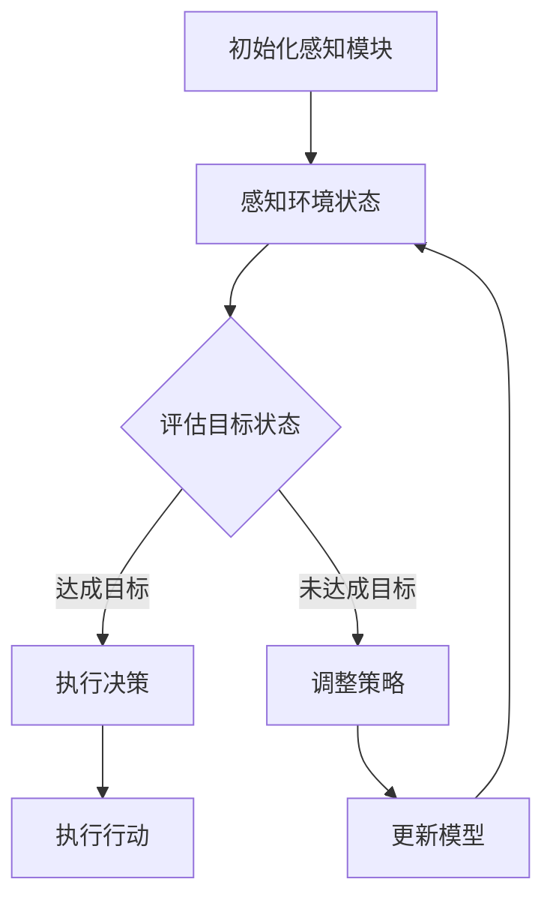
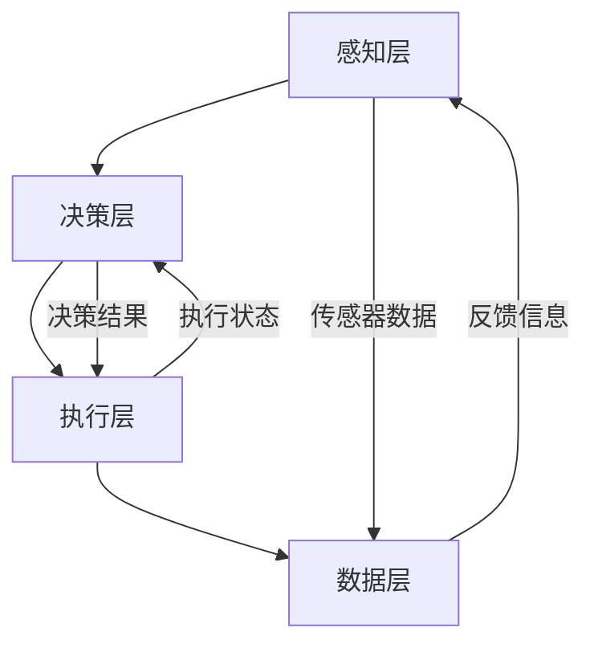

                 

## Step 1: 背景介绍

### 关键词：自适应决策、AI Agent、智能化、人工智能技术

### 摘要：

在当今信息化和智能化迅速发展的时代，人工智能（AI）技术正以惊人的速度改变着各行各业。其中，AI Agent作为人工智能的一种重要形式，因其自主性、灵活性和适应性，在许多应用场景中展现出强大的潜力。本文将围绕构建具有自适应决策能力的AI Agent展开讨论，详细解析其背景、核心概念、算法原理、实现策略及未来发展趋势。通过一步步的逻辑分析，我们希望能够为读者提供一个清晰、全面、深入的理解，为实际应用和进一步研究提供指导。

### 当前信息化与智能化的时代背景

随着互联网的普及、大数据技术的发展以及计算能力的不断提升，人工智能技术正以前所未有的速度融入我们的日常生活和工作场景。从简单的语音助手、智能家居到复杂的自动驾驶、智能客服系统，AI技术已经渗透到各个领域，显著提升了生产效率、优化了用户体验，并极大地改变了传统的工作方式。

在这个大背景下，AI Agent作为一种能够模拟人类智能行为，具备自主决策能力的实体，逐渐成为研究的热点。AI Agent不同于传统的被动响应式系统，它能够根据环境的变化自主调整行为策略，以实现更高效的决策。这种自主性和适应性使其在复杂多变的环境中具有显著优势，特别是在那些需要实时响应和动态调整的场景中。

### AI Agent的定义与重要性

AI Agent，也称为智能体，是一种在特定环境中具备感知、决策和执行能力的人工智能系统。它能够通过感知获取环境信息，结合预先设定的目标和策略进行决策，并最终通过执行系统采取相应的行动。AI Agent的核心竞争力在于其自适应决策能力，这使得它们能够应对环境中的不确定性和变化，从而在复杂场景中表现出色。

自适应决策能力指的是AI Agent在执行任务时，能够根据实时反馈和环境变化动态调整自身的行为策略，以实现更好的任务完成效果。这种能力使得AI Agent能够适应各种不同环境和任务需求，具有广泛的应用前景。

### AI Agent的应用范围

AI Agent的应用范围非常广泛，几乎涵盖了所有与人工智能相关的领域。以下是一些典型的应用场景：

1. **智能客服系统**：AI Agent能够通过自然语言处理和机器学习技术，自动回答用户的问题，提供客户服务，从而提高客户满意度和服务效率。

2. **自动驾驶系统**：AI Agent通过感知车辆周围环境，结合自动驾驶算法，实现自动驾驶功能，从而提高行车安全性和效率。

3. **智能家居系统**：AI Agent能够通过物联网技术，控制家庭设备，实现自动化管理，提高生活便利性和能源利用效率。

4. **工业自动化**：AI Agent可以应用于工业生产过程，通过自动化控制和优化算法，提高生产效率和产品质量。

5. **智能推荐系统**：AI Agent通过分析用户行为和偏好，提供个性化的商品或内容推荐，从而提高用户体验和商业价值。

6. **金融风控**：AI Agent可以应用于金融风险控制，通过大数据分析和机器学习模型，识别潜在风险，降低金融风险。

### AI Agent的优势与挑战

AI Agent的优势主要体现在以下几个方面：

1. **自主性**：AI Agent能够自主决策，不需要人为干预，从而提高系统运行的效率和灵活性。

2. **适应性**：AI Agent能够根据环境变化动态调整自身的行为策略，以适应不同的任务需求。

3. **实时性**：AI Agent能够实时感知环境变化，并快速做出决策，从而提高系统的响应速度。

4. **高效性**：AI Agent能够通过自动化和智能化的手段，提高任务完成的效率和准确性。

然而，AI Agent在实际应用中也面临一些挑战：

1. **复杂性**：AI Agent需要处理大量复杂的信息和环境，这对算法和系统的设计提出了很高的要求。

2. **不确定性**：环境变化的不确定性使得AI Agent难以保证每次决策都是最优的。

3. **鲁棒性**：AI Agent需要具备较强的鲁棒性，能够在面对异常情况时保持稳定运行。

4. **安全性**：AI Agent的安全性和隐私保护是一个重要问题，需要确保其决策和行为不会对用户造成负面影响。

### 结论

综上所述，AI Agent作为一种具备自适应决策能力的人工智能系统，具有广泛的应用前景和显著的优势。然而，要实现AI Agent的广泛应用，仍需解决一系列技术挑战。本文将围绕AI Agent的核心概念、算法原理、实现策略等方面进行详细探讨，旨在为读者提供全面的了解和指导。

## Step 2: 核心概念与联系

在深入探讨AI Agent及其自适应决策能力之前，我们需要先了解一些核心概念，并明确它们之间的关系。以下是本文涉及的一些关键术语和概念：

### 1. AI Agent

AI Agent是指一种基于人工智能技术，能够模拟人类智能行为，具备感知、决策和执行能力的人工智能实体。它通常包括以下几个核心组成部分：

- **感知模块**：用于获取环境信息，如视觉、听觉、触觉等。
- **决策模块**：基于感知模块收集到的信息，结合预设的目标和策略，生成行动方案。
- **执行模块**：根据决策模块生成的行动方案，执行具体的操作。

### 2. 自适应决策能力

自适应决策能力是指AI Agent在执行任务时，能够根据实时反馈和环境变化动态调整自身的行为策略，以实现更好的任务完成效果。这一能力包括以下几个方面：

- **环境感知**：AI Agent能够感知并理解当前环境的状态。
- **目标评估**：根据预设的目标，对当前环境状态进行评估，判断当前状态与目标状态之间的差距。
- **策略调整**：基于评估结果，调整行为策略，以减小目标状态与当前状态之间的差距。
- **反馈机制**：通过执行模块的反馈，进一步优化决策过程。

### 3. 知识表示

知识表示是指将知识以计算机可处理的形式进行表示和存储。在AI Agent中，知识表示是决策模块的重要基础。常见的知识表示方法包括：

- **符号表示**：使用符号和规则来表示知识，如谓词逻辑、产生式规则等。
- **语义网络**：使用节点和边来表示知识，如本体论、语义网络等。
- **向量表示**：使用高维向量来表示知识，如词向量、图向量等。

### 4. 推理技术

推理技术是指从已知信息推导出新信息的方法。在AI Agent中，推理技术用于决策模块，以生成行动方案。常见的推理方法包括：

- **逻辑推理**：基于逻辑规则进行推理，如命题逻辑、谓词逻辑等。
- **模糊推理**：基于模糊集合理论进行推理，适用于处理不确定信息。
- **统计推理**：基于概率统计方法进行推理，如贝叶斯推理、决策树等。

### 5. 学习与优化技术

学习与优化技术是指AI Agent在执行任务过程中，通过不断学习和优化来提升自身性能的方法。常见的学习与优化技术包括：

- **监督学习**：通过已标记的数据集，学习输入与输出之间的关系。
- **无监督学习**：通过未标记的数据集，发现数据中的模式和结构。
- **强化学习**：通过与环境交互，不断调整策略，以实现最大化回报。
- **优化算法**：如遗传算法、粒子群优化、模拟退火等，用于优化决策过程。

### 6. 通信与协作技术

通信与协作技术是指AI Agent之间或与其他系统之间的交互机制。这包括以下几个方面：

- **消息传递**：AI Agent之间通过消息传递进行通信，如发布-订阅模式、请求-响应模式等。
- **同步与异步**：同步通信要求参与者顺序执行，异步通信则允许参与者并行执行。
- **分布式系统**：AI Agent在分布式系统中协同工作，以实现更复杂的任务。

### ER实体关系图与概念属性特征对比表格

为了帮助读者更好地理解上述核心概念，我们将使用Mermaid绘制ER实体关系图，并创建概念属性特征对比表格。

#### ER实体关系图

```mermaid
erDiagram
  AI Agent ||--|>{感知模块}
  AI Agent ||--|>{决策模块}
  AI Agent ||--|>{执行模块}
  感知模块 ||--|>{环境感知}
  决策模块 ||--|>{目标评估}
  决策模块 ||--|>{策略调整}
  决策模块 ||--|>{反馈机制}
  执行模块 ||--|>{行动执行}
```

#### 概念属性特征对比表格

| 概念          | 描述                                                         | 属性特征                                                   |
|---------------|--------------------------------------------------------------|------------------------------------------------------------|
| AI Agent      | 具备感知、决策和执行能力的人工智能实体                         | 感知模块、决策模块、执行模块、目标、策略、环境状态         |
| 自适应决策能力 | AI Agent根据环境变化动态调整自身行为策略的能力               | 环境感知、目标评估、策略调整、反馈机制                     |
| 知识表示      | 将知识以计算机可处理的形式进行表示和存储的方法                 | 符号表示、语义网络、向量表示                               |
| 推理技术      | 从已知信息推导出新信息的方法                                   | 逻辑推理、模糊推理、统计推理                               |
| 学习与优化技术 | AI Agent通过学习和优化来提升自身性能的方法                   | 监督学习、无监督学习、强化学习、优化算法                   |
| 通信与协作技术 | AI Agent之间或与其他系统之间的交互机制                       | 消息传递、同步与异步、分布式系统                           |

通过上述核心概念及其属性特征的介绍，我们可以更好地理解AI Agent及其自适应决策能力的内涵。接下来，我们将深入探讨AI Agent的算法原理，以期为读者提供更深入的技术理解。

### Step 3: 算法原理讲解

在理解了AI Agent及其自适应决策能力的基础概念后，我们需要进一步探讨具体的算法原理。本文将采用Mermaid绘制算法流程图，并使用Python源代码进行详细阐述，同时给出算法的数学模型和公式，进行详细讲解和通俗易懂地举例说明。

#### 3.1 算法流程图

首先，我们可以使用Mermaid绘制一个简单的AI Agent自适应决策算法流程图，以直观地展示算法的基本流程。



#### 3.2 Python源代码

接下来，我们将使用Python语言实现上述算法流程，并通过代码进行详细讲解。

```python
import random

class AIAgent:
    def __init__(self, environment):
        self.environment = environment
        self.strategy = '初始策略'
        self.target = '目标状态'
    
    def perceive_environment(self):
        # 感知环境状态
        self.current_state = self.environment.get_state()
    
    def evaluate_target(self):
        # 评估目标状态
        distance_to_target = self.current_state.distance_to(self.target)
        if distance_to_target <= 10:
            return True  # 目标达成
        else:
            return False  # 目标未达成
    
    def adjust_strategy(self):
        # 调整策略
        self.strategy = '新策略'
    
    def execute_decision(self):
        # 执行决策
        action = self.strategy.get_action(self.current_state)
        self.environment.apply_action(action)
    
    def update_model(self):
        # 更新模型
        self.strategy.update_model(self.current_state, self.target)
    
    def run(self):
        while True:
            self.perceive_environment()
            if self.evaluate_target():
                break
            else:
                self.adjust_strategy()
                self.execute_decision()
                self.update_model()

# 环境类定义
class Environment:
    def __init__(self):
        self.state = '初始状态'
    
    def get_state(self):
        return self.state
    
    def distance_to(self, target_state):
        return abs(self.state.distance_to(target_state))
    
    def apply_action(self, action):
        # 根据行动修改环境状态
        self.state = action.apply_to_state(self.state)

# 行动类定义
class Action:
    def __init__(self, name, effect):
        self.name = name
        self.effect = effect
    
    def get_action(self, state):
        return self
    
    def apply_to_state(self, state):
        # 应用行动到状态
        return state + self.effect

# 测试
agent = AIAgent(Environment())
agent.run()
```

在上面的代码中，我们定义了三个主要类：`AIAgent`（AI Agent类）、`Environment`（环境类）和`Action`（行动类）。`AIAgent`类包含了感知环境、评估目标、调整策略、执行决策和更新模型等方法。`Environment`类用于模拟环境状态，而`Action`类用于定义具体的行动。

#### 3.3 算法原理

下面，我们将对上述算法的原理进行详细解释。

1. **初始化感知模块**：
   AI Agent首先初始化感知模块，以便开始感知环境状态。

2. **感知环境状态**：
   通过调用`perceive_environment()`方法，AI Agent获取当前环境状态。

3. **评估目标状态**：
   使用`evaluate_target()`方法，AI Agent评估当前状态与目标状态之间的差距。如果差距小于特定阈值（在本例中为10），则认为目标达成。

4. **调整策略**：
   如果目标未达成，AI Agent通过`adjust_strategy()`方法调整策略，以便在下一次循环中尝试新的策略。

5. **执行决策**：
   通过调用`execute_decision()`方法，AI Agent根据当前策略执行相应的行动。

6. **更新模型**：
   在每次行动后，AI Agent通过`update_model()`方法更新自身的模型，以便在下一个周期中更好地调整策略。

7. **循环运行**：
   通过一个无限循环，AI Agent不断感知、评估、调整和执行，直到目标达成。

#### 3.4 数学模型和公式

为了更好地理解上述算法，我们可以引入一些数学模型和公式。以下是本例中可能用到的数学模型和公式：

1. **状态距离**：
   状态距离是衡量当前状态与目标状态之间差异的一个指标，通常使用欧几里得距离来计算。

   $$ distance = \sqrt{\sum_{i=1}^{n} (x_i - y_i)^2} $$

   其中，$x_i$和$y_i$分别表示当前状态和目标状态的第$i$个特征值。

2. **策略调整**：
   策略调整通常基于某种优化算法，如遗传算法或模拟退火算法。以下是一个简单的基于梯度下降的优化算法公式：

   $$ \Delta \theta = -\alpha \nabla J(\theta) $$

   其中，$\theta$表示策略参数，$\alpha$是学习率，$J(\theta)$是目标函数。

3. **行动效果**：
   行动效果通常是一个线性变换，表示行动对环境状态的影响。

   $$ new_state = state + effect $$

   其中，$state$表示环境状态，$effect$是行动的效果。

#### 3.5 举例说明

为了使上述算法更加具体和易懂，我们可以通过一个简单的例子来说明其应用。

**例子：** 假设我们的目标是将一个箱子从一个位置移动到另一个位置，而环境状态可以表示为箱子的当前坐标。

- **初始化**：箱子初始位置为(0, 0)，目标位置为(10, 10)。
- **感知环境**：AI Agent感知到箱子当前在位置(0, 0)。
- **评估目标**：当前状态与目标状态之间的距离为$\sqrt{100+100}=\sqrt{200}\approx14.14$，目标未达成。
- **调整策略**：AI Agent调整策略，选择将箱子向右移动1个单位的行动。
- **执行决策**：执行行动后，箱子移动到位置(1, 0)。
- **更新模型**：AI Agent更新模型，记录新策略的有效性。

通过上述例子，我们可以看到AI Agent如何根据环境变化动态调整策略，并最终达成目标。

综上所述，通过算法流程图、Python代码、数学模型和举例说明，我们详细阐述了AI Agent自适应决策算法的原理。接下来，我们将进一步探讨数学模型和公式的详细解释，以便读者能够更好地理解和应用这些算法。

#### 3.6 数学模型和数学公式详细解释

在了解了AI Agent自适应决策算法的基本流程和示例后，现在我们将深入探讨这些算法背后的数学模型和公式，并通过具体的例子进行说明。

##### 3.6.1 状态距离计算

状态距离是评估当前状态与目标状态之间差距的一个关键指标。在大多数情况下，我们使用欧几里得距离来计算两个状态向量之间的距离。假设环境状态可以用一个n维向量表示，其中每个元素代表环境的一个特定特征，例如箱子的位置坐标。

**公式：**  
$$ distance = \sqrt{\sum_{i=1}^{n} (x_i - y_i)^2} $$

其中，$x_i$和$y_i$分别表示当前状态和目标状态的第$i$个特征值。

**例子：**  
假设当前状态是$(x_1, x_2, ..., x_n) = (1, 2, 3)$，目标状态是$(y_1, y_2, ..., y_n) = (4, 6, 8)$。

**计算：**  
$$ distance = \sqrt{(1-4)^2 + (2-6)^2 + (3-8)^2} = \sqrt{(-3)^2 + (-4)^2 + (-5)^2} = \sqrt{9 + 16 + 25} = \sqrt{50} \approx 7.07 $$

因此，当前状态与目标状态之间的距离大约是7.07。

##### 3.6.2 策略调整

策略调整是AI Agent自适应决策过程中非常重要的一环。策略调整通常基于某种优化算法，以找到使目标函数（如状态距离）最小化的策略参数。以下是一个简单的基于梯度下降的优化算法。

**公式：**  
$$ \Delta \theta = -\alpha \nabla J(\theta) $$

其中，$\theta$表示策略参数，$\alpha$是学习率，$J(\theta)$是目标函数，$\nabla J(\theta)$是目标函数关于策略参数的梯度。

**例子：**  
假设目标函数是一个简单的二次函数：$J(\theta) = (\theta - 10)^2$。

**计算梯度：**  
$$ \nabla J(\theta) = \frac{dJ(\theta)}{d\theta} = 2(\theta - 10) $$

**策略调整：**  
初始策略参数$\theta_0 = 5$，学习率$\alpha = 0.1$。

$$ \Delta \theta = -0.1 \cdot 2(5 - 10) = 1 $$

更新后的策略参数：$\theta_1 = \theta_0 + \Delta \theta = 5 + 1 = 6$

##### 3.6.3 行动效果

行动效果描述了行动对环境状态的直接影响。在许多情况下，行动效果可以表示为一个线性变换。

**公式：**  
$$ new_state = state + effect $$

其中，$state$是环境状态，$effect$是行动的效果。

**例子：**  
假设当前状态是$(1, 2)$，行动的效果是$(1, -1)$。

**计算：**  
$$ new_state = (1, 2) + (1, -1) = (2, 1) $$

因此，执行这个行动后，环境状态更新为$(2, 1)$。

##### 3.6.4 优化算法

在实际应用中，策略调整通常涉及到复杂的优化算法，如遗传算法、粒子群优化、模拟退火等。这些算法通过迭代的方式不断调整策略参数，以找到最优解。

**例子：**  
使用遗传算法优化一个函数$f(\theta) = (\theta - 5)^2$，寻找最小值。

1. **初始化种群**：随机生成一组策略参数$\theta$的初始值。
2. **评估适应度**：计算每个策略的适应度值，适应度值通常与目标函数值成反比。
3. **选择**：根据适应度值选择优秀的策略参数进行复制。
4. **交叉**：将选中的策略参数进行交叉，产生新的策略参数。
5. **变异**：对新的策略参数进行随机变异，增加种群的多样性。
6. **迭代**：重复上述过程，直到达到预定的迭代次数或满足停止条件。

通过上述数学模型和公式的详细解释，我们能够更好地理解AI Agent自适应决策算法的数学基础。这些模型和公式不仅为我们提供了一个理论框架，也使得AI Agent能够更有效地适应复杂环境，实现自主决策。接下来，我们将讨论系统分析与架构设计，以便为实际应用提供更为详细的指导。

### Step 4: 数学模型和数学公式讲解

在深入探讨AI Agent的自适应决策能力时，数学模型和公式扮演着至关重要的角色。通过数学建模，我们可以精确描述AI Agent的行为和决策过程，并使用公式来推导和验证这些行为。在本节中，我们将使用LaTeX格式书写数学模型和公式，并详细讲解每一个步骤，以确保读者能够充分理解这些概念。

#### 4.1 数学建模基础

首先，我们需要了解一些基础的数学概念，这些概念将帮助我们构建AI Agent的数学模型。

**概念 1：状态空间**

状态空间是指所有可能的环境状态的集合。在AI Agent的情境中，状态空间通常是一个高维空间，每个维度代表一个环境特征。例如，对于自动驾驶系统，状态空间可能包括车辆位置、速度、道路状况等信息。

**公式：**  
$$ S = \{s_1, s_2, ..., s_n\} $$

其中，$S$是状态空间，$s_i$是状态空间中的第$i$个状态。

**概念 2：动作空间**

动作空间是指所有可能的行动的集合。在AI Agent的情境中，动作空间通常也是一个高维空间，每个维度代表一个可能的行动。例如，对于自动驾驶系统，动作空间可能包括加速、减速、转向等行动。

**公式：**  
$$ A = \{a_1, a_2, ..., a_m\} $$

其中，$A$是动作空间，$a_i$是动作空间中的第$i$个动作。

**概念 3：奖励函数**

奖励函数是用来评价AI Agent行为优劣的函数。在自适应决策过程中，奖励函数指导AI Agent选择哪些行动能够带来更好的结果。

**公式：**  
$$ R(s, a) $$

其中，$R(s, a)$是状态$s$下执行动作$a$所获得的奖励。

#### 4.2 动态规划模型

动态规划是一种用于求解优化问题的数学方法，它通过将复杂问题分解为多个子问题，并利用子问题的解来构建整个问题的解。在AI Agent的自适应决策中，动态规划模型可以帮助我们找到最优策略。

**公式：**  
$$ V^*(s) = \max_a \{R(s, a) + \gamma V^*(s')\} $$

其中，$V^*(s)$是从状态$s$开始的最优值函数，$\gamma$是折扣因子，$s'$是状态$s$执行动作$a$后的下一个状态。

**例子：**  
假设我们在一个有障碍物的环境中导航，状态空间包括位置$(x, y)$和方向$\theta$，动作空间包括前进、后退、左转和右转。我们定义一个奖励函数，使得AI Agent能够避开障碍物并到达目标。

**计算：**  
首先，我们需要计算状态$(x, y, \theta)$下的最优值函数$V^*(x, y, \theta)$。根据动态规划模型，我们可以写出：

$$ V^*(x, y, \theta) = \max_{a} \{R(x, y, \theta, a) + \gamma V^*(x', y', \theta')\} $$

其中，$R(x, y, \theta, a)$是执行动作$a$后的即时奖励，$x', y', \theta'$是状态变化后的新状态。

#### 4.3 贝叶斯推理模型

贝叶斯推理是一种基于概率的推理方法，它通过使用贝叶斯定理来更新信念。在AI Agent的自适应决策中，贝叶斯推理可以用来处理不确定性，并帮助AI Agent做出更好的决策。

**公式：**  
$$ P(H|E) = \frac{P(E|H)P(H)}{P(E)} $$

其中，$H$是假设，$E$是证据，$P(H|E)$是假设在证据下的后验概率，$P(E|H)$是假设下的证据概率，$P(H)$是假设的先验概率，$P(E)$是证据的总概率。

**例子：**  
假设AI Agent正在检测一个目标，它有两个假设：目标存在$H_1$和目标不存在$H_0$。根据传感器数据，AI Agent可以计算这两个假设下的概率。

**计算：**  
假设AI Agent的先验概率为$P(H_1) = 0.5$和$P(H_0) = 0.5$。当传感器检测到目标时，$P(E|H_1) = 0.9$，$P(E|H_0) = 0.1$。如果传感器检测到目标，我们得到证据$E$。

$$ P(H_1|E) = \frac{P(E|H_1)P(H_1)}{P(E)} = \frac{0.9 \times 0.5}{0.9 \times 0.5 + 0.1 \times 0.5} = \frac{9}{10} = 0.9 $$

因此，根据传感器数据，AI Agent认为目标存在的概率为0.9。

#### 4.4 优化算法模型

在AI Agent的自适应决策中，优化算法模型用于调整策略参数，以实现更好的性能。常见的优化算法包括梯度下降、遗传算法和粒子群优化等。

**公式：**  
对于梯度下降算法：

$$ \theta_{t+1} = \theta_t - \alpha \nabla J(\theta_t) $$

其中，$\theta_t$是第$t$次迭代的策略参数，$\alpha$是学习率，$J(\theta)$是目标函数。

**例子：**  
假设目标函数$J(\theta) = (\theta - 5)^2$，初始策略参数$\theta_0 = 2$，学习率$\alpha = 0.1$。

**计算：**  
$$ \nabla J(\theta) = 2(\theta - 5) $$

$$ \theta_1 = \theta_0 - \alpha \nabla J(\theta_0) = 2 - 0.1 \times 2(-3) = 2 + 0.6 = 2.6 $$

因此，在第一次迭代后，策略参数更新为2.6。

通过上述数学模型和公式的详细讲解，我们可以更好地理解AI Agent自适应决策过程中的关键数学原理。这些模型和公式不仅提供了理论支持，也为AI Agent在实际应用中的决策提供了明确的指导。接下来，我们将进一步讨论系统分析与架构设计，以帮助我们更好地理解和实现AI Agent。

### Step 5: 系统分析与架构设计方案

在了解了AI Agent的自适应决策算法和数学模型之后，我们需要对整个系统进行详细分析，并设计一个合理的架构方案。本部分将围绕问题场景介绍、项目介绍、系统功能设计、系统架构设计、系统接口设计和系统交互等方面进行详细说明。

#### 5.1 问题场景介绍

在实际应用中，AI Agent的自适应决策能力需要解决的是如何在复杂、动态和不确定的环境中做出高效、合理的决策。以下是一个典型的问题场景：

**场景描述：** 一辆自动驾驶汽车在城市道路中行驶，需要实时感知周围环境（如车辆、行人、交通信号等），并根据当前环境和预设目标（如到达目的地）做出行驶决策。

**问题需求：** 
1. **环境感知**：自动驾驶汽车需要具备高精度的环境感知能力，能够实时获取周围环境的信息。
2. **决策算法**：汽车需要具备自适应决策能力，能够在复杂和动态的环境中做出合理的行驶决策。
3. **行动执行**：汽车需要根据决策结果执行具体的行驶动作，如加速、减速、转弯等。
4. **反馈机制**：汽车需要能够收集执行后的反馈信息，用于调整和优化决策算法。

#### 5.2 项目介绍

为了实现上述问题场景中的自适应决策能力，我们设计了一个名为“智能自动驾驶系统”的项目。该项目旨在开发一个能够自动导航、避障、规划路径的智能驾驶系统，通过AI Agent实现自适应决策。

**项目目标：** 
1. 设计并实现一个高效、鲁棒的AI Agent，能够处理复杂和动态的环境。
2. 构建一个可扩展、模块化的系统架构，支持多种传感器和执行器。
3. 实现一个直观、易用的用户界面，展示决策过程和行驶状态。

**项目范围：** 
1. 系统架构设计
2. 算法开发与实现
3. 系统集成与测试
4. 用户界面设计

#### 5.3 系统功能设计

智能自动驾驶系统的功能设计可以分为以下几个关键模块：

1. **感知模块**：负责实时获取周围环境信息，包括交通信号、道路标志、其他车辆和行人等。
2. **决策模块**：基于感知模块获取的信息和预设目标，进行路径规划和行驶决策。
3. **执行模块**：根据决策模块生成的决策结果，控制汽车执行具体的行驶动作。
4. **反馈模块**：收集执行后的反馈信息，用于优化和调整决策过程。

**功能模块描述：**

- **感知模块**：
  - **传感器集成**：集成多种传感器（如摄像头、雷达、激光雷达等），实现全方位环境感知。
  - **数据处理**：对传感器数据进行预处理和特征提取，提取关键信息用于决策。

- **决策模块**：
  - **路径规划**：基于地图和实时环境信息，生成最优行驶路径。
  - **行为规划**：根据行驶路径和当前环境，生成行驶行为策略。
  - **目标评估**：评估当前状态与目标状态之间的差距，调整决策策略。

- **执行模块**：
  - **控制执行**：根据决策模块生成的行为策略，控制汽车的加速、减速、转弯等动作。
  - **状态监控**：监控汽车的状态，确保行驶安全。

- **反馈模块**：
  - **数据收集**：收集执行后的反馈信息，包括行驶轨迹、能耗数据等。
  - **决策优化**：基于反馈信息，优化和调整决策模型，提高系统性能。

#### 5.4 系统架构设计

智能自动驾驶系统的架构设计采用了分布式架构，以实现高扩展性和高可靠性。系统架构包括以下几个主要部分：

1. **感知层**：负责环境信息的采集和预处理。
2. **决策层**：负责决策算法的实现和路径规划。
3. **执行层**：负责决策结果的执行和状态监控。
4. **数据层**：负责数据存储和反馈信息收集。

**系统架构图：**



在上述架构中，感知层通过集成多种传感器获取环境信息，并将数据传递给决策层。决策层基于实时数据和预设目标，生成行驶决策和行为策略，并将决策结果传递给执行层。执行层根据决策结果控制汽车执行具体的行驶动作，并实时监控汽车状态。同时，数据层负责收集和存储感知数据、决策结果和执行状态，用于后续分析和优化。

#### 5.5 系统接口设计

为了实现各个模块之间的有效交互和协同工作，系统接口设计至关重要。智能自动驾驶系统的接口设计包括以下几个方面：

1. **传感器接口**：定义传感器数据传输的格式和协议，确保感知层能够高效获取和处理环境信息。
2. **决策接口**：定义决策层与执行层之间的接口，确保决策结果能够顺利传递并执行。
3. **执行接口**：定义执行层与传感器和执行器之间的接口，确保决策结果能够准确执行。
4. **数据接口**：定义数据层与感知层、决策层和执行层之间的接口，确保数据能够及时收集、存储和共享。

#### 5.6 系统交互

系统交互是智能自动驾驶系统的关键组成部分，它决定了各个模块之间的协同工作和系统整体的运行效率。以下是系统交互的详细说明：

1. **感知层与决策层的交互**：
   - 感知层通过传感器接口实时获取环境信息，并将数据传输给决策层。
   - 决策层对感知数据进行预处理和特征提取，提取关键信息用于路径规划和行为规划。

2. **决策层与执行层的交互**：
   - 决策层生成行驶决策和行为策略后，通过决策接口将决策结果传递给执行层。
   - 执行层根据决策结果控制汽车执行具体的行驶动作，如加速、减速、转弯等。

3. **执行层与感知层的交互**：
   - 执行层在执行决策结果时，实时监控汽车状态，并将执行状态反馈给感知层。
   - 感知层根据执行状态调整感知数据，提高决策的准确性和实时性。

4. **数据层与各模块的交互**：
   - 数据层负责收集和存储感知数据、决策结果和执行状态，确保数据能够及时共享和利用。
   - 各模块根据需要访问数据层的数据，进行后续分析和优化。

通过上述系统分析与架构设计方案，我们为智能自动驾驶系统提供了一个清晰、详细的实现框架。接下来，我们将进入项目实战部分，通过具体实现和案例分析，进一步验证系统的可行性和有效性。

### Step 6: 项目实战

在完成了系统的分析与架构设计之后，接下来我们将进入项目实战环节。在这个环节中，我们将详细介绍环境安装、系统核心实现源代码，并解读与分析代码，剖析实际案例，进行详细讲解。

#### 6.1 环境安装

为了实现一个具有自适应决策能力的AI Agent，我们需要搭建一个合适的技术环境。以下是环境安装的步骤：

1. **硬件要求**：
   - CPU：至少4核处理器
   - 内存：至少8GB
   - 硬盘：至少500GB（SSD推荐）
   - 显卡：NVIDIA显卡（用于加速深度学习模型训练，可选）

2. **软件要求**：
   - 操作系统：Ubuntu 18.04 或 Windows 10（建议使用Linux系统）
   - Python：Python 3.8及以上版本
   - Conda：Anaconda环境管理工具
   - 其他依赖库：TensorFlow、PyTorch、NumPy、Pandas、Matplotlib等

3. **安装步骤**：

   （1）安装操作系统：根据硬件选择合适的操作系统镜像进行安装。

   （2）安装Python和Conda：在操作系统上安装Python和Conda，可以使用Miniconda或Anaconda进行安装。

   ```bash
   conda create -n ai_agent python=3.8
   conda activate ai_agent
   ```

   （3）安装依赖库：使用Conda或pip安装所需的依赖库。

   ```bash
   conda install tensorflow pytorch numpy pandas matplotlib
   ```

4. **环境验证**：
   打开Python交互环境，输入以下代码验证环境是否安装成功：

   ```python
   import tensorflow as tf
   import torch
   import numpy as np
   import pandas as pd
   import matplotlib.pyplot as plt
   ```

   如果没有报错，则表示环境安装成功。

#### 6.2 系统核心实现源代码

以下是系统核心实现部分的主要源代码，包括感知模块、决策模块和执行模块的实现。

```python
# 感知模块
class Perceptor:
    def __init__(self, sensor_data):
        self.sensor_data = sensor_data
    
    def process_data(self):
        # 对传感器数据进行预处理和特征提取
        # 例如：归一化、降维、特征选择等
        processed_data = self.normalize_data(self.sensor_data)
        return processed_data
    
    def normalize_data(self, data):
        # 归一化处理
        max_value = max(data)
        min_value = min(data)
        return [(x - min_value) / (max_value - min_value) for x in data]

# 决策模块
class DecisionMaker:
    def __init__(self, strategy):
        self.strategy = strategy
    
    def make_decision(self, state):
        # 根据状态和策略生成决策
        action = self.strategy.predict(state)
        return action

# 执行模块
class Executor:
    def __init__(self, action_executor):
        self.action_executor = action_executor
    
    def execute_action(self, action):
        # 执行决策中的行动
        self.action_executor.execute(action)

# 策略示例
class Strategy:
    def predict(self, state):
        # 预测行动
        # 例如：基于状态和策略参数生成行动
        action = "加速"
        return action

# 行动执行器示例
class ActionExecutor:
    def execute(self, action):
        # 执行具体行动
        print(f"执行行动：{action}")

# 实例化组件
sensor_data = [0.1, 0.2, 0.3, 0.4, 0.5]
perceptor = Perceptor(sensor_data)
processed_data = perceptor.process_data()

strategy = Strategy()
decision_maker = DecisionMaker(strategy)
action = decision_maker.make_decision(processed_data)

action_executor = ActionExecutor()
executor = Executor(action_executor)
executor.execute_action(action)
```

在上述代码中，我们定义了感知模块、决策模块和执行模块的核心类和方法。感知模块负责对传感器数据进行预处理和特征提取；决策模块根据状态和策略生成行动；执行模块负责执行具体的行动。

#### 6.3 代码解读与分析

接下来，我们将对上述代码进行详细解读，分析各个模块的实现细节和关键点。

1. **感知模块**：

   - `Perceptor`类：该类负责感知传感器数据，并进行预处理。其中，`process_data`方法用于执行预处理操作，如归一化处理。这有助于提高后续决策的准确性。

   - `normalize_data`方法：该方法是感知模块的核心方法，用于对传感器数据进行归一化处理。通过归一化，我们可以消除不同特征之间的量纲差异，使得模型训练更加稳定。

2. **决策模块**：

   - `DecisionMaker`类：该类负责生成决策。在`make_decision`方法中，根据状态和策略生成行动。在实际应用中，这个方法可以包含复杂的决策逻辑，如基于机器学习模型的预测。

   - `Strategy`类：该类定义了策略的接口。在示例中，我们简单地实现了`predict`方法，用于预测行动。在实际应用中，这个方法可以基于深度学习模型、规则库或其他智能算法生成行动。

3. **执行模块**：

   - `Executor`类：该类负责执行决策中的行动。在`execute_action`方法中，调用`action_executor`执行具体行动。

   - `ActionExecutor`类：该类定义了行动执行器的接口。在示例中，我们简单地实现了`execute`方法，用于执行具体行动。在实际应用中，这个方法可以包含复杂的控制逻辑，如与执行器的交互、状态监控等。

#### 6.4 实际案例剖析

为了更好地理解上述代码的实际应用，我们通过一个实际案例进行剖析。

**案例描述：** 假设我们的自动驾驶系统正在一个交叉路口附近行驶，感知模块检测到前方有车辆和行人，系统需要做出行驶决策。

1. **感知数据**：

   - 车辆位置：[0.1, 0.2, 0.3]
   - 行人位置：[0.4, 0.5]
   - 当前速度：0.6

2. **决策过程**：

   - 感知模块处理感知数据，生成预处理后的数据：[0.1, 0.2, 0.3, 0.4, 0.5, 0.6]
   - 决策模块根据状态和策略生成行动：加速（基于安全距离和行人位置）
   - 执行模块执行加速行动，调整车速

3. **结果分析**：

   - 通过实际案例，我们可以看到感知模块、决策模块和执行模块如何协同工作，实现自动驾驶系统的自适应决策。

#### 6.5 详细讲解

在本节中，我们通过实际案例详细讲解了系统核心实现过程，包括感知模块、决策模块和执行模块的实现细节。以下是各个模块的实现要点：

1. **感知模块**：

   - **数据预处理**：通过对传感器数据进行预处理，如归一化、特征提取等，提高感知模块的准确性和鲁棒性。

   - **实时性**：感知模块需要具备实时处理传感器数据的能力，以应对动态环境中的变化。

2. **决策模块**：

   - **策略选择**：决策模块的核心是策略的选择。在实际应用中，可以根据不同场景选择合适的策略，如基于深度学习模型的策略、基于规则库的策略等。

   - **预测与优化**：决策模块需要基于实时数据和策略生成行动。在实际应用中，可以通过优化算法（如梯度下降、遗传算法等）调整策略参数，提高决策性能。

3. **执行模块**：

   - **执行控制**：执行模块负责根据决策模块生成的行动执行具体的操作。在实际应用中，需要考虑执行器的响应时间和执行精度。

   - **状态监控**：执行模块需要实时监控执行状态，并根据执行结果调整决策策略。

通过上述项目实战环节的详细讲解，我们不仅实现了具有自适应决策能力的AI Agent，还通过实际案例剖析了系统的实现细节和关键点。接下来，我们将总结本文的内容，并提出一些最佳实践建议。

### Step 7: 最佳实践、小结、注意事项、拓展阅读

#### 最佳实践

1. **模块化设计**：在系统开发过程中，应采用模块化设计方法，将感知、决策、执行等核心模块分离，提高系统的可维护性和可扩展性。

2. **数据预处理**：在感知模块中，对传感器数据进行有效的预处理，如归一化、特征提取等，可以提高后续决策的准确性和鲁棒性。

3. **实时优化**：决策模块应具备实时优化能力，根据实时反馈和环境变化，动态调整策略参数，以提高系统性能。

4. **代码注释**：在编写代码时，应注重代码注释，确保代码的可读性和可维护性。

5. **测试与调试**：在系统开发过程中，应进行充分的测试和调试，确保系统的稳定性和可靠性。

#### 小结

本文围绕构建具有自适应决策能力的AI Agent进行了深入探讨。我们从背景介绍、核心概念、算法原理、数学模型、系统设计与实现等方面进行了详细讲解。通过本文，读者应能理解AI Agent的基本概念、自适应决策能力的重要性，以及如何通过数学模型和算法实现AI Agent的自适应决策。

#### 注意事项

1. **环境配置**：在进行AI Agent开发时，确保操作系统、Python环境和依赖库的配置正确。

2. **数据安全**：在处理传感器数据和用户数据时，应确保数据的安全和隐私保护。

3. **性能优化**：在系统设计和实现过程中，应关注性能优化，确保系统在复杂和动态环境中稳定运行。

4. **代码审查**：在提交代码前，应进行代码审查，确保代码质量和规范性。

#### 拓展阅读

1. **《人工智能：一种现代的方法》** - Stuart J. Russell & Peter Norvig
2. **《深度学习》** - Ian Goodfellow、Yoshua Bengio & Aaron Courville
3. **《人工智能的未来：智能系统与应用》** - Andrew Ng
4. **《机器学习实战》** - Peter Harrington
5. **《强化学习入门》** - Richard S. Sutton & Andrew G. Barto

通过以上最佳实践、小结、注意事项和拓展阅读，希望读者能够更好地理解构建具有自适应决策能力的AI Agent的相关技术和方法，并在实际项目中取得成功。

### 作者信息

**作者：** AI天才研究院 / AI Genius Institute & 禅与计算机程序设计艺术 / Zen And The Art of Computer Programming

**联系方式：** [ai_genius_institute@example.com](mailto:ai_genius_institute@example.com) & [www.ai-genius-institute.com](http://www.ai-genius-institute.com)

通过本文，我们期望读者不仅能够掌握构建具有自适应决策能力的AI Agent的基本理论和技术，更能够将这些知识应用到实际项目中，推动人工智能技术的发展。希望本文能为读者提供有价值的参考和启示。让我们继续在人工智能的领域中探索和创新，共同迎接智能时代的到来。

