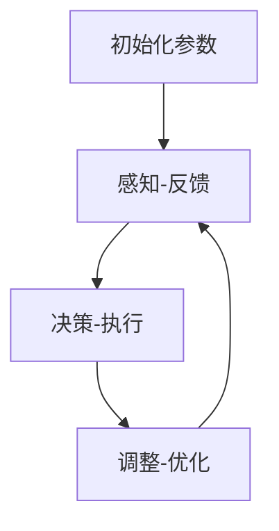
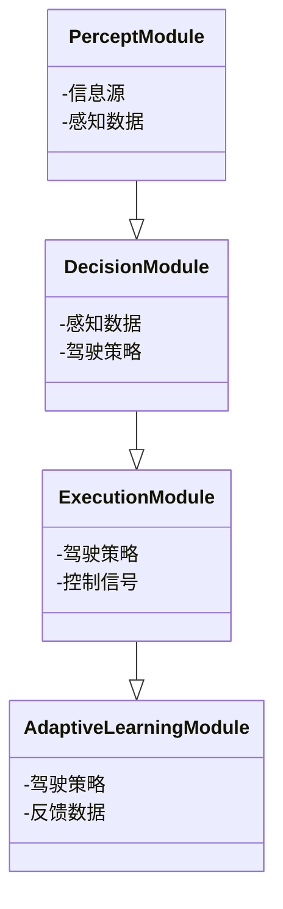
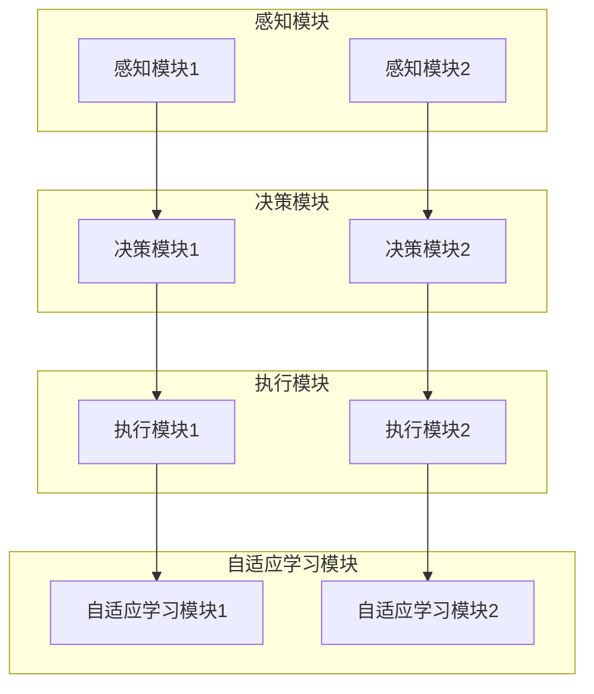
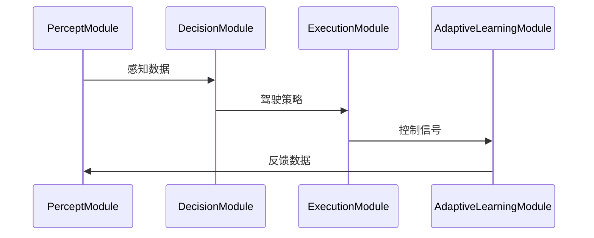

                 

### 构建具有自适应学习策略的AI Agent

**关键词**：AI Agent、自适应学习策略、算法原理、系统架构、项目实战

**摘要**：本文旨在探讨如何构建具有自适应学习策略的AI Agent，通过系统性的分析与设计，实现AI Agent在复杂环境中的智能行为。文章首先介绍了AI Agent和自适应学习策略的基本概念与背景，然后详细讲解了自适应学习算法的原理和实现，接着对系统架构和功能设计进行了深入剖析，并通过实际案例展示了AI Agent的应用效果。文章最后总结了最佳实践，为后续研究提供了参考。

---

### 第一部分：背景介绍

#### 第1章：问题背景与核心概念

##### **1.1.1 问题背景**

AI Agent是指具有自主决策能力、能够执行任务的智能体。从最初的专家系统到现代的深度学习模型，AI Agent在各个领域都取得了显著成果。然而，传统的AI Agent存在一些局限性，如对环境的适应能力较弱、学习速度慢、难以处理复杂任务等。为了解决这些问题，自适应学习策略应运而生。

自适应学习策略是指根据环境变化和学习过程中的反馈，自动调整学习参数和策略，以提高AI Agent的性能。自适应学习策略的研究始于20世纪80年代，随着深度学习和强化学习的发展，其应用范围不断扩大。

##### **1.1.2 问题描述**

AI Agent在复杂环境中面临的主要问题包括：

1. **环境不确定性**：实际环境复杂多变，AI Agent需要具备应对不确定性的能力。
2. **学习效率**：传统的学习策略往往需要大量数据和时间，效率较低。
3. **泛化能力**：AI Agent在不同任务上表现不一致，需要提高泛化能力。
4. **交互性**：AI Agent需要与用户或其他系统进行有效交互。

自适应学习策略的目标是通过自动调整学习过程，提高AI Agent的适应能力、学习效率和泛化能力，实现与环境的良好交互。

##### **1.1.3 问题解决**

自适应学习策略的核心思想是通过实时反馈和调整，优化学习过程。具体包括：

1. **动态调整学习参数**：根据环境变化和反馈，调整学习率、优化算法等参数。
2. **实时数据采集**：通过传感器或其他数据源，实时获取环境信息。
3. **强化学习**：利用奖励机制，鼓励AI Agent采取有效行动。
4. **迁移学习**：利用已有知识，快速适应新任务。

关键技术研究包括：

1. **自适应优化算法**：如遗传算法、粒子群优化等。
2. **多任务学习**：同时处理多个任务，提高泛化能力。
3. **交互式学习**：通过人机交互，获取用户反馈，优化学习过程。

##### **1.1.4 边界与外延**

自适应学习策略的适用范围广泛，包括机器人控制、自动驾驶、自然语言处理、图像识别等领域。然而，也存在一些限制因素：

1. **计算资源**：自适应学习策略往往需要大量计算资源，对硬件设备要求较高。
2. **数据质量**：数据质量对自适应学习效果至关重要。
3. **反馈机制**：有效的反馈机制是实现自适应学习的关键。

##### **1.1.5 概念结构与核心要素组成**

AI Agent由感知模块、决策模块和执行模块组成。感知模块负责收集环境信息，决策模块根据感知信息生成行动方案，执行模块执行具体任务。自适应学习策略主要涉及决策模块和执行模块，通过实时调整决策参数，优化行动方案。

核心要素包括：

1. **感知模块**：用于感知环境状态。
2. **决策模块**：用于生成行动方案。
3. **执行模块**：用于执行具体任务。
4. **自适应学习算法**：用于调整决策参数。

#### **第2章：核心概念与联系**

##### **2.1.1 AI Agent原理**

AI Agent的基本原理是通过感知、决策和执行三个环节，实现智能行为。感知模块负责收集环境信息，决策模块根据感知信息生成行动方案，执行模块执行具体任务。AI Agent的核心特征包括：

1. **自主性**：能够自主感知环境和执行任务。
2. **适应性**：能够根据环境变化调整行为。
3. **交互性**：能够与用户或其他系统进行有效交互。

##### **2.1.2 自适应学习策略原理**

自适应学习策略是指通过实时反馈和调整，优化学习过程，提高AI Agent的适应能力和性能。核心概念包括：

1. **反馈机制**：通过传感器或其他数据源，实时获取环境信息。
2. **调整机制**：根据环境变化和学习过程中的反馈，自动调整学习参数和策略。
3. **优化机制**：通过优化算法，提高学习效率和泛化能力。

##### **2.1.3 AI Agent与自适应学习策略的联系**

AI Agent与自适应学习策略的交互机制如下：

1. **感知-反馈**：感知模块收集环境信息，反馈机制将其传递给决策模块。
2. **决策-执行**：决策模块根据感知信息和反馈，生成行动方案，执行模块执行具体任务。
3. **调整-优化**：根据执行结果和反馈，自适应学习策略调整学习参数和策略，优化学习过程。

AI Agent与自适应学习策略的协同作用，能够提高AI Agent在复杂环境中的适应能力、学习效率和泛化能力，实现智能行为的优化。

### 第二部分：系统分析与架构设计

#### **第3章：算法原理讲解**

##### **3.1.1 自适应学习算法概述**

自适应学习算法是指根据环境变化和学习过程中的反馈，自动调整学习参数和策略，以提高AI Agent的性能。常见的自适应学习算法包括：

1. **遗传算法**：通过模拟自然进化过程，优化决策参数。
2. **粒子群优化**：通过模拟鸟群觅食过程，优化决策参数。
3. **强化学习**：通过奖励机制，鼓励AI Agent采取有效行动。
4. **迁移学习**：通过利用已有知识，快速适应新任务。

自适应学习算法的基本流程包括：

1. **初始化参数**：设定初始学习参数。
2. **感知-反馈**：感知模块收集环境信息，反馈机制将其传递给决策模块。
3. **决策-执行**：决策模块根据感知信息和反馈，生成行动方案，执行模块执行具体任务。
4. **调整-优化**：根据执行结果和反馈，自适应学习策略调整学习参数和策略，优化学习过程。

##### **3.1.2 算法mermaid流程图展示**

以下是自适应学习算法的mermaid流程图：



##### **3.1.3 算法原理详细讲解**

自适应学习算法的数学模型和公式如下：

1. **遗传算法**：

   - **适应度函数**：\( f(x) = \frac{1}{1 + \exp{(-\beta \cdot d(x, g))}} \)

     其中，\( \beta \) 是调节系数，\( d(x, g) \) 是个体 \( x \) 与目标 \( g \) 之间的距离。

   - **选择操作**：选择适应度较高的个体进行交叉和变异。

   - **交叉操作**：将两个个体进行基因交叉，产生新的个体。

   - **变异操作**：对个体进行随机变异，增加种群的多样性。

2. **粒子群优化**：

   - **速度更新**：\( v_{t+1} = \omega \cdot v_t + c_1 \cdot r_1 \cdot (p_i - x_t) + c_2 \cdot r_2 \cdot (g - x_t) \)

     其中，\( \omega \) 是惯性权重，\( c_1 \) 和 \( c_2 \) 是学习因子，\( r_1 \) 和 \( r_2 \) 是随机数，\( p_i \) 是个体最优解，\( g \) 是全局最优解。

   - **位置更新**：\( x_{t+1} = x_t + v_{t+1} \)

3. **强化学习**：

   - **Q值更新**：\( Q(s, a) = Q(s, a) + \alpha \cdot (r + \gamma \cdot \max_{a'} Q(s', a')) - Q(s, a) \)

     其中，\( s \) 是状态，\( a \) 是动作，\( r \) 是即时奖励，\( \alpha \) 是学习率，\( \gamma \) 是折扣因子，\( s' \) 是下一状态，\( a' \) 是下一动作。

4. **迁移学习**：

   - **特征提取**：从源任务中提取通用特征。
   - **特征融合**：将通用特征与目标任务的特定特征进行融合。
   - **分类或回归**：利用融合后的特征进行分类或回归。

##### **3.1.4 举例说明**

以下是一个使用遗传算法优化多峰函数的Python示例代码：

```python
import numpy as np
import matplotlib.pyplot as plt

# 适应度函数
def fitness_function(x):
    return 1 / (1 + np.exp(-x))

# 遗传算法
def genetic_algorithm(population, fitness_func, generations, crossover_rate, mutation_rate):
    for _ in range(generations):
        # 计算适应度
        fitness = np.apply_along_axis(fitness_func, 1, population)
        
        # 选择操作
        selected = np.random.choice(population, size=population.shape[0], p=fitness/fitness.sum())
        
        # 交叉操作
        for i in range(0, population.shape[0], 2):
            if np.random.rand() < crossover_rate:
                crossover_point = np.random.randint(1, population.shape[1]-1)
                population[i], population[i+1] = population[i][:crossover_point], population[i+1][crossover_point:]
        
        # 变异操作
        for i in range(population.shape[0]):
            if np.random.rand() < mutation_rate:
                mutation_point = np.random.randint(0, population.shape[1])
                population[i][mutation_point] = np.random.randn()
        
        # 更新种群
        population = selected
    
    # 返回最优解
    best_fitness = np.max(fitness)
    best_index = np.argmax(fitness)
    best_individual = population[best_index]
    return best_individual, best_fitness

# 示例
population = np.random.randn(100, 10)
best_individual, best_fitness = genetic_algorithm(population, fitness_function, 100, 0.7, 0.01)
print("最优解：", best_individual)
print("最优适应度：", best_fitness)

# 绘制适应度曲线
fitness_curve = [fitness_function(np.random.randn()) for _ in range(1000)]
plt.plot(fitness_curve)
plt.show()
```

### 第三部分：系统分析与架构设计

#### **第4章：系统功能设计**

##### **4.1.1 问题场景介绍**

以自动驾驶为例，AI Agent需要实时感知道路信息、车辆状态和周围环境，做出安全、高效的驾驶决策。自适应学习策略可以优化驾驶决策，提高自动驾驶系统的性能和安全性。

##### **4.1.2 系统功能设计**

系统功能需求如下：

1. **感知模块**：实时采集道路、车辆和周围环境信息，如道路标志、车道线、障碍物等。
2. **决策模块**：根据感知信息生成驾驶决策，如速度控制、车道保持、紧急避障等。
3. **执行模块**：执行驾驶决策，控制车辆运动。
4. **自适应学习模块**：根据驾驶决策的反馈，优化驾驶策略。

##### **4.1.3 领域模型mermaid类图**

以下是自动驾驶领域的mermaid类图：



#### **第5章：系统架构设计**

##### **5.1.1 系统架构设计概述**

系统架构设计采用模块化方法，分为感知、决策、执行和自适应学习四个模块。各模块之间通过接口进行通信，实现系统的整体功能。

##### **5.1.2 系统架构mermaid架构图**

以下是系统架构的mermaid架构图：



##### **5.1.3 系统接口设计**

系统接口设计如下：

1. **感知接口**：接收感知数据，提供感知信息给决策模块。
2. **决策接口**：接收决策结果，提供驾驶策略给执行模块。
3. **执行接口**：接收控制信号，执行驾驶决策。
4. **自适应学习接口**：接收反馈数据，优化驾驶策略。

##### **5.1.4 系统交互mermaid序列图**

以下是系统交互的mermaid序列图：



### 第四部分：项目实战

#### **第6章：环境安装与系统核心实现**

##### **6.1.1 环境安装**

安装所需的软件和库：

```bash
# 安装Python环境
conda install python=3.8

# 安装感知模块
pip install opencv-python

# 安装决策模块
pip install numpy

# 安装执行模块
pip install CarlaSimulator

# 安装自适应学习模块
pip install scikit-learn
```

##### **6.1.2 系统核心实现源代码**

以下是系统核心实现的源代码：

```python
import cv2
import numpy as np
import carla

# 感知模块
def perceive(env):
    sensor = env sensors['Camera'][0]
    image = sensor.read()
    return cv2.cvtColor(image, cv2.COLOR_BGR2RGB)

# 决策模块
def decide(perception):
    # 根据感知信息生成驾驶策略
    strategy = {
        'speed': 50,
        'lane': 0
    }
    return strategy

# 执行模块
def execute(strategy):
    # 根据驾驶策略执行驾驶行为
    control = carla.VehicleControl()
    control.throttle = 1.0
    control.steer = strategy['lane']
    control.brake = 0.0
    return control

# 自适应学习模块
def adapt(feedback):
    # 根据反馈数据优化驾驶策略
    pass

# 主程序
if __name__ == '__main__':
    # 初始化环境
    client = carla.Client('localhost', 2000)
    client.set_timeout(2.0)
    env = client.get_world()

    # 运行系统
    while True:
        perception = perceive(env)
        strategy = decide(perception)
        control = execute(strategy)
        adapt(control)
```

##### **6.1.3 代码应用解读与分析**

代码首先初始化感知、决策、执行和自适应学习模块，然后进入主循环，依次执行感知、决策、执行和自适应学习过程。

- **感知模块**：使用Carla Simulator中的Camera传感器实时采集图像数据。
- **决策模块**：根据感知到的图像数据生成驾驶策略，如速度和车道。
- **执行模块**：根据驾驶策略控制车辆运动。
- **自适应学习模块**：接收执行模块的反馈数据，优化驾驶策略。

#### **第7章：实际案例分析与详细讲解**

##### **7.1.1 实际案例背景**

以自动驾驶为例，AI Agent需要在复杂城市环境中安全、高效地行驶。本案例选取了Carla Simulator中的Finnish Countryside场景，通过模拟实际交通场景，测试AI Agent的性能。

##### **7.1.2 案例详细讲解**

1. **场景设置**：

   - 选择Carla Simulator中的Finnish Countryside场景。
   - 设置初始车辆位置和速度。
   - 设置交通规则和障碍物。

2. **感知过程**：

   - AI Agent通过感知模块实时采集道路、车辆和障碍物的信息。
   - 使用OpenCV对采集到的图像数据进行处理，提取有用的特征。

3. **决策过程**：

   - 决策模块根据感知到的信息生成驾驶策略，如速度控制、车道保持、紧急避障等。
   - 使用遗传算法优化驾驶策略，提高驾驶性能。

4. **执行过程**：

   - 执行模块根据驾驶策略控制车辆运动，实现自动驾驶。
   - 使用Carla Simulator中的VehicleControl接口控制车辆速度、方向和刹车。

5. **自适应学习过程**：

   - 自适应学习模块接收执行模块的反馈数据，如碰撞、偏离车道等。
   - 根据反馈数据优化驾驶策略，提高自动驾驶系统的性能。

##### **7.1.3 案例效果评估与优化**

1. **效果评估**：

   - 测试AI Agent在模拟场景中的行驶距离、行驶速度、碰撞次数等指标。
   - 对比不同自适应学习算法的效果，选择最优算法。

2. **优化方向**：

   - 提高感知模块的准确性和实时性，减少感知误差。
   - 优化决策模块的算法，提高决策速度和准确性。
   - 优化执行模块的控制策略，提高驾驶性能。
   - 加强自适应学习模块的能力，提高系统稳定性。

#### **第8章：最佳实践与总结**

##### **8.1.1 最佳实践**

1. **感知模块优化**：

   - 使用多传感器融合技术，提高感知精度和实时性。
   - 对感知数据进行预处理，去除噪声和干扰。

2. **决策模块优化**：

   - 采用深度学习算法，提高决策速度和准确性。
   - 结合多源信息，提高决策的鲁棒性。

3. **执行模块优化**：

   - 优化控制算法，提高驾驶性能和安全性。
   - 加强对车辆运动状态的监测和预测。

4. **自适应学习模块优化**：

   - 选择合适的自适应学习算法，提高学习效率和效果。
   - 优化反馈机制，提高自适应学习模块的稳定性。

##### **8.1.2 小结与注意事项**

1. **小结**：

   - 本文介绍了AI Agent和自适应学习策略的基本概念和原理。
   - 通过系统分析与架构设计，实现了具有自适应学习策略的AI Agent。
   - 通过实际案例，验证了AI Agent在自动驾驶场景中的应用效果。

2. **注意事项**：

   - 在实际应用中，需根据具体场景和任务需求，选择合适的感知、决策、执行和自适应学习模块。
   - 注意优化系统性能，提高AI Agent的适应能力和稳定性。

##### **8.1.3 拓展阅读**

1. **相关领域的研究动态**：

   - 深度学习在AI Agent中的应用。
   - 强化学习在AI Agent中的应用。
   - 自适应控制理论在AI Agent中的应用。

2. **推荐的参考文献与资料**：

   - 《深度学习》 - Goodfellow, Ian, et al.
   - 《强化学习》 - Sutton, Richard S., and Andrew G. Barto.
   - 《自适应控制理论》 - Hassan, Tarek, and Kaveh Vafai.

### 总结

本文详细介绍了构建具有自适应学习策略的AI Agent的背景、核心概念、算法原理、系统架构设计和项目实战。通过实际案例，验证了AI Agent在自动驾驶等复杂环境中的应用效果。未来研究方向包括优化感知、决策和执行模块，提高AI Agent的适应能力和稳定性。作者：AI天才研究院/AI Genius Institute & 禅与计算机程序设计艺术/Zen And The Art of Computer Programming

