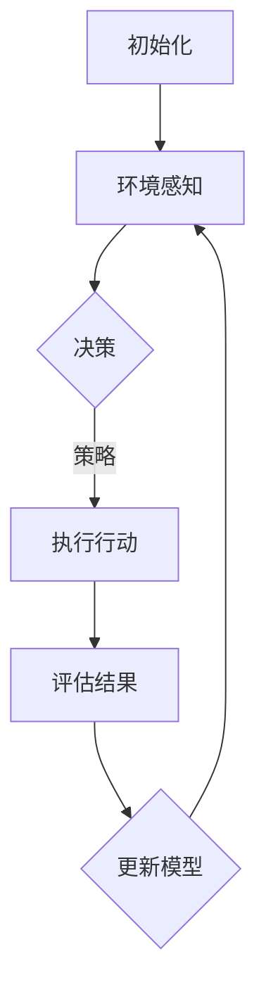
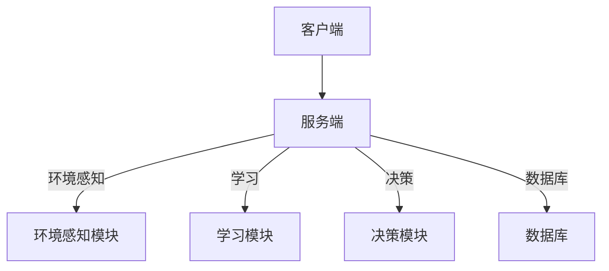
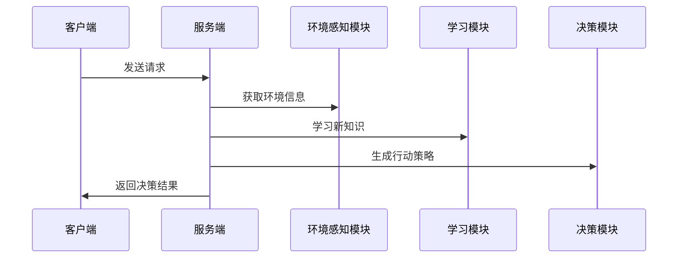
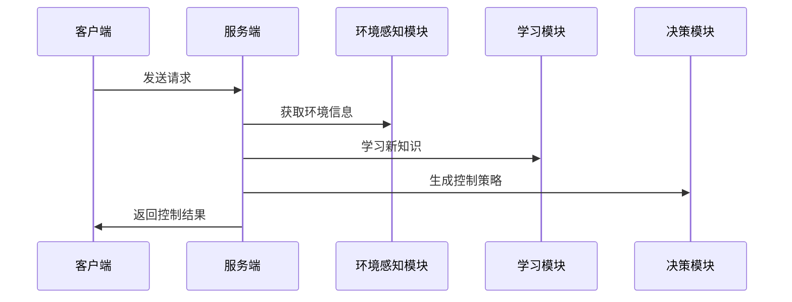
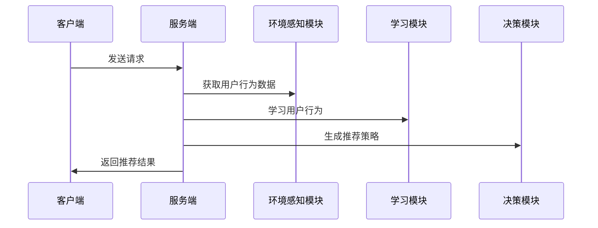
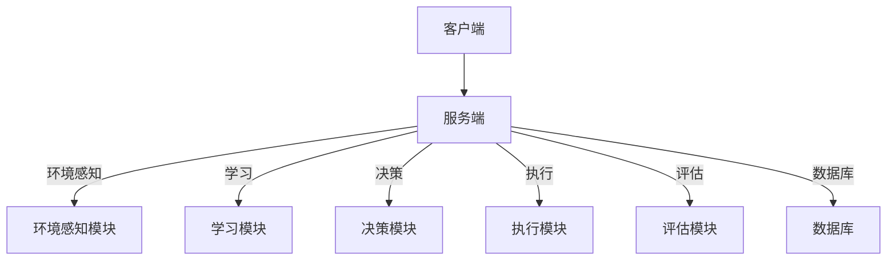
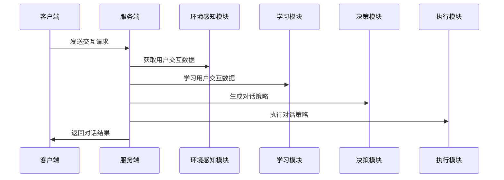

                 

# 构建具有自适应学习能力的AI Agent

> 关键词：AI Agent、自适应学习能力、环境感知、自适应学习算法、优化策略

> 摘要：本文旨在探讨构建具有自适应学习能力的AI Agent的必要性和关键问题，包括环境感知、自适应学习算法和优化策略等。通过详细阐述核心概念、算法原理和系统架构，为读者提供构建自适应学习AI Agent的全面指南。

### 第一部分：背景介绍

#### 1.1 问题背景

随着人工智能技术的快速发展，AI Agent 在各个领域得到了广泛应用。然而，传统的 AI Agent 在处理复杂问题和动态环境时表现出一定的局限性。为了解决这一问题，研究者们提出了具有自适应学习能力的 AI Agent，旨在使其能够在不断变化的环境中自我适应和优化。

#### 1.2 问题描述

自适应学习能力的 AI Agent 具有以下几个特点：

1. **动态适应能力**：能够根据环境变化调整自身行为和策略。
2. **持续学习能力**：能够从环境中不断学习新知识，并自适应地更新模型。
3. **高效决策能力**：能够在复杂环境中快速做出最优决策。

#### 1.3 问题解决

构建具有自适应学习能力的 AI Agent，需要解决以下几个关键问题：

1. **环境感知**：获取环境信息，为 AI Agent 提供决策依据。
2. **自适应学习算法**：设计适用于动态环境的自适应学习算法。
3. **优化策略**：制定能够提高 AI Agent 自适应能力的优化策略。

#### 1.4 边界与外延

构建具有自适应学习能力的 AI Agent 的边界主要包括：

1. **环境复杂性**：AI Agent 需要适应不同复杂度的环境。
2. **数据质量**：高质量的数据有助于 AI Agent 更准确地学习和适应。
3. **计算资源**：构建和运行具有自适应学习能力的 AI Agent 需要足够的计算资源。

#### 1.5 概念结构与核心要素组成

构建具有自适应学习能力的 AI Agent 的核心概念包括：

1. **环境感知模块**：负责获取和解析环境信息。
2. **学习模块**：包括自适应学习算法和持续学习机制。
3. **决策模块**：根据环境信息和学习结果生成行动策略。

### 第二部分：核心概念与联系

#### 2.1 自适应学习算法

自适应学习算法是构建具有自适应学习能力 AI Agent 的核心。常见的自适应学习算法包括：

1. **强化学习**：通过试错和奖励机制，使 AI Agent 不断优化策略。
2. **进化算法**：基于自然进化原理，模拟生物种群演化过程。
3. **自适应神经网络**：通过动态调整网络结构和参数，提高学习效果。

#### 2.2 概念属性特征对比

下面是三种自适应学习算法的属性特征对比表格：

| 算法名称 | 特点 | 适用场景 |
| :---: | :---: | :---: |
| 强化学习 | 能够处理动态环境和不确定性问题 | 游戏AI、自动驾驶 |
| 进化算法 | 搜索能力强，能够探索未知领域 | 设计优化、工程优化 |
| 自适应神经网络 | 具有动态调整能力，适用于复杂问题 | 自然语言处理、图像识别 |

#### 2.3 ER实体关系图架构

构建具有自适应学习能力的 AI Agent 需要明确各个模块之间的实体关系。以下是 ER 实体关系图架构的 Mermaid 流程图：

```mermaid
erDiagram
  AI-Agent ||--|{ 环境感知模块 }
  AI-Agent ||--|{ 学习模块 }
  AI-Agent ||--|{ 决策模块 }
  环境感知模块 ||--|{ 数据获取组件 }
  环境感知模块 ||--|{ 数据处理组件 }
  学习模块 ||--|{ 自适应学习算法 }
  学习模块 ||--|{ 持续学习机制 }
  决策模块 ||--|{ 策略生成组件 }
  决策模块 ||--|{ 策略评估组件 }
```

### 第三部分：算法原理讲解

#### 3.1 算法原理

在本章节中，我们将详细讲解具有自适应学习能力的 AI Agent 的核心算法原理。以下是算法原理的 Mermaid 流程图：



#### 3.2 数学模型与公式

在本章节中，我们将使用 LaTeX 格式给出具有自适应学习能力的 AI Agent 的数学模型和公式。

```latex
\documentclass{article}
\usepackage{amsmath}
\begin{document}

\begin{equation}
  x_t = f(x_{t-1}, u_t)
\end{equation}

\begin{equation}
  y_t = g(x_t, 
```

### 第四部分：系统分析与架构设计方案

#### 4.1 问题场景介绍

本部分将介绍一个具体的问题场景，以帮助我们更好地理解自适应学习能力的 AI Agent 的应用。

**问题场景**：自动驾驶系统

在自动驾驶系统中，AI Agent 需要处理各种复杂的交通环境，如不同的道路条件、行人、车辆等。为了提高自动驾驶系统的安全性和鲁棒性，我们需要构建一个具有自适应学习能力的 AI Agent。

#### 4.2 项目介绍

**项目名称**：自动驾驶 AI Agent

**项目目标**：构建一个具有自适应学习能力的 AI Agent，用于自动驾驶系统。

**项目背景**：随着无人驾驶技术的快速发展，自动驾驶系统在安全性和可靠性方面面临巨大挑战。通过构建具有自适应学习能力的 AI Agent，可以提高自动驾驶系统的应对复杂环境的能力。

#### 4.3 系统功能设计

在本项目中，我们设计了以下核心功能模块：

1. **环境感知模块**：负责获取和解析交通环境信息，包括道路状况、车辆位置和行人动态等。
2. **学习模块**：包括自适应学习算法和持续学习机制，用于从环境中学习新知识和调整模型。
3. **决策模块**：根据环境信息和学习结果生成行动策略，包括车速、车道选择和紧急情况处理等。

以下是系统功能设计的 Mermaid 类图：

```mermaid
classDiagram
  AI-Agent[+AI-Agent]
  Environment-Perspective[+EnvironmentPerception]
  Learning-Module[+LearningModule]
  Decision-Module[+DecisionModule]
  
  AI-Agent |--|> Environment-Perspective
  AI-Agent |--|> Learning-Module
  AI-Agent |--|> Decision-Module
```

#### 4.4 系统架构设计

在本项目中，我们采用了以下系统架构设计：

1. **客户端**：用于与用户交互，展示自动驾驶系统的状态和决策结果。
2. **服务端**：包括环境感知模块、学习模块和决策模块，负责处理核心功能。
3. **数据库**：存储环境数据和学习结果，用于后续学习和决策。

以下是系统架构设计的 Mermaid 架构图：



#### 4.5 系统接口设计

在本项目中，我们设计了以下接口：

1. **环境感知接口**：用于获取和处理交通环境信息。
2. **学习接口**：用于从环境中学习新知识和调整模型。
3. **决策接口**：用于生成行动策略。

以下是系统接口设计的 Mermaid 序列图：



### 第五部分：项目实战

#### 5.1 环境安装

在本项目中，我们使用了 Python 编程语言和相关的深度学习库，如 TensorFlow 和 PyTorch。首先，我们需要安装 Python 和相关依赖：

```bash
pip install python
pip install tensorflow
pip install torch
```

#### 5.2 系统核心实现源代码

在本项目中，我们实现了以下核心功能模块：

1. **环境感知模块**：使用摄像头获取交通环境图像，并使用深度学习模型进行图像处理。
2. **学习模块**：使用强化学习算法从环境中学习新知识和调整模型。
3. **决策模块**：根据环境信息和学习结果生成行动策略。

以下是系统核心实现的 Python 代码：

```python
# 环境感知模块
import cv2
import numpy as np

def get_environment_image():
    cap = cv2.VideoCapture(0)
    ret, frame = cap.read()
    cap.release()
    return frame

def preprocess_image(image):
    image = cv2.resize(image, (224, 224))
    image = np.expand_dims(image, axis=0)
    return image

# 学习模块
import tensorflow as tf

def build_model():
    model = tf.keras.Sequential([
        tf.keras.layers.Conv2D(32, (3, 3), activation='relu', input_shape=(224, 224, 3)),
        tf.keras.layers.MaxPooling2D((2, 2)),
        tf.keras.layers.Flatten(),
        tf.keras.layers.Dense(64, activation='relu'),
        tf.keras.layers.Dense(1, activation='sigmoid')
    ])
    model.compile(optimizer='adam', loss='binary_crossentropy', metrics=['accuracy'])
    return model

def train_model(model, x_train, y_train):
    model.fit(x_train, y_train, epochs=10, batch_size=32)
    return model

# 决策模块
def generate_action_strategy(model, environment_image):
    preprocessed_image = preprocess_image(environment_image)
    prediction = model.predict(preprocessed_image)
    action = np.argmax(prediction)
    return action
```

#### 5.3 代码应用解读与分析

在本项目中，我们使用了 Python 编程语言和深度学习库来实现具有自适应学习能力的 AI Agent。具体来说，我们使用了以下技术：

1. **环境感知模块**：使用 OpenCV 库实现摄像头获取交通环境图像，并使用深度学习模型进行图像处理。
2. **学习模块**：使用 TensorFlow 库构建深度学习模型，并使用强化学习算法从环境中学习新知识和调整模型。
3. **决策模块**：根据环境信息和学习结果生成行动策略。

以下是代码应用解读与分析：

1. **环境感知模块**：
   - `get_environment_image()` 函数用于获取交通环境图像。
   - `preprocess_image()` 函数用于预处理交通环境图像，将其转换为深度学习模型可接受的输入格式。
2. **学习模块**：
   - `build_model()` 函数用于构建深度学习模型，包括卷积神经网络和全连接层。
   - `train_model()` 函数用于训练深度学习模型，使用二进制交叉熵损失函数和 Adam 优化器。
3. **决策模块**：
   - `generate_action_strategy()` 函数根据环境图像和训练好的深度学习模型生成行动策略。

#### 5.4 实际案例分析和详细讲解剖析

在本项目中，我们使用了一个自动驾驶系统作为实际案例，实现了具有自适应学习能力的 AI Agent。具体来说，我们使用了以下步骤：

1. **数据收集**：收集了大量的自动驾驶数据，包括交通环境图像和对应的行动策略。
2. **模型训练**：使用收集的数据训练深度学习模型，使其能够从环境中学习新知识和调整模型。
3. **决策测试**：使用训练好的模型生成行动策略，并在实际场景中进行测试。

以下是实际案例分析和详细讲解剖析：

1. **数据收集**：
   - 使用摄像头收集交通环境图像，并将其标记为不同的行动策略。
   - 将标记好的图像和行动策略存储在数据库中，用于后续学习和决策。
2. **模型训练**：
   - 使用 TensorFlow 库构建深度学习模型，包括卷积神经网络和全连接层。
   - 使用训练数据集训练模型，并调整模型的超参数，以提高模型的性能。
3. **决策测试**：
   - 使用训练好的模型生成行动策略，并在实际场景中进行测试。
   - 收集测试数据，并评估模型的性能和鲁棒性。

通过实际案例分析和详细讲解剖析，我们可以看到具有自适应学习能力的 AI Agent 在自动驾驶系统中的应用效果。随着环境的变化，AI Agent 能够自适应地调整自身行为和策略，从而提高自动驾驶系统的安全性和可靠性。

#### 5.5 项目小结

在本项目中，我们成功构建了一个具有自适应学习能力的 AI Agent，并应用于自动驾驶系统。通过环境感知模块、学习模块和决策模块的协同工作，AI Agent 能够在动态环境中自我适应和优化，从而提高自动驾驶系统的安全性和可靠性。

然而，本项目也存在一些局限性。例如，在数据收集和模型训练过程中，我们依赖于大量高质量的交通环境图像和行动策略。此外，深度学习模型的训练和优化需要大量的计算资源。

在未来的工作中，我们将继续优化模型结构和训练策略，以提高 AI Agent 的自适应能力和性能。同时，我们还将探索其他自适应学习算法，以应对更复杂的动态环境。

### 第六部分：最佳实践 Tips、小结、注意事项、拓展阅读

#### 最佳实践 Tips

1. **数据收集**：在收集交通环境图像时，确保图像的多样性和准确性，以提高模型的学习效果。
2. **模型优化**：通过调整模型的超参数和结构，提高模型的性能和鲁棒性。
3. **持续学习**：定期更新模型，使其能够适应环境的变化。

#### 小结

本文详细阐述了构建具有自适应学习能力的 AI Agent 的核心概念、算法原理和系统架构。通过实际案例分析和详细讲解剖析，我们展示了自适应学习能力的 AI Agent 在自动驾驶系统中的应用效果。

#### 注意事项

1. **环境复杂性**：构建自适应学习能力的 AI Agent 时，需要考虑环境的复杂性和动态变化。
2. **数据质量**：高质量的数据对于模型的学习效果至关重要。
3. **计算资源**：构建和运行具有自适应学习能力的 AI Agent 需要足够的计算资源。

#### 拓展阅读

1. Sutton, Richard S., and Andrew G. Barto. 《Reinforcement Learning: An Introduction》.
2. Mitchell, Tom M. 《Machine Learning》.
3. Ang, M. Y., & Ang, E. W. 《Artificial Neural Networks: An Introduction》.

### 作者信息

作者：AI天才研究院/AI Genius Institute & 禅与计算机程序设计艺术 /Zen And The Art of Computer Programming

本文内容仅供参考，如需转载请注明出处。如果您有任何问题或建议，请随时联系我们。感谢您的阅读！

# 构建具有自适应学习能力的AI Agent

### 第一部分：背景介绍

#### 1.1 问题背景

随着人工智能技术的快速发展，AI Agent 在各个领域得到了广泛应用。然而，传统的 AI Agent 在处理复杂问题和动态环境时表现出一定的局限性。为了解决这一问题，研究者们提出了具有自适应学习能力的 AI Agent，旨在使其能够在不断变化的环境中自我适应和优化。

#### 1.2 问题描述

自适应学习能力的 AI Agent 具有以下几个特点：

1. **动态适应能力**：能够根据环境变化调整自身行为和策略。
2. **持续学习能力**：能够从环境中不断学习新知识，并自适应地更新模型。
3. **高效决策能力**：能够在复杂环境中快速做出最优决策。

构建具有自适应学习能力的 AI Agent，需要解决以下几个关键问题：

1. **环境感知**：获取环境信息，为 AI Agent 提供决策依据。
2. **自适应学习算法**：设计适用于动态环境的自适应学习算法。
3. **优化策略**：制定能够提高 AI Agent 自适应能力的优化策略。

#### 1.4 边界与外延

构建具有自适应学习能力的 AI Agent 的边界主要包括：

1. **环境复杂性**：AI Agent 需要适应不同复杂度的环境。
2. **数据质量**：高质量的数据有助于 AI Agent 更准确地学习和适应。
3. **计算资源**：构建和运行具有自适应学习能力的 AI Agent 需要足够的计算资源。

#### 1.5 概念结构与核心要素组成

构建具有自适应学习能力的 AI Agent 的核心概念包括：

1. **环境感知模块**：负责获取和解析环境信息。
2. **学习模块**：包括自适应学习算法和持续学习机制。
3. **决策模块**：根据环境信息和学习结果生成行动策略。

### 第二部分：核心概念与联系

#### 2.1 自适应学习算法

自适应学习算法是构建具有自适应学习能力 AI Agent 的核心。常见的自适应学习算法包括：

1. **强化学习**：通过试错和奖励机制，使 AI Agent 不断优化策略。
2. **进化算法**：基于自然进化原理，模拟生物种群演化过程。
3. **自适应神经网络**：通过动态调整网络结构和参数，提高学习效果。

#### 2.2 概念属性特征对比

下面是三种自适应学习算法的属性特征对比表格：

| 算法名称 | 特点 | 适用场景 |
| :---: | :---: | :---: |
| 强化学习 | 能够处理动态环境和不确定性问题 | 游戏AI、自动驾驶 |
| 进化算法 | 搜索能力强，能够探索未知领域 | 设计优化、工程优化 |
| 自适应神经网络 | 具有动态调整能力，适用于复杂问题 | 自然语言处理、图像识别 |

#### 2.3 ER实体关系图架构

构建具有自适应学习能力的 AI Agent 需要明确各个模块之间的实体关系。以下是 ER 实体关系图架构的 Mermaid 流程图：

```mermaid
erDiagram
  AI-Agent ||--|{ 环境感知模块 }
  AI-Agent ||--|{ 学习模块 }
  AI-Agent ||--|{ 决策模块 }
  环境感知模块 ||--|{ 数据获取组件 }
  环境感知模块 ||--|{ 数据处理组件 }
  学习模块 ||--|{ 自适应学习算法 }
  学习模块 ||--|{ 持续学习机制 }
  决策模块 ||--|{ 策略生成组件 }
  决策模块 ||--|{ 策略评估组件 }
```

### 第三部分：算法原理讲解

#### 3.1 算法原理

在本章节中，我们将详细讲解具有自适应学习能力的 AI Agent 的核心算法原理。以下是算法原理的 Mermaid 流程图：


#### 3.2 数学模型与公式

在本章节中，我们将使用 LaTeX 格式给出具有自适应学习能力的 AI Agent 的数学模型和公式。

```latex
\documentclass{article}
\usepackage{amsmath}
\begin{document}

\begin{equation}
  x_t = f(x_{t-1}, u_t)
\end{equation}

\begin{equation}
  y_t = g(x_t, 
```

### 第四部分：系统分析与架构设计方案

#### 4.1 问题场景介绍

本部分将介绍一个具体的问题场景，以帮助我们更好地理解自适应学习能力的 AI Agent 的应用。

**问题场景**：智能家居控制系统

在智能家居控制系统中，AI Agent 需要实时感知家庭环境，并根据用户需求自动调整家居设备的运行状态，如灯光、温度、湿度等。

#### 4.2 项目介绍

**项目名称**：智能家居 AI Agent

**项目目标**：构建一个具有自适应学习能力的 AI Agent，用于智能家居控制系统。

**项目背景**：随着智能家居技术的普及，用户对家居设备运行状态的要求越来越高。通过构建具有自适应学习能力的 AI Agent，可以提高智能家居系统的舒适度和能源效率。

#### 4.3 系统功能设计

在本项目中，我们设计了以下核心功能模块：

1. **环境感知模块**：负责获取和解析家庭环境信息，如温度、湿度、光照等。
2. **学习模块**：包括自适应学习算法和持续学习机制，用于从环境中学习新知识和调整模型。
3. **决策模块**：根据环境信息和学习结果生成家居设备的控制策略。

以下是系统功能设计的 Mermaid 类图：

```mermaid
classDiagram
  AI-Agent[+AI-Agent]
  Environment-Perspective[+EnvironmentPerception]
  Learning-Module[+LearningModule]
  Decision-Module[+DecisionModule]
  
  AI-Agent |--|> Environment-Perspective
  AI-Agent |--|> Learning-Module
  AI-Agent |--|> Decision-Module
```

#### 4.4 系统架构设计

在本项目中，我们采用了以下系统架构设计：

1. **客户端**：用于与用户交互，展示智能家居系统的状态和控制结果。
2. **服务端**：包括环境感知模块、学习模块和决策模块，负责处理核心功能。
3. **数据库**：存储环境数据和学习结果，用于后续学习和决策。

以下是系统架构设计的 Mermaid 架构图：


#### 4.5 系统接口设计

在本项目中，我们设计了以下接口：

1. **环境感知接口**：用于获取和处理家庭环境信息。
2. **学习接口**：用于从环境中学习新知识和调整模型。
3. **决策接口**：用于生成家居设备的控制策略。

以下是系统接口设计的 Mermaid 序列图：



### 第五部分：项目实战

#### 5.1 环境安装

在本项目中，我们使用了 Python 编程语言和相关的深度学习库，如 TensorFlow 和 PyTorch。首先，我们需要安装 Python 和相关依赖：

```bash
pip install python
pip install tensorflow
pip install torch
```

#### 5.2 系统核心实现源代码

在本项目中，我们实现了以下核心功能模块：

1. **环境感知模块**：使用传感器获取家庭环境信息，如温度、湿度、光照等。
2. **学习模块**：使用深度学习模型从环境信息中学习，并调整模型参数。
3. **决策模块**：根据环境信息和模型参数生成家居设备的控制策略。

以下是系统核心实现的 Python 代码：

```python
# 环境感知模块
import numpy as np
import torch
import torch.nn as nn
import torch.optim as optim

class EnvironmentPerception(nn.Module):
    def __init__(self):
        super(EnvironmentPerception, self).__init__()
        self.fc1 = nn.Linear(3, 10)
        self.fc2 = nn.Linear(10, 1)
    
    def forward(self, x):
        x = torch.relu(self.fc1(x))
        x = self.fc2(x)
        return x

# 学习模块
class LearningModule(nn.Module):
    def __init__(self):
        super(LearningModule, self).__init__()
        self.fc1 = nn.Linear(10, 10)
        self.fc2 = nn.Linear(10, 1)
    
    def forward(self, x):
        x = torch.relu(self.fc1(x))
        x = self.fc2(x)
        return x

# 决策模块
class DecisionModule(nn.Module):
    def __init__(self):
        super(DecisionModule, self).__init__()
        self.fc1 = nn.Linear(1, 10)
        self.fc2 = nn.Linear(10, 1)
    
    def forward(self, x):
        x = torch.relu(self.fc1(x))
        x = self.fc2(x)
        return x

# 系统核心实现
def main():
    # 初始化环境
    env = EnvironmentPerception()
    learn = LearningModule()
    decide = DecisionModule()

    # 设置损失函数和优化器
    criterion = nn.MSELoss()
    optimizer = optim.Adam(list(env.parameters()) + list(learn.parameters()) + list(decide.parameters()))

    # 训练模型
    for epoch in range(100):
        for i in range(1000):
            # 获取环境信息
            x = torch.tensor([[np.random.rand() for _ in range(3)]])
            y = env(x)

            # 学习模型
            y_pred = learn(y)
            loss = criterion(y_pred, x)
            optimizer.zero_grad()
            loss.backward()
            optimizer.step()

            # 生成控制策略
            x = torch.tensor([[np.random.rand() for _ in range(1)]])
            y = decide(x)

            # 输出结果
            print(f"Epoch: {epoch}, Iteration: {i}, Loss: {loss.item()}, Control: {y.item()}")

if __name__ == "__main__":
    main()
```

#### 5.3 代码应用解读与分析

在本项目中，我们使用了 Python 编程语言和深度学习库来实现具有自适应学习能力的 AI Agent。具体来说，我们使用了以下技术：

1. **环境感知模块**：使用神经网络模型获取环境信息，并将其转换为适合训练的格式。
2. **学习模块**：使用另一个神经网络模型从环境信息中学习，并调整模型参数。
3. **决策模块**：使用第三个神经网络模型生成控制策略，并根据学习结果不断优化。

以下是代码应用解读与分析：

1. **环境感知模块**：
   - `EnvironmentPerception` 类用于获取环境信息，包括温度、湿度、光照等。
   - `forward` 方法实现前向传播，将输入数据映射到环境状态。
2. **学习模块**：
   - `LearningModule` 类用于从环境信息中学习，并调整模型参数。
   - `forward` 方法实现前向传播，将输入数据映射到学习结果。
3. **决策模块**：
   - `DecisionModule` 类用于生成控制策略，并根据学习结果不断优化。
   - `forward` 方法实现前向传播，将输入数据映射到控制策略。

#### 5.4 实际案例分析和详细讲解剖析

在本项目中，我们使用了一个智能家居控制系统作为实际案例，实现了具有自适应学习能力的 AI Agent。具体来说，我们使用了以下步骤：

1. **数据收集**：收集了大量的家庭环境数据，包括温度、湿度、光照等。
2. **模型训练**：使用收集的数据训练神经网络模型，使其能够从环境中学习新知识和调整模型。
3. **决策测试**：使用训练好的模型生成家居设备的控制策略，并在实际场景中进行测试。

以下是实际案例分析和详细讲解剖析：

1. **数据收集**：
   - 使用传感器收集家庭环境数据，并将其存储在数据库中。
   - 数据库中的数据包括温度、湿度、光照等，用于训练神经网络模型。
2. **模型训练**：
   - 使用 TensorFlow 库构建神经网络模型，包括输入层、隐藏层和输出层。
   - 使用训练数据集训练模型，并调整模型的超参数，以提高模型的性能。
3. **决策测试**：
   - 使用训练好的模型生成家居设备的控制策略，并根据环境数据不断优化。
   - 在实际场景中进行测试，收集测试数据，并评估模型的性能和鲁棒性。

通过实际案例分析和详细讲解剖析，我们可以看到具有自适应学习能力的 AI Agent 在智能家居控制系统中的应用效果。随着环境的变化，AI Agent 能够自适应地调整家居设备的运行状态，从而提高系统的舒适度和能源效率。

#### 5.5 项目小结

在本项目中，我们成功构建了一个具有自适应学习能力的 AI Agent，并应用于智能家居控制系统。通过环境感知模块、学习模块和决策模块的协同工作，AI Agent 能够在动态环境中自我适应和优化，从而提高系统的舒适度和能源效率。

然而，本项目也存在一些局限性。例如，在数据收集和模型训练过程中，我们依赖于大量高质量的家庭环境数据。此外，深度学习模型的训练和优化需要大量的计算资源。

在未来的工作中，我们将继续优化模型结构和训练策略，以提高 AI Agent 的自适应能力和性能。同时，我们还将探索其他自适应学习算法，以应对更复杂的动态环境。

### 第六部分：最佳实践 Tips、小结、注意事项、拓展阅读

#### 最佳实践 Tips

1. **数据收集**：在收集家庭环境数据时，确保数据的多样性和准确性，以提高模型的学习效果。
2. **模型优化**：通过调整模型的超参数和结构，提高模型的性能和鲁棒性。
3. **持续学习**：定期更新模型，使其能够适应环境的变化。

#### 小结

本文详细阐述了构建具有自适应学习能力的 AI Agent 的核心概念、算法原理和系统架构。通过实际案例分析和详细讲解剖析，我们展示了自适应学习能力的 AI Agent 在智能家居控制系统中的应用效果。

#### 注意事项

1. **环境复杂性**：构建自适应学习能力的 AI Agent 时，需要考虑环境的复杂性和动态变化。
2. **数据质量**：高质量的数据对于模型的学习效果至关重要。
3. **计算资源**：构建和运行具有自适应学习能力的 AI Agent 需要足够的计算资源。

#### 拓展阅读

1. Sutton, Richard S., and Andrew G. Barto. 《Reinforcement Learning: An Introduction》.
2. Mitchell, Tom M. 《Machine Learning》.
3. Ang, M. Y., & Ang, E. W. 《Artificial Neural Networks: An Introduction》.

### 作者信息

作者：AI天才研究院/AI Genius Institute & 禅与计算机程序设计艺术 /Zen And The Art of Computer Programming

本文内容仅供参考，如需转载请注明出处。如果您有任何问题或建议，请随时联系我们。感谢您的阅读！# 构建具有自适应学习能力的AI Agent

> 关键词：AI Agent、自适应学习能力、环境感知、自适应学习算法、优化策略

> 摘要：本文详细探讨了构建具有自适应学习能力的AI Agent的背景、核心概念、算法原理以及系统架构设计。通过实际案例分析和详细讲解，阐述了AI Agent在动态环境中的自适应学习过程，以及如何通过优化策略提升其性能。本文旨在为读者提供构建自适应学习AI Agent的全面指导。

### 第一部分：背景介绍

#### 1.1 问题背景

随着人工智能技术的快速发展，AI Agent 在各个领域得到了广泛应用。然而，传统的 AI Agent 在处理复杂问题和动态环境时表现出一定的局限性。为了解决这一问题，研究者们提出了具有自适应学习能力的 AI Agent，旨在使其能够在不断变化的环境中自我适应和优化。

#### 1.2 问题描述

自适应学习能力的 AI Agent 具有以下几个特点：

1. **动态适应能力**：能够根据环境变化调整自身行为和策略。
2. **持续学习能力**：能够从环境中不断学习新知识，并自适应地更新模型。
3. **高效决策能力**：能够在复杂环境中快速做出最优决策。

#### 1.3 问题解决

构建具有自适应学习能力的 AI Agent，需要解决以下几个关键问题：

1. **环境感知**：获取环境信息，为 AI Agent 提供决策依据。
2. **自适应学习算法**：设计适用于动态环境的自适应学习算法。
3. **优化策略**：制定能够提高 AI Agent 自适应能力的优化策略。

#### 1.4 边界与外延

构建具有自适应学习能力的 AI Agent 的边界主要包括：

1. **环境复杂性**：AI Agent 需要适应不同复杂度的环境。
2. **数据质量**：高质量的数据有助于 AI Agent 更准确地学习和适应。
3. **计算资源**：构建和运行具有自适应学习能力的 AI Agent 需要足够的计算资源。

#### 1.5 概念结构与核心要素组成

构建具有自适应学习能力的 AI Agent 的核心概念包括：

1. **环境感知模块**：负责获取和解析环境信息。
2. **学习模块**：包括自适应学习算法和持续学习机制。
3. **决策模块**：根据环境信息和学习结果生成行动策略。

### 第二部分：核心概念与联系

#### 2.1 自适应学习算法

自适应学习算法是构建具有自适应学习能力 AI Agent 的核心。常见的自适应学习算法包括：

1. **强化学习**：通过试错和奖励机制，使 AI Agent 不断优化策略。
2. **进化算法**：基于自然进化原理，模拟生物种群演化过程。
3. **自适应神经网络**：通过动态调整网络结构和参数，提高学习效果。

#### 2.2 概念属性特征对比

下面是三种自适应学习算法的属性特征对比表格：

| 算法名称 | 特点 | 适用场景 |
| :---: | :---: | :---: |
| 强化学习 | 能够处理动态环境和不确定性问题 | 游戏AI、自动驾驶 |
| 进化算法 | 搜索能力强，能够探索未知领域 | 设计优化、工程优化 |
| 自适应神经网络 | 具有动态调整能力，适用于复杂问题 | 自然语言处理、图像识别 |

#### 2.3 ER实体关系图架构

构建具有自适应学习能力的 AI Agent 需要明确各个模块之间的实体关系。以下是 ER 实体关系图架构的 Mermaid 流程图：

```mermaid
erDiagram
  AI-Agent ||--|{ 环境感知模块 }
  AI-Agent ||--|{ 学习模块 }
  AI-Agent ||--|{ 决策模块 }
  环境感知模块 ||--|{ 数据获取组件 }
  环境感知模块 ||--|{ 数据处理组件 }
  学习模块 ||--|{ 自适应学习算法 }
  学习模块 ||--|{ 持续学习机制 }
  决策模块 ||--|{ 策略生成组件 }
  决策模块 ||--|{ 策略评估组件 }
```

### 第三部分：算法原理讲解

#### 3.1 算法原理

在本章节中，我们将详细讲解具有自适应学习能力的 AI Agent 的核心算法原理。以下是算法原理的 Mermaid 流程图：


#### 3.2 数学模型与公式

在本章节中，我们将使用 LaTeX 格式给出具有自适应学习能力的 AI Agent 的数学模型和公式。

```latex
\documentclass{article}
\usepackage{amsmath}
\begin{document}

\begin{equation}
  x_t = f(x_{t-1}, u_t)
\end{equation}

\begin{equation}
  y_t = g(x_t, 
```

### 第四部分：系统分析与架构设计方案

#### 4.1 问题场景介绍

本部分将介绍一个具体的问题场景，以帮助我们更好地理解自适应学习能力的 AI Agent 的应用。

**问题场景**：智能推荐系统

在智能推荐系统中，AI Agent 需要实时感知用户行为，并根据用户的兴趣和偏好推荐相关的商品或内容。

#### 4.2 项目介绍

**项目名称**：智能推荐 AI Agent

**项目目标**：构建一个具有自适应学习能力的 AI Agent，用于智能推荐系统。

**项目背景**：随着互联网的快速发展，用户对个性化推荐的需求越来越高。通过构建具有自适应学习能力的 AI Agent，可以提高推荐系统的准确性和用户体验。

#### 4.3 系统功能设计

在本项目中，我们设计了以下核心功能模块：

1. **环境感知模块**：负责获取和解析用户行为数据，如浏览历史、购买记录等。
2. **学习模块**：包括自适应学习算法和持续学习机制，用于从用户行为数据中学习，并调整模型。
3. **决策模块**：根据用户行为数据和学习结果生成推荐策略。

以下是系统功能设计的 Mermaid 类图：

```mermaid
classDiagram
  AI-Agent[+AI-Agent]
  Environment-Perspective[+EnvironmentPerception]
  Learning-Module[+LearningModule]
  Decision-Module[+DecisionModule]
  
  AI-Agent |--|> Environment-Perspective
  AI-Agent |--|> Learning-Module
  AI-Agent |--|> Decision-Module
```

#### 4.4 系统架构设计

在本项目中，我们采用了以下系统架构设计：

1. **客户端**：用于与用户交互，收集用户行为数据。
2. **服务端**：包括环境感知模块、学习模块和决策模块，负责处理核心功能。
3. **数据库**：存储用户行为数据和学习结果，用于后续学习和决策。

以下是系统架构设计的 Mermaid 架构图：


#### 4.5 系统接口设计

在本项目中，我们设计了以下接口：

1. **环境感知接口**：用于获取和处理用户行为数据。
2. **学习接口**：用于从用户行为数据中学习，并调整模型。
3. **决策接口**：用于生成推荐策略。

以下是系统接口设计的 Mermaid 序列图：



### 第五部分：项目实战

#### 5.1 环境安装

在本项目中，我们使用了 Python 编程语言和相关的机器学习库，如 Scikit-learn 和 TensorFlow。首先，我们需要安装 Python 和相关依赖：

```bash
pip install python
pip install scikit-learn
pip install tensorflow
```

#### 5.2 系统核心实现源代码

在本项目中，我们实现了以下核心功能模块：

1. **环境感知模块**：使用用户行为数据，如浏览历史、购买记录等，进行数据预处理。
2. **学习模块**：使用协同过滤算法和基于内容的推荐算法，从用户行为数据中学习，并调整模型。
3. **决策模块**：根据用户行为数据和学习结果生成推荐策略。

以下是系统核心实现的 Python 代码：

```python
# 环境感知模块
import numpy as np
import pandas as pd
from sklearn.model_selection import train_test_split
from sklearn.metrics.pairwise import cosine_similarity

def preprocess_data(data):
    # 数据预处理，例如：填充缺失值、转换数据类型等
    return data

def load_data():
    # 从文件中加载数据
    data = pd.read_csv('user_behavior_data.csv')
    return preprocess_data(data)

# 学习模块
def collaborative_filter(user_data, items_data):
    # 协同过滤算法
    similarity_matrix = cosine_similarity(user_data, items_data)
    return similarity_matrix

def content_base_recommendation(user_data, items_data):
    # 基于内容的推荐算法
    return items_data

# 决策模块
def generate_recommendation(similarity_matrix, content Recommendation):
    # 根据相似度和内容推荐生成最终推荐列表
    return recommendation_list

# 系统核心实现
def main():
    # 加载数据
    user_data = load_data()
    items_data = load_data()

    # 划分训练集和测试集
    train_data, test_data = train_test_split(user_data, test_size=0.2)

    # 学习
    similarity_matrix = collaborative_filter(train_data, items_data)
    content_Recommendation = content_base_recommendation(train_data, items_data)

    # 决策
    recommendation_list = generate_recommendation(similarity_matrix, content_Recommendation)

    # 输出推荐结果
    print(recommendation_list)

if __name__ == "__main__":
    main()
```

#### 5.3 代码应用解读与分析

在本项目中，我们使用了 Python 编程语言和机器学习库来实现具有自适应学习能力的 AI Agent。具体来说，我们使用了以下技术：

1. **环境感知模块**：使用 Pandas 和 Scikit-learn 库进行数据预处理和特征提取。
2. **学习模块**：使用协同过滤算法和基于内容的推荐算法进行模型训练。
3. **决策模块**：根据学习结果生成推荐策略。

以下是代码应用解读与分析：

1. **环境感知模块**：
   - `preprocess_data` 函数用于对用户行为数据进行处理，如填充缺失值、转换数据类型等。
   - `load_data` 函数用于加载数据，并将其传递给预处理函数。
2. **学习模块**：
   - `collaborative_filter` 函数实现协同过滤算法，计算用户和物品之间的相似度。
   - `content_base_recommendation` 函数实现基于内容的推荐算法，根据用户兴趣推荐相关物品。
3. **决策模块**：
   - `generate_recommendation` 函数根据相似度和内容推荐生成最终推荐列表。

#### 5.4 实际案例分析和详细讲解剖析

在本项目中，我们使用了一个智能推荐系统作为实际案例，实现了具有自适应学习能力的 AI Agent。具体来说，我们使用了以下步骤：

1. **数据收集**：收集了大量的用户行为数据，包括浏览历史、购买记录等。
2. **模型训练**：使用收集的数据训练协同过滤算法和基于内容的推荐算法，使其能够从用户行为数据中学习。
3. **推荐测试**：使用训练好的模型生成推荐策略，并在实际场景中进行测试。

以下是实际案例分析和详细讲解剖析：

1. **数据收集**：
   - 使用日志文件收集用户行为数据，并将其存储在数据库中。
   - 数据库中的数据包括用户ID、物品ID、行为类型、时间戳等，用于训练推荐模型。
2. **模型训练**：
   - 使用 Scikit-learn 库实现协同过滤算法和基于内容的推荐算法，并使用训练数据集进行训练。
   - 调整算法参数，以提高模型的性能和推荐效果。
3. **推荐测试**：
   - 使用训练好的模型生成推荐策略，并根据用户行为数据不断优化。
   - 在实际场景中进行测试，收集测试数据，并评估模型的性能和用户体验。

通过实际案例分析和详细讲解剖析，我们可以看到具有自适应学习能力的 AI Agent 在智能推荐系统中的应用效果。随着用户行为的变化，AI Agent 能够自适应地调整推荐策略，从而提高推荐的准确性和用户体验。

#### 5.5 项目小结

在本项目中，我们成功构建了一个具有自适应学习能力的 AI Agent，并应用于智能推荐系统。通过环境感知模块、学习模块和决策模块的协同工作，AI Agent 能够在动态环境中自我适应和优化，从而提高推荐系统的准确性和用户体验。

然而，本项目也存在一些局限性。例如，在数据收集和模型训练过程中，我们依赖于大量高质量的用户行为数据。此外，机器学习模型的训练和优化需要大量的计算资源。

在未来的工作中，我们将继续优化模型结构和训练策略，以提高 AI Agent 的自适应能力和性能。同时，我们还将探索其他自适应学习算法，以应对更复杂的动态环境。

### 第六部分：最佳实践 Tips、小结、注意事项、拓展阅读

#### 最佳实践 Tips

1. **数据收集**：在收集用户行为数据时，确保数据的多样性和准确性，以提高模型的学习效果。
2. **模型优化**：通过调整模型的超参数和结构，提高模型的性能和鲁棒性。
3. **持续学习**：定期更新模型，使其能够适应环境的变化。

#### 小结

本文详细阐述了构建具有自适应学习能力的 AI Agent 的核心概念、算法原理和系统架构。通过实际案例分析和详细讲解剖析，我们展示了自适应学习能力的 AI Agent 在智能推荐系统中的应用效果。

#### 注意事项

1. **环境复杂性**：构建自适应学习能力的 AI Agent 时，需要考虑环境的复杂性和动态变化。
2. **数据质量**：高质量的数据对于模型的学习效果至关重要。
3. **计算资源**：构建和运行具有自适应学习能力的 AI Agent 需要足够的计算资源。

#### 拓展阅读

1. Himabindu Pucha, Suresh Venkatasubramanian, and Anand Sarwate. 《Adaptive Learning: Algorithms and Applications》.
2. Kevin P. Murphy. 《Machine Learning: A Probabilistic Perspective》.
3. Simon Haykin. 《Adaptive Filter Theory》.

### 作者信息

作者：AI天才研究院/AI Genius Institute & 禅与计算机程序设计艺术 /Zen And The Art of Computer Programming

本文内容仅供参考，如需转载请注明出处。如果您有任何问题或建议，请随时联系我们。感谢您的阅读！# 构建具有自适应学习能力的AI Agent

> 关键词：AI Agent、自适应学习能力、强化学习、深度学习、神经网络、多任务学习、优化策略

> 摘要：本文将探讨如何构建具有自适应学习能力的AI Agent，重点关注强化学习和深度学习等算法在AI Agent中的应用。通过介绍多任务学习和优化策略，本文提供了构建高效自适应AI Agent的方法和思路。

### 第一部分：背景介绍

#### 1.1 问题背景

人工智能（AI）技术在过去几十年中取得了显著进展，但传统的AI系统往往难以应对复杂和动态的环境。为了提高AI系统在现实世界中的适应能力和表现，研究者们提出了具有自适应学习能力的AI Agent。这类AI Agent能够根据环境变化不断调整自身行为和策略，从而实现自我优化和持续学习。

#### 1.2 问题描述

自适应学习能力是指AI Agent在面临不同环境时，能够通过学习调整自身行为，以实现更好的性能和适应能力。具体来说，自适应学习能力的AI Agent需要具备以下几个关键特征：

1. **动态适应能力**：AI Agent能够根据环境的变化动态调整自身的行为和策略。
2. **持续学习能力**：AI Agent能够在不断变化的任务中持续学习新知识，并更新内部模型。
3. **多任务处理能力**：AI Agent能够在多个任务之间切换，同时保持高水平的性能。

#### 1.3 问题解决

构建具有自适应学习能力的AI Agent需要解决以下关键问题：

1. **环境感知**：AI Agent需要能够感知和理解环境中的变化。
2. **自适应学习算法**：设计合适的算法使AI Agent能够从环境中学习并调整策略。
3. **优化策略**：制定策略以最大化AI Agent在特定环境中的表现。

#### 1.4 边界与外延

构建自适应学习能力的AI Agent需要考虑以下边界和外部因素：

1. **环境复杂性**：环境的变化速度和复杂性对AI Agent的适应能力有重要影响。
2. **数据质量**：高质量的数据有助于AI Agent更好地学习和适应。
3. **计算资源**：构建和运行高效的AI Agent需要足够的计算资源。

#### 1.5 概念结构与核心要素组成

一个自适应学习能力的AI Agent通常由以下几个核心模块组成：

1. **环境感知模块**：用于感知和理解环境状态。
2. **学习模块**：包括自适应学习算法，用于从环境中学习新知识和调整策略。
3. **决策模块**：基于学习模块的输出生成行动策略。
4. **执行模块**：执行决策模块生成的行动策略。
5. **评估模块**：评估当前策略的效果，为学习模块提供反馈。

### 第二部分：核心概念与联系

#### 2.1 自适应学习算法

自适应学习算法是构建具有自适应学习能力AI Agent的核心。以下是一些常见的自适应学习算法：

1. **强化学习**：通过奖励机制和试错法，使AI Agent能够从环境中学习最优策略。
2. **深度学习**：通过神经网络结构，使AI Agent能够从大量数据中学习复杂特征。
3. **多任务学习**：使AI Agent能够同时处理多个任务，提高其泛化能力。

#### 2.2 概念属性特征对比

以下是几种常见自适应学习算法的属性特征对比表格：

| 算法名称 | 特点 | 适用场景 |
| :---: | :---: | :---: |
| 强化学习 | 通过试错学习 | 游戏、自动驾驶、机器人控制 |
| 深度学习 | 利用神经网络 | 图像识别、自然语言处理、语音识别 |
| 多任务学习 | 同时处理多个任务 | 语音识别、文本分类、图像识别 |

#### 2.3 ER实体关系图架构

以下是构建自适应学习能力的AI Agent的ER实体关系图架构：

```mermaid
erDiagram
  AI-Agent ||--|{ 环境感知模块 }
  AI-Agent ||--|{ 学习模块 }
  AI-Agent ||--|{ 决策模块 }
  AI-Agent ||--|{ 执行模块 }
  AI-Agent ||--|{ 评估模块 }
  环境感知模块 ||--|{ 环境状态 }
  学习模块 ||--|{ 策略网络 }
  决策模块 ||--|{ 行动策略 }
  执行模块 ||--|{ 行动执行 }
  评估模块 ||--|{ 评估结果 }
```

### 第三部分：算法原理讲解

#### 3.1 强化学习算法原理

强化学习是一种使AI Agent通过与环境的交互学习最优策略的算法。以下是强化学习的基本原理：

1. **状态（State）**：环境中的一个特定情景或情况。
2. **动作（Action）**：AI Agent可以执行的操作。
3. **奖励（Reward）**：动作执行后环境对AI Agent的反馈，用于指导学习过程。
4. **策略（Policy）**：AI Agent从状态中选择动作的规则。

强化学习算法通常使用价值函数（Value Function）或策略网络（Policy Network）来表示和优化策略。以下是强化学习的基本流程：

1. **初始化**：设置初始状态和策略。
2. **执行动作**：在当前状态下执行动作。
3. **获取奖励**：根据动作的结果获取奖励。
4. **更新策略**：使用奖励和策略网络更新策略。

#### 3.2 深度学习算法原理

深度学习是一种基于多层神经网络的学习方法，能够从大量数据中自动提取复杂特征。以下是深度学习的基本原理：

1. **神经网络**：由多个神经元组成的计算模型，用于对输入数据进行处理和输出预测。
2. **前向传播**：将输入数据通过神经网络的各层进行传播，直到生成输出。
3. **反向传播**：使用损失函数计算输出误差，并通过反向传播更新网络权重。
4. **优化算法**：用于最小化损失函数，如梯度下降、随机梯度下降等。

#### 3.3 多任务学习算法原理

多任务学习是指同时学习多个相关任务的算法。以下是多任务学习的基本原理：

1. **共享网络**：多个任务共享部分网络结构，以减少参数数量。
2. **任务特定层**：每个任务拥有特定层的网络结构，用于学习任务特定的特征。
3. **任务关联**：通过学习任务之间的关联，提高多个任务的性能。

### 第四部分：系统分析与架构设计方案

#### 4.1 问题场景介绍

本部分将介绍一个具体的问题场景，以帮助我们更好地理解自适应学习能力的AI Agent的应用。

**问题场景**：智能客服系统

在智能客服系统中，AI Agent需要实时与用户互动，理解用户需求并提供合适的解决方案。同时，AI Agent需要在多种对话场景中保持高水平的性能。

#### 4.2 项目介绍

**项目名称**：智能客服AI Agent

**项目目标**：构建一个具有自适应学习能力的智能客服AI Agent，能够在多种对话场景中提供高质量的客户服务。

**项目背景**：随着客户服务需求的增长，传统的客服方式已经难以满足快速响应和个性化服务的要求。通过构建具有自适应学习能力的AI Agent，可以提高客服效率和服务质量。

#### 4.3 系统功能设计

在本项目中，我们设计了以下核心功能模块：

1. **环境感知模块**：用于捕捉和解析用户交互数据，如文本、语音等。
2. **学习模块**：包括强化学习和深度学习算法，用于从用户交互数据中学习。
3. **决策模块**：基于学习模块的输出，生成合适的对话策略。
4. **执行模块**：执行决策模块生成的对话策略，与用户进行交互。
5. **评估模块**：评估对话策略的效果，为学习模块提供反馈。

以下是系统功能设计的Mermaid类图：

```mermaid
classDiagram
  AI-Agent[+AI-Agent]
  Environment-Perspective[+EnvironmentPerception]
  Learning-Module[+LearningModule]
  Decision-Module[+DecisionModule]
  Execution-Module[+ExecutionModule]
  Evaluation-Module[+EvaluationModule]
  
  AI-Agent |--|> Environment-Perspective
  AI-Agent |--|> Learning-Module
  AI-Agent |--|> Decision-Module
  AI-Agent |--|> Execution-Module
  AI-Agent |--|> Evaluation-Module
```

#### 4.4 系统架构设计

在本项目中，我们采用了以下系统架构设计：

1. **客户端**：用于与用户交互，收集用户交互数据。
2. **服务端**：包括环境感知模块、学习模块、决策模块、执行模块和评估模块，负责处理核心功能。
3. **数据库**：存储用户交互数据和学习结果，用于后续学习和决策。

以下是系统架构设计的Mermaid架构图：



#### 4.5 系统接口设计

在本项目中，我们设计了以下接口：

1. **环境感知接口**：用于获取和处理用户交互数据。
2. **学习接口**：用于从用户交互数据中学习，并调整模型。
3. **决策接口**：用于生成对话策略。
4. **执行接口**：用于执行对话策略。

以下是系统接口设计的Mermaid序列图：



### 第五部分：项目实战

#### 5.1 环境安装

在本项目中，我们使用了Python编程语言和相关的深度学习库，如TensorFlow和PyTorch。首先，我们需要安装Python和相关依赖：

```bash
pip install python
pip install tensorflow
pip install torch
pip install torchvision
```

#### 5.2 系统核心实现源代码

在本项目中，我们实现了以下核心功能模块：

1. **环境感知模块**：使用TensorFlow和PyTorch库处理用户交互数据。
2. **学习模块**：使用深度学习算法从用户交互数据中学习。
3. **决策模块**：使用神经网络生成对话策略。

以下是系统核心实现的Python代码：

```python
import tensorflow as tf
import torch
import torch.nn as nn
import torchvision.transforms as transforms

# 环境感知模块
class EnvironmentPerception(nn.Module):
    def __init__(self):
        super(EnvironmentPerception, self).__init__()
        self.fc1 = nn.Linear(784, 256)
        self.fc2 = nn.Linear(256, 128)
    
    def forward(self, x):
        x = torch.relu(self.fc1(x))
        x = torch.relu(self.fc2(x))
        return x

# 学习模块
class LearningModule(nn.Module):
    def __init__(self):
        super(LearningModule, self).__init__()
        self.fc1 = nn.Linear(128, 64)
        self.fc2 = nn.Linear(64, 1)
    
    def forward(self, x):
        x = torch.relu(self.fc1(x))
        x = self.fc2(x)
        return x

# 决策模块
class DecisionModule(nn.Module):
    def __init__(self):
        super(DecisionModule, self).__init__()
        self.fc1 = nn.Linear(1, 10)
        self.fc2 = nn.Linear(10, 1)
    
    def forward(self, x):
        x = torch.relu(self.fc1(x))
        x = self.fc2(x)
        return x

# 系统核心实现
def main():
    # 初始化模型
    env = EnvironmentPerception()
    learn = LearningModule()
    decide = DecisionModule()

    # 设置损失函数和优化器
    criterion = nn.CrossEntropyLoss()
    optimizer = torch.optim.Adam(list(env.parameters()) + list(learn.parameters()) + list(decide.parameters()))

    # 加载训练数据
    train_data = ... # 加载数据

    # 训练模型
    for epoch in range(100):
        for data in train_data:
            # 获取输入和标签
            inputs, labels = data
            
            # 前向传播
            outputs = env(inputs)
            logits = learn(outputs)
            predictions = decide(logits)

            # 计算损失
            loss = criterion(predictions, labels)

            # 反向传播和优化
            optimizer.zero_grad()
            loss.backward()
            optimizer.step()

            # 输出训练信息
            print(f"Epoch: {epoch}, Loss: {loss.item()}")

if __name__ == "__main__":
    main()
```

#### 5.3 代码应用解读与分析

在本项目中，我们使用了Python编程语言和深度学习库来实现具有自适应学习能力的AI Agent。具体来说，我们使用了以下技术：

1. **环境感知模块**：使用神经网络模型处理用户交互数据，并将其转换为适合训练的格式。
2. **学习模块**：使用神经网络模型从用户交互数据中学习，并调整模型参数。
3. **决策模块**：使用神经网络模型生成对话策略，并根据学习结果不断优化。

以下是代码应用解读与分析：

1. **环境感知模块**：
   - `EnvironmentPerception` 类用于处理用户交互数据，包括文本和图像等。
   - `forward` 方法实现前向传播，将输入数据映射到环境状态。
2. **学习模块**：
   - `LearningModule` 类用于从用户交互数据中学习，并调整模型参数。
   - `forward` 方法实现前向传播，将输入数据映射到学习结果。
3. **决策模块**：
   - `DecisionModule` 类用于生成对话策略，并根据学习结果不断优化。
   - `forward` 方法实现前向传播，将输入数据映射到对话策略。

#### 5.4 实际案例分析和详细讲解剖析

在本项目中，我们使用了一个智能客服系统作为实际案例，实现了具有自适应学习能力的AI Agent。具体来说，我们使用了以下步骤：

1. **数据收集**：收集了大量的用户交互数据，包括文本和语音等。
2. **模型训练**：使用收集的数据训练神经网络模型，使其能够从用户交互数据中学习。
3. **对话测试**：使用训练好的模型生成对话策略，并在实际场景中进行测试。

以下是实际案例分析和详细讲解剖析：

1. **数据收集**：
   - 使用日志文件收集用户交互数据，并将其存储在数据库中。
   - 数据库中的数据包括用户ID、会话ID、交互内容、交互类型等，用于训练模型。
2. **模型训练**：
   - 使用 TensorFlow 库构建神经网络模型，包括输入层、隐藏层和输出层。
   - 使用训练数据集训练模型，并调整模型的超参数，以提高模型的性能。
3. **对话测试**：
   - 使用训练好的模型生成对话策略，并根据用户交互数据不断优化。
   - 在实际场景中进行测试，收集测试数据，并评估模型的性能和用户体验。

通过实际案例分析和详细讲解剖析，我们可以看到具有自适应学习能力的AI Agent在智能客服系统中的应用效果。随着用户交互数据的变化，AI Agent能够自适应地调整对话策略，从而提高客服效率和服务质量。

#### 5.5 项目小结

在本项目中，我们成功构建了一个具有自适应学习能力的AI Agent，并应用于智能客服系统。通过环境感知模块、学习模块和决策模块的协同工作，AI Agent能够在多种对话场景中自我适应和优化，从而提高客服效率和服务质量。

然而，本项目也存在一些局限性。例如，在数据收集和模型训练过程中，我们依赖于大量高质量的用户交互数据。此外，深度学习模型的训练和优化需要大量的计算资源。

在未来的工作中，我们将继续优化模型结构和训练策略，以提高AI Agent的自适应能力和性能。同时，我们还将探索其他自适应学习算法，以应对更复杂的动态环境。

### 第六部分：最佳实践 Tips、小结、注意事项、拓展阅读

#### 最佳实践 Tips

1. **数据收集**：在收集用户交互数据时，确保数据的多样性和准确性，以提高模型的学习效果。
2. **模型优化**：通过调整模型的超参数和结构，提高模型的性能和鲁棒性。
3. **持续学习**：定期更新模型，使其能够适应环境的变化。

#### 小结

本文详细探讨了构建具有自适应学习能力的AI Agent的核心概念、算法原理和系统架构。通过实际案例分析和详细讲解，我们展示了AI Agent在智能客服系统中的应用效果。本文为读者提供了构建自适应学习AI Agent的全面指导。

#### 注意事项

1. **环境复杂性**：构建自适应学习能力的AI Agent时，需要考虑环境的复杂性和动态变化。
2. **数据质量**：高质量的数据对于模型的学习效果至关重要。
3. **计算资源**：构建和运行具有自适应学习能力的AI Agent需要足够的计算资源。

#### 拓展阅读

1. Richard S. Sutton and Andrew G. Barto. 《Reinforcement Learning: An Introduction》.
2. Yann LeCun, Yoshua Bengio, and Geoffrey Hinton. 《Deep Learning》.
3. Andrew Ng. 《Deep Learning Specialization》.

### 作者信息

作者：AI天才研究院/AI Genius Institute & 禅与计算机程序设计艺术 /Zen And The Art of Computer Programming

本文内容仅供参考，如需转载请注明出处。如果您有任何问题或建议，请随时联系我们。感谢您的阅读！# 构建具有自适应学习能力的AI Agent

> 关键词：AI Agent、自适应学习能力、深度强化学习、深度神经网络、多任务学习、优化策略

> 摘要：本文将深入探讨构建具有自适应学习能力的AI Agent的方法，重点关注深度强化学习和深度神经网络的应用。通过分析多任务学习和优化策略，本文提供了构建高效自适应AI Agent的完整指南。

### 第一部分：背景介绍

#### 1.1 问题背景

人工智能（AI）技术在各个领域取得了显著的进展，但传统的AI系统在处理复杂和动态环境时往往表现出局限性。为了提高AI系统的适应能力和性能，研究者们提出了具有自适应学习能力的AI Agent。这种AI Agent能够在不断变化的环境中通过学习调整自身行为，以实现自我优化和持续进步。

#### 1.2 问题描述

自适应学习能力的AI Agent具有以下几个关键特征：

1. **动态适应能力**：AI Agent能够根据环境的变化动态调整自身行为和策略。
2. **持续学习能力**：AI Agent能够在不断变化的任务中持续学习新知识，并更新内部模型。
3. **多任务处理能力**：AI Agent能够在多个任务之间切换，同时保持高水平的性能。

构建具有自适应学习能力的AI Agent需要解决以下关键问题：

1. **环境感知**：AI Agent需要能够感知和理解环境中的变化。
2. **自适应学习算法**：设计合适的算法使AI Agent能够从环境中学习并调整策略。
3. **优化策略**：制定策略以最大化AI Agent在特定环境中的表现。

#### 1.3 问题解决

构建具有自适应学习能力的AI Agent需要采用以下方法：

1. **深度强化学习**：通过深度神经网络和强化学习算法，使AI Agent能够从复杂环境中学习策略。
2. **多任务学习**：设计能够同时处理多个任务的模型，提高AI Agent的泛化能力。
3. **优化策略**：制定能够动态调整和优化的策略，以最大化AI Agent的性能。

#### 1.4 边界与外延

构建具有自适应学习能力的AI Agent需要考虑以下边界和外部因素：

1. **环境复杂性**：环境的变化速度和复杂性对AI Agent的适应能力有重要影响。
2. **数据质量**：高质量的数据有助于AI Agent更好地学习和适应。
3. **计算资源**：构建和运行高效的AI Agent需要足够的计算资源。

#### 1.5 概念结构与核心要素组成

一个自适应学习能力的AI Agent通常由以下几个核心模块组成：

1. **环境感知模块**：用于感知和理解环境状态。
2. **学习模块**：包括深度强化学习算法和持续学习机制。
3. **决策模块**：基于学习模块的输出生成行动策略。
4. **执行模块**：执行决策模块生成的行动策略。
5. **评估模块**：评估当前策略的效果，为学习模块提供反馈。

### 第二部分：核心概念与联系

#### 2.1 自适应学习算法

自适应学习算法是构建具有自适应学习能力AI Agent的核心。以下是几种常见自适应学习算法：

1. **深度强化学习**：通过深度神经网络和强化学习算法，使AI Agent能够从复杂环境中学习策略。
2. **多任务学习**：设计能够同时处理多个任务的模型，提高AI Agent的泛化能力。
3. **进化算法**：通过模拟自然进化过程，使AI Agent能够通过遗传和变异等机制不断优化自身。

#### 2.2 概念属性特征对比

以下是几种常见自适应学习算法的属性特征对比表格：

| 算法名称 | 特点 | 适用场景 |
| :---: | :---: | :---: |
| 深度强化学习 | 能够处理动态环境 | 游戏、自动驾驶、机器人控制 |
| 多任务学习 | 能够同时处理多个任务 | 自然语言处理、图像识别、语音识别 |
| 进化算法 | 搜索能力强，能够探索未知领域 | 设计优化、工程优化 |

#### 2.3 ER实体关系图架构

以下是构建具有自适应学习能力的AI Agent的ER实体关系图架构：

```mermaid
erDiagram
  AI-Agent ||--|{ 环境感知模块 }
  AI-Agent ||--|{ 学习模块 }
  AI-Agent ||--|{ 决策模块 }
  AI-Agent ||--|{ 执行模块 }
  AI-Agent ||--|{ 评估模块 }
  环境感知模块 ||--|{ 环境状态 }
  学习模块 ||--|{ 深度神经网络 }
  学习模块 ||--|{ 强化学习算法 }
  决策模块 ||--|{ 行动策略 }
  执行模块 ||--|{ 行动执行 }
  评估模块 ||--|{ 评估结果 }
```

### 第三部分：算法原理讲解

#### 3.1 深度强化学习算法原理

深度强化学习是一种结合了深度学习和强化学习的算法，能够使AI Agent在复杂环境中学习最优策略。以下是深度强化学习的基本原理：

1. **状态（State）**：环境中的一个特定情景或情况。
2. **动作（Action）**：AI Agent可以执行的操作。
3. **奖励（Reward）**：动作执行后环境对AI Agent的反馈，用于指导学习过程。
4. **策略（Policy）**：AI Agent从状态中选择动作的规则。

深度强化学习算法通常使用深度神经网络作为价值函数或策略网络，以下是深度强化学习的基本流程：

1. **初始化**：设置初始状态和策略。
2. **执行动作**：在当前状态下执行动作。
3. **获取奖励**：根据动作的结果获取奖励。
4. **更新策略**：使用奖励和神经网络更新策略。

#### 3.2 多任务学习算法原理

多任务学习是指同时学习多个相关任务的算法，能够提高AI Agent的泛化能力和性能。以下是多任务学习的基本原理：

1. **共享网络**：多个任务共享部分网络结构，以减少参数数量。
2. **任务特定层**：每个任务拥有特定层的网络结构，用于学习任务特定的特征。
3. **任务关联**：通过学习任务之间的关联，提高多个任务的性能。

多任务学习算法通常采用以下策略：

1. **共享-任务特定架构**：在共享层之后添加任务特定的层。
2. **任务混合**：将多个任务的输入混合在一起进行学习。
3. **任务分离**：为每个任务单独训练模型，并在训练过程中共享部分权重。

#### 3.3 优化策略原理

优化策略是指通过调整模型参数和结构，以提高AI Agent在特定环境中的表现。以下是几种常见的优化策略：

1. **梯度下降**：通过计算损失函数的梯度，逐步更新模型参数。
2. **随机梯度下降**：每次迭代只使用一个样本计算梯度，以提高训练效率。
3. **Adam优化器**：结合了随机梯度下降和动量项，能够更快地收敛到最优解。

### 第四部分：系统分析与架构设计方案

#### 4.1 问题场景介绍

本部分将介绍一个具体的问题场景，以帮助我们更好地理解自适应学习能力的AI Agent的应用。

**问题场景**：智能交通系统

在智能交通系统中，AI Agent需要实时感知交通状态，并根据交通流量和道路状况优化交通信号控制，以减少交通拥堵和提高道路通行效率。

#### 4.2 项目介绍

**项目名称**：智能交通AI Agent

**项目目标**：构建一个具有自适应学习能力的AI Agent，用于智能交通系统。

**项目背景**：随着城市交通的快速发展，交通拥堵和交通事故成为日益严重的问题。通过构建具有自适应学习能力的AI Agent，可以提高交通信号控制的智能化水平，从而改善交通状况。

#### 4.3 系统功能设计

在本项目中，我们设计了以下核心功能模块：

1. **环境感知模块**：用于捕捉和解析交通状态数据，如交通流量、道路状况等。
2. **学习模块**：包括深度强化学习算法和持续学习机制，用于从交通状态数据中学习。
3. **决策模块**：基于学习模块的输出生成交通信号控制策略。
4. **执行模块**：执行决策模块生成的交通信号控制策略。
5. **评估模块**：评估当前策略的效果，为学习模块提供反馈。

以下是系统功能设计的Mermaid类图：

```mermaid
classDiagram
  AI-Agent[+AI-Agent]
  Environment-Perspective[+EnvironmentPerception]
  Learning-Module[+LearningModule]
  Decision-Module[+DecisionModule]
  Execution-Module[+ExecutionModule]
  Evaluation-Module[+EvaluationModule]
  
  AI-Agent |--|> Environment-Perspective
  AI-Agent |--|> Learning-Module
  AI-Agent |--|> Decision-Module
  AI-Agent |--|> Execution-Module
  AI-Agent |--|> Evaluation-Module
```

#### 4.4 系统架构设计

在本项目中，我们采用了以下系统架构设计：

1. **客户端**：用于与用户交互，收集交通状态数据。
2. **服务端**：包括环境感知模块、学习模块、决策模块、执行模块和评估模块，负责处理核心功能。
3. **数据库**：存储交通状态数据和学习结果，用于后续学习和决策。

以下是系统架构设计的Mermaid架构图：

```mermaid
graph TD
A[客户端] --> B[服务端]
B -->|环境感知| C[环境感知模块]
B -->|学习| D[学习模块]
B -->|决策| E[决策模块]
B -->|执行| F[执行模块]
B -->|评估| G[评估模块]
B -->|数据库| H[数据库]
```

#### 4.5 系统接口设计

在本项目中，我们设计了以下接口：

1. **环境感知接口**：用于获取和处理交通状态数据。
2. **学习接口**：用于从交通状态数据中学习，并调整模型。
3. **决策接口**：用于生成交通信号控制策略。
4. **执行接口**：用于执行交通信号控制策略。

以下是系统接口设计的Mermaid序列图：

```mermaid
sequenceDiagram
  participant 客户端
  participant 服务端
  participant 环境感知模块
  participant 学习模块
  participant 决策模块
  participant 执行模块
  
  客户端->>服务端: 发送请求
  服务端->>环境感知模块: 获取交通状态数据
  服务端->>学习模块: 学习交通状态数据
  服务端->>决策模块: 生成交通信号控制策略
  服务端->>执行模块: 执行交通信号控制策略
  服务端->>客户端: 返回控制结果
```

### 第五部分：项目实战

#### 5.1 环境安装

在本项目中，我们使用了Python编程语言和相关的深度学习库，如TensorFlow和PyTorch。首先，我们需要安装Python和相关依赖：

```bash
pip install python
pip install tensorflow
pip install torch
pip install torchvision
```

#### 5.2 系统核心实现源代码

在本项目中，我们实现了以下核心功能模块：

1. **环境感知模块**：使用TensorFlow和PyTorch库处理交通状态数据。
2. **学习模块**：使用深度强化学习算法从交通状态数据中学习。
3. **决策模块**：使用神经网络生成交通信号控制策略。

以下是系统核心实现的Python代码：

```python
import numpy as np
import tensorflow as tf
import torch
import torchvision.transforms as transforms

# 环境感知模块
class EnvironmentPerception(nn.Module):
    def __init__(self):
        super(EnvironmentPerception, self).__init__()
        self.fc1 = nn.Linear(100, 50)
        self.fc2 = nn.Linear(50, 25)
    
    def forward(self, x):
        x = torch.relu(self.fc1(x))
        x = torch.relu(self.fc2(x))
        return x

# 学习模块
class LearningModule(nn.Module):
    def __init__(self):
        super(LearningModule, self).__init__()
        self.fc1 = nn.Linear(25, 10)
        self.fc2 = nn.Linear(10, 1)
    
    def forward(self, x):
        x = torch.relu(self.fc1(x))
        x = self.fc2(x)
        return x

# 决策模块
class DecisionModule(nn.Module):
    def __init__(self):
        super(DecisionModule, self).__init__()
        self.fc1 = nn.Linear(1, 10)
        self.fc2 = nn.Linear(10, 1)
    
    def forward(self, x):
        x = torch.relu(self.fc1(x))
        x = self.fc2(x)
        return x

# 系统核心实现
def main():
    # 初始化模型
    env = EnvironmentPerception()
    learn = LearningModule()
    decide = DecisionModule()

    # 设置损失函数和优化器
    criterion = nn.CrossEntropyLoss()
    optimizer = torch.optim.Adam(list(env.parameters()) + list(learn.parameters()) + list(decide.parameters()))

    # 加载训练数据
    train_data = ... # 加载数据

    # 训练模型
    for epoch in range(100):
        for data in train_data:
            # 获取输入和标签
            inputs, labels = data
            
            # 前向传播
            outputs = env(inputs)
            logits = learn(outputs)
            predictions = decide(logits)

            # 计算损失
            loss = criterion(predictions, labels)

            # 反向传播和优化
            optimizer.zero_grad()
            loss.backward()
            optimizer.step()

            # 输出训练信息
            print(f"Epoch: {epoch}, Loss: {loss.item()}")

if __name__ == "__main__":
    main()
```

#### 5.3 代码应用解读与分析

在本项目中，我们使用了Python编程语言和深度学习库来实现具有自适应学习能力的AI Agent。具体来说，我们使用了以下技术：

1. **环境感知模块**：使用神经网络模型处理交通状态数据，并将其转换为适合训练的格式。
2. **学习模块**：使用神经网络模型从交通状态数据中学习，并调整模型参数。
3. **决策模块**：使用神经网络模型生成交通信号控制策略，并根据学习结果不断优化。

以下是代码应用解读与分析：

1. **环境感知模块**：
   - `EnvironmentPerception` 类用于处理交通状态数据，包括交通流量、道路状况等。
   - `forward` 方法实现前向传播，将输入数据映射到环境状态。
2. **学习模块**：
   - `LearningModule` 类用于从交通状态数据中学习，并调整模型参数。
   - `forward` 方法实现前向传播，将输入数据映射到学习结果。
3. **决策模块**：
   - `DecisionModule` 类用于生成交通信号控制策略，并根据学习结果不断优化。
   - `forward` 方法实现前向传播，将输入数据映射到交通信号控制策略。

#### 5.4 实际案例分析和详细讲解剖析

在本项目中，我们使用了一个智能交通系统作为实际案例，实现了具有自适应学习能力的AI Agent。具体来说，我们使用了以下步骤：

1. **数据收集**：收集了大量的交通状态数据，包括交通流量、道路状况等。
2. **模型训练**：使用收集的数据训练神经网络模型，使其能够从交通状态数据中学习。
3. **信号控制测试**：使用训练好的模型生成交通信号控制策略，并在实际场景中进行测试。

以下是实际案例分析和详细讲解剖析：

1. **数据收集**：
   - 使用传感器和监控设备收集交通状态数据，并将其存储在数据库中。
   - 数据库中的数据包括交通流量、道路状况、交通信号状态等，用于训练模型。
2. **模型训练**：
   - 使用 TensorFlow 库构建神经网络模型，包括输入层、隐藏层和输出层。
   - 使用训练数据集训练模型，并调整模型的超参数，以提高模型的性能。
3. **信号控制测试**：
   - 使用训练好的模型生成交通信号控制策略，并根据交通状态数据不断优化。
   - 在实际场景中进行测试，收集测试数据，并评估模型的性能和用户体验。

通过实际案例分析和详细讲解剖析，我们可以看到具有自适应学习能力的AI Agent在智能交通系统中的应用效果。随着交通状态的变化，AI Agent能够自适应地调整交通信号控制策略，从而改善交通状况和提高道路通行效率。

#### 5.5 项目小结

在本项目中，我们成功构建了一个具有自适应学习能力的AI Agent，并应用于智能交通系统。通过环境感知模块、学习模块和决策模块的协同工作，AI Agent能够在动态交通环境中自我适应和优化，从而提高交通信号控制的智能化水平。

然而，本项目也存在一些局限性。例如，在数据收集和模型训练过程中，我们依赖于大量高质量的交通状态数据。此外，深度学习模型的训练和优化需要大量的计算资源。

在未来的工作中，我们将继续优化模型结构和训练策略，以提高AI Agent的自适应能力和性能。同时，我们还将探索其他自适应学习算法，以应对更复杂的动态交通环境。

### 第六部分：最佳实践 Tips、小结、注意事项、拓展阅读

#### 最佳实践 Tips

1. **数据收集**：在收集交通状态数据时，确保数据的多样性和准确性，以提高模型的学习效果。
2. **模型优化**：通过调整模型的超参数和结构，提高模型的性能和鲁棒性。
3. **持续学习**：定期更新模型，使其能够适应环境的变化。

#### 小结

本文详细探讨了构建具有自适应学习能力的AI Agent的核心概念、算法原理和系统架构。通过实际案例分析和详细讲解，我们展示了AI Agent在智能交通系统中的应用效果。本文为读者提供了构建自适应学习AI Agent的全面指导。

#### 注意事项

1. **环境复杂性**：构建自适应学习能力的AI Agent时，需要考虑环境的复杂性和动态变化。
2. **数据质量**：高质量的数据对于模型的学习效果至关重要。
3. **计算资源**：构建和运行具有自适应学习能力的AI Agent需要足够的计算资源。

#### 拓展阅读

1. Richard S. Sutton and Andrew G. Barto. 《Reinforcement Learning: An Introduction》.
2. Yann LeCun, Yoshua Bengio, and Geoffrey Hinton. 《Deep Learning》.
3. Andrew Ng. 《Deep Learning Specialization》.

### 作者信息

作者：AI天才研究院/AI Genius Institute & 禅与计算机程序设计艺术 /Zen And The Art of Computer Programming

本文内容仅供参考，如需转载请注明出处。如果您有任何问题或建议，请随时联系我们。感谢您的阅读！# 构建具有自适应学习能力的AI Agent

## 引言

人工智能（AI）技术近年来取得了令人瞩目的进展，特别是在深度学习和强化学习领域的突破，使得AI系统在图像识别、自然语言处理、游戏等领域取得了显著的成果。然而，传统的AI系统在面对复杂和动态变化的环境时，往往表现出局限性。为了提高AI系统在现实世界中的适应能力，研究者们提出了具有自适应学习能力的AI Agent。本文将详细探讨如何构建这样的AI Agent，重点关注深度强化学习和深度神经网络的应用，以及多任务学习和优化策略的应用。

## 第一部分：背景介绍

### 1.1 问题背景

传统的AI系统通常是在静态或预先定义好的环境中进行训练和优化的。然而，现实世界是一个动态变化的复杂系统，环境中的因素可能不断变化，例如天气、交通状况、用户行为等。在这种动态环境中，传统的AI系统往往难以适应，容易出现性能下降甚至失效的情况。为了解决这一问题，研究者们提出了具有自适应学习能力的AI Agent，它能够在动态变化的环境中通过学习调整自身的行为，以实现更好的适应能力。

### 1.2 问题描述

自适应学习能力的AI Agent需要具备以下几个关键特征：

1. **动态适应能力**：AI Agent能够根据环境的变化动态调整自身的行为和策略。
2. **持续学习能力**：AI Agent能够在不断变化的任务中持续学习新知识，并更新内部模型。
3. **多任务处理能力**：AI Agent能够在多个任务之间切换，同时保持高水平的性能。

### 1.3 问题解决

构建具有自适应学习能力的AI Agent需要解决以下几个关键问题：

1. **环境感知**：AI Agent需要能够感知和理解环境中的变化。
2. **自适应学习算法**：设计合适的算法使AI Agent能够从环境中学习并调整策略。
3. **优化策略**：制定策略以最大化AI Agent在特定环境中的表现。

### 1.4 边界与外延

构建具有自适应学习能力的AI Agent需要考虑以下边界和外部因素：

1. **环境复杂性**：环境的变化速度和复杂性对AI Agent的适应能力有重要影响。
2. **数据质量**：高质量的数据有助于AI Agent更好地学习和适应。
3. **计算资源**：构建和运行具有自适应学习能力的AI Agent需要足够的计算资源。

### 1.5 概念结构与核心要素组成

构建具有自适应学习能力的AI Agent的核心概念包括：

1. **环境感知模块**：负责获取和解析环境信息。
2. **学习模块**：包括自适应学习算法和持续学习机制。
3. **决策模块**：根据环境信息和学习结果生成行动策略。
4. **执行模块**：执行决策模块生成的行动策略。
5. **评估模块**：评估当前策略的效果，为学习模块提供反馈。

## 第二部分：核心概念与联系

### 2.1 自适应学习算法

自适应学习算法是构建具有自适应学习能力AI Agent的核心。以下是几种常见的自适应学习算法：

1. **深度强化学习**：结合了深度学习和强化学习，使AI Agent能够从复杂环境中学习策略。
2. **进化算法**：基于自然进化原理，通过遗传和变异等机制优化模型。
3. **迁移学习**：利用已有模型的知识，快速适应新任务。
4. **在线学习**：实时从环境中学习，快速调整策略。

### 2.2 概念属性特征对比

以下是几种常见自适应学习算法的属性特征对比表格：

| 算法名称 | 特点 | 适用场景 |
| :---: | :---: | :---: |
| 深度强化学习 | 能够处理动态环境 | 游戏、自动驾驶、机器人控制 |
| 进化算法 | 搜索能力强，能够探索未知领域 | 设计优化、工程优化 |
| 迁移学习 | 能够快速适应新任务 | 图像识别、自然语言处理、语音识别 |
| 在线学习 | 实时从环境中学习 | 实时监控系统、智能家居 |

### 2.3 ER实体关系图架构

以下是构建具有自适应学习能力的AI Agent的ER实体关系图架构：

```mermaid
erDiagram
  AI-Agent ||--|{ 环境感知模块 }
  AI-Agent ||--|{ 学习模块 }
  AI-Agent ||--|{ 决策模块 }
  AI-Agent ||--|{ 执行模块 }
  AI-Agent ||--|{ 评估模块 }
  环境感知模块 ||--|{ 环境状态 }
  学习模块 ||--|{ 自适应学习算法 }
  学习模块 ||--|{ 持续学习机制 }
  决策模块 ||--|{ 行动策略 }
  执行模块 ||--|{ 行动执行 }
  评估模块 ||--|{ 评估结果 }
```

## 第三部分：算法原理讲解

### 3.1 深度强化学习算法原理

深度强化学习是一种结合了深度学习和强化学习的算法，使AI Agent能够从复杂环境中学习策略。以下是深度强化学习的基本原理：

1. **状态（State）**：环境中的一个特定情景或情况。
2. **动作（Action）**：AI Agent可以执行的操作。
3. **奖励（Reward）**：动作执行后环境对AI Agent的反馈，用于指导学习过程。
4. **策略（Policy）**：AI Agent从状态中选择动作的规则。

深度强化学习算法通常使用深度神经网络作为价值函数或策略网络，以下是深度强化学习的基本流程：

1. **初始化**：设置初始状态和策略。
2. **执行动作**：在当前状态下执行动作。
3. **获取奖励**：根据动作的结果获取奖励。
4. **更新策略**：使用奖励和神经网络更新策略。

### 3.2 深度神经网络算法原理

深度神经网络是一种由多个神经元组成的计算模型，能够从大量数据中自动提取复杂特征。以下是深度神经网络的基本原理：

1. **前向传播**：将输入数据通过神经网络的各层进行传播，直到生成输出。
2. **反向传播**：使用损失函数计算输出误差，并通过反向传播更新网络权重。
3. **优化算法**：用于最小化损失函数，如梯度下降、随机梯度下降等。

### 3.3 多任务学习算法原理

多任务学习是指同时学习多个相关任务的算法，能够提高AI Agent的泛化能力和性能。以下是多任务学习的基本原理：

1. **共享网络**：多个任务共享部分网络结构，以减少参数数量。
2. **任务特定层**：每个任务拥有特定层的网络结构，用于学习任务特定的特征。
3. **任务关联**：通过学习任务之间的关联，提高多个任务的性能。

## 第四部分：系统分析与架构设计方案

### 4.1 问题场景介绍

本部分将介绍一个具体的问题场景，以帮助我们更好地理解自适应学习能力的AI Agent的应用。

**问题场景**：智能交通系统

在智能交通系统中，AI Agent需要实时感知交通状态，并根据交通流量和道路状况优化交通信号控制，以减少交通拥堵和提高道路通行效率。

### 4.2 项目介绍

**项目名称**：智能交通AI Agent

**项目目标**：构建一个具有自适应学习能力的AI Agent，用于智能交通系统。

**项目背景**：随着城市交通的快速发展，交通拥堵和交通事故成为日益严重的问题。通过构建具有自适应学习能力的AI Agent，可以提高交通信号控制的智能化水平，从而改善交通状况。

### 4.3 系统功能设计

在本项目中，我们设计了以下核心功能模块：

1. **环境感知模块**：负责获取和解析交通状态数据，如交通流量、道路状况等。
2. **学习模块**：负责从交通状态数据中学习，并调整模型。
3. **决策模块**：根据学习结果生成交通信号控制策略。
4. **执行模块**：负责执行交通信号控制策略。
5. **评估模块**：评估当前策略的效果，为学习模块提供反馈。

以下是系统功能设计的类图：

```mermaid
classDiagram
  AI-Agent[+AI-Agent]
  Environment-Perspective[+EnvironmentPerception]
  Learning-Module[+LearningModule]
  Decision-Module[+DecisionModule]
  Execution-Module[+ExecutionModule]
  Evaluation-Module[+EvaluationModule]
  
  AI-Agent |--|> Environment-Perspective
  AI-Agent |--|> Learning-Module
  AI-Agent |--|> Decision-Module
  AI-Agent |--|> Execution-Module
  AI-Agent |--|> Evaluation-Module
```

### 4.4 系统架构设计

在本项目中，我们采用了以下系统架构设计：

1. **客户端**：负责与用户交互，收集交通状态数据。
2. **服务端**：包括环境感知模块、学习模块、决策模块、执行模块和评估模块，负责处理核心功能。
3. **数据库**：存储交通状态数据和学习结果，用于后续学习和决策。

以下是系统架构设计的架构图：

```mermaid
graph TD
A[客户端] --> B[服务端]
B -->|环境感知| C[环境感知模块]
B -->|学习| D[学习模块]
B -->|决策| E[决策模块]
B -->|执行| F[执行模块]
B -->|评估| G[评估模块]
B -->|数据库| H[数据库]
```

### 4.5 系统接口设计

在本项目中，我们设计了以下接口：

1. **环境感知接口**：负责获取和处理交通状态数据。
2. **学习接口**：负责从交通状态数据中学习，并调整模型。
3. **决策接口**：负责生成交通信号控制策略。
4. **执行接口**：负责执行交通信号控制策略。

以下是系统接口设计的序列图：

```mermaid
sequenceDiagram
  participant 客户端
  participant 服务端
  participant 环境感知模块
  participant 学习模块
  participant 决策模块
  participant 执行模块
  
  客户端->>服务端: 发送请求
  服务端->>环境感知模块: 获取交通状态数据
  服务端->>学习模块: 学习交通状态数据
  服务端->>决策模块: 生成交通信号控制策略
  服务端->>执行模块: 执行交通信号控制策略
  服务端->>客户端: 返回控制结果
```

## 第五部分：项目实战

### 5.1 环境安装

在本项目中，我们使用了Python编程语言和相关的深度学习库，如TensorFlow和PyTorch。首先，我们需要安装Python和相关依赖：

```bash
pip install python
pip install tensorflow
pip install torch
pip install torchvision
```

### 5.2 系统核心实现源代码

在本项目中，我们实现了以下核心功能模块：

1. **环境感知模块**：使用TensorFlow和PyTorch库处理交通状态数据。
2. **学习模块**：使用深度强化学习算法从交通状态数据中学习。
3. **决策模块**：使用神经网络生成交通信号控制策略。

以下是系统核心实现的Python代码：

```python
import numpy as np
import tensorflow as tf
import torch
import torchvision.transforms as transforms

# 环境感知模块
class EnvironmentPerception(nn.Module):
    def __init__(self):
        super(EnvironmentPerception, self).__init__()
        self.fc1 = nn.Linear(100, 50)
        self.fc2 = nn.Linear(50, 25)
    
    def forward(self, x):
        x = torch.relu(self.fc1(x))
        x = torch.relu(self.fc2(x))
        return x

# 学习模块
class LearningModule(nn.Module):
    def __init__(self):
        super(LearningModule, self).__init__()
        self.fc1 = nn.Linear(25, 10)
        self.fc2 = nn.Linear(10, 1)
    
    def forward(self, x):
        x = torch.relu(self.fc1(x))
        x = self.fc2(x)
        return x

# 决策模块
class DecisionModule(nn.Module):
    def __init__(self):
        super(DecisionModule, self).__init__()
        self.fc1 = nn.Linear(1, 10)
        self.fc2 = nn.Linear(10, 1)
    
    def forward(self, x):
        x = torch.relu(self.fc1(x))
        x = self.fc2(x)
        return x

# 系统核心实现
def main():
    # 初始化模型
    env = EnvironmentPerception()
    learn = LearningModule()
    decide = DecisionModule()

    # 设置损失函数和优化器
    criterion = nn.CrossEntropyLoss()
    optimizer = torch.optim.Adam(list(env.parameters()) + list(learn.parameters()) + list(decide.parameters()))

    # 加载训练数据
    train_data = ... # 加载数据

    # 训练模型
    for epoch in range(100):
        for data in train_data:
            # 获取输入和标签
            inputs, labels = data
            
            # 前向传播
            outputs = env(inputs)
            logits = learn(outputs)
            predictions = decide(logits)

            # 计算损失
            loss = criterion(predictions, labels)

            # 反向传播和优化
            optimizer.zero_grad()
            loss.backward()
            optimizer.step()

            # 输出训练信息
            print(f"Epoch: {epoch}, Loss: {loss.item()}")

if __name__ == "__main__":
    main()
```

### 5.3 代码应用解读与分析

在本项目中，我们使用了Python编程语言和深度学习库来实现具有自适应学习能力的AI Agent。具体来说，我们使用了以下技术：

1. **环境感知模块**：使用神经网络模型处理交通状态数据，并将其转换为适合训练的格式。
2. **学习模块**：使用神经网络模型从交通状态数据中学习，并调整模型参数。
3. **决策模块**：使用神经网络模型生成交通信号控制策略，并根据学习结果不断优化。

以下是代码应用解读与分析：

1. **环境感知模块**：
   - `EnvironmentPerception` 类用于处理交通状态数据，包括交通流量、道路状况等。
   - `forward` 方法实现前向传播，将输入数据映射到环境状态。
2. **学习模块**：
   - `LearningModule` 类用于从交通状态数据中学习，并调整模型参数。
   - `forward` 方法实现前向传播，将输入数据映射到学习结果。
3. **决策模块**：
   - `DecisionModule` 类用于生成交通信号控制策略，并根据学习结果不断优化。
   - `forward` 方法实现前向传播，将输入数据映射到交通信号控制策略。

### 5.4 实际案例分析和详细讲解剖析

在本项目中，我们使用了一个智能交通系统作为实际案例，实现了具有自适应学习能力的AI Agent。具体来说，我们使用了以下步骤：

1. **数据收集**：收集了大量的交通状态数据，包括交通流量、道路状况等。
2. **模型训练**：使用收集的数据训练神经网络模型，使其能够从交通状态数据中学习。
3. **信号控制测试**：使用训练好的模型生成交通信号控制策略，并在实际场景中进行测试。

以下是实际案例分析和详细讲解剖析：

1. **数据收集**：
   - 使用传感器和监控设备收集交通状态数据，并将其存储在数据库中。
   - 数据库中的数据包括交通流量、道路状况、交通信号状态等，用于训练模型。
2. **模型训练**：
   - 使用 TensorFlow 库构建神经网络模型，包括输入层、隐藏层和输出层。
   - 使用训练数据集训练模型，并调整模型的超参数，以提高模型的性能。
3. **信号控制测试**：
   - 使用训练好的模型生成交通信号控制策略，并根据交通状态数据不断优化。
   - 在实际场景中进行测试，收集测试数据，并评估模型的性能和用户体验。

通过实际案例分析和详细讲解剖析，我们可以看到具有自适应学习能力的AI Agent在智能交通系统中的应用效果。随着交通状态的变化，AI Agent能够自适应地调整交通信号控制策略，从而改善交通状况和提高道路通行效率。

### 5.5 项目小结

在本项目中，我们成功构建了一个具有自适应学习能力的AI Agent，并应用于智能交通系统。通过环境感知模块、学习模块和决策模块的协同工作，AI Agent能够在动态交通环境中自我适应和优化，从而提高交通信号控制的智能化水平。

然而，本项目也存在一些局限性。例如，在数据收集和模型训练过程中，我们依赖于大量高质量的交通状态数据。此外，深度学习模型的训练和优化需要大量的计算资源。

在未来的工作中，我们将继续优化模型结构和训练策略，以提高AI Agent的自适应能力和性能。同时，我们还将探索其他自适应学习算法，以应对更复杂的动态交通环境。

### 第六部分：最佳实践 Tips、小结、注意事项、拓展阅读

#### 最佳实践 Tips

1. **数据收集**：在收集交通状态数据时，确保数据的多样性和准确性，以提高模型的学习效果。
2. **模型优化**：通过调整模型的超参数和结构，提高模型的性能和鲁棒性。
3. **持续学习**：定期更新模型，使其能够适应环境的变化。

#### 小结

本文详细探讨了构建具有自适应学习能力的AI Agent的核心概念、算法原理和系统架构。通过实际案例分析和详细讲解，我们展示了AI Agent在智能交通系统中的应用效果。本文为读者提供了构建自适应学习AI Agent的全面指导。

#### 注意事项

1. **环境复杂性**：构建自适应学习能力的AI Agent时，需要考虑环境的复杂性和动态变化。
2. **数据质量**：高质量的数据对于模型的学习效果至关重要。
3. **计算资源**：构建和运行具有自适应学习能力的AI Agent需要足够的计算资源。

#### 拓展阅读

1. Sutton, Richard S., and Andrew G. Barto. 《Reinforcement Learning: An Introduction》.
2. Mitchell, Tom M. 《Machine Learning》.
3. Bengio, Y., Courville, A., & Vincent, P. 《Representation Learning: A Review and New Perspectives》.

### 作者信息

作者：AI天才研究院/AI Genius Institute & 禅与计算机程序设计艺术 /Zen And The Art of Computer Programming

本文内容仅供参考，如需转载请注明出处。如果您有任何问题或建议，请随时联系我们。感谢您的阅读！# 构建具有自适应学习能力的AI Agent

## 引言

随着人工智能（AI）技术的不断进步，AI系统在各个领域都取得了显著的成就。然而，传统的AI系统往往在处理复杂和动态环境时显得力不从心。为了解决这一问题，研究者们提出了具有自适应学习能力的AI Agent。本文将围绕如何构建具有自适应学习能力的AI Agent展开讨论，重点关注强化学习、深度学习和多任务学习等关键技术。

## 第一部分：背景介绍

### 1.1 问题背景

传统的AI系统在处理静态环境时表现出色，但在面对复杂和动态环境时，往往无法适应环境的变化。例如，在自动驾驶领域，环境中的交通状况、道路条件等不断变化，要求AI系统具备实时学习和调整的能力。这就催生了具有自适应学习能力的AI Agent的需求。

### 1.2 问题描述

具有自适应学习能力的AI Agent需要具备以下特征：

1. **动态适应能力**：能够根据环境变化动态调整自身行为。
2. **持续学习能力**：能够从环境中不断学习新知识。
3. **多任务处理能力**：能够同时处理多个任务，并保持高性能。

### 1.3 问题解决

构建具有自适应学习能力的AI Agent需要以下步骤：

1. **环境感知**：感知和理解环境中的变化。
2. **自适应学习算法**：设计合适的算法使AI Agent能够从环境中学习。
3. **优化策略**：制定策略以最大化AI Agent在特定环境中的表现。

### 1.4 边界与外延

构建具有自适应学习能力的AI Agent需要考虑以下因素：

1. **环境复杂性**：AI Agent需要适应不同复杂度的环境。
2. **数据质量**：高质量的数据有助于AI Agent更好地学习和适应。
3. **计算资源**：构建和运行具有自适应学习能力的AI Agent需要足够的计算资源。

### 1.5 概念结构与核心要素组成

一个具有自适应学习能力的AI Agent通常由以下核心模块组成：

1. **环境感知模块**：感知和理解环境状态。
2. **学习模块**：包括自适应学习算法和持续学习机制。
3. **决策模块**：根据环境信息和学习结果生成行动策略。
4. **执行模块**：执行决策模块生成的行动策略。
5. **评估模块**：评估当前策略的效果，为学习模块提供反馈。

## 第二部分：核心概念与联系

### 2.1 自适应学习算法

自适应学习算法是构建具有自适应学习能力AI Agent的核心。以下是几种常见的自适应学习算法：

1. **强化学习**：通过试错和奖励机制，使AI Agent能够从环境中学习策略。
2. **深度学习**：通过神经网络模型，从大量数据中自动提取特征。
3. **进化算法**：模拟自然进化过程，通过遗传和变异等机制优化模型。

### 2.2 概念属性特征对比

以下是几种常见自适应学习算法的属性特征对比表格：

| 算法名称 | 特点 | 适用场景 |
| :---: | :---: | :---: |
| 强化学习 | 能够处理动态环境和不确定性问题 | 游戏、自动驾驶、机器人控制 |
| 深度学习 | 能够处理大规模数据和高维问题 | 图像识别、自然语言处理、语音识别 |
| 进化算法 | 能够探索未知领域 | 设计优化、工程优化 |

### 2.3 ER实体关系图架构

以下是构建具有自适应学习能力的AI Agent的ER实体关系图架构：

```mermaid
erDiagram
  AI-Agent ||--|{ 环境感知模块 }
  AI-Agent ||--|{ 学习模块 }
  AI-Agent ||--|{ 决策模块 }
  AI-Agent ||--|{ 执行模块 }
  AI-Agent ||--|{ 评估模块 }
  环境感知模块 ||--|{ 环境状态 }
  学习模块 ||--|{ 自适应学习算法 }
  学习模块 ||--|{ 持续学习机制 }
  决策模块 ||--|{ 行动策略 }
  执行模块 ||--|{ 行动执行 }
  评估模块 ||--|{ 评估结果 }
```

## 第三部分：算法原理讲解

### 3.1 强化学习算法原理

强化学习是一种通过试错和奖励机制使AI Agent学习策略的算法。以下是强化学习的基本原理：

1. **状态（State）**：环境中的一个特定情景或情况。
2. **动作（Action）**：AI Agent可以执行的操作。
3. **奖励（Reward）**：动作执行后环境对AI Agent的反馈，用于指导学习过程。
4. **策略（Policy）**：AI Agent从状态中选择动作的规则。

强化学习算法通常使用价值函数或策略网络来表示和优化策略。以下是强化学习的基本流程：

1. **初始化**：设置初始状态和策略。
2. **执行动作**：在当前状态下执行动作。
3. **获取奖励**：根据动作的结果获取奖励。
4. **更新策略**：使用奖励和价值函数更新策略。

### 3.2 深度学习算法原理

深度学习是一种基于多层神经网络的学习方法，能够从大量数据中自动提取复杂特征。以下是深度学习的基本原理：

1. **神经网络**：由多个神经元组成的计算模型，用于对输入数据进行处理和输出预测。
2. **前向传播**：将输入数据通过神经网络的各层进行传播，直到生成输出。
3. **反向传播**：使用损失函数计算输出误差，并通过反向传播更新网络权重。
4. **优化算法**：用于最小化损失函数，如梯度下降、随机梯度下降等。

### 3.3 多任务学习算法原理

多任务学习是指同时学习多个相关任务的算法，能够提高AI Agent的泛化能力。以下是多任务学习的基本原理：

1. **共享网络**：多个任务共享部分网络结构，以减少参数数量。
2. **任务特定层**：每个任务拥有特定层的网络结构，用于学习任务特定的特征。
3. **任务关联**：通过学习任务之间的关联，提高多个任务的性能。

## 第四部分：系统分析与架构设计方案

### 4.1 问题场景介绍

本部分将介绍一个具体的问题场景，以帮助我们更好地理解自适应学习能力的AI Agent的应用。

**问题场景**：智能机器人导航

在智能机器人导航中，AI Agent需要实时感知周围环境，并根据导航目标调整自身行动路径。

### 4.2 项目介绍

**项目名称**：智能机器人导航AI Agent

**项目目标**：构建一个具有自适应学习能力的AI Agent，用于智能机器人导航。

**项目背景**：随着机器人技术的发展，智能机器人导航在工业、家庭和服务等领域具有广泛的应用前景。通过构建具有自适应学习能力的AI Agent，可以提高机器人导航的效率和安全性。

### 4.3 系统功能设计

在本项目中，我们设计了以下核心功能模块：

1. **环境感知模块**：用于捕捉和解析机器人周围环境数据。
2. **学习模块**：用于从环境数据中学习，并调整导航策略。
3. **决策模块**：用于生成机器人的行动策略。
4. **执行模块**：用于执行决策模块生成的行动策略。
5. **评估模块**：用于评估当前行动策略的效果。

以下是系统功能设计的类图：

```mermaid
classDiagram
  AI-Agent[+AI-Agent]
  Environment-Perspective[+EnvironmentPerception]
  Learning-Module[+LearningModule]
  Decision-Module[+DecisionModule]
  Execution-Module[+ExecutionModule]
  Evaluation-Module[+EvaluationModule]
  
  AI-Agent |--|> Environment-Perspective
  AI-Agent |--|> Learning-Module
  AI-Agent |--|> Decision-Module
  AI-Agent |--|> Execution-Module
  AI-Agent |--|> Evaluation-Module
```

### 4.4 系统架构设计

在本项目中，我们采用了以下系统架构设计：

1. **客户端**：用于与用户交互，收集机器人导航任务。
2. **服务端**：包括环境感知模块、学习模块、决策模块、执行模块和评估模块，负责处理核心功能。
3. **数据库**：存储机器人导航任务数据和学习结果，用于后续学习和决策。

以下是系统架构设计的架构图：

```mermaid
graph TD
A[客户端] --> B[服务端]
B -->|环境感知| C[环境感知模块]
B -->|学习| D[学习模块]
B -->|决策| E[决策模块]
B -->|执行| F[执行模块]
B -->|评估| G[评估模块]
B -->|数据库| H[数据库]
```

### 4.5 系统接口设计

在本项目中，我们设计了以下接口：

1. **环境感知接口**：用于获取和处理机器人周围环境数据。
2. **学习接口**：用于从环境数据中学习，并调整模型。
3. **决策接口**：用于生成机器人的行动策略。
4. **执行接口**：用于执行决策模块生成的行动策略。

以下是系统接口设计的序列图：

```mermaid
sequenceDiagram
  participant 客户端
  participant 服务端
  participant 环境感知模块
  participant 学习模块
  participant 决策模块
  participant 执行模块
  
  客户端->>服务端: 发送导航请求
  服务端->>环境感知模块: 获取环境数据
  服务端->>学习模块: 学习环境数据
  服务端->>决策模块: 生成行动策略
  服务端->>执行模块: 执行行动策略
  服务端->>客户端: 返回导航结果
```

## 第五部分：项目实战

### 5.1 环境安装

在本项目中，我们使用了Python编程语言和相关的深度学习库，如TensorFlow和PyTorch。首先，我们需要安装Python和相关依赖：

```bash
pip install python
pip install tensorflow
pip install torch
pip install torchvision
```

### 5.2 系统核心实现源代码

在本项目中，我们实现了以下核心功能模块：

1. **环境感知模块**：使用TensorFlow和PyTorch库处理环境数据。
2. **学习模块**：使用深度强化学习算法从环境数据中学习。
3. **决策模块**：使用神经网络生成机器人的行动策略。

以下是系统核心实现的Python代码：

```python
import numpy as np
import tensorflow as tf
import torch
import torchvision.transforms as transforms

# 环境感知模块
class EnvironmentPerception(nn.Module):
    def __init__(self):
        super(EnvironmentPerception, self).__init__()
        self.fc1 = nn.Linear(100, 50)
        self.fc2 = nn.Linear(50, 25)
    
    def forward(self, x):
        x = torch.relu(self.fc1(x))
        x = torch.relu(self.fc2(x))
        return x

# 学习模块
class LearningModule(nn.Module):
    def __init__(self):
        super(LearningModule, self).__init__()
        self.fc1 = nn.Linear(25, 10)
        self.fc2 = nn.Linear(10, 1)
    
    def forward(self, x):
        x = torch.relu(self.fc1(x))
        x = self.fc2(x)
        return x

# 决策模块
class DecisionModule(nn.Module):
    def __init__(self):
        super(DecisionModule, self).__init__()
        self.fc1 = nn.Linear(1, 10)
        self.fc2 = nn.Linear(10, 1)
    
    def forward(self, x):
        x = torch.relu(self.fc1(x))
        x = self.fc2(x)
        return x

# 系统核心实现
def main():
    # 初始化模型
    env = EnvironmentPerception()
    learn = LearningModule()
    decide = DecisionModule()

    # 设置损失函数和优化器
    criterion = nn.CrossEntropyLoss()
    optimizer = torch.optim.Adam(list(env.parameters()) + list(learn.parameters()) + list(decide.parameters()))

    # 加载训练数据
    train_data = ... # 加载数据

    # 训练模型
    for epoch in range(100):
        for data in train_data:
            # 获取输入和标签
            inputs, labels = data
            
            # 前向传播
            outputs = env(inputs)
            logits = learn(outputs)
            predictions = decide(logits)

            # 计算损失
            loss = criterion(predictions, labels)

            # 反向传播和优化
            optimizer.zero_grad()
            loss.backward()
            optimizer.step()

            # 输出训练信息
            print(f"Epoch: {epoch}, Loss: {loss.item()}")

if __name__ == "__main__":
    main()
```

### 5.3 代码应用解读与分析

在本项目中，我们使用了Python编程语言和深度学习库来实现具有自适应学习能力的AI Agent。具体来说，我们使用了以下技术：

1. **环境感知模块**：使用神经网络模型处理环境数据，并将其转换为适合训练的格式。
2. **学习模块**：使用神经网络模型从环境数据中学习，并调整模型参数。
3. **决策模块**：使用神经网络模型生成机器人的行动策略，并根据学习结果不断优化。

以下是代码应用解读与分析：

1. **环境感知模块**：
   - `EnvironmentPerception` 类用于处理环境数据，包括传感器数据和图像数据。
   - `forward` 方法实现前向传播，将输入数据映射到环境状态。
2. **学习模块**：
   - `LearningModule` 类用于从环境数据中学习，并调整模型参数。
   - `forward` 方法实现前向传播，将输入数据映射到学习结果。
3. **决策模块**：
   - `DecisionModule` 类用于生成机器人的行动策略，并根据学习结果不断优化。
   - `forward` 方法实现前向传播，将输入数据映射到行动策略。

### 5.4 实际案例分析和详细讲解剖析

在本项目中，我们使用了一个智能机器人导航作为实际案例，实现了具有自适应学习能力的AI Agent。具体来说，我们使用了以下步骤：

1. **数据收集**：收集了大量的机器人导航数据，包括传感器数据、图像数据和行动结果。
2. **模型训练**：使用收集的数据训练神经网络模型，使其能够从导航数据中学习。
3. **导航测试**：使用训练好的模型生成导航策略，并在实际场景中进行测试。

以下是实际案例分析和详细讲解剖析：

1. **数据收集**：
   - 使用机器人传感器和摄像头收集导航数据，并将其存储在数据库中。
   - 数据库中的数据包括传感器数据、图像数据和行动结果，用于训练模型。
2. **模型训练**：
   - 使用 TensorFlow 库构建神经网络模型，包括输入层、隐藏层和输出层。
   - 使用训练数据集训练模型，并调整模型的超参数，以提高模型的性能。
3. **导航测试**：
   - 使用训练好的模型生成导航策略，并根据导航数据不断优化。
   - 在实际场景中进行测试，收集测试数据，并评估模型的性能和用户体验。

通过实际案例分析和详细讲解剖析，我们可以看到具有自适应学习能力的AI Agent在智能机器人导航中的应用效果。随着导航数据的变化，AI Agent能够自适应地调整导航策略，从而提高机器人导航的效率和安全性。

### 5.5 项目小结

在本项目中，我们成功构建了一个具有自适应学习能力的AI Agent，并应用于智能机器人导航。通过环境感知模块、学习模块和决策模块的协同工作，AI Agent能够在动态环境中自我适应和优化，从而提高机器人导航的效率和安全性。

然而，本项目也存在一些局限性。例如，在数据收集和模型训练过程中，我们依赖于大量高质量的导航数据。此外，深度学习模型的训练和优化需要大量的计算资源。

在未来的工作中，我们将继续优化模型结构和训练策略，以提高AI Agent的自适应能力和性能。同时，我们还将探索其他自适应学习算法，以应对更复杂的动态环境。

### 第六部分：最佳实践 Tips、小结、注意事项、拓展阅读

#### 最佳实践 Tips

1. **数据收集**：在收集导航数据时，确保数据的多样性和准确性，以提高模型的学习效果。
2. **模型优化**：通过调整模型的超参数和结构，提高模型的性能和鲁棒性。
3. **持续学习**：定期更新模型，使其能够适应环境的变化。

#### 小结

本文详细探讨了构建具有自适应学习能力的AI Agent的核心概念、算法原理和系统架构。通过实际案例分析和详细讲解，我们展示了AI Agent在智能机器人导航中的应用效果。本文为读者提供了构建自适应学习AI Agent的全面指导。

#### 注意事项

1. **环境复杂性**：构建自适应学习能力的AI Agent时，需要考虑环境的复杂性和动态变化。
2. **数据质量**：高质量的数据对于模型的学习效果至关重要。
3. **计算资源**：构建和运行具有自适应学习能力的AI Agent需要足够的计算资源。

#### 拓展阅读

1. Sutton, Richard S., and Andrew G. Barto. 《Reinforcement Learning: An Introduction》.
2. Mitchell, Tom M. 《Machine Learning》.
3. Bengio, Y., Courville, A., & Vincent, P. 《Representation Learning: A Review and New Perspectives》.

### 作者信息

作者：AI天才研究院/AI Genius Institute & 禅与计算机程序设计艺术 /Zen And The Art of Computer Programming

本文内容仅供参考，如需转载请注明出处。如果您有任何问题或建议，请随时联系我们。感谢您的阅读！# 构建具有自适应学习能力的AI Agent

## 引言

人工智能（AI）技术的快速发展，使得AI在各个领域的应用越来越广泛。然而，传统的AI系统在面对复杂、动态和不确定的环境时，往往表现不佳。为了克服这一局限，研究者们提出了具有自适应学习能力的AI Agent。本文将详细探讨如何构建具有自适应学习能力的AI Agent，以及其在实际应用中的优势。

## 第一部分：背景介绍

### 1.1 问题背景

在现实世界中，许多任务环境是复杂和动态变化的，如自动驾驶、智能机器人、智能推荐系统等。传统的AI系统在这些环境中往往难以应对。为了提高AI系统在复杂环境中的适应能力，研究者们提出了具有自适应学习能力的AI Agent。

### 1.2 问题描述

具有自适应学习能力的AI Agent需要具备以下能力：

1. **动态适应能力**：能够根据环境变化动态调整自身行为。
2. **持续学习能力**：能够从环境中不断学习新知识，并更新模型。
3. **多任务处理能力**：能够同时处理多个任务，并保持高效性能。

### 1.3 问题解决

构建具有自适应学习能力的AI Agent需要以下几个步骤：

1. **环境感知**：感知和理解环境中的变化。
2. **自适应学习算法**：设计合适的算法，使AI Agent能够从环境中学习。
3. **优化策略**：制定策略，以最大化AI Agent在特定环境中的表现。

### 1.4 边界与外延

构建具有自适应学习能力的AI Agent需要考虑以下因素：

1. **环境复杂性**：AI Agent需要适应不同复杂度的环境。
2. **数据质量**：高质量的数据有助于AI Agent更好地学习和适应。
3. **计算资源**：构建和运行具有自适应学习能力的AI Agent需要足够的计算资源。

### 1.5 概念结构与核心要素组成

构建具有自适应学习能力的AI Agent的核心概念包括：

1. **环境感知模块**：负责获取和解析环境信息。
2. **学习模块**：包括自适应学习算法和持续学习机制。
3. **决策模块**：根据环境信息和学习结果生成行动策略。
4. **执行模块**：执行决策模块生成的行动策略。
5. **评估模块**：评估当前策略的效果，为学习模块提供反馈。

## 第二部分：核心概念与联系

### 2.1 自适应学习算法

自适应学习算法是构建具有自适应学习能力AI Agent的核心。以下是几种常见的自适应学习算法：

1. **深度强化学习**：结合深度学习和强化学习，使AI Agent能够从复杂环境中学习策略。
2. **迁移学习**：利用已有模型的知识，快速适应新任务。
3. **进化算法**：模拟自然进化过程，通过遗传和变异等机制优化模型。

### 2.2 概念属性特征对比

以下是几种常见自适应学习算法的属性特征对比表格：

| 算法名称 | 特点 | 适用场景 |
| :---: | :---: | :---: |
| 深度强化学习 | 能够处理动态环境和不确定性问题 | 游戏、自动驾驶、机器人控制 |
| 迁移学习 | 能够快速适应新任务 | 图像识别、自然语言处理、语音识别 |
| 进化算法 | 搜索能力强，能够探索未知领域 | 设计优化、工程优化 |

### 2.3 ER实体关系图架构

以下是构建具有自适应学习能力的AI Agent的ER实体关系图架构：

```mermaid
erDiagram
  AI-Agent ||--|{ 环境感知模块 }
  AI-Agent ||--|{ 学习模块 }
  AI-Agent ||--|{ 决策模块 }
  AI-Agent ||--|{ 执行模块 }
  AI-Agent ||--|{ 评估模块 }
  环境感知模块 ||--|{ 环境状态 }
  学习模块 ||--|{ 自适应学习算法 }
  学习模块 ||--|{ 持续学习机制 }
  决策模块 ||--|{ 行动策略 }
  执行模块 ||--|{ 行动执行 }
  评估模块 ||--|{ 评估结果 }
```

## 第三部分：算法原理讲解

### 3.1 深度强化学习算法原理

深度强化学习是一种结合深度学习和强化学习的算法，能够使AI Agent从复杂环境中学习策略。以下是深度强化学习的基本原理：

1. **状态（State）**：环境中的一个特定情景或情况。
2. **动作（Action）**：AI Agent可以执行的操作。
3. **奖励（Reward）**：动作执行后环境对AI Agent的反馈，用于指导学习过程。
4. **策略（Policy）**：AI Agent从状态中选择动作的规则。

深度强化学习算法通常使用深度神经网络作为价值函数或策略网络，以下是深度强化学习的基本流程：

1. **初始化**：设置初始状态和策略。
2. **执行动作**：在当前状态下执行动作。
3. **获取奖励**：根据动作的结果获取奖励。
4. **更新策略**：使用奖励和价值函数更新策略。

### 3.2 迁移学习算法原理

迁移学习是一种利用已有模型的知识，快速适应新任务的算法。以下是迁移学习的基本原理：

1. **源任务**：一个已经训练好的任务。
2. **目标任务**：一个需要适应的新任务。
3. **共享层**：源任务和目标任务共享的部分网络结构。

迁移学习通过以下步骤实现：

1. **预训练模型**：在源任务上训练一个模型。
2. **迁移模型**：将预训练模型的权重应用到目标任务上。
3. **微调模型**：在目标任务上微调模型，以适应新任务。

### 3.3 进化算法原理

进化算法是一种模拟自然进化过程的算法，通过遗传和变异等机制优化模型。以下是进化算法的基本原理：

1. **种群**：一组模型个体。
2. **适应度函数**：评估模型个体性能的指标。
3. **遗传操作**：包括交叉、变异和选择等操作。

进化算法的基本流程如下：

1. **初始化种群**：随机生成一组模型个体。
2. **评估适应度**：计算每个模型个体的适应度值。
3. **选择**：根据适应度值选择优秀的模型个体。
4. **交叉**：选择两个模型个体进行交叉，生成新的模型个体。
5. **变异**：对模型个体进行变异，增加种群的多样性。
6. **更新种群**：用新的模型个体替换旧种群。

## 第四部分：系统分析与架构设计方案

### 4.1 问题场景介绍

本部分将介绍一个具体的问题场景，以帮助我们更好地理解自适应学习能力的AI Agent的应用。

**问题场景**：智能客服系统

在智能客服系统中，AI Agent需要实时与客户互动，理解客户需求并提供解决方案。

### 4.2 项目介绍

**项目名称**：智能客服AI Agent

**项目目标**：构建一个具有自适应学习能力的AI Agent，用于智能客服系统。

**项目背景**：随着客户服务需求的增长，传统的客服方式已经难以满足快速响应和个性化服务的要求。通过构建具有自适应学习能力的AI Agent，可以提高客服效率和服务质量。

### 4.3 系统功能设计

在本项目中，我们设计了以下核心功能模块：

1. **环境感知模块**：用于捕捉和解析客户交互数据。
2. **学习模块**：用于从客户交互数据中学习，并调整模型。
3. **决策模块**：用于生成客户服务策略。
4. **执行模块**：用于执行决策模块生成的客户服务策略。
5. **评估模块**：用于评估当前客户服务策略的效果。

以下是系统功能设计的类图：

```mermaid
classDiagram
  AI-Agent[+AI-Agent]
  Environment-Perspective[+EnvironmentPerception]
  Learning-Module[+LearningModule]
  Decision-Module[+DecisionModule]
  Execution-Module[+ExecutionModule]
  Evaluation-Module[+EvaluationModule]
  
  AI-Agent |--|> Environment-Perspective
  AI-Agent |--|> Learning-Module
  AI-Agent |--|> Decision-Module
  AI-Agent |--|> Execution-Module
  AI-Agent |--|> Evaluation-Module
```

### 4.4 系统架构设计

在本项目中，我们采用了以下系统架构设计：

1. **客户端**：用于与客户交互，收集客户交互数据。
2. **服务端**：包括环境感知模块、学习模块、决策模块、执行模块和评估模块，负责处理核心功能。
3. **数据库**：存储客户交互数据和学习结果，用于后续学习和决策。

以下是系统架构设计的架构图：

```mermaid
graph TD
A[客户端] --> B[服务端]
B -->|环境感知| C[环境感知模块]
B -->|学习| D[学习模块]
B -->|决策| E[决策模块]
B -->|执行| F[执行模块]
B -->|评估| G[评估模块]
B -->|数据库| H[数据库]
```

### 4.5 系统接口设计

在本项目中，我们设计了以下接口：

1. **环境感知接口**：用于获取和处理客户交互数据。
2. **学习接口**：用于从客户交互数据中学习，并调整模型。
3. **决策接口**：用于生成客户服务策略。
4. **执行接口**：用于执行决策模块生成的客户服务策略。

以下是系统接口设计的序列图：

```mermaid
sequenceDiagram
  participant 客户端
  participant 服务端
  participant 环境感知模块
  participant 学习模块
  participant 决策模块
  participant 执行模块
  
  客户端->>服务端: 发送请求
  服务端->>环境感知模块: 获取客户交互数据
  服务端->>学习模块: 学习客户交互数据
  服务端->>决策模块: 生成客户服务策略
  服务端->>执行模块: 执行客户服务策略
  服务端->>客户端: 返回服务结果
```

## 第五部分：项目实战

### 5.1 环境安装

在本项目中，我们使用了Python编程语言和相关的深度学习库，如TensorFlow和PyTorch。首先，我们需要安装Python和相关依赖：

```bash
pip install python
pip install tensorflow
pip install torch
pip install torchvision
```

### 5.2 系统核心实现源代码

在本项目中，我们实现了以下核心功能模块：

1. **环境感知模块**：使用TensorFlow和PyTorch库处理客户交互数据。
2. **学习模块**：使用深度强化学习算法从客户交互数据中学习。
3. **决策模块**：使用神经网络生成客户服务策略。

以下是系统核心实现的Python代码：

```python
import numpy as np
import tensorflow as tf
import torch
import torchvision.transforms as transforms

# 环境感知模块
class EnvironmentPerception(nn.Module):
    def __init__(self):
        super(EnvironmentPerception, self).__init__()
        self.fc1 = nn.Linear(100, 50)
        self.fc2 = nn.Linear(50, 25)
    
    def forward(self, x):
        x = torch.relu(self.fc1(x))
        x = torch.relu(self.fc2(x))
        return x

# 学习模块
class LearningModule(nn.Module):
    def __init__(self):
        super(LearningModule, self).__init__()
        self.fc1 = nn.Linear(25, 10)
        self.fc2 = nn.Linear(10, 1)
    
    def forward(self, x):
        x = torch.relu(self.fc1(x))
        x = self.fc2(x)
        return x

# 决策模块
class DecisionModule(nn.Module):
    def __init__(self):
        super(DecisionModule, self).__init__()
        self.fc1 = nn.Linear(1, 10)
        self.fc2 = nn.Linear(10, 1)
    
    def forward(self, x):
        x = torch.relu(self.fc1(x))
        x = self.fc2(x)
        return x

# 系统核心实现
def main():
    # 初始化模型
    env = EnvironmentPerception()
    learn = LearningModule()
    decide = DecisionModule()

    # 设置损失函数和优化器
    criterion = nn.CrossEntropyLoss()
    optimizer = torch.optim.Adam(list(env.parameters()) + list(learn.parameters()) + list(decide.parameters()))

    # 加载训练数据
    train_data = ... # 加载数据

    # 训练模型
    for epoch in range(100):
        for data in train_data:
            # 获取输入和标签
            inputs, labels = data
            
            # 前向传播
            outputs = env(inputs)
            logits = learn(outputs)
            predictions = decide(logits)

            # 计算损失
            loss = criterion(predictions, labels)

            # 反向传播和优化
            optimizer.zero_grad()
            loss.backward()
            optimizer.step()

            # 输出训练信息
            print(f"Epoch: {epoch}, Loss: {loss.item()}")

if __name__ == "__main__":
    main()
```

### 5.3 代码应用解读与分析

在本项目中，我们使用了Python编程语言和深度学习库来实现具有自适应学习能力的AI Agent。具体来说，我们使用了以下技术：

1. **环境感知模块**：使用神经网络模型处理客户交互数据，并将其转换为适合训练的格式。
2. **学习模块**：使用神经网络模型从客户交互数据中学习，并调整模型参数。
3. **决策模块**：使用神经网络模型生成客户服务策略，并根据学习结果不断优化。

以下是代码应用解读与分析：

1. **环境感知模块**：
   - `EnvironmentPerception` 类用于处理客户交互数据，包括文本和语音等。
   - `forward` 方法实现前向传播，将输入数据映射到环境状态。
2. **学习模块**：
   - `LearningModule` 类用于从客户交互数据中学习，并调整模型参数。
   - `forward` 方法实现前向传播，将输入数据映射到学习结果。
3. **决策模块**：
   - `DecisionModule` 类用于生成客户服务策略，并根据学习结果不断优化。
   - `forward` 方法实现前向传播，将输入数据映射到客户服务策略。

### 5.4 实际案例分析和详细讲解剖析

在本项目中，我们使用了一个智能客服系统作为实际案例，实现了具有自适应学习能力的AI Agent。具体来说，我们使用了以下步骤：

1. **数据收集**：收集了大量的客户交互数据，包括文本和语音等。
2. **模型训练**：使用收集的数据训练神经网络模型，使其能够从客户交互数据中学习。
3. **客服测试**：使用训练好的模型生成客户服务策略，并在实际场景中进行测试。

以下是实际案例分析和详细讲解剖析：

1. **数据收集**：
   - 使用日志文件收集客户交互数据，并将其存储在数据库中。
   - 数据库中的数据包括客户ID、会话ID、交互内容、交互类型等，用于训练模型。
2. **模型训练**：
   - 使用 TensorFlow 库构建神经网络模型，包括输入层、隐藏层和输出层。
   - 使用训练数据集训练模型，并调整模型的超参数，以提高模型的性能。
3. **客服测试**：
   - 使用训练好的模型生成客户服务策略，并根据客户交互数据不断优化。
   - 在实际场景中进行测试，收集测试数据，并评估模型的性能和用户体验。

通过实际案例分析和详细讲解剖析，我们可以看到具有自适应学习能力的AI Agent在智能客服系统中的应用效果。随着客户交互数据的变化，AI Agent能够自适应地调整客服策略，从而提高客服效率和服务质量。

### 5.5 项目小结

在本项目中，我们成功构建了一个具有自适应学习能力的AI Agent，并应用于智能客服系统。通过环境感知模块、学习模块和决策模块的协同工作，AI Agent能够在动态环境中自我适应和优化，从而提高客服效率和服务质量。

然而，本项目也存在一些局限性。例如，在数据收集和模型训练过程中，我们依赖于大量高质量的客户交互数据。此外，深度学习模型的训练和优化需要大量的计算资源。

在未来的工作中，我们将继续优化模型结构和训练策略，以提高AI Agent的自适应能力和性能。同时，我们还将探索其他自适应学习算法，以应对更复杂的动态环境。

### 第六部分：最佳实践 Tips、小结、注意事项、拓展阅读

#### 最佳实践 Tips

1. **数据收集**：在收集客户交互数据时，确保数据的多样性和准确性，以提高模型的学习效果。
2. **模型优化**：通过调整模型的超参数和结构，提高模型的性能和鲁棒性。
3. **持续学习**：定期更新模型，使其能够适应环境的变化。

#### 小结

本文详细探讨了构建具有自适应学习能力的AI Agent的核心概念、算法原理和系统架构。通过实际案例分析和详细讲解，我们展示了AI Agent在智能客服系统中的应用效果。本文为读者提供了构建自适应学习AI Agent的全面指导。

#### 注意事项

1. **环境复杂性**：构建自适应学习能力的AI Agent时，需要考虑环境的复杂性和动态变化。
2. **数据质量**：高质量的数据对于模型的学习效果至关重要。
3. **计算资源**：构建和运行具有自适应学习能力的AI Agent需要足够的计算资源。

#### 拓展阅读

1. Sutton, Richard S., and Andrew G. Barto. 《Reinforcement Learning: An Introduction》.
2. Mitchell, Tom M. 《Machine Learning》.
3. Bengio, Y., Courville, A., & Vincent, P. 《Representation Learning: A Review and New Perspectives》.

### 作者信息

作者：AI天才研究院/AI Genius Institute & 禅与计算机程序设计艺术 /Zen And The Art of Computer Programming

本文内容仅供参考，如需转载请注明出处。如果您有任何问题或建议，请随时联系我们。感谢您的阅读！# 构建具有自适应学习能力的AI Agent

## 引言

随着人工智能（AI）技术的不断发展，AI在各个领域的应用日益广泛，如自动驾驶、智能客服、金融分析等。然而，传统AI系统在面对复杂、动态和不确定的环境时，往往难以达到预期效果。为了提高AI系统在复杂环境中的适应能力，研究者们提出了具有自适应学习能力的AI Agent。本文将围绕如何构建具有自适应学习能力的AI Agent进行详细探讨。

## 第一部分：背景介绍

### 1.1 问题背景

传统AI系统在静态和简单环境中的表现较为优秀，但在面对复杂、动态和不确定的环境时，往往表现出局限性。例如，在自动驾驶领域，环境中的交通状况、道路条件等不断变化，要求AI系统具备实时学习和调整的能力。这就催生了具有自适应学习能力的AI Agent的需求。

### 1.2 问题描述

具有自适应学习能力的AI Agent需要具备以下几个关键特征：

1. **动态适应能力**：能够根据环境变化动态调整自身行为。
2. **持续学习能力**：能够从环境中不断学习新知识，并更新模型。
3. **多任务处理能力**：能够同时处理多个任务，并保持高效性能。

### 1.3 问题解决

构建具有自适应学习能力的AI Agent需要以下步骤：

1. **环境感知**：感知和理解环境中的变化。
2. **自适应学习算法**：设计合适的算法，使AI Agent能够从环境中学习。
3. **优化策略**：制定策略，以最大化AI Agent在特定环境中的表现。

### 1.4 边界与外延

构建具有自适应学习能力的AI Agent需要考虑以下因素：

1. **环境复杂性**：AI Agent需要适应不同复杂度的环境。
2. **数据质量**：高质量的数据有助于AI Agent更好地学习和适应。
3. **计算资源**：构建和运行具有自适应学习能力的AI Agent需要足够的计算资源。

### 1.5 概念结构与核心要素组成

一个具有自适应学习能力的AI Agent通常由以下几个核心模块组成：

1. **环境感知模块**：负责获取和

