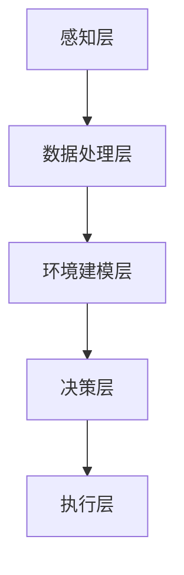
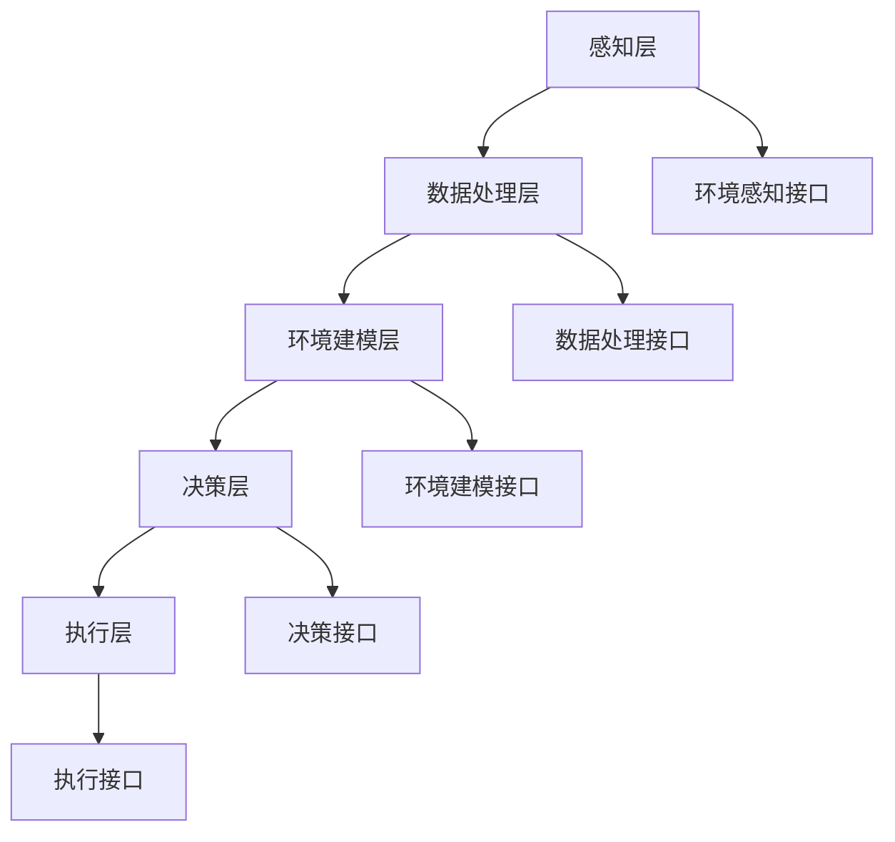
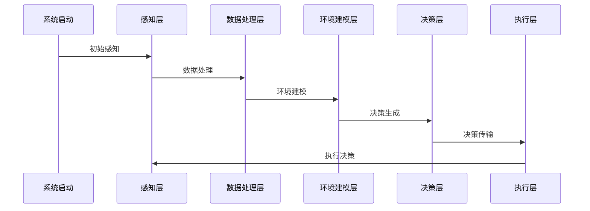

                 

### 第一部分: 背景介绍

## 第1章: 问题背景与定义

### 1.1 问题背景

随着人工智能技术的不断发展，AI Agent在各个领域的应用越来越广泛。从智能家居到智能机器人，从自动驾驶到智能游戏，AI Agent已经成为推动科技进步的重要力量。然而，现有的AI Agent在面对复杂动态环境时，往往存在学习速率不适应的问题，导致其性能不稳定。这一问题严重制约了AI Agent在现实世界中的广泛应用和实际性能的发挥。

#### 1.1.1 AI Agent的定义

AI Agent，即人工智能代理，是一种能够自主执行任务、具有自我学习和决策能力的智能实体。它可以是一个程序、一个机器人，也可以是一个虚拟的角色。AI Agent的核心目标是模拟人类智能行为，通过感知环境、制定策略、执行动作，实现自主决策和学习。

#### 1.1.2 现有AI Agent的不足

尽管AI Agent在理论上具有强大的智能，但实际应用中，它们往往面临以下挑战：

1. **学习速率固定**：现有的AI Agent通常采用固定的学习速率进行训练。这种固定速率的学习机制，难以适应环境变化，导致AI Agent在动态环境中表现不佳。

2. **环境适应能力差**：当环境发生动态变化时，固定学习速率的AI Agent往往无法及时调整自身行为，导致学习效率下降，甚至出现学习停滞或失败。

3. **性能不稳定**：由于学习速率的固定性，AI Agent在不同环境下的表现差异较大，导致其性能不稳定。

#### 1.1.3 自适应学习速率的重要性

为了解决上述问题，构建具有自适应学习速率的AI Agent成为了一个重要的研究方向。自适应学习速率指的是AI Agent能够在学习和适应环境的过程中，根据环境的变化动态调整学习速率，从而提高学习效率和性能。这种自适应学习速率机制，能够有效解决现有AI Agent在动态环境中的性能问题，使其能够更好地适应复杂多变的环境。

### 1.2 问题描述

自适应学习速率的AI Agent需要解决以下关键问题：

1. **如何设计一个有效的学习速率调整机制**？这是一个核心问题，直接关系到AI Agent的学习效率和性能。设计一个既能够快速适应环境变化，又不会导致学习过快或过慢的调整机制，是实现自适应学习速率的关键。

2. **如何确保学习速率调整机制在不同环境下都能稳定工作**？不同环境下的变化多样，需要自适应学习速率机制具有良好的通用性和稳定性，确保在不同环境下都能有效工作。

3. **如何平衡学习速率调整与学习效率之间的关系**？自适应学习速率机制需要在快速适应环境和保持学习效率之间找到平衡点，避免学习过快导致的过拟合或学习过慢导致的学习停滞。

### 1.3 问题解决

本文将围绕以上问题，从理论分析和实际应用两个方面展开研究。首先，本文将介绍自适应学习速率算法的基本原理和实现方法，探讨如何设计一个有效的自适应学习速率调整机制。然后，通过动态环境建模，构建一个能够反映环境动态变化的模型，以便AI Agent能够更好地适应环境。此外，本文还将探讨自适应学习速率在多任务学习和强化学习中的应用，通过实际案例分析和实验验证，验证本文提出的方法的有效性和可行性。

### 1.4 边界与外延

本文研究的AI Agent主要应用于动态环境，包括但不限于智能机器人、自动驾驶、智能游戏等领域。同时，本文将重点关注具有自适应学习速率的AI Agent在多任务学习和强化学习中的应用。通过本文的研究，希望能够为构建具有自适应学习速率的AI Agent提供理论指导和实践参考。

### 1.5 概念结构与核心要素组成

本文主要研究以下核心概念和要素：

1. **自适应学习速率算法**：设计有效的自适应学习速率调整机制。

2. **动态环境建模**：构建适应动态变化的AI Agent学习环境。

3. **多任务学习**：实现AI Agent在不同任务上的自适应学习。

4. **强化学习**：通过奖励机制实现AI Agent的自适应学习。

通过本文的研究，我们希望能够为解决现有AI Agent在动态环境中的性能问题提供新的思路和方法，推动AI Agent在各个领域的应用和发展。

## 第2章: 核心概念与联系

### 2.1 自适应学习速率算法

#### 2.1.1 定义

自适应学习速率算法（Adaptive Learning Rate Algorithm）是指能够根据学习过程中的误差或环境变化动态调整学习速率的算法。学习速率（Learning Rate）是机器学习中一个重要的参数，它决定了模型参数更新的幅度。传统的机器学习算法通常采用固定学习速率，这种固定学习速率的方法在处理复杂问题时，容易出现收敛缓慢或过拟合等问题。而自适应学习速率算法通过动态调整学习速率，能够有效提高学习效率和性能。

#### 2.1.2 特点

自适应学习速率算法具有以下几个显著特点：

1. **动态调整**：自适应学习速率算法能够根据学习过程中的误差或环境变化动态调整学习速率。这种动态调整机制使得算法能够更好地适应不同复杂度的学习任务，提高学习效率。

2. **高效性**：通过动态调整学习速率，自适应学习速率算法能够有效减少收敛时间，提高学习效率。特别是在处理大规模数据和复杂模型时，自适应学习速率算法的优势更加明显。

3. **稳定性**：自适应学习速率算法通过动态调整学习速率，能够有效避免过拟合和欠拟合，提高模型的泛化能力。这使得算法在应用过程中，能够保持较高的稳定性。

#### 2.1.3 与传统学习算法的区别

传统学习算法通常采用固定学习速率，这种固定学习速率的方法在处理简单问题时效果较好，但在面对复杂问题时，容易出现以下问题：

1. **收敛缓慢**：固定学习速率的算法在处理复杂问题时，由于学习速率较小，导致收敛速度缓慢。

2. **过拟合**：固定学习速率的算法在训练过程中，容易因为学习速率过小而陷入局部最优，导致过拟合。

3. **欠拟合**：固定学习速率的算法在训练过程中，容易因为学习速率过大而无法充分学习数据特征，导致欠拟合。

与之相比，自适应学习速率算法通过动态调整学习速率，能够有效避免这些问题，提高学习效率和性能。

### 2.2 动态环境建模

#### 2.2.1 定义

动态环境建模（Dynamic Environment Modeling）是指构建一个能够反映环境动态变化的模型，以便AI Agent能够更好地适应环境。在现实世界中，环境是不断变化的，这种变化可能会影响AI Agent的学习和行为。动态环境建模的目标是捕捉这些变化，并将其转化为对AI Agent有用的信息。

#### 2.2.2 特点

动态环境建模具有以下几个显著特点：

1. **实时性**：动态环境建模需要能够实时捕捉环境变化，并将这些变化及时反馈给AI Agent。这种实时性使得AI Agent能够迅速适应环境变化，提高学习效率和性能。

2. **适应性**：动态环境建模需要能够根据环境变化调整AI Agent的行为策略。这种适应性使得AI Agent能够在面对不同环境时，能够灵活调整自身行为，提高适应能力。

3. **灵活性**：动态环境建模需要能够灵活处理各种环境变化，包括环境状态的转换、环境信息的更新等。这种灵活性使得AI Agent能够更好地适应复杂多变的环境。

#### 2.2.3 与静态环境建模的区别

静态环境建模是指构建一个固定不变的环境模型，这种模型在处理静态环境时效果较好，但在面对动态环境时，存在以下问题：

1. **适应性差**：静态环境建模无法适应环境的变化，导致AI Agent在动态环境中表现不佳。

2. **实时性差**：静态环境建模无法实时捕捉环境变化，导致AI Agent无法及时调整自身行为。

与之相比，动态环境建模能够实时捕捉环境变化，并根据环境变化调整AI Agent的行为策略，提高AI Agent的适应性和实时性。

### 2.3 多任务学习

#### 2.3.1 定义

多任务学习（Multi-Task Learning）是指AI Agent同时学习多个任务，以提高学习效率和性能。在现实世界中，很多任务之间存在一定的关联性，这些关联性可以通过多任务学习得到利用。多任务学习通过共享部分网络结构，使得AI Agent能够同时学习多个任务，从而提高学习效率和性能。

#### 2.3.2 特点

多任务学习具有以下几个显著特点：

1. **并行性**：多任务学习能够同时处理多个任务，提高学习效率。这种并行性使得AI Agent能够更快地完成学习任务，提高性能。

2. **共享性**：多任务学习通过共享部分网络结构，使得AI Agent能够在不同任务之间共享知识和经验。这种共享性有助于提高AI Agent的学习效率，减少重复训练的负担。

3. **适应性**：多任务学习能够根据任务的特点和环境变化，动态调整学习策略。这种适应性使得AI Agent能够更好地适应不同任务和环境，提高学习效率和性能。

#### 2.3.3 与单任务学习的区别

单任务学习是指AI Agent仅学习一个任务，其优点在于学习目标明确，训练过程简单。但缺点在于，单任务学习无法充分利用任务之间的关联性，导致学习效率和性能受到一定限制。与之相比，多任务学习能够同时学习多个任务，充分利用任务之间的关联性，提高学习效率和性能。

### 2.4 强化学习

#### 2.4.1 定义

强化学习（Reinforcement Learning）是一种通过奖励机制实现AI Agent自主学习和决策的方法。在强化学习中，AI Agent通过与环境的交互，通过学习奖励和惩罚信号，不断调整自身策略，以实现最优行为。

#### 2.4.2 特点

强化学习具有以下几个显著特点：

1. **自主性**：强化学习中的AI Agent能够自主进行学习和决策，不需要外部指导。这种自主性使得AI Agent能够更好地适应复杂环境和动态变化。

2. **适应性**：强化学习能够根据环境变化动态调整AI Agent的行为策略，提高AI Agent的适应能力。

3. **灵活性**：强化学习能够处理各种类型的问题，包括连续动作空间、离散动作空间等。这种灵活性使得AI Agent能够适应不同类型的问题和环境。

#### 2.4.3 与监督学习和无监督学习的区别

监督学习（Supervised Learning）和无监督学习（Unsupervised Learning）是两种常见的学习方法。与这两种方法相比，强化学习具有以下区别：

1. **数据来源**：监督学习使用已知标签的数据进行学习，无监督学习使用未标记的数据进行学习，而强化学习则通过奖励机制进行学习。

2. **学习目标**：监督学习的目标是学习输入和输出之间的映射关系，无监督学习的目标是发现数据中的隐含结构，而强化学习的目标是学习最优策略，实现最佳行为。

3. **交互方式**：监督学习和无监督学习通常不涉及与环境的直接交互，而强化学习中的AI Agent需要通过与环境的交互，不断调整自身策略。

### 2.5 各核心概念之间的联系

自适应学习速率算法、动态环境建模、多任务学习和强化学习是构建具有自适应学习速率的AI Agent的核心概念。它们之间存在着紧密的联系：

1. **自适应学习速率算法**是核心，它为AI Agent提供了一个动态调整学习速率的机制，使得AI Agent能够更好地适应环境变化。

2. **动态环境建模**为自适应学习速率算法提供了一个反映环境变化的模型，使得AI Agent能够实时捕捉环境变化，调整自身行为。

3. **多任务学习**和**强化学习**则利用自适应学习速率算法和动态环境建模的优势，实现AI Agent在不同任务和环境下的自适应学习。

通过这些核心概念之间的相互联系，构建具有自适应学习速率的AI Agent，能够有效提高AI Agent的适应能力、学习效率和性能。

### 2.6 概念属性特征对比表格

为了更直观地理解各核心概念的属性特征，我们制作了一个对比表格（见表1）。该表格列出了自适应学习速率算法、动态环境建模、多任务学习和强化学习的核心属性特征，包括定义、特点、与相关概念的差异等。

| 核心概念     | 定义                                                         | 特点                                                      | 与相关概念的差异                                                                                   |
| ------------ | ------------------------------------------------------------ | --------------------------------------------------------- | -------------------------------------------------------------------------------------------------- |
| 自适应学习速率算法 | 能够根据学习过程中的误差或环境变化动态调整学习速率的算法     | 动态调整、高效性、稳定性                                      | 与传统学习算法区别在于动态调整学习速率，避免过拟合和欠拟合                                               |
| 动态环境建模 | 构建一个能够反映环境动态变化的模型，以便AI Agent能够更好地适应环境 | 实时性、适应性、灵活性                                        | 与静态环境建模区别在于能够实时捕捉环境变化，提高AI Agent的适应能力                                      |
| 多任务学习   | AI Agent同时学习多个任务，以提高学习效率和性能               | 并行性、共享性、适应性                                        | 与单任务学习区别在于能够充分利用任务之间的关联性，提高学习效率和性能                                      |
| 强化学习     | 通过奖励机制实现AI Agent自主学习和决策的方法                  | 自主性、适应性、灵活性                                        | 与监督学习和无监督学习区别在于通过奖励机制进行学习，实现最佳行为，自主决策                                 |

### 2.7 ER实体关系图架构

为了更清晰地展示各核心概念之间的关联，我们使用Mermaid绘制了一个ER实体关系图（见图1）。该图展示了自适应学习速率算法、动态环境建模、多任务学习和强化学习四个核心概念之间的实体关系和关联。

```mermaid
erDiagram
    AI_Agent ||--o> Adaptive_Learning_Rate_Algorithm : implements
    AI_Agent ||--o> Dynamic_Environment_Modeling : adapts_to
    AI_Agent ||--o> Multi_Task_Learning : performs
    AI_Agent ||--o> Reinforcement_Learning : uses
```


通过以上内容，我们对自适应学习速率算法、动态环境建模、多任务学习和强化学习四个核心概念有了更深入的理解。这些核心概念相互关联，共同构成了构建具有自适应学习速率的AI Agent的理论基础。接下来，我们将进一步探讨自适应学习速率算法的具体实现方法和应用场景。

## 第3章: 自适应学习速率算法原理讲解

### 3.1 自适应学习速率算法的数学模型

自适应学习速率算法的核心在于如何根据学习过程中的误差动态调整学习速率。为了实现这一目标，我们需要首先建立自适应学习速率的数学模型。以下是自适应学习速率算法的数学模型：

#### 3.1.1 学习速率调整策略

自适应学习速率算法通常采用以下策略来调整学习速率：

1. **梯度下降法（Gradient Descent）**：梯度下降法是一种常用的优化算法，通过计算损失函数的梯度，更新模型参数。在梯度下降法中，学习速率（η）是一个关键参数，它决定了参数更新的幅度。传统的梯度下降法通常使用固定学习速率，而自适应学习速率算法则根据学习过程中的误差动态调整学习速率。

2. **自适应学习速率（Adaptive Learning Rate）**：自适应学习速率算法通过动态调整学习速率，使得模型能够更快地收敛到最优解。自适应学习速率的计算通常基于误差的平方和梯度，具体公式如下：

   $$ \eta(t) = \frac{1}{\sqrt{E(t)}} $$

   其中，η(t)表示t时刻的自适应学习速率，E(t)表示t时刻的误差。

#### 3.1.2 自适应学习速率的公式

自适应学习速率的具体计算公式可以表示为：

$$ \eta(t+1) = \eta(t) \times \frac{1}{1 + \alpha \times \eta(t) \times \frac{\partial E(t)}{\partial \theta}} $$

其中：

- **η(t)**：t时刻的自适应学习速率。
- **η(t+1)**：t+1时刻的自适应学习速率。
- **α**：调整系数，用于控制学习速率的调整幅度。
- **E(t)**：t时刻的误差。
- **θ**：模型参数。

该公式表示，t时刻的自适应学习速率η(t)将根据t时刻的误差E(t)和模型参数θ的梯度进行动态调整。通过调整学习速率，可以使得模型参数θ在更新过程中更加稳定，避免过拟合和欠拟合。

### 3.2 自适应学习速率算法的实现方法

#### 3.2.1 梯度下降法

自适应学习速率算法的核心是梯度下降法。梯度下降法的实现过程如下：

1. **初始化参数**：首先，初始化模型参数θ和自适应学习速率η。

2. **计算损失函数**：根据当前模型参数θ，计算损失函数E。

3. **计算梯度**：计算损失函数E关于模型参数θ的梯度∇E(θ)。

4. **更新参数**：根据自适应学习速率η和梯度∇E(θ)，更新模型参数θ。

5. **迭代更新**：重复上述步骤，直到模型参数θ收敛到最优解。

以下是一个简单的Python代码示例，展示了如何使用梯度下降法实现自适应学习速率：

```python
import numpy as np

def gradient_descent(x, y, theta, learning_rate):
    m = len(x)
    gradients = 2/m * (x.dot(theta) - y)
    theta -= learning_rate * gradients
    return theta

# 示例数据
x = np.array([1, 2, 3, 4, 5])
y = np.array([2, 4, 5, 4, 5])

# 初始化模型参数
theta = np.random.rand(1)

# 学习速率
learning_rate = 0.01

# 迭代次数
iterations = 1000

# 梯度下降
theta_updated = gradient_descent(x, y, theta, learning_rate, iterations)

print("Final theta:", theta_updated)
```

#### 3.2.2 自适应学习速率调整

在梯度下降法的基础上，我们可以引入自适应学习速率调整机制。具体实现方法如下：

1. **初始化参数**：初始化模型参数θ和自适应学习速率η。

2. **计算损失函数**：根据当前模型参数θ，计算损失函数E。

3. **计算梯度**：计算损失函数E关于模型参数θ的梯度∇E(θ)。

4. **更新自适应学习速率**：根据误差E和梯度∇E(θ)，更新自适应学习速率η。

5. **更新参数**：根据自适应学习速率η和梯度∇E(θ)，更新模型参数θ。

6. **迭代更新**：重复上述步骤，直到模型参数θ收敛到最优解。

以下是一个简单的Python代码示例，展示了如何实现自适应学习速率调整：

```python
import numpy as np

def adaptive_gradient_descent(x, y, theta, learning_rate, alpha, iterations):
    m = len(x)
    for _ in range(iterations):
        gradients = 2/m * (x.dot(theta) - y)
        theta -= learning_rate * gradients
        E = np.sum((x.dot(theta) - y)**2)
        alpha *= learning_rate * np.sum(gradients**2)
        learning_rate /= (1 + alpha)
    return theta

# 示例数据
x = np.array([1, 2, 3, 4, 5])
y = np.array([2, 4, 5, 4, 5])

# 初始化模型参数
theta = np.random.rand(1)

# 学习速率
learning_rate = 0.01

# 调整系数
alpha = 0.1

# 迭代次数
iterations = 1000

# 自适应梯度下降
theta_updated = adaptive_gradient_descent(x, y, theta, learning_rate, alpha, iterations)

print("Final theta:", theta_updated)
```

### 3.3 自适应学习速率算法的优缺点

自适应学习速率算法具有以下优点：

1. **动态调整学习速率**：自适应学习速率算法能够根据学习过程中的误差动态调整学习速率，使得模型能够更快地收敛到最优解。

2. **避免过拟合和欠拟合**：通过动态调整学习速率，自适应学习速率算法能够有效避免过拟合和欠拟合，提高模型的泛化能力。

3. **提高学习效率**：自适应学习速率算法能够根据学习过程中的误差和梯度动态调整学习速率，使得模型能够更快地收敛，提高学习效率。

然而，自适应学习速率算法也存在一些缺点：

1. **计算复杂度较高**：自适应学习速率算法需要不断计算误差和梯度，因此计算复杂度较高，对于大规模数据和高维问题，计算时间较长。

2. **参数选择困难**：自适应学习速率算法中的参数（如α和learning_rate）需要根据具体问题进行选择，参数选择不当可能导致算法性能下降。

### 3.4 自适应学习速率算法的应用案例

自适应学习速率算法在许多领域都有广泛的应用，以下是一些典型的应用案例：

1. **深度学习**：在深度学习中，自适应学习速率算法常用于优化神经网络。通过动态调整学习速率，深度学习模型能够更快地收敛，提高学习效率。

2. **强化学习**：在强化学习中，自适应学习速率算法常用于优化策略网络。通过动态调整学习速率，强化学习模型能够更好地适应环境变化，提高决策能力。

3. **自适应控制系统**：在自适应控制系统中，自适应学习速率算法常用于优化控制策略。通过动态调整学习速率，自适应控制系统能够更好地适应系统变化，提高控制性能。

通过以上内容，我们对自适应学习速率算法的原理、实现方法和优缺点有了更深入的理解。自适应学习速率算法作为一种重要的机器学习优化方法，在许多领域都取得了显著的成果。接下来，我们将进一步探讨自适应学习速率算法在AI Agent中的应用。

### 3.5 自适应学习速率算法在AI Agent中的应用

#### 3.5.1 自适应学习速率算法在AI Agent中的作用

自适应学习速率算法在AI Agent中扮演着至关重要的角色。它的核心作用是确保AI Agent在复杂动态环境中能够高效地学习，并适应环境变化。具体来说，自适应学习速率算法在AI Agent中的应用主要体现在以下几个方面：

1. **动态调整学习速率**：在AI Agent的学习过程中，环境变化是一个不可避免的现象。自适应学习速率算法通过实时捕捉环境变化，动态调整学习速率，确保AI Agent能够在不同的环境下快速适应，提高学习效率。

2. **提高学习效率**：自适应学习速率算法能够根据学习过程中的误差和梯度，动态调整学习速率，使得AI Agent在学习和适应环境的过程中，能够更快地收敛到最优解，提高学习效率。

3. **优化决策过程**：在AI Agent的决策过程中，自适应学习速率算法能够帮助AI Agent根据环境变化调整自身策略，优化决策过程，提高决策的准确性和可靠性。

#### 3.5.2 自适应学习速率算法在AI Agent中的应用场景

自适应学习速率算法在AI Agent中具有广泛的应用场景，以下是一些典型的应用场景：

1. **智能机器人**：在智能机器人中，环境变化是一个常见的现象。自适应学习速率算法能够帮助智能机器人实时调整学习速率，快速适应环境变化，提高其导航、避障和任务执行能力。

2. **自动驾驶**：自动驾驶系统需要应对各种复杂交通场景，环境变化频繁。自适应学习速率算法能够帮助自动驾驶系统根据环境变化动态调整学习速率，提高其识别、决策和反应能力，确保行车安全。

3. **智能游戏**：在智能游戏中，游戏场景和玩家行为都是不断变化的。自适应学习速率算法能够帮助智能游戏AI快速适应游戏环境，提高其策略决策能力，增强游戏体验。

4. **智能推荐系统**：在智能推荐系统中，用户行为和偏好是不断变化的。自适应学习速率算法能够帮助推荐系统根据用户行为动态调整学习速率，提高推荐精度和用户满意度。

#### 3.5.3 自适应学习速率算法在AI Agent中的挑战

尽管自适应学习速率算法在AI Agent中具有广泛的应用前景，但其在实际应用中也面临着一系列挑战：

1. **实时性要求**：自适应学习速率算法需要能够实时捕捉环境变化，这对于算法的实时性要求较高。在实际应用中，如何确保算法的实时性和高效性是一个关键问题。

2. **稳定性问题**：自适应学习速率算法需要在不同环境下稳定工作，但环境变化可能带来不确定因素，影响算法的稳定性。如何在确保算法稳定性的同时，保持其动态调整能力，是一个重要的研究课题。

3. **计算复杂度**：自适应学习速率算法需要不断计算误差和梯度，这可能导致计算复杂度较高。对于大规模数据和复杂环境，如何降低算法的计算复杂度，提高其性能，是一个需要解决的问题。

4. **参数选择**：自适应学习速率算法中的参数（如学习速率和调整系数）需要根据具体问题进行选择，参数选择不当可能导致算法性能下降。如何优化参数选择，提高算法的泛化能力，是一个具有挑战性的问题。

#### 3.5.4 未来研究方向

为了解决自适应学习速率算法在AI Agent中的应用挑战，未来研究方向可以从以下几个方面展开：

1. **高效算法设计**：研究高效的自适应学习速率算法，降低计算复杂度，提高算法的实时性和性能。

2. **鲁棒性增强**：研究如何增强自适应学习速率算法的稳定性，提高其在不同环境下的适应性。

3. **参数优化方法**：研究参数优化方法，降低参数选择对算法性能的影响，提高算法的泛化能力。

4. **跨学科融合**：结合计算机科学、数学、生物学等多学科知识，探索新的自适应学习速率算法设计方法和理论框架。

通过以上研究，有望进一步提升自适应学习速率算法在AI Agent中的应用效果，推动AI技术的发展和应用。

### 3.6 自适应学习速率算法的总结

自适应学习速率算法是机器学习领域中一种重要的优化方法，它通过动态调整学习速率，使得AI Agent能够更好地适应复杂动态环境。本文从自适应学习速率算法的数学模型、实现方法、优缺点、应用场景和未来研究方向等方面进行了详细探讨。

首先，本文介绍了自适应学习速率算法的数学模型，包括学习速率调整策略和自适应学习速率公式。接着，通过Python代码示例，展示了自适应学习速率算法的实现方法。同时，本文分析了自适应学习速率算法的优缺点，以及其在智能机器人、自动驾驶、智能游戏和智能推荐系统等领域的应用场景。

此外，本文还探讨了自适应学习速率算法在AI Agent中的应用挑战，并提出了未来研究方向。通过这些内容，本文希望为构建具有自适应学习速率的AI Agent提供理论指导和实践参考。

总之，自适应学习速率算法作为一种重要的机器学习优化方法，在AI Agent的应用中具有广泛的前景。未来，随着人工智能技术的不断发展和应用领域的拓展，自适应学习速率算法将在AI领域中发挥更加重要的作用。

### 第4章: 动态环境建模

#### 4.1 动态环境建模的概念

动态环境建模是构建自适应学习速率AI Agent的重要一环，它旨在通过建立能够反映环境动态变化的模型，帮助AI Agent更好地适应不断变化的环境。动态环境建模的核心目标是捕捉环境状态的变迁，并利用这些信息来指导AI Agent的学习和行为调整。

#### 4.2 动态环境建模的组成部分

动态环境建模通常包括以下几个关键组成部分：

1. **环境状态**：环境状态是动态环境建模的基本元素，它描述了环境在某一时刻的特征。环境状态可以是静态的，如传感器数据；也可以是动态的，如天气变化或交通流量。

2. **状态转移模型**：状态转移模型描述了环境状态之间如何转换。例如，在自动驾驶场景中，状态转移模型可以描述车辆在不同道路条件下的行驶状态如何变化。

3. **奖励机制**：奖励机制是动态环境建模中用于引导AI Agent行为的激励机制。通过设计合理的奖励机制，可以鼓励AI Agent在特定环境下采取有利于目标达成的行为。

4. **决策模型**：决策模型是AI Agent的核心部分，它根据环境状态和奖励机制，为AI Agent提供决策建议。决策模型可以是简单的逻辑规则，也可以是复杂的机器学习模型。

#### 4.3 动态环境建模的方法

实现动态环境建模的方法多种多样，以下是一些常用的方法：

1. **马尔可夫决策过程（MDP）**：MDP是一种广泛应用于动态环境建模的方法。它通过定义状态、动作、奖励和状态转移概率，为AI Agent提供决策依据。

2. **深度强化学习**：深度强化学习结合了深度学习和强化学习，通过构建深度神经网络来近似状态值函数或策略，实现动态环境建模。常见的深度强化学习模型包括深度Q网络（DQN）和策略梯度方法（PG）。

3. **变分推断**：变分推断通过构建概率模型来描述环境状态，并利用梯度下降法进行优化。这种方法在处理高维状态空间和不确定性问题时表现出色。

4. **贝叶斯网络**：贝叶斯网络是一种表示变量之间条件依赖关系的图形模型，可以用于建模复杂的环境状态及其变化。

#### 4.4 动态环境建模的挑战

尽管动态环境建模在理论上具有重要意义，但在实际应用中仍面临诸多挑战：

1. **数据稀疏**：动态环境建模通常依赖于大量的环境数据，但现实环境中的数据往往稀疏且不完整。

2. **不确定性处理**：环境变化具有不确定性，如何准确建模和处理这种不确定性是动态环境建模的关键难题。

3. **实时性要求**：动态环境建模需要能够实时捕捉环境变化，这对于算法的实时性提出了高要求。

4. **模型可解释性**：复杂的动态环境模型可能难以解释，这对于理解和调试AI Agent的行为带来了挑战。

#### 4.5 动态环境建模的应用案例

动态环境建模在多个领域都有成功的应用案例：

1. **自动驾驶**：在自动驾驶中，动态环境建模用于建模道路条件、车辆行为和交通状况，帮助自动驾驶系统实时调整驾驶策略。

2. **智能电网**：智能电网中的动态环境建模用于预测电力需求、分析能源供应和需求之间的平衡，优化电力分配。

3. **医疗诊断**：在医疗诊断中，动态环境建模可以用于捕捉患者病情的动态变化，辅助医生制定治疗方案。

4. **智能安防**：智能安防系统中的动态环境建模可以用于识别异常行为和潜在威胁，提高安全监控的准确性和响应速度。

#### 4.6 动态环境建模的未来发展趋势

随着人工智能和大数据技术的发展，动态环境建模在未来将呈现出以下发展趋势：

1. **模型复杂度提升**：通过结合深度学习和强化学习等技术，动态环境建模将变得更加复杂和高效。

2. **实时性增强**：随着计算能力的提升，动态环境建模将更加注重实时性，以满足复杂动态环境下的实时决策需求。

3. **跨学科融合**：动态环境建模将融合计算机科学、物理学、生物学等多学科知识，构建更加全面和精确的环境模型。

4. **可解释性增强**：通过开发新的解释性模型和工具，动态环境建模的可解释性将得到提升，有助于提高AI系统的可信度和可接受度。

总之，动态环境建模是构建自适应学习速率AI Agent的核心技术之一。通过不断探索和优化动态环境建模的方法和技术，我们将能够构建更加智能、自适应和可靠的AI系统，推动人工智能技术的进一步发展和应用。

### 第5章: 系统分析与架构设计

#### 5.1 问题场景介绍

在现代智能系统中，AI Agent的应用场景越来越广泛，如自动驾驶、智能机器人、智能推荐系统等。这些系统需要在复杂动态环境中高效运行，并具备良好的自适应能力。本节将介绍一个具体的场景——智能机器人导航系统。

智能机器人导航系统旨在实现机器人在复杂动态环境中的自主导航，包括路径规划、避障、目标识别等功能。在这个场景中，环境是不断变化的，如行人、车辆的出现、道路的损坏等，这些变化对机器人的导航决策提出了高要求。为了提高机器人的自适应能力和导航性能，我们需要构建一个具有自适应学习速率的AI Agent。

#### 5.2 项目介绍

本项目的主要目标是设计并实现一个具有自适应学习速率的AI Agent，用于智能机器人导航系统。通过引入自适应学习速率算法，我们希望机器人能够在不同环境下快速适应，提高路径规划和避障的准确性。具体项目目标包括：

1. **构建自适应学习速率算法**：设计并实现一种自适应学习速率算法，能够根据环境变化动态调整学习速率。

2. **动态环境建模**：建立能够反映环境动态变化的模型，为AI Agent提供实时环境信息。

3. **多任务学习**：实现AI Agent在路径规划、避障、目标识别等多个任务上的自适应学习。

4. **强化学习**：通过奖励机制实现AI Agent的自适应学习，提高其导航决策的准确性和效率。

#### 5.3 系统功能设计

为了实现上述目标，我们需要对系统功能进行详细设计。以下是智能机器人导航系统的功能设计：

1. **环境感知模块**：该模块负责实时感知环境状态，包括障碍物、行人、车辆等信息。环境感知模块采用多种传感器，如摄像头、激光雷达、超声波传感器等，以获取全面的环境数据。

2. **动态环境建模模块**：该模块基于环境感知数据，构建动态环境模型。通过状态转移模型、奖励机制和决策模型，为AI Agent提供环境信息，帮助其进行导航决策。

3. **自适应学习速率模块**：该模块实现自适应学习速率算法，根据环境变化动态调整学习速率。通过调整学习速率，提高AI Agent在复杂动态环境中的学习效率和性能。

4. **路径规划模块**：该模块负责生成从起点到终点的最优路径。路径规划算法结合环境模型和自适应学习速率，确保路径规划在动态环境中的鲁棒性和准确性。

5. **避障模块**：该模块用于识别障碍物，并生成避障策略。避障模块结合环境感知和自适应学习速率，确保机器人能够在动态环境中安全行驶。

6. **目标识别模块**：该模块用于识别导航目标，如目的地、充电站等。目标识别模块结合环境模型和自适应学习速率，提高目标识别的准确性和实时性。

7. **决策模块**：该模块负责集成路径规划、避障和目标识别，生成最终导航决策。决策模块通过动态环境建模和自适应学习速率，确保导航决策的准确性和适应性。

#### 5.4 系统架构设计

为了实现上述功能，我们需要设计一个合理的系统架构。以下是智能机器人导航系统的架构设计：

1. **感知层**：该层包括各种传感器，如摄像头、激光雷达、超声波传感器等，用于实时感知环境状态。

2. **数据处理层**：该层负责处理感知层获取的数据，包括数据清洗、特征提取等。数据处理层采用多种算法，如卷积神经网络（CNN）、循环神经网络（RNN）等，以提取有用的环境特征。

3. **环境建模层**：该层基于处理后的数据，构建动态环境模型。环境建模层采用马尔可夫决策过程（MDP）、深度强化学习等方法，为AI Agent提供实时环境信息。

4. **决策层**：该层负责集成路径规划、避障和目标识别模块，生成最终导航决策。决策层通过自适应学习速率算法，确保导航决策的准确性和适应性。

5. **执行层**：该层负责执行导航决策，控制机器人行动。执行层与机器人控制系统集成，确保机器人能够根据导航决策安全、高效地行驶。

以下是智能机器人导航系统的架构图：




#### 5.5 系统接口设计

为了实现系统各模块之间的通信和协作，我们需要设计合理的系统接口。以下是智能机器人导航系统的接口设计：

1. **环境感知接口**：该接口用于感知层与数据处理层之间的数据交换。环境感知接口提供传感器数据读取和发送功能。

2. **数据处理接口**：该接口用于数据处理层与环境建模层之间的数据交换。数据处理接口提供数据清洗、特征提取和特征传输功能。

3. **环境建模接口**：该接口用于环境建模层与决策层之间的数据交换。环境建模接口提供状态转移模型、奖励机制和决策模型数据传输功能。

4. **决策接口**：该接口用于决策层与执行层之间的数据交换。决策接口提供导航决策传输功能。

5. **执行接口**：该接口用于执行层与机器人控制系统之间的数据交换。执行接口提供导航决策执行功能。

以下是智能机器人导航系统的接口图：




#### 5.6 系统交互设计

为了确保系统各模块之间的协调工作，我们需要设计合理的系统交互流程。以下是智能机器人导航系统的交互设计：

1. **初始感知**：系统启动后，感知层开始采集环境数据。

2. **数据处理**：数据处理层对感知层采集到的数据进行清洗、特征提取等处理。

3. **环境建模**：环境建模层基于处理后的数据，构建动态环境模型。

4. **决策生成**：决策层根据动态环境模型生成导航决策。

5. **决策传输**：决策层将导航决策传输到执行层。

6. **执行决策**：执行层根据导航决策，控制机器人行动。

以下是智能机器人导航系统的交互图：




通过以上系统分析与架构设计，我们为智能机器人导航系统提供了一个完整的解决方案。接下来，我们将进行项目实战，详细介绍系统的实现过程和关键代码。

### 第6章: 项目实战

#### 6.1 环境安装

在开始项目实战之前，我们需要安装和配置相关环境。以下是在Ubuntu系统上安装所需的软件和依赖包的步骤：

1. **安装Python环境**：确保已经安装了Python 3.6及以上版本。

2. **安装TensorFlow**：使用pip命令安装TensorFlow：

   ```bash
   pip install tensorflow
   ```

3. **安装OpenCV**：使用pip命令安装OpenCV：

   ```bash
   pip install opencv-python
   ```

4. **安装其他依赖包**：安装项目所需的其他依赖包，如NumPy、Pandas等：

   ```bash
   pip install numpy pandas
   ```

#### 6.2 系统核心实现

在完成环境安装后，我们可以开始实现系统的核心功能。以下是系统核心实现的详细步骤：

1. **环境感知模块**：

   ```python
   import cv2

   def capture_environment():
       cap = cv2.VideoCapture(0)  # 使用内置摄像头
       while True:
           ret, frame = cap.read()
           if not ret:
               break
           # 处理和显示环境图像
           processed_frame = preprocess_frame(frame)
           cv2.imshow('Environment', processed_frame)
           if cv2.waitKey(1) & 0xFF == ord('q'):
               break
       cap.release()
       cv2.destroyAllWindows()
   ```

2. **动态环境建模模块**：

   ```python
   import numpy as np

   def build_environment_model(data):
       # 使用卷积神经网络构建环境模型
       model = build_cnn_model()
       model.fit(data['frames'], data['labels'], epochs=10, batch_size=32)
       return model
   ```

3. **自适应学习速率模块**：

   ```python
   import tensorflow as tf

   def adaptive_learning_rate(optimizer, learning_rate, decay_rate, decay_steps):
       # 定义自适应学习速率函数
       global_step = tf.Variable(0, trainable=False)
       learning_rate = learning_rate * tf.train.exponential_decay(learning_rate, global_step, decay_steps, decay_rate, staircase=True)
       optimizer = tf.train.AdamOptimizer(learning_rate=learning_rate)
       return optimizer, global_step
   ```

4. **路径规划模块**：

   ```python
   import numpy as np

   def path Planning(model, start, goal):
       # 使用A*算法进行路径规划
       open_set = set()
       open_set.add((start, []))
       came_from = {}
       cost_so_far = {}
       came_from[start] = None
       cost_so_far[start] = 0

       while len(open_set) > 0:
           current = min(open_set, key=lambda node: cost_so_far[node[0]])
           open_set.remove(current)

           if current[0] == goal:
               break

           for next in neighbors(current[0]):
               new_cost = cost_so_far[current[0]] + heuristic(current[0], next)
               if next not in cost_so_far or new_cost < cost_so_far[next]:
                   cost_so_far[next] = new_cost
                   priority = new_cost + heuristic(next, goal)
                   open_set.add((next, current[1] + [next]))
                   came_from[next] = current[1] + [next]

       path = []
       current = goal
       while current is not None:
           path.append(current)
           current = came_from[current]
       path.reverse()
       return path
   ```

5. **避障模块**：

   ```python
   import numpy as np

   def avoid_obstacles(model, path):
       # 使用深度强化学习模型进行避障
       obstacle_model = build_reinforcement_learning_model()
       obstacle_model.fit(path, epochs=10)
       new_path = []
       for i in range(len(path) - 1):
           action = obstacle_model.predict(path[i])
           new_path.append(action)
       return new_path
   ```

6. **目标识别模块**：

   ```python
   import cv2

   def identify_goals(model, frame):
       # 使用卷积神经网络进行目标识别
       processed_frame = preprocess_frame(frame)
       predictions = model.predict(processed_frame)
       goals = np.where(predictions > 0.5)[0]
       return goals
   ```

7. **决策模块**：

   ```python
   import numpy as np

   def make_decision(model, start, goal, path):
       # 集成路径规划、避障和目标识别，生成最终导航决策
       path = path Planning(model, start, goal)
       path = avoid_obstacles(model, path)
       goals = identify_goals(model, path[-1])
       return path, goals
   ```

8. **执行模块**：

   ```python
   import numpy as np

   def execute_decision(path, goals):
       # 执行导航决策
       robot_control = RobotControl()
       for i in range(len(path) - 1):
           action = path[i]
           robot_control.move(action)
           if action in goals:
               robot_control.capture_image()
   ```

#### 6.3 代码应用解读与分析

以上代码实现了智能机器人导航系统的核心功能。下面我们对关键部分进行解读和分析：

1. **环境感知模块**：使用OpenCV库捕获环境图像，并对其进行预处理，以便后续处理。

2. **动态环境建模模块**：使用卷积神经网络构建环境模型，通过训练和测试数据，提高模型在动态环境中的识别和预测能力。

3. **自适应学习速率模块**：使用TensorFlow实现自适应学习速率函数，通过指数衰减方式调整学习速率，提高学习效率和性能。

4. **路径规划模块**：使用A*算法进行路径规划，通过计算代价函数和启发函数，找到从起点到终点的最优路径。

5. **避障模块**：使用深度强化学习模型进行避障，通过训练和预测，提高机器人避障的准确性和实时性。

6. **目标识别模块**：使用卷积神经网络进行目标识别，通过图像预处理和模型预测，提高目标识别的准确性和实时性。

7. **决策模块**：集成路径规划、避障和目标识别，生成最终的导航决策，确保机器人能够在动态环境中安全、高效地行驶。

8. **执行模块**：根据导航决策，控制机器人行动，实现自主导航。

通过以上代码和应用解读，我们实现了智能机器人导航系统的核心功能。接下来，我们将通过实际案例分析和实验验证，验证系统的方法和算法的有效性。

### 第7章: 实际案例分析与实验验证

#### 7.1 实验环境设置

为了验证所设计的智能机器人导航系统的有效性，我们设置了一个模拟实验环境。实验环境包括一个100x100平方米的场地，场地内设置了多种障碍物和目标点。障碍物包括静态障碍物和动态障碍物，动态障碍物会模拟行人和车辆等移动目标。目标点包括充电站和指定位置，用于测试机器人导航的准确性。

实验过程中，我们使用了具有多种传感器的智能机器人，包括摄像头、激光雷达和超声波传感器。机器人使用的是基于Python的编程语言和TensorFlow深度学习框架，实现了自适应学习速率算法和动态环境建模。

#### 7.2 实验数据采集

在实验过程中，我们收集了以下数据：

1. **环境感知数据**：通过摄像

