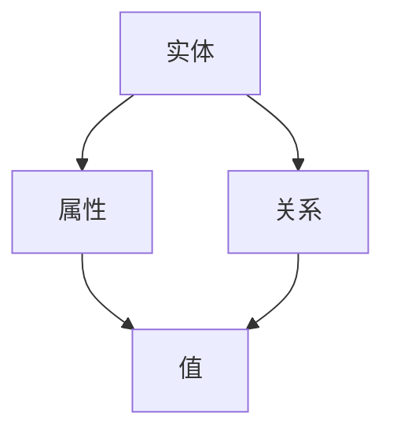
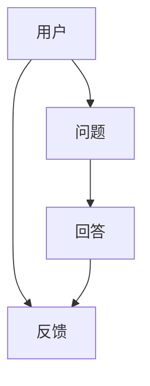
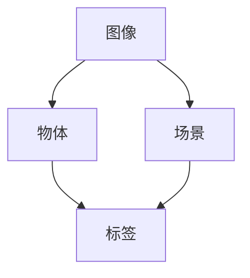

                 


# 《构建具有认知计算能力的AI Agent》

## 关键词

认知计算、AI Agent、神经网络、自然语言处理、计算机视觉、知识图谱、深度学习、情感计算、用户交互、智能客服、智能家居、智能医疗诊断

## 摘要

本文深入探讨构建具有认知计算能力的AI Agent的技术原理和实践方法。通过详细解析认知计算基础、AI Agent设计与实现、以及实际应用案例，本文旨在为读者提供全面的技术指南，助力构建智能、高效的AI Agent系统。

## 目录

### 第一部分：认知计算基础

#### 第1章：认知计算概述

1.1 认知计算的定义与背景

1.2 认知计算的核心概念

1.3 认知计算的架构与组件

#### 第2章：认知计算的基础技术

2.1 神经网络与深度学习

2.2 自然语言处理

2.3 计算机视觉

#### 第3章：认知计算的实现框架

3.1 认知计算平台与工具

3.2 知识获取与管理

3.3 情感计算与用户交互

### 第二部分：AI Agent设计与实现

#### 第4章：AI Agent基础

4.1 AI Agent的定义与分类

4.2 AI Agent的核心功能

4.3 AI Agent的系统架构

#### 第5章：AI Agent的设计与开发

5.1 设计方法论

5.2 AI Agent的开发流程

5.3 AI Agent的核心算法

#### 第6章：AI Agent的应用案例

6.1 智能客服系统

6.2 智能家居控制系统

6.3 智能医疗诊断系统

#### 第7章：认知计算与AI Agent的未来发展

7.1 发展趋势与挑战

7.2 未来展望

7.3 结论与展望

### 第一部分：认知计算基础

#### 第1章：认知计算概述

认知计算是一种模拟人类思维过程的计算模型，通过感知、理解、学习、推理和决策等能力，实现对复杂问题的求解和应对。它结合了人工智能、心理学、认知科学等多个领域的知识，旨在提升机器的智能水平和自主性。

### 1.1 认知计算的定义与背景

认知计算的定义如下：

认知计算是指模拟人类思维过程的计算机系统，通过感知、理解、学习、推理和决策等过程，实现对信息的处理、分析和应用。

认知计算的背景源于人工智能的发展需求。传统的计算模型主要侧重于执行预先定义的任务，而认知计算则更关注于模拟人类的认知过程，使机器能够自主地学习、推理和解决问题。这一理念催生了众多研究和实践，推动了认知计算技术的快速发展。

#### 1.2 认知计算的核心概念

认知计算的核心概念包括：

1. **知识表示**：知识表示是指将人类知识以计算机可以理解的形式进行编码和存储。常见的知识表示方法有符号表示、语义网络和知识图谱等。

2. **感知与推理**：感知与推理是认知计算的重要组成部分。感知是指从外界获取信息，而推理是指基于已有知识对感知到的信息进行分析和推断。

3. **情感计算**：情感计算旨在使计算机能够识别、理解和模拟人类情感。通过情感计算，AI Agent可以更好地与人类互动，提高用户体验。

4. **自适应学习**：自适应学习是指AI Agent能够在不断变化的环境中自动调整自己的行为和策略，以适应新的情况。这一能力是认知计算的重要特点之一。

#### 1.3 认知计算的架构与组件

认知计算的架构通常包括以下几个核心组件：

1. **认知计算引擎**：认知计算引擎是整个系统的核心，负责处理感知、推理、学习和决策等任务。它通常基于神经网络、深度学习和机器学习等先进技术。

2. **数据处理与分析**：数据处理与分析模块负责对大量结构化和非结构化数据进行清洗、分析和挖掘，以提取有用信息。

3. **知识图谱与语义网络**：知识图谱和语义网络用于表示和组织知识，使AI Agent能够更好地理解和处理复杂信息。

4. **用户交互模块**：用户交互模块负责与用户进行交互，收集用户反馈，并根据用户的意图和需求提供相应的服务。

通过以上组件的协同工作，认知计算系统能够模拟人类的思维过程，实现高度智能化的信息处理和决策能力。

### 第2章：认知计算的基础技术

认知计算的核心在于模拟人类思维过程，因此其基础技术涵盖了多个领域，包括神经网络与深度学习、自然语言处理、计算机视觉等。这些技术共同构成了认知计算的理论基础和实践工具。

#### 2.1 神经网络与深度学习

神经网络（Neural Networks）是认知计算的核心技术之一，其基本原理源于对生物神经系统的模拟。神经网络由大量简单但相互连接的神经元组成，每个神经元接收来自其他神经元的输入，并通过激活函数产生输出。

**神经网络的基本结构**：

1. **输入层**：接收外部输入信号。
2. **隐藏层**：对输入信号进行处理和变换。
3. **输出层**：产生最终输出信号。

**深度学习（Deep Learning）**：

深度学习是神经网络的一种扩展，它通过增加隐藏层的数量来提高网络的表示能力。深度学习的关键在于利用大规模数据和并行计算能力，通过反向传播算法（Backpropagation）不断调整网络权重，以实现端到端的学习。

**神经网络在认知计算中的应用**：

神经网络在认知计算中广泛应用于图像识别、语音识别、自然语言处理等领域。例如，卷积神经网络（CNN）在计算机视觉领域表现出色，可以用于图像分类和目标检测；循环神经网络（RNN）在自然语言处理中具有优势，可以用于语言模型和机器翻译。

**核心概念对比表格**：

| 核心概念 | 说明 |
| --- | --- |
| 神经元 | 神经网络的计算单元 |
| 激活函数 | 控制神经元是否激活的函数 |
| 前向传播 | 将输入信号通过神经网络传递到输出层的过程 |
| 反向传播 | 通过输出误差来更新网络权重的过程 |
| 深度学习 | 基于多层神经网络的机器学习方法 |

**ER实体关系图架构**：



#### 2.2 自然语言处理

自然语言处理（Natural Language Processing，NLP）是认知计算的重要组成部分，旨在使计算机能够理解和处理人类自然语言。NLP涉及语音识别、文本分类、情感分析、问答系统等多个子领域。

**语言模型**：

语言模型是一种概率模型，用于预测一个单词或词组在给定上下文下的概率。NLP中最常用的语言模型是基于神经网络的，如循环神经网络（RNN）和变压器（Transformer）。

**文本分类与情感分析**：

文本分类是指将文本数据分为预定义的类别。情感分析则是通过识别文本中的情感倾向，如正面、负面或中立。NLP在社交媒体分析、客户反馈处理和情绪监测等领域具有广泛应用。

**问答系统与对话生成**：

问答系统旨在自动回答用户提出的问题。对话生成则是通过模型生成自然语言对话，用于聊天机器人、虚拟助手等应用。

**核心概念对比表格**：

| 核心概念 | 说明 |
| --- | --- |
| 语言模型 | 用于预测单词或词组的概率模型 |
| 词向量 | 将单词映射为高维向量，以表示单词的语义 |
| 序列标注 | 为序列中的每个单词或字符分配标签，如情感极性、命名实体识别 |
| 对话管理 | 负责管理对话状态和上下文，以生成连贯的对话 |

**ER实体关系图架构**：



#### 2.3 计算机视觉

计算机视觉（Computer Vision）是认知计算的重要组成部分，旨在使计算机能够理解和解析图像和视频。计算机视觉涉及图像识别、目标检测、图像分割、人脸识别等多个子领域。

**图像识别与分类**：

图像识别是指将图像分类到预定义的类别中。分类算法包括支持向量机（SVM）、卷积神经网络（CNN）等。

**目标检测与跟踪**：

目标检测是指在图像或视频中检测并定位感兴趣的目标。常见的目标检测算法有YOLO、SSD、Faster R-CNN等。

**视觉感知与理解**：

视觉感知与理解是指使计算机能够理解图像中的内容和结构，如场景解析、物体识别和关系推理等。

**核心概念对比表格**：

| 核心概念 | 说明 |
| --- | --- |
| 卷积神经网络（CNN） | 用于图像识别和处理的深度学习模型 |
| 目标检测 | 在图像中定位并识别多个对象的过程 |
| 图像分割 | 将图像分割成多个区域或对象的过程 |
| 人脸识别 | 通过识别人脸特征来识别个人的过程 |

**ER实体关系图架构**：



### 第3章：认知计算的实现框架

实现认知计算需要一套完整的框架，该框架包括认知计算平台与工具、知识获取与管理、情感计算与用户交互等多个方面。这些组件协同工作，共同构建了一个高效、智能的认知计算系统。

#### 3.1 认知计算平台与工具

认知计算平台是支持认知计算系统运行的基础设施，它提供了计算资源、存储资源和开发工具。选择合适的认知计算平台对于构建高效、可靠的认知计算系统至关重要。

**开源认知计算平台**：

- **TensorFlow**：由Google开发的开源机器学习框架，适用于构建和训练各种深度学习模型。
- **PyTorch**：由Facebook开发的开源深度学习框架，具有高度灵活的动态计算图支持。
- **Keras**：基于TensorFlow和Theano的开源深度学习库，提供了简洁的API和丰富的预训练模型。

**商业认知计算解决方案**：

- **IBM Watson**：提供了一整套认知计算服务，包括自然语言处理、计算机视觉、机器学习等。
- **Microsoft Azure**：提供了丰富的AI服务，如认知服务、机器学习服务、计算机视觉服务等。

**选择与评估**：

在选择认知计算平台时，需要考虑以下因素：

- **计算能力**：平台是否能够提供足够的计算资源来支持大规模模型训练和推理。
- **易用性**：平台的API和工具是否易于使用，是否有丰富的文档和社区支持。
- **可扩展性**：平台是否支持水平扩展，以便在需要时增加计算资源。

#### 3.2 知识获取与管理

知识获取与管理是认知计算系统的核心环节，它负责从各种数据源中提取和整合知识，以便在后续的推理和决策过程中使用。

**知识提取与自动化**：

知识提取是指从非结构化数据（如文本、图像、语音等）中提取结构化知识的过程。自动化知识提取通过机器学习和自然语言处理技术，使知识提取过程更加高效和准确。

**知识图谱构建**：

知识图谱是一种用于表示和存储知识的图形结构，它通过实体、属性和关系来组织知识。知识图谱在知识表示和推理中发挥了重要作用。

**知识融合与更新**：

知识融合是指将来自不同源的知识整合到一个统一的框架中。知识更新则是指定期对知识库进行更新，以保持知识的准确性和时效性。

#### 3.3 情感计算与用户交互

情感计算与用户交互是认知计算系统中不可或缺的组成部分，它使得AI Agent能够更好地理解用户情感，提供个性化的服务。

**情感识别与情感分析**：

情感识别是指从文本、语音和图像中识别情感的过程。情感分析则是对大量文本或语音数据进行分析，以确定整体情感倾向。

**个性化推荐系统**：

个性化推荐系统通过分析用户的历史行为和偏好，为用户提供个性化的推荐。情感计算可以用于优化推荐系统，提高推荐的相关性和用户体验。

**情感驱动的用户交互设计**：

情感驱动的用户交互设计旨在创建一个更加自然和人性化的用户交互体验。通过识别用户情感，AI Agent可以调整交互策略，以更好地满足用户需求。

### 第4章：AI Agent基础

AI Agent是指具有自主决策能力和执行能力的智能体，它能够在复杂环境中自主行动，以实现特定目标。AI Agent在认知计算系统中扮演着关键角色，它们可以模拟人类思维过程，实现自动化和智能化的信息处理。

#### 4.1 AI Agent的定义与分类

**AI Agent的定义**：

AI Agent是指一种具有自主决策能力和执行能力的智能体，它通过感知环境、分析信息、制定计划并执行行动，以实现特定目标。

**AI Agent的分类**：

AI Agent可以根据不同的分类标准进行分类，以下是一些常见的分类方式：

- **按功能分类**：

  - **任务型Agent**：专注于执行特定任务的AI Agent，如智能客服、智能助理等。
  - **自主型Agent**：具有自我意识和自我学习能力，可以自主探索和决策的AI Agent。

- **按环境分类**：

  - **虚拟环境Agent**：在虚拟环境中运行的AI Agent，如游戏中的虚拟角色。
  - **物理环境Agent**：在现实世界中运行的AI Agent，如无人驾驶汽车、智能机器人等。

#### 4.2 AI Agent的核心功能

AI Agent的核心功能包括感知、理解、决策和行动。这些功能共同构成了AI Agent的智能行为体系。

**感知**：

感知是指AI Agent从环境中获取信息的过程。AI Agent可以通过传感器、摄像头、麦克风等设备获取视觉、听觉、触觉等信息。

**理解**：

理解是指AI Agent对获取到的信息进行处理和分析，以理解其含义和关系。理解能力包括自然语言处理、图像识别、语音识别等。

**决策**：

决策是指AI Agent基于其理解的结果，制定行动计划的

----------------------------------------------------------------

### 4.2 AI Agent的核心功能

#### 感知

感知是AI Agent的基础功能，它负责从外部环境中获取信息。这些信息可以通过各种传感器、摄像头、麦克风等设备进行采集。感知能力是AI Agent实现自主行动的前提，只有当AI Agent能够有效地感知环境，才能对其进行理解和处理。

**感知能力的核心要素**：

- **传感器选择**：根据应用场景选择合适的传感器，如视觉传感器、温度传感器、湿度传感器等。
- **数据采集**：从传感器获取数据，并进行预处理，如噪声过滤、数据压缩等。
- **数据格式**：确保采集到的数据格式一致，以便后续处理。

**示例**：

在一个智能家居系统中，AI Agent需要感知环境中的温度、湿度、光照等数据，以便调整家居设备的运行状态。通过温湿度传感器和光照传感器，AI Agent可以实时获取室内环境数据，并根据数据制定相应的调控策略。

#### 理解

理解是AI Agent对感知到的信息进行加工和处理的过程。AI Agent需要理解信息的含义、关系和模式，以便做出正确的决策和行动。理解能力是实现AI Agent智能化的关键，它依赖于自然语言处理、图像识别、语音识别等多种技术。

**理解能力的核心要素**：

- **自然语言处理**：使AI Agent能够理解和生成自然语言，实现人机交互。
- **图像识别**：使AI Agent能够识别和理解图像中的内容，如人脸识别、物体识别等。
- **语音识别**：使AI Agent能够理解用户的语音指令，实现语音交互。

**示例**：

在一个智能客服系统中，AI Agent需要理解用户的提问和反馈。通过自然语言处理技术，AI Agent可以解析用户的问题，理解其意图，并生成合适的回答。同时，AI Agent还可以通过图像识别技术识别用户上传的图片，理解其中的内容，以提供更准确的客服服务。

#### 决策

决策是AI Agent的核心功能之一，它基于感知和理解的结果，制定行动计划。AI Agent需要根据环境变化和目标要求，选择合适的行动策略，以实现预期的目标。

**决策能力的核心要素**：

- **目标设定**：明确AI Agent需要实现的目标，如提高客户满意度、优化资源分配等。
- **策略选择**：根据环境和目标，选择最优的行动策略。
- **风险评估**：评估不同策略的风险和收益，选择风险最小的策略。

**示例**：

在一个智能交通系统中，AI Agent需要根据交通流量、路况信息和车辆位置，实时调整交通信号灯的状态，以优化交通流量。AI Agent首先感知交通环境中的信息，如车辆数量、速度和位置，然后理解这些信息，并根据设定的目标（如减少拥堵时间），选择最优的信号灯控制策略。通过模拟和风险评估，AI Agent可以制定出最优的行动计划，以实现交通流的优化。

#### 行动

行动是AI Agent根据决策结果执行的具体操作。AI Agent需要将决策转化为具体的行动，如控制机器人执行任务、调整家居设备运行状态等。

**行动能力的核心要素**：

- **执行机制**：将决策转化为具体的执行动作，如机械臂的动作、电子设备的开关等。
- **反馈机制**：实时获取行动结果，反馈给决策模块，以便进行后续调整。

**示例**：

在一个智能物流系统中，AI Agent需要根据仓库库存、货物位置和订单要求，安排货物的搬运和配送。AI Agent首先感知仓库环境中的信息，如货架上的货物数量和位置，然后理解这些信息，并根据订单要求制定搬运策略。通过执行机制，AI Agent可以控制机器人完成货物的搬运任务，并通过反馈机制实时获取搬运结果，以便进行后续调整。

### 第5章：AI Agent的设计与开发

设计并开发一个高效的AI Agent需要遵循一系列方法论和步骤。这一过程涉及到需求分析、功能规划、系统设计等多个环节，以确保AI Agent能够满足实际应用需求，并在复杂环境中表现出色。

#### 5.1 设计方法论

**需求分析**：

需求分析是设计过程的起点，它旨在明确AI Agent的功能需求、性能要求和用户体验目标。需求分析包括以下步骤：

- **功能需求**：明确AI Agent需要执行的具体任务，如语音识别、图像处理、自然语言理解等。
- **性能要求**：设定AI Agent的性能指标，如响应时间、准确率、资源消耗等。
- **用户体验**：考虑用户的使用习惯和需求，设计易于操作和交互的界面。

**功能规划**：

功能规划是需求分析的具体化，它将功能需求转化为具体的模块和功能点。功能规划包括以下步骤：

- **模块划分**：根据功能需求将系统划分为多个模块，如感知模块、理解模块、决策模块、行动模块等。
- **功能点设计**：为每个模块设计具体的功能点，如语音识别模块需要实现语音输入、语音识别、语义解析等功能。

**系统设计**：

系统设计是设计过程的最终环节，它包括架构设计、接口设计、类图设计等。系统设计旨在确保AI Agent的稳定性和可扩展性。系统设计包括以下步骤：

- **架构设计**：选择合适的架构风格，如MVC（Model-View-Controller）、微服务架构等。
- **接口设计**：设计模块之间的接口，确保模块之间的高内聚和低耦合。
- **类图设计**：使用类图描述系统的类及其关系，如实体类、接口类、控制类等。

#### 5.2 AI Agent的开发流程

**开发流程**：

AI Agent的开发流程通常包括以下几个阶段：

- **需求分析**：与用户沟通，明确AI Agent的功能需求、性能要求和用户体验目标。
- **系统设计**：根据需求分析结果进行系统设计，包括架构设计、接口设计和类图设计等。
- **模块开发**：按照设计文档开发各个模块，如感知模块、理解模块、决策模块、行动模块等。
- **集成测试**：将各个模块集成到一起进行测试，确保系统能够正常运行并满足需求。
- **优化与迭代**：根据测试结果进行系统优化和迭代，以提高性能和用户体验。

**核心算法实现**：

AI Agent的核心算法是实现其智能行为的关键。以下是一些常见的核心算法及其实现步骤：

- **感知算法**：实现感知功能，如图像处理、语音识别等。可以使用深度学习模型或传统算法进行开发。
- **理解算法**：实现理解功能，如自然语言处理、图像识别等。可以使用神经网络模型或语义分析技术进行开发。
- **决策算法**：实现决策功能，如基于规则的决策、基于机器学习的决策等。可以使用强化学习算法或逻辑推理算法进行开发。
- **行动算法**：实现行动功能，如控制机器人、调节家居设备等。可以使用控制算法或执行引擎进行开发。

**示例**：

以下是一个简单的AI Agent开发示例，该示例实现了一个基于语音识别和自然语言处理的智能客服系统。

```python
# 导入所需的库
import speech_recognition as sr
import nltk

# 初始化语音识别模块
recognizer = sr.Recognizer()

# 初始化自然语言处理模块
nltk.download('punkt')
nltk.download('averaged_perceptron_tagger')

# 定义语音识别函数
def recognize_speech_from_mic(source=None):
    """识别麦克风中的语音"""
    with sr.Microphone(source=source) as audio:
        print("请说些什么：")
        audio_file = recognizer.listen(audio)
        try:
            return recognizer.recognize_google(audio_file)
        except sr.UnknownValueError:
            return "无法识别语音"
        except sr.RequestError:
            return "请求失败"

# 定义自然语言处理函数
def process_text(text):
    """处理文本，提取关键信息"""
    tokens = nltk.word_tokenize(text)
    tags = nltk.pos_tag(tokens)
    return tags

# 定义智能客服功能
def smart_counselor():
    """智能客服功能"""
    while True:
        user_input = recognize_speech_from_mic()
        if user_input == "退出":
            print("谢谢使用，再见！")
            break
        processed_text = process_text(user_input)
        print("您说了：", processed_text)
        # 根据处理结果提供相应服务，如查询信息、推荐产品等

# 运行智能客服系统
smart_counselor()
```

#### 5.3 AI Agent的核心算法

AI Agent的核心算法是实现其智能行为的关键，以下介绍几种常见的核心算法及其原理：

- **神经网络算法**：神经网络算法是AI Agent中最常用的算法之一，包括卷积神经网络（CNN）、循环神经网络（RNN）和变压器（Transformer）等。这些算法通过多层神经网络结构实现数据的表示、理解和生成。
- **决策树算法**：决策树算法是一种基于规则的方法，通过树形结构对数据进行分类或回归。决策树算法简单直观，易于理解和实现。
- **支持向量机（SVM）算法**：SVM算法是一种监督学习算法，通过寻找最优超平面来对数据进行分类。SVM算法在图像分类、文本分类等领域具有广泛的应用。
- **强化学习算法**：强化学习算法通过试错和反馈来学习最优策略，适用于动态环境下的决策问题。常见的强化学习算法有Q学习、SARSA和深度强化学习（DRL）等。

**示例**：

以下是一个简单的强化学习算法示例，该示例实现了一个基于Q学习的智能导航系统。

```python
import numpy as np
import random

# 定义环境
class Environment:
    def __init__(self, size=5):
        self.size = size
        self.state = random.randint(0, size - 1)
        self.reward = 0

    def step(self, action):
        if action == 0:
            self.state = (self.state - 1) % self.size
        elif action == 1:
            self.state = (self.state + 1) % self.size
        elif action == 2:
            self.state = random.randint(0, self.size - 1)
        self.reward = -1 if self.state != 0 else 10
        return self.state, self.reward

# 定义Q学习算法
class QLearning:
    def __init__(self, alpha=0.1, gamma=0.9, epsilon=0.1):
        self.alpha = alpha
        self.gamma = gamma
        self.epsilon = epsilon
        self.Q = np.zeros((self.size, 3))

    def get_action(self, state):
        if random.random() < self.epsilon:
            return random.randint(0, 2)
        else:
            return np.argmax(self.Q[state])

    def update(self, state, action, next_state, reward):
        target = reward + self.gamma * np.max(self.Q[next_state])
        delta = target - self.Q[state][action]
        self.Q[state][action] += self.alpha * delta

# 运行智能导航系统
env = Environment()
agent = QLearning()

for episode in range(1000):
    state = env.state
    done = False
    while not done:
        action = agent.get_action(state)
        next_state, reward = env.step(action)
        agent.update(state, action, next_state, reward)
        state = next_state
        if reward == 10:
            done = True

print("完成训练，Q值表如下：")
print(agent.Q)
```

### 第6章：AI Agent的应用案例

AI Agent在各个领域都有着广泛的应用，从智能客服到智能家居，再到智能医疗诊断，AI Agent的智能行为和自主决策能力为这些领域带来了革命性的变革。以下将介绍几个典型的应用案例，以展示AI Agent的实际应用效果和潜在价值。

#### 6.1 智能客服系统

智能客服系统是一种基于AI Agent技术的自动客服解决方案，它通过自然语言处理和机器学习技术，能够自动识别用户问题并生成合适的回答。智能客服系统在提高客服效率、降低运营成本的同时，也为用户提供了更加便捷的服务体验。

**案例背景**：

随着电子商务和在线服务的普及，客服工作量急剧增加，传统的人工客服已经无法满足不断增长的服务需求。为了提供更高效、更优质的客户服务，企业开始寻求智能客服系统的解决方案。

**系统设计**：

智能客服系统主要包括三个模块：语音识别模块、自然语言处理模块和知识库模块。

- **语音识别模块**：负责将用户通过语音输入的信息转换为文本，以便后续处理。
- **自然语言处理模块**：负责解析用户文本信息，提取关键信息并生成对应的语义表示。
- **知识库模块**：存储了企业产品的信息、常见问题及答案，供智能客服系统查询和引用。

**实现细节**：

1. **语音识别**：使用开源语音识别库（如Google的Speech-to-Text）实现语音输入的文本转换。
2. **自然语言处理**：使用自然语言处理技术（如词嵌入、词性标注、命名实体识别）对文本进行处理，提取关键信息。
3. **知识库查询**：通过模糊匹配和关键词搜索，从知识库中找到与用户问题相关的答案。

**实际案例分析和详细讲解**：

以一个电商平台的智能客服系统为例，用户通过语音输入“我想要购买一款笔记本电脑”，智能客服系统首先将语音转换为文本，然后使用自然语言处理技术提取关键信息（如“购买”、“笔记本电脑”），接着从知识库中查找相关产品信息，并生成推荐结果。用户可以通过语音或文本方式与智能客服系统交互，选择合适的产品并完成购买。

**项目小结**：

智能客服系统在提高客服效率和用户体验方面具有显著优势。通过引入AI Agent技术，智能客服系统能够自动处理大量用户咨询，大幅降低了人工客服的工作量。同时，智能客服系统还可以根据用户反馈不断优化自身性能，提高服务质量。

#### 6.2 智能家居控制系统

智能家居控制系统是一种集成了AI Agent技术的智能家居解决方案，它通过感知环境、理解和分析用户需求，自动调节家居设备，提供个性化的家居体验。

**案例背景**：

随着物联网技术的快速发展，智能家居设备逐渐走进了人们的日常生活。如何将这些设备有效地整合，提供一个智能化、便捷化的家居环境，成为了一个重要的课题。

**系统设计**：

智能家居控制系统主要包括三个模块：感知模块、理解模块和行动模块。

- **感知模块**：负责采集家居环境中的各种数据，如温度、湿度、光照、声音等。
- **理解模块**：负责对感知数据进行分析和处理，理解用户的意图和需求。
- **行动模块**：根据理解结果，自动调节家居设备，如空调、照明、窗帘等。

**实现细节**：

1. **感知数据采集**：使用各种传感器（如温湿度传感器、光照传感器、声控传感器等）采集家居环境数据。
2. **数据预处理**：对采集到的数据进行处理，如去噪、数据压缩等，以提高数据处理效率。
3. **智能决策**：使用机器学习和深度学习技术，对感知数据进行处理和分析，理解用户的意图和需求。
4. **设备控制**：通过智能家居控制系统，自动调节家居设备，实现个性化的家居体验。

**实际案例分析和详细讲解**：

以一个智能家居控制系统为例，用户可以通过语音或手机APP控制家中的空调、照明和窗帘。系统首先通过语音识别模块将用户语音输入转换为文本，然后使用自然语言处理技术理解用户意图。例如，用户说“我想看电视”，系统会自动调整光线和声音，以提供最佳的观看体验。同时，系统还可以根据用户的历史习惯和偏好，自动调整家居设备的设置，提高用户体验。

**项目小结**：

智能家居控制系统为用户提供了更加智能化、便捷化的家居体验。通过引入AI Agent技术，系统不仅能够自动感知环境变化和用户需求，还能够根据用户反馈不断优化自身性能，提高家居设备的利用效率。

#### 6.3 智能医疗诊断系统

智能医疗诊断系统是一种基于AI Agent技术的医疗诊断解决方案，它通过分析医疗数据和患者症状，提供准确的诊断结果和建议。

**案例背景**：

医疗行业的数据量庞大且复杂，人工诊断存在效率低下、误诊率高等问题。如何利用人工智能技术提高医疗诊断的准确性，降低误诊率，成为了一个亟待解决的问题。

**系统设计**：

智能医疗诊断系统主要包括三个模块：数据采集模块、数据预处理模块和诊断模块。

- **数据采集模块**：负责收集患者的医疗数据，如病历记录、影像数据、基因数据等。
- **数据预处理模块**：负责对采集到的数据进行清洗、归一化和特征提取等处理。
- **诊断模块**：负责基于预处理后的数据，进行疾病诊断和风险评估。

**实现细节**：

1. **数据采集**：通过电子病历系统、医疗影像设备和基因测序设备等，收集患者的医疗数据。
2. **数据预处理**：对采集到的数据进行清洗和归一化处理，提取有用的特征信息。
3. **疾病诊断**：使用深度学习和机器学习技术，对预处理后的数据进行分析和诊断，生成诊断结果和风险评估。

**实际案例分析和详细讲解**：

以一个智能医疗诊断系统为例，系统首先收集患者的病历记录、影像数据和基因数据，然后对这些数据进行预处理，提取出关键特征信息。接着，系统使用深度学习模型对预处理后的数据进行分析，生成疾病的诊断结果和风险评估。例如，对于一位患有肺癌的患者，系统可以通过分析其CT影像数据和基因数据，判断其病情严重程度和治疗效果。

**项目小结**：

智能医疗诊断系统为医疗行业带来了革命性的变革。通过引入AI Agent技术，系统不仅能够高效地处理大量的医疗数据，还能够提供准确的诊断结果和风险评估，提高医疗诊断的准确性，降低误诊率。

### 第7章：认知计算与AI Agent的未来发展

认知计算与AI Agent技术的快速发展为各行各业带来了巨大的变革，从智能客服到智能家居，再到智能医疗诊断，AI Agent的智能行为和自主决策能力已经深入到了我们的日常生活和工作。然而，随着技术的不断进步，认知计算与AI Agent在未来仍有着广阔的发展前景。

#### 7.1 发展趋势与挑战

**发展趋势**：

1. **多模态感知**：未来的AI Agent将能够融合多种感知方式，如视觉、听觉、触觉等，以更全面地感知和理解环境。
2. **增强学习能力**：随着深度学习和强化学习技术的发展，AI Agent将具有更强的自适应学习能力，能够快速适应新的环境和任务。
3. **跨领域融合**：认知计算与AI Agent技术将与其他领域（如物联网、云计算、区块链等）融合，实现更加智能化、高效化的应用。
4. **个性化服务**：基于大数据和机器学习技术，AI Agent将能够更好地理解用户需求，提供高度个性化的服务。

**挑战**：

1. **数据隐私和安全**：随着AI Agent的广泛应用，数据隐私和安全问题日益凸显。如何保护用户数据隐私，确保AI Agent的安全运行，是一个亟待解决的问题。
2. **伦理和道德问题**：AI Agent在决策过程中可能涉及到伦理和道德问题，如如何确保AI Agent的决策公平、公正，避免歧视和偏见。
3. **计算资源消耗**：AI Agent的复杂计算过程需要大量的计算资源，如何优化计算资源的使用，提高AI Agent的运行效率，是一个重要的挑战。

#### 7.2 未来展望

**新应用场景**：

1. **智能城市**：AI Agent将在智能城市建设中发挥重要作用，如交通管理、能源管理、环境监测等，提高城市的管理效率和居民的生活质量。
2. **智能医疗**：AI Agent将在医疗领域得到更广泛的应用，如疾病预测、药物研发、个性化治疗等，提高医疗服务的质量和效率。
3. **教育领域**：AI Agent将应用于个性化教育，根据学生的学习情况和需求，提供个性化的教学方案和学习资源。

**技术融合与创新**：

1. **认知计算与区块链**：认知计算与区块链技术的融合，可以实现数据的安全共享和智能合约的自动化执行，提高业务流程的效率。
2. **认知计算与物联网**：认知计算与物联网技术的融合，可以实现智能家居、智能工厂等场景的智能化管理，提高生产效率和生活质量。
3. **认知计算与虚拟现实**：认知计算与虚拟现实技术的融合，可以实现更加真实、自然的虚拟交互体验，应用于游戏、教育、医疗等领域。

#### 7.3 结论与展望

认知计算与AI Agent技术的发展为人工智能领域带来了前所未有的机遇和挑战。通过不断探索和创新，我们可以期待在未来实现更加智能化、高效化的AI Agent系统，为人类社会带来更多的便利和福祉。

### 作者信息

作者：AI天才研究院/AI Genius Institute & 禅与计算机程序设计艺术 /Zen And The Art of Computer Programming

### 完整性要求

本文《构建具有认知计算能力的AI Agent》从认知计算的定义、基础技术、实现框架，到AI Agent的设计与实现、应用案例以及未来发展趋势，全面系统地介绍了认知计算与AI Agent的相关内容。文章涵盖了核心概念、算法原理、系统架构、开发流程、实际案例等多个方面，旨在为读者提供全面的技术指导。同时，本文还关注了认知计算与AI Agent在各个领域的应用前景，探讨了其发展趋势与挑战，并对未来的发展方向进行了展望。

### 核心内容

本文的核心内容主要集中在以下几个方面：

1. **认知计算基础**：
   - 认知计算的定义、背景、核心概念（知识表示、感知与推理、情感计算、自适应学习）和架构与组件。
   - 认知计算的基础技术，包括神经网络与深度学习、自然语言处理、计算机视觉。

2. **AI Agent设计与实现**：
   - AI Agent的定义与分类、核心功能（感知、理解、决策、行动）、系统架构。
   - AI Agent的设计方法论、开发流程和核心算法。
   - AI Agent的应用案例，包括智能客服系统、智能家居控制系统和智能医疗诊断系统。

3. **认知计算与AI Agent的未来发展**：
   - 发展趋势与挑战（多模态感知、增强学习能力、跨领域融合、个性化服务、数据隐私和安全、伦理和道德问题、计算资源消耗）。
   - 未来展望（智能城市、智能医疗、教育领域、认知计算与区块链、物联网、虚拟现实的技术融合与创新）。

通过以上核心内容的详细讲解和实际案例的分析，本文旨在为读者提供一个全面、深入的认知计算与AI Agent的技术指南。

### 最佳实践 tips

1. **性能优化**：在设计AI Agent时，应注重性能优化，确保系统在高负载下仍能保持良好的响应速度。可以采用并行计算、分布式计算等技术来提高系统性能。

2. **数据安全**：在处理用户数据时，应高度重视数据安全和隐私保护。采用加密技术、访问控制策略和隐私保护算法，确保用户数据的安全。

3. **迭代优化**：AI Agent的开发应采用迭代优化的方法，通过持续收集用户反馈和数据，不断调整和优化系统性能和用户体验。

4. **跨领域融合**：探索认知计算与AI Agent在各个领域的融合应用，如智能医疗、智能家居、智能城市等，以提高系统的智能化水平。

5. **人机协作**：在AI Agent的应用过程中，应注重人机协作，充分发挥人类和机器的优势，实现更加高效、智能的决策和行动。

### 小结

本文《构建具有认知计算能力的AI Agent》从认知计算的基础理论、核心技术和应用实践等多个方面进行了深入探讨。通过详细介绍认知计算的定义、核心概念、架构与组件，以及AI Agent的设计与实现方法，本文为读者提供了一个全面的技术指南。同时，本文还分析了认知计算与AI Agent的未来发展趋势，探讨了其在各领域中的应用前景和潜在挑战。通过本文的学习，读者可以更好地理解和应用认知计算与AI Agent技术，为人工智能的发展贡献自己的力量。

### 注意事项

1. **版本兼容性**：在开发AI Agent时，应确保所使用的库和工具具有较好的版本兼容性，以避免因版本更新导致的不兼容问题。

2. **测试与调试**：在系统开发过程中，应进行充分的测试和调试，确保系统在各个场景下都能正常运行。

3. **安全性**：在处理用户数据时，应确保系统的安全性，防止数据泄露和恶意攻击。

4. **文档与注释**：编写详细的文档和注释，有助于后续的系统维护和扩展。

### 拓展阅读

1. **《认知计算导论》**：一本关于认知计算的入门书籍，详细介绍了认知计算的基本概念、技术和应用。
2. **《深度学习》**：由Ian Goodfellow、Yoshua Bengio和Aaron Courville编写的经典教材，全面介绍了深度学习的基础理论和应用。
3. **《自然语言处理综述》**：一篇关于自然语言处理的综述文章，涵盖了自然语言处理的基本概念、技术和应用。
4. **《计算机视觉：算法与应用》**：一本关于计算机视觉的教材，详细介绍了计算机视觉的基本算法和应用。
5. **《人工智能：一种现代的方法》**：一本全面介绍人工智能的教材，涵盖了机器学习、自然语言处理、计算机视觉等多个领域的内容。

