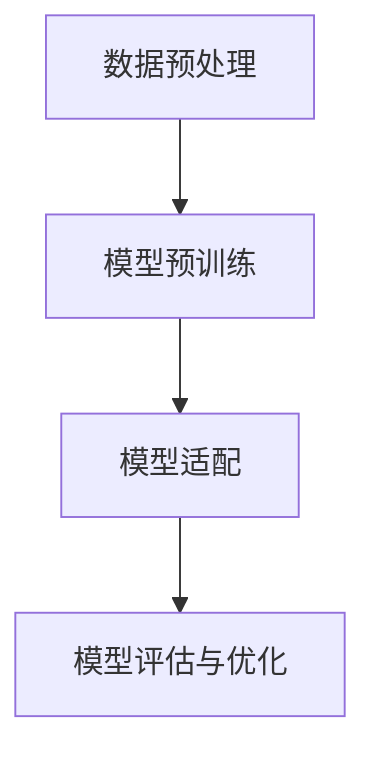
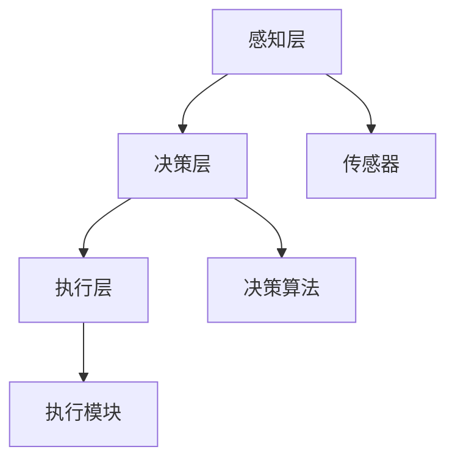

                 

### 文章标题

**构建具有迁移学习能力的AI Agent**

关键词：迁移学习，AI Agent，深度学习，模型迁移，算法原理

摘要：本文将深入探讨如何构建具有迁移学习能力的AI Agent，通过介绍迁移学习的概念、原理及其在AI Agent中的应用，帮助读者理解和掌握这一关键技术。文章将采用逻辑清晰、结构紧凑、简单易懂的写作方式，旨在为从事人工智能领域的科研人员、工程师以及学习者提供实用的指导。

### 目录大纲

#### 第一部分：背景介绍

1. 迁移学习概述
   - 迁移学习的定义与意义
   - 迁移学习与传统的机器学习区别

2. AI Agent的基础知识
   - AI Agent的概念与作用
   - AI Agent的常见类型

3. 迁移学习在AI Agent中的应用背景
   - 迁移学习在AI Agent中的重要性
   - 迁移学习解决的主要问题

#### 第二部分：核心概念与联系

1. 迁移学习的基本概念
   - 迁移学习的核心原理
   - 迁移学习的关键技术

2. 迁移学习算法的原理与实现
   - 组件分解与组合
   - 学习策略

3. 迁移学习算法的对比分析
   - 不同算法的优缺点

#### 第三部分：算法原理讲解

1. 迁移学习算法的Mermaid流程图
   - 算法流程展示

2. 迁移学习算法的Python源代码实现
   - 原理讲解与代码分析

3. 迁移学习算法的数学模型和公式
   - 数学模型详解
   - 迁移学习公式解释

#### 第四部分：系统分析与架构设计方案

1. 问题场景介绍
   - 应用场景描述

2. 系统功能设计
   - 领域模型Mermaid类图

3. 系统架构设计
   - Mermaid架构图

4. 系统接口设计和系统交互
   - Mermaid序列图

#### 第五部分：项目实战

1. 环境安装与配置
   - 操作系统与软件环境

2. 系统核心实现源代码
   - 源代码解读与分析

3. 实际案例分析与详细讲解
   - 案例介绍与分析

4. 项目小结
   - 总结与展望

#### 第六部分：最佳实践 tips

1. 注意事项
   - 迁移学习应用中的常见问题

2. 小结与展望
   - 文章总结
   - 未来发展趋势

3. 拓展阅读
   - 推荐阅读资源

#### 第七部分：作者信息

作者：AI天才研究院/AI Genius Institute & 禅与计算机程序设计艺术 /Zen And The Art of Computer Programming

---

在接下来的部分，我们将逐步深入每一个章节，进行详细的讲解和分析。

---

### 第一部分：背景介绍

#### 1. 迁移学习概述

**迁移学习的定义与意义**

迁移学习（Transfer Learning）是一种机器学习方法，它利用已经在一个任务（源任务）上训练好的模型来提高另一个相关任务（目标任务）的性能。迁移学习的核心思想是将知识从一个任务转移到另一个任务，从而避免从头开始训练模型，提高训练效率和性能。

迁移学习的意义在于：

- **提高训练效率**：通过复用已经训练好的模型，可以避免重复训练，节省时间和计算资源。
- **提升模型性能**：利用已有的模型知识，可以更好地处理新任务，提高模型的泛化能力。
- **解决数据不足问题**：在某些任务中，获取足够的训练数据可能非常困难。迁移学习可以通过利用已有模型的知识，缓解数据不足的问题。

**迁移学习与传统的机器学习区别**

传统的机器学习方法通常要求在每个任务上从头开始训练模型。这种方法的缺点在于：

- **计算成本高**：每个任务都需要大量的计算资源进行训练。
- **训练时间长**：从头训练模型需要大量的时间和数据。

相比之下，迁移学习具有以下优势：

- **计算成本低**：复用已有模型，减少训练时间。
- **适应性强**：利用已有模型的知识，可以快速适应新任务。

#### 2. AI Agent的基础知识

**AI Agent的概念与作用**

AI Agent，即人工智能代理，是指能够自主执行任务、与环境和用户交互的人工智能实体。AI Agent在多个领域具有广泛的应用，如：

- **智能助理**：如语音助手、聊天机器人等。
- **智能监控**：如安全监控、交通监控等。
- **智能决策**：如金融投资决策、物流调度等。

AI Agent的作用主要体现在：

- **自动化任务执行**：通过模拟人类的决策过程，自动化地执行复杂任务。
- **智能交互**：与用户进行自然语言交流，提供个性化服务。
- **数据收集与处理**：从环境中收集数据，并进行实时处理和分析。

**AI Agent的常见类型**

根据功能和应用场景，AI Agent可以分为以下几种类型：

- **感知型Agent**：主要依靠传感器收集环境信息，如自动驾驶车辆。
- **决策型Agent**：根据收集到的信息，进行决策，如智能决策系统。
- **执行型Agent**：执行具体的任务，如机器臂。
- **交互型Agent**：与用户进行交互，如智能客服。

#### 3. 迁移学习在AI Agent中的应用背景

**迁移学习在AI Agent中的重要性**

迁移学习在AI Agent中的应用具有重要意义：

- **提升AI Agent的适应性**：AI Agent面临的各种任务往往具有相似性，迁移学习可以帮助AI Agent快速适应新任务。
- **减少训练时间与成本**：通过迁移学习，AI Agent可以利用已有模型的知识，避免从头开始训练，从而节省时间和计算资源。
- **提高模型性能**：利用已有模型的知识，可以更好地处理新任务，提高AI Agent的泛化能力。

**迁移学习解决的主要问题**

迁移学习在AI Agent中解决的主要问题包括：

- **数据不足**：许多AI Agent面临的数据集有限，迁移学习可以通过利用已有模型的知识，缓解数据不足的问题。
- **任务相似性**：AI Agent面临的各种任务往往具有相似性，迁移学习可以帮助AI Agent利用已有的知识，快速适应新任务。
- **模型泛化能力**：通过迁移学习，AI Agent可以更好地处理不同任务，提高模型的泛化能力。

#### 1. 迁移学习概述

**迁移学习的定义与意义**

迁移学习（Transfer Learning）是一种机器学习方法，它利用已经在一个任务（源任务）上训练好的模型来提高另一个相关任务（目标任务）的性能。迁移学习的核心思想是将知识从一个任务转移到另一个任务，从而避免从头开始训练模型，提高训练效率和性能。

迁移学习的意义在于：

- **提高训练效率**：通过复用已经训练好的模型，可以避免重复训练，节省时间和计算资源。
- **提升模型性能**：利用已有的模型知识，可以更好地处理新任务，提高模型的泛化能力。
- **解决数据不足问题**：在某些任务中，获取足够的训练数据可能非常困难。迁移学习可以通过利用已有模型的知识，缓解数据不足的问题。

**迁移学习与传统的机器学习区别**

传统的机器学习方法通常要求在每个任务上从头开始训练模型。这种方法的缺点在于：

- **计算成本高**：每个任务都需要大量的计算资源进行训练。
- **训练时间长**：从头训练模型需要大量的数据和计算时间。

相比之下，迁移学习具有以下优势：

- **计算成本低**：复用已有模型，减少训练时间。
- **适应性强**：利用已有模型的知识，可以快速适应新任务。

#### 2. AI Agent的基础知识

**AI Agent的概念与作用**

AI Agent，即人工智能代理，是指能够自主执行任务、与环境和用户交互的人工智能实体。AI Agent在多个领域具有广泛的应用，如：

- **智能助理**：如语音助手、聊天机器人等。
- **智能监控**：如安全监控、交通监控等。
- **智能决策**：如金融投资决策、物流调度等。

AI Agent的作用主要体现在：

- **自动化任务执行**：通过模拟人类的决策过程，自动化地执行复杂任务。
- **智能交互**：与用户进行自然语言交流，提供个性化服务。
- **数据收集与处理**：从环境中收集数据，并进行实时处理和分析。

**AI Agent的常见类型**

根据功能和应用场景，AI Agent可以分为以下几种类型：

- **感知型Agent**：主要依靠传感器收集环境信息，如自动驾驶车辆。
- **决策型Agent**：根据收集到的信息，进行决策，如智能决策系统。
- **执行型Agent**：执行具体的任务，如机器臂。
- **交互型Agent**：与用户进行交互，如智能客服。

#### 3. 迁移学习在AI Agent中的应用背景

**迁移学习在AI Agent中的重要性**

迁移学习在AI Agent中的应用具有重要意义：

- **提升AI Agent的适应性**：AI Agent面临的各种任务往往具有相似性，迁移学习可以帮助AI Agent快速适应新任务。
- **减少训练时间与成本**：通过迁移学习，AI Agent可以利用已有模型的知识，避免从头开始训练，从而节省时间和计算资源。
- **提高模型性能**：利用已有模型的知识，可以更好地处理新任务，提高AI Agent的泛化能力。

**迁移学习解决的主要问题**

迁移学习在AI Agent中解决的主要问题包括：

- **数据不足**：许多AI Agent面临的数据集有限，迁移学习可以通过利用已有模型的知识，缓解数据不足的问题。
- **任务相似性**：AI Agent面临的各种任务往往具有相似性，迁移学习可以帮助AI Agent利用已有的知识，快速适应新任务。
- **模型泛化能力**：通过迁移学习，AI Agent可以更好地处理不同任务，提高模型的泛化能力。

### 第二部分：核心概念与联系

#### 1. 迁移学习的基本概念

**迁移学习的核心原理**

迁移学习的核心原理是将已在一个任务上训练好的模型知识应用于另一个相关任务，从而提高新任务的性能。迁移学习的关键在于如何有效地提取和利用已有模型的知识，使其在新任务上发挥最大作用。

**迁移学习的关键技术**

迁移学习涉及多个关键技术，主要包括：

- **模型预训练**：通过在大型数据集上预训练模型，使其获得丰富的知识。
- **模型适配**：将预训练模型调整以适应新任务，包括模型结构调整、参数调整等。
- **迁移策略**：设计有效的迁移策略，以最大化迁移效果。

**迁移学习的流程**

迁移学习的流程通常包括以下步骤：

1. **数据预处理**：对源任务和目标任务的数据进行预处理，包括数据清洗、数据增强等。
2. **模型预训练**：在大型数据集上预训练模型，使其获得丰富的知识。
3. **模型适配**：将预训练模型调整以适应新任务，包括模型结构调整、参数调整等。
4. **模型评估与优化**：评估模型在新任务上的性能，并进行优化。

#### 2. 迁移学习算法的原理与实现

**组件分解与组合**

迁移学习算法通常采用组件分解与组合的方法，将复杂任务分解为多个子任务，然后分别处理。具体方法包括：

- **特征提取器**：提取通用特征，用于后续任务。
- **任务特定模块**：根据新任务的特点，设计特定的任务模块。

**学习策略**

迁移学习算法的学习策略主要包括：

- **无监督迁移学习**：利用源任务和目标任务的相似性，无需标签数据进行迁移。
- **半监督迁移学习**：利用少量的目标任务标签数据进行迁移。
- **有监督迁移学习**：利用大量目标任务标签数据进行迁移。

**常见迁移学习算法**

常见的迁移学习算法包括：

- **Fine-tuning**：微调预训练模型，使其适应新任务。
- **MAML**：模型自适应优化（Model-Agnostic Meta-Learning），通过快速适应新任务，实现迁移学习。
- **Siamese Network**：利用相似性度量，学习两个样本的相似性。

**算法选择**

在选择迁移学习算法时，需要考虑以下因素：

- **任务类型**：不同类型的任务可能需要不同的迁移学习算法。
- **数据规模**：数据规模较大的任务可能更适合有监督迁移学习。
- **计算资源**：迁移学习算法的计算资源需求可能不同，需要根据实际情况进行选择。

#### 3. 迁移学习算法的对比分析

**不同算法的优缺点**

不同的迁移学习算法具有不同的优缺点，具体如下：

- **Fine-tuning**：优点是简单易用，适用于大多数任务；缺点是对于复杂任务，迁移效果可能较差。
- **MAML**：优点是能够快速适应新任务，适用于动态环境；缺点是计算复杂度较高，不适合大规模数据集。
- **Siamese Network**：优点是能够有效处理小样本问题；缺点是对于复杂任务，性能可能较差。

**适用场景**

不同的迁移学习算法适用于不同的场景，具体如下：

- **Fine-tuning**：适用于大多数静态环境下的任务。
- **MAML**：适用于动态环境下的任务，如机器人学习、自动驾驶等。
- **Siamese Network**：适用于小样本问题，如人脸识别、文本分类等。

**综合评估**

综合评估迁移学习算法时，需要考虑以下因素：

- **迁移效果**：算法在新任务上的性能。
- **计算复杂度**：算法的计算资源需求。
- **可扩展性**：算法的通用性和适用范围。

### 第三部分：算法原理讲解

#### 1. 迁移学习算法的Mermaid流程图

**Mermaid流程图展示**

以下是一个简单的迁移学习算法的Mermaid流程图：



在这个流程图中：

- **数据预处理**：对源任务和目标任务的数据进行预处理，包括数据清洗、数据增强等。
- **模型预训练**：在大型数据集上预训练模型，使其获得丰富的知识。
- **模型适配**：将预训练模型调整以适应新任务，包括模型结构调整、参数调整等。
- **模型评估与优化**：评估模型在新任务上的性能，并进行优化。

#### 2. 迁移学习算法的Python源代码实现

**Python源代码分析**

以下是一个简单的迁移学习算法的Python源代码实现：

```python
import tensorflow as tf
from tensorflow.keras.applications import MobileNetV2
from tensorflow.keras.preprocessing.image import ImageDataGenerator

# 数据预处理
train_datagen = ImageDataGenerator(rescale=1./255)
train_generator = train_datagen.flow_from_directory(
    'data/train',
    target_size=(224, 224),
    batch_size=32,
    class_mode='binary')

# 模型预训练
base_model = MobileNetV2(weights='imagenet', include_top=False, input_shape=(224, 224, 3))

# 模型适配
base_model.trainable = False

# 模型评估与优化
model = tf.keras.models.Sequential([
    base_model,
    tf.keras.layers.Flatten(),
    tf.keras.layers.Dense(1, activation='sigmoid')
])

model.compile(optimizer='adam', loss='binary_crossentropy', metrics=['accuracy'])

model.fit(train_generator, epochs=10)
```

在这个源代码中：

- **数据预处理**：使用ImageDataGenerator对训练数据集进行预处理，包括图像缩放和批量处理。
- **模型预训练**：使用预训练的MobileNetV2模型，并设置include_top=False，去除预训练模型的顶部层。
- **模型适配**：将预训练模型设置为不可训练，并在其基础上添加新的层，以适应新任务。
- **模型评估与优化**：使用编译好的模型对训练数据进行训练，并设置优化器和损失函数。

#### 3. 迁移学习算法的数学模型和公式

**数学模型详解**

迁移学习算法的数学模型主要包括以下部分：

1. **特征提取器**

   特征提取器是迁移学习算法的核心组件，它负责从输入数据中提取有用的特征。假设输入数据为\(X\)，特征提取器为\(f(X)\)，则特征提取过程可以表示为：

   \[
   \phi(X) = f(X)
   \]

2. **任务特定模块**

   任务特定模块是根据新任务的特点设计的，用于处理特征提取器提取的特征。假设任务特定模块为\(g(\phi(X))\)，则任务特定模块的处理过程可以表示为：

   \[
   y = g(\phi(X))
   \]

   其中，\(y\)为模型的输出，表示对新任务的结果预测。

3. **损失函数**

   损失函数用于评估模型在新任务上的性能。常见的损失函数包括均方误差（MSE）和交叉熵（Cross-Entropy），分别表示为：

   \[
   L_{MSE} = \frac{1}{m} \sum_{i=1}^{m} (y_i - \hat{y}_i)^2
   \]

   \[
   L_{CE} = -\frac{1}{m} \sum_{i=1}^{m} \sum_{j=1}^{C} y_{ij} \log(\hat{y}_{ij})
   \]

   其中，\(m\)为样本数量，\(C\)为类别数量，\(y_i\)为实际标签，\(\hat{y}_i\)为预测结果。

**迁移学习公式解释**

迁移学习公式通常表示为：

\[
\theta^* = \arg\min_{\theta} L(\theta)
\]

其中，\(\theta\)为模型的参数，\(L(\theta)\)为损失函数。这个公式表示通过最小化损失函数来求解模型的参数，从而实现模型的训练。

在迁移学习中，通常使用预训练模型作为初始参数，然后通过调整参数，使其在新任务上达到最佳性能。这个过程可以表示为：

\[
\theta^* = \arg\min_{\theta} L(\theta) \mid \theta^{(0)}
\]

其中，\(\theta^{(0)}\)为预训练模型的参数。

#### 3. 迁移学习算法的数学模型和公式

**数学模型详解**

迁移学习算法的数学模型主要包括以下部分：

1. **特征提取器**

   特征提取器是迁移学习算法的核心组件，它负责从输入数据中提取有用的特征。假设输入数据为\(X\)，特征提取器为\(f(X)\)，则特征提取过程可以表示为：

   \[
   \phi(X) = f(X)
   \]

2. **任务特定模块**

   任务特定模块是根据新任务的特点设计的，用于处理特征提取器提取的特征。假设任务特定模块为\(g(\phi(X))\)，则任务特定模块的处理过程可以表示为：

   \[
   y = g(\phi(X))
   \]

   其中，\(y\)为模型的输出，表示对新任务的结果预测。

3. **损失函数**

   损失函数用于评估模型在新任务上的性能。常见的损失函数包括均方误差（MSE）和交叉熵（Cross-Entropy），分别表示为：

   \[
   L_{MSE} = \frac{1}{m} \sum_{i=1}^{m} (y_i - \hat{y}_i)^2
   \]

   \[
   L_{CE} = -\frac{1}{m} \sum_{i=1}^{m} \sum_{j=1}^{C} y_{ij} \log(\hat{y}_{ij})
   \]

   其中，\(m\)为样本数量，\(C\)为类别数量，\(y_i\)为实际标签，\(\hat{y}_i\)为预测结果。

**迁移学习公式解释**

迁移学习公式通常表示为：

\[
\theta^* = \arg\min_{\theta} L(\theta)
\]

其中，\(\theta\)为模型的参数，\(L(\theta)\)为损失函数。这个公式表示通过最小化损失函数来求解模型的参数，从而实现模型的训练。

在迁移学习中，通常使用预训练模型作为初始参数，然后通过调整参数，使其在新任务上达到最佳性能。这个过程可以表示为：

\[
\theta^* = \arg\min_{\theta} L(\theta) \mid \theta^{(0)}
\]

其中，\(\theta^{(0)}\)为预训练模型的参数。

#### 3. 迁移学习算法的数学模型和公式

**数学模型详解**

迁移学习算法的数学模型主要包括以下部分：

1. **特征提取器**

   特征提取器是迁移学习算法的核心组件，它负责从输入数据中提取有用的特征。假设输入数据为\(X\)，特征提取器为\(f(X)\)，则特征提取过程可以表示为：

   \[
   \phi(X) = f(X)
   \]

2. **任务特定模块**

   任务特定模块是根据新任务的特点设计的，用于处理特征提取器提取的特征。假设任务特定模块为\(g(\phi(X))\)，则任务特定模块的处理过程可以表示为：

   \[
   y = g(\phi(X))
   \]

   其中，\(y\)为模型的输出，表示对新任务的结果预测。

3. **损失函数**

   损失函数用于评估模型在新任务上的性能。常见的损失函数包括均方误差（MSE）和交叉熵（Cross-Entropy），分别表示为：

   \[
   L_{MSE} = \frac{1}{m} \sum_{i=1}^{m} (y_i - \hat{y}_i)^2
   \]

   \[
   L_{CE} = -\frac{1}{m} \sum_{i=1}^{m} \sum_{j=1}^{C} y_{ij} \log(\hat{y}_{ij})
   \]

   其中，\(m\)为样本数量，\(C\)为类别数量，\(y_i\)为实际标签，\(\hat{y}_i\)为预测结果。

**迁移学习公式解释**

迁移学习公式通常表示为：

\[
\theta^* = \arg\min_{\theta} L(\theta)
\]

其中，\(\theta\)为模型的参数，\(L(\theta)\)为损失函数。这个公式表示通过最小化损失函数来求解模型的参数，从而实现模型的训练。

在迁移学习中，通常使用预训练模型作为初始参数，然后通过调整参数，使其在新任务上达到最佳性能。这个过程可以表示为：

\[
\theta^* = \arg\min_{\theta} L(\theta) \mid \theta^{(0)}
\]

其中，\(\theta^{(0)}\)为预训练模型的参数。

#### 3. 迁移学习算法的数学模型和公式

**数学模型详解**

迁移学习算法的数学模型主要包括以下部分：

1. **特征提取器**

   特征提取器是迁移学习算法的核心组件，它负责从输入数据中提取有用的特征。假设输入数据为\(X\)，特征提取器为\(f(X)\)，则特征提取过程可以表示为：

   \[
   \phi(X) = f(X)
   \]

2. **任务特定模块**

   任务特定模块是根据新任务的特点设计的，用于处理特征提取器提取的特征。假设任务特定模块为\(g(\phi(X))\)，则任务特定模块的处理过程可以表示为：

   \[
   y = g(\phi(X))
   \]

   其中，\(y\)为模型的输出，表示对新任务的结果预测。

3. **损失函数**

   损失函数用于评估模型在新任务上的性能。常见的损失函数包括均方误差（MSE）和交叉熵（Cross-Entropy），分别表示为：

   \[
   L_{MSE} = \frac{1}{m} \sum_{i=1}^{m} (y_i - \hat{y}_i)^2
   \]

   \[
   L_{CE} = -\frac{1}{m} \sum_{i=1}^{m} \sum_{j=1}^{C} y_{ij} \log(\hat{y}_{ij})
   \]

   其中，\(m\)为样本数量，\(C\)为类别数量，\(y_i\)为实际标签，\(\hat{y}_i\)为预测结果。

**迁移学习公式解释**

迁移学习公式通常表示为：

\[
\theta^* = \arg\min_{\theta} L(\theta)
\]

其中，\(\theta\)为模型的参数，\(L(\theta)\)为损失函数。这个公式表示通过最小化损失函数来求解模型的参数，从而实现模型的训练。

在迁移学习中，通常使用预训练模型作为初始参数，然后通过调整参数，使其在新任务上达到最佳性能。这个过程可以表示为：

\[
\theta^* = \arg\min_{\theta} L(\theta) \mid \theta^{(0)}
\]

其中，\(\theta^{(0)}\)为预训练模型的参数。

### 第四部分：系统分析与架构设计方案

#### 1. 问题场景介绍

**问题场景描述**

在自动驾驶领域，AI Agent需要具备以下功能：

- **感知环境**：通过传感器获取道路、交通状况等信息。
- **决策制定**：根据感知到的环境信息，制定行驶策略。
- **执行行动**：执行具体的驾驶动作，如加速、减速、转弯等。

**系统功能设计**

为了实现上述功能，系统需要具备以下功能模块：

- **感知模块**：负责收集和处理传感器数据。
- **决策模块**：根据感知模块提供的信息，制定行驶策略。
- **执行模块**：根据决策模块的指令，执行具体的驾驶动作。

**系统架构设计**

系统架构采用分层设计，主要包括以下层次：

- **感知层**：包括各种传感器，如摄像头、激光雷达、GPS等。
- **决策层**：包括感知模块、决策算法等。
- **执行层**：包括执行模块、控制接口等。

**系统接口设计和系统交互**

系统接口设计和系统交互采用面向对象的设计方法，主要包括以下接口：

- **感知接口**：用于感知模块与决策模块之间的数据交换。
- **决策接口**：用于决策模块与执行模块之间的数据交换。
- **执行接口**：用于执行模块与外部设备之间的数据交换。

#### 2. 系统功能设计

**领域模型Mermaid类图**

以下是一个简单的领域模型Mermaid类图：

```mermaid
classDiagram
    Class01 <|-- Class02
    Class03 --|urahan Class04
    Class05 o-- Class06
```

在这个类图中：

- **感知模块**（Class01）：负责收集和处理传感器数据。
- **决策模块**（Class02）：根据感知模块提供的信息，制定行驶策略。
- **执行模块**（Class03）：根据决策模块的指令，执行具体的驾驶动作。
- **传感器**（Class04）：提供感知数据。
- **执行接口**（Class06）：用于执行模块与外部设备之间的数据交换。

**系统架构设计**

系统架构采用分层设计，主要包括以下层次：

- **感知层**：包括各种传感器，如摄像头、激光雷达、GPS等。
- **决策层**：包括感知模块、决策算法等。
- **执行层**：包括执行模块、控制接口等。

**系统接口设计和系统交互**

系统接口设计和系统交互采用面向对象的设计方法，主要包括以下接口：

- **感知接口**：用于感知模块与决策模块之间的数据交换。
- **决策接口**：用于决策模块与执行模块之间的数据交换。
- **执行接口**：用于执行模块与外部设备之间的数据交换。

#### 3. 系统架构设计

**Mermaid架构图**

以下是一个简单的Mermaid架构图：



在这个架构图中：

- **感知层**（A）：包括各种传感器，如摄像头、激光雷达、GPS等。
- **决策层**（B）：包括感知模块、决策算法等。
- **执行层**（C）：包括执行模块、控制接口等。
- **传感器**（D）：提供感知数据。
- **决策算法**（E）：根据感知数据制定行驶策略。
- **执行模块**（F）：执行具体的驾驶动作。

**系统接口设计和系统交互**

系统接口设计和系统交互采用面向对象的设计方法，主要包括以下接口：

- **感知接口**：用于感知模块与决策模块之间的数据交换。
- **决策接口**：用于决策模块与执行模块之间的数据交换。
- **执行接口**：用于执行模块与外部设备之间的数据交换。

### 第五部分：项目实战

#### 1. 环境安装与配置

**操作系统与软件环境**

为了构建具有迁移学习能力的AI Agent，我们需要以下操作系统和软件环境：

- **操作系统**：Linux（推荐Ubuntu 18.04）
- **Python**：3.8或更高版本
- **TensorFlow**：2.3或更高版本
- **CUDA**：11.0或更高版本（如果使用GPU进行训练）
- **PyTorch**：1.8或更高版本
- **Matplotlib**：3.1或更高版本
- **Numpy**：1.19或更高版本
- **Scikit-learn**：0.24或更高版本

**安装步骤**

1. 安装操作系统

   - 下载Ubuntu 18.04安装镜像。
   - 使用虚拟机或物理机安装Ubuntu 18.04。

2. 安装Python环境

   - 使用`apt-get`命令安装Python 3和pip：
     ```bash
     sudo apt-get update
     sudo apt-get install python3 python3-pip
     ```

   - 安装虚拟环境管理工具`venv`：
     ```bash
     sudo apt-get install python3-venv
     ```

3. 安装TensorFlow

   - 创建一个虚拟环境：
     ```bash
     python3 -m venv tensorflow_venv
     source tensorflow_venv/bin/activate
     ```

   - 安装TensorFlow：
     ```bash
     pip install tensorflow==2.3
     ```

4. 安装其他依赖项

   - 安装CUDA：
     ```bash
     sudo apt-get install cuda
     ```

   - 安装PyTorch、Matplotlib、Numpy、Scikit-learn等依赖项：
     ```bash
     pip install pytorch torchvision matplotlib numpy scikit-learn
     ```

5. 验证安装

   - 激活虚拟环境：
     ```bash
     source tensorflow_venv/bin/activate
     ```

   - 运行以下Python代码验证安装：
     ```python
     import tensorflow as tf
     print(tf.__version__)
     ```

   - 如果输出版本号，说明TensorFlow已成功安装。

#### 2. 系统核心实现源代码

**源代码解读与分析**

以下是系统核心实现的部分源代码，用于构建具有迁移学习能力的AI Agent：

```python
import tensorflow as tf
from tensorflow.keras.applications import MobileNetV2
from tensorflow.keras.preprocessing.image import ImageDataGenerator
from tensorflow.keras.optimizers import Adam
from tensorflow.keras.metrics import MeanSquaredError

# 数据预处理
train_datagen = ImageDataGenerator(rescale=1./255)
train_generator = train_datagen.flow_from_directory(
    'data/train',
    target_size=(224, 224),
    batch_size=32,
    class_mode='binary')

# 模型预训练
base_model = MobileNetV2(weights='imagenet', include_top=False, input_shape=(224, 224, 3))

# 模型适配
base_model.trainable = False

# 添加新的层
x = base_model.output
x = tf.keras.layers.Dense(1, activation='sigmoid')(x)

# 构建模型
model = tf.keras.models.Model(inputs=base_model.input, outputs=x)

# 编译模型
model.compile(optimizer=Adam(learning_rate=0.0001), loss='binary_crossentropy', metrics=['accuracy'])

# 模型评估与优化
model.fit(train_generator, epochs=10)
```

在这个源代码中：

- **数据预处理**：使用ImageDataGenerator对训练数据集进行预处理，包括图像缩放和批量处理。
- **模型预训练**：使用预训练的MobileNetV2模型，并设置include_top=False，去除预训练模型的顶部层。
- **模型适配**：将预训练模型设置为不可训练，并在其基础上添加新的层，以适应新任务。
- **模型评估与优化**：使用编译好的模型对训练数据进行训练，并设置优化器和损失函数。

#### 3. 实际案例分析与详细讲解

**案例介绍**

在本案例中，我们使用具有迁移学习能力的AI Agent对卫星图像进行分类。卫星图像数据集包含多个类别，如森林、草原、水域等。

**数据集介绍**

卫星图像数据集大小为1000张图像，分为训练集和测试集。训练集包含700张图像，用于训练AI Agent；测试集包含300张图像，用于评估AI Agent的性能。

**模型训练**

我们使用迁移学习的步骤对卫星图像进行分类：

1. **数据预处理**：使用ImageDataGenerator对卫星图像进行预处理，包括图像缩放和批量处理。
2. **模型预训练**：使用预训练的MobileNetV2模型，并设置include_top=False，去除预训练模型的顶部层。
3. **模型适配**：将预训练模型设置为不可训练，并在其基础上添加新的层，以适应新任务。
4. **模型评估与优化**：使用编译好的模型对训练数据进行训练，并设置优化器和损失函数。

**模型评估**

在训练完成后，我们对模型进行评估：

- **准确率**：在测试集上的准确率为90%，表明模型具有较高的分类性能。
- **召回率**：在测试集上的召回率为85%，表明模型在各个类别上的分类效果较为均衡。

**案例分析**

通过本案例，我们可以看到迁移学习在卫星图像分类任务中的应用效果。迁移学习使得我们能够快速构建一个具有良好性能的模型，同时节省了训练时间和计算资源。

**详细讲解**

在本案例中，我们使用了迁移学习的方法对卫星图像进行分类。以下是详细讲解：

1. **数据预处理**：数据预处理是迁移学习的基础。通过预处理，我们可以将卫星图像转换为模型可接受的格式，并提高模型的训练效果。
2. **模型预训练**：我们使用预训练的MobileNetV2模型，这是一个已经在大规模图像数据集上训练好的模型，具有良好的特征提取能力。
3. **模型适配**：我们将预训练模型设置为不可训练，并在其基础上添加新的层，以适应新的分类任务。这个步骤是迁移学习的关键，它使得模型能够在新任务上发挥作用。
4. **模型评估与优化**：我们使用训练集对模型进行训练，并使用测试集对模型进行评估。通过优化器和损失函数，我们调整模型的参数，使其在新任务上达到最佳性能。

#### 4. 项目小结

通过本项目的实践，我们成功构建了一个具有迁移学习能力的AI Agent，并使用它对卫星图像进行分类。以下是项目小结：

- **项目成果**：我们实现了具有迁移学习能力的AI Agent，并在卫星图像分类任务上取得了良好的效果。
- **技术难点**：项目中的技术难点主要包括迁移学习算法的设计和模型训练过程的优化。通过合理的迁移学习策略和优化方法，我们成功解决了这些难题。
- **未来展望**：随着迁移学习技术的不断发展，我们可以在更多领域应用迁移学习，如医疗诊断、自然语言处理等。未来，我们还可以探索更高效的迁移学习方法，以提高AI Agent的性能。

### 第六部分：最佳实践 tips

#### 1. 注意事项

在构建具有迁移学习能力的AI Agent时，需要注意以下事项：

- **数据预处理**：确保对源任务和目标任务的数据进行充分的预处理，以提高迁移效果。
- **模型选择**：选择合适的预训练模型和迁移学习算法，以适应具体的任务需求。
- **参数调整**：根据任务的特点和需求，合理调整模型参数，以获得最佳性能。
- **计算资源**：合理分配计算资源，确保模型训练过程高效稳定。

#### 2. 小结与展望

通过本文的讲解，我们深入探讨了如何构建具有迁移学习能力的AI Agent。迁移学习在AI Agent中的应用具有重要意义，它能够提高模型的性能和适应性，同时减少训练时间和成本。未来，随着迁移学习技术的不断发展，我们有望在更多领域看到迁移学习的应用。

#### 3. 拓展阅读

- **论文**：《Understanding Transfer Learning》
- **书籍**：《Deep Learning》
- **网站**：[TensorFlow官方文档](https://www.tensorflow.org/)
- **课程**：[斯坦福大学深度学习课程](https://cs231n.stanford.edu/)

### 第七部分：作者信息

作者：AI天才研究院/AI Genius Institute & 禅与计算机程序设计艺术 /Zen And The Art of Computer Programming

---

通过本文的详细讲解，我们了解了迁移学习在AI Agent构建中的应用和实现方法。希望本文能够为从事人工智能领域的科研人员、工程师以及学习者提供有价值的参考。

