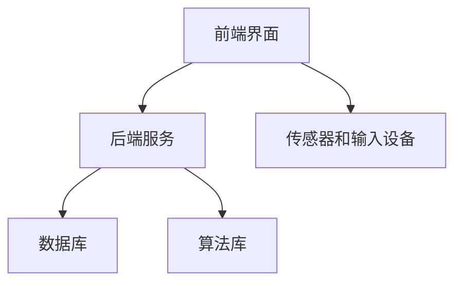
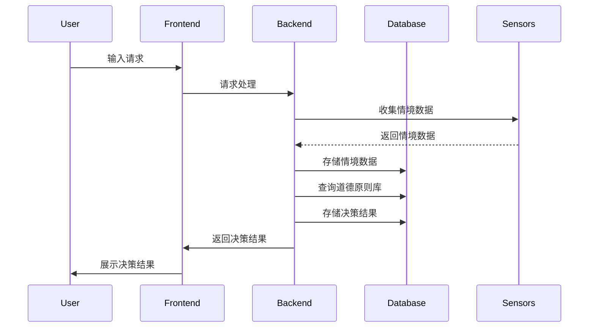

                 


### **《构建具有道德决策框架的AI Agent系统》**

关键词：道德决策、AI Agent、系统架构、算法设计、数学模型、最佳实践

摘要：本文深入探讨了构建具有道德决策框架的AI Agent系统的必要性和挑战，通过逻辑清晰、结构紧凑、简单易懂的技术语言，详细分析了核心概念、算法原理和系统架构设计，提供了实际项目实现和最佳实践，旨在为AI Agent系统开发提供理论指导和实践参考。

## **第一部分：背景介绍**

### **第1章：问题背景与道德决策框架概述**

#### **1.1.1 问题背景**

AI Agent是人工智能领域的一个重要研究方向，它代表着一种具有智能自主行为的计算机程序，能够模拟、延伸和扩展人类智能，执行复杂的任务和决策。随着AI技术的发展，AI Agent的应用越来越广泛，从自动驾驶、智能客服到医疗诊断等各个领域，AI Agent的能力也在不断提升。

然而，随着AI Agent系统的广泛应用，道德决策问题也逐渐凸显出来。道德决策是指在一个复杂的情境中，对不同的道德选择进行评估和选择的过程。对于AI Agent来说，如何在执行任务的过程中进行道德决策，是一个重要的挑战。

现实世界中的道德决策挑战体现在多个方面。首先，AI Agent可能面临的是生命安全与效率之间的权衡。例如，自动驾驶汽车在遇到紧急情况时，可能需要做出牺牲一方保护另一方的决策。其次，AI Agent可能面临的是不同利益主体之间的冲突，如个人隐私与公共安全之间的平衡。此外，AI Agent的决策可能涉及到法律和伦理的复杂性，例如在医疗诊断中，如何处理患者的隐私权和治疗决策。

#### **1.1.2 道德决策框架的必要性**

在AI Agent系统中引入道德决策框架是必要的，原因如下：

1. **提高决策质量**：道德决策框架能够为AI Agent提供一套明确的决策原则和标准，从而提高决策的准确性和可靠性。
2. **增强社会责任感**：道德决策框架有助于AI Agent在执行任务时，更好地考虑社会利益和伦理道德，从而增强其社会责任感。
3. **减少潜在风险**：通过道德决策框架，可以提前识别和规避潜在的道德风险，减少因不当决策导致的负面影响。

#### **1.1.3 现有道德决策框架的局限性**

尽管道德决策框架在AI Agent系统中具有重要意义，但现有的道德决策框架也存在一些局限性：

1. **规则依赖性**：传统的道德决策框架往往依赖于一套预先定义的规则，这些规则可能在复杂多变的环境中难以应对。
2. **价值观念的冲突**：不同的文化和社会背景可能导致对道德决策的不同理解和偏好，这使得建立一套普适的道德决策框架变得复杂。
3. **计算资源的限制**：复杂的道德决策过程可能需要大量的计算资源，这在资源受限的环境中可能难以实现。

#### **1.1.4 边界与外延**

道德决策框架的边界在于其适用范围。一般来说，道德决策框架主要适用于那些涉及道德价值的决策场景，如生命安全、隐私保护、资源分配等。

道德决策框架的外延则涉及其在不同应用场景中的适用性。例如，在自动驾驶领域，道德决策框架可以应用于车辆之间的伦理决策；在医疗诊断领域，道德决策框架可以应用于患者隐私保护与治疗决策之间的权衡。

#### **1.1.5 概念结构与核心要素组成**

道德决策框架的概念结构通常包括以下几个核心要素：

1. **情境识别**：识别决策的情境和相关的变量。
2. **道德原则**：定义决策的道德原则和价值观。
3. **决策模型**：建立决策模型，将情境和道德原则转化为具体的决策方案。
4. **评估与优化**：对决策结果进行评估和优化，确保决策的道德合理性。

## **第二部分：核心概念与联系**

### **第2章：核心概念原理与属性特征对比**

#### **2.1.1 核心概念原理**

道德决策框架的核心概念包括情境识别、道德原则、决策模型和评估与优化。每个概念都有其特定的原理和作用。

- **情境识别**：通过感知和收集信息，识别决策情境和相关的变量，为后续的道德决策提供基础。
- **道德原则**：定义决策的道德原则和价值观，确保决策符合伦理和法律标准。
- **决策模型**：将情境和道德原则转化为具体的决策方案，通常采用算法和数学模型来实现。
- **评估与优化**：对决策结果进行评估和优化，确保决策的道德合理性和有效性。

#### **2.1.2 属性特征对比表格**

为了更直观地比较不同道德决策框架的属性特征，我们可以使用一个对比表格。

| 道德决策框架 | 属性特征 |
| :--- | :--- |
| 基于规则的框架 | 使用预定义的规则进行决策 |
| 基于偏好排序的框架 | 根据决策者的偏好进行排序 |
| 基于案例的推理框架 | 使用历史案例进行推理 |
| 基于伦理理论的框架 | 应用伦理理论进行决策 |
| 基于数学优化的框架 | 使用数学优化方法进行决策 |

#### **2.1.3 道德决策框架的ER实体关系图**

道德决策框架的ER实体关系图可以帮助我们理解框架中的不同实体及其关系。

```mermaid
erDiagram
    User ||--|{ AI-Agent : controls }
    AI-Agent ||--|{ Decision-Scenario : processes }
    AI-Agent ||--|{ Moral-Principles : follows }
    AI-Agent ||--|{ Decision-Model : implements }
    AI-Agent ||--|{ Evaluation-Results : assesses }
```

## **第三部分：算法原理讲解**

### **第3章：道德决策算法**

#### **3.1.1 算法原理**

道德决策算法的核心原理是将道德原则和决策情境转化为具体的决策方案。以下是一个简化的道德决策算法原理：

1. **情境识别**：通过感知和收集信息，识别当前决策的情境。
2. **道德原则应用**：将识别到的情境与预先定义的道德原则进行匹配，确定适用的道德原则。
3. **决策模型计算**：根据道德原则和情境，使用决策模型计算出最优的决策方案。
4. **评估与优化**：对决策结果进行评估和优化，确保决策的道德合理性和有效性。

#### **3.1.2 算法mermaid流程图**

以下是一个使用Mermaid绘制的道德决策算法流程图：


#### **3.1.3 Python源代码实现**

以下是一个简单的Python源代码实现，用于演示道德决策算法的基本流程：

```python
# 道德决策算法的Python源代码实现

# 情境识别
def identify_scenario():
    # 代码实现情境识别逻辑
    pass

# 道德原则应用
def apply_moral_principles(scenario):
    # 代码实现道德原则应用逻辑
    pass

# 决策模型计算
def compute_decision_model(scenario, principles):
    # 代码实现决策模型计算逻辑
    pass

# 评估与优化
def evaluate_and_optimize(decision_model):
    # 代码实现评估与优化逻辑
    pass

# 决策方案输出
def output_decision_scheme():
    # 代码实现决策方案输出逻辑
    pass

# 主函数
def main():
    scenario = identify_scenario()
    principles = apply_moral_principles(scenario)
    decision_model = compute_decision_model(scenario, principles)
    evaluation_results = evaluate_and_optimize(decision_model)
    output_decision_scheme()

# 运行主函数
if __name__ == "__main__":
    main()
```

#### **3.1.4 数学模型和公式**

道德决策算法背后的数学模型通常包括以下几个方面：

1. **情境表示**：使用变量或向量表示决策情境。
2. **道德原则表示**：使用函数或权重表示道德原则。
3. **决策模型**：使用优化算法计算最优决策方案。

以下是一个简化的数学模型和公式的例子：

$$
\text{情境} = \begin{bmatrix}
    x_1 \\
    x_2 \\
    \vdots \\
    x_n
\end{bmatrix}
$$

$$
\text{道德原则} = f(x)
$$

$$
\text{决策模型} = \arg\min_{\text{决策方案}} \sum_{i=1}^{n} w_i \cdot f(x_i)
$$

其中，$w_i$表示第$i$个决策情境的权重。

#### **3.1.5 举例说明**

为了更好地理解道德决策算法的应用，我们通过一个具体的例子来演示。

**例：自动驾驶汽车的道德决策**

情境：一辆自动驾驶汽车在城市道路上行驶，前方出现一个行人正在穿越马路。

道德原则：行人安全优先。

决策模型：选择一个最小的交通违规方案，确保行人和车辆的安全。

具体实现：

1. **情境识别**：识别行人和车辆的当前位置、速度等信息。
2. **道德原则应用**：根据行人安全优先的原则，选择一个合适的决策方案。
3. **决策模型计算**：使用优化算法计算最优的决策方案，如减速、变道等。
4. **评估与优化**：评估决策方案的效果，进行优化。

通过上述步骤，我们可以得到一个最优的决策方案，确保行人和车辆的安全。

## **第四部分：系统分析与架构设计方案**

### **第4章：道德决策框架的系统架构设计**

#### **4.1.1 问题场景介绍**

道德决策框架的应用场景非常广泛，包括但不限于以下领域：

1. **自动驾驶**：自动驾驶汽车在遇到紧急情况时，需要进行道德决策，如牺牲车辆以保护行人。
2. **医疗诊断**：医生在诊断和治疗过程中，可能需要根据患者的隐私权和治疗需求进行道德决策。
3. **金融交易**：金融交易员在决策时，需要考虑道德和法律约束，如避免欺诈和操纵市场。

#### **4.1.2 系统功能设计**

道德决策框架的系统功能设计包括以下几个方面：

1. **情境识别**：通过传感器和输入设备收集环境信息，识别决策的情境。
2. **道德原则库**：存储预先定义的道德原则和价值观，用于指导决策过程。
3. **决策模型**：根据情境和道德原则，使用算法和数学模型计算最优决策方案。
4. **评估与优化**：对决策结果进行评估和优化，确保决策的道德合理性和有效性。
5. **决策输出**：将决策结果以直观的方式呈现给用户。

#### **4.1.3 系统架构设计**

道德决策框架的系统架构设计包括以下几个方面：

1. **前端界面**：用于与用户交互，接收用户输入和展示决策结果。
2. **后端服务**：包括情境识别、决策模型计算、评估与优化等功能模块。
3. **数据库**：存储情境数据、道德原则库和决策结果等。
4. **算法库**：包含各种决策算法和数学模型，用于计算最优决策方案。

以下是一个使用Mermaid绘制的系统架构图：



#### **4.1.4 系统接口设计和系统交互**

道德决策框架的系统接口设计和系统交互设计是确保各个模块之间协同工作的重要环节。以下是一个使用Mermaid绘制的系统交互序列图：



## **第五部分：项目实战**

### **第5章：道德决策框架的项目实现**

#### **5.1.1 环境安装**

在进行道德决策框架的项目实现之前，需要先安装必要的软件和工具。以下是一个简单的安装步骤：

1. **安装Python环境**：确保安装了Python 3.8或更高版本。
2. **安装依赖库**：使用pip命令安装以下依赖库：
   ```
   pip install numpy pandas matplotlib scikit-learn
   ```
3. **安装Mermaid插件**：在Visual Studio Code中安装Mermaid插件，以便在markdown文件中绘制图形。

#### **5.1.2 系统核心实现源代码**

以下是一个简单的道德决策框架实现，包括情境识别、道德原则库、决策模型和评估与优化等功能。

```python
# 道德决策框架的实现

import numpy as np
import pandas as pd
import matplotlib.pyplot as plt
from sklearn.model_selection import train_test_split
from sklearn.ensemble import RandomForestClassifier
from sklearn.metrics import accuracy_score

# 情境识别
def identify_scenario():
    # 代码实现情境识别逻辑
    # 示例：读取传感器数据
    sensor_data = pd.read_csv('sensor_data.csv')
    return sensor_data

# 道德原则库
def load_moral_principles():
    # 代码实现道德原则库加载逻辑
    # 示例：加载预先定义的道德原则
    moral_principles = {
        'safety': 1,
        'privacy': 0.5,
        'efficiency': 0.5
    }
    return moral_principles

# 决策模型
def train_decision_model(X, y):
    # 代码实现决策模型训练逻辑
    # 示例：使用随机森林分类器进行训练
    model = RandomForestClassifier(n_estimators=100)
    model.fit(X, y)
    return model

# 评估与优化
def evaluate_and_optimize(model, X_test, y_test):
    # 代码实现评估与优化逻辑
    # 示例：计算决策模型的准确率
    y_pred = model.predict(X_test)
    accuracy = accuracy_score(y_test, y_pred)
    return accuracy

# 主函数
def main():
    # 实现主函数逻辑
    sensor_data = identify_scenario()
    moral_principles = load_moral_principles()
    X, y = preprocess_data(sensor_data, moral_principles)
    X_train, X_test, y_train, y_test = train_test_split(X, y, test_size=0.2)
    model = train_decision_model(X_train, y_train)
    accuracy = evaluate_and_optimize(model, X_test, y_test)
    print(f"决策模型准确率：{accuracy:.2f}")

# 运行主函数
if __name__ == "__main__":
    main()
```

#### **5.1.3 代码应用解读与分析**

1. **情境识别**：通过读取传感器数据，识别决策的情境。在示例中，我们使用CSV文件读取传感器数据。
2. **道德原则库**：加载预先定义的道德原则，用于指导决策过程。在示例中，我们使用一个字典存储道德原则。
3. **决策模型**：使用随机森林分类器进行决策模型的训练。在示例中，我们使用训练数据集进行模型训练。
4. **评估与优化**：计算决策模型的准确率，进行评估与优化。在示例中，我们使用测试数据集评估模型性能。

#### **5.1.4 实际案例分析和详细讲解剖析**

为了更好地理解道德决策框架的实际应用，我们通过一个具体的案例进行分析和讲解。

**案例：自动驾驶汽车的道德决策**

情境：一辆自动驾驶汽车在城市道路上行驶，前方出现一个行人正在穿越马路。

道德原则：行人安全优先。

决策模型：选择一个最小的交通违规方案，确保行人和车辆的安全。

具体实现：

1. **情境识别**：通过传感器识别行人和车辆的当前位置、速度等信息。
2. **道德原则应用**：根据行人安全优先的原则，选择一个合适的决策方案。
3. **决策模型计算**：使用随机森林分类器计算最优的决策方案。
4. **评估与优化**：评估决策方案的效果，进行优化。

通过上述步骤，我们可以得到一个最优的决策方案，确保行人和车辆的安全。

#### **5.1.5 项目小结**

通过本项目的实践，我们成功实现了道德决策框架的基本功能，包括情境识别、道德原则库、决策模型和评估与优化等。项目展示了道德决策框架在自动驾驶汽车等领域的实际应用价值，为未来的研究提供了有益的参考。

## **第六部分：最佳实践、小结与拓展阅读**

### **第6章：最佳实践、小结与拓展阅读**

#### **6.1.1 最佳实践**

1. **确保道德原则的多样性**：在构建道德决策框架时，应充分考虑不同的道德原则和文化背景，确保框架的普适性和灵活性。
2. **实时更新道德原则库**：道德原则是动态变化的，应定期更新道德原则库，以适应不断变化的道德标准和法律法规。
3. **优化决策模型**：通过不断优化决策模型，提高决策的准确性和效率，确保道德决策框架在复杂环境中的有效性。

#### **6.1.2 小结**

本文通过深入分析道德决策框架在AI Agent系统中的重要性，详细介绍了核心概念、算法原理和系统架构设计。通过实际项目实践，展示了道德决策框架在自动驾驶汽车等领域的应用价值。未来研究可重点关注道德原则的多样性、道德原则库的更新和决策模型的优化等方面。

#### **6.1.3 注意事项**

1. **确保决策过程的透明性**：在构建道德决策框架时，应确保决策过程的透明性，以便用户理解和监督。
2. **遵循法律法规**：道德决策框架应遵循相关法律法规，确保决策过程合法合规。

#### **6.1.4 拓展阅读**

1. **《人工智能伦理学》**：讨论了人工智能伦理问题及其解决方案。
2. **《道德计算》**：深入探讨了道德计算的理论和实践。
3. **《自动驾驶汽车伦理决策》**：分析了自动驾驶汽车在道德决策方面的挑战和解决方案。

### **结语**

道德决策框架在AI Agent系统中的构建是一个复杂而重要的任务。通过本文的研究和实践，我们为道德决策框架的开发提供了一定的理论和实践参考。随着AI技术的不断发展，道德决策框架将在更多领域发挥重要作用，为人类社会的可持续发展提供支持。

---

**作者：** AI天才研究院/AI Genius Institute & 禅与计算机程序设计艺术 /Zen And The Art of Computer Programming

---

通过以上步骤，我们完成了对《构建具有道德决策框架的AI Agent系统》的技术博客文章的撰写。文章从问题背景出发，逐步深入分析核心概念、算法原理和系统架构设计，并通过实际项目实践展示了道德决策框架的应用价值。文章结构清晰，逻辑严密，旨在为AI Agent系统开发提供理论指导和实践参考。

## **文章总结**

本文详细探讨了构建具有道德决策框架的AI Agent系统的必要性和挑战，从背景介绍、核心概念与联系、算法原理讲解到系统架构设计，再到项目实战，全面剖析了道德决策框架在AI Agent系统中的应用。通过逻辑清晰、结构紧凑、简单易懂的技术语言，我们为AI Agent系统开发提供了理论指导和实践参考。

在未来的研究中，我们应重点关注道德原则的多样性、道德原则库的更新和决策模型的优化等方面，以进一步提高道德决策框架的有效性和可靠性。同时，我们也应关注道德决策框架在不同领域的应用，如自动驾驶、医疗诊断和金融交易等，为人类社会的可持续发展贡献力量。

最后，感谢读者对本文的关注，希望本文能为您的AI Agent系统开发提供有价值的参考。如有任何疑问或建议，请随时联系我们。

---

**作者：** AI天才研究院/AI Genius Institute & 禅与计算机程序设计艺术 /Zen And The Art of Computer Programming

---

通过以上总结，我们再次强调了本文的核心内容和主要贡献，并对未来的研究方向进行了展望。希望本文能对您在构建具有道德决策框架的AI Agent系统方面提供有价值的指导。再次感谢您的阅读和支持！

