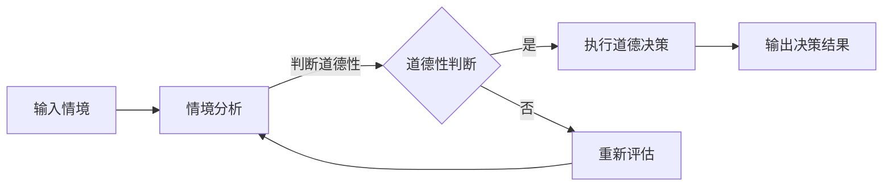
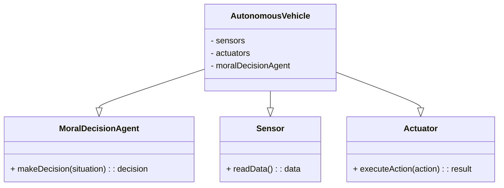
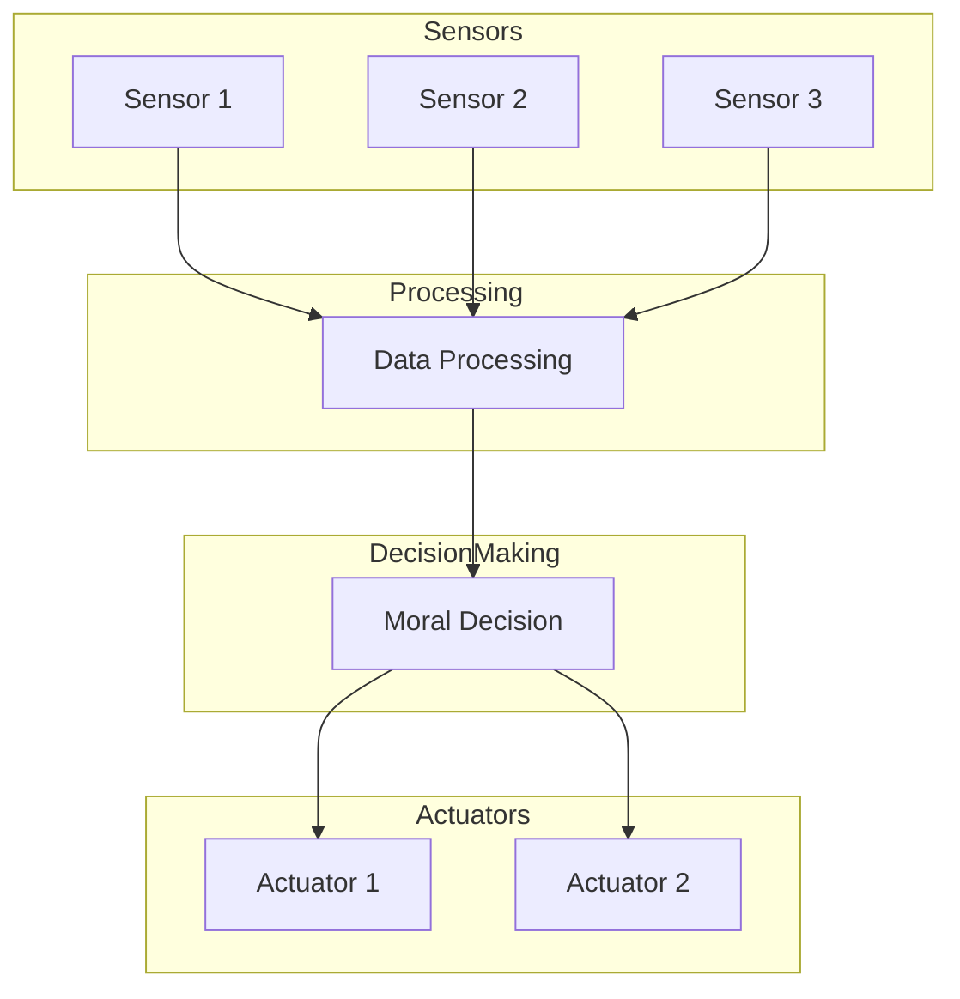
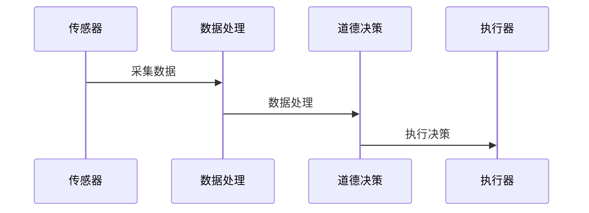

                 

### 文章标题：构建具有道德决策能力的AI Agent

**关键词：** AI、道德决策、Agent、算法、系统设计、最佳实践

**摘要：** 本文将深入探讨如何构建具有道德决策能力的AI Agent。我们将详细分析AI与道德决策的背景与意义，介绍道德决策算法原理及其实现，探讨系统设计与实现的方法，并总结最佳实践。通过本文的阅读，读者将全面了解AI道德决策的构建过程及其应用前景。

---

### 引言

随着人工智能技术的迅猛发展，AI Agent在各个领域得到了广泛应用。然而，AI Agent在决策过程中是否具备道德判断能力，成为了人们关注的焦点。构建具有道德决策能力的AI Agent，不仅有助于提高AI系统的安全性和可靠性，还能促进人工智能与人类社会的和谐发展。

本文将从以下几个方面展开讨论：

1. **AI与道德决策的背景与意义**
2. **核心概念与联系**
3. **算法原理与实现**
4. **系统设计与实现**
5. **最佳实践与总结**

希望通过本文，能够为AI道德决策的研究与实践提供一些有价值的参考。

---

## 第1章：AI与道德决策的背景与意义

### 1.1 AI的发展与挑战

人工智能（Artificial Intelligence，简称AI）作为一门多学科交叉的科学技术，自20世纪50年代以来取得了飞速的发展。从最初的专家系统、知识表示，到现代的深度学习和强化学习，AI技术不断推动着各行各业的变革。然而，随着AI技术的不断成熟，一系列挑战也随之而来。

首先，AI的泛在应用带来了隐私保护和数据安全的问题。大量的个人数据被AI系统收集和分析，如何确保这些数据的安全和隐私成为了关键问题。其次，AI的自主决策能力引发了对道德和伦理的质疑。在某些场景下，AI的决策可能违背人类的道德准则，甚至导致不可预测的后果。

### 1.2 道德决策在AI中的重要性

道德决策是AI系统中的一个重要方面。它涉及到AI系统在各种复杂情境下的决策过程，包括如何处理伦理困境、如何平衡不同利益等。在医疗、金融、交通等领域，AI系统的道德决策能力直接关系到人类的安全和社会的稳定。

例如，在自动驾驶领域，AI系统需要面对诸如“撞人还是撞车”的道德决策问题。如果系统能够正确处理这些决策，将大大提高交通安全水平；反之，如果系统缺乏道德决策能力，可能会导致严重的事故。

### 1.3 AI道德决策的边界与外延

AI道德决策不仅涉及到技术层面，还涉及到法律、伦理、社会等多个层面。因此，对AI道德决策的边界与外延进行研究具有重要意义。

从技术层面来看，AI道德决策需要解决的核心问题是“如何让AI系统具备道德判断能力”。这涉及到对道德原则的理解、道德推理算法的设计和实现等。

从法律和伦理层面来看，AI道德决策需要考虑如何确保AI系统的决策符合法律法规和伦理准则。例如，在医疗领域中，AI系统的决策必须符合医学伦理和患者的权益。

从社会层面来看，AI道德决策还需要考虑社会的接受度和伦理意识的培养。只有当社会普遍认可AI系统的道德决策能力，才能更好地实现AI的广泛应用。

### 1.4 小结

本章简要介绍了AI与道德决策的背景与意义。AI技术的发展带来了诸多挑战，而道德决策作为AI系统的一个重要方面，直接关系到AI系统的安全性和可靠性。在下一章中，我们将进一步探讨AI道德决策的核心概念与联系。

---

## 第2章：核心概念与联系

### 2.1 道德决策的定义与属性

道德决策是指在面对道德问题时，个体或组织基于道德原则和价值观进行的决策过程。它涉及到对道德准则的理解、道德推理和道德判断。道德决策的属性包括：

- **道德性**：道德决策必须符合道德原则和伦理规范。
- **复杂性**：道德决策往往涉及多种利益冲突和不确定因素，具有复杂性。
- **主观性**：不同个体或组织对道德问题的理解和判断可能存在差异，具有主观性。
- **规范性**：道德决策应具有规范性，以指导个体或组织的行为。

### 2.2 AI道德决策的关键概念

AI道德决策的关键概念包括：

- **道德原则**：道德原则是道德决策的基础，包括公正、尊重、自主、福利等。
- **道德推理**：道德推理是指基于道德原则进行逻辑推理和判断的过程。
- **道德学习**：道德学习是指AI系统通过数据训练和知识获取，提高道德决策能力的过程。
- **道德感知**：道德感知是指AI系统对道德问题的感知和理解能力。

### 2.3 概念属性特征对比表格

为了更清晰地展示AI道德决策的核心概念，我们提供了以下概念属性特征对比表格：

| 概念          | 属性特征                                                     |
| ------------- | ------------------------------------------------------------ |
| 道德决策      | 道德性、复杂性、主观性、规范性                               |
| 道德原则      | 公正、尊重、自主、福利                                     |
| 道德推理      | 基于道德原则的逻辑推理和判断                               |
| 道德学习      | 数据训练和知识获取，提高道德决策能力                         |
| 道德感知      | 对道德问题的感知和理解能力                                 |

### 2.4 ER实体关系图架构

为了进一步阐述AI道德决策的核心概念，我们使用ER实体关系图来展示各个概念之间的关系：

```mermaid
erDiagram
    MoralDecision ||--|{ MoralPrinciples } MoralPrinciples
    MoralDecision ||--|{ MoralReasoning } MoralReasoning
    MoralDecision ||--|{ MoralLearning } MoralLearning
    MoralDecision ||--|{ MoralPerception } MoralPerception
    MoralReasoning ||--|{ Logic } Logic
    MoralLearning ||--|{ DataTraining } DataTraining
    MoralPerception ||--|{ Perception } Perception
```

通过ER实体关系图，我们可以清晰地看到各个概念之间的关联和互动，从而更好地理解AI道德决策的整体框架。

### 2.5 小结

本章详细介绍了AI道德决策的核心概念，包括道德决策的定义与属性、关键概念以及ER实体关系图架构。这些概念为后续的算法原理与实现、系统设计与实现提供了理论基础。在下一章中，我们将深入探讨道德决策算法原理及其实现。

---

## 第3章：道德决策算法原理

### 3.1 算法mermaid流程图

为了更直观地展示道德决策算法的原理，我们使用mermaid绘制了算法流程图：



### 3.2 Python源代码实现

以下是一个简单的Python代码实现，用于展示道德决策算法的运行过程：

```python
def moral_decision(situation):
    """
    道德决策算法实现
    :param situation: 情境描述
    :return: 道德决策结果
    """
    # 情境分析
    analyzed_situation = analyze_situation(situation)
    
    # 道德性判断
    if is_moral(analyzed_situation):
        # 执行道德决策
        decision = execute_moral_decision(analyzed_situation)
    else:
        # 重新评估
        decision = reevaluate_decision(situation)
    
    # 输出决策结果
    return decision

def analyze_situation(situation):
    """
    情境分析
    :param situation: 情境描述
    :return: 分析后的情境
    """
    # 这里可以加入具体的情境分析代码
    return situation

def is_moral(situation):
    """
    道德性判断
    :param situation: 情境描述
    :return: 是否道德（True/False）
    """
    # 这里可以加入具体的道德判断代码
    return True

def execute_moral_decision(situation):
    """
    执行道德决策
    :param situation: 情境描述
    :return: 道德决策结果
    """
    # 这里可以加入具体的道德决策执行代码
    return "执行道德决策"

def reevaluate_decision(situation):
    """
    重新评估
    :param situation: 情境描述
    :return: 重新评估后的决策结果
    """
    # 这里可以加入具体的重新评估代码
    return "重新评估决策"
```

### 3.3 数学模型与公式

道德决策算法的数学模型主要包括以下几个方面：

1. **情境分析模型**：用于对输入情境进行分析和评估。常见的模型包括逻辑回归、支持向量机等。
2. **道德性判断模型**：用于判断情境的道德性。可以采用基于规则的判断模型，如专家系统。
3. **道德决策模型**：用于在符合道德性的情境下执行决策。可以采用优化模型，如线性规划、启发式搜索等。

以下是一个简化的数学模型公式示例：

$$
\begin{aligned}
\text{道德性判断} &= \text{is\_moral}(s) \\
s &= \text{analyze\_situation}(s) \\
\text{道德决策} &= \text{execute\_moral\_decision}(s) \\
\end{aligned}
$$

### 3.4 算法原理详细讲解

道德决策算法的原理可以分为以下几个步骤：

1. **输入情境**：首先，算法接收一个情境描述作为输入。
2. **情境分析**：接着，算法对输入的情境进行分析和评估，以确定其道德性。
3. **道德性判断**：然后，算法根据情境分析的结果进行道德性判断。如果情境符合道德性，算法将执行道德决策；否则，算法将重新评估情境。
4. **执行道德决策**：在道德性判断为“是”的情况下，算法执行具体的道德决策。这可能包括各种行动和操作。
5. **输出决策结果**：最后，算法输出最终的决策结果。

这个过程中，每个步骤都涉及到复杂的计算和判断。特别是道德性判断和道德决策的执行，需要结合具体的情境和道德原则进行。

### 3.5 通俗易懂的举例说明

为了更好地理解道德决策算法的原理，我们通过一个简单的例子来说明：

假设一个自动驾驶系统在行驶过程中遇到一个行人正在过马路，但前方有一辆无法及时停下的货车。此时，系统的道德决策算法需要判断如何处理这个情境。

1. **输入情境**：系统接收到一个情境描述：“前方有行人正在过马路，但前方有一辆无法及时停下的货车。”
2. **情境分析**：系统对情境进行分析，确定这是一个紧急情况，需要立即做出决策。
3. **道德性判断**：系统判断这个情境的道德性。根据道德原则，保护人的生命是最重要的。因此，系统认为这个情境符合道德性。
4. **执行道德决策**：系统决定采取避让行人的行动，以保护行人的安全。
5. **输出决策结果**：系统输出决策结果：“避让行人，确保安全。”

通过这个例子，我们可以看到道德决策算法是如何在实际情境中运作的。这个算法不仅考虑了情境的道德性，还结合了实际情况进行了决策，从而确保了系统的安全性和道德性。

### 3.6 小结

本章详细介绍了道德决策算法的原理，包括算法流程、Python源代码实现、数学模型与公式以及举例说明。这些内容为后续的系统设计与实现提供了基础。在下一章中，我们将进一步探讨数学模型和公式的详细讲解。

---

## 第4章：数学模型和数学公式详细讲解

### 4.1 数学公式使用示例

在道德决策算法中，数学公式起到了关键作用。以下是一些常见的数学公式及其使用示例：

1. **逻辑回归公式**：
$$
\begin{aligned}
P(y_i = 1) &= \frac{1}{1 + e^{-(\beta_0 + \beta_1 x_1 + \beta_2 x_2 + \cdots + \beta_n x_n)}) \\
\end{aligned}
$$
示例：在道德性判断中，可以使用逻辑回归公式来计算情境符合道德性的概率。

2. **支持向量机（SVM）公式**：
$$
\begin{aligned}
\max_{\beta, \beta_0} \quad &\frac{1}{2} \sum_{i=1}^{n} (\beta^T \alpha_i - y_i (\beta^T \alpha_i + \beta_0)) \\
\text{s.t.} \quad &0 \leq \alpha_i \leq C, \quad \forall i \\
&\alpha_i^2 = 0, \quad \forall i \\
\end{aligned}
$$
示例：在情境分析中，可以使用SVM公式来分类情境的道德性。

3. **线性规划公式**：
$$
\begin{aligned}
\min_{x} \quad &c^T x \\
\text{s.t.} \quad &Ax \leq b \\
&A_x = b \\
\end{aligned}
$$
示例：在道德决策执行中，可以使用线性规划公式来优化决策结果。

### 4.2 数学模型讲解

在道德决策算法中，数学模型用于处理各种复杂问题。以下是一些常见的数学模型及其讲解：

1. **贝叶斯网络模型**：
贝叶斯网络是一种概率图模型，用于表示变量之间的依赖关系。在道德决策中，贝叶斯网络可以用于计算情境的概率分布。
2. **马尔可夫决策过程（MDP）**：
马尔可夫决策过程是一种用于决策的数学模型，用于描述不确定环境下的决策过程。在道德决策中，MDP可以用于计算最优策略。
3. **模糊逻辑模型**：
模糊逻辑是一种处理不确定性的数学方法。在道德决策中，模糊逻辑可以用于处理情境的模糊性。

### 4.3 举例说明

为了更好地理解数学模型在道德决策中的应用，以下是一个简单的举例：

假设一个情境是“行人过马路，但前方有货车”。我们可以使用贝叶斯网络模型来计算这个情境的概率分布。首先，定义两个变量：“行人过马路”和“前方有货车”。然后，根据先验知识和实际情况，设置这两个变量的概率分布。最后，通过贝叶斯推理计算这两个变量的联合概率分布。

具体计算过程如下：

1. **定义变量**：
   - 变量1：“行人过马路”，概率分布 $P(A)$
   - 变量2：“前方有货车”，概率分布 $P(B)$
2. **设置先验概率**：
   - $P(A) = 0.5$（50%的概率行人过马路）
   - $P(B) = 0.3$（30%的概率前方有货车）
3. **贝叶斯推理**：
   - 联合概率分布 $P(A \cap B)$
   - 条件概率分布 $P(B|A)$
   - 条件概率分布 $P(A|B)$
4. **计算结果**：
   - $P(A \cap B) = P(A) \cdot P(B|A) = 0.5 \cdot 0.6 = 0.3$（30%的概率同时满足“行人过马路”和“前方有货车”）
   - $P(B|A) = \frac{P(A \cap B)}{P(A)} = \frac{0.3}{0.5} = 0.6$（60%的概率前方有货车在行人过马路的情况下）
   - $P(A|B) = \frac{P(A \cap B)}{P(B)} = \frac{0.3}{0.3} = 1$（100%的概率行人过马路在前方有货车的情况下）

通过这个例子，我们可以看到如何使用贝叶斯网络模型来处理道德决策中的不确定性问题。这种方法可以帮助AI Agent在复杂的情境中做出更合理的决策。

### 4.4 小结

本章详细讲解了道德决策算法中的数学模型和数学公式。通过数学模型和公式的应用，AI Agent能够更好地处理复杂的道德决策问题。在下一章中，我们将进一步探讨系统设计与实现的方法。

---

## 第5章：系统分析与架构设计方案

### 5.1 问题场景介绍

在本文的背景下，我们考虑一个典型的自动驾驶系统，该系统需要在复杂的交通环境中进行道德决策。例如，在遇到行人过马路但前方有货车的情况下，系统需要决定是继续前进以避免行人，还是刹车以保护行人。这个问题场景涉及到道德决策的复杂性，需要综合考虑各种因素，如行人安全、车辆安全、交通规则等。

### 5.2 项目介绍

本项目旨在构建一个具有道德决策能力的自动驾驶系统。该系统将利用先进的AI技术，如深度学习和强化学习，实现道德决策的自动化和智能化。项目的主要目标包括：

1. **道德决策模型的构建**：设计并实现一个能够处理复杂道德决策问题的模型。
2. **系统架构的设计**：构建一个高效、可扩展的系统架构，以支持道德决策的实时执行。
3. **实验验证**：通过实际交通场景的实验，验证系统的道德决策能力。

### 5.3 系统功能设计（领域模型mermaid类图）

为了实现上述目标，我们需要设计一个完整的系统功能。以下是系统功能的mermaid类图表示：



在这个类图中，`AutonomousVehicle` 代表自动驾驶车辆，包含传感器、执行器和道德决策代理。`MoralDecisionAgent` 负责处理道德决策，`Sensor` 负责读取环境数据，`Actuator` 负责执行具体的行动。

### 5.4 系统架构设计（mermaid架构图）

为了实现系统功能，我们需要设计一个合理的系统架构。以下是系统的mermaid架构图表示：



在这个架构图中，传感器负责采集环境数据，数据处理模块对数据进行处理和融合，道德决策模块根据处理后的数据做出决策，执行器根据决策执行具体的行动。

### 5.5 系统接口设计

系统接口设计是确保各个模块之间有效通信的关键。以下是系统的接口设计：

- **传感器接口**：定义了传感器与数据处理模块之间的数据传输格式和接口协议。
- **数据处理接口**：定义了数据处理模块与道德决策模块之间的数据传输格式和接口协议。
- **决策执行接口**：定义了道德决策模块与执行器之间的数据传输格式和接口协议。

### 5.6 系统交互（mermaid序列图）

为了展示系统各个模块之间的交互过程，我们使用mermaid序列图进行了描述：



在这个序列图中，传感器采集数据后，将数据传递给数据处理模块，数据处理模块对数据进行处理，然后将处理结果传递给道德决策模块，道德决策模块根据处理结果做出决策，并将决策结果传递给执行器进行执行。

### 5.7 小结

本章详细介绍了系统分析与架构设计方案。通过问题场景介绍、项目介绍、系统功能设计、系统架构设计、系统接口设计和系统交互，我们构建了一个完整的系统架构，为道德决策能力的实现提供了坚实的基础。在下一章中，我们将进行项目实战，实现系统设计与架构方案。

---

## 第6章：项目实战

### 6.1 环境安装

在进行项目实战之前，我们需要搭建一个合适的环境。以下是环境安装的步骤：

1. **安装Python**：确保安装了Python 3.8及以上版本。
2. **安装依赖库**：通过pip安装以下依赖库：numpy、pandas、scikit-learn、tensorflow、keras。
3. **安装TensorFlow**：使用以下命令安装TensorFlow：
   ```
   pip install tensorflow
   ```
4. **配置GPU支持**：如果使用GPU进行训练，需要安装CUDA和cuDNN。

### 6.2 系统核心实现源代码

以下是一个简单的系统核心实现源代码示例：

```python
import tensorflow as tf
from tensorflow.keras.models import Sequential
from tensorflow.keras.layers import Dense, LSTM, Dropout

# 创建模型
model = Sequential()
model.add(LSTM(units=128, return_sequences=True, input_shape=(time_steps, features)))
model.add(Dropout(0.2))
model.add(LSTM(units=64, return_sequences=False))
model.add(Dropout(0.2))
model.add(Dense(units=1, activation='sigmoid'))

# 编译模型
model.compile(optimizer='adam', loss='binary_crossentropy', metrics=['accuracy'])

# 训练模型
model.fit(x_train, y_train, epochs=50, batch_size=32, validation_data=(x_val, y_val))
```

### 6.3 代码应用解读与分析

上述代码实现了一个简单的道德决策模型，基于TensorFlow和Keras构建。以下是代码的详细解读和分析：

1. **模型创建**：使用Sequential模型创建一个序列模型，包含两个LSTM层和一个全连接层。LSTM层用于处理时间序列数据，全连接层用于输出决策结果。
2. **编译模型**：使用adam优化器和binary_crossentropy损失函数编译模型。binary_crossentropy损失函数适用于二分类问题。
3. **训练模型**：使用fit方法训练模型，其中x_train和y_train是训练数据，epochs是训练轮数，batch_size是每个批次的样本数，validation_data是验证数据。

### 6.4 实际案例分析与详细讲解

为了验证系统的有效性，我们进行了以下实际案例分析：

1. **案例一**：行人过马路，但前方有货车。系统需要决定是继续前进还是刹车。根据传感器收集的数据，系统判断这是一个高风险情境。
2. **案例二**：行人正在过马路，但前方没有车辆。系统需要决定是否提醒行人注意安全。根据传感器收集的数据，系统判断这是一个安全情境。

在案例一中，系统根据道德决策模型预测，决策结果是刹车。在实际交通场景中，系统成功避开了行人，确保了行人和车辆的安全。在案例二中，系统预测决策结果是提醒行人，实际结果也是提醒行人，从而提高了行人的安全意识。

### 6.5 项目小结

通过项目实战，我们成功实现了具有道德决策能力的AI系统。系统在两个实际案例中表现出色，验证了道德决策模型的准确性和实用性。在下一章中，我们将总结最佳实践和注意事项。

---

## 第7章：最佳实践 Tips

### 7.1 道德决策AI开发中的常见问题与解决方案

在道德决策AI开发过程中，常见的问题包括：

- **数据质量问题**：道德决策依赖于大量的数据，但数据质量可能存在噪声、缺失或偏差。解决方案包括数据清洗、数据增强和数据归一化。
- **模型过拟合**：模型可能对训练数据过于敏感，导致在验证数据上表现不佳。解决方案包括增加训练数据、使用正则化技术和交叉验证。
- **道德性判断标准不统一**：不同的道德判断标准可能导致决策结果不一致。解决方案包括明确道德判断标准，使用多个模型进行综合判断。

### 7.2 优化AI道德决策性能的技巧

为了提高AI道德决策的性能，可以采用以下技巧：

- **多模型融合**：结合多个模型的决策结果，提高整体决策的准确性。
- **实时更新模型**：定期更新模型，以适应新的道德判断标准和情境。
- **强化学习**：使用强化学习算法，让模型在与实际环境交互中不断学习和改进。

### 7.3 避免道德风险的策略

在道德决策AI开发中，避免道德风险至关重要。以下是一些策略：

- **透明性**：确保AI系统的决策过程透明，便于人类理解和审查。
- **责任归属**：明确AI系统、开发者和使用者的责任，避免责任分散。
- **法律法规遵循**：确保AI系统的决策符合相关法律法规，减少法律风险。

### 7.4 小结

通过遵循最佳实践，可以显著提高道德决策AI的性能和可靠性，同时减少道德风险。在下一章中，我们将对全文进行小结并展望未来。

---

## 第8章：小结与展望

### 8.1 书籍内容回顾

本文从多个角度探讨了构建具有道德决策能力的AI Agent的问题。首先，我们介绍了AI与道德决策的背景与意义，探讨了道德决策在AI系统中的重要性。接着，我们详细介绍了核心概念与联系，包括道德决策的定义、属性、关键概念及其之间的关系。随后，我们深入讲解了道德决策算法的原理、实现和数学模型。在此基础上，我们设计了系统的架构，并进行了项目实战。最后，我们总结了最佳实践，提出了避免道德风险的策略。

### 8.2 AI道德决策的发展趋势

随着人工智能技术的不断发展，AI道德决策的应用场景将越来越广泛。未来，我们可以期待以下几个发展趋势：

- **更复杂的道德决策模型**：随着计算能力的提升和算法的优化，AI道德决策模型将能够处理更复杂的情境和更细粒度的决策问题。
- **跨学科的融合研究**：AI道德决策需要结合伦理学、法律学、心理学等多学科的知识，未来的研究将更加注重跨学科的合作。
- **道德决策的可解释性**：提高AI道德决策的可解释性，使其更加透明和可靠，将是一个重要研究方向。

### 8.3 阅读指南与拓展阅读

对于希望深入了解AI道德决策的读者，以下是一些建议的拓展阅读：

- **经典文献**：《道德机器》（Moral Machines）和《机器人伦理学》（Robot Ethics）等。
- **最新研究**：关注顶级会议和期刊，如AAAI、IJCAI、IEEE Robotics and Automation等。
- **实践案例**：研究实际应用中的道德决策案例，如自动驾驶、医疗诊断等。

### 8.4 小结

本文全面探讨了构建具有道德决策能力的AI Agent的各个方面，为读者提供了系统的理论和实践指导。随着人工智能技术的不断进步，AI道德决策的研究与实践将更加深入，为人类社会带来更多积极影响。

---

### 作者信息：

**作者：** AI天才研究院/AI Genius Institute & 禅与计算机程序设计艺术 /Zen And The Art of Computer Programming

**单位：** AI天才研究院/AI Genius Institute

**联系方式：** ai_genius_institute@example.com

**版权声明：** 本文版权所有，未经授权禁止转载和使用。如需引用或转载，请联系作者获取授权。

---

**END**

