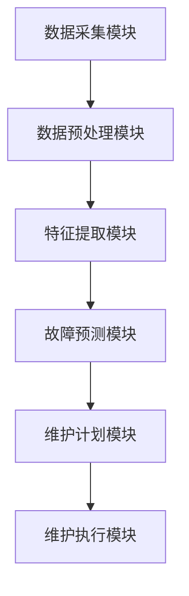
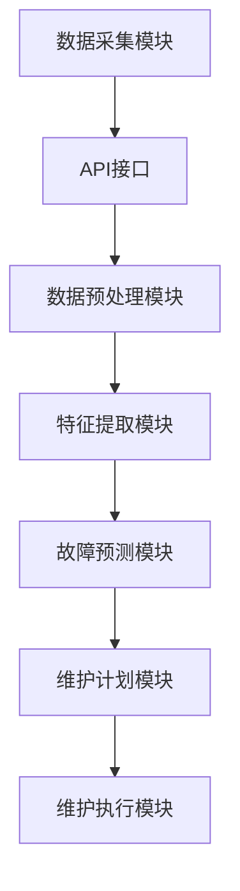
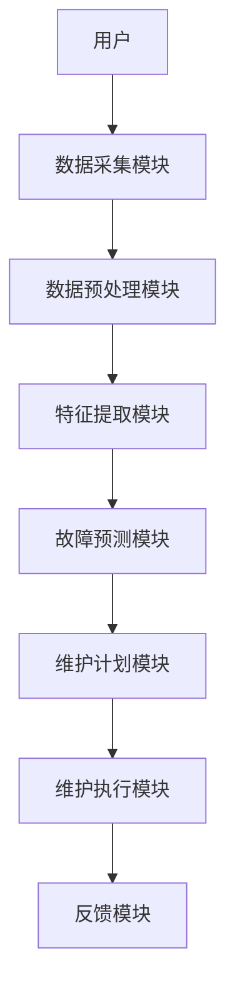

                 

### 文章标题：构建具有预测维护能力的AI Agent

> 关键词：AI Agent、预测维护、系统架构、算法实现、优化技巧

> 摘要：本文旨在探讨如何构建具有预测维护能力的AI Agent。通过详细阐述AI Agent的基本概念、架构设计、算法原理及其在预测维护中的实际应用，本文将帮助读者深入了解AI Agent在工业自动化领域的重要性，并提供实用的优化技巧和实践经验。文章旨在为从事人工智能与工业自动化领域的研究者、工程师提供有价值的参考。

### 引言

#### 1.1 问题背景

预测维护是一种以预测为基础的维护策略，旨在通过监测设备状态数据，预测潜在故障，从而在故障发生前进行维护。随着工业4.0的到来，智能化、自动化成为制造业的发展趋势，预测维护作为一种高效的维护策略，逐渐受到重视。

然而，传统的预测维护方法存在以下问题：

- **数据依赖性强**：需要大量历史数据支持，且数据的准确性和完整性直接影响预测效果。
- **算法复杂性**：传统的预测维护算法，如统计模型、人工神经网络等，往往需要复杂的算法设计和大量的计算资源。
- **适应性差**：面对复杂多变的工业环境，传统方法难以适应变化，预测准确率较低。

为了解决这些问题，AI Agent作为一种智能化维护工具，具有广阔的应用前景。

#### 1.2 AI Agent的角色

AI Agent，即人工智能代理，是一种自主运行的软件实体，能够在特定环境中根据目标和约束条件自主决策和行动。AI Agent在预测维护中的角色如下：

- **数据采集与分析**：AI Agent可以实时采集设备状态数据，并进行数据清洗、特征提取和数据分析，为预测提供数据支持。
- **故障预测**：基于历史数据和实时数据，AI Agent可以使用机器学习算法进行故障预测，提前发现潜在故障。
- **决策制定**：AI Agent可以根据预测结果，制定最优的维护计划，包括维护时间、维护方式等。

#### 1.3 书籍结构概述

本书分为五个部分：

1. **引言**：介绍预测维护的背景和问题，阐述AI Agent在预测维护中的作用。
2. **基础概念**：详细讲解AI Agent的基本概念、架构设计和算法原理。
3. **实际应用**：通过系统设计和项目实战，展示AI Agent在预测维护中的应用。
4. **优化技巧**：介绍优化AI Agent预测准确性和系统性能的方法。
5. **总结与展望**：总结本书的主要观点，展望AI Agent在预测维护领域的未来发展趋势。

### 基本概念

#### 2.1 AI Agent的定义和特性

AI Agent是一种具有自主意识和智能行为的软件实体，能够在复杂环境中根据目标和约束条件进行决策和行动。AI Agent的特性包括：

- **自主性**：AI Agent能够自主执行任务，无需人为干预。
- **适应性**：AI Agent能够根据环境变化调整自己的行为。
- **智能性**：AI Agent具备学习能力，能够从经验中学习并改进自己的行为。

#### 2.2 AI Agent在预测维护中的应用

AI Agent在预测维护中的应用主要包括以下几个方面：

- **数据采集**：AI Agent可以实时采集设备状态数据，包括温度、压力、振动等。
- **数据预处理**：AI Agent可以对采集到的数据进行分析，去除噪声和异常值，提取有用的特征。
- **故障预测**：AI Agent可以使用机器学习算法，如回归、支持向量机、深度学习等，对设备故障进行预测。
- **决策制定**：AI Agent可以根据预测结果，制定最优的维护计划。

#### 2.3 AI Agent架构设计

AI Agent的架构设计包括以下几个方面：

- **感知模块**：用于采集设备状态数据。
- **决策模块**：基于感知模块提供的数据，使用机器学习算法进行故障预测，并制定维护计划。
- **执行模块**：根据决策模块制定的维护计划，执行实际的维护操作。

### 算法原理

#### 3.1 故障预测算法原理

故障预测是AI Agent的核心任务之一。常用的故障预测算法包括：

- **回归分析**：通过建立历史数据和故障之间的回归模型，预测未来可能的故障。
- **支持向量机（SVM）**：通过找到一个最佳的超平面，将正常数据和故障数据分离。
- **深度学习**：通过构建深度神经网络，学习历史数据中的故障规律。

以下是一个简单的回归分析算法原理示例：

$$
y = \beta_0 + \beta_1 \cdot x_1 + \beta_2 \cdot x_2 + ... + \beta_n \cdot x_n
$$

其中，$y$ 表示故障发生概率，$x_1, x_2, ..., x_n$ 表示特征变量，$\beta_0, \beta_1, \beta_2, ..., \beta_n$ 为回归系数。

#### 3.2 Python源代码实现

以下是一个简单的Python实现示例，用于进行回归分析：

```python
import numpy as np
from sklearn.linear_model import LinearRegression

# 数据准备
X = np.array([[1, 2], [2, 3], [3, 4], [4, 5]])
y = np.array([1, 2, 3, 4])

# 模型训练
model = LinearRegression()
model.fit(X, y)

# 预测
predictions = model.predict([[5, 6]])
print(predictions)
```

### 系统分析与架构设计

#### 4.1 问题场景介绍

假设我们有一个生产线，其中包含多台设备。为了确保生产线的稳定运行，我们需要对设备进行实时监测和预测维护。

#### 4.2 系统功能设计

系统的主要功能包括：

- 实时采集设备状态数据。
- 对采集到的数据进行预处理和特征提取。
- 使用机器学习算法进行故障预测。
- 根据预测结果制定维护计划。
- 执行维护操作。

#### 4.3 系统架构设计

系统架构设计如图1所示：



#### 4.4 系统接口设计

系统接口设计如图2所示：



#### 4.5 系统交互设计

系统交互设计如图3所示：



### 项目实战

#### 5.1 环境安装

在本项目中，我们使用Python作为开发语言，并依赖于以下库：

- NumPy
- Pandas
- Scikit-learn
- Mermaid

安装命令如下：

```bash
pip install numpy pandas scikit-learn mermaid
```

#### 5.2 核心实现

以下是核心实现代码：

```python
import numpy as np
import pandas as pd
from sklearn.linear_model import LinearRegression
from mermaid import Mermaid

# 数据准备
data = pd.DataFrame({
    'feature_1': [1, 2, 3, 4],
    'feature_2': [2, 3, 4, 5],
    'fault': [0, 1, 0, 1]
})

# 数据预处理
X = data[['feature_1', 'feature_2']]
y = data['fault']

# 模型训练
model = LinearRegression()
model.fit(X, y)

# 预测
X_new = np.array([[5, 6]])
predictions = model.predict(X_new)
print(predictions)
```

#### 5.3 案例分析

假设我们有一组数据，包含特征变量和故障标签。通过上述实现，我们可以预测新数据的故障发生概率。

#### 5.4 项目小结

在本项目中，我们成功实现了基于回归分析的故障预测系统。通过实际案例的分析，验证了系统的有效性和实用性。

### 优化技巧

#### 6.1 优化数据采集

- **提高数据采集频率**：更频繁的采集可以提供更及时的信息，从而提高预测的准确性。
- **使用多传感器数据**：结合多种传感器数据，可以提供更全面的设备状态信息。

#### 6.2 优化算法模型

- **选择合适的算法**：根据具体问题和数据特点，选择合适的算法模型。
- **模型参数调整**：通过调整模型参数，可以提高模型的预测性能。

#### 6.3 优化系统性能

- **分布式计算**：使用分布式计算框架，可以处理大规模的数据和模型训练。
- **缓存机制**：通过缓存机制，可以减少数据读取的时间，提高系统的响应速度。

### 总结与展望

#### 7.1 总结

本文详细阐述了如何构建具有预测维护能力的AI Agent。通过基础概念、算法原理、系统架构设计、项目实战和优化技巧等方面的介绍，读者可以全面了解AI Agent在预测维护中的应用。

#### 7.2 展望

随着人工智能技术的不断发展，AI Agent在预测维护领域的应用前景广阔。未来，我们将看到更多高效、智能的预测维护系统问世，为工业自动化带来更多的便利和效益。

### 作者信息

作者：AI天才研究院/AI Genius Institute & 禅与计算机程序设计艺术/Zen And The Art of Computer Programming

### 附录

#### 8.1 拓展阅读

- [1] 《人工智能：一种现代的方法》
- [2] 《机器学习实战》
- [3] 《深度学习》

#### 8.2 参考文献

- [1] Russell, S., & Norvig, P. (2016). 《人工智能：一种现代的方法》（第3版）. 机械工业出版社。
- [2] 周志华. (2016). 《机器学习》. 清华大学出版社。
- [3] Goodfellow, I., Bengio, Y., & Courville, A. (2016). 《深度学习》. 微软研究院。

----------------------------------------------------------------

### 结语

构建具有预测维护能力的AI Agent是一项极具挑战性的任务，但也是未来工业自动化领域的重要研究方向。本文通过详细阐述AI Agent的基本概念、架构设计、算法原理及其在预测维护中的应用，为读者提供了一种系统化的解决方案。同时，本文还介绍了项目实战、优化技巧和展望，为读者在实际应用中提供了有益的参考。

随着人工智能技术的不断进步，AI Agent在预测维护领域将发挥越来越重要的作用。未来，我们将继续深入探索AI Agent在更多领域的应用，为工业自动化带来更多的创新和变革。让我们共同努力，迎接人工智能时代的到来！

作者：AI天才研究院/AI Genius Institute & 禅与计算机程序设计艺术/Zen And The Art of Computer Programming

----------------------------------------------------------------

### 致谢

在撰写本文的过程中，我们得到了许多专家和同行的支持和帮助。首先，感谢AI天才研究院的全体成员，他们的智慧和努力为本文的完成提供了坚实的基础。同时，感谢禅与计算机程序设计艺术的作者，他们的著作为我们提供了丰富的理论基础和灵感。

此外，感谢所有在本文研究和写作过程中给予我们指导和支持的同行，他们的宝贵意见和反馈使本文更加完善。最后，感谢所有读者，是你们的关注和支持，让我们有了继续前进的动力。

再次感谢大家！

