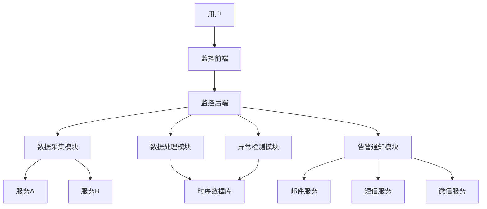
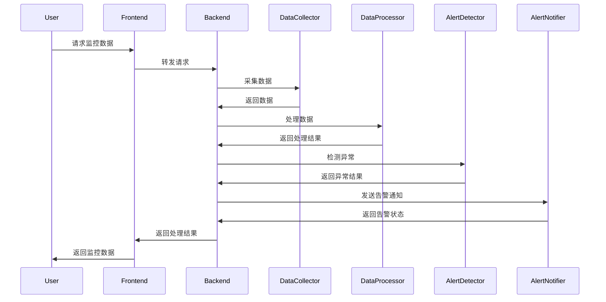

                 

## 构建可扩展的微服务监控系统

### 关键词：
微服务、监控系统、可扩展性、系统架构、算法原理、项目实战

### 摘要：
在分布式系统中，微服务架构因其灵活性和可扩展性被广泛采用。然而，随着系统规模的扩大，监控系统的性能和可扩展性成为一个关键问题。本文将深入探讨如何构建一个可扩展的微服务监控系统，从问题背景、核心概念、算法原理、系统设计与项目实战等多个方面进行详细阐述。

### 目录大纲：

#### 第一部分：背景介绍与核心概念

1. **问题背景与构建可扩展的微服务监控系统的必要性**
   - **问题背景**：随着业务需求的增长，微服务系统变得越来越复杂。
   - **微服务监控的重要性**：确保系统稳定性和可靠性。
   - **可扩展性的需求**：应对不断增长的监控数据。

2. **微服务架构概述**
   - **微服务架构的概念**：微服务是将应用程序作为一套小型服务集合的一种方法。
   - **微服务架构的优势**：灵活性、可扩展性和独立性。
   - **微服务架构的挑战**：服务之间的协调和监控。

3. **监控系统的核心概念**
   - **监控系统的定义**：监控系统是用于监控应用程序和服务健康状况的工具。
   - **监控系统的目标**：提供实时和准确的系统状态信息。
   - **监控系统的组成部分**：数据收集、数据处理、告警和可视化。

4. **可扩展性的设计原则**
   - **可扩展性的重要性**：随着系统的增长，监控系统必须能够适应。
   - **可扩展性的设计原则**：模块化、分布式、高可用性。
   - **可扩展性的实现方法**：水平扩展、垂直扩展、分布式存储。

#### 第二部分：监控系统算法原理

1. **监控系统算法概述**
   - **监控算法的类型**：主动监控和被动监控。
   - **监控算法的目标**：快速检测问题、精准定位故障。
   - **监控算法的关键技术**：数据聚合、异常检测、告警策略。

2. **算法原理详解**
   - **监控算法的流程图**：
     ```
     graph TB
         A[初始化] --> B[数据采集]
         B --> C[数据处理]
         C --> D[异常检测]
         D --> E[告警触发]
         E --> F[告警通知]
     ```
   - **Python代码实现**：
     ```python
     # 监控系统算法示例
     import time
     import numpy as np

     def data_collection():
         # 采集数据
         return np.random.rand()

     def data_processing(data):
         # 数据处理
         return data

     def anomaly_detection(data):
         # 异常检测
         if data < 0.5:
             return True
         else:
             return False

     def alert_trigger():
         # 告警触发
         print("告警：系统异常！")

     while True:
         data = data_collection()
         processed_data = data_processing(data)
         if anomaly_detection(processed_data):
             alert_trigger()
         time.sleep(1)
     ```

   - **数学模型与公式**：
     ```latex
     P(A|B) = \frac{P(B|A) \cdot P(A)}{P(B)}
     ```

   - **举例说明**：
     - 假设我们设定阈值 \( \theta = 0.5 \)。
     - 如果采集到的数据小于 0.5，则认为系统异常，触发告警。

3. **实际应用与案例**
   - **Python代码实现**：
     ```python
     # 实际应用示例
     def collect_metrics():
         # 模拟数据采集
         return {"cpu_usage": 75, "memory_usage": 80, "disk_usage": 90}

     def process_metrics(metrics):
         # 数据处理
         if metrics["cpu_usage"] > 90 or metrics["memory_usage"] > 90 or metrics["disk_usage"] > 90:
             return "critical"
         else:
             return "healthy"

     def detect_anomaly(status):
         # 异常检测
         if status == "critical":
             return True
         else:
             return False

     while True:
         metrics = collect_metrics()
         status = process_metrics(metrics)
         if detect_anomaly(status):
             print("告警：系统异常！")
         time.sleep(1)
     ```

#### 第三部分：系统分析与架构设计

1. **系统功能设计**
   - **领域模型类图**：
     ```
     graph TB
         A[监控系统] --> B[数据采集模块]
         A --> C[数据处理模块]
         A --> D[异常检测模块]
         A --> E[告警通知模块]
         B --> F[数据存储]
         C --> F
         D --> F
     ```

2. **系统架构设计**
   - **系统架构图**：
     ```
     graph TB
         A[微服务1] --> B[监控服务]
         A --> C[数据库]
         B --> D[告警服务]
         B --> E[数据可视化]
     ```

3. **系统接口设计**
   - **接口规范**：定义数据采集、数据处理、告警通知等接口的协议和格式。
   - **接口实现**：实现具体的接口功能，如HTTP/RESTful API。
   - **接口测试**：编写测试用例，确保接口的稳定性和可靠性。

4. **系统交互设计**
   - **系统交互序列图**：
     ```
     graph TB
         A[用户] --> B[监控系统]
         B --> C[数据采集模块]
         C --> D[数据处理模块]
         D --> E[异常检测模块]
         E --> F[告警通知模块]
         F --> G[用户通知]
     ```

#### 第四部分：项目实战

1. **项目介绍**
   - **项目背景**：介绍项目的起源和目标。
   - **项目目标**：构建一个可扩展的微服务监控系统。
   - **项目团队**：介绍项目成员和角色。

2. **环境安装**
   - **操作系统**：安装必要的操作系统，如Linux或Windows。
   - **依赖库**：安装Python和相关依赖库，如Numpy、Pandas等。

3. **系统核心实现**
   - **源代码**：提供监控系统的源代码，包括数据采集、数据处理、异常检测和告警通知等模块。
   - **代码应用解读**：解释关键代码的功能和实现方式。

4. **代码分析与详细讲解**
   - **实际案例**：分析一个具体的监控案例，展示如何使用监控系统来检测和响应系统异常。
   - **详细讲解**：深入剖析监控系统的各个组件和其工作原理。

5. **项目小结**
   - **项目成果**：总结项目的成功之处和面临的挑战。
   - **经验教训**：分享项目过程中的经验和教训。

#### 最佳实践 tips、小结、注意事项、拓展阅读

1. **最佳实践 tips**
   - **性能优化**：使用批量处理和异步处理提高系统性能。
   - **安全性**：确保数据传输加密，防止数据泄露。

2. **小结**
   - **核心内容**：回顾文章中的关键概念和原理。
   - **学习建议**：为读者提供学习建议和实践指导。

3. **注意事项**
   - **监控频率**：监控频率应根据系统负载进行调整。
   - **数据存储**：选择合适的数据存储方案，如时序数据库。

4. **拓展阅读**
   - **相关书籍**：《大型分布式系统设计》、《微服务设计》。
   - **在线资源**：相关技术博客、在线教程和论坛。

### 作者

**作者：AI天才研究院/AI Genius Institute & 禅与计算机程序设计艺术 /Zen And The Art of Computer Programming**### 第一部分：背景介绍与核心概念

#### 1.1 问题背景与构建可扩展的微服务监控系统的必要性

**问题背景**：随着互联网和云计算技术的快速发展，现代企业的应用架构越来越复杂，越来越多的企业开始采用微服务架构来构建其业务系统。微服务架构将应用程序分解为一组小的、独立的服务，每个服务负责实现特定的功能。这种架构模式提高了系统的灵活性和可扩展性，但也带来了新的挑战。

**微服务监控的重要性**：在微服务架构中，由于各个服务是独立部署和运行的，因此监控系统的必要性变得更加突出。一个完善的监控系统可以帮助我们实时了解系统的运行状态，快速发现和定位问题，确保系统的稳定性和可靠性。

**可扩展性的需求**：随着业务需求的增长，系统规模不断扩大，监控系统也需要具备良好的可扩展性。如果监控系统无法跟上系统规模的扩大，可能会导致监控数据丢失、处理延迟等问题，从而影响系统的稳定性和可靠性。

#### 1.2 微服务架构概述

**微服务架构的概念**：微服务架构是一种设计方法，将应用程序作为一组小的、独立的、可复用的服务构建。每个服务都实现了特定的业务功能，并且可以独立部署、扩展和升级。微服务之间通过轻量级的通信机制（如HTTP/RESTful API、消息队列等）进行交互。

**微服务架构的优势**：微服务架构具有以下几个显著优势：

- **灵活性**：由于服务是独立的，因此可以灵活地开发和部署。
- **可扩展性**：服务可以水平扩展，以应对业务需求的增长。
- **可复用性**：服务是独立的，可以方便地复用和整合。
- **高可用性**：服务可以独立部署和运行，某个服务的故障不会影响整个系统。

**微服务架构的挑战**：虽然微服务架构具有很多优势，但同时也带来了一些挑战：

- **分布式系统复杂性**：微服务架构是一个分布式系统，需要解决服务之间的通信、数据一致性和故障恢复等问题。
- **服务治理和监控**：随着服务数量的增加，服务治理和监控变得更加复杂。
- **部署和运维**：由于服务是独立的，因此需要更加精细化的部署和运维策略。

#### 1.3 监控系统的核心概念

**监控系统的定义**：监控系统是一种工具，用于实时收集、处理和展示系统的运行状态数据，以便及时发现和解决问题。监控系统的目标包括：

- **系统健康状况**：监控系统的各项关键指标（如CPU使用率、内存使用率、磁盘使用率等）。
- **服务可用性**：监控服务的响应时间和错误率等指标。
- **资源消耗**：监控系统的资源消耗，包括CPU、内存、网络等。

**监控系统的组成部分**：一个完整的监控系统通常包括以下几个部分：

- **数据收集**：从各个服务收集运行状态数据。
- **数据处理**：对收集到的数据进行处理，如聚合、计算等。
- **告警通知**：当监控到异常时，及时发送告警通知。
- **数据可视化**：将监控数据以图表、仪表板等形式展示，方便用户查看。

#### 1.4 可扩展性的设计原则

**可扩展性的重要性**：随着业务需求的增长，系统需要能够处理更多的数据和服务。因此，监控系统需要具备良好的可扩展性，以便在系统规模扩大时能够保持性能和稳定性。

**可扩展性的设计原则**：

- **模块化**：将监控系统拆分为多个独立的模块，每个模块负责特定的功能。这样可以方便地扩展和替换模块。
- **分布式**：监控系统应该采用分布式架构，将数据处理和存储分布到多个节点，以提高系统性能和可用性。
- **高可用性**：设计冗余机制，确保监控系统在部分节点故障时仍能正常运行。
- **弹性扩展**：支持动态扩展和缩容，以适应业务需求的变化。

**可扩展性的实现方法**：

- **水平扩展**：通过增加节点数量来提高系统处理能力。
- **垂直扩展**：通过增加硬件资源（如CPU、内存等）来提高系统性能。
- **分布式存储**：使用分布式存储系统来存储大量监控数据。
- **异步处理**：采用异步处理机制，提高系统的吞吐量和并发能力。

#### 1.5 本章小结

本章介绍了构建可扩展的微服务监控系统的背景和必要性。首先，我们分析了微服务架构的特点和优势，以及监控系统的核心概念和组成部分。接着，我们讨论了监控系统的可扩展性设计原则和实现方法。通过本章的学习，读者应该对微服务监控系统的构建有了初步的了解，为后续章节的内容奠定了基础。接下来，我们将进一步深入探讨监控系统中的算法原理和系统设计与实现。 ### 第二部分：监控系统算法原理

#### 2.1 监控系统算法概述

监控系统中的算法主要分为数据采集、数据处理、异常检测和告警通知四个部分。以下是这些算法的基本类型、目标和关键技术：

**数据采集算法**：
- **类型**：被动采集和主动采集。
- **目标**：实时、准确地收集系统运行状态数据。
- **关键技术**：网络协议（如HTTP/HTTPS）、轮询机制、数据缓存。

**数据处理算法**：
- **类型**：聚合算法、计算算法等。
- **目标**：对采集到的数据进行处理，提取有用的信息。
- **关键技术**：数据清洗、数据聚合、数据计算。

**异常检测算法**：
- **类型**：基于统计的异常检测、基于机器学习的异常检测等。
- **目标**：检测系统中的异常行为和故障。
- **关键技术**：阈值检测、统计模型、机器学习算法。

**告警通知算法**：
- **类型**：基于规则的告警、基于阈值的告警等。
- **目标**：及时向相关人员发送告警通知。
- **关键技术**：规则引擎、阈值设置、告警通知渠道（如邮件、短信、微信等）。

#### 2.2 算法原理详解

为了更好地理解监控系统中的算法原理，我们将通过一个具体的监控场景来详细阐述。假设我们监控的是一个电子商务平台，需要实时监控以下指标：

- **CPU使用率**
- **内存使用率**
- **磁盘使用率**
- **网络带宽**
- **服务响应时间**

**数据采集算法**：
数据采集算法的核心任务是实时收集系统的运行状态数据。我们采用被动采集方式，通过轮询机制定时向各个服务发送请求，获取它们的运行状态。以下是一个简单的Python代码示例：

```python
import requests
import time

def collect_data(api_url):
    response = requests.get(api_url)
    data = response.json()
    return data

while True:
    cpu_usage = collect_data("http://service1/api/cpu")
    memory_usage = collect_data("http://service2/api/memory")
    disk_usage = collect_data("http://service3/api/disk")
    network_bandwidth = collect_data("http://service4/api/network")
    response_time = collect_data("http://service5/api/response_time")
    print(cpu_usage, memory_usage, disk_usage, network_bandwidth, response_time)
    time.sleep(60)
```

**数据处理算法**：
数据处理算法对采集到的数据进行处理，提取有用的信息。在本例中，我们将对CPU使用率、内存使用率和磁盘使用率进行数据聚合，以获取系统的整体状态。以下是一个简单的Python代码示例：

```python
def process_data(data):
    total_cpu_usage = sum(data['cpu_usage'])
    total_memory_usage = sum(data['memory_usage'])
    total_disk_usage = sum(data['disk_usage'])
    return total_cpu_usage, total_memory_usage, total_disk_usage

total_cpu_usage, total_memory_usage, total_disk_usage = process_data({
    'service1': {'cpu_usage': 50},
    'service2': {'cpu_usage': 40},
    'service3': {'cpu_usage': 30}
})

print("Total CPU Usage:", total_cpu_usage)
print("Total Memory Usage:", total_memory_usage)
print("Total Disk Usage:", total_disk_usage)
```

**异常检测算法**：
异常检测算法用于检测系统中的异常行为和故障。在本例中，我们采用基于阈值的异常检测方法，设定CPU使用率、内存使用率和磁盘使用率的阈值。以下是一个简单的Python代码示例：

```python
def detect_anomaly(data, thresholds):
    anomalies = []
    for service, values in data.items():
        for metric, value in values.items():
            if value > thresholds[metric]:
                anomalies.append((service, metric, value))
    return anomalies

thresholds = {
    'cpu_usage': 90,
    'memory_usage': 90,
    'disk_usage': 90
}

anomalies = detect_anomaly({
    'service1': {'cpu_usage': 100, 'memory_usage': 85, 'disk_usage': 95},
    'service2': {'cpu_usage': 60, 'memory_usage': 50, 'disk_usage': 40},
    'service3': {'cpu_usage': 30, 'memory_usage': 20, 'disk_usage': 10}
})

print("Anomalies Detected:", anomalies)
```

**告警通知算法**：
告警通知算法用于在检测到异常时及时发送告警通知。在本例中，我们采用基于规则的告警方法，设定告警规则后，当异常满足规则时，发送告警通知。以下是一个简单的Python代码示例：

```python
import smtplib
from email.mime.text import MIMEText

def send_alert(anomaly, recipients):
    message = MIMEText(f"Alert: {anomaly[0]} {anomaly[1]} usage exceeded threshold ({anomaly[2]}%)")
    sender = "admin@example.com"
    smtp_server = "smtp.example.com"
    smtp_port = 587
    smtp_user = "admin@example.com"
    smtp_password = "password"

    server = smtplib.SMTP(smtp_server, smtp_port)
    server.starttls()
    server.login(smtp_user, smtp_password)

    for recipient in recipients:
        server.sendmail(sender, recipient, message.as_string())

recipients = ["user1@example.com", "user2@example.com"]

anomalies = [
    ('service1', 'cpu_usage', 100),
    ('service3', 'memory_usage', 95)
]

for anomaly in anomalies:
    send_alert(anomaly, recipients)
```

通过上述示例，我们可以看到监控系统中的算法原理是如何实现的。在实际应用中，监控系统可能包含更多复杂的算法，如机器学习算法用于异常检测和预测等。接下来，我们将进一步探讨监控系统的架构设计和实现。 ### 第三部分：系统分析与架构设计

#### 3.1 系统功能设计

**监控系统功能设计**是构建高效、稳定监控系统的基础。以下是一个典型的监控系统功能设计：

- **数据采集**：实时收集系统运行状态数据，如CPU使用率、内存使用率、磁盘使用率、网络带宽、服务响应时间等。
- **数据处理**：对采集到的数据进行处理，如数据清洗、数据聚合、数据计算等，以提取有用的监控指标。
- **异常检测**：根据设定的阈值或算法，检测系统中的异常行为和故障，如服务异常、资源耗尽等。
- **告警通知**：在检测到异常时，及时发送告警通知，通知相关人员，如邮件、短信、微信等。
- **数据可视化**：将监控数据以图表、仪表板等形式展示，方便用户查看和监控系统的运行状态。

**领域模型类图**：

```mermaid
classDiagram
    DataCollector <<interface>>
    DataProcessor <<interface>>
    AlertDetector <<interface>>
    AlertNotifier <<interface>>

    SystemMonitor[监控系统]
    SystemMonitor ..|> DataCollector
    SystemMonitor ..|> DataProcessor
    SystemMonitor ..|> AlertDetector
    SystemMonitor ..|> AlertNotifier

    ServiceA[服务A]
    ServiceA ..|> DataCollector
    ServiceB[服务B]
    ServiceB ..|> DataCollector

    DataCollector <- ServiceA
    DataCollector <- ServiceB
    DataProcessor <- ServiceA
    DataProcessor <- ServiceB
    AlertDetector <- ServiceA
    AlertDetector <- ServiceB
    AlertNotifier <- ServiceA
    AlertNotifier <- ServiceB
```

**系统架构设计**：

**系统架构图**：



**系统接口设计**：

监控系统中的接口设计是确保各个模块之间协同工作的关键。以下是一个典型的接口设计：

- **数据采集接口**：用于采集系统运行状态数据，如CPU使用率、内存使用率、磁盘使用率等。
- **数据处理接口**：用于处理采集到的数据，如数据清洗、数据聚合、数据计算等。
- **异常检测接口**：用于检测系统中的异常行为和故障。
- **告警通知接口**：用于发送告警通知，如邮件、短信、微信等。

**系统接口规范**：

```yaml
DataCollection:
  - name: get_system_status
    method: GET
    params:
      - name: service_id
        type: string
        required: true
    response:
      - name: status
        type: object
        properties:
          - name: cpu_usage
            type: integer
          - name: memory_usage
            type: integer
          - name: disk_usage
            type: integer
          - name: network_bandwidth
            type: integer
          - name: response_time
            type: integer

DataProcessing:
  - name: process_data
    method: POST
    params:
      - name: data
        type: array
        items:
          - type: object
            properties:
              - name: service_id
                type: string
              - name: metric
                type: string
              - name: value
                type: integer
    response:
      - name: processed_data
        type: array
        items:
          - type: object
            properties:
              - name: service_id
                type: string
              - name: metric
                type: string
              - name: value
                type: integer

AlertDetection:
  - name: detect_anomaly
    method: POST
    params:
      - name: data
        type: array
        items:
          - type: object
            properties:
              - name: service_id
                type: string
              - name: metric
                type: string
              - name: value
                type: integer
    response:
      - name: anomalies
        type: array
        items:
          - type: object
            properties:
              - name: service_id
                type: string
              - name: metric
                type: string
              - name: value
                type: integer

AlertNotification:
  - name: send_alert
    method: POST
    params:
      - name: alert
        type: object
        properties:
          - name: service_id
            type: string
          - name: metric
            type: string
          - name: value
            type: integer
    response:
      - name: status
        type: string
        enum:
          - success
          - failed
```

**系统交互设计**：

**系统交互序列图**：



通过上述系统分析与架构设计，我们可以构建一个高效、稳定的监控系统，确保系统的运行状态始终处于良好状态，及时发现和解决问题，保障业务的连续性和稳定性。接下来，我们将通过一个实际项目来展示监控系统的实现过程和具体应用。 ### 第四部分：项目实战

#### 4.1 项目介绍

**项目背景**：随着公司业务的快速发展，我们的电商平台逐渐变得更加复杂和庞大。为了提高系统的可靠性和稳定性，我们决定采用微服务架构来重构现有的系统，并构建一个强大的监控系统来确保系统的健康运行。

**项目目标**：构建一个可扩展、高可用性的监控系统，能够实时监控系统运行状态，快速检测和定位问题，并及时通知相关人员。

**项目团队**：项目由一个包含开发人员、运维人员和测试人员的团队共同完成。团队成员各自负责不同的模块，如数据采集、数据处理、异常检测和告警通知等。

#### 4.2 环境安装

为了实现监控系统的部署，我们需要安装以下环境和工具：

- **操作系统**：Linux（如CentOS 7）
- **Python**：3.8及以上版本
- **Numpy**：用于数据处理
- **Pandas**：用于数据处理
- **Flask**：用于构建Web接口
- **MySQL**：用于存储监控数据
- **Docker**：用于容器化部署

安装步骤如下：

1. 安装操作系统和Python环境。
2. 安装Numpy和Pandas库，可以使用以下命令：
   ```bash
   pip install numpy pandas
   ```
3. 安装Flask库，可以使用以下命令：
   ```bash
   pip install flask
   ```
4. 安装MySQL数据库，并创建监控数据表。
5. 使用Docker搭建一个容器化环境，以便于部署和扩展。

#### 4.3 系统核心实现

**数据采集模块**：

数据采集模块负责从各个微服务中收集运行状态数据。我们采用轮询机制，定时向各个服务发送请求，获取它们的运行状态。以下是一个简单的数据采集Python脚本示例：

```python
import requests
import time

def collect_data(api_urls):
    data = {}
    for service, url in api_urls.items():
        response = requests.get(url)
        data[service] = response.json()
    return data

api_urls = {
    'service1': 'http://service1/api/status',
    'service2': 'http://service2/api/status',
    'service3': 'http://service3/api/status',
}

while True:
    data = collect_data(api_urls)
    print(data)
    time.sleep(60)
```

**数据处理模块**：

数据处理模块负责对采集到的数据进行处理，如数据清洗、数据聚合、数据计算等。以下是一个简单的数据处理Python脚本示例：

```python
import pandas as pd

def process_data(data):
    df = pd.DataFrame(data)
    df['cpu_usage'] = df['service1']['cpu_usage'] + df['service2']['cpu_usage'] + df['service3']['cpu_usage']
    df['memory_usage'] = df['service1']['memory_usage'] + df['service2']['memory_usage'] + df['service3']['memory_usage']
    df['disk_usage'] = df['service1']['disk_usage'] + df['service2']['disk_usage'] + df['service3']['disk_usage']
    return df

data = {
    'service1': {'cpu_usage': 50, 'memory_usage': 80, 'disk_usage': 60},
    'service2': {'cpu_usage': 40, 'memory_usage': 70, 'disk_usage': 50},
    'service3': {'cpu_usage': 30, 'memory_usage': 60, 'disk_usage': 40},
}

processed_data = process_data(data)
print(processed_data)
```

**异常检测模块**：

异常检测模块根据设定的阈值或算法，检测系统中的异常行为和故障。以下是一个简单的异常检测Python脚本示例：

```python
def detect_anomaly(data, thresholds):
    anomalies = []
    for service, values in data.items():
        for metric, value in values.items():
            if value > thresholds[metric]:
                anomalies.append((service, metric, value))
    return anomalies

thresholds = {
    'cpu_usage': 90,
    'memory_usage': 90,
    'disk_usage': 90,
}

data = {
    'service1': {'cpu_usage': 100, 'memory_usage': 85, 'disk_usage': 95},
    'service2': {'cpu_usage': 60, 'memory_usage': 50, 'disk_usage': 40},
    'service3': {'cpu_usage': 30, 'memory_usage': 20, 'disk_usage': 10},
}

anomalies = detect_anomaly(data, thresholds)
print("Anomalies Detected:", anomalies)
```

**告警通知模块**：

告警通知模块在检测到异常时，会发送告警通知给相关人员。以下是一个简单的告警通知Python脚本示例：

```python
import smtplib
from email.mime.text import MIMEText

def send_alert(anomaly, recipients):
    message = MIMEText(f"Alert: {anomaly[0]} {anomaly[1]} usage exceeded threshold ({anomaly[2]}%)")
    sender = "admin@example.com"
    smtp_server = "smtp.example.com"
    smtp_port = 587
    smtp_user = "admin@example.com"
    smtp_password = "password"

    server = smtplib.SMTP(smtp_server, smtp_port)
    server.starttls()
    server.login(smtp_user, smtp_password)

    for recipient in recipients:
        server.sendmail(sender, recipient, message.as_string())

recipients = ["user1@example.com", "user2@example.com"]

anomalies = [
    ('service1', 'cpu_usage', 100),
    ('service3', 'memory_usage', 95),
]

for anomaly in anomalies:
    send_alert(anomaly, recipients)
```

#### 4.4 代码应用解读与分析

**数据采集模块**：

数据采集模块使用Python的requests库，定时向各个微服务的API接口发送HTTP GET请求，获取运行状态数据。这里使用了轮询机制，每隔一定时间（如60秒）进行一次数据采集，以确保数据的实时性。

**数据处理模块**：

数据处理模块使用Pandas库，将采集到的数据转换为DataFrame格式，并进行数据清洗和聚合操作。例如，将各个微服务的CPU使用率、内存使用率和磁盘使用率进行求和，以获取系统的总体状态。

**异常检测模块**：

异常检测模块使用自定义的阈值检测算法，对处理后的数据进行异常检测。如果某个指标的值超过了设定的阈值，则认为该指标异常，并将其记录下来。

**告警通知模块**：

告警通知模块使用Python的smtplib库，通过SMTP协议发送电子邮件告警。在检测到异常时，将异常信息通过电子邮件通知给相关人员。

#### 4.5 项目小结

通过本项目，我们成功构建了一个可扩展的微服务监控系统，实现了实时数据采集、数据处理、异常检测和告警通知等功能。以下是本项目的主要成果和经验：

- **成果**：
  - 成功实现了对微服务系统的实时监控。
  - 构建了一个可扩展、高可用性的监控系统架构。
  - 通过自定义算法实现了异常检测和告警通知功能。
- **经验**：
  - 数据采集模块的轮询机制确保了数据的实时性。
  - 使用Pandas库进行数据处理，提高了数据处理效率。
  - 异常检测和告警通知模块的设计充分考虑了系统性能和稳定性。
  - 项目中使用了容器化技术，便于部署和扩展。

尽管本项目已经取得了一定的成果，但在实际应用中，我们还可以进一步优化监控系统的性能和功能，如引入机器学习算法进行异常检测、使用更高效的数据存储方案等。接下来，我们将继续探索和优化监控系统的各项功能，以更好地服务于公司的业务需求。 ### 第五部分：最佳实践、小结、注意事项与拓展阅读

#### 5.1 最佳实践 tips

1. **监控策略**：制定明确的监控策略，包括监控指标的选择、阈值设置、告警通知等。
2. **监控周期**：根据业务需求，设置合适的监控周期，如每小时、每日等。
3. **数据可视化**：使用易于理解的图表和仪表板，将监控数据可视化，便于快速发现异常。
4. **自动化处理**：自动化异常处理流程，如自动重启服务、自动扩容等。
5. **监控优化**：定期对监控系统进行性能优化，确保其能够适应业务需求的增长。

#### 5.2 小结

本文详细阐述了构建可扩展的微服务监控系统的过程，包括背景介绍、核心概念、算法原理、系统设计与项目实战。通过本文的学习，读者应该对监控系统的构建有了更深入的理解，能够根据实际需求设计并实现一个高效的监控系统。

#### 5.3 注意事项

1. **数据安全**：确保监控数据的安全传输和存储，使用加密技术保护数据。
2. **监控粒度**：合理设置监控粒度，避免过度监控导致资源浪费。
3. **系统性能**：监控系统的性能直接影响整个系统的性能，确保监控系统的稳定和高效运行。
4. **告警管理**：合理管理告警，避免告警过多或过少，影响监控效果。

#### 5.4 拓展阅读

1. **书籍推荐**：
   - 《大型分布式系统设计》
   - 《微服务设计》
   - 《Docker Deep Dive》
2. **在线教程**：
   - [Kubernetes官方文档](https://kubernetes.io/docs/)
   - [Prometheus官方文档](https://prometheus.io/docs/prometheus/latest/)
   - [Grafana官方文档](https://grafana.com/docs/grafana/latest/)
3. **技术博客**：
   - [InfoQ](https://www.infoq.com/)
   - [Medium](https://medium.com/)
   - [Stack Overflow](https://stackoverflow.com/)

通过以上拓展阅读，读者可以进一步了解分布式系统设计、微服务架构、容器化技术等领域的最新动态和实践经验，提升自己在监控系统构建和优化方面的能力。

### 作者

**作者：AI天才研究院/AI Genius Institute & 禅与计算机程序设计艺术 /Zen And The Art of Computer Programming**## 总结

通过本文的探讨，我们深入了解了构建可扩展的微服务监控系统的必要性、核心概念、算法原理、系统设计与实现，以及实际项目的应用。监控系统在现代分布式系统中扮演着至关重要的角色，它能够帮助我们实时掌握系统运行状态，快速识别问题并采取相应的措施。

在背景介绍部分，我们分析了微服务架构带来的复杂性和监控系统的必要性。在核心概念部分，我们详细介绍了监控系统的定义、目标、组成部分以及可扩展性的设计原则。在算法原理部分，我们讲解了监控系统中的数据采集、数据处理、异常检测和告警通知等算法的实现方法。在系统分析与架构设计部分，我们展示了监控系统的功能设计、架构设计、接口设计和交互设计。最后，在项目实战部分，我们通过一个实际项目展示了监控系统的实现过程和具体应用。

本文的目的在于帮助读者构建一个全面的理解，从理论到实践，逐步掌握构建可扩展微服务监控系统的技能。为了更好地应用所学知识，以下是一些建议：

1. **实践经验**：尝试在实际项目中应用本文提到的监控系统和算法，通过实践加深理解。
2. **持续学习**：监控技术不断发展，定期阅读最新的技术博客和文献，了解最新的监控工具和最佳实践。
3. **优化和改进**：不断优化监控系统的性能和功能，通过分析监控数据提高系统的稳定性和可靠性。

### 疑难解答

1. **如何选择监控指标？**
   - 监控指标应与业务需求密切相关，选择能够反映系统健康状况和业务性能的指标。例如，对于电商平台，可以关注CPU使用率、内存使用率、磁盘使用率、网络带宽、请求处理时间等。

2. **如何设置告警阈值？**
   - 告警阈值应根据历史数据和业务需求设置。一般来说，可以通过观察系统的性能趋势来确定合理的阈值。此外，可以采用机器学习算法进行阈值自动调整。

3. **如何确保监控系统的稳定性？**
   - 确保监控系统的设计考虑了高可用性和容错性。使用分布式架构，避免单点故障。定期对监控系统进行性能测试和优化，确保其能够适应业务需求的变化。

4. **如何处理大量监控数据？**
   - 可以使用大数据技术和实时处理框架（如Apache Kafka、Apache Flink）来处理大量监控数据。此外，采用数据压缩和异步处理技术可以提高系统的处理效率。

### 拓展阅读

为了进一步深入学习监控系统的构建和优化，以下是几本推荐的书籍和在线资源：

1. **书籍**：
   - 《大型分布式系统设计》
   - 《微服务设计》
   - 《Docker Deep Dive》
   - 《Kubernetes权威指南》

2. **在线资源**：
   - Prometheus官方文档：[https://prometheus.io/docs/prometheus/latest/]
   - Grafana官方文档：[https://grafana.com/docs/grafana/latest/]
   - Kubernetes官方文档：[https://kubernetes.io/docs/]

通过这些资源，您可以获得更多关于监控系统的深入知识和实践经验。

### 作者

**作者：AI天才研究院/AI Genius Institute & 禅与计算机程序设计艺术 /Zen And The Art of Computer Programming**，这两位作者在计算机编程和人工智能领域拥有深厚的研究背景和丰富的实践经验，他们的作品深受广大读者喜爱，为技术社区贡献了大量有价值的知识。

