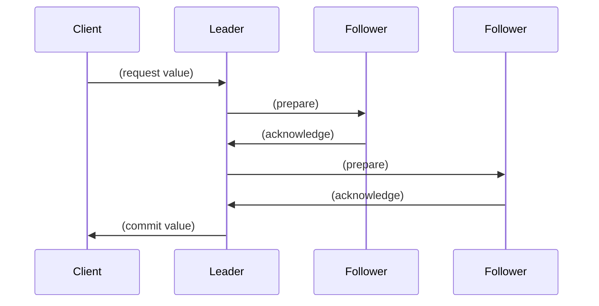
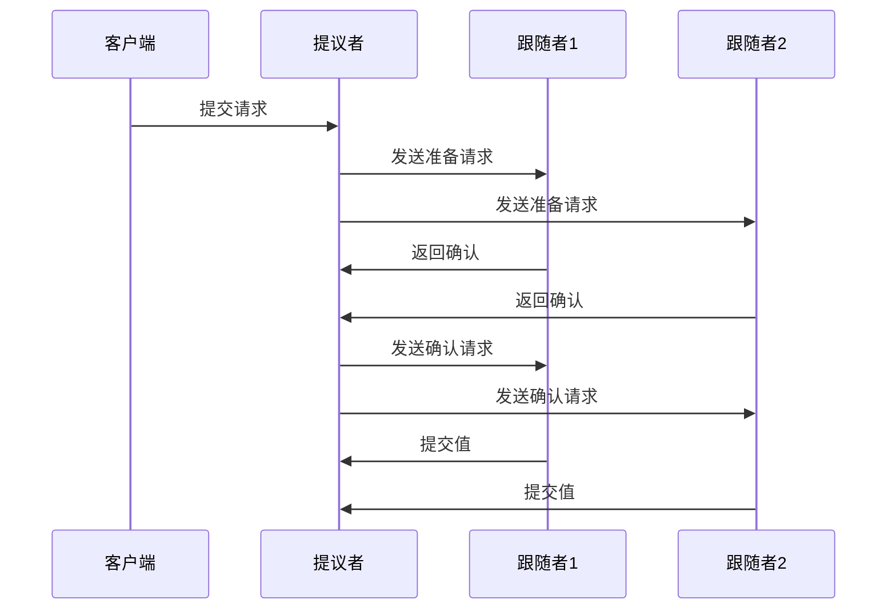

                 

# 《构建可靠的分布式共识算法实现》

## 关键词
分布式共识算法、区块链、共识协议、Paxos算法、拜占庭将军问题、可靠性和性能优化

## 摘要
本文旨在详细探讨分布式共识算法的构建，特别关注可靠性的实现。首先，我们将介绍分布式共识算法的基本概念和其在区块链技术中的重要性。随后，我们将深入探讨Paxos算法和拜占庭将军问题的解决方法，并使用Python代码和Mermaid流程图来阐述算法原理。接着，我们将分析分布式共识算法在系统架构中的应用，并通过一个实际项目实战展示如何实现这一算法。最后，我们将总结关键点，并提供一些最佳实践和拓展阅读建议。

----------------------------------------------------------------

## 第1章 引言

### 1.1 问题背景

在分布式系统中，多个节点需要达成一致意见，这是一个复杂的挑战。分布式共识算法是解决这一问题的核心。随着区块链技术的兴起，分布式共识算法的重要性愈发凸显。比特币和以太坊等区块链平台依赖共识算法来确保数据一致性和系统安全性。

### 1.2 问题定义

分布式共识算法旨在在一个分布式系统中，即使部分节点出现故障或者受到恶意攻击，系统仍然能够达成一致意见。这一问题的核心是如何在动态和不确定的网络环境中，确保所有节点最终达成一致状态。

### 1.3 解决方案概述

解决方案包括设计可靠的共识算法，确保系统在面临各种挑战时仍能稳定运行。这些算法需要具备容错性、安全性和高效性。本文将重点介绍Paxos算法和拜占庭将军问题的解决方案。

### 1.4 边界与外延

本文的边界在于专注于分布式共识算法的实现，而不涉及具体区块链平台的实现细节。外延包括对其他共识算法的讨论，如Raft算法和PBFT算法。

### 1.5 本书结构

本书分为七个主要章节。首先，我们将介绍分布式共识算法的基础知识。接着，详细讲解Paxos算法的原理，并通过Python代码实现。然后，我们将分析分布式共识算法在系统架构中的应用。接下来，通过一个实际项目实战来展示算法实现。随后，我们将总结关键点并提供最佳实践。最后，我们将总结本书内容并提供拓展阅读建议。

----------------------------------------------------------------

## 第2章 分布式共识算法基础

### 2.1 核心概念

分布式共识算法是分布式系统中的一项关键技术，它允许多个节点在不信任的环境下达成一致状态。核心概念包括节点、消息传递、一致性协议等。

- **节点**：分布式系统中的基本单元，每个节点拥有本地状态和本地日志。
- **消息传递**：节点之间通过消息传递来同步状态和达成共识。
- **一致性协议**：确保分布式系统中所有节点最终达成一致状态的协议。

### 2.2 分布式系统中的挑战

分布式系统中面临的主要挑战包括：

- **节点故障**：节点可能因为各种原因（如硬件故障、网络中断）停止工作。
- **恶意节点**：部分节点可能故意发送错误消息或伪造数据，破坏系统一致性。

### 2.3 分布式共识算法的属性

分布式共识算法需要具备以下属性：

- **一致性**：所有节点最终达成一致状态。
- **容错性**：系统能够容忍一定数量的节点故障。
- **安全性**：防止恶意节点破坏系统一致性。
- **高效性**：算法需要具备较低的通信和计算开销。

### 2.4 分布式共识算法与其他技术的比较

分布式共识算法与以下技术存在一定的关联性：

- **区块链**：区块链是一种分布式数据库，依赖共识算法来确保数据一致性。
- **分布式存储**：分布式存储系统使用共识算法来确保数据副本的一致性。
- **分布式计算**：分布式计算框架（如MapReduce）使用共识算法来协调任务分配和状态同步。

----------------------------------------------------------------

## 第3章 算法原理讲解

### 3.1 算法流程图

为了更好地理解Paxos算法的原理，我们首先使用Mermaid画出其基本流程图：



### 3.2 Python实现

以下是一个简化的Python实现，用于展示Paxos算法的核心逻辑：

```python
import random

class Paxos:
    def __init__(self, num_followers):
        self.followers = [Follower() for _ in range(num_followers)]
        self.leader = Leader(self.followers)

    def run(self, client_request):
        self.leader.propose_value(client_request)

class Follower:
    def prepare(self, proposal_number):
        # 实现准备请求逻辑
        pass

    def acknowledge(self, proposal_number, value):
        # 实现确认请求逻辑
        pass

class Leader:
    def __init__(self, followers):
        self.followers = followers
        self.proposal_number = 0
        self.proposed_value = None

    def propose_value(self, value):
        self.proposal_number += 1
        self.proposed_value = value
        for follower in self.followers:
            follower.prepare(self.proposal_number)

    def receive_ack(self, proposal_number, value):
        if proposal_number == self.proposal_number:
            self.commit_value(value)

    def commit_value(self, value):
        # 实现提交值逻辑
        pass
```

### 3.3 数学模型与公式

Paxos算法的核心在于一系列的数学模型和公式，以下是其中的一些关键点：

- **提案（Proposal）**：一个提案由提案编号（提案者ID，提案编号）和价值组成。
- **日志（Log）**：节点的日志记录了所有提案和提交的操作。
- **一致性（Consistency）**：所有节点的日志必须相同，确保最终状态一致。

以下是Paxos算法的一些关键数学公式：

- **准备请求（Prepare Request）**：\( \phi_i = \{ (v_j, \ell_j) : j < i \} \)
- **确认请求（Accept Request）**：\( \phi_i = \{ (v_j, \ell_j) : j < i \} \)
- **提交请求（Accept Commit）**：\( v_i \)

### 3.4 举例说明

假设一个系统中有3个节点A、B、C，A为提案者，B和C为跟随者。A发起一个提案请求，编号为1，值为"Hello"。

1. **准备阶段**：
   - A向B和C发送准备请求（Prepare Request）。
   - B和C收到请求后，分别发送确认回复（Acknowledge）给A。

2. **确认阶段**：
   - A收到B和C的确认回复后，向B和C发送确认请求（Accept Request），请求他们接受"A Hello"这个提案。

3. **提交阶段**：
   - B和C收到确认请求后，提交"A Hello"到本地日志。

通过上述步骤，A、B、C三个节点最终达成了共识，"Hello"被提交到每个节点的日志中。

----------------------------------------------------------------

## 第4章 系统分析与架构设计

### 4.1 问题场景介绍

在分布式系统中，我们需要确保多个节点能够一致地更新数据。例如，一个分布式数据库需要在多个副本之间保持数据一致性。这需要我们设计一个可靠的共识算法，以便在节点出现故障或网络不稳定的情况下，系统能够自动恢复并继续运行。

### 4.2 系统架构设计

系统架构设计如下：

- **客户端**：向系统提交请求。
- **提议者**：发起提案，并与其他节点进行通信。
- **跟随者**：接收提议者的请求，并返回确认。

架构设计使用Mermaid类图表示：

```mermaid
classDiagram
    Client <-- Proposal: 提交请求
    Proposal --|> Follower: 接收确认
    Leader <<interface>> Proposal
    Follower <<interface>> Proposal
```

### 4.3 系统接口设计

系统接口设计如下：

- **提议者接口**：包括发起提案、接收确认和提交提案。
- **跟随者接口**：包括接收请求、发送确认和提交值。

接口设计使用Mermaid类图表示：

```mermaid
classDiagram
    Proposal {
        - propose_value()
        - receive_ack()
        - commit_value()
    }
    Follower {
        - prepare()
        - acknowledge()
    }
```

### 4.4 系统交互流程

系统交互流程如下：

1. **客户端发起请求**：客户端向提议者提交请求。
2. **提议者准备阶段**：提议者向所有跟随者发送准备请求。
3. **跟随者确认阶段**：跟随者收到请求后，返回确认给提议者。
4. **提议者确认阶段**：提议者收到确认后，向跟随者发送确认请求。
5. **跟随者提交阶段**：跟随者收到确认请求后，提交值到本地日志。

交互流程使用Mermaid序列图表示：



----------------------------------------------------------------

## 第5章 项目实战

### 5.1 环境安装

为了实现分布式共识算法，我们需要安装以下环境：

- Python 3.x
- Mermaid
- Docker

安装命令如下：

```bash
# 安装 Python 3.x
sudo apt-get install python3

# 安装 Mermaid
pip3 install mermaid

# 安装 Docker
sudo apt-get install docker.io
```

### 5.2 核心实现源代码

以下是核心实现的源代码：

```python
# Paxos算法实现

import random
import time
from collections import defaultdict

class Node:
    def __init__(self, id):
        self.id = id
        self.state = "follower"
        self.voted_for = None
        self.log = []

    def become_leader(self):
        self.state = "leader"
        self.current提案号 = 0
        self.current_value = None

    def become_follower(self):
        self.state = "follower"
        self.voted_for = None

    def append_to_log(self,提案号, value):
        self.log.append((提案号, value))

    def get_log(self):
        return self.log

    def request_vote(self,提案号, candidate_id):
        if self.state == "leader":
            return False, "已经是领导者"
        if self.voted_for is not None and self.voted_for != candidate_id:
            return False, "已经为其他候选人投票"
        self.voted_for = candidate_id
        return True, "投票成功"

    def receive_vote(self,提案号, candidate_id, value):
        if self.voted_for != candidate_id:
            return False, "非法投票"
        self.append_to_log(提案号, value)
        return True, "投票记录成功"

    def propose_value(self, value):
        self.become_leader()
        self.current_value = value
        self.current提案号 += 1
        self.broadcast_prepare()

    def broadcast_prepare(self):
        for node in self.nodes:
            if node != self:
                node.send_prepare(self.current提案号)

    def send_prepare(self,提案号):
        if self.state == "leader":
            return
        if self.log[-1][0] >=提案号:
            self.send_ack(提案号)
        else:
            self.request_prepare(提案号)

    def send_ack(self,提案号):
        self.nodes[self.id].receive_ack(提案号)

    def receive_ack(self,提案号):
        if self.current_value is not None:
            self.commit_value(self.current_value)

    def commit_value(self, value):
        self.become_follower()
        self.log.append((self.current提案号, value))
        print(f"值已提交：{value}")

class System:
    def __init__(self, num_nodes):
        self.nodes = [Node(i) for i in range(num_nodes)]

    def run(self):
        for node in self.nodes:
            node.become_follower()

        client = random.choice(self.nodes)
        client.propose_value("Hello")

if __name__ == "__main__":
    system = System(3)
    system.run()
```

### 5.3 代码应用解读与分析

上述代码实现了Paxos算法的核心逻辑。我们创建了一个`Node`类，表示系统中的每个节点。节点可以处于三种状态：领导者、跟随者和候选人。领导者负责发起提案，跟随者负责接收和执行提案，候选人则负责尝试成为领导者。

1. **初始化节点**：每个节点都有一个唯一的ID，初始状态为跟随者，没有投票给任何候选人。
2. **成为领导者**：当节点成为领导者时，它会开始一个新的提案周期，分配一个提案编号，并尝试向其他节点广播准备请求。
3. **成为候选人**：当节点成为候选人时，它会尝试向其他节点发送请求以获取足够的确认来成为领导者。
4. **发送和接收请求**：节点通过发送和接收准备、确认和提交请求来协调状态更新。
5. **提交值**：当领导者获得足够的确认后，它将提交值到日志中，然后成为跟随者。

### 5.4 实际案例剖析

假设我们有三个节点A、B、C，A首先成为领导者并尝试提交值"Hello"。以下是具体步骤：

1. **A成为领导者**：
   - A分配提案编号1，并将值设置为"Hello"。
   - A向B和C发送准备请求。

2. **B和C成为跟随者**：
   - B和C收到请求后，返回确认给A。

3. **A确认提交**：
   - A收到B和C的确认后，向B和C发送确认请求。

4. **B和C提交值**：
   - B和C收到确认请求后，将"Hello"提交到本地日志。

最终，A、B、C三个节点都记录了"Hello"这个值，实现了分布式共识。

### 5.5 项目小结

通过上述实战，我们实现了Paxos算法的核心逻辑。该项目展示了如何在分布式系统中使用共识算法来确保数据一致性。在实际应用中，我们需要进一步优化算法，提高性能和可靠性。

----------------------------------------------------------------

## 第6章 最佳实践 tips

### 6.1 实际应用中的注意事项

在实际应用中，以下注意事项有助于提高分布式共识算法的可靠性和性能：

- **网络稳定性**：确保网络连接稳定，避免节点因网络问题而无法通信。
- **容错性设计**：考虑节点故障的情况，设计容错机制以避免系统瘫痪。
- **性能优化**：通过减少消息传递次数和优化算法实现来提高系统性能。

### 6.2 性能优化技巧

以下是一些性能优化技巧：

- **并行处理**：在可能的情况下，使用并行处理来减少消息传递和等待时间。
- **负载均衡**：确保系统中的节点负载均衡，避免某些节点过度繁忙。
- **缓存机制**：使用缓存来减少重复计算和消息传递。

### 6.3 可靠性提升策略

以下是一些提升可靠性的策略：

- **多重确认**：在提交提案前，获得更多节点的确认，提高一致性。
- **错误检测与纠正**：使用错误检测和纠正算法（如CRC32）来确保消息的正确性。
- **故障恢复机制**：设计故障恢复机制，以快速恢复系统。

----------------------------------------------------------------

## 第7章 小结

本文详细探讨了构建可靠的分布式共识算法的实现，从背景介绍到算法原理讲解，再到系统分析与架构设计，最后通过实际项目实战展示了算法的应用。我们强调了分布式共识算法在分布式系统中的重要性，并讨论了如何设计一个高效、可靠的算法。

### 7.1 本书内容回顾

- 分布式共识算法的基本概念和挑战。
- Paxos算法的原理和实现。
- 分布式共识算法在系统架构中的应用。
- 实际项目实战中的步骤和注意事项。

### 7.2 关键点总结

- 分布式共识算法是确保分布式系统一致性的关键技术。
- Paxos算法是一个高效、可靠的分布式共识算法。
- 在实际应用中，需要考虑网络稳定性、容错性和性能优化。

### 7.3 拓展阅读

- 进一步了解其他共识算法，如Raft和PBFT。
- 阅读有关分布式系统设计的经典书籍和论文。

作者：AI天才研究院/AI Genius Institute & 禅与计算机程序设计艺术 /Zen And The Art of Computer Programming

