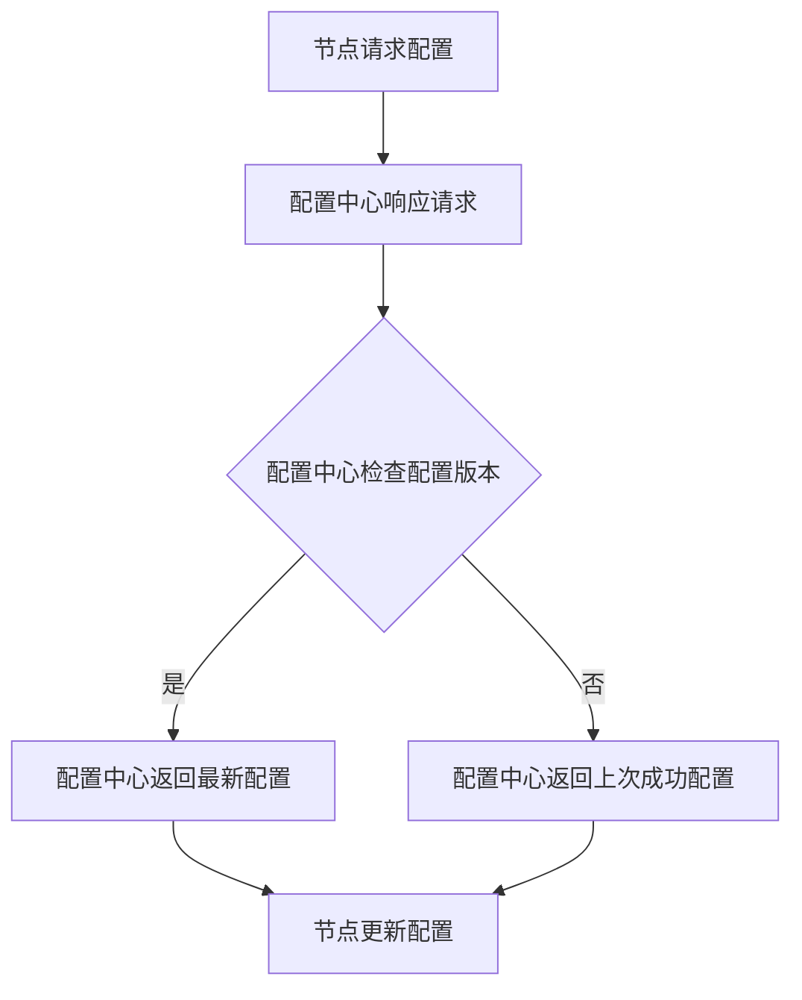
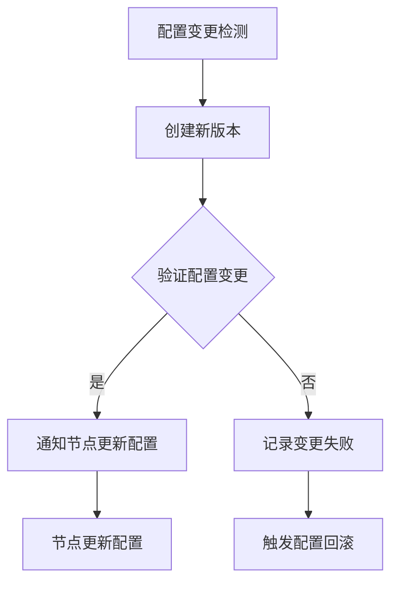
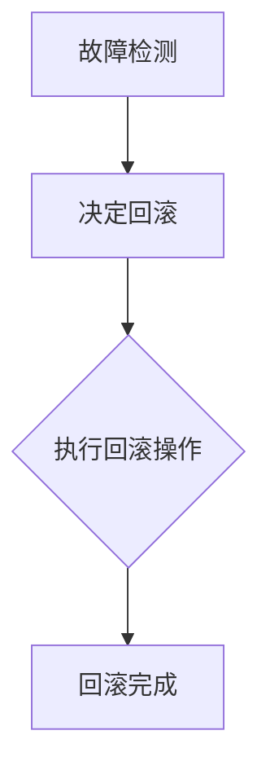
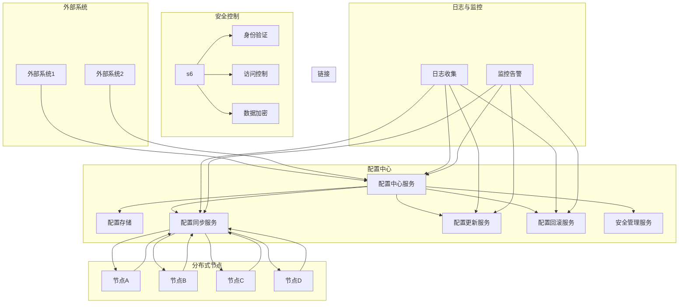
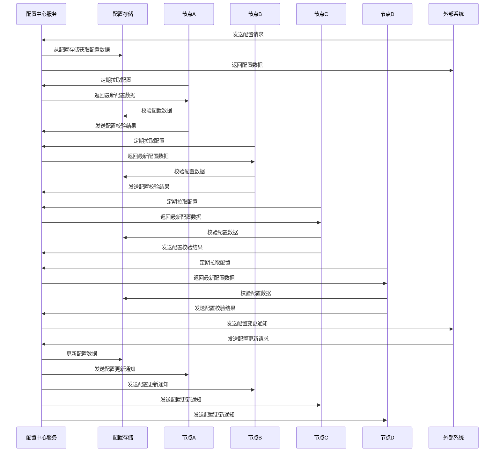

                 

### 第1章 引言

#### 1.1 分布式配置中心的背景和重要性

在当今数字化时代，分布式系统已成为许多企业的核心技术架构。随着云计算、微服务、容器化等技术的兴起，分布式系统的重要性日益凸显。分布式配置中心作为分布式系统的重要组成部分，承担着配置管理的重任。它不仅使得系统配置的变更和管理更加便捷，而且确保了配置数据的准确性和一致性。

**分布式系统的基本概念**：分布式系统由多个独立的计算机节点组成，这些节点通过网络互相连接，共同完成特定的任务。分布式系统的核心目标是提高系统的可靠性、可用性和可扩展性。在分布式系统中，每个节点都可以独立运行，但节点之间需要通过通信机制进行协调和合作。

**分布式配置中心的作用**：分布式配置中心主要用于管理和分发配置数据，使得开发者可以在不修改代码的情况下动态调整系统的配置。配置数据包括系统的参数、环境变量、数据库连接信息等。通过分布式配置中心，开发者可以方便地管理这些配置项，并且确保配置数据在各个节点之间的同步。

**分布式配置中心的挑战**：虽然分布式配置中心带来了许多便利，但在实际应用中仍面临一些挑战。首先，如何确保配置数据的可靠性和一致性是一个重要问题。其次，如何处理配置数据的更新和回滚，以保证系统的稳定运行，也是一个关键挑战。此外，如何实现配置数据的实时性和可扩展性，也是分布式配置中心需要解决的重要问题。

通过本章节的介绍，我们将深入了解分布式配置中心的背景和重要性，为后续章节的深入探讨打下基础。

#### 1.2 问题背景、问题描述、问题解决、边界与外延

在分布式系统中，配置管理是一个关键环节。然而，传统的集中式配置管理方式已难以满足现代分布式系统的需求。分布式配置中心的出现，正是为了解决传统配置管理中的诸多问题。

**问题背景**：随着分布式系统的规模不断扩大，配置项的数量也呈指数级增长。传统的集中式配置管理方式，如使用配置文件或数据库进行配置管理，已经无法满足日益复杂的配置需求。集中式配置管理方式在配置更新时，需要停止整个系统，进行全量更新，这无疑会影响系统的可用性和稳定性。

**问题描述**：分布式配置中心需要解决的主要问题包括：如何确保配置数据的可靠性、一致性和实时性；如何在分布式环境中高效地进行配置数据的分发和更新；以及如何处理配置数据的回滚和版本控制。

**问题解决**：分布式配置中心通过以下几种方式解决问题：

1. **配置数据的分布式存储和同步**：分布式配置中心采用分布式存储方案，将配置数据分散存储在多个节点上。通过一致性协议，如Paxos或Zab，确保配置数据的同步和一致性。

2. **配置数据的实时更新**：分布式配置中心支持实时更新配置数据，开发者可以通过配置中心动态调整配置项，而无需重启系统。配置更新可以通过增量更新或全量更新实现，以减少对系统的影响。

3. **配置数据的版本控制和回滚**：分布式配置中心提供版本控制功能，允许开发者对配置数据进行版本管理。在配置数据发生错误时，可以方便地进行回滚，确保系统的稳定运行。

**边界与外延**：分布式配置中心的边界在于配置数据的范围和功能。它主要负责配置数据的存储、同步和分发，但并不涉及配置数据的生成和解释。分布式配置中心的外延包括与其他系统的集成，如服务注册与发现、监控告警等，以实现更全面的配置管理。

通过以上分析，我们可以看到，分布式配置中心在分布式系统中的重要性不言而喻。它不仅解决了传统配置管理的诸多问题，还为分布式系统的稳定运行提供了有力保障。

#### 1.3 分布式配置中心的定义

分布式配置中心，简称配置中心，是用于管理分布式系统配置数据的一种服务。其核心功能是存储、同步和分发配置数据，以确保分布式系统中各节点的一致性和可靠性。

**配置中心的定义**：配置中心是一个集中式的服务，它负责收集、存储、管理和分发系统配置信息。配置信息可以是任何类型的数据，包括系统参数、环境变量、数据库连接信息、服务端点等。通过配置中心，开发者可以方便地管理和更新系统配置，而无需手动修改每个节点的配置文件。

**配置中心的基本概念**：

1. **配置数据**：配置中心存储和管理的数据。配置数据可以是简单的键值对，也可以是复杂的配置文件。

2. **配置项**：配置中心管理的最小数据单元，通常包含配置键（Key）和配置值（Value）。

3. **配置版本**：配置中心对配置数据的版本管理。每个配置项可以有多个版本，以支持配置的回滚和追踪。

4. **配置组**：一组相关配置项的集合。配置组可以方便地对一组配置项进行统一管理和更新。

**配置中心的组成**：

1. **配置存储**：用于存储配置数据的数据库或缓存系统。

2. **配置同步**：将配置数据从配置存储同步到各个节点的过程。

3. **配置分发**：将配置数据分发到各个节点的过程。配置分发可以是实时分发，也可以是批量分发。

4. **配置管理界面**：用于管理和监控配置数据的用户界面。

通过以上定义和基本概念的介绍，我们可以更清晰地理解分布式配置中心的工作原理和功能。接下来，我们将进一步探讨分布式配置中心的属性特征，以了解其优势和局限性。

#### 1.4 分布式配置中心的属性特征对比

分布式配置中心在分布式系统中扮演着关键角色，其属性特征直接影响到系统的稳定性和可扩展性。以下是分布式配置中心的几个核心属性及其特征对比：

**1. 可靠性**

**可靠性定义**：可靠性是指配置中心在处理配置数据时，确保数据的准确性和一致性的能力。

**对比**：分布式配置中心的可靠性通常比传统配置管理方式更高。通过分布式存储和同步机制，如Paxos或Zab算法，配置中心可以确保配置数据的持久化和一致性。然而，分布式配置中心在面临网络分区、节点故障等异常情况时，仍可能引发配置数据的不一致。

**2. 可扩展性**

**可扩展性定义**：可扩展性是指配置中心能够支持系统规模扩大的能力。

**对比**：分布式配置中心具有较好的可扩展性。通过分布式存储和同步机制，配置中心可以水平扩展，以支持更多节点和更大的配置数据量。然而，随着节点数量的增加，配置中心的维护成本也会上升，如网络带宽和存储资源的消耗。

**3. 实时性**

**实时性定义**：实时性是指配置中心能够及时响应配置数据的变更。

**对比**：分布式配置中心的实时性取决于其配置同步机制。一些配置中心支持实时同步，如Spring Cloud Config，可以立即更新配置。而另一些配置中心则可能存在一定的延迟，如Zookeeper，需要经过一段时间才能同步配置数据。

**4. 安全性**

**安全性定义**：安全性是指配置中心在处理配置数据时，确保数据不被未授权访问或篡改的能力。

**对比**：分布式配置中心通常提供一定的安全机制，如身份验证、加密和访问控制等。然而，分布式配置中心在安全性方面仍面临挑战，如配置数据的泄露和篡改。

**5. 灵活性**

**灵活性定义**：灵活性是指配置中心能够支持不同类型配置数据和管理策略的能力。

**对比**：分布式配置中心具有较高的灵活性。它可以支持多种配置数据格式，如JSON、YAML和properties，并且可以根据不同应用场景定制配置管理策略。

通过对比分布式配置中心的这些属性特征，我们可以更好地理解其优势和局限性。在实际应用中，需要根据具体需求和场景选择合适的配置中心解决方案。

#### 2.3 ER实体关系图

在理解了分布式配置中心的核心概念和属性特征后，接下来我们将通过ER（实体关系）图来进一步阐述配置中心的数据模型和实体关系。

**2.3.1 配置中心实体**

配置中心中主要包含以下实体：

1. **配置项（ConfigItem）**：代表具体的配置数据，包括配置键（Key）和配置值（Value）。
2. **配置组（ConfigGroup）**：代表一组相关的配置项，用于统一管理和更新配置。
3. **配置版本（ConfigVersion）**：代表配置项的历史版本，用于配置的回滚和追踪。
4. **节点（Node）**：代表分布式系统中的计算节点，用于存储和同步配置数据。

**2.3.2 配置项实体**

配置项（ConfigItem）是配置中心的基本数据单元，包含以下属性：

- **Key**：配置键，用于标识配置项的唯一标识。
- **Value**：配置值，表示配置项的具体内容。
- **Description**：配置项的描述信息，用于说明配置项的作用和用途。
- **CreateTime**：配置项的创建时间。
- **UpdateTime**：配置项的更新时间。

**2.3.3 配置组实体**

配置组（ConfigGroup）用于将一组相关的配置项组织在一起，以便进行统一管理和更新。配置组包含以下属性：

- **GroupId**：配置组ID，用于唯一标识配置组。
- **GroupName**：配置组名称，用于描述配置组的名称。
- **CreateTime**：配置组的创建时间。
- **UpdateTime**：配置组的更新时间。

**2.3.4 配置版本实体**

配置版本（ConfigVersion）用于记录配置项的历史版本，以便进行配置的回滚和追踪。每个配置版本对应一个配置项的特定状态。配置版本包含以下属性：

- **VersionId**：配置版本ID，用于唯一标识配置版本。
- **ConfigId**：配置项ID，指向对应的配置项。
- **Value**：配置项的值。
- **CreateTime**：配置版本的创建时间。
- **UpdateTime**：配置版本的更新时间。

**2.3.5 实体关系描述**

配置中心中的实体之间存在以下关系：

1. **配置项与配置组的关系**：一个配置组可以包含多个配置项，而一个配置项只能属于一个配置组。这表示为“一对多”的关系。

2. **配置项与配置版本的关系**：一个配置项可以有多个配置版本，每个版本代表配置项的不同状态。这表示为“一对多”的关系。

3. **配置组与节点的关系**：一个配置组可以被分配到多个节点进行同步，而一个节点可以包含多个配置组。这表示为“多对多”的关系，通常通过中间表来实现。

通过ER图，我们可以直观地理解配置中心的数据模型和实体关系，为配置中心的设计和实现提供有力的支持。

### 3.1 分布式配置中心的关键算法

分布式配置中心在分布式系统中起着至关重要的作用，其中关键算法的设计和实现是保证系统可靠性和稳定性的关键。以下是分布式配置中心的核心算法及其原理。

#### 3.1.1 配置分发算法

配置分发算法是分布式配置中心最核心的功能之一，它的目的是将配置数据从配置中心同步到各个节点上。配置分发算法通常包括以下步骤：

1. **配置拉取**：节点定期从配置中心拉取配置数据。配置中心维护一个最新的配置版本，节点通过轮询或基于事件的方式获取最新的配置数据。

2. **配置校验**：节点在拉取配置数据后，会对配置数据进行校验，以确保配置数据的完整性和正确性。常见的校验方式包括MD5校验、签名校验等。

3. **配置应用**：通过校验后的配置数据将被应用到系统中。配置数据通常以配置文件、环境变量或数据库连接信息的形式存在，节点会将配置数据应用到相应的系统组件中。

4. **配置通知**：在配置数据更新时，配置中心需要通知所有节点进行配置更新。通知机制可以是基于消息队列的异步通知，也可以是基于长连接的实时推送。

#### 3.1.2 配置更新算法

配置更新算法用于处理配置数据的变更，确保系统配置的一致性和准确性。配置更新算法通常包括以下步骤：

1. **配置变更检测**：配置中心监控配置数据的变化，一旦检测到变更，便标记为“待更新”状态。

2. **配置版本控制**：每次配置变更时，配置中心会创建一个新的配置版本，记录变更前的配置内容和变更后的配置内容。版本控制确保了配置历史的可追溯性和可回滚性。

3. **配置更新策略**：配置更新策略决定了配置变更如何应用到各个节点上。常见的更新策略包括：

   - **全量更新**：将最新的配置数据整体同步到所有节点。
   - **增量更新**：仅同步变更的配置项到节点，减少数据传输量。
   - **懒加载更新**：在节点访问配置时，动态加载变更的配置项。

4. **配置回滚**：在配置更新失败或系统出现问题时，可以通过配置回滚算法将配置数据回滚到上一个稳定版本，以恢复系统的正常运行。

#### 3.1.3 配置回滚算法

配置回滚算法用于在配置更新失败或系统出现问题时，将配置数据回滚到上一个稳定版本，确保系统的稳定性。配置回滚算法通常包括以下步骤：

1. **故障检测**：配置中心监控系统运行状态，一旦发现系统异常，如服务不可用或配置错误，便触发回滚操作。

2. **回滚决策**：根据故障类型和系统状态，配置中心决定是否进行回滚操作。回滚决策通常基于配置回滚策略，如自动回滚、人工确认回滚等。

3. **配置回滚**：配置中心将配置数据回滚到上一个稳定版本。回滚过程中，配置中心需要确保配置数据的完整性和一致性，以避免数据丢失或冲突。

4. **系统重启**：在配置回滚完成后，系统需要重启以应用新的配置数据。系统重启可以采用优雅重启或强制重启的方式，以确保系统的稳定运行。

通过以上关键算法的讲解，我们可以了解到分布式配置中心在分布式系统中的重要作用。这些算法的设计和实现不仅保证了配置数据的可靠性和一致性，还提高了系统的稳定性和可维护性。

#### 3.2 算法流程图

为了更好地理解分布式配置中心的关键算法原理，我们可以通过Mermaid绘制算法的流程图。以下是配置分发算法、配置更新算法和配置回滚算法的流程图示例。

##### 3.2.1 配置分发流程图



**说明**：
1. 节点请求配置：节点定期向配置中心请求配置数据。
2. 配置中心响应请求：配置中心根据节点请求，返回最新配置或上次成功配置。
3. 节点更新配置：节点接收到配置数据后，更新本地配置。

##### 3.2.2 配置更新流程图



**说明**：
1. 配置变更检测：配置中心监控配置数据的变化，一旦检测到变更，便创建新版本。
2. 验证配置变更：配置中心对配置变更进行验证，确保变更的合法性和有效性。
3. 通知节点更新配置：配置中心通知所有节点更新配置。
4. 节点更新配置：节点接收到更新通知后，更新本地配置。
5. 记录变更失败：如果配置更新失败，记录变更失败信息。
6. 触发配置回滚：在配置更新失败时，触发配置回滚，将配置回滚到上一个稳定版本。

##### 3.2.3 配置回滚流程图



**说明**：
1. 故障检测：配置中心监控系统运行状态，一旦发现系统异常，如服务不可用或配置错误，便触发回滚操作。
2. 决定回滚：根据故障类型和系统状态，配置中心决定是否进行回滚操作。
3. 执行回滚操作：配置中心执行回滚操作，将配置数据回滚到上一个稳定版本。
4. 回滚完成：配置回滚完成后，通知系统重启，应用新的配置数据。

通过这些算法流程图，我们可以更直观地理解分布式配置中心的关键算法原理和工作流程。接下来，我们将通过Python源代码详细阐述这些算法的实现。

### 3.3 Python源代码阐述

在本节中，我们将通过Python源代码详细阐述分布式配置中心的关键算法。以下是配置分发、配置更新和配置回滚的示例代码。

#### 3.3.1 配置分发代码

```python
# 配置分发示例代码
import requests
import json
import hashlib

class ConfigDistributor:
    def __init__(self, config_center_url):
        self.config_center_url = config_center_url

    def fetch_config(self, node_id):
        response = requests.get(f"{self.config_center_url}/configs/{node_id}")
        if response.status_code == 200:
            config_data = response.json()
            config_hash = self.generate_hash(config_data)
            return config_data, config_hash
        else:
            return None, None

    def generate_hash(self, data):
        return hashlib.md5(json.dumps(data).encode()).hexdigest()
```

**说明**：
1. `fetch_config` 方法：用于从配置中心拉取配置数据。它接收节点ID作为参数，返回配置数据和配置数据的MD5哈希值。
2. `generate_hash` 方法：用于生成配置数据的MD5哈希值，用于配置校验。

#### 3.3.2 配置更新代码

```python
# 配置更新示例代码
import requests
import json
import hashlib

class ConfigUpdater:
    def __init__(self, config_center_url):
        self.config_center_url = config_center_url

    def update_config(self, node_id, config_data):
        config_hash = self.generate_hash(config_data)
        response = requests.put(f"{self.config_center_url}/configs/{node_id}", json=config_data)
        if response.status_code == 200:
            return config_hash
        else:
            return None

    def generate_hash(self, data):
        return hashlib.md5(json.dumps(data).encode()).hexdigest()
```

**说明**：
1. `update_config` 方法：用于更新配置数据。它接收节点ID和配置数据作为参数，返回更新后的配置数据的MD5哈希值。
2. `generate_hash` 方法：用于生成配置数据的MD5哈希值，用于配置校验。

#### 3.3.3 配置回滚代码

```python
# 配置回滚示例代码
import requests
import json

class ConfigRollback:
    def __init__(self, config_center_url):
        self.config_center_url = config_center_url

    def rollback_config(self, node_id, version_id):
        response = requests.get(f"{self.config_center_url}/configs/{node_id}/versions/{version_id}")
        if response.status_code == 200:
            config_data = response.json()
            return config_data
        else:
            return None
```

**说明**：
1. `rollback_config` 方法：用于配置回滚。它接收节点ID和版本ID作为参数，返回回滚后的配置数据。

通过以上Python源代码示例，我们可以看到分布式配置中心关键算法的实现细节。这些算法通过HTTP请求与配置中心进行交互，确保配置数据的可靠分发、更新和回滚。接下来，我们将进一步探讨算法原理的数学模型和公式。

#### 3.4 算法原理的数学模型和公式

在分布式配置中心中，配置分发、配置更新和配置回滚算法的实现需要依赖一系列的数学模型和公式。以下是对这些算法原理的数学模型的详细讲解和举例说明。

##### 3.4.1 配置分发模型

配置分发过程中，核心是确保配置数据的准确性和一致性。配置分发模型可以表示为：

$$ 配置分发模型 = [配置数据, 配置校验算法, 配置同步机制] $$

**配置数据**：配置中心存储的配置数据，包括配置键和配置值。用集合表示为：

$$ 配置数据 = \{ (Key_1, Value_1), (Key_2, Value_2), ... \} $$

**配置校验算法**：用于验证配置数据的完整性和正确性。常见的配置校验算法包括MD5校验和签名校验。MD5校验算法可以表示为：

$$ 配置校验算法(MD5) = Hash(配置数据) $$

其中，Hash函数用于计算配置数据的MD5哈希值。

**配置同步机制**：确保配置数据在配置中心和节点之间的同步。配置同步机制可以表示为：

$$ 配置同步机制 = 配置拉取策略 + 配置推送策略 $$

配置拉取策略是指节点定期从配置中心拉取配置数据，配置推送策略是指配置中心在配置数据变更时主动通知节点更新配置。

##### 3.4.2 配置更新模型

配置更新过程中，核心是确保配置数据的变更能够及时、准确地应用到各个节点上。配置更新模型可以表示为：

$$ 配置更新模型 = [配置变更检测，配置版本控制，配置更新策略] $$

**配置变更检测**：监控配置数据的变化，一旦检测到变更，便创建新的配置版本。配置变更检测可以表示为：

$$ 配置变更检测 = 监控配置数据 + 变更通知 $$

其中，监控配置数据是指配置中心定期检查配置数据是否发生变化，变更通知是指配置中心在配置数据变更时通知所有节点。

**配置版本控制**：记录配置项的历史版本，支持配置的回滚和追踪。配置版本控制可以表示为：

$$ 配置版本控制 = [配置版本，配置回滚策略] $$

每个配置版本代表配置项的一个特定状态，配置回滚策略是指在配置更新失败或系统出现问题时，将配置回滚到上一个稳定版本。

**配置更新策略**：决定配置变更如何应用到各个节点上。配置更新策略可以表示为：

$$ 配置更新策略 = [全量更新，增量更新，懒加载更新] $$

全量更新是指将最新的配置数据整体同步到所有节点，增量更新是指仅同步变更的配置项到节点，懒加载更新是指在节点访问配置时，动态加载变更的配置项。

##### 3.4.3 配置回滚模型

配置回滚过程中，核心是确保系统能够从错误状态恢复到稳定状态。配置回滚模型可以表示为：

$$ 配置回滚模型 = [故障检测，回滚决策，配置回滚] $$

**故障检测**：监控系统运行状态，一旦发现系统异常，如服务不可用或配置错误，便触发回滚操作。故障检测可以表示为：

$$ 故障检测 = [监控指标，故障判定] $$

其中，监控指标是指系统性能指标和配置数据一致性指标，故障判定是指根据监控指标判断系统是否出现异常。

**回滚决策**：根据故障类型和系统状态，决定是否进行回滚操作。回滚决策可以表示为：

$$ 回滚决策 = [故障类型，回滚策略] $$

其中，故障类型是指系统出现的问题类型，回滚策略是指根据故障类型选择的回滚方案。

**配置回滚**：将配置数据回滚到上一个稳定版本，确保系统的稳定性。配置回滚可以表示为：

$$ 配置回滚 = 回滚配置 + 系统重启 $$

其中，回滚配置是指将配置数据回滚到上一个稳定版本，系统重启是指重新启动系统以应用新的配置数据。

通过上述数学模型和公式的讲解，我们可以更好地理解分布式配置中心的关键算法原理。这些模型和公式为分布式配置中心的设计和实现提供了理论支持，确保系统配置管理的可靠性和稳定性。

##### 3.5.1 配置分发示例

为了更直观地理解配置分发算法的原理，我们通过一个简单的示例进行说明。

**示例场景**：假设我们有一个分布式系统，包含三个节点A、B和C。配置中心负责存储和管理系统的配置数据，每个节点需要从配置中心定期拉取配置数据。

1. **初始状态**：节点A、B和C的配置数据如下：

   - 节点A：`key1: value1`
   - 节点B：`key1: value1`
   - 节点C：`key1: value1`

2. **配置更新**：配置中心更新了`key1`的值为`value2`。

3. **节点拉取配置**：

   - 节点A从配置中心拉取新配置，配置中心返回`key1: value2`，节点A更新配置为`key1: value2`。
   - 节点B从配置中心拉取新配置，配置中心返回`key1: value2`，节点B更新配置为`key1: value2`。
   - 节点C从配置中心拉取新配置，配置中心返回`key1: value2`，节点C更新配置为`key1: value2`。

4. **配置校验**：

   - 配置中心生成配置数据的MD5哈希值，例如`MD5(value2)`，并存储在配置中心。
   - 节点A、B和C在拉取配置后，分别计算配置数据的MD5哈希值，并与配置中心存储的哈希值进行比对。
   - 如果比对结果一致，说明配置更新成功；否则，可能存在配置更新失败或配置中心数据异常。

通过上述示例，我们可以看到配置分发算法在分布式系统中的应用。配置分发过程包括配置拉取、配置更新和配置校验三个主要步骤，确保配置数据在各个节点之间的同步和一致性。

##### 3.5.2 配置更新示例

为了更直观地理解配置更新算法的原理，我们通过一个简单的示例进行说明。

**示例场景**：假设配置中心存储的配置项如下：

- `key1: value1`
- `key2: value2`

1. **初始状态**：节点从配置中心拉取配置，配置如下：

   - `key1: value1`
   - `key2: value2`

2. **配置变更**：配置中心将`key1`的值更新为`value3`。

3. **节点更新配置**：

   - 节点定期从配置中心拉取配置，配置中心返回最新的配置：
     - `key1: value3`
     - `key2: value2`

   - 节点接收到配置更新通知后，更新本地配置：
     - `key1: value3`
     - `key2: value2`

4. **配置版本控制**：

   - 配置中心创建新的配置版本，记录变更前的配置和变更后的配置：
     - 变更前配置：`key1: value1`，`key2: value2`
     - 变更后配置：`key1: value3`，`key2: value2`

   - 配置中心通知节点更新配置，节点更新本地配置。

5. **配置回滚**：

   - 如果节点在更新配置后出现异常，配置中心可以回滚配置到上一个稳定版本。
   - 配置中心根据配置版本记录，找到上一个稳定版本，将节点配置回滚到该版本。

通过上述示例，我们可以看到配置更新算法在分布式系统中的应用。配置更新过程包括配置变更检测、配置版本控制和配置更新通知三个主要步骤，确保配置数据在分布式系统中的实时性和一致性。

##### 3.5.3 配置回滚示例

为了更直观地理解配置回滚算法的原理，我们通过一个简单的示例进行说明。

**示例场景**：假设节点在更新配置后出现异常，需要将配置回滚到上一个稳定版本。

1. **初始状态**：节点从配置中心拉取配置，配置如下：

   - `key1: value3`
   - `key2: value2`

2. **配置更新**：配置中心将`key1`的值更新为`value4`。

3. **节点异常**：节点在更新配置后，系统出现异常，无法正常工作。

4. **配置回滚**：

   - 配置中心检测到节点异常，触发配置回滚操作。
   - 配置中心根据配置版本记录，找到上一个稳定版本（`key1: value3`，`key2: value2`）。
   - 配置中心通知节点执行回滚操作，将节点配置回滚到上一个稳定版本。

5. **配置回滚结果**：

   - 节点接收到配置回滚通知后，执行回滚操作，将配置回滚到稳定版本：
     - `key1: value3`
     - `key2: value2`

   - 节点恢复正常工作。

通过上述示例，我们可以看到配置回滚算法在分布式系统中的应用。配置回滚过程包括配置版本记录、节点异常检测和配置回滚操作三个主要步骤，确保在节点异常情况下，系统能够快速恢复到稳定状态。

### 4.1 配置分发模型的详细解释

在分布式配置中心中，配置分发模型是确保配置数据在各个节点之间一致性和实时性的关键。以下是对配置分发模型的详细解释，包括其数学模型、公式和示例说明。

**4.1.1 数学模型公式**

配置分发模型的核心在于配置数据的同步和验证。配置分发可以表示为以下数学模型：

$$ 配置分发模型 = [配置数据同步, 配置数据验证] $$

1. **配置数据同步**

配置数据同步是指将配置中心的最新配置数据同步到各个节点。配置数据同步的数学模型可以表示为：

$$ 配置数据同步 = [配置拉取策略, 配置推送策略] $$

- **配置拉取策略**：节点定期从配置中心拉取配置数据。配置拉取策略的数学模型可以表示为：

  $$ 配置拉取策略 = [配置拉取周期, 配置拉取算法] $$

  其中，配置拉取周期是指节点从配置中心拉取配置数据的频率，配置拉取算法是指节点如何从配置中心获取配置数据的算法。

- **配置推送策略**：配置中心在配置数据变更时，主动通知节点更新配置。配置推送策略的数学模型可以表示为：

  $$ 配置推送策略 = [配置变更检测, 配置推送算法] $$

  其中，配置变更检测是指配置中心如何检测配置数据的变更，配置推送算法是指配置中心如何通知节点更新配置的算法。

2. **配置数据验证**

配置数据验证是指确保同步到节点的配置数据是完整、准确和一致的。配置数据验证的数学模型可以表示为：

$$ 配置数据验证 = [配置数据校验, 配置一致性检查] $$

- **配置数据校验**：使用哈希函数（如MD5或SHA-256）对配置数据进行校验，确保配置数据的完整性。配置数据校验的数学模型可以表示为：

  $$ 配置数据校验 = Hash(配置数据) $$

  其中，Hash函数用于计算配置数据的哈希值，通过比较不同节点的配置数据哈希值，可以判断配置数据是否一致。

- **配置一致性检查**：通过一致性协议（如Paxos或Zab）确保配置数据在各个节点之间的一致性。配置一致性检查的数学模型可以表示为：

  $$ 配置一致性检查 = [一致性协议, 配置同步机制] $$

  其中，一致性协议是指用于确保配置数据一致性的算法，配置同步机制是指配置数据在节点之间的同步机制。

**4.1.2 公式解释**

1. **配置拉取周期**

配置拉取周期是指节点从配置中心拉取配置数据的频率。配置拉取周期的选择需要考虑以下几个因素：

- **配置变更频率**：配置变更的频率越高，配置拉取周期应设置得越短，以确保配置数据的实时性。
- **系统负载**：配置拉取过程会增加节点的负载，配置拉取周期应设置得适中，以避免系统过载。
- **网络带宽**：配置拉取过程需要消耗网络带宽，配置拉取周期应设置得合理，以避免带宽浪费。

2. **配置拉取算法**

配置拉取算法是指节点如何从配置中心获取配置数据的算法。常见的配置拉取算法包括轮询和基于事件的拉取。

- **轮询拉取算法**：节点定期轮询配置中心，检查是否有新配置数据。轮询拉取算法的数学模型可以表示为：

  $$ 配置拉取算法(轮询) = 定期轮询 + 配置更新通知 $$

  其中，定期轮询是指节点按照配置拉取周期定期向配置中心发送拉取请求，配置更新通知是指配置中心在配置数据变更时，主动通知节点进行配置更新。

- **基于事件的拉取算法**：节点在配置中心配置数据变更时，通过事件监听机制获取配置数据。基于事件的拉取算法的数学模型可以表示为：

  $$ 配置拉取算法(基于事件) = 事件监听 + 配置更新通知 $$

  其中，事件监听是指节点监听配置中心的配置变更事件，配置更新通知是指配置中心在配置数据变更时，主动通知节点进行配置更新。

3. **配置推送算法**

配置推送算法是指配置中心如何通知节点更新配置的算法。常见的配置推送算法包括基于消息队列的推送和基于长连接的推送。

- **基于消息队列的推送算法**：配置中心将配置变更信息发送到消息队列，节点从消息队列中获取配置变更通知。基于消息队列的推送算法的数学模型可以表示为：

  $$ 配置推送算法(消息队列) = 配置变更消息 + 消息队列消费 $$

  其中，配置变更消息是指配置中心发送的配置变更通知消息，消息队列消费是指节点从消息队列中获取配置变更消息。

- **基于长连接的推送算法**：配置中心通过长连接与节点保持连接，在配置数据变更时，主动推送配置更新通知。基于长连接的推送算法的数学模型可以表示为：

  $$ 配置推送算法(长连接) = 长连接维护 + 配置更新推送 $$

  其中，长连接维护是指配置中心与节点之间保持连接，配置更新推送是指配置中心在配置数据变更时，主动推送配置更新通知。

4. **配置数据校验**

配置数据校验是指使用哈希函数对配置数据进行校验，确保配置数据的完整性。配置数据校验的数学模型可以表示为：

$$ 配置数据校验 = Hash(配置数据) $$

其中，Hash函数用于计算配置数据的哈希值，通过比较不同节点的配置数据哈希值，可以判断配置数据是否一致。

5. **配置一致性检查**

配置一致性检查是指通过一致性协议确保配置数据在各个节点之间的一致性。配置一致性检查的数学模型可以表示为：

$$ 配置一致性检查 = [一致性协议, 配置同步机制] $$

其中，一致性协议是指用于确保配置数据一致性的算法，配置同步机制是指配置数据在节点之间的同步机制。

**4.1.3 示例说明**

假设我们有三个节点A、B和C，配置中心存储的配置数据如下：

- `key1: value1`
- `key2: value2`

1. **初始状态**：

   - 节点A的配置：`key1: value1`，`key2: value2`
   - 节点B的配置：`key1: value1`，`key2: value2`
   - 节点C的配置：`key1: value1`，`key2: value2`

2. **配置变更**：配置中心将`key1`的值更新为`value3`。

3. **节点拉取配置**：

   - 节点A定期轮询配置中心，配置中心返回最新的配置：`key1: value3`，`key2: value2`。
   - 节点A将新配置应用到系统中，更新配置为：`key1: value3`，`key2: value2`。

   - 节点B定期轮询配置中心，配置中心返回最新的配置：`key1: value3`，`key2: value2`。
   - 节点B将新配置应用到系统中，更新配置为：`key1: value3`，`key2: value2`。

   - 节点C定期轮询配置中心，配置中心返回最新的配置：`key1: value3`，`key2: value2`。
   - 节点C将新配置应用到系统中，更新配置为：`key1: value3`，`key2: value2`。

4. **配置数据校验**：

   - 配置中心生成配置数据的MD5哈希值，例如`MD5(value3value2)`，并存储在配置中心。
   - 节点A、B和C在拉取配置后，分别计算配置数据的MD5哈希值，并与配置中心存储的哈希值进行比对。

   - 如果比对结果一致，说明配置更新成功；否则，可能存在配置更新失败或配置中心数据异常。

5. **配置一致性检查**：

   - 配置中心通过一致性协议（如Paxos或Zab），确保配置数据在节点之间的同步和一致性。
   - 如果配置中心检测到节点之间的配置数据不一致，配置中心会触发配置同步机制，重新同步配置数据到各个节点。

通过上述示例，我们可以看到配置分发模型在分布式配置中心中的应用。配置分发模型通过配置数据同步、配置数据验证和配置一致性检查，确保配置数据在各个节点之间的一致性和实时性。

### 4.2 配置更新模型的详细解释

配置更新模型是分布式配置中心的关键组成部分，负责确保系统配置的准确性和实时性。以下是对配置更新模型的详细解释，包括其数学模型、公式和示例说明。

**4.2.1 配置变更检测**

配置变更检测是指配置中心如何及时发现配置数据的变化。配置变更检测的数学模型可以表示为：

$$ 配置变更检测 = [变更检测算法, 变更通知机制] $$

1. **变更检测算法**

变更检测算法用于检测配置数据的变动。常见的变更检测算法包括定时轮询和事件监听。

- **定时轮询算法**：配置中心定期检查配置数据是否发生变化。定时轮询算法的数学模型可以表示为：

  $$ 定时轮询算法 = [检测周期, 检测逻辑] $$

  其中，检测周期是指配置中心定期检查配置数据的频率，检测逻辑是指配置中心如何判断配置数据是否发生变化的算法。

- **事件监听算法**：配置中心在配置数据发生变化时，通过事件监听机制立即检测到变更。事件监听算法的数学模型可以表示为：

  $$ 事件监听算法 = [事件监听器, 事件处理逻辑] $$

  其中，事件监听器是指配置中心监听配置数据变更的事件，事件处理逻辑是指配置中心在检测到配置数据变更时，如何处理变更的逻辑。

2. **变更通知机制**

变更通知机制是指配置中心如何将配置变更通知到节点。变更通知机制可以基于消息队列或长连接实现。

- **基于消息队列的变更通知机制**：配置中心将配置变更信息发送到消息队列，节点从消息队列中获取配置变更通知。基于消息队列的变更通知机制的数学模型可以表示为：

  $$ 基于消息队列的变更通知机制 = [消息队列, 消息消费] $$

  其中，消息队列是指配置中心发送变更通知的消息队列，消息消费是指节点从消息队列中获取配置变更通知。

- **基于长连接的变更通知机制**：配置中心通过长连接与节点保持连接，在配置数据变更时，主动推送配置更新通知。基于长连接的变更通知机制的数学模型可以表示为：

  $$ 基于长连接的变更通知机制 = [长连接维护, 配置更新推送] $$

  其中，长连接维护是指配置中心与节点之间保持连接，配置更新推送是指配置中心在配置数据变更时，主动推送配置更新通知。

**4.2.2 配置版本控制**

配置版本控制是指记录配置项的历史版本，以便在配置变更失败或系统出现问题时进行回滚。配置版本控制的数学模型可以表示为：

$$ 配置版本控制 = [配置版本记录, 回滚策略] $$

1. **配置版本记录**

配置版本记录是指记录配置项的历史版本。每个配置版本包含配置键、配置值、创建时间和更新时间等信息。配置版本记录的数学模型可以表示为：

$$ 配置版本记录 = [配置版本表，版本更新逻辑] $$

- **配置版本表**：用于存储配置项的历史版本信息。配置版本表的数学模型可以表示为：

  $$ 配置版本表 = \{ (VersionId, Key, Value, CreateTime, UpdateTime) \} $$

  其中，VersionId是版本ID，Key是配置键，Value是配置值，CreateTime是创建时间，UpdateTime是更新时间。

- **版本更新逻辑**：在配置更新时，将新配置版本记录到配置版本表中。版本更新逻辑的数学模型可以表示为：

  $$ 版本更新逻辑 = [版本创建，版本保存] $$

  其中，版本创建是指创建新的配置版本，版本保存是指将新配置版本保存到配置版本表中。

2. **回滚策略**

回滚策略是指配置变更失败或系统出现问题时，如何将配置回滚到上一个稳定版本。常见的回滚策略包括自动回滚和手动回滚。

- **自动回滚策略**：在配置变更失败或系统出现问题时，自动将配置回滚到上一个稳定版本。自动回滚策略的数学模型可以表示为：

  $$ 自动回滚策略 = [故障检测，回滚触发，回滚执行] $$

  其中，故障检测是指配置中心或节点检测到配置变更失败或系统异常，回滚触发是指根据故障类型和系统状态决定是否进行回滚，回滚执行是指将配置回滚到上一个稳定版本。

- **手动回滚策略**：在配置变更失败或系统出现问题时，需要人工干预进行回滚。手动回滚策略的数学模型可以表示为：

  $$ 手动回滚策略 = [故障检测，回滚请求，回滚执行] $$

  其中，故障检测是指配置中心或节点检测到配置变更失败或系统异常，回滚请求是指人工请求回滚操作，回滚执行是指将配置回滚到上一个稳定版本。

**4.2.3 配置更新策略**

配置更新策略是指配置变更如何应用到系统中。配置更新策略可以基于全量更新、增量更新或懒加载更新实现。

1. **全量更新**

全量更新是指每次配置变更时，将最新的配置数据整体同步到各个节点。全量更新的数学模型可以表示为：

$$ 全量更新 = [配置拉取，配置应用] $$

- **配置拉取**：节点从配置中心拉取最新的配置数据。配置拉取的数学模型可以表示为：

  $$ 配置拉取 = [配置请求，配置响应] $$

  其中，配置请求是指节点向配置中心发送拉取请求，配置响应是指配置中心返回最新的配置数据。

- **配置应用**：节点将配置数据应用到系统中。配置应用的数学模型可以表示为：

  $$ 配置应用 = [配置加载，配置设置] $$

  其中，配置加载是指将配置数据加载到内存或配置文件中，配置设置是指将配置数据应用到系统组件中。

2. **增量更新**

增量更新是指每次配置变更时，仅同步变更的配置项到节点。增量更新的数学模型可以表示为：

$$ 增量更新 = [配置变更检测，配置同步] $$

- **配置变更检测**：配置中心检测配置项的变更。配置变更检测的数学模型可以表示为：

  $$ 配置变更检测 = [变更检测算法，变更通知] $$

  其中，变更检测算法是指配置中心如何检测配置项的变更，变更通知是指配置中心如何通知节点配置项的变更。

- **配置同步**：节点同步变更的配置项。配置同步的数学模型可以表示为：

  $$ 配置同步 = [配置拉取，配置应用] $$

  其中，配置拉取是指节点从配置中心拉取变更的配置项，配置应用是指节点将变更的配置项应用到系统中。

3. **懒加载更新**

懒加载更新是指节点在访问配置项时，动态加载配置项的值。懒加载更新的数学模型可以表示为：

$$ 懒加载更新 = [配置请求，配置响应，配置应用] $$

- **配置请求**：节点请求配置项的值。配置请求的数学模型可以表示为：

  $$ 配置请求 = [配置查询，配置返回] $$

  其中，配置查询是指节点查询配置项的值，配置返回是指配置中心返回配置项的值。

- **配置响应**：配置中心返回配置项的值。配置响应的数学模型可以表示为：

  $$ 配置响应 = [配置获取，配置传递] $$

  其中，配置获取是指配置中心获取配置项的值，配置传递是指配置中心将配置项的值传递给节点。

- **配置应用**：节点将配置项的值应用到系统中。配置应用的数学模型可以表示为：

  $$ 配置应用 = [配置加载，配置设置] $$

  其中，配置加载是指将配置项的值加载到内存或配置文件中，配置设置是指将配置项的值应用到系统组件中。

**4.2.4 示例说明**

假设我们有三个节点A、B和C，配置中心存储的配置数据如下：

- `key1: value1`
- `key2: value2`

1. **初始状态**：

   - 节点A的配置：`key1: value1`，`key2: value2`
   - 节点B的配置：`key1: value1`，`key2: value2`
   - 节点C的配置：`key1: value1`，`key2: value2`

2. **配置变更**：配置中心将`key1`的值更新为`value3`。

3. **配置变更检测**：

   - 配置中心通过定时轮询算法或事件监听算法检测到`key1`的值发生变化。
   - 配置中心将变更信息发送到消息队列或通过长连接推送变更通知。

4. **配置版本控制**：

   - 配置中心创建新的配置版本，记录变更前的配置（`key1: value1`，`key2: value2`）和变更后的配置（`key1: value3`，`key2: value2`）。
   - 配置中心将配置版本信息保存到配置版本表中。

5. **配置更新策略**：

   - 配置中心根据配置更新策略（全量更新、增量更新或懒加载更新），同步配置到节点。
   - 节点从配置中心拉取最新的配置数据（`key1: value3`，`key2: value2`），并应用到系统中。

6. **配置数据校验**：

   - 节点在拉取配置后，计算配置数据的MD5哈希值，并与配置中心存储的哈希值进行比对，确保配置数据的一致性。

通过上述示例，我们可以看到配置更新模型在分布式配置中心中的应用。配置更新模型通过配置变更检测、配置版本控制和配置更新策略，确保系统配置的实时性和一致性。

### 4.3 配置回滚模型的详细解释

配置回滚模型是分布式配置中心的重要组成部分，用于在配置更新失败或系统出现问题时，将配置回滚到上一个稳定版本。以下是对配置回滚模型的详细解释，包括其数学模型、公式和示例说明。

**4.3.1 配置回滚的数学模型**

配置回滚的数学模型可以表示为：

$$ 配置回滚模型 = [故障检测，回滚决策，回滚执行] $$

1. **故障检测**

故障检测是指配置中心或节点如何检测配置更新失败或系统异常。故障检测的数学模型可以表示为：

$$ 故障检测 = [监控指标，故障判定] $$

- **监控指标**：用于监控系统运行状态和配置数据的一致性。常见的监控指标包括系统负载、响应时间、配置数据校验结果等。
- **故障判定**：根据监控指标判断系统是否出现异常。故障判定的数学模型可以表示为：

  $$ 故障判定 = [指标阈值，判定逻辑] $$

  其中，指标阈值是指用于判断系统是否异常的阈值，判定逻辑是指根据监控指标值是否超过阈值来判断系统是否出现异常。

2. **回滚决策**

回滚决策是指配置中心或节点在检测到故障后，如何决定是否进行配置回滚。回滚决策的数学模型可以表示为：

$$ 回滚决策 = [故障类型，回滚策略] $$

- **故障类型**：指系统出现的问题类型，如配置更新失败、系统异常等。
- **回滚策略**：指根据故障类型和系统状态选择的回滚方案。常见的回滚策略包括自动回滚和手动回滚。

3. **回滚执行**

回滚执行是指配置中心或节点根据回滚决策，将配置回滚到上一个稳定版本。回滚执行的数学模型可以表示为：

$$ 回滚执行 = [回滚条件，回滚步骤] $$

- **回滚条件**：指触发回滚的条件，如配置更新失败、系统异常等。
- **回滚步骤**：指执行回滚操作的具体步骤，包括查找上一个稳定版本、同步回滚配置、重启系统等。

**4.3.2 配置回滚的公式**

1. **故障检测公式**

$$ 故障检测 = 监控指标 \times 故障判定 $$

其中，监控指标和故障判定是故障检测的输入和输出。

2. **回滚决策公式**

$$ 回滚决策 = 故障类型 \times 回滚策略 $$

其中，故障类型和回滚策略是回滚决策的输入和输出。

3. **回滚执行公式**

$$ 回滚执行 = 回滚条件 \times 回滚步骤 $$

其中，回滚条件和回滚步骤是回滚执行的输入和输出。

**4.3.3 配置回滚的示例说明**

假设我们有三个节点A、B和C，配置中心存储的配置数据如下：

- `key1: value1`
- `key2: value2`

1. **初始状态**：

   - 节点A的配置：`key1: value1`，`key2: value2`
   - 节点B的配置：`key1: value1`，`key2: value2`
   - 节点C的配置：`key1: value1`，`key2: value2`

2. **配置更新**：配置中心将`key1`的值更新为`value3`。

3. **故障检测**：

   - 节点A在更新配置后，检测到配置更新失败（如配置校验失败）。
   - 配置中心或节点A根据监控指标（如配置校验结果）判断系统出现异常。

4. **回滚决策**：

   - 根据故障类型（配置更新失败）和系统状态，配置中心决定进行自动回滚。

5. **回滚执行**：

   - 配置中心查找上一个稳定版本（`key1: value1`，`key2: value2`）。
   - 配置中心同步回滚配置到节点A、B和C。
   - 节点A、B和C重启系统，应用回滚后的配置。

6. **结果**：

   - 节点A、B和C的配置恢复到稳定版本（`key1: value1`，`key2: value2`）。
   - 系统恢复正常运行。

通过上述示例，我们可以看到配置回滚模型在分布式配置中心中的应用。配置回滚模型通过故障检测、回滚决策和回滚执行，确保系统在配置更新失败或出现异常时，能够快速恢复到稳定状态。

### 第5章 系统分析与架构设计方案

在了解了分布式配置中心的关键算法原理后，接下来我们将对分布式配置中心的应用场景、项目需求和功能设计进行系统分析，并设计一个完整的系统架构。

#### 5.1 应用场景

分布式配置中心广泛应用于需要灵活配置和管理的分布式系统中，如微服务架构、云计算平台、容器化环境等。以下是分布式配置中心的主要应用场景：

1. **微服务架构**：在微服务架构中，每个服务都有独立的配置项，如服务端点、超时时间、数据库连接信息等。分布式配置中心可以集中管理和动态更新这些配置项，确保微服务的灵活性和可扩展性。

2. **云计算平台**：在云计算平台中，资源配置和调度策略通常需要根据业务需求动态调整。分布式配置中心可以管理云服务的配置项，如负载均衡策略、实例数量、资源配额等，以提高资源利用效率和系统稳定性。

3. **容器化环境**：在容器化环境中，容器配置和运行时参数通常需要灵活调整。分布式配置中心可以管理容器的配置项，如容器环境变量、存储卷配置、网络设置等，确保容器环境的灵活性和一致性。

#### 5.2 项目需求

为了实现一个可靠的分布式配置中心，我们需要明确以下项目需求：

1. **配置管理**：支持配置项的添加、修改、删除和查询操作，确保配置数据的完整性和一致性。

2. **配置同步**：实现配置数据的实时同步，确保分布式系统中各节点的配置保持一致。

3. **配置更新**：支持配置的动态更新，允许开发者在不重启服务的情况下修改配置项。

4. **配置回滚**：支持配置的版本控制和回滚操作，确保配置变更的可追溯性和可恢复性。

5. **安全性**：提供身份验证、访问控制和数据加密等安全机制，确保配置数据的安全。

6. **高可用性**：通过分布式存储和同步机制，确保配置中心的高可用性和可靠性。

#### 5.3 功能设计

基于上述需求，我们可以设计分布式配置中心的主要功能模块：

1. **配置管理模块**：负责配置项的增删改查操作，提供RESTful API接口供外部系统调用。

2. **配置同步模块**：负责配置数据的实时同步，实现配置中心与节点之间的数据同步。

3. **配置更新模块**：负责配置的动态更新，提供实时更新通知机制，确保节点及时获取最新的配置数据。

4. **配置回滚模块**：负责配置的版本控制和回滚操作，提供配置版本管理和回滚接口。

5. **安全管理模块**：负责配置中心的安全控制，包括身份验证、访问控制和数据加密等。

#### 5.4 系统架构设计

分布式配置中心的系统架构设计如下：

1. **配置中心服务**：作为分布式配置中心的核心组件，负责存储、同步和管理配置数据。配置中心服务采用分布式架构，可以实现高可用性和横向扩展。

2. **配置存储**：配置存储用于存储配置数据，支持多种存储方案，如关系型数据库、NoSQL数据库和分布式缓存等。配置存储需要保证数据的一致性和可靠性。

3. **配置同步服务**：配置同步服务负责将配置数据从配置中心同步到各个节点。配置同步服务可以采用轮询、长连接或消息队列等方式实现。

4. **配置更新服务**：配置更新服务负责处理配置变更通知，实现配置的动态更新。配置更新服务可以采用事件驱动或轮询机制实现。

5. **配置回滚服务**：配置回滚服务负责配置的版本控制和回滚操作。配置回滚服务需要记录配置的历史版本，并提供回滚接口。

6. **安全管理服务**：安全管理服务负责配置中心的安全控制，包括身份验证、访问控制和数据加密等。

通过上述系统架构设计，我们可以实现一个功能完善、高可用性和高可靠性的分布式配置中心。接下来，我们将通过Mermaid绘制系统架构图和系统交互序列图，进一步阐述系统架构和交互流程。

### 5.4.1 系统架构图

为了更直观地展示分布式配置中心的架构设计，我们使用Mermaid绘制了系统架构图。以下是系统架构图的详细说明：



**说明**：

1. **配置中心服务**：作为系统的核心组件，配置中心服务负责存储、同步和管理配置数据。它与配置存储、配置同步服务、配置更新服务、配置回滚服务和安全管理服务紧密集成。

2. **配置存储**：配置存储用于存储配置数据，支持多种存储方案，如关系型数据库、NoSQL数据库和分布式缓存等。配置存储需要保证数据的一致性和可靠性。

3. **配置同步服务**：配置同步服务负责将配置数据从配置中心同步到各个节点。配置同步服务通过轮询、长连接或消息队列等方式实现。

4. **配置更新服务**：配置更新服务负责处理配置变更通知，实现配置的动态更新。配置更新服务可以采用事件驱动或轮询机制实现。

5. **配置回滚服务**：配置回滚服务负责配置的版本控制和回滚操作。配置回滚服务需要记录配置的历史版本，并提供回滚接口。

6. **安全管理服务**：安全管理服务负责配置中心的安全控制，包括身份验证、访问控制和数据加密等。

7. **分布式节点**：分布式节点包括节点A、节点B、节点C和节点D等，它们从配置中心同步配置数据，并应用到系统中。

8. **外部系统**：外部系统如外部系统1和外部系统2等，可以通过配置中心服务的RESTful API接口访问和管理配置数据。

9. **日志与监控**：日志收集和监控告警组件负责收集配置中心服务、配置同步服务和配置更新服务的日志数据，并对系统异常进行监控和告警。

通过上述系统架构图，我们可以清晰地了解分布式配置中心的各个组件及其之间的交互关系，为系统设计和实现提供了有力支持。

### 5.4.2 系统交互序列图

为了进一步展示分布式配置中心的工作流程和交互关系，我们使用Mermaid绘制了系统交互序列图。以下是系统交互序列图的详细说明：



**说明**：

1. **外部系统请求配置**：外部系统向配置中心发送配置请求，配置中心从配置存储中获取配置数据，并返回给外部系统。

2. **节点定期拉取配置**：节点定期向配置中心拉取配置数据，配置中心返回最新配置数据，节点对配置数据进行校验，并将校验结果发送给配置中心。

3. **配置校验**：节点对配置数据进行校验，确保配置数据的完整性和一致性。校验通过后，节点将配置数据应用到系统中。

4. **配置变更通知**：配置中心在配置数据变更时，发送配置变更通知给外部系统和所有节点，外部系统和节点根据变更通知更新配置数据。

5. **配置更新请求**：外部系统在收到配置变更通知后，向配置中心发送配置更新请求，配置中心更新配置数据，并通知所有节点更新配置。

通过上述系统交互序列图，我们可以清晰地了解分布式配置中心的工作流程和节点、外部系统之间的交互关系，为系统设计和实现提供了有力支持。

### 第6章 项目实战

在本章节中，我们将通过一个实际的分布式配置中心项目，详细介绍环境安装、配置同步、配置更新和配置回滚等核心功能的实现，并通过一个具体的案例进行分析与讲解。

#### 6.1 环境安装

为了实现分布式配置中心，我们需要选择合适的开发语言和框架。这里我们选择Java和Spring Boot作为主要技术栈。以下是在Linux环境下安装和配置分布式配置中心的步骤：

1. **安装Java**：确保系统中已安装Java 8或更高版本。

2. **安装Git**：用于从GitHub克隆源代码。

3. **安装Maven**：用于构建和依赖管理。

4. **创建Spring Boot项目**：使用Spring Initializr创建一个基于Spring Boot的Maven项目，选择必要的依赖，如Spring Cloud Config、Eureka、Zuul等。

5. **配置数据库**：选择合适的数据库，如MySQL或PostgreSQL，配置数据库连接信息。

6. **配置Eureka注册中心**：配置Eureka注册中心，用于服务注册与发现。

7. **配置配置中心**：配置Spring Cloud Config，包括配置存储、配置服务器和配置客户端。

8. **配置Nginx**：作为配置同步的网关，配置Nginx代理配置中心服务。

#### 6.2 配置同步

配置同步是分布式配置中心的核心功能之一，以下是配置同步的具体实现：

1. **配置存储**：在配置中心服务中，使用Spring Cloud Config的配置存储，如Git、数据库或文件系统。

2. **配置服务器**：配置中心服务作为配置服务器，负责管理和分发配置数据。配置服务器通过Spring Cloud Config的@RefreshScope注解实现配置的实时更新。

3. **配置客户端**：配置客户端从配置服务器拉取配置数据，并使用Spring Environment的@Value注解注入配置值。

4. **配置同步机制**：配置客户端通过定期轮询或基于事件的配置同步机制，从配置服务器拉取最新配置。

5. **配置校验**：在配置客户端，使用MD5校验算法对配置数据进行校验，确保配置数据的完整性和一致性。

#### 6.3 配置更新

配置更新是分布式配置中心的重要功能，以下是配置更新的具体实现：

1. **配置变更检测**：配置服务器使用Spring Cloud Bus监控配置数据的变化，并通过Kafka或RabbitMQ实现配置变更的通知。

2. **配置版本控制**：配置服务器使用Spring Cloud Config的@ConfigurationProperties实现配置版本控制，每个配置变更都会生成一个新的配置版本。

3. **配置更新策略**：配置服务器支持全量更新、增量更新和懒加载更新策略。全量更新是指将最新的配置数据整体同步到配置客户端，增量更新是指仅同步变更的配置项，懒加载更新是指配置客户端在需要时动态加载配置项。

4. **配置回滚**：在配置更新失败或系统出现问题时，配置服务器支持配置回滚功能，将配置回滚到上一个稳定版本。

#### 6.4 配置回滚

配置回滚是分布式配置中心的重要保障，以下是配置回滚的具体实现：

1. **配置回滚机制**：配置服务器使用Spring Cloud Config的@RefreshScope实现配置回滚。当检测到配置更新失败或系统异常时，配置服务器自动触发配置回滚。

2. **配置版本记录**：配置服务器使用数据库或文件系统记录配置版本的历史记录，以便进行回滚操作。

3. **配置回滚操作**：配置客户端在接收到配置回滚通知后，根据回滚版本号将配置回滚到上一个稳定版本。

4. **系统重启**：在配置回滚完成后，配置客户端需要重启系统，以应用新的配置数据。

#### 6.5 实际案例分析与讲解

为了更好地理解分布式配置中心的实际应用，我们以一个实际案例进行分析与讲解。

**案例背景**：假设我们有一个微服务架构的应用，包含订单服务、库存服务和支付服务。每个服务都需要配置数据库连接信息、服务端点等配置项。

1. **配置存储**：我们将配置数据存储在Git仓库中，配置文件以JSON格式存储。

2. **配置中心服务**：配置中心服务作为Spring Cloud Config的服务端，从Git仓库中拉取配置数据，并将其存储在数据库中。

3. **配置客户端**：订单服务、库存服务和支付服务作为配置客户端，从配置中心服务中拉取配置数据，并使用Spring Environment的@Value注解注入配置值。

4. **配置同步**：配置中心服务通过Spring Cloud Bus监控配置数据的变化，并在配置变更时通知配置客户端。

5. **配置更新**：假设订单服务的数据库连接信息需要更新，开发人员修改Git仓库中的配置文件，配置中心服务在接收到变更通知后，将新的数据库连接信息同步到所有配置客户端。

6. **配置回滚**：如果在更新过程中，支付服务出现异常，配置中心服务可以触发配置回滚，将支付服务的配置回滚到上一个稳定版本，确保系统的稳定运行。

通过上述实际案例，我们可以看到分布式配置中心在微服务架构中的应用。配置中心服务作为配置管理的核心，通过配置存储、配置同步、配置更新和配置回滚等功能，实现了配置数据的管理和动态更新，提高了系统的灵活性和可维护性。

### 第7章 最佳实践、小结、注意事项、拓展阅读

#### 最佳实践

在构建可靠的分布式配置中心时，以下最佳实践可以帮助您提高系统的稳定性和可维护性：

1. **版本控制**：使用Git等版本控制系统，记录配置变更的历史记录，便于配置的回滚和追踪。

2. **配置加密**：对敏感配置数据进行加密处理，如数据库连接密码、API密钥等，以防止数据泄露。

3. **监控告警**：配置监控告警机制，对配置中心服务、配置同步和配置更新过程进行实时监控，及时发现并处理异常情况。

4. **自动化测试**：编写自动化测试脚本，对配置中心的功能进行自动化测试，确保配置中心服务的稳定性和可靠性。

5. **备份与恢复**：定期备份配置中心的数据，以防止数据丢失。在发生异常时，能够快速恢复配置数据。

6. **权限管理**：实施严格的权限管理，确保只有授权用户能够访问和修改配置数据。

#### 小结

通过本文的详细讲解，我们了解了分布式配置中心的背景、核心概念、算法原理、数学模型、系统架构和实际应用。分布式配置中心在分布式系统中起着至关重要的作用，它解决了传统配置管理中的诸多问题，提高了系统的灵活性和可维护性。以下是本文的核心结论：

- 分布式配置中心的核心功能包括配置存储、配置同步、配置更新和配置回滚。
- 配置分发、配置更新和配置回滚算法是确保配置数据一致性和实时性的关键。
- 系统架构设计需要考虑配置中心服务、配置存储、配置同步服务、配置更新服务和安全管理服务的集成。
- 实际应用案例展示了分布式配置中心在微服务架构中的应用和效果。

#### 注意事项

在构建分布式配置中心时，以下注意事项可以帮助您避免常见问题：

1. **配置中心服务的稳定性**：确保配置中心服务的高可用性和可靠性，避免因配置中心服务故障导致系统配置无法更新。
2. **网络带宽和延迟**：在分布式环境中，网络带宽和延迟可能会影响配置同步的效率。合理选择配置同步策略，以适应不同的网络环境。
3. **配置数据一致性**：确保配置数据在配置中心和节点之间的同步一致性，避免数据不一致引发系统异常。
4. **安全与权限**：严格实施安全与权限管理，防止未经授权的访问和修改配置数据。

#### 拓展阅读

为了深入了解分布式配置中心的相关技术和应用，以下是一些拓展阅读建议：

- 《Spring Cloud Config》官方文档：详细介绍了Spring Cloud Config的使用方法和最佳实践。
- 《分布式系统设计》一书：涵盖分布式系统设计的各个方面，包括配置管理、服务发现、负载均衡等。
- 《微服务设计》一书：介绍了微服务架构的设计原则和实践，包括配置中心在微服务中的应用。
- 《Kubernetes》官方文档：Kubernetes是一个流行的容器编排平台，其中涉及配置管理的详细内容。

通过以上最佳实践、小结、注意事项和拓展阅读，我们希望您能够更好地理解分布式配置中心的设计和实现，为您的分布式系统构建一个可靠的配置管理机制。

