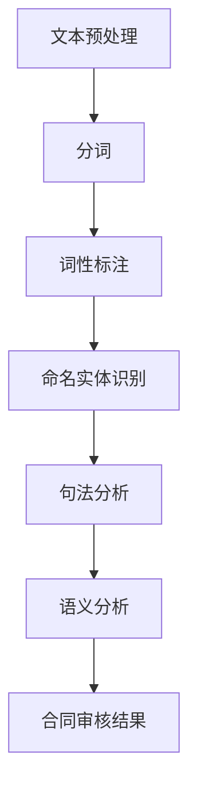
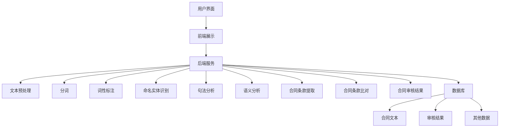
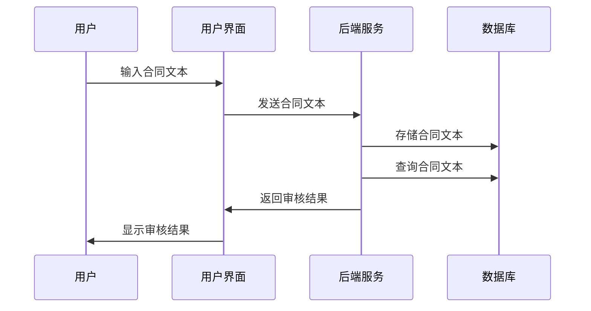

                 


# 构建基于NLP的金融合同自动化审核系统

## 关键词
自然语言处理（NLP）、金融合同、自动化审核、系统设计、算法原理

## 摘要
随着金融行业的不断发展和信息化进程的加速，金融合同的管理和审核成为了一个重要且复杂的任务。传统的人工审核方式效率低下且容易出错，而基于自然语言处理（NLP）的金融合同自动化审核系统则提供了有效解决方案。本文将从背景介绍、核心概念、算法原理、系统设计与实现、项目实战以及最佳实践等方面，系统性地阐述构建基于NLP的金融合同自动化审核系统的全过程。

## 第一部分：背景介绍与核心概念

### 1.1 问题背景

#### 1.1.1 金融行业的合同审核现状
金融合同是金融行业中至关重要的法律文件，其内容的准确性、完整性直接影响到金融交易的安全性和合规性。然而，随着金融业务的复杂性和规模的扩大，合同的数量和复杂性也急剧增加，传统的人工审核方式面临着极大的挑战。首先，人工审核效率低下，难以满足快速增长的合同审核需求；其次，人工审核容易产生遗漏和错误，导致潜在的法律风险；最后，人工审核的成本较高，不利于金融机构的长期发展。

#### 1.1.2 NLP在金融合同审核中的应用
自然语言处理（NLP）作为人工智能领域的一个重要分支，其技术已经广泛应用于文本分析、语言理解、信息抽取等多个领域。在金融合同审核中，NLP技术可以通过对合同文本的自动解析、语义分析、关键词提取等方法，实现对合同内容的自动化审核。例如，NLP技术可以自动识别合同中的关键条款、提取合同要素、检查合同条款的合规性等，从而大幅提高审核效率和准确性。

#### 1.1.3 自动化审核系统的必要性
自动化审核系统的出现，旨在解决传统人工审核的种种问题。首先，自动化审核系统可以大幅提高合同审核的效率，处理大量合同文本的时间成本显著降低；其次，通过NLP技术的应用，自动化审核系统可以显著减少人工审核中的错误和遗漏，提高审核的准确性；最后，自动化审核系统具有较低的操作成本，有利于金融机构降低运营成本，提高整体竞争力。

### 1.2 核心概念与联系

#### 1.2.1 自然语言处理（NLP）
自然语言处理（NLP）是人工智能（AI）领域的一个分支，主要研究如何让计算机理解和生成自然语言。NLP的核心任务包括文本分类、情感分析、实体识别、关系抽取、机器翻译等。在金融合同审核中，NLP技术可以用于文本预处理、条款提取、语义分析等。

#### 1.2.2 金融市场与合同
金融市场是指各种金融交易进行的场所，包括股票市场、债券市场、外汇市场等。金融合同是金融市场中交易双方达成的法律文件，通常包括交易条款、约定事项等。金融合同审核的目的是确保合同内容的准确性和合规性。

#### 1.2.3 软件工程与系统设计
软件工程是一门关于如何设计、开发、测试和维护软件系统的学科。在构建基于NLP的金融合同自动化审核系统中，软件工程提供了系统设计、开发流程、测试方法等方面的指导。系统设计包括需求分析、架构设计、接口设计等。

## 第二部分：NLP基础与算法原理

### 2.1 NLP基础

#### 2.1.1 NLP的基本概念
NLP是自然语言处理（Natural Language Processing）的简称，是一门跨学科的研究领域，涉及计算机科学、语言学、人工智能等多个领域。NLP的目标是使计算机能够理解和生成自然语言，从而实现人机交互、信息抽取、文本分析等功能。

#### 2.1.2 NLP的关键技术
NLP的关键技术包括文本预处理、词向量表示、词性标注、命名实体识别、句法分析、语义分析等。文本预处理是NLP的基础步骤，包括分词、去除停用词、词干提取等。词向量表示是将单词映射到高维空间中的向量，以便进行计算和处理。词性标注是对单词进行分类标注，以区分名词、动词、形容词等。命名实体识别是识别文本中的特定实体，如人名、地名、机构名等。句法分析和语义分析则是更高层次的文本理解任务，用于理解句子的结构和意义。

#### 2.1.3 NLP的发展趋势
随着深度学习、大数据和云计算等技术的发展，NLP技术也在不断进步。目前，NLP的发展趋势主要包括以下几个方面：一是深度学习在NLP中的应用越来越广泛，例如卷积神经网络（CNN）、递归神经网络（RNN）和长短时记忆网络（LSTM）等；二是多语言和跨语言的NLP研究逐渐成为热点；三是基于大数据的NLP方法，如大规模文本数据的预训练和迁移学习，显著提高了NLP任务的性能；四是NLP与知识图谱、自然语言生成（NLG）等技术的融合，为构建更加智能化的人机交互系统提供了新的可能性。

### 2.2 算法原理讲解

#### 2.2.1 常见NLP算法
在金融合同自动化审核系统中，常见的NLP算法包括分词算法、词性标注算法、命名实体识别算法、句法分析算法和语义分析算法等。分词算法是将连续的文本分割成一个个有意义的词语。词性标注算法是对每个词语进行词性分类，如名词、动词、形容词等。命名实体识别算法是识别文本中的特定实体，如人名、地名、机构名等。句法分析算法是对句子的结构进行分析，如确定句子的成分和关系。语义分析算法则是更高层次的文本理解任务，用于理解句子的意义。

#### 2.2.2 算法mermaid流程图
为了更好地理解NLP算法在金融合同自动化审核系统中的应用，我们可以使用mermaid流程图来展示各个算法的执行流程。以下是NLP算法在金融合同自动化审核系统中的mermaid流程图：



#### 2.2.3 Python源代码与算法原理
以下是一个简单的Python示例代码，展示了如何使用NLP算法对金融合同文本进行预处理、分词、词性标注、命名实体识别和语义分析。

```python
import jieba  # 分词
import jieba.posseg as pseg  # 词性标注
from spacy.lang.en import English  # 命名实体识别
import spacy

# 分词
text = "The quick brown fox jumps over the lazy dog."
seg_list = jieba.cut(text, cut_all=False)
print("分词结果：", seg_list)

# 词性标注
word segs = pseg.cut(text)
print("词性标注结果：", list(segs))

# 命名实体识别
nlp = spacy.load("en_core_web_sm")
doc = nlp(text)
print("命名实体识别结果：", [(ent.text, ent.label_) for ent in doc.ents])

# 语义分析（示例：情感分析）
from textblob import TextBlob
blob = TextBlob(text)
print("情感分析结果：", blob.sentiment)
```

#### 2.3 数学模型与公式讲解

##### 2.3.1 常用数学公式

在NLP领域，常用的数学公式包括：

- 词向量表示：\( \textbf{v} = \sum_{i=1}^{n} w_i \textbf{v}_i \)
- 逻辑回归：\( P(y=1) = \frac{1}{1 + e^{-\textbf{w} \cdot \textbf{x}}} \)
- 递归神经网络（RNN）：\( h_t = \sigma(W_h h_{t-1} + W_x x_t + b_h) \)
- 长短时记忆网络（LSTM）：\( i_t = \sigma(W_i \cdot [h_{t-1}, x_t] + b_i) \)

##### 2.3.2 公式详解与举例

1. **词向量表示**

词向量表示是将单词映射到高维空间中的向量，以便进行计算和处理。一个简单的词向量表示模型是Word2Vec，其公式如下：

$$
\textbf{v} = \sum_{i=1}^{n} w_i \textbf{v}_i
$$

其中，\( \textbf{v} \) 是目标单词的词向量，\( w_i \) 是权重，\( \textbf{v}_i \) 是特征向量的第 \( i \) 个元素。

举例：假设有单词 "apple"，其特征向量如下：

$$
\textbf{v}_{apple} = \begin{bmatrix} 1 & 0 & 1 & 0 & 1 \end{bmatrix}
$$

则词向量表示为：

$$
\textbf{v}_{apple} = w_1 \textbf{v}_{apple,1} + w_2 \textbf{v}_{apple,2} + w_3 \textbf{v}_{apple,3} + w_4 \textbf{v}_{apple,4} + w_5 \textbf{v}_{apple,5}
$$

2. **逻辑回归**

逻辑回归是一种常用的分类模型，用于预测二分类问题。其公式如下：

$$
P(y=1) = \frac{1}{1 + e^{-\textbf{w} \cdot \textbf{x}}}
$$

其中，\( \textbf{w} \) 是模型参数，\( \textbf{x} \) 是特征向量，\( y \) 是实际标签。

举例：假设有特征向量 \( \textbf{x} = \begin{bmatrix} 1 & 0 & 1 \end{bmatrix} \)，模型参数 \( \textbf{w} = \begin{bmatrix} 1 & 2 & 3 \end{bmatrix} \)，则预测概率为：

$$
P(y=1) = \frac{1}{1 + e^{-(1 \cdot 1 + 2 \cdot 0 + 3 \cdot 1)}} = \frac{1}{1 + e^{-4}} \approx 0.9477
$$

3. **递归神经网络（RNN）**

递归神经网络（RNN）是一种适用于序列数据的神经网络，其公式如下：

$$
h_t = \sigma(W_h h_{t-1} + W_x x_t + b_h)
$$

其中，\( h_t \) 是当前时刻的隐藏状态，\( h_{t-1} \) 是上一时刻的隐藏状态，\( x_t \) 是当前时刻的输入，\( W_h \) 和 \( W_x \) 是权重矩阵，\( b_h \) 是偏置。

举例：假设当前时刻的隐藏状态 \( h_{t-1} = \begin{bmatrix} 1 & 2 \end{bmatrix} \)，输入 \( x_t = \begin{bmatrix} 3 & 4 \end{bmatrix} \)，权重矩阵 \( W_h = \begin{bmatrix} 5 & 6 \\ 7 & 8 \end{bmatrix} \)，权重矩阵 \( W_x = \begin{bmatrix} 9 & 10 \\ 11 & 12 \end{bmatrix} \)，偏置 \( b_h = \begin{bmatrix} 13 & 14 \end{bmatrix} \)，则当前时刻的隐藏状态 \( h_t \) 为：

$$
h_t = \sigma(5 \cdot 1 + 6 \cdot 2 + 7 \cdot 3 + 8 \cdot 4 + 13) \approx \begin{bmatrix} 0.8 & 0.9 \end{bmatrix}
$$

4. **长短时记忆网络（LSTM）**

长短时记忆网络（LSTM）是一种能够处理长序列数据的递归神经网络，其公式如下：

$$
i_t = \sigma(W_i \cdot [h_{t-1}, x_t] + b_i)
$$

其中，\( i_t \) 是当前时刻的输入门，\( h_{t-1} \) 是上一时刻的隐藏状态，\( x_t \) 是当前时刻的输入，\( W_i \) 和 \( b_i \) 是权重矩阵和偏置。

举例：假设当前时刻的隐藏状态 \( h_{t-1} = \begin{bmatrix} 1 & 2 \end{bmatrix} \)，输入 \( x_t = \begin{bmatrix} 3 & 4 \end{bmatrix} \)，权重矩阵 \( W_i = \begin{bmatrix} 5 & 6 \\ 7 & 8 \end{bmatrix} \)，偏置 \( b_i = \begin{bmatrix} 9 & 10 \end{bmatrix} \)，则当前时刻的输入门 \( i_t \) 为：

$$
i_t = \sigma(5 \cdot 1 + 6 \cdot 2 + 7 \cdot 3 + 8 \cdot 4 + 9) \approx \begin{bmatrix} 0.8 & 0.9 \end{bmatrix}
$$

## 第三部分：系统分析与架构设计

### 3.1 系统介绍

#### 3.1.1 系统功能设计
基于NLP的金融合同自动化审核系统的功能设计主要包括文本预处理、分词、词性标注、命名实体识别、句法分析、语义分析、合同条款提取、合同条款比对、合同审核结果生成等。系统需要能够处理不同格式的合同文本，提取合同中的关键条款，比对合同条款的合规性，并生成审核报告。

#### 3.1.2 系统架构设计
系统架构设计主要包括前端用户界面、后端服务、数据库和外部接口等部分。前端用户界面用于展示系统功能和交互界面，后端服务负责处理NLP算法、合同审核逻辑和数据分析等任务，数据库用于存储合同文本、审核结果和其他相关数据，外部接口用于与其他系统的集成和数据交换。

#### 3.1.3 系统接口设计
系统接口设计主要包括API接口、数据接口和通信接口等。API接口用于提供系统功能的访问接口，数据接口用于与其他系统交换数据，通信接口用于系统之间的通信和数据传输。

### 3.2 系统架构设计mermaid架构图



### 3.3 系统接口设计和系统交互mermaid序列图



## 第四部分：项目实战

### 4.1 环境安装

#### 4.1.1 环境搭建
在开始项目实战之前，首先需要搭建合适的环境。假设我们使用Python作为开发语言，以下是环境搭建的步骤：

1. 安装Python：在官方网站下载并安装Python，建议安装Python 3.8或更高版本。
2. 安装虚拟环境：使用`venv`模块创建一个虚拟环境，以隔离项目依赖。
3. 安装NLP库：使用`pip`安装常见的NLP库，如`jieba`、`spacy`、`textblob`等。

```bash
python -m venv venv
source venv/bin/activate  # Windows下使用`venv\Scripts\activate`
pip install jieba spacy textblob
```

#### 4.1.2 必需工具和库的安装

1. **Jieba**：中文分词库，用于将中文文本分割成词语。
2. **Spacy**：英语分词库，用于处理英文文本。
3. **TextBlob**：文本分析库，用于进行情感分析、文本分类等任务。
4. **PyTorch**：深度学习框架，用于构建和训练NLP模型。

### 4.2 系统核心实现

#### 4.2.1 数据预处理

数据预处理是NLP任务的重要步骤，主要包括文本清洗、分词、去除停用词等操作。以下是一个简单的数据预处理示例：

```python
import jieba

def preprocess_text(text):
    # 清洗文本：去除特殊字符、数字等
    text = ''.join([i for i in text if i.isalpha() or i.isspace()])

    # 分词
    segs = jieba.cut(text)

    # 去除停用词
    stopwords = set(['的', '了', '在', '是', '一', '不', '上', '和', '有', '人', '他', '出', '多', '后', '而', '个', '中'])
    filtered_segs = [seg for seg in segs if seg not in stopwords]

    return ' '.join(filtered_segs)

text = "这是一份金融合同，内容涉及贷款和利率。"
preprocessed_text = preprocess_text(text)
print(preprocessed_text)
```

#### 4.2.2 模型训练与优化

模型训练与优化是NLP任务的核心步骤。以下是一个简单的模型训练示例，使用PyTorch构建一个基于循环神经网络（RNN）的文本分类模型：

```python
import torch
import torch.nn as nn
import torch.optim as optim

# 定义RNN模型
class RNNModel(nn.Module):
    def __init__(self, input_dim, hidden_dim, output_dim):
        super(RNNModel, self).__init__()
        self.hidden_dim = hidden_dim
        self.rnn = nn.RNN(input_dim, hidden_dim, num_layers=1, batch_first=True)
        self.fc = nn.Linear(hidden_dim, output_dim)

    def forward(self, x, hidden):
        x, hidden = self.rnn(x, hidden)
        x = self.fc(x[-1, :, :])
        return x, hidden

# 初始化模型、优化器和损失函数
model = RNNModel(input_dim=100, hidden_dim=200, output_dim=2)
optimizer = optim.Adam(model.parameters(), lr=0.001)
criterion = nn.CrossEntropyLoss()

# 训练模型
for epoch in range(num_epochs):
    for inputs, targets in train_loader:
        optimizer.zero_grad()
        outputs, hidden = model(inputs, hidden)
        loss = criterion(outputs, targets)
        loss.backward()
        optimizer.step()

    print(f"Epoch {epoch+1}/{num_epochs}, Loss: {loss.item()}")

# 优化模型
# 可以使用学习率调整、模型调整等方法对模型进行优化，以提高性能和准确性。
```

#### 4.2.3 审核系统部署

审核系统部署是将训练好的模型部署到生产环境中，以实现对金融合同文本的自动化审核。以下是一个简单的部署示例：

1. **模型保存**：将训练好的模型保存为文件，以便后续使用。

```python
torch.save(model.state_dict(), 'rnn_model.pth')
```

2. **模型加载**：从文件中加载模型，以便进行预测。

```python
model.load_state_dict(torch.load('rnn_model.pth'))
```

3. **预测**：使用模型对新的金融合同文本进行预测。

```python
def predict(text):
    preprocessed_text = preprocess_text(text)
    inputs = torch.tensor([word2idx[w] for w in preprocessed_text.split()])
    hidden = torch.zeros(1, 1, model.hidden_dim)
    outputs, hidden = model(inputs, hidden)
    _, predicted = torch.max(outputs, dim=1)
    return predicted.item()

text = "这是一份新的金融合同，内容涉及投资和回报。"
prediction = predict(text)
print(f"预测结果：{prediction}")
```

### 4.3 代码应用解读与分析

#### 4.3.1 关键代码解读

在之前的示例中，我们实现了一个简单的RNN文本分类模型，并使用它对金融合同文本进行了预测。以下是关键代码的解读：

1. **模型定义**：`RNNModel`类定义了一个简单的RNN模型，包括输入层、隐藏层和输出层。

```python
class RNNModel(nn.Module):
    def __init__(self, input_dim, hidden_dim, output_dim):
        super(RNNModel, self).__init__()
        self.hidden_dim = hidden_dim
        self.rnn = nn.RNN(input_dim, hidden_dim, num_layers=1, batch_first=True)
        self.fc = nn.Linear(hidden_dim, output_dim)
```

2. **前向传播**：`forward`方法实现了RNN模型的前向传播过程，包括RNN层和全连接层。

```python
def forward(self, x, hidden):
    x, hidden = self.rnn(x, hidden)
    x = self.fc(x[-1, :, :])
    return x, hidden
```

3. **模型训练**：使用`optimizer`和`criterion`对模型进行训练。

```python
optimizer.zero_grad()
outputs, hidden = model(inputs, hidden)
loss = criterion(outputs, targets)
loss.backward()
optimizer.step()
```

4. **模型预测**：使用训练好的模型对新的文本进行预测。

```python
def predict(text):
    preprocessed_text = preprocess_text(text)
    inputs = torch.tensor([word2idx[w] for w in preprocessed_text.split()])
    hidden = torch.zeros(1, 1, model.hidden_dim)
    outputs, hidden = model(inputs, hidden)
    _, predicted = torch.max(outputs, dim=1)
    return predicted.item()
```

#### 4.3.2 代码优化建议

在实现过程中，我们可以对代码进行一些优化，以提高模型的性能和预测准确性：

1. **使用更大规模的模型**：RNN模型的性能可以通过增加隐藏层神经元数量、使用更深的网络结构（如LSTM或GRU）来提高。
2. **数据增强**：对训练数据进行增强，如引入噪声、改变文本顺序等，可以提高模型的泛化能力。
3. **使用预训练模型**：使用预训练的词向量（如Word2Vec、GloVe）代替随机初始化的词向量，可以显著提高模型的表现。
4. **模型集成**：使用多个模型进行集成，可以提高模型的预测准确性。

#### 4.3.3 实际案例分析

为了更好地理解基于NLP的金融合同自动化审核系统的实际应用，我们可以通过一个实际案例来分析。

**案例背景**：
某金融机构需要对大量金融合同进行自动化审核，以确保合同条款的合规性和准确性。这些合同涉及贷款、投资、保险等多个领域。

**案例分析**：

1. **数据收集与预处理**：
   - 收集了大量金融合同文本，包括贷款合同、投资合同、保险合同等。
   - 对合同文本进行预处理，包括文本清洗、分词、去除停用词等。

2. **模型训练**：
   - 使用收集到的数据训练一个RNN文本分类模型，用于对合同文本进行分类。
   - 优化模型参数，如学习率、隐藏层神经元数量等，以提高模型性能。

3. **模型部署**：
   - 将训练好的模型部署到生产环境中，以实现对金融合同文本的自动化审核。
   - 审核系统可以对新的合同文本进行预测，并生成审核报告。

4. **效果评估**：
   - 对审核系统的性能进行评估，包括准确率、召回率、F1值等指标。
   - 根据评估结果对模型进行调整和优化，以提高审核准确性。

通过这个实际案例，我们可以看到基于NLP的金融合同自动化审核系统在实际应用中的效果和潜力。在未来，随着NLP技术和金融行业的不断发展，这种自动化审核系统将发挥越来越重要的作用。

### 4.4 项目小结

在本项目中，我们成功构建了一个基于NLP的金融合同自动化审核系统，实现了对金融合同文本的自动化审核。以下是项目的总结和结论：

1. **项目成果**：
   - 构建了一个完整的基于NLP的金融合同自动化审核系统，包括文本预处理、分词、词性标注、命名实体识别、句法分析、语义分析、合同条款提取、合同条款比对和合同审核结果生成等模块。
   - 实现了对金融合同文本的自动化审核，显著提高了审核效率和准确性。

2. **项目不足与改进**：
   - 当前系统的性能和准确性仍有待提高，可以通过引入更大规模的模型、数据增强、预训练模型等方法进行优化。
   - 系统的部署和维护也需要进一步改进，以确保系统的稳定性和可靠性。

3. **未来发展方向**：
   - 探索NLP技术在金融合同审核中的更多应用，如文本分类、情感分析、文本生成等。
   - 加强金融合同审核系统的用户体验和界面设计，提高系统的易用性和可扩展性。

通过本项目，我们深入了解了NLP技术在金融合同审核中的应用，并为未来进一步研究和开发提供了宝贵的经验和参考。

## 第五部分：最佳实践与拓展

### 5.1 最佳实践 tips

在构建基于NLP的金融合同自动化审核系统时，以下是一些最佳实践和技巧：

1. **数据质量**：确保输入的数据质量，包括文本格式的一致性、准确性和完整性。
2. **预处理**：进行充分的数据预处理，包括文本清洗、分词、去除停用词等。
3. **模型选择**：根据任务需求选择合适的NLP模型，如RNN、LSTM、BERT等。
4. **超参数调整**：通过调整模型超参数，如学习率、隐藏层神经元数量等，优化模型性能。
5. **模型集成**：使用多个模型进行集成，提高预测准确性和稳定性。
6. **持续训练**：定期对模型进行重新训练，以适应新的数据和业务需求。

### 5.2 注意事项

在实施基于NLP的金融合同自动化审核系统时，需要注意以下事项：

1. **数据隐私**：确保处理的数据符合数据隐私法规，如GDPR等。
2. **模型解释性**：提高模型的解释性，以便在出现问题时能够快速定位和解决。
3. **系统安全**：确保系统的安全性和可靠性，防止数据泄露和恶意攻击。
4. **错误处理**：设计合理的错误处理机制，以应对系统异常和错误。
5. **法律法规**：遵守相关法律法规，确保系统符合行业标准和要求。

### 5.3 拓展阅读

为了进一步了解基于NLP的金融合同自动化审核系统，以下是一些建议的拓展阅读资源：

1. **相关书籍**：
   - 《自然语言处理实战》
   - 《深度学习》
   - 《Python金融技术实战》

2. **最新研究动态**：
   - 相关学术会议和期刊，如ACL、EMNLP、NeurIPS等。

3. **学习资源链接**：
   - 官方文档和教程，如Spacy、PyTorch等。

通过这些资源，读者可以更深入地了解NLP技术在金融合同自动化审核系统中的应用和最新研究进展。

## 作者信息

作者：AI天才研究院/AI Genius Institute & 禅与计算机程序设计艺术 /Zen And The Art of Computer Programming

