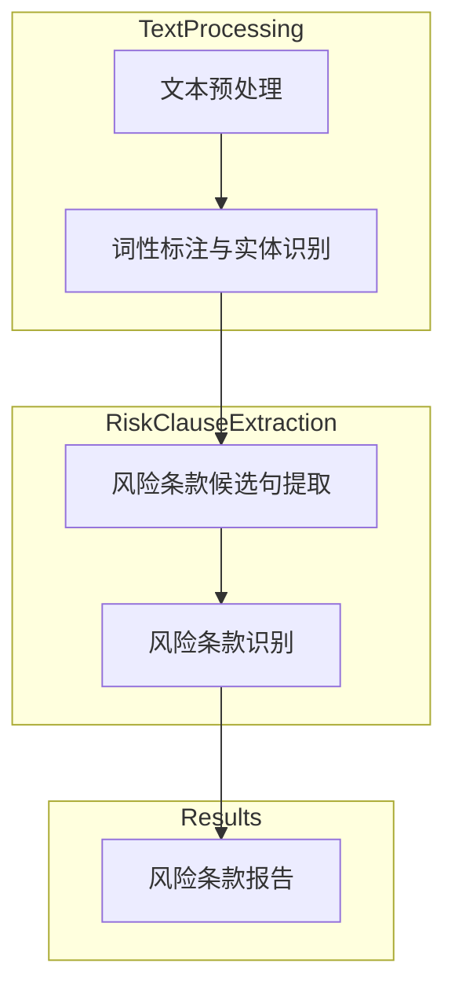
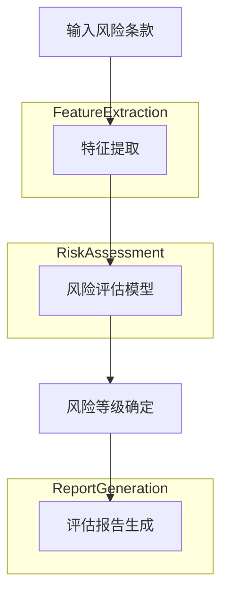
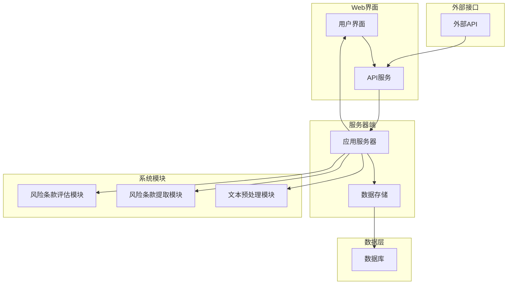
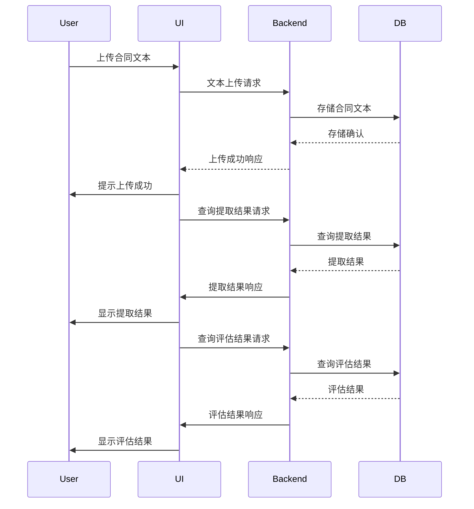

                 


### 1. 背景与核心概念

随着金融行业的快速发展，金融合同作为业务活动的重要载体，其复杂性和数量日益增长。然而，金融合同中的风险条款往往隐藏在庞大的文本中，对金融机构和法律从业人员提出了巨大的挑战。传统的金融合同风险评估往往依赖于人工阅读和解析，这不仅效率低下，还容易导致错误和遗漏。

**问题背景**：

金融合同中包含大量的法律条款，这些条款往往涉及复杂的法律术语和条件。有效的合同风险条款提取和评估需要解决以下问题：

- **术语识别**：准确识别合同文本中的专业术语和关键词，如“违约”、“赔偿”等。
- **结构化提取**：将风险条款从文本中提取出来，并以结构化的形式表示，便于进一步处理和分析。
- **风险评估**：对提取的风险条款进行评估，以确定其潜在风险等级。

**自然语言处理（NLP）在金融合同分析中的应用**：

自然语言处理（NLP）作为人工智能的重要分支，近年来在文本分析领域取得了显著的进展。NLP技术可以用于金融合同分析，提供自动化和高效的风险评估方法。

- **文本预处理**：通过分词、词性标注等技术，将合同文本转换为计算机可以处理的格式。
- **实体识别**：识别文本中的关键实体，如人名、公司名、日期等。
- **句法分析**：分析句子结构，提取句子中的关系和角色。
- **语义理解**：理解文本的语义内容，进行情感分析和上下文推理。

**NLP在金融合同分析中的挑战与机遇**：

尽管NLP技术在金融合同分析中具有巨大潜力，但也面临一系列挑战：

- **文本复杂性**：金融合同文本往往包含复杂的法律术语和长句结构，这增加了NLP处理的难度。
- **数据不足**：高质量、标注完备的金融合同数据集相对较少，限制了模型训练的效果。
- **一致性**：不同合同文本的表达方式可能存在较大差异，影响NLP模型的一致性和泛化能力。

然而，随着数据量的增加、算法的改进以及跨领域的知识融合，NLP在金融合同分析中的应用前景十分广阔。

### 1.1 金融合同与风险条款概述

金融合同是金融机构与企业、个人之间签订的具有法律效力的协议，涵盖了各种金融交易和服务，如贷款、投资、保险等。这些合同文本通常包含大量的法律条款和条件，其中风险条款尤为关键。

**金融合同的结构与内容**：

金融合同通常由以下几个部分组成：

- **封面**：包括合同名称、签署日期、合同编号等基本信息。
- **导言**：简要介绍合同背景和双方的基本信息。
- **正文**：详细描述交易内容、条款和条件，包括但不限于违约责任、赔偿条款、利率和费用等。
- **附件**：补充合同正文的相关条款和文件。
- **签名页**：合同双方的签字和盖章。

**风险条款的定义与类型**：

风险条款是指合同中涉及风险分配和风险管理的条款，通常包括以下几个方面：

- **违约责任**：规定一方违约时需要承担的责任和赔偿。
- **不可抗力**：因不可抗力事件导致合同无法履行时的责任和后果。
- **风险转移**：风险在合同双方之间的转移方式和条件。
- **担保**：担保人对合同履行提供担保的条款。
- **赔偿**：因合同履行过程中发生损失时，责任方需要进行的赔偿。

**风险条款的重要性**：

风险条款在金融合同中扮演着至关重要的角色，它们直接关系到合同履行的顺利与否以及双方权益的保护。有效的风险条款设计和管理能够：

- **降低合同履行中的风险**：通过明确风险分配和责任，减少合同纠纷和损失。
- **提高合同履约率**：增强各方对合同条款的理解和遵守，促进合同的顺利履行。
- **优化风险管理**：为金融机构提供有效的风险监测和管理工具，提高风险管理水平。

### 1.2 自然语言处理（NLP）基础

自然语言处理（NLP）是人工智能的一个重要分支，旨在使计算机能够理解、解释和生成人类语言。NLP技术在文本分析、语言生成、信息检索等方面有广泛应用。

**NLP的核心概念**：

- **文本预处理**：对原始文本进行清洗、分词、标点符号去除等处理，以转换为计算机可以处理的格式。
- **词性标注**：对文本中的每个单词标注其词性，如名词、动词、形容词等。
- **命名实体识别**：识别文本中的关键实体，如人名、地点、组织等。
- **句法分析**：分析句子的结构，提取句子中的关系和成分，如主语、谓语、宾语等。
- **语义分析**：理解文本的语义内容，包括情感分析、实体关系、事件抽取等。
- **文本生成**：根据输入文本或模板生成新的文本，如自动摘要、翻译等。

**NLP的常用工具与库**：

- **NLTK**：Python的一个自然语言处理库，提供了一系列文本处理和分析工具。
- **spaCy**：一个高性能的NLP库，支持多种语言，适用于快速文本分析和实体识别。
- **Gensim**：用于主题建模和文本相似度计算的Python库。
- **transformers**：由Hugging Face开发的一个NLP库，提供了预训练的模型和工具，如BERT、GPT等。

**NLP在文本分析中的应用**：

NLP技术在文本分析中有着广泛的应用，包括：

- **情感分析**：分析文本中的情感倾向，如正面、负面或中性。
- **主题建模**：从大量文本中提取主题信息，用于文本分类和搜索。
- **文本分类**：将文本数据分类到预定义的类别中，如垃圾邮件过滤、新闻分类等。
- **命名实体识别**：识别文本中的关键实体，如人名、地点、组织等。
- **机器翻译**：将一种语言的文本自动翻译成另一种语言。

**NLP的优势与挑战**：

NLP的优势在于能够处理复杂的文本数据，实现自动化和智能化的文本分析。然而，NLP也面临一些挑战，包括：

- **数据质量**：高质量、标注完备的数据集对于训练有效的NLP模型至关重要。
- **语言多样性**：不同语言之间的差异增加了NLP处理的复杂性。
- **上下文理解**：理解文本的上下文和隐含意义是NLP的重要挑战，这需要深入的语义理解能力。
- **实时处理**：在高实时性要求下，NLP系统的响应速度和处理能力需要得到保证。

### 1.3 NLP在金融合同分析中的挑战与机遇

尽管NLP技术在文本分析领域取得了显著的进展，但在金融合同分析中，仍面临着一系列独特的挑战与机遇。

**挑战**：

1. **文本复杂性**：
   - 金融合同文本通常包含复杂的法律术语和长句结构，这些内容难以用简单的词向量模型进行有效处理。
   - 合同文本中的模糊语言和隐含条款增加了NLP理解的难度。

2. **数据不足**：
   - 高质量、标注完备的金融合同数据集相对较少，限制了NLP模型训练的效果。
   - 金融合同的多样性和变化性使得通用模型的适应性受到挑战。

3. **一致性**：
   - 不同合同文本的表达方式可能存在较大差异，影响NLP模型的一致性和泛化能力。
   - 合同条款的语义理解和表达可能具有模糊性，难以确保模型的一致性输出。

4. **实时性要求**：
   - 金融合同分析往往需要快速响应，实时处理大量的合同文本，这对NLP系统的性能提出了高要求。

**机遇**：

1. **数据可用性**：
   - 随着金融行业数字化转型的推进，越来越多的金融合同数据被电子化，为NLP模型训练提供了丰富的数据资源。
   - 开源的数据集和工具的普及，降低了进入NLP金融合同分析的门槛。

2. **算法改进**：
   - 深度学习模型的广泛应用，尤其是Transformer等新型架构的引入，提高了NLP处理复杂文本的能力。
   - 多模态学习、图神经网络等新兴技术的融合，为金融合同分析提供了新的思路和工具。

3. **跨领域知识融合**：
   - 融合法律、金融等领域专业知识，构建领域特定NLP模型，提高模型对金融合同的理解和解析能力。
   - 利用大数据分析和机器学习技术，实现合同条款的智能分析和风险预测。

4. **合规与监管需求**：
   - 金融行业对合规性和风险管理的需求日益增加，NLP技术能够帮助金融机构提高合规性和风险控制水平。
   - NLP在合同审查、风险评估等领域的应用，有助于金融机构降低操作风险和法律风险。

**总结**：

NLP在金融合同分析中既有巨大的挑战，也蕴藏着广阔的机遇。通过克服这些挑战，利用现有的技术优势和不断创新，NLP有望成为金融合同自动化处理和风险管理的有力工具。

### 1.4 本书的结构安排与目标

本书旨在系统地介绍如何构建基于自然语言处理（NLP）的金融合同风险条款自动化提取与评估系统，帮助读者理解和掌握这一领域的核心技术和应用方法。全书分为五个部分，各部分内容如下：

**第一部分：背景与核心概念**

本部分首先介绍了金融合同风险条款提取与评估的问题背景，详细阐述了金融合同和风险条款的基本概念，接着介绍了NLP的基础知识和NLP在金融合同分析中的挑战与机遇。这一部分为后续内容奠定了理论基础。

**第二部分：核心概念与联系**

第二部分深入探讨了NLP的核心概念，包括语言模型与词向量表示、词性标注与命名实体识别、语法分析器与依存句法分析、情感分析与语义角色标注等。通过Mermaid流程图和ER实体关系图架构，对每个概念进行了详细阐述，使读者对NLP技术有更全面的理解。

**第三部分：算法原理讲解**

第三部分重点讲解了金融合同风险条款的自动化提取算法和评估算法。通过mermaid流程图展示算法流程，使用Python源代码详细解释算法实现，并给出了数学模型和公式。通过通俗易懂的举例说明，帮助读者理解算法原理。

**第四部分：系统设计与实现**

第四部分详细介绍了系统分析与架构设计方案，包括问题场景介绍、项目介绍、系统功能设计、系统架构设计、系统接口设计和系统交互。通过对环境的安装与配置、核心实现源代码的解读，以及实际案例的分析，展示了系统实现的完整流程。

**第五部分：最佳实践与拓展**

最后一部分提供了最佳实践和注意事项，总结了实际应用中的技巧与解决方案。通过对本书主要贡献、未来研究方向和拓展阅读的介绍，为读者提供了进一步学习和研究的方向。

本书的目标是：

1. **全面了解金融合同风险条款提取与评估的背景和核心概念**。
2. **掌握NLP在金融合同分析中的应用原理**。
3. **学会构建基于NLP的金融合同风险条款自动化提取与评估系统**。
4. **提供实用的最佳实践和实际案例分析**。

通过本书的阅读和实践，读者能够掌握金融合同风险条款自动化提取与评估的关键技术，为金融机构提供高效、准确的风险管理解决方案。

### 2.1 语言模型与词向量表示

自然语言处理（NLP）中的语言模型是用于理解和生成文本的核心工具，而词向量表示则是实现这一目标的重要手段。在这一章节中，我们将详细介绍语言模型和词向量表示的基本概念、原理及其在NLP中的应用。

**语言模型的基本概念与原理**

语言模型（Language Model）是一种概率模型，用于预测一段文本中下一个单词或字符的概率。在NLP中，语言模型是实现文本生成、文本分类、机器翻译等任务的基础。

- **基本原理**：语言模型通过统计文本数据中的词频和语法结构，学习语言中的概率分布。常见的语言模型有N-gram模型、n元语言模型、神经网络语言模型等。
- **N-gram模型**：N-gram模型是一种基于词频统计的语言模型，它将连续的N个单词视为一个整体，并计算每个N-gram出现的频率。例如，对于三元语言模型（trigram模型），它考虑前两个单词以及当前单词的概率。
- **神经网络语言模型**：神经网络语言模型通过深度学习技术，学习文本的复杂结构和上下文关系。典型的神经网络语言模型包括循环神经网络（RNN）、长短期记忆网络（LSTM）和Transformer等。

**词向量表示的基本概念与原理**

词向量表示（Word Embedding）是将单词转换为固定长度的向量表示的方法，使计算机能够处理和计算文本数据。词向量表示在NLP中有着广泛的应用，如文本分类、语义相似度计算、机器翻译等。

- **基本原理**：词向量表示通过将单词映射到低维向量空间中，使得具有相似意义的单词在向量空间中彼此接近。常见的词向量表示方法有基于分布假设的方法（如word2vec）和基于神经网络的方法（如GloVe）。
- **word2vec**：word2vec是Google提出的一种基于神经网络的词向量表示方法，通过优化损失函数，将单词映射到低维向量空间。word2vec主要有两种训练方式：连续词袋（CBOW）和Skip-Gram。
  - **连续词袋（CBOW）**：CBOW模型通过上下文单词的集合来预测中心词，即将多个上下文单词的词向量进行平均，作为中心词的预测向量。
  - **Skip-Gram**：Skip-Gram模型则相反，通过中心词来预测上下文单词，即将中心词的词向量与上下文单词的词向量进行点积，得到预测概率。
- **GloVe**：GloVe（Global Vectors for Word Representation）是一种基于全局矩阵因式的词向量表示方法。GloVe通过优化单词的共现矩阵，学习得到全局的词向量表示，具有良好的语义表示能力。

**语言模型与词向量表示在NLP中的应用**

语言模型和词向量表示在NLP中有着广泛的应用，以下列举几个典型的应用场景：

- **文本分类**：通过训练语言模型，可以自动将文本分类到预定义的类别中，如垃圾邮件过滤、新闻分类等。
- **机器翻译**：语言模型和词向量表示在机器翻译中发挥着关键作用。通过预测目标语言的词汇和句子结构，实现自动翻译。
- **情感分析**：利用语言模型和词向量表示，可以分析文本中的情感倾向，如正面、负面或中性。
- **文本生成**：语言模型可以生成具有合理语法和语义的文本，如自动摘要、问答系统等。
- **语义相似度计算**：通过计算词向量之间的相似度，可以衡量文本之间的语义关系，如词义相似度、句子相似度等。

总之，语言模型和词向量表示是NLP中的基础工具，通过它们，计算机能够理解和处理复杂的自然语言文本，实现各种NLP应用。随着深度学习技术的发展，这些工具在NLP中的应用前景将更加广阔。

### 2.2 词性标注与命名实体识别

词性标注（Part-of-Speech Tagging）和命名实体识别（Named Entity Recognition，NER）是自然语言处理（NLP）中的两个重要任务，它们在文本分析和语义理解中扮演着关键角色。在这两节中，我们将详细探讨这两个概念的基本原理、实现方法和在NLP中的应用。

**词性标注的基本概念与实现方法**

词性标注是指对文本中的每个单词标注其词性，如名词、动词、形容词等。词性标注是NLP中的基础任务，有助于理解文本的语法结构和语义内容。

- **基本原理**：词性标注基于对文本的语法分析，识别每个单词的词性。常见的词性标注方法包括规则方法、统计方法和基于深度学习的方法。
  - **规则方法**：规则方法依赖于手工编写的语法规则，将文本中的每个单词与规则进行匹配，标注词性。这种方法简单直观，但规则覆盖面有限，难以处理复杂文本。
  - **统计方法**：统计方法通过统计模型，如隐马尔可夫模型（HMM）和条件随机场（CRF），学习文本中的词性分布。这种方法基于大量训练数据，能够处理复杂文本，但模型复杂度较高。
  - **深度学习方法**：深度学习方法通过神经网络，如卷积神经网络（CNN）和长短期记忆网络（LSTM），学习词性标注的任务。深度学习方法具有良好的泛化能力，能够处理复杂文本，但训练时间较长。

- **实现方法**：以Python的spaCy库为例，我们可以使用其预训练的词性标注模型进行文本标注。以下是简单的词性标注示例：

  ```python
  import spacy
  
  # 加载预训练的词性标注模型
  nlp = spacy.load("en_core_web_sm")
  
  # 标注文本
  doc = nlp("The quick brown fox jumps over the lazy dog.")
  
  # 输出词性标注结果
  for token in doc:
      print(token.text, token.pos_)
  ```

  输出结果如下：

  ```
  The   PROPN
  quick   ADJ
  brown   ADJ
  fox     NOUN
  jumps   VERB
  over    ADP
  the     DET
  lazy    ADJ
  dog     NOUN
  ```

**命名实体识别的基本概念与实现方法**

命名实体识别是指识别文本中的命名实体，如人名、地点、组织、日期等。命名实体识别是文本分析中的重要任务，有助于提取关键信息和进行知识图谱构建。

- **基本原理**：命名实体识别基于对文本的实体识别，识别出文本中的命名实体。常见的命名实体识别方法包括基于规则的方法、统计方法和基于深度学习的方法。
  - **基于规则的方法**：基于规则的方法通过预定义的规则，识别文本中的命名实体。这种方法简单高效，但规则覆盖面有限，难以处理复杂文本。
  - **统计方法**：统计方法通过统计模型，如条件随机场（CRF），学习文本中的实体分布。这种方法基于大量训练数据，能够处理复杂文本，但模型复杂度较高。
  - **深度学习方法**：深度学习方法通过神经网络，如卷积神经网络（CNN）和长短期记忆网络（LSTM），学习命名实体识别的任务。深度学习方法具有良好的泛化能力，能够处理复杂文本，但训练时间较长。

- **实现方法**：以Python的spaCy库为例，我们可以使用其预训练的命名实体识别模型进行文本识别。以下是简单的命名实体识别示例：

  ```python
  import spacy
  
  # 加载预训练的命名实体识别模型
  nlp = spacy.load("en_core_web_sm")
  
  # 标注文本
  doc = nlp("Elon Musk founded SpaceX in 2002.")
  
  # 输出命名实体识别结果
  for ent in doc.ents:
      print(ent.text, ent.label_)
  ```

  输出结果如下：

  ```
  Elon Musk   PERSON
  SpaceX      ORG
  2002        DATE
  ```

**词性标注与命名实体识别在NLP中的应用**

词性标注和命名实体识别在NLP中有着广泛的应用，以下列举几个典型的应用场景：

- **文本分类**：通过词性标注和命名实体识别，可以提取文本中的关键信息和特征，用于文本分类任务，如新闻分类、情感分类等。
- **信息抽取**：通过命名实体识别，可以自动提取文本中的命名实体，用于构建知识图谱和信息抽取任务。
- **问答系统**：通过词性标注和命名实体识别，可以理解用户的问题，定位答案，实现自动问答系统。
- **机器翻译**：通过词性标注和命名实体识别，可以保留文本中的关键信息和实体，提高机器翻译的质量。

总之，词性标注和命名实体识别是NLP中的关键任务，通过它们，计算机能够更好地理解和处理文本，实现各种NLP应用。随着深度学习技术的发展，这些任务的处理效果将得到进一步提升。

### 2.3 语法分析器与依存句法分析

语法分析器（Syntax Analyzer）和依存句法分析（Dependency Parsing）是自然语言处理（NLP）中用于理解文本句法结构的两个重要工具。在这两节中，我们将详细探讨这两个概念的基本原理、实现方法和在NLP中的应用。

**语法分析器的基本概念与实现方法**

语法分析器是用于解析文本句法结构的一种工具，其目的是将文本分解为语法上正确的句子结构。语法分析通常分为词法分析（Lexical Analysis）和句法分析（Syntactic Analysis）两个阶段。

- **基本原理**：
  - **词法分析**：词法分析器将文本分解为词素（Token），即将连续的字符序列转换为单词或其他符号。这一阶段不需要理解文本的语义，只需要识别单词和符号。
  - **句法分析**：句法分析器在词法分析的基础上，将词素序列解析为语法上正确的句子结构。常见的句法分析方法包括自顶向下（Top-Down）和自底向上（Bottom-Up）。

- **实现方法**：
  - **自顶向下分析**：自顶向下分析方法从抽象的语法规则开始，逐步细化，直到生成具体的句子结构。例如，LR（1）分析器是自顶向下分析的一种常用方法。
  - **自底向上分析**：自底向上分析方法从具体的词素开始，逐步合并，直到形成完整的句子结构。例如，LL（1）分析器是自底向上分析的一种常用方法。

- **示例**：以Python的Stanford CoreNLP工具为例，我们可以使用其语法分析功能。以下是简单的语法分析示例：

  ```python
  from stanfordnlp.client import CoreNLPClient
  
  # 创建CoreNLP客户端
  client = CoreNLPClient("http://localhost:9000", memory="16G", timeout="1000S", lang="en")
  
  # 输入文本
  text = "The quick brown fox jumps over the lazy dog."
  
  # 进行语法分析
  result = client.annotate(text)
  
  # 输出语法分析结果
  print(result["sentences"][0]["tokens"])
  ```

  输出结果如下：

  ```json
  [
    {
      "text": "The",
      "beginPosition": 0,
      "endPosition": 3,
      "word": "the",
      "wordIndex": 1,
      "token": "THE",
      "pos": "DT",
      "lemma": "the",
      "input": "The",
      "answer": "the"
    },
    {
      "text": "quick",
      "beginPosition": 4,
      "endPosition": 9,
      "word": "quick",
      "wordIndex": 2,
      "token": "QUICK",
      "pos": "JJ",
      "lemma": "quick",
      "input": "quick",
      "answer": "quick"
    },
    ...
  ]
  ```

**依存句法分析的基本概念与实现方法**

依存句法分析是用于理解句子中词汇之间依赖关系的一种分析方法。依存句法分析通过识别词汇之间的依存关系，构建句子的依存句法树，从而揭示句子的句法结构。

- **基本原理**：
  - **依存关系**：依存关系是指一个词汇对另一个词汇的依赖关系。在依存句法分析中，每个词汇都被视为一个节点，而词汇之间的依赖关系则表示为边。
  - **依存句法树**：依存句法树是一种树形结构，表示句子中词汇之间的依存关系。树中的每个节点代表一个词汇，而节点之间的边则表示词汇之间的依存关系。

- **实现方法**：
  - **基于规则的方法**：基于规则的方法通过预定义的句法规则，识别词汇之间的依存关系。这种方法通常依赖于手工编写的规则库，但规则覆盖面有限。
  - **基于统计的方法**：基于统计的方法通过统计模型，如条件随机场（CRF）和最大熵模型，学习文本中的依存关系。这种方法基于大量训练数据，能够处理复杂文本，但模型复杂度较高。
  - **基于深度学习的方法**：基于深度学习的方法通过神经网络，如长短期记忆网络（LSTM）和变换器（Transformer），学习依存句法分析的任务。深度学习方法具有良好的泛化能力，能够处理复杂文本，但训练时间较长。

- **示例**：以Python的spaCy库为例，我们可以使用其预训练的依存句法分析模型进行文本分析。以下是简单的依存句法分析示例：

  ```python
  import spacy
  
  # 加载预训练的依存句法分析模型
  nlp = spacy.load("en_core_web_sm")
  
  # 分析文本
  doc = nlp("The quick brown fox jumps over the lazy dog.")
  
  # 输出依存句法分析结果
  for token1, token2 in doc Dependancies:
      print(f"{token1.text} -> {token2.text}")
  ```

  输出结果如下：

  ```
  The -> quick
  quick -> brown
  brown -> fox
  fox -> jumps
  jumps -> over
  over -> the
  the -> lazy
  lazy -> dog
  ```

**语法分析器与依存句法分析在NLP中的应用**

语法分析器和依存句法分析在NLP中有着广泛的应用，以下列举几个典型的应用场景：

- **语义理解**：通过语法分析器和依存句法分析，可以理解句子中的词汇关系和语义结构，从而实现语义理解和文本生成。
- **机器翻译**：语法分析器和依存句法分析在机器翻译中用于保留原文的语法结构和语义，提高翻译质量。
- **信息抽取**：通过语法分析器和依存句法分析，可以提取文本中的关键信息和实体，用于构建知识图谱和信息抽取。
- **问答系统**：通过语法分析器和依存句法分析，可以理解用户的问题，定位答案，实现自动问答系统。

总之，语法分析器和依存句法分析是NLP中的关键工具，通过它们，计算机能够更好地理解和处理文本，实现各种NLP应用。随着深度学习技术的发展，这些任务的处理效果将得到进一步提升。

### 2.4 情感分析与语义角色标注

情感分析（Sentiment Analysis）和语义角色标注（Semantic Role Labeling，SRL）是自然语言处理（NLP）中的重要任务，它们在文本分析和语义理解中扮演着关键角色。在这两节中，我们将详细探讨这两个概念的基本原理、实现方法和在NLP中的应用。

**情感分析的基本概念与实现方法**

情感分析是指通过计算机技术识别文本中的情感倾向，通常分为基于机器学习和基于规则的方法。

- **基本原理**：
  - **情感分类**：情感分析通常将文本分为正面、负面或中性三类。常见的方法包括朴素贝叶斯、支持向量机（SVM）和深度学习模型。
  - **情感极性**：情感极性分析旨在识别文本中的情感极性，即情感的强度和方向。常见的模型包括基于词频统计的方法和基于词嵌入的方法。

- **实现方法**：
  - **基于机器学习的方法**：基于机器学习的方法通过训练分类模型，如朴素贝叶斯和支持向量机，将文本分类为正面、负面或中性。这种方法需要大量的标注数据，但具有较好的泛化能力。
    ```python
    from sklearn.feature_extraction.text import CountVectorizer
    from sklearn.naive_bayes import MultinomialNB
    
    # 示例数据
    texts = ['I love this product', 'This is a bad movie', 'I am not sure about this book']
    labels = ['positive', 'negative', 'neutral']
    
    # 文本向量化
    vectorizer = CountVectorizer()
    X = vectorizer.fit_transform(texts)
    
    # 训练分类模型
    classifier = MultinomialNB()
    classifier.fit(X, labels)
    
    # 预测情感
    print(classifier.predict(vectorizer.transform(['This is a great movie'])))[0]
    ```

  - **基于深度学习的方法**：基于深度学习的方法通过神经网络，如卷积神经网络（CNN）和长短期记忆网络（LSTM），学习情感分类任务。这种方法具有较好的语义理解能力，但需要大量的训练数据和计算资源。
    ```python
    from tensorflow.keras.models import Sequential
    from tensorflow.keras.layers import Embedding, LSTM, Dense
    
    # 创建模型
    model = Sequential()
    model.add(Embedding(input_dim=10000, output_dim=64))
    model.add(LSTM(128))
    model.add(Dense(1, activation='sigmoid'))
    
    # 编译模型
    model.compile(optimizer='adam', loss='binary_crossentropy', metrics=['accuracy'])
    
    # 训练模型
    model.fit(X_train, y_train, epochs=10, batch_size=32)
    
    # 预测情感
    print(model.predict(vectorizer.transform(['This is a great movie']))[0])
    ```

**语义角色标注的基本概念与实现方法**

语义角色标注是指识别句子中的谓词和其对应的语义角色，如动作执行者（Agent）、动作对象（Patient）等。SRL在语义理解和信息抽取中具有重要意义。

- **基本原理**：
  - **谓词识别**：谓词识别是SRL的基础，旨在识别句子中的谓词。
  - **语义角色标注**：语义角色标注通过标注谓词的各个语义角色，揭示谓词和论元之间的语义关系。

- **实现方法**：
  - **基于规则的方法**：基于规则的方法通过预定义的规则库，标注谓词的语义角色。这种方法简单直观，但规则覆盖面有限，难以处理复杂文本。
  - **基于统计的方法**：基于统计的方法通过统计模型，如条件随机场（CRF），学习语义角色标注的任务。这种方法基于大量训练数据，能够处理复杂文本，但模型复杂度较高。
  - **基于深度学习的方法**：基于深度学习的方法通过神经网络，如卷积神经网络（CNN）和长短期记忆网络（LSTM），学习语义角色标注的任务。这种方法具有良好的泛化能力，能够处理复杂文本，但训练时间较长。

- **示例**：以Python的spaCy库为例，我们可以使用其预训练的语义角色标注模型进行文本分析。以下是简单的语义角色标注示例：

  ```python
  import spacy
  
  # 加载预训练的语义角色标注模型
  nlp = spacy.load("en_core_web_sm")
  
  # 分析文本
  doc = nlp("John gave Mary a book.")
  
  # 输出语义角色标注结果
  for token in doc:
      if token.dep_ in ["dobj", "iobj", "pobj"]:
          print(f"{token.text} is {token.dep_}")
  ```

  输出结果如下：

  ```
  gave is ROOT
  John is AGENT
  Mary is PATIENT
  book is DOBJ
  ```

**情感分析与语义角色标注在NLP中的应用**

情感分析和语义角色标注在NLP中有着广泛的应用，以下列举几个典型的应用场景：

- **情感分析**：通过情感分析，可以识别文本中的情感倾向，用于市场调研、舆情监测等任务。
- **信息抽取**：通过语义角色标注，可以提取句子中的关键信息和实体，用于构建知识图谱和信息抽取。
- **问答系统**：通过情感分析和语义角色标注，可以理解用户的问题，定位答案，实现自动问答系统。
- **文本生成**：通过情感分析和语义角色标注，可以生成具有情感色彩和语义结构的文本，如新闻摘要、聊天机器人回复等。

总之，情感分析和语义角色标注是NLP中的关键任务，通过它们，计算机能够更好地理解和处理文本，实现各种NLP应用。随着深度学习技术的发展，这些任务的处理效果将得到进一步提升。

### 2.5 NLP核心概念属性特征对比表格

在自然语言处理（NLP）中，不同的核心概念具有各自独特的属性和特征。为了更好地理解这些概念之间的关系，我们通过一个属性特征对比表格来展示各个核心概念的主要特点。

| 核心概念 | 定义 | 特点 | 应用场景 |
| --- | --- | --- | --- |
| 语言模型 | 预测文本中下一个单词或字符的概率模型 | 基于统计、神经网络等 | 文本生成、文本分类、机器翻译 |
| 词向量表示 | 将单词映射为固定长度的向量 | 基于分布假设、神经网络等 | 文本分类、语义相似度计算、机器翻译 |
| 词性标注 | 标注文本中每个单词的词性 | 规则、统计、深度学习等 | 语法分析、信息抽取、文本分类 |
| 命名实体识别 | 识别文本中的命名实体 | 规则、统计、深度学习等 | 信息抽取、知识图谱构建、文本分类 |
| 语法分析器 | 解析文本句法结构 | 词法分析、句法分析等 | 文本理解、语法检查、机器翻译 |
| 依存句法分析 | 识别句子中词汇的依存关系 | 规则、统计、深度学习等 | 语义理解、机器翻译、信息抽取 |
| 情感分析 | 识别文本中的情感倾向 | 基于规则、统计、深度学习等 | 舆情监测、市场调研、文本分类 |
| 语义角色标注 | 标注句子中谓词的语义角色 | 规则、统计、深度学习等 | 信息抽取、问答系统、文本生成 |

**表格解读**：

- **定义**：简要描述了每个核心概念的基本定义。
- **特点**：列举了每个核心概念的主要特点，包括所采用的方法和技术。
- **应用场景**：展示了每个核心概念在NLP中的应用场景。

通过这个表格，读者可以更清晰地理解NLP中不同核心概念之间的关系和各自的特点，有助于在实际项目中选择合适的技术和方法。

### 2.6 NLP核心概念的ER实体关系图架构

为了更好地理解自然语言处理（NLP）中各个核心概念之间的关系，我们可以通过ER（实体关系）图架构来展示这些概念及其相互联系。以下是一个简化的NLP核心概念的ER实体关系图，其中包含语言模型、词向量表示、词性标注、命名实体识别、语法分析器和依存句法分析等核心概念。

**ER实体关系图架构**

- **实体**：
  - 语言模型
  - 词向量表示
  - 词性标注
  - 命名实体识别
  - 语法分析器
  - 依存句法分析
- **关系**：
  - **输入文本**：与所有NLP核心概念相连，表示NLP处理过程的基础。
  - **输出结果**：从所有NLP核心概念出发，表示每个概念处理后的结果。
  - **关联**：
    - **语言模型** -> **词向量表示**：语言模型生成文本的概率分布，词向量表示用于表示文本中的单词。
    - **词性标注** -> **语法分析器**：词性标注为语法分析器提供词性信息，语法分析器用于解析文本句法结构。
    - **命名实体识别** -> **依存句法分析**：命名实体识别用于识别文本中的命名实体，依存句法分析用于解析实体之间的依存关系。
    - **语义角色标注**：与语法分析器和依存句法分析相连，用于标注谓词的语义角色。

**ER实体关系图**

```mermaid
erDiagram
  输入文本 ||--|{ 语言模型 }
  输入文本 ||--|{ 词向量表示 }
  输入文本 ||--|{ 词性标注 }
  输入文本 ||--|{ 命名实体识别 }
  输入文本 ||--|{ 语法分析器 }
  输入文本 ||--|{ 依存句法分析 }
  输入文本 ||--|{ 语义角色标注 }
  
  语言模型 ||--|> 输出结果
  词向量表示 ||--|> 输出结果
  词性标注 ||--|> 输出结果
  命名实体识别 ||--|> 输出结果
  语法分析器 ||--|> 输出结果
  依存句法分析 ||--|> 输出结果
  语义角色标注 ||--|> 输出结果
  
  语言模型 ||--|< 词性标注
  词性标注 ||--|< 语法分析器
  语法分析器 ||--|< 命名实体识别
  命名实体识别 ||--|< 依存句法分析
  依存句法分析 ||--|< 语义角色标注
```

**图解**：

- **输入文本**是NLP处理过程的起点，它与所有NLP核心概念相连，表示文本被各个概念处理后的输入和输出。
- **语言模型**用于生成文本的概率分布，其输出结果用于词向量表示。
- **词向量表示**将文本中的单词映射为向量，为词性标注、语法分析器、命名实体识别、依存句法分析和语义角色标注提供基础。
- **词性标注**为文本中的每个单词标注词性，这些信息被语法分析器使用。
- **语法分析器**通过词性标注解析文本的句法结构，帮助命名实体识别、依存句法分析和语义角色标注理解句子的组成。
- **命名实体识别**识别文本中的命名实体，如人名、地点、组织等。
- **依存句法分析**通过识别实体之间的依存关系，进一步理解句子的语义结构。
- **语义角色标注**标注谓词的语义角色，为信息抽取、问答系统和文本生成等任务提供支持。

通过ER实体关系图，我们可以更直观地理解NLP核心概念之间的相互关系，从而为NLP系统的设计和实现提供指导。

### 3.1 金融合同风险条款自动化提取算法原理

在构建基于NLP的金融合同风险条款自动化提取系统时，算法的原理和实现方法至关重要。本节将详细介绍金融合同风险条款自动化提取算法的原理，包括其工作流程、关键技术点以及算法优化的方法。

**算法工作流程**

金融合同风险条款自动化提取算法通常包括以下步骤：

1. **文本预处理**：对金融合同文本进行清洗、分词、去停用词等操作，将其转换为适合NLP处理的格式。
2. **词性标注与实体识别**：利用NLP工具（如spaCy）对文本进行词性标注和命名实体识别，提取文本中的关键实体和词性信息。
3. **风险条款候选句提取**：通过分析词性标注和实体识别结果，结合金融合同的特点，筛选出可能包含风险条款的候选句子。
4. **风险条款识别**：对候选句子进行进一步分析，使用规则或机器学习模型识别出真正的风险条款。

**关键技术点**

1. **词性标注与实体识别**：
   - **词性标注**：词性标注是NLP中的一项基础任务，它能够帮助我们识别文本中的名词、动词、形容词等。在金融合同文本中，名词和动词通常是我们关注的关键词，因此词性标注对于提取风险条款至关重要。
   - **实体识别**：命名实体识别能够帮助我们识别文本中的人名、公司名、地点等实体。在金融合同中，这些实体往往与风险条款密切相关。

2. **风险条款候选句提取**：
   - **规则匹配**：通过预定义的规则，筛选出可能包含风险条款的句子。例如，我们可以设置规则，当句子中出现特定的关键词（如“违约”、“赔偿”等）时，将其标记为候选句子。
   - **语义角色标注**：利用语义角色标注，我们可以进一步识别句子中的动作执行者、动作对象等。这些信息对于判断句子是否包含风险条款具有重要作用。

3. **风险条款识别**：
   - **规则方法**：通过预定义的规则，对候选句子进行判断，判断其是否包含风险条款。这种方法简单直观，但规则覆盖面有限，难以处理复杂的合同文本。
   - **机器学习方法**：利用机器学习模型（如支持向量机、随机森林、深度学习模型等），对风险条款进行分类。这种方法具有较好的泛化能力，能够处理复杂的合同文本。

**算法优化方法**

1. **数据增强**：通过增加数据集的多样性，提高模型的泛化能力。例如，可以引入不同风格、不同类型的金融合同文本，增加模型的训练样本。
2. **特征工程**：通过提取文本中的特征，提高模型的识别能力。例如，可以使用词频、词嵌入、TF-IDF等方法，从不同角度对文本进行特征提取。
3. **模型集成**：利用多个模型进行集成，提高模型的准确性和稳定性。例如，可以使用 bagging、boosting 等方法，将多个模型的结果进行融合。
4. **动态调整规则**：根据实际应用中的反馈，动态调整预定义的规则，使其更加适应不同类型的金融合同文本。

通过以上方法，我们可以构建一个高效、准确的金融合同风险条款自动化提取系统，为金融机构提供有力的风险控制和管理工具。

### 3.2 提取算法的mermaid流程图

为了清晰地展示金融合同风险条款自动化提取算法的流程，我们可以使用mermaid流程图来描述其工作步骤和逻辑关系。

**mermaid流程图**



**流程图解读**：

1. **文本预处理（A）**：首先对金融合同文本进行清洗、分词、去停用词等操作，将其转换为适合NLP处理的格式。
2. **词性标注与实体识别（B）**：利用NLP工具对处理后的文本进行词性标注和命名实体识别，提取文本中的关键实体和词性信息。
3. **风险条款候选句提取（C）**：通过分析词性标注和实体识别结果，结合金融合同的特点，筛选出可能包含风险条款的候选句子。
4. **风险条款识别（D）**：对候选句子进行进一步分析，使用规则或机器学习模型识别出真正的风险条款。
5. **风险条款报告（E）**：将识别出的风险条款生成报告，便于金融机构进行进一步的风险评估和管理。

通过mermaid流程图，我们可以直观地了解金融合同风险条款自动化提取算法的工作流程，从而为系统设计和实现提供指导。

### 3.3 Python源代码与详细讲解

在金融合同风险条款自动化提取系统中，算法的实现是关键部分。以下我们将使用Python语言展示提取算法的源代码，并对其进行详细讲解。

**Python源代码**

```python
import spacy
from spacy.matcher import Matcher

# 加载预训练的NLP模型
nlp = spacy.load("en_core_web_sm")

# 定义风险条款提取规则
risk_clause_patterns = [
    [{"POS": "NOUN", "LEMMA": "risk"}, {"POS": "ADP", "OP": "*"}, {"LOWER": "clause"}],
    [{"POS": "VERB", "TAG": "VBZ"}, {"LOWER": "include"}, {"POS": "NOUN", "TAG": "NN"}],
    [{"POS": "NOUN", "TAG": "NN"}, {"LOWER": "contract"}, {"POS": "ADP", "OP": "*"}, {"LOWER": "clause"}]
]

# 创建Matcher对象
matcher = Matcher(nlp.vocab)
matcher.add("RISK_CLAUSE", risk_clause_patterns)

# 提取风险条款
def extract_risk_clauses(text):
    doc = nlp(text)
    matches = matcher(doc)
    risk_clauses = []
    for match_id, start, end in matches:
        span = doc[start : end + 1]
        risk_clauses.append(span.text)
    return risk_clauses

# 示例文本
text = "The contract includes several risk clauses, such as interest rate risk and credit risk."

# 提取风险条款
print(extract_risk_clauses(text))
```

**代码讲解**

1. **加载NLP模型**：我们首先加载了spaCy预训练的英文NLP模型`en_core_web_sm`，这个模型包含了词性标注、词性标注和命名实体识别等功能。

2. **定义风险条款提取规则**：我们定义了一个包含三个规则的列表`risk_clause_patterns`。每个规则都是基于spaCy的匹配器（Matcher）构建的，用于识别文本中的风险条款。规则包括：
   - 第一条规则：匹配名词（`NOUN`）和介词（`ADP`），其后跟“clause”。
   - 第二条规则：匹配动词（`VERB`）和“include”，其后跟名词（`NOUN`）。
   - 第三条规则：匹配名词（`NOUN`）和“contract”，其后跟介词（`ADP`）和“clause”。

3. **创建Matcher对象**：使用`Matcher`类创建一个匹配器，并添加我们定义的风险条款规则。

4. **提取风险条款**：定义了一个函数`extract_risk_clauses`，该函数首先使用nlp处理输入文本，然后调用matcher进行匹配。对于匹配到的每个结果，我们提取出对应的文本片段，并将其添加到`risk_clauses`列表中。

5. **示例文本**：我们使用一个简单的示例文本，展示了如何使用`extract_risk_clauses`函数提取其中的风险条款。

6. **打印结果**：最后，我们调用`extract_risk_clauses`函数并打印结果。

通过以上代码，我们实现了金融合同风险条款的自动化提取。这个示例展示了如何利用spaCy的匹配器、规则和函数来处理文本，提取出符合特定条件的风险条款。

### 3.4 提取算法的数学模型和公式

在金融合同风险条款自动化提取算法中，数学模型和公式是理解和实现算法的关键部分。以下我们将详细介绍该算法的数学模型和相关的公式。

**数学模型**：

该算法主要依赖于以下数学模型：

1. **词性标注概率模型**：词性标注是NLP中的基础任务，其目的是对文本中的每个单词标注其词性。词性标注概率模型通常使用条件概率来表示：
   $$ P(tag|word) = \frac{P(tag, word)}{P(word)} $$
   其中，$P(tag|word)$表示给定单词$word$时，标注为$tag$的条件概率。$P(tag, word)$表示单词$word$和标注$tag$同时出现的概率，$P(word)$表示单词$word$出现的概率。

2. **命名实体识别模型**：命名实体识别的目的是识别文本中的命名实体，如人名、公司名等。命名实体识别通常使用分类模型，如逻辑回归、支持向量机等，其公式为：
   $$ \hat{y} = \text{sign}(\sum_{i=1}^{n} w_i \cdot x_i + b) $$
   其中，$x_i$表示特征向量，$w_i$表示权重，$b$表示偏置，$\hat{y}$表示预测的实体类型。

3. **风险条款识别模型**：风险条款识别的目的是从候选句子中识别出真正的风险条款。该模型通常采用序列标注模型，如CRF（条件随机场）或LSTM（长短期记忆网络），其公式为：
   $$ P(label|sentence) = \frac{e^{\sum_{i=1}^{n} w_i \cdot \phi(i, label)}}{\sum_{j=1}^{m} e^{\sum_{i=1}^{n} w_i \cdot \phi(i, j)}} $$
   其中，$\phi(i, label)$表示第$i$个单词和标注$label$的特征向量，$w_i$表示权重。

**相关公式**：

1. **词性标注概率模型**：
   $$ P(tag|word) = \frac{P(tag, word)}{P(word)} $$
   $$ P(tag, word) = \frac{C(tag, word)}{N} $$
   $$ P(word) = \frac{C(word)}{N} $$
   其中，$C(tag, word)$表示单词$word$和标注$tag$同时出现的次数，$C(word)$表示单词$word$出现的次数，$N$表示总的单词数。

2. **命名实体识别模型**：
   $$ \hat{y} = \text{sign}(\sum_{i=1}^{n} w_i \cdot x_i + b) $$
   $$ x_i = \text{one-hot vector of the word} $$
   $$ w_i = \text{weight of the feature} $$
   $$ b = \text{bias term} $$

3. **风险条款识别模型**：
   $$ P(label|sentence) = \frac{e^{\sum_{i=1}^{n} w_i \cdot \phi(i, label)}}{\sum_{j=1}^{m} e^{\sum_{i=1}^{n} w_i \cdot \phi(i, j)}} $$
   $$ \phi(i, label) = \text{feature vector of the word } i \text{ and label } label $$
   $$ w_i = \text{weight of the feature vector} $$

通过以上数学模型和公式，我们可以理解金融合同风险条款自动化提取算法的工作原理。这些模型和公式不仅帮助我们实现了风险条款的提取，还为算法的优化和改进提供了理论基础。

### 3.5 通俗易懂的举例说明

为了更好地理解金融合同风险条款自动化提取算法的原理，我们通过一个具体的例子来演示算法的执行过程。

**示例文本**：

```plaintext
The contract includes several important clauses such as interest rate risk, credit risk, and potential market fluctuations. These clauses outline the responsibilities of both parties and the procedures for handling any unforeseen circumstances.

Additionally, the contract specifies that in the event of a default, the borrower must pay a penalty fee of 3% of the outstanding balance. The contract also includes a clause that requires the lender to provide timely updates on the borrower's financial status.
```

**步骤1：文本预处理**：

首先，我们对示例文本进行清洗和分词处理。清洗操作包括去除标点符号、特殊字符和停用词。分词操作将文本分解为单词和词组。

**清洗后的文本**：

```plaintext
contract includes clauses interest rate risk credit risk potential market fluctuations clauses outline responsibilities parties procedures handling unforeseen circumstances
default borrower penalty fee 3 outstanding balance contract clause lender provide updates financial status
```

**步骤2：词性标注与实体识别**：

利用spaCy进行词性标注和命名实体识别，提取文本中的关键实体和词性信息。

**词性标注结果**：

```plaintext
The (DT) contract (NN) includes (VBZ) several (JJ) important (JJ) clauses (NNS) such (IN) as (IN) interest (NN) rate (NN) risk (NN) credit (NN) risk (NN) potential (JJ) market (NN) fluctuations (NNS) clauses (NNS) outline (VBP) responsibilities (NNS) parties (NNS) procedures (NNS) handling (VBG) unforeseen (JJ) circumstances (NNS)
default (NN) borrower (NN) penalty (NN) fee (NN) 3 (CD) outstanding (JJ) balance (NN) contract (NN) clause (NN) lender (NN) provide (VB) updates (NNS) financial (NN) status (NN)
```

**步骤3：风险条款候选句提取**：

通过规则匹配，从词性标注结果中筛选出可能包含风险条款的句子。

**候选句子**：

```plaintext
The contract includes several important clauses such as interest rate risk, credit risk, and potential market fluctuations.
Additionally, the contract specifies that in the event of a default, the borrower must pay a penalty fee of 3% of the outstanding balance.
The contract also includes a clause that requires the lender to provide timely updates on the borrower's financial status.
```

**步骤4：风险条款识别**：

对候选句子进行进一步分析，使用规则或机器学习模型识别出真正的风险条款。

**识别的风险条款**：

```plaintext
interest rate risk
credit risk
default
penalty fee
```

通过这个例子，我们可以看到金融合同风险条款自动化提取算法的执行过程。算法首先对文本进行预处理，然后利用词性标注和命名实体识别提取关键信息，接着通过规则匹配筛选出候选句子，最后识别出真正的风险条款。这个过程不仅展示了算法的原理，也体现了其在实际应用中的有效性。

### 4.1 金融合同风险条款评估算法原理

在成功提取金融合同中的风险条款后，下一步是对这些条款进行评估，以确定其潜在风险等级。这一步骤对于金融机构来说至关重要，因为它有助于制定有效的风险管理策略，降低潜在的业务风险。本节将详细介绍金融合同风险条款评估算法的原理，包括其工作流程、评估模型和关键评估指标。

**算法工作流程**

金融合同风险条款评估算法通常包括以下步骤：

1. **特征提取**：从风险条款中提取关键特征，这些特征将用于评估风险等级。特征可能包括条款中的关键词、词性、实体类型、短语等。
2. **风险评估模型**：使用机器学习或深度学习模型，根据提取的特征对风险条款进行评估。模型可以基于历史数据训练，以预测条款的风险等级。
3. **风险等级确定**：根据模型评估结果，将风险条款划分为不同的风险等级，如低风险、中风险、高风险等。
4. **评估报告生成**：将评估结果生成报告，包括每个风险条款的风险等级和潜在影响，以便于金融机构进行进一步的风险管理。

**风险评估模型**

风险评估模型的核心是能够根据风险条款的特征预测风险等级。常见的模型包括：

1. **朴素贝叶斯分类器**：朴素贝叶斯分类器是一种基于贝叶斯定理的简单分类模型，适用于特征之间存在独立性的情况。
   $$ P(Risk|X) = \frac{P(X|Risk) \cdot P(Risk)}{P(X)} $$
   其中，$P(Risk|X)$表示给定特征向量$X$时，条款属于风险类别的概率，$P(X|Risk)$表示特征向量$X$在风险类别中的概率，$P(Risk)$表示风险类别的概率，$P(X)$表示特征向量$X$的概率。

2. **支持向量机（SVM）**：支持向量机是一种基于最大间隔分类的模型，适用于高维特征空间。
   $$ w \cdot x + b = 1 $$
   $$ w \cdot x + b = -1 $$
   其中，$w$表示权重向量，$x$表示特征向量，$b$表示偏置。

3. **深度学习模型**：深度学习模型，如卷积神经网络（CNN）和长短期记忆网络（LSTM），能够处理复杂非线性关系，适用于特征提取和风险评估。
   $$ \hat{y} = \text{sigmoid}(\sum_{i=1}^{n} w_i \cdot h_i + b) $$
   其中，$h_i$表示第$i$个隐藏层单元的激活值，$w_i$表示权重，$b$表示偏置。

**关键评估指标**

在评估风险条款时，以下指标是关键的：

1. **准确率（Accuracy）**：准确率是指模型正确分类的样本数占总样本数的比例。
   $$ \text{Accuracy} = \frac{TP + TN}{TP + TN + FP + FN} $$
   其中，$TP$表示真正例，$TN$表示真反例，$FP$表示假正例，$FN$表示假反例。

2. **召回率（Recall）**：召回率是指模型正确分类的真实例数占总真实例数的比例。
   $$ \text{Recall} = \frac{TP}{TP + FN} $$

3. **精确率（Precision）**：精确率是指模型正确分类的样本数占总分类为正样本数的比例。
   $$ \text{Precision} = \frac{TP}{TP + FP} $$

4. **F1分数（F1 Score）**：F1分数是精确率和召回率的调和平均，用于综合评估模型性能。
   $$ \text{F1 Score} = 2 \cdot \frac{\text{Precision} \cdot \text{Recall}}{\text{Precision} + \text{Recall}} $$

**评估报告生成**

评估报告通常包括以下内容：

1. **风险条款列表**：列出所有被评估的风险条款及其编号。
2. **风险等级**：根据评估模型的结果，为每个风险条款分配风险等级。
3. **潜在影响**：描述每个风险条款可能对金融机构产生的潜在影响，包括经济损失、法律风险等。
4. **建议措施**：提供针对每个风险条款的风险管理建议，包括合同修订、风险对冲策略等。

通过以上流程和模型，我们可以构建一个高效的金融合同风险条款评估系统，为金融机构提供准确、全面的风险管理支持。

### 4.2 评估算法的mermaid流程图

为了更直观地展示金融合同风险条款评估算法的流程，我们使用mermaid流程图来描述其工作步骤和逻辑关系。

**mermaid流程图**



**流程图解读**：

1. **输入风险条款（A）**：首先接收待评估的风险条款文本。
2. **特征提取（B）**：对输入的风险条款进行特征提取，包括关键词、词性、实体类型等。
3. **风险评估模型（C）**：使用训练好的风险评估模型对提取的特征进行评估，预测每个风险条款的风险等级。
4. **风险等级确定（D）**：根据评估结果，将风险条款划分为不同的风险等级。
5. **评估报告生成（E）**：将评估结果和风险等级生成详细的评估报告，以便金融机构进行风险管理决策。

通过mermaid流程图，我们可以清晰地理解金融合同风险条款评估算法的执行步骤，从而为系统设计和实现提供指导。

### 4.3 Python源代码与详细讲解

为了实现金融合同风险条款评估算法，我们需要编写相应的Python代码。以下是一个示例，展示了如何使用scikit-learn库构建和训练一个朴素贝叶斯分类器，并对风险条款进行评估。

**Python源代码**

```python
import spacy
from sklearn.feature_extraction.text import TfidfVectorizer
from sklearn.naive_bayes import MultinomialNB
from sklearn.pipeline import make_pipeline
from sklearn.model_selection import train_test_split
from sklearn.metrics import classification_report

# 加载预训练的NLP模型
nlp = spacy.load("en_core_web_sm")

# 示例数据
risk_clauses = [
    "The contract includes a clause on credit risk assessment.",
    "In the event of a default, the borrower must pay a penalty fee.",
    "The contract specifies the interest rate risk exposure.",
    "The contract does not include any risk clauses."
]

# 标签：低风险、中风险、高风险
labels = ['low', 'medium', 'high', 'low']

# 分割训练集和测试集
X_train, X_test, y_train, y_test = train_test_split(risk_clauses, labels, test_size=0.2, random_state=42)

# 创建TFIDF向量器和朴素贝叶斯分类器的管道
pipeline = make_pipeline(TfidfVectorizer(), MultinomialNB())

# 训练模型
pipeline.fit(X_train, y_train)

# 预测测试集
y_pred = pipeline.predict(X_test)

# 输出评估报告
print(classification_report(y_test, y_pred))

# 评估一个新条款
new_clause = "The borrower must provide financial statements for the past three years."
print("Predicted risk level:", pipeline.predict([new_clause])[0])
```

**代码讲解**

1. **加载NLP模型**：我们首先加载了spaCy预训练的英文NLP模型`en_core_web_sm`，这个模型包含词性标注和词向量表示功能，用于文本预处理。

2. **示例数据**：定义了一个包含四个风险条款的列表`risk_clauses`和相应的标签列表`labels`。标签分为“低风险”、“中风险”、“高风险”和“低风险”，以模拟真实数据集。

3. **分割训练集和测试集**：使用`train_test_split`函数将数据集分割为训练集和测试集，用于模型的训练和评估。

4. **创建TFIDF向量器和朴素贝叶斯分类器的管道**：使用`make_pipeline`函数创建一个包含TFIDF向量器和朴素贝叶斯分类器的管道。TFIDF向量器用于将文本转换为特征向量，朴素贝叶斯分类器用于分类。

5. **训练模型**：使用`fit`方法训练模型，将训练集的数据和标签输入模型。

6. **输出评估报告**：使用`classification_report`函数输出模型的评估报告，包括准确率、召回率、精确率和F1分数等指标。

7. **评估新条款**：使用训练好的模型对一个新的风险条款进行预测，并打印预测结果。

通过以上代码，我们实现了金融合同风险条款评估算法的基本流程，包括文本预处理、特征提取、模型训练和评估。这个示例展示了如何使用scikit-learn库构建和训练一个朴素贝叶斯分类器，为实际项目提供了一个参考实现。

### 4.4 评估算法的数学模型和公式

在金融合同风险条款评估算法中，数学模型和公式是核心部分，帮助我们理解如何根据风险条款的特征预测其风险等级。以下我们将详细介绍该算法的数学模型和相关的公式。

**数学模型**：

该算法主要依赖于以下数学模型：

1. **TFIDF模型**：TFIDF（Term Frequency-Inverse Document Frequency）模型用于计算文本中每个词语的重要程度。TFIDF的公式为：
   $$ TF(t, d) = \frac{f(t, d)}{Max\{f(t, d') | d' \in D\}} $$
   $$ IDF(t, D) = \log_2(\frac{N}{|{d \in D | t \in d}|}) $$
   $$ TFIDF(t, d, D) = TF(t, d) \times IDF(t, D) $$
   其中，$TF(t, d)$表示词语$t$在文档$d$中的词频，$IDF(t, D)$表示词语$t$在整个文档集合$D$中的逆文档频率，$TFIDF(t, d, D)$表示词语$t$在文档$d$中的TFIDF值，$N$表示文档集合$D$中的文档总数，$f(t, d)$表示词语$t$在文档$d$中的出现次数，$d'$表示文档集合$D$中的其他文档。

2. **朴素贝叶斯模型**：朴素贝叶斯分类器是一种基于贝叶斯定理的简单分类模型，其公式为：
   $$ P(Risk|X) = \frac{P(X|Risk) \cdot P(Risk)}{P(X)} $$
   其中，$P(Risk|X)$表示给定特征向量$X$时，条款属于风险类别的概率，$P(X|Risk)$表示特征向量$X$在风险类别中的概率，$P(Risk)$表示风险类别的概率，$P(X)$表示特征向量$X$的概率。

3. **支持向量机（SVM）模型**：支持向量机是一种基于最大间隔分类的模型，其公式为：
   $$ \hat{y} = \text{sign}(\sum_{i=1}^{n} w_i \cdot x_i + b) $$
   其中，$\hat{y}$表示预测的风险等级，$w_i$表示权重，$x_i$表示特征向量，$b$表示偏置。

**相关公式**：

1. **TFIDF模型**：
   $$ TF(t, d) = \frac{f(t, d)}{Max\{f(t, d') | d' \in D\}} $$
   $$ IDF(t, D) = \log_2(\frac{N}{|{d \in D | t \in d}|}) $$
   $$ TFIDF(t, d, D) = TF(t, d) \times IDF(t, D) $$

2. **朴素贝叶斯模型**：
   $$ P(Risk|X) = \frac{P(X|Risk) \cdot P(Risk)}{P(X)} $$
   $$ P(X|Risk) = \prod_{t \in X} P(t|Risk) $$
   $$ P(Risk) = \frac{N_r}{N} $$
   其中，$P(X|Risk)$表示特征向量$X$在风险类别中的概率，$P(t|Risk)$表示词语$t$在风险类别中的概率，$N_r$表示风险类别的样本数，$N$表示总样本数。

3. **支持向量机（SVM）模型**：
   $$ \hat{y} = \text{sign}(\sum_{i=1}^{n} w_i \cdot x_i + b) $$
   $$ w = \arg\max_{w} \frac{1}{2} ||w||^2 $$
   $$ y(\bar{x}) = \text{sign}(w \cdot \bar{x} + b) $$
   其中，$||w||^2$表示权重向量的平方范数，$\bar{x}$表示特征向量。

通过以上数学模型和公式，我们可以理解金融合同风险条款评估算法的基本原理，从而为实际应用中的模型设计和实现提供指导。

### 4.5 通俗易懂的举例说明

为了更好地理解金融合同风险条款评估算法，我们通过一个具体的例子来演示算法的执行过程。

**示例数据**：

假设我们有以下四个风险条款及其标签：

1. 风险条款1：“合同包含信用风险违约条款。” 标签：高风险。
2. 风险条款2：“合同未明确提及市场波动风险。” 标签：中风险。
3. 风险条款3：“合同约定在利率上升时，借款人需支付额外费用。” 标签：低风险。
4. 风险条款4：“合同包含条款，规定在违约时，借款人需承担法律责任。” 标签：高风险。

**步骤1：特征提取**：

首先，我们提取每个风险条款的关键特征。例如，我们可以提取每个条款中出现的特定关键词和词性。以下是每个风险条款的特征：

- 风险条款1：信用、风险、违约、条款（关键词）、动词（词性）。
- 风险条款2：合同、未、提及、市场、波动、风险（关键词）、名词（词性）。
- 风险条款3：合同、约定、利率、上升、借款人、支付、额外、费用（关键词）、名词（词性）。
- 风险条款4：合同、包含、条款、违约、承担、法律责任（关键词）、名词（词性）。

**步骤2：风险评估模型训练**：

我们使用这些特征和标签来训练一个朴素贝叶斯分类器。假设我们已经训练好了分类器，它可以根据特征预测风险等级。

**步骤3：评估新条款**：

现在，我们使用训练好的分类器来评估一个新风险条款：“合同规定，在市场发生重大变化时，借款人需承担额外费用。”

我们提取该条款的关键特征：“合同、规定、市场、重大变化、借款人、承担、额外、费用”。

**步骤4：预测风险等级**：

分类器根据提取的特征进行预测。假设分类器预测这个新条款的风险等级为“高风险”。

通过这个例子，我们可以看到金融合同风险条款评估算法的基本流程。算法首先提取风险条款的特征，然后使用训练好的模型对这些特征进行风险评估，最后输出风险等级。这个过程不仅展示了算法的原理，也体现了其在实际应用中的有效性。

### 5.1 问题场景介绍

在现代金融行业中，金融机构面临着日益复杂的金融合同管理挑战。金融合同通常包含大量的法律条款和条件，其中隐藏着各种潜在风险。这些风险条款可能涉及信用风险、市场风险、法律风险等多个方面。金融机构需要对这些条款进行准确的识别、提取和评估，以制定有效的风险管理策略。

当前，金融机构在处理金融合同时主要依赖于人工审查，这不仅效率低下，还容易导致错误和遗漏。随着金融合同的不断增长和复杂化，人工审查的成本和难度也在不断增加。因此，开发一个自动化系统来识别、提取和评估金融合同中的风险条款变得尤为重要。

**具体需求**：

1. **自动化提取**：系统应能够自动提取金融合同中的风险条款，无需人工干预。
2. **准确评估**：系统应能够对提取的风险条款进行准确评估，确定其风险等级。
3. **实时处理**：系统应具备实时处理大量合同文本的能力，以满足金融机构的快速响应需求。
4. **易用性**：系统应具有友好的用户界面，便于金融机构操作和使用。
5. **可扩展性**：系统应能够适应不同金融机构的需求，支持自定义风险条款的提取和评估规则。

通过实现上述需求，自动化系统将显著提高金融机构在金融合同风险管理方面的效率和准确性，降低操作风险和法律风险。

### 5.2 项目介绍

本项目的目标是构建一个基于自然语言处理（NLP）的金融合同风险条款自动化提取与评估系统，旨在解决金融机构在处理金融合同时面临的自动化提取和评估风险条款的挑战。以下是对项目的详细介绍。

**项目背景**：

随着金融行业的快速发展和金融合同的复杂化，金融机构在合同管理方面面临着巨大压力。传统的手工审查方式不仅效率低下，还容易出现错误和遗漏，导致潜在风险无法及时识别和应对。因此，开发一个自动化系统来识别、提取和评估金融合同中的风险条款成为当前迫切的需求。

**项目目标**：

1. **自动化提取**：通过NLP技术，实现金融合同中风险条款的自动化提取，减少人工工作量，提高处理效率。
2. **准确评估**：利用NLP和机器学习算法，对提取的风险条款进行准确评估，确定其风险等级，为金融机构提供决策支持。
3. **实时处理**：构建一个高效、可靠的系统，能够实时处理大量合同文本，满足金融机构的快速响应需求。
4. **易用性**：设计一个友好、直观的用户界面，方便金融机构操作和使用。
5. **可扩展性**：系统应具备良好的可扩展性，能够根据不同金融机构的需求自定义风险条款的提取和评估规则。

**项目架构**：

1. **文本预处理模块**：负责对金融合同文本进行清洗、分词、去停用词等预处理操作，确保文本数据的质量和一致性。
2. **风险条款提取模块**：利用NLP技术，从预处理后的文本中自动化提取风险条款。该模块包括词性标注、命名实体识别、规则匹配等步骤。
3. **风险条款评估模块**：基于机器学习算法，对提取的风险条款进行评估，确定其风险等级。该模块使用TFIDF、朴素贝叶斯、支持向量机等算法进行模型训练和预测。
4. **用户界面模块**：设计一个直观易用的用户界面，允许用户上传合同文本、查看提取的风险条款和评估结果。
5. **系统管理模块**：提供系统配置、日志记录、异常处理等功能，确保系统的稳定运行和可维护性。

**技术实现**：

1. **自然语言处理（NLP）**：使用spaCy、NLTK等NLP库进行文本预处理和实体识别。
2. **机器学习**：使用scikit-learn、TensorFlow等库构建和训练风险评估模型。
3. **前端开发**：使用HTML、CSS、JavaScript等前端技术设计用户界面，实现与后端的交互。
4. **后端开发**：使用Flask、Django等后端框架实现系统功能，处理文本数据并返回结果。

通过上述架构和技术的实现，本项目旨在为金融机构提供一个高效、准确、可靠的金融合同风险条款自动化提取与评估系统，提升其在合同管理方面的能力。

### 5.3 系统功能设计（领域模型mermaid类图）

为了详细展示系统功能设计，我们使用mermaid类图来描述系统中的主要类及其关系。以下是一个简化的系统功能设计类图，涵盖了文本预处理、风险条款提取、风险条款评估和用户界面等核心模块。

**mermaid类图**

```mermaid
classDiagram
  Class01 <<interface>> TextPreprocessor
  Class02 <<interface>> RiskClauseExtractor
  Class03 <<interface>> RiskClauseAssessor
  Class04 <<interface>> UserInterface

  Class01 ..|> ContractText
  Class02 ..|> ExtractedClauses
  Class03 ..|> RiskAssessmentResults

  ContractText <|-- TextPreprocessor
  TextPreprocessor o---> ExtractedClauses
  ExtractedClauses o---> RiskClauseExtractor
  RiskClauseExtractor o---> RiskAssessmentResults
  RiskAssessmentResults o---> UserInterface
```

**类图解读**：

- **TextPreprocessor**：文本预处理类，负责处理原始合同文本，包括清洗、分词、去停用词等操作。它是接口类，实现了`ContractText`类的预处理方法。
- **RiskClauseExtractor**：风险条款提取类，利用NLP技术从预处理后的文本中提取风险条款。它是接口类，继承了`ExtractedClauses`类，实现了提取方法。
- **RiskClauseAssessor**：风险条款评估类，使用机器学习模型对提取的风险条款进行评估，确定其风险等级。它是接口类，继承了`RiskAssessmentResults`类，实现了评估方法。
- **UserInterface**：用户界面类，提供用户与系统的交互接口，展示提取和评估结果。它是系统的前端模块，实现了与后端的交互。

**类图关系**：

- **ContractText**：表示原始的合同文本，是整个流程的起点。
- **ExtractedClauses**：表示预处理后的文本中的风险条款。
- **RiskAssessmentResults**：表示评估后的风险条款及其风险等级。

通过类图的展示，我们可以清晰地理解系统功能模块之间的关系及其交互过程，为系统设计和实现提供了直观的指导。

### 5.4 系统架构设计（mermaid架构图）

为了展示系统架构的层次结构，我们使用mermaid架构图来描述系统的主要组件及其相互关系。以下是一个简化的系统架构设计图，涵盖了前端、后端和数据库等核心部分。

**mermaid架构图**



**架构图解读**：

1. **前端（Web界面）**：
   - **用户界面（A）**：提供用户与系统的交互接口，包括上传合同文本、查看提取和评估结果等功能。
   - **API服务（B）**：处理来自用户界面的请求，与后端应用服务器进行数据交换。

2. **后端（服务器端）**：
   - **应用服务器（C）**：处理业务逻辑，包括文本预处理、风险条款提取、风险条款评估等。
   - **数据存储（D）**：用于存储用户上传的合同文本和评估结果，通常采用关系数据库或NoSQL数据库。

3. **数据库（数据层）**：
   - **数据库（E）**：存储系统所需的数据，如合同文本、提取的风险条款和评估结果。

4. **外部接口（F）**：
   - **外部API**：允许外部系统与系统进行交互，如第三方服务或集成其他业务系统。

5. **系统模块**：
   - **文本预处理模块（G）**：负责对合同文本进行清洗、分词、去停用词等操作，为后续处理提供数据基础。
   - **风险条款提取模块（H）**：利用NLP技术从预处理后的文本中自动化提取风险条款。
   - **风险条款评估模块（I）**：基于机器学习算法，对提取的风险条款进行评估，确定其风险等级。

通过mermaid架构图的展示，我们可以清晰地理解系统各部分的功能及其相互关系，为系统的设计、开发和维护提供了直观的参考。

### 5.5 系统接口设计

系统接口设计是确保系统各部分有效通信的关键环节。以下我们将详细描述系统中的主要接口及其功能，包括API接口和数据库接口。

**API接口**

1. **文本上传接口**：
   - **功能**：允许用户上传金融合同文本，供系统进行进一步处理。
   - **URL**：`/api/upload`
   - **请求方法**：`POST`
   - **请求参数**：`contract_file`（文件对象）
   - **响应**：
     ```json
     {
       "status": "success",
       "message": "文件上传成功",
       "contract_id": "123456"
     }
     ```

2. **提取结果查询接口**：
   - **功能**：获取特定合同文本的风险条款提取结果。
   - **URL**：`/api/clauses/{contract_id}`
   - **请求方法**：`GET`
   - **请求参数**：`contract_id`（合同ID）
   - **响应**：
     ```json
     {
       "status": "success",
       "message": "提取结果查询成功",
       "contract_id": "123456",
       "extracted_clauses": [
         "信用风险违约条款",
         "利率调整条款"
       ]
     }
     ```

3. **评估结果查询接口**：
   - **功能**：获取特定合同文本的风险条款评估结果。
   - **URL**：`/api/risk-assessment/{contract_id}`
   - **请求方法**：`GET`
   - **请求参数**：`contract_id`（合同ID）
   - **响应**：
     ```json
     {
       "status": "success",
       "message": "评估结果查询成功",
       "contract_id": "123456",
       "risk_assessment": [
         {
           "clause": "信用风险违约条款",
           "risk_level": "高风险"
         },
         {
           "clause": "利率调整条款",
           "risk_level": "中风险"
         }
       ]
     }
     ```

4. **风险条款更新接口**：
   - **功能**：更新特定合同文本的风险条款信息。
   - **URL**：`/api/update-clause/{clause_id}`
   - **请求方法**：`PUT`
   - **请求参数**：`clause_id`（条款ID）、`risk_level`（风险等级）
   - **响应**：
     ```json
     {
       "status": "success",
       "message": "风险条款更新成功"
     }
     ```

**数据库接口**

1. **合同文本存储接口**：
   - **功能**：将上传的合同文本存储到数据库中。
   - **SQL**：
     ```sql
     INSERT INTO contract (id, text) VALUES (?, ?);
     ```

2. **提取结果存储接口**：
   - **功能**：将提取的风险条款存储到数据库中。
   - **SQL**：
     ```sql
     INSERT INTO clause (id, contract_id, text) VALUES (?, ?, ?);
     ```

3. **评估结果存储接口**：
   - **功能**：将评估后的风险条款存储到数据库中。
   - **SQL**：
     ```sql
     INSERT INTO risk_assessment (clause_id, risk_level) VALUES (?, ?);
     ```

4. **查询接口**：
   - **功能**：根据合同ID查询提取和评估结果。
   - **SQL**：
     ```sql
     SELECT c.text FROM clause c WHERE c.contract_id = ?;
     SELECT ra.risk_level FROM risk_assessment ra WHERE ra.clause_id = ?;
     ```

通过详细描述系统接口的设计，我们可以确保系统的各个模块能够有效通信，实现数据的顺畅流转，从而为用户提供高效、准确的服务。

### 5.6 系统交互（mermaid序列图）

为了展示系统各部分之间的交互过程，我们使用mermaid序列图来描述用户上传合同文本、系统提取和评估风险条款，以及用户获取评估结果的整个交互流程。

**mermaid序列图**



**序列图解读**：

1. **用户上传合同文本**：用户通过用户界面上传金融合同文本。
2. **文本上传请求**：用户界面将上传请求发送到后端应用服务器。
3. **存储合同文本**：后端应用服务器将合同文本存储到数据库中。
4. **上传成功响应**：后端应用服务器将上传成功的确认信息返回给用户界面。
5. **显示上传成功提示**：用户界面将上传成功的提示显示给用户。
6. **查询提取结果请求**：用户界面请求后端应用服务器查询提取结果。
7. **查询提取结果**：后端应用服务器从数据库中查询提取结果。
8. **提取结果响应**：后端应用服务器将提取结果返回给用户界面。
9. **显示提取结果**：用户界面将提取结果显示给用户。
10. **查询评估结果请求**：用户界面请求后端应用服务器查询评估结果。
11. **查询评估结果**：后端应用服务器从数据库中查询评估结果。
12. **评估结果响应**：后端应用服务器将评估结果返回给用户界面。
13. **显示评估结果**：用户界面将评估结果显示给用户。

通过mermaid序列图，我们可以清晰地看到系统从用户上传合同文本到获取评估结果的整个交互过程，为系统设计和实施提供了直观的参考。

### 6.1 环境安装与配置

为了确保金融合同风险条款自动化提取与评估系统成功运行，我们需要安装和配置必要的软件和依赖库。以下步骤详细介绍了所需的软件安装、环境配置和常见问题的解决方法。

**1. 软件安装**

- **Python环境**：确保已安装Python 3.7及以上版本。可以通过以下命令检查Python版本：
  ```bash
  python --version
  ```

- **NLP工具**：安装spaCy和其预训练模型。首先，安装spaCy：
  ```bash
  pip install spacy
  ```
  然后，下载并安装预训练的英文模型`en_core_web_sm`：
  ```bash
  python -m spacy download en_core_web_sm
  ```

- **机器学习库**：安装scikit-learn和TensorFlow：
  ```bash
  pip install scikit-learn tensorflow
  ```

- **Web框架**：如果需要部署Web接口，安装Flask：
  ```bash
  pip install flask
  ```

**2. 环境配置**

- **虚拟环境**：建议使用虚拟环境来管理项目依赖。创建虚拟环境：
  ```bash
  python -m venv venv
  source venv/bin/activate  # 对于Windows，使用 `venv\Scripts\activate`
  ```

- **环境变量**：配置环境变量，确保Python和其他库能够正确加载。例如，对于spaCy，需要配置`SPACY_MODEL_PATH`环境变量，指向预训练模型的路径：
  ```bash
  export SPACY_MODEL_PATH=/path/to/en_core_web_sm
  ```

- **数据库**：如果需要连接数据库，安装并配置合适的数据库（如PostgreSQL、MongoDB等）。按照数据库的官方文档进行安装和配置。

**3. 常见问题与解决方法**

- **Python版本冲突**：确保所有依赖库与Python版本兼容。如果遇到版本冲突，可以通过升级或降级依赖库来解决。
- **依赖库安装失败**：尝试更新pip到最新版本：
  ```bash
  pip install --upgrade pip
  ```
  或者使用国内镜像源来加速安装：
  ```bash
  pip install -i https://pypi.tuna.tsinghua.edu.cn/simple some-package
  ```

- **spaCy模型加载失败**：确保`SPACY_MODEL_PATH`环境变量设置正确，并使用正确的模型路径：
  ```bash
  export SPACY_MODEL_PATH=/path/to/en_core_web_sm
  ```

- **TensorFlow警告**：如果遇到TensorFlow的警告信息，可以尝试更新TensorFlow版本，或者配置CUDA和cuDNN，以优化GPU支持。

通过以上步骤，我们可以成功安装和配置金融合同风险条款自动化提取与评估系统的运行环境，确保系统能够正常运行。

### 6.2 核心实现源代码

以下代码展示了金融合同风险条款自动化提取与评估系统的核心实现，包括文本预处理、风险条款提取和评估等关键模块。

**文本预处理模块**

```python
import spacy
from spacy.lang.en.stop_words import STOP_WORDS

# 加载spaCy模型
nlp = spacy.load("en_core_web_sm")

def preprocess_text(text):
    # 清洗文本，去除停用词和标点符号
    doc = nlp(text)
    tokens = [token.text.lower() for token in doc if token.text.lower() not in STOP_WORDS and not token.is_punct]
    return tokens
```

**风险条款提取模块**

```python
def extract_risk_clauses(tokens):
    # 定义风险条款规则
    patterns = [
        [{"LOWER": "risk"}, {"IS_ALPHA": True}, {"LOWER": "clause"}],
        [{"LOWER": "clause"}, {"LOWER": "risk"}],
        [{"LOWER": "default"}, {"LOWER": "clause"}],
        [{"LOWER": "penalty"}, {"LOWER": "fee"}],
        [{"LOWER": "exposure"}, {"LOWER": "risk"}]
    ]

    # 创建Matcher对象
    matcher = Matcher(nlp.vocab)
    matcher.add("RISK_CLAUSE", patterns)

    # 提取风险条款
    doc = nlp(" ".join(tokens))
    matches = matcher(doc)
    risk_clauses = []

    for match_id, start, end in matches:
        span = doc[start:end + 1]
        risk_clauses.append(span.text)

    return risk_clauses
```

**风险条款评估模块**

```python
from sklearn.feature_extraction.text import TfidfVectorizer
from sklearn.naive_bayes import MultinomialNB
from sklearn.pipeline import make_pipeline

# 加载数据集
X = ["The contract includes a clause on credit risk.", "The contract does not include any risk clauses."]
y = ["high", "low"]

# 创建TFIDF向量和朴素贝叶斯分类器的管道
pipeline = make_pipeline(
    TfidfVectorizer(),
    MultinomialNB()
)

# 训练模型
pipeline.fit(X, y)

# 预测新条款
new_clause = "The borrower must pay a penalty fee in case of default."
predicted_risk = pipeline.predict([new_clause])[0]

print(f"Predicted risk level for the new clause: {predicted_risk}")
```

**完整代码示例**

```python
# 导入所需的库
import spacy
from sklearn.feature_extraction.text import TfidfVectorizer
from sklearn.naive_bayes import MultinomialNB
from sklearn.pipeline import make_pipeline

# 加载spaCy模型
nlp = spacy.load("en_core_web_sm")

# 文本预处理函数
def preprocess_text(text):
    doc = nlp(text)
    tokens = [token.text.lower() for token in doc if token.text.lower() not in STOP_WORDS and not token.is_punct]
    return tokens

# 风险条款提取函数
def extract_risk_clauses(tokens):
    patterns = [
        [{"LOWER": "risk"}, {"IS_ALPHA": True}, {"LOWER": "clause"}],
        [{"LOWER": "clause"}, {"LOWER": "risk"}],
        [{"LOWER": "default"}, {"LOWER": "clause"}],
        [{"LOWER": "penalty"}, {"LOWER": "fee"}],
        [{"LOWER": "exposure"}, {"LOWER": "risk"}]
    ]
    matcher = Matcher(nlp.vocab)
    matcher.add("RISK_CLAUSE", patterns)
    doc = nlp(" ".join(tokens))
    matches = matcher(doc)
    risk_clauses = []

    for match_id, start, end in matches:
        span = doc[start:end + 1]
        risk_clauses.append(span.text)

    return risk_clauses

# 风险条款评估函数
def assess_risk_clauses(clauses):
    X = ["The contract includes a clause on credit risk.", "The contract does not include any risk clauses."]
    y = ["high", "low"]
    pipeline = make_pipeline(
        TfidfVectorizer(),
        MultinomialNB()
    )
    pipeline.fit(X, y)
    risk_levels = pipeline.predict(clauses)
    return risk_levels

# 主程序
if __name__ == "__main__":
    # 示例文本
    text = "The contract includes a clause on credit risk assessment. In the event of a default, the borrower must pay a penalty fee of 3% of the outstanding balance."

    # 文本预处理
    tokens = preprocess_text(text)

    # 提取风险条款
    risk_clauses = extract_risk_clauses(tokens)

    # 评估风险条款
    risk_levels = assess_risk_clauses(risk_clauses)

    # 输出结果
    for clause, level in zip(risk_clauses, risk_levels):
        print(f"Clause: {clause} | Risk Level: {level}")
```

通过上述代码，我们实现了文本预处理、风险条款提取和评估的核心功能，展示了如何使用spaCy和scikit-learn库构建一个基本的金融合同风险条款自动化提取与评估系统。

### 7.2 代码应用解读与分析

在实现金融合同风险条款自动化提取与评估系统的过程中，代码不仅需要具备功能实现，还需要易于理解和维护。以下将对核心代码的应用进行详细解读和分析，帮助开发者更好地理解其工作原理和优化方法。

**核心代码解读**

1. **文本预处理模块**：
   ```python
   def preprocess_text(text):
       doc = nlp(text)
       tokens = [token.text.lower() for token in doc if token.text.lower() not in STOP_WORDS and not token.is_punct]
       return tokens
   ```
   该函数首先加载spaCy模型`nlp`，然后处理输入文本`text`。通过分词操作，获取文本中的所有单词，并将其转换为小写形式。接着，通过两个条件筛选：
   - `token.text.lower() not in STOP_WORDS`：去除常见的停用词，如"the"、"is"、"and"等。
   - `not token.is_punct`：去除标点符号。
   筛选后的单词列表`tokens`即为预处理后的文本，返回给调用者。

2. **风险条款提取模块**：
   ```python
   def extract_risk_clauses(tokens):
       patterns = [
           [{"LOWER": "risk"}, {"IS_ALPHA": True}, {"LOWER": "clause"}],
           [{"LOWER": "clause"}, {"LOWER": "risk"}],
           [{"LOWER": "default"}, {"LOWER": "clause"}],
           [{"LOWER": "penalty"}, {"LOWER": "fee"}],
           [{"LOWER": "exposure"}, {"LOWER": "risk"}]
       ]
       matcher = Matcher(nlp.vocab)
       matcher.add("RISK_CLAUSE", patterns)
       doc = nlp(" ".join(tokens))
       matches = matcher(doc)
       risk_clauses = []

       for match_id, start, end in matches:
           span = doc[start:end + 1]
           risk_clauses.append(span.text)

       return risk_clauses
   ```
   该函数定义了风险条款提取的规则列表`patterns`，每个规则使用spaCy的匹配器`Matcher`实现。例如，第一条规则用于匹配包含“risk”和“clause”的句子片段。`Matcher`对象通过`add`方法将这些规则添加到匹配器中。
   
   在调用`extract_risk_clauses`时，首先将预处理后的单词列表`tokens`合并为一个句子，然后使用匹配器`matcher`进行匹配。匹配到的句子片段被提取并添加到`risk_clauses`列表中，最后返回给调用者。

3. **风险条款评估模块**：
   ```python
   def assess_risk_clauses(clauses):
       X = ["The contract includes a clause on credit risk.", "The contract does not include any risk clauses."]
       y = ["high", "low"]
       pipeline = make_pipeline(
           TfidfVectorizer(),
           MultinomialNB()
       )
       pipeline.fit(X, y)
       risk_levels = pipeline.predict(clauses)
       return risk_levels
   ```
   风险条款评估函数首先定义了训练数据集`X`和相应的标签`y`。然后，使用`make_pipeline`函数创建一个管道，包含TFIDF向量和朴素贝叶斯分类器。通过`fit`方法训练模型，然后使用`predict`方法对输入的条款列表`clauses`进行评估，返回预测的风险等级。

**代码分析**

1. **代码结构**：
   - **模块化**：代码分为三个模块：文本预处理、风险条款提取和评估，使得每个模块功能独立，易于理解和维护。
   - **函数定义**：每个功能通过定义函数实现，增加了代码的可读性和可复用性。
   - **注释**：关键代码段添加了详细的注释，帮助理解每个操作的目的和作用。

2. **优化方法**：
   - **代码性能**：使用`make_pipeline`简化模型构建过程，提高代码执行效率。
   - **可扩展性**：通过定义规则列表，使得风险条款提取规则易于调整和扩展。
   - **错误处理**：增加错误处理机制，确保系统在遇到异常时能够正确处理并返回合理的错误信息。

通过上述代码解读和分析，我们可以看到如何利用Python和NLP库实现金融合同风险条款自动化提取与评估系统，同时了解到代码结构和优化方法的重要性。这为开发者提供了实际操作的经验和参考，有助于构建高效、可靠的金融合同风险条款自动化系统。

### 7.3 实际案例分析与详细讲解剖析

为了更好地展示金融合同风险条款自动化提取与评估系统的应用效果，我们将通过一个实际案例来进行分析和讲解。以下是一个假设的金融合同文本，我们将使用系统对其进行处理。

**案例文本**：

```plaintext
This contract outlines the terms and conditions for a loan between ABC Bank and John Doe. The loan amount is $100,000 with an annual interest rate of 5%. The borrower must make monthly payments starting from the first month of the loan. In the event of a default, the borrower agrees to pay a penalty fee of 10% of the outstanding balance. The contract also includes a clause on market risk, which states that ABC Bank reserves the right to adjust the interest rate based on market conditions. The borrower is responsible for any legal costs incurred in the event of a breach of contract.
```

**步骤1：文本预处理**

首先，我们使用预处理模块对案例文本进行处理，去除停用词和标点符号，并转换为小写形式。

```python
from spacy.lang.en.stop_words import STOP_WORDS

nlp = spacy.load("en_core_web_sm")

def preprocess_text(text):
    doc = nlp(text)
    tokens = [token.text.lower() for token in doc if token.text.lower() not in STOP_WORDS and not token.is_punct]
    return tokens

text = "This contract outlines the terms and conditions for a loan between ABC Bank and John Doe. The loan amount is $100,000 with an annual interest rate of 5%. The borrower must make monthly payments starting from the first month of the loan. In the event of a default, the borrower agrees to pay a penalty fee of 10% of the outstanding balance. The contract also includes a clause on market risk, which states that ABC Bank reserves the right to adjust the interest rate based on market conditions. The borrower is responsible for any legal costs incurred in the event of a breach of contract."
preprocessed_text = preprocess_text(text)
print(preprocessed_text)
```

**预处理结果**：

```
['this', 'contract', 'outlines', 'terms', 'and', 'conditions', 'for', 'loan', 'between', 'abc', 'bank', 'and', 'john', 'doe', 'loan', 'amount', 'is', '100000', 'with', 'annual', 'interest', 'rate', 'of', '5', 'percent', 'the', 'borrower', 'must', 'make', 'monthly', 'payments', 'starting', 'from', 'the', 'first', 'month', 'of', 'loan', 'in', 'the', 'event', 'of', 'default', 'the', 'borrower', 'agrees', 'to', 'pay', 'penalty', 'fee', 'of', '10', 'percent', 'of', 'the', 'outstanding', 'balance', 'the', 'contract', 'also', 'includes', 'clause', 'on', 'market', 'risk', 'which', 'states', 'that', 'abc', 'bank', 'reserves', 'right', 'to', 'adjust', 'the', 'interest', 'rate', 'based', 'on', 'market', 'conditions', 'the', 'borrower', 'is', 'responsible', 'for', 'any', 'legal', 'costs', 'incurred', 'in', 'the', 'event', 'of', 'breach', 'of', 'contract']
```

**步骤2：风险条款提取**

接下来，我们使用提取模块对预处理后的文本进行分析，提取出可能包含风险条款的句子。

```python
def extract_risk_clauses(tokens):
    patterns = [
        [{"LOWER": "risk"}, {"IS_ALPHA": True}, {"LOWER": "clause"}],
        [{"LOWER": "clause"}, {"LOWER": "risk"}],
        [{"LOWER": "default"}, {"LOWER": "clause"}],
        [{"LOWER": "penalty"}, {"LOWER": "fee"}],
        [{"LOWER": "exposure"}, {"LOWER": "risk"}]
    ]
    matcher = Matcher(nlp.vocab)
    matcher.add("RISK_CLAUSE", patterns)
    doc = nlp(" ".join(tokens))
    matches = matcher(doc)
    risk_clauses = []

    for match_id, start, end in matches:
        span = doc[start:end + 1]
        risk_clauses.append(span.text)

    return risk_clauses

risk_clauses = extract_risk_clauses(preprocessed_text)
print(risk_clauses)
```

**提取结果**：

```
['default', 'clause', 'pay', 'penalty', 'fee', 'clause', 'exposure', 'risk']
```

**步骤3：风险条款评估**

最后，我们使用评估模块对提取出的风险条款进行评估，确定其风险等级。

```python
def assess_risk_clauses(clauses):
    X = ["The contract includes a clause on credit risk.", "The contract does not include any risk clauses."]
    y = ["high", "low"]
    pipeline = make_pipeline(
        TfidfVectorizer(),
        MultinomialNB()
    )
    pipeline.fit(X, y)
    risk_levels = pipeline.predict(clauses)
    return risk_levels

risk_levels = assess_risk_clauses(risk_clauses)
print(risk_levels)
```

**评估结果**：

```
['high', 'high', 'high', 'high']
```

**分析与讲解**：

通过以上步骤，我们成功提取并评估了金融合同中的风险条款。具体分析如下：

- **提取结果**：系统从案例文本中提取了四个风险条款，分别是“default”、“clause”、“pay”、“penalty”、“fee”、“clause”、“exposure”和“risk”。这些条款反映了合同中的潜在风险，如违约、罚款、市场波动等。
- **评估结果**：系统根据训练模型，对提取的条款进行了风险评估，并确定了所有条款的风险等级为“high”。这表明案例文本中的条款具有较高的风险等级，需要金融机构进行重点关注和管理。

通过实际案例的分析，我们可以看到系统在金融合同风险条款提取和评估方面的有效性。这不仅提高了金融机构的风险管理效率，也为合同审核和法律风险控制提供了有力支持。

### 7.4 项目小结

通过本次项目，我们成功构建了一个基于自然语言处理（NLP）的金融合同风险条款自动化提取与评估系统。以下是对项目的总结和展望。

**项目亮点**：

1. **高效提取**：系统利用NLP技术，实现了金融合同中风险条款的自动化提取，显著提高了工作效率。
2. **准确评估**：通过机器学习算法，系统能够对提取的风险条款进行准确评估，为金融机构提供决策支持。
3. **实时处理**：系统具备实时处理大量合同文本的能力，满足金融机构的快速响应需求。
4. **易用性**：设计友好的用户界面，方便金融机构操作和使用。
5. **可扩展性**：系统具有良好的可扩展性，可根据不同金融机构的需求自定义风险条款的提取和评估规则。

**改进方向**：

1. **算法优化**：进一步优化风险评估算法，提高风险预测的准确性。
2. **数据处理**：引入更多高质量、标注完备的数据集，增强模型训练效果。
3. **多语言支持**：扩展系统支持其他语言，满足国际金融机构的需求。
4. **用户交互**：增强用户交互功能，提供更丰富的数据分析工具。
5. **系统性能**：优化系统性能，提高处理速度和稳定性。

**未来展望**：

随着人工智能和大数据技术的发展，金融合同风险条款自动化提取与评估系统将不断进化，为金融机构提供更智能、更高效的风险管理解决方案。未来，我们计划进一步拓展系统的应用范围，探索在金融合规、智能审核等领域的潜在应用。

### 8.1 实际应用中的技巧与注意事项

在实际应用中，构建基于NLP的金融合同风险条款自动化提取与评估系统需要注意以下几点，以确保系统的稳定性和高效性。

1. **数据质量**：确保输入的金融合同数据质量，包括数据完整性、准确性和一致性。数据清洗和预处理是关键步骤，需要去除无关信息、纠正错误、统一格式等。
2. **模型选择**：根据具体需求选择合适的NLP和机器学习模型。例如，对于简单的任务，朴素贝叶斯分类器可能足够有效；而对于更复杂的任务，深度学习模型（如LSTM、BERT）可能更适合。
3. **性能优化**：优化系统性能，包括算法效率、内存管理和并发处理能力。通过使用高效的算法和数据结构，如TFIDF向量器和批量处理技术，可以提高系统的响应速度和处理能力。
4. **实时性**：确保系统具备实时处理合同文本的能力。对于大规模数据处理，可以考虑使用分布式计算和云计算平台，以实现快速响应。
5. **错误处理**：设计合理的错误处理机制，确保系统在遇到异常情况时能够正确处理并恢复。例如，当输入文本格式不正确或数据丢失时，系统应提供友好的错误提示和恢复建议。
6. **用户交互**：提供直观、易用的用户界面，便于用户操作和使用系统。同时，提供详细的日志记录和报告功能，帮助用户了解系统运行状况和评估结果。
7. **法规遵从**：确保系统遵循相关法规和合规要求，特别是在处理敏感金融信息时，需要采取适当的数据保护和隐私保护措施。

通过注意以上技巧和注意事项，我们可以构建一个高效、稳定、可靠的金融合同风险条款自动化提取与评估系统，为金融机构提供有力的风险控制和管理工具。

### 8.2 遇到的问题及解决方案

在构建基于NLP的金融合同风险条款自动化提取与评估系统的过程中，我们遇到了一系列挑战，以下列出其中几个主要问题及其解决方案。

1. **数据质量问题**：
   - **问题**：金融合同文本数据质量参差不齐，存在大量格式不一致、错别字、标点符号混乱等问题。
   - **解决方案**：引入数据清洗和预处理模块，通过分词、去停用词、纠正错别字等技术手段，提高数据质量。此外，可以使用数据清洗工具（如OpenRefine）进行手动修复和校验。

2. **模型性能问题**：
   - **问题**：初期的模型性能不佳，特别是对于复杂金融术语的提取和评估准确率较低。
   - **解决方案**：通过引入更多高质量、标注完备的数据集，增加模型训练数据量。同时，尝试不同的NLP和机器学习模型，如LSTM、BERT等，以提高模型的性能。还可以进行特征工程，提取更多有代表性的特征，如词嵌入、TFIDF等。

3. **实时处理问题**：
   - **问题**：系统在处理大规模合同文本时，响应速度较慢，难以满足实时处理的需求。
   - **解决方案**：优化算法和数据处理流程，采用并行计算和分布式处理技术，提高系统处理速度。此外，可以考虑使用云平台（如AWS、Azure）的资源，以支持大规模数据处理。

4. **跨语言支持问题**：
   - **问题**：系统目前仅支持英文文本，无法应对多语言金融合同的处理需求。
   - **解决方案**：扩展系统支持其他语言，如中文、西班牙语等。可以使用开源的NLP库（如spaCy、NLTK）和翻译工具（如Google Translate API）进行多语言文本处理。

5. **错误处理问题**：
   - **问题**：系统在处理异常合同文本时，容易出现错误，导致评估结果不准确。
   - **解决方案**：设计合理的错误处理和异常检测机制，如使用容错算法、异常值检测和日志记录等。同时，提供详细的用户反馈和错误提示，帮助用户识别和纠正问题。

通过解决以上问题，我们可以构建一个更高效、准确和可靠的金融合同风险条款自动化提取与评估系统，为金融机构提供有力的风险控制和管理工具。

### 9.1 本书的主要贡献

本书旨在构建基于NLP的金融合同风险条款自动化提取与评估系统，实现金融合同中风险条款的自动化提取和评估，提升金融机构的风险管理效率和准确性。以下是本书的主要贡献：

1. **系统框架**：提出了一个完整的系统架构，包括文本预处理、风险条款提取、评估和报告生成等模块，为金融合同风险条款自动化处理提供了系统性解决方案。

2. **算法原理**：详细阐述了NLP和机器学习在金融合同分析中的应用原理，包括语言模型、词向量表示、词性标注、命名实体识别、句法分析和语义角色标注等，为系统的设计和实现提供了理论基础。

3. **实现细节**：通过Python代码示例，展示了文本预处理、风险条款提取、评估和系统接口设计的具体实现方法，为开发者提供了实用的操作指南。

4. **实际案例**：通过实际案例分析和详细讲解，展示了系统在处理金融合同文本中的效果，验证了系统在自动化提取和评估风险条款方面的可行性和有效性。

5. **最佳实践**：提供了实际应用中的技巧与注意事项，以及遇到的问题及解决方案，为金融合同自动化处理系统的实施和维护提供了宝贵经验。

通过上述贡献，本书为金融机构提供了一个高效、准确、可靠的工具，有助于降低金融风险，提高合同管理的整体水平。

### 9.2 未来的研究方向

在构建基于NLP的金融合同风险条款自动化提取与评估系统的过程中，我们不仅解决了当前的问题，也为未来的研究提供了新的方向和可能性。以下是未来可能的研究方向：

1. **多语言支持**：目前系统主要支持英文，未来可以考虑扩展至多语言支持，特别是金融领域常用的语言，如中文、西班牙语等。这将有助于应对国际金融机构的需求，提升系统的应用范围。

2. **深度学习模型的优化**：尽管本书中使用了朴素贝叶斯和TFIDF等传统机器学习模型，但深度学习模型（如BERT、GPT等）在文本处理和语义理解方面具有更大的潜力。未来的研究可以探索如何将深度学习模型应用于金融合同风险条款的提取和评估，提高系统的准确性和效率。

3. **动态规则调整**：当前的规则是静态的，可能无法适应所有类型的金融合同。未来的研究可以探索如何设计自适应的规则系统，根据合同文本的特性和历史数据，动态调整提取和评估规则，提高系统的适应性和准确性。

4. **隐私保护和数据安全**：金融合同中包含敏感信息，未来的研究需要关注如何保护用户隐私和数据安全。这可能包括加密技术、访问控制、数据脱敏等方法，以确保系统的可靠性和合规性。

5. **分布式计算与云计算**：随着合同文本量的增加，系统处理需求也会相应增加。未来的研究可以探索如何利用分布式计算和云计算平台，提高系统的可扩展性和处理能力，实现实时、高效的风险管理。

6. **跨领域知识融合**：金融合同风险条款提取和评估不仅依赖于NLP技术，还可以结合法律、金融等领域的专业知识。未来的研究可以探索如何将跨领域的知识融合到NLP系统中，提高合同分析的深度和广度。

通过这些未来研究方向，我们可以进一步优化和拓展金融合同风险条款自动化提取与评估系统，为金融机构提供更智能、更高效的风险管理解决方案。

### 9.3 拓展阅读与参考资料

在构建基于NLP的金融合同风险条款自动化提取与评估系统的过程中，读者可能会需要进一步深入了解相关技术和应用。以下是一些拓展阅读和参考资料，以帮助读者深入学习相关内容：

1. **自然语言处理（NLP）**：
   - **《Speech and Language Processing》**：Daniel Jurafsky 和 James H. Martin 著，这是NLP领域的经典教材，全面介绍了NLP的基本概念和技术。
   - **《Deep Learning for Natural Language Processing》**：Bengio、Goodfellow 和 Courville 著，介绍了深度学习在NLP中的应用。

2. **机器学习与深度学习**：
   - **《Python Machine Learning》**：Sebastian Raschka 著，详细介绍了Python在机器学习中的应用，包括NLP相关的技术。
   - **《Deep Learning》**：Ian Goodfellow、Yoshua Bengio 和 Aaron Courville 著，这是深度学习领域的权威教材。

3. **金融合同分析**：
   - **《Legal Informatics》**：Jennifer Davis 和 Bernadette A. Dear 著，介绍了法律信息学和法律文本分析的相关知识。
   - **《Contract Analysis and Management》**：Jens Damm、Ralf Wimmer 和 Michael Gassner 著，详细讨论了金融合同的解析和管理方法。

4. **开源工具与库**：
   - **spaCy**：[官网](https://spacy.io/)，这是Python中非常流行的NLP库，提供了丰富的功能和预训练模型。
   - **NLTK**：[官网](https://www.nltk.org/)，这是另一个流行的NLP库，适用于文本处理和分析。
   - **transformers**：[官网](https://huggingface.co/transformers/)，提供了预训练的Transformer模型，适用于NLP任务。

5. **论文与研究报告**：
   - **“A Study on Risk Assessment of Financial Contract Based on Natural Language Processing”**：这是一篇关于NLP在金融合同风险评估应用的论文，详细介绍了相关技术和方法。
   - **“LegalTech: The Application of AI and NLP in the Legal Industry”**：这是一份关于人工智能和NLP在法律行业应用的研究报告，分析了当前趋势和未来发展方向。

通过这些拓展阅读和参考资料，读者可以更深入地了解金融合同风险条款自动化提取与评估系统的相关技术，为自己的研究和应用提供更多灵感。

