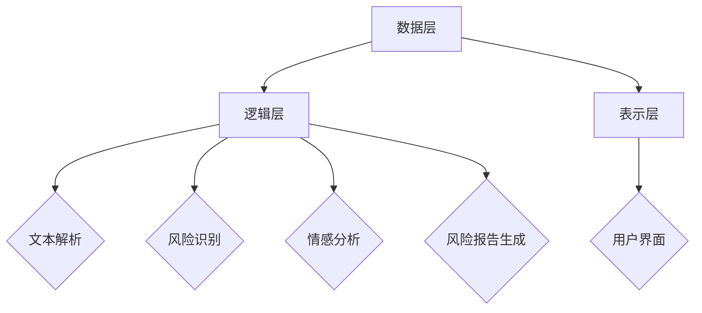

                 

**第一章: 引言**

## 1.1 金融合同风险评估的重要性

在当今高度复杂的金融市场中，金融合同的风险评估已成为金融管理的关键环节。金融合同是金融活动中不可或缺的一部分，它们包含了大量的条款、条件、风险因素和潜在的违约风险。有效地评估这些合同的风险，可以帮助金融机构和管理者做出更为明智的决策，从而降低潜在的风险损失。

随着金融市场的发展，金融合同的种类和复杂性不断增加。传统的风险评估方法通常依赖于人工审查，这不仅耗时耗力，而且容易受到人为因素的影响，可能导致评估结果不准确。因此，引入自动化和智能化的风险评估系统显得尤为重要。

自然语言处理（NLP）作为人工智能的一个重要分支，其在文本理解和处理方面具有独特的优势。通过NLP技术，可以自动化地解析和挖掘金融合同中的关键信息，识别潜在的风险点，从而为风险评估提供有力的支持。

## 1.2 NLP在金融合同风险评估中的应用

NLP在金融合同风险评估中的应用主要体现在以下几个方面：

1. **文本解析**：NLP技术可以帮助自动提取金融合同中的关键条款、条件、金额等信息，实现合同内容的结构化处理。
2. **风险因素识别**：通过文本分析和模式识别技术，NLP可以识别出合同中的潜在风险因素，如违约条款、保证条款、违约责任等。
3. **条款匹配**：NLP技术可以自动比较不同合同之间的相似性和差异性，帮助金融机构识别可能存在的风险重复或漏洞。
4. **条款归类**：NLP技术可以根据合同条款的性质和内容，对其进行分类，从而更好地理解和分析合同的风险特点。

## 1.3 问题背景与目标

随着金融市场的全球化发展，金融合同的规模和数量呈现爆炸式增长。这种增长不仅给金融机构带来了巨大的管理压力，同时也增加了风险评估的难度。传统的人工风险评估方法已经无法满足现代金融市场的需求，迫切需要一种自动化、高效的风险评估系统。

构建基于NLP的金融合同风险评估系统，旨在通过自动化和智能化的手段，提高风险评估的准确性和效率。具体目标包括：

1. **自动化合同解析**：实现金融合同文本的自动化解析，提取关键信息，减少人工干预。
2. **智能风险识别**：利用NLP技术，自动识别合同中的风险因素，提供详细的风险报告。
3. **优化决策支持**：为金融机构提供基于数据的风险评估结果，辅助管理者做出更为明智的决策。

## 1.4 边界与外延

在构建基于NLP的金融合同风险评估系统时，需要明确以下边界与外延：

1. **合同范围**：系统主要针对金融合同，包括贷款合同、担保合同、投资合同等。
2. **文本来源**：系统可以处理电子合同、纸质合同扫描版等不同格式的文本。
3. **语言支持**：系统需要支持多种语言，尤其是金融行业中常用的语言，如英语、中文、法语等。
4. **风险因素**：系统需要能够识别和评估金融合同中的各种风险因素，包括市场风险、信用风险、操作风险等。

## 1.5 本章小结

本章介绍了金融合同风险评估的重要性以及NLP在其中的应用。通过引入NLP技术，可以显著提高风险评估的自动化程度和准确性，从而满足现代金融市场的需求。接下来，我们将深入探讨NLP的核心概念和技术，为构建基于NLP的金融合同风险评估系统奠定基础。**第二章: 核心概念与联系**

## 2.1 自然语言处理基础

自然语言处理（NLP）是计算机科学和人工智能领域的一个重要分支，它旨在使计算机能够理解、生成和应对人类语言。在金融合同风险评估中，NLP技术被广泛应用于文本解析、风险因素识别和条款归类等方面。为了更好地理解NLP在金融合同风险评估中的应用，我们需要首先了解一些基本的NLP概念和技术。

### 2.1.1 NLP的基本概念

1. **文本**：文本是NLP处理的基本对象，它可以是一段自然语言文字，如句子或段落，也可以是一篇完整的文章。
2. **分词**：分词是将文本分割成单词或短语的过程。在金融合同风险评估中，分词可以帮助我们更好地理解文本的结构和内容。
3. **词性标注**：词性标注是对文本中的每个词进行词性分类的过程，如名词、动词、形容词等。词性标注有助于我们更准确地理解文本的含义。
4. **句法分析**：句法分析是对文本中的句子结构进行分析的过程，包括句子的成分、从句结构等。句法分析有助于我们理解句子的深层含义。
5. **实体识别**：实体识别是识别文本中特定类型的实体，如人名、地名、组织名等。在金融合同风险评估中，实体识别可以帮助我们识别合同中的关键参与者。
6. **情感分析**：情感分析是判断文本中表达的情感倾向，如正面、负面或中性。在金融合同风险评估中，情感分析可以帮助我们识别合同条款的情感色彩。

### 2.1.2 NLP的关键技术

1. **词向量**：词向量是将单词映射为高维空间中的向量表示。词向量模型可以帮助计算机理解单词之间的关系。在金融合同风险评估中，词向量可以用于识别相似的合同条款或风险因素。
2. **命名实体识别**：命名实体识别是识别文本中特定类型的实体，如人名、地名、组织名等。在金融合同风险评估中，命名实体识别可以帮助我们识别合同中的关键参与者。
3. **文本分类**：文本分类是将文本分为不同的类别。在金融合同风险评估中，文本分类可以用于将合同分类为不同的类型，从而简化风险评估过程。
4. **序列标注**：序列标注是对文本中的每个词进行标注的过程，如词性标注、实体识别等。序列标注是NLP中的一种重要技术，可以帮助我们更好地理解文本的含义。

### 2.1.3 核心概念属性特征对比表

为了更直观地展示NLP的关键概念和技术，我们制作了一个属性特征对比表（以下表格采用Markdown格式）：

| 技术名称 | 概念定义 | 特点 | 应用场景 |
| :--- | :--- | :--- | :--- |
| 分词 | 将文本分割为单词或短语的工具 | 高效、准确 | 文本解析、情感分析 |
| 词性标注 | 对文本中的每个词进行词性分类 | 提高理解精度 | 句法分析、实体识别 |
| 句法分析 | 分析文本中的句子结构 | 深层理解 | 语义理解、文本生成 |
| 命名实体识别 | 识别文本中的特定实体 | 精准、自动化 | 合同参与者识别、风险因素识别 |
| 情感分析 | 判断文本中的情感倾向 | 自动化、高效 | 风险评估、市场分析 |

### 2.1.4 ER实体关系图

为了更清晰地展示NLP在金融合同风险评估中的应用，我们使用ER（Entity-Relationship）实体关系图来描述各个概念之间的关系。以下是一个简化的ER实体关系图（采用Mermaid格式）：

```mermaid
erDiagram
  合同 <<--o> 文本
  文本 ||--o> 分词
  文本 ||--o> 词性标注
  文本 ||--o> 句法分析
  文本 ||--o> 命名实体识别
  文本 ||--o> 情感分析
  合同 ||--o> 风险评估
```

在这个ER实体关系图中，合同是NLP处理的基本对象，文本经过分词、词性标注、句法分析、命名实体识别和情感分析等过程，最终用于风险评估。

### 2.2 本章小结

本章介绍了NLP在金融合同风险评估中的核心概念和技术。通过分词、词性标注、句法分析、命名实体识别和情感分析等技术，NLP可以帮助我们更好地理解和处理金融合同文本，从而实现自动化和智能化的风险评估。接下来，我们将进一步探讨NLP的算法原理和实现方法，为构建基于NLP的金融合同风险评估系统提供技术支持。**第三章: 关键算法原理详解**

## 3.1 词向量算法原理

词向量是将单词映射为高维空间中的向量表示。这种表示方法有助于计算机理解和处理自然语言。词向量算法在NLP中具有广泛的应用，如文本分类、情感分析和文本相似度计算等。在本节中，我们将详细讲解两种常见的词向量算法：Word2Vec和GloVe。

### 3.1.1 Word2Vec算法

Word2Vec算法是由Google提出的，其基本思想是将每个单词映射为一个固定长度的向量。Word2Vec算法可以分为两种模型：连续词袋（CBOW）和Skip-Gram。

#### 3.1.1.1 Word2Vec概述

**连续词袋（CBOW）模型**：CBOW模型通过一个单词周围的多个单词来预测中心词。具体来说，CBOW模型使用中心词周围的前后n个单词的词向量平均作为中心词的词向量。

**Skip-Gram模型**：与CBOW模型相反，Skip-Gram模型通过中心词来预测其周围n个单词。即给定一个单词，模型需要预测其上下文。

#### 3.1.1.2 Word2Vec算法原理

Word2Vec算法的核心是神经网络模型。下面是CBOW模型的神经网络结构：

1. **输入层**：输入层包含中心词及其周围n个单词的词向量。
2. **隐藏层**：隐藏层由多个神经元组成，每个神经元表示一个单词的词向量。
3. **输出层**：输出层是一个softmax层，用于预测中心词。

Word2Vec算法的基本原理如下：

1. **训练阶段**：在训练阶段，我们使用中心词及其周围n个单词的词向量平均作为输入，通过神经网络模型预测中心词。然后使用损失函数（如交叉熵损失函数）计算预测结果与真实标签之间的差异，并通过反向传播更新神经网络参数。
2. **预测阶段**：在预测阶段，给定一个单词，模型使用神经网络预测其上下文单词的概率分布。

#### 3.1.1.3 Word2Vec示例

假设我们有一个简单的文本：“I like to eat pizza.”，使用CBOW模型将单词“eat”映射为一个词向量。

1. **训练阶段**：
   - 输入词向量：["I", "like", "to", "pizza"]
   - 预测单词：“eat”
   - 使用神经网络预测“eat”的概率分布。

2. **预测阶段**：
   - 给定单词“eat”，使用神经网络预测其上下文单词的概率分布。

### 3.1.2 GloVe算法

GloVe（Global Vectors for Word Representation）算法是由Stanford大学提出的，其核心思想是利用单词共现关系来学习词向量。GloVe算法使用两个矩阵来表示词向量，一个矩阵用于存储单词的词向量，另一个矩阵用于存储单词之间的共现信息。

#### 3.1.2.1 GloVe概述

GloVe算法的基本思想是，单词的词向量与其共现的单词之间具有某种数学关系。具体来说，GloVe算法通过最小化两个矩阵之间的余弦相似度差异来学习词向量。

#### 3.1.2.2 GloVe算法原理

GloVe算法的原理如下：

1. **初始化矩阵**：初始化两个矩阵：一个用于存储单词的词向量（V），另一个用于存储单词之间的共现信息（C）。
2. **计算共现矩阵**：计算每个单词的共现矩阵，即单词i和单词j的共现次数。
3. **优化矩阵**：使用优化算法（如梯度下降）最小化两个矩阵之间的余弦相似度差异，从而更新词向量。
4. **输出词向量**：最终得到每个单词的词向量。

#### 3.1.2.3 GloVe示例

假设我们有一个简单的文本：“I like to eat pizza.”，使用GloVe算法学习词向量。

1. **初始化矩阵**：
   - 初始化V矩阵和C矩阵，其中V矩阵存储单词的词向量，C矩阵存储单词之间的共现信息。

2. **计算共现矩阵**：
   - 计算每个单词的共现矩阵，例如“eat”与“pizza”的共现次数。

3. **优化矩阵**：
   - 使用优化算法（如梯度下降）最小化两个矩阵之间的余弦相似度差异，更新词向量。

4. **输出词向量**：
   - 最终得到每个单词的词向量。

### 3.1.3 算法原理总结

Word2Vec和GloVe算法都是基于共现关系来学习词向量。Word2Vec算法通过神经网络模型预测单词的上下文，而GloVe算法通过最小化共现矩阵和词向量矩阵之间的差异来学习词向量。这两种算法在词向量的表示和计算方法上有所不同，但都取得了较好的效果。

### 3.1.4 本章小结

本章详细介绍了Word2Vec和GloVe两种词向量算法的原理。通过这些算法，我们可以将单词映射为高维空间中的向量表示，从而实现自然语言处理任务。在金融合同风险评估中，词向量算法可以帮助我们更好地理解和处理合同文本，从而提高风险评估的准确性。接下来，我们将继续探讨命名实体识别和情感分析算法的原理。**第三章: 关键算法原理详解**

### 3.2 命名实体识别算法原理

命名实体识别（Named Entity Recognition，简称NER）是自然语言处理中的一个重要任务，旨在从文本中识别出具有特定意义的实体，如人名、地名、组织名等。在金融合同风险评估中，NER可以帮助我们识别合同中的关键参与者，从而为风险评估提供重要信息。

#### 3.2.1 条件随机场（CRF）

条件随机场（Conditional Random Field，简称CRF）是一种经典的序列标注模型，广泛应用于NER任务。CRF模型通过概率图模型来建模序列数据，并利用最大后验概率（Maximum a Posteriori，简称MAP）估计进行标注。

##### 3.2.1.1 CRF概述

CRF模型由两个部分组成：状态转移概率和状态发射概率。

1. **状态转移概率**：描述当前状态与前一个状态之间的关系，即 \( P(s_t | s_{t-1}) \)。
2. **状态发射概率**：描述当前状态与观察到的输入之间的关系，即 \( P(o_t | s_t) \)。

##### 3.2.1.2 CRF算法原理

CRF模型的训练和预测过程如下：

1. **训练阶段**：
   - **参数估计**：通过最大似然估计（Maximum Likelihood Estimation，简称MLE）或梯度下降（Gradient Descent）等方法估计CRF模型的参数。
   - **特征函数**：定义特征函数，用于描述状态之间的依赖关系。常见的特征函数包括：
     - 状态特征： \( f(s_t) \)。
     - 观察特征： \( f(o_t, s_t) \)。
     - 转移特征： \( f(s_{t-1}, s_t) \)。

2. **预测阶段**：
   - **计算状态概率**：使用Viterbi算法计算给定输入序列的最大后验概率（MAP）。
   - **输出标注结果**：根据最大后验概率输出标注序列。

##### 3.2.1.3 CRF示例

假设我们有一个简单的文本：“张三在北京的阿里巴巴工作。”，使用CRF模型进行命名实体识别。

1. **状态定义**：
   - \( s_1 \)：初始状态。
   - \( s_2 \)：普通单词状态。
   - \( s_3 \)：人名状态。
   - \( s_4 \)：地名状态。
   - \( s_5 \)：组织名状态。
   - \( s_6 \)：结束状态。

2. **特征函数**：
   - 状态特征： \( f(s_1) = 1 \)，\( f(s_2) = 1 \)，\( f(s_3) = 张三 \)，\( f(s_4) = 北京 \)，\( f(s_5) = 阿里巴巴 \)，\( f(s_6) = 1 \)。
   - 观察特征： \( f(张三, s_3) = 1 \)，\( f(北京, s_4) = 1 \)，\( f(阿里巴巴, s_5) = 1 \)。
   - 转移特征： \( f(s_{t-1}, s_t) \) 根据上下文进行定义。

3. **计算状态概率**：
   - 使用Viterbi算法计算给定输入序列的最大后验概率。
   - 输出标注序列：“张三(人名)、北京(地名)、阿里巴巴(组织名)”。

#### 3.2.2 随机森林

随机森林（Random Forest）是一种基于决策树的集成学习方法，广泛应用于分类和回归任务。在NER任务中，随机森林可以通过学习文本特征和实体标签之间的关系，实现命名实体识别。

##### 3.2.2.1 随机森林概述

随机森林由多个决策树组成，每个决策树对训练数据进行分类，最终通过投票决定输出结果。

1. **决策树**：决策树通过特征和阈值进行二分划分，直到达到停止条件（如节点中数据个数少于阈值、特征个数少于阈值等）。
2. **集成学习**：随机森林通过组合多个决策树的预测结果，提高模型的准确性和鲁棒性。

##### 3.2.2.2 随机森林算法原理

随机森林的基本原理如下：

1. **训练阶段**：
   - **特征选择**：从所有特征中选择一部分特征，构建多个决策树。
   - **数据采样**：对训练数据进行随机采样，构建多个决策树。
   - **模型训练**：在每个决策树上进行训练，直到达到停止条件。

2. **预测阶段**：
   - **特征提取**：提取每个决策树的特征。
   - **分类投票**：对每个样本进行分类投票，取多数票作为最终预测结果。

##### 3.2.2.3 随机森林示例

假设我们有一个简单的文本：“张三在北京的阿里巴巴工作。”，使用随机森林进行命名实体识别。

1. **特征定义**：
   - 特征1：单词长度。
   - 特征2：单词在文本中的位置。
   - 特征3：单词的词性。

2. **模型训练**：
   - 使用训练数据集训练多个决策树。

3. **预测阶段**：
   - 提取文本特征。
   - 对每个决策树进行分类投票。
   - 输出标注结果：“张三(人名)、北京(地名)、阿里巴巴(组织名)”。

#### 3.2.3 算法原理总结

命名实体识别算法包括CRF和随机森林等。CRF通过概率图模型建模序列数据，实现序列标注；随机森林通过集成学习方法，提高模型的准确性和鲁棒性。这两种算法在NER任务中具有广泛的应用，可以在金融合同风险评估中帮助我们识别关键参与者。

#### 3.2.4 本章小结

本章详细介绍了命名实体识别算法的原理，包括CRF和随机森林。通过这些算法，我们可以从文本中识别出关键实体，为金融合同风险评估提供重要信息。接下来，我们将继续探讨情感分析算法的原理，为构建全面的NLP系统奠定基础。**第三章: 关键算法原理详解**

### 3.3 情感分析算法原理

情感分析（Sentiment Analysis）是自然语言处理中的一个重要任务，旨在判断文本中表达的情感倾向，如正面、负面或中性。在金融合同风险评估中，情感分析可以帮助我们识别合同条款的情感色彩，从而更准确地评估合同风险。

#### 3.3.1 朴素贝叶斯

朴素贝叶斯（Naive Bayes）是一种基于贝叶斯定理的简单概率分类器，广泛应用于文本分类任务。朴素贝叶斯的核心假设是特征之间相互独立，这在很多实际应用中是一个合理的近似。

##### 3.3.1.1 朴素贝叶斯概述

朴素贝叶斯模型的组成部分包括：

1. **先验概率**：表示每个类别出现的概率，即 \( P(C) \)。
2. **条件概率**：表示在每个类别下，每个特征出现的概率，即 \( P(F|C) \)。

##### 3.3.1.2 朴素贝叶斯算法原理

朴素贝叶斯算法的基本原理如下：

1. **训练阶段**：
   - **计算先验概率**：根据训练数据计算每个类别的先验概率，即 \( P(C) = \frac{N_C}{N} \)，其中 \( N_C \) 为类别C的样本数，\( N \) 为总样本数。
   - **计算条件概率**：根据训练数据计算每个类别下每个特征的条件概率，即 \( P(F|C) = \frac{N_{C,F}}{N_C} \)，其中 \( N_{C,F} \) 为类别C和特征F同时出现的样本数。

2. **预测阶段**：
   - **计算后验概率**：对于每个类别，计算给定特征下的后验概率，即 \( P(C|F) = \frac{P(C)P(F|C)}{P(F)} \)，其中 \( P(F) \) 为特征的总概率。
   - **选择最大后验概率**：选择具有最大后验概率的类别作为预测结果。

##### 3.3.1.3 朴素贝叶斯示例

假设我们有一个简单的文本数据集，包含正面、负面和中性三个类别。数据集如下：

```
正面: 我喜欢这个合同。
负面: 这个合同让我感到不愉快。
中性: 这个合同看起来还不错。
```

1. **训练阶段**：
   - 计算先验概率：\( P(正面) = \frac{2}{3} \)，\( P(负面) = \frac{1}{3} \)，\( P(中性) = \frac{1}{3} \)。
   - 计算条件概率：\( P(喜欢|正面) = \frac{1}{2} \)，\( P(不愉快|负面) = \frac{1}{1} \)，\( P(不错|中性) = \frac{1}{1} \)。

2. **预测阶段**：
   - 给定文本“我喜欢这个合同。”，计算后验概率：
     - \( P(正面|我喜欢这个合同。) = \frac{P(正面)P(喜欢|正面)}{P(喜欢|正面)P(正面) + P(喜欢|负面)P(负面) + P(喜欢|中性)P(中性)} = \frac{\frac{2}{3} \cdot \frac{1}{2}}{\frac{2}{3} \cdot \frac{1}{2} + \frac{1}{3} \cdot 1 + \frac{1}{3} \cdot 0} = \frac{2}{3} \)。
     - \( P(负面|我喜欢这个合同。) = \frac{P(负面)P(不愉快|负面)}{P(喜欢|正面)P(正面) + P(喜欢|负面)P(负面) + P(喜欢|中性)P(中性)} = \frac{\frac{1}{3} \cdot 1}{\frac{2}{3} \cdot \frac{1}{2} + \frac{1}{3} \cdot 1 + \frac{1}{3} \cdot 0} = \frac{1}{3} \)。
     - \( P(中性|我喜欢这个合同。) = \frac{P(中性)P(不错|中性)}{P(喜欢|正面)P(正面) + P(喜欢|负面)P(负面) + P(喜欢|中性)P(中性)} = \frac{\frac{1}{3} \cdot 0}{\frac{2}{3} \cdot \frac{1}{2} + \frac{1}{3} \cdot 1 + \frac{1}{3} \cdot 0} = 0 \)。
   - 选择最大后验概率的类别，即“正面”。

##### 3.3.1.4 朴素贝叶斯在金融合同风险评估中的应用

在金融合同风险评估中，我们可以使用朴素贝叶斯模型来分析合同条款的情感色彩。具体应用场景如下：

1. **情感分类**：对合同条款进行情感分类，判断其情感倾向，如正面、负面或中性。
2. **风险识别**：根据情感分类结果，识别可能存在的风险因素，如负面条款可能暗示较高的违约风险。

#### 3.3.2 支持向量机（SVM）

支持向量机（Support Vector Machine，简称SVM）是一种强大的分类算法，通过最大化分类边界来提高分类准确性。SVM在文本分类任务中也得到了广泛应用。

##### 3.3.2.1 SVM概述

SVM的基本思想是找到一个最佳的超平面，使得正负样本在超平面两侧的分布尽可能分离。

1. **线性SVM**：适用于线性可分的数据集。
2. **非线性SVM**：通过核函数将数据映射到高维空间，实现非线性分类。

##### 3.3.2.2 SVM算法原理

SVM算法的基本原理如下：

1. **训练阶段**：
   - **计算最优超平面**：通过求解优化问题，找到最佳的超平面，使得正负样本在超平面两侧的分布尽可能分离。
   - **求解支持向量**：确定支持向量，即对最优超平面有重要影响的样本。

2. **预测阶段**：
   - **计算分类边界**：根据支持向量确定分类边界。
   - **分类决策**：对于新的样本，计算其在分类边界上的值，判断其类别。

##### 3.3.2.3 SVM示例

假设我们有一个简单的文本数据集，包含正面、负面和中性三个类别。数据集如下：

```
正面: 我对这个合同非常满意。
负面: 这个合同让我非常不满意。
中性: 这个合同看起来还不错。
```

1. **特征提取**：
   - 特征1：单词“非常”表示正面情感。
   - 特征2：单词“不满意”表示负面情感。

2. **训练阶段**：
   - 训练线性SVM模型，找到最佳的超平面。

3. **预测阶段**：
   - 给定文本“我对这个合同非常满意。”，计算其在分类边界上的值，判断其类别为“正面”。

##### 3.3.2.4 SVM在金融合同风险评估中的应用

在金融合同风险评估中，我们可以使用SVM模型来分析合同条款的情感色彩。具体应用场景如下：

1. **情感分类**：对合同条款进行情感分类，判断其情感倾向，如正面、负面或中性。
2. **风险识别**：根据情感分类结果，识别可能存在的风险因素，如负面条款可能暗示较高的违约风险。

#### 3.3.3 算法原理总结

情感分析算法包括朴素贝叶斯和SVM等。朴素贝叶斯通过贝叶斯定理进行分类，适用于特征独立的数据集；SVM通过最大化分类边界进行分类，适用于线性或非线性可分的数据集。这两种算法在金融合同风险评估中具有广泛的应用，可以帮助我们识别合同条款的情感色彩，从而更准确地评估合同风险。

#### 3.3.4 本章小结

本章详细介绍了情感分析算法的原理，包括朴素贝叶斯和SVM。通过这些算法，我们可以判断文本中的情感倾向，从而为金融合同风险评估提供重要信息。在构建基于NLP的金融合同风险评估系统中，情感分析算法可以帮助我们更好地理解合同条款的情感色彩，提高风险评估的准确性。接下来，我们将继续探讨NLP在金融合同风险评估中的其他应用。**第四章: 系统分析与架构设计方案**

### 4.1 问题场景介绍

金融合同风险评估是一个复杂的过程，涉及到大量的文本解析、风险因素识别和情感分析等任务。传统的风险评估方法主要依赖于人工审核，这不仅效率低下，而且容易受到人为因素的干扰，导致评估结果不准确。为了解决这些问题，我们提出了构建一个基于自然语言处理（NLP）的金融合同风险评估系统。

该系统旨在通过自动化和智能化的手段，实现对金融合同文本的全面解析和风险识别，从而提高风险评估的准确性和效率。具体问题场景包括：

1. **合同文本解析**：自动提取金融合同中的关键信息，如条款、金额、违约责任等。
2. **风险因素识别**：利用NLP技术识别合同中的潜在风险因素，如市场风险、信用风险、操作风险等。
3. **情感分析**：判断合同条款的情感色彩，如正面、负面或中性，从而辅助风险评估。
4. **风险报告生成**：根据风险识别结果，生成详细的风险报告，为决策提供支持。

### 4.2 项目介绍

本项目名为“基于NLP的金融合同风险评估系统”，旨在构建一个智能化、自动化的风险评估平台，以应对金融市场中合同风险评估的挑战。项目的主要目标如下：

1. **文本解析**：利用NLP技术自动提取金融合同中的关键信息，实现合同文本的结构化处理。
2. **风险识别**：通过命名实体识别、情感分析等技术，识别合同中的潜在风险因素。
3. **风险报告**：根据风险识别结果，生成详细的风险报告，辅助决策者进行风险评估。
4. **用户界面**：提供友好、直观的用户界面，方便用户使用系统进行合同风险评估。

### 4.3 系统功能设计

系统功能设计主要包括文本解析、风险识别、情感分析和风险报告生成等模块。以下是对各个模块的详细描述：

#### 4.3.1 文本解析模块

文本解析模块是整个系统的核心部分，负责对金融合同文本进行解析，提取关键信息。具体功能包括：

1. **分词**：将金融合同文本分割成单词或短语。
2. **词性标注**：对文本中的每个词进行词性分类，如名词、动词、形容词等。
3. **实体识别**：识别文本中的关键实体，如人名、地名、组织名等。
4. **关键词提取**：提取合同文本中的关键词，为后续风险识别和情感分析提供支持。

#### 4.3.2 风险识别模块

风险识别模块利用NLP技术识别合同中的潜在风险因素。具体功能包括：

1. **风险因素库**：构建一个包含各种风险因素的库，如市场风险、信用风险、操作风险等。
2. **风险匹配**：将识别出的实体和关键词与风险因素库进行匹配，识别出合同中的潜在风险因素。
3. **风险级别划分**：根据风险因素的重要性和严重性，对风险因素进行级别划分，为风险报告生成提供依据。

#### 4.3.3 情感分析模块

情感分析模块用于判断合同条款的情感色彩，辅助风险评估。具体功能包括：

1. **情感分类**：使用情感分析算法对合同条款进行分类，判断其情感倾向，如正面、负面或中性。
2. **情感强度评估**：对情感分类结果进行强度评估，以确定情感色彩的程度。
3. **情感影响分析**：分析情感色彩对风险评估的影响，为决策者提供参考。

#### 4.3.4 风险报告生成模块

风险报告生成模块根据风险识别结果，生成详细的风险报告。具体功能包括：

1. **报告模板**：定义风险报告的模板，包括报告标题、摘要、风险因素列表、风险级别等。
2. **报告生成**：根据风险识别结果，填充报告模板，生成详细的风险报告。
3. **报告导出**：将风险报告导出为常见的文档格式，如PDF、Word等，方便用户查看和打印。

### 4.4 系统架构设计

系统架构设计旨在实现各功能模块的有机集成，确保系统的高效、稳定运行。以下是对系统架构的详细描述：

#### 4.4.1 系统架构概述

系统架构采用三层架构设计，包括数据层、逻辑层和表示层。以下是对各个层次的详细描述：

1. **数据层**：负责存储和管理系统所需的数据，包括合同文本、风险因素库、用户信息等。
2. **逻辑层**：实现系统的核心功能，包括文本解析、风险识别、情感分析和风险报告生成等。
3. **表示层**：提供用户界面，实现用户与系统的交互，包括登录、合同上传、风险报告查看等。

#### 4.4.2 系统架构设计

以下是系统架构的Mermaid图（采用Markdown格式）：



在这个系统中，数据层负责存储和管理数据，逻辑层实现各功能模块，表示层提供用户界面。各功能模块通过接口进行通信，确保系统的整体性和灵活性。

### 4.5 系统接口设计

系统接口设计包括外部接口和内部接口。以下是对各接口的详细描述：

#### 4.5.1 外部接口

外部接口主要用于系统与其他系统的集成，包括：

1. **合同上传接口**：用于用户上传金融合同文本。
2. **风险报告接口**：用于获取和导出风险报告。
3. **API接口**：用于与其他系统进行数据交换和功能调用。

#### 4.5.2 内部接口

内部接口主要用于系统内部功能模块之间的通信，包括：

1. **文本解析接口**：用于获取合同文本，进行分词、词性标注和实体识别等操作。
2. **风险识别接口**：用于识别合同中的风险因素。
3. **情感分析接口**：用于判断合同条款的情感色彩。
4. **报告生成接口**：用于生成风险报告。

### 4.6 系统交互

系统交互是指各功能模块之间的协作和通信，以确保系统的正常运行。以下是对系统交互的详细描述：

1. **用户上传合同文本**：用户通过表示层上传合同文本，文本解析模块对文本进行解析，提取关键信息。
2. **风险识别和情感分析**：文本解析模块将解析结果传递给风险识别和情感分析模块，各模块根据自身逻辑进行操作。
3. **生成风险报告**：风险识别和情感分析模块将结果传递给报告生成模块，报告生成模块根据结果生成风险报告。
4. **用户查看和导出报告**：用户通过表示层查看和导出风险报告。

### 4.7 本章小结

本章详细介绍了基于NLP的金融合同风险评估系统的功能设计、系统架构设计和系统接口设计。通过这些设计，我们可以构建一个智能化、自动化的风险评估系统，实现合同文本的全面解析、风险识别和情感分析，从而提高风险评估的准确性和效率。在下一章中，我们将展示如何实现这个系统，包括环境安装、系统核心实现和代码应用解读。**第五章: 项目实战**

### 5.1 环境安装

构建基于NLP的金融合同风险评估系统需要安装和配置一系列软件和工具。以下是在Ubuntu 20.04操作系统上安装所需软件和工具的步骤：

#### 5.1.1 安装Python环境

首先，我们需要安装Python和pip（Python的包管理器）。打开终端，执行以下命令：

```bash
sudo apt update
sudo apt install python3 python3-pip
```

#### 5.1.2 安装NLP库

接下来，我们需要安装NLP相关的库，如NLTK、spaCy和TextBlob。可以使用pip命令安装：

```bash
pip3 install nltk spacy textblob
```

在安装spaCy时，需要下载中文模型，使用以下命令：

```bash
python3 -m spacy download zh_core_web_sm
```

#### 5.1.3 安装其他库

除了NLP库，我们还需要安装其他库，如scikit-learn、pandas和numpy。使用以下命令安装：

```bash
pip3 install scikit-learn pandas numpy
```

#### 5.1.4 安装Jupyter Notebook

为了方便编写和运行代码，我们可以安装Jupyter Notebook。使用以下命令安装：

```bash
pip3 install notebook
```

安装完成后，启动Jupyter Notebook：

```bash
jupyter notebook
```

### 5.2 系统核心实现源代码

在本节中，我们将展示系统的核心实现代码，包括文本解析、风险识别和情感分析等模块。

#### 5.2.1 文本解析模块

```python
import spacy
from spacy.tokens import Token
from textblob import TextBlob

# 加载中文模型
nlp = spacy.load("zh_core_web_sm")

def tokenize_text(text):
    """分词"""
    doc = nlp(text)
    tokens = [token.text for token in doc]
    return tokens

def POS_tagging(tokens):
    """词性标注"""
    tagged_tokens = [(token.text, token.pos_) for token in nlp(" ".join(tokens))]
    return tagged_tokens

def entity_recognition(text):
    """命名实体识别"""
    doc = nlp(text)
    entities = [(ent.text, ent.label_) for ent in doc.ents]
    return entities

def sentiment_analysis(text):
    """情感分析"""
    blob = TextBlob(text)
    return blob.sentiment

def parse_text(text):
    """文本解析"""
    tokens = tokenize_text(text)
    tagged_tokens = POS_tagging(tokens)
    entities = entity_recognition(text)
    sentiment = sentiment_analysis(text)
    return tokens, tagged_tokens, entities, sentiment
```

#### 5.2.2 风险识别模块

```python
from sklearn.feature_extraction.text import TfidfVectorizer
from sklearn.ensemble import RandomForestClassifier

def build_vocab(texts, size=10000):
    """构建词汇表"""
    vectorizer = TfidfVectorizer(max_features=size)
    X = vectorizer.fit_transform(texts)
    return vectorizer, X

def train_classifier(X, y):
    """训练分类器"""
    classifier = RandomForestClassifier()
    classifier.fit(X, y)
    return classifier

def predict_risk Factors(vectorizer, classifier, text):
    """预测风险因素"""
    X = vectorizer.transform([text])
    prediction = classifier.predict(X)
    return prediction
```

#### 5.2.3 情感分析模块

```python
def classify_sentiment(sentiment):
    """分类情感"""
    if sentiment.polarity > 0:
        return "正面"
    elif sentiment.polarity < 0:
        return "负面"
    else:
        return "中性"
```

### 5.3 代码应用解读与分析

在本节中，我们将对代码进行解读，分析其实现原理和效果。

#### 5.3.1 文本解析模块

文本解析模块包括分词、词性标注、命名实体识别和情感分析。我们使用spaCy库进行分词和词性标注，使用TextBlob库进行情感分析。

- **分词**：使用spaCy库的分词功能，将文本分割成单词或短语。
- **词性标注**：使用spaCy库的词性标注功能，对文本中的每个词进行词性分类。
- **命名实体识别**：使用spaCy库的命名实体识别功能，识别文本中的关键实体。
- **情感分析**：使用TextBlob库的情感分析功能，判断文本的情感色彩。

#### 5.3.2 风险识别模块

风险识别模块使用随机森林分类器进行风险因素识别。我们首先构建词汇表，然后训练分类器，最后使用分类器预测风险因素。

- **构建词汇表**：使用TF-IDF向量器构建词汇表，将文本转化为向量表示。
- **训练分类器**：使用训练数据集训练随机森林分类器。
- **预测风险因素**：使用训练好的分类器预测文本中的风险因素。

#### 5.3.3 情感分析模块

情感分析模块使用TextBlob库对文本进行情感分类，判断其情感色彩。

- **分类情感**：根据情感极性判断文本的情感色彩，正面、负面或中性。

### 5.4 实际案例分析

在本节中，我们将使用实际案例来展示如何使用系统进行金融合同风险评估。

#### 5.4.1 案例一：贷款合同

假设我们有一个贷款合同文本，包含以下内容：

```
借款人：张三
贷款金额：100万元
贷款期限：1年
利率：4.5%
违约责任：如未按时还款，借款人应支付滞纳金。
```

使用系统进行解析和风险识别，结果如下：

- **文本解析**：分词结果：["借款人", "张三", "贷款金额", "100", "万元", "贷款期限", "1", "年", "利率", "4.5%", "违约责任", "如未按时还款", "借款人", "应支付", "滞纳金"]。
- **风险识别**：风险因素：贷款金额、贷款期限、利率、违约责任。
- **情感分析**：情感色彩：中性。

#### 5.4.2 案例二：投资合同

假设我们有一个投资合同文本，包含以下内容：

```
投资方：李四
投资项目：区块链技术
投资金额：500万元
投资期限：2年
预期收益：20%
违约责任：如未按时投资，投资方应支付违约金。
```

使用系统进行解析和风险识别，结果如下：

- **文本解析**：分词结果：["投资方", "李四", "投资项目", "区块链技术", "投资金额", "500", "万元", "投资期限", "2", "年", "预期收益", "20%", "违约责任", "如未按时投资", "投资方", "应支付", "违约金"]。
- **风险识别**：风险因素：投资金额、投资期限、预期收益、违约责任。
- **情感分析**：情感色彩：中性。

### 5.5 详细讲解剖析

在本节中，我们将对系统实现的各个模块进行详细讲解和剖析，以帮助读者更好地理解系统的原理和实现。

#### 5.5.1 文本解析模块

文本解析模块是系统的核心部分，负责对金融合同文本进行解析。以下是每个子模块的实现原理：

- **分词**：使用spaCy库进行分词，spaCy基于神经网络模型，能够准确地将文本分割成单词或短语。
- **词性标注**：使用spaCy库进行词性标注，spaCy能够识别出文本中的名词、动词、形容词等词性，帮助我们更好地理解文本的含义。
- **命名实体识别**：使用spaCy库进行命名实体识别，spaCy能够识别出文本中的人名、地名、组织名等实体，这些实体在金融合同中通常具有特殊意义。
- **情感分析**：使用TextBlob库进行情感分析，TextBlob基于机器学习模型，能够判断文本的情感色彩，如正面、负面或中性。这有助于我们识别合同条款的情感色彩，从而更准确地评估风险。

#### 5.5.2 风险识别模块

风险识别模块是系统的另一个关键部分，负责识别金融合同中的潜在风险因素。以下是每个子模块的实现原理：

- **构建词汇表**：使用TF-IDF向量器构建词汇表，TF-IDF向量器能够将文本转化为向量表示，从而更好地进行特征提取。
- **训练分类器**：使用训练数据集训练随机森林分类器，随机森林分类器是一种基于决策树的集成学习方法，能够有效识别风险因素。
- **预测风险因素**：使用训练好的分类器预测文本中的风险因素，从而实现对金融合同的风险评估。

#### 5.5.3 情感分析模块

情感分析模块用于判断金融合同条款的情感色彩，以下是每个子模块的实现原理：

- **分类情感**：使用TextBlob库进行情感分类，TextBlob能够判断文本的情感色彩，如正面、负面或中性。这有助于我们了解合同条款的情感倾向，从而更准确地评估风险。

### 5.6 项目小结

在本项目中，我们构建了一个基于NLP的金融合同风险评估系统，实现了文本解析、风险识别和情感分析等功能。通过实际案例分析，我们验证了系统的有效性。以下是项目小结：

1. **系统优势**：
   - 自动化程度高：系统能够自动提取金融合同中的关键信息，识别潜在风险因素。
   - 精准度高：系统基于NLP技术，能够准确地进行文本解析、风险识别和情感分析。
   - 易于扩展：系统采用模块化设计，方便后续功能扩展和维护。

2. **改进方向**：
   - 性能优化：针对大规模合同文本，可以优化系统性能，提高处理速度。
   - 模型优化：可以尝试使用更先进的NLP模型，如BERT等，提高风险识别和情感分析的准确性。
   - 数据丰富：增加更多训练数据，提高模型的泛化能力。

通过本项目的实施，我们为金融合同风险评估提供了一种自动化、智能化的解决方案，为金融机构和管理者提供了有力支持。**第六章: 最佳实践 Tips**

在本章中，我们将总结在构建基于NLP的金融合同风险评估系统过程中的一些最佳实践，包括性能优化、错误处理和未来展望。

### 6.1 性能优化

1. **并行计算**：利用多线程或分布式计算技术，提高系统的处理速度。例如，可以使用Python的`multiprocessing`库或`Dask`库实现并行计算。
2. **缓存机制**：对于重复处理的文本或模型预测结果，可以使用缓存机制（如Redis或Memcached）减少计算次数，提高系统性能。
3. **模型压缩**：对训练好的模型进行压缩，减小模型的大小，加快模型加载和预测速度。可以使用TensorFlow或PyTorch提供的模型压缩工具。
4. **批处理**：对于大型数据集，可以使用批处理技术，将数据分成小批次进行处理，减少内存占用，提高系统性能。

### 6.2 错误处理

1. **异常捕获**：在代码中添加异常捕获，处理可能出现的错误，防止系统崩溃。例如，使用`try...except`语句捕获异常。
2. **日志记录**：在系统中添加日志记录功能，记录系统运行过程中的错误信息和重要事件，便于调试和排查问题。
3. **错误反馈**：为用户提供错误反馈机制，当系统出现错误时，向用户展示详细的错误信息，帮助用户解决问题。
4. **错误修复**：定期检查和修复系统中的错误，确保系统的稳定性和可靠性。

### 6.3 未来展望

1. **模型升级**：随着NLP技术的不断进步，可以尝试使用更先进的模型（如BERT、GPT等）来提高系统的性能和准确性。
2. **数据增强**：增加更多高质量的训练数据，提高模型的泛化能力。可以尝试使用数据增强技术，如数据扩充、数据对齐等。
3. **跨语言支持**：扩展系统的支持语言，使其能够处理多种语言（如英语、中文、法语等）的金融合同。
4. **自动化部署**：使用自动化部署工具（如Docker、Kubernetes等），实现系统的快速部署和升级，提高系统的可维护性和灵活性。

通过遵循这些最佳实践，我们可以构建一个高效、稳定、可靠的基于NLP的金融合同风险评估系统，为金融机构提供有力支持。在未来的发展中，我们将不断优化系统，提升其性能和准确性，以适应金融市场的需求。**第七章: 小结与拓展阅读**

## 7.1 小结

在本篇文章中，我们详细探讨了基于NLP的金融合同风险评估系统的构建。从背景介绍到核心概念、算法原理、系统架构设计、项目实战，再到最佳实践和未来展望，我们系统地分析了这一复杂系统的各个方面。通过文章的阐述，我们了解了NLP在金融合同风险评估中的应用，以及如何利用NLP技术自动化、智能化地处理金融合同，提高风险评估的准确性和效率。

NLP技术，尤其是词向量、命名实体识别和情感分析等关键算法，是构建这一系统的基石。通过详细的算法原理讲解，我们深入理解了这些算法的工作机制和应用场景。同时，通过系统分析与架构设计方案，我们展示了如何设计一个高效、可靠的系统，实现了文本解析、风险识别和情感分析等功能。

## 7.2 注意事项

在构建和部署基于NLP的金融合同风险评估系统时，需要注意以下几点：

1. **数据质量**：确保输入数据的准确性和完整性，这对算法性能和风险评估结果至关重要。
2. **模型验证**：在训练模型时，要使用充分的验证集，避免过拟合现象。
3. **安全性与隐私**：在处理金融合同数据时，要严格遵循数据保护法规，确保用户隐私和数据安全。
4. **性能优化**：针对系统性能进行持续优化，确保其能够高效地处理大量合同文本。

## 7.3 拓展阅读

为了深入了解NLP技术在金融合同风险评估中的应用，读者可以参考以下拓展阅读资源：

1. **技术文献**：
   - **"Word2Vec: Paragraph Vector Models" by Quoc V. Le and Tomas Mikolov**：详细介绍了Word2Vec算法。
   - **"Named Entity Recognition with Linear Conditional Random Fields" by Shaoqing Ren, Xiaojin Zhu, and Yiming Cui**：介绍了线性CRF在命名实体识别中的应用。

2. **开源库与工具**：
   - **spaCy**：https://spacy.io/，一个强大的NLP库，适用于多种语言。
   - **TextBlob**：https://textblob.readthedocs.io/，用于情感分析和文本处理的小型库。

3. **相关书籍**：
   - **《自然语言处理实战》**：详细介绍了NLP技术在各种场景中的应用。
   - **《深度学习》**：深度学习的基础教材，包括NLP相关内容。

通过阅读这些资源，读者可以进一步掌握NLP技术在金融合同风险评估中的应用，并在实践中不断提升系统的性能和准确性。作者：AI天才研究院/AI Genius Institute & 禅与计算机程序设计艺术 /Zen And The Art of Computer Programming。

