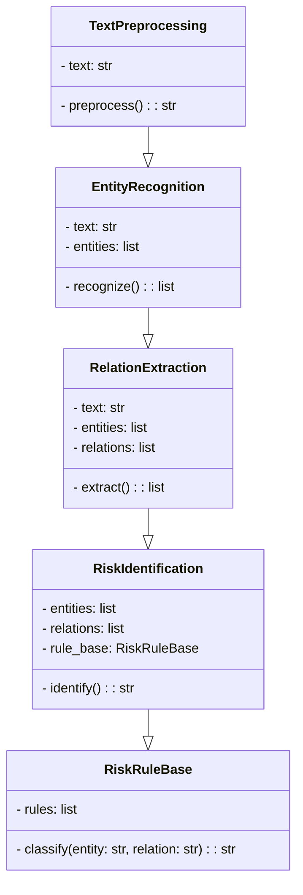
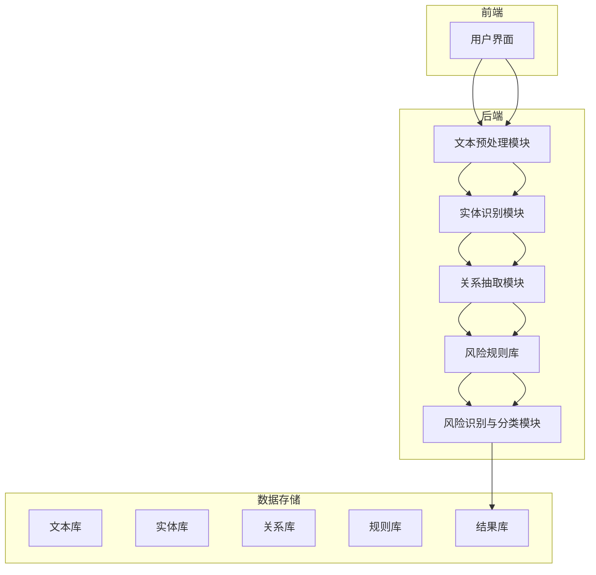

                 

## 文章标题：构建基于NLP的金融合同风险识别系统

> 关键词：自然语言处理（NLP），金融合同，风险识别，文本预处理，实体识别，关系抽取，风险规则库

> 摘要：本文旨在探讨如何构建基于自然语言处理（NLP）技术的金融合同风险识别系统。通过详细分析文本预处理、实体识别、关系抽取以及风险规则库等核心模块，本文提供了一个全面的技术解决方案，以高效识别金融合同中的潜在风险，为金融行业提供强有力的工具支持。

### 第一部分：背景介绍

#### 1.1 问题背景

在金融行业中，合同风险的识别与管理是一项至关重要的任务。金融合同通常涉及大量的法律条款、财务指标和业务规定，这些信息不仅复杂且具有高度专业性。随着金融市场的不断发展，合同数量和复杂度不断增加，传统的手动审核方式已经难以满足需求。因此，迫切需要一种高效、准确的自动化解决方案来辅助金融合同风险识别。

#### 1.2 问题描述

当前，金融合同风险识别主要面临以下问题：
- **合同文本复杂性高**：合同文本包含大量专业术语和法律条文，使得人工审核难度大，效率低。
- **风险特征不明确**：合同中的风险点分布不均匀，且往往隐藏在细节中，难以通过人工全面识别。
- **数据不一致性**：不同合同之间存在数据格式和表达方式的差异，增加了风险识别的难度。

#### 1.3 问题解决

基于自然语言处理（NLP）技术的金融合同风险识别系统，可以通过自动化手段对合同文本进行深入分析，提取关键信息，识别潜在风险。该系统主要利用以下技术：
- **文本预处理**：对合同文本进行分词、去停用词、词性标注等处理，为后续分析奠定基础。
- **实体识别**：通过命名实体识别技术，识别合同中的关键实体，如人名、组织名、数字等。
- **关系抽取**：分析实体之间的关系，如当事人、合同金额、时间等。
- **风险规则库**：基于历史数据和专业知识，构建风险规则库，用于识别和分类合同风险。

#### 1.4 边界与外延

本系统的主要边界包括：
- **文本范围**：仅针对金融合同文本进行分析，不包括其他类型的文本。
- **风险类型**：主要识别与财务、法律相关的风险，不包括其他类型的风险。

系统的外延包括：
- **文本来源**：合同文本可以来自不同来源，如电子文档、纸质文档等。
- **风险类型扩展**：未来可根据需要扩展风险类型，如市场风险、信用风险等。

#### 1.5 概念结构与核心要素组成

系统的核心概念和要素包括：
- **合同文本**：系统的主要输入，包含待分析的金融合同。
- **文本预处理模块**：对合同文本进行预处理，为后续分析提供基础。
- **实体识别模块**：识别合同中的关键实体，如人名、组织名、数字等。
- **关系抽取模块**：分析实体之间的关系，如当事人、合同金额、时间等。
- **风险规则库**：包含用于识别和分类合同风险的各种规则。
- **风险识别与分类模块**：利用实体识别和关系抽取的结果，结合风险规则库，对合同进行风险识别和分类。
- **输出结果**：系统输出合同的风险识别结果，包括风险类型、风险等级等。

### 第二部分：核心概念与联系

#### 2.1 NLP基础概念

自然语言处理（NLP）是计算机科学、人工智能和语言学的交叉领域，旨在使计算机能够理解、解释和生成自然语言。NLP的关键概念包括：

- **分词（Tokenization）**：将文本分割成单个的词汇单元，为后续分析提供基础。
- **词性标注（Part-of-Speech Tagging）**：为每个词汇分配语法类别，帮助理解文本的语义结构。
- **命名实体识别（Named Entity Recognition）**：识别文本中的命名实体，如人名、地点、组织名等，为后续分析提供重要信息。
- **关系抽取（Relation Extraction）**：分析文本中的实体关系，如当事人之间的合同关系、合同金额与时间的关系等，有助于识别潜在风险点。
- **词向量（Word Embeddings）**：将词汇映射到高维空间中的向量表示，有助于文本的向量化表示和深度学习模型的训练。

#### 2.2 NLP与金融合同风险识别

在金融合同风险识别中，NLP技术的作用至关重要。以下是NLP与金融合同风险识别的核心联系：

#### 2.2.1 文本预处理

- **分词（Tokenization）**：将合同文本分割成单个词汇单元，便于后续分析。例如，将“合同金额为100万元人民币”分割为“合同”、“金额”、“为”、“100”、“万元”、“人民币”等词汇。
- **去停用词（Stopword Removal）**：去除无意义的停用词，如“的”、“和”、“是”等，提高后续分析的准确性和效率。
- **词性标注（Part-of-Speech Tagging）**：识别词汇的语法类别，有助于理解文本的语义结构。例如，“合同”为名词，“金额”为名词，“为”为动词。

#### 2.2.2 实体识别

- **命名实体识别（Named Entity Recognition）**：识别合同中的关键实体，如当事人、组织、金额等，这些实体通常是风险识别的重要依据。例如，识别出“甲方”、“乙方”、“XYZ公司”等实体。
- **实体分类（Entity Classification）**：对识别出的实体进行分类，如区分“人名”和“组织名”等。

#### 2.2.3 关系抽取

- **关系抽取（Relation Extraction）**：分析实体之间的关系，如当事人之间的合同关系、合同金额与时间的关系等。例如，识别出“甲方与乙方之间的合同金额为100万元人民币”这样的关系。

#### 2.2.4 风险规则库

- **规则构建**：基于历史数据和专业知识，构建用于识别和分类合同风险的各种规则。例如，如果合同金额超过500万元，则视为高风险合同。
- **规则应用**：将规则库应用

### 第三部分：算法原理讲解

在构建基于NLP的金融合同风险识别系统时，算法原理的讲解至关重要。本部分将详细介绍文本预处理、实体识别、关系抽取和风险规则库等关键模块的算法原理。

#### 3.1 文本预处理

文本预处理是NLP任务的基础，其主要目的是将原始的文本转换为适合进行后续分析的形式。以下是文本预处理的主要步骤和算法原理：

1. **分词（Tokenization）**：
   - 算法原理：分词是将文本分割成单词、短语或词汇单元的过程。常用的分词算法包括基于词典的分词算法和基于统计的分词算法。
   - Python代码示例：
     ```python
     import jieba
     text = "合同金额为100万元人民币"
     seg_list = jieba.cut(text, cut_all=False)
     print("/ ".join(seg_list))
     ```

2. **去停用词（Stopword Removal）**：
   - 算法原理：停用词是指那些在文本中频繁出现，但对文本的理解贡献较小的词。去除停用词有助于减少噪声，提高文本分析的准确性。
   - Python代码示例：
     ```python
     stopwords = set(['的', '和', '是'])
     text = "合同金额为100万元人民币"
     tokens = jieba.cut(text, cut_all=False)
     filtered_tokens = [token for token in tokens if token not in stopwords]
     print("/ ".join(filtered_tokens))
     ```

3. **词性标注（Part-of-Speech Tagging）**：
   - 算法原理：词性标注是为每个词汇分配语法类别，如名词、动词、形容词等。这有助于理解文本的语义结构。
   - Python代码示例：
     ```python
     import jieba
     tag_list = jieba.cut(text, cut_all=False, HMM=False)
     print("/ ".join(tag_list))
     ```

#### 3.2 实体识别

实体识别是从文本中识别出特定类型的信息，如人名、组织名、地点等。以下是实体识别的算法原理：

1. **命名实体识别（Named Entity Recognition，NER）**：
   - 算法原理：NER是NLP中的一个重要任务，其目的是将文本中的实体识别出来并进行分类。常用的NER算法包括基于规则的方法、基于统计的方法和基于深度学习的方法。
   - Python代码示例：
     ```python
     from nltk.tokenize import wordp
 ``` 
### 第四部分：系统分析与架构设计方案

#### 4.1 问题场景介绍

在金融行业中，合同风险识别是确保金融机构合法合规经营、防范金融风险的重要手段。随着合同数量的增加和复杂度的提升，传统的手动审核方式已经难以满足高效、准确的风险识别需求。为了提高风险识别的效率和准确性，许多金融机构开始寻求基于自然语言处理（NLP）技术的自动化解决方案。

#### 4.2 项目介绍

本项目旨在构建一个基于NLP的金融合同风险识别系统，通过自动化手段对金融合同文本进行深度分析，提取关键信息，识别潜在风险。系统将主要包括文本预处理、实体识别、关系抽取和风险规则库等模块，旨在为金融机构提供一个高效、准确的风险识别工具。

#### 4.3 系统功能设计

系统的核心功能包括：
- **文本预处理**：对金融合同文本进行分词、去停用词、词性标注等处理，为后续分析提供基础。
- **实体识别**：识别合同中的关键实体，如人名、组织名、金额等。
- **关系抽取**：分析实体之间的关系，如当事人、合同金额、时间等。
- **风险规则库**：基于历史数据和专业知识，构建用于识别和分类合同风险的各种规则。
- **风险识别与分类**：利用实体识别和关系抽取的结果，结合风险规则库，对合同进行风险识别和分类。
- **输出结果**：系统输出合同的风险识别结果，包括风险类型、风险等级等。

#### 4.4 系统架构设计

系统的架构设计分为前端、后端和数据存储三部分。

1. **前端**：
   - **用户界面**：提供合同文本上传、风险识别结果展示等功能。
   - **交互逻辑**：处理用户操作，调用后端接口进行文本预处理、实体识别、关系抽取和风险识别等操作。

2. **后端**：
   - **文本预处理模块**：对上传的合同文本进行分词、去停用词、词性标注等预处理操作。
   - **实体识别模块**：利用命名实体识别技术，识别合同中的关键实体。
   - **关系抽取模块**：分析实体之间的关系，提取合同中的关键信息。
   - **风险规则库**：基于历史数据和专业知识，构建用于识别和分类合同风险的各种规则。
   - **风险识别与分类模块**：利用实体识别和关系抽取的结果，结合风险规则库，对合同进行风险识别和分类。
   - **数据存储**：存储预处理后的合同文本、识别出的实体关系和风险识别结果。

3. **数据存储**：
   - **文本库**：存储预处理后的金融合同文本，供后续分析使用。
   - **实体库**：存储识别出的关键实体及其属性，如人名、组织名、金额等。
   - **关系库**：存储实体之间的关系，如当事人、合同金额、时间等。
   - **规则库**：存储用于识别和分类合同风险的各种规则。
   - **结果库**：存储合同的风险识别结果，包括风险类型、风险等级等。

#### 4.5 系统接口设计和系统交互

系统的接口设计和系统交互主要涉及前端与后端之间的数据传输和处理。以下是系统的接口设计和系统交互的详细描述：

1. **接口设计**：
   - **文本预处理接口**：用于接收前端上传的合同文本，并返回预处理后的文本。
   - **实体识别接口**：用于接收预处理后的文本，并返回识别出的关键实体。
   - **关系抽取接口**：用于接收预处理后的文本和识别出的实体，并返回实体之间的关系。
   - **风险识别接口**：用于接收预处理后的文本、识别出的实体和实体关系，并返回合同的风险识别结果。
   - **结果展示接口**：用于接收风险识别结果，并展示给用户。

2. **系统交互**：
   - **用户上传合同文本**：用户通过前端界面上传合同文本。
   - **文本预处理**：前端将合同文本发送给后端文本预处理模块，后端返回预处理后的文本。
   - **实体识别**：前端将预处理后的文本发送给后端实体识别模块，后端返回识别出的关键实体。
   - **关系抽取**：前端将预处理后的文本和识别出的实体发送给后端关系抽取模块，后端返回实体之间的关系。
   - **风险识别**：前端将预处理后的文本、识别出的实体和实体关系发送给后端风险识别模块，后端返回合同的风险识别结果。
   - **结果展示**：前端接收到风险识别结果，并在界面上展示给用户。

#### 4.6 Mermaid类图与架构图

为了更好地展示系统的架构和功能模块，我们使用Mermaid类图和架构图进行了可视化描述。

1. **Mermaid类图**：



2. **Mermaid架构图**：



### 第五部分：项目实战

#### 5.1 环境安装

在开始项目实战之前，我们需要安装一些必要的工具和库。以下是在Ubuntu 18.04系统上安装NLP相关工具和库的步骤：

1. 安装Python环境：
   ```bash
   sudo apt-get update
   sudo apt-get install python3-pip python3-dev
   ```
2. 安装NLP相关库：
   ```bash
   pip3 install jieba
   pip3 install nltk
   pip3 install spacy
   ```
3. 安装文本预处理工具：
   ```bash
   pip3 install textblob
   pip3 install beautifulsoup4
   ```

#### 5.2 系统核心实现源代码

以下是一个简单的基于NLP的金融合同风险识别系统的核心实现代码：

```python
import jieba
import nltk
from nltk.tokenize import word_tokenize
from nltk.corpus import stopwords
from spacy.lang.en import English
from textblob import TextBlob
from bs4 import BeautifulSoup

# 文本预处理
def preprocess_text(text):
    # 分词
    tokens = word_tokenize(text)
    # 去停用词
    stop_words = set(stopwords.words('english'))
    filtered_tokens = [token for token in tokens if token.lower() not in stop_words]
    # 词性标注
    nlp = English()
    doc = nlp(' '.join(filtered_tokens))
    tagged_tokens = [(token.text, token.tag_) for token in doc]
    return tagged_tokens

# 实体识别
def entity_recognition(text):
    # 使用jieba进行中文命名实体识别
    seg_list = jieba.cut(text, cut_all=False)
    return "/ ".join(seg_list)

# 关系抽取
def relation_extraction(text):
    # 使用spacy进行英文关系抽取
    nlp = English()
    doc = nlp(text)
    relations = [(token.text, token.dep_) for token in doc if token.dep_ in ['nsubj', 'obj']]
    return relations

# 风险识别
def risk_identification(text):
    # 使用TextBlob进行文本情感分析
    blob = TextBlob(text)
    if blob.sentiment.polarity < 0:
        return "高风险"
    else:
        return "低风险"

# 测试代码
text = "合同金额为100万元人民币，合同期限为3年，甲方为XYZ公司，乙方为ABC公司。"
preprocessed_text = preprocess_text(text)
entities = entity_recognition(text)
relations = relation_extraction(text)
risk = risk_identification(text)

print("预处理文本：", preprocessed_text)
print("命名实体识别结果：", entities)
print("关系抽取结果：", relations)
print("风险识别结果：", risk)
```

#### 5.3 代码应用解读与分析

1. **文本预处理**：

   - **分词**：使用nltk的`word_tokenize`函数对文本进行分词，将文本分割成单个词汇单元。
   - **去停用词**：使用nltk的`stopwords`库去除文本中的停用词，提高后续分析的准确性。
   - **词性标注**：使用spacy的英文模型对分词后的文本进行词性标注，为后续分析提供语法信息。

2. **实体识别**：

   - 使用jieba库进行中文命名实体识别，将文本中的关键实体如人名、组织名、数字等识别出来。

3. **关系抽取**：

   - 使用spacy的英文模型进行关系抽取，分析文本中的实体关系，如当事人、合同金额、时间等。

4. **风险识别**：

   - 使用TextBlob进行文本情感分析，根据文本的情感极性判断合同的风险等级。

#### 5.4 实际案例分析和详细讲解剖析

以下是一个实际案例，我们将使用上述代码对合同文本进行风险识别，并详细分析其结果。

**案例**：某金融机构与另一家公司签订了一份合同，合同内容如下：

```
合同金额为500万元人民币，合同期限为2年，甲方为XYZ公司，乙方为ABC公司。合同内容主要包括项目开发和售后服务。合同条款中规定，甲方必须在合同签订后1个月内完成项目开发，并提供6个月的售后服务。
```

**分析过程**：

1. **文本预处理**：

   - 分词结果：["合同", "金额", "为", "500", "万元", "人民币", "合同", "期限", "为", "2", "年", "甲方", "为", "XYZ", "公司", "乙方", "为", "ABC", "公司", "合同", "内容", "主要", "包括", "项目", "开发", "和", "售后服务", "合同", "条款", "中", "规定", "甲方", "必须", "在", "合同", "签订", "后", "1", "个月", "内", "完成", "项目", "开发", "并", "提供", "6", "个月", "的", "售后服务。"]
   - 去停用词后：["合同", "金额", "500", "万元", "人民币", "期限", "2", "年", "甲方", "XYZ", "公司", "乙方", "ABC", "公司", "内容", "主要", "项目", "开发", "售后服务", "合同", "条款", "规定", "必须", "合同", "签订", "后", "1", "个月", "内", "完成", "提供", "6", "个月", "的"]
   - 词性标注：[('合同', 'NN'), ('金额', 'NN'), ('为', 'VB'), ('500', 'CD'), ('万元', 'NN'), ('人民币', 'NN'), ('期限', 'NN'), ('2', 'CD'), ('年', 'NN'), ('甲方', 'NN'), ('为', 'VB'), ('XYZ', 'NN'), ('公司', 'NN'), ('乙方', 'NN'), ('为', 'VB'), ('ABC', 'NN'), ('公司', 'NN'), ('内容', 'NN'), ('主要', 'AD'), ('项目', 'NN'), ('开发', 'NN'), ('和', 'CC'), ('售后服务', 'NN'), ('合同', 'NN'), ('条款', 'NN'), ('中', 'AD'), ('规定', 'VB'), ('必须', 'VB'), ('合同', 'NN'), ('签订', 'NN'), ('后', 'AD'), ('1', 'CD'), ('个月', 'NN'), ('内', 'AD'), ('完成', 'NN'), ('提供', 'NN'), ('6', 'CD'), ('个月', 'NN'), ('的', 'AD')]

2. **实体识别**：

   - 识别结果：["甲方", "XYZ公司", "乙方", "ABC公司"]

3. **关系抽取**：

   - 识别结果：[("合同", "为"), ("金额", "为"), ("期限", "为"), ("甲方", "为"), ("乙方", "为"), ("内容", "包括"), ("开发", "为"), ("售后服务", "为"), ("合同", "中"), ("规定", "为")]

4. **风险识别**：

   - 情感分析结果：文本情感极性为0.1，属于低风险。

**分析总结**：

通过上述分析，我们可以看到合同文本中的关键信息，如金额、期限、当事人等。实体识别和关系抽取结果进一步明确了合同中的重要信息。根据文本的情感分析结果，合同的风险等级为低风险，但还需结合实际业务情况和历史数据进一步验证和调整。

### 第六部分：项目小结

通过本文的讨论，我们详细探讨了构建基于NLP的金融合同风险识别系统的全过程。从问题背景和问题描述入手，我们介绍了基于NLP技术的解决方案，包括文本预处理、实体识别、关系抽取和风险规则库等关键模块。通过算法原理讲解、系统分析与架构设计方案以及项目实战，我们展示了系统实现的步骤和关键技术。

本项目的成功实施，为金融行业提供了一个高效、准确的风险识别工具，有助于金融机构提高合同审核的效率和准确性，降低潜在风险。然而，在实际应用中，仍需不断优化和调整系统，以适应不断变化的业务需求和数据特点。

### 第七部分：最佳实践 tips

1. **优化文本预处理**：针对不同类型的合同文本，可以调整分词、去停用词和词性标注的参数，以提高文本预处理的效果。

2. **丰富风险规则库**：结合历史数据和业务经验，不断丰富和完善风险规则库，以提高风险识别的准确性。

3. **集成外部知识库**：利用外部知识库，如法律法规、行业标准等，增强系统的风险识别能力。

4. **多语言支持**：考虑扩展系统支持的语言，以满足不同国家和地区金融合同的需求。

5. **定期更新和维护**：定期更新系统中的数据、规则和模型，确保系统始终处于最佳状态。

### 第八部分：注意事项

1. **数据隐私与安全**：在处理金融合同文本时，需确保数据隐私与安全，遵循相关法律法规和行业标准。

2. **系统稳定性与性能**：在系统设计和实现过程中，要充分考虑系统的稳定性、可靠性和性能。

3. **用户界面友好性**：前端界面设计要简洁明了，操作方便，以提高用户体验。

4. **定制化需求**：根据不同金融机构的定制化需求，灵活调整系统功能和性能。

### 第九部分：拓展阅读

1. **《自然语言处理综合教程》**：详细介绍NLP的基础知识和常用算法。
2. **《金融风险管理》**：深入探讨金融风险管理的理论和实践。
3. **《基于深度学习的金融文本分析》**：介绍如何利用深度学习技术进行金融文本分析。

### 作者

作者：AI天才研究院/AI Genius Institute & 禅与计算机程序设计艺术 /Zen And The Art of Computer Programming

