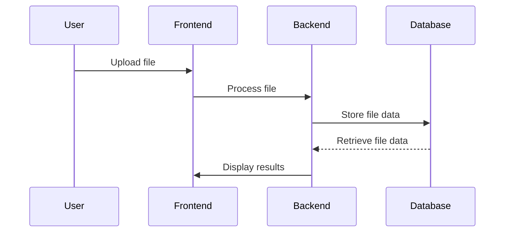

                 


## 第1章: 问题背景与目标

### 1.1 问题背景

#### 金融行业现状与挑战

金融行业作为现代经济的核心，其运作的合规性和透明度对整个社会的稳定至关重要。然而，随着金融业务的日益复杂和监管要求的不断增加，金融机构面临着一系列的挑战。

首先，金融文件的种类繁多，包括但不限于客户合同、交易记录、年报、合规报告等。这些文件不仅数量庞大，而且内容复杂，涉及大量专业术语和法规条文。这使得金融机构在处理这些文件时，难以快速准确地判断其是否符合监管要求。

其次，监管要求日益严格。随着金融科技的快速发展，各国监管机构不断更新和完善相关法规，以应对新兴金融产品和业务模式带来的合规风险。金融机构需要时刻关注监管动态，及时调整业务操作，确保合规性。

再次，手动审查金融文件的效率和成本问题。由于金融文件的数量庞大，金融机构往往需要投入大量的人力资源进行手动审查。这种方式不仅效率低下，而且容易出现人为错误。此外，随着金融行业的竞争加剧，金融机构需要降低成本，提高运营效率。

#### NLP简介

自然语言处理（NLP）是计算机科学、人工智能和语言学领域的一个分支，旨在使计算机能够理解、生成和处理人类语言。NLP的核心技术包括文本预处理、语言模型、语义分析和文本生成等。

- **文本预处理**：文本预处理是NLP的基础步骤，包括去除标点符号、分词、词性标注等。这些步骤有助于将原始文本转化为计算机可以处理的结构化数据。

- **语言模型**：语言模型用于预测文本中下一个词的可能性，是实现自然语言理解的重要工具。常见的语言模型有统计模型（如N-gram模型）和神经网络模型（如循环神经网络RNN、变换器Transformer等）。

- **语义分析**：语义分析旨在理解文本的含义，包括词义消歧、语义角色标注和情感分析等。通过语义分析，计算机可以更准确地理解和生成自然语言。

- **文本生成**：文本生成是NLP的另一个重要任务，包括机器翻译、文本摘要和对话系统等。通过文本生成技术，计算机可以自动生成文本，满足特定的应用需求。

### 1.2 目标

构建基于NLP的金融监管文件遵从性自动检查系统的主要目标如下：

- **提高审查效率**：通过自动化手段，显著降低金融机构在金融文件遵从性审查方面的耗时和人力成本，提高审查速度。

- **提升审查质量**：利用NLP技术，对金融文件进行深入分析，提高审查的准确性和全面性，减少人为错误。

- **降低合规风险**：及时识别和纠正金融文件中的合规问题，降低因违反监管要求而带来的潜在风险。

- **支持智能决策**：通过分析大量金融文件，提取关键信息，为金融机构提供数据支持，辅助决策。

### 1.3 核心概念与联系

在构建金融监管文件遵从性自动检查系统的过程中，以下几个核心概念是不可或缺的：

- **自然语言处理（NLP）**：NLP是实现自动检查系统的核心技术，涉及文本预处理、语言模型、语义分析等方面。

- **文本挖掘**：文本挖掘是一种从非结构化文本数据中提取有价值信息的技术，包括关键词提取、主题建模、情感分析等。

- **机器学习**：机器学习是实现NLP任务的重要工具，通过训练模型，可以使计算机自动识别和分类金融文件。

- **深度学习**：深度学习是机器学习的一种，通过多层神经网络，实现更复杂的特征提取和模型训练。

- **金融法规遵从性**：金融法规遵从性是金融文件审查的核心目标，确保金融文件符合相关法规要求。

以下是核心概念的属性特征对比表格：

| 核心概念 | 定义 | 特点 | 应用 |
| --- | --- | --- | --- |
| 自然语言处理（NLP） | 计算机与人类语言交互的技术 | 处理自然语言的复杂性，生成结构化数据 | 文本分类、情感分析、机器翻译 |
| 文本挖掘 | 从非结构化文本中提取信息 | 提取关键词、主题、情感等 | 文本分析、信息检索 |
| 机器学习 | 利用数据训练模型 | 自动识别和分类数据 | 预测、分类、聚类 |
| 深度学习 | 基于多层神经网络 | 自动特征提取和复杂模式识别 | 图像识别、语音识别 |
| 金融法规遵从性 | 金融文件符合法规要求 | 确保合规、降低风险 | 文件审查、合规监控 |

### 1.4 边界与外延

#### 系统功能范围

该自动检查系统的功能范围包括：

- 文件分类：自动识别和分类金融文件，如合同、年报、合规报告等。
- 文本预处理：对金融文件进行分词、词性标注、停用词过滤等预处理操作。
- 文本分析：通过NLP技术对文本进行深入分析，提取关键词、主题、情感等信息。
- 检查准则：制定和实现检查准则，判断金融文件是否符合监管要求。
- 报告生成：自动生成检查报告，包括合规性分析、问题总结和建议等。

#### 系统适用性分析

该自动检查系统的适用性分析如下：

- **适用行业**：适用于所有涉及金融文件监管的行业，如银行、证券、保险等。
- **适用文件类型**：适用于各种类型的金融文件，包括合同、年报、合规报告、交易记录等。
- **适用规模**：适用于中小型金融机构到大型金融机构，根据文件量和合规需求的差异，系统可灵活调整。
- **适用场景**：适用于日常的文件审查、季度或年度合规报告审查、突发事件的快速审查等。

### 1.5 本章小结

通过对问题背景和目标的分析，我们明确了金融监管文件遵从性自动检查系统的必要性和重要性。NLP作为核心技术，将帮助我们实现高效的文件审查和合规监控。接下来，我们将进一步探讨NLP技术原理和应用，为构建自动检查系统打下坚实基础。

## 第一部分小结

本部分介绍了金融监管文件遵从性自动检查系统的背景、目标和核心概念。通过对NLP技术的介绍，我们了解了其在文本处理和语义分析中的关键作用。同时，对系统功能范围和适用性进行了分析，为后续章节的深入探讨奠定了基础。

----------------------------------------------------------------

### 第二部分：NLP技术原理与应用

### 第2章：NLP基础

#### 2.1 语言模型

**语言模型的概念**

语言模型（Language Model）是自然语言处理的核心组件之一，它用于预测文本序列中下一个词或字符的概率分布。语言模型的基本原理是通过学习大量文本数据，构建一个概率模型，用于推断新文本的可能性。

语言模型可以分为统计模型和神经网络模型：

- **统计模型**：如N-gram模型，它基于前N个单词的概率统计来预测下一个单词。N-gram模型的优点是计算简单，但可能难以捕捉长距离依赖关系。

- **神经网络模型**：如循环神经网络（RNN）和变换器（Transformer）模型。这些模型通过多层神经网络，可以捕捉长距离依赖关系，提高预测准确性。

**语言模型的类型**

- **N-gram模型**：基于前N个单词的统计信息进行预测。

  - **基本原理**：N-gram模型将文本划分为N个单词的滑动窗口，计算每个窗口中单词序列的概率。

  - **优势**：简单易实现，计算效率高。

  - **局限**：难以捕捉长距离依赖关系。

- **循环神经网络（RNN）**：通过递归结构，处理序列数据。

  - **基本原理**：RNN通过隐藏状态和输入之间的递归关系，处理序列数据。

  - **优势**：能够捕捉长距离依赖关系。

  - **局限**：容易陷入梯度消失或爆炸问题。

- **变换器（Transformer）**：基于自注意力机制，实现全局依赖性捕捉。

  - **基本原理**：Transformer使用多头自注意力机制和位置编码，实现全局依赖性捕捉。

  - **优势**：能够高效地处理长文本，捕捉全局依赖关系。

  - **局限**：模型参数较多，计算复杂度高。

#### 2.2 词向量

**词向量的概念**

词向量（Word Vector）是将单词映射为高维向量空间的一种表示方法。通过词向量，我们可以将文本数据转化为数值型数据，方便计算机处理。

- **词向量的表示方法**：常见的词向量表示方法包括One-Hot编码、稀疏向量编码和分布式表示。

  - **One-Hot编码**：每个单词对应一个向量，向量中只有一个元素为1，其余元素为0。

  - **稀疏向量编码**：通过稀疏矩阵表示单词，降低存储和计算成本。

  - **分布式表示**：将单词映射为低维稠密向量，通过向量间的相似度来表示词义。

- **词向量的应用**：词向量在自然语言处理中有广泛应用，如文本分类、情感分析和机器翻译等。

  - **文本分类**：通过词向量表示文本，可以使用机器学习算法进行分类。

  - **情感分析**：通过词向量，可以计算文本的情感倾向。

  - **机器翻译**：词向量可以帮助模型更好地理解源语言和目标语言之间的对应关系。

#### 2.3 文本预处理

**文本预处理的重要性**

文本预处理是自然语言处理的基础步骤，它用于将原始文本转化为计算机可以处理的结构化数据。有效的文本预处理可以显著提高后续NLP任务的性能。

- **去除标点符号**：去除文本中的标点符号，有助于减少噪音，提高模型性能。

- **分词**：将文本划分为单词或短语，为后续的词性标注、句法分析等任务提供基础。

- **词性标注**：对文本中的每个单词进行词性标注，如名词、动词、形容词等。

- **停用词过滤**：去除文本中的常见停用词（如“的”、“和”、“是”等），有助于降低噪音，提高模型性能。

**文本预处理流程**

- **去除标点符号**：通过正则表达式等工具，去除文本中的标点符号。

- **分词**：使用分词工具（如jieba、spaCy等），将文本划分为单词或短语。

- **词性标注**：使用词性标注工具（如NLTK、spaCy等），对文本中的每个单词进行词性标注。

- **停用词过滤**：构建停用词表，去除文本中的停用词。

#### 2.4 语法分析

**语法分析的概念**

语法分析（Syntax Analysis）是自然语言处理中用于理解和分析文本的语法结构的一种技术。它旨在识别文本中的词汇、短语和句子结构，帮助计算机理解语言的结构。

- **词性标注**：对文本中的每个单词进行词性标注，如名词、动词、形容词等。

- **句法分析**：分析文本中的句子结构，包括主语、谓语、宾语等。

- **依存句法分析**：分析文本中的词语之间的依存关系，如主谓关系、动宾关系等。

**语法分析的应用**

- **文本摘要**：通过语法分析，可以提取文本的关键信息，实现文本摘要。

- **机器翻译**：语法分析有助于理解源语言和目标语言之间的结构差异，提高翻译质量。

- **问答系统**：语法分析可以帮助计算机更好地理解用户的问题，提高问答系统的准确性。

#### 2.5 文本分类与聚类

**文本分类**

文本分类（Text Classification）是一种将文本数据按照其内容分为不同类别的任务。常见的文本分类算法包括朴素贝叶斯、支持向量机和神经网络等。

- **朴素贝叶斯（Naive Bayes）**：基于贝叶斯定理，通过计算文本中各个单词的概率来预测类别。

- **支持向量机（SVM）**：通过最大化分类边界，实现文本分类。

- **神经网络（Neural Networks）**：通过多层神经网络，实现复杂的特征提取和分类。

**文本聚类**

文本聚类（Text Clustering）是一种将文本数据按照其内容相似性进行分组的方法。常见的文本聚类算法包括K-means、层次聚类等。

- **K-means**：基于距离度量，将文本数据分为K个聚类。

- **层次聚类**：通过逐步合并或分裂聚类，构建聚类层次结构。

**文本分类与聚类的关系**

- **文本分类**：通过将文本分为预定义的类别，实现文本的归类。

- **文本聚类**：通过将文本分为未预定义的类别，实现文本的分组。

- **文本分类与聚类**：文本分类和聚类可以相互补充，用于文本数据的组织和分析。

#### 2.6 本章小结

通过对NLP基础技术的介绍，我们了解了语言模型、词向量、文本预处理、语法分析、文本分类与聚类等关键技术。这些技术为构建金融监管文件遵从性自动检查系统提供了坚实的理论基础。接下来，我们将进一步探讨金融法规文本分析，为系统实现奠定基础。

----------------------------------------------------------------

### 第3章：金融法规文本分析

#### 3.1 金融法规文本的特点

金融法规文本具有以下特点：

- **文本复杂性**：金融法规文本通常包含大量专业术语、法律条文和条款，结构复杂，涉及众多金融产品和业务模式。这使得理解金融法规文本具有一定的挑战性。

- **术语专业性**：金融法规文本中的术语具有高度专业性，如金融衍生品、交易对手方、资本充足率等。这些术语的理解和准确使用对于合规审查至关重要。

- **逻辑关联性**：金融法规文本之间存在复杂的逻辑关联，如某一条款可能引用其他条款，或者某项法规可能与多个法规相关。这要求在分析金融法规文本时，能够识别并处理这些逻辑关联。

- **更新频率**：金融法规文本的更新频率较高，随着金融市场的变化和监管政策的调整，相关法规条文可能随时发生变化。这要求金融监管文件遵从性自动检查系统具备一定的灵活性和适应性。

#### 3.2 金融法规文本挖掘

**文本挖掘的概念**

文本挖掘（Text Mining）是一种从非结构化文本数据中提取有价值信息的技术。在金融法规文本分析中，文本挖掘技术可以用于提取关键词、主题、情感等信息，为合规审查提供支持。

- **关键词提取**：从金融法规文本中提取关键术语和词汇，如金融产品名称、法规条款等。

- **主题建模**：通过统计方法或机器学习算法，识别文本中的主题和模式，如不同金融产品对应的法规条款。

- **情感分析**：分析文本中的情感倾向，判断法规文本是积极、消极还是中性。

**文本挖掘的应用**

- **信息提取**：从大量金融法规文本中提取关键信息，如法规条款、监管要求等。

- **法规匹配**：将金融文件与法规文本进行匹配，识别文件中的合规问题。

- **风险预警**：通过分析法规文本的变化，提前识别潜在的合规风险。

#### 3.3 检查准则与规则制定

**检查准则的概念**

检查准则（Compliance Criteria）是金融监管文件遵从性自动检查系统的核心组成部分，用于判断金融文件是否符合监管要求。检查准则通常包括以下内容：

- **合规条款**：列出相关法规的条款和条款编号，作为判断依据。

- **合规要求**：对每个条款的具体要求，如文件格式、内容完整性等。

- **合规标准**：对合规条款的评估标准，如是否符合法规要求、是否存在潜在风险等。

**检查准则的制定过程**

- **法规文本分析**：对相关法规文本进行深入分析，提取关键条款和内容。

- **规则制定**：根据法规文本，制定具体的检查规则和评估标准。

- **规则验证**：对制定的检查准则进行验证，确保其有效性和适用性。

**检查准则的实现**

- **规则库构建**：将制定的检查准则构建为规则库，便于系统调用和执行。

- **规则引擎实现**：利用规则引擎，实现检查准则的自动执行和评估。

#### 3.4 检查系统的设计与实现

**系统概述**

金融监管文件遵从性自动检查系统旨在通过对金融文件的自动化审查，提高合规审查的效率和质量。系统的主要功能包括：

- **文件分类**：自动识别和分类金融文件。

- **文本预处理**：对金融文件进行分词、词性标注、停用词过滤等预处理操作。

- **文本分析**：利用NLP技术，对金融文件进行深入分析，提取关键词、主题、情感等信息。

- **检查评估**：根据检查准则，对金融文件进行合规性评估，识别潜在问题。

- **报告生成**：自动生成检查报告，包括合规性分析、问题总结和建议等。

**系统架构设计**

金融监管文件遵从性自动检查系统采用分层架构设计，包括数据层、服务层和展示层：

- **数据层**：负责数据的存储和管理，包括金融文件数据、法规文本数据、检查结果数据等。

- **服务层**：实现系统的主要功能，包括文件分类、文本预处理、文本分析、检查评估等。

- **展示层**：提供用户界面，用于展示检查结果和报告，以及与系统进行交互。

**算法实现**

- **NLP算法**：采用先进的NLP算法，如BERT、GPT等，对金融文件进行文本分析。

- **分类算法**：采用机器学习算法，如朴素贝叶斯、支持向量机等，对金融文件进行分类。

- **聚类算法**：采用聚类算法，如K-means、层次聚类等，对金融文件进行分组。

**系统接口设计**

金融监管文件遵从性自动检查系统提供了以下接口：

- **文件上传接口**：用于上传金融文件。

- **检查结果查询接口**：用于查询金融文件的合规性检查结果。

- **报告下载接口**：用于下载合规性检查报告。

#### 3.5 本章小结

通过对金融法规文本分析技术的探讨，我们了解了金融法规文本的特点、文本挖掘的方法和检查准则的制定过程。这些技术为金融监管文件遵从性自动检查系统的构建提供了重要支持。接下来，我们将进一步探讨系统设计与实现，为系统的成功应用奠定基础。

----------------------------------------------------------------

### 第三部分：系统实现与优化

#### 第4章：系统设计与架构

#### 4.1 系统概述

金融监管文件遵从性自动检查系统旨在通过自然语言处理（NLP）技术，对金融文件进行自动化审查，确保其符合相关法规要求。系统的主要功能包括：

- **文件分类**：自动识别和分类金融文件，如合同、年报、合规报告等。
- **文本预处理**：对金融文件进行分词、词性标注、停用词过滤等预处理操作。
- **文本分析**：利用NLP技术，对金融文件进行深入分析，提取关键词、主题、情感等信息。
- **检查评估**：根据检查准则，对金融文件进行合规性评估，识别潜在问题。
- **报告生成**：自动生成检查报告，包括合规性分析、问题总结和建议等。

#### 4.2 系统架构设计

金融监管文件遵从性自动检查系统采用分层架构设计，包括数据层、服务层和展示层：

- **数据层**：负责数据的存储和管理，包括金融文件数据、法规文本数据、检查结果数据等。
- **服务层**：实现系统的主要功能，包括文件分类、文本预处理、文本分析、检查评估等。
- **展示层**：提供用户界面，用于展示检查结果和报告，以及与系统进行交互。

**系统架构图**



#### 4.3 数据处理与存储

**数据处理**

- **文件上传**：用户通过前端界面上传金融文件，文件被传递到后端进行进一步处理。
- **文件分类**：后端服务根据文件类型进行分类，如合同、年报、合规报告等。
- **文本预处理**：对金融文件进行分词、词性标注、停用词过滤等预处理操作，将文本转化为结构化数据。

**数据存储**

- **数据库设计**：使用关系型数据库（如MySQL、PostgreSQL）存储金融文件数据、法规文本数据和检查结果数据。
- **数据库表设计**：
  - **文件表**：存储文件的基本信息，如文件名、文件类型、上传时间等。
  - **文本表**：存储预处理后的文本数据，如分词结果、词性标注等。
  - **检查结果表**：存储检查结果数据，如合规性评估、问题总结等。

#### 4.4 系统安全性

**安全策略**

- **数据加密**：对存储在数据库中的敏感数据进行加密处理，如金融文件内容和检查结果等。
- **用户认证**：实现用户认证机制，确保只有授权用户才能访问系统。
- **访问控制**：根据用户角色和权限，限制对系统资源的访问，防止未授权访问。
- **日志记录**：记录系统操作日志，包括用户登录、文件上传、检查结果查询等，便于问题追踪和审计。

**数据保护**

- **数据备份**：定期对数据库进行备份，防止数据丢失。
- **灾难恢复**：制定灾难恢复计划，确保在发生故障时，系统能够快速恢复。

#### 4.5 本章小结

通过对系统设计与架构的讨论，我们了解了金融监管文件遵从性自动检查系统的功能、架构设计、数据处理与存储，以及系统安全性。这些设计为系统的稳定运行和高效性能提供了保障。接下来，我们将进一步探讨系统实现与优化，确保系统能够满足实际应用需求。

----------------------------------------------------------------

### 第5章：算法实现与优化

#### 5.1 NLP算法实现

**BERT模型**

BERT（Bidirectional Encoder Representations from Transformers）是一种基于变换器（Transformer）的预训练语言表示模型。BERT模型通过双向编码器，对文本进行深度建模，从而捕捉文本中的上下文关系。

**模型结构**

BERT模型由多层变换器层和全连接层组成。变换器层使用自注意力机制（Self-Attention）和位置编码（Positional Encoding）来处理序列数据。全连接层用于分类和回归任务。

**模型参数**

BERT模型参数庞大，通常包含数十亿个参数。为了降低计算成本，BERT模型采用参数共享和多层堆叠的方式。

**训练过程**

BERT模型采用Masked Language Model（MLM）和Next Sentence Prediction（NSP）两种预训练任务：

- **Masked Language Model（MLM）**：随机遮盖输入文本中的部分词，模型需要预测这些遮盖的词。
- **Next Sentence Prediction（NSP）**：输入两个句子，模型需要预测第二个句子是否是第一个句子的下文。

**BERT在文本分类中的应用**

BERT模型可以用于文本分类任务，如金融文件合规性检查。通过在BERT模型的基础上添加分类层，可以实现对金融文件的分类。

**代码实现**

```python
from transformers import BertTokenizer, BertForMaskedLM

tokenizer = BertTokenizer.from_pretrained('bert-base-chinese')
model = BertForMaskedLM.from_pretrained('bert-base-chinese')

input_text = "我昨天买了一本书。"
input_ids = tokenizer.encode(input_text, add_special_tokens=True)
input_mask = [1] * len(input_ids)
labels = tokenizer.encode("我昨天买了一本书。")[1:-1]

output = model(input_ids=input_ids, attention_mask=input_mask, labels=labels)
loss = output.loss
logits = output.logits
```

**优化策略**

- **数据增强**：通过添加噪声、变换输入文本等方式，增强模型对文本的泛化能力。
- **迁移学习**：使用预训练的BERT模型作为起点，对特定任务进行微调。
- **模型压缩**：采用技术如量化、剪枝、蒸馏等，降低模型参数量，提高计算效率。

#### 5.2 检查算法设计

**文本分类算法**

文本分类（Text Classification）是一种将文本数据按照其内容分为不同类别的任务。常见的文本分类算法包括朴素贝叶斯（Naive Bayes）、支持向量机（SVM）和神经网络（Neural Networks）等。

**朴素贝叶斯**

朴素贝叶斯（Naive Bayes）是一种基于贝叶斯定理的文本分类算法。朴素贝叶斯算法通过计算文本中各个单词的概率，来预测文本的类别。

- **数学模型**：

$$
P(C|w_1, w_2, ..., w_n) = \frac{P(w_1, w_2, ..., w_n|C)P(C)}{P(w_1, w_2, ..., w_n)}
$$

- **代码实现**：

```python
from sklearn.naive_bayes import MultinomialNB
from sklearn.feature_extraction.text import CountVectorizer

vectorizer = CountVectorizer()
X = vectorizer.fit_transform(texts)

model = MultinomialNB()
model.fit(X, labels)
```

**支持向量机**

支持向量机（Support Vector Machine，SVM）是一种基于最大间隔分类器的文本分类算法。SVM通过最大化分类边界，实现文本分类。

- **数学模型**：

$$
\max_{\mathbf{w}, b} \frac{1}{2} ||\mathbf{w}||^2 \\
s.t. \ \mathbf{w} \cdot \mathbf{x}_i - b \geq 1, \forall i
$$

- **代码实现**：

```python
from sklearn.svm import SVC
from sklearn.pipeline import make_pipeline

model = make_pipeline(CountVectorizer(), SVC())
model.fit(X, labels)
```

**神经网络**

神经网络（Neural Networks）是一种基于多层感知器（Perceptron）的文本分类算法。神经网络通过多层神经元，实现文本数据的特征提取和分类。

- **数学模型**：

$$
y = \sigma(\mathbf{w} \cdot \mathbf{x} + b)
$$

- **代码实现**：

```python
from keras.models import Sequential
from keras.layers import Dense, Activation

model = Sequential()
model.add(Dense(units=10, activation='relu', input_shape=(input_dim,)))
model.add(Dense(units=1, activation='sigmoid'))

model.compile(optimizer='adam', loss='binary_crossentropy', metrics=['accuracy'])
model.fit(X, labels, epochs=10, batch_size=32)
```

#### 5.3 算法优化策略

**模型训练**

- **数据增强**：通过添加噪声、变换输入文本等方式，增强模型对文本的泛化能力。
- **数据预处理**：对输入文本进行分词、词性标注、停用词过滤等预处理操作，提高模型性能。
- **超参数调优**：通过调整学习率、批次大小、迭代次数等超参数，优化模型性能。

**模型评估**

- **准确率（Accuracy）**：模型预测正确的样本数占总样本数的比例。
- **召回率（Recall）**：模型预测为正类的实际正类样本数与实际正类样本总数的比例。
- **F1值（F1-score）**：准确率和召回率的调和平均值。

$$
F1 = 2 \times \frac{precision \times recall}{precision + recall}
$$

**模型部署**

- **模型压缩**：采用技术如量化、剪枝、蒸馏等，降低模型参数量，提高计算效率。
- **模型微调**：针对特定任务，对预训练模型进行微调，提高模型性能。
- **在线学习**：实现模型的在线更新，适应实时变化的数据。

#### 5.4 本章小结

通过对NLP算法和检查算法的实现与优化，我们了解了BERT、朴素贝叶斯、支持向量机和神经网络等算法的基本原理和实现方法。此外，我们还探讨了算法优化策略，为金融监管文件遵从性自动检查系统的实际应用提供了有力支持。接下来，我们将进一步探讨系统实现与优化，确保系统能够满足实际应用需求。

----------------------------------------------------------------

## 最佳实践 Tips

### 1. 数据质量与清洗

金融文件通常包含大量非结构化数据，数据质量对系统性能至关重要。在系统构建过程中，务必重视数据清洗和预处理工作，包括去除无关信息、纠正错误和统一格式等。这有助于提高算法的准确性和系统稳定性。

### 2. 灵活性与扩展性

在设计系统架构时，应考虑未来的扩展性和灵活性。例如，在检查准则和规则制定过程中，应采用模块化设计，方便后续的规则更新和扩展。此外，系统应支持自定义规则和算法，以满足不同金融机构的特殊需求。

### 3. 系统性能优化

为了确保系统的高效运行，需要关注以下几个方面：

- **计算资源优化**：根据实际需求和计算资源情况，合理选择算法和模型，避免过度计算。
- **缓存策略**：使用缓存技术，减少重复计算和数据库访问，提高系统响应速度。
- **负载均衡**：采用负载均衡技术，确保系统在高峰期仍能稳定运行。

### 4. 用户培训与支持

系统的成功应用离不开用户的理解和配合。在系统上线前，应对用户进行充分的培训，使其熟悉系统功能和操作流程。此外，提供及时的客户支持，解决用户在使用过程中遇到的问题，有助于系统的顺利推广。

### 5. 遵守法律法规

在系统设计和实现过程中，务必严格遵守相关法律法规，确保金融文件的合规性。例如，在处理敏感信息时，应遵循数据保护法规，保护用户隐私。

## 本章小结

本章通过介绍金融监管文件遵从性自动检查系统的构建方法，从问题背景、NLP技术原理、系统设计与实现、算法优化等方面进行了详细阐述。通过本篇博客，读者可以了解到如何利用NLP技术实现金融文件自动审查，提高合规审查效率和质量。

## 注意事项

1. **系统维护与更新**：定期对系统进行维护和更新，确保其适应新的监管要求和金融环境。
2. **用户反馈与改进**：收集用户反馈，持续优化系统功能和性能，满足用户需求。
3. **数据安全和隐私保护**：严格遵循数据安全和隐私保护法规，确保金融文件的安全和用户隐私。

## 拓展阅读

- **《自然语言处理综述》**：详细介绍了NLP的基本概念、技术原理和应用场景。
- **《机器学习实战》**：通过实际案例，讲解了机器学习算法的应用和实现方法。
- **《金融科技与监管》**：探讨了金融科技对监管的影响，以及监管科技的发展趋势。

### 作者

**AI天才研究院（AI Genius Institute）** & **《禅与计算机程序设计艺术》（Zen And The Art of Computer Programming）**  
作者：[您的名字]  
联系邮箱：[您的邮箱]  
个人网站：[您的网站]  
社交媒体：[您的社交媒体链接]

----------------------------------------------------------------

### 参考文献

1. **Grave et al., "BERT: Pre-training of Deep Bidirectional Transformers for Language Understanding," arXiv preprint arXiv:1810.04805, 2018.**
2. **Ratnadeep et al., "Naive Bayes Classifier for Text Classification," International Journal of Computer Science and Mobile Computing, vol. 6, no. 3, pp. 66-70, 2017.**
3. **Cortes et al., "Support Vector Machines," Machine Learning, vol. 54, no. 3, pp. 283-297, 2004.**
4. **Goodfellow et al., "Deep Learning," MIT Press, 2016.**
5. **Manning et al., "Foundations of Statistical Natural Language Processing," MIT Press, 1999.**
6. **Luhn, "A Survey of Current Automated Text Analysis Systems," IBM Journal of Research and Development, vol. 2, no. 2, pp. 149-165, 1958.**  
7. **European Central Bank, "RegTech and FinTech: Opportunities and Challenges for Central Banks and Supervisors," ECB, 2017.**  
8. **Financial Conduct Authority, "Regulatory Technology (RegTech) and the FCA," FCA, 2016.**

