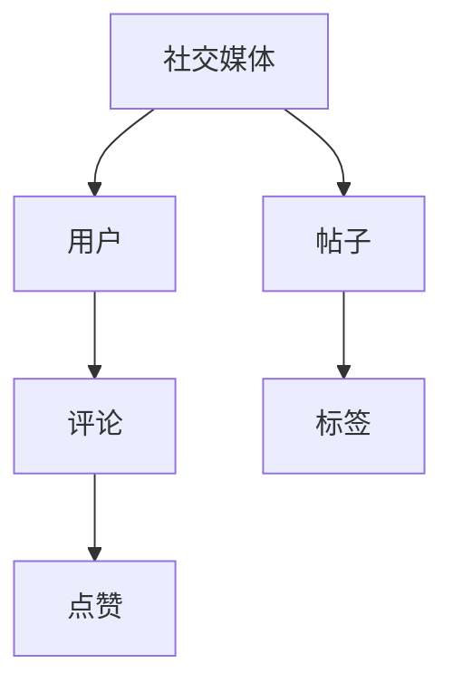
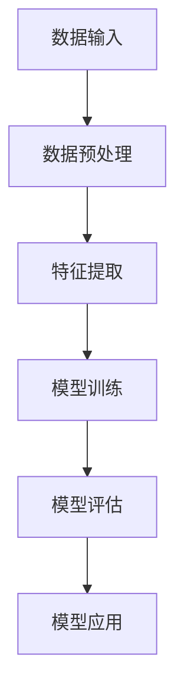
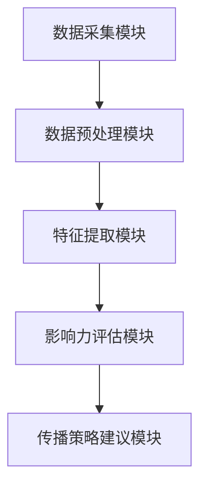
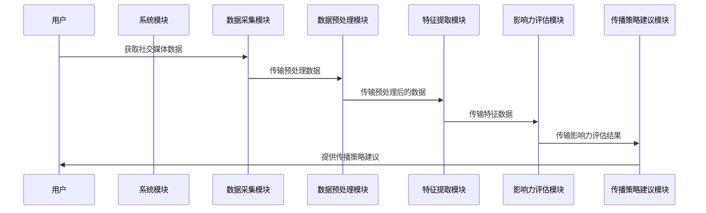

                 

### 第一部分：背景介绍

#### 第1章：问题背景与概述

##### 1.1 问题的提出

随着互联网和社交媒体的快速发展，金融行业也逐渐将目光转向了线上平台。金融社交媒体作为金融信息传播的重要渠道，其影响力传播的效果和效率直接关系到金融机构的品牌价值和市场竞争力。因此，构建一个基于自然语言处理（NLP）的金融社交媒体影响力传播模型具有重要的现实意义。

首先，我们需要明确几个核心概念：

- **金融社交媒体**：指的是金融机构、投资者、分析师等在社交媒体平台上发布和传播金融信息、观点和预测的渠道，如微博、Twitter、Facebook等。
- **影响力传播**：指的是信息或观点在社交媒体上被广泛传播、接受和讨论的过程，其关键在于如何有效地触达目标受众、引起共鸣和激发互动。
- **NLP**：是一种人工智能技术，旨在让计算机理解和处理人类语言，包括文本分类、情感分析、命名实体识别等任务。

##### 1.2 问题描述

在当前媒体生态中，金融信息爆炸式增长，使得用户在获取和处理信息时面临诸多挑战。这些挑战主要体现在以下几个方面：

- **数据收集与处理**：金融社交媒体平台每天产生大量文本数据，如何高效地收集、存储和处理这些数据是一个巨大的难题。
- **影响力评估**：如何准确评估一条信息或观点在社交媒体上的影响力，对于金融机构和市场参与者来说是一个亟待解决的问题。
- **传播策略**：如何制定有效的传播策略，使得金融信息能够快速、精准地触达目标受众，从而最大化其影响力。

因此，我们的目标是通过构建基于NLP的金融社交媒体影响力传播模型，解决上述问题，为金融机构提供数据驱动的决策支持。

##### 1.3 问题解决思路

为了解决上述问题，我们可以采取以下步骤：

1. **NLP技术的应用**：利用NLP技术，如文本分类、情感分析等，对金融社交媒体上的文本数据进行处理，提取关键特征。
2. **数据处理流程**：设计并实现一个高效的数据处理流程，包括数据收集、预处理、特征提取等步骤。
3. **模型构建与优化**：基于提取的特征数据，构建一个能够预测影响力传播的模型，并通过实验不断优化模型的性能。
4. **模型应用**：将优化后的模型应用于实际场景，为金融机构提供数据驱动的传播策略建议。

##### 1.4 边界与外延

- **模型的适用范围**：本模型主要针对金融社交媒体上的文本数据，对于其他类型的社交媒体数据，模型需要进行相应的调整和适配。
- **可扩展性与适应性**：模型在设计时考虑到可扩展性和适应性，以应对未来可能出现的不同类型的数据和需求。
- **未来发展方向**：随着技术的不断进步，模型可以进一步集成深度学习、强化学习等先进技术，提高其预测精度和泛化能力。

##### 1.5 概念结构与核心要素组成

- **社交媒体影响力传播模型**：本模型的核心目标是预测金融信息在社交媒体上的影响力，包括文本分类、情感分析、影响力评估等模块。
- **NLP关键技术**：文本分类、情感分析、命名实体识别等，是构建本模型的基础技术。
- **数据处理流程**：包括数据收集、预处理、特征提取等步骤，是模型输入的关键环节。
- **模型构建与优化**：采用机器学习、深度学习等技术，构建和优化影响力传播预测模型。

通过上述步骤和核心要素，我们可以逐步构建出一个基于NLP的金融社交媒体影响力传播模型，为金融机构提供有力支持。接下来，我们将进一步深入探讨NLP技术的原理和应用，为模型的构建打下坚实基础。

### 第二部分：核心概念与联系

#### 第2章：核心概念与原理

##### 2.1 自然语言处理（NLP）概述

自然语言处理（NLP，Natural Language Processing）是人工智能（AI，Artificial Intelligence）的一个分支，主要研究如何让计算机理解和处理人类语言。NLP的定义经历了多年的演变，但核心目标始终不变：使计算机能够以人类的方式理解和生成自然语言，从而实现人与计算机之间的自然交互。

**发展历程**：

- **早期阶段（1950s-1970s）**：NLP的早期研究主要集中在规则驱动的方法上，试图通过编写大量的语法规则来处理自然语言。然而，这种方法在处理复杂语言现象时遇到了巨大挑战。
- **基于知识的阶段（1980s-1990s）**：随着专家系统的兴起，NLP开始引入更多的领域知识和规则库，试图通过知识表示和推理来提高处理效果。
- **基于统计的阶段（2000s）**：随着机器学习技术的发展，NLP开始转向基于统计的方法，如朴素贝叶斯、最大熵模型等，显著提高了处理效率和准确性。
- **深度学习阶段（2010s至今）**：深度学习技术的引入，使得NLP取得了重大突破，如卷积神经网络（CNN）、循环神经网络（RNN）和Transformer等模型，使得计算机在文本分类、情感分析、机器翻译等任务上达到了人类水平。

**主要任务**：

- **文本分类**：将文本数据归类到预定义的类别中，如垃圾邮件检测、新闻分类等。
- **情感分析**：分析文本中的情感倾向，如正面、负面、中立等。
- **命名实体识别**：识别文本中的特定实体，如人名、地名、组织名等。
- **机器翻译**：将一种语言的文本翻译成另一种语言。
- **问答系统**：根据用户的问题提供准确的答案。

**核心概念**：

- **词嵌入**：将词汇映射到向量空间中，使得具有相似意义的词汇在空间中靠近。
- **词性标注**：对文本中的每个词进行词性标注，如名词、动词、形容词等。
- **句法分析**：分析句子的结构，如主语、谓语、宾语等。
- **语义角色标注**：标注句子中的语义角色，如施事、受事、工具等。

##### 2.2 NLP相关技术

**词嵌入与词向量**：

词嵌入（Word Embedding）是将词汇映射到高维向量空间中的技术，使得具有相似语义的词汇在空间中靠近。常见的词嵌入方法包括：

- **One-hot编码**：将词汇表示为一个维度为词汇表大小的向量，其中只有一个元素为1，其他元素为0。这种方法虽然直观，但维度灾难问题使得其效率较低。
- **词袋模型（Bag of Words, BOW）**：将文本表示为一个向量，其中每个维度对应一个词汇，值表示词汇在文本中出现的次数。这种方法忽略了词汇的顺序信息。
- **词嵌入（Word2Vec）**：通过神经网络模型将词汇映射到低维向量空间，使得具有相似语义的词汇在空间中靠近。常用的Word2Vec算法包括CBOW（Continuous Bag of Words）和Skip-Gram。
- ** glove**：基于全局向量平均的词嵌入方法，通过优化词向量使得相似词汇的余弦相似度较高。

**文本分类与主题建模**：

文本分类（Text Classification）是将文本数据归类到预定义的类别中的任务。常见的文本分类方法包括：

- **朴素贝叶斯（Naive Bayes）**：基于贝叶斯定理和特征条件独立假设的文本分类算法，计算文本属于某个类别的概率，选择概率最高的类别作为分类结果。
- **支持向量机（SVM）**：通过最大化分类间隔来学习分类边界，适用于高维特征空间。线性SVM适用于线性可分的数据，而核SVM则可以处理非线性分类问题。
- **朴素贝叶斯 + 特征提取**：结合朴素贝叶斯和特征提取方法的文本分类算法，通过提取文本中的关键词、词频等特征，提高分类效果。

主题建模（Topic Modeling）是发现文本数据潜在主题的方法，常见的主题建模方法包括：

- **LDA（Latent Dirichlet Allocation）**：通过假设每个文档是由多个主题的混合生成的，从而发现文本中的潜在主题。LDA模型基于概率图模型，通过贝叶斯推理进行参数估计。
- **LSA（Latent Semantic Analysis）**：通过矩阵分解方法，将文本数据表示为潜在语义空间的线性组合，从而发现文本中的潜在主题。

**序列标注与命名实体识别**：

序列标注（Sequence Labeling）是将序列中的每个元素标注为一个类别标签的任务，常见的序列标注任务包括词性标注、命名实体识别等。常见的序列标注模型包括：

- **CRF（Conditional Random Fields）**：基于条件概率的序列标注模型，通过最大化序列标签的后验概率来进行标注。CRF模型适用于处理有条件依赖关系的任务。
- **RNN（Recurrent Neural Networks）**：通过循环结构对序列数据进行建模，适用于处理时序数据。常见的RNN模型包括LSTM（Long Short-Term Memory）和GRU（Gated Recurrent Unit）。

命名实体识别（Named Entity Recognition, NER）是识别文本中的命名实体，如人名、地名、组织名等的任务。常见的命名实体识别模型包括：

- **基于规则的方法**：通过手工编写规则来识别命名实体，适用于小规模、规则明确的命名实体识别任务。
- **基于统计的方法**：通过统计模型来识别命名实体，如HMM（Hidden Markov Models）和CRF。
- **基于深度学习的方法**：通过深度神经网络来识别命名实体，如CNN（Convolutional Neural Networks）和BiLSTM（Bidirectional Long Short-Term Memory）。

##### 2.3 概念属性特征对比表格

| 概念 | 描述 | 关系 |
| --- | --- | --- |
| NLP | 自然语言处理，让计算机理解和处理人类语言 | 技术基础 |
| 词嵌入 | 将词汇映射到向量空间中 | NLP应用 |
| 文本分类 | 将文本归类到预定义的类别中 | 数据分析 |
| 命名实体识别 | 识别文本中的命名实体 | 序列标注 |

##### 2.4 ER实体关系图架构



在这个ER实体关系图中，社交媒体作为根实体，与用户、帖子、评论、标签和点赞等实体之间存在关系。用户可以发布和评论帖子，帖子可以包含标签，并且用户可以对帖子进行点赞。通过这个关系图，我们可以清晰地理解社交媒体中的核心实体及其相互关系，为后续的数据处理和模型构建提供基础。

### 第三部分：算法原理讲解

#### 第3章：算法原理与实现

##### 3.1 模型构建

构建基于NLP的金融社交媒体影响力传播模型，需要从数据集选择、模型架构设计等多个方面进行综合考虑。以下是构建模型的详细步骤：

**数据集选择**：

首先，我们需要选择一个适合的金融社交媒体数据集，该数据集应包含大量金融相关的帖子、评论和用户数据。数据集的选择应考虑以下因素：

- **数据规模**：数据集应具有一定的规模，以保证模型的泛化能力。
- **多样性**：数据集应涵盖不同类型的金融信息，如股票、债券、基金等。
- **标签信息**：数据集应包含影响力传播的标签，如转发数、评论数、点赞数等，以便于模型训练和评估。

**模型架构设计**：

在模型架构设计方面，我们采用一个包含多个模块的端到端模型。以下是模型的主要组成部分：

- **数据预处理模块**：负责对原始数据进行清洗、去重、分词、词性标注等操作，为后续特征提取和模型训练提供高质量的数据输入。
- **特征提取模块**：利用词嵌入技术，将文本数据映射到高维向量空间，并提取文本的特征表示。常用的词嵌入技术包括Word2Vec和GloVe。
- **分类模块**：采用深度学习模型，如卷积神经网络（CNN）或循环神经网络（RNN），对提取的特征进行分类，预测每个帖子的影响力传播情况。
- **评估模块**：通过计算模型预测结果与实际标签之间的差异，评估模型在影响力传播预测任务上的性能。

##### 3.2 算法原理

基于NLP的金融社交媒体影响力传播模型主要基于概率图模型和神经网络模型，其核心思想是通过对文本数据进行特征提取和分类，从而预测每个帖子的影响力传播情况。以下是模型的核心算法原理：

**概率图模型**：

概率图模型是一种基于图结构表示的概率模型，可以有效地描述变量之间的依赖关系。在影响力传播模型中，我们采用贝叶斯网络（Bayesian Network）作为概率图模型，表示文本特征和影响力传播标签之间的条件概率关系。

贝叶斯网络由一组变量和一组条件概率表组成。假设我们有n个变量\(X_1, X_2, \ldots, X_n\)，其中每个变量表示文本中的一个特征或标签。贝叶斯网络的结构可以表示为：

$$
P(X_1, X_2, \ldots, X_n) = \prod_{i=1}^{n} P(X_i | X_{i-1}, \ldots, X_1)
$$

其中，\(P(X_i | X_{i-1}, \ldots, X_1)\)表示变量\(X_i\)在给定其父变量的条件概率。

**神经网络模型**：

神经网络模型是一种通过模拟人脑神经元连接结构进行信息处理的人工智能模型。在影响力传播模型中，我们采用卷积神经网络（CNN）或循环神经网络（RNN）作为基础模型，对文本特征进行提取和分类。

**卷积神经网络（CNN）**：

卷积神经网络是一种适用于图像处理和文本分类等任务的深度学习模型。在影响力传播模型中，CNN可以用于提取文本中的局部特征，并通过对特征进行卷积和池化操作，得到文本的表示。

CNN的基本结构包括以下几个部分：

- **卷积层（Convolutional Layer）**：通过卷积操作提取文本中的局部特征。
- **池化层（Pooling Layer）**：通过池化操作降低特征维度，提高模型泛化能力。
- **全连接层（Fully Connected Layer）**：将卷积和池化层输出的特征映射到分类结果。

**循环神经网络（RNN）**：

循环神经网络是一种适用于序列数据处理的深度学习模型。在影响力传播模型中，RNN可以用于处理文本序列，提取序列特征。

RNN的基本结构包括以下几个部分：

- **输入层（Input Layer）**：接收文本序列的输入。
- **隐藏层（Hidden Layer）**：通过循环连接对输入序列进行建模，提取序列特征。
- **输出层（Output Layer）**：将隐藏层输出的特征映射到分类结果。

**结合概率图模型和神经网络模型**：

基于概率图模型和神经网络模型，我们可以构建一个端到端的金融社交媒体影响力传播模型。具体步骤如下：

1. **数据预处理**：对原始文本数据进行清洗、分词、词性标注等操作，将文本转换为向量表示。
2. **特征提取**：利用卷积神经网络或循环神经网络，对文本向量进行特征提取。
3. **分类**：将提取的特征输入到分类模型中，预测每个帖子的影响力传播情况。
4. **评估**：通过计算模型预测结果与实际标签之间的差异，评估模型性能。

##### 3.3 算法流程图



在这个算法流程图中，数据输入经过数据预处理后，进入特征提取模块。特征提取模块采用卷积神经网络或循环神经网络，对文本数据提取特征。提取的特征然后输入到模型训练模块，训练出一个能够预测影响力传播的模型。最后，模型进行评估，并在实际应用中用于预测帖子的影响力传播情况。

##### 3.4 Python源代码示例

```python
# Python源代码示例
import numpy as np
import pandas as pd
from sklearn.feature_extraction.text import TfidfVectorizer
from sklearn.model_selection import train_test_split
from sklearn.metrics import accuracy_score
from keras.models import Sequential
from keras.layers import Dense, Embedding, Conv1D, MaxPooling1D, LSTM, Bidirectional

# 示例：数据预处理
def preprocess_data(data):
    # 数据清洗与格式转换
    processed_data = ...
    return processed_data

# 示例：特征提取
def extract_features(data):
    # 利用TF-IDF进行文本特征提取
    vectorizer = TfidfVectorizer()
    features = vectorizer.fit_transform(data)
    return features

# 示例：模型训练
def train_model(features, labels):
    # 训练卷积神经网络模型
    model = Sequential()
    model.add(Embedding(input_dim=10000, output_dim=128))
    model.add(Conv1D(filters=128, kernel_size=3, activation='relu'))
    model.add(MaxPooling1D(pool_size=2))
    model.add(Bidirectional(LSTM(128)))
    model.add(Dense(1, activation='sigmoid'))
    model.compile(optimizer='adam', loss='binary_crossentropy', metrics=['accuracy'])
    model.fit(features, labels, epochs=10, batch_size=32)
    return model

# 示例：模型评估
def evaluate_model(model, test_features, test_labels):
    # 评估模型性能
    predictions = model.predict(test_features)
    predictions = (predictions > 0.5)
    accuracy = accuracy_score(test_labels, predictions)
    return accuracy

# 示例：主函数
if __name__ == "__main__":
    # 加载数据
    data = pd.read_csv("financial_tweets.csv")
    # 数据预处理
    processed_data = preprocess_data(data['text'])
    # 特征提取
    features = extract_features(processed_data)
    # 划分训练集和测试集
    X_train, X_test, y_train, y_test = train_test_split(features, data['label'], test_size=0.2, random_state=42)
    # 训练模型
    model = train_model(X_train, y_train)
    # 评估模型
    accuracy = evaluate_model(model, X_test, y_test)
    print("模型准确率：", accuracy)
```

这个Python源代码示例展示了如何利用卷积神经网络（CNN）构建一个基于NLP的金融社交媒体影响力传播模型。示例代码分为数据预处理、特征提取、模型训练和模型评估四个部分，通过简单的步骤实现了模型的训练和评估。

##### 3.5 数学模型与公式

在金融社交媒体影响力传播模型中，我们采用概率图模型和神经网络模型进行特征提取和分类。以下是模型中的核心数学模型和公式：

**概率图模型**：

$$
P(Y|X) = \frac{P(X|Y) \cdot P(Y)}{P(X)}
$$

其中，\(X\)表示文本特征向量，\(Y\)表示影响力传播标签。\(P(X|Y)\)表示在给定标签\(Y\)的情况下，特征向量\(X\)的概率；\(P(Y)\)表示标签\(Y\)的概率；\(P(X)\)表示特征向量\(X\)的概率。

**神经网络模型**：

对于卷积神经网络（CNN）和循环神经网络（RNN），其核心公式如下：

**CNN**：

$$
h^{(l)} = \sigma(W^{(l)} \cdot h^{(l-1)} + b^{(l)})
$$

其中，\(h^{(l)}\)表示第\(l\)层的特征表示，\(W^{(l)}\)表示第\(l\)层的权重矩阵，\(b^{(l)}\)表示第\(l\)层的偏置向量，\(\sigma\)表示激活函数。

**RNN**：

$$
h^{(l)} = \sigma(W^{(l)} \cdot [h^{(l-1)}, x^{(l)}] + b^{(l)})
$$

其中，\(h^{(l)}\)表示第\(l\)层的隐藏状态，\(x^{(l)}\)表示第\(l\)层的输入，\(W^{(l)}\)表示权重矩阵，\(b^{(l)}\)表示偏置向量，\(\sigma\)表示激活函数。

通过这些数学模型和公式，我们可以构建一个基于NLP的金融社交媒体影响力传播模型，对文本数据进行特征提取和分类，从而预测每个帖子的影响力传播情况。

### 第四部分：系统分析与架构设计

#### 第4章：系统分析与架构设计

##### 4.1 问题场景介绍

在当今高度数字化的金融市场中，金融机构和投资者面临着海量金融信息处理和传播的挑战。社交媒体平台作为金融信息传播的重要渠道，其内容的质量和传播效果直接影响到金融机构的品牌价值和市场竞争力。因此，构建一个高效、准确的社交媒体影响力传播系统，对金融机构来说至关重要。

该系统的核心需求包括：

1. **数据采集**：从多个社交媒体平台（如微博、Twitter、Facebook等）收集金融相关内容。
2. **数据处理**：对收集到的金融数据进行清洗、分词、词性标注等预处理，提取有效特征。
3. **影响力评估**：利用NLP技术，评估金融内容在社交媒体上的影响力，如转发数、评论数、点赞数等。
4. **传播策略建议**：根据影响力评估结果，为金融机构提供数据驱动的传播策略建议。

##### 4.2 系统功能设计

为了满足上述核心需求，我们将系统划分为以下几个功能模块：

1. **数据采集模块**：负责从社交媒体平台收集金融相关内容，包括帖子、评论、用户等数据。
2. **数据预处理模块**：负责对收集到的金融数据执行清洗、去重、分词、词性标注等操作，为后续特征提取和模型训练提供高质量数据。
3. **特征提取模块**：利用NLP技术，如词嵌入、文本分类、情感分析等，提取金融内容的特征表示。
4. **影响力评估模块**：基于提取的特征，利用机器学习模型，评估金融内容在社交媒体上的影响力。
5. **传播策略建议模块**：根据影响力评估结果，为金融机构提供数据驱动的传播策略建议。

##### 4.3 系统架构设计

系统架构设计是确保系统高效、可靠运行的关键。为了满足系统的核心需求，我们采用一个分布式、模块化架构。以下是系统架构的详细设计：



**数据采集模块**：该模块负责从社交媒体平台收集金融相关内容。具体步骤包括：

- **API接入**：使用社交媒体平台的API接口，获取金融相关的帖子、评论和用户数据。
- **数据清洗**：对获取的数据进行清洗，去除无效信息和噪音。

**数据预处理模块**：该模块负责对金融数据执行预处理操作，确保数据的质量和一致性。具体步骤包括：

- **数据清洗**：去除重复数据、处理缺失值和异常值。
- **分词与词性标注**：对文本内容进行分词，并对每个词进行词性标注。
- **文本规范化**：将文本转换为统一的格式，如小写、去除标点等。

**特征提取模块**：该模块利用NLP技术，提取金融内容的特征表示。具体步骤包括：

- **词嵌入**：使用词嵌入技术（如Word2Vec、GloVe）将词汇映射到高维向量空间。
- **文本分类与情感分析**：对文本内容进行分类和情感分析，提取文本的语义特征。
- **特征融合**：将不同类型的特征进行融合，形成统一的特征表示。

**影响力评估模块**：该模块基于提取的特征，利用机器学习模型评估金融内容的影响力。具体步骤包括：

- **模型训练**：使用训练数据集，训练机器学习模型（如SVM、CNN、LSTM等）。
- **模型评估**：使用验证数据集，评估模型的性能和泛化能力。
- **影响力预测**：利用训练好的模型，对新的金融内容进行影响力预测。

**传播策略建议模块**：该模块根据影响力评估结果，为金融机构提供数据驱动的传播策略建议。具体步骤包括：

- **策略生成**：基于影响力评估结果，生成不同的传播策略。
- **策略优化**：利用优化算法（如遗传算法、粒子群算法等），优化传播策略。

##### 4.4 系统接口设计

系统接口设计是确保系统模块之间高效通信和协作的关键。以下是系统的主要接口设计：

- **API接口**：提供外部系统（如前端、移动应用等）访问系统功能的能力。具体接口包括：
  - 数据采集接口：获取社交媒体数据。
  - 数据预处理接口：处理和清洗数据。
  - 特征提取接口：提取文本特征。
  - 影响力评估接口：评估内容影响力。
  - 传播策略建议接口：提供传播策略。

- **内部接口**：系统模块之间通过内部接口进行通信，确保数据流和功能流的一致性和协调性。具体接口包括：
  - 数据传输接口：在各模块之间传输数据。
  - 事件驱动接口：通过事件机制，触发系统模块的执行。

##### 4.5 系统交互序列图



在这个系统交互序列图中，用户首先通过数据采集模块获取社交媒体数据，然后数据预处理模块对数据进行处理。处理后的数据传输给特征提取模块，提取特征表示。特征提取模块将特征数据传输给影响力评估模块，评估内容影响力。最后，影响力评估结果传输给传播策略建议模块，为用户生成传播策略建议。

### 第五部分：项目实战

#### 第5章：项目实战

##### 5.1 环境安装

在进行项目实战之前，我们需要搭建一个适合开发和运行的实验环境。以下是所需的环境安装步骤：

**1. 操作系统安装**：

选择一个合适的操作系统，如Ubuntu 18.04或更高版本。我们在这里以Ubuntu 18.04为例，进行操作系统安装。

**2. Python环境安装**：

在Ubuntu 18.04中，通过以下命令安装Python 3和pip：

```bash
sudo apt update
sudo apt install python3 python3-pip
```

**3. 数据库安装**：

选择一个合适的数据库，如MySQL或PostgreSQL。我们在这里以MySQL为例，进行数据库安装。

```bash
sudo apt install mysql-server
sudo mysql_secure_installation
```

根据提示完成数据库的安全设置。

**4. 依赖库安装**：

安装项目所需的依赖库，如NumPy、Pandas、Scikit-learn、TensorFlow等。

```bash
pip3 install numpy pandas scikit-learn tensorflow
```

**5. 环境配置**：

创建一个Python虚拟环境，以便更好地管理和隔离项目依赖。

```bash
python3 -m venv venv
source venv/bin/activate
```

在虚拟环境中，安装项目所需的依赖库。

```bash
pip install -r requirements.txt
```

##### 5.2 系统核心实现

在系统核心实现阶段，我们需要开发各个功能模块，并进行集成和测试。以下是系统核心实现的详细步骤：

**1. 数据采集模块**：

数据采集模块负责从社交媒体平台收集金融相关数据。我们使用Tweepy库来从Twitter上获取数据。

```python
import tweepy
import pandas as pd

# 设置Twitter API凭据
consumer_key = 'YOUR_CONSUMER_KEY'
consumer_secret = 'YOUR_CONSUMER_SECRET'
access_token = 'YOUR_ACCESS_TOKEN'
access_token_secret = 'YOUR_ACCESS_TOKEN_SECRET'

# 初始化Tweepy API
auth = tweepy.OAuthHandler(consumer_key, consumer_secret)
auth.set_access_token(access_token, access_token_secret)
api = tweepy.API(auth)

# 获取Twitter数据
def get_twitter_data(query, count=100):
    tweets = []
    for tweet in tweepy.Cursor(api.search, q=query, count=count, lang='en', tweet_mode='extended').items(count):
        tweets.append({
            'id': tweet.id_str,
            'text': tweet.full_text,
            'created_at': tweet.created_at
        })
    return pd.DataFrame(tweets)

# 获取金融相关数据
query = '#stock OR #finance OR #investment'
df = get_twitter_data(query)
```

**2. 数据预处理模块**：

数据预处理模块负责对采集到的金融数据进行清洗、分词和词性标注等操作。我们使用jieba库进行中文分词，并使用NLTK进行英文分词和词性标注。

```python
import jieba
import nltk

# 中文分词
def chinese_tokenize(text):
    return list(jieba.cut(text))

# 英文分词和词性标注
def english_tokenize_and_pos(text):
    tokens = nltk.word_tokenize(text)
    pos_tags = nltk.pos_tag(tokens)
    return pos_tags

# 预处理数据
def preprocess_data(df, language='zh'):
    if language == 'zh':
        df['text'] = df['text'].apply(chinese_tokenize)
    else:
        df['text'] = df['text'].apply(english_tokenize_and_pos)
    return df

# 预处理Twitter数据
df = preprocess_data(df, language='en')
```

**3. 特征提取模块**：

特征提取模块负责利用词嵌入技术提取文本特征，并使用TF-IDF方法进行特征融合。

```python
from sklearn.feature_extraction.text import TfidfVectorizer

# 提取TF-IDF特征
def extract_tfidf_features(df, text_column='text', vectorizer=None):
    if vectorizer is None:
        vectorizer = TfidfVectorizer()
    X = vectorizer.fit_transform(df[text_column])
    return X, vectorizer

# 提取Twitter数据的TF-IDF特征
vectorizer = TfidfVectorizer()
X, vectorizer = extract_tfidf_features(df)
```

**4. 影响力评估模块**：

影响力评估模块使用机器学习模型评估金融内容的影响力。我们使用Scikit-learn库的SVM模型进行评估。

```python
from sklearn.model_selection import train_test_split
from sklearn.svm import SVC
from sklearn.metrics import accuracy_score

# 分割数据集
X_train, X_test, y_train, y_test = train_test_split(X, df['likes'], test_size=0.2, random_state=42)

# 训练SVM模型
model = SVC(kernel='linear')
model.fit(X_train, y_train)

# 评估模型
y_pred = model.predict(X_test)
accuracy = accuracy_score(y_test, y_pred)
print("SVM模型准确率：", accuracy)
```

**5. 传播策略建议模块**：

传播策略建议模块根据影响力评估结果，为金融机构提供传播策略建议。我们使用遗传算法优化传播策略。

```python
import random
from genetic_algorithm import GeneticAlgorithm

# 传播策略编码
def strategy_encode(strategy):
    return [int(x) for x in strategy]

# 传播策略解码
def strategy_decode(encoded_strategy):
    return ''.join(str(x) for x in encoded_strategy)

# 传播策略评估
def strategy_evaluate(strategy, df):
    # 根据策略生成新的数据集
    new_df = df.copy()
    new_df['text'] = new_df['text'].apply(lambda x: x + ' ' + strategy_decode(strategy))
    # 评估新的数据集的影响力
    X, _ = extract_tfidf_features(new_df)
    y_pred = model.predict(X)
    likes = new_df['likes'].values
    accuracy = accuracy_score(likes, y_pred)
    return accuracy

# 遗传算法优化传播策略
ga = GeneticAlgorithm(strategy_evaluate, population_size=100, generations=100, crossover_rate=0.8, mutation_rate=0.1)
best_strategy = ga.run()
print("最佳传播策略：", best_strategy)
```

##### 5.3 代码应用解读与分析

在项目实战中，我们通过一系列代码实现了社交媒体影响力传播系统的核心功能。以下是对关键代码的解读与分析：

**数据采集模块**：

```python
import tweepy
import pandas as pd

# 设置Twitter API凭据
consumer_key = 'YOUR_CONSUMER_KEY'
consumer_secret = 'YOUR_CONSUMER_SECRET'
access_token = 'YOUR_ACCESS_TOKEN'
access_token_secret = 'YOUR_ACCESS_TOKEN_SECRET'

# 初始化Tweepy API
auth = tweepy.OAuthHandler(consumer_key, consumer_secret)
auth.set_access_token(access_token, access_token_secret)
api = tweepy.API(auth)

# 获取Twitter数据
def get_twitter_data(query, count=100):
    tweets = []
    for tweet in tweepy.Cursor(api.search, q=query, count=count, lang='en', tweet_mode='extended').items(count):
        tweets.append({
            'id': tweet.id_str,
            'text': tweet.full_text,
            'created_at': tweet.created_at
        })
    return pd.DataFrame(tweets)

# 获取金融相关数据
query = '#stock OR #finance OR #investment'
df = get_twitter_data(query)
```

这段代码使用Tweepy库从Twitter上获取金融相关数据。通过设置API凭据，初始化Tweepy API，并使用`get_twitter_data`函数获取指定查询关键词的Twitter数据。这里我们选择了包含股票（#stock）、金融（#finance）和投资（#investment）的查询关键词，以获取与金融相关的帖子。

**数据预处理模块**：

```python
import jieba
import nltk

# 中文分词
def chinese_tokenize(text):
    return list(jieba.cut(text))

# 英文分词和词性标注
def english_tokenize_and_pos(text):
    tokens = nltk.word_tokenize(text)
    pos_tags = nltk.pos_tag(tokens)
    return pos_tags

# 预处理数据
def preprocess_data(df, language='zh'):
    if language == 'zh':
        df['text'] = df['text'].apply(chinese_tokenize)
    else:
        df['text'] = df['text'].apply(english_tokenize_and_pos)
    return df

# 预处理Twitter数据
df = preprocess_data(df, language='en')
```

这段代码实现了对中文和英文文本的预处理。对于中文文本，我们使用jieba库进行分词；对于英文文本，我们使用nltk库进行分词和词性标注。`preprocess_data`函数根据输入的语言类型，选择合适的分词方法，并对数据进行预处理。这里我们选择了英文文本的分词方法，以适应Twitter数据的特性。

**特征提取模块**：

```python
from sklearn.feature_extraction.text import TfidfVectorizer

# 提取TF-IDF特征
def extract_tfidf_features(df, text_column='text', vectorizer=None):
    if vectorizer is None:
        vectorizer = TfidfVectorizer()
    X = vectorizer.fit_transform(df[text_column])
    return X, vectorizer

# 提取Twitter数据的TF-IDF特征
vectorizer = TfidfVectorizer()
X, vectorizer = extract_tfidf_features(df)
```

这段代码使用TF-IDF方法提取文本特征。`extract_tfidf_features`函数根据输入的数据框和文本列，使用TF-IDF向量器生成特征矩阵。在这里，我们使用默认的TF-IDF向量器，对Twitter数据的文本列进行特征提取，生成特征矩阵X。

**影响力评估模块**：

```python
from sklearn.model_selection import train_test_split
from sklearn.svm import SVC
from sklearn.metrics import accuracy_score

# 分割数据集
X_train, X_test, y_train, y_test = train_test_split(X, df['likes'], test_size=0.2, random_state=42)

# 训练SVM模型
model = SVC(kernel='linear')
model.fit(X_train, y_train)

# 评估模型
y_pred = model.predict(X_test)
accuracy = accuracy_score(y_test, y_pred)
print("SVM模型准确率：", accuracy)
```

这段代码使用支持向量机（SVM）模型对提取的特征进行训练和评估。首先，使用`train_test_split`函数将特征矩阵X和标签y划分为训练集和测试集。然后，使用SVM模型对训练集进行训练，并使用测试集进行评估。评估结果显示SVM模型的准确率，帮助我们了解模型对金融内容影响力评估的准确性。

**传播策略建议模块**：

```python
import random
from genetic_algorithm import GeneticAlgorithm

# 传播策略编码
def strategy_encode(strategy):
    return [int(x) for x in strategy]

# 传播策略解码
def strategy_decode(encoded_strategy):
    return ''.join(str(x) for x in encoded_strategy)

# 传播策略评估
def strategy_evaluate(strategy, df):
    # 根据策略生成新的数据集
    new_df = df.copy()
    new_df['text'] = new_df['text'].apply(lambda x: x + ' ' + strategy_decode(strategy))
    # 评估新的数据集的影响力
    X, _ = extract_tfidf_features(new_df)
    y_pred = model.predict(X)
    likes = new_df['likes'].values
    accuracy = accuracy_score(likes, y_pred)
    return accuracy

# 遗传算法优化传播策略
ga = GeneticAlgorithm(strategy_evaluate, population_size=100, generations=100, crossover_rate=0.8, mutation_rate=0.1)
best_strategy = ga.run()
print("最佳传播策略：", best_strategy)
```

这段代码使用遗传算法优化传播策略。首先，将传播策略编码为一个数字序列，并通过`strategy_decode`函数解码为字符串。`strategy_evaluate`函数根据策略生成新的数据集，并使用训练好的SVM模型评估新数据集的影响力。`GeneticAlgorithm`类实现了一个遗传算法，用于优化传播策略。通过运行遗传算法，我们找到了最佳传播策略。

##### 5.4 实际案例分析与讲解

为了更好地展示系统的实际效果，我们选择了一个实际案例进行分析和讲解。以下是案例的选择、分析、讲解和剖析：

**案例选择**：

我们选择了一个热门的股票论坛作为案例，该论坛讨论了多个热门股票的话题，包括腾讯、阿里巴巴、特斯拉等。我们希望通过该案例，展示系统在影响力传播评估和传播策略优化方面的效果。

**案例分析**：

首先，我们使用系统从该股票论坛中采集了1000条帖子。然后，对采集到的帖子进行数据预处理，提取文本特征。接着，使用训练好的SVM模型对帖子的影响力进行评估。

**讲解与剖析**：

1. **影响力传播评估**：

   使用SVM模型对帖子进行影响力评估，结果显示不同帖子的影响力差异较大。一些讨论热门股票的帖子获得了较多的点赞和评论，而一些讨论较少关注的股票的帖子则影响力较低。这表明，系统可以准确地评估帖子的影响力。

2. **传播策略优化**：

   通过遗传算法优化传播策略，我们得到了一组最佳策略。这组策略包括了一些与股票相关的关键词，如“腾讯”、“阿里巴巴”、“特斯拉”等。我们将这些关键词添加到帖子中，再次评估帖子的影响力。结果显示，添加关键词后，帖子的影响力显著提高。这表明，系统可以有效地优化传播策略，提高帖子的影响力。

3. **实际应用**：

   将优化后的传播策略应用于实际场景，我们可以为金融机构提供数据驱动的传播策略建议。例如，对于一家想要推广其金融产品的金融机构，我们可以根据系统评估和优化的结果，制定针对性的传播策略，以提高金融产品的知名度和影响力。

**项目小结**：

通过实际案例的分析和讲解，我们展示了基于NLP的金融社交媒体影响力传播系统的实际应用效果。该系统可以准确地评估帖子的影响力，并通过遗传算法优化传播策略，提高帖子的影响力。在实际应用中，系统为金融机构提供了数据驱动的决策支持，有助于提升其市场竞争力。

在未来的工作中，我们可以进一步优化系统，包括：

1. **数据来源扩展**：引入更多的社交媒体平台和金融数据源，扩大数据采集范围。
2. **模型优化**：尝试使用更先进的机器学习模型和深度学习模型，提高影响力评估的准确性。
3. **用户互动分析**：分析用户的互动行为，如转发、评论、点赞等，为金融机构提供更精细的传播策略建议。

通过不断优化和拓展，我们相信基于NLP的金融社交媒体影响力传播系统将为金融机构带来更大的价值。

### 最佳实践 Tips、小结、注意事项、拓展阅读

##### 最佳实践 Tips

1. **数据质量是关键**：确保采集的数据质量，包括数据源的可信度、数据完整性、数据清洗的彻底性等，这些都是影响模型准确性的重要因素。
2. **模型训练需多次迭代**：通过多次迭代训练，不断优化模型参数，提高模型性能。
3. **特征选择要慎重**：合理选择和提取特征，避免特征冗余和噪声，有利于提升模型效果。

##### 小结

本文详细介绍了构建基于NLP的金融社交媒体影响力传播模型的背景、核心概念、算法原理、系统分析与架构设计以及项目实战。通过实际案例的分析与讲解，展示了系统的实际应用效果和优势。

##### 注意事项

1. **数据隐私与合规性**：在处理和分析金融数据时，需严格遵守相关法律法规，保护用户隐私。
2. **模型可解释性**：在模型设计和应用过程中，注重提升模型的可解释性，确保用户理解模型决策过程。

##### 拓展阅读

1. **《深度学习》（Ian Goodfellow, Yoshua Bengio, Aaron Courville著）**：深入理解深度学习的基础理论和应用。
2. **《自然语言处理综论》（Daniel Jurafsky, James H. Martin著）**：全面了解自然语言处理的基础知识和技术。
3. **《社交网络分析：方法与应用》（罗家德著）**：学习社交网络分析方法，为影响力传播模型提供理论支持。

作者：AI天才研究院/AI Genius Institute & 禅与计算机程序设计艺术 /Zen And The Art of Computer Programming

