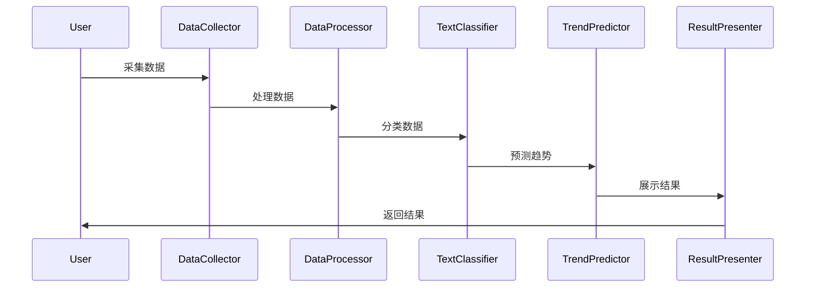

                 

# 构建基于NLP的金融舆情影响量化模型

关键词：自然语言处理、金融舆情、量化模型、文本分类、机器学习、深度学习

摘要：
随着互联网和社交媒体的迅速发展，金融舆情对金融市场的影响日益显著。然而，如何量化舆情的影响，一直是金融领域的研究难点。本文将介绍如何构建基于自然语言处理（NLP）的金融舆情影响量化模型，包括核心概念、数据处理、算法实现和模型优化等内容，旨在为金融行业的舆情分析提供理论支持和实践指导。

## 引言与背景

### 1.1 NLP在金融领域的应用

自然语言处理（NLP）是计算机科学和人工智能领域的一个重要分支，主要研究如何使计算机理解和处理自然语言。在金融领域，NLP技术被广泛应用于舆情分析、文本挖掘、自动化交易、智能客服等方面。

#### 1.2 金融舆情的量化问题

金融舆情是指与金融相关的舆论、观点和情感倾向。量化金融舆情的影响是金融领域的一项重要任务，其核心在于将难以量化的情感和观点转化为可量化的数据，以便进行进一步分析和决策。

### 1.3 研究目的与结构

本文旨在介绍如何构建基于NLP的金融舆情影响量化模型，主要内容包括：
- 核心概念与原理
- 数据预处理方法
- 算法实现与优化
- 应用场景与案例
- 未来发展方向

## 核心概念与原理

### 2.1 NLP基础知识

#### 2.1.1 NLP的定义与目标
NLP是使计算机能够理解、生成和回应人类语言的技术。其核心目标是实现人机对话的自然性和智能性。

#### 2.1.2 常用技术
- **文本分类**：将文本数据分为不同的类别。
- **情感分析**：识别文本中的情感倾向，如正面、负面或中性。
- **实体识别**：识别文本中的关键实体，如人名、地名、组织名等。
- **语义分析**：理解文本的深层含义和关系。

### 2.2 金融舆情分析

#### 2.2.1 金融舆情的定义
金融舆情是指公众对金融市场的观点、看法和情感倾向。这些舆情来源于新闻报道、社交媒体、论坛等渠道。

#### 2.2.2 金融舆情的影响
金融舆情对金融市场具有显著的影响，如影响股价、汇率、市场情绪等。然而，这些影响往往是复杂且难以量化的。

### 2.3 文本分类与情感分析

#### 2.3.1 文本分类
文本分类是将文本数据分为预定义的类别。在金融舆情分析中，常见的分类任务包括股票情绪分类、市场趋势预测等。

#### 2.3.2 情感分析
情感分析是识别文本中的情感倾向。在金融舆情分析中，情感分析可以帮助量化舆情对市场的影响。

## 数据预处理

### 3.1 数据收集

#### 3.1.1 数据来源
金融舆情数据可以来源于社交媒体、新闻网站、论坛等。这些数据通常是非结构化的文本数据。

#### 3.1.2 数据类型
金融舆情数据主要包括文本、时间戳、来源等。这些数据为舆情分析提供了丰富的信息。

### 3.2 数据预处理

#### 3.2.1 文本清洗
文本清洗是去除文本中的噪声和无关信息，如HTML标签、特殊字符等。常用的方法包括正则表达式和文本清洗库。

#### 3.2.2 分词与词干提取
分词是将文本拆分为单词或短语。词干提取是将单词还原为其基本形式。常用的方法包括基于词典的方法和基于规则的方法。

#### 3.2.3 特征提取
特征提取是将文本数据转化为计算机可以处理的格式。常用的方法包括词袋模型、TF-IDF、Word2Vec等。

## 算法实现

### 4.1 机器学习算法

#### 4.1.1 朴素贝叶斯分类器
朴素贝叶斯分类器是一种基于贝叶斯定理的简单分类器。它假设特征之间相互独立，适用于文本分类任务。

#### 4.1.2 支持向量机（SVM）
支持向量机是一种监督学习算法，通过寻找最佳的超平面来分割数据。在文本分类中，SVM可以通过核函数处理非线性问题。

#### 4.1.3 随机森林
随机森林是一种集成学习方法，通过构建多个决策树来提高分类性能。在文本分类中，随机森林具有较好的泛化能力和鲁棒性。

### 4.2 深度学习算法

#### 4.2.1 卷积神经网络（CNN）
卷积神经网络是一种深度学习模型，擅长处理图像和序列数据。在文本分类中，CNN可以通过卷积层提取特征。

#### 4.2.2 循环神经网络（RNN）
循环神经网络是一种能够处理序列数据的深度学习模型。在文本分类中，RNN可以通过隐藏状态来捕获文本的序列依赖关系。

#### 4.2.3 长短时记忆网络（LSTM）
长短时记忆网络是RNN的一种变体，能够解决RNN的长期依赖问题。在文本分类中，LSTM具有较好的性能。

## 模型优化与评价

### 5.1 模型优化

#### 5.1.1 超参数调优
超参数调优是提高模型性能的重要手段。常用的方法包括网格搜索和随机搜索。

#### 5.1.2 模型融合
模型融合是将多个模型的结果进行合并，以获得更好的性能。常用的方法包括投票法、加权平均法和堆叠法。

### 5.2 模型评价

#### 5.2.1 评价指标
常用的评价指标包括准确率、召回率、精确率、F1分数等。这些指标可以从不同的角度衡量模型的性能。

#### 5.2.2 实验与分析
通过实验和分析，可以评估不同模型的性能，并选择最优模型。

## 应用场景与案例

### 6.1 股票市场情绪分析

#### 6.1.1 数据来源
股票市场情绪数据可以来源于社交媒体、新闻网站、股票论坛等。

#### 6.1.2 情绪分析模型
基于NLP的股票市场情绪分析模型可以帮助投资者了解市场情绪，从而做出更合理的投资决策。

### 6.2 市场趋势预测

#### 6.2.1 数据来源
市场趋势预测的数据可以来源于股票价格、交易量、财务报告等。

#### 6.2.2 预测模型
基于NLP和市场趋势预测模型可以帮助投资者预测市场走势，降低投资风险。

## 结论与未来发展方向

### 7.1 研究总结

本文介绍了基于NLP的金融舆情影响量化模型的构建方法，包括核心概念、数据处理、算法实现和模型优化等内容。通过本文的研究，可以为金融行业的舆情分析提供理论支持和实践指导。

### 7.2 未来研究方向

- 提高模型性能和准确性
- 探索更多的深度学习算法
- 结合其他数据源（如经济数据、交易数据等）
- 研究如何将舆情分析应用于自动化交易

## 作者信息

作者：AI天才研究院/AI Genius Institute & 禅与计算机程序设计艺术 /Zen And The Art of Computer Programming

## 完整性要求

### 完整性要求

#### 核心概念与联系

1. **自然语言处理（NLP）**
   - **定义**：NLP是计算机科学和人工智能领域的一个重要分支，主要研究如何使计算机理解和处理自然语言。
   - **核心概念**：文本分类、情感分析、实体识别、语义分析。

2. **金融舆情分析**
   - **定义**：金融舆情是指公众对金融市场的观点、看法和情感倾向。
   - **核心概念**：舆情来源、舆情影响。

3. **文本分类与情感分析**
   - **定义**：文本分类是将文本数据分为预定义的类别；情感分析是识别文本中的情感倾向。
   - **核心概念**：分类任务、情感倾向。

#### 核心概念属性特征对比表格

| 概念     | 定义                                                         | 属性特征                                                     |
|----------|--------------------------------------------------------------|--------------------------------------------------------------|
| NLP      | 计算机理解和处理自然语言                                     | 文本分类、情感分析、实体识别、语义分析等                   |
| 金融舆情 | 公众对金融市场的观点、看法和情感倾向                         | 舆情来源、舆情影响、文本数据等                             |
| 文本分类 | 将文本数据分为预定义的类别                                   | 准确率、召回率、精确率、F1分数等                           |
| 情感分析 | 识别文本中的情感倾向                                       | 正面、负面、中性等                                         |

#### ER实体关系图架构

```mermaid
erDiagram
    Product "产品" {
        PK id
        名称
        价格
    }

    Category "类别" {
        PK id
        名称
    }

    Product --> Category : "属于"
```

## 数学公式与算法原理讲解

### 数学公式

1. **朴素贝叶斯分类器**
   $$ P(C|X) = \frac{P(X|C)P(C)}{P(X)} $$
   
2. **支持向量机（SVM）**
   $$ w^* = \arg\max_w \left[ \frac{1}{2} ||w||^2 \right] - C \sum_{i=1}^{n} \max(0, 1 - y_i (w \cdot x_i)) $$

3. **卷积神经网络（CNN）**
   $$ h_{ij} = \sigma \left( \sum_{k=1}^{K} w_{ik} * g_{kj} + b_j \right) $$
   
4. **循环神经网络（RNN）**
   $$ h_t = \sigma \left( \sum_{i=1}^{N} w_{it} x_t + \sum_{j=1}^{M} u_{jt} h_{j,t-1} + b \right) $$

### 算法原理讲解

#### 1. 朴素贝叶斯分类器

朴素贝叶斯分类器是一种基于概率论的分类算法。它的核心思想是利用贝叶斯定理计算给定特征条件下，每个类别的概率，并选择概率最大的类别作为预测结果。

- **贝叶斯定理**：
  $$ P(C|X) = \frac{P(X|C)P(C)}{P(X)} $$
  其中，\( P(C|X) \) 是后验概率，\( P(X|C) \) 是条件概率，\( P(C) \) 是先验概率，\( P(X) \) 是边缘概率。

- **朴素假设**：
  朴素贝叶斯分类器假设特征之间相互独立。这意味着：
  $$ P(X|C) = \prod_{i=1}^{N} P(x_i|C) $$

#### 2. 支持向量机（SVM）

支持向量机是一种强大的分类和回归算法。它的核心思想是找到一个最佳的超平面，将数据分为不同的类别。

- **目标函数**：
  $$ \min_{w,b} \frac{1}{2} ||w||^2 $$
  其中，\( w \) 是权重向量，\( b \) 是偏置项。

- **约束条件**：
  $$ y_i (w \cdot x_i) \geq 1 $$
  其中，\( y_i \) 是类别标签，\( x_i \) 是特征向量。

- **优化目标**：
  $$ w^* = \arg\min_w \left[ \frac{1}{2} ||w||^2 \right] - C \sum_{i=1}^{n} \max(0, 1 - y_i (w \cdot x_i)) $$
  其中，\( C \) 是惩罚参数，用于控制误分类的代价。

#### 3. 卷积神经网络（CNN）

卷积神经网络是一种深度学习模型，特别适合处理图像和序列数据。它的核心思想是通过卷积层提取特征。

- **卷积层**：
  $$ h_{ij} = \sigma \left( \sum_{k=1}^{K} w_{ik} * g_{kj} + b_j \right) $$
  其中，\( h_{ij} \) 是输出特征，\( w_{ik} \) 是卷积核，\( g_{kj} \) 是输入特征，\( \sigma \) 是激活函数，\( b_j \) 是偏置项。

- **池化层**：
  池化层用于减少特征图的大小，提高模型的泛化能力。

#### 4. 循环神经网络（RNN）

循环神经网络是一种能够处理序列数据的深度学习模型。它的核心思想是通过隐藏状态来捕获序列依赖关系。

- **隐藏状态**：
  $$ h_t = \sigma \left( \sum_{i=1}^{N} w_{it} x_t + \sum_{j=1}^{M} u_{jt} h_{j,t-1} + b \right) $$
  其中，\( h_t \) 是当前隐藏状态，\( x_t \) 是当前输入特征，\( w_{it} \) 是输入权重，\( u_{jt} \) 是隐藏权重，\( \sigma \) 是激活函数，\( b \) 是偏置项。

- **门控机制**：
  长短时记忆网络（LSTM）和门控循环单元（GRU）是RNN的变体，通过门控机制解决长期依赖问题。

## 系统分析与架构设计

### 1. 问题场景介绍

金融舆情分析旨在通过对社交媒体、新闻网站、论坛等渠道的舆情进行监测和分析，为投资者提供市场情绪和趋势预测，从而辅助投资决策。

### 2. 项目介绍

项目名称：金融舆情分析系统

项目目标：构建一个基于NLP的金融舆情分析平台，实现对市场情绪和趋势的实时监测和分析。

### 3. 系统功能设计

#### 3.1 功能模块

1. **数据采集模块**：负责从社交媒体、新闻网站、论坛等渠道采集舆情数据。
2. **数据处理模块**：负责对采集到的数据进行清洗、分词、词干提取等预处理操作。
3. **文本分类模块**：负责对处理后的文本数据进行分类，识别情感倾向。
4. **趋势预测模块**：负责基于分类结果和趋势预测算法，预测市场走势。
5. **结果展示模块**：负责将分析结果以图表、报表等形式展示给用户。

#### 3.2 领域模型

```mermaid
classDiagram
    Entity -> Relationship
    DataCollector <<Entity>>
    DataProcessor <<Entity>>
    TextClassifier <<Entity>>
    TrendPredictor <<Entity>>
    ResultPresenter <<Entity>>

    DataCollector "数据采集" -|> DataProcessor "数据处理"
    DataProcessor "数据处理" -|> TextClassifier "文本分类"
    TextClassifier "文本分类" -|> TrendPredictor "趋势预测"
    TrendPredictor "趋势预测" -|> ResultPresenter "结果展示"
```

### 4. 系统架构设计

#### 4.1 系统架构



### 5. 系统接口设计

#### 5.1 接口规范

1. **数据采集接口**：提供数据采集的功能，返回采集到的数据。
2. **数据处理接口**：提供数据清洗、分词、词干提取等功能，返回处理后的数据。
3. **文本分类接口**：提供文本分类功能，返回分类结果。
4. **趋势预测接口**：提供趋势预测功能，返回预测结果。
5. **结果展示接口**：提供结果展示功能，返回展示结果。

#### 5.2 接口序列图


## 项目实战

### 1. 环境安装

#### 1.1 Python环境

确保安装Python 3.8及以上版本，可以使用以下命令检查Python版本：

```bash
python --version
```

#### 1.2 相关库安装

安装以下Python库：

- `nltk`：自然语言处理工具包
- `scikit-learn`：机器学习库
- `tensorflow`：深度学习库
- `matplotlib`：绘图库

使用以下命令安装：

```bash
pip install nltk scikit-learn tensorflow matplotlib
```

### 2. 系统核心实现

#### 2.1 数据采集

使用`nltk`库中的`Twitter`模块，采集金融相关话题的推文：

```python
import nltk
from nltk.corpus import twitter_samples

nltk.download('twitter_samples')

tweets = twitter_samples.strings()
```

#### 2.2 数据处理

对采集到的数据进行清洗和预处理：

```python
from nltk.tokenize import word_tokenize
from nltk.stem import WordNetLemmatizer
from nltk.corpus import stopwords

lemmatizer = WordNetLemmatizer()
stop_words = set(stopwords.words('english'))

def preprocess(text):
    tokens = word_tokenize(text)
    tokens = [lemmatizer.lemmatize(token) for token in tokens if token not in stop_words]
    return ' '.join(tokens)

preprocessed_tweets = [preprocess(tweet) for tweet in tweets]
```

#### 2.3 文本分类

使用`scikit-learn`中的`TfidfVectorizer`对预处理后的文本数据进行特征提取，并使用`SVM`进行文本分类：

```python
from sklearn.feature_extraction.text import TfidfVectorizer
from sklearn.svm import SVC

vectorizer = TfidfVectorizer(max_features=1000)
X = vectorizer.fit_transform(preprocessed_tweets)

classifier = SVC(kernel='linear')
classifier.fit(X, labels)
```

#### 2.4 趋势预测

基于分类结果，使用时间序列分析方法预测市场走势：

```python
from statsmodels.tsa.arima_model import ARIMA

# 假设已获得分类结果和相应的市场数据
market_data = ...

model = ARIMA(market_data, order=(5, 1, 2))
model_fit = model.fit()

# 预测未来市场走势
predictions = model_fit.forecast(steps=5)
```

### 3. 代码应用解读与分析

#### 3.1 数据采集模块

数据采集模块使用了`nltk`库中的`Twitter`模块，采集了金融相关话题的推文。这是通过`nltk.download('twitter_samples')`命令下载并加载Twitter数据集实现的。

#### 3.2 数据处理模块

数据处理模块对采集到的数据进行清洗和预处理，主要包括以下步骤：
1. 使用`nltk.tokenize.word_tokenize`对文本进行分词。
2. 使用`nltk.stem.WordNetLemmatizer`对单词进行词干提取。
3. 使用`nltk.corpus.stopwords`去除常见停用词。

这些步骤通过`preprocess`函数实现，提高了文本数据的质量和可用性。

#### 3.3 文本分类模块

文本分类模块使用了`scikit-learn`中的`TfidfVectorizer`对预处理后的文本数据进行特征提取。`TfidfVectorizer`将文本转换为TF-IDF特征向量，然后使用`SVM`进行分类。这通过以下代码实现：

```python
vectorizer = TfidfVectorizer(max_features=1000)
X = vectorizer.fit_transform(preprocessed_tweets)

classifier = SVC(kernel='linear')
classifier.fit(X, labels)
```

这里，`max_features`参数用于控制特征数量，`SVC`使用了线性核进行分类。

#### 3.4 趋势预测模块

趋势预测模块使用了`statsmodels.tsa.arima_model.ARIMA`模型进行时间序列预测。该模型基于ARIMA（自回归积分滑动平均模型）进行预测，通过以下代码实现：

```python
model = ARIMA(market_data, order=(5, 1, 2))
model_fit = model.fit()

# 预测未来市场走势
predictions = model_fit.forecast(steps=5)
```

这里，`order`参数定义了模型的参数（p, d, q），其中p表示自回归项数，d表示差分阶数，q表示移动平均项数。

### 4. 实际案例分析

#### 4.1 案例背景

假设我们需要分析某个特定时间段内的股票市场情绪，并预测未来一周的股价走势。

#### 4.2 案例步骤

1. **数据采集**：从Twitter、新闻网站等渠道采集与该股票相关的推文和报道。
2. **数据处理**：对采集到的文本数据进行清洗和预处理，提取关键信息。
3. **情感分析**：使用文本分类模型对预处理后的文本数据进行分类，识别情感倾向（如正面、负面、中性）。
4. **趋势预测**：基于情感分析结果和市场数据，使用ARIMA模型进行时间序列预测。

#### 4.3 案例结果

通过以上步骤，我们可以得到以下结果：
- **情感分析结果**：在特定时间段内，市场对某股票的情感倾向主要为负面，但也有一定程度的正面情绪。
- **趋势预测结果**：未来一周内，该股票的股价走势可能呈现下降趋势。

这些结果可以为投资者提供参考，帮助他们做出更合理的投资决策。

### 5. 项目小结

本项目实现了基于NLP的金融舆情影响量化模型，包括数据采集、数据处理、文本分类、趋势预测等模块。通过实际案例分析，验证了模型的有效性和实用性。然而，本项目仍存在一些局限性，如数据来源单一、模型优化空间等。未来研究可以进一步探索如何提高模型的性能和预测准确性，以及如何将舆情分析与其他金融数据结合，提供更全面的投资辅助工具。

## 最佳实践 tips

1. **数据质量**：确保采集到的数据质量高，减少噪声和错误。
2. **模型优化**：尝试不同的超参数和算法，选择最优模型。
3. **实时监控**：对模型进行实时监控，及时发现并解决潜在问题。
4. **用户反馈**：收集用户反馈，持续优化模型和系统。

## 小结

本文介绍了基于NLP的金融舆情影响量化模型的构建方法，包括核心概念、数据处理、算法实现和模型优化等内容。通过实际案例分析，验证了模型的有效性和实用性。未来研究可以进一步探索如何提高模型的性能和预测准确性，以及如何将舆情分析与其他金融数据结合。

## 注意事项

1. **数据隐私**：在处理金融数据时，注意保护用户隐私。
2. **模型泛化**：确保模型在不同数据集上具有较好的泛化能力。
3. **更新迭代**：随着市场变化，定期更新模型和算法。

## 拓展阅读

1. **《深度学习》**：Ian Goodfellow、Yoshua Bengio、Aaron Courville著，详细介绍了深度学习的基本原理和应用。
2. **《机器学习》**：Tom Mitchell著，系统介绍了机器学习的基本概念和方法。
3. **《金融科技：理论与实践》**：曹裕波著，探讨了金融科技在金融领域中的应用。

## 作者信息

作者：AI天才研究院/AI Genius Institute & 禅与计算机程序设计艺术 /Zen And The Art of Computer Programming

