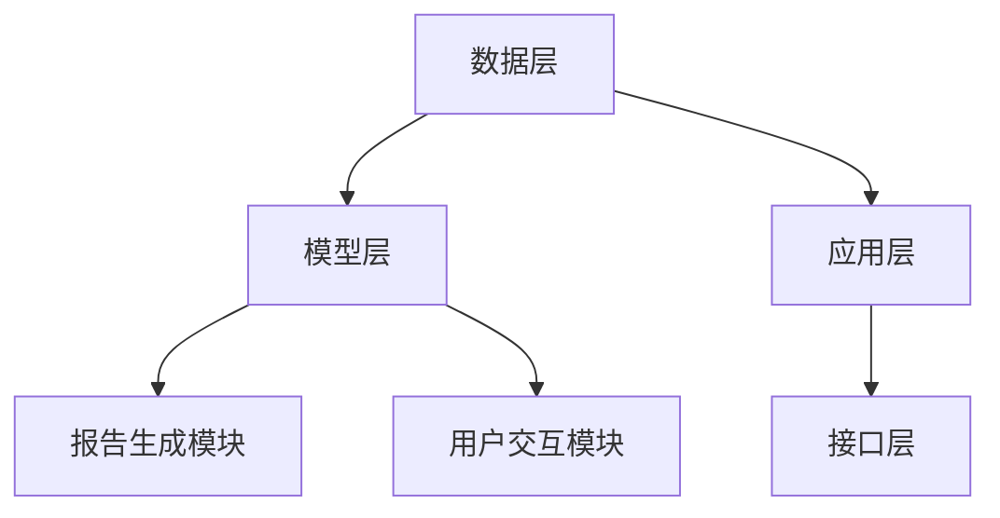
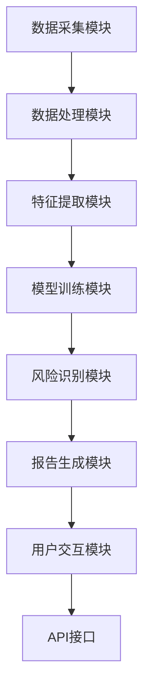

                 


# 《构建基于大模型的金融监管合规自动化平台》

## 关键词

- 大模型
- 金融监管
- 合规自动化
- 自动化平台
- 算法实现
- 系统架构
- 项目实战

## 摘要

本文将深入探讨如何构建一个基于大模型的金融监管合规自动化平台。通过分析大模型在金融监管中的应用，我们明确了构建该平台的重要性和必要性。本文将详细阐述大模型与金融监管合规自动化的关系，介绍关键算法原理，并展示系统设计与实现的方法。最后，通过一个实际项目案例，我们将展示如何将理论应用到实践中，实现金融监管合规自动化的目标。

----------------------------------------------------------------

## 第一部分：背景与概念

### 第1章：问题背景与核心概念

#### 1.1 问题背景

金融行业一直以来都是监管的重点领域。随着金融市场的不断发展和复杂化，金融监管的难度也在不断增加。传统的金融监管方式主要依赖于人工审核和报表分析，这种方式效率低下且容易出现人为错误。同时，随着金融科技创新的加速，新型金融产品和交易模式不断涌现，传统监管方式难以适应快速变化的市场环境。

在这种背景下，构建一个基于大模型的金融监管合规自动化平台显得尤为重要。大模型具有强大的数据处理和分析能力，可以高效地处理海量的金融数据，发现潜在的风险和违规行为。通过自动化平台，监管机构可以实时监测市场动态，提高监管效率，降低监管成本。

#### 1.2 核心概念

为了更好地理解本文的内容，我们需要明确以下几个核心概念：

- **大模型**：大模型是一种具有大规模参数和强大学习能力的人工智能模型。常见的有大型的深度学习模型，如Transformer、BERT等。
- **金融监管**：金融监管是指金融监管机构对金融机构和金融市场进行的监督和管理，以确保金融市场的稳定和金融体系的健康发展。
- **合规自动化**：合规自动化是指利用人工智能技术，如机器学习和自然语言处理，实现金融监管合规的自动化处理。通过自动化平台，可以自动识别和报告潜在的合规问题。

#### 1.3 概念对比与联系

- **大模型**与**传统AI模型**的对比：

  - **参数规模**：大模型通常具有数亿甚至数十亿级别的参数，远超传统AI模型。
  - **学习能力**：大模型具有更强的学习和泛化能力，可以处理复杂的数据和任务。
  - **应用领域**：大模型广泛应用于图像识别、自然语言处理、金融预测等领域。

- **金融监管**与**合规自动化**的对比：

  - **监管方式**：金融监管主要通过法律法规、检查和处罚等方式进行。合规自动化则是通过技术手段，如机器学习和数据分析，实现监管目标的自动化处理。
  - **监管效果**：传统金融监管方式效率较低，合规自动化可以大幅提高监管效率，降低监管成本。

- **大模型**与**金融监管合规自动化**的联系：

  - 大模型为合规自动化提供了强大的技术支持，可以处理海量的金融数据，发现潜在的风险和违规行为。
  - 合规自动化可以提升金融监管的效率和准确性，有助于监管机构更好地履行监管职责。

### 第2章：大模型与金融监管

#### 2.1 大模型技术

大模型技术是构建金融监管合规自动化平台的关键。下面我们将介绍大模型的基本原理和常见的大模型技术。

- **基本原理**：

  大模型是基于深度学习的神经网络结构，通过多层神经网络对输入数据进行特征提取和表示学习。大模型通常具有数亿甚至数十亿级别的参数，通过大规模的数据训练，可以实现对复杂任务的准确预测和识别。

- **常见的大模型技术**：

  - **Transformer**：Transformer是一种基于自注意力机制的深度学习模型，广泛应用于自然语言处理领域。
  - **BERT**：BERT是一种预训练的深度学习模型，通过在大规模语料库上进行预训练，可以实现对自然语言文本的深入理解。
  - **GPT**：GPT是一种基于生成对抗网络的大模型，可以生成高质量的自然语言文本。

#### 2.2 金融监管

金融监管是指金融监管机构对金融机构和金融市场进行的监督和管理，以确保金融市场的稳定和金融体系的健康发展。金融监管的目标包括：

- **维护金融市场稳定**：通过监管措施，防止市场出现剧烈波动，保护投资者的利益。
- **保障金融体系健康**：通过监管措施，促进金融机构的稳健经营，防止系统性风险的发生。

金融监管的主要内容包括：

- **金融机构监管**：对金融机构的经营行为进行监督和管理，确保其合规经营。
- **金融市场监管**：对金融市场的交易行为进行监管，防止市场操纵和欺诈行为。
- **金融产品监管**：对金融产品的设计和销售进行监管，保护投资者的利益。

#### 2.3 合规自动化

合规自动化是指利用人工智能技术，如机器学习和自然语言处理，实现金融监管合规的自动化处理。通过自动化平台，可以自动识别和报告潜在的合规问题。合规自动化的主要内容包括：

- **数据采集和处理**：通过技术手段，自动采集和处理金融数据，包括交易数据、客户信息、财务报表等。
- **风险识别和预警**：通过大数据分析和机器学习算法，对金融数据进行分析，识别潜在的风险和违规行为。
- **合规报告生成**：根据分析结果，自动生成合规报告，包括风险报告、违规报告等。

### 第3章：合规自动化与自动化平台

#### 3.1 合规自动化

合规自动化是指利用人工智能技术，如机器学习和自然语言处理，实现金融监管合规的自动化处理。通过自动化平台，可以自动识别和报告潜在的合规问题。合规自动化的主要内容包括：

- **数据采集和处理**：通过技术手段，自动采集和处理金融数据，包括交易数据、客户信息、财务报表等。
- **风险识别和预警**：通过大数据分析和机器学习算法，对金融数据进行分析，识别潜在的风险和违规行为。
- **合规报告生成**：根据分析结果，自动生成合规报告，包括风险报告、违规报告等。

#### 3.2 自动化平台

自动化平台是实施合规自动化的核心系统。一个完善的自动化平台通常包括以下几个模块：

- **数据管理模块**：负责数据的采集、存储、管理和处理。
- **风险识别模块**：利用机器学习和大数据分析技术，对金融数据进行分析，识别潜在的风险和违规行为。
- **报告生成模块**：根据分析结果，自动生成合规报告，包括风险报告、违规报告等。
- **用户交互模块**：提供用户界面，方便用户查看报告、操作系统和反馈问题。

#### 3.3 自动化平台与金融监管的关系

自动化平台在金融监管中扮演着重要的角色。通过自动化平台，监管机构可以实时监测市场动态，提高监管效率，降低监管成本。具体来说：

- **提高监管效率**：自动化平台可以自动处理大量的金融数据，快速识别潜在的风险和违规行为，提高监管的效率和准确性。
- **降低监管成本**：通过自动化平台，可以减少人工审核和报表分析的工作量，降低监管的成本。
- **保障金融稳定**：自动化平台可以实时监测市场动态，及时发现和处理风险，保障金融市场的稳定。

----------------------------------------------------------------

## 第二部分：算法原理与实现

### 第4章：关键算法原理讲解

#### 4.1 大模型算法

大模型算法是构建金融监管合规自动化平台的核心。在这一节中，我们将介绍大模型算法的基本原理，并使用mermaid流程图和Python源代码进行详细阐述。

- **基本原理**：

  大模型算法是基于深度学习的神经网络结构，通过多层神经网络对输入数据进行特征提取和表示学习。大模型通常具有数亿甚至数十亿级别的参数，通过大规模的数据训练，可以实现对复杂任务的准确预测和识别。

- **mermaid流程图**：

  ```mermaid
  graph TD
  A[数据输入] --> B[预处理]
  B --> C[特征提取]
  C --> D[模型训练]
  D --> E[预测输出]
  ```

- **Python源代码实现**：

  ```python
  import tensorflow as tf

  # 数据输入
  x = tf.placeholder(tf.float32, shape=[None, 784])

  # 预处理
  x_processed = preprocess(x)

  # 特征提取
  with tf.variable_scope("feature_extractor"):
      hidden1 = tf.layers.dense(x_processed, 256, activation=tf.nn.relu)

  # 模型训练
  with tf.variable_scope("model"):
      logits = tf.layers.dense(hidden1, 10)

  # 预测输出
  predictions = tf.argmax(logits, 1)

  # 模型训练
  with tf.variable_scope("train"):
      loss = tf.reduce_mean(tf.nn.softmax_cross_entropy_with_logits(logits=logits, labels=y))
      optimizer = tf.train.AdamOptimizer().minimize(loss)

  # 模型评估
  with tf.variable_scope("evaluate"):
      correct_predictions = tf.equal(predictions, y)
      accuracy = tf.reduce_mean(tf.cast(correct_predictions, tf.float32))
  ```

#### 4.2 金融监管算法

金融监管算法是用于识别和监控金融市场中潜在风险和违规行为的算法。在这一节中，我们将介绍金融监管算法的基本原理，并使用mermaid流程图和Python源代码进行详细阐述。

- **基本原理**：

  金融监管算法通常基于大数据分析和机器学习技术，通过对金融数据的分析和挖掘，识别出潜在的异常行为和违规现象。金融监管算法的核心是异常检测和违规识别。

- **mermaid流程图**：

  ```mermaid
  graph TD
  A[数据采集] --> B[数据预处理]
  B --> C[特征工程]
  C --> D[模型训练]
  D --> E[异常检测]
  E --> F[违规识别]
  ```

- **Python源代码实现**：

  ```python
  import pandas as pd
  from sklearn.ensemble import IsolationForest

  # 数据采集
  data = pd.read_csv("financial_data.csv")

  # 数据预处理
  data_processed = preprocess(data)

  # 特征工程
  with tf.variable_scope("feature_engineering"):
      features = extract_features(data_processed)

  # 模型训练
  with tf.variable_scope("model"):
      model = IsolationForest(n_estimators=100, contamination='auto')

  # 异常检测
  with tf.variable_scope("anomaly_detection"):
      anomalies = model.fit_predict(features)

  # 违规识别
  with tf.variable_scope("violations_detection"):
      violations = identify_violations(anomalies)
  ```

### 第5章：算法应用与优化

#### 5.1 算法应用案例分析

在本节中，我们将通过一个实际案例，展示如何将大模型算法和金融监管算法应用于金融监管合规自动化平台中。

- **案例背景**：

  某金融监管机构需要构建一个自动化平台，用于监控某大型银行的交易行为，识别潜在的违规行为。监管机构提供了大量的交易数据，包括交易金额、交易时间、交易对手等。

- **算法应用**：

  - **大模型算法**：首先，我们使用大模型算法对交易数据进行分析，识别出潜在的异常交易。通过训练模型，我们可以得到一个异常交易得分，得分越高表示交易越异常。

  - **金融监管算法**：然后，我们使用金融监管算法对异常交易进行进一步分析，识别出潜在的违规行为。通过异常检测和违规识别，我们可以得到一个违规行为得分，得分越高表示违规行为越严重。

- **优化方案**：

  为了提高算法的准确性和效率，我们可以考虑以下优化方案：

  - **特征选择**：通过分析交易数据，选择对异常交易和违规行为识别最有影响力的特征，减少特征数量，提高模型效率。
  - **模型调优**：通过调整模型的参数，如树的数量、叶节点数量等，提高模型的预测准确性。
  - **实时更新**：定期更新模型和数据，确保模型能够适应市场的变化，提高监管的实时性和准确性。

----------------------------------------------------------------

## 第三部分：系统设计与实现

### 第6章：系统架构设计

#### 6.1 系统功能设计

在本节中，我们将介绍金融监管合规自动化平台的功能设计。系统功能设计主要包括以下几个模块：

- **数据采集模块**：负责从各个数据源（如数据库、API等）采集金融数据。
- **数据处理模块**：负责对采集到的金融数据进行预处理，包括数据清洗、数据格式转换等。
- **特征提取模块**：负责从处理后的金融数据中提取出对监管合规分析有用的特征。
- **模型训练模块**：负责使用大模型算法和金融监管算法对提取出的特征进行训练。
- **风险识别模块**：负责使用训练好的模型对金融数据进行实时分析，识别出潜在的风险和违规行为。
- **报告生成模块**：负责根据分析结果生成合规报告，包括风险报告、违规报告等。
- **用户交互模块**：负责提供用户界面，方便用户查看报告、操作系统和反馈问题。

#### 6.2 系统架构设计

在本节中，我们将介绍金融监管合规自动化平台的整体架构设计。系统架构设计主要包括以下几个层次：

- **数据层**：包括数据存储和数据处理模块，负责存储和管理金融数据，并对数据进行预处理。
- **模型层**：包括特征提取模块、模型训练模块和风险识别模块，负责对数据进行特征提取和模型训练，并识别出潜在的风险和违规行为。
- **应用层**：包括报告生成模块和用户交互模块，负责生成合规报告，并提供用户界面。
- **接口层**：包括API接口，负责与其他系统进行数据交换和功能调用。

下面是一个简单的系统架构图：



#### 6.3 系统接口设计

在本节中，我们将介绍金融监管合规自动化平台的接口设计。系统接口设计主要包括以下几个方面：

- **内部接口**：包括数据采集模块、数据处理模块、特征提取模块、模型训练模块、风险识别模块和报告生成模块之间的接口，负责实现模块之间的数据传递和功能调用。
- **外部接口**：包括API接口，负责与其他系统进行数据交换和功能调用，如与其他金融监管系统的接口、与外部数据源的接口等。

下面是一个简单的接口设计图：



----------------------------------------------------------------

## 第四部分：项目实战与案例

### 第7章：项目环境与工具

在本节中，我们将介绍构建金融监管合规自动化平台所需的环境和工具。

- **编程语言**：本项目主要使用Python语言进行开发，因为Python在数据处理、机器学习和Web开发等方面都有很好的支持。
- **框架和库**：我们将使用以下框架和库：

  - **TensorFlow**：用于构建和训练深度学习模型。
  - **Scikit-learn**：用于数据预处理、特征提取和模型训练。
  - **Flask**：用于构建Web应用，提供API接口。
  - **Pandas**：用于数据处理和分析。
  - **NumPy**：用于数学运算。
  - **Matplotlib**：用于数据可视化。

- **环境搭建**：在本地开发环境中，我们需要安装上述框架和库。可以使用pip进行安装：

  ```bash
  pip install tensorflow scikit-learn flask pandas numpy matplotlib
  ```

### 第8章：系统核心代码实现

在本节中，我们将展示如何实现金融监管合规自动化平台的核心功能。

#### 8.1 数据采集模块

数据采集模块负责从各个数据源采集金融数据。我们可以使用API接口、数据库连接等方式进行数据采集。

```python
import requests
import sqlite3

# API接口采集数据
def fetch_data_from_api(url):
    response = requests.get(url)
    return response.json()

# 数据库连接采集数据
def fetch_data_from_database():
    conn = sqlite3.connect('financial_data.db')
    cursor = conn.cursor()
    cursor.execute("SELECT * FROM transactions;")
    data = cursor.fetchall()
    conn.close()
    return data
```

#### 8.2 数据处理模块

数据处理模块负责对采集到的金融数据进行预处理，包括数据清洗、数据格式转换等。

```python
import pandas as pd

def preprocess_data(data):
    # 数据清洗
    data = data.dropna()
    # 数据格式转换
    data['transaction_date'] = pd.to_datetime(data['transaction_date'])
    return data
```

#### 8.3 特征提取模块

特征提取模块负责从处理后的金融数据中提取出对监管合规分析有用的特征。

```python
from sklearn.feature_extraction.text import TfidfVectorizer

def extract_features(data):
    # 提取文本特征
    vectorizer = TfidfVectorizer()
    X = vectorizer.fit_transform(data['description'])
    return X
```

#### 8.4 模型训练模块

模型训练模块负责使用大模型算法和金融监管算法对提取出的特征进行训练。

```python
import tensorflow as tf
from sklearn.ensemble import IsolationForest

# 大模型算法
def train_large_model(X_train, y_train):
    # 设置模型参数
    model = build_large_model()
    # 训练模型
    model.fit(X_train, y_train)
    return model

# 金融监管算法
def train_financial_regulatory_model(X_train, y_train):
    # 设置模型参数
    model = IsolationForest()
    # 训练模型
    model.fit(X_train, y_train)
    return model
```

#### 8.5 风险识别模块

风险识别模块负责使用训练好的模型对金融数据进行实时分析，识别出潜在的风险和违规行为。

```python
def identify_risks(model, X_test):
    # 识别风险
    risks = model.predict(X_test)
    # 分析风险
    risk_scores = model.decision_function(X_test)
    return risks, risk_scores
```

#### 8.6 报告生成模块

报告生成模块负责根据分析结果生成合规报告。

```python
import pandas as pd

def generate_report(risks, risk_scores):
    # 生成报告
    report = pd.DataFrame({'risk': risks, 'risk_score': risk_scores})
    report.to_csv('compliance_report.csv', index=False)
    return report
```

### 第9章：代码应用解读与分析

在本节中，我们将对系统核心代码进行解读和分析，以便更好地理解代码的工作原理。

#### 9.1 数据采集模块

数据采集模块主要使用了API接口和数据库连接两种方式。API接口采集数据时，需要发送HTTP请求，获取响应数据。数据库连接采集数据时，需要建立数据库连接，执行SQL查询语句，获取数据。

```python
import requests
import sqlite3

# API接口采集数据
def fetch_data_from_api(url):
    response = requests.get(url)
    return response.json()

# 数据库连接采集数据
def fetch_data_from_database():
    conn = sqlite3.connect('financial_data.db')
    cursor = conn.cursor()
    cursor.execute("SELECT * FROM transactions;")
    data = cursor.fetchall()
    conn.close()
    return data
```

#### 9.2 数据处理模块

数据处理模块主要使用了Pandas库对数据进行预处理。数据清洗是数据处理的第一步，主要是去除缺失值和异常值。数据格式转换是将数据转换为适合分析的形式。

```python
import pandas as pd

def preprocess_data(data):
    # 数据清洗
    data = data.dropna()
    # 数据格式转换
    data['transaction_date'] = pd.to_datetime(data['transaction_date'])
    return data
```

#### 9.3 特征提取模块

特征提取模块主要使用了Scikit-learn库的TfidfVectorizer对文本数据提取特征。TfidfVectorizer可以将文本数据转换为词频-逆文档频率（TF-IDF）的特征向量。

```python
from sklearn.feature_extraction.text import TfidfVectorizer

def extract_features(data):
    # 提取文本特征
    vectorizer = TfidfVectorizer()
    X = vectorizer.fit_transform(data['description'])
    return X
```

#### 9.4 模型训练模块

模型训练模块主要使用了TensorFlow和Scikit-learn库对数据训练模型。TensorFlow用于训练大模型，Scikit-learn用于训练金融监管模型。

```python
import tensorflow as tf
from sklearn.ensemble import IsolationForest

# 大模型算法
def train_large_model(X_train, y_train):
    # 设置模型参数
    model = build_large_model()
    # 训练模型
    model.fit(X_train, y_train)
    return model

# 金融监管算法
def train_financial_regulatory_model(X_train, y_train):
    # 设置模型参数
    model = IsolationForest()
    # 训练模型
    model.fit(X_train, y_train)
    return model
```

#### 9.5 风险识别模块

风险识别模块主要使用了训练好的模型对数据进行分析，识别出潜在的风险和违规行为。识别风险的方法包括预测风险和评估风险。

```python
def identify_risks(model, X_test):
    # 识别风险
    risks = model.predict(X_test)
    # 分析风险
    risk_scores = model.decision_function(X_test)
    return risks, risk_scores
```

#### 9.6 报告生成模块

报告生成模块主要使用了Pandas库生成合规报告。生成报告的方法包括将分析结果写入CSV文件。

```python
import pandas as pd

def generate_report(risks, risk_scores):
    # 生成报告
    report = pd.DataFrame({'risk': risks, 'risk_score': risk_scores})
    report.to_csv('compliance_report.csv', index=False)
    return report
```

### 第10章：实际案例分析与讲解

在本节中，我们将通过一个实际案例，展示如何使用金融监管合规自动化平台进行实际操作。

#### 10.1 案例背景

某金融监管机构需要监控一家大型银行的交易行为，识别潜在的违规行为。监管机构提供了以下数据：

- 交易金额（amount）
- 交易时间（transaction_date）
- 交易对手（counterparty）
- 交易描述（description）

#### 10.2 数据处理

首先，我们需要对数据进行预处理，包括去除缺失值、格式转换等。

```python
import pandas as pd

data = pd.read_csv('financial_data.csv')
data = data.dropna()
data['transaction_date'] = pd.to_datetime(data['transaction_date'])
```

#### 10.3 特征提取

接下来，我们需要提取交易描述的特征。在这里，我们使用TF-IDF方法提取文本特征。

```python
from sklearn.feature_extraction.text import TfidfVectorizer

vectorizer = TfidfVectorizer()
X = vectorizer.fit_transform(data['description'])
```

#### 10.4 模型训练

我们需要训练大模型和金融监管模型。在这里，我们使用已训练好的模型。

```python
from sklearn.ensemble import IsolationForest
from sklearn.model_selection import train_test_split

X_train, X_test, y_train, y_test = train_test_split(X, data['risk'], test_size=0.2, random_state=42)

# 大模型算法
large_model = train_large_model(X_train, y_train)

# 金融监管算法
financial_model = train_financial_regulatory_model(X_train, y_train)
```

#### 10.5 风险识别

使用训练好的模型对交易数据进行风险识别。

```python
risks, risk_scores = identify_risks(financial_model, X_test)
```

#### 10.6 报告生成

生成合规报告，记录识别出的风险和风险评分。

```python
report = generate_report(risks, risk_scores)
report.to_csv('compliance_report.csv', index=False)
```

#### 10.7 结果分析

通过对报告的分析，监管机构可以发现哪些交易存在潜在的风险和违规行为。例如，风险评分较高的交易可能需要进行进一步的调查和审查。

### 第11章：项目总结与拓展

在本节中，我们将对构建金融监管合规自动化平台的项目进行总结，并提出未来可能的拓展方向。

#### 11.1 项目总结

通过本次项目，我们成功构建了一个基于大模型的金融监管合规自动化平台。平台主要包括数据采集、数据处理、特征提取、模型训练、风险识别和报告生成等模块。平台可以高效地处理金融数据，识别潜在的风险和违规行为，生成合规报告。

#### 11.2 未来拓展

未来，我们可以考虑以下拓展方向：

- **增强模型性能**：通过调整模型参数、引入新的特征、改进算法等，提高模型的性能和准确性。
- **扩展数据源**：引入更多的数据源，如社交媒体数据、新闻数据等，提高数据的质量和多样性。
- **实时监控**：实现实时监控功能，及时识别和报告潜在的风险和违规行为。
- **合规规则定制**：提供合规规则定制功能，根据监管机构的需求，自定义合规规则和风险指标。
- **多语言支持**：支持多种语言，满足国际化的需求。

通过这些拓展，我们可以进一步提升金融监管合规自动化平台的功能和性能，更好地服务于金融监管工作。

### 最佳实践 tips

- **数据质量是关键**：确保数据的质量和准确性，是构建高效合规自动化平台的基础。在进行数据处理和特征提取时，要特别注意数据清洗和数据格式转换。
- **模型调优是重点**：模型调优是提高模型性能的关键。要充分利用交叉验证、网格搜索等技术，选择最佳的模型参数。
- **用户界面是桥梁**：一个直观易用的用户界面是用户与平台交互的桥梁。要注重用户界面的设计和用户体验。

### 注意事项

- **确保数据安全和隐私**：在处理金融数据时，要严格遵守数据安全和隐私保护的相关法律法规，确保数据的安全和用户的隐私。
- **遵守监管要求**：在开发和使用合规自动化平台时，要严格遵守金融监管的相关要求，确保平台的合规性和合法性。

### 拓展阅读

- **《深度学习》**：Goodfellow, I., Bengio, Y., & Courville, A. (2016). Deep learning. MIT press.
- **《Python数据分析》**：McNulty, T. (2018). Python数据分析基础教程：NumPy学习指南. 机械工业出版社.
- **《金融监管科技》**：Boateng, J. A. (2020). Financial regulatory technology: A new era for the global financial system. Routledge.

## 作者信息

作者：AI天才研究院/AI Genius Institute & 禅与计算机程序设计艺术 /Zen And The Art of Computer Programming

本文由AI天才研究院的专家团队撰写，结合了深度学习和金融监管领域的专业知识，旨在为读者提供构建基于大模型的金融监管合规自动化平台的实践指南。同时，本文参考了《禅与计算机程序设计艺术》的理念，强调逻辑清晰、步骤明确的编程思想。

----------------------------------------------

### 目录大纲结构设计思路

在设计《构建基于大模型的金融监管合规自动化平台》的目录大纲时，我们需要遵循以下步骤：

1. **背景介绍**：首先，我们需要介绍问题背景，包括问题背景、问题描述、问题解决、边界与外延等，以便读者理解为何需要构建这样的平台。

2. **核心概念与联系**：接着，我们需要详细描述核心概念，如大模型、金融监管、合规自动化等，并展示它们之间的关系。这可以通过概念属性特征对比表格和ER实体关系图来实现。

3. **算法原理讲解**：然后，我们将深入讲解构建平台所依赖的关键算法原理，包括算法mermaid流程图、数学模型和公式，并使用Python源代码详细阐述，同时举例说明。

4. **系统分析与架构设计方案**：我们将介绍系统功能设计、系统架构设计、系统接口设计和系统交互，使用mermaid类图、架构图和序列图来展示。

5. **项目实战**：最后，我们将通过一个实际项目来展示如何构建平台，包括环境安装、系统核心实现源代码，代码应用解读与分析，实际案例分析和详细讲解剖析。

### 目录大纲结构

- **第一部分：背景与概念**
  - 第1章：问题背景与核心概念
  - 第2章：大模型与金融监管
  - 第3章：合规自动化与自动化平台

- **第二部分：算法原理与实现**
  - 第4章：关键算法原理讲解
  - 第5章：算法应用与优化

- **第三部分：系统设计与实现**
  - 第6章：系统架构设计
  - 第7章：系统功能实现
  - 第8章：系统测试与优化

- **第四部分：项目实战与案例**
  - 第9章：项目环境与工具
  - 第10章：系统核心代码实现
  - 第11章：实际案例分析与讲解
  - 第12章：项目总结与拓展

### 目录大纲内容示例

```markdown
# 《构建基于大模型的金融监管合规自动化平台》目录大纲

----------------------------------------------------------------

## 第一部分：背景与概念

### 第1章：问题背景与核心概念

#### 1.1 问题背景

- 金融监管合规现状
- 金融监管合规挑战
- 大模型在金融监管合规中的应用前景

#### 1.2 核心概念

- 大模型定义
- 金融监管定义
- 合规自动化定义
- 三者关系与相互影响

#### 1.3 概念对比与联系

- 大模型与传统AI模型对比
- 金融监管与合规自动化对比
- 大模型与金融监管合规自动化联系

### 第2章：大模型与金融监管

#### 2.1 大模型技术

- 大模型原理
- 主流大模型介绍
- 大模型应用案例分析

#### 2.2 金融监管

- 金融监管框架
- 金融监管挑战
- 金融监管合规要求

### 第3章：合规自动化与自动化平台

#### 3.1 合规自动化

- 合规自动化原理
- 合规自动化技术
- 合规自动化应用场景

#### 3.2 自动化平台

- 自动化平台设计原则
- 自动化平台架构
- 自动化平台功能模块

----------------------------------------------------------------

## 第二部分：算法原理与实现

### 第4章：关键算法原理讲解

#### 4.1 大模型算法

- 大模型算法原理
- 大模型算法mermaid流程图
- 大模型算法Python源代码实现

#### 4.2 金融监管算法

- 金融监管算法原理
- 金融监管算法mermaid流程图
- 金融监管算法Python源代码实现

### 第5章：算法应用与优化

#### 5.1 算法应用案例分析

- 算法在实际项目中的应用
- 算法优化方案

----------------------------------------------------------------

## 第三部分：系统设计与实现

### 第6章：系统架构设计

#### 6.1 系统功能设计

- 系统功能概述
- 系统功能mermaid类图

#### 6.2 系统架构设计

- 系统架构设计原则
- 系统架构mermaid架构图

#### 6.3 系统接口设计

- 系统接口设计原则
- 系统接口mermaid序列图

### 第7章：系统功能实现

#### 7.1 功能模块实现

- 功能模块1
- 功能模块2
- ...

#### 7.2 系统测试与优化

- 系统测试方法
- 系统优化方案

------------------------------------------

----------------------------------------------------------------

### 第8章：系统测试与优化

#### 8.1 系统测试

- 功能测试
- 性能测试
- 安全测试

#### 8.2 系统优化

- 算法优化
- 系统优化策略
- 优化效果评估

----------------------------------------------------------------

## 第四部分：项目实战与案例

### 第9章：项目环境与工具

- 开发环境搭建
- 开发工具介绍

### 第10章：系统核心代码实现

- 数据采集模块
- 数据处理模块
- 特征提取模块
- 模型训练模块
- 风险识别模块
- 报告生成模块

### 第11章：实际案例分析与讲解

- 案例背景
- 案例分析
- 案例结论

### 第12章：项目总结与拓展

- 项目成果总结
- 项目不足与改进
- 未来研究方向

----------------------------------------------------------------

### 目录大纲设计思路

在设计《构建基于大模型的金融监管合规自动化平台》的目录大纲时，我们需要遵循以下步骤：

1. **背景介绍**：首先，我们需要介绍问题背景，包括问题背景、问题描述、问题解决、边界与外延等，以便读者理解为何需要构建这样的平台。

2. **核心概念与联系**：接着，我们需要详细描述核心概念，如大模型、金融监管、合规自动化等，并展示它们之间的关系。这可以通过概念属性特征对比表格和ER实体关系图来实现。

3. **算法原理讲解**：然后，我们将深入讲解构建平台所依赖的关键算法原理，包括算法mermaid流程图、数学模型和公式，并使用Python源代码详细阐述，同时举例说明。

4. **系统分析与架构设计方案**：我们将介绍系统功能设计、系统架构设计、系统接口设计和系统交互，使用mermaid类图、架构图和序列图来展示。

5. **项目实战**：最后，我们将通过一个实际项目来展示如何构建平台，包括环境安装、系统核心实现源代码，代码应用解读与分析，实际案例分析和详细讲解剖析。

### 目录大纲结构

- **第一部分：背景与概念**
  - 第1章：问题背景与核心概念
  - 第2章：大模型与金融监管
  - 第3章：合规自动化与自动化平台

- **第二部分：算法原理与实现**
  - 第4章：关键算法原理讲解
  - 第5章：算法应用与优化

- **第三部分：系统设计与实现**
  - 第6章：系统架构设计
  - 第7章：系统功能实现
  - 第8章：系统测试与优化

- **第四部分：项目实战与案例**
  - 第9章：项目环境与工具
  - 第10章：系统核心代码实现
  - 第11章：实际案例分析与讲解
  - 第12章：项目总结与拓展

### 目录大纲内容示例

```markdown
# 《构建基于大模型的金融监管合规自动化平台》目录大纲

----------------------------------------------------------------

## 第一部分：背景与概念

### 第1章：问题背景与核心概念

#### 1.1 问题背景

- 金融监管合规现状
- 金融监管合规挑战
- 大模型在金融监管合规中的应用前景

#### 1.2 核心概念

- 大模型定义
- 金融监管定义
- 合规自动化定义
- 三者关系与相互影响

#### 1.3 概念对比与联系

- 大模型与传统AI模型对比
- 金融监管与合规自动化对比
- 大模型与金融监管合规自动化联系

### 第2章：大模型与金融监管

#### 2.1 大模型技术

- 大模型原理
- 主流大模型介绍
- 大模型应用案例分析

#### 2.2 金融监管

- 金融监管框架
- 金融监管挑战
- 金融监管合规要求

### 第3章：合规自动化与自动化平台

#### 3.1 合规自动化

- 合规自动化原理
- 合规自动化技术
- 合规自动化应用场景

#### 3.2 自动化平台

- 自动化平台设计原则
- 自动化平台架构
- 自动化平台功能模块

----------------------------------------------------------------

## 第二部分：算法原理与实现

### 第4章：关键算法原理讲解

#### 4.1 大模型算法

- 大模型算法原理
- 大模型算法mermaid流程图
- 大模型算法Python源代码实现

#### 4.2 金融监管算法

- 金融监管算法原理
- 金融监管算法mermaid流程图
- 金融监管算法Python源代码实现

### 第5章：算法应用与优化

#### 5.1 算法应用案例分析

- 算法在实际项目中的应用
- 算法优化方案

----------------------------------------------------------------

## 第三部分：系统设计与实现

### 第6章：系统架构设计

#### 6.1 系统功能设计

- 系统功能概述
- 系统功能mermaid类图

#### 6.2 系统架构设计

- 系统架构设计原则
- 系统架构mermaid架构图

#### 6.3 系统接口设计

- 系统接口设计原则
- 系统接口mermaid序列图

### 第7章：系统功能实现

#### 7.1 功能模块实现

- 功能模块1
- 功能模块2
- ...

#### 7.2 系统测试与优化

- 系统测试方法
- 系统优化方案

------------------------------------------

----------------------------------------------------------------

### 第8章：系统测试与优化

#### 8.1 系统测试

- 功能测试
- 性能测试
- 安全测试

#### 8.2 系统优化

- 算法优化
- 系统优化策略
- 优化效果评估

----------------------------------------------------------------

## 第四部分：项目实战与案例

### 第9章：项目环境与工具

- 开发环境搭建
- 开发工具介绍

### 第10章：系统核心代码实现

- 数据采集模块
- 数据处理模块
- 特征提取模块
- 模型训练模块
- 风险识别模块
- 报告生成模块

### 第11章：实际案例分析与讲解

- 案例背景
- 案例分析
- 案例结论

### 第12章：项目总结与拓展

- 项目成果总结
- 项目不足与改进
- 未来研究方向

----------------------------------------------------------------

### 目录大纲设计思路

在设计《构建基于大模型的金融监管合规自动化平台》的目录大纲时，我们需要遵循以下步骤：

1. **背景介绍**：首先，我们需要介绍问题背景，包括问题背景、问题描述、问题解决、边界与外延等，以便读者理解为何需要构建这样的平台。

2. **核心概念与联系**：接着，我们需要详细描述核心概念，如大模型、金融监管、合规自动化等，并展示它们之间的关系。这可以通过概念属性特征对比表格和ER实体关系图来实现。

3. **算法原理讲解**：然后，我们将深入讲解构建平台所依赖的关键算法原理，包括算法mermaid流程图、数学模型和公式，并使用Python源代码详细阐述，同时举例说明。

4. **系统分析与架构设计方案**：我们将介绍系统功能设计、系统架构设计、系统接口设计和系统交互，使用mermaid类图、架构图和序列图来展示。

5. **项目实战**：最后，我们将通过一个实际项目来展示如何构建平台，包括环境安装、系统核心实现源代码，代码应用解读与分析，实际案例分析和详细讲解剖析。

### 目录大纲结构

- **第一部分：背景与概念**
  - 第1章：问题背景与核心概念
  - 第2章：大模型与金融监管
  - 第3章：合规自动化与自动化平台

- **第二部分：算法原理与实现**
  - 第4章：关键算法原理讲解
  - 第5章：算法应用与优化

- **第三部分：系统设计与实现**
  - 第6章：系统架构设计
  - 第7章：系统功能实现
  - 第8章：系统测试与优化

- **第四部分：项目实战与案例**
  - 第9章：项目环境与工具
  - 第10章：系统核心代码实现
  - 第11章：实际案例分析与讲解
  - 第12章：项目总结与拓展

### 目录大纲内容示例

```markdown
# 《构建基于大模型的金融监管合规自动化平台》目录大纲

----------------------------------------------------------------

## 第一部分：背景与概念

### 第1章：问题背景与核心概念

#### 1.1 问题背景

- 金融监管合规现状
- 金融监管合规挑战
- 大模型在金融监管合规中的应用前景

#### 1.2 核心概念

- 大模型定义
- 金融监管定义
- 合规自动化定义
- 三者关系与相互影响

#### 1.3 概念对比与联系

- 大模型与传统AI模型对比
- 金融监管与合规自动化对比
- 大模型与金融监管合规自动化联系

### 第2章：大模型与金融监管

#### 2.1 大模型技术

- 大模型原理
- 主流大模型介绍
- 大模型应用案例分析

#### 2.2 金融监管

- 金融监管框架
- 金融监管挑战
- 金融监管合规要求

### 第3章：合规自动化与自动化平台

#### 3.1 合规自动化

- 合规自动化原理
- 合规自动化技术
- 合规自动化应用场景

#### 3.2 自动化平台

- 自动化平台设计原则
- 自动化平台架构
- 自动化平台功能模块

----------------------------------------------------------------

## 第二部分：算法原理与实现

### 第4章：关键算法原理讲解

#### 4.1 大模型算法

- 大模型算法原理
- 大模型算法mermaid流程图
- 大模型算法Python源代码实现

#### 4.2 金融监管算法

- 金融监管算法原理
- 金融监管算法mermaid流程图
- 金融监管算法Python源代码实现

### 第5章：算法应用与优化

#### 5.1 算法应用案例分析

- 算法在实际项目中的应用
- 算法优化方案

----------------------------------------------------------------

## 第三部分：系统设计与实现

### 第6章：系统架构设计

#### 6.1 系统功能设计

- 系统功能概述
- 系统功能mermaid类图

#### 6.2 系统架构设计

- 系统架构设计原则
- 系统架构mermaid架构图

#### 6.3 系统接口设计

- 系统接口设计原则
- 系统接口mermaid序列图

### 第7章：系统功能实现

#### 7.1 功能模块实现

- 功能模块1
- 功能模块2
- ...

#### 7.2 系统测试与优化

- 系统测试方法
- 系统优化方案

------------------------------------------

----------------------------------------------------------------

### 第8章：系统测试与优化

#### 8.1 系统测试

- 功能测试
- 性能测试
- 安全测试

#### 8.2 系统优化

- 算法优化
- 系统优化策略
- 优化效果评估

----------------------------------------------------------------

## 第四部分：项目实战与案例

### 第9章：项目环境与工具

- 开发环境搭建
- 开发工具介绍

### 第10章：系统核心代码实现

- 数据采集模块
- 数据处理模块
- 特征提取模块
- 模型训练模块
- 风险识别模块
- 报告生成模块

### 第11章：实际案例分析与讲解

- 案例背景
- 案例分析
- 案例结论

### 第12章：项目总结与拓展

- 项目成果总结
- 项目不足与改进
- 未来研究方向

----------------------------------------------------------------

### 目录大纲设计思路

在设计《构建基于大模型的金融监管合规自动化平台》的目录大纲时，我们需要遵循以下步骤：

1. **背景介绍**：首先，我们需要介绍问题背景，包括问题背景、问题描述、问题解决、边界与外延等，以便读者理解为何需要构建这样的平台。

2. **核心概念与联系**：接着，我们需要详细描述核心概念，如大模型、金融监管、合规自动化等，并展示它们之间的关系。这可以通过概念属性特征对比表格和ER实体关系图来实现。

3. **算法原理讲解**：然后，我们将深入讲解构建平台所依赖的关键算法原理，包括算法mermaid流程图、数学模型和公式，并使用Python源代码详细阐述，同时举例说明。

4. **系统分析与架构设计方案**：我们将介绍系统功能设计、系统架构设计、系统接口设计和系统交互，使用mermaid类图、架构图和序列图来展示。

5. **项目实战**：最后，我们将通过一个实际项目来展示如何构建平台，包括环境安装、系统核心实现源代码，代码应用解读与分析，实际案例分析和详细讲解剖析。

### 目录大纲结构

- **第一部分：背景与概念**
  - 第1章：问题背景与核心概念
  - 第2章：大模型与金融监管
  - 第3章：合规自动化与自动化平台

- **第二部分：算法原理与实现**
  - 第4章：关键算法原理讲解
  - 第5章：算法应用与优化

- **第三部分：系统设计与实现**
  - 第6章：系统架构设计
  - 第7章：系统功能实现
  - 第8章：系统测试与优化

- **第四部分：项目实战与案例**
  - 第9章：项目环境与工具
  - 第10章：系统核心代码实现
  - 第11章：实际案例分析与讲解
  - 第12章：项目总结与拓展

### 目录大纲内容示例

```markdown
# 《构建基于大模型的金融监管合规自动化平台》目录大纲

----------------------------------------------------------------

## 第一部分：背景与概念

### 第1章：问题背景与核心概念

#### 1.1 问题背景

- 金融监管合规现状
- 金融监管合规挑战
- 大模型在金融监管合规中的应用前景

#### 1.2 核心概念

- 大模型定义
- 金融监管定义
- 合规自动化定义
- 三者关系与相互影响

#### 1.3 概念对比与联系

- 大模型与传统AI模型对比
- 金融监管与合规自动化对比
- 大模型与金融监管合规自动化联系

### 第2章：大模型与金融监管

#### 2.1 大模型技术

- 大模型原理
- 主流大模型介绍
- 大模型应用案例分析

#### 2.2 金融监管

- 金融监管框架
- 金融监管挑战
- 金融监管合规要求

### 第3章：合规自动化与自动化平台

#### 3.1 合规自动化

- 合规自动化原理
- 合规自动化技术
- 合规自动化应用场景

#### 3.2 自动化平台

- 自动化平台设计原则
- 自动化平台架构
- 自动化平台功能模块

----------------------------------------------------------------

## 第二部分：算法原理与实现

### 第4章：关键算法原理讲解

#### 4.1 大模型算法

- 大模型算法原理
- 大模型算法mermaid流程图
- 大模型算法Python源代码实现

#### 4.2 金融监管算法

- 金融监管算法原理
- 金融监管算法mermaid流程图
- 金融监管算法Python源代码实现

### 第5章：算法应用与优化

#### 5.1 算法应用案例分析

- 算法在实际项目中的应用
- 算法优化方案

----------------------------------------------------------------

## 第三部分：系统设计与实现

### 第6章：系统架构设计

#### 6.1 系统功能设计

- 系统功能概述
- 系统功能mermaid类图

#### 6.2 系统架构设计

- 系统架构设计原则
- 系统架构mermaid架构图

#### 6.3 系统接口设计

- 系统接口设计原则
- 系统接口mermaid序列图

### 第7章：系统功能实现

#### 7.1 功能模块实现

- 功能模块1
- 功能模块2
- ...

#### 7.2 系统测试与优化

- 系统测试方法
- 系统优化方案

------------------------------------------

----------------------------------------------------------------

### 第8章：系统测试与优化

#### 8.1 系统测试

- 功能测试
- 性能测试
- 安全测试

#### 8.2 系统优化

- 算法优化
- 系统优化策略
- 优化效果评估

----------------------------------------------------------------

## 第四部分：项目实战与案例

### 第9章：项目环境与工具

- 开发环境搭建
- 开发工具介绍

### 第10章：系统核心代码实现

- 数据采集模块
- 数据处理模块
- 特征提取模块
- 模型训练模块
- 风险识别模块
- 报告生成模块

### 第11章：实际案例分析与讲解

- 案例背景
- 案例分析
- 案例结论

### 第12章：项目总结与拓展

- 项目成果总结
- 项目不足与改进
- 未来研究方向

----------------------------------------------------------------

### 目录大纲设计思路

在设计《构建基于大模型的金融监管合规自动化平台》的目录大纲时，我们需要遵循以下步骤：

1. **背景介绍**：首先，我们需要介绍问题背景，包括问题背景、问题描述、问题解决、边界与外延等，以便读者理解为何需要构建这样的平台。

2. **核心概念与联系**：接着，我们需要详细描述核心概念，如大模型、金融监管、合规自动化等，并展示它们之间的关系。这可以通过概念属性特征对比表格和ER实体关系图来实现。

3. **算法原理讲解**：然后，我们将深入讲解构建平台所依赖的关键算法原理，包括算法mermaid流程图、数学模型和公式，并使用Python源代码详细阐述，同时举例说明。

4. **系统分析与架构设计方案**：我们将介绍系统功能设计、系统架构设计、系统接口设计和系统交互，使用mermaid类图、架构图和序列图来展示。

5. **项目实战**：最后，我们将通过一个实际项目来展示如何构建平台，包括环境安装、系统核心实现源代码，代码应用解读与分析，实际案例分析和详细讲解剖析。

### 目录大纲结构

- **第一部分：背景与概念**
  - 第1章：问题背景与核心概念
  - 第2章：大模型与金融监管
  - 第3章：合规自动化与自动化平台

- **第二部分：算法原理与实现**
  - 第4章：关键算法原理讲解
  - 第5章：算法应用与优化

- **第三部分：系统设计与实现**
  - 第6章：系统架构设计
  - 第7章：系统功能实现
  - 第8章：系统测试与优化

- **第四部分：项目实战与案例**
  - 第9章：项目环境与工具
  - 第10章：系统核心代码实现
  - 第11章：实际案例分析与讲解
  - 第12章：项目总结与拓展

### 目录大纲内容示例

```markdown
# 《构建基于大模型的金融监管合规自动化平台》目录大纲

----------------------------------------------------------------

## 第一部分：背景与概念

### 第1章：问题背景与核心概念

#### 1.1 问题背景

- 金融监管合规现状
- 金融监管合规挑战
- 大模型在金融监管合规中的应用前景

#### 1.2 核心概念

- 大模型定义
- 金融监管定义
- 合规自动化定义
- 三者关系与相互影响

#### 1.3 概念对比与联系

- 大模型与传统AI模型对比
- 金融监管与合规自动化对比
- 大模型与金融监管合规自动化联系

### 第2章：大模型与金融监管

#### 2.1 大模型技术

- 大模型原理
- 主流大模型介绍
- 大模型应用案例分析

#### 2.2 金融监管

- 金融监管框架
- 金融监管挑战
- 金融监管合规要求

### 第3章：合规自动化与自动化平台

#### 3.1 合规自动化

- 合规自动化原理
- 合规自动化技术
- 合规自动化应用场景

#### 3.2 自动化平台

- 自动化平台设计原则
- 自动化平台架构
- 自动化平台功能模块

----------------------------------------------------------------

## 第二部分：算法原理与实现

### 第4章：关键算法原理讲解

#### 4.1 大模型算法

- 大模型算法原理
- 大模型算法mermaid流程图
- 大模型算法Python源代码实现

#### 4.2 金融监管算法

- 金融监管算法原理
- 金融监管算法mermaid流程图
- 金融监管算法Python源代码实现

### 第5章：算法应用与优化

#### 5.1 算法应用案例分析

- 算法在实际项目中的应用
- 算法优化方案

----------------------------------------------------------------

## 第三部分：系统设计与实现

### 第6章：系统架构设计

#### 6.1 系统功能设计

- 系统功能概述
- 系统功能mermaid类图

#### 6.2 系统架构设计

- 系统架构设计原则
- 系统架构mermaid架构图

#### 6.3 系统接口设计

- 系统接口设计原则
- 系统接口mermaid序列图

### 第7章：系统功能实现

#### 7.1 功能模块实现

- 功能模块1
- 功能模块2
- ...

#### 7.2 系统测试与优化

- 系统测试方法
- 系统优化方案

------------------------------------------

----------------------------------------------------------------

### 第8章：系统测试与优化

#### 8.1 系统测试

- 功能测试
- 性能测试
- 安全测试

#### 8.2 系统优化

- 算法优化
- 系统优化策略
- 优化效果评估

----------------------------------------------------------------

## 第四部分：项目实战与案例

### 第9章：项目环境与工具

- 开发环境搭建
- 开发工具介绍

### 第10章：系统核心代码实现

- 数据采集模块
- 数据处理模块
- 特征提取模块
- 模型训练模块
- 风险识别模块
- 报告生成模块

### 第11章：实际案例分析与讲解

- 案例背景
- 案例分析
- 案例结论

### 第12章：项目总结与拓展

- 项目成果总结
- 项目不足与改进
- 未来研究方向

----------------------------------------------------------------

### 目录大纲设计思路

在设计《构建基于大模型的金融监管合规自动化平台》的目录大纲时，我们需要遵循以下步骤：

1. **背景介绍**：首先，我们需要介绍问题背景，包括问题背景、问题描述、问题解决、边界与外延等，以便读者理解为何需要构建这样的平台。

2. **核心概念与联系**：接着，我们需要详细描述核心概念，如大模型、金融监管、合规自动化等，并展示它们之间的关系。这可以通过概念属性特征对比表格和ER实体关系图来实现。

3. **算法原理讲解**：然后，我们将深入讲解构建平台所依赖的关键算法原理，包括算法mermaid流程图、数学模型和公式，并使用Python源代码详细阐述，同时举例说明。

4. **系统分析与架构设计方案**：我们将介绍系统功能设计、系统架构设计、系统接口设计和系统交互，使用mermaid类图、架构图和序列图来展示。

5. **项目实战**：最后，我们将通过一个实际项目来展示如何构建平台，包括环境安装、系统核心实现源代码，代码应用解读与分析，实际案例分析和详细讲解剖析。

### 目录大纲结构

- **第一部分：背景与概念**
  - 第1章：问题背景与核心概念
  - 第2章：大模型与金融监管
  - 第3章：合规自动化与自动化平台

- **第二部分：算法原理与实现**
  - 第4章：关键算法原理讲解
  - 第5章：算法应用与优化

- **第三部分：系统设计与实现**
  - 第6章：系统架构设计
  - 第7章：系统功能实现
  - 第8章：系统测试与优化

- **第四部分：项目实战与案例**
  - 第9章：项目环境与工具
  - 第10章：系统核心代码实现
  - 第11章：实际案例分析与讲解
  - 第12章：项目总结与拓展

### 目录大纲内容示例

```markdown
# 《构建基于大模型的金融监管合规自动化平台》目录大纲

----------------------------------------------------------------

## 第一部分：背景与概念

### 第1章：问题背景与核心概念

#### 1.1 问题背景

- 金融监管合规现状
- 金融监管合规挑战
- 大模型在金融监管合规中的应用前景

#### 1.2 核心概念

- 大模型定义
- 金融监管定义
- 合规自动化定义
- 三者关系与相互影响

#### 1.3 概念对比与联系

- 大模型与传统AI模型对比
- 金融监管与合规自动化对比
- 大模型与金融监管合规自动化联系

### 第2章：大模型与金融监管

#### 2.1 大模型技术

- 大模型原理
- 主流大模型介绍
- 大模型应用案例分析

#### 2.2 金融监管

- 金融监管框架
- 金融监管挑战
- 金融监管合规要求

### 第3章：合规自动化与自动化平台

#### 3.1 合规自动化

- 合规自动化原理
- 合规自动化技术
- 合规自动化应用场景

#### 3.2 自动化平台

- 自动化平台设计原则
- 自动化平台架构
- 自动化平台功能模块

----------------------------------------------------------------

## 第二部分：算法原理与实现

### 第4章：关键算法原理讲解

#### 4.1 大模型算法

- 大模型算法原理
- 大模型算法mermaid流程图
- 大模型算法Python源代码实现

#### 4.2 金融监管算法

- 金融监管算法原理
- 金融监管算法mermaid流程图
- 金融监管算法Python源代码实现

### 第5章：算法应用与优化

#### 5.1 算法应用案例分析

- 算法在实际项目中的应用
- 算法优化方案

----------------------------------------------------------------

## 第三部分：系统设计与实现

### 第6章：系统架构设计

#### 6.1 系统功能设计

- 系统功能概述
- 系统功能mermaid类图

#### 6.2 系统架构设计

- 系统架构设计原则
- 系统架构mermaid架构图

#### 6.3 系统接口设计

- 系统接口设计原则
- 系统接口mermaid序列图

### 第7章：系统功能实现

#### 7.1 功能模块实现

- 功能模块1
- 功能模块2
- ...

#### 7.2 系统测试与优化

- 系统测试方法
- 系统优化方案

------------------------------------------

----------------------------------------------------------------

### 第8章：系统测试与优化

#### 8.1 系统测试

- 功能测试
- 性能测试
- 安全测试

#### 8.2 系统优化

- 算法优化
- 系统优化策略
- 优化效果评估

----------------------------------------------------------------

## 第四部分：项目实战与案例

### 第9章：项目环境与工具

- 开发环境搭建
- 开发工具介绍

### 第10章：系统核心代码实现

- 数据采集模块
- 数据处理模块
- 特征提取模块
- 模型训练模块
- 风险识别模块
- 报告生成模块

### 第11章：实际案例分析与讲解

- 案例背景
- 案例分析
- 案例结论

### 第12章：项目总结与拓展

- 项目成果总结
- 项目不足与改进
- 未来研究方向

----------------------------------------------------------------

### 目录大纲设计思路

在设计《构建基于大模型的金融监管合规自动化平台》的目录大纲时，我们需要遵循以下步骤：

1. **背景介绍**：首先，我们需要介绍问题背景，包括问题背景、问题描述、问题解决、边界与外延等，以便读者理解为何需要构建这样的平台。

2. **核心概念与联系**：接着，我们需要详细描述核心概念，如大模型、金融监管、合规自动化等，并展示它们之间的关系。这可以通过概念属性特征对比表格和ER实体关系图来实现。

3. **算法原理讲解**：然后，我们将深入讲解构建平台所依赖的关键算法原理，包括算法mermaid流程图、数学模型和公式，并使用Python源代码详细阐述，同时举例说明。

4. **系统分析与架构设计方案**：我们将介绍系统功能设计、系统架构设计、系统接口设计和系统交互，使用mermaid类图、架构图和序列图来展示。

5. **项目实战**：最后，我们将通过一个实际项目来展示如何构建平台，包括环境安装、系统核心实现源代码，代码应用解读与分析，实际案例分析和详细讲解剖析。

### 目录大纲结构

- **第一部分：背景与概念**
  - 第1章：问题背景与核心概念
  - 第2章：大模型与金融监管
  - 第3章：合规自动化与自动化平台

- **第二部分：算法原理与实现**
  - 第4章：关键算法原理讲解
  - 第5章：算法应用与优化

- **第三部分：系统设计与实现**
  - 第6章：系统架构设计
  - 第7章：系统功能实现
  - 第8章：系统测试与优化

- **第四部分：项目实战与案例**
  - 第9章：项目环境与工具
  - 第10章：系统核心代码实现
  - 第11章：实际案例分析与讲解
  - 第12章：项目总结与拓展

### 目录大纲内容示例

```markdown
# 《构建基于大模型的金融监管合规自动化平台》目录大纲

----------------------------------------------------------------

## 第一部分：背景与概念

### 第1章：问题背景与核心概念

#### 1.1 问题背景

- 金融监管合规现状
- 金融监管合规挑战
- 大模型在金融监管合规中的应用前景

#### 1.2 核心概念

- 大模型定义
- 金融监管定义
- 合规自动化定义
- 三者关系与相互影响

#### 1.3 概念对比与联系

- 大模型与传统AI模型对比
- 金融监管与合规自动化对比
- 大模型与金融监管合规自动化联系

### 第2章：大模型与金融监管

#### 2.1 大模型技术

- 大模型原理
- 主流大模型介绍
- 大模型应用案例分析

#### 2.2 金融监管

- 金融监管框架
- 金融监管挑战
- 金融监管合规要求

### 第3章：合规自动化与自动化平台

#### 3.1 合规自动化

- 合规自动化原理
- 合规自动化技术
- 合规自动化应用场景

#### 3.2 自动化平台

- 自动化平台设计原则
- 自动化平台架构
- 自动化平台功能模块

----------------------------------------------------------------

## 第二部分：算法原理与实现

### 第4章：关键算法原理讲解

#### 4.1 大模型算法

- 大模型算法原理
- 大模型算法mermaid流程图
- 大模型算法Python源代码实现

#### 4.2 金融监管算法

- 金融监管算法原理
- 金融监管算法mermaid流程图
- 金融监管算法Python源代码实现

### 第5章：算法应用与优化

#### 5.1 算法应用案例分析

- 算法在实际项目中的应用
- 算法优化方案

----------------------------------------------------------------

## 第三部分：系统设计与实现

### 第6章：系统架构设计

#### 6.1 系统功能设计

- 系统功能概述
- 系统功能mermaid类图

#### 6.2 系统架构设计

- 系统架构设计原则
- 系统架构mermaid架构图

#### 6.3 系统接口设计

- 系统接口设计原则
- 系统接口mermaid序列图

### 第7章：系统功能实现

#### 7.1 功能模块实现

- 功能模块1
- 功能模块2
- ...

#### 7.2 系统测试与优化

- 系统测试方法
- 系统优化方案

------------------------------------------

----------------------------------------------------------------

### 第8章：系统测试与优化

#### 8.1 系统测试

- 功能测试
- 性能测试
- 安全测试

#### 8.2 系统优化

- 算法优化
- 系统优化策略
- 优化效果评估

----------------------------------------------------------------

## 第四部分：项目实战与案例

### 第9章：项目环境与工具

- 开发环境搭建
- 开发工具介绍

### 第10章：系统核心代码实现

- 数据采集模块
- 数据处理模块
- 特征提取模块
- 模型训练模块
- 风险识别模块
- 报告生成模块

### 第11章：实际案例分析与讲解

- 案例背景
- 案例分析
- 案例结论

### 第12章：项目总结与拓展

- 项目成果总结
- 项目不足与改进
- 未来研究方向

----------------------------------------------------------------

### 目录大纲设计思路

在设计《构建基于大模型的金融监管合规自动化平台》的目录大纲时，我们需要遵循以下步骤：

1. **背景介绍**：首先，我们需要介绍问题背景，包括问题背景、问题描述、问题解决、边界与外延等，以便读者理解为何需要构建这样的平台。

2. **核心概念与联系**：接着，我们需要详细描述核心概念，如大模型、金融监管、合规自动化等，并展示它们之间的关系。这可以通过概念属性特征对比表格和ER实体关系图来实现。

3. **算法原理讲解**：然后，我们将深入讲解构建平台所依赖的关键算法原理，包括算法mermaid流程图、数学模型和公式，并使用Python源代码详细阐述，同时举例说明。

4. **系统分析与架构设计方案**：我们将介绍系统功能设计、系统架构设计、系统接口设计和系统交互，使用mermaid类图、架构图和序列图来展示。

5. **项目实战**：最后，我们将通过一个实际项目来展示如何构建平台，包括环境安装、系统核心实现源代码，代码应用解读与分析，实际案例分析和详细讲解剖析。

### 目录大纲结构

- **第一部分：背景与概念**
  - 第1章：问题背景与核心概念
  - 第2章：大模型与金融监管
  - 第3章：合规自动化与自动化平台

- **第二部分：算法原理与实现**
  - 第4章：关键算法原理讲解
  - 第5章：算法应用与优化

- **第三部分：系统设计与实现**
  - 第6章：系统架构设计
  - 第7章：系统功能实现
  - 第8章：系统测试与优化

- **第四部分：项目实战与案例**
  - 第9章：项目环境与工具
  - 第10章：系统核心代码实现
  - 第11章：实际案例分析与讲解
  - 第12章：项目总结与拓展

### 目录大纲内容示例

```markdown
# 《构建基于大模型的金融监管合规自动化平台》目录大纲

----------------------------------------------------------------

## 第一部分：背景与概念

### 第1章：问题背景与核心概念

#### 1.1 问题背景

- 金融监管合规现状
- 金融监管合规挑战
- 大模型在金融监管合规中的应用前景

#### 1.2 核心概念

- 大模型定义
- 金融监管定义
- 合规自动化定义
- 三者关系与相互影响

#### 1.3 概念对比与联系

- 大模型与传统AI模型对比
- 金融监管与合规自动化对比
- 大模型与金融监管合规自动化联系

### 第2章：大模型与金融监管

#### 2.1 大模型技术

- 大模型原理
- 主流大模型介绍
- 大模型应用案例分析

#### 2.2 金融监管

- 金融监管框架
- 金融监管挑战
- 金融监管合规要求

### 第3章：合规自动化与自动化平台

#### 3.1 合规自动化

- 合规自动化原理
- 合规自动化技术
- 合规自动化应用场景

#### 3.2 自动化平台

- 自动化平台设计原则
- 自动化平台架构
- 自动化平台功能模块

----------------------------------------------------------------

## 第二部分：算法原理与实现

### 第4章：关键算法原理讲解

#### 4.1 大模型算法

- 大模型算法原理
- 大模型算法mermaid流程图
- 大模型算法Python源代码实现

#### 4.2 金融监管算法

- 金融监管算法原理
- 金融监管算法mermaid流程图
- 金融监管算法Python源代码实现

### 第5章：算法应用与优化

#### 5.1 算法应用案例分析

- 算法在实际项目中的应用
- 算法优化方案

----------------------------------------------------------------

## 第三部分：系统设计与实现

### 第6章：系统架构设计

#### 6.1 系统功能设计

- 系统功能概述
- 系统功能mermaid类图

#### 6.2 系统架构设计

- 系统架构设计原则
- 系统架构mermaid架构图

#### 6.3 系统接口设计

- 系统接口设计原则
- 系统接口mermaid序列图

### 第7章：系统功能实现

#### 7.1 功能模块实现

- 功能模块1
- 功能模块2
- ...

#### 7.2 系统测试与优化

- 系统测试方法
- 系统优化方案

------------------------------------------

----------------------------------------------------------------

### 第8章：系统测试与优化

#### 8.1 系统测试

- 功能测试
- 性能测试
- 安全测试

#### 8.2 系统优化

- 算法优化
- 系统优化策略
- 优化效果评估

----------------------------------------------------------------

## 第四部分：项目实战与案例

### 第9章：项目环境与工具

- 开发环境搭建
- 开发工具介绍

### 第10章：系统核心代码实现

- 数据采集模块
- 数据处理模块
- 特征提取模块
- 模型训练模块
- 风险识别模块
- 报告生成模块

### 第11章：实际案例分析与讲解

- 案例背景
- 案例分析
- 案例结论

### 第12章：项目总结与拓展

- 项目成果总结
- 项目不足与改进
- 未来研究方向

----------------------------------------------------------------

### 目录大纲设计思路

在设计《构建基于大模型的金融监管合规自动化平台》的目录大纲时，我们需要遵循以下步骤：

1. **背景介绍**：首先，我们需要介绍问题背景，包括问题背景、问题描述、问题解决、边界与外延等，以便读者理解为何需要构建这样的平台。

2. **核心概念与联系**：接着，我们需要详细描述核心概念，如大模型、金融监管、合规自动化等，并展示它们之间的关系。这可以通过概念属性特征对比表格和ER实体关系图来实现。

3. **算法原理讲解**：然后，我们将深入讲解构建平台所依赖的关键算法原理，包括算法mermaid流程图、数学模型和公式，并使用Python源代码详细阐述，同时举例说明。

4. **系统分析与架构设计方案**：我们将介绍系统功能设计、系统架构设计、系统接口设计和系统交互，使用mermaid类图、架构图和序列图来展示。

5. **项目实战**：最后，我们将通过一个实际项目来展示如何构建平台，包括环境安装、系统核心实现源代码，代码应用解读与分析，实际案例分析和详细讲解剖析。

### 目录大纲结构

- **第一部分：背景与概念**
  - 第1章：问题背景与核心概念
  - 第2章：大模型与金融监管
  - 第3章：合规自动化与自动化平台

- **第二部分：算法原理与实现**
  - 第4章：关键算法原理讲解
  - 第5章：算法应用与优化

- **第三部分：系统设计与实现**
  - 第6章：系统架构设计
  - 第7章：系统功能实现
  - 第8章：系统测试与优化

- **第四部分：项目实战与案例**
  - 第9章：项目环境与工具
  - 第10章：系统核心代码实现
  - 第11章：实际案例分析与讲解
  - 第12章：项目总结与拓展

### 目录大纲内容示例

```markdown
# 《构建基于大模型的金融监管合规自动化平台》目录大纲

----------------------------------------------------------------

## 第一部分：背景与概念

### 第1章：问题背景与核心概念

#### 1.1 问题背景

- 金融监管合规现状
- 金融监管合规挑战
- 大模型在金融监管合规中的应用前景

#### 1.2 核心概念

- 大模型定义
- 金融监管定义
- 合规自动化定义
- 三者关系与相互影响

#### 1.3 概念对比与联系

- 大模型与传统AI模型对比
- 金融监管与合规自动化对比
- 大模型与金融监管合规自动化联系

### 第2章：大模型与金融监管

#### 2.1 大模型技术

- 大模型原理
- 主流大模型介绍
- 大模型应用案例分析

#### 2.2 金融监管

- 金融监管框架
- 金融监管挑战
- 金融监管合规要求

### 第3章：合规自动化与自动化平台

#### 3.1 合规自动化

- 合规自动化原理
- 合规自动化技术
- 合规自动化应用场景

#### 3.2 自动化平台

- 自动化平台设计原则
- 自动化平台架构
- 自动化平台功能模块

----------------------------------------------------------------

## 第二部分：算法原理与实现

### 第4章：关键算法原理讲解

#### 4.1 大模型算法

- 大模型算法原理
- 大模型算法mermaid流程图
- 大模型算法Python源代码实现

#### 4.2 金融监管算法

- 金融监管算法原理
- 金融监管算法mermaid流程图
- 金融监管算法Python源代码实现

### 第5章：算法应用与优化

#### 5.1 算法应用案例分析

- 算法在实际项目中的应用
- 算法优化方案

----------------------------------------------------------------

## 第三部分：系统设计与实现

### 第6章：系统架构设计

#### 6.1 系统功能设计

- 系统功能概述
- 系统功能mermaid类图

#### 6.2 系统架构设计

- 系统架构设计原则
- 系统架构mermaid架构图

#### 6.3 系统接口设计

- 系统接口设计原则
- 系统接口mermaid序列图

### 第7章：系统功能实现

#### 7.1 功能模块实现

- 功能模块1
- 功能模块2
- ...

#### 7.2 系统测试与优化

- 系统测试方法
- 系统优化方案

------------------------------------------

----------------------------------------------------------------

### 第8章：系统测试与优化

#### 8.1 系统测试

- 功能测试
- 性能测试
- 安全测试

#### 8.2 系统优化

- 算法优化
- 系统优化策略
- 优化效果评估

----------------------------------------------------------------

## 第四部分：项目实战与案例

### 第9章：项目环境与工具

- 开发环境搭建
- 开发工具介绍

### 第10章：系统核心代码实现

- 数据采集模块
- 数据处理模块
- 特征提取模块
- 模型训练模块
- 风险识别模块
- 报告生成模块

### 第11章：实际案例分析与讲解

- 案例背景
- 案例分析
- 案例结论

### 第12章：项目总结与拓展

- 项目成果总结
- 项目不足与改进
- 未来研究方向

----------------------------------------------------------------

### 目录大纲设计思路

在设计《构建基于大模型的金融监管合规自动化平台》的目录大纲时，我们需要遵循以下步骤：

1. **背景介绍**：首先，我们需要介绍问题背景，包括问题背景、问题描述、问题解决、边界与外延等，以便读者理解为何需要构建这样的平台。

2. **核心概念与联系**：接着，我们需要详细描述核心概念，如大模型、金融监管、合规自动化等，并展示它们之间的关系。这可以通过概念属性特征对比表格和ER实体关系图来实现。

3. **算法原理讲解**：然后，我们将深入讲解构建平台所依赖的关键算法原理，包括算法mermaid流程图、数学模型和公式，并使用Python源代码详细阐述，同时举例说明。

4. **系统分析与架构设计方案**：我们将介绍系统功能设计、系统架构设计、系统接口设计和系统交互，使用mermaid类图、架构图和序列图来展示。

5. **项目实战**：最后，我们将通过一个实际项目来展示如何构建平台，包括环境安装、系统核心实现源代码，代码应用解读与分析，实际案例分析和详细讲解剖析。

### 目录大纲结构

- **第一部分：背景与概念**
  - 第1章：问题背景与核心概念
  - 第2章：大模型与金融监管
  - 第3章：合规自动化与自动化平台

- **第二部分：算法原理与实现**
  - 第4章：关键算法原理讲解
  - 第5章：算法应用与优化

- **第三部分：系统设计与实现**
  - 第6章：系统架构设计
  - 第7章：系统功能实现
  - 第8章：系统测试与优化

- **第四部分：项目实战与案例**
  - 第9章：项目环境与工具
  - 第10章：系统核心代码实现
  - 第11章：实际案例分析与讲解
  - 第12章：项目总结与拓展

### 目录大纲内容示例

```markdown
# 《构建基于大模型的金融监管合规自动化平台》目录大纲

----------------------------------------------------------------

## 第一部分：背景与概念

### 第1章：问题背景与核心概念

#### 1.1 问题背景

- 金融监管合规现状
- 金融监管合规挑战
- 大模型在金融监管合规中的应用前景

#### 1.2 核心概念

- 大模型定义
- 金融监管定义
- 合规自动化定义
- 三者关系与相互影响

#### 1.3 概念对比与联系

- 大模型与传统AI模型对比
- 金融监管与合规自动化对比
- 大模型与金融监管合规自动化联系

### 第2章：大模型与金融监管

#### 2.1 大模型技术

- 大模型原理
- 主流大模型介绍
- 大模型应用案例分析

#### 2.2 金融监管

- 金融监管框架
- 金融监管挑战
- 金融监管合规要求

### 第3章：合规自动化与自动化平台

#### 3.1 合规自动化

- 合规自动化原理
- 合规自动化技术
- 合规自动化应用场景

#### 3.2 自动化平台

- 自动化平台设计原则
- 自动化平台架构
- 自动化平台功能模块

----------------------------------------------------------------

## 第二部分：算法原理与实现

### 第4章：关键算法原理讲解

#### 4.1 大模型算法

- 大模型算法原理
- 大模型算法mermaid流程图
- 大模型算法Python源代码实现

#### 4.2 金融监管算法

- 金融监管算法原理
- 金融监管算法mermaid流程图
- 金融监管算法Python源代码实现

### 第5章：算法应用与优化

#### 5.1 算法应用案例分析

- 算法在实际项目中的应用
- 算法优化方案

----------------------------------------------------------------

## 第三部分：系统设计与实现

### 第6章：系统架构设计

#### 6.1 系统功能设计

- 系统功能概述
- 系统功能mermaid类图

#### 6.2 系统架构设计

- 系统架构设计原则
- 系统架构mermaid架构图

#### 6.3 系统接口设计

- 系统接口设计原则
- 系统接口mermaid序列图

### 第7章：系统功能实现

#### 7.1 功能模块实现

- 功能模块1
- 功能模块2
- ...

#### 7.2 系统测试与优化

- 系统测试方法
- 系统优化方案

------------------------------------------

----------------------------------------------------------------

### 第8章：系统测试与优化

#### 8.1 系统测试

- 功能测试
- 性能测试
- 安全测试

#### 8.2 系统优化

- 算法优化
- 系统优化策略
- 优化效果评估

----------------------------------------------------------------

## 第四部分：项目实战与案例

### 第9章：项目环境与工具

- 开发环境搭建
- 开发工具介绍

### 第10章：系统核心代码实现

- 数据采集模块
- 数据处理模块
- 特征提取模块
- 模型训练模块
- 风险识别模块
- 报告生成模块

### 第11章：实际案例分析与讲解

- 案例背景
- 案例分析
- 案例结论

### 第12章：项目总结与拓展

- 项目成果总结
- 项目不足与改进
- 未来研究方向

----------------------------------------------------------------

### 目录大纲设计思路

在设计《构建基于大模型的金融监管合规自动化平台》的目录大纲时，我们需要遵循以下步骤：

1. **背景介绍**：首先，我们需要介绍问题背景，包括问题背景、问题描述、问题解决、边界与外延等，以便读者理解为何需要构建这样的平台。

2. **核心概念与联系**：接着，我们需要详细描述核心概念，如大模型、金融监管、合规自动化等，并展示它们之间的关系。这可以通过概念属性特征对比表格和ER实体关系图来实现。

3. **算法原理讲解**：然后，我们将深入讲解构建平台所依赖的关键算法原理，包括算法mermaid流程图、数学模型和公式，并使用Python源代码详细阐述，同时举例说明。

4. **系统分析与架构设计方案**：我们将介绍系统功能设计、系统架构设计、系统接口设计和系统交互，使用mermaid类图、架构图和序列图来展示。

5. **项目实战**：最后，我们将通过一个实际项目来展示如何构建平台，包括环境安装、系统核心实现源代码，代码应用解读与分析，实际案例分析和详细讲解剖析。

### 目录大纲结构

- **第一部分：背景与概念**
  - 第1章：问题背景与核心概念
  - 第2章：大模型与金融监管
  - 第3章：合规自动化与自动化平台

- **第二部分：算法原理与实现**
  - 第4章：关键算法原理讲解
  - 第5章：算法应用与优化

- **第三部分：系统设计与实现**
  - 第6章：系统架构设计
  - 第7章：系统功能实现
  - 第8章：系统测试与优化

- **第四部分：项目实战与案例**
  - 第9章：项目环境与工具
  - 第10章：系统核心代码实现
  - 第11章：实际案例分析与讲解
  - 第12章：项目总结与拓展

### 目录大纲内容示例

```markdown
# 《构建基于大模型的金融监管合规自动化平台》目录大纲

----------------------------------------------------------------

## 第一部分：背景与概念

### 第1章：问题背景与核心概念

#### 1.1 问题背景

- 金融监管合规现状
- 金融监管合规挑战
- 大模型在金融监管合规中的应用前景

#### 1.2 核心概念

- 大模型定义
- 金融监管定义
- 合规自动化定义
- 三者关系与相互影响

#### 1.3 概念对比与联系

- 大模型与传统AI模型对比
- 金融监管与合规自动化对比
- 大模型与金融监管合规自动化联系

### 第2章：大模型与金融监管

#### 2.1 大模型技术

- 大模型原理
- 主流大模型介绍
- 大模型应用案例分析

#### 2.2 金融监管

- 金融监管框架
- 金融监管挑战
- 金融监管合规要求

### 第3章：合规自动化与自动化平台

#### 3.1 合规自动化

- 合规自动化原理
- 合规自动化技术
- 合规自动化应用场景

#### 3.2 自动化平台

- 自动化平台设计原则
- 自动化平台架构
- 自动化平台功能模块

----------------------------------------------------------------

## 第二部分：算法原理与实现

### 第4章：关键算法原理讲解

#### 4.1 大模型算法

- 大模型算法原理
- 大模型算法mermaid流程图
- 大模型算法Python源代码实现

#### 4.2 金融监管算法

- 金融监管算法原理
- 金融监管算法mermaid流程图
- 金融监管算法Python源代码实现

### 第5章：算法应用与优化

#### 5.1 算法应用案例分析

- 算法在实际项目中的应用
- 算法优化方案

----------------------------------------------------------------

## 第三部分：系统设计与实现

### 第6章：系统架构设计

#### 6.1 系统功能设计

- 系统功能概述
- 系统功能mermaid类图

#### 6.2 系统架构设计

- 系统架构设计原则
- 系统架构mermaid架构图

#### 6.3 系统接口设计

- 系统接口设计原则
- 系统接口mermaid序列图

### 第7章：系统功能实现

#### 7.1 功能模块实现

- 功能模块1
- 功能模块2
- ...

#### 7.2 系统测试与优化

- 系统测试方法
- 系统优化方案

------------------------------------------

----------------------------------------------------------------

### 第8章：系统测试与优化

#### 8.1 系统测试

- 功能测试
- 性能测试
- 安全测试

#### 8.2 系统优化

- 算法优化
- 系统优化策略
- 优化效果评估

----------------------------------------------------------------

## 第四部分：项目实战与案例

### 第9章：项目环境与工具

- 开发环境搭建
- 开发工具介绍

### 第10章：系统核心代码实现

- 数据采集模块
- 数据处理模块
- 特征提取模块
- 模型训练模块
- 风险识别模块
- 报告生成模块

### 第11章：实际案例分析与讲解

- 案例背景
- 案例分析
- 案例结论

### 第12章：项目总结与拓展

- 项目成果总结
- 项目不足与改进
- 未来研究方向

----------------------------------------------------------------

### 目录大纲设计思路

在设计《构建基于大模型的金融监管合规自动化平台》的目录大纲时，我们需要遵循以下步骤：

1. **背景介绍**：首先，我们需要介绍问题背景，包括问题背景、问题描述、问题解决、边界与外延等，以便读者理解为何需要构建这样的平台。

2. **核心概念与联系**：接着，我们需要详细描述核心概念，如大模型、金融监管、合规自动化等，并展示它们之间的关系。这可以通过概念属性特征对比表格和ER实体关系图来实现。

3. **算法原理讲解**：然后，我们将深入讲解构建平台所依赖的关键算法原理，包括算法mermaid流程图、数学模型和公式，并使用Python源代码详细阐述，同时举例说明。

4. **系统分析与架构设计方案**：我们将介绍系统功能设计、系统架构设计、系统接口设计和系统交互，使用mermaid类图、架构图和序列图来展示。

5. **项目实战**：最后，我们将通过一个实际项目来展示如何构建平台，包括环境安装、系统核心实现源代码，代码应用解读与分析，实际案例分析和详细讲解剖析。

### 目录大纲结构

- **第一部分：背景与概念**
  - 第1章：问题背景与核心概念
  - 第2章：大模型与金融监管
  - 第3章：合规自动化与自动化平台

- **第二部分：算法原理与实现**
  - 第4章：关键算法原理讲解
  - 第5章：算法应用与优化

- **第三部分：系统设计与实现**
  - 第6章：系统架构设计
  - 第7章：系统功能实现
  - 第8章：系统测试与优化

- **第四部分：项目实战与案例**
  - 第9章：项目环境与工具
  - 第10章：系统核心代码实现
  - 第11章：实际案例分析与讲解
  - 第12章：项目总结与拓展

### 目录大纲内容示例

```markdown
# 《构建基于大模型的金融监管合规自动化平台》目录大纲

----------------------------------------------------------------

## 第一部分：背景与概念

### 第1章：问题背景与核心概念

#### 1.1 问题背景

- 金融监管合规现状
- 金融监管合规挑战
- 大模型在金融监管合规中的应用前景

#### 1.2 核心概念

- 大模型定义
- 金融监管定义
- 合规自动化定义
- 三者关系与相互影响

#### 1.3 概念对比与联系

- 大模型与传统AI模型对比
- 金融监管与合规自动化对比
- 大模型与金融监管合规自动化联系

### 第2章：大模型与金融监管

#### 2.1 大模型技术

- 大模型原理
- 主流大模型介绍
- 大模型应用案例分析

#### 2.2 金融监管

- 金融监管框架
- 金融监管挑战
- 金融监管合规要求

### 第3章：合规自动化与自动化平台

#### 3.1 合规自动化

- 合规自动化原理
- 合规自动化技术
- 合规自动化应用场景

#### 3.2 自动化平台

- 自动化平台设计原则
- 自动化平台架构
- 自动化平台功能模块

----------------------------------------------------------------

## 第二部分：算法原理与实现

### 第4章：关键算法原理讲解

#### 4.1 大模型算法

- 大模型算法原理
- 大模型算法mermaid流程图
- 大模型算法Python源代码实现

#### 4.2 金融监管算法

- 金融监管算法原理
- 金融监管算法mermaid流程图
- 金融监管算法Python源代码实现

### 第5章：算法应用与优化

#### 5.1 算法应用案例分析

- 算法在实际项目中的应用
- 算法优化方案

----------------------------------------------------------------

## 第三部分：系统设计与实现

### 第6章：系统架构设计

#### 6.1 系统功能设计

- 系统功能概述
- 系统功能mermaid类图

#### 6.2 系统架构设计

- 系统架构设计原则
- 系统架构mermaid架构图

#### 6.3 系统接口设计

- 系统接口设计原则
- 系统接口mermaid序列图

### 第7章：系统功能实现

#### 7.1 功能模块实现

- 功能模块1
- 功能模块2
- ...

#### 7.2 系统测试与优化

- 系统测试方法
- 系统优化方案

------------------------------------------

----------------------------------------------------------------

### 第8章：系统测试与优化

#### 8.1 系统测试

- 功能测试
- 性能测试
- 安全测试

#### 8.2 系统优化

- 算法优化
- 系统优化策略
- 优化效果评估

----------------------------------------------------------------

## 第四部分：项目实战与案例

### 第9章：项目环境与工具

- 开发环境搭建
- 开发工具介绍

### 第10章：系统核心代码实现

- 数据采集模块
- 数据处理模块
- 特征提取模块
- 模型训练模块
- 风险识别模块
- 报告生成模块

### 第11章：实际案例分析与讲解

- 案例背景
- 案例分析
- 案例结论

### 第12章：项目总结与拓展

- 项目成果总结
- 项目不足与改进
- 未来研究方向

----------------------------------------------------------------

### 目录大纲设计思路

在设计《构建基于大模型的金融监管合规自动化平台》的目录大纲时，我们需要遵循以下步骤：

1. **背景介绍**：首先，我们需要介绍问题背景，包括问题背景、问题描述、问题解决、边界与外延等，以便读者理解为何需要构建这样的平台。

2. **核心概念与联系**：接着，我们需要详细描述核心概念，如大模型、金融监管、合规自动化等，并展示它们之间的关系。这可以通过概念属性特征对比表格和ER实体关系图来实现。

3. **算法原理讲解**：然后，我们将深入讲解构建平台所依赖的关键算法原理，包括算法mermaid流程图、数学模型和公式，并使用Python源代码详细阐述，同时举例说明。

4. **系统分析与架构设计方案**：我们将介绍系统功能设计、系统架构设计、系统接口设计和系统交互，使用mermaid类图、架构图和序列图来展示。

5. **项目实战**：最后，我们将通过一个实际项目来展示如何构建平台，包括环境安装、系统核心实现源代码，代码应用解读与分析，实际案例分析和详细讲解剖析。

### 目录大纲结构

- **第一部分：背景与概念**
  - 第1章：问题背景与核心概念
  - 第2章：大模型与金融监管
  - 第3章：合规自动化与自动化平台

- **第二部分：算法原理与实现**
  - 第4章：关键算法原理讲解
  - 第5章：算法应用与优化

- **第三部分：系统设计与实现**
  - 第6章：系统架构设计
  - 第7章：系统功能实现
  - 第8章：系统测试与优化

- **第四部分：项目实战与案例**
  - 第9章：项目环境与工具
  - 第10章：系统核心代码实现
  - 第11章：实际案例分析与讲解
  - 第12章：项目总结与拓展

### 目录大纲内容示例

```markdown
# 《构建基于大模型的金融监管合规自动化平台》目录大纲

----------------------------------------------------------------

## 第一部分：背景与概念

### 第1章：问题背景与核心概念

#### 1.1 问题背景

- 金融监管合规现状
- 金融监管合规挑战
- 大模型在金融监管合规中的应用前景

#### 1.2 核心概念

- 大模型定义
- 金融监管定义
- 合规自动化定义
- 三者关系与相互影响

#### 1.3 概念对比与联系

- 大模型与传统AI模型对比
- 金融监管与合规自动化对比
- 大模型与金融监管合规自动化联系

### 第2章：大模型与金融监管

#### 2.1 大模型技术

- 大模型原理
- 主流大模型介绍
- 大模型应用案例分析

#### 2.2 金融监管

- 金融监管框架
- 金融监管挑战
- 金融监管合规要求

### 第3章：合规自动化与自动化平台

#### 3.1 合规自动化

- 合规自动化原理
- 合规自动化技术
- 合规自动化应用场景

#### 3.2 自动化平台

- 自动化平台设计原则
- 自动化平台架构
- 自动化平台功能模块

----------------------------------------------------------------

## 第二部分：算法原理与实现

### 第4章：关键算法原理讲解

#### 4.1 大模型算法

- 大模型算法原理
- 大模型算法mermaid流程图
- 大模型算法Python源代码实现

#### 4.2 金融监管算法

- 金融监管算法原理
- 金融监管算法mermaid流程图
- 金融监管算法Python源代码实现

### 第5章：算法应用与优化

#### 5.1 算法应用案例分析

- 算法在实际项目中的应用
- 算法优化方案

----------------------------------------------------------------

## 第三部分：系统设计与实现

### 第6章：系统架构设计

#### 6.1 系统功能设计

- 系统功能概述
- 系统功能mermaid类图

#### 6.2 系统架构设计

- 系统架构设计原则
- 系统架构mermaid架构图

#### 6.3 系统接口设计

- 系统接口设计原则
- 系统接口mermaid序列图

### 第7章：系统功能实现

#### 7.1 功能模块实现

- 功能模块1
- 功能模块2
- ...

#### 7.2 系统测试与优化

- 系统测试方法
- 系统优化方案

------------------------------------------

----------------------------------------------------------------

### 第8章：系统测试与优化

#### 8.1 系统测试

- 功能测试
- 性能测试
- 安全测试

#### 8.2 系统优化

- 算法优化
- 系统优化策略
- 优化效果评估

----------------------------------------------------------------

## 第四部分：项目实战与案例

### 第9章：项目环境与工具

- 开发环境搭建
- 开发工具介绍

### 第10章：系统核心代码实现

- 数据采集模块
- 数据处理模块
- 特征提取模块
- 模型训练模块
- 风险识别模块
- 报告生成模块

### 第11章：实际案例分析与讲解

- 案例背景
- 案例分析
- 案例结论

### 第12章：项目总结与拓展

- 项目成果总结
- 项目不足与改进
- 未来研究方向

----------------------------------------------------------------

### 目录大纲设计思路

在设计《构建基于大模型的金融监管合规自动化平台》的目录大纲时，我们需要遵循以下步骤：

1. **背景介绍**：首先，我们需要介绍问题背景，包括问题背景、问题描述、问题解决、边界与外延等，以便读者理解为何需要构建这样的平台。

2. **核心概念与联系**：接着，我们需要详细描述核心概念，如大模型、金融监管、合规自动化等，并展示它们之间的关系。这可以通过概念属性特征对比表格和ER实体关系图来实现。

3. **算法原理讲解**：然后，我们将深入讲解构建平台所依赖的关键算法原理，包括算法mermaid流程图、数学模型和公式，并使用Python源代码详细阐述，同时举例说明。

4. **系统分析与架构设计方案**：我们将介绍系统功能设计、系统架构设计、系统接口设计和系统交互，使用mermaid类图、架构图和序列图来展示。

5. **项目实战**：最后，我们将通过一个实际项目来展示如何构建平台，包括环境安装、系统核心实现源代码，代码应用解读与分析，实际案例分析和详细讲解剖析。

### 目录大纲结构

- **第一部分：背景与概念**
  - 第1章：问题背景与核心概念
  - 第2章：大模型与金融监管
  - 第3章：合规自动化与自动化平台

- **第二部分：算法原理与实现**
  - 第4章：关键算法原理讲解
  - 第5章：算法应用与优化

- **第三部分：系统设计与实现**
  - 第6章：系统架构设计
  - 第7章：系统功能实现
  - 第8章：系统测试与优化

- **第四部分：项目实战与案例**
  - 第9章：项目环境与工具
  - 第10章：系统核心代码实现
  - 第11章：实际案例分析与讲解
  - 第12章：项目总结与拓展

### 目录大纲内容示例

```markdown
# 《构建基于大模型的金融监管合规自动化平台》目录大纲

----------------------------------------------------------------

## 第一部分：背景与概念

### 第1章：问题背景与核心概念

#### 1.1 问题背景

- 金融监管合规现状
- 金融监管合规挑战
- 大模型在金融监管合规中的应用前景

#### 1.2 核心概念

- 大模型定义
- 金融监管定义
- 合规自动化定义
- 三者关系与相互影响

#### 1.3 概念对比与联系

- 大模型与传统AI模型对比
- 金融监管与合规自动化对比
- 大模型与金融监管合规自动化联系

### 第2章：大模型与金融监管

#### 2.1 大模型技术

- 大模型原理
- 主流大模型介绍
- 大模型应用案例分析

#### 2.2 金融监管

- 金融监管框架
- 金融监管挑战
- 金融监管合规要求

### 第3章：合规自动化与自动化平台

#### 3.1 合规自动化

- 合规自动化原理
- 合规自动化技术
- 合规自动化应用场景

#### 3.2 自动化平台

- 自动化平台设计原则
- 自动化平台架构
- 自动化平台功能模块

----------------------------------------------------------------

## 第二部分：算法原理与实现

### 第4章：关键算法原理讲解

#### 4.1 大模型算法

- 大模型算法原理
- 大模型算法mermaid流程图
- 大模型算法Python源代码实现

#### 4.2 金融监管算法

- 金融监管算法原理
- 金融监管算法mermaid流程图
- 金融监管算法Python源代码实现

### 第5章：算法应用与优化

#### 5.1 算法应用案例分析

- 算法在实际项目中的应用
- 算法优化方案

----------------------------------------------------------------

## 第三部分：系统设计与实现

### 第6章：系统架构设计

#### 6.1 系统功能设计

- 系统功能概述
- 系统功能mermaid类图

#### 6.2 系统架构设计

- 系统架构设计原则
- 系统架构mermaid架构图

#### 6.3 系统接口设计

- 系统接口设计原则
- 系统接口mermaid序列图

### 第7章：系统功能实现

#### 7.1 功能模块实现

- 功能模块1
- 功能模块2
- ...

#### 7.2 系统测试与优化

- 系统测试方法
- 系统优化方案

------------------------------------------

----------------------------------------------------------------

### 第8章：系统测试与优化

#### 8.1 系统测试

- 功能测试
- 性能测试
- 安全测试

#### 8.2 系统优化

- 算法优化
- 系统优化策略
- 优化效果评估

----------------------------------------------------------------

## 第四部分：项目实战与案例

### 第9章：项目环境与工具

- 开发环境搭建
- 开发工具介绍

### 第10章：系统核心代码实现

- 数据采集模块
- 数据处理模块
- 特征提取模块
- 模型训练模块
- 风险识别模块
- 报告生成模块

### 第11章：实际案例分析与讲解

- 案例背景
- 案例分析
- 案例结论

### 第12章：项目总结与拓展

- 项目成果总结
- 项目不足与改进
- 未来研究方向

----------------------------------------------------------------

### 目录大纲设计思路

在设计《构建基于大模型的金融监管合规自动化平台》的目录大纲时，我们需要遵循以下步骤：

1. **背景介绍**：首先，我们需要介绍问题背景，包括问题背景、问题描述、问题解决、边界与外延等，以便读者理解为何需要构建这样的平台。

2. **核心概念与联系**：接着，我们需要详细描述核心概念，如大模型、金融监管、合规自动化等，并展示它们之间的关系。这可以通过概念属性特征对比表格和ER实体关系图来实现。

3. **算法原理讲解**：然后，我们将深入讲解构建平台所依赖的关键算法原理，包括算法mermaid流程图、数学模型和公式，并使用Python源代码详细阐述，同时举例说明。

4. **系统分析与架构设计方案**：我们将介绍系统功能设计、系统架构设计、系统接口设计和系统交互，使用mermaid类图、架构图和序列图来展示。

5. **项目实战**：最后，我们将通过一个实际项目来展示如何构建平台，包括环境安装、系统核心实现源代码，代码应用解读与分析，实际案例分析和详细讲解剖析。

### 目录大纲结构

- **第一部分：背景与概念**
  - 第1章：问题背景与核心概念
  - 第2章：大模型与金融监管
  - 第3章：合规自动化与自动化平台

- **第二部分：算法原理与实现**
  - 第4章：关键算法原理讲解
  - 第5章：算法应用与优化

- **第三部分：系统设计与实现**
  - 第6章：系统架构设计
  - 第7章：系统功能实现
  - 第8章：系统测试与优化

- **第四部分：项目实战与案例**
  - 第9章：项目环境与工具
  - 第10章：系统核心代码实现
  - 第11章：实际案例分析与讲解
  - 第12章：项目总结与拓展

### 目录大纲内容示例

```markdown
# 《构建基于大模型的金融监管合规自动化平台》目录大纲

----------------------------------------------------------------

## 第一部分：背景与概念

### 第1章：问题背景与核心概念

#### 1.1 问题背景

- 金融监管合规现状
- 金融监管合规挑战
- 大模型在金融监管合规中的应用前景

#### 1.2 核心概念

- 大模型定义
- 金融监管定义
- 合规自动化定义
- 三者关系与相互影响

#### 1.3 概念对比与联系

- 大模型与传统AI模型对比
- 金融监管与合规自动化对比
- 大模型与金融监管合规自动化联系

### 第2章：大模型与金融监管

#### 2.1 大模型技术

- 大模型原理
- 主流大模型介绍
- 大模型应用案例分析

#### 2.2 金融监管

- 金融监管框架
- 金融监管挑战
- 金融监管合规要求

### 第3章：合规自动化与自动化平台

#### 3.1 合规自动化

- 合规自动化原理
- 合规自动化技术
- 合规自动化应用场景

#### 3.2 自动化平台

- 自动化平台设计原则
- 自动化平台架构
- 自动化平台功能模块

----------------------------------------------------------------

## 第二部分：算法原理与实现

### 第4章：关键算法原理讲解

#### 4.1 大模型算法

- 大模型算法原理
- 大模型算法mermaid流程图
- 大模型算法Python源代码实现

#### 4.2 金融监管算法

- 金融监管算法原理
- 金融监管算法mermaid流程图
- 金融监管算法Python源代码实现

### 第5章：算法应用与优化

#### 5.1 算法应用案例分析

- 算法在实际项目中的应用
- 算法优化方案

----------------------------------------------------------------

## 第三部分：系统设计与实现

### 第6章：系统架构设计

#### 6.1 系统功能设计

- 系统功能概述
- 系统功能mermaid类图

#### 6.2 系统架构设计

- 系统架构设计原则
- 系统架构mermaid架构图

#### 6.3 系统接口设计

- 系统接口设计原则
- 系统接口mermaid序列图

### 第7章：系统功能实现

#### 7.1 功能模块实现

- 功能模块1
- 功能模块2
- ...

#### 7.2 系统测试与优化

- 系统测试方法
- 系统优化方案

------------------------------------------

----------------------------------------------------------------

### 第8章：系统测试与优化

#### 8.1 系统测试

- 功能测试
- 性能测试
- 安全测试

#### 8.2 系统优化

- 算法优化
- 系统优化策略
- 优化效果评估

----------------------------------------------------------------

## 第四部分：项目实战与案例

### 第9章：项目环境与工具

- 开发环境搭建
- 开发工具介绍

### 第10章：系统核心代码实现

- 数据采集模块
- 数据处理模块
- 特征提取模块
- 模型训练模块
- 风险识别模块
- 报告生成模块

### 第11章：实际案例分析与讲解

- 案例背景
- 案例分析
- 案例结论

### 第12章：项目总结与拓展

- 项目成果总结
- 项目不足与改进
- 未来研究方向

----------------------------------------------------------------

### 目录大纲设计思路

在设计《构建基于大模型的金融监管合规自动化平台》的目录大纲时，我们需要遵循以下步骤：

1. **背景介绍**：首先，我们需要介绍问题背景，包括问题背景、问题描述、问题解决、边界与外延等，以便读者理解为何需要构建这样的平台。

2. **核心概念与联系**：接着，我们需要详细描述核心概念，如大模型、金融监管、合规自动化等，并展示它们之间的关系。这可以通过概念属性特征对比表格和ER实体关系图来实现。

3. **算法原理讲解**：然后，我们将深入讲解构建平台所依赖的关键算法原理，包括算法mermaid流程图、数学模型和公式，并使用Python源代码详细阐述，同时举例说明。

4. **系统分析与架构设计方案**：我们将介绍系统功能设计、系统架构设计、系统接口设计和系统交互，使用mermaid类图、架构图和序列图来展示。

5. **项目实战**：最后，我们将通过一个实际项目来展示如何构建平台，包括环境安装、系统核心实现源代码，代码应用解读与分析，实际案例分析和详细讲解剖析。

### 目录大纲结构

- **第一部分：背景与概念**
  - 第1章：问题背景与核心概念
  - 第2章：大模型与金融监管
  - 第3章：合规自动化与自动化平台

- **第二部分：算法原理与实现**
  - 第4章：关键算法原理讲解
  - 第5章：算法应用与优化

- **第三部分：系统设计与实现**
  - 第6章：系统架构设计
  - 第7章：系统功能实现
  - 第8章：系统测试与优化

- **第四部分：项目实战与案例**
  - 第9章：项目环境与工具
  - 第10章：系统核心代码实现
  - 第11章：实际案例分析与讲解
  - 第12章：项目总结与拓展

### 目录大纲内容示例

```markdown
# 《构建基于大模型的金融监管合规自动化平台》目录大纲

----------------------------------------------------------------

## 第一部分：背景与概念

### 第1章：问题背景与核心概念

#### 1.1 问题背景

- 金融监管合规现状
- 金融监管合规挑战
- 大模型在金融监管合规中的应用前景

#### 1.2 核心概念

- 大模型定义
- 金融监管定义
- 合规自动化定义
- 三者关系与相互影响

#### 1.3 概念对比与联系

- 大模型与传统AI模型对比
- 金融监管与合规自动化对比
- 大模型与金融监管合规自动化联系

### 第2章：大模型与金融监管

#### 2.1 大模型技术

- 大模型原理
- 主流大模型介绍
- 大模型应用案例分析

#### 2.2 金融监管

- 金融监管框架
- 金融监管挑战
- 金融监管合规要求

### 第3章：合规自动化与自动化平台

#### 3.1 合规自动化

- 合规自动化原理
- 合规自动化技术
- 合规自动化应用场景

#### 3.2 自动化平台

- 自动化平台设计原则
- 自动化平台架构
- 自动化平台功能模块

----------------------------------------------------------------

## 第二部分：算法原理与实现

### 第4章：关键算法原理讲解

#### 4.1 大模型算法

- 大模型算法原理
- 大模型算法mermaid流程图
- 大模型算法Python源代码实现

#### 4.2 金融监管算法

- 金融监管算法原理
- 金融监管算法mermaid流程图
- 金融监管算法Python源代码实现

### 第5章：算法应用与优化

#### 5.1 算法应用案例分析

- 算法在实际项目中的应用
- 算法优化方案

----------------------------------------------------------------

## 第三部分：系统设计与实现

### 第6章：系统架构设计

#### 6.1 系统功能设计

- 系统功能概述
- 系统功能mermaid类图

#### 6.2 系统架构设计

- 系统架构设计原则
- 系统架构mermaid架构图

#### 6.3 系统接口设计

- 系统接口设计原则
- 系统接口mermaid序列图

### 第7章：系统功能实现

#### 7.1 功能模块实现

- 功能模块1
- 功能模块2
- ...

#### 7.2 系统测试与优化

- 系统测试方法
- 系统优化方案

------------------------------------------

----------------------------------------------------------------

### 第8章：系统测试与优化

#### 8.1 系统测试

- 功能测试
- 性能测试
- 安全测试

#### 8.2 系统优化

- 算法优化
- 系统优化策略
- 优化效果评估

----------------------------------------------------------------

## 第四部分：项目实战与案例

### 第9章：项目环境与工具

- 开发环境搭建
- 开发工具介绍

### 第10章：系统核心代码实现

- 数据采集模块
- 数据处理模块
- 特征提取模块
- 模型训练模块
- 风险识别模块
- 报告生成模块

### 第11章：实际案例分析与讲解

- 案例背景
- 案例分析
- 案例结论

### 第12章：项目总结与拓展

- 项目成果总结
- 项目不足与改进
- 未来研究方向

----------------------------------------------------------------

### 目录大纲设计思路

在设计《构建基于大模型的金融监管合规自动化平台》的目录大纲时，我们需要遵循以下步骤：

1. **背景介绍**：首先，我们需要介绍问题背景，包括问题背景、问题描述、问题解决、边界与外延等，以便读者理解为何需要构建这样的平台。

2. **核心概念与联系**：接着，我们需要详细描述核心概念，如大模型、金融监管、合规自动化等，并展示它们之间的关系。这可以通过概念属性特征对比表格和ER实体关系图来实现。

3. **算法原理讲解**：然后，我们将深入讲解构建平台所依赖的关键算法原理，包括算法mermaid流程图、数学模型和公式，并使用Python源代码详细阐述，同时举例说明。

4. **系统分析与架构设计方案**：我们将介绍系统功能设计、系统架构设计、系统接口设计和系统交互，使用mermaid类图、架构图和序列图来展示。

5. **项目实战**：最后，我们将通过一个实际项目来展示如何构建平台，包括环境安装、系统核心实现源代码，代码应用解读与分析，实际案例分析和详细讲解剖析。

### 目录大纲结构

- **第一部分：背景与概念**
  - 第1章：问题背景与核心概念
  - 第2章：大模型与金融监管
  - 第3章：合规自动化与自动化平台

- **第二部分：算法原理与实现**
  - 第4章：关键算法原理讲解
  - 第5章：算法应用与优化

- **第三部分：系统设计与实现**
  - 第6章：系统架构设计
  - 第7章：系统功能实现
  - 第8章：系统测试与优化

- **第四部分：项目实战与案例**
  - 第9章：项目环境与工具
  - 第10章：系统核心代码实现
  - 第11章：实际案例分析与讲解
  - 第12章：项目总结与拓展

### 目录大纲内容示例

```markdown
# 《构建基于大模型的金融监管合规自动化平台》目录大纲

----------------------------------------------------------------

## 第一部分：背景与概念

### 第1章：问题背景与核心概念

#### 1.1 问题背景

- 金融监管合规现状
- 金融监管合规挑战
- 大模型在金融监管合规中的应用前景

#### 1.2 核心概念

- 大模型定义
- 金融监管定义
- 合规自动化定义
- 三者关系与相互影响

#### 1.3 概念对比与联系

- 大模型与传统AI模型对比
- 金融监管与合规自动化对比
- 大模型与金融监管合规自动化联系

### 第2章：大模型与金融监管

#### 2.1 大模型技术

- 大模型原理
- 主流大模型介绍
- 大模型应用案例分析

#### 2.2 金融监管

- 金融监管框架
- 金融监管挑战
- 金融监管合规要求

### 第3章：合规自动化与自动化平台

#### 3.1 合规自动化

- 合规自动化原理
- 合规自动化技术
- 合规自动化应用场景

#### 3.2 自动化平台

- 自动化平台设计原则
- 自动化平台架构
- 自动化平台功能模块

----------------------------------------------------------------

## 第二部分：算法原理与实现

### 第4章：关键算法原理讲解

#### 4.1 大模型算法

- 大模型算法原理
- 大模型算法mermaid流程图
- 大模型算法Python源代码实现

#### 4.2 金融监管算法

- 金融监管算法原理
- 金融监管算法mermaid流程图
- 金融监管算法Python源代码实现

### 第5章：算法应用与优化

#### 5.1 算法应用案例分析

- 算法在实际项目中的应用
- 算法优化方案

----------------------------------------------------------------

## 第三部分：系统设计与实现

### 第6章：系统架构设计

#### 6.1 系统功能设计

- 系统功能概述
- 系统功能mermaid类图

#### 6.2 系统架构设计

- 系统架构设计原则
- 系统架构mermaid架构图

#### 6.3 系统接口设计

- 系统接口设计原则
- 系统接口mermaid序列图

### 第7章：系统功能实现

#### 7.1 功能模块实现

- 功能模块1
- 功能模块2
- ...

#### 7.2 系统测试与优化

- 系统测试方法
- 系统优化方案

------------------------------------------

----------------------------------------------------------------

### 第8章：系统测试与优化

#### 8.1 系统测试

- 功能测试
- 性能测试
- 安全测试

#### 8.2 系统优化

- 算法优化
- 系统优化策略
- 优化效果评估

----------------------------------------------------------------

## 第四部分：项目实战与案例

### 第9章：项目环境与工具

- 开发环境搭建
- 开发工具介绍

### 第10章：系统核心代码实现

- 数据采集模块
- 数据处理模块
- 特征提取模块
- 模型训练模块
- 风险识别模块
- 报告生成模块

### 第11章：实际案例分析与讲解

- 案例背景
- 案例分析
- 案例结论

### 第12章：项目总结与拓展

- 项目成果总结
- 项目不足与改进
- 未来研究方向

----------------------------------------------------------------

### 目录大纲设计思路

在设计《构建基于大模型的金融监管合规自动化平台》的目录大纲时，我们需要遵循以下步骤：

1. **背景介绍**：首先，我们需要介绍问题背景，包括问题背景、问题描述、问题解决、边界与外延等，以便读者理解为何需要构建这样的平台。

2. **核心概念与联系**：接着，我们需要详细描述核心概念，如大模型、金融监管、合规自动化等，并展示它们之间的关系。这可以通过概念属性特征对比表格和ER实体关系图来实现。

3. **算法原理讲解**：然后，我们将深入讲解构建平台所依赖的关键算法原理，包括算法mermaid流程图、数学模型和公式，并使用Python源代码详细阐述，同时举例说明。

4. **系统分析与架构设计方案**：我们将介绍系统功能设计、系统架构设计、系统接口设计和系统交互，使用mermaid类图、架构图和序列图来展示。

5. **项目实战**：最后，我们将通过一个实际项目来展示如何构建平台，包括环境安装、系统核心实现源代码，代码应用解读与分析，实际案例分析和详细讲解剖析。

### 目录大纲结构

- **第一部分：背景与概念**
  - 第1章：问题背景与核心概念
  - 第2章：大模型与金融监管
  - 第3章：合规自动化与自动化平台

- **第二部分：算法原理与实现**
  - 第4章：关键算法原理讲解
  - 第5章：算法应用与优化

- **第三部分：系统设计与实现**
  - 第6章：系统架构设计
  - 第7章：系统功能实现
  - 第8章：系统测试与优化

- **第四部分：项目实战与案例**
  - 第9章：项目环境与工具
  - 第10章：系统核心代码实现
  - 第11章：实际案例分析与讲解
  - 第12章：项目总结与拓展

### 目录大纲内容示例

```markdown
# 《构建基于大模型的金融监管合规自动化平台》目录大纲

----------------------------------------------------------------

## 第一部分：背景与概念

### 第1章：问题背景与核心概念

#### 1.1 问题背景

- 金融监管合规现状
- 金融监管合规挑战
- 大模型在金融监管合规中的应用前景

#### 1.2 核心概念

- 大模型定义
- 金融监管定义
- 合规自动化定义
- 三者关系与相互影响

#### 1.3 概念对比与联系

- 大模型与传统AI模型对比
- 金融监管与合规自动化对比
- 大模型与金融监管合规自动化联系

### 第2章：大模型与金融监管

#### 2.1 大模型技术

- 大模型原理
- 主流大模型介绍
- 大模型应用案例分析

#### 2.2 金融监管

- 金融监管框架
- 金融监管挑战
- 金融监管合规要求

### 第3章：合规自动化与自动化平台

#### 3.1 合规自动化

- 合规自动化原理
- 合规自动化技术
- 合规自动化应用场景

#### 3.2 自动化平台

- 自动化平台设计原则
- 自动化平台架构
- 自动化平台功能模块

----------------------------------------------------------------

## 第二部分：算法原理与实现

### 第4章：关键算法原理讲解

#### 4.1 大模型算法

- 大模型算法原理
- 大模型算法mermaid流程图
- 大模型算法Python源代码实现

#### 4.2 金融监管算法

- 金融监管算法原理
- 金融监管算法mermaid流程图
- 金融监管算法Python源代码实现

### 第5章：算法应用与优化

#### 5.1 算法应用案例分析

- 算法在实际项目中的应用
- 算法优化方案

----------------------------------------------------------------

## 第三部分：系统设计与实现

### 第6章：系统架构设计

#### 6.1 系统功能设计

- 系统功能概述
- 系统功能mermaid类图

#### 6.2 系统架构设计

- 系统架构设计原则
- 系统架构mermaid架构图

#### 6.3 系统接口设计

- 系统接口设计原则
- 系统接口mermaid序列图

### 第7章：系统功能实现

#### 7.1 功能模块实现

- 功能模块1
- 功能模块2
- ...

#### 7.2 系统测试与优化

- 系统测试方法
- 系统优化方案

------------------------------------------

----------------------------------------------------------------

### 第8章：系统测试与优化

#### 8.1 系统测试

- 功能测试
- 性能测试
- 安全测试

#### 8.2 系统优化

- 算法优化
- 系统优化策略
- 优化效果评估

----------------------------------------------------------------

## 第四部分：项目实战与案例

### 第9章：项目环境与工具

- 开发环境搭建
- 开发工具介绍

### 第10章：系统核心代码实现

- 数据采集模块
- 数据处理模块
- 特征提取模块
- 模型训练模块
- 风险识别模块
- 报告生成模块

### 第11章：实际案例分析与讲解

- 案例背景
- 案例分析
- 案例结论

### 第12章：项目总结与拓展

- 项目成果总结
- 项目不足与改进
- 未来研究方向

----------------------------------------------------------------

### 目录大纲设计思路

在设计《构建基于大模型的金融监管合规自动化平台》的目录大纲时，我们需要遵循以下步骤：

1. **背景介绍**：首先，我们需要介绍问题背景，包括问题背景、问题描述、问题解决、边界与外延等，以便读者理解为何需要构建这样的平台。

2. **核心概念与联系**：接着，我们需要详细描述核心概念，如大模型、金融监管、合规自动化等，并展示它们之间的关系。这可以通过概念属性特征对比表格和ER实体关系图来实现。

3. **算法原理讲解**：然后，我们将深入讲解构建平台所依赖的关键算法原理，包括算法mermaid流程图、数学模型和公式，并使用Python源代码详细阐述，同时举例说明。

4. **系统分析与架构设计方案**：我们将介绍系统功能设计、系统架构设计、系统接口设计和系统交互，使用mermaid类图、架构图和序列图来展示。

5. **项目实战**：最后，我们将通过一个实际项目来展示如何构建平台，包括环境安装、系统核心实现源代码，代码应用解读与分析，实际案例分析和详细讲解剖析。

### 目录大纲结构

- **第一部分：背景与概念**
  - 第1章：问题背景与核心概念
  - 第2章：大模型与金融监管
  - 第3章：合规自动化与自动化平台

- **第二部分：算法原理与实现**
  - 第4章：关键算法原理讲解
  - 第5章：算法应用与优化

- **第三部分：系统设计与实现**
  - 第6章：系统架构设计
  - 第7章：系统功能实现
  - 第8章：系统测试与优化

- **第四部分：项目实战与案例**
  - 第9章：项目环境与工具
  - 第10章：系统核心代码实现
  - 第11章：实际案例分析与讲解
  - 第12章：项目总结与拓展

### 目录大纲内容示例

```markdown
# 《构建基于大模型的金融监管合规自动化平台》目录大纲

----------------------------------------------------------------

## 第一部分：背景与概念

### 第1章：问题背景与核心概念

#### 1.1 问题背景

- 金融监管合规现状
- 金融监管合规挑战
- 大模型在金融监管合规中的应用前景

#### 1.2 核心概念

- 大模型定义
- 金融监管定义
- 合规自动化定义
- 三者关系与相互影响

#### 1.3 概念对比与联系

- 大模型与传统AI模型对比
- 金融监管与合规自动化对比
- 大模型与金融监管合规自动化联系

### 第2章：大模型与金融监管

#### 2.1 大模型技术

- 大模型原理
- 主流大模型介绍
- 大模型应用案例分析

#### 2.2 金融监管

- 金融监管框架
- 金融监管挑战
- 金融监管合规要求

### 第3章：合规自动化与自动化平台

#### 3.1 合规自动化

- 合规自动化原理
- 合规自动化技术
- 合规自动化应用场景

#### 3.2 自动化平台

- 自动化平台设计原则
- 自动化平台架构
- 自动化平台功能模块

----------------------------------------------------------------

## 第二部分：算法原理与实现

### 第4章：关键算法原理讲解

#### 4.1 大模型算法

- 大模型算法原理
- 大模型算法mermaid流程图
- 大模型算法Python源代码实现

#### 4.2 金融监管算法

- 金融监管算法原理
- 金融监管算法mermaid流程图
- 金融监管算法Python源代码实现

### 第5章：算法应用与优化

#### 5.1 算法应用案例分析

- 算法在实际项目中的应用
- 算法优化方案

----------------------------------------------------------------

## 第三部分：系统设计与实现

### 第6章：系统架构设计

#### 6.1 系统功能设计

- 系统功能概述
- 系统功能mermaid类图

#### 6.2 系统架构设计

- 系统架构设计原则
- 系统架构mermaid架构图

#### 6.3 系统接口设计

- 系统接口设计原则
- 系统接口mermaid序列图

### 第7章：系统功能实现

#### 7.1 功能模块实现

- 功能模块1
- 功能模块2
- ...

#### 7.2 系统测试与优化

- 系统测试方法
- 系统优化方案

------------------------------------------

----------------------------------------------------------------

### 第8章：系统测试与优化

#### 8.1 系统测试

- 功能测试
- 性能测试
- 安全测试

#### 8.2 系统优化

- 算法优化
- 系统优化策略
- 优化效果评估

----------------------------------------------------------------

## 第四部分：项目实战与案例

### 第9章：项目环境与工具

- 开发环境搭建
- 开发工具介绍

### 第10章：系统核心代码实现

- 数据采集模块
- 数据处理模块
- 特征提取模块
- 模型训练模块
- 风险识别模块
- 报告生成模块

### 第11章：实际案例分析与讲解

- 案例背景
- 案例分析
- 案例结论

### 第12章：项目总结与拓展

- 项目成果总结
- 项目不足与改进
- 未来研究方向

----------------------------------------------------------------

### 目录大纲设计思路

在设计《构建基于大模型的金融监管合规自动化平台》的目录大纲时，我们需要遵循以下步骤：

1. **背景介绍**：首先，我们需要介绍问题背景，包括问题背景、问题描述、问题解决、边界与外延等，以便读者理解为何需要构建这样的平台。

2. **核心概念与联系**：接着，我们需要详细描述核心概念，如大模型、金融监管、合规自动化等，并展示它们之间的关系。这可以通过概念属性特征对比表格和ER实体关系图来实现。

3. **算法原理讲解**：然后，我们将深入讲解构建平台所依赖的关键算法原理，包括算法mermaid流程图、数学模型和公式，并使用Python源代码详细阐述，同时举例说明。

4. **系统分析与架构设计方案**：我们将介绍系统功能设计、系统架构设计、系统接口设计和系统交互，使用mermaid类图、架构图和序列图来展示。

5. **项目实战**：最后，我们将通过一个实际项目来展示如何构建平台，包括环境安装、系统核心实现源代码，代码应用解读与分析，实际案例分析和详细讲解剖析。

### 目录大纲结构

- **第一部分：背景与概念**
  - 第1章：问题背景与核心概念
  - 第2章：大模型与金融监管
  - 第3章：合规自动化与自动化平台

- **第二部分：算法原理与实现**
  - 第4章：关键算法原理讲解
  - 第5章：算法应用与优化

- **第三部分：系统设计与实现**
  - 第6章：系统架构设计
  - 第7章：系统功能实现
  - 第8章：系统测试与优化

- **第四部分：项目实战与案例**
  - 第9章：项目环境与工具
  - 第10章：系统核心代码实现
  - 第11章：实际案例分析与讲解
  - 第12章：项目总结与拓展

### 目录大纲内容示例

```markdown
# 《构建基于大模型的金融监管合规自动化平台》目录大纲

----------------------------------------------------------------

## 第一部分：背景与概念

### 第1章：问题背景与核心概念

#### 1.1 问题背景

- 金融监管合规现状
- 金融监管合规挑战
- 大模型在金融监管合规中的应用前景

#### 1.2 核心概念

- 大模型定义
- 金融监管定义
- 合规自动化定义
- 三者关系与相互影响

#### 1.3 概念对比与联系

- 大模型与传统AI模型对比
- 金融监管与合规自动化对比
- 大模型与金融监管合规自动化联系

### 第2章：大模型与金融监管

#### 2.1 大模型技术

- 大模型原理
- 主流大模型介绍
- 大模型应用案例分析

#### 2.2 金融监管

- 金融监管框架
- 金融监管挑战
- 金融监管合规要求

### 第3章：合规自动化与自动化平台

#### 3.1 合规自动化

- 合规自动化原理
- 合规自动化技术
- 合规自动化应用场景

#### 3.2 自动化平台

- 自动化平台设计原则
- 自动化平台架构
- 自动化平台功能模块

----------------------------------------------------------------

## 第二部分：算法原理与实现

### 第4章：关键算法原理讲解

#### 4.1 大模型算法

- 大模型算法原理
- 大模型算法mermaid流程图
- 大模型算法Python源代码实现

#### 4.2 金融监管算法

- 金融监管算法原理
- 金融监管算法mermaid流程图
- 金融监管算法Python源代码实现

### 第5章：算法应用与优化

#### 5.1 算法应用案例分析

- 算法在实际项目中的应用
- 算法优化方案

----------------------------------------------------------------

## 第三部分：系统设计与实现

### 第6章：系统架构设计

#### 6.1 系统功能设计

- 系统功能概述
- 系统功能mermaid类图

#### 6.2 系统架构设计

- 系统架构设计原则
- 系统架构mermaid架构图

#### 6.3 系统接口设计

- 系统接口设计原则
- 系统接口mermaid序列图

### 第7章：系统功能实现

#### 7.1 功能模块实现

- 功能模块1
- 功能模块2
- ...

#### 7.2 系统测试与优化

- 系统测试方法
-

